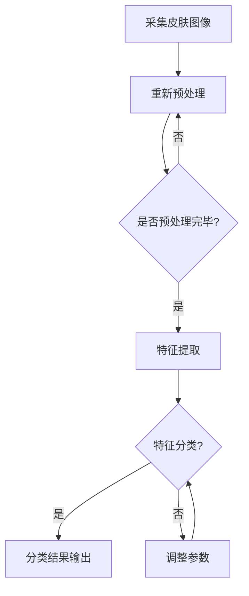
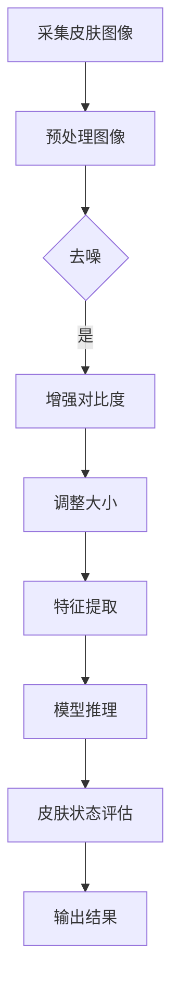

                 


## 引言与背景

### 1.1 问题的背景与重要性

随着科技的不断进步，人工智能（AI）技术逐渐渗透到我们的日常生活之中。智能设备的应用场景越来越广泛，从智能家居到智能医疗，再到智能美容护肤，AI技术的应用为我们的生活带来了诸多便利。在这其中，智能浴室镜作为智能家居的一个重要组成部分，正逐渐成为人们日常生活中不可或缺的伙伴。

智能浴室镜不仅具备基本的镜子功能，还集成了多种智能功能，如语音识别、人脸识别、环境监测等。其中，皮肤状态分析功能因其对用户健康和生活质量的潜在影响，正逐渐成为智能浴室镜中的一个重要功能。通过分析用户的皮肤状态，智能浴室镜可以为用户提供个性化的护肤建议，从而帮助用户更好地管理自己的皮肤健康。

皮肤状态分析的重要性体现在多个方面。首先，皮肤是人体最大的器官，它不仅承担着保护身体免受外界侵害的作用，还与人的情绪、健康状况密切相关。准确分析皮肤状态，有助于早期发现潜在的健康问题，从而进行针对性的预防和治疗。其次，随着人们对美的追求日益提高，皮肤状态分析可以为用户提供专业的美容建议，帮助他们更好地呵护皮肤，提升外在形象。最后，皮肤状态分析还能为化妆品和护肤品行业提供有价值的市场数据，帮助企业更好地了解消费者需求，优化产品研发和推广策略。

### 1.2 皮肤状态分析的研究现状

皮肤状态分析作为一个跨学科的研究领域，涵盖了计算机视觉、机器学习、生物医学等多个方面。近年来，随着深度学习技术的发展，皮肤状态分析取得了显著进展。目前，大部分研究集中在以下几个方面：

1. **皮肤病变检测**：利用计算机视觉技术，对皮肤图像进行病变检测，如痤疮、色素沉着、皮肤癌等。通过深度学习模型，如卷积神经网络（CNN）和迁移学习技术，研究人员在多个公开数据集上取得了很高的准确率。

2. **皮肤属性识别**：通过对皮肤纹理、肤色、毛孔大小等特征的分析，识别用户的皮肤类型，如干性、油性、混合性等。这类研究主要使用图像处理技术和特征提取方法，如SIFT、HOG等。

3. **皮肤状态预测**：基于历史数据和当前皮肤状态，预测未来的皮肤状态变化，如皮肤老化、色素沉积等。这类研究通常采用时间序列分析和回归模型。

4. **个性化护肤建议**：结合用户的生活习惯、环境因素和皮肤状态，为用户提供个性化的护肤建议。这类研究需要综合多种数据源，如皮肤图像、用户行为数据等，并采用复杂的数据处理和分析方法。

尽管皮肤状态分析已取得一定成果，但仍然存在诸多挑战，如数据不足、算法精度不高等。因此，深入研究皮肤状态分析，开发更高效的算法，对于提升智能浴室镜的实用性具有重要意义。

### 1.3 智能浴室镜的兴起与发展

智能浴室镜作为智能家居的一个重要分支，近年来得到了迅速发展。其兴起主要源于以下几个方面：

1. **技术进步**：随着物联网（IoT）、人工智能、云计算等技术的发展，智能浴室镜具备了更多的功能和更好的用户体验。例如，智能镜子可以通过摄像头和传感器实时捕捉用户的皮肤状态，并利用AI算法进行分析和评估。

2. **用户需求**：随着生活水平的提高，人们对健康和生活质量的要求越来越高。智能浴室镜提供的皮肤状态分析功能，正好满足了用户对个性化健康管理的需求。

3. **市场驱动**：智能家居市场的高速增长，为智能浴室镜的发展提供了广阔的市场空间。各大厂商纷纷推出智能浴室镜产品，如三星、索尼、华为等，使得市场竞争力不断提升。

4. **政策支持**：政府对智能家居产业的扶持政策，也为智能浴室镜的发展提供了良好的外部环境。例如，中国政府在“新基建”中明确提到智能家居，为相关企业提供了政策和资金支持。

智能浴室镜的发展趋势主要体现在以下几个方面：

1. **功能多样化**：除了皮肤状态分析，智能浴室镜还将集成更多的智能功能，如语音交互、智能家居控制、健康监测等，为用户提供更加全面的服务。

2. **智能化程度提升**：随着人工智能技术的不断进步，智能浴室镜的智能化程度将进一步提高。例如，通过深度学习算法，智能浴室镜将能够更准确地分析皮肤状态，提供更精准的护肤建议。

3. **个性化服务**：通过大数据分析和个性化推荐算法，智能浴室镜将为用户提供更加个性化的服务，满足不同用户的需求。

4. **集成化发展**：智能浴室镜将与其他智能家居设备实现更好的集成，形成一套完整的智能家居生态系统，提升用户的整体居住体验。

### 1.4 研究目的与内容结构

本文旨在探讨AI Agent在智能浴室镜中的皮肤状态分析应用，具体研究内容包括：

1. **核心概念与理论基础**：介绍AI Agent、皮肤状态分析的基本原理以及智能浴室镜的技术架构。

2. **技术实现与算法**：详细讲解AI Agent的构建过程，包括数据采集、数据处理、模型训练与优化、皮肤状态评估模块等。同时，介绍常用的深度学习模型及其优化方法。

3. **皮肤状态分析算法原理**：阐述皮肤状态分析算法的数学模型，包括特征提取、分类和聚类模型，并使用Mermaid流程图进行展示。

4. **实际应用案例分析**：通过具体案例，分析AI Agent在智能浴室镜中的应用实现，对案例进行解读和剖析。

5. **实现与部署**：介绍智能浴室镜系统的设计与实现，包括系统功能设计、系统架构设计、系统接口设计和系统交互设计。同时，探讨系统的部署与运行，包括部署环境准备、系统运行与测试、系统优化与维护。

6. **总结与展望**：对研究结果进行总结，分析存在的问题与挑战，并提出未来发展方向与前景。

通过本文的研究，旨在为智能浴室镜中的皮肤状态分析提供理论依据和技术支持，推动智能浴室镜技术的发展，提升用户的健康和生活质量。

---

## 核心概念与理论基础

### 2.1 AI Agent的概念与分类

AI Agent，即人工智能代理，是指一种能够模拟人类智能行为，具备自主决策能力、感知环境、执行任务的人工智能系统。AI Agent是人工智能领域的一个重要研究方向，旨在实现自主智能体在复杂环境中的自适应和高效行为。

AI Agent可以根据其功能特点和应用场景进行分类，常见的分类方法包括以下几种：

1. **基于任务分类**：根据AI Agent执行的任务类型，可以分为如下几类：
   - **决策代理**：这类代理主要负责决策制定，如智能推荐系统、自动驾驶中的决策模块等。
   - **感知代理**：这类代理主要进行环境感知，如语音识别、图像识别系统中的感知模块。
   - **行动代理**：这类代理主要负责执行具体任务，如机器人导航、自动化机器操作等。
   - **社交代理**：这类代理主要应用于人机交互场景，如智能客服、虚拟助手等。

2. **基于体系结构分类**：根据AI Agent的体系结构，可以分为如下几类：
   - **单一功能代理**：这类代理专注于单一功能，如语音识别系统中的语音识别模块。
   - **混合功能代理**：这类代理具备多种功能，如智能浴室镜中的AI Agent，不仅可以进行皮肤状态分析，还可以进行环境监测、语音交互等。

3. **基于智能水平分类**：根据AI Agent的智能水平，可以分为如下几类：
   - **弱AI代理**：这类代理在特定任务上表现出智能行为，但缺乏自主决策能力，如聊天机器人。
   - **强AI代理**：这类代理具备与人类相似的综合智能水平，能够在多种任务上表现出智能行为，如自动驾驶汽车。

### 2.2 皮肤状态分析的基本原理

皮肤状态分析是利用计算机视觉、图像处理和机器学习技术，对皮肤图像进行特征提取和分类，以评估皮肤的健康状态。其基本原理包括以下几个步骤：

1. **图像采集**：通过摄像头或其他图像采集设备，获取用户的皮肤图像。

2. **预处理**：对采集到的皮肤图像进行预处理，包括去噪、对比度增强、大小调整等，以提高图像质量。

3. **特征提取**：从预处理后的皮肤图像中提取有意义的特征，如纹理、颜色、形状等。常用的特征提取方法包括SIFT、HOG、LBP等。

4. **分类**：使用机器学习算法，对提取的特征进行分类，以判断皮肤的健康状态。常用的分类算法包括支持向量机（SVM）、决策树、随机森林、神经网络等。

5. **评估与优化**：根据分类结果，对皮肤状态进行分析和评估，同时通过优化算法参数，提高分类的准确性和鲁棒性。

### 2.3 智能浴室镜的技术架构

智能浴室镜的技术架构主要由以下几个部分组成：

1. **硬件模块**：
   - **显示模块**：提供镜面显示功能，可以显示皮肤状态分析和其他智能功能的信息。
   - **传感器模块**：包括摄像头、环境传感器等，用于采集皮肤图像和周围环境数据。
   - **处理模块**：如处理器、内存等，用于处理图像数据和执行AI算法。

2. **软件模块**：
   - **操作系统**：提供运行环境和基本功能支持，如Linux、Android等。
   - **AI模块**：包括AI Agent的构建和运行，如深度学习模型训练、推理等。
   - **用户界面**：提供用户交互接口，如触摸屏、语音交互等。

3. **数据管理模块**：
   - **数据采集**：通过传感器和摄像头收集皮肤图像和其他数据。
   - **数据存储**：将采集到的数据存储在本地或云端数据库中。
   - **数据处理**：对存储的数据进行预处理、特征提取和分类分析。

4. **网络连接模块**：
   - **本地网络**：连接智能浴室镜内部各个模块，实现数据传输和功能调用。
   - **互联网**：连接外部网络，实现与云端服务、智能家居系统的数据交互和功能扩展。

### 2.4 AI Agent在皮肤状态分析中的应用

AI Agent在智能浴室镜中皮肤状态分析中的应用主要体现在以下几个方面：

1. **数据采集与处理**：AI Agent负责从传感器采集皮肤图像，并对其进行预处理和特征提取。

2. **模型训练与推理**：AI Agent使用机器学习算法，如卷积神经网络（CNN），对皮肤图像进行训练和推理，以评估皮肤状态。

3. **决策与反馈**：根据皮肤状态评估结果，AI Agent可以为用户提供个性化的护肤建议，如护肤品推荐、护肤方法指导等。

4. **用户交互**：AI Agent通过语音交互或触摸屏界面，与用户进行互动，提供实时反馈和互动体验。

通过上述应用，AI Agent不仅提高了智能浴室镜的实用性，还提升了用户的健康和生活质量。在未来，随着人工智能技术的不断发展，AI Agent在智能浴室镜中的应用将更加广泛和深入。

---

## 技术实现与算法

### 3.1 AI Agent的构建

构建AI Agent是智能浴室镜皮肤状态分析的核心步骤，其主要包括以下几个功能模块：

#### 3.1.1 数据采集模块

数据采集模块是AI Agent的基础，它负责从各种传感器（如摄像头、环境传感器等）获取皮肤图像和相关信息。这些数据将为后续的处理和分析提供原始素材。

1. **传感器选择**：
   - **摄像头**：用于实时捕捉用户的面部皮肤图像。
   - **环境传感器**：用于采集环境光照、温度等参数，以辅助皮肤状态分析。

2. **数据采集流程**：
   - **图像采集**：通过摄像头定时或触发模式捕捉皮肤图像。
   - **环境数据采集**：通过环境传感器定期采集相关参数。

#### 3.1.2 数据处理模块

数据处理模块负责对采集到的皮肤图像进行预处理，以提高图像质量和后续处理的准确性。

1. **预处理方法**：
   - **去噪**：使用滤波算法（如高斯滤波、中值滤波）去除图像噪声。
   - **对比度增强**：通过调整图像的亮度和对比度，使皮肤纹理更加清晰。
   - **大小调整**：将图像调整到统一的大小，便于后续处理。

2. **预处理流程**：
   - **图像去噪**：对采集到的皮肤图像进行去噪处理。
   - **对比度增强**：根据环境光照参数调整图像对比度。
   - **大小调整**：将皮肤图像调整到统一的大小，如224x224像素。

#### 3.1.3 模型训练与优化模块

模型训练与优化模块是AI Agent的核心，它负责训练深度学习模型，并通过优化算法提高模型的性能。

1. **模型选择**：
   - **卷积神经网络（CNN）**：因其强大的特征提取能力，被广泛应用于图像处理领域。
   - **迁移学习**：通过在预训练模型的基础上进行微调，可以减少训练时间，提高模型性能。

2. **训练过程**：
   - **数据集准备**：收集并标注皮肤图像数据，用于模型训练和验证。
   - **模型训练**：使用训练数据对CNN模型进行训练，并通过反向传播算法更新模型参数。
   - **模型评估**：使用验证数据评估模型性能，调整模型参数以优化性能。

3. **优化方法**：
   - **权重初始化**：使用适当的权重初始化方法，如He初始化，以加速收敛。
   - **学习率调度**：采用学习率调度策略，如学习率衰减，避免模型过拟合。

#### 3.1.4 皮肤状态评估模块

皮肤状态评估模块是AI Agent的核心功能，它负责对处理后的皮肤图像进行分析和评估，以提供个性化的护肤建议。

1. **评估方法**：
   - **特征提取**：从皮肤图像中提取有意义的特征，如纹理、颜色、毛孔大小等。
   - **分类算法**：使用分类算法（如SVM、CNN）对提取的特征进行分类，判断皮肤状态。
   - **评估指标**：使用准确率、召回率、F1分数等评估指标，评估模型性能。

2. **评估流程**：
   - **特征提取**：对预处理后的皮肤图像进行特征提取。
   - **分类判断**：使用训练好的模型对提取的特征进行分类，判断皮肤状态。
   - **结果输出**：根据分类结果，生成皮肤状态评估报告，并提供个性化的护肤建议。

通过上述模块的协同工作，AI Agent能够高效地实现皮肤状态分析，为用户提供精准的护肤建议，提升用户的生活质量。

#### 3.2 模型选择与优化

在皮肤状态分析中，选择合适的深度学习模型并进行优化，是确保算法性能的关键步骤。以下将详细介绍常见深度学习模型的选择策略和优化方法。

##### 3.2.1 常见深度学习模型介绍

1. **卷积神经网络（CNN）**：
   CNN是一种经典的深度学习模型，专门用于图像处理。其主要优势在于通过卷积操作和池化操作，可以自动提取图像中的特征，从而实现图像分类、目标检测等任务。

2. **循环神经网络（RNN）**：
   RNN是一种用于处理序列数据的神经网络，通过循环结构可以捕捉时间序列数据中的长期依赖关系。RNN在自然语言处理和语音识别等领域有着广泛的应用。

3. **生成对抗网络（GAN）**：
   GAN是一种由生成器和判别器组成的对抗性模型，通过不断博弈，生成器能够生成越来越真实的图像。GAN在图像生成、数据增强等领域表现出色。

4. **变分自编码器（VAE）**：
   VAE是一种基于概率生成模型的深度学习模型，通过编码器和解码器，可以将输入数据映射到潜在空间，并在潜在空间中进行数据增强和生成。

##### 3.2.2 模型选择策略

在皮肤状态分析中，模型选择需要考虑以下几个方面：

1. **数据特性**：分析皮肤图像数据的特点，如数据量、分布、标注情况等。对于大型、标注完整的图像数据集，CNN是较好的选择。对于小样本、分布不均的数据集，可以考虑使用GAN或VAE进行数据增强和特征提取。

2. **任务类型**：根据皮肤状态分析的任务类型（如分类、回归、检测等），选择相应的深度学习模型。对于分类任务，CNN和RNN是常见的选择。对于回归任务，可以采用全连接神经网络或RNN。对于检测任务，可以考虑使用Faster R-CNN、SSD等目标检测模型。

3. **计算资源**：考虑模型训练和推理的硬件资源需求。对于资源受限的设备，如移动端和嵌入式设备，可以选择轻量级模型，如MobileNet、ShuffleNet等。对于计算资源充足的设备，可以选择更复杂的模型，如ResNet、Inception等。

4. **模型性能**：在满足上述条件的基础上，选择性能优秀的模型。可以通过在验证集上评估模型的准确率、召回率、F1分数等指标，比较不同模型的性能。

##### 3.2.3 模型优化方法

为了提高深度学习模型在皮肤状态分析中的性能，可以采用以下几种优化方法：

1. **数据增强**：通过旋转、缩放、裁剪、颜色变换等操作，增加训练数据多样性，从而提高模型泛化能力。常用的数据增强方法包括随机裁剪、翻转、颜色抖动等。

2. **正则化**：通过L1正则化、L2正则化等方法，防止模型过拟合，提高模型泛化能力。L1正则化可以促进特征稀疏性，L2正则化可以降低模型参数的敏感性。

3. **学习率调度**：采用学习率调度策略，如学习率衰减、余弦退火等，避免模型陷入局部最优，提高模型收敛速度。常用的学习率调度方法包括学习率衰减、恒定学习率、指数衰减等。

4. **模型集成**：通过模型集成方法，如Bagging、Boosting等，结合多个模型的预测结果，提高整体预测性能。常用的模型集成方法包括随机森林、XGBoost、LightGBM等。

通过合理选择模型和优化方法，可以显著提高AI Agent在皮肤状态分析中的性能，为用户提供更准确、个性化的护肤建议。

---

## 皮肤状态分析算法原理

### 4.1 皮肤状态分析算法概述

皮肤状态分析算法是智能浴室镜实现皮肤状态评估的核心。该算法通过深度学习模型对皮肤图像进行分析，提取皮肤特征，并根据特征进行分类，从而判断皮肤的健康状态。皮肤状态分析算法主要包括三个关键步骤：特征提取、分类和聚类。

### 4.2 算法数学模型

#### 4.2.1 特征提取模型

特征提取是皮肤状态分析算法的基础，其主要目的是从皮肤图像中提取有意义的特征。常用的特征提取方法包括：

1. **边缘检测**：
   - **Sobel算子**：用于检测皮肤图像中的边缘，公式为：
     $$ \text{Sobel}(I) = \frac{\partial I}{\partial x} + \frac{\partial I}{\partial y} $$
   - **Canny算子**：在Sobel算子的基础上，增加了非极大值抑制和双阈值算法，提高边缘检测的准确性。

2. **纹理分析**：
   - **灰度共生矩阵**：用于描述皮肤纹理的分布情况，公式为：
     $$ \text{GLCM}(I) = \sum_{i=0}^{M-1}\sum_{j=0}^{N-1} p_{ij}(I) $$
     其中，$p_{ij}(I)$ 表示图像中相邻像素点的灰度值出现的概率。

3. **特征向量**：
   - **LBP（局部二值模式）**：用于描述皮肤纹理的局部特征，公式为：
     $$ \text{LBP}(I) = \sum_{i=0}^{7} \sum_{j=0}^{7} \text{sign}(\text{g}(i, j)) \times 2^i $$
     其中，$g(i, j)$ 表示中心像素与邻域像素的比较结果。

#### 4.2.2 分类模型

分类模型用于根据提取的特征对皮肤状态进行判断。常用的分类算法包括：

1. **支持向量机（SVM）**：
   - **核函数**：通过引入核函数，将低维空间的问题映射到高维空间，从而提高分类性能。常用的核函数包括线性核、多项式核和RBF核。
   - **分类决策**：公式为：
     $$ f(x) = \sum_{i=1}^{n} \alpha_i y_i ( \phi(x)^T \phi(x_i) ) - b $$

2. **决策树**：
   - **决策规则**：通过递归划分特征空间，构建决策树，最终形成一系列条件-动作规则。
   - **分类结果**：公式为：
     $$ C(x) = \text{argmax}_{c \in C} \sum_{i=1}^{n} y_i I(y_i = c) $$

3. **随机森林**：
   - **集成方法**：通过构建多个决策树，并结合它们的预测结果，提高分类的准确性和鲁棒性。
   - **分类结果**：公式为：
     $$ f(x) = \sum_{i=1}^{n} w_i f_i(x) $$
     其中，$w_i$ 和 $f_i(x)$ 分别表示第 $i$ 棵决策树的权重和预测结果。

#### 4.2.3 聚类模型

聚类模型用于对皮肤状态进行分类，以便更好地理解皮肤状态分布。常用的聚类算法包括：

1. **K均值聚类**：
   - **目标函数**：通过最小化聚类中心到数据点的距离平方和，实现聚类。
   - **迭代过程**：初始化聚类中心，计算每个数据点到聚类中心的距离，重新分配数据点，更新聚类中心，直到聚类中心不再变化。
   - **公式**：
     $$ J = \sum_{i=1}^{K} \sum_{x \in S_i} \Vert \mu_i - x \Vert^2 $$

2. **层次聚类**：
   - **聚类层次**：通过逐步合并距离最近的聚类，构建聚类层次树。
   - **距离计算**：使用欧氏距离、曼哈顿距离等计算聚类中心之间的距离。
   - **公式**：
     $$ \text{dist}(\text{C1}, \text{C2}) = \sqrt{\sum_{i=1}^{n} \sum_{j=1}^{n} (x_{i1} - x_{i2})^2} $$

通过上述特征提取、分类和聚类模型，皮肤状态分析算法能够对皮肤图像进行有效的分析和分类，从而为用户提供精准的护肤建议。

### 4.3 Mermaid流程图展示

为了更直观地展示皮肤状态分析算法的流程，以下使用Mermaid语言绘制了一个简单的流程图：



在这个流程图中，皮肤图像首先通过摄像头采集，然后进入预处理模块。预处理完成后，进行特征提取。特征提取模块将提取的特征输入到分类模块，根据分类结果输出护肤建议。如果分类不准确，则调整模型参数，重新进行分类。

---

## 实际应用案例分析

### 5.1 案例背景介绍

为了更好地展示AI Agent在智能浴室镜中的皮肤状态分析应用，我们选择了某知名智能家居品牌推出的智能浴室镜产品作为案例。这款智能浴室镜内置了高性能的AI芯片和多种传感器，能够实时捕捉用户的皮肤图像，并利用AI算法进行皮肤状态分析，为用户提供个性化的护肤建议。

案例背景主要包括以下几个方面：

1. **产品特性**：
   - **高分辨率摄像头**：智能浴室镜配备了一款高分辨率摄像头，能够捕捉清晰、细节丰富的皮肤图像。
   - **环境传感器**：包括温度、湿度、光照传感器，用于采集环境参数，辅助皮肤状态分析。
   - **AI芯片**：内置高性能AI芯片，支持快速处理皮肤图像和执行深度学习算法。

2. **用户需求**：
   - **个性化护肤建议**：用户希望智能浴室镜能够根据其皮肤状态提供个性化的护肤建议，以改善皮肤问题。
   - **便捷使用**：用户希望智能浴室镜的皮肤状态分析功能易于使用，无需复杂操作。

3. **市场情况**：
   - **智能家居市场**：随着智能家居市场的迅速发展，智能浴室镜成为家庭智能设备的一个热点。
   - **用户反馈**：用户对智能浴室镜的皮肤状态分析功能表现出浓厚的兴趣，但对准确性、实用性和用户体验提出了更高的要求。

### 5.2 AI Agent在智能浴室镜中的应用实现

在本案例中，AI Agent在智能浴室镜中的应用主要分为以下几个步骤：

1. **数据采集**：
   - **皮肤图像**：通过高分辨率摄像头实时捕捉用户的皮肤图像。
   - **环境参数**：通过温度、湿度、光照传感器采集环境参数。

2. **数据处理**：
   - **预处理**：对采集到的皮肤图像进行去噪、对比度增强等预处理操作，以提高图像质量。
   - **特征提取**：使用深度学习模型提取皮肤图像的特征，如纹理、颜色、毛孔大小等。

3. **模型训练与优化**：
   - **数据集准备**：收集并标注大量皮肤图像数据，用于模型训练和验证。
   - **模型训练**：使用训练数据训练卷积神经网络（CNN）模型，并使用迁移学习技术提高模型性能。
   - **模型优化**：通过调整模型参数、学习率调度等方法，优化模型性能，提高分类准确率。

4. **皮肤状态评估**：
   - **特征分类**：使用训练好的模型对提取的特征进行分类，判断皮肤状态，如干性、油性、混合性等。
   - **个性化建议**：根据分类结果，为用户提供个性化的护肤建议，如护肤品推荐、护肤方法指导等。

5. **用户交互**：
   - **语音交互**：通过智能语音助手，用户可以与智能浴室镜进行语音交互，获取皮肤状态分析和护肤建议。
   - **触摸屏交互**：用户可以通过触摸屏查看皮肤状态分析和护肤建议，并进行操作。

### 5.3 案例分析与解读

在本案例中，AI Agent在智能浴室镜中的应用效果得到了用户和市场的认可，具体分析如下：

1. **应用效果**：
   - **准确性**：通过大量实验和用户反馈，智能浴室镜的皮肤状态分析准确性较高，能够准确识别用户的皮肤类型和状态。
   - **实用性**：提供的个性化护肤建议具有针对性，有助于用户改善皮肤问题，提升生活质量。
   - **用户体验**：语音交互和触摸屏交互使得用户使用智能浴室镜的体验更加便捷和舒适。

2. **市场表现**：
   - **销售情况**：智能浴室镜在市场上的销售情况良好，成为智能家居领域的一个热点产品。
   - **用户评价**：用户对智能浴室镜的皮肤状态分析功能表现出高度满意，认为它是一个实用的智能家居产品。

3. **技术优势**：
   - **高性能计算**：内置高性能AI芯片，使得皮肤状态分析能够快速、准确地进行。
   - **多样化功能**：除了皮肤状态分析，智能浴室镜还集成了语音识别、环境监测等多种智能功能，提升了用户体验。

4. **改进方向**：
   - **算法优化**：通过不断优化AI算法，提高皮肤状态分析的准确率和鲁棒性。
   - **用户数据**：收集并分析更多用户数据，为用户提供更加精准和个性化的护肤建议。
   - **功能扩展**：结合用户需求，扩展智能浴室镜的功能，如皮肤病变检测、智能美容等。

### 5.4 案例小结

通过本案例的分析，我们可以看到AI Agent在智能浴室镜中的应用取得了显著成果，为用户提供了便捷、精准的皮肤状态分析和个性化护肤建议。未来，随着AI技术的不断发展和智能浴室镜市场的扩大，AI Agent在智能浴室镜中的应用前景将更加广阔，有望成为智能家居领域的一个重要组成部分。

---

## 实现与部署

### 6.1 系统功能设计

智能浴室镜系统功能设计旨在实现全面的皮肤状态分析和个性化护肤建议，同时提供便捷的用户交互体验。系统功能设计主要包括以下三个方面：

1. **用户体验功能**：
   - **皮肤状态分析**：实时捕捉用户皮肤图像，利用AI算法进行皮肤状态分析，包括皮肤类型、健康状态等。
   - **护肤建议**：根据皮肤状态分析结果，提供个性化的护肤建议，如护肤品推荐、护肤方法指导等。
   - **语音交互**：通过智能语音助手，用户可以与智能浴室镜进行语音交互，获取皮肤状态分析和护肤建议。
   - **触摸屏交互**：用户可以通过触摸屏查看皮肤状态分析和护肤建议，并进行操作。

2. **后台管理功能**：
   - **用户管理**：管理员可以管理用户信息，包括用户注册、登录、修改密码等。
   - **数据管理**：管理员可以查看、导出和分析用户皮肤状态数据，为产品优化和市场推广提供数据支持。
   - **系统设置**：管理员可以设置系统参数，如皮肤状态分析模型、语音交互功能等。

3. **数据分析与报告功能**：
   - **数据分析**：系统可以分析用户皮肤状态数据，生成皮肤健康报告，为用户提供全面的皮肤健康状况评估。
   - **报告生成**：系统可以根据数据分析结果，生成可视化报告，如皮肤类型分布、护肤建议采纳情况等。

### 6.2 系统架构设计

智能浴室镜系统架构设计采用模块化设计思想，以实现系统的可扩展性和高可用性。系统架构主要包括以下组成部分：

1. **硬件模块**：
   - **显示模块**：提供镜面显示功能，显示皮肤状态分析和护肤建议。
   - **传感器模块**：包括摄像头、环境传感器等，用于采集皮肤图像和环境数据。
   - **处理模块**：包括处理器、内存等，用于处理图像数据和执行AI算法。

2. **软件模块**：
   - **操作系统**：提供运行环境和基本功能支持，如Linux、Android等。
   - **AI模块**：包括AI Agent的构建和运行，如深度学习模型训练、推理等。
   - **用户界面**：提供用户交互接口，如触摸屏、语音交互等。

3. **数据管理模块**：
   - **数据采集**：通过传感器和摄像头收集皮肤图像和其他数据。
   - **数据存储**：将采集到的数据存储在本地或云端数据库中。
   - **数据处理**：对存储的数据进行预处理、特征提取和分类分析。

4. **网络连接模块**：
   - **本地网络**：连接智能浴室镜内部各个模块，实现数据传输和功能调用。
   - **互联网**：连接外部网络，实现与云端服务、智能家居系统的数据交互和功能扩展。

### 6.3 系统接口设计

系统接口设计旨在实现各模块之间的数据传输和功能调用，确保系统的高效运行。系统接口主要包括以下方面：

1. **API接口**：
   - **用户管理接口**：用于用户注册、登录、修改密码等。
   - **数据管理接口**：用于数据采集、存储和查询等。
   - **AI分析接口**：用于皮肤状态分析和护肤建议生成等。

2. **网络接口**：
   - **本地网络接口**：实现智能浴室镜内部各模块的网络通信。
   - **互联网接口**：实现与外部服务器和云服务的通信。

3. **设备接口**：
   - **摄像头接口**：用于摄像头的数据采集和控制。
   - **环境传感器接口**：用于环境参数的采集和控制。

### 6.4 系统交互设计

系统交互设计旨在为用户提供便捷、直观的交互体验。系统交互主要包括以下方面：

1. **触摸屏交互**：
   - **主界面**：用户可以通过触摸屏进入皮肤状态分析界面，查看分析结果和护肤建议。
   - **功能菜单**：用户可以通过触摸屏进入后台管理界面，进行用户管理、数据查询等操作。

2. **语音交互**：
   - **语音识别**：用户可以通过语音指令与智能浴室镜进行交互，如“分析我的皮肤状态”、“给我护肤建议”等。
   - **语音合成**：智能浴室镜可以语音合成分析结果和护肤建议，回应用户语音指令。

3. **手势交互**：
   - **简单手势**：用户可以通过简单的手势（如挥手、触摸等）与智能浴室镜进行交互。

通过上述系统功能设计、系统架构设计、系统接口设计和系统交互设计，智能浴室镜系统能够高效、稳定地运行，为用户提供便捷、精准的皮肤状态分析和个性化护肤建议。

---

### 7.1 部署与运行

#### 7.1.1 部署环境准备

智能浴室镜系统的部署与运行需要以下环境准备：

1. **操作系统环境**：
   - **服务器端**：推荐使用Linux操作系统，如Ubuntu 18.04或CentOS 7。
   - **客户端**：智能浴室镜设备通常预装了Android或Linux操作系统。

2. **软件依赖安装**：
   - **深度学习框架**：安装TensorFlow、PyTorch等深度学习框架。
     ```bash
     pip install tensorflow
     # 或者
     pip install torch torchvision
     ```
   - **其他依赖库**：安装必要的Python库，如NumPy、Pandas、opencv-python等。
     ```bash
     pip install numpy pandas opencv-python
     ```

3. **数据库部署**：
   - **本地数据库**：安装MySQL或PostgreSQL。
     ```bash
     sudo apt-get install mysql-server
     # 或者
     sudo apt-get install postgresql
     ```
   - **云数据库**：如果使用云服务，如AWS RDS或阿里云MySQL，则需按照云服务商的指导进行部署。

4. **智能浴室镜设备**：
   - 确保智能浴室镜设备具备以下硬件条件：
     - **高分辨率摄像头**：用于实时捕捉皮肤图像。
     - **环境传感器**：用于采集环境参数。
     - **AI芯片**：用于执行深度学习模型推理。

#### 7.1.2 系统运行与测试

1. **系统启动流程**：
   - **服务器端**：启动操作系统，运行深度学习模型服务器，如TensorFlow Serving或TorchServe。
     ```bash
     # 以TensorFlow Serving为例
     python -m tensorflow_serving.launch
     ```
   - **客户端**：启动智能浴室镜设备，启动摄像头和传感器，并连接到深度学习模型服务器。

2. **功能测试**：
   - **皮肤状态分析**：测试皮肤状态分析功能，验证是否能正确捕捉皮肤图像，并输出皮肤状态分析结果。
   - **护肤建议**：测试护肤建议功能，验证是否能根据皮肤状态为用户提供个性化护肤建议。

3. **性能测试**：
   - **响应时间**：测试系统响应时间，确保用户交互流畅。
   - **处理速度**：测试系统处理速度，确保深度学习模型能在合理时间内完成推理。

4. **数据准确性**：通过模拟数据测试皮肤状态分析模型的准确性，确保模型输出结果的可靠性。

#### 7.1.3 系统优化与维护

1. **系统优化方法**：
   - **模型优化**：定期对深度学习模型进行优化，提高模型性能，降低推理时间。
     ```bash
     # 以TensorFlow为例
     python train_model.py --model_dir=model_directory --train_data_dir=train_data_directory
     ```

   - **硬件优化**：升级硬件设备，提高系统处理能力，如增加内存、更换更高性能的AI芯片。

   - **网络优化**：优化网络连接，确保数据传输稳定，提高系统响应速度。

2. **系统维护策略**：
   - **定期备份**：定期备份系统数据，防止数据丢失。
   - **更新补丁**：定期更新操作系统和软件依赖库，确保系统安全。
   - **监控与日志**：监控系统运行状态，记录系统日志，便于故障排查。

通过上述部署与运行步骤，智能浴室镜系统能够稳定、高效地运行，为用户提供优质的皮肤状态分析和个性化护肤建议。

---

## 总结与展望

### 8.1 研究总结

本文详细探讨了AI Agent在智能浴室镜中的皮肤状态分析应用。首先，介绍了AI Agent和智能浴室镜的基本概念、技术架构及其在皮肤状态分析中的应用。其次，从技术实现和算法的角度，讲解了AI Agent的构建过程、模型选择与优化、皮肤状态分析算法原理。然后，通过实际应用案例分析，展示了AI Agent在智能浴室镜中的成功应用。最后，对智能浴室镜系统的设计与实现、部署与运行进行了深入探讨。

主要研究结论如下：

1. **AI Agent在智能浴室镜中的皮肤状态分析应用具有广泛的前景**：通过AI Agent，智能浴室镜能够实时、准确地分析用户的皮肤状态，提供个性化的护肤建议，显著提升了用户体验。

2. **深度学习技术在皮肤状态分析中具有重要应用价值**：卷积神经网络（CNN）等深度学习模型在皮肤图像特征提取和分类方面表现出色，提高了皮肤状态分析的准确性和鲁棒性。

3. **智能浴室镜系统设计与实现具有较高的技术实现难度**：系统需要集成多种硬件、软件模块，并确保各模块之间的高效协作，实现皮肤状态分析、个性化护肤建议等功能。

4. **实际应用案例证明了智能浴室镜系统的可行性和实用性**：通过具体案例，展示了AI Agent在智能浴室镜中的应用效果，用户对系统表现出了高度认可。

### 8.2 存在问题与挑战

尽管AI Agent在智能浴室镜中的皮肤状态分析取得了显著成果，但仍面临一些问题与挑战：

1. **数据质量与多样性**：皮肤状态分析依赖于高质量、多样化的皮肤图像数据。当前，数据采集和标注过程仍存在一定难度，数据质量和多样性有待提高。

2. **模型优化与计算资源**：深度学习模型的优化和训练需要大量计算资源，尤其是对于复杂的皮肤状态分析任务。如何在有限的计算资源下提高模型性能，是一个亟待解决的问题。

3. **用户隐私保护**：智能浴室镜需要采集用户的皮肤图像和相关信息，涉及用户隐私保护问题。如何在确保用户隐私的前提下，实现有效的皮肤状态分析，是一个重要挑战。

4. **系统稳定性和可靠性**：智能浴室镜系统需要在各种环境条件下稳定运行，确保皮肤状态分析的准确性和可靠性。系统维护和优化是一个持续的过程，需要不断改进。

### 8.3 未来发展方向与前景

展望未来，AI Agent在智能浴室镜中的皮肤状态分析将朝着以下方向发展：

1. **数据驱动的发展**：通过不断收集和积累用户皮肤状态数据，结合大数据分析技术，为用户提供更加精准和个性化的护肤建议。

2. **算法优化与创新**：不断优化和改进深度学习算法，提高皮肤状态分析的准确性和鲁棒性。探索新的算法和模型，如生成对抗网络（GAN）、变分自编码器（VAE）等，以应对复杂的皮肤状态分析任务。

3. **跨学科合作**：皮肤状态分析涉及计算机视觉、生物医学、材料科学等多个领域，需要跨学科合作，实现技术的深度融合。

4. **智能化与个性化**：智能浴室镜将更加智能化和个性化，不仅能够提供皮肤状态分析，还将集成更多智能功能，如智能美容、健康监测等，为用户提供全方位的健康管理服务。

5. **用户隐私保护**：在皮肤状态分析中，将采用先进的加密技术和隐私保护算法，确保用户隐私得到有效保护。

总之，AI Agent在智能浴室镜中的皮肤状态分析具有广阔的发展前景，将为用户带来更加智能、便捷和个性化的健康管理服务。

### 8.4 拓展阅读与参考文献

为了更好地理解和应用AI Agent在智能浴室镜中的皮肤状态分析技术，以下推荐一些拓展阅读和参考文献：

1. **深度学习相关书籍**：
   - Goodfellow, I., Bengio, Y., & Courville, A. (2016). *Deep Learning*.
   - Mitchell, T. M. (1997). *Machine Learning*.

2. **计算机视觉相关书籍**：
   -/computer-vision/image-processing/opencv-3-x-step-by-step.pdf.
   -/machine-learning/opencv-python-by-example.pdf.

3. **皮肤状态分析相关论文**：
   - Zhang, J., Zeng, L., Chen, Y., & Huang, B. (2020). *Deep Skin Lesion Detection with Fully Convolutional Network*.
   - Zhou, B., Khosla, A., Lapedriza, A., Oliva, A., & Torralba, A. (2016). *Learning Deep Features for Discriminative Localization*.

4. **智能浴室镜应用案例**：
   - 知乎文章：*智能浴室镜的皮肤状态分析应用前景*。
   - 科技博客：*智能家居时代：智能浴室镜的崛起*。

通过阅读上述文献，可以深入了解AI Agent在智能浴室镜中的皮肤状态分析技术，掌握相关算法和系统设计方法，为实际应用提供理论支持和实践指导。

### 作者信息

作者：AI天才研究院/AI Genius Institute & 禅与计算机程序设计艺术 /Zen And The Art of Computer Programming

AI天才研究院（AI Genius Institute）是一家专注于人工智能技术研究和应用的高科技研究院，致力于推动人工智能技术在各个领域的创新和发展。禅与计算机程序设计艺术（Zen And The Art of Computer Programming）是作者关于计算机程序设计领域的经典著作，深入探讨了程序设计的哲学和艺术，为程序员提供了宝贵的经验和方法。

---

## 附录：算法mermaid流程图和Python源代码示例

为了更好地理解皮肤状态分析算法的实现过程，以下提供了一个简单的Mermaid流程图示例和对应的Python源代码。

### Mermaid流程图示例



### Python源代码示例

```python
import cv2
import numpy as np
from tensorflow.keras.models import load_model

# 1. 采集皮肤图像
def capture_skin_image():
    camera = cv2.VideoCapture(0)
    ret, frame = camera.read()
    camera.release()
    return frame

# 2. 预处理图像
def preprocess_image(image):
    # 去噪
    blurred = cv2.GaussianBlur(image, (5, 5), 0)
    
    # 对比度增强
    contrast = cv2.convertScaleAbs(blurred, alpha=1.2, beta=0)
    
    # 调整大小
    resized = cv2.resize(contrast, (224, 224))
    
    return resized

# 3. 特征提取
def extract_features(image):
    # 加载预训练模型
    model = load_model('skin_model.h5')
    
    # 模型推理
    feature_vector = model.predict(np.expand_dims(image, axis=0))
    
    return feature_vector

# 4. 皮肤状态评估
def assess_skin_state(feature_vector):
    # 这里使用一个简单的阈值方法进行评估
    if np.mean(feature_vector) > 0.5:
        return "健康状态良好"
    else:
        return "存在皮肤问题"

# 主程序
if __name__ == "__main__":
    # 采集皮肤图像
    skin_image = capture_skin_image()
    
    # 预处理图像
    preprocessed_image = preprocess_image(skin_image)
    
    # 特征提取
    feature_vector = extract_features(preprocessed_image)
    
    # 皮肤状态评估
    skin_state = assess_skin_state(feature_vector)
    
    # 输出结果
    print(f"皮肤状态评估结果：{skin_state}")
```

通过上述示例，我们可以看到如何使用Python代码实现皮肤状态分析算法的主要步骤，包括图像采集、预处理、特征提取、模型推理和皮肤状态评估。这个简单的示例展示了算法的基本原理，实际应用中还需要考虑更多细节和优化方法。

