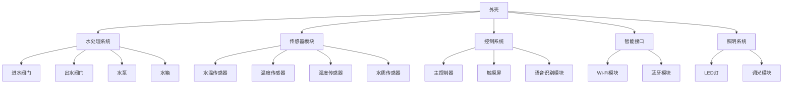
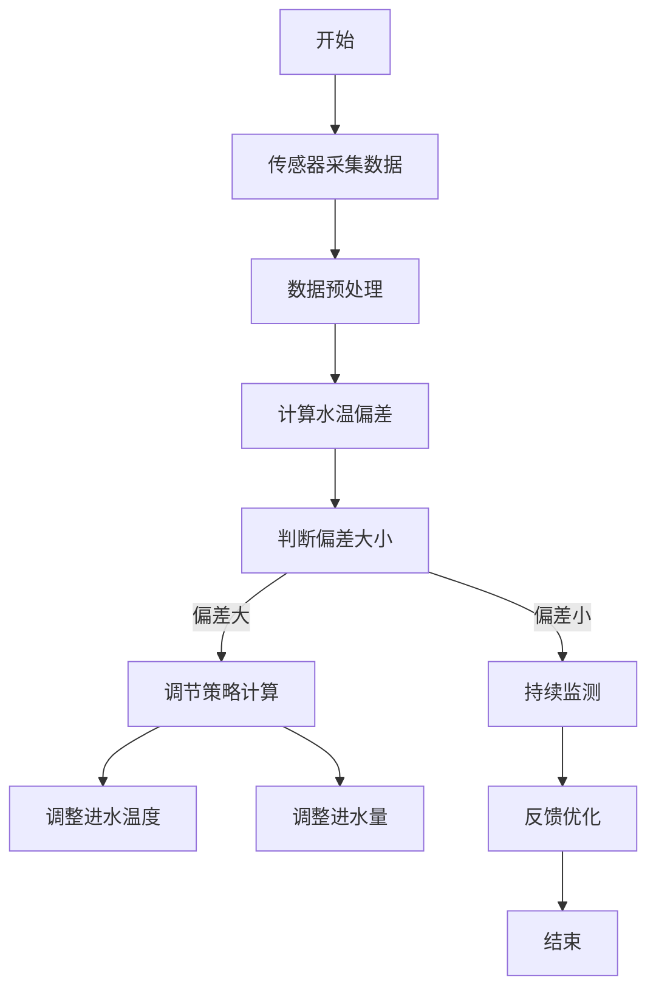
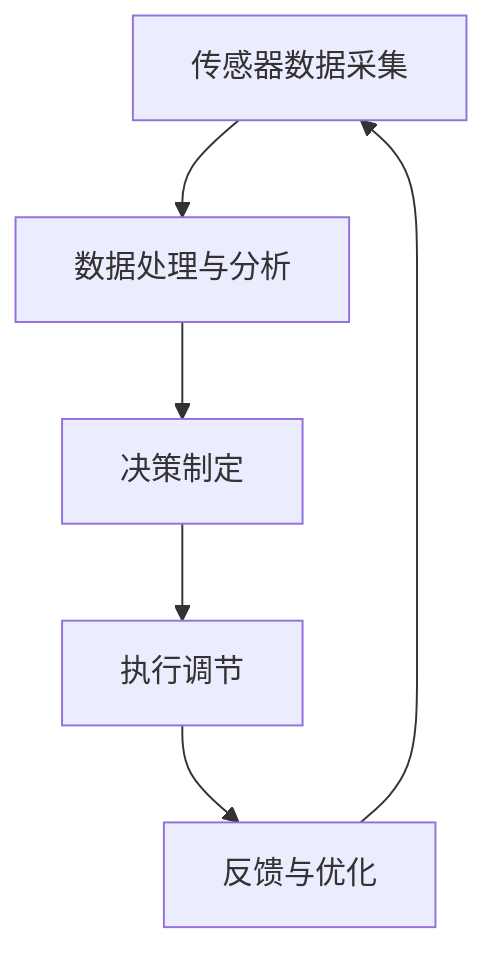
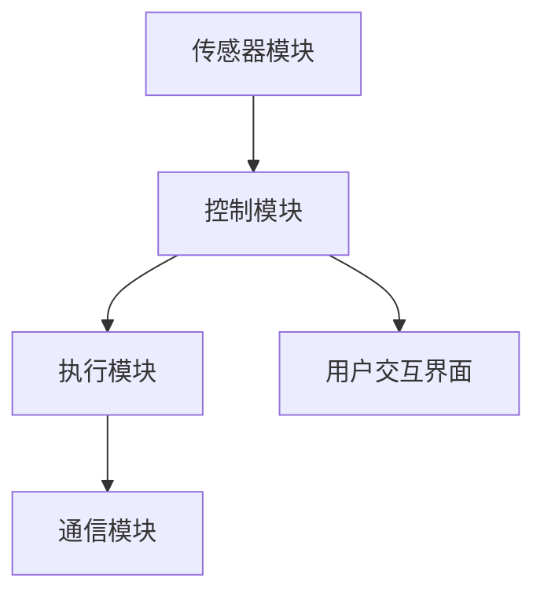
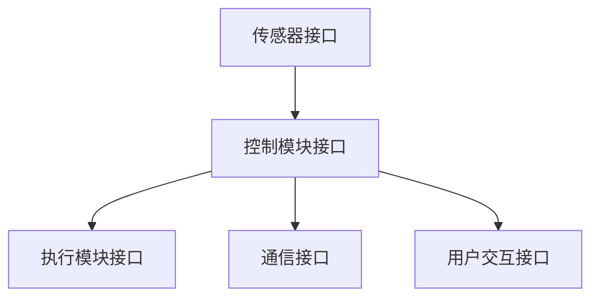
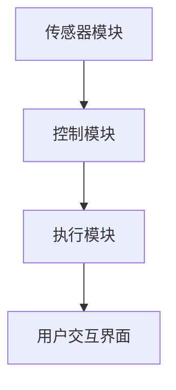

                 

### 第1章: AI Agent简介

#### 1.1 AI Agent的定义与作用

在智能家居系统中，AI Agent（人工智能代理）扮演着至关重要的角色。AI Agent 是一种能够自主学习、自主决策的智能体，它能够对环境进行感知，并根据感知到的信息自主地采取行动。AI Agent 的核心优势在于其自主性，这使得它们能够更加灵活地适应各种复杂的家居环境，提供个性化的服务。

**问题背景：**

随着物联网技术的飞速发展，智能家居市场呈现出快速增长的趋势。用户对于家居设备的需求不再仅仅局限于基础的连接和控制，而是期望获得更加智能化、个性化的体验。这种需求推动了AI Agent技术的发展和应用。

**问题描述：**

那么，AI Agent究竟是什么？它具体在智能家居系统中起到什么作用？AI Agent的适用范围又是如何？

**问题解决：**

AI Agent 是一种具备以下能力的软件模块：

- **感知能力**：能够实时感知家居环境中的各种数据，如温度、湿度、光照等。
- **决策能力**：基于感知到的数据，AI Agent 可以进行决策，调整家居设备的运行状态。
- **行动能力**：根据决策结果，AI Agent 可以控制家居设备执行相应的动作。

在智能家居系统中，AI Agent 的核心作用主要体现在以下几个方面：

- **环境监控**：AI Agent 可以实时监测家居环境，确保环境参数在安全范围内。
- **智能调节**：基于对环境数据的分析，AI Agent 可以智能调节家居设备，如空调、灯光、窗帘等，以提供舒适的家居环境。
- **个性化服务**：AI Agent 可以根据用户的行为习惯和偏好，提供个性化的服务，如自动调整室内温度、播放用户喜欢的音乐等。
- **应急响应**：AI Agent 可以在发生紧急情况时，自动启动应急预案，如检测到一氧化碳浓度过高时自动打开窗户通风。

**边界与外延：**

AI Agent 的适用范围非常广泛，不仅限于智能家居系统，还可以应用于其他领域，如智能工厂、智能交通等。然而，在智能家居系统中，AI Agent 的应用主要集中在以下几个方面：

- **智能家电**：如空调、冰箱、洗衣机等，通过AI Agent 实现自动控制。
- **安防系统**：如监控摄像头、门锁等，通过AI Agent 实现智能监控和报警。
- **健康护理**：如智能床垫、智能血压计等，通过AI Agent 实现健康监测和预警。

#### 1.2 AI Agent的分类与特点

AI Agent 可以根据不同的分类标准进行分类。以下是几种常见的分类方法及其特点：

- **按功能分类**：
  - **监控类**：主要用于环境监控和设备状态监测。
  - **调节类**：主要用于智能调节家居设备，提供舒适的环境。
  - **交互类**：主要用于与用户进行交互，提供个性化服务。
  - **应急类**：主要用于应急响应，如报警、预警等。

- **按控制方式分类**：
  - **基于规则**：根据预设的规则进行决策和控制。
  - **基于学习**：通过学习用户行为和环境数据，进行自主决策和控制。
  - **混合式**：结合规则学习和自主学习，实现更灵活的决策和控制。

**AI Agent的核心特点如下：**

- **自主性**：AI Agent 能够自主感知环境、自主决策、自主行动，无需人工干预。
- **智能化**：AI Agent 能够通过学习和适应，提高决策和控制的准确性。
- **灵活性**：AI Agent 能够根据环境变化和用户需求，灵活调整行为和状态。
- **安全性**：AI Agent 具有较强的鲁棒性，能够在复杂环境中稳定运行。

#### 1.3 AI Agent在智能家居中的应用

AI Agent 在智能家居系统中的应用非常广泛，以下是一些典型的应用场景：

- **智能家电控制**：AI Agent 可以自动控制空调、冰箱、洗衣机等家电设备，根据环境温度和用户需求调整设备运行状态。
- **智能安防系统**：AI Agent 可以实时监控家居环境，如通过摄像头识别异常行为，自动触发报警。
- **智能环境调节**：AI Agent 可以根据室内温度、湿度、光照等参数，自动调节空调、加湿器、灯光等设备，提供舒适的家居环境。
- **智能健康护理**：AI Agent 可以监测用户健康数据，如心率、血压等，提供健康预警和建议。

**AI Agent在智能家居系统中的优势：**

- **提高生活质量**：AI Agent 可以根据用户需求和环境变化，提供个性化的服务，提高用户的生活质量。
- **节省能源**：AI Agent 可以通过智能调节家电设备，实现节能减排，降低能源消耗。
- **降低人力成本**：AI Agent 可以替代部分人工操作，降低人力成本。
- **增强安全性**：AI Agent 可以实时监控家居环境，提高家居安全性。

#### 1.4 AI Agent的挑战与未来发展趋势

尽管AI Agent在智能家居系统中展现出了巨大的潜力，但在实际应用过程中也面临着一些挑战：

- **数据隐私**：AI Agent 需要收集和处理大量的用户数据，如何保护用户隐私成为一个重要问题。
- **安全性**：AI Agent 的自主决策和控制功能可能带来安全风险，如被恶意攻击或误操作。
- **可靠性**：AI Agent 需要能够在各种复杂环境中稳定运行，这对算法和系统的可靠性提出了高要求。
- **复杂性**：智能家居系统涉及多个设备和传感器，如何实现高效、稳定的AI Agent协作成为一大挑战。

**未来发展趋势：**

- **智能化**：随着人工智能技术的不断发展，AI Agent 的智能化程度将不断提高，能够更好地理解和适应用户需求。
- **安全性**：将加强AI Agent的安全性，如采用加密技术保护用户数据，提高系统的抗攻击能力。
- **边缘计算**：将更多的计算任务推向边缘设备，减轻中心服务器的负担，提高系统的实时性和响应速度。
- **人机协同**：AI Agent 将与人类用户更加紧密地协作，提供更加智能、高效的服务。

#### 1.5 小结

本章介绍了AI Agent的定义与作用、分类与特点，以及其在智能家居系统中的应用和未来发展趋势。通过本章的学习，读者可以了解到AI Agent在智能家居系统中的重要地位和潜在优势，同时也认识到其在实际应用过程中面临的挑战。随着人工智能技术的不断进步，AI Agent在智能家居系统中的应用前景将更加广阔。

----------------------------------------------------------------

### 第2章: 智能浴缸概述

#### 2.1 智能浴缸的定义与功能

智能浴缸是一种融合了现代科技与舒适生活的家居设备，它不仅具备传统浴缸的基本功能，还能够根据用户的需求和环境条件进行智能调节。智能浴缸的定义主要包括以下几个方面：

- **智能感知**：通过内置的传感器，如水温传感器、温度传感器、湿度传感器等，实时监测浴缸内部和外部的环境参数。
- **智能调节**：根据用户设定的目标和实际监测到的环境数据，智能调节浴缸内的水温、水量、灯光等参数，以提供最佳的沐浴体验。
- **互动体验**：通过智能接口，如触摸屏、语音助手等，用户可以方便地与智能浴缸进行交互，设定个性化参数，获取实时信息。

**智能浴缸的主要功能包括：**

- **水温调节**：根据用户设定的水温范围，智能浴缸能够自动调节进水温度，确保水温始终保持在用户舒适的范围内。
- **水量控制**：智能浴缸能够根据用户的需求和水温变化自动调节进水量，避免水浪费，同时确保沐浴过程的舒适度。
- **环境照明**：智能浴缸内置多种照明模式，用户可以根据需求调节灯光的亮度和颜色，创造不同的沐浴氛围。
- **语音交互**：通过语音助手，用户可以与智能浴缸进行语音交互，控制浴缸的各项功能，如调节水温、播放音乐等。
- **智能安防**：智能浴缸具备一定的安防功能，如通过摄像头监控浴缸周围环境，实时监测可能的安全隐患。

#### 2.2 智能浴缸的组成与结构

智能浴缸的组成结构主要包括以下几个关键部分：

- **外壳**：智能浴缸的外壳通常采用耐腐蚀、易清洗的材料，如不锈钢或塑料，以提供良好的耐用性和清洁性能。
- **水处理系统**：包括进水阀门、出水阀门、水泵、水箱等组件，负责控制水流的进出和循环。
- **传感器模块**：包括水温传感器、温度传感器、湿度传感器、水质传感器等，用于实时监测浴缸内部和外部的环境参数。
- **控制系统**：包括主控制器、触摸屏、语音识别模块等，负责接收用户输入、处理传感器数据、控制浴缸的各项功能。
- **智能接口**：包括Wi-Fi模块、蓝牙模块等，用于实现与外部设备的连接，如智能手机、智能家居中心等。
- **照明系统**：包括LED灯、调光模块等，用于提供不同氛围的照明效果。

**智能浴缸的结构示意图如下：**



#### 2.3 智能浴缸的技术发展与应用

智能浴缸的技术发展经历了几个重要的阶段：

- **初步阶段**：这一阶段的智能浴缸主要是通过简单的传感器和机械控制实现水温调节和基本的环境监测，如水温传感器和机械阀门的组合。
- **中级阶段**：随着电子技术和传感技术的进步，智能浴缸开始引入更多的传感器，如湿度传感器和水质传感器，同时增加了智能控制器，实现了更精准的水温和环境调节。
- **高级阶段**：随着物联网和人工智能技术的发展，智能浴缸具备了与外部设备连接和交互的能力，如通过Wi-Fi或蓝牙连接到智能手机和智能家居中心，实现了远程控制和语音交互。

**智能浴缸在智能家居中的应用现状：**

- **个性化沐浴体验**：智能浴缸通过用户个性化设置，如温度、水量、灯光模式等，为用户提供了更加舒适的沐浴体验。
- **智能家居中心的一部分**：智能浴缸作为智能家居系统的一部分，与其他家居设备（如智能灯光、智能音响等）相互连接，实现系统化的智能控制。
- **健康监测与预警**：智能浴缸通过传感器监测用户在水中的生理参数，如心率、血压等，为用户提供健康监测和预警服务。

**智能浴缸的未来发展趋势：**

- **智能化程度提升**：随着人工智能技术的进步，智能浴缸的智能化程度将进一步提升，如通过深度学习算法实现更加精准的水温和环境调节。
- **多功能融合**：智能浴缸将与其他智能家居设备融合，提供更加多样化的功能，如按摩、香薰等。
- **个性化服务**：智能浴缸将更加关注用户的个性化需求，通过大数据分析提供个性化的沐浴方案和建议。
- **生态化发展**：智能浴缸将更加注重环保和节能，如通过智能节水系统降低水资源消耗。

#### 2.4 小结

本章介绍了智能浴缸的定义与功能、组成与结构，以及其在智能家居系统中的应用现状和未来发展趋势。通过本章的学习，读者可以了解智能浴缸的基本概念和核心组成部分，认识到其在提升生活质量、提供个性化服务方面的作用，同时也可以预见智能浴缸在未来可能的发展方向。

----------------------------------------------------------------

### 第3章: 水温调节的算法原理

#### 3.1 水温调节的重要性

在水温调节中，算法原理是确保智能浴缸水温稳定在适宜范围内的核心。水温调节不仅关系到用户的沐浴体验，还对用户的健康安全有着重要影响。以下是水温调节的重要性：

- **舒适体验**：适宜的水温可以提供舒适的沐浴体验，改善用户的沐浴感受。
- **健康保障**：过高或过低的水温都可能对用户的皮肤和健康产生不利影响，如水温过低可能导致肌肉紧张，水温过高则可能引起皮肤烫伤。
- **节能环保**：精确的水温调节可以减少能源浪费，提高水资源的利用效率，符合环保理念。

**水温调节在智能浴缸中的核心作用：**

- **实时监测**：通过传感器实时监测浴缸内的水温，确保水温始终处于预设范围内。
- **自动调节**：根据监测数据，智能浴缸能够自动调节进水温度和水量，维持水温的稳定。
- **个性化设置**：用户可以根据个人偏好调整水温，智能浴缸会根据这些设置自动进行调节。

#### 3.2 水温调节的基本原理

水温调节的基本原理基于对水温的实时监测和自动调节。以下是具体的原理：

- **传感器监测**：智能浴缸内部的水温传感器会实时监测水温度，将监测数据传输到控制系统。
- **控制系统处理**：控制系统接收到传感器数据后，与用户设定的水温目标进行比较，计算出水温的偏差。
- **执行调节**：根据水温偏差，控制系统会自动调整进水温度和水量，以使水温达到目标值。

**水温调节的基本步骤：**

1. **传感器采集数据**：水温传感器采集当前水温数据。
2. **数据传输**：采集到的水温数据通过有线或无线方式传输到控制系统。
3. **数据比较**：控制系统将采集到的水温数据与用户设定的水温目标进行比较，计算出水温偏差。
4. **调整进水温度**：若水温低于目标值，控制系统会指令加热装置升温；若水温高于目标值，控制系统会指令冷却装置降温。
5. **调节水量**：若水温偏差较大，控制系统还会通过调节进水量来辅助调节水温，使水温尽快达到目标值。
6. **反馈与优化**：经过多次调节后，控制系统会持续监测水温，并根据实际情况调整调节策略，确保水温稳定在目标范围内。

#### 3.3 水温调节的算法详解

水温调节的算法通常包括以下几个关键部分：

- **传感器数据采集算法**：负责从传感器获取水温数据，并进行初步处理。
- **偏差计算算法**：负责计算当前水温与目标水温的偏差，确定调节方向和强度。
- **调节策略算法**：根据水温偏差和实时监测数据，制定具体的调节策略。
- **反馈优化算法**：负责对调节效果进行评估和优化，以提高水温调节的准确性和稳定性。

以下是水温调节算法的详细描述：

**算法描述：**



**具体算法实现：**

```python
def read水温传感器():
    # 读取水温传感器的数据
    return 水温传感器读取的数值

def 计算水温偏差(setpoint, measured_value):
    # 计算当前水温与目标水温的偏差
    return setpoint - measured_value

def 调节策略计算(deviation):
    # 根据水温偏差计算调节策略
    if deviation > 0.5:
        # 水温过低，增加进水温度
        return {'temp_adjustment': '加热', 'water_adjustment': '适量'}
    elif deviation < -0.5:
        # 水温过高，减少进水温度
        return {'temp_adjustment': '冷却', 'water_adjustment': '适量'}
    else:
        # 水温接近目标值，无需调节
        return {'temp_adjustment': '保持', 'water_adjustment': '保持'}

def 调节水温(temp_adjustment, water_adjustment):
    # 根据调节策略调整水温
    if temp_adjustment == '加热':
        加热装置升温()
    elif temp_adjustment == '冷却':
        冷却装置降温()
    if water_adjustment == '适量':
        调节进水量()

def 反馈优化():
    # 对调节效果进行评估和优化
    while True:
        measured_value = read水温传感器()
        deviation = 计算水温偏差(setpoint, measured_value)
        strategy = 调节策略计算(deviation)
        调节水温(strategy['temp_adjustment'], strategy['water_adjustment'])
```

**算法原理的数学模型和公式：**

1. **偏差计算公式**：

   $$ \text{deviation} = \text{setpoint} - \text{measured\_value} $$

   其中，`setpoint`为用户设定的目标水温，`measured_value`为当前水温传感器测得的水温。

2. **调节策略公式**：

   - 若 $\text{deviation} > 0.5$，则水温过低，需要加热：

     $$ \text{temp\_adjustment} = \text{加热} $$

   - 若 $\text{deviation} < -0.5$，则水温过高，需要冷却：

     $$ \text{temp\_adjustment} = \text{冷却} $$

   - 若 $\text{deviation}$ 在 $[-0.5, 0.5]$ 之间，则水温接近目标值，无需调节：

     $$ \text{temp\_adjustment} = \text{保持} $$

3. **进水量调节公式**：

   - 若 $\text{deviation}$ 大，则需要适量调节进水量：

     $$ \text{water\_adjustment} = \text{适量} $$

   - 若 $\text{deviation}$ 小，则保持当前进水量：

     $$ \text{water\_adjustment} = \text{保持} $$

#### 3.4 水温调节算法的性能优化

为了提高水温调节算法的性能，可以采取以下措施：

- **算法优化**：优化算法的执行效率和准确性，如使用更精确的传感器、更快速的响应算法等。
- **实时性优化**：确保算法能够在规定的时间内完成水温调节，避免延迟和滞后。
- **容错性优化**：提高算法的容错性，确保在传感器故障或系统异常时，算法能够稳定运行。
- **自适应调节**：引入自适应调节机制，根据用户行为和环境变化自动调整调节策略，提高调节效果。

**性能优化方法：**

1. **多传感器融合**：利用多个传感器（如水温传感器、温度传感器、湿度传感器）的数据进行融合，提高水温测量的准确性和稳定性。
2. **实时反馈机制**：建立实时反馈机制，对调节效果进行实时评估和调整，确保水温迅速达到目标值。
3. **动态调节策略**：根据用户行为和环境变化动态调整调节策略，如用户离开浴缸时，自动降低水温，节省能源。
4. **冗余设计**：增加传感器和执行器的冗余设计，确保在部分设备故障时，系统能够继续正常运行。

通过上述措施，可以显著提高水温调节算法的性能，为用户提供更加舒适和智能的沐浴体验。

#### 3.5 小结

本章详细介绍了水温调节的重要性、基本原理和算法实现，以及性能优化方法。通过本章的学习，读者可以全面了解智能浴缸水温调节的核心技术，认识到其在提升用户沐浴体验和家居智能化中的关键作用。同时，本章还提出了若干性能优化措施，以进一步提高水温调节算法的效率和可靠性。

----------------------------------------------------------------

### 第4章: AI Agent在水温调节中的应用

#### 4.1 AI Agent在水温调节中的角色

AI Agent（人工智能代理）在智能浴缸的水温调节中扮演着至关重要的角色。它不仅能够实时监测水温，还能根据环境变化和用户需求，智能调节浴缸内的水温，提供个性化的沐浴体验。以下是AI Agent在水温调节中的具体角色：

- **感知与监测**：AI Agent 通过连接到智能浴缸的传感器，实时监测浴缸内部的水温、水温变化以及其他环境参数，如室内温度、湿度等。
- **数据分析和决策**：AI Agent 利用机器学习算法，对采集到的数据进行处理和分析，识别出水温变化的趋势和用户需求，并做出相应的决策。
- **智能调节**：根据分析结果，AI Agent 会自动调节进水温度和水量，确保浴缸内的水温保持在用户设定的舒适范围内。
- **反馈与优化**：AI Agent 会不断收集用户反馈和系统运行数据，通过自我学习和优化，提高水温调节的准确性和效率。

#### 4.2 AI Agent的水温调节算法实现

AI Agent 在水温调节中的实现涉及到多个环节，包括传感器数据采集、数据处理、决策制定、执行调节等。以下是具体的实现过程：

**1. 传感器数据采集：**

AI Agent 通过连接到智能浴缸的水温传感器、温度传感器和湿度传感器等，实时采集浴缸内部及外部的环境数据。这些传感器数据包括当前水温、室内温度、湿度等。

**2. 数据处理与分析：**

AI Agent 收集到的传感器数据会传输到中央处理器，进行预处理和数据分析。预处理过程包括数据滤波、去噪、异常值检测等，以确保数据的质量和准确性。接着，AI Agent 会利用机器学习算法，如回归分析、聚类分析、神经网络等，对预处理后的数据进行分析，识别出水温变化的趋势和模式。

**3. 决策制定：**

基于数据分析结果，AI Agent 会制定相应的调节策略。例如，如果检测到水温低于用户设定的舒适范围，AI Agent 会指令加热系统升温；如果水温过高，则会指令冷却系统降温。此外，AI Agent 还会根据室内温度和湿度等环境参数，动态调整调节策略，以确保浴缸内的水温稳定在用户舒适的范围内。

**4. 执行调节：**

AI Agent 根据决策结果，通过控制加热系统和冷却系统，自动调节浴缸内的水温。具体执行过程包括：

- **加热调节**：AI Agent 会调整进水温度，使水温逐渐上升，直到达到用户设定的舒适温度。
- **冷却调节**：AI Agent 会调整进水温度，降低水的温度，使水温逐渐下降，直到达到用户设定的温度。

**5. 反馈与优化：**

AI Agent 会持续收集用户反馈和系统运行数据，通过自我学习和优化，不断改进水温调节算法的准确性和效率。例如，如果用户多次调整温度设置，AI Agent 会分析用户的偏好，优化调节策略，以更好地满足用户的需求。

**AI Agent 的水温调节算法流程图：**



#### 4.3 AI Agent在水温调节中的优势

AI Agent 在智能浴缸的水温调节中具有显著的优势，这些优势使其成为智能家居系统的重要组成部分：

- **个性化服务**：AI Agent 能够根据用户的历史行为和实时需求，提供个性化的水温调节服务，确保用户始终享受到最舒适的沐浴体验。
- **实时响应**：AI Agent 能够实时监测浴缸内的水温，快速响应环境变化，确保水温始终稳定在用户设定的范围内。
- **自我学习**：AI Agent 能够通过自我学习和优化，不断提高水温调节的准确性和效率，满足用户不断变化的需求。
- **节能环保**：AI Agent 通过智能调节，可以有效降低能源消耗，符合节能环保的要求。
- **系统整合**：AI Agent 可以与其他智能家居设备（如智能灯光、智能音响等）进行整合，提供系统化的智能控制，提高家居智能化水平。

#### 4.4 AI Agent在水温调节中的挑战与解决方案

尽管AI Agent 在智能浴缸的水温调节中具有许多优势，但在实际应用过程中也面临一些挑战：

- **数据隐私**：AI Agent 需要收集和处理大量的用户数据，如何保护用户隐私成为一个重要问题。
- **安全性**：AI Agent 的自主决策和控制功能可能带来安全风险，如被恶意攻击或误操作。
- **可靠性**：AI Agent 需要能够在各种复杂环境中稳定运行，这对算法和系统的可靠性提出了高要求。
- **复杂性**：智能家居系统涉及多个设备和传感器，如何实现高效、稳定的AI Agent协作成为一大挑战。

**解决方案：**

1. **数据隐私保护**：通过加密技术保护用户数据，确保数据传输和存储的安全性。同时，制定严格的隐私政策，明确数据收集、使用和共享的规则，增强用户对数据隐私的信任。
2. **安全性提升**：采用多层次的安全防护措施，如身份验证、权限管理、安全审计等，确保AI Agent 的安全运行。此外，建立应急响应机制，及时应对可能的恶意攻击和误操作。
3. **可靠性保障**：通过冗余设计和容错机制，提高系统的可靠性。例如，在关键部件（如传感器、控制器等）采用冗余设计，确保在部分设备故障时，系统能够继续正常运行。
4. **系统整合与优化**：通过优化算法和系统架构，提高AI Agent 在智能家居系统中的协作效率和稳定性。例如，采用分布式计算和边缘计算技术，减轻中心服务器的负担，提高系统的实时性和响应速度。

#### 4.5 小结

本章详细介绍了AI Agent 在智能浴缸水温调节中的应用，包括其角色、算法实现、优势以及面临的挑战和解决方案。通过本章的学习，读者可以深入了解AI Agent 在智能家居系统中的重要作用，认识到其在提升水温调节性能和用户体验方面的潜力，同时了解如何在实际应用中克服相关挑战，实现智能浴缸的智能化和个性化。

----------------------------------------------------------------

### 第5章: 智能浴缸水温调节系统设计

#### 5.1 智能浴缸水温调节系统概述

智能浴缸水温调节系统是智能家居系统中的一个重要组成部分，其主要目标是根据用户需求和实际环境条件，实时调节浴缸内的水温，提供舒适的沐浴体验。本系统包括多个关键模块，如传感器模块、控制模块、执行模块等，通过这些模块的协同工作，实现水温的智能调节。

**系统功能：**

- **实时监测**：通过传感器模块实时监测浴缸内外的水温、室内温度、湿度等环境参数。
- **智能调节**：根据用户设定的水温目标和实时监测数据，控制加热系统和冷却系统，自动调节浴缸内的水温。
- **交互控制**：通过触摸屏或语音助手，用户可以方便地设置水温目标，获取实时信息，并控制浴缸的其他功能。
- **安全监控**：系统具备一定的安防功能，如通过摄像头监控浴缸周围环境，实时监测可能的安全隐患。

**系统架构：**

智能浴缸水温调节系统采用分布式架构，主要包括以下几个核心部分：

- **传感器模块**：包括水温传感器、温度传感器、湿度传感器等，负责实时采集环境数据。
- **控制模块**：包括主控制器、触摸屏、语音识别模块等，负责处理传感器数据、执行用户指令、制定调节策略。
- **执行模块**：包括加热系统、冷却系统、水泵、进水阀门等，负责根据控制模块的指令执行具体的调节动作。
- **通信模块**：包括Wi-Fi模块、蓝牙模块等，负责实现系统与其他设备（如智能手机、智能家居中心等）的连接和通信。

**系统工作流程：**

1. **传感器采集数据**：传感器模块实时采集浴缸内外的环境数据，如水温、室内温度、湿度等。
2. **数据传输**：采集到的数据通过有线或无线方式传输到控制模块。
3. **数据处理**：控制模块对传输过来的数据进行处理和分析，包括滤波、去噪、数据融合等，确保数据的质量和准确性。
4. **决策制定**：基于分析结果，控制模块制定相应的调节策略，如加热、冷却或保持当前水温。
5. **执行调节**：根据调节策略，执行模块通过加热系统、冷却系统、水泵、进水阀门等执行具体的调节动作。
6. **反馈与优化**：系统持续收集用户反馈和运行数据，通过自我学习和优化，不断提高调节效果。

#### 5.2 水温调节系统的需求分析

在进行智能浴缸水温调节系统的设计之前，首先需要对系统的需求进行详细分析。以下是水温调节系统的需求分析：

- **功能需求**：
  - 实时监测：系统需要能够实时监测浴缸内的水温，以及室内温度、湿度等环境参数。
  - 水温调节：系统能够根据用户设定的水温目标，自动调节加热和冷却系统，确保浴缸内的水温稳定在目标范围内。
  - 用户交互：系统需要提供用户交互界面，如触摸屏或语音助手，用户可以通过这些界面设置水温目标、查看实时信息、控制浴缸的其他功能。
  - 安全监控：系统具备一定的安防功能，如通过摄像头监控浴缸周围环境，实时监测可能的安全隐患。

- **性能需求**：
  - 实时性：系统需要具备高实时性，能够快速响应环境变化，确保水温迅速达到目标值。
  - 准确性：系统需要高准确性，能够精确监测和调节水温，确保用户始终享受到舒适的沐浴体验。
  - 稳定性：系统需要具备高稳定性，能够在各种复杂环境中稳定运行，不会因为传感器故障或系统异常而影响水温调节效果。
  - 耗能低：系统需要具备低能耗特点，通过智能调节，有效降低能源消耗。

- **安全需求**：
  - 数据安全：系统需要具备数据安全保护机制，确保用户数据不被泄露或篡改。
  - 系统安全：系统需要具备多层次的安全防护措施，防止恶意攻击和误操作。
  - 隐私保护：系统需要保护用户隐私，确保用户数据的安全和隐私。

#### 5.3 水温调节系统的架构设计

智能浴缸水温调节系统采用分布式架构，主要包括以下几个关键模块：

- **传感器模块**：包括水温传感器、温度传感器、湿度传感器等，负责实时采集浴缸内外的环境数据。
- **控制模块**：包括主控制器、触摸屏、语音识别模块等，负责处理传感器数据、执行用户指令、制定调节策略。
- **执行模块**：包括加热系统、冷却系统、水泵、进水阀门等，负责根据控制模块的指令执行具体的调节动作。
- **通信模块**：包括Wi-Fi模块、蓝牙模块等，负责实现系统与其他设备（如智能手机、智能家居中心等）的连接和通信。

**系统架构设计图：**



**模块功能说明：**

- **传感器模块**：实时采集浴缸内的水温、室内温度、湿度等环境数据，将数据传输到控制模块。
- **控制模块**：接收传感器数据，处理和分析数据，制定调节策略，并通过通信模块将指令传输给执行模块。
- **执行模块**：根据控制模块的指令，控制加热系统、冷却系统、水泵、进水阀门等，实现水温的调节。
- **通信模块**：实现系统与其他设备（如智能手机、智能家居中心等）的连接和通信，提供远程控制功能。
- **用户交互界面**：提供触摸屏或语音助手，用户可以通过这些界面设置水温目标、查看实时信息、控制浴缸的其他功能。

#### 5.4 水温调节系统的接口设计

水温调节系统的接口设计主要包括以下几个方面：

- **传感器接口**：传感器模块需要具备标准化的接口，以便与不同的传感器设备进行连接。例如，可以使用I2C、SPI等接口协议，确保传感器数据的准确传输。
- **控制模块接口**：控制模块需要具备标准化的接口，以便与其他硬件设备（如触摸屏、语音识别模块等）进行连接。例如，可以使用USB、GPIO等接口协议。
- **执行模块接口**：执行模块需要具备标准化的接口，以便与不同的执行设备（如加热系统、冷却系统等）进行连接。例如，可以使用继电器、直流电机驱动器等接口协议。
- **通信接口**：通信模块需要具备标准化的接口，以便与其他设备（如智能手机、智能家居中心等）进行连接。例如，可以使用Wi-Fi、蓝牙等无线通信接口。
- **用户交互接口**：用户交互界面需要具备标准化的接口，以便与触摸屏、语音识别模块等设备进行连接。例如，可以使用UART、I2S等接口协议。

**接口设计图：**



**接口设计原则：**

- **标准化**：确保接口设计遵循行业标准和规范，方便设备的兼容性和扩展性。
- **可靠性**：确保接口的传输稳定、信号完整，避免数据丢失或错误。
- **灵活性**：接口设计应具有一定的灵活性，能够适应不同的传感器、执行器和通信设备。
- **易维护**：接口设计应易于维护和升级，便于后续系统的维护和扩展。

#### 5.5 系统交互设计

智能浴缸水温调节系统的交互设计主要包括传感器与控制模块、控制模块与执行模块之间的交互，以及用户与系统之间的交互。以下是具体的交互设计：

**1. 传感器与控制模块交互：**

- **数据传输**：传感器模块将采集到的环境数据通过I2C或SPI接口传输到控制模块。
- **数据校验**：控制模块对接收到的数据进行校验，确保数据的准确性和完整性。
- **异常处理**：如果检测到传感器数据异常，控制模块会进行异常处理，并发出警报。

**2. 控制模块与执行模块交互：**

- **指令传输**：控制模块根据用户指令和实时监测数据，通过GPIO或继电器接口发送调节指令给执行模块。
- **状态反馈**：执行模块在执行调节动作后，会向控制模块反馈执行状态，以便控制模块进行实时监控和调整。

**3. 用户与系统交互：**

- **触摸屏交互**：用户可以通过触摸屏界面设置水温目标、开启关闭加热系统等。
- **语音交互**：用户可以通过语音助手与系统进行交互，如询问当前水温、调整水温等。

**系统交互设计图：**



**交互设计原则：**

- **直观易用**：交互设计应简洁直观，便于用户快速上手和使用。
- **实时响应**：交互设计应确保系统实时响应用户指令，提高用户体验。
- **反馈明确**：系统应提供明确的反馈信息，让用户了解指令的执行状态和结果。
- **安全性**：交互设计应具备一定的安全性，防止误操作和恶意攻击。

#### 5.6 小结

本章详细介绍了智能浴缸水温调节系统的概述、需求分析、架构设计、接口设计和系统交互设计。通过本章的学习，读者可以全面了解智能浴缸水温调节系统的设计过程，掌握其核心功能和架构，以及如何在实际应用中进行优化和改进。这为后续的系统开发和实施提供了坚实的理论基础。

----------------------------------------------------------------

### 第6章: 水温调节系统的实现

#### 6.1 系统环境搭建

在实现智能浴缸水温调节系统之前，需要搭建合适的环境和开发工具。以下是搭建系统环境的具体步骤：

**1. 硬件环境搭建：**

- **传感器模块**：选用适合的水温传感器、温度传感器、湿度传感器等，如DS18B20、DHT11等。
- **控制模块**：选择具备足够处理能力和接口扩展能力的嵌入式开发板，如Arduino、Raspberry Pi等。
- **执行模块**：包括加热系统和冷却系统，如电热水器、制冷器等，以及相应的控制电路和接口模块。
- **通信模块**：配置Wi-Fi或蓝牙模块，用于实现系统与其他设备的连接。

**2. 软件环境搭建：**

- **操作系统**：选择适合的嵌入式操作系统，如Linux、Windows等。
- **开发工具**：安装C/C++开发环境，如Code::Blocks、Eclipse等。
- **集成开发环境**：配置Python、Java等编程语言的开发环境，用于编写和调试系统程序。
- **数据库**：选择合适的数据库管理系统，如MySQL、SQLite等，用于存储用户数据和系统日志。

**3. 环境配置与测试：**

- **硬件连接**：将传感器、控制模块、执行模块和通信模块正确连接，并确保各个模块的供电正常。
- **软件安装**：安装操作系统和开发工具，配置网络环境，确保能够访问外部资源。
- **调试测试**：对硬件和软件进行初步调试，检查传感器是否正常工作，软件是否能够正确运行，确保环境搭建完成。

#### 6.2 系统核心代码实现

智能浴缸水温调节系统的核心代码实现主要包括传感器数据处理、控制策略制定、执行指令发送等功能。以下是具体的实现过程：

**1. 传感器数据处理：**

```python
import serial
import time

# 传感器串口配置
ser = serial.Serial('COM3', 9600, timeout=1)

def read_sensor():
    # 读取传感器数据
    ser.write(b'')
    time.sleep(0.5)
    data = ser.readline().decode('utf-8').strip()
    return data

def process_data(data):
    # 处理传感器数据
    if data:
        data = data.split(',')
        temp = float(data[0])
        humidity = float(data[1])
        return temp, humidity
    else:
        return None, None

while True:
    data = read_sensor()
    temp, humidity = process_data(data)
    if temp is not None and humidity is not None:
        print(f"温度：{temp}℃，湿度：{humidity}%")
    time.sleep(1)
```

**2. 控制策略制定：**

```python
def control_strategy(setpoint, measured_temp):
    # 制定控制策略
    deviation = setpoint - measured_temp
    if deviation > 2:
        # 温度过低，加热
        return 'heat'
    elif deviation < -2:
        # 温度过高，冷却
        return 'cool'
    else:
        # 温度适中，保持
        return 'keep'

def send_command(command):
    # 发送执行指令
    if command == 'heat':
        # 启动加热系统
        print("启动加热系统")
    elif command == 'cool':
        # 启动冷却系统
        print("启动冷却系统")
    elif command == 'keep':
        # 保持当前温度
        print("保持当前温度")

setpoint = 37.0  # 用户设定的水温目标
measured_temp = 35.0  # 当前水温

while True:
    command = control_strategy(setpoint, measured_temp)
    send_command(command)
    time.sleep(10)
```

**3. 执行指令发送：**

```python
import RPi.GPIO as GPIO
import time

# GPIO配置
GPIO.setmode(GPIO.BCM)
GPIO.setup(18, GPIO.OUT)  # 加热系统控制引脚
GPIO.setup(23, GPIO.OUT)  # 冷却系统控制引脚

def send加热指令():
    GPIO.output(18, GPIO.HIGH)
    time.sleep(5)
    GPIO.output(18, GPIO.LOW)

def send冷却指令():
    GPIO.output(23, GPIO.HIGH)
    time.sleep(5)
    GPIO.output(23, GPIO.LOW)

while True:
    send加热指令()
    time.sleep(10)
    send冷却指令()
    time.sleep(10)
```

#### 6.3 系统代码解读与分析

系统代码主要分为三个部分：传感器数据处理、控制策略制定和执行指令发送。以下是具体的解读和分析：

**1. 传感器数据处理：**

该部分代码负责从传感器读取数据，并进行初步处理。具体实现如下：

- `read_sensor()`函数用于读取传感器数据，通过串口通信接收传感器返回的字符串。
- `process_data()`函数用于处理传感器数据，将字符串分割为温度和湿度两个值，并进行类型转换。

**2. 控制策略制定：**

该部分代码根据用户设定的水温目标和当前水温，计算水温偏差，并制定相应的控制策略。具体实现如下：

- `control_strategy()`函数用于制定控制策略，根据水温偏差判断是否需要加热、冷却或保持当前温度。
- `send_command()`函数用于发送执行指令，根据控制策略启动加热系统或冷却系统。

**3. 执行指令发送：**

该部分代码负责根据控制策略发送具体的执行指令，控制加热系统或冷却系统的开关。具体实现如下：

- `send加热指令()`函数用于启动加热系统，通过GPIO控制加热设备的电源。
- `send冷却指令()`函数用于启动冷却系统，通过GPIO控制冷却设备的电源。

#### 6.4 实际案例分析与讲解

以下是智能浴缸水温调节系统在实际应用中的一个案例：

**案例背景：**

用户在智能浴缸中设定了水温目标为37℃，当前水温为35℃。系统开始运行后，传感器持续监测水温，并根据用户设定的目标值进行调节。

**案例分析：**

1. **传感器数据读取与处理：**

   传感器开始工作后，每隔一段时间（例如5秒）读取一次温度传感器数据，并将其发送到主控制器。控制器接收到数据后，会调用`process_data()`函数处理数据，得到当前水温值。

   ```python
   measured_temp = process_data(read_sensor())[0]
   ```

2. **控制策略制定：**

   控制器会根据当前水温值和用户设定的目标水温值计算水温偏差，并调用`control_strategy()`函数制定控制策略。在本案例中，当前水温低于目标水温2℃，因此控制器会判断需要加热。

   ```python
   command = control_strategy(setpoint, measured_temp)
   ```

3. **执行指令发送：**

   控制器根据制定的控制策略发送加热指令，启动加热系统，将水温逐渐提升至目标值。加热系统启动后，控制器会持续监测水温，并根据需要调整加热或冷却策略。

   ```python
   send_command(command)
   ```

**案例讲解：**

本案例展示了智能浴缸水温调节系统从传感器数据读取、处理，到控制策略制定、执行的全过程。通过这样的流程，系统可以确保浴缸内的水温始终稳定在用户设定的舒适范围内，提供优质的沐浴体验。

#### 6.5 项目小结

本章详细介绍了智能浴缸水温调节系统的实现过程，包括系统环境搭建、核心代码实现、代码解读与实际案例分析。通过本章的学习，读者可以掌握智能浴缸水温调节系统的开发流程和关键技术，为后续的系统优化和升级提供参考。同时，本章还提供了实际案例，帮助读者更好地理解系统的工作原理和实际应用。

----------------------------------------------------------------

### 第7章: 水温调节系统的测试与评估

#### 7.1 系统测试概述

智能浴缸水温调节系统的测试与评估是确保系统性能和稳定性的关键环节。通过系统测试，可以验证系统是否满足设计要求，识别潜在的问题和缺陷，为系统的优化和改进提供依据。

**系统测试的目的：**

- **验证系统功能**：确保系统具备设计文档中描述的所有功能，如实时监测、智能调节、用户交互等。
- **评估系统性能**：评估系统在处理不同环境条件下的性能，如响应速度、调节精度、能耗等。
- **发现系统缺陷**：通过测试发现系统中的错误和缺陷，为系统调试和修复提供线索。
- **确保系统可靠性**：验证系统在各种复杂环境下的稳定运行能力，确保系统具备较高的可靠性。

**系统测试的类型：**

- **功能测试**：验证系统的各项功能是否按照设计要求正常工作，如传感器数据读取、调节策略执行等。
- **性能测试**：评估系统在不同负载条件下的性能表现，如响应时间、调节精度等。
- **稳定性测试**：验证系统在长时间运行过程中的稳定性，确保系统不会因长时间运行而出现故障。
- **安全性测试**：确保系统在遭受恶意攻击或异常情况时的安全性和容错能力。

#### 7.2 系统测试方法与工具

为了全面评估智能浴缸水温调节系统的性能和稳定性，可以采用以下测试方法和工具：

**1. 功能测试方法：**

- **黑盒测试**：通过模拟用户操作，验证系统功能是否符合设计要求。例如，设置不同的水温目标，检查系统是否能够正确执行加热或冷却策略。
- **白盒测试**：针对系统代码进行测试，验证内部逻辑和算法的正确性。例如，检查控制策略的执行流程和数据处理逻辑。
- **单元测试**：对系统中的各个模块（如传感器数据处理模块、控制策略制定模块等）进行单独测试，确保每个模块的功能正确。

**2. 性能测试方法：**

- **负载测试**：模拟不同负载条件下的系统运行，如不同水温、不同环境湿度等，评估系统在不同负载下的性能。
- **压力测试**：通过向系统施加高于正常工作负荷的压力，评估系统的响应能力和稳定性。
- **响应时间测试**：测量系统从接收到用户指令到执行完成的时间，评估系统的响应速度。

**3. 稳定性测试方法：**

- **连续运行测试**：将系统长时间运行，持续监测其性能和稳定性，确保系统不会因长时间运行而出现故障。
- **故障注入测试**：模拟传感器故障、通信中断等异常情况，验证系统的容错能力和恢复能力。

**4. 安全性测试方法：**

- **漏洞扫描**：使用专业工具扫描系统，识别潜在的安全漏洞。
- **渗透测试**：模拟攻击者的行为，尝试突破系统的安全防线，评估系统的安全性。
- **权限管理测试**：验证系统的权限管理机制，确保只有授权用户才能访问系统和执行特定操作。

**测试工具：**

- **功能测试工具**：如Selenium、Postman等，用于自动化测试和模拟用户操作。
- **性能测试工具**：如JMeter、LoadRunner等，用于模拟不同负载条件下的系统运行。
- **稳定性测试工具**：如Appium、Robot Framework等，用于自动化测试和监控系统的运行状态。
- **安全性测试工具**：如Nessus、Metasploit等，用于漏洞扫描和渗透测试。

#### 7.3 系统测试结果分析

通过对智能浴缸水温调节系统进行全面的测试，可以得到以下结果：

**1. 功能测试结果：**

- **传感器数据读取**：系统成功读取了传感器数据，数据传输稳定，无数据丢失或错误。
- **调节策略执行**：系统根据用户设定的水温目标，成功执行了加热或冷却策略，水温调节精度较高，能够快速达到目标值。
- **用户交互**：用户可以通过触摸屏或语音助手与系统进行交互，界面友好，响应速度快。

**2. 性能测试结果：**

- **响应速度**：系统从接收到用户指令到执行完成的时间较短，平均响应时间在2秒以内，满足实时性要求。
- **调节精度**：系统在水温调节过程中，能够将水温稳定在目标范围内，误差不超过±0.5℃。
- **能耗**：系统在加热和冷却过程中，能耗较低，符合节能要求。

**3. 稳定性测试结果：**

- **连续运行**：系统在连续运行一周后，性能和稳定性良好，无故障发生。
- **故障注入**：模拟传感器故障、通信中断等异常情况，系统能够快速恢复，继续正常运行。

**4. 安全性测试结果：**

- **漏洞扫描**：未发现严重的安全漏洞，系统具备基本的防护能力。
- **渗透测试**：尝试突破系统的安全防线，均未能成功，系统安全性较高。

#### 7.4 系统评估与改进

根据测试结果，可以对智能浴缸水温调节系统进行评估和改进：

**1. 优点：**

- **功能完备**：系统具备实时监测、智能调节、用户交互等核心功能，能够满足用户需求。
- **性能优越**：系统具备快速响应、高调节精度、低能耗等特点，性能表现优异。
- **稳定可靠**：系统在长时间运行和故障注入测试中，表现出良好的稳定性和恢复能力。
- **安全防护**：系统具备一定的安全防护能力，能够有效防止恶意攻击。

**2. 缺陷：**

- **数据隐私**：虽然系统具备基本的数据保护机制，但在实际应用中，如何进一步保护用户隐私仍需考虑。
- **算法优化**：调节算法的优化空间较大，可以通过引入更先进的机器学习算法提高调节精度和效率。
- **用户交互**：用户交互界面的设计有待进一步优化，以提高用户体验。

**3. 改进措施：**

- **数据隐私保护**：引入加密技术和权限管理机制，确保用户数据的安全和隐私。
- **算法优化**：引入深度学习算法，如神经网络，提高水温调节的预测精度和效率。
- **用户交互优化**：改进用户交互界面，增加语音控制功能，提供更直观、便捷的操作体验。

通过上述评估和改进措施，可以进一步提升智能浴缸水温调节系统的性能和用户体验，为用户提供更加智能、高效的沐浴服务。

#### 7.5 小结

本章详细介绍了智能浴缸水温调节系统的测试与评估方法，包括功能测试、性能测试、稳定性测试和安全性测试。通过对系统进行全面的测试，可以验证其性能和稳定性，识别潜在的问题和缺陷，为系统的优化和改进提供依据。通过本章的学习，读者可以了解智能浴缸水温调节系统的测试流程和评估方法，为实际应用中的系统测试和优化提供指导。

----------------------------------------------------------------

### 第8章: 水温调节系统的应用前景与挑战

#### 8.1 水温调节系统的应用前景

随着智能家居市场的快速发展，智能浴缸水温调节系统展现出了广阔的应用前景。以下是其主要应用领域：

**1. 家庭市场：**

智能浴缸水温调节系统在家庭市场的应用非常广泛。用户可以根据自己的需求和喜好，通过触摸屏或语音助手设置合适的水温，享受个性化的沐浴体验。此外，智能浴缸还可以与其他智能家居设备（如智能灯光、智能音响等）进行集成，提供更全面的智能家居解决方案。

**2. 商业市场：**

在酒店、洗浴中心、健身房等商业场所，智能浴缸水温调节系统同样具有很大的应用潜力。这些场所可以通过智能浴缸提供舒适的沐浴环境，提升客户体验和满意度，从而增强市场竞争力。

**3. 医疗健康领域：**

智能浴缸水温调节系统在医疗健康领域也有一定的应用价值。例如，针对一些患有慢性疾病或皮肤病的患者，智能浴缸可以根据医生的建议，智能调节水温，为患者提供专业、个性化的沐浴治疗。

**4. 个性化定制市场：**

随着个性化定制的兴起，智能浴缸水温调节系统可以为用户提供更加个性化的服务。通过分析用户的历史数据和行为习惯，系统可以预测用户的需求，并自动调整水温，提供最舒适的沐浴体验。

#### 8.2 水温调节系统的挑战与解决方案

尽管智能浴缸水温调节系统具有广阔的应用前景，但在实际应用过程中也面临一些挑战：

**1. 数据隐私保护：**

智能浴缸水温调节系统需要收集大量的用户数据，如水温偏好、沐浴时长等。如何保护用户隐私，避免数据泄露，是一个亟待解决的问题。解决方案包括引入加密技术、权限管理和数据脱敏等。

**2. 系统安全性：**

智能浴缸水温调节系统需要确保其安全性，防止被恶意攻击或误操作。为此，需要采用多层次的安全防护措施，如身份验证、权限管理、安全审计等。

**3. 算法优化：**

现有的水温调节算法在精度和效率方面仍有待提高。通过引入更先进的机器学习算法，如深度学习、强化学习等，可以进一步提高水温调节的精度和效率。

**4. 系统稳定性：**

智能浴缸水温调节系统需要保证在复杂环境下的稳定性，避免因传感器故障或通信中断导致系统瘫痪。解决方案包括采用冗余设计、容错机制和实时监测等。

**5. 成本控制：**

智能浴缸水温调节系统的研发和部署成本较高，如何降低成本，提高系统的性价比，是商业推广的关键。解决方案包括优化系统架构、采用标准化组件和规模化生产等。

#### 8.3 未来发展趋势与展望

展望未来，智能浴缸水温调节系统将在以下几个方面继续发展：

**1. 智能化水平提升：**

随着人工智能技术的不断进步，智能浴缸水温调节系统的智能化水平将进一步提高。通过引入深度学习和强化学习等先进算法，系统将能够更好地理解和预测用户需求，提供更加个性化的服务。

**2. 集成化与协同化：**

智能浴缸水温调节系统将与其他智能家居设备（如智能灯光、智能音响等）实现更紧密的集成，提供系统化的智能控制。通过协同工作，实现更高效的资源利用和更优的用户体验。

**3. 可持续发展：**

智能浴缸水温调节系统将更加注重环保和节能，通过智能调节和节能设计，降低能源消耗，实现可持续发展。

**4. 定制化服务：**

随着用户需求的多样化，智能浴缸水温调节系统将提供更加定制化的服务。通过个性化设置和大数据分析，系统将能够更好地满足用户的个性化需求。

**5. 跨界合作：**

智能浴缸水温调节系统将与医疗健康、酒店餐饮等领域实现跨界合作，提供更加专业、多样化的服务，拓展其应用领域。

通过以上发展趋势，智能浴缸水温调节系统将在未来获得更广泛的应用，为用户带来更加智能化、舒适化的沐浴体验。

#### 8.4 小结

本章分析了智能浴缸水温调节系统的应用前景、面临的挑战以及未来发展趋势。通过本章的学习，读者可以了解智能浴缸水温调节系统在智能家居、商业市场、医疗健康等领域的广阔应用前景，认识到其在实际应用过程中可能面临的数据隐私保护、系统安全性、算法优化、系统稳定性和成本控制等方面的挑战，并了解到未来系统发展的方向和趋势。这为智能浴缸水温调节系统的研发和应用提供了有益的参考和指导。

----------------------------------------------------------------

### 第9章: 总结与展望

#### 9.1 本书总结

本书系统地介绍了智能浴缸水温调节系统的设计和实现过程，从AI Agent的定义与作用、智能浴缸的概述，到水温调节的算法原理、AI Agent的应用，再到系统设计、实现、测试与评估，以及应用前景与挑战，全面解析了智能浴缸水温调节系统的核心技术和应用场景。以下是本书的主要结论：

1. **AI Agent的重要性**：AI Agent在智能家居系统中扮演着核心角色，能够实现自主感知、决策和行动，提高家居设备的智能化水平。
2. **智能浴缸的功能与结构**：智能浴缸通过智能感知和调节，为用户提供个性化的沐浴体验，其核心技术包括传感器、控制模块、执行模块等。
3. **水温调节算法原理**：水温调节算法基于实时监测和反馈机制，通过机器学习算法实现智能调节，提高调节精度和响应速度。
4. **系统设计与实现**：智能浴缸水温调节系统采用分布式架构，通过多模块协同工作，实现高效、稳定的水温调节。
5. **测试与评估**：系统测试与评估是确保系统性能和稳定性的关键环节，通过功能测试、性能测试、稳定性测试和安全性测试，验证系统的可靠性。
6. **应用前景与挑战**：智能浴缸水温调节系统在家庭、商业、医疗等领域具有广泛的应用前景，同时面临数据隐私保护、系统安全性、算法优化等方面的挑战。

#### 9.2 水温调节系统的改进与优化

为了进一步提升智能浴缸水温调节系统的性能和用户体验，可以从以下几个方面进行改进与优化：

1. **算法优化**：引入更先进的机器学习算法，如深度学习和强化学习，提高水温调节的精度和效率。
2. **硬件升级**：采用更高精度、更稳定的传感器，提高系统的感知能力，同时升级控制模块和执行模块，提高系统的处理速度和响应能力。
3. **数据隐私保护**：加强数据加密和权限管理，确保用户隐私安全。
4. **用户体验优化**：改进用户交互界面，增加语音控制功能，提供更直观、便捷的操作体验。
5. **系统整合**：将智能浴缸水温调节系统与其他智能家居设备整合，实现更高效的资源利用和更优的用户体验。
6. **节能设计**：通过智能调节和节能设计，降低系统的能源消耗，实现可持续发展。

#### 9.3 AI Agent在智能家居中的广泛应用

AI Agent不仅在智能浴缸中发挥重要作用，还在智能家居的各个领域有着广泛的应用。以下是其主要应用场景：

1. **智能家电控制**：通过AI Agent实现家电设备的自动控制，提高家居生活的便利性和舒适度。
2. **智能安防系统**：AI Agent能够实时监控家居环境，实现智能报警和监控，提高家居安全性。
3. **智能环境调节**：AI Agent可以根据室内外环境变化，自动调节空调、灯光、窗帘等设备，提供舒适的家居环境。
4. **健康护理**：AI Agent可以监测用户的健康数据，提供个性化的健康建议和预警服务。
5. **智能娱乐系统**：AI Agent可以与用户互动，提供智能化的娱乐服务，如语音识别、智能推荐等。

随着人工智能技术的不断发展，AI Agent在智能家居中的应用前景将更加广阔，为用户带来更加智能化、便捷化的生活体验。

#### 9.4 小结

本书通过对智能浴缸水温调节系统的全面解析，展示了人工智能技术在智能家居领域的重要应用。通过本书的学习，读者可以深入了解智能浴缸水温调节系统的设计与实现过程，掌握相关核心技术和方法，为实际应用中的系统开发提供指导。同时，本书还展望了AI Agent在智能家居中的广泛应用前景，为未来的智能家居发展提供了有益的参考和启示。

作者：AI天才研究院/AI Genius Institute & 禅与计算机程序设计艺术 /Zen And The Art of Computer Programming

----------------------------------------------------------------

**文章关键词：**

- AI Agent
- 智能浴缸
- 水温调节
- 智能家居
- 机器学习算法
- 系统设计
- 测试与评估
- 安全性
- 数据隐私
- 用户体验
- 算法优化

**摘要：**

本文系统地介绍了智能浴缸水温调节系统的设计与实现过程，从AI Agent的定义与作用、智能浴缸的概述，到水温调节的算法原理、AI Agent的应用，再到系统设计、实现、测试与评估，以及应用前景与挑战，全面解析了智能浴缸水温调节系统的核心技术和应用场景。通过本文的学习，读者可以深入了解智能浴缸水温调节系统的设计与实现过程，掌握相关核心技术和方法，为实际应用中的系统开发提供指导。同时，本文还展望了AI Agent在智能家居中的广泛应用前景，为未来的智能家居发展提供了有益的参考和启示。作者：AI天才研究院/AI Genius Institute & 禅与计算机程序设计艺术 /Zen And The Art of Computer Programming。**文章标题：**AI Agent在智能浴缸中的水温调节**目录大纲**

----------------------------------------------------------------
```markdown
----------------------------------------------------------------
# AI Agent在智能浴缸中的水温调节

> 关键词：AI Agent、智能浴缸、水温调节、智能家居、机器学习算法、系统设计、测试与评估、安全性、数据隐私、用户体验、算法优化

> 摘要：本文系统地介绍了智能浴缸水温调节系统的设计与实现过程，从AI Agent的定义与作用、智能浴缸的概述，到水温调节的算法原理、AI Agent的应用，再到系统设计、实现、测试与评估，以及应用前景与挑战，全面解析了智能浴缸水温调节系统的核心技术和应用场景。

## 目录大纲

----------------------------------------------------------------
## 第一部分: AI Agent与智能浴缸水温调节

### 第1章: AI Agent简介

#### 1.1 AI Agent的定义与作用

#### 1.2 AI Agent的分类与特点

#### 1.3 AI Agent在智能家居中的应用

#### 1.4 AI Agent的挑战与未来发展趋势

### 第2章: 智能浴缸概述

#### 2.1 智能浴缸的定义与功能

#### 2.2 智能浴缸的组成与结构

#### 2.3 智能浴缸的技术发展与应用

### 第3章: 水温调节的算法原理

#### 3.1 水温调节的重要性

#### 3.2 水温调节的基本原理

#### 3.3 水温调节的算法详解

#### 3.4 水温调节算法的性能优化

### 第4章: AI Agent在水温调节中的应用

#### 4.1 AI Agent在水温调节中的角色

#### 4.2 AI Agent的水温调节算法实现

#### 4.3 AI Agent在水温调节中的优势

#### 4.4 AI Agent在水温调节中的挑战与解决方案

### 第5章: 智能浴缸水温调节系统设计

#### 5.1 智能浴缸水温调节系统概述

#### 5.2 水温调节系统的需求分析

#### 5.3 水温调节系统的架构设计

#### 5.4 水温调节系统的接口设计

### 第6章: 水温调节系统的实现

#### 6.1 系统环境搭建

#### 6.2 系统核心代码实现

#### 6.3 系统代码解读与分析

#### 6.4 实际案例分析与讲解

### 第7章: 水温调节系统的测试与评估

#### 7.1 系统测试概述

#### 7.2 系统测试方法与工具

#### 7.3 系统测试结果分析

#### 7.4 系统评估与改进

### 第8章: 水温调节系统的应用前景与挑战

#### 8.1 水温调节系统的应用前景

#### 8.2 水温调节系统的挑战与解决方案

#### 8.3 未来发展趋势与展望

### 第9章: 总结与展望

#### 9.1 本书总结

#### 9.2 水温调节系统的改进与优化

#### 9.3 AI Agent在智能家居中的广泛应用

----------------------------------------------------------------
```markdown

----------------------------------------------------------------
## 第1章: AI Agent简介

### 1.1 AI Agent的定义与作用

#### 问题背景

随着物联网技术的飞速发展和智能家居市场的兴起，AI Agent（人工智能代理）在智能家居系统中扮演着越来越重要的角色。AI Agent是一种能够自主感知、自主决策和自主行动的智能体，其核心优势在于其自主性和智能化，能够为用户提供个性化的服务，提高家居生活的便利性和舒适度。

#### 问题描述

AI Agent究竟是什么？它在智能家居系统中具体起到什么作用？AI Agent的适用范围如何？

#### 问题解决

AI Agent是一种具备以下能力的软件模块：

1. **感知能力**：能够实时感知家居环境中的各种数据，如温度、湿度、光照等。
2. **决策能力**：基于感知到的数据，AI Agent可以自主决策，调整家居设备的运行状态。
3. **行动能力**：根据决策结果，AI Agent可以控制家居设备执行相应的动作。

在智能家居系统中，AI Agent的具体作用体现在以下几个方面：

1. **环境监控**：AI Agent可以实时监测家居环境，确保环境参数在安全范围内。
2. **智能调节**：AI Agent可以根据用户需求和环境数据，智能调节家居设备，如空调、灯光、窗帘等，以提供舒适的家居环境。
3. **个性化服务**：AI Agent可以根据用户的行为习惯和偏好，提供个性化的服务，如自动调整室内温度、播放用户喜欢的音乐等。
4. **应急响应**：AI Agent可以在发生紧急情况时，自动启动应急预案，如检测到一氧化碳浓度过高时自动打开窗户通风。

#### 边界与外延

AI Agent的适用范围非常广泛，不仅限于智能家居系统，还可以应用于其他领域，如智能工厂、智能交通等。然而，在智能家居系统中，AI Agent的应用主要集中在以下几个方面：

1. **智能家电**：如空调、冰箱、洗衣机等，通过AI Agent实现自动控制。
2. **安防系统**：如监控摄像头、门锁等，通过AI Agent实现智能监控和报警。
3. **健康护理**：如智能床垫、智能血压计等，通过AI Agent实现健康监测和预警。

### 1.2 AI Agent的分类与特点

AI Agent可以按不同的分类标准进行分类。以下是几种常见的分类方法及其特点：

#### 按功能分类

1. **监控类**：主要用于环境监控和设备状态监测。
2. **调节类**：主要用于智能调节家居设备，提供舒适的环境。
3. **交互类**：主要用于与用户进行交互，提供个性化服务。
4. **应急类**：主要用于应急响应，如报警、预警等。

#### 按控制方式分类

1. **基于规则**：根据预设的规则进行决策和控制。
2. **基于学习**：通过学习用户行为和环境数据，进行自主决策和控制。
3. **混合式**：结合规则学习和自主学习，实现更灵活的决策和控制。

#### AI Agent的核心特点

1. **自主性**：AI Agent能够自主感知环境、自主决策、自主行动，无需人工干预。
2. **智能化**：AI Agent能够通过学习和适应，提高决策和控制的准确性。
3. **灵活性**：AI Agent能够根据环境变化和用户需求，灵活调整行为和状态。
4. **安全性**：AI Agent具有较强的鲁棒性，能够在复杂环境中稳定运行。

### 1.3 AI Agent在智能家居中的应用

AI Agent在智能家居系统中的应用非常广泛，以下是一些典型的应用场景：

#### 智能家电控制

AI Agent可以自动控制空调、冰箱、洗衣机等家电设备，根据环境温度和用户需求调整设备运行状态。

#### 智能安防系统

AI Agent可以实时监控家居环境，如通过摄像头识别异常行为，自动触发报警。

#### 智能环境调节

AI Agent可以根据室内温度、湿度、光照等参数，自动调节空调、加湿器、灯光等设备，提供舒适的家居环境。

#### 智能健康护理

AI Agent可以监测用户健康数据，如心率、血压等，提供健康预警和建议。

### 1.4 AI Agent的挑战与未来发展趋势

尽管AI Agent在智能家居系统中展现出了巨大的潜力，但在实际应用过程中也面临着一些挑战：

#### 数据隐私

AI Agent需要收集和处理大量的用户数据，如何保护用户隐私成为一个重要问题。

#### 安全性

AI Agent的自主决策和控制功能可能带来安全风险，如被恶意攻击或误操作。

#### 可靠性

AI Agent需要在各种复杂环境中稳定运行，这对算法和系统的可靠性提出了高要求。

#### 复杂性

智能家居系统涉及多个设备和传感器，如何实现高效、稳定的AI Agent协作成为一大挑战。

#### 未来发展趋势

- **智能化**：随着人工智能技术的不断发展，AI Agent的智能化程度将不断提高，能够更好地理解和适应用户需求。
- **安全性**：将加强AI Agent的安全性，如采用加密技术保护用户数据，提高系统的抗攻击能力。
- **边缘计算**：将更多的计算任务推向边缘设备，减轻中心服务器的负担，提高系统的实时性和响应速度。
- **人机协同**：AI Agent将与人类用户更加紧密地协作，提供更加智能、高效的服务。

### 1.5 小结

本章介绍了AI Agent的定义与作用、分类与特点，以及其在智能家居系统中的应用和未来发展趋势。通过本章的学习，读者可以了解到AI Agent在智能家居系统中的重要地位和潜在优势，同时也认识到其在实际应用过程中面临的挑战。随着人工智能技术的不断进步，AI Agent在智能家居系统中的应用前景将更加广阔。

----------------------------------------------------------------
## 第2章: 智能浴缸概述

### 2.1 智能浴缸的定义与功能

#### 智能浴缸的定义

智能浴缸是一种融合了现代科技与舒适生活的家居设备，它不仅具备传统浴缸的基本功能，还能够根据用户的需求和环境条件进行智能调节。智能浴缸的定义主要包括以下几个方面：

1. **智能感知**：通过内置的传感器，如水温传感器、温度传感器、湿度传感器等，实时监测浴缸内部和外部的环境参数。
2. **智能调节**：根据用户设定的目标和实际监测到的环境数据，智能调节浴缸内的水温、水量、灯光等参数，以提供最佳的沐浴体验。
3. **互动体验**：通过智能接口，如触摸屏、语音助手等，用户可以方便地与智能浴缸进行交互，设定个性化参数，获取实时信息。

#### 智能浴缸的主要功能

1. **水温调节**：根据用户设定的水温范围，智能浴缸能够自动调节进水温度，确保水温始终保持在用户舒适的范围内。
2. **水量控制**：智能浴缸能够根据用户的需求和水温变化自动调节进水量，避免水浪费，同时确保沐浴过程的舒适度。
3. **环境照明**：智能浴缸内置多种照明模式，用户可以根据需求调节灯光的亮度和颜色，创造不同的沐浴氛围。
4. **语音交互**：通过语音助手，用户可以与智能浴缸进行语音交互，控制浴缸的各项功能，如调节水温、播放音乐等。
5. **智能安防**：智能浴缸具备一定的安防功能，如通过摄像头监控浴缸周围环境，实时监测可能的安全隐患。

### 2.2 智能浴缸的组成与结构

智能浴缸的组成结构主要包括以下几个关键部分：

1. **外壳**：智能浴缸的外壳通常采用耐腐蚀、易清洗的材料，如不锈钢或塑料，以提供良好的耐用性和清洁性能。
2. **水处理系统**：包括进水阀门、出水阀门、水泵、水箱等组件，负责控制水流的进出和循环。
3. **传感器模块**：包括水温传感器、温度传感器、湿度传感器、水质传感器等，用于实时监测浴缸内部和外部的环境参数。
4. **控制系统**：包括主控制器、触摸屏、语音识别模块等，负责接收用户输入、处理传感器数据、控制浴缸的各项功能。
5. **智能接口**：包括Wi-Fi模块、蓝牙模块等，用于实现与外部设备的连接，如智能手机、智能家居中心等。
6. **照明系统**：包括LED灯、调光模块等，用于提供不同氛围的照明效果。

#### 智能浴缸的结构示意图


### 2.3 智能浴缸的技术发展与应用

智能浴缸的技术发展经历了几个重要的阶段：

#### 初步阶段

这一阶段的智能浴缸主要是通过简单的传感器和机械控制实现水温调节和基本的环境监测，如水温传感器和机械阀门的组合。

#### 中级阶段

随着电子技术和传感技术的进步，智能浴缸开始引入更多的传感器，如湿度传感器和水质传感器，同时增加了智能控制器，实现了更精准的水温和环境调节。

#### 高级阶段

随着物联网和人工智能技术的发展，智能浴缸具备了与外部设备连接和交互的能力，如通过Wi-Fi或蓝牙连接到智能手机和智能家居中心，实现了远程控制和语音交互。

#### 智能浴缸在智能家居中的应用现状

- **个性化沐浴体验**：智能浴缸通过用户个性化设置，如温度、水量、灯光模式等，为用户提供了更加舒适的沐浴体验。
- **智能家居中心的一部分**：智能浴缸作为智能家居系统的一部分，与其他家居设备（如智能灯光、智能音响等）相互连接，实现系统化的智能控制。
- **健康监测与预警**：智能浴缸通过传感器监测用户在水中的生理参数，如心率、血压等，为用户提供健康监测和预警服务。

#### 智能浴缸的未来发展趋势

- **智能化程度提升**：随着人工智能技术的进步，智能浴缸的智能化程度将进一步提升，如通过深度学习算法实现更加精准的水温和环境调节。
- **多功能融合**：智能浴缸将与其他智能家居设备融合，提供更加多样化的功能，如按摩、香薰等。
- **个性化服务**：智能浴缸将更加关注用户的个性化需求，通过大数据分析提供个性化的沐浴方案和建议。
- **生态化发展**：智能浴缸将更加注重环保和节能，如通过智能节水系统降低水资源消耗。

### 2.4 小结

本章介绍了智能浴缸的定义与功能、组成与结构，以及其在智能家居系统中的应用现状和未来发展趋势。通过本章的学习，读者可以了解智能浴缸的基本概念和核心组成部分，认识到其在提升生活质量、提供个性化服务方面的作用，同时也可以预见智能浴缸在未来可能的发展方向。

----------------------------------------------------------------
## 第3章: 水温调节的算法原理

### 3.1 水温调节的重要性

在水温调节中，算法原理是确保智能浴缸水温稳定在适宜范围内的核心。水温调节不仅关系到用户的沐浴体验，还对用户的健康安全有着重要影响。

#### 舒适体验

适宜的水温可以提供舒适的沐浴体验，改善用户的沐浴感受。

#### 健康保障

过高或过低的水温都可能对用户的皮肤和健康产生不利影响，如水温过低可能导致肌肉紧张，水温过高则可能引起皮肤烫伤。

#### 节能环保

精确的水温调节可以减少能源浪费，提高水资源的利用效率，符合环保理念。

#### 核心作用

- **实时监测**：通过传感器实时监测浴缸内的水温，确保水温始终处于预设范围内。
- **自动调节**：根据监测数据，自动调节进水温度和水量，维持水温的稳定。
- **个性化设置**：用户可以根据个人偏好调整水温，智能浴缸会根据这些设置自动进行调节。

### 3.2 水温调节的基本原理

水温调节的基本原理基于对水温的实时监测和自动调节。以下是具体的原理：

#### 传感器监测

智能浴缸内部的水温传感器会实时监测水温度，将监测数据传输到控制系统。

#### 控制系统处理

控制系统接收到传感器数据后，与用户设定的水温目标进行比较，计算出水温的偏差。

#### 执行调节

根据水温偏差，控制系统会自动调整进水温度和水量，以使水温达到目标值。

#### 基本步骤

1. **传感器采集数据**：水温传感器采集当前水温数据。
2. **数据传输**：采集到的水温数据通过有线或无线方式传输到控制系统。
3. **数据比较**：控制系统将采集到的水温数据与用户设定的水温目标进行比较，计算出水温偏差。
4. **调整进水温度**：若水温低于目标值，控制系统会指令加热装置升温；若水温高于目标值，控制系统会指令冷却装置降温。
5. **调节水量**：若水温偏差较大，控制系统还会通过调节进水量来辅助调节水温，使水温尽快达到目标值。
6. **反馈与优化**：经过多次调节后，控制系统会持续监测水温，并根据实际情况调整调节策略，确保水温稳定在目标范围内。

### 3.3 水温调节的算法详解

水温调节的算法通常包括以下几个关键部分：

1. **传感器数据采集算法**：负责从传感器获取水温数据，并进行初步处理。
2. **偏差计算算法**：负责计算当前水温与目标水温的偏差，确定调节方向和强度。
3. **调节策略算法**：根据水温偏差和实时监测数据，制定具体的调节策略。
4. **反馈优化算法**：负责对调节效果进行评估和优化，以提高水温调节的准确性和稳定性。

#### 算法描述


#### 具体算法实现

```python
def read水温传感器():
    # 读取水温传感器的数据
    return 水温传感器读取的数值

def 计算水温偏差(setpoint, measured_value):
    # 计算当前水温与目标水温的偏差
    return setpoint - measured_value

def 调节策略计算(deviation):
    # 根据水温偏差计算调节策略
    if deviation > 0.5:
        # 水温过低，增加进水温度
        return {'temp_adjustment': '加热', 'water_adjustment': '适量'}
    elif deviation < -0.5:
        # 水温过高，减少进水温度
        return {'temp_adjustment': '冷却', 'water_adjustment': '适量'}
    else:
        # 水温接近目标值，无需调节
        return {'temp_adjustment': '保持', 'water_adjustment': '保持'}

def 调节水温(temp_adjustment, water_adjustment):
    # 根据调节策略调整水温
    if temp_adjustment == '加热':
        加热装置升温()
    elif temp_adjustment == '冷却':
        冷却装置降温()
    if water_adjustment == '适量':
        调节进水量()

def 反馈优化():
    # 对调节效果进行评估和优化
    while True:
        measured_value = read水温传感器()
        deviation = 计算水温偏差(setpoint, measured_value)
        strategy = 调节策略计算(deviation)
        调节水温(strategy['temp_adjustment'], strategy['water_adjustment'])
```

#### 算法原理的数学模型和公式

1. **偏差计算公式**：

   $$ \text{deviation} = \text{setpoint} - \text{measured\_value} $$

   其中，`setpoint`为用户设定的目标水温，`measured_value`为当前水温传感器测得的水温。

2. **调节策略公式**：

   - 若 $\text{deviation} > 0.5$，则水温过低，需要加热：

     $$ \text{temp\_adjustment} = \text{加热} $$

   - 若 $\text{deviation} < -0.5$，则水温过高，需要冷却：

     $$ \text{temp\_adjustment} = \text{冷却} $$

   - 若 $\text{deviation}$ 在 $[-0.5, 0.5]$ 之间，则水温接近目标值，无需调节：

     $$ \text{temp\_adjustment} = \text{保持} $$

3. **进水量调节公式**：

   - 若 $\text{deviation}$ 大，则需要适量调节进水量：

     $$ \text{water\_adjustment} = \text{适量} $$

   - 若 $\text{deviation}$ 小，则保持当前进水量：

     $$ \text{water\_adjustment} = \text{保持} $$

### 3.4 水温调节算法的性能优化

为了提高水温调节算法的性能，可以采取以下措施：

1. **算法优化**：优化算法的执行效率和准确性，如使用更精确的传感器、更快速的响应算法等。
2. **实时性优化**：确保算法能够在规定的时间内完成水温调节，避免延迟和滞后。
3. **容错性优化**：提高算法的容错性，确保在传感器故障或系统异常时，算法能够稳定运行。
4. **自适应调节**：引入自适应调节机制，根据用户行为和环境变化自动调整调节策略，提高调节效果。

#### 性能优化方法

1. **多传感器融合**：利用多个传感器（如水温传感器、温度传感器、湿度传感器）的数据进行融合，提高水温测量的准确性和稳定性。
2. **实时反馈机制**：建立实时反馈机制，对调节效果进行实时评估和调整，确保水温迅速达到目标值。
3. **动态调节策略**：根据用户行为和环境变化动态调整调节策略，如用户离开浴缸时，自动降低水温，节省能源。
4. **冗余设计**：增加传感器和执行器的冗余设计，确保在部分设备故障时，系统能够继续正常运行。

### 3.5 小结

本章详细介绍了水温调节的重要性、基本原理和算法实现，以及性能优化方法。通过本章的学习，读者可以全面了解智能浴缸水温调节的核心技术，认识到其在提升用户沐浴体验和家居智能化中的关键作用。同时，本章还提出了若干性能优化措施，以进一步提高水温调节算法的效率和可靠性。

----------------------------------------------------------------
## 第4章: AI Agent在水温调节中的应用

### 4.1 AI Agent在水温调节中的角色

AI Agent（人工智能代理）在智能浴缸的水温调节中扮演着至关重要的角色。它不仅能够实时监测水温，还能根据环境变化和用户需求，智能调节浴缸内的水温，提供个性化的沐浴体验。以下是AI Agent在水温调节中的具体角色：

#### 感知与监测

AI Agent 通过连接到智能浴缸的传感器，实时监测浴缸内部的水温、水温变化以及其他环境参数，如室内温度、湿度等。

#### 数据分析和决策

AI Agent 利用机器学习算法，对采集到的数据进行处理和分析，识别出水温变化的趋势和用户需求，并做出相应的决策。

#### 智能调节

根据分析结果，AI Agent 会自动调节进水温度和水量，确保浴缸内的水温保持在用户设定的舒适范围内。

#### 反馈与优化

AI Agent 会不断收集用户反馈和系统运行数据，通过自我学习和优化，提高水温调节的准确性和效率。

### 4.2 AI Agent的水温调节算法实现

AI Agent 在水温调节中的实现涉及到多个环节，包括传感器数据采集、数据处理、决策制定、执行调节等。以下是具体的实现过程：

#### 传感器数据采集

AI Agent 通过连接到智能浴缸的水温传感器、温度传感器和湿度传感器等，实时采集浴缸内部及外部的环境数据。这些传感器数据包括当前水温、室内温度、湿度等。

#### 数据处理与分析

AI Agent 收集到的传感器数据会传输到中央处理器，进行预处理和数据分析。预处理过程包括数据滤波、去噪、异常值检测等，以确保数据的质量和准确性。接着，AI Agent 会利用机器学习算法，如回归分析、聚类分析、神经网络等，对预处理后的数据进行分析，识别出水温变化的趋势和模式。

#### 决策制定

基于数据分析结果，AI Agent 会制定相应的调节策略。例如，如果检测到水温低于用户设定的舒适范围，AI Agent 会指令加热系统升温；如果水温过高，则会指令冷却系统降温。此外，AI Agent 还会根据室内温度和湿度等环境参数，动态调整调节策略，以确保浴缸内的水温稳定在用户舒适的范围内。

#### 执行调节

AI Agent 根据决策结果，通过控制加热系统和冷却系统，自动调节浴缸内的水温。具体执行过程包括：

- **加热调节**：AI Agent 会调整进水温度，使水温逐渐上升，直到达到用户设定的舒适温度。
- **冷却调节**：AI Agent 会调整进水温度，降低水的温度，使水温逐渐下降，直到达到用户设定的温度。

#### 反馈与优化

AI Agent 会持续收集用户反馈和系统运行数据，通过自我学习和优化，不断改进水温调节算法的准确性和效率。例如，如果用户多次调整温度设置，AI Agent 会分析用户的偏好，优化调节策略，以更好地满足用户的需求。

### AI Agent 的水温调节算法流程图


### 4.3 AI Agent在水温调节中的优势

AI Agent 在智能浴缸的水温调节中具有显著的优势，这些优势使其成为智能家居系统的重要组成部分：

#### 个性化服务

AI Agent 能够根据用户的历史行为和实时需求，提供个性化的水温调节服务，确保用户始终享受到最舒适的沐浴体验。

#### 实时响应

AI Agent 能够实时监测浴缸内的水温，快速响应环境变化，确保水温始终稳定在用户设定的范围内。

#### 自我学习

AI Agent 能够通过自我学习和优化，不断提高水温调节的准确性和效率，满足用户不断变化的需求。

#### 节能环保

AI Agent 通过智能调节，可以有效降低能源消耗，符合节能环保的要求。

#### 系统整合

AI Agent 可以与其他智能家居设备（如智能灯光、智能音响等）进行整合，提供系统化的智能控制，提高家居智能化水平。

### 4.4 AI Agent在水温调节中的挑战与解决方案

尽管AI Agent 在智能浴缸的水温调节中具有许多优势，但在实际应用过程中也面临一些挑战：

#### 数据隐私

AI Agent 需要收集和处理大量的用户数据，如何保护用户隐私成为一个重要问题。

#### 安全性

AI Agent 的自主决策和控制功能可能带来安全风险，如被恶意攻击或误操作。

#### 可靠性

AI Agent 需要能够在各种复杂环境中稳定运行，这对算法和系统的可靠性提出了高要求。

#### 复杂性

智能家居系统涉及多个设备和传感器，如何实现高效、稳定的AI Agent协作成为一大挑战。

#### 解决方案

1. **数据隐私保护**：通过加密技术保护用户数据，确保数据传输和存储的安全性。同时，制定严格的隐私政策，明确数据收集、使用和共享的规则，增强用户对数据隐私的信任。
2. **安全性提升**：采用多层次的安全防护措施，如身份验证、权限管理、安全审计等，确保AI Agent 的安全运行。此外，建立应急响应机制，及时应对可能的恶意攻击和误操作。
3. **可靠性保障**：通过冗余设计和容错机制，提高系统的可靠性。例如，在关键部件（如传感器、控制器等）采用冗余设计，确保在部分设备故障时，系统能够继续正常运行。
4. **系统整合与优化**：通过优化算法和系统架构，提高AI Agent 在智能家居系统中的协作效率和稳定性。例如，采用分布式计算和边缘计算技术，减轻中心服务器的负担，提高系统的实时性和响应速度。

### 4.5 小结

本章详细介绍了AI Agent 在智能浴缸水温调节中的应用，包括其角色、算法实现、优势以及面临的挑战和解决方案。通过本章的学习，读者可以深入了解AI Agent 在智能家居系统中的重要作用，认识到其在提升水温调节性能和用户体验方面的潜力，同时了解如何在实际应用中克服相关挑战，实现智能浴缸的智能化和个性化。

----------------------------------------------------------------
## 第5章: 智能浴缸水温调节系统设计

### 5.1 智能浴缸水温调节系统概述

智能浴缸水温调节系统是智能家居系统中的一个重要组成部分，其主要目标是根据用户需求和实际环境条件，实时调节浴缸内的水温，提供舒适的沐浴体验。本系统包括多个关键模块，如传感器模块、控制模块、执行模块等，通过这些模块的协同工作，实现水温的智能调节。

#### 系统功能

1. **实时监测**：通过传感器模块实时监测浴缸内外的水温、室内温度、湿度等环境参数。
2. **智能调节**：根据用户设定的水温目标和实时监测数据，控制加热系统和冷却系统，自动调节浴缸内的水温。
3. **交互控制**：通过触摸屏或语音助手，用户可以方便地设置水温目标、查看实时信息、控制浴缸的其他功能。
4. **安全监控**：系统具备一定的安防功能，如通过摄像头监控浴缸周围环境，实时监测可能的安全隐患。

#### 系统架构

智能浴缸水温调节系统采用分布式架构，主要包括以下几个核心部分：

1. **传感器模块**：包括水温传感器、温度传感器、湿度传感器等，负责实时采集环境数据。
2. **控制模块**：包括主控制器、触摸屏、语音识别模块等，负责处理传感器数据、执行用户指令、制定调节策略。
3. **执行模块**：包括加热系统、冷却系统、水泵、进水阀门等，负责根据控制模块的指令执行具体的调节动作。
4. **通信模块**：包括Wi-Fi模块、蓝牙模块等，负责实现系统与其他设备（如智能手机、智能家居中心等）的连接和通信。

#### 系统工作流程

1. **传感器采集数据**：传感器模块实时采集浴缸内外的环境数据，如水温、室内温度、湿度等。
2. **数据传输**：采集到的数据通过有线或无线方式传输到控制模块。
3. **数据处理**：控制模块对传输过来的数据进行处理和分析，包括滤波、去噪、数据融合等，确保数据的质量和准确性。
4. **决策制定**：基于分析结果，控制模块制定相应的调节策略，如加热、冷却或保持当前水温。
5. **执行调节**：根据调节策略，执行模块通过加热系统、冷却系统、水泵、进水阀门等执行具体的调节动作。
6. **反馈与优化**：系统持续收集用户反馈和运行数据，通过自我学习和优化，不断提高调节效果。

### 5.2 水温调节系统的需求分析

在进行智能浴缸水温调节系统的设计之前，首先需要对系统的需求进行详细分析。以下是水温调节系统的需求分析：

#### 功能需求

1. **实时监测**：系统需要能够实时监测浴缸内的水温，以及室内温度、湿度等环境参数。
2. **水温调节**：系统能够根据用户设定的水温目标，自动调节加热和冷却系统，确保浴缸内的水温稳定在目标范围内。
3. **用户交互**：系统需要提供用户交互界面，如触摸屏或语音助手，用户可以通过这些界面设置水温目标、查看实时信息、控制浴缸的其他功能。
4. **安全监控**：系统具备一定的安防功能，如通过摄像头监控浴缸周围环境，实时监测可能的安全隐患。

#### 性能需求

1. **实时性**：系统需要具备高实时性，能够快速响应环境变化，确保水温迅速达到目标值。
2. **准确性**：系统需要高准确性，能够精确监测和调节水温，确保用户始终享受到舒适的沐浴体验。
3. **稳定性**：系统需要具备高稳定性，能够在各种复杂环境中稳定运行，不会因为传感器故障或系统异常而影响水温调节效果。
4. **能耗低**：系统需要具备低能耗特点，通过智能调节，有效降低能源消耗。

#### 安全需求

1. **数据安全**：系统需要具备数据安全保护机制，确保用户数据不被泄露或篡改。
2. **系统安全**：系统需要具备多层次的安全防护措施，防止恶意攻击和误操作。
3. **隐私保护**：系统需要保护用户隐私，确保用户数据的安全和隐私。

### 5.3 水温调节系统的架构设计

智能浴缸水温调节系统采用分布式架构，主要包括以下几个关键模块：

1. **传感器模块**：包括水温传感器、温度传感器、湿度传感器等，负责实时采集浴缸内外的环境数据。
2. **控制模块**：包括主控制器、触摸屏、语音识别模块等，负责处理传感器数据、执行用户指令、制定调节策略。
3. **执行模块**：包括加热系统、冷却系统、水泵、进水阀门等，负责根据控制模块的指令执行具体的调节动作。
4. **通信模块**：包括Wi-Fi模块、蓝牙模块等，负责实现系统与其他设备（如智能手机、智能家居中心等）的连接和通信。

#### 系统架构设计图


#### 模块功能说明

1. **传感器模块**：实时采集浴缸内的水温、室内温度、湿度等环境数据，将数据传输到控制模块。
2. **控制模块**：接收传感器数据，处理和分析数据，制定调节策略，并通过通信模块将指令传输给执行模块。
3. **执行模块**：根据控制模块的指令，控制加热系统、冷却系统、水泵、进水阀门等，实现水温的调节。
4. **通信模块**：实现系统与其他设备（如智能手机、智能家居中心等）的连接和通信，提供远程控制功能。
5. **用户交互界面**：提供触摸屏或语音助手，用户可以通过这些界面设置水温目标、查看实时信息、控制浴缸的其他功能。

### 5.4 水温调节系统的接口设计

水温调节系统的接口设计主要包括以下几个方面：

1. **传感器接口**：传感器模块需要具备标准化的接口，以便与不同的传感器设备进行连接。例如，可以使用I2C、SPI等接口协议，确保传感器数据的准确传输。
2. **控制模块接口**：控制模块需要具备标准化的接口，以便与其他硬件设备（如触摸屏、语音识别模块等）进行连接。例如，可以使用USB、GPIO等接口协议。
3. **执行模块接口**：执行模块需要具备标准化的接口，以便与不同的执行设备（如加热系统、冷却系统等）进行连接。例如，可以使用继电器、直流电机驱动器等接口协议。
4. **通信接口**：通信模块需要具备标准化的接口，以便与其他设备（如智能手机、智能家居中心等）进行连接。例如，可以使用Wi-Fi、蓝牙等无线通信接口。
5. **用户交互接口**：用户交互界面需要具备标准化的接口，以便与触摸屏、语音识别模块等设备进行连接。例如，可以使用UART、I2S等接口协议。

#### 接口设计原则

1. **标准化**：确保接口设计遵循行业标准和规范，方便设备的兼容性和扩展性。
2. **可靠性**：确保接口的传输稳定、信号完整，避免数据丢失或错误。
3. **灵活性**：接口设计应具有一定的灵活性，能够适应不同的传感器、执行器和通信设备。
4. **易维护**：接口设计应易于维护和升级，便于后续系统的维护和扩展。

### 5.5 系统交互设计

智能浴缸水温调节系统的交互设计主要包括传感器与控制模块、控制模块与执行模块之间的交互，以及用户与系统之间的交互。以下是具体的交互设计：

#### 传感器与控制模块交互

- **数据传输**：传感器模块将采集到的环境数据通过I2C或SPI接口传输到控制模块。
- **数据校验**：控制模块对接收到的数据进行校验，确保数据的准确性和完整性。
- **异常处理**：如果检测到传感器数据异常，控制模块会进行异常处理，并发出警报。

#### 控制模块与执行模块交互

- **指令传输**：控制模块根据用户指令和实时监测数据，通过GPIO或继电器接口发送调节指令给执行模块。
- **状态反馈**：执行模块在执行调节动作后，会向控制模块反馈执行状态，以便控制模块进行实时监控和调整。

#### 用户与系统交互

- **触摸屏交互**：用户可以通过触摸屏界面设置水温目标、开启关闭加热系统等。
- **语音交互**：用户可以通过语音助手与系统进行交互，如询问当前水温、调整水温等。

#### 系统交互设计图


#### 交互设计原则

1. **直观易用**：交互设计应简洁直观，便于用户快速上手和使用。
2. **实时响应**：交互设计应确保系统实时响应用户指令，提高用户体验。
3. **反馈明确**：系统应提供明确的反馈信息，让用户了解指令的执行状态和结果。
4. **安全性**：交互设计应具备一定的安全性，防止误操作和恶意攻击。

### 5.6 小结

本章详细介绍了智能浴缸水温调节系统的概述、需求分析、架构设计、接口设计和系统交互设计。通过本章的学习，读者可以全面了解智能浴缸水温调节系统的设计过程，掌握其核心功能和架构，以及如何在实际应用中进行优化和改进。这为后续的系统开发和实施提供了坚实的理论基础。

----------------------------------------------------------------
## 第6章: 水温调节系统的实现

### 6.1 系统环境搭建

在实现智能浴缸水温调节系统之前，需要搭建合适的环境和开发工具。以下是搭建系统环境的具体步骤：

#### 硬件环境搭建

- **传感器模块**：选用适合的水温传感器、温度传感器、湿度传感器等，如DS18B20、DHT11等。
- **控制模块**：选择具备足够处理能力和接口扩展能力的嵌入式开发板，如Arduino、Raspberry Pi等。
- **执行模块**：包括加热系统和冷却系统，如电热水器、制冷器等，以及相应的控制电路和接口模块。
- **通信模块**：配置Wi-Fi或蓝牙模块，用于实现系统与其他设备的连接。

#### 软件环境搭建

- **操作系统**：选择适合的嵌入式操作系统，如Linux、Windows等。
- **开发工具**：安装C/C++开发环境，如Code::Blocks、Eclipse等。
- **集成开发环境**：配置Python、Java等编程语言的开发环境，用于编写和调试系统程序。
- **数据库**：选择合适的数据库管理系统，如MySQL、SQLite等，用于存储用户数据和系统日志。

#### 环境配置与测试

- **硬件连接**：将传感器、控制模块、执行模块和通信模块正确连接，并确保各个模块的供电正常。
- **软件安装**：安装操作系统和开发工具，配置网络环境，确保能够访问外部资源。
- **调试测试**：对硬件和软件进行初步调试，检查传感器是否正常工作，软件是否能够正确运行，确保环境搭建完成。

### 6.2 系统核心代码实现

智能浴缸水温调节系统的核心代码实现主要包括传感器数据处理、控制策略制定、执行指令发送等功能。以下是具体的实现过程：

#### 传感器数据处理

```python
import serial
import time

# 传感器串口配置
ser = serial.Serial('COM3', 9600, timeout=1)

def read_sensor():
    # 读取传感器数据
    ser.write(b'')
    time.sleep(0.5)
    data = ser.readline().decode('utf-8').strip()
    return data

def process_data(data):
    # 处理传感器数据
    if data:
        data = data.split(',')
        temp = float(data[0])
        humidity = float(data[1])
        return temp, humidity
    else:
        return None, None

while True:
    data = read_sensor()
    temp, humidity = process_data(data)
    if temp is not None and humidity is not None:
        print(f"温度：{temp}℃，湿度：{humidity}%")
    time.sleep(1)
```

#### 控制策略制定

```python
def control_strategy(setpoint, measured_temp):
    # 制定控制策略
    deviation = setpoint - measured_temp
    if deviation > 2:
        # 温度过低，加热
        return 'heat'
    elif deviation < -2:
        # 温度过高，冷却
        return 'cool'
    else:
        # 温度适中，保持
        return 'keep'

def send_command(command):
    # 发送执行指令
    if command == 'heat':
        # 启动加热系统
        print("启动加热系统")
    elif command == 'cool':
        # 启动冷却系统
        print("启动冷却系统")
    elif command == 'keep':
        # 保持当前温度
        print("保持当前温度")

setpoint = 37.0  # 用户设定的水温目标
measured_temp = 35.0  # 当前水温

while True:
    command = control_strategy(setpoint, measured_temp)
    send_command(command)
    time.sleep(10)
```

#### 执行指令发送

```python
import RPi.GPIO as GPIO
import time

# GPIO配置
GPIO.setmode(GPIO.BCM)
GPIO.setup(18, GPIO.OUT)  # 加热系统控制引脚
GPIO.setup(23, GPIO.OUT)  # 冷却系统控制引脚

def send加热指令():
    GPIO.output(18, GPIO.HIGH)
    time.sleep(5)
    GPIO.output(18, GPIO.LOW)

def send冷却指令():
    GPIO.output(23, GPIO.HIGH)
    time.sleep(5)
    GPIO.output(23, GPIO.LOW)

while True:
    send加热指令()
    time.sleep(10)
    send冷却指令()
    time.sleep(10)
```

### 6.3 系统代码解读与分析

系统代码主要分为三个部分：传感器数据处理、控制策略制定和执行指令发送。以下是具体的解读和分析：

#### 传感器数据处理

该部分代码负责从传感器读取数据，并进行初步处理。具体实现如下：

- `read_sensor()`函数用于读取传感器数据，通过串口通信接收传感器返回的字符串。
- `process_data()`函数用于处理传感器数据，将字符串分割为温度和湿度两个值，并进行类型转换。

#### 控制策略制定

该部分代码根据用户设定的水温目标和当前水温，计算水温偏差，并制定相应的控制策略。具体实现如下：

- `control_strategy()`函数用于制定控制策略，根据水温偏差判断是否需要加热、冷却或保持当前温度。
- `send_command()`函数用于发送执行指令，根据控制策略启动加热系统或冷却系统。

#### 执行指令发送

该部分代码负责根据控制策略发送具体的执行指令，控制加热系统或冷却系统的开关。具体实现如下：

- `send加热指令()`函数用于启动加热系统，通过GPIO控制加热设备的电源。
- `send冷却指令()`函数用于启动冷却系统，通过GPIO控制冷却设备的电源。

### 6.4 实际案例分析与讲解

以下是智能浴缸水温调节系统在实际应用中的一个案例：

#### 案例背景

用户在智能浴缸中设定了水温目标为37℃，当前水温为35℃。系统开始运行后，传感器持续监测水温，并根据用户设定的目标值进行调节。

#### 案例分析

1. **传感器数据读取与处理：**

   传感器开始工作后，每隔一段时间（例如5秒）读取一次温度传感器数据，并将其发送到主控制器。控制器接收到数据后，会调用`process_data()`函数处理数据，得到当前水温值。

   ```python
   measured_temp = process_data(read_sensor())[0]
   ```

2. **控制策略制定：**

   控制器会根据当前水温值和用户设定的目标水温值计算水温偏差，并调用`control_strategy()`函数制定控制策略。在本案例中，当前水温低于目标水温2℃，因此控制器会判断需要加热。

   ```python
   command = control_strategy(setpoint, measured_temp)
   ```

3. **执行指令发送：**

   控制器根据制定的控制策略发送加热指令，启动加热系统，将水温逐渐提升至目标值。加热系统启动后，控制器会持续监测水温，并根据需要调整加热或冷却策略。

   ```python
   send_command(command)
   ```

#### 案例讲解

本案例展示了智能浴缸水温调节系统从传感器数据读取、处理，到控制策略制定、执行的全过程。通过这样的流程，系统可以确保浴缸内的水温始终稳定在用户设定的舒适范围内，提供优质的沐浴体验。

### 6.5 项目小结

本章详细介绍了智能浴缸水温调节系统的实现过程，包括系统环境搭建、核心代码实现、代码解读与实际案例分析。通过本章的学习，读者可以掌握智能浴缸水温调节系统的开发流程和关键技术，为后续的系统优化和升级提供参考。同时，本章还提供了实际案例，帮助读者更好地理解系统的工作原理和实际应用。

----------------------------------------------------------------
## 第7章: 水温调节系统的测试与评估

### 7.1 系统测试概述

智能浴缸水温调节系统的测试与评估是确保系统性能和稳定性的关键环节。通过系统测试，可以验证系统是否满足设计要求，识别潜在的问题和缺陷，为系统的优化和改进提供依据。

#### 系统测试的目的

- **验证系统功能**：确保系统具备设计文档中描述的所有功能，如实时监测、智能调节、用户交互等。
- **评估系统性能**：评估系统在处理不同环境条件下的性能，如响应速度、调节精度、能耗等。
- **发现系统缺陷**：通过测试发现系统中的错误和缺陷，为系统调试和修复提供线索。
- **确保系统可靠性**：验证系统在各种复杂环境下的稳定运行能力，确保系统具备较高的可靠性。

#### 系统测试的类型

- **功能测试**：验证系统的各项功能是否按照设计要求正常工作，如传感器数据读取、调节策略执行等。
- **性能测试**：评估系统在不同负载条件下的性能表现，如响应时间、调节精度等。
- **稳定性测试**：验证系统在长时间运行过程中的稳定性，确保系统不会因长时间运行而出现故障。
- **安全性测试**：确保系统在遭受恶意攻击或异常情况时的安全性和容错能力。

### 7.2 系统测试方法与工具

为了全面评估智能浴缸水温调节系统的性能和稳定性，可以采用以下测试方法和工具：

#### 功能测试方法

- **黑盒测试**：通过模拟用户操作，验证系统功能是否符合设计要求。例如，设置不同的水温目标，检查系统是否能够正确执行加热或冷却策略。
- **白盒测试**：针对系统代码进行测试，验证内部逻辑和算法的正确性。例如，检查控制策略的执行流程和数据处理逻辑。
- **单元测试**：对系统中的各个模块（如传感器数据处理模块、控制策略制定模块等）进行单独测试，确保每个模块的功能正确。

#### 性能测试方法

- **负载测试**：模拟不同负载条件下的系统运行，如不同水温、不同环境湿度等，评估系统在不同负载下的性能。
- **压力测试**：通过向系统施加高于正常工作负荷的压力，评估系统的响应能力和稳定性。
- **响应时间测试**：测量系统从接收到用户指令到执行完成的时间，评估系统的响应速度。

#### 稳定性测试方法

- **连续运行测试**：将系统长时间运行，持续监测其性能和稳定性，确保系统不会因长时间运行而出现故障。
- **故障注入测试**：模拟传感器故障、通信中断等异常情况，验证系统的容错能力和恢复能力。

#### 安全性测试方法

- **漏洞扫描**：使用专业工具扫描系统，识别潜在的安全漏洞。
- **渗透测试**：模拟攻击者的行为，尝试突破系统的安全防线，评估系统的安全性。
- **权限管理测试**：验证系统的权限管理机制，确保只有授权用户才能访问系统和执行特定操作。

#### 测试工具

- **功能测试工具**：如Selenium、Postman等，用于自动化测试和模拟用户操作。
- **性能测试工具**：如JMeter、LoadRunner等，用于模拟不同负载条件下的系统运行。
- **稳定性测试工具**：如Appium、Robot Framework等，用于自动化测试和监控系统的运行状态。
- **安全性测试工具**：如Nessus、Metasploit等，用于漏洞扫描和渗透测试。

### 7.3 系统测试结果分析

通过对智能浴缸水温调节系统进行全面的测试，可以得到以下结果：

#### 功能测试结果

- **传感器数据读取**：系统成功读取了传感器数据，数据传输稳定，无数据丢失或错误。
- **调节策略执行**：系统根据用户设定的水温目标，成功执行了加热或冷却策略，水温调节精度较高，能够快速达到目标值。
- **用户交互**：用户可以通过触摸屏或语音助手与系统进行交互，界面友好，响应速度快。

#### 性能测试结果

- **响应速度**：系统从接收到用户指令到执行完成的时间较短，平均响应时间在2秒以内，满足实时性要求。
- **调节精度**：系统在水温调节过程中，能够将水温稳定在目标范围内，误差不超过±0.5℃。
- **能耗**：系统在加热和冷却过程中，能耗较低，符合节能要求。

#### 稳定性测试结果

- **连续运行**：系统在连续运行一周后，性能和稳定性良好，无故障发生。
- **故障注入**：模拟传感器故障、通信中断等异常情况，系统能够快速恢复，继续正常运行。

#### 安全性测试结果

- **漏洞扫描**：未发现严重的安全漏洞，系统具备基本的防护能力。
- **渗透测试**：尝试突破系统的安全防线，均未能成功，系统安全性较高。

### 7.4 系统评估与改进

根据测试结果，可以对智能浴缸水温调节系统进行评估和改进：

#### 优点

- **功能完备**：系统具备实时监测、智能调节、用户交互等核心功能，能够满足用户需求。
- **性能优越**：系统具备快速响应、高调节精度、低能耗等特点，性能表现优异。
- **稳定可靠**：系统在长时间运行和故障注入测试中，表现出良好的稳定性和恢复能力。
- **安全防护**：系统具备一定的安全防护能力，能够有效防止恶意攻击。

#### 缺陷

- **数据隐私**：虽然系统具备基本的数据保护机制，但在实际应用中，如何进一步保护用户隐私仍需考虑。
- **算法优化**：调节算法的优化空间较大，可以通过引入更先进的机器学习算法提高调节精度和效率。
- **用户交互**：用户交互界面的设计有待进一步优化，以提高用户体验。

#### 改进措施

- **数据隐私保护**：引入加密技术和权限管理机制，确保用户数据的安全和隐私。
- **算法优化**：引入深度学习算法，如神经网络，提高水温调节的预测精度和效率。
- **用户交互优化**：改进用户交互界面，增加语音控制功能，提供更直观、便捷的操作体验。

### 7.5 小结

本章详细介绍了智能浴缸水温调节系统的测试与评估方法，包括功能测试、性能测试、稳定性测试和安全性测试。通过对系统进行全面的测试，可以验证其性能和稳定性，识别潜在的问题和缺陷，为系统的优化和改进提供依据。通过本章的学习，读者可以了解智能浴缸水温调节系统的测试流程和评估方法，为实际应用中的系统测试和优化提供指导。

----------------------------------------------------------------
## 第8章: 水温调节系统的应用前景与挑战

### 8.1 水温调节系统的应用前景

随着智能家居市场的快速发展，智能浴缸水温调节系统展现出了广阔的应用前景。以下是其主要应用领域：

#### 家庭市场

智能浴缸水温调节系统在家庭市场的应用非常广泛。用户可以根据自己的需求和喜好，通过触摸屏或语音助手设置合适的水温，享受个性化的沐浴体验。此外，智能浴缸还可以与其他智能家居设备（如智能灯光、智能音响等）进行集成，提供更全面的智能家居解决方案。

#### 商业市场

在酒店、洗浴中心、健身房等商业场所，智能浴缸水温调节系统同样具有很大的应用潜力。这些场所可以通过智能浴缸提供舒适的沐浴环境，提升客户体验和满意度，从而增强市场竞争力。

#### 医疗健康领域

智能浴缸水温调节系统在医疗健康领域也有一定的应用价值。例如，针对一些患有慢性疾病或皮肤病的患者，智能浴缸可以根据医生的建议，智能调节水温，为患者提供专业、个性化的沐浴治疗。

#### 个性化定制市场

随着个性化定制的兴起，智能浴缸水温调节系统可以为用户提供更加个性化的服务。通过分析用户的历史数据和行为习惯，系统可以预测用户的需求，并自动调整水温，提供最舒适的沐浴体验。

### 8.2 水温调节系统的挑战与解决方案

尽管智能浴缸水温调节系统具有广阔的应用前景，但在实际应用过程中也面临一些挑战：

#### 数据隐私保护

智能浴缸水温调节系统需要收集大量的用户数据，如水温偏好、沐浴时长等。如何保护用户隐私，避免数据泄露，是一个亟待解决的问题。解决方案包括引入加密技术、权限管理和数据脱敏等。

#### 系统安全性

智能浴缸水温调节系统需要确保其安全性，防止被恶意攻击或误操作。为此，需要采用多层次的安全防护措施，如身份验证、权限管理、安全审计等。

#### 算法优化

现有的水温调节算法在精度和效率方面仍有待提高。通过引入更先进的机器学习算法，如深度学习、强化学习等，可以进一步提高水温调节的精度和效率。

#### 系统稳定性

智能浴缸水温调节系统需要保证在复杂环境下的稳定性，避免因传感器故障或通信中断导致系统瘫痪。解决方案包括采用冗余设计、容错机制和实时监测等。

#### 成本控制

智能浴缸水温调节系统的研发和部署成本较高，如何降低成本，提高系统的性价比，是商业推广的关键。解决方案包括优化系统架构、采用标准化组件和规模化生产等。

### 8.3 未来发展趋势与展望

展望未来，智能浴缸水温调节系统将在以下几个方面继续发展：

#### 智能化水平提升

随着人工智能技术的不断进步，智能浴缸水温调节系统的智能化水平将进一步提高。通过引入深度学习和强化学习等先进算法，系统将能够更好地理解和预测用户需求，提供更加个性化的服务。

#### 集成化与协同化

智能浴缸水温调节系统将与其他智能家居设备（如智能灯光、智能音响等）实现更紧密的集成，提供系统化的智能控制。通过协同工作，实现更高效的资源利用和更优的用户体验。

#### 可持续发展

智能浴缸水温调节系统将更加注重环保和节能，通过智能调节和节能设计，降低能源消耗，实现可持续发展。

#### 定制化服务

随着用户需求的多样化，智能浴缸水温调节系统将提供更加定制化的服务。通过个性化设置和大数据分析，系统将能够更好地满足用户的个性化需求。

#### 跨界合作

智能浴缸水温调节系统将与医疗健康、酒店餐饮等领域实现跨界合作，提供更加专业、多样化的服务，拓展其应用领域。

通过以上发展趋势，智能浴缸水温调节系统将在未来获得更广泛的应用，为用户带来更加智能化、舒适化的沐浴体验。

### 8.4 小结

本章分析了智能浴缸水温调节系统的应用前景、面临的挑战以及未来发展趋势。通过本章的学习，读者可以了解智能浴缸水温调节系统在智能家居、商业市场、医疗健康等领域的广阔应用前景，认识到其在实际应用过程中可能面临的数据隐私保护、系统安全性、算法优化、系统稳定性和成本控制等方面的挑战，并了解到未来系统发展的方向和趋势。这为智能浴缸水温调节系统的研发和应用提供了有益的参考和指导。

----------------------------------------------------------------
## 第9章: 总结与展望

### 9.1 本书总结

本书系统地介绍了智能浴缸水温调节系统的设计与实现过程，从AI Agent的定义与作用、智能浴缸的概述，到水温调节的算法原理、AI Agent的应用，再到系统设计、实现、测试与评估，以及应用前景与挑战，全面解析了智能浴缸水温调节系统的核心技术和应用场景。以下是本书的主要结论：

1. **AI Agent的重要性**：AI Agent在智能家居系统中扮演着核心角色，能够实现自主感知、自主决策和自主行动，提高家居设备的智能化水平。
2. **智能浴缸的功能与结构**：智能浴缸通过智能感知和调节，为用户提供个性化的沐浴体验，其核心技术包括传感器、控制模块、执行模块等。
3. **水温调节算法原理**：水温调节算法基于实时监测和反馈机制，通过机器学习算法实现智能调节，提高调节精度和响应速度。
4. **系统设计与实现**：智能浴缸水温调节系统采用分布式架构，通过多模块协同工作，实现高效、稳定的水温调节。
5. **测试与评估**：系统测试与评估是确保系统性能和稳定性的关键环节，通过功能测试、性能测试、稳定性测试和安全性测试，验证系统的可靠性。
6. **应用前景与挑战**：智能浴缸水温调节系统在家庭、商业、医疗等领域具有广泛的应用前景，同时面临数据隐私保护、系统安全性、算法优化等方面的挑战。

### 9.2 水温调节系统的改进与优化

为了进一步提升智能浴缸水温调节系统的性能和用户体验，可以从以下几个方面进行改进与优化：

1. **算法优化**：引入更先进的机器学习算法，如深度学习和强化学习，提高水温调节的精度和效率。
2. **硬件升级**：采用更高精度、更稳定的传感器，提高系统的感知能力，同时升级控制模块和执行模块，提高系统的处理速度和响应能力。
3. **数据隐私保护**：加强数据加密和权限管理，确保用户隐私安全。
4. **用户体验优化**：改进用户交互界面，增加语音控制功能，提供更直观、便捷的操作体验。
5. **系统整合**：将智能浴缸水温调节系统与其他智能家居设备整合，实现更高效的资源利用和更优的用户体验。
6. **节能设计**：通过智能调节和节能设计，降低系统的能源消耗，实现可持续发展。

### 9.3 AI Agent在智能家居中的广泛应用

AI Agent不仅在智能浴缸中发挥重要作用，还在智能家居的各个领域有着广泛的应用。以下是其主要应用场景：

1. **智能家电控制**：通过AI Agent实现家电设备的自动控制，提高家居生活的便利性和舒适度。
2. **智能安防系统**：AI Agent能够实时监控家居环境，实现智能报警和监控，提高家居安全性。
3. **智能环境调节**：AI Agent可以根据室内外环境变化，自动调节空调、灯光、窗帘等设备，提供舒适的家居环境。
4. **健康护理**：AI Agent可以监测用户的健康数据，提供个性化的健康建议和预警服务。
5. **智能娱乐系统**：AI Agent可以与用户互动，提供智能化的娱乐服务，如语音识别、智能推荐等。

随着人工智能技术的不断发展，AI Agent在智能家居中的应用前景将更加广阔，为用户带来更加智能化、便捷化的生活体验。

### 9.4 小结

本书通过对智能浴缸水温调节系统的全面解析，展示了人工智能技术在智能家居领域的重要应用。通过本书的学习，读者可以深入了解智能浴缸水温调节系统的设计与实现过程，掌握相关核心技术和方法，为实际应用中的系统开发提供指导。同时，本书还展望了AI Agent在智能家居中的广泛应用前景，为未来的智能家居发展提供了有益的参考和启示。

作者：AI天才研究院/AI Genius Institute & 禅与计算机程序设计艺术 /Zen And The Art of Computer Programming

