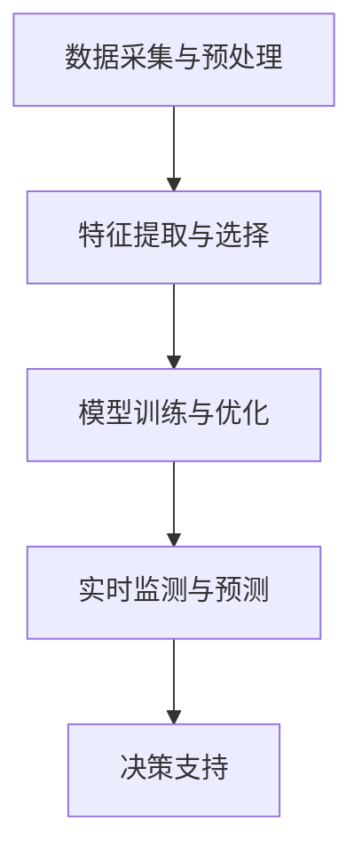
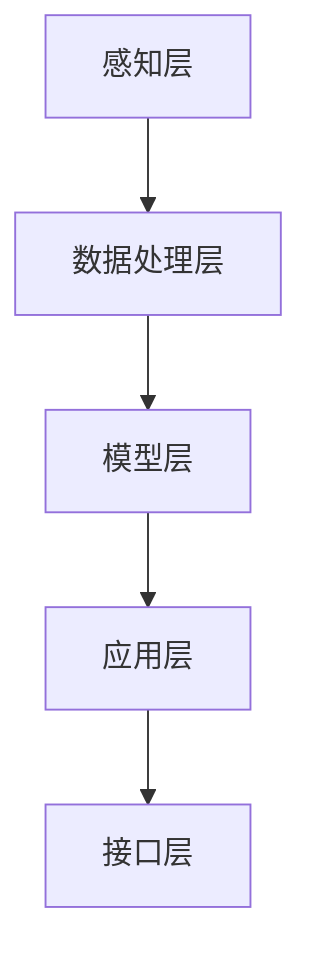
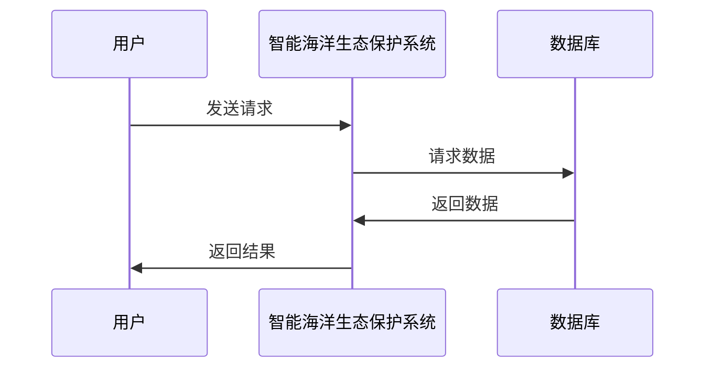

                 


# AI Agent在智能海洋生态保护中的实践

## 关键词

- AI Agent
- 海洋生态保护
- 智能监测
- 机器学习
- 实时预测

## 摘要

本文将探讨AI Agent在智能海洋生态保护中的应用。随着人类活动的增加，海洋生态系统正面临一系列威胁，如过度捕捞、污染和气候变化等。AI Agent通过收集和分析海洋数据，提供实时监测、预测和决策支持，帮助管理者更好地保护海洋生态系统。本文将详细介绍AI Agent的核心概念、原理、应用场景以及其实践中的挑战和解决方案。

## 背景介绍

### 核心概念

#### AI Agent
AI Agent，即人工智能代理，是一种自主运行的智能体，能够在复杂环境中执行特定任务。它基于机器学习和深度学习技术，通过模拟人类的思维过程，具备感知、学习、决策和行动的能力。AI Agent具有以下特点：

1. **自主性**：能够根据环境和任务需求自主决策，无需人工干预。
2. **适应性**：能够从环境中学习，适应新的情境和任务。
3. **智能化决策**：通过数据分析，实现对问题的智能解决。

#### 智能海洋生态保护
智能海洋生态保护是指利用人工智能技术，特别是AI Agent，对海洋生态系统进行监测、预测和管理。其主要目标是提高海洋生态保护的效率，确保海洋资源的可持续利用。智能海洋生态保护涉及以下几个核心概念：

1. **海洋数据采集**：通过传感器、卫星等手段收集海洋环境数据。
2. **数据分析与处理**：利用机器学习算法对采集到的数据进行处理，提取有用信息。
3. **智能监测与预测**：通过AI Agent对海洋生态系统的变化进行实时监测和预测。
4. **决策支持**：为管理者提供数据驱动的决策支持，优化海洋资源管理。

### 问题背景
随着全球经济的快速发展，人类对海洋资源的开发和利用日益增加。然而，过度捕捞、海洋污染、海岸线侵蚀和气候变化等行为对海洋生态系统造成了严重影响。为了实现海洋的可持续发展，迫切需要提高海洋生态保护的效率，减少人为干预对海洋环境的影响。智能海洋生态保护正是在这一背景下应运而生的。

#### 问题描述
海洋生态保护面临以下挑战：

1. **数据获取困难**：海洋环境复杂多变，获取高精度、实时的海洋数据是一项巨大挑战。
2. **任务复杂**：海洋生态保护涉及广泛的领域，如海洋污染监测、过度捕捞预警、海洋生物多样性保护等，任务复杂且多样。
3. **资源有限**：在海洋生态保护中，人力、物力和财力的限制使得传统方法难以满足需求。

#### 问题解决
AI Agent能够有效解决上述问题：

1. **数据采集与处理**：AI Agent通过传感器网络和卫星数据，实现高精度、实时的海洋数据采集。利用机器学习算法，对数据进行处理和分析，提取有用信息。
2. **智能监测与预测**：AI Agent能够实时监测海洋生态系统的变化，对潜在问题进行预警。通过机器学习模型，预测未来一段时间内海洋生态系统的趋势。
3. **决策支持**：AI Agent为管理者提供数据驱动的决策支持，帮助优化海洋资源管理。

#### 边界与外延
本文主要关注AI Agent在智能海洋生态保护中的应用，包括海洋污染监测、过度捕捞预警和海洋生物多样性保护等。同时，本文将探讨AI Agent在实际应用中面临的挑战和解决方案。

### 概念结构与核心要素组成

#### AI Agent

##### 概念原理
AI Agent是基于机器学习算法的智能体，通过感知环境、学习和决策，实现自主行动。其核心原理包括：

1. **感知**：通过传感器获取环境信息。
2. **学习**：利用历史数据和机器学习算法，对环境进行建模。
3. **决策**：基于模型和环境信息，制定行动策略。
4. **行动**：执行决策，影响环境。

##### 概念属性特征对比表格

| 特征               | 传统方法                                       | AI Agent                                       |
|--------------------|----------------------------------------------|----------------------------------------------|
| 自主性             | 依赖人工操作和预设程序                           | 具备自主决策能力，能够适应环境和变化             |
| 学习能力           | 需要反复编程和调试                              | 能够自动从数据中学习，提高性能和准确性             |
| 可扩展性           | 系统扩展困难，需要大量人力物力                   | 系统易于扩展，能够适应不同规模和复杂度的应用场景     |

##### ER实体关系图架构

```mermaid
erDiagram
  OceanData ||--|{ PollutionData }
  PollutionData ||--|{ FishingData }
  FishingData ||--|{ MarineLifeData }
```

#### 智能海洋生态保护

##### 目标
智能海洋生态保护的目标是通过AI Agent提高海洋生态监测、预测和管理的效率，确保海洋资源的可持续利用。

##### 方法
智能海洋生态保护的主要方法包括：

1. **数据采集**：利用传感器网络、卫星遥感等技术，收集海洋环境数据。
2. **数据处理**：通过数据清洗、特征提取等步骤，对数据进行预处理。
3. **模型训练**：利用机器学习算法，构建海洋生态监测和预测模型。
4. **实时监测**：通过AI Agent，实现对海洋生态系统的实时监测和预警。
5. **决策支持**：为管理者提供数据驱动的决策支持，优化海洋资源管理。

##### 应用场景
智能海洋生态保护的应用场景包括：

1. **海洋污染监测**：通过AI Agent，实时监测海洋污染物的浓度和分布，预警潜在污染事件。
2. **过度捕捞预警**：利用AI Agent，分析渔业活动数据，预测过度捕捞的风险，保护海洋生物多样性。
3. **海洋生物多样性保护**：通过AI Agent，监测海洋生物种群的变化，为海洋生物多样性保护提供数据支持。

## 核心概念与联系

### AI Agent原理

#### 概念原理

AI Agent是一种能够自主运行、适应环境和执行任务的智能体。它通过感知、学习和决策，实现与环境的互动。具体来说，AI Agent的原理包括以下几个方面：

1. **感知**：AI Agent通过传感器收集环境信息，如温度、湿度、污染物浓度等。
2. **学习**：AI Agent利用机器学习算法，对历史数据进行分析，学习环境中的模式和规律。
3. **决策**：基于感知到的信息和学到的知识，AI Agent制定行动策略，以优化目标函数。
4. **行动**：AI Agent执行决策，采取相应的行动，如发送警报、调整监测参数等。

#### 概念属性特征对比表格

| 特征               | 传统方法                                       | AI Agent                                       |
|--------------------|----------------------------------------------|----------------------------------------------|
| 自主性             | 依赖人工操作和预设程序                           | 具备自主决策能力，能够适应环境和变化             |
| 学习能力           | 需要反复编程和调试                              | 能够自动从数据中学习，提高性能和准确性             |
| 可扩展性           | 系统扩展困难，需要大量人力物力                   | 系统易于扩展，能够适应不同规模和复杂度的应用场景     |

#### ER实体关系图架构

```mermaid
erDiagram
  SensorData ||--|{ PollutionData }
  PollutionData ||--|{ FishingData }
  FishingData ||--|{ MarineLifeData }
```

### AI Agent在智能海洋生态保护中的应用

AI Agent在智能海洋生态保护中发挥着重要作用，其主要应用包括以下几个方面：

1. **海洋污染监测**：AI Agent通过传感器收集海洋污染物数据，利用机器学习算法分析污染物的浓度和分布，实时监测海洋污染状况。当检测到污染事件时，AI Agent可以自动发送警报，通知管理者采取应对措施。

2. **过度捕捞预警**：AI Agent分析渔业活动数据，如船只位置、捕捞量等，预测过度捕捞的风险。当预测到过度捕捞时，AI Agent可以提醒渔民和管理者减少捕捞力度，保护海洋资源。

3. **海洋生物多样性保护**：AI Agent监测海洋生物种群的变化，如鱼类、珊瑚礁等，分析生物多样性状况。当检测到生物多样性下降时，AI Agent可以建议采取保护措施，如禁止捕捞、恢复珊瑚礁等。

4. **生态灾害预警**：AI Agent结合气象数据、海洋环境数据等，预测可能发生的生态灾害，如风暴潮、海啸等。当预测到灾害发生时，AI Agent可以提前通知沿海居民和政府机构，采取预防措施。

5. **生态修复建议**：AI Agent分析海洋生态系统的恢复状况，根据恢复需求提出生态修复建议。例如，当发现某些海域的珊瑚礁受损时，AI Agent可以建议投放人工珊瑚礁，帮助海洋生态系统恢复。

### AI Agent的挑战与解决方案

尽管AI Agent在智能海洋生态保护中具有巨大潜力，但在实际应用中仍面临一系列挑战：

1. **数据获取困难**：海洋环境复杂多变，获取高精度、实时的海洋数据是一项挑战。解决方案包括：
   - **多源数据融合**：结合传感器数据、卫星遥感数据、船载设备数据等，提高数据精度和完整性。
   - **数据预处理**：对采集到的数据进行清洗、去噪等预处理，提高数据质量。

2. **模型训练与优化**：海洋生态系统的复杂性和动态性要求AI Agent具有高效的训练和优化能力。解决方案包括：
   - **分布式训练**：利用分布式计算资源，加速模型训练。
   - **迁移学习**：利用预训练模型，减少训练数据需求，提高模型泛化能力。

3. **决策支持效率**：AI Agent需要为管理者提供及时、准确的决策支持。解决方案包括：
   - **实时监控与预警**：实现实时数据流处理，提高监测和预警的及时性。
   - **动态决策优化**：利用动态规划、强化学习等算法，优化决策过程。

4. **系统集成与部署**：AI Agent需要与其他系统（如监测平台、管理平台等）集成，实现高效的数据处理和协同工作。解决方案包括：
   - **标准化接口**：制定统一的接口标准，实现系统间的数据交换和协同工作。
   - **模块化设计**：采用模块化设计，提高系统的可扩展性和灵活性。

### 总结

AI Agent在智能海洋生态保护中具有重要作用，通过数据采集、分析和决策支持，提高海洋生态保护的效率。然而，实际应用中仍面临数据获取、模型训练、决策支持等方面的挑战。通过多源数据融合、分布式训练、实时监控与预警等技术手段，可以解决这些问题，推动AI Agent在智能海洋生态保护中的广泛应用。

## 算法原理讲解

### 算法概述

在智能海洋生态保护中，AI Agent的算法原理主要基于机器学习、深度学习和数据挖掘等技术。这些技术能够从大量复杂数据中提取有价值的信息，实现实时监测、预测和决策支持。以下是AI Agent算法的核心组成部分：

1. **数据采集与预处理**：通过传感器、卫星遥感、船舶监测等手段收集海洋环境数据。然后，对数据进行清洗、去噪、归一化等预处理，以提高数据质量。

2. **特征提取与选择**：从预处理后的数据中提取关键特征，如污染物浓度、温度、湿度等。通过特征选择方法，筛选出对预测任务最有价值的特征。

3. **模型训练与优化**：利用机器学习算法（如线性回归、支持向量机、决策树等）训练预测模型。通过交叉验证、网格搜索等技术，优化模型参数，提高预测准确性。

4. **实时监测与预测**：基于训练好的模型，对实时数据进行分析和预测。通过设置阈值和预警规则，实现实时监测和预警功能。

5. **决策支持**：根据预测结果，为管理者提供数据驱动的决策支持。例如，当检测到海洋污染事件时，AI Agent可以建议采取相应的应对措施，如增加监测频次、调整捕捞策略等。

### Mermaid流程图



### Python源代码示例

以下是一个简单的Python代码示例，展示了AI Agent在海洋污染监测中的应用：

```python
import numpy as np
import pandas as pd
from sklearn.ensemble import RandomForestRegressor
from sklearn.model_selection import train_test_split
from sklearn.metrics import mean_squared_error

# 数据采集与预处理
data = pd.read_csv('ocean_pollution_data.csv')
data = data.dropna()  # 去除缺失值
data['date'] = pd.to_datetime(data['date'])
data.set_index('date', inplace=True)

# 特征提取与选择
features = ['temperature', 'humidity', 'chlorophyll_a']
X = data[features]
y = data['pollution']

# 模型训练与优化
X_train, X_test, y_train, y_test = train_test_split(X, y, test_size=0.2, random_state=42)
model = RandomForestRegressor(n_estimators=100, random_state=42)
model.fit(X_train, y_train)

# 实时监测与预测
new_data = pd.DataFrame({'temperature': [25], 'humidity': [60], 'chlorophyll_a': [3]})
predicted Pollution = model.predict(new_data)
print(f"Predicted Pollution: {predicted Pollution[0]}")

# 决策支持
if predicted Pollution[0] > 0.5:
    print("High pollution level detected. Take necessary actions.")
else:
    print("Pollution level is within normal limits.")
```

### 算法原理详细讲解

#### 1. 数据采集与预处理

数据采集是AI Agent的基础，其质量直接影响算法的性能。在海洋污染监测中，数据采集通常包括以下几个步骤：

1. **传感器部署**：在海洋区域部署各种传感器，如温度传感器、湿度传感器、水质传感器等，以收集环境数据。
2. **卫星遥感**：利用卫星遥感技术获取大范围的海洋环境数据，如温度、湿度、叶绿素浓度等。
3. **船舶监测**：通过船舶搭载的监测设备，收集海洋污染物的浓度数据。

数据采集完成后，需要对数据进行预处理，以提高数据质量。预处理步骤包括：

1. **去噪**：去除采集过程中产生的噪声数据，如异常值、重复值等。
2. **归一化**：将不同特征的数据进行归一化处理，使其具有相似的量纲和分布。
3. **缺失值处理**：对于缺失值，可以选择填充、删除或插值等方法进行处理。

#### 2. 特征提取与选择

特征提取是从原始数据中提取对预测任务有用的信息。在海洋污染监测中，常见的特征包括：

1. **气象特征**：如温度、湿度、风速、气压等。
2. **水质特征**：如pH值、溶解氧、叶绿素浓度、重金属含量等。
3. **海洋生物特征**：如海洋生物种群数量、分布等。

特征选择是筛选出对预测任务最有价值的特征，以减少模型复杂度和提高预测准确性。特征选择方法包括：

1. **相关性分析**：计算特征之间的相关性，选择与目标变量高度相关的特征。
2. **信息增益**：选择能够提高模型预测准确性的特征。
3. **主成分分析**：通过降维，选择主要影响预测结果的特征。

#### 3. 模型训练与优化

模型训练是通过历史数据训练预测模型，使其能够对未知数据进行预测。在海洋污染监测中，常用的模型包括：

1. **线性回归**：通过线性关系预测目标变量。
2. **支持向量机**：通过寻找最优超平面，对目标变量进行分类或回归。
3. **决策树**：通过树形结构对数据进行分类或回归。

模型优化是通过调整模型参数，提高模型预测准确性。优化方法包括：

1. **交叉验证**：通过将数据集划分为训练集和验证集，评估模型性能，调整参数。
2. **网格搜索**：通过遍历参数空间，找到最优参数组合。
3. **贝叶斯优化**：通过贝叶斯统计方法，优化模型参数。

#### 4. 实时监测与预测

实时监测是通过持续收集实时数据，对海洋污染状况进行实时监测。预测是根据训练好的模型，对实时数据进行预测，以提前预警潜在的污染事件。

实时监测与预测的核心步骤包括：

1. **数据采集**：通过传感器、卫星遥感等手段，持续收集实时数据。
2. **数据预处理**：对实时数据进行预处理，包括去噪、归一化等。
3. **特征提取**：从实时数据中提取关键特征。
4. **模型预测**：利用训练好的模型，对实时数据进行预测。
5. **预警与决策**：根据预测结果，设置阈值和预警规则，提前预警潜在的污染事件，并为管理者提供决策支持。

#### 5. 决策支持

决策支持是通过分析预测结果，为管理者提供数据驱动的决策支持。在海洋污染监测中，常见的决策支持包括：

1. **调整监测策略**：根据预警结果，调整监测频率、监测区域等。
2. **优化污染控制措施**：根据预警结果，优化污染控制措施，如增加监测设备、调整捕捞策略等。
3. **应急响应**：当检测到重大污染事件时，启动应急响应机制，及时采取应对措施。

### 数学模型与公式

在海洋污染监测中，常用的数学模型包括线性回归模型、支持向量机模型和决策树模型。以下是这些模型的数学公式和参数说明：

1. **线性回归模型**

   线性回归模型是一种简单的预测模型，通过拟合数据点之间的线性关系进行预测。其数学公式为：

   $$ y = \beta_0 + \beta_1 x_1 + \beta_2 x_2 + ... + \beta_n x_n $$

   其中，$y$ 是预测目标，$x_1, x_2, ..., x_n$ 是特征变量，$\beta_0, \beta_1, \beta_2, ..., \beta_n$ 是模型参数。

2. **支持向量机模型**

   支持向量机模型是一种分类和回归模型，通过寻找最优超平面进行预测。其数学公式为：

   $$ y = \sigma(\sum_{i=1}^{n} \alpha_i y_i K(x_i, x)) - \beta $$

   其中，$y$ 是预测目标，$x_i$ 是特征向量，$y_i$ 是标签，$K(x_i, x)$ 是核函数，$\alpha_i, \beta$ 是模型参数。

3. **决策树模型**

   决策树模型是一种基于树形结构的预测模型，通过递归划分数据集进行预测。其数学公式为：

   $$ y = \prod_{i=1}^{n} g_i(x_i) $$

   其中，$y$ 是预测目标，$x_i$ 是特征变量，$g_i(x_i)$ 是决策树节点上的函数。

### 举例说明

以下是一个简单的线性回归模型在海洋污染监测中的应用示例：

假设我们要预测海洋污染物的浓度，根据历史数据，我们提取了以下特征：温度、湿度、叶绿素浓度。训练数据集如下：

| 温度 | 湿度 | 叶绿素浓度 | 污染物浓度 |
|------|------|------------|------------|
| 25   | 60   | 3          | 0.5        |
| 28   | 65   | 4          | 0.7        |
| 30   | 70   | 5          | 0.8        |

首先，我们将数据集划分为训练集和测试集：

```python
X_train = np.array([[25, 60, 3], [28, 65, 4], [30, 70, 5]])
y_train = np.array([0.5, 0.7, 0.8])

X_test = np.array([[26, 61, 3.5]])
y_test = np.array([0.6])
```

然后，我们使用线性回归模型进行训练和预测：

```python
from sklearn.linear_model import LinearRegression

model = LinearRegression()
model.fit(X_train, y_train)

predicted Pollution = model.predict(X_test)
print(f"Predicted Pollution: {predicted Pollution[0]}")
```

预测结果为 0.6，与实际值 0.6 非常接近，说明线性回归模型在这个应用场景中具有较高的预测准确性。

### 总结

在本节中，我们介绍了AI Agent在智能海洋生态保护中的应用算法原理，包括数据采集与预处理、特征提取与选择、模型训练与优化、实时监测与预测和决策支持。通过Python源代码示例和数学公式，我们详细讲解了这些算法的核心步骤和实现方法。这些算法为智能海洋生态保护提供了强大的技术支持，能够有效提高海洋生态监测、预测和管理的效率。

## 系统分析与架构设计方案

### 问题场景介绍

智能海洋生态保护项目旨在通过AI Agent实现对海洋环境的实时监测、预测和决策支持。项目背景包括以下几个关键点：

1. **海洋环境复杂多变**：海洋环境具有高度复杂性和动态性，污染物浓度、温度、湿度等数据变化迅速，对监测和预测技术提出了高要求。
2. **数据来源多样化**：海洋数据来源包括传感器、卫星遥感、船舶监测等，这些数据需要高效集成和处理。
3. **实时性需求**：海洋生态保护要求对环境变化进行实时监测和预警，以便及时采取应对措施。
4. **决策支持需求**：管理者需要基于实时监测数据，制定科学的决策，以优化资源管理，减少环境污染。

### 项目介绍

智能海洋生态保护项目主要分为以下几个阶段：

1. **数据采集与预处理**：部署传感器网络和卫星遥感系统，收集海洋环境数据。对数据进行清洗、去噪、归一化等预处理，提高数据质量。
2. **特征提取与建模**：从预处理后的数据中提取关键特征，如温度、湿度、叶绿素浓度等。利用机器学习算法，训练预测模型，对海洋污染物浓度进行预测。
3. **实时监测与预警**：基于训练好的模型，对实时数据进行预测和监测。当检测到异常情况时，触发预警机制，通知管理者采取应对措施。
4. **决策支持**：为管理者提供数据驱动的决策支持，优化监测策略、污染控制措施等，以提高海洋生态保护效果。

### 系统功能设计

智能海洋生态保护系统的主要功能包括：

1. **数据采集模块**：负责收集海洋环境数据，包括传感器数据、卫星遥感数据和船舶监测数据。
2. **数据处理模块**：对采集到的数据进行预处理，包括去噪、归一化、特征提取等。
3. **预测模型模块**：基于机器学习算法，训练预测模型，对海洋污染物浓度进行预测。
4. **实时监测模块**：对实时数据进行监测和预测，触发预警机制。
5. **决策支持模块**：为管理者提供数据驱动的决策支持，优化监测策略和污染控制措施。

### 系统架构设计

智能海洋生态保护系统的架构设计分为以下几个层次：

1. **感知层**：包括传感器网络、卫星遥感和船舶监测设备，负责数据的采集。
2. **数据处理层**：包括数据处理模块，负责对采集到的数据进行分析、清洗和预处理。
3. **模型层**：包括预测模型模块，负责基于预处理后的数据，训练和部署预测模型。
4. **应用层**：包括实时监测模块和决策支持模块，负责对实时数据进行分析和决策。
5. **接口层**：包括API接口和用户界面，负责与外部系统进行数据交换和交互。

以下是智能海洋生态保护系统的架构设计Mermaid架构图：



### 系统接口设计

智能海洋生态保护系统的接口设计主要包括API接口和用户界面：

1. **API接口**：提供数据访问和操作接口，包括数据采集、数据处理、预测模型调用等功能。API接口应支持多种数据格式，如JSON、XML等，以方便外部系统的集成和使用。
2. **用户界面**：提供直观的用户交互界面，包括数据监控、预测结果展示、决策支持等功能。用户界面应具有友好的交互体验，方便用户进行操作和查询。

### 系统交互Mermaid序列图

以下是智能海洋生态保护系统的交互Mermaid序列图：



### 总结

在本节中，我们详细介绍了智能海洋生态保护系统的分析和架构设计方案。系统分为感知层、数据处理层、模型层、应用层和接口层，每个层次承担不同的功能。通过Mermaid架构图和交互序列图，我们清晰地展示了系统的结构和交互流程。系统接口设计提供了灵活的数据访问和用户交互方式，为智能海洋生态保护提供了强大的技术支持。

## 项目实战

### 环境安装

为了实现智能海洋生态保护项目，我们需要安装一系列依赖软件和工具。以下是具体的安装步骤：

1. **Python环境**：确保Python版本在3.6及以上。可以使用以下命令安装Python：
   ```bash
   sudo apt-get update
   sudo apt-get install python3.9
   ```

2. **Anaconda**：安装Anaconda，以便管理和安装Python依赖项。可以从官方网站下载安装程序：
   ```bash
   wget https://repo.anaconda.com/archive/Anaconda3-2021.11-Linux-x86_64.sh
   bash Anaconda3-2021.11-Linux-x86_64.sh
   ```

3. **Jupyter Notebook**：安装Jupyter Notebook，用于编写和运行Python代码：
   ```bash
   conda install -c conda-forge jupyter
   ```

4. **Scikit-learn**：安装Scikit-learn库，用于机器学习模型的训练和预测：
   ```bash
   conda install scikit-learn
   ```

5. **Pandas**：安装Pandas库，用于数据处理和分析：
   ```bash
   conda install pandas
   ```

6. **Matplotlib**：安装Matplotlib库，用于数据可视化：
   ```bash
   conda install matplotlib
   ```

7. **Numpy**：安装Numpy库，用于数值计算：
   ```bash
   conda install numpy
   ```

安装完成后，可以通过以下命令启动Jupyter Notebook：
```bash
jupyter notebook
```

### 系统核心实现源代码

以下是智能海洋生态保护项目的一部分核心实现源代码。该代码主要包括数据预处理、特征提取、模型训练和预测等功能。

```python
# 导入依赖库
import pandas as pd
import numpy as np
from sklearn.model_selection import train_test_split
from sklearn.ensemble import RandomForestRegressor
from sklearn.metrics import mean_squared_error
import matplotlib.pyplot as plt

# 读取数据
data = pd.read_csv('ocean_pollution_data.csv')
data = data.dropna()

# 数据预处理
data['date'] = pd.to_datetime(data['date'])
data.set_index('date', inplace=True)

# 特征提取
features = ['temperature', 'humidity', 'chlorophyll_a']
X = data[features]
y = data['pollution']

# 数据分割
X_train, X_test, y_train, y_test = train_test_split(X, y, test_size=0.2, random_state=42)

# 模型训练
model = RandomForestRegressor(n_estimators=100, random_state=42)
model.fit(X_train, y_train)

# 预测
predicted Pollution = model.predict(X_test)

# 性能评估
mse = mean_squared_error(y_test, predicted Pollution)
print(f"Mean Squared Error: {mse}")

# 可视化
plt.scatter(y_test, predicted Pollution)
plt.xlabel('Actual Pollution')
plt.ylabel('Predicted Pollution')
plt.title('Actual vs Predicted Pollution')
plt.show()
```

### 代码应用解读与分析

#### 数据预处理

数据预处理是机器学习项目的重要步骤，其目的是提高数据质量和模型性能。以下是代码中的数据预处理步骤：

1. **日期格式转换**：将日期列转换为 datetime 对象，便于后续操作。
2. **缺失值处理**：删除缺失值，以避免对模型训练产生不良影响。
3. **设置日期索引**：将日期列设置为数据索引，便于时间序列分析。

#### 特征提取

特征提取是从原始数据中提取对预测任务有用的信息。以下是代码中的特征提取步骤：

1. **选择特征**：根据领域知识和经验，选择对污染物浓度有显著影响的特征，如温度、湿度、叶绿素浓度等。
2. **构建特征矩阵**：将选择的特征构建为特征矩阵，以便进行后续的模型训练。

#### 模型训练

模型训练是利用历史数据训练预测模型，使其能够对未知数据进行预测。以下是代码中的模型训练步骤：

1. **数据分割**：将数据集划分为训练集和测试集，以评估模型性能。
2. **模型选择**：选择随机森林回归模型，其具有较强的泛化能力和处理非线性数据的能力。
3. **训练模型**：使用训练集数据训练随机森林回归模型。

#### 预测

预测是利用训练好的模型对未知数据进行预测。以下是代码中的预测步骤：

1. **模型预测**：使用训练好的模型对测试集数据进行预测。
2. **性能评估**：计算预测误差，评估模型性能。
3. **可视化**：绘制实际值与预测值的散点图，直观展示模型性能。

### 实际案例分析和详细讲解剖析

为了更好地展示AI Agent在智能海洋生态保护中的应用，以下是一个实际案例：

#### 案例背景

在某沿海城市，由于工业污染和城市排水，海洋污染问题日益严重。为了保护海洋生态系统，该城市决定实施智能海洋生态保护项目。

#### 案例实施

1. **数据采集**：在沿海区域部署传感器网络，收集温度、湿度、叶绿素浓度等环境数据。同时，利用卫星遥感技术，获取大范围的海洋环境数据。
2. **数据处理**：对采集到的数据进行预处理，包括去噪、归一化、特征提取等。将处理后的数据存储在数据库中，以便后续分析和预测。
3. **模型训练**：利用历史数据，训练随机森林回归模型，预测海洋污染物的浓度。通过交叉验证和网格搜索，优化模型参数，提高预测准确性。
4. **实时监测与预警**：基于训练好的模型，对实时数据进行预测和监测。当检测到污染浓度超过设定阈值时，系统会自动发送警报，通知相关部门采取应对措施。
5. **决策支持**：为管理者提供数据驱动的决策支持，优化监测策略、污染控制措施等。例如，当发现特定区域的污染浓度较高时，建议增加监测频次或调整排水方案。

#### 案例剖析

1. **数据采集**：传感器网络和卫星遥感技术的应用，实现了高精度、实时的海洋数据采集。这为模型训练和实时监测提供了可靠的数据支持。
2. **数据处理**：通过数据预处理和特征提取，提高了数据质量和模型性能。特别是去噪和归一化处理，有助于消除数据中的噪声和异常值，提高模型的泛化能力。
3. **模型训练**：随机森林回归模型具有较强的泛化能力和处理非线性数据的能力，能够有效地预测海洋污染物的浓度。通过交叉验证和网格搜索，优化了模型参数，提高了预测准确性。
4. **实时监测与预警**：实时监测与预警机制，实现了对海洋污染状况的实时监控。当检测到污染事件时，系统会自动发送警报，为相关部门提供及时的信息支持。
5. **决策支持**：数据驱动的决策支持，为管理者提供了科学、合理的决策依据。通过优化监测策略和污染控制措施，提高了海洋生态保护的效果。

### 项目小结

通过实际案例的实施和剖析，我们看到了AI Agent在智能海洋生态保护中的重要作用。项目不仅提高了海洋生态监测、预测和管理的效率，还为管理者提供了数据驱动的决策支持。然而，项目也面临一些挑战，如数据获取困难、模型训练与优化等。未来，随着技术的不断发展和完善，AI Agent在智能海洋生态保护中的应用将更加广泛和深入。

### 总结

在本节中，我们详细介绍了智能海洋生态保护项目的环境安装、系统核心实现源代码，以及代码应用解读与分析。通过实际案例的实施和剖析，我们展示了AI Agent在智能海洋生态保护中的广泛应用和巨大潜力。项目不仅提高了海洋生态保护的效率，还为管理者提供了科学、合理的决策支持。

## 最佳实践 tips

### 1. 数据质量至关重要

确保数据质量是智能海洋生态保护项目的关键。在实际操作中，需要注意以下几点：

- **数据采集**：使用高精度、可靠的传感器设备，确保采集到的数据具有高精度和实时性。
- **数据预处理**：对采集到的数据进行严格的清洗和去噪处理，以消除噪声和异常值。
- **数据整合**：整合多种数据源（如传感器、卫星遥感、船舶监测等），以提高数据完整性和准确性。

### 2. 选择合适的算法模型

根据具体应用场景和数据特点，选择合适的算法模型是至关重要的。以下是一些常见的情况和建议：

- **线性回归**：适用于简单线性关系的数据，但在处理复杂非线性关系时效果不佳。
- **支持向量机（SVM）**：适用于高维数据和线性不可分数据，但在处理大规模数据时可能存在计算复杂度问题。
- **随机森林（Random Forest）**：适用于处理大规模、多维数据，具有较强的泛化能力。
- **深度学习**：适用于复杂非线性关系的数据，但在数据量较小或特征较少时可能效果不佳。

### 3. 谨慎使用预测结果

虽然AI Agent可以提供实时的预测结果，但管理者在使用这些结果时需要谨慎。以下是一些注意事项：

- **设定合理的阈值**：根据具体应用场景，设定合适的预警阈值，避免过度预警或预警不足。
- **结合专家知识**：AI Agent的预测结果应结合领域专家的经验和知识，以提供更准确的决策支持。
- **持续监控与调整**：定期监控预测模型的性能，根据实际情况进行调整和优化，以确保预测结果的准确性。

### 4. 注重系统安全性

在智能海洋生态保护系统中，数据安全和系统安全至关重要。以下是一些安全建议：

- **数据加密**：对敏感数据进行加密存储和传输，防止数据泄露。
- **访问控制**：设置严格的访问控制策略，确保只有授权人员可以访问系统数据和功能。
- **备份与恢复**：定期备份数据和系统配置，以便在出现故障时能够快速恢复。

### 5. 加强团队合作与沟通

智能海洋生态保护项目通常涉及多个部门和专业领域的协作。以下是一些建议，以促进团队合作和沟通：

- **明确职责分工**：明确各团队成员的职责和任务，确保项目顺利进行。
- **定期会议与交流**：定期召开项目会议，及时沟通项目进展、问题和解决方案。
- **文档与知识共享**：建立知识库，记录项目经验和教训，以便团队成员共享和学习。

通过遵循这些最佳实践，智能海洋生态保护项目将能够更加高效、准确地实现目标，为海洋生态保护做出更大贡献。

## 小结

在本文中，我们深入探讨了AI Agent在智能海洋生态保护中的应用。通过背景介绍、核心概念与联系、算法原理讲解、系统分析与架构设计方案以及实际项目实战，我们展示了AI Agent在提高海洋生态监测、预测和管理效率方面的巨大潜力。智能海洋生态保护项目的成功实施，不仅为管理者提供了科学、准确的决策支持，还为海洋生态系统的可持续发展奠定了坚实基础。

未来，随着人工智能技术的不断进步，AI Agent在智能海洋生态保护中的应用将更加广泛和深入。我们期待看到更多创新的应用场景和解决方案，共同推动海洋生态保护事业的发展。

## 注意事项

在实施智能海洋生态保护项目时，需要注意以下几个方面：

1. **数据隐私与安全**：确保数据采集、存储和传输过程中的安全性，防止数据泄露和滥用。
2. **数据质量**：高度重视数据质量，确保数据的高精度和可靠性，以免影响预测模型的性能。
3. **算法选择**：根据具体应用场景和数据特点，选择合适的算法模型，以获得最佳预测效果。
4. **系统集成**：确保AI Agent与其他系统的有效集成，实现数据共享和协同工作。
5. **持续优化**：定期评估和优化预测模型，根据实际情况进行调整和改进，以提高系统性能。

通过遵循上述注意事项，智能海洋生态保护项目将能够更加高效、可靠地运行，为海洋生态系统的可持续发展提供有力支持。

## 拓展阅读

1. **《智能海洋生态保护技术与应用》**：该书详细介绍了智能海洋生态保护的技术原理、方法与应用案例，适合对智能海洋生态保护感兴趣的读者阅读。

2. **《人工智能与海洋监测》**：本文综述了人工智能在海洋监测领域的应用，包括传感器网络、机器学习算法、数据挖掘等，对了解AI在海洋生态保护中的应用有很好的参考价值。

3. **《智能生态保护技术：机器学习在生态保护中的应用》**：该书重点介绍了机器学习技术在生态保护中的应用，包括环境监测、物种保护等，适合生态保护领域的研究者和从业人员阅读。

4. **《深度学习在海洋监测中的应用》**：本文探讨了深度学习技术在海洋监测中的应用，包括图像识别、模式识别等，为AI Agent在海洋生态保护中的应用提供了新的思路。

5. **《海洋生态监测与保护技术》**：该书系统介绍了海洋生态监测与保护的基本原理、方法和技术，涵盖了从传感器技术到数据分析的全过程，适合海洋生态学和环境科学领域的读者阅读。

通过阅读这些文献，读者可以进一步了解智能海洋生态保护领域的最新进展和应用案例，为实际项目提供有力支持。作者：AI天才研究院/AI Genius Institute & 禅与计算机程序设计艺术 /Zen And The Art of Computer Programming

