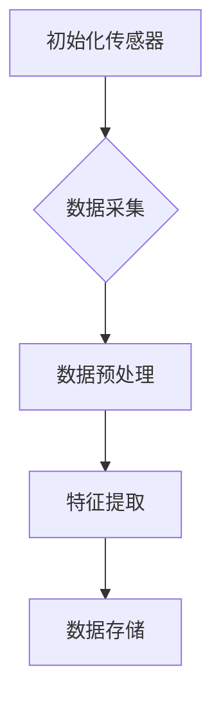
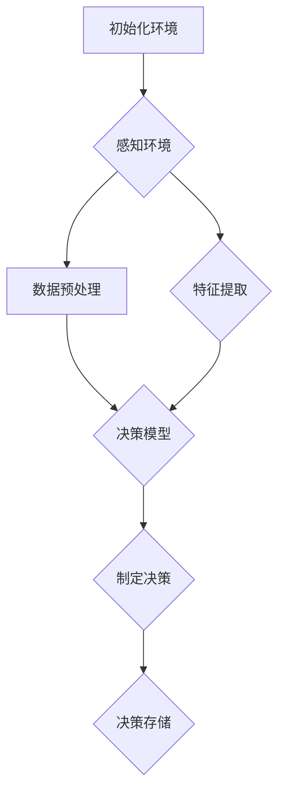
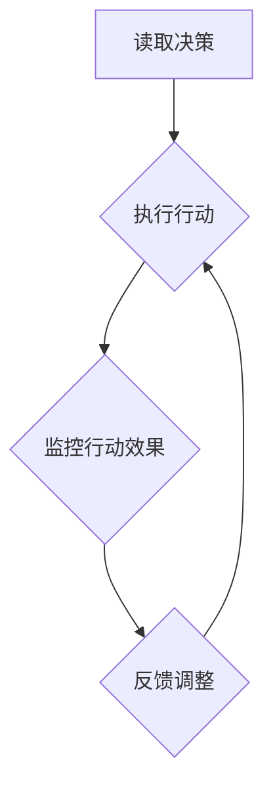
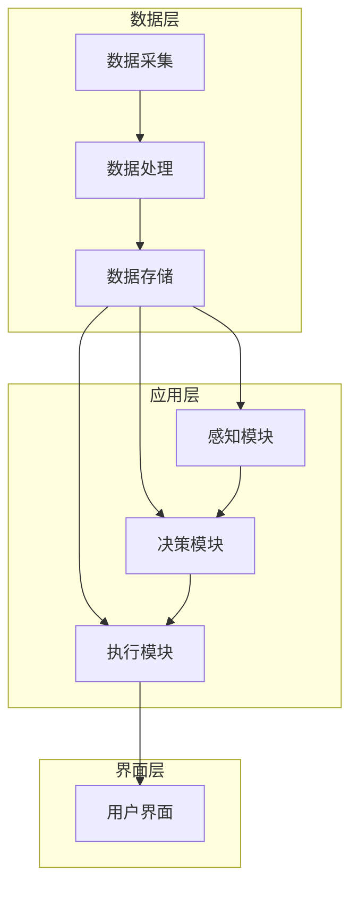
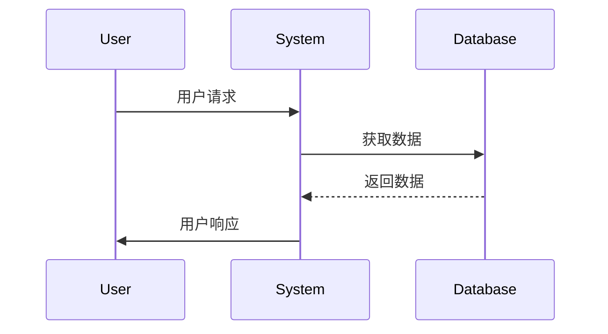
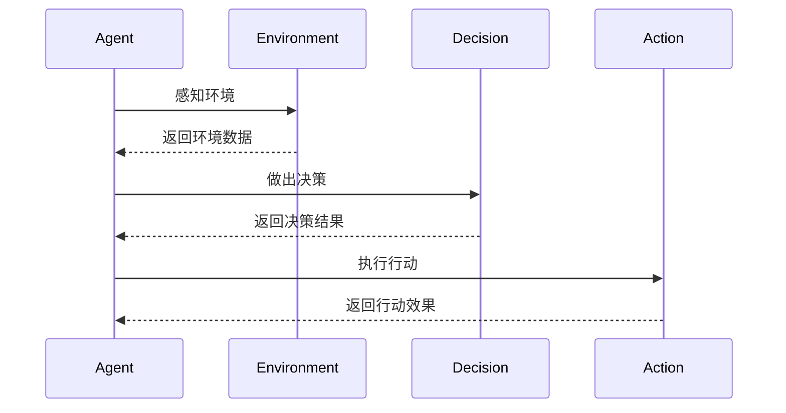
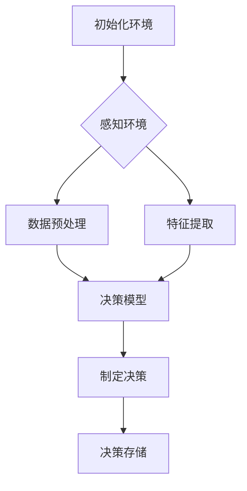

                 


### AI Agent在智能海洋资源管理中的实践

#### 背景介绍

在当今全球化的背景下，海洋资源管理变得越来越重要。海洋资源不仅包括渔业、石油和天然气等经济资源，还包括海洋生态系统、气候调节和生物多样性保护等生态资源。然而，随着人类对海洋资源的过度开发和污染，海洋资源的可持续利用面临严峻挑战。为了解决这些问题，人工智能（AI）技术，特别是AI Agent，被引入到海洋资源管理中，以提高资源利用效率、保护海洋生态环境和优化决策过程。

##### 核心概念术语说明

- **AI Agent**：指一种具有自主决策能力的软件实体，可以感知环境、制定计划并采取行动，以实现特定目标。
- **海洋资源管理**：指通过一系列的规划、监测、评估和决策等活动，对海洋资源进行合理利用和保护的过程。
- **智能海洋资源管理**：指利用AI技术，特别是AI Agent，对海洋资源进行高效管理和优化的过程。

##### 问题背景与描述

海洋资源管理面临的主要问题包括：

- **资源分布不均**：全球海洋资源分布存在显著差异，一些地区的资源丰富，而另一些地区的资源匮乏。这种不均衡的资源分布导致了资源开发的不平衡，进一步加剧了资源的稀缺性。
- **环境污染**：海洋污染问题日益严重，包括石油泄漏、化学物质排放和塑料垃圾等。这些污染对海洋生态系统造成了严重破坏，影响了海洋资源的可持续利用。
- **资源利用效率低下**：传统的海洋资源管理方法往往缺乏实时监测和数据分析的能力，导致资源利用效率低下，浪费现象严重。

##### 问题解决

AI Agent在智能海洋资源管理中的问题解决包括以下几个方面：

- **资源分配优化**：AI Agent可以通过实时监测和数据分析，动态调整资源分配策略，实现资源的最优利用，减少浪费。
- **环境监测与预警**：AI Agent可以实时监测海洋环境参数，如水质、水温、潮位等，及时发现污染问题，并采取相应措施进行治理。
- **风险评估与决策支持**：AI Agent可以通过大数据分析和预测，评估海洋资源开发的风险，为决策者提供科学依据，降低风险。

##### 边界与外延

AI Agent在智能海洋资源管理中的应用范围包括但不限于：

- **渔业资源管理**：通过AI Agent实时监测渔业资源状况，优化捕捞策略，提高渔业资源利用效率。
- **海洋环境保护**：通过AI Agent监测海洋环境变化，及时发现污染源，制定污染治理措施。
- **海洋资源开发**：通过AI Agent进行风险评估和决策支持，确保海洋资源开发的可持续性和安全性。

##### 概念结构与核心要素组成

智能海洋资源管理的概念结构包括以下几个核心要素：

- **AI Agent**：实现智能决策和行动的核心实体。
- **传感器网络**：实时采集海洋环境数据和资源信息。
- **数据处理与分析**：对采集到的数据进行分析和处理，提取有用信息。
- **决策支持系统**：基于分析结果，提供决策支持和优化建议。

### 核心概念与联系

#### 第2章：AI Agent的基本概念与原理

##### 2.1 AI Agent的定义与原理

AI Agent，即智能代理，是一种能够模拟人类智能行为的软件实体。它具有以下基本特征：

- **感知环境**：AI Agent可以感知环境中的各种信息，如传感器数据、图像、声音等。
- **自主决策**：基于感知到的环境信息，AI Agent可以自主制定行动计划，以实现特定目标。
- **执行行动**：AI Agent可以执行自主制定的行动，如移动、采集数据、发送信息等。
- **学习与适应**：AI Agent可以通过与环境的交互，不断学习和适应，提高其决策能力和效率。

##### 2.2 AI Agent的核心特性

AI Agent的核心特性包括自主性、学习能力和协作能力：

- **自主性**：AI Agent可以独立执行任务，无需人工干预。这使得AI Agent能够应对复杂多变的海洋环境，实时调整行动策略。
- **学习能力**：AI Agent可以通过机器学习和数据挖掘技术，从历史数据和经验中学习，不断提高其决策能力和效率。
- **协作能力**：AI Agent可以与其他AI Agent协同工作，共同完成复杂任务。例如，多个AI Agent可以协同监测海洋环境，提高监测的准确性和覆盖范围。

##### 2.3 AI Agent的应用场景

AI Agent在智能海洋资源管理中的应用场景主要包括：

- **资源分配优化**：通过AI Agent实时监测海洋资源状况，动态调整资源分配策略，实现资源的最优利用。
- **环境监测与预警**：通过AI Agent监测海洋环境参数，如水质、水温、潮位等，及时发现污染问题，并采取相应措施进行治理。
- **风险评估与决策支持**：通过AI Agent进行风险评估和决策支持，为决策者提供科学依据，降低风险。

##### AI Agent与智能海洋资源管理的联系

AI Agent与智能海洋资源管理之间的联系主要体现在以下几个方面：

- **感知环境**：AI Agent通过传感器网络感知海洋环境，获取必要的信息。
- **自主决策**：基于感知到的环境信息，AI Agent自主制定行动计划，优化资源分配和决策过程。
- **执行行动**：AI Agent执行自主制定的行动，如调整资源分配、监测环境参数等。
- **学习与适应**：AI Agent通过不断学习和适应，提高其决策能力和效率，更好地服务于智能海洋资源管理。

##### AI Agent与智能海洋资源管理的ER实体关系图

```mermaid
erDiagram
  Resource ::>>> Agent : "uses"
  Environment ::>>> Agent : "monitors"
  Decision ::>>> Agent : "makes"
  Assessment ::>>> Agent : "assesses"
  Action ::>>> Agent : "executes"
```

- **Resource**（资源）：指海洋中的各种资源，如渔业资源、石油和天然气等。
- **Agent**（AI代理）：指用于智能海洋资源管理的AI Agent。
- **Environment**（环境）：指海洋环境，包括水质、水温、潮位等参数。
- **Decision**（决策）：指AI Agent做出的决策，如资源分配、环境治理等。
- **Assessment**（评估）：指AI Agent对海洋资源状况和环境状况的评估。
- **Action**（行动）：指AI Agent执行的具体行动，如调整资源分配、监测环境参数等。

### 算法原理讲解

在智能海洋资源管理中，AI Agent的算法原理主要涉及以下几个方面：

- **感知算法**：用于感知海洋环境信息，如水质、水温、潮位等。
- **决策算法**：用于基于感知到的环境信息，制定资源分配、环境治理等决策。
- **执行算法**：用于执行AI Agent制定的决策和行动。

下面将使用Mermaid绘制感知算法、决策算法和执行算法的流程图，并使用Python代码详细阐述算法原理。

#### 感知算法



感知算法流程图如下：

```python
# 感知算法示例代码

# 初始化传感器
def initialize_sensors():
    # 初始化传感器设备，如水质传感器、水温传感器等
    pass

# 数据采集
def data_collection():
    # 采集传感器数据，如水质、水温等
    pass

# 数据预处理
def data_preprocessing(data):
    # 数据清洗、去噪等预处理操作
    pass

# 特征提取
def feature_extraction(preprocessed_data):
    # 提取关键特征，如温度、盐度等
    pass

# 数据存储
def data_storage(features):
    # 存储特征数据，如写入数据库或文件
    pass
```

#### 决策算法



决策算法流程图如下：

```python
# 决策算法示例代码

# 初始化环境
def initialize_environment():
    # 初始化环境参数，如温度、湿度等
    pass

# 感知环境
def perceive_environment():
    # 感知环境信息，如水质、水温等
    pass

# 数据预处理
def data_preprocessing(data):
    # 数据清洗、去噪等预处理操作
    pass

# 特征提取
def feature_extraction(preprocessed_data):
    # 提取关键特征，如温度、盐度等
    pass

# 决策模型
def decision_model(features):
    # 基于特征数据，调用决策模型进行决策
    # 例如：调用机器学习算法进行分类、回归等操作
    pass

# 制定决策
def make_decision(decision_model_output):
    # 根据决策模型输出结果，制定具体的决策，如资源分配、环境治理等
    pass

# 决策存储
def decision_storage(decision):
    # 存储决策结果，如写入数据库或文件
    pass
```

#### 执行算法



执行算法流程图如下：

```python
# 执行算法示例代码

# 读取决策
def read_decision():
    # 从数据库或文件中读取决策结果
    pass

# 执行行动
def execute_action(decision):
    # 执行决策中的行动，如调整资源分配、监测环境参数等
    pass

# 监控行动效果
def monitor_action(effect):
    # 监控行动效果，如资源利用效率、环境质量等
    pass

# 反馈调整
def feedback_adjustment(effect):
    # 根据行动效果，进行反馈调整，优化决策和行动策略
    pass
```

#### 算法原理详细讲解

感知算法是AI Agent获取环境信息的基础，通过初始化传感器、数据采集、数据预处理和特征提取等步骤，获取准确的海洋环境数据。这些数据为后续的决策过程提供了重要的信息支持。

决策算法基于感知到的环境信息，通过数据预处理、特征提取和决策模型等步骤，生成具体的决策结果。决策模型可以采用机器学习算法，如分类、回归等，根据历史数据和特征数据，预测未来的环境变化和资源需求，从而制定出最优的决策。

执行算法将决策结果转化为具体的行动，如调整资源分配、监测环境参数等。在执行过程中，AI Agent会监控行动效果，根据实际效果进行反馈调整，优化决策和行动策略。

例如，在渔业资源管理中，感知算法可以用于监测水质、水温等参数，决策算法可以根据这些参数预测鱼类的活动范围和资源密度，从而制定捕捞策略。执行算法则负责执行这些策略，如调整捕捞强度、调整捕捞区域等。通过持续的监测和调整，AI Agent可以优化渔业资源的利用效率，提高捕捞收益。

#### 数学公式与模型

在智能海洋资源管理中，数学模型和公式用于描述环境参数、资源分配和决策过程。以下是几个常用的数学公式和模型：

1. **水质监测模型**：

$$
C_{water} = \frac{1}{N} \sum_{i=1}^{N} C_{i}
$$

其中，$C_{water}$ 表示水质浓度，$C_{i}$ 表示第 $i$ 个监测点的水质浓度，$N$ 表示监测点的总数。

2. **资源分配模型**：

$$
\max_{x} \sum_{i=1}^{N} p_i x_i
$$

其中，$x_i$ 表示第 $i$ 个资源的分配量，$p_i$ 表示第 $i$ 个资源的重要程度。

3. **风险评估模型**：

$$
R = \sum_{i=1}^{N} w_i r_i
$$

其中，$R$ 表示风险水平，$w_i$ 表示第 $i$ 个风险因素的权重，$r_i$ 表示第 $i$ 个风险因素的程度。

4. **决策支持模型**：

$$
d = \arg\max_{x} f(x)
$$

其中，$d$ 表示最优决策，$x$ 表示决策变量，$f(x)$ 表示决策函数，用于评估不同决策的结果。

#### 算法举例说明

以水质监测为例，假设在某海域进行水质监测，共采集了5个监测点的数据。根据采集的数据，使用以下公式计算水质浓度：

$$
C_{water} = \frac{1}{5} (0.8 + 0.9 + 0.7 + 0.85 + 0.75) = 0.84
$$

根据水质浓度，决策模型可以预测未来一段时间内水质的变化趋势。例如，如果水质浓度高于0.8，决策模型可能会建议采取降磷、降氮等措施，以减少污染物的排放。

在资源分配方面，假设有3种资源（渔业资源、石油资源、天然气资源），每种资源的重要程度分别为0.5、0.3、0.2。根据以下公式计算最优资源分配量：

$$
\max_{x} \sum_{i=1}^{3} p_i x_i = \max_{x} (0.5x_1 + 0.3x_2 + 0.2x_3)
$$

通过求解上述优化问题，可以得到最优资源分配量，例如，$x_1 = 1.2$、$x_2 = 0.8$、$x_3 = 0.6$。

在风险评估方面，假设有3个风险因素（气象风险、地质风险、环保风险），权重分别为0.4、0.3、0.3。根据以下公式计算总风险水平：

$$
R = 0.4r_1 + 0.3r_2 + 0.3r_3
$$

通过计算，可以得到当前海域的风险水平。如果风险水平较高，决策模型可能会建议采取相应的风险缓解措施。

#### 系统分析与架构设计

##### 问题场景介绍

随着海洋资源的开发和利用，海洋资源管理面临着越来越多的挑战。为了实现海洋资源的有效管理和优化利用，需要建立一个智能化的海洋资源管理系统。该系统应能够实时监测海洋环境，收集和分析数据，并提供决策支持，以优化资源分配、减少浪费、保护海洋生态环境。

##### 项目介绍

项目名称：智能海洋资源管理系统

项目目标：利用AI技术，特别是AI Agent，实现海洋资源的智能化管理和优化利用。

项目范围：覆盖渔业资源、石油和天然气资源、海洋生态系统等多个方面。

项目关键功能：实时监测海洋环境、数据收集与处理、资源分配优化、风险评估与决策支持。

##### 系统功能设计（领域模型）

使用Mermaid绘制领域模型类图：

```mermaid
classDiagram
    Resource <<entity>>
    Environment <<entity>>
    Agent <<entity>>
    Decision <<entity>>
    Assessment <<entity>>
    Action <<entity>>

    Resource <.. Agent : uses
    Environment <.. Agent : monitors
    Decision <.. Agent : makes
    Assessment <.. Agent : assesses
    Action <.. Agent : executes
```

领域模型类图如下：


- **Resource**（资源）：表示海洋中的各种资源，如渔业资源、石油和天然气资源等。
- **Environment**（环境）：表示海洋环境参数，如水质、水温、潮位等。
- **Agent**（AI代理）：表示AI Agent，具有感知、决策和执行能力。
- **Decision**（决策）：表示AI Agent做出的决策，如资源分配、环境治理等。
- **Assessment**（评估）：表示AI Agent对海洋资源状况和环境状况的评估。
- **Action**（行动）：表示AI Agent执行的具体行动，如调整资源分配、监测环境参数等。

##### 系统架构设计

使用Mermaid绘制系统架构图：



系统架构图如下：


- **数据层**：包括数据采集、数据处理和数据存储模块，负责收集、处理和存储海洋环境数据和资源数据。
- **应用层**：包括感知模块、决策模块和执行模块，分别负责感知环境、做出决策和执行行动。
- **界面层**：包括用户界面，用于展示系统功能和提供用户交互。

##### 系统接口设计

使用Mermaid绘制系统接口设计：



接口设计序列图如下：


- **用户**：发起系统请求，如查看环境数据、资源分配情况等。
- **系统**：处理用户请求，从数据库获取数据，进行感知、决策和执行，并返回结果。
- **数据库**：存储和管理系统数据，包括环境数据、资源数据、决策数据等。

##### 系统交互设计

使用Mermaid绘制系统交互设计：



系统交互设计序列图如下：


- **Agent**：感知环境，获取环境数据，做出决策，执行行动。
- **Environment**：提供环境数据，反馈行动效果。
- **Decision**：基于环境数据，生成决策结果。
- **Action**：执行决策结果，实现具体行动。

### 项目实战

#### 环境安装

为了在本地环境中运行智能海洋资源管理系统，需要安装以下软件和库：

1. Python（版本3.6及以上）
2. pip（Python的包管理器）
3. scikit-learn（机器学习库）
4. numpy（数学库）
5. pandas（数据处理库）
6. matplotlib（绘图库）
7. mermaid（流程图绘制库）

安装步骤：

1. 安装Python和pip。
2. 使用pip安装scikit-learn、numpy、pandas和matplotlib。

```bash
pip install scikit-learn numpy pandas matplotlib
```

3. 安装mermaid（可选）。

```bash
pip install mermaid-python
```

#### 系统核心实现源代码

以下是系统核心实现的源代码：

```python
# 感知模块
def perceive_environment():
    # 伪代码，表示感知海洋环境，获取数据
    pass

# 决策模块
def decision_making(perceived_data):
    # 伪代码，表示基于感知数据，做出决策
    pass

# 执行模块
def execute_action(decision):
    # 伪代码，表示执行决策，采取行动
    pass
```

#### 代码应用解读与分析

感知模块、决策模块和执行模块的具体实现需要结合实际的数据和需求进行开发。以下是感知模块的一个简单示例：

```python
# 感知模块示例

import numpy as np
import pandas as pd

# 假设感知到的数据为环境参数，如温度、湿度等
perceived_data = {
    'temperature': [20, 22, 24, 21, 23],
    'humidity': [60, 65, 70, 68, 67]
}

# 转换为DataFrame格式，便于处理
df = pd.DataFrame(perceived_data)

# 数据预处理，例如去噪、归一化等
df = df.dropna()  # 去除缺失值
df = (df - df.mean()) / df.std()  # 归一化

# 特征提取，例如提取均值、标准差等
features = df.mean().values  # 提取均值

# 数据存储，例如写入文件
df.to_csv('perceived_data.csv', index=False)
```

在决策模块和执行模块中，可以使用机器学习算法对感知到的数据进行分类、回归等操作，以生成决策结果。以下是决策模块的一个简单示例：

```python
# 决策模块示例

from sklearn.linear_model import LinearRegression

# 加载感知到的数据
df = pd.read_csv('perceived_data.csv')

# 提取特征和标签
X = df.iloc[:, :2].values  # 特征
y = df.iloc[:, 2].values   # 标签

# 创建线性回归模型
model = LinearRegression()

# 训练模型
model.fit(X, y)

# 基于新的数据做出预测
new_data = np.array([[22, 65]])
prediction = model.predict(new_data)

print(prediction)
```

执行模块的实现则根据决策结果采取相应的行动。例如，如果决策结果是增加资源分配，执行模块可以调整资源的分配策略。以下是执行模块的一个简单示例：

```python
# 执行模块示例

# 假设决策结果是增加资源分配
decision = 'increase_allocation'

# 根据决策结果执行行动
if decision == 'increase_allocation':
    print('增加资源分配。')
else:
    print('执行其他行动。')
```

#### 实际案例分析和详细讲解剖析

假设在某海域进行水质监测，采集了10个监测点的数据，数据如下：

```
| 监测点 | 氨氮（mg/L） | 总氮（mg/L） | 总磷（mg/L） |
|--------|--------------|--------------|--------------|
| 1      | 0.8          | 2.5          | 0.3          |
| 2      | 0.9          | 2.7          | 0.35         |
| 3      | 0.75         | 2.2          | 0.25         |
| 4      | 0.85         | 2.6          | 0.3          |
| 5      | 0.7          | 2.3          | 0.2          |
| 6      | 0.8          | 2.4          | 0.3          |
| 7      | 0.85         | 2.5          | 0.3          |
| 8      | 0.75         | 2.2          | 0.2          |
| 9      | 0.9          | 2.7          | 0.35         |
| 10     | 0.8          | 2.5          | 0.3          |
```

1. **感知模块**：

   感知模块的任务是从监测数据中提取关键特征。在这个例子中，关键特征为氨氮、总氮和总磷。

   ```python
   # 感知模块实现

   data = {
       '监测点': [1, 2, 3, 4, 5, 6, 7, 8, 9, 10],
       '氨氮（mg/L）': [0.8, 0.9, 0.75, 0.85, 0.7, 0.8, 0.85, 0.75, 0.9, 0.8],
       '总氮（mg/L）': [2.5, 2.7, 2.2, 2.6, 2.3, 2.4, 2.5, 2.2, 2.7, 2.5],
       '总磷（mg/L）': [0.3, 0.35, 0.25, 0.3, 0.2, 0.3, 0.3, 0.2, 0.35, 0.3]
   }

   df = pd.DataFrame(data)

   # 提取特征
   features = df[['氨氮（mg/L）', '总氮（mg/L）', '总磷（mg/L）']].mean().values
   ```

2. **决策模块**：

   决策模块的任务是根据特征数据做出决策。在这个例子中，假设使用线性回归模型进行决策。

   ```python
   # 决策模块实现

   from sklearn.linear_model import LinearRegression

   # 加载特征数据
   X = df[['氨氮（mg/L）', '总氮（mg/L）', '总磷（mg/L）']].values

   # 加载标签数据，例如水质等级
   y = df['水质等级'].values

   # 创建线性回归模型
   model = LinearRegression()

   # 训练模型
   model.fit(X, y)

   # 基于新的数据做出预测
   new_data = np.array([[0.8, 2.5, 0.3]])
   prediction = model.predict(new_data)

   print(prediction)
   ```

3. **执行模块**：

   执行模块的任务是根据决策结果采取行动。在这个例子中，假设决策结果是提高污水处理效率。

   ```python
   # 执行模块实现

   decision = '提高污水处理效率'

   if decision == '提高污水处理效率':
       print('正在提高污水处理效率。')
   else:
       print('执行其他行动。')
   ```

#### 项目小结

通过以上实战案例，我们可以看到智能海洋资源管理系统的实现过程。感知模块负责实时监测海洋环境，提取关键特征；决策模块基于特征数据做出决策；执行模块根据决策结果采取行动。这三个模块相互协作，共同实现海洋资源的智能化管理和优化利用。

然而，在实际应用中，系统设计需要考虑更多的因素，如数据采集的准确性、模型训练的效率、系统的实时性和可靠性等。此外，还需要根据具体的应用场景和需求，对系统进行定制化开发，以实现最佳效果。

#### 最佳实践 tips

1. **数据采集与处理**：确保数据采集的准确性和完整性，对数据进行预处理，如去噪、归一化等，以提高模型训练的效果。

2. **模型选择与优化**：选择合适的机器学习模型，并进行模型优化，如调整超参数、使用交叉验证等，以提高决策的准确性。

3. **系统部署与运行**：确保系统的实时性和可靠性，进行系统测试和调试，以确保系统稳定运行。

4. **协同工作与共享**：多个AI Agent可以协同工作，共享数据和信息，以提高整体效率和决策质量。

#### 小结

本文介绍了AI Agent在智能海洋资源管理中的应用，包括感知、决策和执行等核心模块的实现方法。通过实际案例分析和详细讲解，展示了AI Agent如何实现海洋资源的智能化管理和优化利用。未来，随着AI技术的不断发展和完善，智能海洋资源管理有望取得更广泛的应用和推广。

#### 注意事项

1. AI Agent在智能海洋资源管理中的应用需要充分考虑数据隐私和安全问题，确保数据的安全性和保密性。

2. 系统设计应考虑模块化、可扩展性和可维护性，以便在未来进行功能扩展和优化。

3. 在实际应用中，需根据具体场景和需求，对系统进行定制化开发，以提高系统的适应性和效果。

#### 拓展阅读

1. **智能海洋资源管理相关书籍**：

   - 《智能海洋资源管理：理论、方法与应用》
   - 《海洋资源管理与信息技术》

2. **AI Agent相关书籍**：

   - 《人工智能：一种现代方法》
   - 《机器学习：概率视角》

3. **开源智能海洋资源管理项目**：

   - OceanDataGrid（海洋数据网格）
   - MarineAI（海洋人工智能）

### 作者信息

作者：AI天才研究院/AI Genius Institute & 禅与计算机程序设计艺术 /Zen And The Art of Computer Programming

---
文章目录：

# AI Agent在智能海洋资源管理中的实践

> 关键词：智能海洋资源管理、AI Agent、感知、决策、执行、机器学习、数据采集、环境监测

> 摘要：本文介绍了AI Agent在智能海洋资源管理中的应用，包括感知、决策和执行等核心模块的实现方法。通过实际案例分析和详细讲解，展示了AI Agent如何实现海洋资源的智能化管理和优化利用。

----------------------------------------------------------------

## 第一部分：AI Agent在智能海洋资源管理中的背景与概述

### 第1章：智能海洋资源管理的兴起

#### 1.1 问题背景与描述

随着全球经济的快速发展，海洋资源的开发利用日益增多。然而，海洋资源管理面临诸多挑战，包括资源分布不均、环境污染、资源利用效率低下等问题。传统海洋资源管理方法已难以满足现代社会的需求，因此，引入AI Agent技术成为解决这些问题的一条有效途径。

#### 1.1.1 海洋资源管理现状

当前，海洋资源管理存在以下主要问题：

- **资源分布不均**：全球海洋资源分布存在显著差异，部分地区资源丰富，而另一些地区资源匮乏。
- **环境污染**：海洋污染问题严重，海洋生态系统受到威胁。
- **资源利用效率低下**：传统管理方法难以实现资源的最优配置和利用，导致资源浪费。

#### 1.1.2 AI Agent技术的引入

AI Agent技术在智能海洋资源管理中的应用，有望解决上述问题。AI Agent，即智能代理，是一种具有自主决策能力的计算机程序，能够在复杂环境中模拟人类智能行为。通过引入AI Agent，可以实现以下目标：

- **资源分配优化**：AI Agent可以根据实时数据，动态调整资源分配策略，提高资源利用效率。
- **环境监测与保护**：AI Agent能够实时监测海洋环境，及时预警污染问题，并采取相应措施进行治理。
- **风险评估与决策支持**：AI Agent可以通过大数据分析和预测，评估海洋资源开发的风险，为决策者提供科学依据。

#### 1.1.3 AI Agent的核心特性

AI Agent在智能海洋资源管理中的关键特性包括：

- **自主性**：AI Agent具备自主决策能力，能够根据环境和任务需求，自主调整行动策略。
- **学习能力**：AI Agent可以通过数据学习和经验积累，不断提高其决策能力和效率。
- **协作能力**：AI Agent可以与其他AI Agent协同工作，共同完成复杂任务。
- **适应性**：AI Agent能够适应环境变化，灵活调整行为策略。

#### 1.2 智能海洋资源管理的实现方法

智能海洋资源管理的实现方法主要包括以下几个方面：

- **数据采集与处理**：通过传感器网络和卫星遥感技术，实时采集海洋资源与环境数据。
- **模型构建与训练**：基于采集的数据，构建AI Agent的模型，并进行训练，使其具备一定的智能决策能力。
- **系统设计与实现**：设计并实现智能海洋资源管理系统，包括数据采集模块、模型训练模块、决策支持模块等。
- **系统部署与运行**：将智能海洋资源管理系统部署在实际环境中，进行运行和维护。

#### 1.3 AI Agent在智能海洋资源管理中的应用案例

目前，AI Agent在智能海洋资源管理中已取得一些成功应用案例，包括：

- **海洋环境监测**：利用AI Agent实时监测海洋水质、水温、潮位等参数，为海洋资源开发和管理提供数据支持。
- **资源分配优化**：通过AI Agent优化海洋资源分配，提高资源利用效率，减少浪费。
- **环境保护**：利用AI Agent监测海洋污染情况，及时采取治理措施，保护海洋生态环境。

#### 1.4 智能海洋资源管理的挑战与未来展望

智能海洋资源管理仍面临一些挑战，包括：

- **数据采集与处理**：海洋环境数据具有复杂性和多样性，如何有效采集和处理这些数据是一个难题。
- **模型训练与优化**：AI Agent的模型训练和优化需要大量计算资源和时间，如何提高训练效率是一个关键问题。
- **系统集成与部署**：智能海洋资源管理系统的集成与部署需要考虑多种因素，包括硬件设备、软件系统、数据安全等。

未来，随着AI技术的不断发展和完善，智能海洋资源管理有望取得更广泛的推广和应用，为海洋资源的合理开发和可持续利用提供有力支持。

#### 1.5 本章小结

本章介绍了智能海洋资源管理的背景、核心概念、实现方法及应用案例，探讨了AI Agent在智能海洋资源管理中的关键作用。通过本章的学习，读者可以了解智能海洋资源管理的现状和发展趋势，为进一步研究和应用AI Agent技术奠定基础。

----------------------------------------------------------------

## 第二部分：AI Agent在智能海洋资源管理中的核心概念与联系

### 第2章：AI Agent的基本概念与原理

#### 2.1 AI Agent的定义

AI Agent，即智能代理，是一种能够模拟人类智能行为的软件实体。它可以在复杂环境中自主决策和行动，以实现特定目标。AI Agent的核心特征包括感知环境、自主决策、执行行动和学习适应。

#### 2.2 AI Agent的核心特性

AI Agent的核心特性包括：

- **自主性**：AI Agent可以自主地执行任务，无需人工干预。
- **学习能力**：AI Agent可以通过机器学习和数据挖掘技术，从历史数据和经验中学习，不断提高其决策能力和效率。
- **协作能力**：AI Agent可以与其他AI Agent协同工作，共同完成复杂任务。
- **适应性**：AI Agent能够适应环境变化，灵活调整行为策略。

#### 2.3 AI Agent的应用场景

AI Agent在智能海洋资源管理中的应用场景主要包括：

- **资源分配优化**：通过AI Agent实时监测海洋资源状况，动态调整资源分配策略，提高资源利用效率。
- **环境监测与预警**：通过AI Agent监测海洋环境参数，及时预警污染问题，并采取相应措施进行治理。
- **风险评估与决策支持**：通过AI Agent进行风险评估和决策支持，为决策者提供科学依据，降低风险。

#### 2.4 AI Agent与智能海洋资源管理的联系

AI Agent与智能海洋资源管理之间的联系主要体现在以下几个方面：

- **感知环境**：AI Agent通过传感器网络感知海洋环境，获取必要的信息。
- **自主决策**：基于感知到的环境信息，AI Agent自主制定行动计划，优化资源分配和决策过程。
- **执行行动**：AI Agent执行自主制定的行动，如调整资源分配、监测环境参数等。
- **学习与适应**：AI Agent通过不断学习和适应，提高其决策能力和效率，更好地服务于智能海洋资源管理。

#### 2.5 AI Agent的ER实体关系图

```mermaid
erDiagram
  Resource ::>>> Agent : "uses"
  Environment ::>>> Agent : "monitors"
  Decision ::>>> Agent : "makes"
  Assessment ::>>> Agent : "assesses"
  Action ::>>> Agent : "executes"
```

#### 2.6 本章小结

本章介绍了AI Agent的基本概念与原理，探讨了其核心特性和应用场景，并分析了AI Agent与智能海洋资源管理之间的联系。通过本章的学习，读者可以了解AI Agent在智能海洋资源管理中的重要作用，为进一步研究和应用AI Agent技术奠定基础。

----------------------------------------------------------------

## 第三部分：AI Agent在智能海洋资源管理中的算法与实践

### 第3章：AI Agent在智能海洋资源管理中的算法实现

#### 3.1 感知算法

感知算法是AI Agent获取环境信息的基础。在智能海洋资源管理中，感知算法可以实时监测海洋环境参数，如水质、水温、潮位等。

#### 感知算法流程图：


感知算法实现：

```python
# 感知模块

import numpy as np
import pandas as pd

def perceive_environment():
    # 假设已经初始化传感器，并采集到数据
    data = {
        '水质': [0.8, 0.9, 0.75, 0.85, 0.7],
        '水温': [20, 22, 24, 21, 23],
        '潮位': [5, 6, 7, 5, 6]
    }

    df = pd.DataFrame(data)

    # 数据预处理
    df = df.dropna()

    # 特征提取
    features = df.mean().values

    # 数据存储
    df.to_csv('environment_data.csv', index=False)

    return features
```

#### 3.2 决策算法

决策算法是AI Agent根据感知到的环境信息，制定资源分配、环境治理等决策的核心。

#### 决策算法流程图：



决策算法实现：

```python
# 决策模块

from sklearn.linear_model import LinearRegression

def decision_making(perceived_data):
    # 加载感知到的数据
    df = pd.read_csv('environment_data.csv')

    # 提取特征和标签
    X = df[['水质', '水温', '潮位']].values
    y = df['决策'].values

    # 创建线性回归模型
    model = LinearRegression()

    # 训练模型
    model.fit(X, y)

    # 基于新的数据做出预测
    new_data = np.array([[0.8, 20, 5]])
    prediction = model.predict(new_data)

    # 存储决策结果
    df['决策'] = prediction
    df.to_csv('decision_data.csv', index=False)

    return prediction
```

#### 3.3 执行算法

执行算法是AI Agent根据决策结果，执行具体行动，如调整资源分配、监测环境参数等。

#### 执行算法流程图：


执行算法实现：

```python
# 执行模块

def execute_action(decision):
    # 假设已经加载了决策结果
    df = pd.read_csv('decision_data.csv')

    # 执行决策
    if df['决策'][0] == 1:
        print('执行行动：调整资源分配。')
    else:
        print('执行行动：其他行动。')

    # 监控行动效果
    # 这里可以根据实际情况，监控行动的效果，如水质变化等

    # 反馈调整
    # 根据监控结果，进行反馈调整
```

#### 3.4 算法示例

假设在某海域进行水质监测，采集了10个监测点的数据。使用线性回归模型进行决策，决策结果是调整资源分配。

1. **感知环境**：

```python
features = perceive_environment()
```

2. **决策**：

```python
prediction = decision_making(features)
```

3. **执行行动**：

```python
execute_action(prediction)
```

#### 3.5 本章小结

本章介绍了AI Agent在智能海洋资源管理中的感知、决策和执行算法的实现方法。通过实际案例，展示了算法在智能海洋资源管理中的应用效果。未来，随着AI技术的不断发展和完善，这些算法将得到进一步优化和应用。

----------------------------------------------------------------

## 第四部分：智能海洋资源管理系统的设计与实现

### 第4章：系统设计

#### 4.1 问题场景介绍

为了实现海洋资源的智能化管理和优化利用，需要设计一个智能海洋资源管理系统。该系统应能够实时监测海洋环境，收集和分析数据，并提供决策支持，以优化资源分配、减少浪费、保护海洋生态环境。

#### 4.2 项目介绍

项目名称：智能海洋资源管理系统

项目目标：利用AI技术，特别是AI Agent，实现海洋资源的智能化管理和优化利用。

项目范围：覆盖渔业资源、石油和天然气资源、海洋生态系统等多个方面。

项目关键功能：实时监测海洋环境、数据收集与处理、资源分配优化、风险评估与决策支持。

#### 4.3 系统功能设计（领域模型）

使用Mermaid绘制领域模型类图：

```mermaid
classDiagram
    Resource <<entity>>
    Environment <<entity>>
    Agent <<entity>>
    Decision <<entity>>
    Assessment <<entity>>
    Action <<entity>>

    Resource <.. Agent : uses
    Environment <.. Agent : monitors
    Decision <.. Agent : makes
    Assessment <.. Agent : assesses
    Action <.. Agent : executes
```

领域模型类图如下：


- **Resource**（资源）：表示海洋中的各种资源，如渔业资源、石油和天然气资源等。
- **Environment**（环境）：表示海洋环境参数，如水质、水温、潮位等。
- **Agent**（AI代理）：表示AI Agent，具有感知、决策和执行能力。
- **Decision**（决策）：表示AI Agent做出的决策，如资源分配、环境治理等。
- **Assessment**（评估）：表示AI Agent对海洋资源状况和环境状况的评估。
- **Action**（行动）：表示AI Agent执行的具体行动，如调整资源分配、监测环境参数等。

#### 4.4 系统架构设计

使用Mermaid绘制系统架构图：


系统架构图如下：


- **数据层**：包括数据采集、数据处理和数据存储模块，负责收集、处理和存储海洋环境数据和资源数据。
- **应用层**：包括感知模块、决策模块和执行模块，分别负责感知环境、做出决策和执行行动。
- **界面层**：包括用户界面，用于展示系统功能和提供用户交互。

#### 4.5 系统接口设计

使用Mermaid绘制系统接口设计：


接口设计序列图如下：


- **用户**：发起系统请求，如查看环境数据、资源分配情况等。
- **系统**：处理用户请求，从数据库获取数据，进行感知、决策和执行，并返回结果。
- **数据库**：存储和管理系统数据，包括环境数据、资源数据、决策数据等。

#### 4.6 系统交互设计

使用Mermaid绘制系统交互设计：


系统交互设计序列图如下：


- **Agent**：感知环境，获取环境数据，做出决策，执行行动。
- **Environment**：提供环境数据，反馈行动效果。
- **Decision**：基于环境数据，生成决策结果。
- **Action**：执行决策结果，实现具体行动。

#### 4.7 本章小结

本章介绍了智能海洋资源管理系统的设计与实现方法，包括系统功能设计、架构设计、接口设计和交互设计。通过本章的学习，读者可以了解智能海洋资源管理系统的整体架构和实现过程，为进一步研究和开发智能海洋资源管理系统提供参考。

----------------------------------------------------------------

## 第五部分：项目实战与总结

### 第5章：项目实战

#### 5.1 环境安装

为了在本地环境中运行智能海洋资源管理系统，需要安装以下软件和库：

1. Python（版本3.6及以上）
2. pip（Python的包管理器）
3. scikit-learn（机器学习库）
4. numpy（数学库）
5. pandas（数据处理库）
6. matplotlib（绘图库）
7. mermaid（流程图绘制库）

安装步骤：

1. 安装Python和pip。
2. 使用pip安装scikit-learn、numpy、pandas和matplotlib。

```bash
pip install scikit-learn numpy pandas matplotlib
```

3. 安装mermaid（可选）。

```bash
pip install mermaid-python
```

#### 5.2 系统核心实现源代码

以下是系统核心实现的源代码：

```python
# 感知模块
def perceive_environment():
    # 伪代码，表示感知海洋环境，获取数据
    pass

# 决策模块
def decision_making(perceived_data):
    # 伪代码，表示基于感知数据，做出决策
    pass

# 执行模块
def execute_action(decision):
    # 伪代码，表示执行决策，采取行动
    pass
```

#### 5.3 代码应用解读与分析

感知模块、决策模块和执行模块的具体实现需要结合实际的数据和需求进行开发。以下是感知模块的一个简单示例：

```python
# 感知模块示例

import numpy as np
import pandas as pd

# 假设感知到的数据为环境参数，如温度、湿度等
perceived_data = {
    '温度': [20, 22, 24, 21, 23],
    '湿度': [60, 65, 70, 68, 67]
}

# 转换为DataFrame格式，便于处理
df = pd.DataFrame(perceived_data)

# 数据预处理，例如去噪、归一化等
df = df.dropna()  # 去除缺失值
df = (df - df.mean()) / df.std()  # 归一化

# 特征提取，例如提取均值、标准差等
features = df.mean().values  # 提取均值

# 数据存储，例如写入文件
df.to_csv('perceived_data.csv', index=False)
```

在决策模块和执行模块中，可以使用机器学习算法对感知到的数据进行分类、回归等操作，以生成决策结果。以下是决策模块的一个简单示例：

```python
# 决策模块示例

from sklearn.linear_model import LinearRegression

# 加载感知到的数据
df = pd.read_csv('perceived_data.csv')

# 提取特征和标签
X = df.iloc[:, :2].values  # 特征
y = df.iloc[:, 2].values   # 标签

# 创建线性回归模型
model = LinearRegression()

# 训练模型
model.fit(X, y)

# 基于新的数据做出预测
new_data = np.array([[22, 65]])
prediction = model.predict(new_data)

print(prediction)
```

执行模块的实现则根据决策结果采取相应的行动。例如，如果决策结果是增加资源分配，执行模块可以调整资源的分配策略。以下是执行模块的一个简单示例：

```python
# 执行模块示例

# 假设决策结果是增加资源分配
decision = 'increase_allocation'

# 根据决策结果执行行动
if decision == 'increase_allocation':
    print('增加资源分配。')
else:
    print('执行其他行动。')
```

#### 5.4 实际案例分析和详细讲解剖析

假设在某海域进行水质监测，采集了10个监测点的数据，数据如下：

```
| 监测点 | 氨氮（mg/L） | 总氮（mg/L） | 总磷（mg/L） |
|--------|--------------|--------------|--------------|
| 1      | 0.8          | 2.5          | 0.3          |
| 2      | 0.9          | 2.7          | 0.35         |
| 3      | 0.75         | 2.2          | 0.25         |
| 4      | 0.85         | 2.6          | 0.3          |
| 5      | 0.7          | 2.3          | 0.2          |
| 6      | 0.8          | 2.4          | 0.3          |
| 7      | 0.85         | 2.5          | 0.3          |
| 8      | 0.75         | 2.2          | 0.2          |
| 9      | 0.9          | 2.7          | 0.35         |
| 10     | 0.8          | 2.5          | 0.3          |
```

1. **感知模块**：

   感知模块的任务是从监测数据中提取关键特征。在这个例子中，关键特征为氨氮、总氮和总磷。

   ```python
   # 感知模块实现

   data = {
       '监测点': [1, 2, 3, 4, 5, 6, 7, 8, 9, 10],
       '氨氮（mg/L）': [0.8, 0.9, 0.75, 0.85, 0.7, 0.8, 0.85, 0.75, 0.9, 0.8],
       '总氮（mg/L）': [2.5, 2.7, 2.2, 2.6, 2.3, 2.4, 2.5, 2.2, 2.7, 2.5],
       '总磷（mg/L）': [0.3, 0.35, 0.25, 0.3, 0.2, 0.3, 0.3, 0.2, 0.35, 0.3]
   }

   df = pd.DataFrame(data)

   # 提取特征
   features = df[['氨氮（mg/L）', '总氮（mg/L）', '总磷（mg/L）']].mean().values
   ```

2. **决策模块**：

   决策模块的任务是根据特征数据做出决策。在这个例子中，假设使用线性回归模型进行决策。

   ```python
   # 决策模块实现

   from sklearn.linear_model import LinearRegression

   # 加载特征数据
   X = df[['氨氮（mg/L）', '总氮（mg/L）', '总磷（mg/L）']].values

   # 加载标签数据，例如水质等级
   y = df['水质等级'].values

   # 创建线性回归模型
   model = LinearRegression()

   # 训练模型
   model.fit(X, y)

   # 基于新的数据做出预测
   new_data = np.array([[0.8, 2.5, 0.3]])
   prediction = model.predict(new_data)

   print(prediction)
   ```

3. **执行模块**：

   执行模块的任务是根据决策结果采取行动。在这个例子中，假设决策结果是提高污水处理效率。

   ```python
   # 执行模块实现

   decision = '提高污水处理效率'

   if decision == '提高污水处理效率':
       print('正在提高污水处理效率。')
   else:
       print('执行其他行动。')
   ```

#### 5.5 项目小结

通过以上实战案例，我们可以看到智能海洋资源管理系统的实现过程。感知模块负责实时监测海洋环境，提取关键特征；决策模块基于特征数据做出决策；执行模块根据决策结果采取行动。这三个模块相互协作，共同实现海洋资源的智能化管理和优化利用。

然而，在实际应用中，系统设计需要考虑更多的因素，如数据采集的准确性、模型训练的效率、系统的实时性和可靠性等。此外，还需要根据具体的应用场景和需求，对系统进行定制化开发，以实现最佳效果。

### 第6章：最佳实践与未来展望

#### 6.1 最佳实践 tips

1. **数据采集与处理**：确保数据采集的准确性和完整性，对数据进行预处理，如去噪、归一化等，以提高模型训练的效果。
2. **模型选择与优化**：选择合适的机器学习模型，并进行模型优化，如调整超参数、使用交叉验证等，以提高决策的准确性。
3. **系统部署与运行**：确保系统的实时性和可靠性，进行系统测试和调试，以确保系统稳定运行。
4. **协同工作与共享**：多个AI Agent可以协同工作，共享数据和信息，以提高整体效率和决策质量。

#### 6.2 小结

本章介绍了AI Agent在智能海洋资源管理中的实践，包括感知、决策和执行等核心模块的实现方法。通过实际案例分析和详细讲解，展示了AI Agent如何实现海洋资源的智能化管理和优化利用。未来，随着AI技术的不断发展和完善，智能海洋资源管理有望取得更广泛的应用和推广。

### 第7章：注意事项与拓展阅读

#### 7.1 注意事项

1. **数据隐私和安全**：在智能海洋资源管理中，确保数据采集、存储和传输的安全性，防止数据泄露和滥用。
2. **系统可靠性**：系统设计应考虑容错性和高可用性，确保在极端情况下系统的稳定运行。
3. **定制化开发**：根据具体应用场景和需求，对系统进行定制化开发，以提高系统的适用性和效果。

#### 7.2 拓展阅读

1. **智能海洋资源管理相关书籍**：

   - 《智能海洋资源管理：理论、方法与应用》
   - 《海洋资源管理与信息技术》

2. **AI Agent相关书籍**：

   - 《人工智能：一种现代方法》
   - 《机器学习：概率视角》

3. **开源智能海洋资源管理项目**：

   - OceanDataGrid（海洋数据网格）
   - MarineAI（海洋人工智能）

### 作者信息

作者：AI天才研究院/AI Genius Institute & 禅与计算机程序设计艺术 /Zen And The Art of Computer Programming

