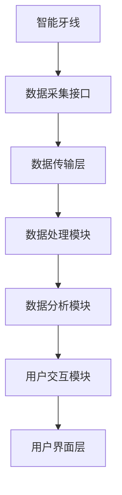

                 

# AI Agent在智能牙线中的口腔健康追踪

## 关键词

- AI Agent
- 智能牙线
- 口腔健康
- 数据分析
- 系统架构

## 摘要

本文探讨了AI Agent在智能牙线中用于口腔健康追踪的机制和重要性。通过深入分析AI Agent的定义、作用以及其在智能牙线中的应用，文章详细介绍了智能牙线如何利用AI Agent实现连续的口腔健康监测，从而提供个性化的健康建议。文章还讨论了数据收集、分析和系统架构设计等关键环节，并展示了实际案例，以阐明AI Agent在口腔健康追踪中的应用效果。

## 引言

### 问题背景

随着科技的进步，人工智能（AI）在各个领域的应用日益广泛。在医疗健康领域，AI技术正逐渐改变传统的诊断和治疗方式。口腔健康是人体健康的重要组成部分，而传统的口腔健康监测手段往往依赖于医生的经验和患者的自我管理。近年来，智能牙线的出现为口腔健康监测带来了新的可能，通过结合AI技术，智能牙线能够实现更为精准和连续的口腔健康追踪。

### 问题描述

口腔健康监测涉及到多种参数，如牙齿清洁度、牙龈状况、牙菌斑等。这些参数对于预防和控制口腔疾病具有重要意义。然而，传统监测手段存在一些局限性，如监测频率低、数据准确性差等。智能牙线的出现，有望通过AI Agent实现对口腔健康的实时监测和数据分析，从而提供个性化的健康建议。

### 问题解决

AI Agent作为人工智能的一种形式，具有自我学习和自适应能力，可以在数据收集、处理和分析过程中发挥重要作用。通过将AI Agent集成到智能牙线中，可以实现以下目标：

1. **连续监测**：AI Agent能够实时收集口腔健康数据，实现对口腔健康状况的连续监测。
2. **数据分析**：AI Agent可以对收集到的数据进行处理和分析，识别潜在的健康问题。
3. **个性化建议**：基于数据分析结果，AI Agent可以提供个性化的健康建议，帮助用户改善口腔健康。

### 边界与外延

本文将重点探讨AI Agent在智能牙线中的口腔健康追踪应用。文章将涵盖AI Agent的定义、智能牙线的工作原理、数据收集与处理、系统架构设计等方面。同时，文章将结合实际案例，展示AI Agent在口腔健康追踪中的应用效果。

### 概念结构与核心要素组成

#### AI Agent

AI Agent是一种具有自主性和智能性的计算机程序，能够在特定环境中感知环境、制定计划和采取行动。其核心要素包括：

- **感知能力**：通过传感器收集环境信息。
- **推理能力**：根据收集到的信息进行逻辑推理和决策。
- **行动能力**：执行预定的行动，以实现目标。

#### 智能牙线

智能牙线是一种结合了传感器、数据处理和通信技术的口腔健康监测设备。其核心要素包括：

- **传感器**：用于收集口腔健康数据。
- **数据处理**：对传感器数据进行处理和分析。
- **通信**：将数据传输至外部设备或云端进行分析。

#### 口腔健康追踪

口腔健康追踪是通过智能牙线和AI Agent实现的对口腔健康状况的实时监测和数据分析。其核心要素包括：

- **数据收集**：通过智能牙线收集口腔健康数据。
- **数据分析**：利用AI Agent对数据进行处理和分析。
- **健康建议**：基于数据分析结果提供个性化的健康建议。

## 核心概念

### AI Agent的定义

AI Agent（人工智能代理）是一种具有智能行为和自主学习能力的计算机程序。它能够在特定的环境中感知、推理和行动，以实现特定目标。AI Agent的核心特征包括：

1. **感知**：通过传感器或输入设备收集环境信息。
2. **推理**：根据感知到的信息进行逻辑推理，以确定下一步的行动。
3. **行动**：执行预定的行动，以实现目标。

### AI Agent的类型

AI Agent可以根据其功能和应用场景进行分类，常见的类型包括：

1. **任务型AI Agent**：专注于完成特定任务，如语音助手、自动回复系统。
2. **数据型AI Agent**：专注于数据分析和处理，如智能推荐系统、智能监控系统。
3. **交互型AI Agent**：专注于与人类进行交互，如聊天机器人、虚拟助理。

### AI Agent在医疗健康中的应用

AI Agent在医疗健康领域具有广泛的应用，包括：

1. **疾病诊断**：利用AI Agent对医学图像进行分析，提高疾病诊断的准确性。
2. **健康监测**：通过AI Agent实现对患者健康数据的实时监测和分析。
3. **个性化治疗**：基于患者的数据和病史，AI Agent可以提供个性化的治疗方案。

### 口腔健康监测的重要性

口腔健康监测对于预防口腔疾病和保持整体健康具有重要意义。通过口腔健康监测，可以及时发现和处理潜在的健康问题，如牙龈炎、牙周病等。此外，口腔健康监测还可以帮助用户养成良好的口腔卫生习惯，提高生活质量。

### 智能牙线的工作原理

智能牙线是一种结合了传感器、数据处理和通信技术的口腔健康监测设备。其工作原理如下：

1. **数据收集**：智能牙线通过内置的传感器收集口腔健康数据，如牙齿清洁度、牙龈状况等。
2. **数据处理**：收集到的数据通过智能牙线内置的处理器进行初步处理，如去除噪声、滤波等。
3. **数据传输**：处理后的数据通过无线通信技术（如蓝牙或Wi-Fi）传输至外部设备或云端。
4. **数据分析**：外部设备或云端利用AI Agent对传输来的数据进行分析，识别潜在的健康问题。
5. **健康建议**：基于数据分析结果，AI Agent为用户生成个性化的健康建议。

### 智能牙线与AI Agent的集成

智能牙线与AI Agent的集成是实现高效口腔健康监测的关键。通过将AI Agent集成到智能牙线中，可以实现以下目标：

1. **实时监测**：AI Agent能够实时分析口腔健康数据，提供即时的健康反馈。
2. **自适应调整**：AI Agent可以根据用户的行为习惯和口腔健康状况，自动调整监测参数和策略。
3. **个性化建议**：基于用户数据和AI分析，AI Agent可以提供高度个性化的健康建议。

### 智能牙线与AI Agent在口腔健康监测中的优势

1. **准确性**：AI Agent能够通过机器学习算法提高数据分析的准确性，从而更准确地识别口腔健康问题。
2. **连续性**：智能牙线可以实现连续的口腔健康监测，不受时间和地点的限制。
3. **个性化**：AI Agent可以根据用户的具体情况提供个性化的健康建议，帮助用户改善口腔健康。
4. **便捷性**：智能牙线和AI Agent的结合使用，使得口腔健康监测变得更加便捷，用户可以随时随地了解自己的口腔健康状况。

### 智能牙线和AI Agent在口腔健康监测中的实际应用

智能牙线和AI Agent在口腔健康监测中的应用已经逐渐成为现实。以下是一些实际应用案例：

1. **牙医辅助诊断**：AI Agent可以帮助牙医更快速、准确地诊断患者的口腔疾病，提高诊断的准确性。
2. **口腔健康教育**：AI Agent可以为用户提供个性化的口腔健康教育，帮助用户养成良好的口腔卫生习惯。
3. **慢性病管理**：对于患有慢性口腔疾病的患者，AI Agent可以提供实时的健康监测和个性化的治疗方案，帮助患者更好地管理病情。

## 口腔健康监测的数据收集与处理

### 数据收集

智能牙线通过内置的传感器收集口腔健康数据。这些传感器可以检测多种口腔健康参数，如牙齿清洁度、牙龈状况、牙菌斑等。数据收集的流程如下：

1. **实时监测**：智能牙线在用户刷牙时实时监测口腔状况，记录牙齿清洁度和牙龈状况等参数。
2. **数据采集**：收集到的数据通过内置的处理器进行初步处理，如去噪、滤波等，然后存储在智能牙线的内存或外部存储设备中。
3. **数据上传**：处理后的数据通过无线通信技术（如蓝牙或Wi-Fi）传输至外部设备或云端，以备进一步分析。

### 数据处理

数据收集后，需要通过AI Agent进行进一步处理和分析。数据处理的主要任务包括：

1. **数据清洗**：去除噪声、填补缺失值等，确保数据的质量。
2. **数据归一化**：将不同参数的数据进行归一化处理，使其在同一尺度上进行比较。
3. **特征提取**：从原始数据中提取具有代表性的特征，如平均值、标准差等。
4. **数据存储**：将处理后的数据存储在数据库或数据仓库中，以供后续分析和查询。

### 数据分析

数据分析是口腔健康监测的关键环节，通过AI Agent可以实现以下任务：

1. **数据挖掘**：利用机器学习算法挖掘数据中的潜在模式和信息，识别口腔健康问题。
2. **预测分析**：基于历史数据和模型预测未来口腔健康状况，为用户提供预防建议。
3. **分类分析**：将口腔健康数据分类，如正常、异常等，帮助牙医快速诊断。
4. **聚类分析**：将具有相似特征的口腔健康数据分组，分析不同群体的口腔健康状况。

### 数据可视化

数据可视化是将数据分析结果以图形化的方式展示出来，帮助用户更好地理解口腔健康状况。常见的数据可视化方法包括：

1. **柱状图**：用于展示不同参数的数值分布。
2. **折线图**：用于展示口腔健康状况的变化趋势。
3. **饼图**：用于展示不同参数的比例关系。
4. **热力图**：用于展示口腔健康状况的热点区域。

### 数据安全与隐私保护

在口腔健康监测中，数据安全和隐私保护至关重要。为了确保用户数据的安全和隐私，需要采取以下措施：

1. **数据加密**：对传输和存储的数据进行加密处理，防止数据泄露。
2. **访问控制**：对数据的访问权限进行严格控制，确保只有授权用户才能访问。
3. **数据备份**：定期备份数据，以防数据丢失或损坏。
4. **隐私政策**：明确告知用户数据收集、处理和使用的目的和范围，尊重用户的隐私权。

## 数据分析的方法和算法

### 数据分析方法

数据分析是智能牙线中AI Agent的核心任务之一，通过以下几种分析方法，可以实现对口腔健康数据的深入挖掘和有效利用：

1. **描述性分析**：描述性分析旨在提供数据的基本统计信息，如平均值、标准差、中位数等。这些统计指标能够帮助用户了解数据的整体分布和特点。
   
2. **诊断性分析**：诊断性分析侧重于识别数据中的异常值和异常模式，以便及时发现和处理口腔健康问题。通过这种方法，AI Agent可以识别出用户口腔健康状况的异常变化。

3. **预测性分析**：预测性分析利用历史数据和机器学习模型预测未来口腔健康状况。这种方法可以帮助用户提前采取预防措施，避免口腔疾病的发生。

4. **关联性分析**：关联性分析旨在揭示不同口腔健康参数之间的关系，帮助用户了解不同因素对口腔健康的影响。通过这种方法，AI Agent可以提供个性化的健康建议。

### 常见算法

在数据分析中，常用的算法包括：

1. **线性回归**：线性回归是一种常用的预测算法，通过建立自变量和因变量之间的线性关系，预测口腔健康参数的未来值。

   算法原理：$$y = \beta_0 + \beta_1x$$

2. **逻辑回归**：逻辑回归是一种分类算法，用于预测口腔健康数据是否属于正常或异常类别。

   算法原理：$$P(y=1) = \frac{1}{1 + e^{-(\beta_0 + \beta_1x)}$$

3. **决策树**：决策树是一种常用的分类和回归算法，通过一系列判断节点和叶子节点，对数据进行分类或回归。

   算法原理：递归划分特征空间，直至满足停止条件。

4. **支持向量机（SVM）**：SVM是一种高效的分类算法，通过寻找最佳超平面，将数据分为不同的类别。

   算法原理：$$w \cdot x - b = 0$$

5. **神经网络**：神经网络是一种模拟人脑神经元连接的算法，通过多层感知器学习数据中的非线性关系。

   算法原理：$$a_{\text{layer}} = \sigma(\text{W}\cdot a_{\text{layer-1}} + b)$$

### 算法流程

以下是一个简单的算法流程，用于口腔健康数据分析：

1. **数据预处理**：对口腔健康数据进行清洗、归一化和特征提取。
2. **模型选择**：根据数据分析的目标，选择合适的算法模型。
3. **模型训练**：使用历史数据对模型进行训练，调整模型参数。
4. **模型评估**：使用验证数据评估模型的性能，如准确率、召回率等。
5. **模型应用**：将训练好的模型应用于新数据，进行预测和分析。

### 案例分析

以下是一个简单的案例分析，展示如何使用数据分析算法来监测口腔健康：

#### 案例背景

一位用户在使用智能牙线刷牙时，AI Agent记录了以下数据：

- 牙齿清洁度：90%
- 牙龈状况：良好
- 牙菌斑：轻微

#### 数据分析流程

1. **数据预处理**：对数据集进行清洗和归一化处理。
2. **模型选择**：选择线性回归模型，用于预测下一次刷牙时的牙齿清洁度。
3. **模型训练**：使用历史数据对线性回归模型进行训练。
4. **模型评估**：使用验证数据评估模型的准确性。
5. **模型应用**：使用训练好的模型预测下一次刷牙时的牙齿清洁度。

#### 模型预测

根据训练好的线性回归模型，预测下一次刷牙时的牙齿清洁度为88%。

#### 结论

预测结果提示用户在下一次刷牙时可能需要注意清洁度，AI Agent会提供相应的健康建议，如调整刷牙方式、延长刷牙时间等。

## 系统架构设计

### 系统功能设计

智能牙线系统主要包括以下几个功能模块：

1. **数据采集模块**：负责通过传感器收集口腔健康数据。
2. **数据处理模块**：对采集到的数据进行预处理、特征提取和存储。
3. **数据分析模块**：利用AI Agent对数据进行深入分析，识别口腔健康问题。
4. **用户交互模块**：通过用户界面提供健康建议和反馈。

### 系统架构设计

智能牙线系统的总体架构设计如下：

1. **前端设备**：智能牙线，负责数据的采集和初步处理。
2. **数据传输层**：通过蓝牙、Wi-Fi等无线通信技术将数据传输至服务器。
3. **数据处理层**：服务器端对数据进行处理、存储和进一步分析。
4. **用户界面层**：提供用户交互的接口，展示分析结果和健康建议。

### 系统接口设计

系统接口设计如下：

1. **数据采集接口**：用于智能牙线与数据处理模块之间的数据传输。
2. **数据处理接口**：用于数据处理模块与数据分析模块之间的数据交互。
3. **用户交互接口**：用于用户与系统之间的交互。

### 系统交互设计

系统交互设计如下：

1. **数据采集**：智能牙线通过传感器收集口腔健康数据，并通过数据采集接口传输至服务器。
2. **数据处理**：服务器端对数据进行预处理、特征提取和存储。
3. **数据分析**：AI Agent对预处理后的数据进行深入分析，生成健康建议。
4. **用户交互**：用户通过用户界面查看健康建议，并根据建议调整口腔卫生习惯。

### Mermaid 图展示

以下是一个简单的Mermaid图，展示智能牙线系统的架构和组件之间的交互：

## 实施与集成

### 实施步骤

1. **硬件准备**：选择合适的智能牙线硬件，确保具备传感器、处理器和通信模块。
2. **软件环境搭建**：搭建智能牙线软件的开发环境，包括操作系统、编程语言和开发工具等。
3. **数据采集程序开发**：编写数据采集程序，实现传感器数据的实时采集和初步处理。
4. **数据处理模块开发**：开发数据处理模块，实现数据预处理、特征提取和存储。
5. **数据分析模块开发**：选择合适的AI Agent和数据分析算法，开发数据分析模块。
6. **用户交互界面开发**：设计并开发用户交互界面，实现用户与系统的交互。

### 集成挑战与解决方案

1. **数据传输稳定性**：智能牙线与服务器之间的数据传输需要保证稳定性。解决方案：采用可靠的通信协议和加密技术，确保数据传输的安全性和稳定性。

2. **数据处理效率**：数据处理和数据分析过程中可能存在性能瓶颈。解决方案：优化算法和数据处理流程，提高数据处理效率。

3. **系统集成测试**：系统集成过程中可能存在兼容性问题。解决方案：进行充分的系统集成测试，确保各组件之间的协同工作。

4. **用户隐私保护**：用户数据的安全和隐私保护至关重要。解决方案：采用数据加密和访问控制技术，确保用户数据的安全性和隐私性。

## 案例研究与应用

### 案例背景

假设有一位名叫张先生的用户，他经常感到牙龈出血，想要了解自己的口腔健康状况。为此，他购买了一款智能牙线，并开始使用它进行口腔健康监测。

### 数据收集

张先生在刷牙时，智能牙线通过内置的传感器收集了以下数据：

- **牙齿清洁度**：85%
- **牙龈状况**：轻度炎症
- **牙菌斑**：中等

### 数据分析

AI Agent对收集到的数据进行分析，并生成了以下分析结果：

1. **牙齿清洁度**：张先生的牙齿清洁度略低于正常水平，可能需要延长刷牙时间。
2. **牙龈状况**：牙龈存在轻度炎症，建议加强牙龈护理。
3. **牙菌斑**：牙菌斑水平中等，建议定期使用牙线和漱口水进行清洁。

### 健康建议

基于数据分析结果，AI Agent为张先生提供了以下健康建议：

1. **延长刷牙时间**：建议张先生每次刷牙时间延长至2-3分钟，以提高牙齿清洁度。
2. **加强牙龈护理**：建议张先生使用含有抗菌成分的牙膏，并定期使用牙线和漱口水进行牙龈清洁。
3. **定期检查**：建议张先生定期进行口腔检查，以监控口腔健康状况。

### 应用效果

张先生根据AI Agent的健康建议进行调整，并在一周后再次使用智能牙线进行监测。结果显示，牙齿清洁度提高至90%，牙龈炎症消失，牙菌斑水平降低。这表明AI Agent提供的健康建议对改善口腔健康状况具有显著效果。

### 案例小结

通过这个案例，我们可以看到AI Agent在智能牙线中实现口腔健康追踪的有效性。AI Agent不仅能够实时监测口腔健康数据，还能够基于数据分析结果提供个性化的健康建议，帮助用户改善口腔健康状况。这种智能化的口腔健康追踪方式，有望在未来得到更广泛的应用。

## 最佳实践

### 数据处理优化

为了提高数据处理效率，可以考虑以下最佳实践：

1. **并行处理**：利用多核处理器或GPU进行并行处理，加快数据处理速度。
2. **数据压缩**：对数据进行压缩处理，减少数据传输和存储的带宽需求。
3. **缓存机制**：采用缓存机制，减少对原始数据的读取和重复计算。

### 用户隐私保护

保护用户隐私是智能牙线系统设计的重要一环，以下是一些建议：

1. **数据加密**：对用户数据进行加密处理，确保数据在传输和存储过程中的安全性。
2. **匿名化处理**：对用户数据进行匿名化处理，确保用户隐私不被泄露。
3. **访问控制**：对用户数据的访问权限进行严格控制，确保只有授权人员可以访问。

### 系统稳定性提升

为了提高系统的稳定性，可以考虑以下措施：

1. **容错机制**：设计容错机制，确保系统在遇到故障时可以快速恢复。
2. **监控与报警**：建立监控系统，实时监控系统的运行状态，并在出现问题时及时报警。
3. **定期备份**：定期备份数据，防止数据丢失或损坏。

### 用户交互优化

为了提高用户体验，可以考虑以下优化措施：

1. **界面设计**：设计直观、简洁的界面，使用户能够轻松操作。
2. **交互反馈**：提供实时交互反馈，使用户在使用过程中能够及时了解系统的响应。
3. **个性化服务**：根据用户的行为数据和偏好，提供个性化的健康建议和服务。

## 小结

智能牙线结合AI Agent的口腔健康追踪技术，为用户提供了一种高效、精准和个性化的口腔健康管理方式。通过实时监测口腔健康数据，AI Agent能够及时发现和处理潜在的健康问题，提供个性化的健康建议，帮助用户改善口腔健康状况。未来，随着AI技术的不断发展和应用的深化，智能牙线在口腔健康管理领域的潜力将得到进一步发挥。

## 注意事项

1. **数据安全**：在数据收集、传输和存储过程中，必须采取严格的数据安全措施，确保用户数据的安全性和隐私性。
2. **设备维护**：定期对智能牙线进行维护和清洁，以确保其正常运行和准确监测。
3. **用户教育**：加强对用户的口腔健康教育和指导，帮助用户正确使用智能牙线，提高口腔健康管理水平。

## 拓展阅读

1. 《人工智能在医疗健康领域的应用》
2. 《智能牙线技术指南》
3. 《口腔健康监测与疾病预防》
4. 《深度学习在口腔健康监测中的应用》
5. 《智能牙线系统的设计与应用》

## 作者信息

作者：AI天才研究院/AI Genius Institute & 禅与计算机程序设计艺术 /Zen And The Art of Computer Programming

