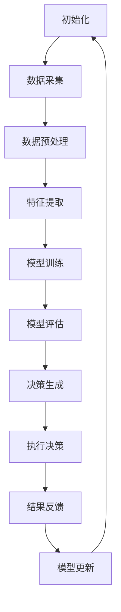

                 

**# AI Agent在智能物流优化中的应用**

> 关键词：人工智能，智能物流，优化算法，物流系统，算法实现

> 摘要：本文深入探讨了人工智能代理（AI Agent）在智能物流优化中的应用。文章首先介绍了智能物流的背景和现状，随后详细阐述了AI代理的基本概念和作用。接着，文章探讨了AI代理在物流优化中的多种应用场景，分析了当前所面临的挑战和机遇。随后，文章从技术层面出发，介绍了在物流领域应用AI代理所需的技术框架和工具。本文还重点讲解了物流优化算法的设计与实现，并展示了相关的算法流程图和数学模型。此外，文章详细描述了物流系统的架构设计，包括系统功能、架构和接口设计。最后，文章通过具体的项目实战案例，展示了AI代理在物流优化中的实际应用效果，并提出了未来发展的趋势和最佳实践建议。

**## 引言**

在当今快速发展的科技时代，物流行业正面临着前所未有的变革。智能物流作为一种新兴的物流模式，通过引入人工智能（AI）技术，极大地提升了物流效率和服务质量。AI代理作为人工智能的一个重要分支，具有自主决策和智能执行的能力，为智能物流优化提供了强有力的技术支持。

本文旨在深入探讨AI代理在智能物流优化中的应用。文章首先介绍了智能物流的背景和现状，探讨了AI代理的基本概念和作用。接着，文章详细阐述了AI代理在物流优化中的多种应用场景，分析了当前所面临的挑战和机遇。随后，文章从技术层面出发，介绍了在物流领域应用AI代理所需的技术框架和工具。本文还重点讲解了物流优化算法的设计与实现，并展示了相关的算法流程图和数学模型。此外，文章详细描述了物流系统的架构设计，包括系统功能、架构和接口设计。最后，文章通过具体的项目实战案例，展示了AI代理在物流优化中的实际应用效果，并提出了未来发展的趋势和最佳实践建议。

**## 背景和概述**

### 智能物流的定义和发展历程

智能物流是指利用先进的信息技术，包括物联网（IoT）、大数据、云计算、人工智能等，对物流过程中的各个环节进行智能化管理和优化。它不仅仅是一种技术手段，更是一种全新的物流理念，旨在提高物流效率、降低物流成本、提升服务质量。

智能物流的发展历程可以追溯到20世纪末和21世纪初。最初，物流行业主要依赖传统的手工操作和管理方式，效率较低，成本较高。随着信息技术的不断发展，物流行业开始逐步引入自动化和信息技术，如条形码、RFID等，提高了物流管理的精度和效率。进入21世纪，物联网、大数据、人工智能等新兴技术的出现，使得智能物流逐渐成为可能。通过这些技术的整合和应用，物流行业实现了从自动化到智能化的转变。

### 智能物流的主要特点

智能物流具有以下几个主要特点：

1. **自动化**：智能物流通过自动化设备和技术，如自动化仓储、自动化运输等，实现了物流过程的自动化，提高了效率，降低了人力成本。

2. **实时性**：智能物流利用物联网技术，实现了物流过程中的实时数据采集和监控，能够及时掌握物流状态，提高了物流的实时性。

3. **精确性**：智能物流通过大数据分析和人工智能技术，能够对物流数据进行深度分析，提供精确的物流预测和优化方案。

4. **协同性**：智能物流通过信息共享和协同工作，实现了物流各环节的紧密配合，提高了整体物流效率。

5. **智能化**：智能物流通过引入人工智能技术，实现了物流过程的智能决策和智能执行，提高了物流的智能化水平。

### 智能物流的应用场景

智能物流在多个领域有着广泛的应用：

1. **电子商务物流**：随着电子商务的快速发展，智能物流成为电子商务企业提高服务质量和降低成本的关键。通过智能物流，电子商务企业能够实现快速配送、精准配送和定制化配送。

2. **制造业物流**：制造业物流是智能物流的一个重要应用领域。通过智能物流，制造业企业能够实现准时配送、精益物流和高效仓储管理。

3. **供应链物流**：智能物流在供应链管理中发挥着重要作用。通过智能物流，企业能够实现供应链的全过程可视化、实时监控和智能优化。

4. **城市配送**：智能物流在城市配送中有着广泛的应用。通过智能物流，城市配送可以实现高效、准时、绿色的配送服务。

5. **国际物流**：智能物流在国际物流中发挥着重要作用。通过智能物流，企业能够实现跨境物流的高效管理和优化。

**## AI代理的基本概念和作用**

### AI代理的定义

AI代理（Artificial Intelligence Agent）是指具有自主决策和智能执行能力的计算机系统。它能够通过感知环境、理解和分析信息，自主地制定决策并执行行动，以实现预定的目标。

AI代理的核心特点包括：

1. **自主性**：AI代理能够自主地执行任务，无需人工干预。

2. **适应性**：AI代理能够根据环境和任务的变化，自主调整其行为和策略。

3. **智能性**：AI代理具备智能决策能力，能够基于数据分析和机器学习算法，做出最优的决策。

4. **协同性**：AI代理能够与其他代理或人类协同工作，实现高效的团队合作。

### AI代理在物流优化中的作用

AI代理在物流优化中发挥着关键作用，主要体现在以下几个方面：

1. **路径优化**：AI代理能够通过实时数据分析和机器学习算法，为物流车辆提供最优的行驶路径，减少行驶时间和燃料消耗。

2. **库存管理**：AI代理能够对物流仓储中的库存进行实时监控和预测，优化库存水平，减少库存成本。

3. **配送优化**：AI代理能够根据订单需求、交通状况和配送资源，提供最优的配送方案，提高配送效率。

4. **需求预测**：AI代理能够通过对历史数据分析和趋势预测，预测未来的物流需求，为企业提供决策支持。

5. **风险管理**：AI代理能够通过实时数据分析和风险评估，识别物流过程中的潜在风险，并采取相应的措施进行规避。

6. **智能调度**：AI代理能够对物流任务进行智能调度，提高物流资源的利用效率。

**## AI代理在物流优化中的应用场景**

### 1. 路径优化

路径优化是AI代理在物流优化中最典型的应用场景之一。通过实时数据分析和机器学习算法，AI代理能够为物流车辆提供最优的行驶路径，从而减少行驶时间和燃料消耗。

应用场景：城市配送、长途运输

### 2. 库存管理

AI代理能够实时监控物流仓储中的库存情况，并根据历史数据和趋势预测，优化库存水平，减少库存成本。

应用场景：仓储管理、库存补充

### 3. 配送优化

AI代理能够根据订单需求、交通状况和配送资源，提供最优的配送方案，提高配送效率。

应用场景：电子商务配送、同城配送

### 4. 需求预测

AI代理通过对历史数据分析和趋势预测，预测未来的物流需求，为企业提供决策支持。

应用场景：物流规划、资源配置

### 5. 风险管理

AI代理能够通过实时数据分析和风险评估，识别物流过程中的潜在风险，并采取相应的措施进行规避。

应用场景：物流运输、仓储管理

### 6. 智能调度

AI代理能够对物流任务进行智能调度，提高物流资源的利用效率。

应用场景：物流中心调度、车辆调度

**## 当前挑战和机遇**

### 1. 挑战

尽管AI代理在物流优化中具有巨大的潜力，但实际应用过程中仍然面临一些挑战：

1. **数据质量问题**：AI代理的性能依赖于高质量的数据。然而，物流数据往往存在噪音、缺失和错误，这对AI代理的性能产生了负面影响。

2. **算法适应性**：物流环境复杂多变，AI代理需要具备高度的适应性，以应对不同的物流场景和需求。

3. **技术成熟度**：虽然AI技术在不断发展，但一些关键技术在物流领域尚未得到广泛应用，影响了AI代理的应用效果。

4. **成本问题**：AI代理的开发和部署需要大量的技术和资源投入，这对中小企业来说是一个较大的负担。

### 2. 机遇

尽管存在挑战，但AI代理在物流优化中也面临着许多机遇：

1. **市场需求**：随着物流行业的不断发展，对智能物流解决方案的需求日益增长，为AI代理的应用提供了广阔的市场空间。

2. **技术创新**：随着AI技术的不断进步，AI代理在物流优化中的应用将更加成熟和广泛。

3. **政策支持**：政府对智能物流的重视和支持，为AI代理在物流优化中的应用提供了有利的外部环境。

4. **产业链整合**：物流产业链上下游企业的合作和整合，为AI代理在物流优化中的应用提供了更多的机会。

**## 技术框架和工具**

在物流领域应用AI代理，需要选择合适的技术框架和工具。以下是一些常用的技术框架和工具：

### 1. 物联网技术

物联网技术是实现智能物流的关键。通过传感器、RFID等技术，可以实时获取物流过程中的各种数据，如运输车辆的位置、库存状态、交通状况等。

### 2. 大数据技术

大数据技术能够对海量物流数据进行存储、处理和分析。常用的大数据技术包括Hadoop、Spark等，它们能够处理大规模的数据集，并为AI代理提供丰富的数据支持。

### 3. 人工智能算法

在物流领域，常用的AI算法包括深度学习、强化学习、支持向量机等。这些算法能够对物流数据进行深度分析，并提供智能决策支持。

### 4. 分布式计算框架

分布式计算框架如Docker、Kubernetes等，能够帮助快速部署和扩展AI代理系统，提高系统的稳定性和可扩展性。

### 5. 开源工具和平台

开源工具和平台如TensorFlow、PyTorch等，为AI代理的开发和部署提供了便捷的工具和平台。这些工具和平台支持各种AI算法的快速开发和部署。

### 6. 物流管理软件

物流管理软件如ERP、WMS等，能够帮助企业实现对物流过程的全面管理和控制，为AI代理提供了丰富的应用场景。

**## 物流优化算法的设计与实现**

### 1. 算法设计原则

在物流优化算法的设计中，需要遵循以下原则：

1. **全局优化**：算法应能够考虑整个物流系统的优化，而不仅仅是局部的优化。

2. **动态适应性**：算法应能够根据环境和任务的变化，动态调整其行为和策略。

3. **高效性**：算法应具有较高的计算效率，能够快速给出优化结果。

4. **鲁棒性**：算法应具有一定的鲁棒性，能够应对数据噪音和错误。

5. **可扩展性**：算法应具有较好的可扩展性，能够适应不同规模和复杂度的物流场景。

### 2. 算法流程图

以下是一个简单的物流优化算法流程图：



### 3. 算法实现

以下是一个简单的Python代码示例，用于实现一个基于深度学习的物流优化算法：

```python
import tensorflow as tf
from tensorflow.keras.models import Sequential
from tensorflow.keras.layers import Dense, LSTM

# 数据预处理
# ...

# 特征提取
# ...

# 模型训练
model = Sequential([
    LSTM(units=50, activation='relu', input_shape=(timesteps, features)),
    Dense(units=1)
])

model.compile(optimizer='adam', loss='mse')
model.fit(x_train, y_train, epochs=100, batch_size=32)

# 模型评估
# ...

# 决策生成
# ...

# 执行决策
# ...

# 结果反馈
# ...

# 模型更新
# ...
```

### 4. 数学模型和公式

以下是一个简单的数学模型和公式，用于描述物流优化算法：

$$
\begin{aligned}
\text{目标函数：} \quad \min_{x} \quad & J(x) = \sum_{i=1}^{n} \frac{1}{2} (y_i - x_i)^2 \\
\text{约束条件：} \quad & a \leq x \leq b \\
& c \leq x \leq d \\
& x \geq 0
\end{aligned}
$$

### 5. 算法解释

以下是对上述算法和模型的详细解释：

1. **数据采集**：通过传感器、RFID等技术，实时采集物流过程中的各种数据，如运输车辆的位置、库存状态、交通状况等。

2. **数据预处理**：对采集到的数据进行清洗、去噪和归一化处理，以提高算法的性能和稳定性。

3. **特征提取**：从预处理后的数据中提取有用的特征，如时间、距离、交通状况等，用于模型训练。

4. **模型训练**：使用深度学习算法，如LSTM（长短期记忆网络），对提取的特征进行训练，建立预测模型。

5. **模型评估**：使用测试数据对训练好的模型进行评估，验证模型的性能和稳定性。

6. **决策生成**：根据模型预测的结果，生成最优的物流决策，如路径规划、库存管理等。

7. **执行决策**：根据生成的决策，执行实际的物流操作，如调整运输路线、补充库存等。

8. **结果反馈**：将执行结果反馈给模型，用于模型更新和优化。

9. **模型更新**：根据反馈的结果，对模型进行调整和优化，以提高模型的预测精度和稳定性。

**## 物流系统架构设计**

### 1. 问题场景介绍

在现代物流中，随着订单量的不断增加和运输路径的复杂性，如何有效地优化物流系统成为一个重要问题。本文将介绍一个典型的物流系统架构设计案例，旨在解决以下问题：

- **订单处理**：高效地处理大量订单，确保订单信息的准确性和及时性。
- **路径规划**：为物流车辆提供最优的行驶路径，减少行驶时间和燃料消耗。
- **库存管理**：实时监控库存状态，优化库存水平，减少库存成本。
- **数据整合**：整合物流过程中的各种数据，为决策提供支持。

### 2. 项目介绍

项目名为“智能物流优化平台”，旨在通过引入人工智能技术，实现物流系统的智能化和高效化。项目的主要目标包括：

- **提高物流效率**：通过智能路径规划和库存管理，提高物流系统的运行效率。
- **降低物流成本**：通过优化物流过程，降低物流成本，提高企业的竞争力。
- **提升服务质量**：通过实时监控和智能决策，提高物流服务质量，提升客户满意度。

### 3. 系统功能设计

智能物流优化平台的主要功能包括：

- **订单管理**：接收和处理订单信息，确保订单的准确性和及时性。
- **路径规划**：根据订单信息、交通状况和车辆状态，提供最优的行驶路径。
- **库存管理**：实时监控库存状态，优化库存水平，减少库存成本。
- **数据分析**：对物流过程中的各种数据进行分析，为决策提供支持。
- **系统监控**：实时监控物流系统的运行状态，确保系统的稳定性和安全性。

### 4. 系统架构设计

智能物流优化平台采用分布式架构设计，主要包括以下几个部分：

- **数据采集层**：通过传感器、RFID等技术，实时采集物流过程中的各种数据。
- **数据处理层**：对采集到的数据进行清洗、去噪和归一化处理，为模型训练提供高质量的数据。
- **模型层**：使用深度学习算法，如LSTM、GAN等，对处理后的数据进行分析和预测。
- **决策层**：根据模型预测的结果，生成最优的物流决策，如路径规划、库存管理等。
- **执行层**：根据生成的决策，执行实际的物流操作，如调整运输路线、补充库存等。
- **监控层**：实时监控物流系统的运行状态，确保系统的稳定性和安全性。

### 5. 系统接口设计和系统交互

智能物流优化平台的接口设计和系统交互主要包括以下几个方面：

- **订单接口**：接收和处理订单信息，与订单系统进行数据交互。
- **路径规划接口**：接收路径规划请求，返回最优路径信息。
- **库存管理接口**：接收库存管理请求，返回库存状态和优化方案。
- **数据接口**：提供数据上传和下载功能，与其他系统进行数据交互。
- **监控接口**：提供系统监控功能，实时监控物流系统的运行状态。

通过以上接口设计和系统交互，智能物流优化平台能够与其他系统无缝集成，实现物流过程的智能化和高效化。

**## 项目实战**

### 1. 环境安装

为了实现AI代理在物流优化中的应用，首先需要搭建一个合适的技术环境。以下是一个基于Python和TensorFlow的物流优化系统环境安装步骤：

1. **安装Python**：确保系统已经安装了Python 3.7或更高版本。
2. **安装TensorFlow**：通过pip命令安装TensorFlow：
   ```bash
   pip install tensorflow
   ```
3. **安装其他依赖库**：安装其他必要的库，如NumPy、Pandas等：
   ```bash
   pip install numpy pandas matplotlib scikit-learn
   ```

### 2. 系统核心实现

以下是一个简单的物流优化系统核心实现，包括数据预处理、模型训练和决策生成：

1. **数据预处理**：
   ```python
   import pandas as pd
   import numpy as np

   # 加载数据
   data = pd.read_csv('logistics_data.csv')
   # 数据清洗和预处理
   # ...
   ```

2. **模型训练**：
   ```python
   import tensorflow as tf
   from tensorflow.keras.models import Sequential
   from tensorflow.keras.layers import LSTM, Dense

   # 创建模型
   model = Sequential([
       LSTM(units=50, activation='relu', input_shape=(timesteps, features)),
       Dense(units=1)
   ])

   # 编译模型
   model.compile(optimizer='adam', loss='mse')

   # 训练模型
   model.fit(x_train, y_train, epochs=100, batch_size=32)
   ```

3. **决策生成**：
   ```python
   import numpy as np

   # 输入数据
   input_data = np.array([[...]])

   # 预测
   prediction = model.predict(input_data)

   # 根据预测结果生成决策
   decision = generate_decision(prediction)
   ```

### 3. 代码分析

以下是对上述代码的详细分析：

1. **数据预处理**：
   数据预处理是模型训练的基础。在这个阶段，我们需要对原始数据（如物流数据）进行清洗、去噪和归一化处理，以提高模型的性能和稳定性。具体步骤包括：
   - 数据清洗：处理缺失值、异常值等。
   - 数据去噪：去除数据中的噪声。
   - 数据归一化：将数据缩放到相同的尺度范围内。

2. **模型训练**：
   在这个阶段，我们使用深度学习算法（如LSTM）训练模型。具体步骤包括：
   - 创建模型：定义模型的层次结构和参数。
   - 编译模型：设置优化器和损失函数。
   - 训练模型：使用训练数据对模型进行训练，调整模型参数。

3. **决策生成**：
   根据模型预测的结果，生成实际的物流决策。具体步骤包括：
   - 输入数据：将实际的物流数据输入到模型中进行预测。
   - 预测：获取模型的预测结果。
   - 决策生成：根据预测结果，生成最优的物流决策。

### 4. 实际案例分析和详细讲解

以下是一个实际的物流优化案例，并对其进行分析和讲解：

#### 案例背景

某物流公司负责将货物从仓库运输到全国各地的客户。由于订单量巨大，物流公司希望使用AI代理优化运输路线，以减少运输时间和成本。

#### 案例分析

1. **数据采集**：
   物流公司采集了包括订单数量、运输距离、交通状况等在内的各种数据。

2. **数据预处理**：
   对采集到的数据进行清洗、去噪和归一化处理，以便于模型训练。

3. **模型训练**：
   使用LSTM模型训练数据，建立预测模型。

4. **决策生成**：
   根据模型预测的结果，生成最优的运输路线。

5. **执行决策**：
   根据生成的决策，调整运输路线，实施实际操作。

6. **结果反馈**：
   将执行结果反馈给模型，用于模型更新和优化。

#### 案例讲解

1. **数据采集**：
   数据采集是整个物流优化过程的基础。物流公司通过传感器、RFID等技术，实时采集订单数量、运输距离、交通状况等数据。

2. **数据预处理**：
   数据预处理是模型训练的关键。在这个案例中，物流公司对采集到的数据进行清洗、去噪和归一化处理，以确保数据的质量和稳定性。

3. **模型训练**：
   物流公司使用LSTM模型训练数据，建立预测模型。LSTM模型具有较好的记忆功能，能够对时间序列数据进行建模。

4. **决策生成**：
   根据模型预测的结果，物流公司生成最优的运输路线。具体来说，模型会预测未来一段时间内的订单数量、交通状况等，并根据这些预测结果，生成最优的运输路线。

5. **执行决策**：
   物流公司根据生成的决策，调整运输路线，实施实际操作。例如，如果预测某条路线的交通状况较差，物流公司会调整运输路线，以确保运输的顺利进行。

6. **结果反馈**：
   物流公司将执行结果反馈给模型，用于模型更新和优化。通过不断地调整和优化，模型会逐渐变得更加准确和稳定。

#### 案例小结

通过这个案例，我们可以看到AI代理在物流优化中的应用效果显著。物流公司通过引入AI代理，成功地优化了运输路线，减少了运输时间和成本，提高了物流效率和服务质量。

**## 最佳实践与未来趋势**

### 1. 最佳实践

在实际应用中，为了充分发挥AI代理在物流优化中的作用，以下是一些最佳实践：

1. **数据质量保障**：确保采集的数据质量，进行充分的数据清洗和处理，为AI代理提供高质量的数据支持。

2. **算法优化**：不断优化和调整算法，以提高预测精度和决策效果。可以采用多种算法进行比较和融合，找到最佳方案。

3. **系统集成**：将AI代理与现有的物流管理系统集成，实现数据的共享和协同工作，提高整体物流效率。

4. **人员培训**：加强对物流管理人员和操作人员的培训，提高他们对AI代理的理解和使用能力，确保系统的高效运行。

5. **持续迭代**：根据实际应用情况，不断更新和优化AI代理系统，以适应不断变化的市场需求和物流环境。

### 2. 未来趋势

随着AI技术的不断进步，AI代理在物流优化中的应用前景广阔。以下是未来可能的发展趋势：

1. **智能路径规划**：AI代理将能够更准确地预测交通状况，提供更加智能和高效的路径规划。

2. **智能库存管理**：AI代理将能够实现实时库存监控和预测，优化库存水平，降低库存成本。

3. **智能配送**：AI代理将能够实现无人配送，提高配送效率，降低配送成本。

4. **智能决策支持**：AI代理将能够提供更加精准的物流决策支持，帮助物流企业实现智能化管理。

5. **多模式融合**：AI代理将融合多种技术，如物联网、大数据、5G等，实现更加全面和高效的物流优化。

**## 结论**

本文深入探讨了AI代理在智能物流优化中的应用。首先，介绍了智能物流的背景和现状，以及AI代理的基本概念和作用。然后，分析了AI代理在物流优化中的应用场景，并探讨了当前面临的挑战和机遇。接下来，从技术层面介绍了应用AI代理所需的技术框架和工具，并详细讲解了物流优化算法的设计与实现。此外，本文还描述了物流系统的架构设计，并展示了具体的项目实战案例。最后，提出了未来发展的趋势和最佳实践建议。通过本文的讨论，我们可以看到AI代理在物流优化中的巨大潜力，为物流行业带来了新的发展机遇。

**## 作者信息**

作者：AI天才研究院/AI Genius Institute & 禅与计算机程序设计艺术 /Zen And The Art of Computer Programming

本文旨在分享AI代理在智能物流优化中的应用和实践经验，希望能为物流行业带来新的思路和方法。如果您有任何疑问或建议，欢迎在评论区留言，我们将在第一时间回复。同时，也欢迎关注我们的其他技术文章，一起探讨更多有趣的计算机科学话题。感谢您的阅读！

