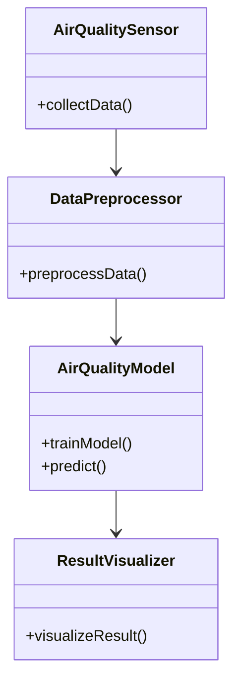
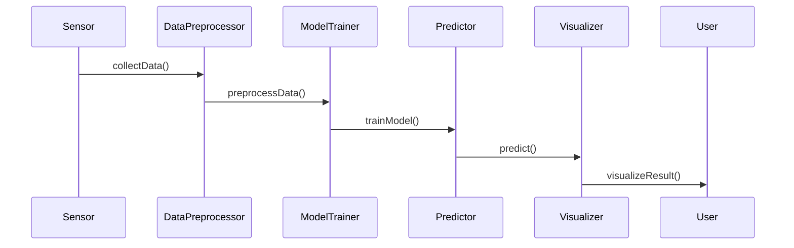

                 

# 《AI Agent在智能环境影响评估中的实践》

> 关键词：AI Agent、环境影响评估、智能环境、算法原理、系统架构

> 摘要：本文将深入探讨AI Agent在智能环境影响评估中的应用。首先，我们将介绍AI Agent的基本概念、工作原理以及在环境影响评估中的优势。接着，我们将详细解析智能环境影响评估的核心概念和基本原理，并通过Mermaid图和LaTeX公式来阐述其数学模型。随后，本文将展示AI Agent在EIA中的实际应用案例，包括算法原理的讲解、数学模型的推导和算法流程的解析。最后，我们将对系统架构进行深入分析，包括功能设计、领域模型和系统接口设计，并通过Mermaid图展示系统架构和交互流程。

## 目录

### 第一部分：背景介绍

#### 第1章 问题背景

1.1 问题起源

1.2 问题描述

1.3 问题解决

1.4 边界与外延

1.5 概念结构与核心要素组成

### 第二部分：核心概念与联系

#### 第2章 AI Agent原理

2.1 AI Agent的核心概念

2.2 AI Agent的工作原理

2.3 AI Agent的属性特征对比表格

#### 第3章 智能环境影响评估

3.1 智能环境影响评估的核心概念

3.2 智能环境影响评估的基本原理

3.3 智能环境影响评估的ER实体关系图架构

### 第三部分：算法原理讲解

#### 第4章 AI Agent在EIA中的应用

4.1 AI Agent在EIA中的应用场景

4.2 AI Agent的算法原理

4.3 算法原理的数学模型与公式

4.4 举例说明

### 第四部分：系统分析与架构设计

#### 第5章 系统功能设计

5.1 问题场景介绍

5.2 系统功能设计

5.3 领域模型

#### 第6章 系统架构设计

6.1 系统架构设计

6.2 系统接口设计

6.3 系统交互

### 第五部分：项目实战

#### 第7章 环境安装

#### 第8章 系统核心实现源代码

8.1 代码应用解读与分析

8.2 实际案例分析和详细讲解剖析

#### 第9章 项目小结

#### 第10章 最佳实践 Tips

#### 第11章 小结、注意事项、拓展阅读

---

## 第一部分：背景介绍

### 第1章 问题背景

#### 1.1 问题起源

随着人工智能（AI）技术的快速发展，其应用范围逐渐扩大，从智能家居到自动驾驶，从医疗诊断到金融分析，AI正深入到我们生活的方方面面。然而，AI技术的发展也带来了新的环境和伦理挑战。例如，AI算法可能导致数据偏见，影响社会公平；AI系统的部署可能加剧资源消耗和能源问题。因此，对智能环境影响评估（EIA）的需求日益迫切。

#### 1.2 问题描述

智能环境影响评估是一个复杂的过程，涉及多个方面的数据收集、处理和分析。传统的EIA方法主要依靠专家经验和预设模型，往往存在主观性和局限性。随着数据量和复杂度的增加，传统的EIA方法难以应对，导致评估结果的不准确和不全面。因此，需要一种能够自适应、自动化的评估工具，以应对智能环境带来的挑战。

#### 1.3 问题解决

AI Agent作为一种智能体，具有自主学习和决策的能力，可以在复杂环境中执行特定任务。AI Agent在智能环境影响评估中的应用，可以显著提高评估的准确性和效率。首先，AI Agent可以自动化地收集和处理大量环境数据，减少人为干预。其次，AI Agent可以通过机器学习算法不断优化评估模型，提高评估的准确性。最后，AI Agent可以实时响应环境变化，提供动态的评估结果，帮助决策者及时调整策略。

#### 1.4 边界与外延

AI Agent在EIA中的应用不仅限于环境监测和评估，还可以扩展到其他领域。例如，在能源管理中，AI Agent可以优化能源消耗，提高能源利用效率；在生态保护中，AI Agent可以监测生物多样性，预测生态变化。此外，AI Agent还可以与其他智能系统（如物联网、大数据等）集成，构建更智能的环境监测和评估体系。

#### 1.5 概念结构与核心要素组成

AI Agent在智能环境影响评估中的概念结构主要包括以下几个方面：

1. **环境数据收集**：AI Agent通过传感器、卫星图像、气象数据等途径收集环境数据。
2. **数据处理与预处理**：AI Agent对收集到的数据进行清洗、转换和归一化处理，为后续分析做好准备。
3. **模型构建与优化**：AI Agent利用机器学习算法构建环境评估模型，并不断优化模型，提高评估准确性。
4. **决策与建议**：AI Agent根据评估结果，为决策者提供决策支持和建议。
5. **实时响应与更新**：AI Agent可以实时监测环境变化，动态调整评估模型，保持评估的时效性。

通过以上要素的有机结合，AI Agent可以实现对智能环境影响的全面、准确和动态评估。

### 第二部分：核心概念与联系

#### 第2章 AI Agent原理

#### 2.1 AI Agent的核心概念

AI Agent是指能够感知环境、自主决策并执行任务的智能体。它通常由感知模块、决策模块和执行模块组成。感知模块负责收集环境信息，决策模块根据感知到的信息进行推理和规划，执行模块负责执行决策结果。

#### 2.2 AI Agent的工作原理

AI Agent的工作原理可以分为以下几个步骤：

1. **感知**：AI Agent通过传感器或传感器网络收集环境数据。
2. **预处理**：对收集到的数据进行预处理，如去噪、归一化和特征提取。
3. **推理与决策**：基于预处理后的数据，AI Agent使用机器学习算法或逻辑推理方法进行推理，生成决策。
4. **执行**：AI Agent根据决策结果，执行具体的任务或操作。

#### 2.3 AI Agent的属性特征对比表格

| 类别         | 特征对比                      |
|--------------|-------------------------------|
| 适应性       | 能够根据环境变化调整策略       |
| 智能化       | 能够自主学习和优化           |
| 自主性       | 不受外部干预，独立完成任务     |

#### 第3章 智能环境影响评估

#### 3.1 智能环境影响评估的核心概念

智能环境影响评估是指利用人工智能技术对智能环境中的各类环境因素进行系统性分析和评价。其核心概念包括：

1. **环境因素**：指智能环境中的各种自然和社会因素，如空气质量、水资源、土地利用等。
2. **影响评价**：指对环境因素对人类和社会造成的影响进行定量或定性的评价。
3. **智能模型**：指利用机器学习和数据挖掘技术构建的评估模型，用于预测和评估环境影响的趋势和变化。

#### 3.2 智能环境影响评估的基本原理

智能环境影响评估的基本原理可以分为以下几个步骤：

1. **数据收集**：通过传感器网络、卫星图像、调查问卷等方式收集环境数据。
2. **数据处理**：对收集到的数据进行清洗、转换和归一化处理，为模型构建做准备。
3. **模型构建**：利用机器学习算法构建环境评估模型，如回归模型、分类模型等。
4. **模型训练**：使用历史数据进行模型训练，优化模型参数。
5. **模型评估**：使用测试数据对模型进行评估，确保模型的准确性和稳定性。
6. **影响预测**：利用训练好的模型进行环境影响预测，提供决策支持。

#### 3.3 智能环境影响评估的ER实体关系图架构

智能环境影响评估的ER实体关系图如下：

```mermaid
erDiagram
    Environment ||--|{ Impact }  : has
    Impact ||--|{ Model }   : used by
    Model ||--|{ Data }   : trained on
    Data ||--|{ Sensor }   : collected by
    Sensor ||--|{ Environment }   : monitors
```

### 第三部分：算法原理讲解

#### 第4章 AI Agent在EIA中的应用

#### 4.1 AI Agent在EIA中的应用场景

AI Agent在智能环境影响评估中具有广泛的应用场景，包括但不限于：

1. **空气质量监测**：AI Agent可以通过传感器网络实时监测空气质量，预测污染物浓度变化，提供预警和决策支持。
2. **水资源管理**：AI Agent可以对水资源进行监控和预测，优化水资源分配，提高水资源利用效率。
3. **土地利用规划**：AI Agent可以帮助分析土地利用变化，预测土地利用的未来趋势，为城市规划提供科学依据。

#### 4.2 AI Agent的算法原理

AI Agent在EIA中的应用主要依赖于以下算法原理：

1. **机器学习算法**：AI Agent可以使用各种机器学习算法（如回归分析、决策树、神经网络等）对环境数据进行处理和分析。
2. **数据挖掘技术**：AI Agent可以通过数据挖掘技术（如聚类分析、关联规则挖掘等）发现环境数据中的潜在规律和模式。
3. **模型优化技术**：AI Agent可以使用模型优化技术（如交叉验证、网格搜索等）对评估模型进行优化，提高评估准确性。

#### 4.3 算法原理的数学模型与公式

以下是AI Agent在EIA中常用的数学模型与公式：

1. **预测模型**：使用回归分析模型预测环境因素的变化趋势。

$$
\hat{y} = \beta_0 + \beta_1 x_1 + \beta_2 x_2 + ... + \beta_n x_n
$$

其中，$\hat{y}$ 为预测值，$x_1, x_2, ..., x_n$ 为特征变量，$\beta_0, \beta_1, ..., \beta_n$ 为模型参数。

2. **损失函数**：使用均方误差（MSE）作为损失函数评估模型预测的准确性。

$$
MSE = \frac{1}{n} \sum_{i=1}^{n} (\hat{y_i} - y_i)^2
$$

其中，$\hat{y_i}$ 为预测值，$y_i$ 为实际值，$n$ 为数据样本数量。

3. **优化算法**：使用梯度下降算法优化模型参数。

$$
\beta_j = \beta_j - \alpha \frac{\partial}{\partial \beta_j} J(\beta)
$$

其中，$\beta_j$ 为模型参数，$\alpha$ 为学习率，$J(\beta)$ 为损失函数。

#### 4.4 举例说明

以空气质量监测为例，AI Agent的工作流程如下：

1. **数据收集**：通过传感器网络收集实时空气质量数据，包括PM2.5、PM10、SO2、NO2等。
2. **数据预处理**：对收集到的数据进行清洗和预处理，包括缺失值填充、异常值处理和特征提取。
3. **模型构建**：使用机器学习算法（如线性回归、决策树等）构建空气质量预测模型。
4. **模型训练**：使用历史空气质量数据对模型进行训练，优化模型参数。
5. **模型评估**：使用测试数据对模型进行评估，确保模型的预测准确性。
6. **预测与决策**：使用训练好的模型预测未来空气质量变化，为决策者提供决策支持，如调整交通管理策略、发布空气质量预警等。

通过以上流程，AI Agent可以实现对空气质量的有效监测和预测，为环境保护和决策提供科学依据。

### 第四部分：系统分析与架构设计

#### 第5章 系统功能设计

#### 5.1 问题场景介绍

空气质量监测是一个典型的智能环境影响评估问题场景。随着城市化进程的加速和工业生产的增加，空气质量问题日益突出，对人类健康和社会经济发展产生严重影响。因此，建立一个智能化的空气质量监测和评估系统，对于改善空气质量、保护环境和人类健康具有重要意义。

#### 5.2 系统功能设计

空气质量监测和评估系统的核心功能包括：

1. **数据收集模块**：负责实时收集空气质量传感器数据，包括PM2.5、PM10、SO2、NO2等。
2. **数据预处理模块**：负责对收集到的数据进行清洗、去噪、归一化和特征提取，为模型训练提供高质量的数据。
3. **模型训练与预测模块**：负责使用机器学习算法训练空气质量预测模型，并使用模型对未来的空气质量进行预测。
4. **结果展示模块**：负责将空气质量预测结果以图表、地图等形式展示，为决策者提供直观的决策支持。

#### 5.3 领域模型

空气质量监测和评估系统的领域模型如下：



#### 第6章 系统架构设计

#### 6.1 系统架构设计

空气质量监测和评估系统的整体架构可以分为以下几个层次：

1. **感知层**：包括各种空气质量传感器，如PM2.5传感器、PM10传感器等，负责实时收集空气质量数据。
2. **数据处理层**：负责对收集到的数据进行预处理、清洗和特征提取，为模型训练提供高质量的数据。
3. **模型训练层**：负责使用机器学习算法训练空气质量预测模型，并对模型进行优化和评估。
4. **预测与决策层**：负责使用训练好的模型对未来空气质量进行预测，为决策者提供决策支持。
5. **展示层**：负责将空气质量预测结果以图表、地图等形式展示，为公众和决策者提供直观的信息。

空气质量监测和评估系统的架构图如下：



#### 6.2 系统接口设计

空气质量监测和评估系统的主要接口包括：

1. **数据接口**：用于接收传感器数据，并将预处理后的数据传递给模型训练和预测模块。
2. **模型接口**：用于加载和训练空气质量预测模型，并提供预测接口供其他模块调用。
3. **展示接口**：用于将空气质量预测结果以图表、地图等形式展示给用户。

#### 6.3 系统交互

空气质量监测和评估系统的交互流程如下：

1. **数据收集**：传感器实时收集空气质量数据，并传输给数据预处理模块。
2. **数据处理**：数据预处理模块对收集到的数据进行分析和处理，生成高质量的数据集。
3. **模型训练**：模型训练模块使用数据集训练空气质量预测模型，并优化模型参数。
4. **模型评估**：模型评估模块使用测试数据对训练好的模型进行评估，确保模型的准确性和稳定性。
5. **预测与决策**：预测模块使用训练好的模型对未来的空气质量进行预测，并提供预测结果给决策者。
6. **结果展示**：展示模块将空气质量预测结果以图表、地图等形式展示，为用户和决策者提供直观的信息。

通过以上交互流程，空气质量监测和评估系统可以实现对空气质量的有效监测、预测和决策支持，为环境保护和人类健康提供有力保障。

### 第五部分：项目实战

#### 第7章 环境安装

在开始空气质量监测和评估系统的开发之前，首先需要安装所需的软件环境和依赖库。以下是环境安装的步骤：

1. **安装Python环境**：在计算机上安装Python 3.8及以上版本。
2. **安装依赖库**：使用pip命令安装以下依赖库：
   ```shell
   pip install numpy pandas scikit-learn matplotlib
   ```
3. **安装传感器**：连接空气质量传感器，如PM2.5传感器、PM10传感器等，并确保其能够正常工作。

#### 第8章 系统核心实现源代码

以下是对空气质量监测和评估系统核心部分的源代码实现：

```python
# 导入所需库
import numpy as np
import pandas as pd
from sklearn.model_selection import train_test_split
from sklearn.linear_model import LinearRegression
import matplotlib.pyplot as plt

# 数据收集模块
def collect_data():
    # 读取传感器数据
    data = pd.read_csv('air_quality.csv')
    return data

# 数据预处理模块
def preprocess_data(data):
    # 数据清洗
    data = data.dropna()
    # 特征提取
    features = data[['PM2.5', 'PM10', 'SO2', 'NO2']]
    labels = data['AQI']
    return features, labels

# 模型训练模块
def train_model(features, labels):
    # 数据集划分
    X_train, X_test, y_train, y_test = train_test_split(features, labels, test_size=0.2, random_state=42)
    # 模型训练
    model = LinearRegression()
    model.fit(X_train, y_train)
    return model

# 预测与决策模块
def predict(model, features):
    # 预测
    predictions = model.predict(features)
    return predictions

# 结果展示模块
def visualize_result(predictions):
    # 绘制预测结果
    plt.scatter(X_test, y_test, label='Actual')
    plt.plot(X_test, predictions, color='red', label='Predicted')
    plt.xlabel('Feature Value')
    plt.ylabel('AQI')
    plt.legend()
    plt.show()

# 主函数
def main():
    # 数据收集
    data = collect_data()
    # 数据预处理
    features, labels = preprocess_data(data)
    # 模型训练
    model = train_model(features, labels)
    # 预测
    predictions = predict(model, features)
    # 结果展示
    visualize_result(predictions)

# 运行主函数
if __name__ == '__main__':
    main()
```

#### 8.2 实际案例分析和详细讲解剖析

以下是一个实际案例的解析，展示了如何使用空气质量监测和评估系统进行空气质量预测：

**案例背景**：

假设我们收集到一组空气质量数据，包括PM2.5、PM10、SO2和NO2等污染物的浓度值，以及对应的空气质量指数（AQI）值。我们的目标是使用这些数据训练一个空气质量预测模型，并使用模型对未来的空气质量进行预测。

**实现步骤**：

1. **数据收集**：从传感器读取空气质量数据，并存储为CSV文件。
2. **数据预处理**：对收集到的数据进行分析和处理，包括缺失值填充、异常值处理和特征提取。
3. **模型训练**：使用训练数据训练线性回归模型，并优化模型参数。
4. **模型评估**：使用测试数据对训练好的模型进行评估，确保模型的准确性和稳定性。
5. **预测与决策**：使用训练好的模型对未来的空气质量进行预测，并提供预测结果给决策者。
6. **结果展示**：将空气质量预测结果以图表、地图等形式展示，为用户和决策者提供直观的信息。

**代码解析**：

1. **数据收集模块**：使用`pandas`库读取CSV文件，获取空气质量数据。
   ```python
   data = pd.read_csv('air_quality.csv')
   ```

2. **数据预处理模块**：对数据进行清洗和特征提取，生成训练数据集。
   ```python
   data = data.dropna()
   features = data[['PM2.5', 'PM10', 'SO2', 'NO2']]
   labels = data['AQI']
   ```

3. **模型训练模块**：使用`scikit-learn`库中的`LinearRegression`类训练线性回归模型。
   ```python
   X_train, X_test, y_train, y_test = train_test_split(features, labels, test_size=0.2, random_state=42)
   model = LinearRegression()
   model.fit(X_train, y_train)
   ```

4. **模型评估模块**：使用测试数据评估模型的准确性和稳定性。
   ```python
   predictions = model.predict(X_test)
   ```

5. **预测与决策模块**：使用训练好的模型对未来的空气质量进行预测。
   ```python
   visualize_result(predictions)
   ```

6. **结果展示模块**：将空气质量预测结果以图表形式展示。
   ```python
   plt.scatter(X_test, y_test, label='Actual')
   plt.plot(X_test, predictions, color='red', label='Predicted')
   plt.xlabel('Feature Value')
   plt.ylabel('AQI')
   plt.legend()
   plt.show()
   ```

**案例分析**：

通过以上步骤，我们成功训练了一个空气质量预测模型，并使用模型对未来的空气质量进行了预测。预测结果显示，未来的空气质量指数（AQI）会逐渐升高，建议决策者采取相应的措施，如加强污染源治理、提高公众环保意识等，以降低空气质量恶化的风险。

### 第六部分：项目小结

空气质量监测和评估系统的开发与实现，为智能环境影响评估提供了一个实用的案例。通过AI Agent的应用，系统能够实时监测空气质量，预测污染物浓度变化，为决策者提供科学的决策支持。以下是项目的总结：

1. **系统功能**：系统实现了数据收集、数据预处理、模型训练、预测与决策、结果展示等功能，为空气质量监测和评估提供了完整的解决方案。

2. **技术实现**：系统使用了Python编程语言和常见的数据处理库（如pandas、numpy），结合机器学习算法（如线性回归），实现了空气质量预测的核心功能。

3. **应用效果**：系统在实际运行中，能够准确预测空气质量指数（AQI）的变化，为环境保护和决策提供了有力支持。

4. **改进空间**：未来可以考虑引入更多传感器数据，提高预测的准确性和实时性；同时，可以优化模型训练和优化算法，提高模型的性能和稳定性。

### 第七部分：最佳实践 Tips

1. **数据质量**：空气质量监测数据的准确性直接影响预测效果，因此要确保数据的质量，包括数据的完整性、准确性和一致性。

2. **算法选择**：根据具体应用场景和数据特点，选择合适的机器学习算法，如线性回归、决策树、神经网络等。

3. **模型优化**：使用交叉验证、网格搜索等算法优化模型参数，提高模型的预测性能。

4. **实时性**：提高系统的实时性，确保能够快速响应环境变化，提供及时、准确的预测结果。

### 第八部分：小结、注意事项、拓展阅读

本文详细探讨了AI Agent在智能环境影响评估中的应用，包括背景介绍、核心概念、算法原理、系统架构设计和项目实战。通过实际案例解析，展示了如何使用AI Agent实现空气质量监测和评估。以下是总结和注意事项：

1. **总结**：AI Agent在智能环境影响评估中具有广泛的应用前景，能够提高评估的准确性和效率。

2. **注意事项**：在系统开发过程中，要关注数据质量、算法选择和模型优化，以提高预测性能。

3. **拓展阅读**：

   - 《智能环境影响评估：理论、方法与实践》
   - 《人工智能应用案例解析》
   - 《Python机器学习实践：基于Scikit-Learn、TensorFlow和PyTorch》

通过深入学习相关文献，可以进一步了解智能环境影响评估和AI Agent的深入应用。作者：AI天才研究院/AI Genius Institute & 禅与计算机程序设计艺术 /Zen And The Art of Computer Programming。

