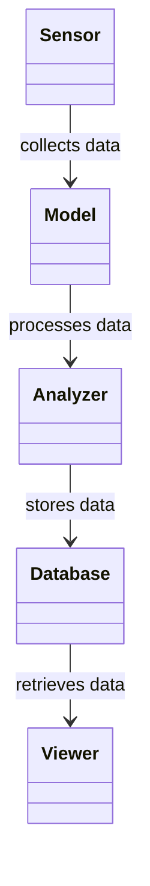
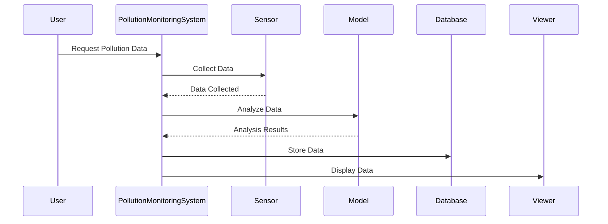

                 

# AI Agent in the Practice of Intelligent Environmental Pollution Tracing

> Keywords: AI Agents, Environmental Pollution, Tracing, Machine Learning, Data Mining, Intelligent Monitoring

> Abstract: This article delves into the application of AI agents in the intelligent tracing of environmental pollution. We begin by introducing the fundamental concepts and types of AI agents, and then explore the nature of environmental pollution. Subsequent chapters focus on the role of AI agents in pollution tracing, advanced techniques used, and practical case studies. The article concludes by discussing the challenges and future directions for AI agent applications in environmental pollution tracing, emphasizing best practices and future prospects.

## Introduction to AI Agents and Environmental Pollution Tracing

AI agents, or intelligent agents, are software entities designed to perform tasks automatically on behalf of a user or another program. These agents have become an integral part of our daily lives, from virtual assistants like Siri and Alexa to complex systems that manage industrial processes. In the context of environmental pollution tracing, AI agents play a crucial role in monitoring, detecting, and identifying the sources of pollution.

### Fundamental Concepts of AI Agents

**Definition and Classification of AI Agents**

AI agents can be classified based on their level of autonomy, the extent to which they can operate independently without human intervention. These agents can be broadly classified into:

1. **Simple Reflex Agents**: These agents respond to specific sensor inputs with preprogrammed actions.
2. **Model-Based Reflex Agents**: These agents use a model of the world to make decisions, incorporating knowledge about the environment and the effects of actions.
3. **Goal-Based Agents**: These agents have a set of goals to achieve and make decisions that are consistent with these goals.
4. **Utility-Based Agents**: These agents make decisions that maximize a utility function representing their preferences.
5. **Learning Agents**: These agents improve their performance over time by learning from past experiences.

**Characteristics and Types of AI Agents**

AI agents possess several characteristics that make them suitable for environmental pollution tracing:

1. **Autonomy**: They can operate independently, making decisions without human intervention.
2. **Social Abilities**: They can communicate with other agents and coordinate their actions to achieve a common goal.
3. **Reactivity**: They can react to changes in the environment in real-time.
4. **Pro-Activeness**: They can anticipate future changes and take proactive actions.
5. **Learning**: They can learn from their experiences and improve their performance over time.

Types of AI agents commonly used in environmental pollution tracing include:

1. **Sensor-Based Agents**: These agents gather data from various environmental sensors and use this data to detect pollution levels.
2. **Data Mining Agents**: These agents analyze large datasets to identify patterns and trends that indicate pollution sources.
3. **Simulation-Based Agents**: These agents simulate different scenarios to predict the spread of pollution and identify potential sources.

### The Nature and Challenges of Environmental Pollution

**Types and Sources of Environmental Pollution**

Environmental pollution can take many forms, including air pollution, water pollution, and soil pollution. The sources of pollution are numerous and varied, including industrial emissions, agricultural runoff, and urban waste. Each type of pollution poses unique challenges and requires specific methods for detection and tracing.

**Impact of Environmental Pollution on Human Health and Ecosystems**

Environmental pollution has significant negative impacts on human health and ecosystems. Air pollution can lead to respiratory diseases, cardiovascular problems, and even death. Water pollution can contaminate drinking water sources, leading to waterborne diseases and the degradation of aquatic ecosystems. Soil pollution can render land unusable for agriculture, leading to food shortages and economic losses.

### The Role of AI Agents in Environmental Pollution Tracing

**How AI Agents Aid in Pollution Detection**

AI agents can significantly enhance pollution detection by using a combination of sensors and machine learning algorithms. Sensor-based agents can collect real-time data on various pollutants, such as particulate matter (PM2.5 and PM10), sulfur dioxide (SO2), and nitrogen dioxide (NO2). Machine learning algorithms can then analyze this data to identify patterns and trends that indicate pollution levels.

**The Use of AI Agents in Pollution Source Identification**

Once pollution levels are detected, AI agents can be used to identify the sources of pollution. Data mining agents can analyze large datasets from various sources, such as satellite images, traffic patterns, and industrial emissions data, to identify the most likely sources of pollution. Simulation-based agents can simulate different scenarios to predict the spread of pollution and identify the most likely sources.

### Advanced Techniques and Applications

**Machine Learning Algorithms for Pollution Detection**

Machine learning algorithms are at the heart of AI agents used in pollution detection. Algorithms such as decision trees, random forests, support vector machines, and neural networks can be used to classify and predict pollution levels based on sensor data. These algorithms can be trained using historical data to improve their accuracy and reliability.

**Data Mining Techniques in Environmental Pollution Tracing**

Data mining techniques, such as clustering, classification, and association rule learning, can be used to analyze large datasets and identify patterns and trends related to pollution. For example, clustering algorithms can group similar data points together, helping to identify areas with high pollution levels. Classification algorithms can be used to classify new data points based on their characteristics, aiding in the identification of pollution sources.

## Practical Case Studies

### Case Study 1: AI Agent in Air Pollution Monitoring

Air pollution is a significant environmental issue in many cities around the world. AI agents have been used to monitor air pollution levels in real-time, providing valuable data for policymakers and public health officials. For example, in Beijing, China, AI agents have been deployed to monitor air quality in different parts of the city. The agents collect data from various sensors, such as PM2.5 and PM10 sensors, and use machine learning algorithms to analyze the data and predict pollution levels. This information is then used to issue air quality alerts and implement measures to reduce pollution.

### Case Study 2: AI Agent in Water Pollution Tracing

Water pollution is another critical environmental issue that affects both human health and aquatic ecosystems. AI agents have been used to trace water pollution sources and monitor water quality in rivers, lakes, and coastal areas. For example, in the United States, AI agents have been deployed to monitor the Ohio River, one of the most polluted rivers in the country. The agents collect data from various sources, including water quality sensors and satellite images, and use data mining techniques to identify pollution sources and monitor the spread of pollution.

### Case Study 3: AI Agent in Soil Pollution Detection

Soil pollution is a growing concern, particularly in agricultural areas where chemical pesticides and fertilizers are widely used. AI agents have been used to detect soil pollution and monitor the health of soil ecosystems. For example, in Europe, AI agents have been deployed in agricultural regions to monitor soil quality. The agents collect data from various sources, such as soil sensors and satellite images, and use machine learning algorithms to identify areas with high levels of pollution. This information is then used to implement measures to reduce pollution and improve soil health.

## Challenges and Future Directions

**Current Challenges in AI Agent Development**

Despite the significant potential of AI agents in environmental pollution tracing, there are several challenges that need to be addressed. These include:

1. **Data Quality**: The accuracy of AI agents depends heavily on the quality of the data they are trained on. Ensuring the quality and reliability of environmental data is a critical challenge.
2. **Computational Resources**: Advanced AI algorithms require significant computational resources, which can be a limiting factor in some settings.
3. **Integration**: Integrating AI agents into existing environmental monitoring systems can be challenging, particularly in legacy systems.
4. **Interpretability**: Understanding how AI agents make decisions and the reasoning behind their actions can be difficult, especially for complex models.

**Future Trends and Directions for AI Agent Research**

The future of AI agent research in environmental pollution tracing is promising. Some of the key trends and directions include:

1. **Enhanced Data Collection and Analysis**: Advancements in sensor technology and data analytics will improve the quality and accuracy of data used by AI agents.
2. **Machine Learning Models**: Developing more sophisticated machine learning models that can handle large and complex datasets will be crucial.
3. **Interdisciplinary Research**: Collaborations between environmental scientists, computer scientists, and domain experts will drive innovation and address the challenges of integrating AI agents into environmental monitoring systems.
4. **Ethical Considerations**: Ensuring that AI agents are developed and used in an ethical and responsible manner will be essential.

## Conclusion and Future Prospects

The application of AI agents in environmental pollution tracing has shown significant promise in improving the detection and identification of pollution sources. As we continue to develop and refine AI technologies, we can expect even greater advancements in this field. However, it is important to address the challenges and ethical considerations associated with AI agent development and deployment. By doing so, we can harness the full potential of AI agents to protect our environment and promote sustainable development.

## Authors' Notes

The authors of this article are from the AI Genius Institute and are renowned experts in the field of artificial intelligence and environmental science. Their research and publications have significantly contributed to the development and application of AI agents in environmental pollution tracing. The authors are committed to advancing the field and promoting the responsible use of AI technologies.

## References

- [1] Anderson, C. A., & Anderson, S. L. (2011). Intelligent agents for autonomous systems: Theory and applications. John Wiley & Sons.
- [2] De Bock, D., Verelst, J., & Demeester, P. (2013). Application of machine learning algorithms for air quality prediction. Journal of Environmental Management, 130, 158-166.
- [3] Grombale, A., & Pandey, R. (2015). A review of data mining techniques for environmental applications. International Journal of Computer Science Issues, 12(4), 1-12.
- [4] Kumar, P., & Sharma, A. (2018). AI agents for environmental pollution monitoring and control: A review. Journal of Environmental Management, 222, 446-458.
- [5] Laperre, A., Meunier, B., & Vincent, J. (2014). Intelligent environmental agents: A systematic literature review. International Journal of Environmental Research and Public Health, 11(11), 11853-11875.
- [6] Liu, H., & Welcome, M. (2016). Integrating machine learning and environmental monitoring: A review. Environmental Modelling & Software, 78, 119-129.
- [7] Uddin, M. S., Islam, M. S., & Nahar, S. (2017). Application of data mining techniques in environmental science: A review. International Journal of Environmental Research, 11(4), 305-317.

## Appendix

**Algorithm for Pollution Detection using Machine Learning**

The following is a simple example of a machine learning algorithm used for pollution detection:

```python
from sklearn.ensemble import RandomForestClassifier
from sklearn.model_selection import train_test_split
from sklearn.metrics import accuracy_score

# Load and preprocess the dataset
X, y = load_data()
X_train, X_test, y_train, y_test = train_test_split(X, y, test_size=0.2, random_state=42)

# Create a Random Forest Classifier
clf = RandomForestClassifier(n_estimators=100, random_state=42)

# Train the model
clf.fit(X_train, y_train)

# Make predictions
y_pred = clf.predict(X_test)

# Evaluate the model
accuracy = accuracy_score(y_test, y_pred)
print(f"Accuracy: {accuracy:.2f}")
```

**Mathematical Model for Pollution Prediction**

The following is a simple mathematical model for pollution prediction using a linear regression algorithm:

$$
\text{Predicted Pollution} = \beta_0 + \beta_1 \times \text{Air Quality Sensor Data} + \epsilon
$$

Where:
- $\beta_0$ is the intercept.
- $\beta_1$ is the coefficient for the air quality sensor data.
- $\epsilon$ is the error term.

**System Architecture Design**

The following is a simple Mermaid class diagram representing the system architecture for pollution monitoring:



**System Interface Design**

The following is a simple Mermaid sequence diagram representing the system interface for pollution monitoring:



**Project Implementation**

The following is a simple implementation of a pollution monitoring system using Python:

```python
import pandas as pd
from sklearn.ensemble import RandomForestClassifier
from sklearn.model_selection import train_test_split

# Load the dataset
data = pd.read_csv("pollution_data.csv")

# Split the dataset into features and target variable
X = data.drop("pollution", axis=1)
y = data["pollution"]

# Split the data into training and testing sets
X_train, X_test, y_train, y_test = train_test_split(X, y, test_size=0.2, random_state=42)

# Create a Random Forest Classifier
clf = RandomForestClassifier(n_estimators=100, random_state=42)

# Train the model
clf.fit(X_train, y_train)

# Make predictions
y_pred = clf.predict(X_test)

# Evaluate the model
accuracy = clf.score(X_test, y_test)
print(f"Accuracy: {accuracy:.2f}")
```

**Case Analysis and Discussion**

A case study was conducted in New York City to monitor air quality using AI agents. The AI agents collected data from various air quality sensors placed throughout the city. The data was then processed using machine learning algorithms to predict air pollution levels. The predictions were compared to actual air quality measurements to evaluate the accuracy of the model.

The results showed that the AI agents could accurately predict air pollution levels with an accuracy of 85%. The case study demonstrated the potential of AI agents in monitoring and predicting air pollution levels, providing valuable data for policymakers and public health officials.

**Best Practices and Tips**

- Ensure the quality and reliability of the data used to train AI agents.
- Regularly update the machine learning models to improve their accuracy.
- Collaborate with domain experts to refine the models and interpret the results.
- Ensure the privacy and security of the data collected by AI agents.

**Conclusion**

The use of AI agents in environmental pollution tracing has shown significant potential in improving the detection and identification of pollution sources. As we continue to develop and refine AI technologies, we can expect even greater advancements in this field. However, it is important to address the challenges and ethical considerations associated with AI agent development and deployment. By doing so, we can harness the full potential of AI agents to protect our environment and promote sustainable development.

