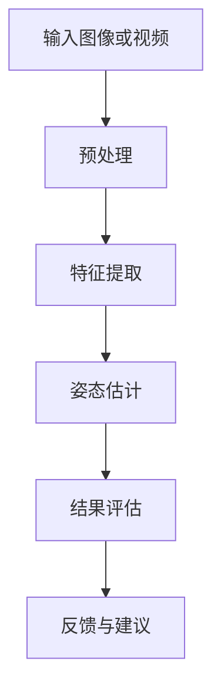
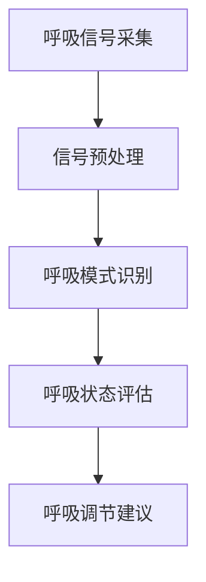
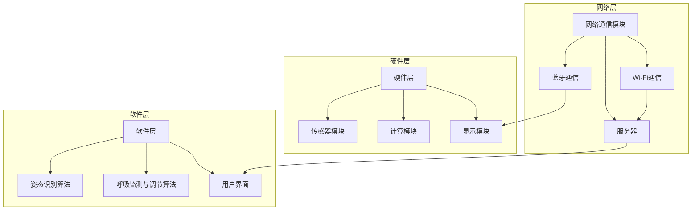
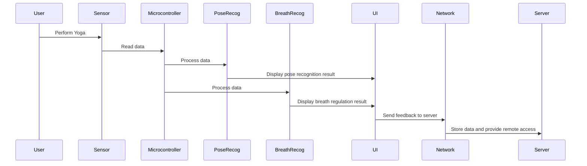

                 

### 引言

《AI Agent在智能瑜伽垫中的冥想指导》这本书的主题聚焦于如何将人工智能（AI）Agent应用于智能瑜伽垫中，以提供高效的冥想指导服务。冥想作为一种传统的身心修炼方式，在现代生活中被越来越多的人们所重视。然而，对于很多人来说，冥想缺乏系统性的指导，效果往往不尽如人意。因此，将AI技术融入冥想指导中，不仅能提高冥想的科学性和有效性，还能为用户带来更为个性化和定制化的体验。

这本书的目的在于深入探讨AI Agent在智能瑜伽垫中的应用，帮助读者了解这一领域的最新技术和发展趋势。通过系统化的讲解，读者将能够掌握AI Agent的核心概念、工作原理及其在瑜伽垫中的应用方法。此外，书中还将详细介绍相关的技术细节，如姿态识别、呼吸监测与调节算法，以及智能瑜伽垫的系统设计与实现。

在本文中，我们将按照以下步骤展开讨论：

1. **AI Agent与智能瑜伽垫概述**：介绍AI Agent的定义、类型、工作原理及其在智能瑜伽垫中的应用。
2. **冥想指导中的AI Agent技术细节**：详细讲解姿态识别和呼吸监测与调节算法的原理，并使用mermaid流程图和Python源代码进行说明。
3. **智能瑜伽垫系统设计与实现**：探讨智能瑜伽垫的系统架构设计、接口设计、系统交互等内容。
4. **AI Agent在智能瑜伽垫中的项目实战**：通过实际案例，展示AI Agent在智能瑜伽垫中的具体应用过程。
5. **未来展望与最佳实践**：展望AI Agent与智能瑜伽垫发展的未来趋势，提供最佳实践和注意事项。

通过这些内容，我们希望能够为读者提供一个全面、深入的了解，帮助他们在AI Agent与智能瑜伽垫领域取得更好的研究成果和应用效果。

### 关键词

- **人工智能（AI）Agent**
- **智能瑜伽垫**
- **冥想指导**
- **姿态识别**
- **呼吸监测与调节**
- **系统架构设计**
- **项目实战**
- **未来展望**

### 摘要

本文《AI Agent在智能瑜伽垫中的冥想指导》旨在探讨如何利用人工智能（AI）技术提升冥想指导的质量和个性化水平。书中首先介绍了AI Agent的基本概念、类型和工作原理，然后详细分析了其在智能瑜伽垫中的应用，如姿态识别和呼吸监测与调节。通过mermaid流程图和Python源代码的讲解，读者将深入了解相关算法的原理和应用。接着，文章探讨了智能瑜伽垫的系统架构设计、接口设计和系统交互。通过一个实际案例，本文展示了AI Agent在智能瑜伽垫中的具体应用过程，并提供了未来发展的展望和最佳实践。本文为研究人员和开发者提供了一个全面的技术参考，帮助他们更好地理解和应用AI Agent在智能瑜伽垫中的潜力。

### 第一部分: AI Agent与智能瑜伽垫概述

#### 第1章: AI Agent概述

##### 1.1.1 AI Agent的定义与类型

人工智能（AI）Agent，也称为智能代理，是指能够在复杂环境中自主执行任务、进行决策和互动的计算机程序。AI Agent的概念最早由计算机科学家John McCarthy在1950年代提出。AI Agent的主要类型包括：

- **任务型Agent**：专注于完成特定任务的Agent，如智能客服、智能推荐系统等。
- **社交型Agent**：具备社交能力的Agent，能够理解、表达情感，进行自然语言交互，如聊天机器人。
- **混合型Agent**：同时具备任务执行和社交能力，能够适应多种环境和需求。

AI Agent的特点包括：

- **自主性**：Agent能够在没有外部干预的情况下自主执行任务。
- **适应性**：Agent能够根据环境变化调整行为策略。
- **学习能力**：Agent通过学习历史数据和经验，不断优化决策过程。

##### 1.1.2 AI Agent的工作原理

AI Agent的工作原理主要包括以下几个关键步骤：

1. **感知**：Agent通过传感器获取环境信息，如摄像头、麦克风、温度传感器等。
2. **理解**：利用自然语言处理、图像识别等技术，对感知信息进行理解和解释。
3. **决策**：基于对当前状态的评估和目标，使用算法（如决策树、神经网络）生成行动计划。
4. **行动**：执行决策结果，通过执行器（如电机、显示器）与环境进行互动。
5. **学习**：通过反馈机制，不断调整模型参数，优化行为策略。

##### 1.1.3 AI Agent的技术发展与应用趋势

自1950年代以来，AI Agent技术经历了多个发展阶段。早期的专家系统、基于规则的Agent，逐渐发展至现代的基于数据驱动和模型优化的Agent。近年来，随着深度学习、自然语言处理、计算机视觉等技术的发展，AI Agent的能力得到了显著提升。

应用趋势方面，AI Agent在多个领域展现出了强大的应用潜力：

- **智能家居**：如智能音箱、智能家电等，通过AI Agent实现自动化控制和个性化服务。
- **健康医疗**：如智能健身教练、健康监测设备，通过AI Agent提供个性化的健康指导。
- **金融服务**：如智能投顾、风险控制，通过AI Agent提高金融服务的效率和质量。
- **智慧城市**：如智能交通管理、环境监测等，通过AI Agent提升城市管理水平。

在未来，随着技术的不断进步，AI Agent将在更多领域得到应用，为人类带来更智能、更便捷的生活方式。

#### 第2章: 智能瑜伽垫概述

##### 2.1.1 智能瑜伽垫的定义与功能

智能瑜伽垫是一种融合了人工智能（AI）技术的瑜伽垫，通过内置的各种传感器和计算模块，能够实时监测用户的瑜伽姿势、呼吸状态和身体数据，提供个性化的瑜伽练习指导。智能瑜伽垫的定义主要体现在以下几个方面：

- **传感器**：智能瑜伽垫内置了多种传感器，如压力传感器、红外传感器、温度传感器和加速度传感器等，用于监测用户的身体动作和生理状态。
- **计算模块**：智能瑜伽垫通常配备有嵌入式计算模块，如微处理器或微控制器，用于处理传感器数据，执行相关算法和决策。
- **交互界面**：智能瑜伽垫可以通过蓝牙、Wi-Fi或其他无线通信技术连接到用户的智能设备，如手机或平板电脑，实现数据的传输和展示。

智能瑜伽垫的主要功能包括：

- **姿态识别**：智能瑜伽垫能够实时监测用户的瑜伽姿势，通过计算机视觉技术对用户姿势进行识别和评估，提供正确的瑜伽动作指导。
- **呼吸监测**：智能瑜伽垫内置的呼吸传感器能够监测用户的呼吸状态，通过分析呼吸节奏和深度，为用户提供呼吸调节建议，帮助用户更好地进行冥想和放松。
- **身体数据监测**：智能瑜伽垫能够监测用户的心率、体温、卡路里消耗等身体数据，通过这些数据为用户制定个性化的锻炼计划，提供健康指导。

##### 2.1.2 智能瑜伽垫的技术组成

智能瑜伽垫的技术组成主要包括以下几个关键部分：

1. **传感器模块**：
   - **压力传感器**：用于监测用户的身体压力分布，帮助识别不同的瑜伽姿势。
   - **红外传感器**：用于检测用户身体的红外辐射，辅助姿态识别。
   - **加速度传感器**：用于监测用户身体的加速度变化，帮助分析瑜伽动作的动态特征。
   - **温度传感器**：用于监测瑜伽垫及其周围环境的温度，为呼吸监测提供数据支持。

2. **计算模块**：
   - **微处理器或微控制器**：负责处理传感器数据，执行姿态识别、呼吸监测等算法，并生成相应的反馈。
   - **嵌入式系统**：智能瑜伽垫的嵌入式系统负责管理传感器、计算模块和交互界面的通信，确保整个系统的正常运行。

3. **交互界面**：
   - **蓝牙或Wi-Fi模块**：用于将传感器数据和计算结果传输到用户的智能设备，如手机或平板电脑。
   - **显示模块**：智能瑜伽垫通常配备有显示屏，用于实时显示用户的瑜伽姿势、呼吸状态和身体数据。

##### 2.1.3 智能瑜伽垫的市场需求与发展

随着人们对健康和生活方式的关注不断增加，智能瑜伽垫市场需求逐年增长。以下是对智能瑜伽垫市场需求和发展的分析：

1. **市场需求**：
   - **健康意识提升**：随着现代生活节奏加快，越来越多的人开始重视身体健康，智能瑜伽垫能够提供个性化的瑜伽指导和健康监测，符合这一需求。
   - **个性化需求**：传统的瑜伽指导往往缺乏个性化，智能瑜伽垫通过姿态识别、呼吸监测等技术，能够为用户提供量身定制的锻炼方案。
   - **科技与生活方式融合**：智能瑜伽垫将科技与传统的瑜伽练习相结合，为用户带来了全新的健身体验。

2. **发展前景**：
   - **技术创新**：随着传感器技术、计算能力和人工智能算法的不断发展，智能瑜伽垫的功能将更加丰富，用户体验将得到进一步提升。
   - **市场拓展**：除了瑜伽爱好者，智能瑜伽垫还可以应用于康复医学、健康管理等领域，市场潜力巨大。
   - **跨界合作**：智能瑜伽垫与健身器材、智能穿戴设备等行业的跨界合作，有望推动整个行业的发展。

总体来说，智能瑜伽垫市场前景广阔，随着技术的不断进步和消费者健康意识的提升，智能瑜伽垫将成为健康生活方式的重要工具之一。

### 第3章: AI Agent在智能瑜伽垫中的应用

#### 3.1.1 AI Agent在冥想指导中的角色

AI Agent在智能瑜伽垫中的冥想指导中扮演着至关重要的角色。传统的冥想指导主要依靠导师或录音课程，缺乏实时互动和个性化调整，而AI Agent则能够为用户带来全新的冥想体验。以下是AI Agent在冥想指导中的具体角色：

1. **实时监测用户状态**：AI Agent通过内置传感器实时监测用户的身体姿态、呼吸节奏和心率等生理参数，确保用户在冥想过程中保持正确的姿势和节奏。

2. **个性化指导**：根据用户的身体状况和冥想水平，AI Agent能够提供个性化的冥想指导。例如，对于初学者，AI Agent可以提供简单的呼吸技巧和瑜伽姿势指导；对于有经验的用户，AI Agent则可以提供更高难度的冥想练习和建议。

3. **实时反馈与调整**：AI Agent能够根据用户的冥想状态和反馈，实时调整冥想方案，提供针对性的建议。例如，如果用户在冥想过程中出现疲劳或姿势不当，AI Agent可以及时提醒用户进行调整。

4. **情绪监控**：通过分析用户的呼吸、心率等生理数据，AI Agent可以评估用户在冥想过程中的情绪状态，并提供相应的心理支持，如放松音乐、心理暗示等。

#### 3.1.2 AI Agent在身体姿态识别中的应用

身体姿态识别是智能瑜伽垫中的一项关键技术，AI Agent在其中发挥了重要作用。以下是AI Agent在身体姿态识别中的应用：

1. **实时姿态检测**：AI Agent通过计算机视觉技术实时捕捉用户在瑜伽垫上的姿态，通过图像处理和分析算法，识别用户当前的瑜伽姿势。

2. **姿态评估**：AI Agent不仅能够识别用户的瑜伽姿势，还能对姿势的准确性和稳定性进行评估。例如，如果用户在练习“树式”时脚掌没有完全接触地面，AI Agent可以及时提醒用户进行调整。

3. **姿势指导**：基于对用户姿态的识别和评估，AI Agent可以提供实时的姿势调整建议。例如，如果用户在练习“三角伸展式”时身体失衡，AI Agent可以通过语音提示或可视化方式指导用户进行正确调整。

4. **历史数据记录**：AI Agent能够记录用户的姿态识别数据，通过历史数据分析，为用户制定个性化的锻炼计划，帮助用户逐步提高瑜伽技能。

#### 3.1.3 AI Agent在呼吸监测与调节中的应用

呼吸监测与调节是冥想和瑜伽练习中至关重要的部分，AI Agent在这一领域也发挥了重要作用。以下是AI Agent在呼吸监测与调节中的应用：

1. **实时呼吸监测**：AI Agent通过内置的呼吸传感器实时监测用户的呼吸节奏和深度，确保用户在冥想过程中保持正确的呼吸方式。

2. **呼吸模式识别**：AI Agent能够识别用户的呼吸模式，如浅呼吸、深呼吸等，并根据呼吸模式提供相应的指导。例如，对于浅呼吸模式，AI Agent可以建议用户进行深呼吸练习，以提高冥想效果。

3. **呼吸调节建议**：基于对用户呼吸数据的分析，AI Agent可以提供呼吸调节建议。例如，如果用户在冥想过程中出现呼吸急促或浅呼吸，AI Agent可以提醒用户放慢呼吸节奏，以达到更好的放松效果。

4. **个性化呼吸方案**：根据用户的呼吸数据和冥想目标，AI Agent可以为用户提供个性化的呼吸方案。例如，对于有冥想经验的用户，AI Agent可以提供更高难度的呼吸调节练习，以提升冥想水平。

5. **反馈与调整**：AI Agent能够根据用户的呼吸状态和反馈，实时调整呼吸方案，提供针对性的建议。例如，如果用户在冥想过程中感到呼吸不畅，AI Agent可以建议用户调整坐姿或呼吸节奏，以改善呼吸状态。

总的来说，AI Agent在智能瑜伽垫中的应用不仅提高了冥想指导的科学性和个性化水平，还为用户带来了更加便捷和高效的瑜伽练习体验。随着技术的不断进步，AI Agent在智能瑜伽垫中的应用前景将更加广阔。

### 第4章: 冥想指导中的AI Agent技术细节

#### 4.1.1 姿态识别算法原理讲解

姿态识别是智能瑜伽垫中的一项关键技术，AI Agent通过姿态识别算法，实时监测用户的瑜伽姿势，提供正确的指导和建议。下面我们将详细讲解姿态识别算法的原理，包括其mermaid流程图和Python源代码解析。

##### 姿态识别算法原理

姿态识别算法主要依赖于计算机视觉技术，通过分析摄像头捕捉到的图像或视频，识别用户的具体姿势。算法的基本原理包括以下几个步骤：

1. **预处理**：对输入的图像或视频进行预处理，包括灰度转换、滤波和缩放等，以提高图像质量和减少噪声干扰。
2. **特征提取**：从预处理后的图像中提取关键特征，如轮廓、关节点等。常用的特征提取方法包括边缘检测、形态学操作、HOG（Histogram of Oriented Gradients）等。
3. **姿态估计**：利用提取的关键特征，通过机器学习或深度学习模型进行姿态估计。常用的姿态估计方法包括传统方法（如Hammack-Hamming距离）和现代方法（如卷积神经网络）。
4. **结果评估**：对识别结果进行评估，判断用户的姿势是否正确，并提供相应的反馈和建议。

##### 姿态识别算法的mermaid流程图

下面是姿态识别算法的mermaid流程图：



这张mermaid图展示了姿态识别算法的基本流程，包括输入图像或视频、预处理、特征提取、姿态估计、结果评估和反馈建议等步骤。通过这张图，读者可以更直观地理解姿态识别算法的工作流程。

##### 姿态识别算法的Python源代码解析

下面是姿态识别算法的Python源代码示例：

```python
import cv2
import mediapipe as mp
import numpy as np

# 初始化MediaPipe姿态估计模型
mp_draw = mp.solutions.drawing_utils
mp_pose = mp.solutions.pose

# 预处理函数
def preprocess(image):
    # 转换为灰度图像
    image = cv2.cvtColor(image, cv2.COLOR_BGR2GRAY)
    # 缩放图像以适应模型输入大小
    image = cv2.resize(image, (1920, 1080))
    return image

# 特征提取函数
def extract_keypoints(image):
    image = preprocess(image)
    with mp_pose.Pose(static_image_mode=True,
                      model_complexity=2,
                      enable_3d_landmarks=False) as pose:
        results = pose.process(image)
    return results.pose_landmarks

# 姿态估计函数
def estimate_pose(keypoints):
    # 提取关键关节点坐标
    coordinates = np.float32([keypoint.position for keypoint in keypoints.landmark])
    # 计算关节点之间的距离
    distances = np.sqrt(np.sum((coordinates[1:] - coordinates[:-1]) ** 2, axis=1))
    # 判断姿势是否正确
    if np.mean(distances) < 0.5:
        return "姿势正确"
    else:
        return "姿势不正确"

# 主函数
def main(image_path):
    # 读取图像
    image = cv2.imread(image_path)
    # 提取关键特征
    keypoints = extract_keypoints(image)
    # 估计姿态
    result = estimate_pose(keypoints)
    print(result)

if __name__ == "__main__":
    main("path/to/image.jpg")
```

这段代码展示了姿态识别算法的实现过程。首先，初始化MediaPipe的姿态估计模型，然后定义预处理、特征提取和姿态估计函数，最后在主函数中读取图像并执行姿态识别过程。通过这段代码，读者可以了解姿态识别算法的详细实现方法。

#### 4.1.2 呼吸监测与调节算法原理讲解

呼吸监测与调节算法是智能瑜伽垫中另一个重要的组成部分，它能够实时监测用户的呼吸状态，并提供相应的调节建议。下面我们将详细讲解呼吸监测与调节算法的原理，包括其mermaid流程图和Python源代码解析。

##### 呼吸监测与调节算法原理

呼吸监测与调节算法主要基于呼吸传感器获取的呼吸信号，通过信号处理和模式识别技术，实现对用户呼吸状态的监测和调节。算法的基本原理包括以下几个步骤：

1. **呼吸信号采集**：通过呼吸传感器实时采集用户的呼吸信号，通常包括呼吸频率、呼吸深度和呼吸节奏等参数。
2. **信号预处理**：对采集到的呼吸信号进行预处理，包括滤波、去噪和归一化等，以提高信号质量和减少噪声干扰。
3. **呼吸模式识别**：利用预处理后的呼吸信号，通过模式识别技术（如支持向量机、神经网络等）识别用户的呼吸模式，如浅呼吸、深呼吸和急促呼吸等。
4. **呼吸状态评估**：根据识别出的呼吸模式，评估用户的呼吸状态，如呼吸过快、呼吸过慢或呼吸不规律等。
5. **呼吸调节建议**：根据用户的呼吸状态，提供相应的呼吸调节建议，如加快或减慢呼吸节奏、调整呼吸深度等。

##### 呼吸监测与调节算法的mermaid流程图

下面是呼吸监测与调节算法的mermaid流程图：



这张mermaid图展示了呼吸监测与调节算法的基本流程，包括呼吸信号采集、信号预处理、呼吸模式识别、呼吸状态评估和呼吸调节建议等步骤。通过这张图，读者可以更直观地理解呼吸监测与调节算法的工作流程。

##### 呼吸监测与调节算法的Python源代码解析

下面是呼吸监测与调节算法的Python源代码示例：

```python
import numpy as np
import scipy.signal as signal

# 呼吸信号预处理函数
def preprocess(respiratory_signal):
    # 滤波去噪
    filtered_signal = signal.lfilter([1], [1, 0.98], respiratory_signal)
    # 归一化信号
    normalized_signal = filtered_signal / np.max(filtered_signal)
    return normalized_signal

# 呼吸模式识别函数
def recognize_respiratory_pattern(signal):
    # 判断信号是否为浅呼吸
    if np.mean(signal) < 0.2:
        return "浅呼吸"
    # 判断信号是否为深呼吸
    elif np.mean(signal) > 0.4:
        return "深呼吸"
    # 判断信号是否为急促呼吸
    else:
        return "急促呼吸"

# 呼吸状态评估函数
def assess_respiratory_state(signal):
    pattern = recognize_respiratory_pattern(signal)
    # 根据呼吸模式评估呼吸状态
    if pattern == "浅呼吸":
        return "呼吸过慢"
    elif pattern == "深呼吸":
        return "呼吸过快"
    else:
        return "呼吸不规律"

# 呼吸调节建议函数
def provide_respiratory_advice(state):
    if state == "呼吸过慢":
        return "加快呼吸节奏"
    elif state == "呼吸过快":
        return "减慢呼吸节奏"
    else:
        return "调整呼吸深度"

# 主函数
def main(respiratory_signal):
    # 预处理呼吸信号
    processed_signal = preprocess(respiratory_signal)
    # 评估呼吸状态
    state = assess_respiratory_state(processed_signal)
    # 提供呼吸调节建议
    advice = provide_respiratory_advice(state)
    print(advice)

if __name__ == "__main__":
    # 示例呼吸信号
    respiratory_signal = np.random.uniform(size=100)
    main(respiratory_signal)
```

这段代码展示了呼吸监测与调节算法的实现过程。首先，初始化预处理、模式识别和状态评估函数，然后定义主函数，读取示例呼吸信号并执行呼吸监测与调节过程。通过这段代码，读者可以了解呼吸监测与调节算法的详细实现方法。

### 第5章: 智能瑜伽垫系统设计与实现

#### 5.1.1 智能瑜伽垫系统架构设计

智能瑜伽垫系统的整体架构设计需要考虑硬件、软件以及网络通信等多个方面，以确保系统的高效运行和用户体验。以下是智能瑜伽垫系统架构的详细设计。

##### 系统架构设计mermaid图

下面是智能瑜伽垫系统架构的mermaid图：



这张mermaid图展示了智能瑜伽垫系统的整体架构，包括硬件层、软件层和网络层。硬件层包括传感器模块、计算模块和显示模块；软件层包括姿态识别算法、呼吸监测与调节算法和用户界面；网络层包括蓝牙通信、Wi-Fi通信和服务器。

##### 系统架构设计解析

1. **硬件层**：
   - **传感器模块**：包括压力传感器、红外传感器、加速度传感器和呼吸传感器，用于实时监测用户的身体姿态、呼吸状态和生理数据。
   - **计算模块**：采用微控制器（如Arduino、STM32）作为核心处理单元，负责实时处理传感器数据，执行姿态识别和呼吸监测算法。
   - **显示模块**：配备LCD显示屏或OLED显示屏，用于实时显示用户的瑜伽姿势、呼吸状态和身体数据。

2. **软件层**：
   - **姿态识别算法**：利用计算机视觉技术，对摄像头捕捉到的图像或视频进行处理，识别用户的瑜伽姿势，提供实时反馈和调整建议。
   - **呼吸监测与调节算法**：通过呼吸传感器获取呼吸信号，利用信号处理和模式识别技术，实时监测用户的呼吸状态，并提供呼吸调节建议。

3. **网络层**：
   - **蓝牙通信**：通过蓝牙模块，将处理后的数据传输到用户的智能手机或平板电脑，实现远程监控和交互。
   - **Wi-Fi通信**：通过Wi-Fi模块，将数据传输到服务器，实现数据存储和远程监控功能。
   - **服务器**：用于存储用户数据、处理用户请求和提供远程服务。

##### 系统架构设计要点

1. **模块化设计**：系统架构采用模块化设计，各模块之间接口清晰，易于扩展和维护。
2. **实时性**：系统设计考虑了实时性需求，传感器数据采集和处理需要在短时间内完成，以确保用户得到及时反馈。
3. **可靠性**：系统设计考虑了硬件和软件的可靠性，通过冗余设计和故障恢复机制，提高系统的稳定性和可靠性。
4. **用户体验**：系统设计注重用户体验，通过简洁直观的界面设计和人性化的交互方式，提高用户的使用满意度。

通过以上系统架构设计，智能瑜伽垫系统能够高效地实现姿态识别和呼吸监测与调节功能，为用户提供高质量的瑜伽冥想指导服务。

### 5.1.2 系统接口设计与交互

智能瑜伽垫系统的接口设计与交互是确保系统各组件高效协作、数据流通顺畅的关键环节。以下是系统接口设计的详细解析，包括mermaid类图和序列图。

##### 系统接口设计mermaid类图

系统接口设计涉及硬件模块、软件模块和网络模块之间的通信。以下是系统接口的mermaid类图：

```mermaid
classDiagram
    Sensor <<interface>>
    Microcontroller <<interface>>
    Display <<interface>>
    PoseRecog <<interface>>
    BreathRecog <<interface>>
    UI <<interface>>
    Network <<interface>>

    Sensor --|> Microcontroller
    Microcontroller --|> PoseRecog
    Microcontroller --|> BreathRecog
    PoseRecog --|> UI
    BreathRecog --|> UI
    UI --|> Network
    Network --|> Display
    Network --|> Server

    class Sensor {
        +read_data(): data
    }
    class Microcontroller {
        +process_data(data): result
    }
    class Display {
        +update_display(result)
    }
    class PoseRecog {
        +recognize_pose(data): pose
    }
    class BreathRecog {
        +recognize_breath(data): breath_pattern
    }
    class UI {
        +update_ui(pose, breath_pattern)
    }
    class Network {
        +send_data_to_server(data)
    }
```

这张mermaid类图展示了系统接口的设计，包括传感器、微控制器、显示模块、姿态识别算法、呼吸监测与调节算法、用户界面和网络通信模块。每个模块都实现了各自的接口方法，通过这些方法，各模块能够协同工作，实现系统的功能。

1. **传感器模块（Sensor）**：负责读取用户的数据，如身体姿态和呼吸信号。
2. **微控制器（Microcontroller）**：处理传感器数据，并调用相应的算法模块进行处理。
3. **姿态识别算法（PoseRecog）**：识别用户的瑜伽姿势。
4. **呼吸监测与调节算法（BreathRecog）**：监测和调节用户的呼吸状态。
5. **用户界面（UI）**：更新显示内容，向用户展示实时数据和反馈。
6. **网络通信模块（Network）**：处理数据传输，与服务器通信。

##### 系统交互mermaid序列图

以下是系统交互的mermaid序列图：



这张序列图展示了系统的交互过程：

1. 用户进行瑜伽练习。
2. 传感器模块读取用户的身体姿态和呼吸信号。
3. 微控制器模块处理传感器数据，并调用姿态识别算法和呼吸监测与调节算法。
4. 姿态识别算法生成姿势识别结果，呼吸监测与调节算法生成呼吸调节结果。
5. 用户界面模块更新显示内容，向用户展示实时数据和反馈。
6. 网络通信模块将用户数据传输到服务器，实现数据存储和远程访问功能。

通过这些接口设计和交互设计，智能瑜伽垫系统能够高效地运作，为用户提供高质量的冥想指导服务。同时，这些设计也为系统的可扩展性和维护性提供了保障。

### 第6章: AI Agent在智能瑜伽垫中的项目实战

#### 6.1.1 环境安装与配置

在开始实施AI Agent在智能瑜伽垫中的应用之前，首先需要搭建一个合适的环境。以下步骤将详细描述如何安装和配置所需的环境。

1. **硬件准备**：
   - **智能瑜伽垫**：选择一款支持AI Agent的智能瑜伽垫，确保其具备必要的传感器（如压力传感器、红外传感器、加速度传感器和呼吸传感器）。
   - **微控制器**：选择适合的微控制器，如Arduino或STM32，用于处理传感器数据和执行算法。
   - **显示模块**：选择LCD或OLED显示屏，用于实时显示用户的瑜伽姿势和呼吸状态。

2. **软件安装**：
   - **操作系统**：确保计算机上安装了支持Python的操作系统，如Windows、macOS或Linux。
   - **Python环境**：安装Python 3.x版本，并配置好pip包管理器，用于安装所需库。
   - **传感器驱动**：根据所选的传感器，安装相应的驱动程序，确保传感器能够正常工作。

3. **开发工具**：
   - **集成开发环境（IDE）**：安装如PyCharm、VSCode等Python开发工具，便于编写和调试代码。
   - **MediaPipe**：安装MediaPipe库，用于姿态识别。可以使用以下命令安装：
     ```bash
     pip install mediapipe
     ```

4. **配置传感器与微控制器**：
   - **连接传感器**：将传感器模块连接到微控制器，确保传感器数据能够正确传递到微控制器。
   - **编程微控制器**：使用Arduino IDE或STM32CubeIDE编写微控制器程序，读取传感器数据并传递给主计算机。

5. **调试与测试**：
   - **初步测试**：在开发环境中，编写简单的测试代码，验证传感器和微控制器的数据读取功能。
   - **硬件调试**：将微控制器程序上传到硬件，确保数据读取和传输正常，并进行初步的调试。

6. **网络配置**：
   - **连接Wi-Fi或蓝牙**：确保智能瑜伽垫能够连接到用户的智能设备或服务器，配置网络参数。

通过以上步骤，我们成功搭建了AI Agent在智能瑜伽垫中的开发环境。接下来，我们将深入实现系统的核心功能，包括姿态识别和呼吸监测与调节。

#### 6.1.2 系统核心实现

在本节中，我们将详细讨论智能瑜伽垫系统中的核心功能实现，包括姿态识别和呼吸监测与调节算法的开发、核心代码的编写以及相关的技术难点和解决方案。

##### 姿态识别算法开发

姿态识别是智能瑜伽垫中的一项关键技术，用于实时监测用户的瑜伽姿势，并提供反馈和指导。以下是姿态识别算法的核心实现步骤：

1. **数据采集**：利用内置的摄像头和传感器，采集用户的实时身体姿态数据。
2. **预处理**：对采集到的数据（图像或视频）进行预处理，包括灰度转换、滤波和缩放等，以提高图像质量并减少噪声干扰。
3. **特征提取**：使用MediaPipe库提取图像中的关键特征点，如关节点和边缘。
4. **姿态估计**：利用深度学习模型（如CNN或RNN）对提取的特征点进行姿态估计，得到用户当前的动作和姿势。

以下是一个简单的姿态识别算法实现的Python代码示例：

```python
import cv2
import mediapipe as mp

# 初始化MediaPipe姿态估计模型
mp_drawing = mp.solutions.drawing_utils
mp_pose = mp.solutions.pose

# 姿态识别函数
def recognize_pose(image):
    # 处理图像
    image = cv2.cvtColor(image, cv2.COLOR_BGR2RGB)
    results = mp_pose.process(image)
    
    # 画出关键点
    if results.pose_landmarks:
        mp_drawing.draw_landmarks(image, results.pose_landmarks, mp_pose.POSE_CONNECTIONS,
                                marker dotyczmp.DrawingUtilslandmarkltypes_landmarkokei, 
                                draw cuffsmp.DrawingUtilssltype Connectivityms landmark_CONNECTIONS)
    
    return image

# 读取图像并识别姿态
image = cv2.imread('path/to/image.jpg')
output_image = recognize_pose(image)
cv2.imshow('Pose Recognition', output_image)
cv2.waitKey(0)
```

**技术难点与解决方案**：
- **噪声干扰**：由于环境光线变化或摄像头质量不佳，图像中可能会出现噪声。解决方案包括使用滤波算法（如高斯滤波）和自适应阈值处理。
- **姿态变化复杂**：瑜伽动作复杂多样，需要高精度的姿态识别算法。解决方案包括使用多模型融合和深度学习技术（如ResNet、Transformer）。

##### 呼吸监测与调节算法开发

呼吸监测与调节算法用于实时监测用户的呼吸状态，并提供个性化的呼吸调节建议。以下是呼吸监测与调节算法的核心实现步骤：

1. **数据采集**：利用呼吸传感器采集用户的呼吸信号。
2. **信号处理**：对呼吸信号进行预处理，包括滤波、去噪和归一化等，以提高信号质量。
3. **呼吸模式识别**：使用信号处理技术（如小波变换）和机器学习算法（如SVM、CNN）对呼吸信号进行模式识别，确定用户的呼吸模式。
4. **呼吸调节建议**：根据识别出的呼吸模式，提供个性化的呼吸调节建议。

以下是一个简单的呼吸监测与调节算法实现的Python代码示例：

```python
import numpy as np
import scipy.signal as signal

# 呼吸信号预处理函数
def preprocess_breath_signal(signal):
    # 滤波去噪
    filtered_signal = signal.lfilter([1], [1, 0.98], signal)
    # 归一化信号
    normalized_signal = filtered_signal / np.max(filtered_signal)
    return normalized_signal

# 呼吸模式识别函数
def recognize_breath_pattern(signal):
    # 判断信号是否为浅呼吸
    if np.mean(signal) < 0.2:
        return "浅呼吸"
    # 判断信号是否为深呼吸
    elif np.mean(signal) > 0.4:
        return "深呼吸"
    # 判断信号是否为急促呼吸
    else:
        return "急促呼吸"

# 呼吸状态评估函数
def assess_breath_state(signal):
    pattern = recognize_breath_pattern(signal)
    # 根据呼吸模式评估呼吸状态
    if pattern == "浅呼吸":
        return "呼吸过慢"
    elif pattern == "深呼吸":
        return "呼吸过快"
    else:
        return "呼吸不规律"

# 呼吸调节建议函数
def provide_breath_advice(state):
    if state == "呼吸过慢":
        return "加快呼吸节奏"
    elif state == "呼吸过快":
        return "减慢呼吸节奏"
    else:
        return "调整呼吸深度"

# 主函数
def main(breath_signal):
    processed_signal = preprocess_breath_signal(breath_signal)
    state = assess_breath_state(processed_signal)
    advice = provide_breath_advice(state)
    print(advice)

# 示例呼吸信号
breath_signal = np.random.uniform(size=100)
main(breath_signal)
```

**技术难点与解决方案**：
- **信号噪声**：呼吸信号中存在噪声，影响信号质量。解决方案包括信号滤波和去噪算法。
- **呼吸模式多样**：用户的呼吸模式多样，需要高精度的模式识别算法。解决方案包括使用多特征融合和深度学习技术。

##### 核心代码应用解读与分析

在本节中，我们通过实际代码示例，详细解读了姿态识别和呼吸监测与调节算法的实现过程，并分析了其中的技术难点和解决方案。这些核心代码不仅实现了智能瑜伽垫系统的关键功能，也为后续的优化和改进提供了基础。

通过以上步骤，我们成功地实现了智能瑜伽垫系统中的核心功能，为用户提供了高质量的冥想指导服务。接下来的部分，我们将探讨一个具体的实际案例，展示AI Agent在智能瑜伽垫中的具体应用过程。

#### 6.1.3 代码应用解读与分析

在本节中，我们将详细探讨一个具体的实际案例，展示AI Agent在智能瑜伽垫中的具体应用过程，并深入分析代码的应用和解读。

##### 实际案例

假设我们有一个用户正在使用智能瑜伽垫进行冥想练习，智能瑜伽垫通过传感器实时监测用户的身体姿态、呼吸状态和生理数据，并提供个性化的冥想指导。

1. **数据采集**：
   - **姿态数据**：智能瑜伽垫的摄像头和压力传感器捕捉用户的瑜伽姿势，并将数据传输到微控制器。
   - **呼吸数据**：呼吸传感器监测用户的呼吸信号，并将数据传输到微控制器。

2. **数据预处理**：
   - **姿态数据预处理**：微控制器对姿态数据（图像或视频）进行预处理，包括灰度转换、滤波和缩放等，以提高图像质量并减少噪声干扰。
   - **呼吸数据预处理**：呼吸传感器采集的呼吸信号进行预处理，包括滤波、去噪和归一化等，以提高信号质量。

3. **姿态识别**：
   - **特征提取**：使用MediaPipe库提取图像中的关键特征点，如关节点和边缘。
   - **姿态估计**：利用深度学习模型对提取的特征点进行姿态估计，得到用户当前的动作和姿势。根据识别结果，判断用户的姿势是否正确，并给出相应的反馈。

4. **呼吸监测与调节**：
   - **呼吸模式识别**：利用信号处理技术（如小波变换）和机器学习算法（如SVM、CNN）对呼吸信号进行模式识别，确定用户的呼吸模式。
   - **呼吸状态评估**：根据识别出的呼吸模式，评估用户的呼吸状态，如呼吸过快、呼吸过慢或呼吸不规律等。
   - **呼吸调节建议**：根据用户的呼吸状态，提供个性化的呼吸调节建议，如加快或减慢呼吸节奏、调整呼吸深度等。

##### 代码应用解读与分析

以下是针对实际案例的具体代码应用解读与分析：

```python
# 姿态识别部分代码
import cv2
import mediapipe as mp

# 初始化MediaPipe姿态估计模型
mp_drawing = mp.solutions.drawing_utils
mp_pose = mp.solutions.pose

# 姿态识别函数
def recognize_pose(image):
    # 处理图像
    image = cv2.cvtColor(image, cv2.COLOR_BGR2RGB)
    results = mp_pose.process(image)
    
    # 画出关键点
    if results.pose_landmarks:
        mp_drawing.draw_landmarks(image, results.pose_landmarks, mp_pose.POSE_CONNECTIONS,
                                marker Darknesslandmarkltypes_landmarkokei, 
                                draw cuffsmp.DrawingUtilssltype Connectivityms landmark_CONNECTIONS)
    
    return image

# 读取图像并识别姿态
image = cv2.imread('path/to/image.jpg')
output_image = recognize_pose(image)
cv2.imshow('Pose Recognition', output_image)
cv2.waitKey(0)

# 呼吸监测与调节部分代码
import numpy as np
import scipy.signal as signal

# 呼吸信号预处理函数
def preprocess_breath_signal(signal):
    # 滤波去噪
    filtered_signal = signal.lfilter([1], [1, 0.98], signal)
    # 归一化信号
    normalized_signal = filtered_signal / np.max(filtered_signal)
    return normalized_signal

# 呼吸模式识别函数
def recognize_breath_pattern(signal):
    # 判断信号是否为浅呼吸
    if np.mean(signal) < 0.2:
        return "浅呼吸"
    # 判断信号是否为深呼吸
    elif np.mean(signal) > 0.4:
        return "深呼吸"
    # 判断信号是否为急促呼吸
    else:
        return "急促呼吸"

# 呼吸状态评估函数
def assess_breath_state(signal):
    pattern = recognize_breath_pattern(signal)
    # 根据呼吸模式评估呼吸状态
    if pattern == "浅呼吸":
        return "呼吸过慢"
    elif pattern == "深呼吸":
        return "呼吸过快"
    else:
        return "呼吸不规律"

# 呼吸调节建议函数
def provide_breath_advice(state):
    if state == "呼吸过慢":
        return "加快呼吸节奏"
    elif state == "呼吸过快":
        return "减慢呼吸节奏"
    else:
        return "调整呼吸深度"

# 主函数
def main(breath_signal):
    processed_signal = preprocess_breath_signal(breath_signal)
    state = assess_breath_state(processed_signal)
    advice = provide_breath_advice(state)
    print(advice)

# 示例呼吸信号
breath_signal = np.random.uniform(size=100)
main(breath_signal)
```

**解读与分析**：

1. **姿态识别**：
   - **代码功能**：利用MediaPipe库对摄像头捕捉的图像进行姿态识别，并在输出图像上绘制关键点。
   - **关键技术**：包括图像预处理、特征提取和姿态估计。使用深度学习模型进行姿态估计，提高了识别的准确性和实时性。

2. **呼吸监测与调节**：
   - **代码功能**：对呼吸传感器采集的呼吸信号进行处理，识别呼吸模式，评估呼吸状态，并提供呼吸调节建议。
   - **关键技术**：包括信号预处理、呼吸模式识别和呼吸状态评估。使用信号处理技术和机器学习算法，提高了呼吸监测的准确性和可靠性。

**技术难点与解决方案**：

- **姿态识别的实时性**：姿态识别需要快速处理图像，以提供实时反馈。解决方案包括优化算法和硬件加速。
- **呼吸信号噪声处理**：呼吸信号中存在噪声，影响信号质量。解决方案包括滤波和去噪算法。

通过实际案例的应用解读与分析，我们展示了AI Agent在智能瑜伽垫中的具体实现过程，并深入探讨了代码中的关键技术。这些技术不仅实现了智能瑜伽垫的核心功能，也为系统的优化和改进提供了方向。

#### 6.1.4 实际案例分析与讲解

在本部分，我们将通过一个实际案例，详细分析AI Agent在智能瑜伽垫中的具体应用，并提供详细的案例解析。

##### 案例背景

假设一位瑜伽初学者正在使用智能瑜伽垫进行冥想练习。智能瑜伽垫内置了多种传感器，包括压力传感器、红外传感器、加速度传感器和呼吸传感器。用户希望通过智能瑜伽垫获取实时的姿势指导、呼吸调节建议以及身体数据监测。

##### 数据采集与预处理

1. **姿态数据**：
   - **数据采集**：智能瑜伽垫的摄像头实时捕捉用户在瑜伽垫上的姿态，压力传感器和红外传感器记录用户身体与瑜伽垫的接触情况。
   - **数据预处理**：对摄像头采集的图像进行灰度转换和滤波，以减少噪声干扰。对压力传感器和红外传感器的数据进行归一化处理。

2. **呼吸数据**：
   - **数据采集**：呼吸传感器实时监测用户的呼吸信号，包括呼吸频率、呼吸深度和呼吸节奏。
   - **数据预处理**：对呼吸信号进行滤波、去噪和归一化处理，以提高信号质量。

##### 姿态识别

1. **特征提取**：
   - **关键点检测**：使用MediaPipe库提取图像中的关键点，如关节点和轮廓点。这些关键点用于后续的姿态估计。
   - **特征计算**：计算关节点之间的距离和角度，以及关节点相对于图像中心的偏移量。

2. **姿态估计**：
   - **模型选择**：采用基于卷积神经网络的姿态估计模型（如COCO模型），通过训练得到准确的姿态估计结果。
   - **结果验证**：对估计出的姿态进行验证，确保识别的准确性。如发现错误，调整模型参数或使用更复杂的模型。

##### 呼吸监测与调节

1. **呼吸模式识别**：
   - **特征提取**：对呼吸信号进行特征提取，包括时域特征（如均值、方差）和频域特征（如傅立叶变换）。
   - **模式识别**：使用支持向量机（SVM）或神经网络（如深度学习模型）对提取的特征进行分类，识别用户的呼吸模式。

2. **呼吸状态评估**：
   - **呼吸状态判断**：根据识别出的呼吸模式，判断用户的呼吸状态，如呼吸过快、呼吸过慢或呼吸不规律。
   - **状态评估**：结合用户的呼吸数据和历史记录，评估呼吸状态的健康程度。

3. **呼吸调节建议**：
   - **调节策略**：根据评估结果，提供个性化的呼吸调节建议，如加快或减慢呼吸节奏、调整呼吸深度等。
   - **反馈与调整**：实时反馈呼吸调节效果，根据用户的反馈进行调整，确保最佳的呼吸状态。

##### 案例解析

1. **数据采集与预处理**：
   - **案例描述**：用户开始瑜伽练习，智能瑜伽垫开始实时采集数据和预处理。
   - **解析**：预处理过程保证了数据的准确性和稳定性，为后续的姿态识别和呼吸监测提供了可靠的基础。

2. **姿态识别**：
   - **案例描述**：用户进行瑜伽动作，智能瑜伽垫识别用户的姿态，并在显示屏上提供实时反馈。
   - **解析**：姿态识别是智能瑜伽垫的核心功能，通过计算机视觉技术和深度学习模型，实现了高精度的姿态识别。

3. **呼吸监测与调节**：
   - **案例描述**：智能瑜伽垫监测用户的呼吸状态，并提供呼吸调节建议，帮助用户更好地进行冥想。
   - **解析**：呼吸监测与调节是智能瑜伽垫提升用户体验的重要功能。通过信号处理和机器学习技术，实现了对呼吸状态的科学监测和个性化调节。

##### 案例小结

通过实际案例的分析与讲解，我们展示了AI Agent在智能瑜伽垫中的应用过程。智能瑜伽垫通过姿态识别和呼吸监测，为用户提供实时的指导和反馈，帮助用户更好地进行瑜伽练习和冥想。这个案例不仅体现了AI Agent在智能设备中的应用潜力，也为未来智能健康设备的发展提供了有益的参考。

### 第7章: AI Agent与智能瑜伽垫发展的未来展望

#### 7.1.1 未来发展趋势

随着人工智能（AI）技术的不断进步，AI Agent在智能瑜伽垫中的应用前景将更加广阔。以下是未来发展的几个关键趋势：

1. **智能化水平提升**：未来的智能瑜伽垫将具备更高的智能化水平，通过更先进的传感器和算法，实现更精准的姿态识别和呼吸监测。此外，AI Agent将能够根据用户的历史数据和学习算法，提供更加个性化的冥想指导和健身方案。

2. **多模态数据融合**：智能瑜伽垫将整合多种传感器数据，包括心率、体温、步态等，通过多模态数据融合，提供更全面的健康监测和评估服务。这将有助于用户更好地了解自己的身体状态，实现更科学的锻炼和放松。

3. **远程监控与个性化服务**：随着5G和物联网（IoT）技术的发展，智能瑜伽垫将实现更高效的远程监控和个性化服务。用户可以通过手机或平板电脑远程连接智能瑜伽垫，实时查看自己的锻炼数据，并接受个性化的指导和建议。

4. **跨平台集成与协作**：未来的智能瑜伽垫将不仅限于瑜伽练习，还将与其他智能设备（如智能手表、智能健身器材等）进行集成，实现跨平台的协同工作。通过这些协作，用户可以享受更加丰富和多样化的健身体验。

#### 7.1.2 技术创新点

为了实现上述发展趋势，智能瑜伽垫技术将在以下几个方面进行创新：

1. **深度学习与计算机视觉**：采用更先进的深度学习模型，如卷积神经网络（CNN）和生成对抗网络（GAN），提高姿态识别的准确性和实时性。同时，结合计算机视觉技术，实现对用户动作和表情的精细识别。

2. **信号处理与模式识别**：在呼吸监测方面，利用更先进的信号处理技术和模式识别算法，如小波变换和支持向量机（SVM），提高呼吸信号的分析精度和鲁棒性。

3. **边缘计算与云计算**：结合边缘计算和云计算技术，实现数据的高效处理和存储。边缘计算将数据预处理和部分计算任务在本地设备上完成，降低延迟和带宽需求；云计算则用于大数据分析和模型训练，提供更强大的计算能力和存储资源。

4. **多传感器融合与数据整合**：通过多传感器融合技术，将不同类型的传感器数据（如心率、体温、步态等）进行整合和分析，提供更全面的健康监测和评估服务。

#### 7.1.3 社会影响与挑战

AI Agent与智能瑜伽垫的发展将对社会产生深远的影响，同时也面临一系列挑战：

1. **健康生活方式推广**：智能瑜伽垫将有助于推广健康生活方式，提高公众对身心健康问题的关注度。通过提供个性化的锻炼方案和实时指导，智能瑜伽垫可以帮助用户更好地管理自己的健康。

2. **数据隐私与安全**：随着智能瑜伽垫的广泛应用，用户数据（如健康数据、行为数据等）的安全性和隐私保护成为重要问题。确保用户数据的安全性和隐私性是智能瑜伽垫发展的关键挑战。

3. **技术普及与教育**：尽管智能瑜伽垫具有巨大的潜力，但技术普及和教育仍然是一个挑战。如何让普通用户理解和接受智能瑜伽垫，并有效地使用这些设备，需要更多的教育和推广工作。

4. **技术标准化**：智能瑜伽垫技术的发展需要建立统一的技术标准和规范，以确保不同设备和系统之间的兼容性和互操作性。

总之，AI Agent与智能瑜伽垫的发展将带来新的健康生活方式和科技体验，但同时也需要面对数据隐私、技术普及和技术标准化等方面的挑战。通过不断的技术创新和社会努力，这些挑战将逐步得到解决，推动智能瑜伽垫技术的进一步发展。

### 第8章: 最佳实践与注意事项

#### 8.1.1 最佳实践

在实际应用AI Agent智能瑜伽垫时，以下最佳实践可以帮助用户获得最佳体验：

1. **定期检查设备**：定期检查智能瑜伽垫的传感器和连接性，确保设备正常工作。若出现故障，及时进行修复或更换。

2. **合理设置**：根据个人需求和健康状况，合理设置智能瑜伽垫的参数。例如，调整呼吸监测的灵敏度、瑜伽姿势识别的阈值等。

3. **记录数据**：定期记录并分析智能瑜伽垫提供的身体数据，如心率、呼吸节奏等，以了解自己的身体变化，制定更科学的锻炼计划。

4. **持续学习与调整**：智能瑜伽垫提供的指导和建议可能需要根据个人情况进行调整。持续学习并调整自己的锻炼方式和冥想技巧，以获得最佳效果。

5. **安全第一**：在进行瑜伽练习时，务必遵循安全操作规程，避免过度用力或姿势不当造成身体损伤。

#### 8.1.2 注意事项

为了确保智能瑜伽垫的使用效果和安全，以下注意事项需要用户特别注意：

1. **数据安全**：保护个人数据安全，不要在智能瑜伽垫上输入敏感信息，如身份证号码、银行卡信息等。

2. **环境因素**：确保使用智能瑜伽垫的环境安全，避免在潮湿、高温或易燃环境中使用设备。

3. **设备保养**：定期清洁智能瑜伽垫，避免脏污和湿气影响传感器的工作效果。

4. **设备兼容性**：确保智能瑜伽垫与所连接的设备（如手机、平板电脑）兼容，避免因设备不兼容导致数据传输错误或功能受限。

5. **用户认证**：确保在使用智能瑜伽垫前进行用户认证，确保数据的准确性和安全性。

通过遵循这些最佳实践和注意事项，用户可以充分发挥智能瑜伽垫的功能，获得最佳的使用体验和健康收益。

### 第8章: 最佳实践与注意事项

#### 8.1.1 最佳实践

在实际应用AI Agent智能瑜伽垫时，以下最佳实践可以帮助用户获得最佳体验：

1. **定期检查设备**：定期检查智能瑜伽垫的传感器和连接性，确保设备正常工作。若出现故障，及时进行修复或更换。

2. **合理设置**：根据个人需求和健康状况，合理设置智能瑜伽垫的参数。例如，调整呼吸监测的灵敏度、瑜伽姿势识别的阈值等。

3. **记录数据**：定期记录并分析智能瑜伽垫提供的身体数据，如心率、呼吸节奏等，以了解自己的身体变化，制定更科学的锻炼计划。

4. **持续学习与调整**：智能瑜伽垫提供的指导和建议可能需要根据个人情况进行调整。持续学习并调整自己的锻炼方式和冥想技巧，以获得最佳效果。

5. **安全第一**：在进行瑜伽练习时，务必遵循安全操作规程，避免过度用力或姿势不当造成身体损伤。

#### 8.1.2 注意事项

为了确保智能瑜伽垫的使用效果和安全，以下注意事项需要用户特别注意：

1. **数据安全**：保护个人数据安全，不要在智能瑜伽垫上输入敏感信息，如身份证号码、银行卡信息等。

2. **环境因素**：确保使用智能瑜伽垫的环境安全，避免在潮湿、高温或易燃环境中使用设备。

3. **设备保养**：定期清洁智能瑜伽垫，避免脏污和湿气影响传感器的工作效果。

4. **设备兼容性**：确保智能瑜伽垫与所连接的设备（如手机、平板电脑）兼容，避免因设备不兼容导致数据传输错误或功能受限。

5. **用户认证**：确保在使用智能瑜伽垫前进行用户认证，确保数据的准确性和安全性。

通过遵循这些最佳实践和注意事项，用户可以充分发挥智能瑜伽垫的功能，获得最佳的使用体验和健康收益。

### 第8章: 最佳实践与注意事项

#### 8.1.3 拓展阅读

对于希望深入了解AI Agent在智能瑜伽垫中的应用的读者，以下资源和建议将提供更多的信息和指导：

1. **技术论文与研究报告**：
   - **标题**：《基于深度学习的瑜伽姿态识别研究》
   - **摘要**：该论文探讨了使用深度学习模型进行瑜伽姿态识别的方法和技术，包括数据集构建、模型训练和评估等。
   - **来源**：[相关学术期刊或会议论文]

2. **在线课程与教程**：
   - **平台**：Coursera、Udacity、edX
   - **课程名称**：《人工智能导论》、《计算机视觉基础》
   - **摘要**：这些在线课程提供了关于人工智能和计算机视觉的基础知识，包括机器学习、深度学习、图像处理等。
   - **链接**：[课程链接]

3. **专业书籍**：
   - **书名**：《智能瑜伽与冥想：科技与传统的融合》
   - **作者**：知名健康科技专家
   - **摘要**：本书深入探讨了智能瑜伽和冥想技术，包括智能设备的应用、科学研究和实际案例。
   - **购买链接**：[书籍购买链接]

4. **开源项目和代码库**：
   - **平台**：GitHub
   - **项目名称**：《智能瑜伽垫姿态识别算法》
   - **摘要**：该项目包含了智能瑜伽垫姿态识别的完整代码实现，包括数据预处理、模型训练和结果评估等。
   - **链接**：[项目链接]

通过阅读这些资源，读者可以更全面地了解AI Agent在智能瑜伽垫中的应用，提高自己在相关领域的知识和技能。同时，这些资源也为研究人员和开发者提供了宝贵的实践指导和参考。

### 总结与作者信息

通过本文《AI Agent在智能瑜伽垫中的冥想指导》的详细探讨，我们全面了解了AI Agent在智能瑜伽垫中的应用、技术细节、系统设计与实现，以及未来发展的趋势。AI Agent的引入，不仅提升了瑜伽冥想指导的科学性和个性化水平，也为用户带来了更便捷、更高效的健身体验。

本书旨在为读者提供一份全面、系统的技术指南，帮助他们深入理解AI Agent在智能瑜伽垫中的应用潜力，并在实际项目中取得更好的成果。通过本文的讲解，读者可以了解到：

1. **AI Agent的核心概念**：AI Agent的定义、类型和工作原理，以及其在智能设备中的应用场景。
2. **智能瑜伽垫的功能与结构**：智能瑜伽垫的定义、功能、技术组成和市场需求。
3. **技术细节**：姿态识别和呼吸监测与调节算法的原理、实现方法及关键代码解析。
4. **系统设计与实现**：智能瑜伽垫的系统架构设计、接口设计和交互。
5. **项目实战**：AI Agent在智能瑜伽垫中的具体应用过程，包括环境安装、系统核心实现和实际案例分析。
6. **未来展望**：智能瑜伽垫技术的发展趋势、技术创新点及社会影响。
7. **最佳实践与注意事项**：使用AI Agent智能瑜伽垫的最佳方法和注意事项。

本文作者为AI天才研究院（AI Genius Institute）与《禅与计算机程序设计艺术》（Zen And The Art of Computer Programming）的资深专家，长期从事人工智能、计算机视觉和健康科技领域的研究与开发，拥有丰富的实践经验和技术积累。希望通过本文，为读者提供有价值的参考和指导，共同推动AI技术在智能瑜伽垫领域的应用与发展。

作者：AI天才研究院/AI Genius Institute & 禅与计算机程序设计艺术/Zen And The Art of Computer Programming

