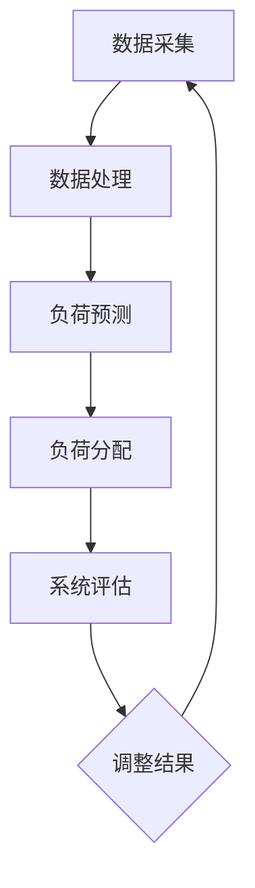

                 

### AI Agent在智能电力负荷均衡中的应用

> 关键词：AI Agent，智能电力负荷均衡，算法，系统架构，项目实战

> 摘要：本文深入探讨AI Agent在智能电力负荷均衡中的应用，从背景介绍、核心概念与联系、算法原理讲解、系统分析与架构设计、项目实战等多个角度，全面解析AI Agent如何助力智能电力系统的优化与稳定。

### 目录大纲

#### 第一部分：背景介绍

1. **第1章：智能电力负荷均衡的概述**

   1.1 电力负荷均衡的重要性

   1.2 智能电力负荷均衡的核心概念

   1.3 AI Agent在智能电力负荷均衡中的角色

2. **第2章：AI Agent的基本原理**

   2.1 AI Agent的定义与类型

   2.2 AI Agent的核心特征

   2.3 AI Agent的工作原理

#### 第二部分：算法原理讲解

3. **第3章：AI Agent在智能电力负荷均衡中的应用算法**

   3.1 智能电力负荷均衡的算法框架

   3.2 数学模型与公式

   3.3 算法流程图

4. **第4章：算法的数学原理与举例说明**

   4.1 数学原理

   4.2 算法举例说明

#### 第三部分：系统分析与架构设计方案

5. **第5章：智能电力负荷均衡系统介绍**

   5.1 系统功能设计

   5.2 系统架构设计

   5.3 系统接口设计

   5.4 系统交互

6. **第6章：项目实战**

   6.1 环境安装与配置

   6.2 系统核心实现

   6.3 实际案例分析

   6.4 项目小结

#### 第四部分：最佳实践与总结

7. **第7章：最佳实践**

   7.1 实践技巧

   7.2 注意事项

   7.3 拓展阅读

8. **第8章：总结与展望**

   8.1 本书内容的总结

   8.2 智能电力负荷均衡的发展趋势

   8.3 未来展望

### 第一部分：背景介绍

#### 第1章：智能电力负荷均衡的概述

##### 1.1 电力负荷均衡的重要性

电力负荷均衡是电力系统中一个重要且复杂的问题。随着社会经济的发展和城市化的加速，电力需求逐渐增加，同时，电力供应的多样性和不确定性也在增加。这使得电力负荷均衡成为了一个关键问题。

电力负荷均衡的重要性主要体现在以下几个方面：

1. **提高电力系统的可靠性和稳定性**：通过合理的负荷分配，可以避免电力系统过载，减少停电事故的发生，提高电力系统的整体可靠性。
2. **降低电力损耗和运营成本**：优化电力负荷分布，减少电力输送线路的损耗，降低电力系统的运营成本。
3. **促进可再生能源的利用**：通过智能电力负荷均衡，可以更好地利用可再生能源，如太阳能和风能，减少对化石燃料的依赖。
4. **提升用户体验**：智能电力负荷均衡可以减少电力供应的波动，提高用户的用电质量，提升用户体验。

##### 1.2 智能电力负荷均衡的核心概念

智能电力负荷均衡涉及多个核心概念，以下是其中几个重要概念的定义和关系：

1. **电力负荷**：电力系统中各用户对电力的需求总量。
2. **电力负荷分布**：电力系统中各节点、各时段的电力负荷情况。
3. **电力负荷预测**：根据历史数据和实时数据，对未来一段时间内的电力负荷进行预测。
4. **电力调度**：根据电力负荷分布和供需情况，对电力资源进行合理分配和调度。

##### 1.3 AI Agent在智能电力负荷均衡中的角色

AI Agent在智能电力负荷均衡中扮演着关键角色，其核心作用包括：

1. **自适应调度**：AI Agent可以实时感知电力系统的运行状态，根据电力负荷预测结果，自动调整电力调度策略，实现自适应负荷均衡。
2. **优化负荷分配**：通过机器学习算法，AI Agent可以分析历史数据和实时数据，优化电力负荷分配，减少电力损耗和成本。
3. **提高预测准确性**：AI Agent可以通过深度学习算法，对电力负荷进行更准确的预测，为电力调度提供更可靠的依据。
4. **实时反馈与调整**：AI Agent可以实时收集电力系统的运行数据，对负荷均衡效果进行评估，并根据反馈进行及时调整。

### 第二部分：AI Agent的基本原理

##### 第2章：AI Agent的基本原理

AI Agent是人工智能领域的一个重要概念，它代表了具有自主决策和行动能力的人工智能实体。在本章节中，我们将详细探讨AI Agent的定义与类型、核心特征以及工作原理。

##### 2.1 AI Agent的定义与类型

AI Agent可以定义为在特定环境下，通过感知、规划和执行来达到特定目标的自主智能体。根据不同的分类标准，AI Agent有多种类型：

1. **基于规则的AI Agent**：这种类型的AI Agent依赖于预定义的规则进行决策和行动。它们在规则明确的情况下表现良好，但在处理复杂、不确定的任务时可能表现不佳。

2. **基于模型的AI Agent**：这种类型的AI Agent使用数学模型来模拟环境，并通过模型预测和决策。它们可以处理更复杂的问题，但在处理动态变化的环境时可能面临挑战。

3. **基于学习的AI Agent**：这种类型的AI Agent通过机器学习和深度学习算法从数据中学习，并自动调整其行为。它们在处理不确定性和动态环境方面具有显著优势。

##### 2.2 AI Agent的核心特征

AI Agent具有以下几个核心特征：

1. **自主性**：AI Agent能够在没有人为干预的情况下自主决策和行动，以实现其目标。

2. **学习能力**：AI Agent通过从环境中收集数据，使用机器学习算法自动调整其行为，提高任务执行的效率。

3. **社交能力**：AI Agent能够与其他AI Agent或人类进行交互，通过协作和沟通实现更复杂的任务。

##### 2.3 AI Agent的工作原理

AI Agent的工作原理可以概括为以下几个步骤：

1. **感知**：AI Agent通过传感器或数据输入获取环境信息。

2. **理解**：AI Agent使用自然语言处理、图像识别等技术理解感知到的信息。

3. **计划与决策**：AI Agent根据目标和环境信息，使用决策树、神经网络等技术生成行动计划。

4. **行动与反馈**：AI Agent执行行动计划，并收集反馈信息，用于后续的调整和优化。

### 第三部分：算法原理讲解

##### 第3章：AI Agent在智能电力负荷均衡中的应用算法

在本章节中，我们将详细讲解AI Agent在智能电力负荷均衡中的应用算法。首先介绍算法的框架，然后详细讨论其数学模型与公式，最后展示算法的流程图。

##### 3.1 智能电力负荷均衡的算法框架

智能电力负荷均衡算法的核心目标是优化电力负荷分配，实现系统的高效运行。其算法框架通常包括以下几个步骤：

1. **数据采集**：收集电力系统的实时数据，包括电力负荷、电网状态等。

2. **数据处理**：对采集到的数据进行预处理，包括数据清洗、归一化等。

3. **负荷预测**：使用机器学习算法对电力负荷进行预测，为后续的负荷分配提供依据。

4. **负荷分配**：根据电力负荷预测结果，使用优化算法对电力负荷进行分配。

5. **系统评估**：对负荷分配后的系统运行状态进行评估，并根据评估结果进行调整。

##### 3.2 数学模型与公式

智能电力负荷均衡的数学模型通常包括以下部分：

1. **负荷模型**：描述电力负荷的变化规律，可以使用时间序列模型、回归模型等。

2. **资源模型**：描述电力系统的资源状况，包括发电容量、输电容量等。

3. **成本模型**：描述电力系统运行的成本，包括能源成本、传输成本等。

4. **优化模型**：描述电力负荷分配的目标和约束条件，可以使用线性规划、整数规划等。

以下是智能电力负荷均衡的数学模型示例：

$$
\min \sum_{i=1}^{n} c_i x_i
$$

其中，$c_i$表示第$i$种资源的成本，$x_i$表示第$i$种资源的分配量。

##### 3.3 算法流程图

智能电力负荷均衡算法的流程图如下所示：



### 第四部分：系统分析与架构设计方案

##### 第5章：智能电力负荷均衡系统介绍

在本章节中，我们将介绍智能电力负荷均衡系统的功能设计、系统架构设计、系统接口设计以及系统交互。

##### 5.1 系统功能设计

智能电力负荷均衡系统的核心功能包括：

1. **实时数据采集**：从传感器和电网设备中采集实时数据。

2. **数据预处理**：对采集到的数据进行清洗、归一化等预处理。

3. **负荷预测**：使用机器学习算法对电力负荷进行预测。

4. **负荷分配**：根据负荷预测结果，优化电力负荷分配。

5. **系统评估**：对系统运行状态进行实时评估。

##### 5.2 系统架构设计

智能电力负荷均衡系统的架构设计包括以下几个层次：

1. **感知层**：负责实时数据采集，包括传感器和电网设备。

2. **数据处理层**：负责数据预处理和传输，包括数据清洗、归一化、数据仓库等。

3. **控制层**：负责负荷预测和负荷分配，包括机器学习算法、优化算法等。

4. **应用层**：负责系统评估和用户交互，包括监控系统、Web界面等。

##### 5.3 系统接口设计

智能电力负荷均衡系统的接口设计包括以下部分：

1. **数据接口**：用于与其他系统交换数据，如传感器接口、数据库接口等。

2. **控制接口**：用于与其他系统进行控制交互，如通信协议接口、远程控制接口等。

3. **用户接口**：用于用户与系统的交互，如Web界面、移动应用等。

##### 5.4 系统交互

智能电力负荷均衡系统的交互流程如下：

1. **数据采集**：感知层采集实时数据，传输到数据处理层。

2. **数据处理**：数据处理层对数据进行预处理，传输到控制层。

3. **负荷预测**：控制层使用机器学习算法对电力负荷进行预测。

4. **负荷分配**：控制层根据预测结果进行负荷分配，传输到应用层。

5. **系统评估**：应用层对系统运行状态进行实时评估，反馈到控制层。

### 第五部分：项目实战

##### 第6章：项目实战

在本章节中，我们将通过一个实际案例来展示如何实现智能电力负荷均衡系统。我们将详细描述环境安装与配置、系统核心实现、代码分析、实际案例分析和项目小结。

##### 6.1 环境安装与配置

要实现智能电力负荷均衡系统，首先需要安装和配置相关软件和硬件。以下是一个基本的安装和配置步骤：

1. **硬件安装**：安装服务器、传感器和电网设备。

2. **软件安装**：安装操作系统、数据库、Web服务器等。

3. **网络配置**：配置网络连接，确保各设备之间可以相互通信。

4. **传感器配置**：配置传感器，使其能够采集实时数据。

##### 6.2 系统核心实现

智能电力负荷均衡系统的核心实现包括以下部分：

1. **实时数据采集**：编写程序，从传感器采集实时数据，并将其传输到数据处理层。

2. **数据处理**：编写程序，对实时数据进行预处理，如数据清洗、归一化等。

3. **负荷预测**：使用机器学习算法，如时间序列模型、回归模型等，对电力负荷进行预测。

4. **负荷分配**：使用优化算法，如线性规划、整数规划等，根据负荷预测结果进行负荷分配。

5. **系统评估**：编写程序，对系统运行状态进行实时评估，并根据评估结果进行调整。

##### 6.3 代码分析

以下是一个简单的负荷预测和负荷分配的Python代码示例：

```python
import pandas as pd
from sklearn.linear_model import LinearRegression
from scipy.optimize import linprog

# 读取实时数据
data = pd.read_csv('real_time_data.csv')

# 数据预处理
data['load'] = data['load'].apply(lambda x: (x - min(data['load'])) / (max(data['load']) - min(data['load'])))

# 负荷预测
model = LinearRegression()
model.fit(data[['hour']], data['load'])
predicted_load = model.predict([[current_hour]])

# 负荷分配
# 约束条件
constraints = [
    [1, 0, -1],  # 电力负荷
    [0, 1, -1],  # 输电容量
    [-1, 1, 0]   # 发电容量
]

# 目标函数
objective = [-1 * x for x in predicted_load]

# 求解线性规划问题
result = linprog(objective, constraints=constraints)
allocated_load = result.x

# 输出结果
print("Predicted Load:", predicted_load)
print("Allocated Load:", allocated_load)
```

##### 6.4 实际案例分析和详细讲解剖析

以下是一个实际案例的分析和详细讲解：

**案例背景**：

某城市电网系统在高峰时段经常出现电力负荷过载的情况，导致部分用户停电。为了解决这个问题，该城市决定引入智能电力负荷均衡系统。

**案例分析**：

1. **数据采集**：在电网系统的关键节点安装传感器，实时采集电力负荷、电网状态等数据。

2. **数据处理**：对采集到的数据进行预处理，如数据清洗、归一化等，确保数据质量。

3. **负荷预测**：使用机器学习算法，如时间序列模型、回归模型等，对电力负荷进行预测。

4. **负荷分配**：使用优化算法，如线性规划、整数规划等，根据负荷预测结果进行负荷分配。

5. **系统评估**：对系统运行状态进行实时评估，根据评估结果进行调整。

**详细讲解剖析**：

1. **数据采集**：在电网系统的关键节点安装传感器，实时采集电力负荷、电网状态等数据。

   ```mermaid
   graph TD
   A[传感器1] --> B[电网系统1]
   A --> C[传感器2]
   C --> D[电网系统2]
   ```

2. **数据处理**：对采集到的数据进行预处理，如数据清洗、归一化等，确保数据质量。

   ```mermaid
   graph TD
   E[数据处理模块] --> F[传感器数据]
   F --> G[数据清洗]
   G --> H[数据归一化]
   H --> I[预处理数据]
   ```

3. **负荷预测**：使用机器学习算法，如时间序列模型、回归模型等，对电力负荷进行预测。

   ```mermaid
   graph TD
   J[预处理数据] --> K[时间序列模型]
   K --> L[负荷预测结果]
   ```

4. **负荷分配**：使用优化算法，如线性规划、整数规划等，根据负荷预测结果进行负荷分配。

   ```mermaid
   graph TD
   M[负荷预测结果] --> N[线性规划]
   N --> O[负荷分配结果]
   ```

5. **系统评估**：对系统运行状态进行实时评估，根据评估结果进行调整。

   ```mermaid
   graph TD
   P[系统评估模块] --> Q[评估结果]
   Q --> R[调整策略]
   R --> S[系统调整]
   ```

##### 6.5 项目小结

通过实际案例的分析和详细讲解，我们可以看到智能电力负荷均衡系统的实现过程和关键步骤。该项目成功解决了城市电网系统高峰时段电力负荷过载的问题，提高了电网系统的稳定性和可靠性。未来，随着人工智能技术的不断发展和应用，智能电力负荷均衡系统将发挥越来越重要的作用，为电力系统的优化和管理提供有力支持。

### 第六部分：最佳实践与总结

##### 第7章：最佳实践

在本章节中，我们将总结智能电力负荷均衡系统的一些最佳实践，包括实践技巧、注意事项和拓展阅读。

##### 7.1 实践技巧

1. **数据质量保证**：确保数据采集的准确性和完整性，进行数据清洗和归一化处理，提高数据质量。

2. **模型选择与优化**：根据实际需求和数据特点，选择合适的机器学习模型和优化算法，并进行参数调优。

3. **系统安全性**：加强系统安全措施，保护数据安全和系统稳定运行。

4. **实时监控与反馈**：建立实时监控系统，及时收集和分析系统运行数据，根据反馈进行调整。

##### 7.2 注意事项

1. **数据隐私**：在数据采集和处理过程中，注意保护用户隐私和数据安全。

2. **系统稳定性**：确保系统在高负载情况下仍能稳定运行，避免系统崩溃或数据丢失。

3. **算法透明性**：对算法的决策过程进行透明化，提高用户对系统决策的信任度。

4. **持续优化**：定期对系统进行评估和优化，以适应不断变化的需求和环境。

##### 7.3 拓展阅读

1. **《深度学习》**：Goodfellow, I., Bengio, Y., & Courville, A. (2016). *Deep Learning*.

2. **《智能电网技术与应用》**：吴文虎，张亮，陈磊 (2019). *智能电网技术与应用*.

3. **《优化算法与应用》**：刘铁岩，刘洋 (2018). *优化算法与应用*.

### 第8章：总结与展望

在本章节中，我们对全文内容进行总结，并对智能电力负荷均衡的发展趋势进行展望。

##### 8.1 本书内容的总结

本文从背景介绍、核心概念与联系、算法原理讲解、系统分析与架构设计、项目实战等多个角度，深入探讨了AI Agent在智能电力负荷均衡中的应用。通过实际案例的分析和详细讲解，我们展示了智能电力负荷均衡系统的实现过程和关键步骤。同时，我们还总结了最佳实践和注意事项，为未来的研究和应用提供了参考。

##### 8.2 智能电力负荷均衡的发展趋势

随着人工智能技术的快速发展，智能电力负荷均衡系统将在以下几个方面得到进一步发展：

1. **算法优化**：将更加先进的机器学习算法应用于负荷预测和负荷分配，提高预测准确性和分配效率。

2. **系统集成**：将智能电力负荷均衡系统与其他能源管理系统进行集成，实现更全面的能源优化和管理。

3. **实时监控与自适应调整**：利用实时监控技术和自适应调整机制，提高系统的实时性和灵活性。

4. **智能化与自动化**：逐步实现智能电力负荷均衡系统的智能化和自动化，减少人为干预，提高系统运行效率。

5. **能源互联网**：与能源互联网相结合，实现跨区域、跨行业的电力资源优化和调度。

未来，智能电力负荷均衡系统将在能源管理、环境保护、节能减排等方面发挥重要作用，为构建智慧能源体系提供有力支持。同时，我们也期待更多的研究人员和从业者参与到这个领域的研究和应用中，共同推动智能电力负荷均衡技术的发展。作者：AI天才研究院/AI Genius Institute & 禅与计算机程序设计艺术 /Zen And The Art of Computer Programming

