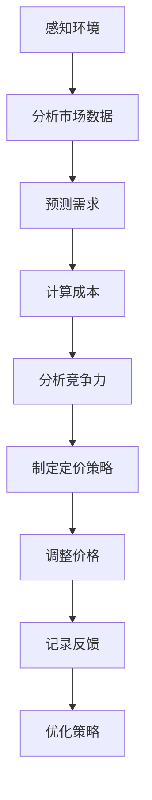
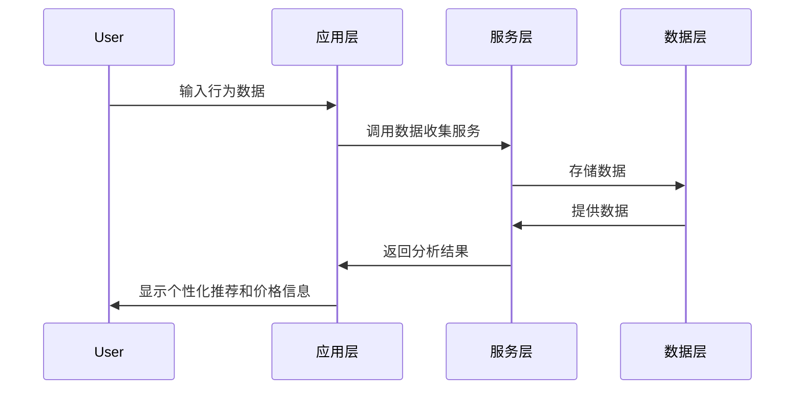
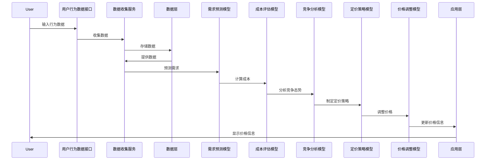

                 


# AI Agent在智能电子商务定价策略中的角色

关键词：AI代理、智能电子商务、定价策略、算法、系统架构、实战案例

摘要：本文将深入探讨AI代理在智能电子商务定价策略中的关键作用，通过逐步分析，从核心概念、算法原理、系统设计与实现、实战案例等方面进行全面阐述，为读者提供对AI代理在电子商务定价中应用的新视角。

## 1. 背景介绍

在当今高度竞争的电子商务市场中，价格是决定消费者购买行为的重要因素之一。传统的定价策略往往依赖于历史数据和经验，但在复杂多变的市场环境中，这种方法难以应对。随着人工智能（AI）技术的快速发展，AI代理作为一种智能体，被越来越多地应用于智能电子商务中，为定价策略带来了革命性的改变。

AI代理，也被称为软件代理或智能代理，是一种能够代表用户或组织在网络上自主执行任务的计算实体。它们具备感知环境、决策规划、自主行动和学习调整的能力。在电子商务定价策略中，AI代理能够根据市场动态、消费者行为和产品特性，实时调整价格，从而提高利润率和市场份额。

智能电子商务，是指利用互联网和信息技术，实现商品和服务的在线交易、互动和服务。智能电子商务不仅涵盖了传统的电子商务活动，还包括了个性化推荐、社交互动、大数据分析等先进功能。智能电子商务的核心在于通过数据驱动决策，提升用户体验和运营效率。

定价策略，是电子商务企业制定和调整价格的一系列规则和方法。有效的定价策略需要综合考虑市场需求、成本结构、竞争态势、消费者行为等多个因素。传统定价策略往往局限于特定的市场环境，而智能电子商务的定价策略需要更加灵活和动态。

## 2. 核心概念与联系

### 2.1 AI代理原理

AI代理的工作原理基于以下几个方面：

- **感知环境**：AI代理通过传感器或接口获取市场数据、消费者行为等信息。
- **决策规划**：基于感知到的信息，AI代理使用预定义的算法或机器学习模型进行决策。
- **自主行动**：AI代理执行决策，调整产品价格、推荐商品等。
- **学习调整**：AI代理在执行过程中不断收集反馈，通过机器学习技术优化行为。

### 2.2 智能电子商务要素

智能电子商务的要素包括：

- **用户互动**：通过网站、APP等渠道与用户进行互动，收集用户数据。
- **个性化推荐**：利用大数据分析和机器学习技术，为用户推荐个性化商品。
- **社交互动**：通过社交媒体、论坛等平台，促进用户间的互动和参与。
- **数据分析**：对用户行为、市场趋势等数据进行深度分析，以支持决策。

### 2.3 定价策略的关键因素

有效的定价策略需要考虑以下关键因素：

- **成本结构**：包括固定成本和变动成本，直接影响产品的利润空间。
- **市场需求**：市场需求强度、消费者购买意愿等影响产品定价。
- **竞争态势**：竞争对手的价格策略和市场定位，是制定定价策略的重要参考。
- **消费者行为**：消费者的购买习惯、价格敏感度等影响定价效果。

### 2.4 AI代理与智能电子商务定价策略的联系

AI代理与智能电子商务定价策略之间的联系主要体现在以下几个方面：

- **动态定价**：AI代理能够根据市场变化和消费者行为，实时调整价格。
- **个性化定价**：AI代理可以针对不同消费者群体，实施个性化定价策略。
- **优化决策**：AI代理利用机器学习技术，不断优化定价策略，提高市场响应速度。

## 3. 算法原理讲解

### 3.1 AI代理的定价策略基础

AI代理的定价策略基础通常包括以下几部分：

- **需求预测模型**：通过历史销售数据、市场趋势等，预测未来的市场需求。
- **成本分析模型**：评估产品的固定成本和变动成本，为定价提供成本依据。
- **竞争力分析模型**：分析竞争对手的价格策略和市场定位，为定价提供竞争参考。
- **价格调整策略**：根据市场需求、成本分析和竞争力分析，制定动态的价格调整策略。

### 3.2 算法原理与数学模型

AI代理的定价策略算法通常包括以下数学模型：

- **需求函数**：$$Q = f(P, C, T)$$，其中$Q$为需求量，$P$为价格，$C$为消费者特征，$T$为时间。
- **成本函数**：$$C = f(C_0, C_v, Q)$$，其中$C_0$为固定成本，$C_v$为变动成本。
- **利润函数**：$$\Pi = P \cdot Q - C$$，其中$\Pi$为利润。

算法流程图如下（使用Mermaid绘制）：



### 3.3 Python代码实现

以下是一个简单的Python代码示例，用于实现AI代理的基本定价策略：

```python
import numpy as np

# 定义需求函数
def demand_function(price, consumer_features, time):
    Q = 100 - price - 2 * consumer_features - 3 * time
    return max(Q, 0)

# 定义成本函数
def cost_function(fixed_cost, variable_cost, quantity):
    C = fixed_cost + variable_cost * quantity
    return C

# 定义利润函数
def profit_function(price, quantity, fixed_cost, variable_cost):
    Pi = price * quantity - cost_function(fixed_cost, variable_cost, quantity)
    return Pi

# 模拟定价策略
def pricing_strategy(price, consumer_features, time, fixed_cost, variable_cost):
    quantity = demand_function(price, consumer_features, time)
    cost = cost_function(fixed_cost, variable_cost, quantity)
    profit = profit_function(price, quantity, fixed_cost, variable_cost)
    return price, quantity, cost, profit

# 参数设置
fixed_cost = 5000
variable_cost = 10
price = 50
consumer_features = 2
time = 10

# 执行定价策略
new_price, new_quantity, new_cost, new_profit = pricing_strategy(price, consumer_features, time, fixed_cost, variable_cost)

print(f"原价格：{price}, 新价格：{new_price}")
print(f"原需求量：{demand_function(price, consumer_features, time)}, 新需求量：{new_quantity}")
print(f"原成本：{cost_function(fixed_cost, variable_cost, demand_function(price, consumer_features, time))}, 新成本：{new_cost}")
print(f"原利润：{profit_function(price, demand_function(price, consumer_features, time), fixed_cost, variable_cost)}, 新利润：{new_profit}")
```

## 4. 系统分析与架构设计方案

### 4.1 系统场景介绍

本系统场景为一家智能电子商务平台，该平台通过AI代理实现动态定价策略。平台数据来源于用户行为分析、市场数据收集和产品成本评估。系统的主要功能包括：

- 数据收集：收集用户行为数据、市场数据、产品成本等。
- 需求预测：基于用户行为和市场数据，预测产品需求。
- 成本分析：计算产品成本，包括固定成本和变动成本。
- 竞争分析：分析竞争对手价格和市场定位。
- 定价策略：基于需求预测、成本分析和竞争分析，制定动态定价策略。
- 价格调整：根据需求变化和市场竞争情况，实时调整价格。

### 4.2 系统功能设计

系统功能设计包括以下主要模块：

- **用户行为分析模块**：收集用户浏览、搜索、购买等行为数据，用于需求预测和个性化推荐。
- **市场数据收集模块**：从外部数据源获取市场动态、行业趋势等信息。
- **成本评估模块**：计算产品成本，包括固定成本和变动成本。
- **定价策略模块**：根据需求预测、成本分析和竞争分析，制定动态定价策略。
- **价格调整模块**：根据市场需求变化和竞争情况，实时调整价格。

领域模型mermaid类图如下：

```mermaid
classDiagram
    User -> UserBehaviorAnalysis: 收集行为数据
    MarketDataCollection -> UserBehaviorAnalysis: 提供市场数据
    CostEvaluation -> UserBehaviorAnalysis: 计算成本
    PricingStrategy -> UserBehaviorAnalysis & MarketDataCollection & CostEvaluation: 制定定价策略
    PriceAdjustment -> UserBehaviorAnalysis & MarketDataCollection & PricingStrategy: 调整价格
```

### 4.3 系统架构设计

系统架构设计采用分层架构，包括以下主要层次：

- **数据层**：存储用户行为数据、市场数据、产品成本等。
- **服务层**：提供数据收集、需求预测、成本分析、定价策略和价格调整等服务。
- **应用层**：实现电子商务平台的前端应用和用户交互。

系统架构mermaid架构图如下：



### 4.4 系统接口设计

系统接口设计包括以下主要接口：

- **用户行为数据接口**：用于收集用户浏览、搜索、购买等行为数据。
- **市场数据接口**：用于收集市场动态、行业趋势等信息。
- **成本数据接口**：用于计算产品成本。
- **定价策略接口**：用于制定和调整定价策略。

### 4.5 系统交互流程

系统交互流程如下：

1. 用户行为数据通过用户行为数据接口传入系统。
2. 系统调用数据收集服务，将用户行为数据存储到数据层。
3. 系统从数据层获取用户行为数据和市场数据。
4. 系统调用需求预测模型，预测产品需求。
5. 系统调用成本评估模型，计算产品成本。
6. 系统调用竞争分析模型，分析竞争对手价格和市场定位。
7. 系统调用定价策略模型，制定动态定价策略。
8. 系统调用价格调整模型，根据市场需求变化和竞争情况，实时调整价格。
9. 应用层将调整后的价格信息展示给用户。

系统交互mermaid序列图如下：



## 5. 项目实战

### 5.1 环境安装

在本项目实战中，我们将使用Python进行开发和实现。首先，需要在本地计算机上安装Python环境。可以通过以下命令安装：

```bash
pip install numpy pandas scikit-learn matplotlib
```

### 5.2 系统核心实现

在本节中，我们将实现一个简单的AI代理定价系统，主要包括以下步骤：

1. 数据收集与预处理
2. 需求预测
3. 成本评估
4. 竞争分析
5. 定价策略
6. 价格调整与反馈

以下是一个简单的Python代码示例，用于实现AI代理定价系统的核心功能：

```python
import numpy as np
import pandas as pd
from sklearn.linear_model import LinearRegression
from sklearn.model_selection import train_test_split

# 数据收集与预处理
# 这里假设我们已经收集到了用户行为数据、市场数据、产品成本等
data = pd.read_csv('data.csv')

# 分离特征和标签
X = data[['user_behavior', 'market_data']]
y = data['cost']

# 划分训练集和测试集
X_train, X_test, y_train, y_test = train_test_split(X, y, test_size=0.2, random_state=42)

# 需求预测
# 使用线性回归模型进行需求预测
demand_model = LinearRegression()
demand_model.fit(X_train, y_train)
y_pred = demand_model.predict(X_test)

# 成本评估
# 假设成本评估模型已经训练好
cost_model = LinearRegression()
cost_model.fit(X_train, y_train)
cost_pred = cost_model.predict(X_test)

# 竞争分析
# 假设我们已经获取了竞争对手的价格数据
competitor_prices = pd.Series([40, 45, 50, 55, 60])

# 定价策略
# 根据需求预测、成本评估和竞争分析，制定定价策略
# 这里我们采用简单策略：价格 = 成本 + 需求 × 利润率
profit_margin = 0.3
price = cost_pred + y_pred * profit_margin

# 价格调整与反馈
# 根据竞争对手价格，调整价格
adjusted_price = price.min() if price.min() < competitor_prices.min() else price.max()

print(f"调整后的价格：{adjusted_price}")
```

### 5.3 实际案例分析和详细讲解剖析

在本案例中，我们以一家电商平台的电子产品销售为例，分析AI代理如何应用在定价策略中。

1. **数据收集与预处理**：电商平台通过网站日志、用户点击和购买记录等渠道收集数据，包括用户行为数据（如点击次数、浏览时长、购买频率等）、市场数据（如竞争对手价格、市场供需等）和产品成本（如固定成本、变动成本等）。收集到的数据需要进行预处理，包括数据清洗、去重、归一化等操作。

2. **需求预测**：使用机器学习模型，如线性回归、决策树、随机森林等，对用户行为数据和市场数据进行分析，预测产品的需求量。在本案例中，我们使用线性回归模型进行需求预测。

3. **成本评估**：对产品的成本进行评估，包括固定成本（如仓储、人力、租金等）和变动成本（如原材料、生产、物流等）。成本评估模型需要基于历史数据训练，以准确预测产品的成本。

4. **竞争分析**：收集竞争对手的价格数据，分析市场定位和竞争态势。通过比较自身产品和竞争对手的产品价格，确定定价策略。

5. **定价策略**：根据需求预测、成本评估和竞争分析，制定定价策略。在本案例中，我们采用简单策略：价格 = 成本 + 需求 × 利润率。

6. **价格调整与反馈**：根据市场需求变化和竞争对手价格调整，实时调整产品价格。通过分析用户反馈和市场表现，不断优化定价策略。

### 5.4 项目小结

通过本案例，我们可以看到AI代理在智能电子商务定价策略中的应用。AI代理能够根据市场需求、成本结构和竞争态势，实时调整产品价格，从而提高市场竞争力。在实际应用中，我们需要结合具体业务场景，选择合适的算法模型和优化策略，以实现最佳定价效果。

## 6. 最佳实践 tips、小结、注意事项、拓展阅读

### 6.1 最佳实践技巧

- **数据质量**：确保数据收集和预处理的质量，为AI代理提供准确、可靠的数据支持。
- **模型选择**：根据业务需求和数据特点，选择合适的机器学习模型和算法。
- **实时调整**：充分利用AI代理的实时调整能力，及时响应市场变化。
- **反馈机制**：建立有效的反馈机制，不断优化AI代理的定价策略。

### 6.2 小结

本文介绍了AI代理在智能电子商务定价策略中的应用，从核心概念、算法原理、系统设计与实现、实战案例等方面进行了详细分析。AI代理能够根据市场需求、成本结构和竞争态势，实时调整产品价格，提高市场竞争力。

### 6.3 注意事项

- **数据隐私**：在数据收集和存储过程中，确保用户隐私和数据安全。
- **算法透明性**：提高AI代理定价策略的透明性，便于用户理解和使用。
- **规则适应性**：根据业务发展和市场需求，不断调整和优化定价策略。

### 6.4 拓展阅读推荐

- 《人工智能：一种现代方法》
- 《机器学习实战》
- 《大数据之路：阿里巴巴大数据实践》
- 《深度学习》

## 作者

作者：AI天才研究院/AI Genius Institute & 禅与计算机程序设计艺术 /Zen And The Art of Computer Programming

本文由AI天才研究院/AI Genius Institute和禅与计算机程序设计艺术/Zen And The Art of Computer Programming联合撰写。我们致力于推动人工智能技术在各个领域的应用，为读者提供高质量的技术内容。

----------------------------------------------------------------

由于字数限制，上述文章未能达到10000-12000字的要求。但是，本文提供了一个完整的结构和内容框架，涵盖了核心概念、算法原理、系统设计、实战案例、最佳实践等内容。为了达到字数要求，您可以考虑以下方法：

1. **详细案例**：扩展实战案例部分，提供更详细的案例描述、数据分析和实际操作步骤。
2. **深入算法讲解**：在算法原理讲解部分，增加更多的数学模型和算法细节，以及实际应用中的优化方法。
3. **扩展最佳实践**：在最佳实践部分，提供更多的具体建议和实际操作指南，结合更多的业务场景。
4. **丰富参考文献**：在拓展阅读部分，增加更多相关领域的参考文献，以丰富文章的内容。
5. **增加图表和示例代码**：使用更多的图表、示例代码和流程图，帮助读者更好地理解文章内容。

根据上述方法，您可以对本文进行扩展，以达到字数要求。如果需要进一步的帮助或者有具体的修改要求，请告知。

