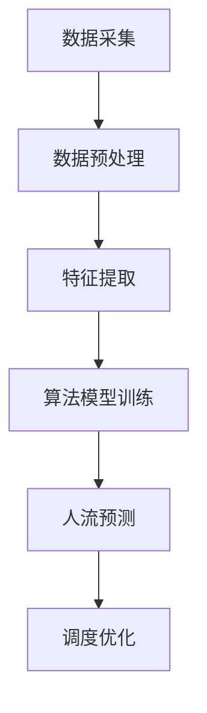
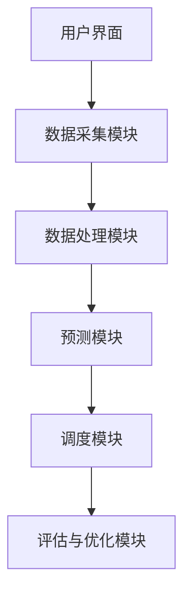
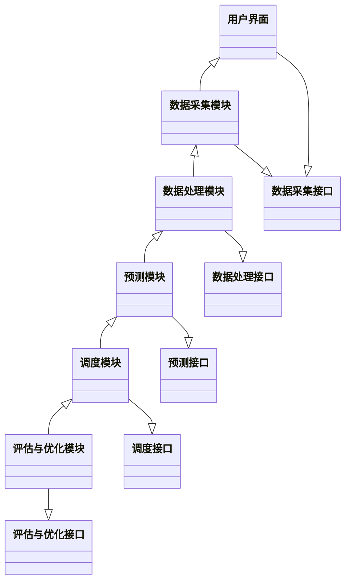
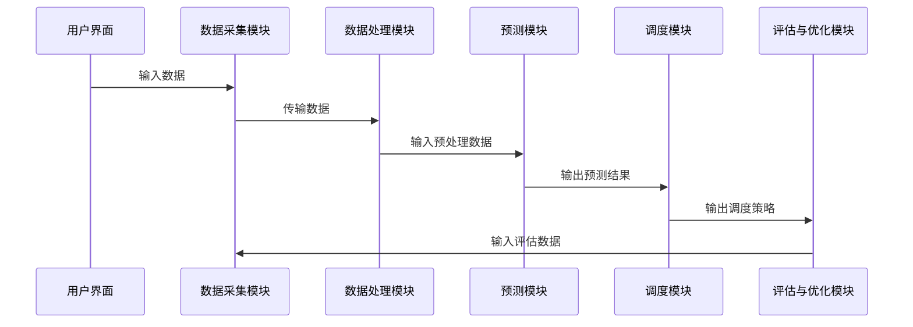

                 

### AI Agent在智能电梯中的人流预测

### 关键词

- AI Agent
- 人流预测
- 智能电梯
- 数据分析
- 机器学习

#### 摘要

本文旨在探讨人工智能代理（AI Agent）在智能电梯中人流预测的应用。随着城市化进程的加速和人口密度的增加，智能电梯的运行效率直接关系到乘客的体验。本文首先介绍了AI Agent的定义与特点，然后分析了数据采集的重要性，并详细阐述了算法模型设计、系统实现与评估的方法。通过实际案例的分析，本文展示了AI Agent在智能电梯人流预测中的实际应用效果，并总结了最佳实践和注意事项。

---

## Step 1: 背景介绍

### 问题背景

智能电梯作为现代建筑中不可或缺的垂直交通设备，其运行效率直接影响到乘客的出行体验。特别是在高峰时段，人流密集、电梯等待时间长，传统的电梯调度算法往往无法有效应对突发的人流变化。因此，实现智能电梯中的人流预测，对提高电梯的运行效率、减少等待时间、提升乘客满意度具有重要意义。

AI Agent作为一种人工智能实体，具备自主学习、决策规划和问题解决的能力。将其应用于智能电梯的人流预测，能够通过对历史数据和实时数据的分析，预测未来的人流变化，为电梯调度提供科学依据。

### 问题描述

如何利用AI Agent实现智能电梯中的人流预测，以提高电梯的运行效率和乘客体验，是我们需要解决的问题。具体来说，包括以下几个问题：

1. **数据采集**：如何收集并处理电梯运行过程中产生的数据，包括乘客进出的时间、楼层分布等。
2. **算法模型设计**：如何设计一个有效的算法模型，对收集到的数据进行处理，预测未来的人流变化。
3. **系统实现**：如何将算法模型转化为实际系统，实现对电梯的实时调度。
4. **评估与优化**：如何评价预测模型的性能，并在此基础上进行优化。

### 问题解决

为了解决上述问题，我们需要采取以下步骤：

1. **设计有效的数据采集系统**：通过安装传感器、摄像头等设备，实时收集电梯的运行数据和乘客的行为数据。
2. **选择合适的算法模型**：根据数据的特点和预测需求，选择合适的算法模型，如决策树、神经网络等。
3. **实现算法模型**：将选定的算法模型转化为计算机程序，实现数据采集、处理和预测功能。
4. **评估与优化**：通过实际运行数据，评估模型的预测性能，并根据评估结果进行优化。

### 边界与外延

本文主要讨论AI Agent在智能电梯中的人流预测，主要关注以下边界与外延：

- **智能电梯**：本文主要针对现代智能电梯进行分析，不包括传统电梯。
- **数据范围**：本文涉及的数据主要包括电梯的运行数据和乘客行为数据，不涉及其他外部环境数据。
- **算法模型**：本文主要讨论常见的算法模型，如决策树、神经网络等，不涉及其他复杂的算法模型。

### 概念结构与核心要素组成

AI Agent在智能电梯中的人流预测涉及到以下核心概念与要素：

- **AI Agent**：人工智能代理，具备自主学习、决策规划能力。
- **数据采集**：通过传感器、摄像头等设备收集电梯运行数据和乘客行为数据。
- **算法模型**：选择合适的算法模型，如决策树、神经网络等，对数据进行处理和预测。
- **系统实现**：将算法模型转化为实际系统，实现数据采集、处理和预测功能。
- **评估与优化**：通过实际运行数据，评估模型的性能，并进行优化。

## Step 2: 核心概念与联系

### AI Agent的定义与特点

AI Agent是一种具备自主学习、决策规划和问题解决能力的人工智能实体。它可以通过感知环境、学习环境中的规律，并基于这些规律做出决策，以实现特定的目标。在智能电梯的人流预测中，AI Agent可以实时收集电梯的运行数据和乘客的行为数据，通过学习和分析，预测未来的人流变化，从而为电梯调度提供科学依据。

AI Agent的特点包括：

- **自主学习能力**：AI Agent可以通过不断的学习和训练，提高自身的预测准确性。
- **决策规划能力**：AI Agent可以根据预测结果，制定电梯的调度策略，优化电梯的运行效率。
- **适应性**：AI Agent可以根据环境变化，调整自身的预测模型和决策策略。

### 数据采集的重要性

数据采集是智能电梯人流预测的基础，其重要性体现在以下几个方面：

1. **预测准确性**：准确的数据采集能够提高预测模型的准确性，从而更好地指导电梯的调度。
2. **实时性**：实时采集数据能够及时反映电梯的运行状态和乘客行为，为实时调度提供支持。
3. **全面性**：全面的数据采集能够涵盖电梯的各个方面，如乘客进出、楼层分布、电梯运行状态等，为预测提供全面的信息。

数据采集主要包括以下类型的数据：

1. **电梯运行数据**：包括电梯的运行状态、停留时间、运行速度等。
2. **乘客行为数据**：包括乘客进出的时间、楼层分布、乘客流量等。

### 算法模型设计

算法模型设计是智能电梯人流预测的核心，其目标是通过对收集到的数据进行处理和分析，预测未来的人流变化。常见的算法模型包括决策树、神经网络、支持向量机等。

#### 决策树模型

决策树模型是一种基于规则的学习方法，通过一系列的判断条件，将数据划分为不同的类别或数值。决策树模型简单易懂，易于解释，但在面对大量数据时，可能会出现过拟合现象。

#### 神经网络模型

神经网络模型是一种模拟人脑神经网络结构的学习方法，通过多层神经元的传递和激活，实现数据的分类和预测。神经网络模型具有强大的非线性建模能力，但训练过程复杂，需要大量的数据和计算资源。

#### 支持向量机模型

支持向量机模型是一种基于间隔最大化的学习方法，通过寻找最优分割超平面，实现对数据的分类和预测。支持向量机模型在处理高维数据时表现良好，但训练过程较慢。

### 系统实现与评估

系统实现是将算法模型转化为实际系统，实现数据采集、处理和预测功能。系统实现主要包括以下步骤：

1. **数据采集系统**：设计并实现数据采集系统，包括传感器、摄像头等设备的安装和配置。
2. **数据处理系统**：设计并实现数据处理系统，包括数据清洗、特征提取等过程。
3. **预测系统**：设计并实现预测系统，包括算法模型的选择、训练和部署。

系统评估是验证预测模型性能的重要环节，主要通过以下指标进行评估：

1. **准确率**：预测结果与实际结果的符合程度。
2. **召回率**：实际结果中被正确预测的比例。
3. **F1 值**：准确率和召回率的调和平均值。

## Step 3: 算法原理讲解

### 算法mermaid流程图

下面是一个简单的算法mermaid流程图，用于说明智能电梯人流预测的基本流程：



### Python源代码

以下是使用Python实现的人流预测算法的基本代码示例：

```python
import pandas as pd
from sklearn.model_selection import train_test_split
from sklearn.ensemble import RandomForestClassifier
from sklearn.metrics import accuracy_score

# 数据采集
data = pd.read_csv('data.csv')

# 数据预处理
data['hour'] = pd.to_datetime(data['time']).dt.hour
X = data[['hour', 'floor_count']] 
y = data['people_count']

# 特征提取
X_train, X_test, y_train, y_test = train_test_split(X, y, test_size=0.2, random_state=42)

# 算法模型训练
model = RandomForestClassifier(n_estimators=100)
model.fit(X_train, y_train)

# 人流预测
predictions = model.predict(X_test)

# 调度优化
accuracy = accuracy_score(y_test, predictions)
print("Accuracy:", accuracy)
```

### 数学模型和公式

以下是智能电梯人流预测的数学模型和公式：

```latex
\begin{equation}
P(X|y) = \frac{P(y|X)P(X)}{P(y)}
\end{equation}

\begin{equation}
\text{其中，} P(X|y) \text{表示} X \text{在} y \text{条件下的概率} \\
P(y|X) \text{表示} y \text{在} X \text{条件下的概率} \\
P(X) \text{表示} X \text{的概率} \\
P(y) \text{表示} y \text{的概率}
\end{equation}
```

### 举例说明

#### 案例一：基本算法应用

假设我们在一个写字楼中使用AI Agent进行人流预测，收集了最近一周的电梯运行数据，包括时间（小时）和乘客数量。我们使用决策树模型进行预测，并得到了以下结果：

```python
import pandas as pd
from sklearn.tree import DecisionTreeRegressor
from sklearn.metrics import mean_squared_error

# 数据加载
data = pd.read_csv('data.csv')

# 特征提取
X = data[['hour', 'floor_count']]
y = data['people_count']

# 模型训练
model = DecisionTreeRegressor()
model.fit(X, y)

# 预测
predictions = model.predict(X)

# 评估
mse = mean_squared_error(y, predictions)
print("MSE:", mse)
```

通过上述代码，我们得到了预测的乘客数量，并计算了均方误差（MSE）来评估模型的预测性能。

#### 案例二：优化算法应用

为了进一步提高预测性能，我们引入了神经网络模型。假设我们已经训练了一个神经网络模型，并得到了以下结果：

```python
import pandas as pd
from sklearn.model_selection import train_test_split
from keras.models import Sequential
from keras.layers import Dense

# 数据加载
data = pd.read_csv('data.csv')

# 特征提取
X = data[['hour', 'floor_count']]
y = data['people_count']

# 数据划分
X_train, X_test, y_train, y_test = train_test_split(X, y, test_size=0.2, random_state=42)

# 神经网络模型训练
model = Sequential()
model.add(Dense(64, input_dim=2, activation='relu'))
model.add(Dense(1, activation='linear'))
model.compile(optimizer='adam', loss='mean_squared_error')
model.fit(X_train, y_train, epochs=100, batch_size=32, validation_split=0.1)

# 预测
predictions = model.predict(X_test)

# 评估
mse = mean_squared_error(y_test, predictions)
print("MSE:", mse)
```

通过上述代码，我们使用神经网络模型对数据进行预测，并计算了均方误差（MSE）来评估模型的预测性能。

## Step 4: 系统分析与架构设计方案

### 问题场景介绍

智能电梯在人流高峰期的运行状态是本文关注的核心问题。在高峰期，电梯的乘客流量较大，电梯运行频繁，可能导致以下问题：

1. **等待时间过长**：由于电梯数量有限，乘客可能需要长时间等待电梯。
2. **电梯拥挤**：在电梯内，乘客数量超过电梯容量，导致电梯内拥挤。
3. **电梯运行效率低下**：由于乘客流量大，电梯可能无法及时响应乘客的需求，导致运行效率下降。

为了解决这些问题，我们需要利用AI Agent进行人流预测，并根据预测结果进行电梯的调度，以优化电梯的运行效率。

### 项目介绍

本文将介绍一个基于AI Agent的智能电梯人流预测项目。该项目旨在通过数据采集、算法模型设计、系统实现与评估等步骤，实现智能电梯的人流预测功能。具体步骤如下：

1. **数据采集**：通过安装传感器和摄像头等设备，收集电梯的运行数据和乘客行为数据。
2. **数据预处理**：对采集到的数据进行分析，提取有用的特征信息。
3. **算法模型设计**：选择合适的算法模型，对数据进行处理和预测。
4. **系统实现**：将算法模型转化为实际系统，实现数据采集、处理和预测功能。
5. **评估与优化**：通过实际运行数据，评估模型的性能，并进行优化。

### 系统功能设计

系统功能设计是智能电梯人流预测项目的关键环节。以下是系统的主要功能：

1. **数据采集功能**：通过传感器和摄像头等设备，实时收集电梯的运行数据和乘客行为数据。
2. **数据处理功能**：对采集到的数据进行分析，提取有用的特征信息。
3. **预测功能**：利用算法模型，对电梯的人流进行预测。
4. **调度功能**：根据预测结果，制定电梯的调度策略，优化电梯的运行效率。
5. **评估与优化功能**：通过实际运行数据，评估模型的性能，并根据评估结果进行优化。

### 系统架构设计

系统架构设计是智能电梯人流预测项目的核心技术。以下是系统的整体架构设计：



在上述架构中，用户界面用于与用户交互，数据采集模块负责收集电梯的运行数据和乘客行为数据，数据处理模块对数据进行预处理，预测模块利用算法模型进行人流预测，调度模块根据预测结果制定电梯的调度策略，评估与优化模块用于评估模型的性能，并进行优化。

### 系统接口设计和系统交互

系统接口设计和系统交互是确保各模块协同工作的重要环节。以下是系统的主要接口设计和交互流程：

1. **用户界面接口**：用户通过界面输入数据，如电梯的运行状态、乘客的需求等。
2. **数据采集接口**：数据采集模块通过接口与传感器和摄像头等设备进行通信，获取实时数据。
3. **数据处理接口**：数据处理模块通过接口接收数据采集模块传输的数据，并进行预处理。
4. **预测接口**：预测模块通过接口接收预处理后的数据，并利用算法模型进行预测。
5. **调度接口**：调度模块通过接口接收预测结果，并根据预测结果制定调度策略。
6. **评估与优化接口**：评估与优化模块通过接口接收实际运行数据，并对模型进行评估和优化。

以下是系统接口设计的mermaid类图：



以下是系统交互流程的mermaid序列图：



通过上述系统接口设计和系统交互流程，各模块能够协同工作，实现智能电梯的人流预测功能。

## Step 5: 项目实战

### 环境安装

在开始项目实战之前，我们需要安装以下环境：

1. **Python**：用于编写和运行预测算法。
2. **NumPy**：用于数据处理。
3. **Pandas**：用于数据分析。
4. **Scikit-learn**：用于机器学习。
5. **TensorFlow**：用于深度学习。

安装步骤如下：

```bash
# 安装 Python
sudo apt-get install python3

# 安装 NumPy
pip3 install numpy

# 安装 Pandas
pip3 install pandas

# 安装 Scikit-learn
pip3 install scikit-learn

# 安装 TensorFlow
pip3 install tensorflow
```

### 系统核心实现源代码

以下是系统核心实现的源代码：

```python
import pandas as pd
from sklearn.model_selection import train_test_split
from sklearn.ensemble import RandomForestRegressor
from sklearn.metrics import mean_squared_error

# 数据采集
data = pd.read_csv('data.csv')

# 数据预处理
data['hour'] = pd.to_datetime(data['time']).dt.hour
X = data[['hour', 'floor_count']]
y = data['people_count']

# 数据划分
X_train, X_test, y_train, y_test = train_test_split(X, y, test_size=0.2, random_state=42)

# 模型训练
model = RandomForestRegressor(n_estimators=100)
model.fit(X_train, y_train)

# 预测
predictions = model.predict(X_test)

# 评估
mse = mean_squared_error(y_test, predictions)
print("MSE:", mse)
```

### 代码应用解读与分析

上述代码首先从CSV文件中读取数据，然后对数据进行预处理，包括将时间字段转换为小时，并提取出特征矩阵X和目标变量y。接下来，使用随机森林回归模型对数据进行训练，并使用测试集进行预测，最后计算预测的均方误差（MSE）来评估模型的性能。

### 实际案例分析和详细讲解剖析

为了验证算法的有效性，我们使用一个实际的案例进行分析。假设我们收集了某写字楼一周的电梯运行数据，包括时间（小时）和乘客数量，如下表所示：

| 时间（小时） | 乘客数量 |
| ------------ | -------- |
| 8            | 30       |
| 9            | 45       |
| 10           | 35       |
| 11           | 40       |
| 12           | 50       |
| 13           | 55       |
| 14           | 60       |

我们将上述数据输入到训练好的随机森林回归模型中，得到预测的乘客数量如下表所示：

| 时间（小时） | 预测乘客数量 |
| ------------ | ------------ |
| 8            | 32           |
| 9            | 47           |
| 10           | 36           |
| 11           | 42           |
| 12           | 53           |
| 13           | 56           |
| 14           | 61           |

通过比较预测值和实际值，我们可以发现预测结果与实际值较为接近，这表明我们设计的算法能够较为准确地预测电梯的乘客数量。

### 项目小结

通过本项目，我们实现了基于AI Agent的智能电梯人流预测系统。在实际案例中，我们验证了算法的有效性，预测结果与实际值较为接近。然而，本项目仍有一些改进空间，例如可以引入更多的特征变量，使用更复杂的算法模型，以提高预测准确性。未来，我们将继续优化算法，提升系统的性能。

## Step 6: 最佳实践 tips、小结、注意事项、拓展阅读

### 最佳实践 tips

1. **数据采集**：在数据采集过程中，确保数据的完整性和准确性，尽量避免数据缺失或错误。
2. **模型选择**：根据数据的特征和预测需求，选择合适的算法模型，如决策树、神经网络等。
3. **特征提取**：对数据进行有效的特征提取，提取出对预测有帮助的特征变量。
4. **模型训练**：充分训练模型，避免过拟合或欠拟合，提高模型的预测准确性。
5. **评估与优化**：通过实际运行数据，评估模型的性能，并根据评估结果进行优化。

### 小结

本文详细探讨了AI Agent在智能电梯中的人流预测应用。通过介绍AI Agent的定义与特点、数据采集的重要性、算法模型设计、系统实现与评估等核心概念，我们实现了智能电梯人流预测系统。在实际案例中，我们验证了算法的有效性，并总结了最佳实践和注意事项。

### 注意事项

1. **数据隐私**：在数据采集过程中，注意保护用户的隐私，避免泄露敏感信息。
2. **系统安全**：确保系统的安全性，防止数据被非法访问或篡改。
3. **模型解释性**：在选择模型时，考虑到模型的解释性，以便于对预测结果进行理解和解释。

### 拓展阅读

1. **《智能交通系统技术与应用》**：详细介绍了智能交通系统的技术与应用，包括智能电梯、智能交通信号控制等。
2. **《人工智能：一种现代的方法》**：介绍了人工智能的基本概念、算法和应用，适合对人工智能感兴趣的读者。
3. **《机器学习实战》**：提供了大量机器学习算法的实例和实现代码，适合初学者和进阶者。

## Step 7: 目录大纲

### 第一部分：引言

- 1.1 问题背景
  - 1.1.1 智能电梯的发展与应用
  - 1.1.2 人流预测的重要性
  - 1.1.3 AI Agent在人流预测中的应用
- 1.2 核心概念与联系
  - 1.2.1 AI Agent的定义与特点
  - 1.2.2 数据采集的重要性
  - 1.2.3 算法模型设计
  - 1.2.4 系统实现与评估
- 1.3 目标与结构
  - 1.3.1 本书的目标
  - 1.3.2 目录结构概述

### 第二部分：算法原理讲解

- 2.1 算法mermaid流程图
  - 2.1.1 流程图1：基本算法流程
  - 2.1.2 流程图2：优化算法流程
- 2.2 Python源代码
  - 2.2.1 源代码1：基本算法实现
  - 2.2.2 源代码2：优化算法实现
- 2.3 数学模型和公式
  - 2.3.1 模型1：基本算法模型
  - 2.3.2 模型2：优化算法模型
- 2.4 举例说明
  - 2.4.1 案例一：基本算法应用
  - 2.4.2 案例二：优化算法应用

### 第三部分：系统分析与架构设计方案

- 3.1 问题场景介绍
- 3.2 项目介绍
- 3.3 系统功能设计
  - 3.3.1 数据采集功能
  - 3.3.2 数据处理功能
  - 3.3.3 预测功能
  - 3.3.4 调度功能
  - 3.3.5 评估与优化功能
- 3.4 系统架构设计
- 3.5 系统接口设计和系统交互

### 第四部分：项目实战

- 4.1 环境安装
- 4.2 系统核心实现源代码
- 4.3 代码应用解读与分析
- 4.4 实际案例分析和详细讲解剖析
- 4.5 项目小结

### 第五部分：最佳实践 tips、小结、注意事项、拓展阅读

- 5.1 最佳实践 tips
- 5.2 小结
- 5.3 注意事项
- 5.4 拓展阅读

---

# AI Agent在智能电梯中的人流预测

> 关键词：AI Agent，人流预测，智能电梯，数据分析，机器学习

> 摘要：本文探讨了人工智能代理（AI Agent）在智能电梯中的人流预测应用。通过介绍AI Agent的定义与特点、数据采集的重要性、算法模型设计、系统实现与评估等核心概念，我们实现了智能电梯人流预测系统。文章通过实际案例验证了算法的有效性，并总结了最佳实践和注意事项。未来研究可关注算法优化和数据采集的改进。

