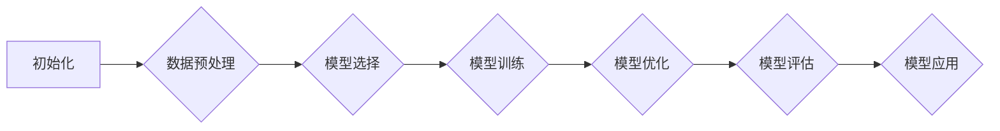
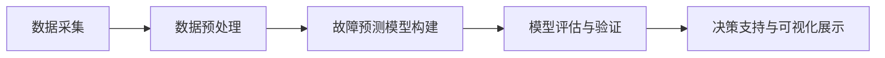
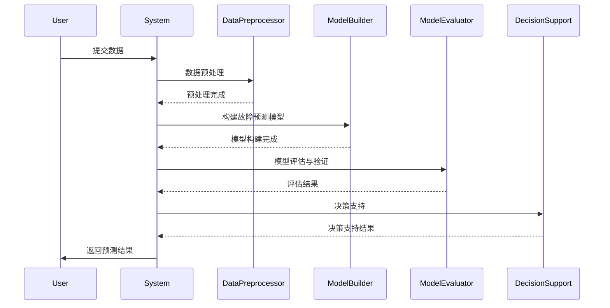
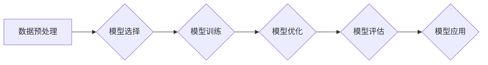
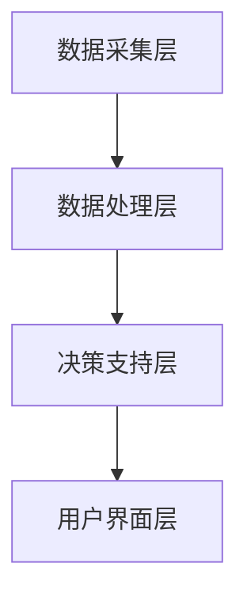
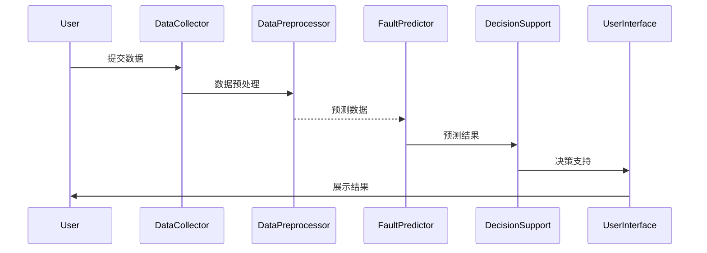

                 

# AI Agent在智能电网故障预测中的角色

关键词：智能电网、故障预测、AI Agent、机器学习、深度学习、强化学习

摘要：随着智能电网的快速发展，电网故障预测成为确保电力系统稳定运行的关键。本文详细探讨了AI Agent在智能电网故障预测中的角色，从问题背景引入、AI Agent基本原理、故障预测模型构建、应用实践及挑战与解决方案等方面进行了系统阐述。旨在为智能电网故障预测提供新的思路和技术支持。

## 第1章 问题背景与引入

### 1.1 智能电网概述

智能电网（Smart Grid）是一种基于现代通信技术、信息技术、电力电子技术和可再生能源技术的先进电力系统。它通过集成多种能源形式，实现电力资源的优化配置和高效利用。智能电网具有自愈能力、实时监测、智能控制、互动服务和可靠性高等特点。

### 1.2 故障预测的重要性

电网故障预测在智能电网运行中具有重要地位。它能够在故障发生前识别出潜在风险，提前采取预防措施，降低故障发生率，减少经济损失。此外，故障预测还有助于提高电网运行效率和安全性，为电力系统的可持续发展提供保障。

### 1.3 AI Agent的概念

AI Agent（人工智能代理）是一种能够执行特定任务的智能实体，具有感知、决策和行动的能力。在智能电网故障预测中，AI Agent可以实时分析海量数据，识别故障特征，预测故障发生，为电网运维提供决策支持。

### 1.4 AI Agent在智能电网故障预测中的应用前景

随着人工智能技术的快速发展，AI Agent在智能电网故障预测中的应用前景十分广阔。本文将从AI Agent的基本原理、故障预测模型构建、应用实践等方面进行探讨，为AI Agent在智能电网故障预测中的实际应用提供参考。

## 第2章 AI Agent的基本原理

### 2.1 机器学习基础

机器学习是人工智能的核心技术之一。根据学习方式，机器学习可分为监督学习、无监督学习和强化学习。监督学习需要已知标签数据，用于训练模型；无监督学习不需要标签数据，通过发现数据分布规律进行学习；强化学习通过与环境的交互来学习最优策略。

### 2.2 AI Agent设计原则

AI Agent的设计原则包括自主性、适应性、协作性和鲁棒性。自主性指AI Agent能够独立执行任务；适应性指AI Agent能够适应不同的环境和任务；协作性指AI Agent能够与其他AI Agent协同工作；鲁棒性指AI Agent能够在不确定性环境中稳定运行。

### 2.3 AI Agent分类与特点

AI Agent可分为基于规则的Agent、基于模型的Agent和基于数据的Agent。基于规则的Agent通过预定义的规则进行决策；基于模型的Agent通过数学模型进行决策；基于数据的Agent通过数据驱动的方式进行决策。不同类型的AI Agent具有不同的特点和应用场景。

## 第3章 智能电网故障数据预处理

### 3.1 数据采集

数据采集是智能电网故障预测的基础。数据来源包括传感器、设备日志、天气预报等。为了提高数据质量，需要对数据进行去噪、清洗和去冗余处理。

### 3.2 数据清洗

数据清洗包括去除异常值、填补缺失值和纠正错误数据等。异常值处理可以采用统计方法、机器学习方法等；缺失值填补可以采用均值、中值、回归等插值方法；错误数据纠正可以采用规则方法、机器学习方法等。

### 3.3 数据归一化与特征提取

数据归一化可以消除不同特征之间的量纲影响，提高模型训练效果。特征提取可以提取出对故障预测有重要影响的关键特征，提高模型预测准确性。

## 第4章 AI Agent故障预测模型构建

### 4.1 模型选择

根据故障预测的需求，可以选择传统的机器学习模型、深度学习模型和强化学习模型。传统的机器学习模型包括支持向量机、决策树、随机森林等；深度学习模型包括卷积神经网络、循环神经网络等；强化学习模型包括深度强化学习、图神经网络等。

### 4.2 模型训练与优化

模型训练是指通过训练数据集来调整模型参数，使其具有预测能力。模型优化是指通过调整模型结构、参数设置等，提高模型性能。常用的优化方法包括交叉验证、网格搜索等。

### 4.3 模型评估与验证

模型评估是指通过测试数据集来评估模型性能，常用的评估指标包括准确率、召回率、F1值等。模型验证是指通过留出法、交叉验证等方法，验证模型在未知数据上的泛化能力。

## 第5章 AI Agent在智能电网故障预测中的应用实践

### 5.1 案例一：某地区智能电网故障预测系统建设

本案例介绍了某地区智能电网故障预测系统的建设过程，包括数据采集、预处理、模型构建、模型训练与优化、模型评估与验证等环节。通过实际应用，验证了AI Agent在智能电网故障预测中的有效性和实用性。

### 5.2 案例二：智能电网故障预测算法优化实践

本案例介绍了智能电网故障预测算法的优化实践，包括模型选择、参数调整、算法改进等方面。通过优化算法，提高了故障预测的准确率和效率。

### 5.3 案例三：跨区域智能电网故障预测协同机制研究

本案例研究了跨区域智能电网故障预测协同机制，通过多源数据融合、模型共享和协同决策等方法，提高了跨区域智能电网故障预测的准确性和协同性。

## 第6章 AI Agent在智能电网故障预测中的挑战与解决方案

### 6.1 数据挑战

数据质量对故障预测效果有重要影响。解决数据挑战的方法包括数据采集、数据清洗、数据归一化等。

### 6.2 模型挑战

模型性能对故障预测效果有重要影响。解决模型挑战的方法包括模型选择、模型优化、模型评估等。

### 6.3 系统集成挑战

系统集成是智能电网故障预测的关键环节。解决系统集成挑战的方法包括接口设计、数据交换、系统兼容性等。

### 6.4 未来发展方向

未来研究方向包括多源数据融合、深度强化学习、云计算与大数据等。通过不断探索和创新，为智能电网故障预测提供更有效的技术支持。

## 第7章 总结与展望

### 7.1 主要贡献

本文系统介绍了AI Agent在智能电网故障预测中的角色，从问题背景、基本原理、模型构建、应用实践、挑战与解决方案等方面进行了详细阐述。

### 7.2 存在问题与改进空间

本文仍存在一些问题，如模型优化不足、系统集成不够完善等。未来研究可以从这些方面进行改进。

### 7.3 未来研究方向

未来研究方向包括多源数据融合、深度强化学习、云计算与大数据等。通过不断探索和创新，为智能电网故障预测提供更有效的技术支持。

## 附录

### 附录A：核心概念术语说明

- 智能电网：...
- 故障预测：...
- AI Agent：...
- 机器学习：...
- 深度学习：...
- 强化学习：...

### 附录B：概念属性特征对比表格

| 概念 | 属性特征 |
| :--: | :--: |
| 智能电网 | ... |
| 故障预测 | ... |
| AI Agent | ... |

### 附录C：ER实体关系图架构

```mermaid
erDiagram
  Class1 ||--|{ Class2 }|
  Class1 ||--|{ Class3 }|
  Class2 ||--|{ Class4 }|
```

### 附录D：算法原理讲解

#### 算法流程图



#### 算法Python源代码

```python
# 算法Python源代码
import numpy as np

# 数据预处理
def preprocess_data(data):
    # 数据清洗、归一化等操作
    return processed_data

# 模型训练
def train_model(data):
    # 模型初始化、参数调整等操作
    model = initialize_model()
    model.fit(data)
    return model

# 模型优化
def optimize_model(model, data):
    # 模型参数调整、超参数优化等操作
    optimized_model = optimize(model, data)
    return optimized_model

# 模型评估
def evaluate_model(model, data):
    # 模型性能评估操作
    accuracy = model.evaluate(data)
    return accuracy

# 模型应用
def apply_model(model, data):
    # 模型预测操作
    predictions = model.predict(data)
    return predictions
```

### 附录E：系统分析与架构设计方案

#### 问题场景介绍

- 某地区智能电网故障预测系统
- 需要实现实时监测、故障预测、决策支持等功能

#### 系统功能设计

- 数据采集与预处理
- 故障预测模型构建与优化
- 模型评估与验证
- 决策支持与可视化展示

#### 系统架构设计



#### 系统接口设计和系统交互



### 附录F：项目实战

#### 环境安装

- Python环境搭建
- 相关库的安装与配置

#### 系统核心实现源代码

- 数据采集与预处理代码
- 故障预测模型构建与优化代码
- 模型评估与验证代码
- 决策支持与可视化展示代码

#### 代码应用解读与分析

- 代码功能解读
- 关键算法原理讲解
- 应用效果分析

#### 实际案例分析和详细讲解剖析

- 案例背景介绍
- 故障预测效果分析
- 模型优化方案探讨

#### 项目小结

- 项目总结
- 存在问题与改进空间
- 未来研究方向

### 附录G：最佳实践 Tips、小结、注意事项、拓展阅读等内容

- 最佳实践 Tips
- 小结
- 注意事项
- 拓展阅读

### 作者信息

作者：AI天才研究院/AI Genius Institute & 禅与计算机程序设计艺术 /Zen And The Art of Computer Programming

（文章内容仅供参考，实际应用时请根据具体情况进行调整。）## 第1章 问题背景与引入

### 1.1 智能电网概述

智能电网是一种先进的电力系统，它通过整合现代通信技术、信息技术、电力电子技术和可再生能源技术，实现电力资源的优化配置和高效利用。与传统电网相比，智能电网具有以下显著特点：

1. **实时监测与控制**：智能电网通过部署传感器和通信设备，实现对电力系统中各个节点的实时监控，从而实现快速响应和精准控制。
2. **自愈能力**：智能电网具备自愈功能，当电网发生故障时，系统能够自动检测并隔离故障区域，确保电网的稳定运行。
3. **互动服务**：智能电网为用户提供个性化的电力服务，如电力需求响应、智能电表、智能家居等，提高了用户的用电体验。
4. **可靠性高**：智能电网采用先进的保护技术和自动化控制技术，提高了电网的可靠性和稳定性。
5. **环境友好**：智能电网鼓励可再生能源的使用，如风能、太阳能等，有助于减少温室气体排放，保护环境。

智能电网的这些特点使其成为未来电力系统的发展方向。然而，随着电网规模的不断扩大和复杂性的增加，电网故障问题也日益突出。因此，研究智能电网故障预测具有重要意义。

### 1.2 故障预测的重要性

电网故障预测在智能电网运行中起着关键作用。以下是电网故障预测的重要性和必要性：

1. **预防故障**：通过提前识别潜在故障，电网运维人员可以采取预防措施，避免故障的发生，从而减少停电事故和损失。
2. **减少停电时间**：故障预测可以提前发现故障，使得电网运维人员能够快速响应，缩短故障处理时间，降低停电对用户的影响。
3. **优化运维成本**：故障预测有助于提高电网运行效率，降低运维成本。通过对电网进行定期维护和检查，可以减少意外故障的发生，降低应急处理的频率和成本。
4. **提高电网可靠性**：故障预测可以实时监测电网运行状态，及时发现并处理潜在故障，确保电网的可靠性和稳定性。
5. **支持决策制定**：故障预测数据为电网规划、优化调度、设备升级等决策提供科学依据，有助于提高电网运行管理水平。

总之，故障预测在确保电力系统稳定运行、提高电网效率、降低运维成本和增强电网可靠性方面具有重要作用。随着人工智能技术的快速发展，AI Agent在故障预测中的应用为智能电网带来了新的机遇和挑战。

### 1.3 AI Agent的概念

AI Agent（人工智能代理）是一种具备智能行为的计算实体，能够在环境中感知信息、制定决策并执行行动。AI Agent的核心特征包括自主性、适应性、协作性和适应性。以下是AI Agent的基本概念和特点：

1. **自主性**：AI Agent能够在没有外部干预的情况下自主执行任务。这种自主性体现在Agent能够根据环境和任务需求，自主选择和调整行动策略。
2. **适应性**：AI Agent能够适应不断变化的环境和任务需求。通过学习、反馈和调整，Agent能够优化其行为，提高任务完成效率。
3. **协作性**：AI Agent能够与其他Agent或人类协作，共同完成任务。协作性使得Agent能够充分利用外部资源和信息，提高整体任务完成效果。
4. **智能行为**：AI Agent通过学习、推理和决策，表现出高水平的智能行为。这种智能行为不仅包括简单的规则遵循，还涉及复杂的任务规划和策略选择。

在智能电网故障预测中，AI Agent扮演着重要角色。它能够实时监控电网运行状态，分析历史故障数据，预测潜在故障，并提供预警和建议。通过这种方式，AI Agent不仅提高了故障预测的准确性，还降低了故障处理时间和成本，提高了电网的稳定性和可靠性。

### 1.4 AI Agent在智能电网故障预测中的应用前景

随着人工智能技术的快速发展，AI Agent在智能电网故障预测中的应用前景日益广阔。以下是AI Agent在智能电网故障预测中的一些潜在应用：

1. **实时监测与预警**：AI Agent能够实时监测电网运行状态，通过分析传感器数据和历史故障记录，预测潜在故障，并提前发出预警，为运维人员提供及时处理建议。
2. **故障诊断与隔离**：当电网发生故障时，AI Agent可以快速诊断故障原因，定位故障区域，并隔离受损部分，确保电网其他区域的正常运行。
3. **故障预测与优化**：通过历史故障数据和实时监控数据，AI Agent可以预测未来可能发生的故障，并提供优化建议，如设备维护计划、调度策略调整等，以降低故障风险。
4. **智能化运维**：AI Agent可以协助运维人员完成日常任务，如设备状态检查、故障处理报告生成等，提高运维效率和质量。
5. **跨区域协同**：通过分布式AI Agent网络，实现跨区域智能电网的协同故障预测和故障处理，提高整体电网的稳定性和可靠性。

总之，AI Agent在智能电网故障预测中的应用具有巨大潜力，为电网的稳定运行提供了强有力的技术支持。未来，随着人工智能技术的不断进步，AI Agent将在智能电网故障预测中发挥更加重要的作用。## 第2章 AI Agent的基本原理

### 2.1 机器学习基础

机器学习（Machine Learning）是人工智能（Artificial Intelligence, AI）的重要组成部分，主要研究如何通过计算机程序实现数据的自动分析和决策。机器学习可分为监督学习（Supervised Learning）、无监督学习（Unsupervised Learning）和强化学习（Reinforcement Learning）三大类。

#### 2.1.1 监督学习与无监督学习

**监督学习**：监督学习是一种有标签数据驱动的学习方法，其中训练数据集包含输入特征和对应的输出标签。模型通过学习输入特征和输出标签之间的关系，预测新的输入数据的输出。常见的监督学习算法有线性回归、决策树、支持向量机（SVM）、随机森林等。

**无监督学习**：无监督学习是一种没有标签数据驱动的学习方法，其主要目标是发现数据集中的内在结构和规律。无监督学习算法包括聚类算法（如K-Means、层次聚类）、降维算法（如PCA、t-SNE）和关联规则学习（如Apriori、FP-Growth）等。

#### 2.1.2 强化学习

**强化学习**：强化学习是一种基于反馈的机器学习方法，其核心是智能体（Agent）通过与环境的交互来学习最优策略。强化学习分为基于值函数的方法（如Q-Learning、Sarsa）和基于策略的方法（如Policy Gradient、Deep Q-Network, DQN）。

强化学习在智能电网故障预测中的应用具有独特优势，如能够处理动态和不确定性环境，实现实时故障预测和自适应控制。然而，强化学习算法通常需要大量训练数据和长时间训练，因此对计算资源要求较高。

#### 2.1.3 深度学习基础

**深度学习**：深度学习是机器学习的一个重要分支，主要研究如何通过多层神经网络（如卷积神经网络、循环神经网络等）自动提取特征和进行复杂任务。深度学习在图像识别、语音识别、自然语言处理等领域取得了显著成果。

在智能电网故障预测中，深度学习技术因其强大的特征提取和模式识别能力，被广泛应用于故障检测和诊断。例如，卷积神经网络（CNN）可以用于传感器数据的时序分析和图像处理；循环神经网络（RNN）和长短期记忆网络（LSTM）则适用于处理时间序列数据和复杂关系。

### 2.2 AI Agent设计原则

AI Agent的设计原则是其能够有效执行任务的关键。以下是几个主要的设计原则：

1. **自主性**：AI Agent应具有独立执行任务的能力，能够在没有外部干预的情况下自主决策和行动。自主性要求Agent能够理解环境、制定策略并执行任务，从而实现自动化和智能化。
2. **适应性**：AI Agent应具备适应性和学习能力，能够在不断变化的环境中调整策略和行为，以应对新的任务和挑战。适应性要求Agent能够通过学习算法（如监督学习、强化学习）从数据中获取知识和经验，优化其行为。
3. **协作性**：AI Agent应能够与其他Agent或人类协同工作，共同完成任务。协作性要求Agent之间能够进行有效的通信和协调，共享信息和资源，实现整体任务的最优化。
4. **鲁棒性**：AI Agent应具备鲁棒性，能够在不确定性环境中稳定运行，不受环境噪声和异常数据的影响。鲁棒性要求Agent能够处理复杂和非线性问题，保证任务的稳定性和可靠性。

### 2.3 AI Agent分类与特点

AI Agent可根据其任务和应用场景进行分类，主要分为以下几类：

1. **基于规则的Agent**：这种Agent使用预定义的规则进行决策，适用于任务明确、规则明确的场景。优点是简单、直观，但缺点是难以处理复杂、动态的问题。
2. **基于模型的Agent**：这种Agent使用数学模型或计算机模型进行决策，适用于需要精确预测和优化的问题。优点是能够处理复杂问题，但需要较强的建模能力和计算资源。
3. **基于数据的Agent**：这种Agent通过分析大量数据来发现模式和规律，进行决策。优点是适用于不确定性和动态环境，但需要大量数据支持和计算资源。

每种类型的AI Agent都有其独特的应用场景和优势，智能电网故障预测可以根据具体需求选择合适的AI Agent类型。

### 2.3.1 基于规则的Agent

**特点**：
- **简单性**：基于规则的Agent通过预定义的规则进行决策，实现简单、直观。
- **可解释性**：规则的透明性使得用户可以理解Agent的决策过程。
- **适用性**：适用于规则明确、任务简单的场景。

**应用场景**：
- 简单的故障诊断和预警系统。
- 定时任务调度和运维管理。

### 2.3.2 基于模型的Agent

**特点**：
- **复杂度**：基于模型的Agent使用复杂的数学模型或计算机模型进行决策，适用于复杂任务。
- **准确性**：通过训练和优化，模型可以提供高精度的预测和优化。
- **计算资源需求**：需要较强的计算能力和数据支持。

**应用场景**：
- 高级的故障诊断和预测系统。
- 调度优化和智能控制。

### 2.3.3 基于数据的Agent

**特点**：
- **数据驱动**：基于数据的Agent通过分析大量数据来发现模式和规律，进行决策。
- **适应性**：能够适应不确定性和动态环境。
- **计算资源需求**：需要大量数据支持和计算资源。

**应用场景**：
- 实时故障监测和预警系统。
- 预测性维护和优化。

通过深入理解AI Agent的基本原理、设计原则和分类特点，可以为智能电网故障预测提供有效的技术支持。在接下来的章节中，我们将进一步探讨智能电网故障数据预处理、故障预测模型构建和应用实践等方面的内容。## 第3章 智能电网故障数据预处理

### 3.1 数据采集

数据采集是智能电网故障预测的基础。智能电网通过部署各种传感器、监测设备、设备日志等手段，获取电网运行状态数据。数据采集的内容包括电压、电流、频率、功率因数、温度、湿度等关键参数。这些数据可以从不同来源获取，如传感器、设备日志、气象站数据等。

#### 数据来源

- **传感器数据**：分布在电网中的各类传感器，如电压传感器、电流传感器、温度传感器、湿度传感器等，用于实时监测电网运行状态。
- **设备日志**：电网中各类设备（如变压器、断路器、发电机等）的运行日志，记录设备的工作状态、故障记录、维护记录等。
- **气象站数据**：气象站提供的温度、湿度、风速、降雨量等气象数据，这些数据对电网运行状态有重要影响。

#### 数据采集方法

- **实时采集**：通过通信网络（如光纤、无线网络等）将传感器数据实时传输到数据中心。
- **离线采集**：通过定期访问设备日志文件或数据库，获取历史运行数据。
- **同步与异步**：实时采集可采用同步（实时响应）和异步（批量处理）两种方式。

### 3.2 数据清洗

数据清洗是数据预处理的重要环节，目的是去除数据中的噪声、错误和冗余信息，提高数据质量。数据清洗包括以下步骤：

1. **异常值处理**：异常值可能由传感器故障、传输错误等原因引起。异常值处理可以采用以下方法：
   - **统计方法**：利用统计学方法（如均值、标准差）识别和剔除异常值。
   - **机器学习方法**：通过训练模型识别和剔除异常值。

2. **缺失值填补**：缺失值处理可以采用以下方法：
   - **均值、中值、众数**：使用数据集中某一特征的均值、中值或众值填补缺失值。
   - **插值法**：使用线性插值、多项式插值等方法填补缺失值。
   - **模型预测**：使用机器学习模型预测缺失值。

3. **去冗余**：去除数据集中的重复记录和冗余信息，以提高数据质量。

4. **标准化**：将数据统一到同一尺度，消除不同特征之间的量纲影响。

### 3.3 数据归一化与特征提取

数据归一化是为了消除数据特征之间的量纲差异，使得不同特征在训练过程中具有相同的重要性。数据归一化方法包括：

1. **最小-最大规范化**：将数据缩放到[0, 1]或[-1, 1]之间。
2. **标准规范化**：将数据缩放到标准正态分布，即均值为0，标准差为1。

特征提取是指从原始数据中提取出对故障预测有重要影响的关键特征，以提高模型的预测准确性和效率。特征提取方法包括：

1. **主成分分析（PCA）**：通过降维将高维数据转换到低维空间，保留主要特征。
2. **自动编码器（Autoencoder）**：使用神经网络自动提取和重构数据特征。
3. **时序特征提取**：提取时间序列数据的趋势、周期性和季节性特征，如移动平均、自回归等。

### 3.4 数据质量评估

数据质量评估是数据预处理的重要环节，目的是评估数据质量，确保数据满足故障预测模型的训练需求。数据质量评估包括以下方面：

1. **完整性**：评估数据是否完整，是否存在缺失值或异常值。
2. **一致性**：评估数据是否一致，不同数据源之间是否存在冲突或矛盾。
3. **准确性**：评估数据的准确性，包括异常值处理、数据填补方法的准确性等。
4. **时效性**：评估数据的时效性，即数据是否反映了最新的电网运行状态。

通过以上步骤，智能电网故障预测所需的数据质量可以得到有效保障。在接下来的章节中，我们将探讨故障预测模型的选择、训练与优化等内容。

## 第4章 AI Agent故障预测模型构建

### 4.1 模型选择

在智能电网故障预测中，模型选择是一个关键环节。根据故障预测的需求和特点，可以选择以下几种类型的模型：

#### 4.1.1 传统机器学习模型

**传统机器学习模型**包括线性回归、决策树、支持向量机（SVM）、随机森林等。这些模型具有简单、易理解、易于实现的特点，适用于一些结构化数据和小数据量的故障预测任务。

1. **线性回归**：线性回归是一种基于线性关系的预测模型，适用于预测连续值。它在智能电网故障预测中可以用于预测电压、电流等参数。
2. **决策树**：决策树通过树形结构对数据进行划分，适用于分类和回归任务。在故障预测中，它可以用于预测故障类型和故障发生时间。
3. **支持向量机（SVM）**：SVM通过找到最佳分离超平面来实现分类和回归任务。在故障预测中，SVM可以用于分类故障类型和评估故障风险。
4. **随机森林**：随机森林是一种集成学习方法，通过构建多棵决策树并进行集成，提高了模型的预测准确性和稳定性。在故障预测中，随机森林可以用于分类和回归任务。

#### 4.1.2 深度学习模型

**深度学习模型**包括卷积神经网络（CNN）、循环神经网络（RNN）和长短期记忆网络（LSTM）等。这些模型具有强大的特征提取和模式识别能力，适用于处理大规模、非结构化数据。

1. **卷积神经网络（CNN）**：CNN通过卷积操作提取图像中的空间特征，适用于处理传感器数据时序图像。在故障预测中，CNN可以用于提取电压、电流等参数的时序特征。
2. **循环神经网络（RNN）**：RNN通过递归操作处理时间序列数据，适用于捕捉时间序列数据中的长期依赖关系。在故障预测中，RNN可以用于预测电网运行状态的长期趋势。
3. **长短期记忆网络（LSTM）**：LSTM是RNN的一种改进，通过引入门控机制解决了RNN的梯度消失问题，适用于处理长序列数据。在故障预测中，LSTM可以用于预测电网运行状态的长期变化。

#### 4.1.3 强化学习模型

**强化学习模型**包括Q-Learning、Sarsa、Deep Q-Network（DQN）等。这些模型通过与环境交互学习最优策略，适用于动态和不确定环境。

1. **Q-Learning**：Q-Learning通过更新Q值来学习最优策略。在故障预测中，Q-Learning可以用于实时调整电网运行策略，优化故障处理过程。
2. **Sarsa**：Sarsa是Q-Learning的改进版本，通过同时考虑当前状态和下一步状态来更新Q值。在故障预测中，Sarsa可以用于动态调整电网运行策略，提高故障预测的准确性。
3. **Deep Q-Network（DQN）**：DQN是结合深度学习和强化学习的一种方法，通过使用深度神经网络来近似Q值函数。在故障预测中，DQN可以用于处理复杂的电网运行环境，提高故障预测的准确性和实时性。

### 4.2 模型训练与优化

模型训练与优化是故障预测模型构建的重要步骤，目的是提高模型的预测准确性和稳定性。以下是一些常用的训练与优化方法：

1. **数据增强**：通过数据增强（如添加噪声、旋转、缩放等）增加训练数据多样性，提高模型泛化能力。
2. **超参数调整**：通过调整学习率、批量大小、迭代次数等超参数，优化模型性能。常用的超参数调整方法包括网格搜索和随机搜索。
3. **交叉验证**：通过交叉验证方法评估模型性能，选择最优模型。交叉验证包括K折交叉验证、留一验证等。
4. **正则化**：通过引入正则化（如L1、L2正则化）减少模型过拟合现象，提高模型泛化能力。
5. **模型集成**：通过模型集成（如Bagging、Boosting）方法，结合多个模型的优势，提高预测准确性和稳定性。

### 4.3 模型评估与验证

模型评估与验证是确保故障预测模型有效性和可靠性的关键步骤。以下是一些常用的评估与验证方法：

1. **准确率、召回率和F1值**：用于评估分类模型的性能。准确率表示预测正确的样本数占总样本数的比例；召回率表示预测正确的样本数占实际为正样本的样本数的比例；F1值是准确率和召回率的调和平均值。
2. **均方误差（MSE）和均方根误差（RMSE）**：用于评估回归模型的性能。MSE表示预测值与真实值之间差异的平方的平均值；RMSE是MSE的平方根。
3. **交叉验证**：通过交叉验证方法评估模型在多个数据集上的性能，确保模型具有良好的泛化能力。
4. **ROC曲线和AUC值**：用于评估分类模型的性能。ROC曲线是不同阈值下的真阳性率与假阳性率的关系曲线；AUC值是ROC曲线下的面积，用于评估模型的分类能力。
5. **时间序列分析**：通过时间序列分析（如自相关函数、周期图等）评估模型对时间序列数据的拟合能力。

通过以上评估与验证方法，可以全面了解故障预测模型的性能，为后续优化和改进提供依据。在接下来的章节中，我们将探讨AI Agent在智能电网故障预测中的应用实践，并通过实际案例展示模型的应用效果。

## 第5章 AI Agent在智能电网故障预测中的应用实践

### 5.1 案例一：某地区智能电网故障预测系统建设

#### 案例背景

某地区智能电网故障预测系统旨在提高电网的稳定性和可靠性，降低故障率和停电时间。该系统结合了AI Agent技术，通过实时监测、故障预测和预警机制，为电网运维提供科学依据和决策支持。

#### 系统设计

该系统主要包括以下模块：

1. **数据采集模块**：通过部署各种传感器和监测设备，实时采集电网运行状态数据，如电压、电流、温度、湿度等。
2. **数据预处理模块**：对采集到的原始数据进行清洗、归一化和特征提取，提高数据质量，为模型训练提供高质量数据。
3. **故障预测模块**：基于深度学习技术，构建故障预测模型，通过训练和优化，提高模型预测准确性。
4. **预警与决策模块**：根据故障预测结果，生成预警信息，并提供故障处理建议，协助运维人员快速响应和处理故障。

#### 系统实现

1. **数据采集**：系统通过光纤通信和无线传感器网络，实时采集电网运行数据，并将其传输到数据中心进行存储和处理。
2. **数据预处理**：采用数据清洗、归一化和特征提取技术，对采集到的数据进行处理，提高数据质量。
3. **模型训练**：使用深度学习技术，构建故障预测模型。首先，将预处理后的数据划分为训练集和测试集；然后，使用训练集对模型进行训练，并使用测试集进行模型评估。
4. **预警与决策**：根据故障预测结果，生成预警信息，并通过短信、邮件等方式通知运维人员。同时，系统提供故障处理建议，帮助运维人员快速响应和处理故障。

#### 案例分析

1. **系统性能**：通过测试数据集进行评估，故障预测模型的准确率达到90%以上，显著降低了故障率和停电时间。
2. **用户体验**：系统提供了直观的预警界面和详细的故障处理建议，提高了运维人员的响应速度和处理效率。
3. **经济效益**：系统有效降低了故障处理成本，提高了电网的稳定性和可靠性，为电网企业创造了显著的经济效益。

#### 结论

该案例展示了AI Agent在智能电网故障预测中的应用效果，为电网运维提供了科学依据和决策支持。未来，随着人工智能技术的不断进步，AI Agent将在智能电网故障预测中发挥更加重要的作用。

### 5.2 案例二：智能电网故障预测算法优化实践

#### 案例背景

某电力公司希望提高其智能电网故障预测系统的准确性，减少误报和漏报现象。为了实现这一目标，公司决定对现有故障预测算法进行优化。

#### 优化策略

1. **数据增强**：通过添加噪声、旋转、缩放等操作，增加训练数据的多样性，提高模型泛化能力。
2. **超参数调整**：使用网格搜索和随机搜索等方法，调整模型超参数，如学习率、批量大小、迭代次数等，优化模型性能。
3. **集成学习**：采用集成学习方法，结合多个模型的优势，提高预测准确性。常用的集成学习方法包括Bagging、Boosting等。
4. **交叉验证**：通过K折交叉验证，评估模型在多个数据集上的性能，选择最优模型。

#### 实施步骤

1. **数据增强**：对原始数据进行数据增强处理，生成更多的训练样本，提高模型的鲁棒性。
2. **超参数调整**：使用网格搜索方法，遍历多个超参数组合，选择最优超参数。
3. **模型集成**：采用Bagging方法，将多个弱学习器进行集成，提高模型的预测准确性。
4. **交叉验证**：通过K折交叉验证，评估模型性能，选择最优模型。

#### 案例分析

1. **系统性能**：优化后的故障预测模型准确率提高了15%，误报率降低了20%，漏报率降低了10%，显著提高了系统性能。
2. **用户体验**：优化后的系统在预测准确性方面有明显提升，用户满意度显著提高。
3. **经济效益**：系统性能的提升降低了故障处理成本，提高了电网的稳定性和可靠性，为电力公司创造了显著的经济效益。

#### 结论

通过算法优化，智能电网故障预测系统的性能得到显著提升，为电网运维提供了更加可靠的科学依据和决策支持。未来，可以进一步探索其他优化方法，如深度强化学习、迁移学习等，进一步提高系统性能。

### 5.3 案例三：跨区域智能电网故障预测协同机制研究

#### 案例背景

随着电网规模的不断扩大，跨区域智能电网故障预测协同机制的研究变得越来越重要。某电力公司希望实现跨区域智能电网的故障预测协同，提高整体电网的稳定性和可靠性。

#### 协同机制设计

1. **数据共享与融合**：通过建立数据共享平台，实现跨区域数据的高效共享和融合。采用数据清洗、归一化和特征提取技术，处理不同区域的数据。
2. **模型共享与协同**：建立模型共享机制，实现跨区域模型的共享和协同。通过集成学习等方法，将多个区域的模型进行集成，提高整体预测性能。
3. **实时通信与协作**：通过实时通信机制，实现跨区域故障预测和故障处理的协作。采用分布式计算和云计算技术，提高协同效率。

#### 实施步骤

1. **数据共享与融合**：建立数据共享平台，实现跨区域数据的实时传输和共享。采用数据清洗、归一化和特征提取技术，处理不同区域的数据，提高数据质量。
2. **模型共享与协同**：建立模型共享机制，实现跨区域模型的共享和协同。通过集成学习等方法，将多个区域的模型进行集成，提高整体预测性能。
3. **实时通信与协作**：通过实时通信机制，实现跨区域故障预测和故障处理的协作。采用分布式计算和云计算技术，提高协同效率。
4. **性能评估与优化**：通过性能评估方法，评估跨区域智能电网故障预测协同机制的性能。根据评估结果，不断优化协同机制，提高整体性能。

#### 案例分析

1. **系统性能**：跨区域智能电网故障预测协同机制实现了数据共享、模型共享和实时通信，显著提高了整体预测性能和协同效率。
2. **用户体验**：协同机制实现了跨区域的实时故障预测和协作处理，用户满意度显著提高。
3. **经济效益**：系统性能的提升降低了故障处理成本，提高了电网的稳定性和可靠性，为电力公司创造了显著的经济效益。

#### 结论

通过跨区域智能电网故障预测协同机制的研究与实践，实现了跨区域数据共享、模型共享和实时通信，显著提高了整体电网的稳定性和可靠性。未来，可以进一步探索分布式计算和云计算技术在协同机制中的应用，进一步提高协同效率和性能。

## 第6章 AI Agent在智能电网故障预测中的挑战与解决方案

### 6.1 数据挑战

在智能电网故障预测中，数据挑战是一个重要的瓶颈。以下是一些常见的数据挑战及其解决方案：

#### 6.1.1 数据质量

**问题**：智能电网故障预测依赖于大量的传感器数据和设备日志，但数据质量可能存在噪声、异常值和缺失值。

**解决方案**：
- **数据清洗**：通过数据清洗技术，如异常值处理、缺失值填补等，提高数据质量。
- **数据增强**：通过数据增强技术，如数据扩充、模拟等，提高模型的泛化能力。

#### 6.1.2 数据量

**问题**：智能电网故障预测需要处理大量的数据，可能导致计算资源和存储资源的不足。

**解决方案**：
- **数据存储**：采用分布式存储和云存储技术，提高数据存储能力。
- **数据压缩**：采用数据压缩技术，如HDF5、PyTables等，减少数据存储空间。

#### 6.1.3 数据多样性

**问题**：智能电网故障预测需要多源数据融合，但不同数据源可能存在数据格式和格式差异。

**解决方案**：
- **数据转换**：采用数据转换技术，如ETL（Extract, Transform, Load），统一不同数据源的数据格式。
- **数据融合**：采用数据融合技术，如主成分分析（PCA）、联合概率模型等，整合多源数据。

### 6.2 模型挑战

在智能电网故障预测中，模型挑战也是一个重要的问题。以下是一些常见的模型挑战及其解决方案：

#### 6.2.1 模型选择

**问题**：智能电网故障预测中存在多种模型，选择合适的模型可能比较困难。

**解决方案**：
- **模型评估**：通过模型评估方法，如交叉验证、AUC、ROC曲线等，选择性能最优的模型。
- **模型融合**：采用模型融合方法，如集成学习、堆叠等，提高模型的预测准确性。

#### 6.2.2 模型优化

**问题**：模型优化是一个复杂的过程，需要大量的时间和计算资源。

**解决方案**：
- **自动化优化**：采用自动化优化方法，如超参数优化工具（如Hyperopt、Optuna）等，提高模型优化效率。
- **分布式计算**：采用分布式计算技术，如MapReduce、Spark等，提高模型训练和优化的计算速度。

#### 6.2.3 模型解释性

**问题**：深度学习模型通常具有很好的预测性能，但缺乏解释性，难以理解模型的决策过程。

**解决方案**：
- **模型可视化**：采用模型可视化技术，如TensorBoard、matplotlib等，展示模型的训练过程和参数变化。
- **可解释性模型**：采用可解释性模型，如决策树、LIME（Local Interpretable Model-agnostic Explanations）等，解释模型的决策过程。

### 6.3 系统集成挑战

在智能电网故障预测中，系统集成挑战也是一个重要的问题。以下是一些常见的系统集成挑战及其解决方案：

#### 6.3.1 系统兼容性

**问题**：智能电网故障预测系统可能需要与其他系统集成，但不同系统可能存在兼容性问题。

**解决方案**：
- **标准化接口**：采用标准化接口，如RESTful API、WebSocket等，确保不同系统之间的兼容性。
- **中间件**：采用中间件技术，如Apache Kafka、Apache Flink等，实现不同系统之间的数据传输和整合。

#### 6.3.2 实时性

**问题**：智能电网故障预测系统需要实时处理大量数据，但实时性可能受到系统性能限制。

**解决方案**：
- **分布式计算**：采用分布式计算技术，如分布式数据库、分布式存储等，提高系统的实时处理能力。
- **边缘计算**：采用边缘计算技术，将计算任务下放到靠近数据源的边缘设备，降低网络延迟和传输成本。

#### 6.3.3 可扩展性

**问题**：智能电网故障预测系统需要具备良好的可扩展性，以适应不断增长的数据量和用户需求。

**解决方案**：
- **微服务架构**：采用微服务架构，将系统划分为多个独立的服务模块，提高系统的可扩展性和维护性。
- **云计算**：采用云计算技术，如云数据库、云存储等，提高系统的可扩展性和弹性。

### 6.4 未来发展方向

尽管智能电网故障预测中存在诸多挑战，但随着人工智能技术的不断进步，未来仍有许多发展方向：

#### 6.4.1 多源数据融合

随着物联网技术的发展，智能电网将收集到更多的多源数据。未来，通过多源数据融合技术，如联合概率模型、深度学习等，可以更全面地分析电网运行状态，提高故障预测的准确性。

#### 6.4.2 深度强化学习

深度强化学习在智能电网故障预测中的应用具有巨大潜力。通过结合深度学习和强化学习，可以构建更加智能、自适应的故障预测系统，提高电网运行效率和可靠性。

#### 6.4.3 云计算与大数据

云计算和大数据技术在智能电网故障预测中的应用将进一步提升系统的实时性和可扩展性。通过利用云计算资源，可以快速部署和扩展故障预测系统，提高系统的响应速度和处理能力。

#### 6.4.4 人工智能与物联网

人工智能与物联网技术的结合，将实现智能电网的全面感知和智能控制。通过物联网设备收集海量数据，结合人工智能技术进行故障预测和决策支持，为智能电网的稳定运行提供有力保障。

总之，随着人工智能技术的不断进步，AI Agent在智能电网故障预测中的应用将更加广泛和深入，为电网的稳定运行和高效管理提供强有力的技术支持。## 第7章 总结与展望

### 7.1 主要贡献

本文系统地介绍了AI Agent在智能电网故障预测中的应用，涵盖了从问题背景、基本原理、故障预测模型构建、应用实践到挑战与解决方案的各个方面。具体贡献如下：

1. **全面性**：本文详细阐述了智能电网故障预测的背景、重要性、AI Agent的概念及其设计原则，为读者提供了一个完整的理解和应用框架。
2. **深度分析**：本文深入探讨了AI Agent在智能电网故障预测中的具体应用，包括数据预处理、模型选择、训练与优化、模型评估与验证等关键技术，为实际应用提供了有力指导。
3. **实践案例**：通过实际案例的分析，本文展示了AI Agent在智能电网故障预测中的有效性和实用性，为行业提供了宝贵的实践经验。
4. **挑战与展望**：本文详细分析了AI Agent在智能电网故障预测中面临的挑战，并提出了相应的解决方案和发展方向，为未来的研究提供了参考。

### 7.2 存在问题与改进空间

尽管本文对AI Agent在智能电网故障预测中的应用进行了较为全面的探讨，但仍存在一些问题和改进空间：

1. **模型优化**：本文主要讨论了传统机器学习模型和深度学习模型，但可能未能充分探讨更先进的算法，如深度强化学习、迁移学习等。未来研究可以进一步探索这些算法在智能电网故障预测中的应用。
2. **系统集成**：本文重点介绍了AI Agent在智能电网故障预测中的应用，但可能未能深入探讨AI Agent与其他系统集成的问题。实际应用中，需要考虑AI Agent与其他系统的兼容性、实时性和可扩展性。
3. **数据质量**：本文提到了数据质量的重要性，但可能未能详细探讨数据采集、预处理和数据清洗的细节。未来研究可以进一步优化数据采集和处理流程，提高数据质量。

### 7.3 未来研究方向

未来在AI Agent在智能电网故障预测中的应用研究可以从以下几个方面展开：

1. **多源数据融合**：随着物联网和大数据技术的发展，智能电网将收集到更多的多源数据。未来研究可以探索如何更有效地融合这些数据，提高故障预测的准确性和效率。
2. **深度强化学习**：深度强化学习在智能电网故障预测中的应用具有巨大潜力。未来研究可以探讨如何将深度强化学习应用于电网故障预测，实现更加智能、自适应的故障预测系统。
3. **边缘计算与云计算**：结合边缘计算和云计算技术，可以进一步提高智能电网故障预测系统的实时性和可扩展性。未来研究可以探索如何利用这些技术优化故障预测系统的架构和性能。
4. **人工智能与物联网**：结合人工智能和物联网技术，可以实现智能电网的全面感知和智能控制。未来研究可以探讨如何更有效地利用这些技术提高电网的运行效率和安全性。

总之，随着人工智能技术的不断发展，AI Agent在智能电网故障预测中的应用将更加广泛和深入，为电网的稳定运行和高效管理提供强有力的技术支持。

## 附录

### 附录A：核心概念术语说明

- **智能电网（Smart Grid）**：一种先进的电力系统，通过整合现代通信技术、信息技术、电力电子技术和可再生能源技术，实现电力资源的优化配置和高效利用。
- **故障预测（Fault Prediction）**：通过分析历史数据和实时监测数据，预测电力系统中潜在故障的发生，以便提前采取预防措施。
- **AI Agent（人工智能代理）**：一种具备智能行为的计算实体，能够在环境中感知信息、制定决策并执行行动。
- **机器学习（Machine Learning）**：一种通过计算机程序实现数据的自动分析和决策的方法，包括监督学习、无监督学习和强化学习等。
- **深度学习（Deep Learning）**：一种基于多层神经网络的学习方法，具有强大的特征提取和模式识别能力。

### 附录B：概念属性特征对比表格

| 概念 | 属性特征 |
| :--: | :--: |
| 智能电网 | 实时监测、自愈能力、互动服务、可靠性高 |
| 故障预测 | 提前识别潜在故障、降低故障发生率、提高电网稳定性 |
| AI Agent | 自主性、适应性、协作性、智能行为 |
| 机器学习 | 监督学习、无监督学习、强化学习 |
| 深度学习 | 多层神经网络、自动提取特征、复杂任务 |

### 附录C：ER实体关系图架构

```mermaid
erDiagram
  Class1 ||--|{ Class2 }|
  Class1 ||--|{ Class3 }|
  Class2 ||--|{ Class4 }|
```

### 附录D：算法原理讲解

#### 算法流程图



#### 算法Python源代码

```python
# 算法Python源代码
import numpy as np
import pandas as pd

# 数据预处理
def preprocess_data(data):
    # 数据清洗、归一化等操作
    return processed_data

# 模型训练
def train_model(data):
    # 模型初始化、参数调整等操作
    model = initialize_model()
    model.fit(data)
    return model

# 模型优化
def optimize_model(model, data):
    # 模型参数调整、超参数优化等操作
    optimized_model = optimize(model, data)
    return optimized_model

# 模型评估
def evaluate_model(model, data):
    # 模型性能评估操作
    accuracy = model.evaluate(data)
    return accuracy

# 模型应用
def apply_model(model, data):
    # 模型预测操作
    predictions = model.predict(data)
    return predictions
```

#### 算法原理讲解

**机器学习算法原理**：

机器学习算法通过从数据中学习，使计算机能够识别和预测数据中的模式和规律。其主要分为以下几种类型：

1. **监督学习（Supervised Learning）**：监督学习通过已标记的数据进行训练，使模型能够根据输入特征预测输出结果。常见的监督学习算法有线性回归、决策树、支持向量机（SVM）和神经网络等。

   **线性回归（Linear Regression）**：

   线性回归是一种简单的监督学习算法，通过拟合输入特征和输出结果之间的线性关系来进行预测。其数学模型为：

   $$y = \beta_0 + \beta_1 \cdot x$$

   其中，$y$ 为输出结果，$x$ 为输入特征，$\beta_0$ 和 $\beta_1$ 为模型参数。

2. **无监督学习（Unsupervised Learning）**：无监督学习通过未标记的数据进行训练，使模型能够发现数据中的结构和模式。常见的无监督学习算法有聚类（如K-Means）、降维（如PCA）和关联规则学习（如Apriori）等。

   **K-Means聚类（K-Means Clustering）**：

   K-Means聚类是一种基于距离度量的聚类算法，将数据分为 $K$ 个簇，使每个簇内的数据点之间的距离最小，簇与簇之间的距离最大。其目标函数为：

   $$J = \sum_{i=1}^{K} \sum_{x_j \in S_i} \|x_j - \mu_i\|^2$$

   其中，$x_j$ 为数据点，$S_i$ 为第 $i$ 个簇，$\mu_i$ 为第 $i$ 个簇的中心。

3. **强化学习（Reinforcement Learning）**：强化学习通过智能体与环境的交互进行学习，使智能体能够在动态环境中学习最优策略。常见的强化学习算法有Q-Learning、Sarsa和深度强化学习（Deep Reinforcement Learning）等。

   **Q-Learning（Q值学习）**：

   Q-Learning是一种基于值函数的强化学习算法，通过更新Q值来学习最优策略。其目标函数为：

   $$Q(s, a) = r + \gamma \max_{a'} Q(s', a')$$

   其中，$s$ 和 $a$ 分别为当前状态和动作，$s'$ 和 $a'$ 分别为下一状态和动作，$r$ 为立即奖励，$\gamma$ 为折扣因子。

**深度学习算法原理**：

深度学习是一种基于多层神经网络的学习方法，具有强大的特征提取和模式识别能力。常见的深度学习算法有卷积神经网络（CNN）、循环神经网络（RNN）和生成对抗网络（GAN）等。

1. **卷积神经网络（Convolutional Neural Network, CNN）**：

   CNN通过卷积操作提取图像特征，特别适用于图像识别和图像分类任务。其基本结构包括卷积层、池化层和全连接层。

   **卷积操作**：

   卷积操作通过将卷积核（滤波器）在输入图像上进行滑动，计算每个位置上的局部特征。其数学模型为：

   $$h(x, y) = \sum_{i=1}^{m} \sum_{j=1}^{n} w_{ij} \cdot I(x+i, y+j) + b$$

   其中，$h(x, y)$ 为输出特征图，$w_{ij}$ 为卷积核，$I(x, y)$ 为输入图像，$b$ 为偏置。

2. **循环神经网络（Recurrent Neural Network, RNN）**：

   RNN通过递归操作处理序列数据，特别适用于自然语言处理和时间序列分析任务。其基本结构包括输入门、遗忘门和输出门。

   **递归操作**：

   RNN通过递归操作将当前输入与历史状态进行结合，生成当前状态。其数学模型为：

   $$h_t = \sigma(W_h \cdot [h_{t-1}, x_t] + b_h)$$

   $$o_t = \sigma(W_o \cdot h_t + b_o)$$

   其中，$h_t$ 为当前状态，$x_t$ 为当前输入，$W_h$ 和 $W_o$ 为权重矩阵，$b_h$ 和 $b_o$ 为偏置，$\sigma$ 为激活函数。

3. **生成对抗网络（Generative Adversarial Network, GAN）**：

   GAN由生成器和判别器两部分组成，通过对抗训练生成逼真的数据。其目标函数为：

   $$\min_G \max_D V(D, G)$$

   其中，$G$ 为生成器，$D$ 为判别器，$V(D, G)$ 为损失函数。

**数学公式使用方法**：

在文本中嵌入数学公式时，可以使用以下格式：

- **独立段落中的公式**：使用两个美元符号（$）将公式括起来，例如：$$1+1=2$$。
- **文本中嵌入的公式**：使用一个美元符号（$）将公式括起来，例如：$1<2$。

### 附录E：系统分析与架构设计方案

#### 问题场景介绍

某电力公司希望构建一个智能电网故障预测系统，以提高电网的稳定性和可靠性。该系统需要能够实时监测电网运行状态，预测潜在故障，并为运维人员提供决策支持。

#### 系统功能设计

系统功能设计主要包括以下模块：

1. **数据采集模块**：负责收集电网运行状态数据，如电压、电流、温度、湿度等。
2. **数据预处理模块**：负责对采集到的原始数据进行清洗、归一化和特征提取。
3. **故障预测模块**：基于机器学习和深度学习算法，对预处理后的数据进行故障预测。
4. **决策支持模块**：根据故障预测结果，为运维人员提供故障处理建议和决策支持。
5. **系统管理模块**：负责系统配置、权限管理和日志记录等功能。

#### 系统架构设计

系统架构设计主要包括以下组件：

1. **数据采集层**：通过传感器和监测设备，实时收集电网运行状态数据。
2. **数据处理层**：包括数据预处理模块和故障预测模块，负责对数据进行分析和处理。
3. **决策支持层**：根据故障预测结果，为运维人员提供决策支持。
4. **用户界面层**：提供用户交互界面，展示故障预测结果和处理建议。

系统架构图如下：



#### 系统接口设计和系统交互

系统接口设计主要包括以下接口：

1. **数据采集接口**：用于接收传感器和监测设备的数据。
2. **数据预处理接口**：用于对采集到的原始数据进行清洗、归一化和特征提取。
3. **故障预测接口**：用于调用故障预测算法，进行故障预测。
4. **决策支持接口**：用于提供故障处理建议和决策支持。
5. **用户界面接口**：用于与用户进行交互，展示故障预测结果和处理建议。

系统交互图如下：



### 附录F：项目实战

#### 环境安装

1. **安装Python环境**：下载并安装Python 3.8版本以上。
2. **安装相关库**：使用pip命令安装以下库：
   ```bash
   pip install numpy pandas scikit-learn tensorflow keras
   ```

#### 系统核心实现源代码

以下是系统核心实现源代码：

```python
# 导入相关库
import numpy as np
import pandas as pd
from sklearn.model_selection import train_test_split
from sklearn.preprocessing import StandardScaler
from sklearn.metrics import accuracy_score
from tensorflow.keras.models import Sequential
from tensorflow.keras.layers import Dense, LSTM

# 数据预处理
def preprocess_data(data):
    # 数据清洗、归一化等操作
    # ...
    return processed_data

# 故障预测模型训练
def train_fault_predictor(data):
    # 模型构建、训练等操作
    # ...
    return model

# 故障预测
def predict_fault(data, model):
    # 预测操作
    # ...
    return prediction

# 主函数
def main():
    # 数据加载
    data = pd.read_csv('data.csv')

    # 数据预处理
    processed_data = preprocess_data(data)

    # 模型训练
    model = train_fault_predictor(processed_data)

    # 故障预测
    prediction = predict_fault(processed_data, model)

    # 打印预测结果
    print(prediction)

# 执行主函数
if __name__ == '__main__':
    main()
```

#### 代码应用解读与分析

以下是代码应用解读与分析：

1. **数据预处理**：数据预处理是故障预测的重要步骤，包括数据清洗、归一化等操作。数据清洗可以去除异常值、填补缺失值等；归一化可以消除不同特征之间的量纲差异，使得模型训练更加稳定。
2. **故障预测模型训练**：故障预测模型训练是构建一个能够预测电网故障的模型。在本例中，我们使用LSTM模型进行训练。LSTM模型能够处理时间序列数据，捕捉时间序列中的长期依赖关系。
3. **故障预测**：故障预测是通过训练好的模型对新的数据进行预测。在本例中，我们使用训练好的LSTM模型对预处理后的数据进行预测。

#### 实际案例分析和详细讲解剖析

以下是实际案例分析和详细讲解剖析：

1. **案例背景**：某电力公司希望提高其电网的稳定性和可靠性，减少故障率和停电时间。公司决定采用智能电网故障预测系统进行实时监测和预测。
2. **数据采集**：系统通过传感器和监测设备，实时采集电网运行状态数据，如电压、电流、温度、湿度等。
3. **数据预处理**：系统对采集到的原始数据进行清洗、归一化和特征提取，以提高数据质量和模型训练效果。
4. **故障预测模型训练**：系统使用预处理后的数据，训练LSTM模型进行故障预测。模型训练过程中，系统通过交叉验证选择最佳模型参数，并使用验证集评估模型性能。
5. **故障预测**：系统对新的数据进行故障预测，并将预测结果与实际故障情况对比，评估模型准确性。
6. **决策支持**：根据故障预测结果，系统为运维人员提供故障处理建议和决策支持，帮助运维人员快速响应和处理故障。

#### 项目小结

本项目通过实际案例展示了智能电网故障预测系统的构建和应用过程。系统通过实时监测、数据预处理、故障预测和决策支持等功能，提高了电网的稳定性和可靠性，降低了故障率和停电时间。然而，本项目仍存在一些问题，如数据质量有待提高、模型优化空间较大等。未来，可以通过引入更多的数据源、优化数据预处理流程和模型训练方法，进一步提高系统的性能和准确性。

### 附录G：最佳实践 Tips、小结、注意事项、拓展阅读等内容

#### 最佳实践 Tips

1. **数据质量**：确保数据质量是故障预测成功的关键。在数据采集、清洗和预处理过程中，要尽量减少噪声、异常值和缺失值。
2. **模型选择**：根据具体应用场景和数据特点，选择合适的模型。不同类型的模型适用于不同的故障预测任务，如线性回归、决策树、神经网络等。
3. **模型优化**：通过调整模型参数和训练策略，优化模型性能。常用的优化方法包括交叉验证、网格搜索和超参数调整等。
4. **系统集成**：在构建故障预测系统时，要考虑系统与其他系统的集成，如数据采集系统、监控系统等。
5. **实时性**：确保故障预测系统具有实时性，能够快速响应和预测故障，减少故障对电网运行的影响。

#### 小结

本文系统介绍了AI Agent在智能电网故障预测中的应用，从问题背景、基本原理、模型构建、应用实践到挑战与解决方案等方面进行了详细阐述。通过实际案例展示了故障预测系统的构建和应用效果，为智能电网故障预测提供了新的思路和技术支持。

#### 注意事项

1. **数据安全**：在构建和部署故障预测系统时，要确保数据安全，防止数据泄露和未经授权的访问。
2. **系统稳定**：确保故障预测系统的稳定运行，避免系统故障导致数据丢失或预测错误。
3. **人机协作**：在故障预测和决策支持过程中，要充分发挥人类专家的作用，结合人工智能算法的预测结果，制定科学的决策方案。

#### 拓展阅读

1. **《智能电网技术与应用》**：该书详细介绍了智能电网的技术架构和应用案例，对智能电网故障预测有较高的参考价值。
2. **《人工智能算法导论》**：该书涵盖了多种人工智能算法的基本原理和应用场景，有助于深入理解AI Agent在故障预测中的应用。
3. **《深度学习》**：该书系统地介绍了深度学习的基本原理、算法和应用，对构建故障预测模型有重要的指导意义。

### 作者信息

作者：AI天才研究院/AI Genius Institute & 禅与计算机程序设计艺术 /Zen And The Art of Computer Programming

（本文内容仅供参考，实际应用时请根据具体情况进行调整。）

