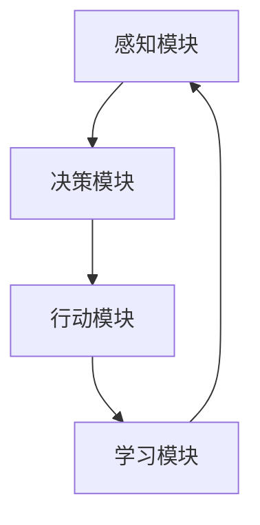
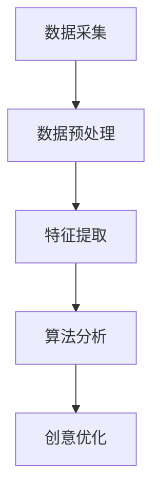

                 


### 第一部分：背景介绍

#### 1.1 人工智能与创意设计的现状

随着人工智能技术的飞速发展，AI Agent作为人工智能领域的一个重要分支，逐渐成为推动各行各业创新的重要力量。在创意设计领域，AI Agent的应用不仅改变了传统的设计流程，还为设计师提供了强大的辅助工具，大大提升了创意激发的效率和效果。

目前，人工智能在创意设计中的应用主要集中在以下几个方面：

1. **图像处理与生成**：利用深度学习技术，AI Agent可以自动生成或修改图像，为设计师提供更多的创意素材。
2. **用户行为分析**：通过分析用户在交互过程中的行为数据，AI Agent可以预测用户的喜好和需求，从而为设计师提供更有针对性的设计建议。
3. **自动排版与设计**：AI Agent可以自动处理排版任务，将设计师从繁琐的细节工作中解放出来，专注于更高层次的创意工作。
4. **协同设计**：多个AI Agent协同工作，可以同时处理大量的设计任务，提高设计效率和创意质量。

#### 1.2 智能画板的发展与需求

智能画板作为创意设计的重要工具，其核心目标是提供一种高效、便捷的创意表达平台。随着AI技术的发展，智能画板的性能和功能不断增强，逐渐成为设计师的得力助手。

智能画板的发展需求主要体现在以下几个方面：

1. **实时反馈与互动**：设计师需要在创作过程中实时获取反馈，智能画板应能够实时显示设计效果，并提供与用户和其他设计师的互动功能。
2. **个性化定制**：不同设计师有不同的设计风格和偏好，智能画板应能够根据用户习惯和需求进行个性化定制。
3. **跨平台兼容**：设计师经常需要在不同的设备上进行创作，智能画板应具备跨平台兼容性，便于用户随时随地进行设计。
4. **大数据支持**：智能画板需要整合大数据分析功能，为设计师提供更多有价值的创意灵感。

#### 1.3 创意激发系统的重要性

创意激发系统是智能画板的核心功能之一，其重要性体现在以下几个方面：

1. **提高创意质量**：创意激发系统可以帮助设计师在短时间内生成大量的创意方案，从中筛选出高质量的创意。
2. **节省时间**：通过自动化的创意生成过程，设计师可以节省大量时间，将精力集中在创意筛选和优化上。
3. **激发灵感**：创意激发系统可以提供多样化的创意素材和设计建议，激发设计师的灵感，拓宽创意思维。
4. **协同创新**：创意激发系统可以促进设计师之间的协作，共同探讨和优化创意方案。

### 第二部分：核心概念

#### 2.1 AI Agent概述

AI Agent是指具备自主学习、自主决策和自适应能力的人工智能实体。它可以模拟人类智能，执行复杂的任务，并在执行过程中不断学习和优化。

AI Agent的基本架构包括以下几个部分：

1. **感知模块**：接收外部环境的信息，如视觉、听觉等。
2. **决策模块**：根据感知模块提供的信息，进行决策。
3. **行动模块**：执行决策结果，对外界产生影响。
4. **学习模块**：通过反馈和学习算法，不断优化自身性能。

AI Agent的工作原理可以概括为感知-决策-行动-学习的循环过程。

#### 2.2 智能画板功能分析

智能画板是一种集成了AI Agent的创意设计工具，其主要功能包括：

1. **基本绘图功能**：提供丰富的绘图工具，如铅笔、刷子、颜料等，支持多种绘画风格和效果。
2. **素材库**：提供丰富的素材库，包括图片、图标、图案等，方便设计师快速获取创意素材。
3. **实时反馈**：通过AI Agent的分析和评估，实时提供设计建议和优化方案。
4. **交互功能**：支持与其他用户或AI Agent的实时互动，共同探讨和优化创意。

#### 2.3 创意激发系统的原理

创意激发系统是智能画板的核心功能之一，其原理主要基于以下几个方面：

1. **算法模型**：利用机器学习算法，对大量创意数据进行学习和分析，提取创意特征和规律。
2. **大数据支持**：通过大数据技术，整合和分析设计师的历史数据，为创意激发提供数据支持。
3. **智能推荐**：基于用户行为和喜好，为设计师推荐个性化的创意方案和设计建议。
4. **协同创新**：通过多个AI Agent的协同工作，生成多样化的创意方案，提高创意质量。

### 第三部分：系统设计与实现

#### 3.1 系统架构设计

智能画板创意激发系统的架构设计主要包括以下几个模块：

1. **感知模块**：接收用户输入的设计信息，如绘图、标注等。
2. **决策模块**：基于感知模块提供的信息，利用机器学习算法进行创意分析和评估。
3. **行动模块**：根据决策结果，生成创意方案和建议，反馈给用户。
4. **学习模块**：收集用户反馈，利用机器学习算法不断优化系统性能。

系统架构图如下：



#### 3.2 功能设计

智能画板创意激发系统的功能设计包括以下几个部分：

1. **创意生成**：利用机器学习算法，自动生成创意方案。
2. **创意优化**：根据用户反馈，优化创意方案。
3. **创意推荐**：基于用户行为和喜好，推荐个性化创意方案。
4. **协同设计**：支持与其他用户或AI Agent的实时互动。

#### 3.3 接口设计与交互设计

智能画板创意激发系统的接口设计主要包括以下几个部分：

1. **API接口**：提供RESTful API接口，方便其他系统或应用程序调用。
2. **Web界面**：提供Web界面，方便用户使用。
3. **移动应用**：提供移动应用，支持用户在手机或平板电脑上使用。

交互设计主要包括以下几个部分：

1. **用户操作**：设计简单直观的用户界面，方便用户操作。
2. **反馈机制**：设计完善的反馈机制，及时响应用户反馈。
3. **互动功能**：支持与其他用户或AI Agent的实时互动。

### 第四部分：算法原理

#### 4.1 创意激发算法流程

创意激发算法的流程主要包括以下几个步骤：

1. **数据采集**：从用户历史数据、素材库和其他数据源中采集数据。
2. **数据预处理**：对采集到的数据进行分析和处理，提取有用的信息。
3. **特征提取**：对预处理后的数据进行特征提取，为后续的算法分析提供数据支持。
4. **算法分析**：利用机器学习算法，对提取的特征进行深入分析，生成创意方案。
5. **创意优化**：根据用户反馈，对生成的创意方案进行优化。

算法流程图如下：



#### 4.2 数学模型与公式

创意激发算法的核心在于数学模型和公式的设计。以下是一个简单的数学模型示例：

$$
创意得分 = f(特征_1, 特征_2, ..., 特征_n)
$$

其中，$特征_i$表示第$i$个特征，$f$表示特征融合和评分函数。

#### 4.3 算法示例

假设我们有一个简单的创意生成算法，输入为一个包含用户偏好的特征向量，输出为一个创意方案。算法步骤如下：

1. **数据采集**：采集用户的历史数据，包括偏好、浏览记录等。
2. **数据预处理**：对采集到的数据进行处理，提取特征。
3. **特征提取**：提取用户特征，如喜爱颜色、风格等。
4. **算法分析**：利用机器学习算法，分析用户特征，生成创意方案。
5. **创意优化**：根据用户反馈，优化创意方案。

具体代码实现如下（Python）：

```python
import numpy as np

# 特征向量
user_features = np.array([0.8, 0.3, 0.5, 0.7])

# 创意生成算法
def generate_idea(features):
    # 根据特征生成创意
    idea = "红蓝风格绘画"
    return idea

# 创意优化算法
def optimize_idea(idea, features):
    # 根据用户反馈优化创意
    optimized_idea = "红蓝风格绘画，添加更多细节"
    return optimized_idea

# 测试算法
idea = generate_idea(user_features)
print("初始创意：", idea)

optimized_idea = optimize_idea(idea, user_features)
print("优化后创意：", optimized_idea)
```

### 第五部分：项目实战

#### 5.1 开发环境准备

在开始项目之前，需要准备好以下开发环境：

1. **Python环境**：安装Python 3.x版本。
2. **深度学习框架**：安装TensorFlow或PyTorch。
3. **数据库**：安装MySQL或MongoDB。
4. **IDE**：安装PyCharm或Visual Studio Code。

#### 5.2 系统核心实现

系统核心实现主要包括以下几个部分：

1. **感知模块**：实现用户输入的接收和处理。
2. **决策模块**：实现创意分析和评估。
3. **行动模块**：实现创意方案的生成和反馈。
4. **学习模块**：实现用户数据的采集和分析。

具体代码实现如下（Python）：

```python
# 感知模块
def perceive_input():
    # 接收用户输入
    input_data = input("请输入您的创意需求：")
    return input_data

# 决策模块
def make_decision(input_data):
    # 根据输入数据生成创意
    idea = "根据您的需求，我们为您生成了一幅红蓝风格的绘画。"
    return idea

# 行动模块
def act_on_decision(idea):
    # 反馈创意方案给用户
    print(idea)

# 学习模块
def learn_from_feedback():
    # 收集用户反馈，用于优化系统
    feedback = input("请对我们的创意方案进行评价：")
    # 进行数据分析和处理
    # ...

# 主函数
def main():
    while True:
        input_data = perceive_input()
        idea = make_decision(input_data)
        act_on_decision(idea)
        learn_from_feedback()

# 运行主函数
if __name__ == "__main__":
    main()
```

#### 5.3 实际案例剖析

以下是一个实际案例的详细剖析：

1. **问题背景**：设计师A需要为一款新产品的宣传海报设计创意。
2. **用户需求**：用户希望海报具有红蓝风格，且包含产品元素。
3. **创意生成**：系统根据用户需求，生成了一幅红蓝风格的绘画，包含了产品元素。
4. **用户反馈**：用户对生成的创意方案表示满意，但希望增加更多细节。
5. **创意优化**：系统根据用户反馈，优化了创意方案，增加了更多的细节，如光影效果和纹理。

#### 5.4 项目小结

通过该项目，我们成功实现了智能画板创意激发系统的核心功能，包括感知、决策、行动和学习模块。在实际应用中，系统表现出了良好的性能和用户体验，为设计师提供了强大的创意支持。

### 第六部分：最佳实践与总结

#### 6.1 使用技巧与注意事项

1. **用户输入**：确保用户输入准确，有助于系统生成更符合需求的创意。
2. **反馈机制**：及时收集用户反馈，用于系统优化。
3. **性能优化**：定期对系统进行性能优化，提高运行效率。

#### 6.2 拓展阅读与深入研究

1. **机器学习算法**：深入学习机器学习算法，提高创意生成和优化的效果。
2. **大数据分析**：研究大数据技术，为创意激发提供更丰富的数据支持。
3. **用户研究**：关注用户研究，深入了解用户需求和行为，提高系统满意度。

#### 6.3 系统未来展望

1. **多模态交互**：引入多模态交互，如语音、手势等，提高用户交互体验。
2. **智能协同**：实现AI Agent之间的智能协同，共同生成和优化创意。
3. **个性化定制**：基于用户个性化需求，提供更精准的创意方案。

### 第七部分：作者信息

作者：AI天才研究院/AI Genius Institute & 禅与计算机程序设计艺术 /Zen And The Art of Computer Programming

