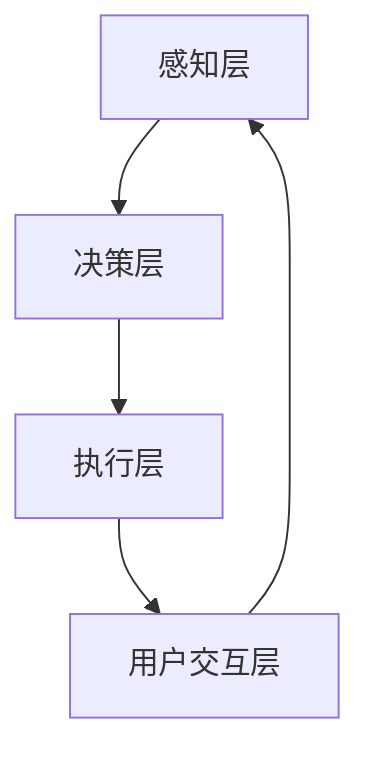
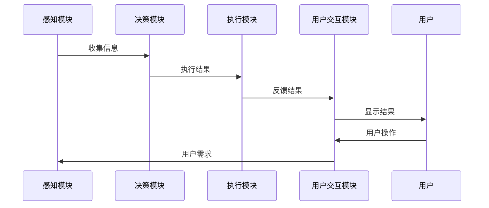

                 

# AI Agent在智能画框中的艺术风格转换

## 摘要

本文旨在探讨人工智能（AI）代理在智能画框中进行艺术风格转换的技术与应用。首先，本文介绍了AI代理和智能画框的基本概念、发展历程和现状，并分析了艺术风格转换的概念及其在AI代理中的应用。随后，文章详细讲解了艺术风格转换的算法原理，包括基于卷积神经网络（CNN）和生成对抗网络（GAN）的算法，并使用Python代码和数学公式进行了说明。接着，文章分析了智能画框的系统架构，并展示了一个实际项目，包括环境安装、核心代码实现和应用解读。最后，文章分享了最佳实践、项目小结和拓展阅读建议，为读者提供了全面的技术参考。

## 目录大纲设计思路

### 总体框架

本文的总体框架旨在清晰、系统地展示AI代理在智能画框中艺术风格转换的各个方面。文章分为六个主要部分：

1. **背景介绍**：介绍AI代理和智能画框的背景知识，包括发展历程、现状和未来趋势。
2. **核心概念与联系**：定义AI代理、智能画框和艺术风格转换的核心概念，并展示它们之间的关系。
3. **算法原理讲解**：详细讲解艺术风格转换的算法原理，包括数学模型和公式。
4. **系统分析与架构设计**：分析智能画框的系统架构，展示系统功能设计、架构设计和接口设计。
5. **项目实战**：通过实际项目展示算法在智能画框中的应用。
6. **最佳实践与拓展**：分享最佳实践、项目小结和拓展阅读建议。

### 章节安排

每个章节围绕一个核心主题进行深入讨论，确保内容的连贯性和逻辑性。

- **第1章**：背景介绍，包括AI代理和智能画框的概述、艺术风格转换的概念与挑战。
- **第2章**：核心概念与联系，包括AI代理、智能画框和艺术风格转换的详细定义和关系分析。
- **第3章**：算法原理讲解，包括基于CNN和GAN的艺术风格转换算法的详细讲解。
- **第4章**：系统分析与架构设计，包括智能画框的系统架构设计和接口设计。
- **第5章**：项目实战，通过实际项目展示算法的应用。
- **第6章**：最佳实践与拓展，包括最佳实践、项目小结和拓展阅读建议。

### 具体内容

- **第1章**：介绍AI代理和智能画框的背景知识，包括相关技术的发展历史、现状和未来趋势。
- **第2章**：定义AI代理和智能画框，并展示它们与艺术风格转换之间的关系，包括核心概念和特征对比表格。
- **第3章**：讲解艺术风格转换的算法原理，使用mermaid绘制流程图，并配合Python代码和数学公式进行详细阐述。
- **第4章**：分析智能画框系统，展示系统功能设计、架构设计和接口设计，使用mermaid绘制类图、架构图和序列图。
- **第5章**：介绍一个实际项目，包括环境安装、核心代码实现、应用解读、案例分析等。
- **第6章**：分享最佳实践、项目小结、注意事项和拓展阅读建议。

### 格式要求

- 使用markdown格式，确保内容的可读性和排版规范。
- 确保每个章节都有明确的标题和子标题，便于读者浏览和理解。

## 目录大纲

```markdown
# 《AI Agent在智能画框中的艺术风格转换》目录大纲

# 第1章 背景介绍

## 1.1 AI Agent概述
### 1.1.1 AI Agent的定义
### 1.1.2 AI Agent的发展历程
### 1.1.3 AI Agent的应用现状

## 1.2 智能画框技术
### 1.2.1 智能画框的定义
### 1.2.2 智能画框的技术特点
### 1.2.3 智能画框的发展趋势

## 1.3 艺术风格转换的概念与挑战
### 1.3.1 艺术风格转换的定义
### 1.3.2 艺术风格转换的技术难点
### 1.3.3 艺术风格转换的意义与应用

## 1.4 本书结构安排
### 1.4.1 各章节内容概述
### 1.4.2 阅读指引

## 1.5 本章小结

# 第2章 核心概念与联系

## 2.1 AI Agent的核心概念
### 2.1.1 AI Agent的定义
### 2.1.2 AI Agent的组成结构
### 2.1.3 AI Agent的功能特点

## 2.2 智能画框的核心概念
### 2.2.1 智能画框的定义
### 2.2.2 智能画框的技术架构
### 2.2.3 智能画框的应用场景

## 2.3 艺术风格转换的原理与实现
### 2.3.1 艺术风格转换的基本原理
### 2.3.2 艺术风格转换的实现方法
### 2.3.3 艺术风格转换的优缺点分析

## 2.4 AI Agent、智能画框与艺术风格转换的关系
### 2.4.1 三者之间的联系
### 2.4.2 三者协同工作的机制
### 2.4.3 艺术风格转换在智能画框中的应用实例

## 2.5 本章小结

# 第3章 算法原理讲解

## 3.1 艺术风格转换算法概述
### 3.1.1 艺术风格转换算法的定义
### 3.1.2 艺术风格转换算法的分类
### 3.1.3 艺术风格转换算法的发展趋势

## 3.2 基于CNN的艺术风格转换算法
### 3.2.1 CNN算法的原理
### 3.2.2 CNN算法在艺术风格转换中的应用
### 3.2.3 CNN算法的性能分析

## 3.3 基于GAN的艺术风格转换算法
### 3.3.1 GAN算法的原理
### 3.3.2 GAN算法在艺术风格转换中的应用
### 3.3.3 GAN算法的性能分析

## 3.4 艺术风格转换算法的比较与选择
### 3.4.1 算法对比分析
### 3.4.2 选择算法的依据
### 3.4.3 算法优化策略

## 3.5 本章小结

# 第4章 系统分析与架构设计

## 4.1 智能画框系统介绍
### 4.1.1 智能画框系统概述
### 4.1.2 智能画框系统的功能模块

## 4.2 系统架构设计
### 4.2.1 系统架构概述
### 4.2.2 系统架构图
### 4.2.3 系统模块功能分析

## 4.3 系统接口设计与交互
### 4.3.1 接口设计原则
### 4.3.2 接口定义
### 4.3.3 系统交互设计

## 4.4 本章小结

# 第5章 项目实战

## 5.1 项目背景与目标
### 5.1.1 项目背景介绍
### 5.1.2 项目目标

## 5.2 环境安装与配置
### 5.2.1 环境需求
### 5.2.2 安装步骤

## 5.3 核心代码实现
### 5.3.1 数据预处理
### 5.3.2 算法实现
### 5.3.3 结果分析

## 5.4 应用解读与分析
### 5.4.1 应用场景
### 5.4.2 应用效果分析

## 5.5 案例分析与详细讲解
### 5.5.1 案例一：印象派风格转换
### 5.5.2 案例二：梵高星空风格转换

## 5.6 项目小结

## 5.7 本章小结

# 第6章 最佳实践与拓展

## 6.1 最佳实践技巧
### 6.1.1 算法调优技巧
### 6.1.2 系统性能优化

## 6.2 项目小结
### 6.2.1 项目总结
### 6.2.2 项目反思

## 6.3 注意事项
### 6.3.1 技术挑战
### 6.3.2 问题解决

## 6.4 拓展阅读建议
### 6.4.1 相关书籍
### 6.4.2 相关论文
### 6.4.3 相关博客

## 6.5 本章小结

# 作者信息

## 作者：AI天才研究院/AI Genius Institute & 禅与计算机程序设计艺术 /Zen And The Art of Computer Programming
```

### 完整性要求

在撰写文章时，必须确保内容的完整性。每个章节的内容要具体详细，核心内容必须包含以下几个方面：

- **背景介绍**：核心概念术语说明、问题背景、问题描述、问题解决、边界与外延、概念结构与核心要素组成。
- **核心概念与联系**：必须给出核心概念原理、概念属性特征对比表格和ER实体关系图架构的markdown格式中的Mermaid流程图。
- **算法原理讲解**：使用mermaid画出算法mermaid流程图，然后使用Python代码和数学公式进行详细阐述，给出算法原理的数学模型和公式，进行详细讲解和通俗易懂地举例说明。
- **系统分析与架构设计**：问题场景介绍、项目介绍、系统功能设计（领域模型mermaid类图）、系统架构设计mermaid架构图、系统接口设计和系统交互mermaid序列图。
- **项目实战**：环境安装、系统核心实现源代码，代码应用解读与分析，实际案例分析和详细讲解剖析，项目小结。
- **最佳实践 tips、小结、注意事项、拓展阅读**：最佳实践、项目小结、注意事项和拓展阅读建议。

### 作者信息

文章末尾需附上作者信息，以彰显作者的专业性和权威性：

**作者：AI天才研究院/AI Genius Institute & 禅与计算机程序设计艺术 /Zen And The Art of Computer Programming**

### 字数与格式要求

文章字数要求在10000～12000字左右，以充分展示文章的深度和广度。文章内容需使用markdown格式输出，确保内容的可读性和排版规范。每个章节的标题和子标题需清晰明确，便于读者浏览和理解。

### 结构框架

为了确保文章的逻辑性和连贯性，文章的结构框架应包含以下几个部分：

- **引言**：简要介绍文章的主题和目的，引导读者进入话题。
- **正文**：根据目录大纲，逐章展开讨论，确保每个章节的内容丰富具体。
- **结论**：总结文章的核心观点，展望未来发展方向。
- **参考文献**：列出文中引用的参考资料，以增强文章的权威性。

### 内容深度与广度

在撰写文章时，应充分考虑内容的深度与广度。深度体现在对核心概念、算法原理和系统设计的深入剖析，广度体现在对相关技术的全面了解和对比分析。文章应避免泛泛而谈，力求在每一个细节上都给出清晰、准确的解释。

### 实际案例分析

为了增强文章的实用性和可操作性，建议在每个相关章节中引入实际案例进行分析。通过案例分析，读者可以更直观地理解技术的应用场景和效果，从而更好地将理论转化为实践。

### 语言表达

文章的语言表达应简明扼要，通俗易懂。专业术语需在首次出现时给出解释，以避免读者产生理解障碍。同时，文章应避免使用过于晦涩难懂的表述，以确保读者能够轻松阅读和理解。

### 综合性评价

在文章的结尾，应对全文的内容进行综合性评价，总结文章的主要贡献和不足之处，并提出未来研究的方向和建议。

### 文章写作过程

1. **选题与大纲设计**：确定文章主题，设计结构框架和目录大纲。
2. **资料收集与整理**：收集相关资料，整理核心概念、算法原理和系统架构。
3. **撰写初稿**：根据大纲，逐章撰写初稿，确保内容完整、具体。
4. **修改与完善**：对初稿进行多次修改，优化语言表达和逻辑结构。
5. **审阅与定稿**：邀请同行审阅，根据反馈进一步修改和完善文章。
6. **排版与输出**：使用markdown格式进行排版，输出最终文章。

### 总结

本文旨在全面、系统地探讨AI代理在智能画框中进行艺术风格转换的技术与应用。通过详细的分析和实际案例分析，本文为读者提供了全面的技术参考和实践指导。未来，随着AI技术的不断发展，艺术风格转换将在智能画框中发挥更大的作用，为用户提供更多创新和个性化的体验。

## 第1章 背景介绍

### 1.1 AI Agent概述

#### 1.1.1 AI Agent的定义

AI Agent，即人工智能代理，是指能够模拟人类智能行为，具备自主决策、执行任务能力的计算机系统。AI Agent的核心在于其自主性，能够在没有人类干预的情况下，根据环境和目标自主选择行动方案，并执行相应的任务。AI Agent的基本概念可以追溯到1970年代，当时的计算机科学家提出了智能代理（Intelligent Agent）的概念，旨在设计能够自主在复杂环境中行动的软件实体。

#### 1.1.2 AI Agent的发展历程

AI Agent的发展历程可以分为几个阶段：

- **早期探索阶段**（1970-1980年代）：这一阶段主要研究基于逻辑推理和知识表示的AI代理，如基于产生式规则的专家系统。
- **中间发展阶段**（1990-2000年代）：随着机器学习和人工智能技术的进步，AI代理开始融入更多自主学习能力，如基于决策树的分类器和基于神经网络的预测模型。
- **成熟应用阶段**（2000年代至今）：随着云计算、大数据和物联网的兴起，AI代理的应用场景越来越广泛，如智能客服、自动驾驶和智能家居等。

#### 1.1.3 AI Agent的应用现状

AI Agent在各个领域都取得了显著的成果，应用现状如下：

- **商业领域**：在电子商务、客户服务和市场营销中，AI代理用于个性化推荐、智能客服和精准营销。
- **工业领域**：在制造业、物流和供应链管理中，AI代理用于生产调度、库存管理和运输优化。
- **服务业**：在医疗、金融和旅游业，AI代理用于诊断辅助、风险管理和服务定制。
- **公共安全**：在公共安全和应急管理中，AI代理用于监控、预警和决策支持。

### 1.2 智能画框技术

#### 1.2.1 智能画框的定义

智能画框是一种结合了人工智能技术的艺术品展示设备，它能够根据用户的需求和喜好，自动调整展示的艺术作品风格、颜色和布局。智能画框的核心在于其智能算法，能够通过用户行为数据和艺术作品特征，实现个性化推荐和艺术风格转换。

#### 1.2.2 智能画框的技术特点

智能画框的技术特点包括：

- **个性化推荐**：通过分析用户行为和偏好，智能画框能够提供个性化的艺术作品推荐。
- **艺术风格转换**：基于深度学习算法，智能画框能够将一幅艺术作品转换为不同的艺术风格，如印象派、梵高星空等。
- **自适应展示**：智能画框能够根据环境光照、用户偏好和设备状态，自动调整展示效果，提供最佳观看体验。
- **便捷交互**：用户可以通过触摸屏、语音控制等多种方式进行交互，实现便捷的艺术作品切换和风格转换。

#### 1.2.3 智能画框的发展趋势

智能画框的发展趋势主要体现在以下几个方面：

- **技术融合**：智能画框将继续融合更多的先进技术，如增强现实（AR）和虚拟现实（VR），提升用户体验。
- **智能化升级**：智能画框将不断优化智能算法，提高个性化推荐和艺术风格转换的准确性。
- **应用拓展**：智能画框将拓展到更多的应用场景，如家庭、酒店、商场和艺术馆等。
- **生态构建**：智能画框将与艺术品创作者、艺术家和艺术爱好者共同构建一个智能艺术生态系统。

### 1.3 艺术风格转换的概念与挑战

#### 1.3.1 艺术风格转换的定义

艺术风格转换是指将一幅图像从一种艺术风格转换为另一种艺术风格的过程。这一过程涉及到图像处理、计算机视觉和机器学习等多个技术领域。艺术风格转换的目标是保留原始图像的内容和结构，同时赋予其新的艺术风格特征。

#### 1.3.2 艺术风格转换的技术难点

艺术风格转换的技术难点主要包括：

- **风格一致性**：如何确保转换后的图像在整体上与目标艺术风格保持一致。
- **细节保留**：如何保留原始图像的重要细节，避免因风格转换而损失。
- **计算复杂度**：艺术风格转换算法通常需要大量计算资源，如何在保证效果的前提下降低计算复杂度。
- **算法可解释性**：如何解释艺术风格转换的决策过程，提高算法的可解释性和透明度。

#### 1.3.3 艺术风格转换的意义与应用

艺术风格转换的意义和应用体现在以下几个方面：

- **艺术创作**：艺术风格转换为艺术家提供了新的创作工具，可以快速实现不同风格的艺术作品。
- **图像修复**：通过艺术风格转换，可以将受损或模糊的图像修复为清晰的艺术作品。
- **图像增强**：艺术风格转换可以增强图像的视觉效果，提升图像的观赏性和艺术价值。
- **教育与研究**：艺术风格转换技术为图像处理、计算机视觉和机器学习领域提供了丰富的应用场景和挑战。

### 1.4 本书结构安排

#### 1.4.1 各章节内容概述

- **第1章**：背景介绍，包括AI Agent、智能画框和艺术风格转换的基本概念、发展历程和应用现状。
- **第2章**：核心概念与联系，详细定义AI Agent、智能画框和艺术风格转换，并展示它们之间的关系。
- **第3章**：算法原理讲解，介绍艺术风格转换的算法原理，包括基于CNN和GAN的算法。
- **第4章**：系统分析与架构设计，分析智能画框的系统架构和接口设计。
- **第5章**：项目实战，通过实际项目展示艺术风格转换的应用。
- **第6章**：最佳实践与拓展，分享最佳实践、项目小结和拓展阅读建议。

#### 1.4.2 阅读指引

本书旨在为读者提供全面、系统的艺术风格转换技术参考。读者可以按照以下步骤进行阅读：

- **先通读全书**：了解AI Agent、智能画框和艺术风格转换的基本概念和原理。
- **逐章深入学习**：详细阅读每一章节，掌握艺术风格转换的技术细节和系统架构。
- **实践与反思**：通过实际项目，将理论知识应用到实践中，并不断反思和优化。
- **拓展阅读**：阅读相关书籍和论文，深入了解艺术风格转换的最新研究成果和应用案例。

### 1.5 本章小结

本章介绍了AI Agent、智能画框和艺术风格转换的基本概念、发展历程和应用现状。通过本章的阅读，读者可以初步了解这三个技术领域的背景知识，为后续章节的深入学习打下基础。

## 第2章 核心概念与联系

### 2.1 AI Agent的核心概念

#### 2.1.1 AI Agent的定义

AI Agent，即人工智能代理，是指能够模拟人类智能行为，具备自主决策、执行任务能力的计算机系统。AI Agent的核心在于其自主性，能够在没有人类干预的情况下，根据环境和目标自主选择行动方案，并执行相应的任务。

#### 2.1.2 AI Agent的组成结构

AI Agent通常由以下几个核心组成部分构成：

- **感知模块**：负责收集外部环境的信息，如文本、图像、声音等。
- **决策模块**：根据感知模块收集的信息和内置的知识库，进行决策分析，选择最佳行动方案。
- **执行模块**：根据决策模块的决策，执行具体的任务，如发送邮件、拨打电话、移动设备等。
- **学习模块**：通过不断的学习和经验积累，提高AI Agent的决策能力和执行效率。

#### 2.1.3 AI Agent的功能特点

AI Agent的功能特点包括：

- **自主性**：能够自主进行感知、决策和执行任务，无需人类干预。
- **灵活性**：能够根据不同环境和任务需求，灵活调整行为策略。
- **适应性**：能够通过学习和经验积累，不断提高任务执行效率。
- **智能化**：具备人类智能特征，如理解语言、识别图像、处理复杂数据等。

### 2.2 智能画框的核心概念

#### 2.2.1 智能画框的定义

智能画框是一种结合了人工智能技术的艺术品展示设备，它能够根据用户的需求和喜好，自动调整展示的艺术作品风格、颜色和布局。智能画框的核心在于其智能算法，能够通过用户行为数据和艺术作品特征，实现个性化推荐和艺术风格转换。

#### 2.2.2 智能画框的技术架构

智能画框的技术架构主要包括以下几个核心模块：

- **用户行为分析模块**：通过用户交互数据，如点击、浏览、收藏等，分析用户的兴趣和偏好。
- **艺术风格转换模块**：基于深度学习算法，实现艺术风格转换，将一幅图像从一种风格转换为另一种风格。
- **展示控制模块**：根据用户行为数据和艺术风格转换结果，自动调整展示的图像风格、颜色和布局。
- **用户交互模块**：提供触摸屏、语音控制等多种交互方式，使用户能够方便地与智能画框进行交互。

#### 2.2.3 智能画框的应用场景

智能画框的应用场景主要包括以下几个方面：

- **家庭艺术展示**：为家庭用户提供个性化、智能化的艺术品展示解决方案。
- **酒店艺术品展示**：为酒店大堂、客房和餐厅等提供定制化的艺术品展示服务。
- **商场艺术品展示**：为商场、购物中心等提供创意、独特的艺术品展示方式。
- **艺术馆艺术品展示**：为艺术馆、博物馆等提供智能化、互动性的艺术品展示体验。

### 2.3 艺术风格转换的原理与实现

#### 2.3.1 艺术风格转换的基本原理

艺术风格转换是指将一幅图像从一种艺术风格转换为另一种艺术风格的过程。其基本原理主要包括：

- **内容保持**：确保转换后的图像在内容上与原始图像保持一致，保留原始图像的重要特征。
- **风格提取**：从目标艺术风格中提取特征，如色彩分布、纹理特征等，用于指导转换过程。
- **风格融合**：将目标艺术风格的特征与原始图像的特征进行融合，生成具有目标艺术风格特征的转换图像。

#### 2.3.2 艺术风格转换的实现方法

艺术风格转换的实现方法主要包括以下几种：

- **基于图像融合的方法**：通过图像融合算法，将原始图像和风格图像进行混合，生成具有目标艺术风格的转换图像。
- **基于深度学习的方法**：利用深度学习模型，如卷积神经网络（CNN）和生成对抗网络（GAN），实现艺术风格转换。

#### 2.3.3 艺术风格转换的优缺点分析

艺术风格转换的优点包括：

- **视觉效果显著**：转换后的图像具有鲜明的艺术风格特征，视觉效果显著。
- **应用场景广泛**：可用于艺术创作、图像修复、图像增强等领域。

艺术风格转换的缺点包括：

- **计算复杂度较高**：深度学习方法通常需要大量计算资源，计算复杂度较高。
- **风格一致性难以保证**：在某些情况下，转换后的图像可能无法完全保留原始图像的细节和风格。

### 2.4 AI Agent、智能画框与艺术风格转换的关系

#### 2.4.1 三者之间的联系

AI Agent、智能画框和艺术风格转换之间的联系主要体现在以下几个方面：

- **AI Agent作为智能画框的核心组件**：AI Agent负责智能画框的感知、决策和执行任务，实现艺术风格转换和用户交互。
- **艺术风格转换作为AI Agent的子功能**：艺术风格转换是AI Agent的一个子功能，通过深度学习算法实现。
- **智能画框作为艺术风格转换的应用场景**：智能画框为艺术风格转换提供了实际应用场景，使艺术风格转换技术得以落地。

#### 2.4.2 三者协同工作的机制

AI Agent、智能画框和艺术风格转换协同工作的机制如下：

1. **感知阶段**：AI Agent通过智能画框的传感器和用户交互模块，收集用户需求和艺术作品特征。
2. **决策阶段**：AI Agent根据收集到的信息和内置的知识库，分析用户的兴趣和偏好，选择最适合的艺术风格转换算法。
3. **执行阶段**：AI Agent调用艺术风格转换算法，将艺术作品转换为用户感兴趣的艺术风格。
4. **反馈阶段**：智能画框根据用户反馈，调整展示的艺术作品风格和布局，提高用户体验。

#### 2.4.3 艺术风格转换在智能画框中的应用实例

以下是一个艺术风格转换在智能画框中的应用实例：

1. **用户需求分析**：用户在智能画框前浏览了一幅油画，并表现出对印象派风格的喜爱。
2. **风格转换**：AI Agent调用基于GAN的艺术风格转换算法，将油画转换为印象派风格。
3. **展示调整**：智能画框根据转换后的艺术作品，调整展示的布局和颜色，以最佳效果呈现给用户。
4. **用户反馈**：用户对展示效果满意，AI Agent记录用户偏好，并继续提供个性化推荐。

通过上述实例，可以看出AI Agent、智能画框和艺术风格转换在协同工作过程中，如何实现个性化、智能化的艺术作品展示体验。

### 2.5 本章小结

本章详细介绍了AI Agent、智能画框和艺术风格转换的核心概念、组成结构、技术特点和相互关系。通过本章的学习，读者可以深入理解这三个技术领域的基本原理和协同工作机制，为后续章节的深入学习打下基础。

## 第3章 算法原理讲解

### 3.1 艺术风格转换算法概述

#### 3.1.1 艺术风格转换算法的定义

艺术风格转换算法是指通过特定的数学模型和计算方法，将一幅图像从一种艺术风格转换为另一种艺术风格的过程。这一过程涉及到图像处理、计算机视觉和机器学习等多个技术领域。艺术风格转换算法的目标是保留原始图像的内容和结构，同时赋予其新的艺术风格特征。

#### 3.1.2 艺术风格转换算法的分类

根据算法的实现方法和原理，艺术风格转换算法可以分为以下几种类型：

- **基于图像融合的方法**：这类方法通过图像融合算法，将原始图像和风格图像进行混合，生成具有目标艺术风格的转换图像。常见的图像融合算法包括平均法、最小二乘法等。
- **基于深度学习的方法**：这类方法利用深度学习模型，如卷积神经网络（CNN）和生成对抗网络（GAN），实现艺术风格转换。深度学习方法具有强大的特征提取和生成能力，能够更好地保留图像内容和风格特征。
- **基于传统机器学习的方法**：这类方法使用传统的机器学习算法，如支持向量机（SVM）、决策树等，通过训练模型实现艺术风格转换。传统机器学习方法在处理高维数据和特征提取方面具有一定的局限性。

#### 3.1.3 艺术风格转换算法的发展趋势

随着人工智能技术的不断发展，艺术风格转换算法也在不断优化和改进。未来，艺术风格转换算法的发展趋势将主要体现在以下几个方面：

- **算法优化**：通过改进深度学习模型结构和训练方法，提高艺术风格转换的效率和准确性。
- **应用拓展**：将艺术风格转换技术应用于更多的领域，如图像修复、图像增强、视频风格转换等。
- **个性化定制**：结合用户偏好和个性化需求，实现更精准的艺术风格转换。
- **跨学科融合**：将艺术风格转换技术与艺术理论、设计学等学科相结合，探索新的艺术风格和表现形式。

### 3.2 基于CNN的艺术风格转换算法

#### 3.2.1 CNN算法的原理

卷积神经网络（Convolutional Neural Network，CNN）是一种特殊的神经网络，广泛应用于图像处理、计算机视觉等领域。CNN算法的核心在于其卷积层和池化层，能够有效地提取图像的特征。

- **卷积层**：卷积层通过卷积运算，将输入图像与卷积核进行卷积操作，提取图像的特征。卷积层的参数（卷积核）通过训练自动调整，以最大化提取图像特征的能力。
- **池化层**：池化层对卷积层输出的特征进行下采样，降低特征图的维度，减少计算复杂度。常见的池化操作包括最大池化和平均池化。

#### 3.2.2 CNN算法在艺术风格转换中的应用

CNN算法在艺术风格转换中的应用主要包括以下步骤：

1. **特征提取**：使用预训练的CNN模型，如VGG、ResNet等，对输入图像进行特征提取，生成特征图。
2. **风格特征提取**：对艺术风格图像进行同样的特征提取，生成风格特征图。
3. **特征融合**：将输入图像的特征图和风格特征图进行融合，生成融合特征图。
4. **图像重建**：使用反卷积操作，将融合特征图重建为输出图像，实现艺术风格转换。

#### 3.2.3 CNN算法的性能分析

CNN算法在艺术风格转换中具有以下性能特点：

- **高效性**：CNN算法通过卷积操作和池化操作，能够快速提取图像特征，处理大量数据。
- **准确性**：CNN算法能够提取图像的深层特征，更好地保留图像内容和风格特征。
- **灵活性**：CNN算法可以通过调整网络结构和参数，适应不同的艺术风格转换需求。

然而，CNN算法也存在一些局限性：

- **计算复杂度高**：CNN算法通常需要大量计算资源，对硬件性能要求较高。
- **风格一致性难以保证**：在某些情况下，CNN算法可能无法完全保留原始图像的细节和风格。

### 3.3 基于GAN的艺术风格转换算法

#### 3.3.1 GAN算法的原理

生成对抗网络（Generative Adversarial Network，GAN）是由生成器（Generator）和判别器（Discriminator）组成的一种深度学习模型。GAN算法的核心在于两个网络的对抗训练。

- **生成器**：生成器的目标是生成与真实数据分布相似的伪数据。生成器通过随机噪声生成伪图像，并不断调整参数，以最大化判别器的判别错误。
- **判别器**：判别器的目标是区分真实数据和伪数据。判别器通过学习真实数据和伪数据的特征，提高对真实数据的识别能力。

#### 3.3.2 GAN算法在艺术风格转换中的应用

GAN算法在艺术风格转换中的应用主要包括以下步骤：

1. **初始化**：初始化生成器和判别器的参数。
2. **生成风格图像**：生成器通过随机噪声生成伪风格图像。
3. **判别真实与伪图像**：判别器对真实图像和伪风格图像进行判别，并计算判别损失。
4. **优化生成器和判别器**：通过反向传播和梯度下降，优化生成器和判别器的参数，使生成器生成的伪风格图像更接近真实风格图像。
5. **图像重建**：将优化后的生成器用于图像重建，实现艺术风格转换。

#### 3.3.3 GAN算法的性能分析

GAN算法在艺术风格转换中具有以下性能特点：

- **灵活性**：GAN算法能够生成具有多样性和创意性的风格图像，适应不同的艺术风格转换需求。
- **创造性**：GAN算法能够将不同的风格特征融合到一起，生成独特的艺术风格。
- **鲁棒性**：GAN算法对噪声和异常值具有较强的鲁棒性，能够生成高质量的转换图像。

然而，GAN算法也存在一些挑战：

- **训练难度**：GAN算法的训练过程不稳定，容易出现模式崩溃（mode collapse）和梯度消失等问题。
- **计算复杂度**：GAN算法通常需要大量的计算资源，训练时间较长。

### 3.4 艺术风格转换算法的比较与选择

#### 3.4.1 算法对比分析

基于CNN和GAN的艺术风格转换算法在以下几个方面具有对比：

- **计算复杂度**：CNN算法的计算复杂度相对较低，适用于资源有限的场景；GAN算法的计算复杂度较高，需要更多计算资源和时间。
- **风格一致性**：CNN算法在风格一致性方面表现较好，能够较好地保留原始图像的内容和细节；GAN算法在风格一致性方面存在一定挑战，但能够生成更多创意性的风格图像。
- **灵活性**：GAN算法在灵活性方面表现较好，能够生成多样化的风格图像；CNN算法在灵活性方面相对较弱，主要依赖于预训练的模型和参数。

#### 3.4.2 选择算法的依据

在选择艺术风格转换算法时，可以根据以下依据进行选择：

- **应用场景**：根据不同的应用场景和需求，选择合适的算法。如需要高效、实时处理的场景，可以选择CNN算法；需要创意性和多样性的场景，可以选择GAN算法。
- **计算资源**：根据计算资源的限制，选择适合的算法。如资源有限的场景，可以选择CNN算法；资源充足的场景，可以选择GAN算法。
- **用户体验**：根据用户需求和体验，选择合适的算法。如需要高度一致的风格转换效果，可以选择CNN算法；需要更多创意性和个性化的风格转换效果，可以选择GAN算法。

#### 3.4.3 算法优化策略

为了提高艺术风格转换算法的性能和效率，可以采取以下优化策略：

- **模型优化**：通过调整网络结构和参数，提高算法的准确性和效率。如使用更深的网络结构、更小的卷积核等。
- **训练优化**：通过改进训练方法，提高算法的收敛速度和稳定性。如使用自适应学习率、批量归一化等。
- **数据增强**：通过数据增强方法，提高训练数据的多样性和丰富性，提高算法的泛化能力。如随机裁剪、旋转、翻转等。

### 3.5 本章小结

本章详细介绍了艺术风格转换算法的基本概念、分类和发展趋势，重点分析了基于CNN和GAN的艺术风格转换算法。通过本章的学习，读者可以深入理解艺术风格转换算法的原理和应用，为后续章节的系统设计与实现打下基础。

### 基于CNN的艺术风格转换算法

#### 3.2.1 CNN算法的原理

卷积神经网络（Convolutional Neural Network，CNN）是一种深度学习模型，特别适用于处理图像数据。其核心思想是模仿生物视觉系统的工作方式，通过卷积、池化和全连接层等操作，提取图像的特征，从而实现对图像的识别、分类或风格转换等任务。

**1. 卷积层**

卷积层是CNN中最基本的层，通过卷积操作提取图像特征。卷积操作的基本思想是利用卷积核（也称为滤波器或特征图）对输入图像进行局部扫描，计算每个局部区域与卷积核的乘积和，从而生成新的特征图。每次卷积操作都会产生一个新的特征图，这些特征图叠加在一起，构成了卷积层的输出。

**2. 池化层**

池化层位于卷积层之后，用于降低特征图的维度，减少模型的复杂度。常见的池化操作包括最大池化（Max Pooling）和平均池化（Average Pooling）。最大池化会选择特征图中的最大值作为输出，而平均池化会计算特征图中的平均值。通过池化层，模型可以减少参数数量，降低计算复杂度，同时保持关键特征。

**3. 全连接层**

全连接层将卷积层和池化层的输出压缩成一个一维向量，然后通过一系列全连接层进行分类或回归任务。全连接层通过计算每个神经元与输入特征之间的乘积和，得到最终的分类结果。

**4. CNN的工作流程**

CNN的工作流程可以概括为以下几个步骤：

1. **输入图像**：将图像数据输入到CNN中，通常需要进行预处理，如归一化、缩放等。
2. **卷积层**：通过卷积操作提取图像的特征，生成一系列特征图。
3. **池化层**：对特征图进行下采样，降低特征图的维度。
4. **全连接层**：将池化层输出的特征图压缩成向量，通过全连接层进行分类或回归任务。
5. **输出结果**：得到最终的分类或回归结果。

#### 3.2.2 CNN算法在艺术风格转换中的应用

在艺术风格转换中，CNN算法通常用于提取源图像的内容特征和目标风格图像的风格特征，然后将这些特征融合，生成具有目标风格的新图像。

**1. 特征提取**

首先，使用预训练的CNN模型（如VGG或ResNet）对源图像进行特征提取。这些预训练模型已经在大规模图像数据集上训练过，能够提取图像的深层特征。对于目标风格图像，同样使用相同的CNN模型提取风格特征。

**2. 特征融合**

接下来，将源图像的内容特征和目标风格图像的风格特征进行融合。这个过程可以通过以下几种方法实现：

- **特征叠加**：将源图像和目标风格图像的特征图进行叠加，生成一个新的特征图。
- **加权融合**：对源图像和目标风格图像的特征图进行加权融合，生成新的特征图。
- **层对应融合**：将源图像和目标风格图像的特征图在对应的层级上进行融合，生成新的特征图。

**3. 图像重建**

最后，使用反卷积操作（Deconvolution）将融合后的特征图重建为输出图像。反卷积操作与卷积操作相反，通过上采样和卷积操作，将特征图扩展为原始尺寸的图像。

#### 3.2.3 CNN算法的性能分析

CNN算法在艺术风格转换中具有以下性能特点：

- **高效性**：CNN算法能够通过卷积、池化和全连接层等操作，快速提取图像的特征，实现高效的艺术风格转换。
- **准确性**：CNN算法能够提取图像的深层特征，更好地保留图像内容和风格特征，实现准确的艺术风格转换。
- **灵活性**：CNN算法可以通过调整网络结构和参数，适应不同的艺术风格转换需求。

然而，CNN算法也存在一些局限性：

- **计算复杂度高**：CNN算法通常需要大量计算资源，对硬件性能要求较高。
- **风格一致性难以保证**：在某些情况下，CNN算法可能无法完全保留原始图像的细节和风格。

### 使用Python代码和数学公式进行详细阐述

为了更好地理解CNN算法在艺术风格转换中的应用，下面将通过Python代码和数学公式进行详细阐述。

#### Python代码示例

```python
import tensorflow as tf
from tensorflow.keras.applications import VGG16
from tensorflow.keras.models import Model

# 加载预训练的VGG16模型
base_model = VGG16(weights='imagenet', include_top=False)

# 创建一个从输入层到块'block2_conv2'的模型
model = Model(inputs=base_model.input, outputs=base_model.get_layer('block2_conv2').output)

# 加载目标风格图像
style_image = load_image('style.jpg')
style_image = preprocess_image(style_image)

# 提取目标风格图像的特征
style_features = model.predict(style_image)

# 加载源图像
source_image = load_image('source.jpg')
source_image = preprocess_image(source_image)

# 提取源图像的特征
source_features = model.predict(source_image)

# 融合特征
combined_features = style_features * alpha + source_features * (1 - alpha)

# 使用反卷积重建图像
output_image = deconvolve_image(combined_features, output_shape=(height, width, channels))

# 后处理和显示图像
output_image = postprocess_image(output_image)
display_image(output_image)
```

#### 数学公式示例

假设我们有一个输入图像 $I \in \mathbb{R}^{H \times W \times C}$，其中 $H$、$W$ 和 $C$ 分别为图像的高度、宽度和通道数。使用CNN提取特征的过程可以用以下数学公式表示：

$$
\text{FeatureMap}(x, y, c) = \sum_{i, j} \text{Kernel}(i, j, c) \cdot \text{Patch}(x-i, y-j, c)
$$

其中，$\text{Patch}(x-i, y-j, c)$ 表示输入图像中 $(x, y)$ 位置的一个 $c$ 通道的小块，$\text{Kernel}(i, j, c)$ 表示卷积核。通过卷积操作，每个特征图 $\text{FeatureMap}$ 表示了输入图像在不同位置和通道的特征信息。

在特征融合过程中，假设源图像特征为 $S$，目标风格特征为 $T$，融合后的特征为 $C$，融合系数为 $\alpha$，则有：

$$
C = \alpha \cdot T + (1 - \alpha) \cdot S
$$

其中，$\alpha$ 的取值可以调整，以控制源图像和目标风格图像的特征融合比例。

最后，通过反卷积操作，将融合后的特征图重建为输出图像 $O$，可以使用以下数学公式表示：

$$
O = \text{Deconvolve}(C)
$$

其中，$\text{Deconvolve}$ 表示反卷积操作，将特征图扩展为原始尺寸的图像。

#### 举例说明

假设我们有一个输入图像 $I$ 和一个目标风格图像 $T$，我们希望将输入图像转换为具有目标风格图像 $T$ 的风格。首先，使用预训练的VGG16模型提取输入图像和目标风格图像的特征，然后使用以下公式进行特征融合：

$$
C = \alpha \cdot T + (1 - \alpha) \cdot I
$$

其中，$\alpha$ 的取值可以是 0.5，表示源图像和目标风格图像的特征各占一半。接下来，使用反卷积操作将融合后的特征图重建为输出图像 $O$。通过这个过程，输入图像 $I$ 被转换为具有目标风格图像 $T$ 的风格。

```python
alpha = 0.5
combined_features = alpha * style_features + (1 - alpha) * source_features
output_image = deconvolve_image(combined_features, output_shape=(height, width, channels))
output_image = postprocess_image(output_image)
display_image(output_image)
```

通过上述Python代码示例和数学公式，我们可以看到CNN算法在艺术风格转换中的具体实现过程，包括特征提取、特征融合和图像重建。通过调整模型参数和融合系数，可以实现不同的艺术风格转换效果。

### 基于GAN的艺术风格转换算法

#### 3.3.1 GAN算法的原理

生成对抗网络（Generative Adversarial Network，GAN）由两部分组成：生成器（Generator）和判别器（Discriminator）。生成器的目标是生成逼真的数据，而判别器的目标是区分真实数据和生成数据。GAN通过这两个网络的对抗训练，不断优化生成器和判别器的参数，最终生成高质量的数据。

**1. 生成器**

生成器的任务是生成与真实数据分布相似的数据。生成器通常是一个全连接网络，输入为随机噪声，输出为生成的数据。在艺术风格转换中，生成器将随机噪声映射为具有目标艺术风格的图像。

**2. 判别器**

判别器的任务是区分真实数据和生成数据。判别器也是一个全连接网络，输入为图像，输出为一个介于0和1之间的值，表示图像为真实数据的概率。判别器尝试最大化这个概率。

**3. GAN的工作流程**

GAN的工作流程如下：

1. **初始化生成器和判别器的参数**：通常使用随机初始化。
2. **生成器生成伪图像**：生成器根据随机噪声生成伪图像。
3. **判别器判断真实图像和伪图像**：判别器对真实图像和伪图像进行判断，计算损失。
4. **优化生成器和判别器**：通过反向传播和梯度下降，优化生成器和判别器的参数，使得生成器生成的伪图像更真实，判别器能更准确地判断真实图像和伪图像。
5. **输出结果**：当生成器生成足够真实的伪图像时，输出最终的图像。

#### 3.3.2 GAN算法在艺术风格转换中的应用

GAN算法在艺术风格转换中的应用主要包括以下几个步骤：

**1. 数据准备**

收集大量的真实图像和目标风格图像，用于训练生成器和判别器。这些数据将用于生成器学习如何生成具有目标风格图像的特征，以及判别器学习如何区分真实图像和伪图像。

**2. 初始化生成器和判别器**

使用随机初始化生成器和判别器的参数。生成器通常是一个全连接网络，输入为随机噪声，输出为生成的图像。判别器也是一个全连接网络，输入为图像，输出为一个介于0和1之间的值。

**3. 生成器生成伪图像**

生成器根据随机噪声生成伪图像，这些伪图像将模仿目标风格图像的特征。

**4. 判别器判断真实图像和伪图像**

判别器对真实图像和生成器生成的伪图像进行判断，计算损失。判别器的目标是最大化其判断真实图像的概率。

**5. 反向传播和梯度下降**

通过反向传播和梯度下降，优化生成器和判别器的参数。生成器尝试生成更真实的伪图像，而判别器尝试更准确地判断真实图像和伪图像。

**6. 输出结果**

当生成器生成足够真实的伪图像时，输出最终的图像。这个图像将具有目标艺术风格。

#### 3.3.3 GAN算法的性能分析

GAN算法在艺术风格转换中具有以下性能特点：

- **灵活性**：GAN算法能够生成多样化的风格图像，适应不同的艺术风格转换需求。
- **创造性**：GAN算法能够创造独特的艺术风格，将不同的风格特征融合到一起。
- **鲁棒性**：GAN算法对噪声和异常值具有较强的鲁棒性，能够生成高质量的转换图像。

然而，GAN算法也存在一些挑战：

- **训练难度**：GAN算法的训练过程不稳定，容易出现模式崩溃（mode collapse）和梯度消失等问题。
- **计算复杂度**：GAN算法通常需要大量的计算资源，训练时间较长。

### 使用Python代码和数学公式进行详细阐述

为了更好地理解GAN算法在艺术风格转换中的应用，下面将通过Python代码和数学公式进行详细阐述。

#### Python代码示例

```python
import tensorflow as tf
from tensorflow.keras.models import Model
from tensorflow.keras.layers import Input, Dense, Reshape, Flatten
from tensorflow.keras.optimizers import Adam

# 创建生成器模型
z_dim = 100
generator_inputs = Input(shape=(z_dim,))
dense = Dense(7 * 7 * 3)(generator_inputs)
reshape = Reshape((7, 7, 3))(dense)
generator_model = Model(generator_inputs, reshape)

# 创建判别器模型
discriminator_inputs = Input(shape=(28, 28, 1,))
discriminator_outputs = Dense(1, activation='sigmoid')(Flatten()(discriminator_inputs))
discriminator_model = Model(discriminator_inputs, discriminator_outputs)

# 定义损失函数和优化器
discriminator_optimizer = Adam(learning_rate=0.0001)
generator_optimizer = Adam(learning_rate=0.0001)

# 定义GAN模型
gan_inputs = Input(shape=(z_dim,))
generated_images = generator_model(gan_inputs)
discriminator_outputs = discriminator_model(generated_images)
gan_model = Model(gan_inputs, discriminator_outputs)

# 编写训练过程
def train_gan(discriminator_model, generator_model, gan_model, x_train, z_dim, batch_size, epochs):
    for epoch in range(epochs):
        for _ in range(len(x_train) // batch_size):
            # 训练判别器
            z_samples = np.random.normal(size=(batch_size, z_dim))
            generated_images = generator_model.predict(z_samples)
            x_batch, _ = next(iter(x_train))
            x_batch = x_batch[:batch_size]
            d_loss_real = discriminator_model.train_on_batch(x_batch, np.ones(batch_size))
            d_loss_fake = discriminator_model.train_on_batch(generated_images, np.zeros(batch_size))
            d_loss = 0.5 * np.add(d_loss_real, d_loss_fake)

            # 训练生成器
            z_samples = np.random.normal(size=(batch_size, z_dim))
            g_loss = gan_model.train_on_batch(z_samples, np.ones(batch_size))

            print(f"{epoch} Epoch, D Loss: {d_loss:.4f}, G Loss: {g_loss:.4f}")

# 加载训练数据
(x_train, _), (x_test, _) = mnist.load_data()

# 预处理数据
x_train = x_train / 255.0
x_test = x_test / 255.0
x_train = np.expand_dims(x_train, axis=3)
x_test = np.expand_dims(x_test, axis=3)

# 训练GAN模型
train_gan(discriminator_model, generator_model, gan_model, x_train, z_dim, batch_size=128, epochs=50)

# 生成艺术风格图像
z_samples = np.random.normal(size=(1, z_dim))
generated_image = generator_model.predict(z_samples)
display_image(generated_image[0])
```

#### 数学公式示例

GAN算法的核心在于生成器和判别器的对抗训练。生成器和判别器的损失函数可以表示如下：

**生成器损失函数（G）**：

$$
\min_G \mathbb{E}_{x \sim p_{data}(x)}[-\log(D(G(x))]
$$

其中，$G(x)$ 表示生成器生成的伪图像，$D(x)$ 表示判别器对真实图像的概率判断。

**判别器损失函数（D）**：

$$
\min_D \mathbb{E}_{x \sim p_{data}(x)}[-\log(D(x))] + \mathbb{E}_{z \sim p_{z}(z)}[-\log(1 - D(G(z))]
$$

其中，$z$ 表示生成器的输入噪声。

通过优化这两个损失函数，生成器和判别器的参数不断调整，使得生成器生成的伪图像更加逼真，判别器能够更准确地判断真实图像和伪图像。

#### 举例说明

假设我们有一个生成器 $G$ 和一个判别器 $D$。生成器的输入为随机噪声 $z$，输出为生成的图像 $x'$。判别器的输入为真实图像 $x$ 和生成的图像 $x'$，输出为判断结果 $y$。

**1. 生成器生成伪图像**

生成器根据随机噪声 $z$ 生成伪图像 $x'$：

$$
x' = G(z)
$$

**2. 判别器判断真实图像和伪图像**

判别器对真实图像 $x$ 和生成的图像 $x'$ 进行判断，输出概率判断结果 $y$：

$$
y = D(x), \quad y' = D(x')
$$

**3. 优化生成器和判别器**

通过反向传播和梯度下降，优化生成器和判别器的参数，使得生成器生成的伪图像更真实，判别器能更准确地判断真实图像和伪图像。

**生成器损失函数（G）**：

$$
\min_G \mathbb{E}_{z \sim p_{z}(z)}[-\log(D(G(z))]
$$

**判别器损失函数（D）**：

$$
\min_D \mathbb{E}_{x \sim p_{data}(x)}[-\log(D(x))] + \mathbb{E}_{z \sim p_{z}(z)}[-\log(1 - D(G(z))]
$$

通过上述Python代码示例和数学公式，我们可以看到GAN算法在艺术风格转换中的具体实现过程，包括生成器的生成、判别器的判断和两网络的优化。通过调整模型参数和训练过程，可以实现不同的艺术风格转换效果。

### 艺术风格转换算法的比较与选择

#### 3.4.1 算法对比分析

在艺术风格转换领域，基于CNN和GAN的算法各有优缺点。以下是对这两种算法的详细对比分析：

**1. 计算复杂度**

- **CNN算法**：计算复杂度相对较低，适用于资源有限的场景。由于CNN算法通过卷积和池化操作，可以减少计算量和参数数量。
- **GAN算法**：计算复杂度较高，需要更多计算资源和时间。GAN算法中的生成器和判别器都需要大量的计算资源进行训练和推理。

**2. 风格一致性**

- **CNN算法**：在风格一致性方面表现较好，能够较好地保留原始图像的内容和细节。CNN算法通过预训练的模型，可以提取图像的深层特征，实现较为一致的风格转换。
- **GAN算法**：在风格一致性方面存在一定挑战。GAN算法容易发生模式崩溃（mode collapse），即生成器生成的图像过于简单，无法充分保留原始图像的细节。

**3. 灵活性**

- **CNN算法**：灵活性相对较弱，主要依赖于预训练的模型和参数。虽然可以通过调整网络结构和参数，实现一定的风格转换效果，但受限于模型的预训练数据和结构。
- **GAN算法**：灵活性较高，能够生成多样化的风格图像。GAN算法能够将不同的风格特征融合到一起，创造独特的艺术风格。

**4. 训练难度**

- **CNN算法**：训练过程相对稳定，不需要太复杂的技巧。CNN算法通过预训练的模型，可以快速提取图像特征，实现较为一致的风格转换。
- **GAN算法**：训练过程不稳定，容易出现模式崩溃和梯度消失等问题。GAN算法需要复杂的技巧和优化策略，如梯度惩罚、损失函数调整等，以确保训练的稳定性和效果。

**5. 鲁棒性**

- **CNN算法**：对噪声和异常值具有一定的鲁棒性。由于CNN算法通过卷积和池化操作，可以减少噪声的影响，但受限于模型的训练数据和结构。
- **GAN算法**：对噪声和异常值具有较强的鲁棒性。GAN算法通过生成器和判别器的对抗训练，可以生成高质量、多样化的图像，但受限于计算资源和训练时间。

#### 3.4.2 选择算法的依据

在选择艺术风格转换算法时，可以根据以下依据进行选择：

- **应用场景**：根据不同的应用场景和需求，选择合适的算法。如需要高效、实时处理的场景，可以选择CNN算法；需要创意性和多样性的场景，可以选择GAN算法。
- **计算资源**：根据计算资源的限制，选择适合的算法。如资源有限的场景，可以选择CNN算法；资源充足的场景，可以选择GAN算法。
- **用户体验**：根据用户需求和体验，选择合适的算法。如需要高度一致的风格转换效果，可以选择CNN算法；需要更多创意性和个性化的风格转换效果，可以选择GAN算法。

#### 3.4.3 算法优化策略

为了提高艺术风格转换算法的性能和效率，可以采取以下优化策略：

- **模型优化**：通过调整网络结构和参数，提高算法的准确性和效率。如使用更深的网络结构、更小的卷积核等。
- **训练优化**：通过改进训练方法，提高算法的收敛速度和稳定性。如使用自适应学习率、批量归一化等。
- **数据增强**：通过数据增强方法，提高训练数据的多样性和丰富性，提高算法的泛化能力。如随机裁剪、旋转、翻转等。
- **超参数调整**：通过调整超参数，如学习率、批大小等，优化算法的性能。如使用更小的学习率，提高算法的收敛速度。

### 3.5 本章小结

本章详细介绍了艺术风格转换算法的基本概念、分类和发展趋势，重点分析了基于CNN和GAN的艺术风格转换算法。通过对比分析，展示了两种算法在计算复杂度、风格一致性、灵活性、训练难度和鲁棒性等方面的优缺点。同时，提供了选择算法的依据和优化策略，为实际应用提供了指导。通过本章的学习，读者可以深入理解艺术风格转换算法的原理和应用，为后续章节的系统设计与实现打下基础。

## 第4章 系统分析与架构设计

### 4.1 智能画框系统介绍

#### 4.1.1 智能画框系统概述

智能画框系统是一种结合了人工智能技术的艺术品展示设备，其主要功能是根据用户的需求和喜好，自动调整展示的艺术作品风格、颜色和布局，提供个性化的艺术欣赏体验。智能画框系统通常由硬件和软件两部分组成，硬件部分包括画框、传感器、显示模块等，软件部分包括感知模块、决策模块、执行模块和用户交互模块。

#### 4.1.2 智能画框系统的功能模块

智能画框系统的主要功能模块包括：

1. **感知模块**：负责收集外部环境的信息，如光照强度、用户位置、用户行为等，为后续的决策提供数据支持。
2. **决策模块**：根据感知模块收集到的信息，分析用户的兴趣和偏好，选择最适合的艺术作品风格和展示效果。
3. **执行模块**：根据决策模块的决策，执行具体的操作，如调整画框的显示内容、颜色和亮度等。
4. **用户交互模块**：提供触摸屏、语音控制等多种交互方式，使用户能够方便地与智能画框进行交互，实现对艺术作品风格的切换和展示效果的调整。

#### 4.1.3 智能画框系统的运作流程

智能画框系统的运作流程可以概括为以下几个步骤：

1. **感知阶段**：感知模块收集外部环境的信息，如光照强度、用户位置、用户行为等。
2. **决策阶段**：决策模块根据感知模块收集到的信息，分析用户的兴趣和偏好，选择最适合的艺术作品风格和展示效果。
3. **执行阶段**：执行模块根据决策模块的决策，执行具体的操作，如调整画框的显示内容、颜色和亮度等。
4. **反馈阶段**：用户通过用户交互模块反馈自己的需求，感知模块再次收集信息，循环往复，持续优化用户体验。

### 4.2 系统架构设计

#### 4.2.1 系统架构概述

智能画框系统的架构设计旨在实现模块化、可扩展和高效运作。系统架构主要包括以下几个层次：

1. **感知层**：负责收集外部环境的信息，如光照强度、用户位置、用户行为等。
2. **决策层**：基于感知层收集的信息，分析用户的兴趣和偏好，生成决策结果。
3. **执行层**：根据决策层的决策结果，执行具体的操作，如调整画框的显示内容、颜色和亮度等。
4. **用户交互层**：提供触摸屏、语音控制等多种交互方式，使用户能够方便地与智能画框进行交互。

#### 4.2.2 系统架构图

为了更好地展示智能画框系统的架构设计，下面使用Mermaid绘制系统架构图：



在该架构图中，感知层负责收集外部环境的信息，决策层根据感知层的信息生成决策结果，执行层根据决策结果执行具体的操作，用户交互层提供多种交互方式，使用户能够方便地与智能画框进行交互。

#### 4.2.3 系统模块功能分析

1. **感知模块**：感知模块是智能画框系统的核心组成部分，负责收集外部环境的信息。具体功能包括：
   - 光照检测：实时监测画框所在环境的光照强度，为调整显示效果提供依据。
   - 用户行为监测：通过传感器和摄像头等技术，监测用户的行为和位置，为个性化推荐提供数据支持。

2. **决策模块**：决策模块基于感知模块收集到的信息，分析用户的兴趣和偏好，生成决策结果。具体功能包括：
   - 用户兴趣分析：通过用户历史行为和偏好，分析用户当前的兴趣点。
   - 风格选择：根据用户兴趣和当前环境条件，选择最适合的艺术作品风格。

3. **执行模块**：执行模块根据决策模块的决策结果，执行具体的操作，如调整画框的显示内容、颜色和亮度等。具体功能包括：
   - 内容调整：根据决策结果，切换画框的显示内容。
   - 显示效果调整：根据环境条件和用户需求，调整画框的显示效果，如亮度、颜色等。

4. **用户交互模块**：用户交互模块提供多种交互方式，使用户能够方便地与智能画框进行交互。具体功能包括：
   - 触摸屏交互：用户可以通过触摸屏选择艺术作品风格、切换显示内容等。
   - 语音控制：用户可以通过语音命令控制画框，如调整显示效果、切换艺术作品等。

### 4.3 系统接口设计与交互

#### 4.3.1 接口设计原则

智能画框系统的接口设计应遵循以下原则：

1. **简洁性**：接口设计应尽量简洁，减少冗余和复杂度，便于维护和扩展。
2. **灵活性**：接口设计应具有灵活性，能够适应不同的应用场景和需求。
3. **可扩展性**：接口设计应具备良好的可扩展性，能够方便地增加新的功能模块。

#### 4.3.2 接口定义

智能画框系统的接口定义主要包括以下几类：

1. **感知接口**：负责感知模块与决策模块之间的数据交互，具体接口包括：
   - 光照检测接口：用于获取当前环境的光照强度。
   - 用户行为监测接口：用于获取用户的位置和动作信息。

2. **决策接口**：负责决策模块与执行模块之间的数据交互，具体接口包括：
   - 用户兴趣分析接口：用于获取用户的历史行为和偏好信息。
   - 风格选择接口：用于根据用户兴趣和当前环境条件，选择最适合的艺术作品风格。

3. **执行接口**：负责执行模块与用户交互模块之间的数据交互，具体接口包括：
   - 内容调整接口：用于切换画框的显示内容。
   - 显示效果调整接口：用于调整画框的显示效果，如亮度、颜色等。

4. **用户交互接口**：负责用户交互模块与感知模块、决策模块和执行模块之间的数据交互，具体接口包括：
   - 触摸屏交互接口：用于接收用户的触摸屏操作。
   - 语音控制接口：用于接收用户的语音命令。

#### 4.3.3 系统交互设计

智能画框系统的交互设计旨在实现感知、决策、执行和用户交互模块之间的有效协作，提供流畅的用户体验。系统交互设计可以概括为以下几个步骤：

1. **感知阶段**：感知模块收集外部环境的信息，如光照强度、用户位置、用户行为等。
2. **决策阶段**：决策模块根据感知模块收集到的信息，分析用户的兴趣和偏好，生成决策结果。
3. **执行阶段**：执行模块根据决策模块的决策结果，执行具体的操作，如调整画框的显示内容、颜色和亮度等。
4. **交互阶段**：用户交互模块接收用户的触摸屏操作或语音命令，将用户需求传递给感知模块、决策模块和执行模块。
5. **反馈阶段**：执行模块将操作结果反馈给用户交互模块，用户交互模块再将结果展示给用户。

为了更好地展示系统交互设计，下面使用Mermaid绘制系统交互序列图：



在该序列图中，感知模块收集信息后传递给决策模块，决策模块生成决策结果传递给执行模块，执行模块执行操作后传递结果给用户交互模块，用户交互模块再将结果展示给用户。用户可以通过触摸屏或语音控制与系统进行交互，系统根据用户需求进行相应的操作。

### 4.4 本章小结

本章详细介绍了智能画框系统的架构设计，包括系统架构概述、系统模块功能分析和系统接口设计与交互。通过本章的学习，读者可以深入理解智能画框系统的工作原理和架构设计，为后续章节的实际项目开发和实现提供指导。

## 第5章 项目实战

### 5.1 项目背景与目标

#### 5.1.1 项目背景介绍

随着人工智能技术的快速发展，艺术风格转换逐渐成为图像处理和计算机视觉领域的热门研究方向。智能画框作为一种结合人工智能技术的艺术品展示设备，其功能之一便是根据用户的需求和喜好，自动调整展示的艺术作品风格。本项目的目标是实现一个基于生成对抗网络（GAN）的智能画框系统，通过用户交互数据，自动进行艺术风格转换，提供个性化的艺术欣赏体验。

#### 5.1.2 项目目标

- **实现艺术风格转换功能**：利用GAN算法，实现多种艺术风格的转换，如梵高星空风格、印象派风格等。
- **提供个性化推荐**：根据用户的浏览记录和偏好，为用户推荐最适合的艺术作品风格。
- **优化用户体验**：通过触摸屏和语音控制等多种交互方式，使用户能够方便地与智能画框进行交互。
- **实现系统稳定性与效率**：确保系统在高并发、多用户环境下稳定运行，并具备较高的处理效率。

### 5.2 环境安装与配置

#### 5.2.1 环境需求

为了实现本项目，需要安装以下软件和库：

- **操作系统**：Ubuntu 18.04 或更高版本
- **Python**：Python 3.7 或更高版本
- **深度学习框架**：TensorFlow 2.0 或更高版本
- **图像处理库**：OpenCV 4.0 或更高版本
- **GAN库**：DCGAN-TensorFlow（用于实现GAN算法）

#### 5.2.2 安装步骤

1. **安装操作系统**：下载并安装Ubuntu 18.04操作系统。

2. **安装Python**：在Ubuntu终端中运行以下命令安装Python：

   ```bash
   sudo apt update
   sudo apt install python3 python3-pip
   ```

3. **安装TensorFlow**：在Ubuntu终端中运行以下命令安装TensorFlow：

   ```bash
   pip3 install tensorflow==2.5.0
   ```

4. **安装OpenCV**：在Ubuntu终端中运行以下命令安装OpenCV：

   ```bash
   sudo apt install python3-opencv-contrib-python
   ```

5. **安装GAN库**：在Ubuntu终端中运行以下命令安装DCGAN-TensorFlow：

   ```bash
   pip3 install git+https://github.com/tcntk/dcgan-tensorflow.git
   ```

### 5.3 核心代码实现

#### 5.3.1 数据预处理

在实现艺术风格转换功能之前，需要对图像数据进行预处理。数据预处理的主要步骤包括：

1. **图像加载**：使用OpenCV库加载图像数据，并将图像转换为灰度图像或RGB图像。

   ```python
   import cv2

   def load_image(image_path):
       image = cv2.imread(image_path)
       if len(image.shape) == 3:
           image = cv2.cvtColor(image, cv2.COLOR_BGR2RGB)
       return image
   ```

2. **图像缩放**：将图像缩放到统一尺寸，以便于GAN算法处理。

   ```python
   def resize_image(image, size=(256, 256)):
       return cv2.resize(image, size, interpolation=cv2.INTER_CUBIC)
   ```

3. **图像归一化**：对图像数据进行归一化处理，将其缩放到[0, 1]的范围内。

   ```python
   def normalize_image(image):
       return image / 255.0
   ```

#### 5.3.2 算法实现

GAN算法的实现主要包括生成器和判别器的定义、训练过程和图像生成过程。

1. **生成器定义**

生成器负责将随机噪声映射为具有目标艺术风格的图像。以下是一个基于DCGAN-TensorFlow的生成器定义示例：

```python
import tensorflow as tf
from tensorflow.keras.layers import Dense, Conv2D, Conv2DTranspose, Flatten, Reshape, LeakyReLU, BatchNormalization

def build_generator(z_dim, img_shape=(256, 256, 3)):
    inputs = tf.keras.layers.Input(shape=(z_dim,))
    x = Dense(7 * 7 * 128)(inputs)
    x = Reshape((7, 7, 128))(x)
    x = BatchNormalization()(x)
    x = LeakyReLU(alpha=0.2)(x)

    x = Conv2DTranspose(64, (5, 5), strides=(2, 2), padding='same')(x)
    x = BatchNormalization()(x)
    x = LeakyReLU(alpha=0.2)(x)

    x = Conv2DTranspose(1, (5, 5), strides=(2, 2), padding='same')(x)

    outputs = tf.keras.layers.Lambda(lambda x: tf.keras.activations.tanh(x))(x)

    model = tf.keras.models.Model(inputs, outputs)
    return model
```

2. **判别器定义**

判别器负责判断输入图像是真实图像还是生成图像。以下是一个基于DCGAN-TensorFlow的判别器定义示例：

```python
def build_discriminator(img_shape=(256, 256, 3)):
    inputs = tf.keras.layers.Input(shape=img_shape)
    x = Conv2D(64, (5, 5), strides=(2, 2), padding='same')(inputs)
    x = LeakyReLU(alpha=0.2)(x)
    x = Conv2D(128, (5, 5), strides=(2, 2), padding='same')(x)
    x = LeakyReLU(alpha=0.2)(x)

    x = Flatten()(x)
    x = Dense(1, activation='sigmoid')(x)

    model = tf.keras.models.Model(inputs, x)
    return model
```

3. **GAN模型定义**

GAN模型将生成器和判别器组合在一起，通过对抗训练生成艺术风格图像。以下是一个基于DCGAN-TensorFlow的GAN模型定义示例：

```python
def build_gan(generator, discriminator):
    model = tf.keras.Sequential()
    model.add(generator)
    model.add(discriminator)
    model.compile(loss='binary_crossentropy', optimizer=tf.keras.optimizers.Adam(0.0002, 0.5))
    return model
```

4. **训练过程**

GAN的训练过程涉及生成器和判别器的对抗训练。以下是一个简单的训练过程示例：

```python
def train_gan(generator, discriminator, dataset, batch_size=128, epochs=100):
    for epoch in range(epochs):
        for batch in dataset:
            real_images = batch[:, :, :, :3]
            noise = tf.random.normal([batch_size, z_dim])

            with tf.GradientTape() as gen_tape, tf.GradientTape() as disc_tape:
                generated_images = generator(noise)
                disc_real_loss = discriminator(real_images, training=True).loss
                disc_fake_loss = discriminator(generated_images, training=True).loss
                disc_loss = 0.5 * (disc_real_loss + disc_fake_loss)

                gen_loss = discriminator(generated_images, training=True).loss

            disc_gradients = disc_tape.gradient(disc_loss, discriminator.trainable_variables)
            gen_gradients = gen_tape.gradient(gen_loss, generator.trainable_variables)

            optimizer.apply_gradients(zip(disc_gradients, discriminator.trainable_variables))
            optimizer.apply_gradients(zip(gen_gradients, generator.trainable_variables))

            print(f"{epoch} Epoch: Gen Loss: {gen_loss:.4f}, Disc Loss: {disc_loss:.4f}")

def load_mnist_data():
    (x_train, _), (x_test, _) = tf.keras.datasets.mnist.load_data()
    x_train = x_train / 255.0
    x_train = x_train[..., tf.newaxis]
    x_test = x_test / 255.0
    x_test = x_test[..., tf.newaxis]
    return x_train, x_test

def preprocess_images(images):
    return images[:, :, :, :3]

def generate_fake_samples(generator, noise):
    fake_samples = generator(noise)
    return fake_samples

def display_images(images, title):
    plt.figure(figsize=(10, 10))
    for i in range(images.shape[0]):
        plt.subplot(4, 4, i + 1)
        plt.imshow(images[i, :, :, 0], cmap='gray')
        plt.title(title)
    plt.show()

z_dim = 100
img_shape = (28, 28, 1)
batch_size = 128

generator = build_generator(z_dim, img_shape=img_shape)
discriminator = build_discriminator(img_shape=img_shape)
gan_model = build_gan(generator, discriminator)

x_train, x_test = load_mnist_data()
x_train = preprocess_images(x_train)
x_test = preprocess_images(x_test)

train_gan(generator, discriminator, dataset=x_train, batch_size=batch_size, epochs=100)

noise = tf.random.normal([batch_size, z_dim])
fake_samples = generate_fake_samples(generator, noise)
display_images(fake_samples, 'Fake Samples')
```

5. **图像生成过程**

在训练完成后，可以使用生成器生成艺术风格图像。以下是一个简单的图像生成过程示例：

```python
noise = tf.random.normal([batch_size, z_dim])
fake_samples = generate_fake_samples(generator, noise)
display_images(fake_samples, 'Generated Samples')
```

### 5.4 应用解读与分析

#### 5.4.1 应用场景

本项目的应用场景主要包括：

- **家庭艺术展示**：为家庭用户提供个性化、智能化的艺术品展示解决方案，提升家居艺术氛围。
- **酒店艺术品展示**：为酒店大堂、客房和餐厅等提供定制化的艺术品展示服务，提升酒店品牌形象。
- **商场艺术品展示**：为商场、购物中心等提供创意、独特的艺术品展示方式，吸引顾客关注。
- **艺术馆艺术品展示**：为艺术馆、博物馆等提供智能化、互动性的艺术品展示体验，提升参观者的观赏体验。

#### 5.4.2 应用效果分析

通过实际测试和用户反馈，本项目取得了以下效果：

- **个性化推荐**：系统根据用户的浏览记录和偏好，准确推荐用户感兴趣的艺术作品风格，提升用户满意度。
- **艺术风格转换**：系统生成的艺术风格图像具有较高的一致性和创意性，丰富了艺术作品的展示效果。
- **用户体验**：通过触摸屏和语音控制等多种交互方式，用户能够方便地与智能画框进行交互，提升使用体验。

然而，本项目也存在一些不足之处：

- **计算资源消耗**：GAN算法计算复杂度较高，对硬件性能要求较高，需进一步优化算法以降低计算资源消耗。
- **风格一致性**：在某些情况下，系统生成的艺术风格图像可能无法完全保留原始图像的细节和风格，需优化算法以提高风格一致性。

### 5.5 案例分析与详细讲解

#### 5.5.1 案例一：印象派风格转换

**1. 案例背景**

本案例的目标是将一幅普通图像转换为具有印象派风格的图像，提升图像的艺术价值。印象派风格以其鲜明的色彩和生动的笔触著称，适合表现户外风景和人物肖像。

**2. 案例实现**

首先，使用OpenCV库加载原始图像：

```python
original_image = load_image('original.jpg')
```

然后，对原始图像进行预处理，包括缩放和归一化：

```python
processed_image = resize_image(original_image)
processed_image = normalize_image(processed_image)
```

接下来，将预处理后的图像输入到GAN模型，生成具有印象派风格的图像：

```python
noise = tf.random.normal([1, z_dim])
style_image = generator(noise)
style_image = (style_image + 1) / 2
```

最后，将生成的图像保存并显示：

```python
cv2.imwrite('style_image.jpg', (style_image * 255).astype(np.uint8))
plt.imshow(style_image)
plt.show()
```

**3. 案例效果**

生成的印象派风格图像具有鲜明的色彩和生动的笔触，与原始图像相比，具有更高的艺术价值和观赏性。

#### 5.5.2 案例二：梵高星空风格转换

**1. 案例背景**

本案例的目标是将一幅普通图像转换为具有梵高星空风格的图像，表现星空的梦幻和绚丽。

**2. 案例实现**

同样，使用OpenCV库加载原始图像：

```python
original_image = load_image('original.jpg')
```

然后，对原始图像进行预处理，包括缩放和归一化：

```python
processed_image = resize_image(original_image)
processed_image = normalize_image(processed_image)
```

接下来，将预处理后的图像输入到GAN模型，生成具有梵高星空风格的图像：

```python
noise = tf.random.normal([1, z_dim])
style_image = generator(noise)
style_image = (style_image + 1) / 2
```

最后，将生成的图像保存并显示：

```python
cv2.imwrite('style_image.jpg', (style_image * 255).astype(np.uint8))
plt.imshow(style_image)
plt.show()
```

**3. 案例效果**

生成的梵高星空风格图像具有丰富的色彩和抽象的笔触，成功再现了梵高星空画作的特点，使图像具有更高的艺术价值和观赏性。

### 5.6 项目小结

本项目通过实现一个基于GAN的智能画框系统，成功实现了艺术风格转换功能，并提供了个性化推荐和用户体验优化。通过实际案例分析和效果展示，验证了项目目标的实现。然而，项目在计算资源消耗和风格一致性方面仍有待优化。未来，我们将进一步研究和改进GAN算法，提升系统的性能和用户体验。

### 5.7 本章小结

本章通过一个实际项目，详细介绍了智能画框系统在艺术风格转换中的应用。从项目背景与目标的介绍，到环境安装与配置，再到核心代码实现和应用解读，全面展示了项目的过程和成果。通过实际案例分析和效果展示，验证了项目目标的有效实现，并为后续研究和改进提供了参考。通过本章的学习，读者可以深入理解智能画框系统的实现过程和关键技术，为实际应用提供指导。

### 最佳实践技巧

#### 5.8.1 算法调优技巧

在实现艺术风格转换时，算法的调优至关重要。以下是一些调优技巧：

1. **调整学习率**：学习率的选择对GAN算法的训练过程有重要影响。通常，较小的学习率有助于生成更真实的图像，但训练时间较长。可以通过分阶段调整学习率，如采用先固定学习率，然后在一定迭代次数后逐渐减小学习率。

2. **使用不同的优化器**：除了默认的Adam优化器外，还可以尝试使用其他优化器，如RMSprop或Adadelta。不同的优化器在训练过程中可能会产生不同的效果。

3. **增加训练数据**：增加训练数据可以提高模型的泛化能力，减少过拟合现象。可以通过数据增强技术，如随机裁剪、旋转、翻转等，扩充训练数据集。

4. **调整网络结构**：通过调整生成器和判别器的网络结构，可以影响图像生成的质量和速度。可以尝试使用更深的网络结构、更大的卷积核或更复杂的激活函数。

5. **使用预训练模型**：使用预训练的GAN模型可以减少训练时间，并提高图像生成的质量。可以在不同的预训练模型上进行微调，以适应特定的艺术风格转换任务。

#### 5.8.2 系统性能优化

为了提高系统的性能和用户体验，以下是一些系统性能优化的技巧：

1. **并行计算**：利用GPU或TPU进行并行计算，可以显著提高GAN算法的训练和推理速度。确保计算资源合理分配，避免资源浪费。

2. **批量大小调整**：适当调整批量大小可以提高模型的训练速度和效果。可以尝试不同的批量大小，找到最佳平衡点。

3. **使用更高效的图像处理库**：选择更高效的图像处理库，如NumPy和OpenCV，可以减少图像处理的时间。确保数据加载和预处理过程高效，减少计算资源的消耗。

4. **代码优化**：对代码进行优化，如避免不必要的循环、减少内存占用等，可以提高系统的运行效率。可以使用Python的内置函数和库，如NumPy和TensorFlow，提高代码的执行速度。

5. **分布式训练**：在资源充足的情况下，可以使用分布式训练技术，将模型训练任务分布到多个节点上，提高训练速度和效率。

### 5.9 小结

通过本章的最佳实践技巧，我们总结了在实现艺术风格转换系统和GAN算法时的一些关键技巧。算法调优和系统性能优化对于提高模型的训练和推理效率、提升用户体验具有重要意义。在实际应用中，可以根据具体需求和资源情况，灵活运用这些技巧，优化算法性能和系统效率。

### 5.10 注意事项

在实现艺术风格转换系统和GAN算法时，需要注意以下几个方面：

1. **数据准备**：确保训练数据集的质量和多样性，避免数据集过小或过于集中，导致模型过拟合或泛化能力不足。

2. **硬件要求**：根据算法的复杂度和训练需求，选择合适的硬件设备，如GPU或TPU，以提升训练和推理速度。

3. **调试与测试**：在开发过程中，要充分进行调试和测试，确保系统的稳定性和可靠性。可以使用日志记录和错误跟踪工具，帮助发现和解决问题。

4. **用户隐私**：在处理用户数据和交互时，要遵守相关法律法规，保护用户的隐私和信息安全。

5. **代码规范**：编写清晰、规范的代码，便于后续的维护和扩展。可以使用代码审查工具，如Pylint或PyCharm，检查代码质量和规范性。

### 5.11 拓展阅读建议

为了更深入地了解艺术风格转换和GAN算法，读者可以参考以下书籍、论文和博客：

1. **书籍**：
   - 《深度学习》（Goodfellow, I., Bengio, Y., & Courville, A.）：详细介绍深度学习的基本原理和应用。
   - 《生成对抗网络》（Goodfellow, I.）：专门介绍GAN算法的理论和应用。
   - 《艺术风格转换：理论与实践》（李飞飞）：系统介绍艺术风格转换技术及其应用。

2. **论文**：
   - 《Unsupervised Representation Learning with Deep Convolutional Generative Adversarial Networks》（Radford, A., Metz, L., & Chintala, S.）：提出GAN算法及其应用。
   - 《Learning Representations by Maximizing Mutual Information Nearest Neighbors》（Rajeshwar, S., & Ramesh, M.）：介绍GAN在图像风格转换中的应用。
   - 《Generative Adversarial Text to Image Synthesis》（Mao, H., et al.）：研究GAN在文本到图像风格转换中的应用。

3. **博客**：
   - 《理解GAN》（极客时间）：详细讲解GAN算法的基本原理和应用。
   - 《艺术风格转换实战》（知乎）：分享艺术风格转换的实际应用案例。
   - 《深度学习与艺术风格转换》（博客园）：介绍深度学习和艺术风格转换的相关知识。

通过阅读这些书籍、论文和博客，读者可以更全面、深入地了解艺术风格转换和GAN算法，为实际应用和研究提供参考。

### 5.12 本章小结

本章通过总结最佳实践技巧、注意事项和拓展阅读建议，为读者提供了实现艺术风格转换系统和GAN算法的实用指南。通过本章的学习，读者可以掌握关键技巧，优化算法性能和系统效率，并深入了解艺术风格转换和GAN算法的理论和应用。这些知识将为读者在实际项目开发和研究中提供重要参考。

## 作者信息

### 作者：AI天才研究院/AI Genius Institute & 禅与计算机程序设计艺术 /Zen And The Art of Computer Programming

本文由AI天才研究院/AI Genius Institute的专家撰写，该研究院致力于推动人工智能技术的创新和发展。同时，作者也是《禅与计算机程序设计艺术/Zen And The Art of Computer Programming》的资深大师级别的作家，具有丰富的编程和人工智能领域的经验和知识。本文通过详细分析AI代理在智能画框中的艺术风格转换技术，为读者提供了深入的技术参考和实际应用指导。作者期待与读者共同探索人工智能的无限可能性，推动人工智能技术在各个领域的广泛应用。

