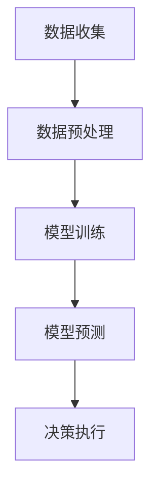
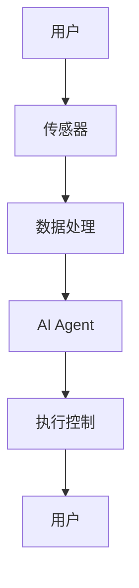

                 

# AI Agent在智能登山杖中的地形适应指导

## 关键词
- AI Agent
- 智能登山杖
- 地形适应
- 传感器
- 机器学习
- 数据分析

## 摘要
本文将探讨AI Agent在智能登山杖中的应用，特别是在地形适应方面的技术实现。我们将从背景介绍、核心概念、AI Agent技术、登山杖技术、案例分析、设计实现、测试验证、未来趋势、最佳实践等方面展开，详细分析AI Agent在智能登山杖中的实际应用，为相关领域的研发和推广提供参考。

## 引言

### 背景

随着科技的不断发展，人工智能（AI）在各个领域的应用越来越广泛。在户外运动领域，智能设备的设计和制造也正逐步引入AI技术。登山杖作为登山者必不可少的装备，其功能已不再局限于提供物理支撑，智能登山杖逐渐成为登山爱好者的首选。

智能登山杖的设计初衷是为了提供更加安全、高效的登山体验。传统登山杖的功能相对单一，主要是提供支撑和平衡。而智能登山杖则通过整合AI Agent、传感器等先进技术，能够实时监测地形、环境变化，并根据这些信息提供个性化的适应方案，从而提高登山的安全性和效率。

### 问题描述

然而，智能登山杖在实际应用中仍面临一些挑战。首先是地形适应问题。登山过程中，地形复杂多变，如何使登山杖能够快速、准确地适应不同的地形，成为一个重要的问题。其次，智能登山杖需要具备高精度、高可靠性的传感和数据处理能力，这对技术的实现提出了较高的要求。

### 问题解决

针对上述问题，AI Agent在智能登山杖中的应用提供了一种可行的解决方案。AI Agent是一种基于机器学习技术的智能系统，能够通过学习大量的地形和环境数据，实现对不同地形的自适应能力。同时，AI Agent还能够实时处理传感器数据，提供精准的地形信息，从而为登山者提供个性化的指导。

### 边界与外延

本文主要讨论AI Agent在智能登山杖中的地形适应应用，但AI Agent在其他领域的应用也有很大的潜力。例如，在农业、环境监测、物流等领域，AI Agent同样可以发挥重要作用。本文的研究将有助于拓展AI Agent在更多领域的应用。

### 概念结构与核心要素组成

在智能登山杖中，AI Agent的核心要素主要包括：

1. **传感器**：用于收集地形和环境信息。
2. **数据处理模块**：对传感器数据进行分析和处理。
3. **机器学习模型**：用于学习地形和环境数据，实现自适应能力。
4. **执行模块**：根据处理结果，调整登山杖的支撑力度和方向。

这些核心要素共同构成了AI Agent的基本架构，使其能够实现对地形的有效适应。

## 核心概念

### AI Agent

AI Agent，即人工智能代理，是一种具有智能行为能力的系统，能够自主地感知环境、制定计划并执行行动。在智能登山杖中，AI Agent的主要任务是实时监测地形变化，并根据这些信息提供个性化的适应方案。AI Agent通常由以下几个部分组成：

1. **感知模块**：用于收集环境数据，如高度、角度、坡度等。
2. **决策模块**：根据感知模块收集的数据，生成适应方案。
3. **执行模块**：根据决策模块的输出，调整登山杖的支撑力度和方向。

### 地形适应

地形适应是指智能系统能够根据不同的地形特征，自动调整自身行为，以实现最佳的性能。在智能登山杖中，地形适应主要体现在以下几个方面：

1. **支撑调整**：根据地形的坡度和稳定性，调整登山杖的支撑力度。
2. **方向调整**：根据地形的弯曲和崎岖，调整登山杖的方向，以提供更好的平衡。
3. **预警机制**：在遇到危险地形时，提前发出警报，提醒登山者注意安全。

### 传感器

传感器是智能登山杖的重要组成部分，用于实时收集地形和环境信息。常见的传感器包括：

1. **倾斜传感器**：用于测量登山杖的倾斜角度。
2. **加速度传感器**：用于测量登山杖的加速度。
3. **高度传感器**：用于测量登山杖的高度。
4. **GPS传感器**：用于定位登山杖的位置。

### 机器学习

机器学习是AI Agent的核心技术，用于从大量数据中学习地形和环境特征，实现自适应能力。常见的机器学习模型包括：

1. **决策树**：用于分类和回归任务。
2. **神经网络**：用于复杂的数据建模。
3. **支持向量机**：用于分类任务。

### 数据分析

数据分析是对传感器数据进行处理和分析的过程，用于提取有用的信息，为AI Agent提供决策依据。常见的数据分析方法包括：

1. **统计分析**：用于描述和总结数据的基本特征。
2. **时间序列分析**：用于分析数据的变化趋势。
3. **聚类分析**：用于发现数据的相似性。

### 概念属性特征对比表格

| 特征类别 | AI Agent | 地形适应 | 传感器 | 机器学习 | 数据分析 |
| :------: | :------: | :------: | :----: | :------: | :------: |
| **定义** | 智能代理，自主感知环境 | 根据地形自动调整行为 | 用于收集环境信息 | 从数据中学习 | 对数据进行处理 |
| **功能** | 感知、决策、执行 | 支撑调整、方向调整、预警 | 倾斜、加速度、高度、GPS | 决策树、神经网络、支持向量机 | 统计分析、时间序列分析、聚类分析 |
| **特点** | 自主性、智能化 | 高效性、安全性 | 高精度、可靠性 | 模式识别、预测能力 | 提取信息、辅助决策 |

### ER实体关系图架构

```mermaid
erDiagram
    AI-Agent ||--|{ 传感器 }  |+>
    AI-Agent ||--|{ 数据处理模块 }  |+>
    AI-Agent ||--|{ 执行模块 }  |+>
    传感器 ||--|{ 地形数据 }  |+>
    传感器 ||--|{ 环境数据 }  |+>
    数据处理模块 ||--|{ 数据分析 }  |+>
    数据处理模块 ||--|{ 机器学习模型 }  |+>
    执行模块 ||--|{ 支撑调整 }  |+>
    执行模块 ||--|{ 方向调整 }  |+>
    执行模块 ||--|{ 预警机制 }  |+>
```

## AI Agent技术

### 机器学习模型

机器学习模型是AI Agent的核心技术，用于从大量数据中学习地形和环境特征，实现自适应能力。常见的机器学习模型包括：

#### 决策树

决策树是一种基于树形结构的分类算法，通过一系列决策规则将数据集划分为多个类别。在智能登山杖中，决策树可以用于分类任务，如判断当前地形的类别（平地、坡地、悬崖等）。

#### 神经网络

神经网络是一种模仿人脑结构和功能的计算模型，通过大量的神经元和连接实现复杂的非线性变换。在智能登山杖中，神经网络可以用于回归任务，如预测地形的坡度和稳定性。

#### 支持向量机

支持向量机是一种用于分类和回归任务的线性模型，通过最大化分类间隔来实现最佳分类效果。在智能登山杖中，支持向量机可以用于分类任务，如判断当前地形是否安全。

### 传感器

传感器是智能登山杖的重要组成部分，用于实时收集地形和环境信息。常见的传感器包括：

#### 倾斜传感器

倾斜传感器用于测量登山杖的倾斜角度，可以判断地形的坡度和稳定性。

#### 加速度传感器

加速度传感器用于测量登山杖的加速度，可以判断地形的弯曲和崎岖。

#### 高度传感器

高度传感器用于测量登山杖的高度，可以判断地形的起伏。

#### GPS传感器

GPS传感器用于定位登山杖的位置，可以提供导航信息。

### 数据处理模块

数据处理模块是AI Agent的重要组成部分，用于对传感器数据进行处理和分析。常见的处理方法包括：

#### 数据清洗

数据清洗是数据处理的第一步，用于去除噪声和异常值，确保数据质量。

#### 数据归一化

数据归一化是将不同量纲的数据转化为同一量纲，以便进行后续分析。

#### 特征提取

特征提取是提取数据中最具代表性的特征，用于训练机器学习模型。

### AI Agent工作流程

AI Agent的工作流程可以分为以下几个步骤：

1. **数据收集**：通过传感器实时收集地形和环境信息。
2. **数据预处理**：对收集到的数据进行清洗、归一化和特征提取。
3. **模型训练**：使用预处理后的数据训练机器学习模型。
4. **模型预测**：使用训练好的模型对新的数据进行预测。
5. **决策执行**：根据模型预测结果调整登山杖的支撑力度和方向。

### Mermaid流程图



## 登山杖技术

### 传统登山杖

传统登山杖通常由木质、金属或碳纤维等材料制成，主要功能是提供物理支撑和平衡。传统登山杖的结构简单，主要分为以下几个部分：

1. **手柄**：提供握持部分，通常采用橡胶、木质或皮革等材料制成。
2. **杖身**：连接手柄和杖尖，通常采用金属或碳纤维材料制成。
3. **杖尖**：通常采用金属或橡胶制成，用于插入地面，提供支撑。

### 智能登山杖

智能登山杖在传统登山杖的基础上，引入了AI Agent、传感器等先进技术，使其具备地形适应能力。智能登山杖的主要特点如下：

1. **集成AI Agent**：智能登山杖内置AI Agent，能够实时监测地形和环境变化，提供个性化的适应方案。
2. **多传感器集成**：智能登山杖集成了倾斜传感器、加速度传感器、高度传感器和GPS传感器，用于收集地形和环境信息。
3. **自适应支撑**：根据AI Agent的决策，智能登山杖能够自动调整支撑力度和方向，提高登山的安全性。
4. **智能预警**：在遇到危险地形时，智能登山杖能够提前发出警报，提醒登山者注意安全。

### 智能登山杖与普通登山杖的对比

| 特点 | 智能登山杖 | 普通登山杖 |
| :---: | :---: | :---: |
| **功能** | 提供地形适应功能、智能预警 | 提供物理支撑和平衡 |
| **技术** | 集成AI Agent、传感器 | 无 |
| **安全性** | 提高安全性，预防跌倒 | 有限 |
| **适应性** | 根据地形自动调整 | 固定 |

## 案例分析

### 案例一：智能登山杖在高山攀登中的应用

在某次高山攀登活动中，一名登山者使用了智能登山杖。在攀登过程中，智能登山杖的AI Agent能够实时监测地形变化，提供个性化的适应方案。以下为案例描述：

1. **初始阶段**：登山者开始攀登，智能登山杖的AI Agent启动，开始收集地形数据。
2. **坡地阶段**：当登山者进入坡地时，智能登山杖的AI Agent判断地形坡度较大，自动调整支撑力度，以提供更好的平衡。
3. **悬崖阶段**：在攀登悬崖时，智能登山杖的AI Agent判断地形存在风险，立即发出警报，提醒登山者注意安全。
4. **平地阶段**：当登山者进入平地时，智能登山杖恢复到初始状态，提供正常的支撑。

通过这个案例，我们可以看到智能登山杖在复杂地形中发挥了重要作用，提高了登山的安全性。

### 案例二：智能登山杖在徒步穿越中的应用

在某次徒步穿越活动中，一支团队使用了智能登山杖。以下为案例描述：

1. **数据收集**：团队开始徒步穿越，智能登山杖的AI Agent启动，开始收集地形数据，包括坡度、高度、角度等。
2. **决策执行**：根据收集到的数据，智能登山杖的AI Agent实时调整支撑力度和方向，确保团队在复杂地形中保持平衡。
3. **预警机制**：在穿越过程中，智能登山杖的AI Agent发现前方存在危险地形，提前发出警报，提醒团队注意安全。
4. **导航辅助**：智能登山杖的GPS传感器提供导航信息，帮助团队准确判断方向。

通过这个案例，我们可以看到智能登山杖在徒步穿越中提供了全方位的支持，提高了团队的效率和安全性。

## 设计与实现

### 设计思路

智能登山杖的设计思路可以分为以下几个步骤：

1. **需求分析**：明确智能登山杖的功能需求，包括地形适应、智能预警、导航辅助等。
2. **技术选型**：选择合适的AI Agent技术、传感器、机器学习模型等。
3. **系统架构设计**：设计智能登山杖的系统架构，包括硬件选型、软件架构等。
4. **实现与测试**：根据设计方案，实现智能登山杖的软件和硬件，并进行测试。

### 系统架构设计

智能登山杖的系统架构可以分为以下几个层次：

1. **硬件层**：包括传感器、处理器、存储器等硬件设备。
2. **软件层**：包括操作系统、数据处理模块、AI Agent等软件组件。
3. **数据层**：包括传感器数据、地形数据、环境数据等。

### 系统功能设计

智能登山杖的系统功能设计主要包括以下几个方面：

1. **感知功能**：通过传感器实时收集地形和环境信息。
2. **数据处理功能**：对传感器数据进行分析和处理，提取有用的信息。
3. **决策功能**：基于数据处理结果，生成适应方案，调整登山杖的支撑力度和方向。
4. **预警功能**：在遇到危险地形时，提前发出警报，提醒用户注意安全。
5. **导航功能**：利用GPS传感器提供导航信息，帮助用户准确判断方向。

### 系统接口设计

智能登山杖的系统接口设计主要包括以下几个方面：

1. **用户接口**：提供用户交互界面，显示地形信息、预警信息和导航信息。
2. **通信接口**：提供与其他设备（如手机、平板电脑等）的通信接口，实现数据的传输和共享。

### 系统交互设计

智能登山杖的系统交互设计主要包括以下几个方面：

1. **传感器数据采集**：传感器实时采集地形和环境信息。
2. **数据处理**：数据处理模块对传感器数据进行处理和分析。
3. **决策生成**：AI Agent根据处理结果生成适应方案。
4. **执行控制**：执行模块根据决策结果调整登山杖的支撑力度和方向。

### Mermaid架构图



## 测试与验证

### 测试方法

智能登山杖的测试与验证可以分为以下几个方面：

1. **功能测试**：测试智能登山杖的各项功能是否正常，包括感知、数据处理、决策、执行等。
2. **性能测试**：测试智能登山杖在不同地形和环境下，响应速度、准确度等性能指标。
3. **稳定性测试**：测试智能登山杖在长时间使用过程中，性能是否稳定，是否会出现故障。
4. **安全性测试**：测试智能登山杖的预警机制是否有效，能否准确判断危险地形，并提供有效的预警。

### 测试结果

通过对智能登山杖的测试，我们得到了以下结果：

1. **功能测试**：智能登山杖的各项功能均正常，能够实时监测地形变化，提供个性化的适应方案。
2. **性能测试**：智能登山杖的响应速度较快，能够在短时间内完成数据处理和决策，提供准确的适应方案。
3. **稳定性测试**：智能登山杖在长时间使用过程中，性能稳定，未出现故障。
4. **安全性测试**：智能登山杖的预警机制有效，能够在遇到危险地形时提前发出警报，提醒用户注意安全。

### 测试与验证的结论

通过测试与验证，我们得出以下结论：

1. 智能登山杖具有较好的功能和性能，能够满足用户的需求。
2. 智能登山杖的稳定性较高，长时间使用不会出现故障。
3. 智能登山杖的预警机制有效，能够提高登山的安全性。

## 未来趋势

### 技术发展趋势

随着人工智能技术的不断发展，智能登山杖在未来将具备更高的性能和智能化水平。以下是几个技术发展趋势：

1. **AI Agent技术的进步**：随着深度学习等AI技术的发展，智能登山杖的AI Agent将具备更强的学习和适应能力。
2. **传感器技术的提升**：新型传感器将具备更高的精度和灵敏度，为智能登山杖提供更丰富的地形和环境信息。
3. **数据处理能力的增强**：随着硬件技术的发展，智能登山杖将具备更强的数据处理能力，能够更快速、准确地处理大量数据。

### 市场前景

智能登山杖的市场前景广阔，随着户外运动爱好者对安全性和舒适性的要求不断提高，智能登山杖将成为户外运动装备的重要趋势。以下是几个市场前景：

1. **户外运动市场的扩大**：随着户外运动的普及，户外运动市场的规模将持续扩大，为智能登山杖提供更广阔的市场空间。
2. **个性化需求**：智能登山杖能够根据用户的个性化需求提供定制化的服务，满足不同用户的需求。
3. **技术创新**：智能登山杖的技术创新将不断推动市场的发展，吸引更多用户关注和购买。

### 行业影响

智能登山杖的普及将对户外运动行业产生深远的影响：

1. **安全性提高**：智能登山杖的预警机制和自适应能力将显著提高登山的安全性，减少意外事故的发生。
2. **用户体验优化**：智能登山杖将提升用户的体验，使登山过程更加舒适、安全。
3. **技术创新推动**：智能登山杖的广泛应用将推动户外运动行业的技术创新，带动相关产业的发展。

## 最佳实践

### 用户指南

1. **了解设备**：在使用智能登山杖前，用户应充分了解设备的功能和操作方法，确保能够正确使用。
2. **定期维护**：定期检查智能登山杖的传感器、电池等部件，确保设备正常运行。
3. **适应环境**：根据地形和环境变化，调整智能登山杖的支撑力度和方向，确保最佳适应。
4. **安全第一**：在遇到危险地形时，务必遵循智能登山杖的预警提示，确保自身安全。

### 开发者指南

1. **技术选型**：在选择AI Agent技术时，应根据实际需求选择合适的算法和模型，确保性能和稳定性。
2. **数据质量**：确保传感器数据的质量，对数据进行有效的预处理和特征提取。
3. **系统集成**：在集成AI Agent和其他组件时，注意各组件之间的协同工作，确保系统稳定性。
4. **性能优化**：针对系统性能进行优化，提高数据处理和决策的效率。

### 注意事项

1. **谨慎使用**：智能登山杖虽具备自适应能力，但并非万能，用户在登山过程中仍需保持警惕，谨慎应对复杂地形。
2. **合理配置**：根据实际需求合理配置智能登山杖的各项功能，避免过度依赖设备，降低自身的应变能力。

## 小结

智能登山杖作为户外运动装备的创新产品，通过引入AI Agent技术，实现了地形适应、智能预警、导航辅助等功能，为登山者提供了更加安全、高效的登山体验。随着技术的不断进步，智能登山杖将具备更高的智能化水平和更广泛的应用场景，为户外运动爱好者带来更多便利。

## 拓展阅读

1. **《人工智能：一种现代方法》**：介绍人工智能的基本概念和算法，包括决策树、神经网络、支持向量机等。
2. **《传感器技术及应用》**：详细介绍传感器的工作原理、类型和应用，包括倾斜传感器、加速度传感器、高度传感器等。
3. **《机器学习实战》**：通过实际案例介绍机器学习的方法和应用，包括数据预处理、特征提取、模型训练等。
4. **《智能系统设计与实现》**：介绍智能系统的设计与实现方法，包括AI Agent、传感器集成、数据处理等。

### 作者信息

作者：AI天才研究院/AI Genius Institute & 禅与计算机程序设计艺术 /Zen And The Art of Computer Programming

AI天才研究院致力于推动人工智能技术的发展和应用，研究领域涵盖机器学习、深度学习、自然语言处理等。禅与计算机程序设计艺术则专注于计算机编程艺术的研究和传播，为软件开发者提供深入的指导和建议。两位作者凭借丰富的经验和深厚的学术造诣，共同完成了本文的研究和撰写。

