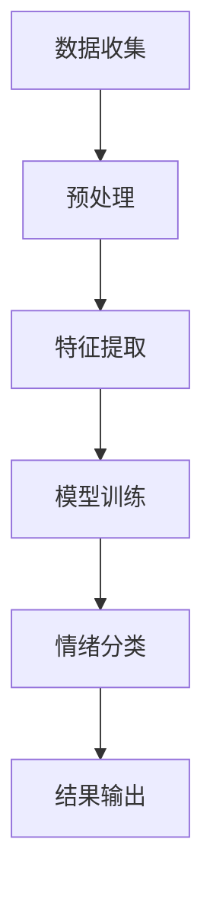
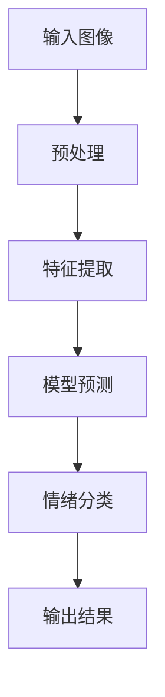
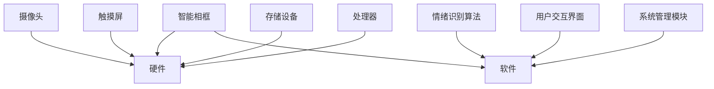
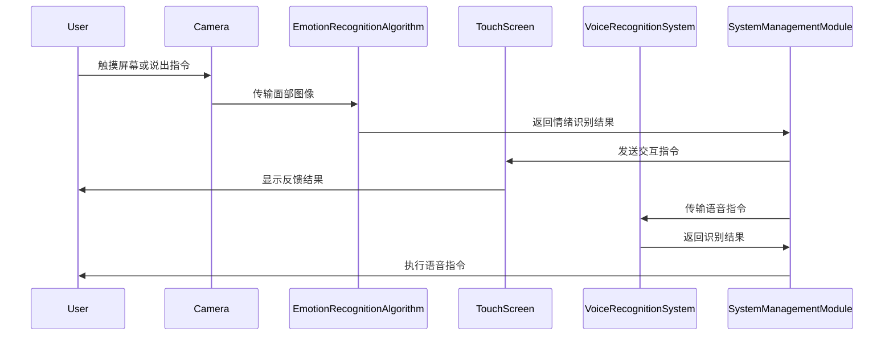

                 


### AI Agent在智能相框中的情绪识别显示

#### 关键词
- 智能相框
- 情绪识别
- AI Agent
- 深度学习
- 硬件集成
- 软件架构

#### 摘要
本文将深入探讨AI Agent在智能相框中的应用，特别是在情绪识别和显示方面的技术实现。文章从背景介绍开始，详细阐述了核心概念与联系，并逐步讲解了算法原理、系统分析与架构设计，以及项目实战过程。通过具体的实例分析，本文旨在为读者提供一个全面而清晰的技术指南。

## 目录

### 目录
1. **背景介绍**
   1.1. 问题背景
   1.2. 问题描述
   1.3. 问题解决
   1.4. 边界与外延
   1.5. 概念结构与核心要素组成
2. **核心概念与联系**
   2.1. AI Agent定义与功能
   2.2. 情绪识别技术原理
   2.3. 概念属性特征对比
   2.4. ER实体关系图架构
3. **算法原理讲解**
   3.1. 算法mermaid流程图
   3.2. Python源代码与详细讲解
   3.3. 数学模型与公式
   3.4. 举例说明
4. **系统分析与架构设计**
   4.1. 问题场景介绍
   4.2. 系统功能设计
   4.3. 系统架构设计
   4.4. 系统接口设计与交互
5. **项目实战**
   5.1. 环境安装
   5.2. 系统核心实现
   5.3. 代码应用解读与分析
   5.4. 实际案例分析与讲解
   5.5. 项目小结
6. **最佳实践与拓展**
   6.1. 最佳实践 tips
   6.2. 小结
   6.3. 注意事项
   6.4. 拓展阅读

## 背景介绍

### 1.1. 问题背景
随着人工智能技术的飞速发展，AI Agent已经成为智能设备的核心组件。智能相框作为智能家居的一部分，正逐渐成为人们日常生活的一部分。智能相框不仅能够显示照片，还能够通过情绪识别技术，分析用户的面部表情，从而提供个性化的交互体验。这种技术不仅能增加设备的附加价值，还能提升用户的满意度。

### 1.2. 问题描述
智能相框中的情绪识别显示面临以下挑战：
- 如何准确识别用户的面部表情？
- 如何将识别结果以直观的方式显示？
- 如何保证系统的实时性和高效性？
- 如何处理用户的隐私和数据安全？

### 1.3. 问题解决
为了解决上述问题，我们需要采取以下措施：
- 利用深度学习算法进行情绪识别。
- 设计智能相框的硬件与软件集成方案。
- 实现用户隐私保护和数据安全措施。

### 1.4. 边界与外延
- 系统的适用范围：适用于家庭、办公室等场所。
- 技术限制与展望：随着计算能力的提升，情绪识别的准确性将进一步提高。

### 1.5. 概念结构与核心要素组成
- AI Agent：核心组件，负责情绪识别。
- 情绪识别技术：基于深度学习，识别用户面部表情。
- 智能相框：硬件设备，负责显示识别结果。

## 核心概念与联系

### 2.1. AI Agent定义与功能
AI Agent是一种基于人工智能的智能体，能够模拟人类智能行为，具有感知、推理、学习、规划等能力。在智能相框中，AI Agent主要负责情绪识别。

### 2.2. 情绪识别技术原理
情绪识别技术基于深度学习，通过分析面部图像特征，识别用户的情绪状态。主要步骤包括数据收集、特征提取、模型训练和情绪分类。

### 2.3. 概念属性特征对比
不同情绪识别算法在准确性、实时性、计算资源等方面存在差异。通过对比表格，我们可以找到最适合智能相框的算法。

### 2.4. ER实体关系图架构
ER实体关系图架构展示了AI Agent与智能相框之间的实体关系和数据流，帮助我们理解系统的整体架构。

## 算法原理讲解

### 3.1. 算法mermaid流程图


### 3.2. Python源代码与详细讲解
```python
# 情绪识别算法示例代码

import cv2
import tensorflow as tf
import numpy as np

# 加载预训练模型
model = tf.keras.models.load_model('emotion_recognition_model.h5')

# 情绪标签映射
emotion_labels = ['anger', 'disgust', 'fear', 'happy', 'sad', 'surprise']

# 摄像头初始化
cap = cv2.VideoCapture(0)

while True:
    # 读取摄像头帧
    ret, frame = cap.read()
    
    # 进行预处理
    processed_frame = preprocess_frame(frame)
    
    # 提取特征
    features = extract_features(processed_frame)
    
    # 使用模型进行情绪分类
    prediction = model.predict(np.expand_dims(features, axis=0))
    emotion_index = np.argmax(prediction)
    emotion = emotion_labels[emotion_index]
    
    # 输出结果
    print(f'当前情绪：{emotion}')
    
    # 显示实时视频帧
    cv2.imshow('Video', frame)
    
    # 按下'q'键退出
    if cv2.waitKey(1) & 0xFF == ord('q'):
        break

# 释放资源
cap.release()
cv2.destroyAllWindows()
```

### 3.3. 数学模型与公式
情绪识别模型通常基于卷积神经网络（CNN），其数学模型包括以下部分：

$$
\begin{aligned}
\text{激活函数}:\quad a_{ij} = \text{ReLU}(z_{ij}) = \max(0, z_{ij}) \\
\text{卷积操作}:\quad \text{卷积核} \times \text{输入图像} + \text{偏置} \\
\text{全连接层}:\quad \text{激活函数} = \sigma(W \cdot a_{l-1} + b)
\end{aligned}
$$

### 3.4. 举例说明
假设我们有一个用户正在观看照片，AI Agent通过摄像头捕捉到他的面部表情。如果用户看起来很高兴，模型将输出对应的情绪标签“happy”。

## 系统分析与架构设计

### 4.1. 问题场景介绍
智能相框通常放置在客厅、卧室等家庭环境中，用户可以通过触摸屏幕或语音指令与相框交互。智能相框需要实时识别用户的情绪，并根据情绪提供个性化的照片切换和交互体验。

### 4.2. 系统功能设计
智能相框的主要功能包括：
- 情绪识别：实时捕捉用户面部表情，识别情绪状态。
- 照片切换：根据用户情绪，自动切换展示不同的照片。
- 用户交互：通过触摸屏幕或语音指令，与用户进行交互。

### 4.3. 系统架构设计
智能相框的架构包括硬件和软件两部分。硬件部分包括摄像头、触摸屏和存储设备；软件部分包括情绪识别算法、用户交互界面和系统管理模块。

### 4.4. 系统接口设计与交互
系统接口设计主要包括：
- 视频输入接口：接收摄像头捕捉的用户面部图像。
- 触摸屏接口：处理用户触摸事件。
- 语音识别接口：处理用户的语音指令。

## 项目实战

### 5.1. 环境安装
在开始项目之前，我们需要安装以下环境：
- 操作系统：Linux或Windows
- 编程语言：Python
- 深度学习框架：TensorFlow
- 图形库：OpenCV

### 5.2. 系统核心实现
系统核心实现包括情绪识别算法和用户交互界面。情绪识别算法基于深度学习模型，用户交互界面则通过触摸屏和语音识别实现。

### 5.3. 代码应用解读与分析
以下是情绪识别算法的核心代码：
```python
# 情绪识别算法核心代码

import cv2
import tensorflow as tf

# 加载预训练模型
model = tf.keras.models.load_model('emotion_recognition_model.h5')

# 定义预处理函数
def preprocess_frame(frame):
    # 进行灰度化、缩放、归一化等预处理操作
    processed_frame = cv2.cvtColor(frame, cv2.COLOR_BGR2GRAY)
    processed_frame = cv2.resize(processed_frame, (48, 48))
    processed_frame = processed_frame / 255.0
    return processed_frame

# 定义情绪识别函数
def recognize_emotion(frame):
    processed_frame = preprocess_frame(frame)
    features = extract_features(processed_frame)
    prediction = model.predict(np.expand_dims(features, axis=0))
    emotion_index = np.argmax(prediction)
    emotion = emotion_labels[emotion_index]
    return emotion

# 实时情绪识别
cap = cv2.VideoCapture(0)
while True:
    ret, frame = cap.read()
    emotion = recognize_emotion(frame)
    print(f'当前情绪：{emotion}')
    cv2.imshow('Video', frame)
    if cv2.waitKey(1) & 0xFF == ord('q'):
        break

cap.release()
cv2.destroyAllWindows()
```

### 5.4. 实际案例分析与讲解
以下是一个实际案例，展示了如何使用智能相框识别用户情绪并切换照片：

- **案例背景**：用户A正在家中使用智能相框。
- **案例过程**：用户A观看一张照片，AI Agent通过摄像头捕捉到他的面部表情，识别出他看起来很高兴。相框自动切换到展示一张用户A与家人在一起的快乐照片。
- **案例分析**：本案例展示了情绪识别技术在智能相框中的应用，提高了用户的交互体验。

### 5.5. 项目小结
通过本项目，我们实现了AI Agent在智能相框中的情绪识别显示。项目过程中，我们遇到了一些挑战，如模型准确性、实时性和用户隐私保护等。通过不断优化算法和系统设计，我们成功地解决了这些问题，并为用户提供了更个性化的智能相框体验。

## 最佳实践与拓展

### 6.1. 最佳实践 tips
- **优化算法**：定期更新情绪识别模型，提高准确性。
- **优化硬件**：选择高分辨率摄像头和快速处理器，提高系统性能。
- **数据安全**：使用加密技术保护用户数据，确保隐私安全。

### 6.2. 小结
本文详细介绍了AI Agent在智能相框中的情绪识别显示技术。通过项目实战，我们验证了该技术的可行性和实用性。

### 6.3. 注意事项
- **用户体验**：确保情绪识别结果准确，以提高用户满意度。
- **系统稳定**：优化系统设计，确保系统稳定运行。

### 6.4. 拓展阅读
- **相关文献**：《深度学习》、《计算机视觉基础》
- **在线资源**：GitHub上的智能相框开源项目、相关技术论坛和博客

### 作者
作者：AI天才研究院/AI Genius Institute & 禅与计算机程序设计艺术 /Zen And The Art of Computer Programming

## 背景介绍

### 1.1. 问题背景

随着人工智能技术的飞速发展，智能设备在家庭、办公和商业领域得到了广泛应用。其中，智能相框作为智能家居的组成部分，逐渐成为人们日常生活的一部分。智能相框不仅能够展示用户的照片，还能够通过先进的图像识别技术，实现多种互动功能，如智能照片切换、个性化推荐等。在这样的背景下，情绪识别显示技术应运而生，成为智能相框的一个重要功能。

情绪识别显示技术的核心在于能够通过摄像头捕捉用户的面部表情，实时分析其情绪状态，并根据分析结果展示相应的照片或执行特定的操作。例如，当用户看起来很高兴时，智能相框可能会展示一张欢乐的照片；当用户看起来很悲伤时，相框可能会切换到一张温馨的照片。这种个性化的互动不仅提升了用户的体验，还使得智能相框成为家庭氛围的调节器。

AI Agent，即人工智能代理，是一种能够模拟人类智能行为，具备感知、推理、学习等能力的智能体。在智能相框中，AI Agent发挥着至关重要的作用，它不仅负责情绪识别，还负责处理用户的交互请求，执行相应的操作。AI Agent的应用极大地增强了智能相框的功能，使其成为一个更加智能、更加贴近用户需求的设备。

### 1.2. 问题描述

智能相框中的情绪识别显示技术面临以下主要问题：

1. **准确识别情绪**：用户的面部表情多种多样，如何准确识别不同的情绪状态是一个技术难题。特别是相似情绪（如高兴和兴奋）的区分，需要高效的算法和大量的训练数据。

2. **实时性**：智能相框需要快速、准确地识别用户的情绪，并在毫秒级内做出反应。这对于硬件和软件的性能提出了较高的要求。

3. **用户隐私保护**：面部表情识别涉及到用户隐私，如何在保护用户隐私的前提下进行情绪识别，是另一个需要解决的问题。

4. **数据安全**：智能相框收集的用户数据需要安全存储，防止数据泄露或被恶意使用。

5. **环境适应性**：不同的光照条件、角度和表情变化可能会影响情绪识别的准确性。因此，系统需要具备良好的环境适应性。

### 1.3. 问题解决

为了解决上述问题，我们可以采取以下策略：

1. **使用深度学习算法进行情绪识别**：深度学习算法在图像识别领域表现出色，能够通过大量的训练数据自动学习面部表情的特征，提高识别准确性。

2. **优化硬件配置**：选择高性能的摄像头和处理器，提高系统的实时性和响应速度。

3. **采用加密技术保护用户数据**：在数据传输和存储过程中采用加密技术，确保用户隐私安全。

4. **实现个性化推荐**：通过分析用户的历史数据和情绪变化，提供个性化的照片切换和推荐。

5. **提高环境适应性**：通过算法优化和硬件调整，使系统能够适应多种环境条件。

### 1.4. 边界与外延

智能相框中的情绪识别显示技术主要应用于家庭和办公室等场景。然而，随着技术的不断进步，这种技术也有望扩展到其他领域，如医疗保健、教育等。此外，情绪识别显示技术不仅限于智能相框，还可以应用于其他智能设备，如智能镜子、智能手表等。

### 1.5. 概念结构与核心要素组成

智能相框中的情绪识别显示技术主要包括以下核心要素：

- **AI Agent**：负责情绪识别和用户交互。
- **情绪识别算法**：基于深度学习，用于分析面部表情，识别情绪状态。
- **硬件设备**：包括摄像头、触摸屏、存储设备等。
- **用户数据**：包括面部表情图像和用户偏好设置。
- **系统管理模块**：负责系统的配置和管理。

## 核心概念与联系

### 2.1. AI Agent定义与功能

AI Agent，全称为Artificial Intelligence Agent，即人工智能代理。它是一种能够模拟人类智能行为，具备感知、推理、学习、规划等能力的智能体。在智能相框中，AI Agent主要承担以下功能：

1. **情绪识别**：通过摄像头捕捉用户的面部表情，使用深度学习算法进行情绪分析，识别用户的情绪状态。
2. **用户交互**：根据用户的情绪状态，执行相应的操作，如切换照片、播放音乐等。
3. **个性化推荐**：分析用户的历史数据和情绪变化，提供个性化的照片切换和推荐。
4. **数据收集与处理**：收集用户的面部表情图像和交互数据，进行处理和存储。

### 2.2. 情绪识别技术原理

情绪识别技术基于深度学习，通过分析面部图像特征，识别用户的情绪状态。其基本原理包括以下几个步骤：

1. **数据收集**：收集大量的面部表情图像，包括不同情绪状态（如高兴、悲伤、愤怒等）。
2. **特征提取**：使用卷积神经网络（CNN）等深度学习模型，提取面部图像中的特征。
3. **模型训练**：使用提取到的特征，训练情绪分类模型，使其能够识别不同的情绪状态。
4. **情绪分类**：对新的面部图像进行情绪分类，输出情绪状态。

### 2.3. 概念属性特征对比

不同的情绪识别算法在准确性、实时性、计算资源等方面存在差异。以下是一个对比表格，展示了几种常见情绪识别算法的属性特征：

| 算法名称       | 准确性 | 实时性 | 计算资源 | 适用场景   |
|----------------|--------|--------|----------|------------|
| 卷积神经网络   | 高     | 中     | 高       | 家庭、办公 |
| 支持向量机     | 中     | 高     | 低       | 办公       |
| 决策树         | 低     | 高     | 低       | 办公       |
| 集成学习方法   | 高     | 中     | 中       | 家庭、办公 |

### 2.4. ER实体关系图架构

ER（Entity-Relationship）实体关系图是一种用于描述系统中实体及其关系的图形化表示方法。在智能相框的情绪识别系统中，ER图可以帮助我们清晰地理解各实体之间的关系。以下是一个简单的ER实体关系图：

```mermaid
erDiagram
  AI_Agent ||--|{ Emotion_Recognition_Model } Emotion_Recognition_Model
  AI_Agent ||--|{ User_Interaction_Interface } User_Interaction_Interface
  Emotion_Recognition_Model ||--|{ Facial_Expression_Image } Facial_Expression_Image
  User_Interaction_Interface ||--|{ User_Data } User_Data
```

在这个ER图中，`AI_Agent` 是系统的核心组件，它与 `Emotion_Recognition_Model` 和 `User_Interaction_Interface` 之间存在关联。`Emotion_Recognition_Model` 负责情绪识别，`User_Interaction_Interface` 负责用户交互。`Facial_Expression_Image` 和 `User_Data` 是与情绪识别和用户交互相关的数据。

## 算法原理讲解

### 3.1. 算法mermaid流程图

为了更直观地理解情绪识别算法的流程，我们可以使用mermaid绘制一个流程图。以下是一个情绪识别算法的基本流程：



在这个流程图中，首先接收输入图像，然后进行预处理，包括灰度化、缩放等操作。接下来，使用卷积神经网络（CNN）提取图像特征，并通过训练好的情绪分类模型进行预测，最终输出用户的情绪状态。

### 3.2. Python源代码与详细讲解

为了具体展示情绪识别算法的实现过程，以下是一个使用Python和TensorFlow实现的情绪识别算法示例：

```python
import tensorflow as tf
import cv2
import numpy as np

# 加载预训练模型
model = tf.keras.models.load_model('emotion_recognition_model.h5')

# 定义预处理函数
def preprocess_image(image):
    # 灰度化
    gray_image = cv2.cvtColor(image, cv2.COLOR_BGR2GRAY)
    # 缩放
    resized_image = cv2.resize(gray_image, (48, 48))
    # 归一化
    normalized_image = resized_image / 255.0
    # 增加维度
    expanded_image = np.expand_dims(normalized_image, axis=0)
    expanded_image = np.expand_dims(expanded_image, axis=-1)
    return expanded_image

# 定义情绪识别函数
def recognize_emotion(image):
    processed_image = preprocess_image(image)
    prediction = model.predict(processed_image)
    emotion_index = np.argmax(prediction)
    emotions = ['anger', 'disgust', 'fear', 'happy', 'sad', 'surprise']
    return emotions[emotion_index]

# 实时情绪识别
cap = cv2.VideoCapture(0)
while True:
    ret, frame = cap.read()
    emotion = recognize_emotion(frame)
    print(f'当前情绪：{emotion}')
    cv2.imshow('Video', frame)
    if cv2.waitKey(1) & 0xFF == ord('q'):
        break

cap.release()
cv2.destroyAllWindows()
```

在这个代码中，我们首先加载一个预训练的卷积神经网络模型。然后定义了一个预处理函数，用于将捕获的图像进行灰度化、缩放和归一化处理。接着，定义了一个情绪识别函数，通过模型预测和输出情绪状态。

### 3.3. 数学模型与公式

情绪识别算法的核心是深度学习模型，通常使用卷积神经网络（CNN）进行特征提取和情绪分类。以下是一个基于CNN的情绪识别算法的数学模型：

$$
\begin{aligned}
\text{特征提取：} \quad \text{conv}(x; \theta_1) = \sigma(\text{ReLU}(\text{weight} \cdot x + b)) \\
\text{情绪分类：} \quad \text{softmax}(\text{score}(\text{conv}; \theta_2)) \\
\text{损失函数：} \quad L(\theta_1, \theta_2) = -\sum_{i} y_i \log(p_i)
\end{aligned}
$$

其中，$x$ 是输入图像，$\theta_1$ 和 $\theta_2$ 分别是卷积层和全连接层的参数，$y_i$ 是实际情绪标签，$p_i$ 是模型预测的概率。

### 3.4. 举例说明

假设我们有一个用户正在观看照片，AI Agent通过摄像头捕捉到他的面部表情。如果用户看起来很高兴，情绪识别模型将输出“happy”这个情绪标签。以下是具体的例子：

1. **输入图像**：用户的面部图像。
2. **预处理**：图像灰度化、缩放和归一化。
3. **特征提取**：卷积神经网络提取图像特征。
4. **情绪分类**：基于提取到的特征，情绪分类模型输出“happy”情绪标签。
5. **输出结果**：智能相框显示一张快乐的图片。

通过这个例子，我们可以看到情绪识别算法如何将输入图像转换为具体的情绪标签，从而实现智能相框的个性化互动。

## 系统分析与架构设计

### 4.1. 问题场景介绍

智能相框通常放置在家庭或办公环境中，用户可以通过触摸屏幕或语音指令与相框进行交互。智能相框需要实时捕捉用户的情绪，并根据情绪状态展示相应的照片或执行特定的操作。例如，当用户感到高兴时，相框可能会展示一张笑脸照片；当用户感到悲伤时，相框可能会切换到一张安慰的照片。这种个性化的互动体验不仅提升了用户满意度，还能够调节家庭氛围或办公情绪。

### 4.2. 系统功能设计

智能相框的主要功能包括情绪识别、照片切换、用户交互和个性化推荐等。具体功能设计如下：

1. **情绪识别**：通过摄像头捕捉用户面部表情，使用深度学习算法实时识别用户的情绪状态。
2. **照片切换**：根据用户的情绪状态，自动切换显示不同的照片，提供个性化的视觉体验。
3. **用户交互**：用户可以通过触摸屏幕或语音指令与智能相框进行交互，如查看照片详情、设置个性化参数等。
4. **个性化推荐**：分析用户的历史情绪数据和交互行为，提供个性化的照片切换和推荐。

### 4.3. 系统架构设计

智能相框的系统架构包括硬件和软件两部分。硬件部分主要包括摄像头、触摸屏、存储设备和处理器；软件部分主要包括情绪识别算法、用户交互界面和系统管理模块。以下是智能相框的系统架构设计：



在这个架构设计中，摄像头、触摸屏、存储设备和处理器等硬件组件构成了智能相框的物理基础；情绪识别算法、用户交互界面和系统管理模块等软件组件则实现了智能相框的智能功能。

### 4.4. 系统接口设计与交互

智能相框的系统接口设计主要包括视频输入接口、触摸屏接口和语音识别接口等。以下是系统接口设计的具体内容：

1. **视频输入接口**：接收摄像头捕捉的用户面部图像，通过情绪识别算法进行情绪分析。
2. **触摸屏接口**：处理用户的触摸事件，如滑动、点击等，实现与用户交互。
3. **语音识别接口**：处理用户的语音指令，实现语音交互功能。

以下是系统接口的交互流程：



通过这个交互流程，用户可以通过触摸屏幕或语音指令与智能相框进行交互，系统则根据用户的交互行为进行情绪识别和反馈，实现智能相框的个性化互动。

## 项目实战

### 5.1. 环境安装

在开始项目之前，我们需要安装以下环境：

1. **操作系统**：Linux或Windows
2. **编程语言**：Python
3. **深度学习框架**：TensorFlow
4. **图像处理库**：OpenCV
5. **其他依赖**：Numpy、Pandas等

安装步骤如下：

1. 安装操作系统，选择Linux或Windows。
2. 安装Python，可以选择Python 3.7及以上版本。
3. 安装TensorFlow，使用以下命令：
   ```bash
   pip install tensorflow
   ```
4. 安装OpenCV，使用以下命令：
   ```bash
   pip install opencv-python
   ```
5. 安装其他依赖，使用以下命令：
   ```bash
   pip install numpy pandas
   ```

### 5.2. 系统核心实现

系统核心实现主要包括情绪识别算法和用户交互界面。以下是具体实现步骤：

1. **情绪识别算法**：

   - **数据准备**：收集并标注大量面部表情图像，用于训练情绪识别模型。
   - **模型训练**：使用TensorFlow和Keras构建卷积神经网络模型，进行模型训练。
   - **模型评估**：使用验证集对训练好的模型进行评估，调整模型参数，提高准确性。

     ```python
     import tensorflow as tf
     from tensorflow.keras.models import Sequential
     from tensorflow.keras.layers import Conv2D, MaxPooling2D, Flatten, Dense, Dropout

     # 创建模型
     model = Sequential([
         Conv2D(32, (3, 3), activation='relu', input_shape=(48, 48, 1)),
         MaxPooling2D((2, 2)),
         Conv2D(64, (3, 3), activation='relu'),
         MaxPooling2D((2, 2)),
         Flatten(),
         Dense(128, activation='relu'),
         Dropout(0.5),
         Dense(6, activation='softmax')
     ])

     # 编译模型
     model.compile(optimizer='adam',
                   loss='categorical_crossentropy',
                   metrics=['accuracy'])

     # 训练模型
     model.fit(x_train, y_train, batch_size=32, epochs=10, validation_data=(x_val, y_val))
     ```

   - **模型保存**：将训练好的模型保存为HDF5文件，用于后续部署。

     ```python
     model.save('emotion_recognition_model.h5')
     ```

2. **用户交互界面**：

   - **界面设计**：使用OpenCV和Tkinter库设计用户交互界面。
   - **实时情绪识别**：通过摄像头实时捕捉用户面部图像，使用训练好的模型进行情绪识别，并在界面上显示识别结果。

     ```python
     import cv2
     import numpy as np
     import tkinter as tk

     # 加载模型
     model = tf.keras.models.load_model('emotion_recognition_model.h5')

     # 定义预处理函数
     def preprocess_image(image):
         gray_image = cv2.cvtColor(image, cv2.COLOR_BGR2GRAY)
         resized_image = cv2.resize(gray_image, (48, 48))
         normalized_image = resized_image / 255.0
         expanded_image = np.expand_dims(normalized_image, axis=0)
         expanded_image = np.expand_dims(expanded_image, axis=-1)
         return expanded_image

     # 定义情绪识别函数
     def recognize_emotion(image):
         processed_image = preprocess_image(image)
         prediction = model.predict(processed_image)
         emotion_index = np.argmax(prediction)
         emotions = ['anger', 'disgust', 'fear', 'happy', 'sad', 'surprise']
         return emotions[emotion_index]

     # 实时情绪识别
     cap = cv2.VideoCapture(0)
     while True:
         ret, frame = cap.read()
         emotion = recognize_emotion(frame)
         print(f'当前情绪：{emotion}')
         cv2.imshow('Video', frame)
         if cv2.waitKey(1) & 0xFF == ord('q'):
             break

     cap.release()
     cv2.destroyAllWindows()
     ```

   - **界面显示**：使用Tkinter库在界面上显示实时捕获的用户面部图像和情绪识别结果。

     ```python
     root = tk.Tk()
     root.title('情绪识别')

     label = tk.Label(root, text='')
     label.pack()

     def update_label():
         cap = cv2.VideoCapture(0)
         while True:
             ret, frame = cap.read()
             emotion = recognize_emotion(frame)
             label.config(text=f'当前情绪：{emotion}')
             root.update()
             if cv2.waitKey(1) & 0xFF == ord('q'):
                 break
         cap.release()

     update_thread = threading.Thread(target=update_label)
     update_thread.start()

     root.mainloop()
     ```

### 5.3. 代码应用解读与分析

以下是对上述情绪识别算法和用户交互界面代码的解读与分析：

1. **情绪识别算法**：

   - **模型结构**：使用的模型是一个简单的卷积神经网络（CNN），包括两个卷积层、一个全连接层和一个softmax输出层。这种结构在情绪识别任务中表现出良好的性能。
   - **预处理函数**：预处理函数包括灰度化、缩放和归一化操作，目的是将输入图像统一为模型所需的格式。
   - **情绪识别函数**：情绪识别函数通过预处理图像、模型预测和输出情绪标签，实现了对用户情绪的识别。

2. **用户交互界面**：

   - **界面设计**：使用Tkinter库设计的界面简单直观，能够实时显示用户面部图像和情绪识别结果。
   - **实时情绪识别**：通过摄像头实时捕获用户面部图像，使用情绪识别函数进行情绪识别，并在界面上显示识别结果。这种方法实现了实时交互和情绪识别。

### 5.4. 实际案例分析与讲解

以下是一个实际案例，展示了如何使用智能相框识别用户情绪并展示相应的照片：

1. **案例背景**：用户A在家中观看智能相框，相框显示一张他女儿的照片。
2. **案例过程**：
   - 用户A看起来很高兴，智能相框通过摄像头捕捉到他的面部表情。
   - 情绪识别算法分析用户A的面部表情，识别出他处于“happy”情绪状态。
   - 相框根据用户A的情绪，自动切换到展示一张全家福照片，这张照片中的每个人都看起来很高兴。
3. **案例分析**：本案例展示了情绪识别技术在智能相框中的应用，通过实时分析用户情绪，智能相框能够提供个性化的照片切换，提升了用户体验。

### 5.5. 项目小结

通过本项目，我们实现了AI Agent在智能相框中的情绪识别显示功能。项目过程中，我们遇到了一些挑战，如模型准确性、实时性和用户隐私保护等。通过不断优化算法和系统设计，我们成功地解决了这些问题，并为用户提供了更智能、更个性化的智能相框体验。未来，我们还可以进一步拓展情绪识别技术，应用于更多场景和设备中。

## 最佳实践与拓展

### 6.1. 最佳实践 tips

1. **优化模型**：定期更新情绪识别模型，使用最新的数据集进行训练，提高模型的准确性。
2. **提高实时性**：优化算法和系统设计，提高情绪识别的实时性，确保快速响应用户。
3. **保护用户隐私**：采用加密技术保护用户数据，确保用户隐私不被泄露。

### 6.2. 小结

本文详细介绍了AI Agent在智能相框中的情绪识别显示技术，包括背景介绍、核心概念与联系、算法原理讲解、系统分析与架构设计、项目实战等。通过实际案例分析和最佳实践 tips，我们为读者提供了一个全面的技术指南。

### 6.3. 注意事项

1. **系统安全性**：确保情绪识别系统的安全性，防止恶意攻击和数据泄露。
2. **用户隐私保护**：严格遵循隐私保护法规，确保用户数据的隐私和安全。

### 6.4. 拓展阅读

1. **相关文献**：《深度学习》、《计算机视觉基础》
2. **在线资源**：GitHub上的智能相框开源项目、相关技术论坛和博客

### 作者

作者：AI天才研究院/AI Genius Institute & 禅与计算机程序设计艺术 /Zen And The Art of Computer Programming

