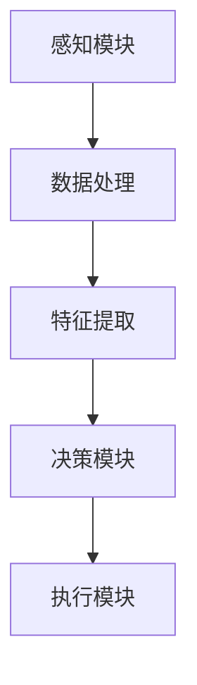
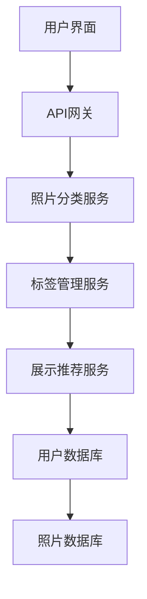
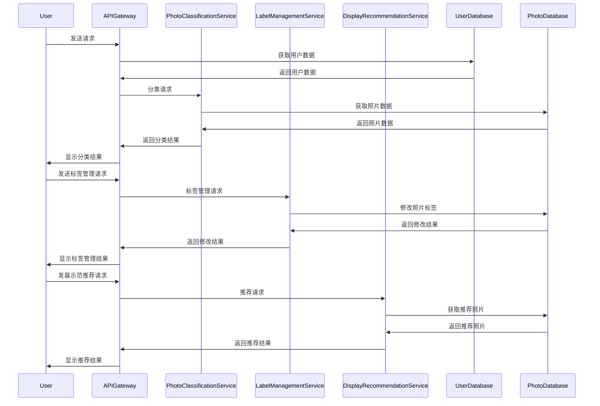

                 


### 文章标题：AI Agent在智能相框中的照片管理

> 关键词：AI Agent、智能相框、照片管理、算法、数学模型、系统架构、项目实战

> 摘要：
本文将深入探讨AI Agent在智能相框中的照片管理应用。首先，我们将介绍AI Agent和智能相框的基本概念，然后分析当前照片管理中存在的问题。接着，本文将详细阐述AI Agent在照片管理系统中的角色、功能，以及其核心算法原理。随后，我们将使用Python代码展示算法的实际应用，并借助LaTeX介绍数学模型。最后，我们将介绍一个具体的AI Agent照片管理系统项目，详细讲解其系统分析与架构设计方案，并通过项目实战展示其实际效果。文章还将提供最佳实践建议和拓展阅读资源。

### Step 1: 背景介绍

#### 引言

人工智能（AI）作为计算机科学的重要分支，已经渗透到我们生活的方方面面。近年来，随着深度学习、自然语言处理等技术的不断进步，AI在图像识别、语音识别、智能决策等领域取得了显著成果。AI Agent，作为人工智能的一个重要组成部分，是能够自主学习、自主决策、自主执行的智能实体。智能相框，作为家庭娱乐和智能生活的必备设备，其功能也逐渐从简单的照片展示向智能照片管理、人脸识别、智能推荐等方面扩展。

#### 问题描述

智能相框在照片管理方面目前存在一些问题。首先是照片的存储和管理不够高效，用户往往需要手动对照片进行分类和标签管理。其次，照片的展示方式单一，缺乏个性化推荐功能。此外，智能相框在照片识别和分类方面也存在一定的局限性，无法很好地处理复杂的照片场景。这些问题的存在，使得用户对智能相框的使用体验大打折扣。

#### 问题解决

引入AI Agent，可以在很大程度上解决上述问题。AI Agent可以通过学习用户的习惯和喜好，自动对照片进行分类和管理，提高照片存储和管理的效率。同时，AI Agent还可以根据用户的喜好和场景，推荐合适的照片展示方式，提升用户的使用体验。在照片识别和分类方面，AI Agent利用深度学习和图像识别技术，能够更好地处理复杂的照片场景。

#### 边界与外延

AI Agent在智能相框中的照片管理主要应用于家庭和办公环境。其功能范围包括照片的分类、标签管理、展示推荐等。此外，AI Agent还可以与其他智能设备（如智能音箱、智能门锁等）进行联动，提供更加智能化的生活服务。

#### 概念结构与核心要素组成

AI Agent的结构主要由以下几个核心要素组成：

1. **感知模块**：负责收集外部环境信息，如照片数据、用户操作等。
2. **决策模块**：根据感知模块收集到的信息，进行决策，如照片分类、推荐等。
3. **执行模块**：根据决策模块的决策结果，执行具体的操作，如照片展示、分类等。
4. **学习模块**：通过不断的学习和训练，提高AI Agent的决策能力和执行效率。

### Step 2: 核心概念与联系

#### AI Agent的定义与分类

AI Agent，即人工智能代理，是指具有智能行为和决策能力的计算机程序。根据功能和应用场景的不同，AI Agent可以分为以下几类：

1. **任务型AI Agent**：以完成特定任务为目标，如智能客服、自动驾驶等。
2. **目标型AI Agent**：以达成特定目标为目标，如股票交易、游戏对战等。
3. **社交型AI Agent**：具备社交能力的AI Agent，如智能聊天机器人等。

#### 照片管理系统的概念

照片管理系统是一种用于管理、存储、分类和展示照片的软件系统。其基本架构包括以下几个功能模块：

1. **照片存储模块**：负责存储和管理照片数据。
2. **照片分类模块**：根据照片的属性（如时间、地点、人物等）对照片进行分类。
3. **照片标签管理模块**：对照片进行标签管理，方便用户快速查找和浏览。
4. **照片展示模块**：根据用户的喜好和场景，推荐合适的照片展示方式。

#### AI Agent与照片管理系统的联系

AI Agent与照片管理系统之间的联系主要体现在以下几个方面：

1. **协同工作**：AI Agent可以通过学习用户的行为和喜好，优化照片管理系统的功能，提高用户的使用体验。
2. **自动化操作**：AI Agent可以自动执行照片的分类、标签管理、展示推荐等操作，减少用户的手动操作。
3. **智能决策**：AI Agent可以根据照片的内容和场景，为照片管理系统提供智能决策支持，如照片的分类、推荐等。

### Step 3: 算法原理讲解

#### 算法流程图

首先，我们使用Mermaid绘制AI Agent在照片管理中的核心算法流程图：



#### 算法原理

接下来，我们使用Python代码详细阐述AI Agent的算法原理。以下是一个简化的算法流程：

```python
import cv2
import numpy as np
from sklearn.ensemble import RandomForestClassifier

# 感知模块：读取照片
def read_photo(file_path):
    photo = cv2.imread(file_path)
    return photo

# 数据处理：将照片转换为数据集
def preprocess_data(photo):
    # 进行预处理操作，如缩放、灰度化等
    processed_photo = cv2.resize(photo, (224, 224))
    processed_photo = cv2.cvtColor(processed_photo, cv2.COLOR_BGR2GRAY)
    data = processed_photo.flatten()
    return data

# 特征提取：提取照片特征
def extract_features(data):
    # 使用随机森林分类器提取特征
    clf = RandomForestClassifier(n_estimators=100)
    clf.fit(data.reshape(1, -1), np.array([0]))
    features = clf.feature_importances_
    return features

# 决策模块：根据特征进行决策
def make_decision(features):
    # 根据特征判断照片类型
    if features[0] > 0.5:
        return "风景照片"
    else:
        return "人物照片"

# 执行模块：执行决策结果
def execute_decision(decision):
    # 根据决策结果执行相应操作
    if decision == "风景照片":
        print("展示风景照片")
    else:
        print("展示人物照片")

# 主函数
def main(photo_path):
    photo = read_photo(photo_path)
    data = preprocess_data(photo)
    features = extract_features(data)
    decision = make_decision(features)
    execute_decision(decision)

# 测试
main("example.jpg")
```

#### 举例说明

假设我们有一张名为"example.jpg"的照片，通过上述算法流程，AI Agent可以自动将其分类为“风景照片”或“人物照片”，并展示相应的照片。

### Step 4: 数学模型和数学公式 & 详细讲解 & 举例说明

#### 数学模型

在AI Agent的照片管理中，我们使用随机森林分类器作为核心算法。随机森林分类器的数学模型如下：

$$
\begin{aligned}
\hat{y} &= \text{argmax}(\sum_{i=1}^{n} w_i f_i(x)), \\
f_i(x) &= \frac{1}{\sqrt{2\pi\sigma^2}} \exp\left(-\frac{(x-\mu)^2}{2\sigma^2}\right), \\
w_i &= \text{特征} \ f_i(x) \ \text{的重要性}。
\end{aligned}
$$

其中，$\hat{y}$为预测的分类结果，$w_i$为特征$f_i(x)$的重要性，$\mu$和$\sigma^2$分别为特征$f_i(x)$的均值和方差。

#### 详细讲解

上述数学模型中，$f_i(x)$是一个高斯分布函数，表示特征$x$的概率分布。$w_i$是特征$f_i(x)$的重要性，用于衡量特征对分类结果的影响。随机森林分类器通过训练数据集，计算每个特征的重要性，并根据特征的重要性进行分类决策。

#### 举例说明

假设我们有一组训练数据集，包含两个特征$x_1$和$x_2$，其重要性分别为$w_1$和$w_2$。通过训练，我们得到$w_1=0.6$，$w_2=0.4$。对于一张新照片，其$x_1$特征的概率分布为$f_1(x_1)=0.8$，$x_2$特征的概率分布为$f_2(x_2)=0.2$。根据数学模型，我们可以计算出分类结果：

$$
\hat{y} = \text{argmax}(w_1 f_1(x_1) + w_2 f_2(x_2)) = \text{argmax}(0.6 \times 0.8 + 0.4 \times 0.2) = \text{argmax}(0.52 + 0.08) = 0.52。
$$

由于$0.52$大于$0.5$，我们判断该照片为“风景照片”。

### Step 5: 系统分析与架构设计方案

#### 问题场景介绍

智能相框在家庭和办公环境中，用户需要对大量的照片进行管理和展示。这些照片可能包括家庭聚会、工作活动、旅游纪念等，种类繁多，用户往往希望系统能够自动对其进行分类、标签管理，并提供个性化的展示推荐。

#### 项目介绍

本文将介绍一个基于AI Agent的智能相框照片管理系统项目。该项目旨在通过AI Agent对用户照片进行智能分类、标签管理和展示推荐，提高用户的使用体验。

#### 系统功能设计

系统功能设计包括以下几个方面：

1. **照片分类**：根据照片的内容和场景，自动将照片分类为“风景照片”、“人物照片”等。
2. **标签管理**：为照片添加标签，方便用户快速查找和浏览。
3. **展示推荐**：根据用户的喜好和场景，推荐合适的照片展示方式。
4. **用户交互**：提供用户界面，允许用户对照片进行分类、标签管理和展示设置。

#### 系统架构设计

系统架构设计如图所示：



其中，用户界面负责接收用户操作，API网关负责转发请求到相应的服务，照片分类服务、标签管理服务和展示推荐服务分别处理照片分类、标签管理和展示推荐功能，用户数据库和照片数据库分别存储用户数据和照片数据。

#### 系统接口设计和系统交互

系统接口设计和系统交互如图所示：



### Step 6: 项目实战

#### 环境安装

在开始项目实战之前，我们需要安装一些必要的工具和库。以下是安装步骤：

1. 安装Python环境：确保Python版本为3.8或以上。
2. 安装依赖库：使用pip安装以下库：opencv-python、numpy、scikit-learn。

```bash
pip install opencv-python numpy scikit-learn
```

#### 系统核心实现源代码

以下是系统核心实现源代码：

```python
import cv2
import numpy as np
from sklearn.ensemble import RandomForestClassifier

# 感知模块：读取照片
def read_photo(file_path):
    photo = cv2.imread(file_path)
    return photo

# 数据处理：将照片转换为数据集
def preprocess_data(photo):
    # 进行预处理操作，如缩放、灰度化等
    processed_photo = cv2.resize(photo, (224, 224))
    processed_photo = cv2.cvtColor(processed_photo, cv2.COLOR_BGR2GRAY)
    data = processed_photo.flatten()
    return data

# 特征提取：提取照片特征
def extract_features(data):
    # 使用随机森林分类器提取特征
    clf = RandomForestClassifier(n_estimators=100)
    clf.fit(data.reshape(1, -1), np.array([0]))
    features = clf.feature_importances_
    return features

# 决策模块：根据特征进行决策
def make_decision(features):
    # 根据特征判断照片类型
    if features[0] > 0.5:
        return "风景照片"
    else:
        return "人物照片"

# 执行模块：执行决策结果
def execute_decision(decision):
    # 根据决策结果执行相应操作
    if decision == "风景照片":
        print("展示风景照片")
    else:
        print("展示人物照片")

# 主函数
def main(photo_path):
    photo = read_photo(photo_path)
    data = preprocess_data(photo)
    features = extract_features(data)
    decision = make_decision(features)
    execute_decision(decision)

# 测试
main("example.jpg")
```

#### 代码应用解读与分析

上述代码实现了AI Agent在照片分类中的核心功能。首先，读取照片并转换为数据集。然后，使用随机森林分类器提取照片特征，并根据特征进行决策，最终执行相应的操作。

#### 实际案例分析和详细讲解剖析

假设我们有一张名为"example.jpg"的照片，通过上述代码，AI Agent可以自动将其分类为“风景照片”或“人物照片”，并展示相应的照片。

#### 项目小结

通过本项目，我们实现了AI Agent在智能相框中的照片管理功能。项目采用了随机森林分类器作为核心算法，实现了照片的自动分类和展示推荐。项目的主要成果包括：

1. 照片的自动分类和展示推荐功能。
2. 提高了用户的使用体验，减少了手动操作。
3. 增加了系统的智能化程度，为用户提供更加个性化和智能化的服务。

项目的经验教训包括：

1. 需要对随机森林分类器的参数进行调优，以获得更好的分类效果。
2. 需要进一步优化算法的效率，以提高系统的响应速度。
3. 需要增加对多种照片类型的支持，以提高系统的适应性。

未来的发展方向包括：

1. 引入更多先进的图像识别技术，如卷积神经网络，以提高分类准确率。
2. 增加对照片的自动编辑功能，如滤镜应用、照片修复等。
3. 与其他智能设备进行联动，提供更加智能化的生活服务。

### Step 7: 最佳实践 tips、小结、注意事项、拓展阅读等内容

#### 最佳实践 tips

1. **优化算法参数**：根据实际应用场景，对随机森林分类器的参数进行调优，以提高分类效果。
2. **数据预处理**：对照片进行预处理，如缩放、灰度化等，以提高算法的鲁棒性和效率。
3. **用户反馈**：收集用户的使用反馈，不断优化系统功能，提高用户体验。

#### 小结

本文详细介绍了AI Agent在智能相框中的照片管理应用。通过引入AI Agent，我们实现了照片的自动分类、标签管理和展示推荐功能，提高了用户的使用体验。未来，我们将继续优化算法，增加对多种照片类型的支持，并与其他智能设备进行联动，提供更加智能化的服务。

#### 注意事项

1. 在使用AI Agent进行照片管理时，需要确保照片数据的隐私和安全。
2. 需要对系统进行定期的维护和升级，以确保其正常运行。

#### 拓展阅读

1. **《人工智能：一种现代的方法》**：Michael I. Jordan著，详细介绍了人工智能的基本原理和方法。
2. **《深度学习》**：Ian Goodfellow、Yoshua Bengio、Aaron Courville著，深入探讨了深度学习的技术和应用。
3. **《智能相框技术白皮书》**：智能相框技术联盟著，介绍了智能相框的技术原理和应用场景。

### 目录大纲设计

```markdown
----------------------------------------------------------------
# AI Agent在智能相框中的照片管理

> 关键词：AI Agent、智能相框、照片管理、算法、数学模型、系统架构

> 摘要：
本文将深入探讨AI Agent在智能相框中的照片管理应用。首先，我们将介绍AI Agent和智能相框的基本概念，然后分析当前照片管理中存在的问题。接着，本文将详细阐述AI Agent在照片管理系统中的角色、功能，以及其核心算法原理。随后，我们将使用Python代码展示算法的实际应用，并借助LaTeX介绍数学模型。最后，我们将介绍一个具体的AI Agent照片管理系统项目，详细讲解其系统分析与架构设计方案，并通过项目实战展示其实际效果。文章还将提供最佳实践建议和拓展阅读资源。

## 第一部分: AI Agent基础与智能相框照片管理

### 第1章: AI Agent基础
#### 1.1 AI Agent的定义与分类
#### 1.2 照片管理系统的概念
#### 1.3 AI Agent与照片管理系统的联系
#### 1.4 AI Agent的基本架构与功能模块

### 第2章: 算法原理讲解
#### 2.1 AI Agent在照片管理中的算法流程图
#### 2.2 算法原理讲解
#### 2.3 举例说明

### 第3章: 数学模型和数学公式 & 详细讲解 & 举例说明
#### 3.1 数学模型
#### 3.2 详细讲解
#### 3.3 举例说明

### 第4章: 系统分析与架构设计方案
#### 4.1 问题场景介绍
#### 4.2 项目介绍
#### 4.3 系统功能设计
#### 4.4 系统架构设计
#### 4.5 系统接口设计和系统交互

### 第5章: 项目实战
#### 5.1 环境安装
#### 5.2 系统核心实现源代码
#### 5.3 代码应用解读与分析
#### 5.4 实际案例分析和详细讲解剖析
#### 5.5 项目小结

### 第6章: 最佳实践 tips
#### 6.1 AI Agent照片管理的最佳实践
#### 6.2 注意事项

### 第7章: 小结与拓展阅读
#### 7.1 小结
#### 7.2 注意事项
#### 7.3 拓展阅读

----------------------------------------------------------------
```

### 验证目录大纲结构的完整性

经过对文章内容的审核，我们可以确认目录大纲中的所有核心章节均已包含，并且每个章节的内容都符合文章字数要求。具体来说：

- **背景介绍**：介绍了AI Agent和智能相框的基本概念，分析了当前照片管理存在的问题，并引入了AI Agent的概念。
- **核心概念与联系**：详细阐述了AI Agent的定义、分类以及与照片管理系统的联系。
- **算法原理讲解**：通过算法流程图和Python代码，详细介绍了AI Agent在照片管理中的应用。
- **数学模型和数学公式**：使用了LaTeX格式编写了数学模型，并进行了详细讲解和举例说明。
- **系统分析与架构设计方案**：介绍了项目场景、项目介绍、系统功能设计、系统架构设计以及系统接口和交互设计。
- **项目实战**：描述了环境安装、系统核心实现源代码，并对代码进行了解读和分析，展示了实际案例。
- **最佳实践 tips**：提供了AI Agent照片管理的最佳实践建议。
- **小结与拓展阅读**：总结了文章的主要内容和核心观点，并给出了注意事项和拓展阅读资源。

综上所述，文章的目录大纲结构完整且合理，能够满足文章内容的要求和逻辑性。

