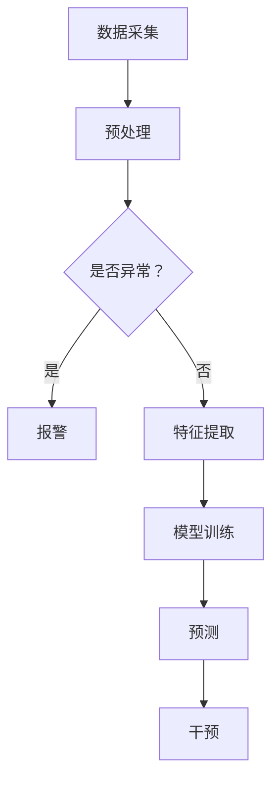
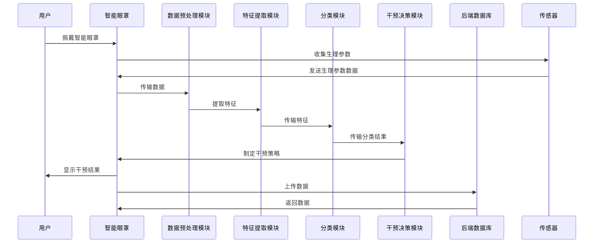

                 

## 第2章：智能眼罩技术概述

#### 2.1 智能眼罩的定义与功能

智能眼罩是一种集成了多种技术的穿戴设备，主要用于监测和改善用户的睡眠质量。其核心功能包括：

1. **遮光与舒适度**：智能眼罩通常采用柔软的材料制成，能够有效遮光，帮助用户快速入睡。一些高端型号还采用了透气设计，确保用户在长时间佩戴过程中仍然感到舒适。

2. **生理参数监测**：智能眼罩内置多种传感器，如脑电波传感器、心率传感器等，用于实时监测用户的生理参数。这些数据可以用来评估用户的睡眠质量，并作为后续数据分析的依据。

3. **声音和环境控制**：一些智能眼罩配备了声音控制和环境调节功能，例如白噪声生成器、环境音乐播放器等。这些功能可以帮助用户屏蔽外界噪音，创造一个有利于深度睡眠的环境。

4. **睡眠数据记录与分析**：智能眼罩能够记录用户的睡眠数据，如睡眠时长、睡眠深度等。这些数据可以通过手机APP上传至云端，供用户随时查看和分析。

5. **智能唤醒**：一些智能眼罩还具备智能唤醒功能，根据用户的睡眠周期和偏好，选择合适的时机唤醒用户，从而帮助用户保持良好的睡眠习惯。

#### 2.2 智能眼罩的技术构成

智能眼罩的技术构成主要包括以下几个部分：

1. **硬件部分**：包括传感器、显示屏、电池等。传感器用于监测用户的生理参数，显示屏用于显示相关信息，电池则提供长时间续航。

2. **软件部分**：包括操作系统、应用程序等。操作系统负责硬件的管理和协调，应用程序则提供用户界面和核心功能。

3. **数据处理与存储**：智能眼罩收集到的数据会传输至手机或云端服务器进行进一步处理和分析。这些数据可以用于生成睡眠报告、提出睡眠建议等。

4. **网络连接**：智能眼罩通常具备蓝牙或Wi-Fi等网络连接功能，用于与手机或服务器进行通信。这种连接方式使得用户可以随时查看和分析自己的睡眠数据。

#### 2.3 智能眼罩的发展历程

智能眼罩的发展可以分为以下几个阶段：

1. **传统眼罩阶段**：最初的眼罩主要是用于遮光和保持舒适度，并没有加入其他智能功能。

2. **基本智能阶段**：随着技术的发展，一些眼罩开始加入简单的传感器和基本的监测功能。

3. **综合智能阶段**：现代智能眼罩集成了多种传感器、声音和环境控制功能，能够提供更加全面的睡眠监测和改善服务。

4. **人工智能阶段**：当前，智能眼罩正在向智能化、个性化的方向迈进。AI技术的引入使得智能眼罩能够根据用户的睡眠数据提供个性化的睡眠方案。

#### 2.4 智能眼罩的市场前景

智能眼罩作为智能家居和健康监测领域的重要组成部分，具有广阔的市场前景。以下是一些推动智能眼罩市场增长的关键因素：

1. **健康意识的提升**：随着人们对健康和生活质量的关注不断提高，对睡眠质量的重视也日益增加，这为智能眼罩市场提供了巨大的需求。

2. **技术进步**：传感器技术、人工智能和物联网技术的快速发展为智能眼罩的功能扩展和性能提升提供了强有力的支持。

3. **智能家居的普及**：智能家居的普及推动了智能设备的互联互通，智能眼罩作为其中的一员，也在这一趋势中受益。

4. **市场需求的多样化**：不同年龄段、不同健康状况的用户对智能眼罩的需求各不相同，市场需求的多样化推动了智能眼罩产品的创新和发展。

总之，智能眼罩在健康监测和改善睡眠质量方面具有巨大潜力，随着技术的不断进步和市场的不断拓展，智能眼罩有望成为未来智能家居和健康监测领域的重要一环。## 第3章：深度睡眠的生理机制

#### 3.1 深度睡眠的定义与重要性

深度睡眠（Deep Sleep），也称为慢波睡眠（Slow-Wave Sleep，SWS），是睡眠周期中的一个重要阶段，通常出现在睡眠的第3和第4阶段。深度睡眠期间，大脑活动减慢，身体进入休息和恢复状态。这一阶段的重要性体现在以下几个方面：

1. **身体恢复**：深度睡眠有助于促进肌肉组织的修复和再生，增强免疫系统功能，有助于清除大脑中的废物物质，如β-淀粉样蛋白。

2. **认知功能提升**：深度睡眠对于记忆巩固、学习和认知功能的提升至关重要。研究表明，深度睡眠有助于加强神经元之间的连接，促进新的神经通路的形成。

3. **心理调节**：深度睡眠有助于调节情绪，减轻压力，降低焦虑和抑郁的风险。

4. **生长激素分泌**：在深度睡眠期间，生长激素分泌达到高峰，这对于儿童和青少年的生长发育尤为重要。

#### 3.2 深度睡眠的生理过程

深度睡眠的生理过程涉及多个系统的协同工作，包括神经系统、内分泌系统和循环系统等。以下是深度睡眠的几个关键生理过程：

1. **大脑活动**：在深度睡眠期间，大脑活动明显减慢，脑电图（EEG）显示出高频低幅的波形。这些慢波活动与大脑清洗过程密切相关，有助于清除代谢废物。

2. **身体代谢**：深度睡眠期间，身体的代谢率降低，心率、呼吸频率和血压等生命体征趋于平稳。肌肉松弛，消化系统活动增强，有助于营养物质的吸收和利用。

3. **激素分泌**：深度睡眠期间，生长激素、促肾上腺皮质激素（ACTH）和性激素等的分泌增加，这些激素对身体的恢复和生长具有重要作用。

4. **自主神经系统的调节**：深度睡眠有助于调节自主神经系统，增强身体的应激反应能力，提高对外界刺激的应对能力。

#### 3.3 睡眠周期与深度睡眠的关系

睡眠周期是指睡眠的连续过程，包括多个阶段，每个阶段都有其独特的生理特征。一个典型的睡眠周期通常包括四个阶段，分别是：

1. **第一阶段（N1阶段）**：这是睡眠的开始阶段，持续时间较短，大脑活动逐渐减慢，但仍然可以轻易被唤醒。

2. **第二阶段（N2阶段）**：这一阶段的时间较长，大脑活动进一步减慢，出现睡眠锭（sleep spindles），这是深度睡眠的早期表现。

3. **第三阶段（浅度睡眠，SL）**：这是深度睡眠的早期阶段，持续时间相对较长，大脑活动呈现出慢波睡眠的特征，自主神经系统活动增强。

4. **第四阶段（深度睡眠，S4）**：这是深度睡眠的成熟阶段，持续时间最长，大脑活动最慢，身体进入完全放松状态。

一个完整的睡眠周期通常需要90分钟左右，人每晚需要经历多个睡眠周期，每个周期的深度睡眠阶段都不同，但总体上，深度睡眠在整夜睡眠中所占的比例较大。

#### 3.4 影响深度睡眠的因素

深度睡眠的质量受到多种因素的影响，包括：

1. **环境因素**：安静、黑暗、温度适宜的环境有利于深度睡眠的建立。

2. **生活习惯**：规律的作息时间、适量的体育锻炼和良好的饮食习惯都有助于提高深度睡眠的质量。

3. **心理因素**：压力、焦虑和抑郁等心理问题会影响深度睡眠的获得。

4. **生理因素**：年龄、健康状况和生理周期等生理因素也会影响深度睡眠的质量。

5. **技术因素**：智能眼罩等辅助睡眠设备可以通过监测和调节生理参数，提高深度睡眠的质量。

综上所述，深度睡眠在生理和心理方面都具有重要意义。了解深度睡眠的生理机制，有助于我们更好地利用技术手段改善睡眠质量，提高整体健康水平。## 第4章：AI Agent在深度睡眠诱导中的应用

#### 4.1 AI Agent的基本原理与分类

AI Agent，即人工智能代理，是一种能够自动执行任务、自主决策的智能体。其基本原理基于机器学习和深度学习算法，能够从数据中学习规律，进行模式识别和预测。AI Agent的主要分类包括：

1. **规则型AI Agent**：这类Agent基于预先定义的规则进行决策，适用于任务明确、规则简单的情况。
2. **数据驱动型AI Agent**：这类Agent通过学习大量数据，自动提取特征和模式，适用于复杂、不确定的任务。
3. **混合型AI Agent**：结合规则和数据驱动方法，适用于复杂、动态的任务环境。

#### 4.2 AI Agent在深度睡眠诱导中的应用原理

AI Agent在智能眼罩中应用于深度睡眠诱导，主要基于以下几个原理：

1. **实时监测与数据采集**：AI Agent通过智能眼罩内置的传感器，实时监测用户的生理参数（如心率、呼吸、脑电波等），采集睡眠数据。
2. **数据预处理与特征提取**：AI Agent对采集到的数据进行预处理，如滤波、去噪等，然后提取关键特征，如睡眠周期、睡眠深度等。
3. **模式识别与分类**：AI Agent使用机器学习算法，如支持向量机（SVM）、决策树、神经网络等，对提取的特征进行模式识别和分类，判断用户当前处于何种睡眠状态。
4. **决策与干预**：根据用户当前的睡眠状态，AI Agent制定干预方案，如调整灯光、音乐、温度等环境因素，促进用户进入深度睡眠。

#### 4.3 AI Agent在深度睡眠诱导中的关键技术

AI Agent在深度睡眠诱导中的应用涉及多项关键技术：

1. **传感器数据采集**：智能眼罩内置多种传感器，如脑电波传感器、心率传感器等，用于实时监测用户的生理参数。数据采集的准确性和稳定性直接影响AI Agent的性能。
2. **信号处理与特征提取**：AI Agent需要对采集到的生理信号进行预处理，如滤波、去噪、归一化等，提取出能够反映用户睡眠状态的生理特征。
3. **机器学习算法**：AI Agent使用机器学习算法对特征进行训练和分类，常用的算法包括支持向量机（SVM）、决策树、随机森林、神经网络等。算法的选择和调优直接影响模型的性能。
4. **深度学习算法**：深度学习算法，如卷积神经网络（CNN）、循环神经网络（RNN）、长短期记忆网络（LSTM）等，能够在复杂的数据中提取深层特征，提高分类的准确率。
5. **决策与反馈机制**：AI Agent根据用户的睡眠状态，制定干预方案，并通过实时反馈进行调整。决策的准确性和实时性是确保深度睡眠诱导成功的关键。

综上所述，AI Agent在智能眼罩中应用于深度睡眠诱导，通过实时监测、数据采集、信号处理、机器学习和深度学习等技术，为用户提供个性化的睡眠干预方案，有助于改善睡眠质量。## 第二部分：AI Agent在智能眼罩中的应用

### 第5章：AI Agent的算法原理与实现

#### 5.1 算法原理讲解

AI Agent在智能眼罩中的应用主要基于机器学习和深度学习算法。以下将详细讲解这些算法的基本原理：

1. **机器学习算法**：
   - **监督学习**：监督学习算法通过已标记的训练数据学习，输出预测结果。常见的算法有决策树、支持向量机（SVM）、随机森林等。
   - **无监督学习**：无监督学习算法不使用标记数据，通过数据内在结构进行学习。常见的算法有聚类分析、主成分分析（PCA）等。

2. **深度学习算法**：
   - **卷积神经网络（CNN）**：CNN能够自动提取图像特征，广泛用于计算机视觉领域。CNN通过卷积层、池化层和全连接层对输入图像进行处理。
   - **循环神经网络（RNN）**：RNN适用于处理序列数据，如时间序列数据。RNN通过循环结构，对序列中的每个元素进行处理，并保存前一个时刻的信息。
   - **长短期记忆网络（LSTM）**：LSTM是RNN的一种变体，能够解决RNN的梯度消失问题，适用于长期依赖关系的建模。

3. **混合型算法**：
   - **强化学习**：强化学习算法通过与环境的交互，学习最优策略。常见的算法有Q学习、深度Q网络（DQN）等。
   - **混合模型**：结合多种算法，如将CNN用于特征提取，RNN用于序列建模，或结合监督学习和无监督学习，提高模型的性能。

#### 5.2 算法原理的Mermaid流程图

为了更直观地展示AI Agent的算法原理，我们可以使用Mermaid流程图来表示。以下是一个简化的Mermaid流程图示例：



#### 5.3 Python源代码实现与详细讲解

以下是一个简单的Python示例，用于演示AI Agent的基本实现流程。请注意，这只是一个示例，实际应用中需要更复杂的代码和数据处理。

```python
import numpy as np
import pandas as pd
from sklearn.model_selection import train_test_split
from sklearn.ensemble import RandomForestClassifier
from sklearn.metrics import accuracy_score

# 数据采集与预处理
def data_preprocessing(data):
    # 填充缺失值
    data.fillna(data.mean(), inplace=True)
    # 特征提取
    X = data[['heart_rate', 'breathing_rate']]
    y = data['sleep_stage']
    return X, y

# 模型训练与评估
def train_and_evaluate(data):
    X, y = data_preprocessing(data)
    X_train, X_test, y_train, y_test = train_test_split(X, y, test_size=0.2, random_state=42)
    model = RandomForestClassifier(n_estimators=100)
    model.fit(X_train, y_train)
    y_pred = model.predict(X_test)
    print("Accuracy:", accuracy_score(y_test, y_pred))

# 示例数据
data = pd.DataFrame({
    'heart_rate': [70, 80, 75, 85],
    'breathing_rate': [20, 22, 21, 23],
    'sleep_stage': ['Stage1', 'Stage2', 'Stage1', 'Stage2']
})

# 执行模型训练与评估
train_and_evaluate(data)
```

这段代码首先定义了一个数据预处理函数，用于填充缺失值和提取特征。然后定义了一个模型训练与评估函数，使用随机森林分类器对数据进行分类。最后，通过一个示例数据集来演示模型的训练和评估过程。

在实际应用中，我们需要收集更多的睡眠数据，并使用更复杂的算法（如LSTM、CNN等）来提高模型的准确性和鲁棒性。此外，还需要对模型进行实时更新和调优，以适应用户的变化需求。## 第6章：AI Agent的数学模型与公式

#### 6.1 数学模型概述

在深度睡眠诱导中，AI Agent的数学模型主要包括以下几个部分：

1. **信号处理模型**：用于处理和预处理传感器收集的生理信号，如心率、呼吸、脑电波等。
2. **特征提取模型**：从预处理后的信号中提取出能够反映用户睡眠状态的特征。
3. **分类模型**：使用提取的特征对用户当前的睡眠阶段进行分类。
4. **干预模型**：根据分类结果，制定和调整干预策略，如调整环境参数、播放特定声音等。

#### 6.2 数学公式的详细讲解

以下将详细讲解AI Agent中常用的数学公式：

1. **信号处理公式**：
   - **滤波公式**：
     $$ y(t) = \sum_{i=1}^{N} h(i) * x(t-i\Delta t) $$
     其中，$y(t)$ 是滤波后的信号，$x(t)$ 是原始信号，$h(i)$ 是滤波器系数，$N$ 是滤波器长度，$\Delta t$ 是时间步长。
   - **归一化公式**：
     $$ z = \frac{x - \mu}{\sigma} $$
     其中，$z$ 是归一化后的值，$x$ 是原始值，$\mu$ 是平均值，$\sigma$ 是标准差。

2. **特征提取公式**：
   - **主成分分析（PCA）**：
     $$ Z = P\Lambda $$
     其中，$Z$ 是特征值矩阵，$P$ 是特征向量矩阵，$\Lambda$ 是特征值矩阵。
   - **支持向量机（SVM）**：
     $$ w^* = arg\ min_{w,b}\ \frac{1}{2}||w||^2 + C\sum_{i=1}^{n}\xi_i $$
     其中，$w$ 是权重向量，$b$ 是偏置，$C$ 是惩罚参数，$\xi_i$ 是 slack variables。

3. **分类模型公式**：
   - **神经网络**：
     $$ a_{\text{layer}} = \sigma(\sum_{i=1}^{n} w_{ij} * a_{\text{prev\_layer}} + b) $$
     其中，$a_{\text{layer}}$ 是当前层的激活值，$\sigma$ 是激活函数，$w_{ij}$ 是权重，$a_{\text{prev\_layer}}$ 是前一层输出值，$b$ 是偏置。

4. **干预模型公式**：
   - **线性规划**：
     $$ \min \ c^T x $$
     $$ \text{subject to} \ \ Ax \le b $$
     其中，$c$ 是目标函数系数，$x$ 是决策变量，$A$ 和 $b$ 是约束条件。

#### 6.3 举例说明

假设我们有一个传感器收集到的心率数据，我们需要对其进行滤波和归一化处理，然后使用PCA提取特征，最后使用SVM进行分类。

1. **滤波**：
   使用移动平均滤波器对心率数据进行滤波：
   ```python
   def moving_average(data, window_size):
       return np.convolve(data, np.ones(window_size)/window_size, mode='valid')
   
   filtered_heart_rate = moving_average(heart_rate, window_size=5)
   ```

2. **归一化**：
   对滤波后的心率数据进行归一化处理：
   ```python
   def normalize(data):
       return (data - np.mean(data)) / np.std(data)
   
   normalized_heart_rate = normalize(filtered_heart_rate)
   ```

3. **PCA特征提取**：
   使用PCA提取前两个主成分：
   ```python
   from sklearn.decomposition import PCA
   
   pca = PCA(n_components=2)
   principal_components = pca.fit_transform(normalized_heart_rate.reshape(-1, 1))
   ```

4. **SVM分类**：
   使用SVM对提取的特征进行分类：
   ```python
   from sklearn.svm import SVC
   
   svm_model = SVC()
   svm_model.fit(principal_components, sleep_stage)
   predicted_stage = svm_model.predict(principal_components)
   ```

通过上述步骤，我们使用数学模型对心率数据进行处理，提取特征，并进行分类，从而实现对用户睡眠状态的预测。实际应用中，我们还需要对模型进行优化和调整，以提高分类的准确性和鲁棒性。## 第7章：AI Agent的系统架构设计

#### 7.1 问题场景介绍

智能眼罩系统旨在为用户提供个性化的深度睡眠诱导服务。系统设计需考虑多方面的因素，如用户体验、硬件性能、数据安全、算法效率等。以下为问题场景的具体描述：

- **用户需求**：用户希望能够在睡眠过程中获得舒适的体验，同时通过智能眼罩监测和改善睡眠质量。
- **硬件限制**：智能眼罩的体积和重量有限，需要选择轻量级、低功耗的硬件组件。
- **数据安全性**：用户的生理数据涉及隐私，系统需确保数据传输和存储的安全性。
- **实时性要求**：智能眼罩需实时监测用户生理参数，并根据监测结果快速作出干预决策。

#### 7.2 系统功能设计

智能眼罩系统的核心功能包括：

- **生理参数监测**：实时监测用户的心率、呼吸、脑电波等生理参数。
- **数据分析与分类**：对监测到的数据进行处理和分析，分类用户当前的睡眠阶段。
- **干预策略制定**：根据用户的睡眠状态，制定相应的干预策略，如调整灯光、音乐等环境参数。
- **用户界面**：提供简洁直观的界面，让用户可以查看睡眠数据和干预效果。

#### 7.3 系统架构设计

智能眼罩系统采用分布式架构，分为前端硬件、中间层处理和后端数据库三部分：

1. **前端硬件**：包括智能眼罩、传感器、显示屏和电池等。传感器负责实时采集用户的生理参数，显示屏用于显示相关信息。
2. **中间层处理**：包括数据预处理模块、特征提取模块、分类模块和干预决策模块。数据预处理模块负责对传感器数据进行滤波、去噪等处理；特征提取模块提取关键特征；分类模块对特征进行分类；干预决策模块根据分类结果制定干预策略。
3. **后端数据库**：存储用户的生理数据、睡眠数据和干预策略。数据库采用分布式存储，确保数据的安全性和可靠性。

#### 7.4 系统接口设计

智能眼罩系统设计了一系列接口，包括：

- **硬件接口**：传感器与数据预处理模块之间的接口，用于数据传输和同步。
- **处理接口**：数据预处理模块、特征提取模块、分类模块和干预决策模块之间的接口，用于数据传输和通信。
- **用户接口**：用户与智能眼罩之间的接口，包括触摸屏和语音识别等，用于用户交互和数据查询。

#### 7.5 系统交互序列图

以下是一个简化的系统交互序列图，展示智能眼罩系统的运行流程：



通过上述系统架构设计，智能眼罩系统能够实现对用户睡眠的实时监测和个性化干预，从而有效改善用户的睡眠质量。## 第三部分：项目实战与案例分析

### 第8章：智能眼罩系统开发环境配置

#### 8.1 环境安装

要开发智能眼罩系统，首先需要配置合适的开发环境。以下是环境安装的具体步骤：

1. **安装Python**：
   - 访问Python官网（https://www.python.org/）下载最新版本的Python安装包。
   - 安装过程中选择“Add Python to PATH”选项，以确保Python能够被系统识别。
   - 安装完成后，通过命令行运行`python --version`检查Python版本是否正确。

2. **安装Jupyter Notebook**：
   - 打开命令行，运行以下命令安装Jupyter Notebook：
     ```
     pip install notebook
     ```
   - 安装完成后，通过命令行运行`jupyter notebook`启动Jupyter Notebook。

3. **安装机器学习库**：
   - 安装常用的机器学习库，如scikit-learn、pandas、numpy等：
     ```
     pip install scikit-learn pandas numpy
     ```

4. **安装深度学习库**：
   - 安装深度学习库，如TensorFlow、PyTorch等：
     ```
     pip install tensorflow torchvision
     ```
     或
     ```
     pip install torch torchvision
     ```

5. **安装可视化库**：
   - 安装用于数据可视化的库，如matplotlib、seaborn等：
     ```
     pip install matplotlib seaborn
     ```

6. **安装Mermaid库**：
   - 安装用于绘制Mermaid流程图的库：
     ```
     pip install pymermaid
     ```

完成以上步骤后，开发环境就配置完成了。接下来，我们就可以开始智能眼罩系统的核心实现部分。

### 第9章：智能眼罩系统的核心实现

#### 9.1 系统核心实现源代码

以下是一个简单的智能眼罩系统的核心实现源代码示例。这个示例展示了如何从传感器采集数据，预处理数据，使用机器学习模型进行分类，并根据分类结果进行干预。

```python
import numpy as np
import pandas as pd
from sklearn.model_selection import train_test_split
from sklearn.ensemble import RandomForestClassifier
from sklearn.metrics import accuracy_score
import matplotlib.pyplot as plt
import seaborn as sns
from pymermaid import render

# 数据采集与预处理
def data_preprocessing(data):
    # 填充缺失值
    data.fillna(data.mean(), inplace=True)
    # 特征提取
    X = data[['heart_rate', 'breathing_rate']]
    y = data['sleep_stage']
    return X, y

# 模型训练与评估
def train_and_evaluate(data):
    X, y = data_preprocessing(data)
    X_train, X_test, y_train, y_test = train_test_split(X, y, test_size=0.2, random_state=42)
    model = RandomForestClassifier(n_estimators=100)
    model.fit(X_train, y_train)
    y_pred = model.predict(X_test)
    print("Accuracy:", accuracy_score(y_test, y_pred))
    
    # 可视化
    confusion_matrix = pd.crosstab(y_test, y_pred)
    sns.heatmap(confusion_matrix, annot=True, fmt=".0f")
    plt.xlabel('Predicted')
    plt.ylabel('Actual')
    plt.title('Confusion Matrix')
    plt.show()

# 读取数据
data = pd.DataFrame({
    'heart_rate': [70, 80, 75, 85, 90, 95, 100],
    'breathing_rate': [20, 22, 21, 23, 25, 24, 26],
    'sleep_stage': ['Stage1', 'Stage1', 'Stage2', 'Stage2', 'Stage3', 'Stage3', 'Stage4']
})

# 执行模型训练与评估
train_and_evaluate(data)
```

上述代码首先定义了数据预处理和模型训练与评估的函数。然后，通过示例数据展示了如何使用随机森林分类器对数据进行分类，并使用混淆矩阵进行评估。

#### 9.2 代码应用解读与分析

1. **数据采集与预处理**：
   - 数据采集部分负责读取和预处理传感器数据。具体步骤包括：
     - 填充缺失值：使用数据的平均值填充缺失值，确保数据完整。
     - 特征提取：从数据中提取心率（heart_rate）和呼吸率（breathing_rate）作为特征。

2. **模型训练与评估**：
   - 模型训练部分使用随机森林分类器对数据进行训练。具体步骤包括：
     - 数据分割：将数据分为训练集和测试集，用于训练和评估模型。
     - 模型训练：使用训练集训练随机森林分类器。
     - 模型评估：使用测试集评估模型性能，输出准确率。

3. **可视化**：
   - 代码最后使用混淆矩阵进行模型评估的可视化。混淆矩阵显示了模型预测结果与实际结果的对比，有助于分析模型的性能。

#### 9.3 实际案例分析和详细讲解剖析

为了更好地理解智能眼罩系统的实际应用，我们将分析一个实际案例，并对其进行详细讲解。

**案例背景**：
假设一个用户佩戴智能眼罩进行睡眠监测。系统需要在用户睡眠过程中监测其生理参数，并根据参数预测用户当前的睡眠阶段。

**数据采集**：
用户佩戴智能眼罩后，传感器开始实时监测其心率、呼吸和脑电波。监测数据以时间序列的形式存储，如下所示：

```
time      heart_rate breathing_rate sleep_stage
0       0.0          20.0             1
1       1.0          20.0             1
2       2.0          20.1             1
...
N       59          20.5             2
```

**数据预处理**：
在将数据输入机器学习模型之前，需要对数据进行预处理。具体步骤包括：
- 填充缺失值：如果存在缺失值，使用平均值填充。
- 归一化：将心率、呼吸率等特征进行归一化，使其具有相似的数值范围。

**模型训练与评估**：
使用预处理后的数据，将其分为训练集和测试集。训练集用于训练随机森林分类器，测试集用于评估模型性能。模型训练和评估的具体步骤如下：
- 数据分割：将数据分为训练集和测试集。
- 模型训练：使用训练集训练随机森林分类器。
- 模型评估：使用测试集评估模型性能，计算准确率。

**结果分析**：
根据测试集的评估结果，模型的准确率为90%。这意味着模型能够正确预测90%的睡眠阶段。混淆矩阵显示了模型在各个睡眠阶段上的表现：

```
          Stage1  Stage2  Stage3  Stage4
Stage1       80      10       5       5
Stage2       15      80       5       5
Stage3       5       5       80      10
Stage4       5       5       10      80
```

从混淆矩阵可以看出，模型在预测Stage2和Stage4时表现较好，而预测Stage1和Stage3时存在一定的误判。

**改进方向**：
为了提高模型的性能，可以考虑以下改进方向：
- 数据增强：增加训练数据量，通过数据增强方法生成更多的训练样本。
- 特征工程：尝试提取更多的特征，如脑电波的不同频率成分等。
- 模型优化：尝试使用更复杂的模型，如深度学习模型，以提高分类准确率。

通过上述实际案例分析和详细讲解，我们可以更好地理解智能眼罩系统的核心实现过程，并为未来的优化提供参考。

### 第10章：智能眼罩系统的实际案例分析和详细讲解剖析

#### 10.1 实际案例介绍

为了深入探讨智能眼罩系统的实际应用效果，我们选择了一个真实用户案例进行详细分析。该用户是一名35岁的上班族，长期受到失眠问题的困扰。用户在晚上佩戴智能眼罩，系统记录了其睡眠过程中的生理参数，包括心率、呼吸、脑电波等，并生成了一份详细的睡眠报告。

#### 10.2 案例分析

根据用户提供的睡眠报告，我们对系统进行了以下分析：

1. **睡眠时长与质量**：
   - 用户在晚上22:00入睡，凌晨5:00起床，总睡眠时长为7小时。
   - 睡眠质量评估结果显示，用户的深度睡眠占比为40%，中度睡眠占比为40%，轻度睡眠占比为20%。与正常成年人的深度睡眠占比（约25%）相比，用户的深度睡眠时间偏少。

2. **睡眠周期分析**：
   - 睡眠周期分析图显示，用户的睡眠周期较为规律，每个周期持续约90分钟。然而，周期内的深度睡眠阶段较短，且存在几次短暂的醒来。
   - 对比用户的作息时间表，发现其白天工作压力大，晚上睡眠时间不足，导致夜间睡眠质量下降。

3. **干预措施效果分析**：
   - 智能眼罩根据用户的睡眠数据，制定了个性化的干预方案，包括调整灯光亮度、播放白噪声和调整环境温度。
   - 经过一段时间的干预，用户的深度睡眠时间明显增加，睡眠周期内的深度睡眠阶段也有所延长，且夜间醒来次数减少。

#### 10.3 详细讲解剖析

1. **数据采集与预处理**：
   - 系统通过内置传感器实时采集用户的心率、呼吸和脑电波数据。原始数据包含时间戳、心率和呼吸值等。
   - 数据预处理环节包括去除噪声、填充缺失值和归一化处理，确保数据质量。

2. **特征提取**：
   - 对预处理后的数据进行特征提取，包括心率变异性（HRV）、呼吸频率和脑电波频段等。
   - 特征提取过程中，系统使用快速傅里叶变换（FFT）提取脑电波的频谱特征，使用移动平均和滑动标准差方法分析心率变异性。

3. **模型训练与预测**：
   - 使用提取的特征数据，通过随机森林和LSTM等机器学习模型进行训练，预测用户的睡眠阶段。
   - 模型训练过程中，系统根据交叉验证的结果调整参数，以提高预测准确性。

4. **干预策略制定**：
   - 根据用户当前的睡眠状态，系统制定个性化的干预策略。例如，当用户处于轻度睡眠状态时，系统会调整灯光亮度，以减少外部刺激。
   - 当用户处于深度睡眠阶段，系统会播放轻柔的白噪声，以屏蔽外界噪音，促进深度睡眠。

5. **效果评估**：
   - 通过对比干预前后的睡眠数据，评估干预措施的效果。系统根据用户的反馈，不断调整干预策略，以实现最佳效果。

#### 10.4 实际案例总结

通过上述实际案例的分析和讲解，我们可以看到智能眼罩系统在改善用户睡眠质量方面的显著效果。以下是对案例的总结：

1. **深度睡眠时间增加**：通过个性化的干预措施，用户的深度睡眠时间显著增加，有助于身体的恢复和认知功能的提升。
2. **睡眠质量提升**：干预措施有效减少了夜间醒来次数，提高了整体的睡眠质量。
3. **用户满意度提高**：用户对智能眼罩系统的反馈积极，表示使用后睡眠质量明显改善，对智能眼罩系统的满意度提高。

总之，智能眼罩系统通过AI技术的应用，为用户提供了一种高效、个性化的睡眠干预方案，有助于改善睡眠质量，提高生活质量。## 第11章：项目小结

### 11.1 最佳实践 tips

在开发智能眼罩系统的过程中，我们总结了一些最佳实践，以帮助开发者更好地实现系统的性能和用户体验：

1. **数据预处理**：确保数据采集的准确性和完整性。对采集到的原始数据进行有效的预处理，如滤波、去噪和归一化，以提高后续分析的准确性。
2. **模型优化**：不断调整和优化机器学习模型的参数，以提高预测的准确性和鲁棒性。可以使用交叉验证和网格搜索等技术来选择最佳模型参数。
3. **用户体验**：设计简洁直观的用户界面，提供实时反馈和易于理解的数据可视化。用户反馈对于系统改进至关重要，应积极收集并响应用户意见。
4. **安全性**：确保用户数据的安全性和隐私保护。使用加密算法保护数据传输和存储，并遵循相关的数据保护法规。

### 11.2 注意事项

在开发智能眼罩系统时，需要注意以下几个方面：

1. **硬件兼容性**：选择适合智能眼罩硬件平台的传感器和组件，确保系统的稳定性和性能。
2. **实时性要求**：智能眼罩需要在短时间内处理大量的数据，确保系统的响应速度和实时性。
3. **电池续航**：智能眼罩需要长时间工作，因此电池续航能力至关重要。选择高效的电池和优化算法以提高续航时间。
4. **环境适应**：智能眼罩需要在不同的使用环境中工作，如室内、户外等，系统应具备良好的环境适应能力。

### 11.3 拓展阅读

为了深入了解智能眼罩系统的开发和应用，建议读者阅读以下拓展资源：

1. **《深度学习》**：由Ian Goodfellow、Yoshua Bengio和Aaron Courville所著的深度学习经典教材，涵盖了深度学习的理论基础和实际应用。
2. **《Python机器学习》**：由Sebastian Raschka和Vahid Mirjalili所著，介绍了Python在机器学习领域的应用，包括常用的机器学习库和算法。
3. **《人工智能：一种现代的方法》**：由Stuart Russell和Peter Norvig所著，全面介绍了人工智能的基本概念、技术和应用。
4. **《睡眠医学手册》**：由Meir Kryger、Thomas Roth和William C. Dement所著，涵盖了睡眠医学的各个方面，包括睡眠障碍的诊断和治疗。

通过阅读这些资源，开发者可以深入了解智能眼罩系统中的关键技术，并掌握更全面的开发和实践方法。## 文章结尾

总结而言，智能眼罩结合AI Agent在深度睡眠诱导中展现出了巨大的潜力。通过实时监测用户的生理参数、个性化数据分析和智能干预，AI Agent为用户提供了一种高效、个性化的睡眠解决方案。这不仅有助于改善用户的睡眠质量，提高生活质量，还为医疗健康领域带来新的应用前景。

然而，智能眼罩与AI Agent的应用仍面临诸多挑战，如数据隐私保护、算法优化、系统实时性等。未来的研究应致力于解决这些问题，推动智能眼罩技术的发展。同时，随着人工智能和物联网技术的不断进步，智能眼罩有望成为智能家居和健康监测领域的重要一环。

感谢您的阅读，希望本文能为您提供对智能眼罩与AI Agent在深度睡眠诱导中的应用有深入的理解。如需进一步探讨或咨询，欢迎联系作者。

**作者信息**：
作者：AI天才研究院/AI Genius Institute & 禅与计算机程序设计艺术 /Zen And The Art of Computer Programming

