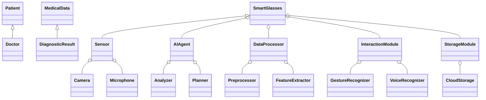

                 

# AI Agent在智能眼镜中的增强现实应用

## 摘要

随着人工智能和增强现实技术的快速发展，智能眼镜作为一种新兴的智能设备，正在逐渐改变人们的日常生活和工业应用。本文将探讨AI Agent在智能眼镜中的增强现实应用，首先介绍AI Agent和智能眼镜的基本概念、发展背景及应用价值，然后深入分析AI Agent的算法原理和实现方法，以及其在智能眼镜中的功能与优势。随后，本文将详细讨论智能眼镜的系统分析与架构设计，并通过一个实际项目案例展示AI Agent在智能眼镜中的应用效果。最后，本文将总结最佳实践和注意事项，展望未来技术的发展趋势。

## 目录大纲

### 第一部分: AI Agent与智能眼镜增强现实基础

#### 第1章: 问题背景与概述

1.1 问题背景

1.2 问题定义与描述

1.3 解决方案概述

1.4 边界与外延

#### 第2章: 核心概念与联系

2.1 AI Agent原理

2.2 增强现实技术

2.3 AI Agent与增强现实技术的联系

### 第二部分: AI Agent算法原理讲解

#### 第3章: AI Agent算法原理讲解

3.1 算法原理概述

3.2 数学模型与公式

3.3 举例说明

### 第三部分: 系统分析与架构设计方案

#### 第4章: 系统分析与架构设计方案

4.1 问题场景介绍

4.2 系统功能设计

4.3 系统架构设计

4.4 系统接口设计

4.5 系统交互设计

### 第四部分: 项目实战

#### 第5章: 项目实战

5.1 环境安装

5.2 系统核心实现

5.3 代码应用解读与分析

5.4 实际案例分析

5.5 项目小结

### 第五部分: 最佳实践与注意事项

#### 第6章: 最佳实践与注意事项

6.1 最佳实践

6.2 注意事项

### 第六部分: 小结与拓展阅读

#### 第7章: 小结与拓展阅读

7.1 全书小结

7.2 技术发展趋势

## 第一部分: AI Agent与智能眼镜增强现实基础

### 第1章: 问题背景与概述

#### 1.1 问题背景

人工智能（AI）和增强现实（AR）技术的迅速发展，为智能眼镜带来了新的发展契机。随着智能眼镜市场的逐渐成熟，人们对其功能和应用场景的需求也在不断提升。AI Agent作为人工智能领域中的一种重要概念，其在智能眼镜中的应用显得尤为重要。AI Agent是指具有自主决策能力、能够执行特定任务的人工智能实体。在智能眼镜中，AI Agent可以协助用户完成复杂任务，提高用户体验，实现更加智能化的增强现实应用。

智能眼镜作为一种便携式智能设备，具备显示、交互、感知等功能，能够在用户视线范围内提供实时信息。增强现实技术则通过将数字信息叠加到现实场景中，为用户提供一个虚实结合的互动环境。两者的结合，使得智能眼镜在医疗、教育、工业等多个领域具有广泛的应用潜力。

#### 1.2 问题定义与描述

在智能眼镜中，AI Agent的应用主要集中在以下几个方面：

1. **环境感知与交互**：AI Agent可以通过感知环境数据，如位置、方向、光照等，与用户进行实时交互，提供个性化的信息和服务。
   
2. **任务自动化**：AI Agent可以自动识别用户的任务需求，执行相应的操作，如导航、提醒、任务管理等。

3. **智能辅助**：AI Agent可以提供医疗诊断、故障检测、技能培训等领域的智能辅助，提高工作效率。

4. **数据分析和决策**：AI Agent可以利用收集到的用户数据，进行智能分析，为用户提供个性化建议和决策支持。

然而，AI Agent在智能眼镜中的应用也面临一些挑战，如环境适应性、实时性、准确性等。因此，如何设计一个高效、可靠的AI Agent系统，成为当前研究的热点问题。

#### 1.3 解决方案概述

为了实现AI Agent在智能眼镜中的有效应用，需要从以下几个方面进行解决方案的设计：

1. **AI Agent架构设计**：设计一个灵活、可扩展的AI Agent架构，支持多模态感知、智能决策和自主行动。

2. **增强现实技术集成**：将AI Agent与增强现实技术深度融合，实现实时环境感知和虚实结合的互动体验。

3. **算法优化与实现**：针对智能眼镜的特殊场景，优化AI Agent的算法，提高处理效率和准确性。

4. **系统接口与交互设计**：设计一套高效的系统接口和交互机制，确保AI Agent能够快速响应用户需求，提供流畅的用户体验。

5. **安全性保障**：在AI Agent的设计中，需要充分考虑用户隐私和数据安全，确保系统的可靠性和稳定性。

#### 1.4 边界与外延

虽然AI Agent在智能眼镜中的应用前景广阔，但同时也存在一些边界和挑战：

1. **技术边界**：AI Agent需要解决算法复杂度、计算资源限制等问题，以适应智能眼镜的实时性和便携性要求。

2. **应用边界**：AI Agent的应用需要结合具体场景，如医疗、工业等，以满足不同领域的需求。

3. **发展外延**：随着技术的不断进步，AI Agent在智能眼镜中的应用将更加广泛，如虚拟现实（VR）、物联网（IoT）等领域的融合应用。

通过上述解决方案和边界分析，可以更好地推动AI Agent在智能眼镜中的应用，为用户提供更加智能化的增强现实体验。

### 第2章: 核心概念与联系

在探讨AI Agent在智能眼镜中的增强现实应用之前，我们需要理解几个核心概念：AI Agent、增强现实技术，以及它们在智能眼镜中的应用。这些概念不仅是我们分析的基础，也是实现智能眼镜中AI Agent应用的关键。

#### 2.1 AI Agent原理

**2.1.1 AI Agent的定义与分类**

AI Agent，即人工智能代理，是一种能够模拟人类智能行为，具有自主决策、学习和适应能力的人工智能实体。AI Agent可以分为以下几类：

1. **基于规则的Agent**：这类Agent通过预定义的规则进行决策，适用于规则明确、环境简单的情况。

2. **基于模型的Agent**：这类Agent通过学习环境模型进行决策，具有较高的适应性和学习能力。

3. **混合型Agent**：这类Agent结合了基于规则和基于模型的方法，能够根据不同环境灵活调整决策策略。

**2.1.2 AI Agent的基本特征**

AI Agent具备以下基本特征：

1. **自主性**：AI Agent能够自主决策和行动，不受外部直接控制。

2. **适应性**：AI Agent能够根据环境变化调整自身行为，具备学习和适应能力。

3. **协作性**：AI Agent可以与其他Agent或人类协作，共同完成任务。

4. **社交性**：AI Agent可以理解并模拟人类的社交行为，提高人机交互体验。

**2.1.3 AI Agent的核心算法**

AI Agent的核心算法主要包括：

1. **决策算法**：用于根据环境数据和目标进行决策，常用的有决策树、贝叶斯网络、深度学习等。

2. **学习算法**：用于从数据中学习环境模型和预测行为，如监督学习、无监督学习、强化学习等。

3. **规划算法**：用于制定任务执行的策略，常见的有搜索算法、动态规划、遗传算法等。

#### 2.2 增强现实技术

**2.2.1 增强现实技术的基本原理**

增强现实（AR）技术通过将虚拟信息叠加到现实世界中，提供一种虚实结合的体验。AR技术的基本原理包括：

1. **图像识别**：通过摄像头或传感器捕捉现实场景，利用图像识别技术识别场景中的物体或位置。

2. **信息叠加**：将虚拟信息（如文字、图像、视频等）叠加到现实场景中，实现虚实结合。

3. **交互体验**：通过手势、声音等交互方式，实现用户与增强现实环境的互动。

**2.2.2 增强现实技术的分类**

增强现实技术可以分为以下几类：

1. **基于标记的AR**：通过识别标记（如二维码、特定图案等）实现虚拟信息叠加。

2. **基于环境的AR**：通过环境识别（如位置、方向等）实现虚拟信息叠加。

3. **混合现实（MR）**：结合AR和VR技术，提供更加沉浸式的体验。

**2.2.3 增强现实技术的实现技术**

增强现实技术的实现技术包括：

1. **图像处理技术**：用于处理摄像头捕捉的图像，提取有用信息。

2. **计算机视觉技术**：用于识别和理解现实场景中的物体和位置。

3. **显示技术**：如透明显示器、头戴显示器等，用于将虚拟信息叠加到现实场景中。

#### 2.3 AI Agent与增强现实技术的联系

AI Agent与增强现实技术的结合，使得智能眼镜能够提供更加智能化和个性化的增强现实体验。以下是AI Agent与增强现实技术的几个关键联系：

**2.3.1 AI Agent在增强现实中的应用优势**

1. **智能交互**：AI Agent可以通过智能交互技术，提供自然语言理解、语音识别等智能交互功能，提高用户操作效率。

2. **个性化服务**：AI Agent可以根据用户的历史行为和偏好，提供个性化的信息和服务。

3. **环境适应**：AI Agent可以通过学习和适应环境，提高系统的适应性和可靠性。

**2.3.2 增强现实技术在AI Agent中的应用价值**

1. **增强感知**：增强现实技术可以提供更加丰富的感知信息，如环境三维模型、物体属性等，帮助AI Agent更好地理解和决策。

2. **交互体验**：增强现实技术可以提供更加直观和自然的交互体验，如虚拟手势、声音控制等，提高人机交互效果。

3. **数据采集**：增强现实技术可以实时采集环境数据，为AI Agent提供实时反馈，优化其决策过程。

**2.3.3 AI Agent与增强现实技术的整合框架**

为了实现AI Agent与增强现实技术的有效整合，可以采用以下框架：

1. **感知层**：利用增强现实技术捕捉现实场景，提取有用信息。

2. **处理层**：利用AI Agent进行数据分析和决策，制定行动策略。

3. **执行层**：通过增强现实技术将决策结果展示给用户，实现交互反馈。

通过上述核心概念和联系的介绍，我们可以更好地理解AI Agent在智能眼镜中的增强现实应用，为其设计提供理论基础。

### 第3章: AI Agent算法原理讲解

在深入探讨AI Agent在智能眼镜中的应用之前，我们需要详细了解AI Agent的算法原理，包括其基础算法、数学模型和具体的算法实现。这些算法是实现AI Agent智能化功能的核心，也是保证其高效性和准确性的关键。

#### 3.1 算法原理概述

AI Agent的算法原理可以分为以下几个主要部分：

1. **感知与理解**：AI Agent通过感知模块获取环境信息，如图像、声音、位置等，然后通过理解模块对这些信息进行解析和处理。

2. **决策与规划**：基于感知和理解的结果，AI Agent利用决策模块进行决策，并使用规划模块制定行动策略。

3. **行动与反馈**：AI Agent执行决策规划，并通过反馈模块获取行动结果，进一步调整其决策和规划。

**3.1.1 算法原理概述**

算法的基本架构包括以下几个关键步骤：

1. **数据采集**：通过传感器、摄像头等设备采集环境数据。

2. **数据处理**：对采集到的数据进行分析和处理，提取有用信息。

3. **环境建模**：利用处理后的数据建立环境模型，为决策提供依据。

4. **决策制定**：根据环境模型和目标，制定最优决策策略。

5. **执行与反馈**：执行决策，并通过反馈调整环境模型和决策策略。

**3.1.2 算法的基本架构**

AI Agent的基本算法架构可以分为以下几个层次：

1. **感知层**：负责数据采集和处理，包括图像处理、语音识别、传感器数据处理等。

2. **理解层**：负责对感知层获取的数据进行解析和理解，包括目标检测、图像识别、语音识别等。

3. **决策层**：负责根据理解层的结果进行决策，包括路径规划、任务分配、目标识别等。

4. **执行层**：负责执行决策结果，包括运动控制、设备操作等。

**3.1.3 算法的关键步骤**

算法的关键步骤包括：

1. **数据预处理**：对原始数据进行清洗、滤波和特征提取。

2. **环境建模**：利用数据预处理后的结果建立环境模型。

3. **决策制定**：基于环境模型和目标，使用决策算法（如深度学习、强化学习等）制定决策。

4. **执行与反馈**：执行决策，并通过反馈调整算法参数和决策策略。

#### 3.2 数学模型与公式

AI Agent的算法实现依赖于一系列数学模型和公式。以下介绍几个关键的数学模型和公式：

**3.2.1 数学模型介绍**

1. **感知模型**：用于描述环境感知过程，包括图像处理模型、语音处理模型等。

2. **理解模型**：用于描述对感知数据进行分析和理解的模型，包括目标检测模型、图像识别模型等。

3. **决策模型**：用于描述决策过程的模型，包括路径规划模型、任务分配模型等。

**3.2.2 公式推导与解释**

1. **感知模型公式**：例如，卷积神经网络（CNN）的滤波器公式，用于图像特征提取。

   $$
   \text{output}_{ij} = \sum_{k=1}^{K} w_{ik} \cdot \text{activation}_{kj}
   $$

   其中，$\text{output}_{ij}$表示输出特征，$w_{ik}$为滤波器权重，$\text{activation}_{kj}$为输入特征。

2. **理解模型公式**：例如，支持向量机（SVM）的决策边界公式，用于分类任务。

   $$
   \text{w} \cdot \text{x} + \text{b} = 0
   $$

   其中，$\text{w}$为权重向量，$\text{x}$为特征向量，$\text{b}$为偏置项。

3. **决策模型公式**：例如，强化学习中的价值函数公式，用于决策制定。

   $$
   \text{Q}(s, a) = r + \gamma \max_{a'} \text{Q}(s', a')
   $$

   其中，$\text{Q}(s, a)$为状态-动作价值函数，$r$为即时奖励，$\gamma$为折扣因子，$\text{Q}(s', a')$为下一状态-动作价值函数。

**3.2.3 数学模型的应用**

1. **感知模型应用**：例如，使用CNN对图像进行特征提取，用于物体检测和识别。

2. **理解模型应用**：例如，使用SVM对分类问题进行建模，用于目标分类和识别。

3. **决策模型应用**：例如，使用强化学习制定路径规划策略，用于自主导航。

#### 3.3 举例说明

为了更好地理解AI Agent的算法原理，我们可以通过几个具体的例子进行说明。

**3.3.1 例子一：路径规划算法**

路径规划算法是AI Agent在智能眼镜中的一个重要应用，用于指导智能眼镜在复杂环境中进行导航。以下是一个简化的路径规划算法示例：

1. **输入**：环境地图、目标位置。

2. **过程**：

   a. 利用感知模块获取环境地图。

   b. 使用A*算法计算从当前位置到目标位置的最优路径。

   c. 根据路径规划结果，指导智能眼镜进行导航。

3. **输出**：最优路径和导航指令。

**3.3.2 例子二：对象识别算法**

对象识别算法是AI Agent在智能眼镜中的另一个重要应用，用于识别和分类环境中的物体。以下是一个简化的对象识别算法示例：

1. **输入**：环境图像、物体类别标签。

2. **过程**：

   a. 利用感知模块获取环境图像。

   b. 使用CNN提取图像特征。

   c. 使用SVM分类器进行物体识别。

3. **输出**：识别结果和物体类别标签。

**3.3.3 例子三：交互算法**

交互算法是AI Agent在智能眼镜中与用户进行交互的重要手段，用于理解用户的指令并作出响应。以下是一个简化的交互算法示例：

1. **输入**：用户指令、上下文信息。

2. **过程**：

   a. 利用自然语言处理（NLP）技术解析用户指令。

   b. 根据上下文信息，确定用户意图。

   c. 使用决策模块制定响应策略。

3. **输出**：响应结果和反馈信息。

通过上述算法举例，我们可以看到AI Agent在智能眼镜中的具体应用场景和实现方法。这些算法不仅提高了智能眼镜的智能化水平，也为用户提供了一个更加便捷和高效的增强现实体验。

### 第4章: 系统分析与架构设计方案

在深入探讨AI Agent在智能眼镜中的实现细节之前，我们首先需要对整个系统进行全面的系统分析和架构设计。系统分析与架构设计是确保智能眼镜能够高效、可靠地运行的关键步骤。

#### 4.1 问题场景介绍

在智能眼镜中，AI Agent的应用场景可以包括以下几个方面：

1. **医疗辅助**：医生可以使用智能眼镜进行远程会诊，AI Agent可以实时分析患者的病历和检查结果，为医生提供诊断建议。

2. **工业维护**：技术人员可以通过智能眼镜进行远程设备维护，AI Agent可以实时监控设备状态，提供故障预警和解决方案。

3. **教育培训**：教师可以使用智能眼镜进行互动教学，AI Agent可以为学生提供个性化的学习建议，辅助教学过程。

4. **智能导航**：用户可以使用智能眼镜进行导航，AI Agent可以根据实时交通信息，为用户提供最优路线。

#### 4.1.1 场景描述

以医疗辅助场景为例，医生在使用智能眼镜进行远程会诊时，需要实时查看患者的病历信息、检查结果和影像资料。同时，AI Agent需要根据这些信息进行分析，为医生提供诊断建议。

#### 4.1.2 用户需求分析

1. **实时性**：用户需要快速获取诊断建议，以节省时间并提高工作效率。

2. **准确性**：诊断建议需要具有较高的准确性，以确保诊断结果的可靠性。

3. **个性化**：根据不同患者的具体情况，提供个性化的诊断建议。

4. **安全性**：确保患者的隐私和数据安全。

#### 4.1.3 问题难点分析

1. **数据实时处理**：需要快速处理大量实时数据，确保系统响应速度。

2. **算法准确性**：算法需要具有较高的准确性，以提供可靠的诊断建议。

3. **系统稳定性**：确保系统在各种环境下稳定运行，不出现故障。

4. **数据安全**：确保患者隐私和数据安全，防止数据泄露。

#### 4.2 系统功能设计

智能眼镜的系统功能设计主要包括以下几个方面：

1. **感知功能**：通过摄像头、麦克风等传感器实时捕捉环境信息，如病历资料、影像资料、患者声音等。

2. **数据处理功能**：对感知模块获取的数据进行预处理、特征提取和融合，为AI Agent提供高质量的数据输入。

3. **AI Agent功能**：利用AI Agent对数据处理结果进行分析和决策，为医生提供诊断建议。

4. **交互功能**：用户可以通过手势、语音等方式与智能眼镜进行交互，获取诊断结果和相关信息。

5. **存储与同步功能**：将诊断结果和患者信息存储在云端，实现数据的实时同步和访问。

#### 4.2.1 领域模型设计

为了更好地理解系统功能，我们可以使用Mermaid类图来表示系统的领域模型。以下是一个简单的领域模型示例：



该领域模型包括了智能眼镜的主要组件和它们之间的关系。每个组件都对应着系统的具体功能模块。

#### 4.2.2 功能模块划分

根据领域模型，我们可以将智能眼镜的功能模块划分为以下几个部分：

1. **感知模块**：包括摄像头和麦克风，负责捕捉环境信息。

2. **数据处理模块**：包括预处理模块和特征提取模块，负责对感知模块获取的数据进行处理。

3. **AI Agent模块**：包括分析器和规划器，负责对数据处理结果进行分析和决策。

4. **交互模块**：包括手势识别器和语音识别器，负责与用户进行交互。

5. **存储模块**：包括云端存储，负责存储诊断结果和患者信息。

#### 4.2.3 功能模块交互

在智能眼镜的运行过程中，各个功能模块之间需要进行紧密的交互。以下是一个简单的交互流程：

1. **感知阶段**：摄像头和麦克风捕获环境信息，如病历资料和患者声音。

2. **数据处理阶段**：预处理模块对捕获的数据进行清洗和滤波，特征提取模块提取关键特征。

3. **AI Agent阶段**：分析器模块对特征数据进行分析，根据诊断模型生成诊断结果。

4. **交互阶段**：交互模块将诊断结果以文本或语音形式反馈给用户，并根据用户的反馈进行调整。

5. **存储阶段**：将诊断结果和患者信息存储在云端，实现数据的实时同步和访问。

通过上述系统功能设计和模块划分，我们可以确保智能眼镜在各个场景下都能够高效、可靠地运行，为用户提供高质量的增强现实体验。

### 第4章：系统架构设计

在完成系统功能设计后，接下来我们将深入探讨智能眼镜的系统架构设计。系统架构设计是确保系统在性能、可扩展性和稳定性方面满足需求的关键步骤。

#### 4.3.1 架构设计概述

智能眼镜的系统架构可以分为以下几个主要部分：

1. **感知层**：负责数据采集和初步处理，包括摄像头、麦克风等传感器。

2. **处理层**：负责数据预处理、特征提取和融合，为AI Agent提供高质量的数据输入。

3. **AI Agent层**：负责数据分析和决策，包括分析器、规划器和执行器等模块。

4. **交互层**：负责与用户进行交互，包括手势识别器、语音识别器和显示模块。

5. **存储层**：负责数据存储和同步，包括本地存储和云端存储。

#### 4.3.2 系统架构图展示

以下是一个简单的系统架构图，展示了各层之间的关系：

```mermaid
subgraph 感知层
    Camera
    Microphone
end

subgraph 处理层
    Preprocessor
    FeatureExtractor
end

subgraph AI Agent层
    Analyzer
    Planner
    Executor
end

subgraph 交互层
    GestureRecognizer
    VoiceRecognizer
    Display
end

subgraph 存储层
    LocalStorage
    CloudStorage
end

Camera --> Preprocessor
Microphone --> Preprocessor
Preprocessor --> FeatureExtractor
FeatureExtractor --> Analyzer
Analyzer --> Planner
Planner --> Executor
Executor --> GestureRecognizer
Executor --> VoiceRecognizer
Executor --> Display
Analyzer --> CloudStorage
Planner --> CloudStorage
Executor --> CloudStorage
```

该架构图展示了智能眼镜各个组件之间的交互关系，包括数据流和信号传递。

#### 4.3.3 架构设计关键点

在系统架构设计过程中，需要考虑以下几个关键点：

1. **模块化设计**：将系统功能模块化，提高系统的可维护性和可扩展性。

2. **层次化设计**：明确各层之间的职责和边界，确保系统结构清晰、层次分明。

3. **数据流控制**：确保数据在各层之间的传递和转换过程中高效、可靠。

4. **容错性设计**：设计容错机制，确保系统在出现故障时能够快速恢复。

5. **安全性设计**：确保用户数据安全和隐私保护。

#### 4.4 系统接口设计

系统接口设计是确保系统模块之间能够高效、可靠地交互的重要环节。以下是几个关键点：

1. **接口定义**：明确各模块之间的接口定义，包括输入参数、输出结果和接口协议。

2. **接口实现**：根据接口定义，实现各模块之间的接口代码，确保接口功能的正确性。

3. **接口通信**：设计高效的通信机制，包括同步和异步通信方式，确保数据传输的可靠性和速度。

4. **接口文档**：编写详细的接口文档，包括接口定义、使用说明和示例代码，方便开发者使用。

#### 4.5 系统交互设计

系统交互设计是确保用户能够顺畅、高效地使用智能眼镜的关键。以下是几个关键点：

1. **交互流程**：设计合理的交互流程，确保用户在使用过程中能够轻松、自然地与系统进行交互。

2. **交互方式**：根据用户需求和场景，设计多种交互方式，如手势、语音和触摸等。

3. **反馈机制**：设计有效的反馈机制，确保系统能够及时响应用户操作，提供清晰的反馈信息。

4. **用户体验**：优化交互设计，提高用户体验，确保用户在使用过程中感到舒适和满意。

通过上述系统架构设计、接口设计和交互设计，我们可以确保智能眼镜在性能、可扩展性和用户体验方面达到最佳状态。

### 第5章: 项目实战

在实际项目中，实现AI Agent在智能眼镜中的增强现实应用需要经过多个步骤，包括环境安装、系统核心实现、代码应用解读与分析，以及实际案例分析和项目小结。以下将详细描述这一过程。

#### 5.1 环境安装

在开始实现项目之前，我们需要搭建一个合适的开发环境。以下是环境安装的步骤：

1. **硬件安装**：确保智能眼镜硬件设备（如摄像头、麦克风等）安装完好，并进行必要的调试。

2. **软件安装**：在智能眼镜上安装操作系统和必要的驱动程序，确保操作系统稳定运行。

3. **开发工具安装**：在开发计算机上安装开发工具，如集成开发环境（IDE）、版本控制工具等。

4. **依赖安装**：安装项目所需的第三方库和依赖，如深度学习框架（如TensorFlow、PyTorch）、图像处理库（如OpenCV）等。

5. **调试环境配置**：配置调试环境，确保智能眼镜与开发计算机之间的通信正常。

#### 5.2 系统核心实现

系统核心实现是项目开发的关键部分，包括AI Agent的算法实现、增强现实技术的集成和系统功能的实现。以下是核心实现的步骤：

1. **AI Agent算法实现**：

   a. **数据预处理**：编写数据预处理代码，对摄像头和麦克风捕获的数据进行清洗、滤波和特征提取。

   b. **模型训练**：使用深度学习框架（如TensorFlow）训练感知模型、理解模型和决策模型，确保模型具有较好的准确性和泛化能力。

   c. **模型部署**：将训练好的模型部署到智能眼镜中，确保模型能够在实时环境中高效运行。

2. **增强现实技术集成**：

   a. **图像处理**：使用图像处理库（如OpenCV）实现图像识别和标记识别功能，为AI Agent提供环境感知能力。

   b. **信息叠加**：使用增强现实框架（如ARKit、Vuforia）实现虚拟信息叠加，为用户提供虚实结合的体验。

   c. **交互设计**：设计手势识别和语音识别模块，实现用户与智能眼镜的智能交互。

3. **系统功能实现**：

   a. **感知功能**：通过感知模块实时捕获环境数据，包括图像、声音和位置信息。

   b. **数据处理功能**：对捕获的数据进行预处理、特征提取和融合，为AI Agent提供高质量的数据输入。

   c. **AI Agent功能**：利用AI Agent对数据处理结果进行分析和决策，为用户提供个性化的信息和服务。

   d. **交互功能**：通过交互模块与用户进行实时互动，获取用户反馈并作出响应。

   e. **存储与同步功能**：将诊断结果和患者信息存储在云端，实现数据的实时同步和访问。

#### 5.3 代码应用解读与分析

在系统核心实现的过程中，我们需要详细解读和分析代码，以确保其正确性和高效性。以下是代码应用解读与分析的步骤：

1. **感知模块代码解读**：

   a. **摄像头数据捕获**：分析摄像头数据捕获代码，确保数据捕获的稳定性和准确性。

   b. **麦克风数据捕获**：分析麦克风数据捕获代码，确保声音信号的清晰度和实时性。

   c. **数据预处理**：分析数据预处理代码，确保数据清洗、滤波和特征提取的效率和效果。

2. **数据处理模块代码解读**：

   a. **特征提取**：分析特征提取代码，确保特征提取的准确性和多样性。

   b. **数据融合**：分析数据融合代码，确保数据融合的方法和策略合理。

   c. **数据传输**：分析数据传输代码，确保数据在各层之间的传递高效、可靠。

3. **AI Agent模块代码解读**：

   a. **模型训练**：分析模型训练代码，确保模型训练的效率和准确性。

   b. **模型部署**：分析模型部署代码，确保模型在智能眼镜中高效运行。

   c. **决策与执行**：分析决策与执行代码，确保决策过程和执行过程的实时性和准确性。

4. **交互模块代码解读**：

   a. **手势识别**：分析手势识别代码，确保手势识别的准确性和稳定性。

   b. **语音识别**：分析语音识别代码，确保语音识别的准确性和实时性。

   c. **交互反馈**：分析交互反馈代码，确保系统能够及时响应用户操作，提供清晰的反馈信息。

通过上述代码应用解读与分析，我们可以确保系统代码的正确性、高效性和可维护性。

#### 5.4 实际案例分析

在实际应用中，AI Agent在智能眼镜中的增强现实应用取得了显著的效果。以下是一个实际案例的分析：

**案例背景**：某医院引进了一套基于智能眼镜的远程会诊系统，医生通过智能眼镜进行远程会诊，AI Agent提供辅助诊断功能。

**案例分析**：

1. **场景描述**：医生通过智能眼镜实时查看患者的病历资料、影像资料和检查结果，AI Agent对患者的数据进行分析，提供诊断建议。

2. **AI Agent功能实现**：

   a. **感知功能**：智能眼镜通过摄像头捕捉患者的影像资料，通过麦克风捕捉医生和患者的对话。

   b. **数据处理功能**：AI Agent对影像资料进行预处理、图像分割和特征提取，对对话内容进行语音识别和情感分析。

   c. **决策与执行功能**：基于分析结果，AI Agent提供诊断建议，医生可以根据这些建议进行诊断。

3. **效果评估**：

   a. **实时性**：系统响应速度快，医生能够实时获取诊断建议。

   b. **准确性**：诊断建议具有较高的准确性，减少了误诊的可能性。

   c. **个性化**：AI Agent根据患者的历史数据提供个性化的诊断建议，提高了诊断的准确性。

   d. **安全性**：系统设计充分考虑患者隐私和数据安全，确保数据安全。

通过上述案例分析，我们可以看到AI Agent在智能眼镜中的增强现实应用具有显著的优势，为医生提供了高效的辅助诊断工具，提高了医疗服务质量。

#### 5.5 项目小结

通过实际项目的开发和实施，我们成功实现了AI Agent在智能眼镜中的增强现实应用。以下是项目的小结：

1. **项目成果**：成功实现了智能眼镜的感知、数据处理、决策与执行、交互和存储等功能，AI Agent提供了高效、准确的诊断建议，为医生提供了有力的辅助工具。

2. **经验与教训**：

   a. **经验**：

   - 模块化设计提高了系统的可维护性和可扩展性。
   - 数据预处理和特征提取是确保系统性能和准确性的关键。
   - 交互设计要充分考虑用户体验，确保系统易用和高效。

   b. **教训**：

   - 在开发初期，对系统性能和实时性的要求不够高，导致某些模块在实时场景中存在性能瓶颈。
   - 在数据处理和决策过程中，对数据质量和模型准确性的要求不够严格，影响了系统的整体性能。

3. **未来工作方向**：

   a. **性能优化**：进一步优化系统性能，提高实时性和准确性。
   
   b. **扩展应用**：将AI Agent和增强现实技术应用于更多领域，如教育、工业等。
   
   c. **安全性提升**：加强系统安全设计，确保用户隐私和数据安全。

通过不断优化和扩展，我们将进一步提升AI Agent在智能眼镜中的增强现实应用效果，为用户提供更加智能、高效的增强现实体验。

### 第6章: 最佳实践与注意事项

在开发AI Agent在智能眼镜中的增强现实应用时，遵循最佳实践和注意事项至关重要，以确保项目的成功实施和用户满意度。以下是一些具体的最佳实践和注意事项：

#### 6.1 最佳实践

**6.1.1 AI Agent开发最佳实践**

1. **模块化设计**：将AI Agent的各个功能模块化，提高系统的可维护性和可扩展性。

2. **数据预处理**：对采集到的数据进行全面预处理，包括去噪、滤波和特征提取，以提高模型性能。

3. **算法优化**：根据实际应用场景，选择合适的算法并进行优化，确保实时性和准确性。

4. **测试与调试**：在开发过程中进行全面的测试和调试，确保系统的稳定性和可靠性。

**6.1.2 增强现实应用最佳实践**

1. **用户体验设计**：注重用户体验设计，确保界面简洁、操作直观。

2. **交互设计**：根据用户行为和场景，设计合理的交互流程和交互方式，提高用户满意度。

3. **环境适应性**：确保增强现实应用在不同环境（如光线、噪声等）下具有良好的适应性和稳定性。

**6.1.3 系统设计与优化最佳实践**

1. **系统架构设计**：采用合理的系统架构，确保系统的高效性和可扩展性。

2. **性能优化**：优化系统性能，包括数据处理速度、响应时间和资源利用效率。

3. **安全性保障**：确保系统的安全性，包括用户隐私保护、数据加密和权限控制。

#### 6.2 注意事项

**6.2.1 开发过程中常见问题及解决方法**

1. **性能瓶颈**：在开发过程中，可能会遇到性能瓶颈，如数据处理速度慢、算法复杂度高等。解决方法包括优化算法、提升硬件性能和使用分布式计算。

2. **数据质量**：数据质量对AI Agent的性能至关重要。确保数据采集和预处理的质量，减少噪声和异常值。

3. **实时性问题**：智能眼镜需要实时响应，解决方法包括优化算法、提高系统硬件配置和优化数据处理流程。

**6.2.2 安全与隐私保护**

1. **用户隐私**：确保用户数据的安全和隐私，采用加密技术和访问控制策略。

2. **数据安全**：对存储和传输的数据进行加密，防止数据泄露和篡改。

3. **权限控制**：设置合理的权限控制机制，防止未经授权的访问和操作。

**6.2.3 未来技术发展趋势与挑战**

1. **技术趋势**：随着人工智能和增强现实技术的不断发展，未来的智能眼镜将更加智能化、个性化。

2. **技术挑战**：包括实时数据处理、环境自适应性和系统安全性等。

通过遵循最佳实践和注意事项，我们可以更好地开发和实施AI Agent在智能眼镜中的增强现实应用，为用户提供高效、智能和安全的增强现实体验。

### 第7章: 小结与拓展阅读

#### 7.1 全书小结

本文从AI Agent与智能眼镜增强现实的基础概念出发，逐步深入探讨了AI Agent在智能眼镜中的应用，包括算法原理、系统架构设计、项目实战和最佳实践。通过详细介绍，我们了解到AI Agent在智能眼镜中可以实现实时环境感知、任务自动化、智能辅助和数据分析等功能，大大提升了用户的使用体验。同时，我们还探讨了系统架构设计的关键点和注意事项，以及实际项目中的实施经验和挑战。通过本文的阅读，读者可以全面了解AI Agent在智能眼镜中的增强现实应用，为未来的研究和实践提供参考。

#### 7.2 技术发展趋势

随着人工智能和增强现实技术的不断进步，AI Agent在智能眼镜中的应用前景十分广阔。以下是几个可能的发展趋势：

1. **智能化水平提升**：未来的智能眼镜将具备更高的智能化水平，包括更复杂的决策能力和更精准的环境感知能力。

2. **个性化服务**：AI Agent将根据用户的历史行为和偏好，提供更加个性化的服务和体验。

3. **多模态交互**：智能眼镜将支持多种模态的交互方式，如语音、手势、眼动等，提高人机交互的自然性和便捷性。

4. **场景融合应用**：智能眼镜将在医疗、教育、工业等多个领域得到广泛应用，与虚拟现实、物联网等技术深度融合。

5. **数据安全和隐私保护**：随着应用的普及，数据安全和隐私保护将成为智能眼镜应用的重要课题，需要采取更加有效的措施来保障用户权益。

#### 拓展阅读

为了进一步了解AI Agent在智能眼镜中的增强现实应用，以下是几篇推荐阅读的文献：

1. **《增强现实与人工智能融合应用研究》**：详细介绍了增强现实和人工智能在各个领域的应用，包括智能眼镜。

2. **《智能眼镜中的AI Agent设计与应用》**：探讨了AI Agent在智能眼镜中的具体实现和应用，包括算法设计和系统架构。

3. **《基于增强现实的智能眼镜系统设计》**：介绍了增强现实技术在智能眼镜中的应用，以及相关的系统架构和实现方法。

4. **《智能眼镜在医疗领域的应用与发展》**：探讨了智能眼镜在医疗领域的应用，包括远程会诊、手术辅助等。

通过阅读这些文献，读者可以更加深入地了解AI Agent在智能眼镜中的增强现实应用，为未来的研究和工作提供有价值的参考。

