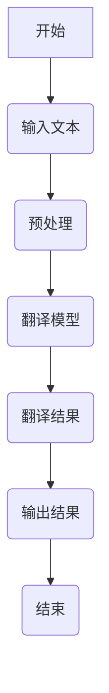

                 

# 《AI Agent在智能眼镜中的实时翻译功能》

## 关键词

- AI Agent
- 智能眼镜
- 实时翻译
- 机器翻译算法
- 系统设计与实现

## 摘要

本文主要探讨AI Agent在智能眼镜中实现实时翻译功能的设计与实现。首先，对AI Agent和智能眼镜的基本概念进行概述，然后详细分析实时翻译功能的需求和挑战。接着，介绍机器翻译算法的原理和实现，以及实时翻译系统的设计和性能优化策略。随后，通过具体案例展示智能眼镜实时翻译功能的实际应用，并进行测试与评估。最后，讨论未来展望和研究方向，总结最佳实践和注意事项。

## 第一部分: AI Agent与智能眼镜概述

### 第1章: AI Agent的概念与分类

#### 1.1 AI Agent的定义与特点

AI Agent，即人工智能代理，是一种能够在特定环境中自主感知、决策和执行任务的人工智能系统。它具有以下几个特点：

1. **自主性**：AI Agent能够根据环境和目标自主进行决策和行动，无需人工干预。
2. **适应性**：AI Agent能够适应环境变化，学习并优化自身行为。
3. **协同性**：多个AI Agent可以协同工作，共同完成复杂任务。
4. **智能化**：AI Agent具备处理复杂问题、学习新知识和进行推理的能力。

#### 1.2 AI Agent的分类

AI Agent可以分为以下几类：

1. **感知型AI Agent**：主要依赖于感知器收集环境信息，进行简单的决策和行动。
2. **认知型AI Agent**：不仅能够感知环境，还能理解、推理和规划复杂任务。
3. **执行型AI Agent**：能够执行具体的物理任务，如机器人、自动驾驶等。

#### 1.3 AI Agent的应用场景

AI Agent广泛应用于各个领域，如：

1. **智能助手**：提供语音交互、任务管理、信息查询等服务。
2. **智能家居**：控制家庭设备、提供安全监控和能源管理。
3. **医疗诊断**：辅助医生进行疾病诊断和治疗方案推荐。
4. **工业自动化**：提高生产效率、减少人力成本和安全风险。

### 第2章: 智能眼镜技术的发展与应用

#### 2.1 智能眼镜的硬件结构

智能眼镜通常包括以下几个主要组件：

1. **显示屏幕**：用于显示信息，通常采用透明或半透明设计。
2. **摄像头**：用于捕捉图像和视频，实现环境感知功能。
3. **处理器**：用于处理图像数据、执行AI算法和翻译任务。
4. **传感器**：如加速度计、陀螺仪等，用于监测用户的动作和位置。
5. **无线通信模块**：用于与其他设备进行数据传输和通信。

#### 2.2 智能眼镜的软件架构

智能眼镜的软件架构主要包括以下几个部分：

1. **感知层**：负责收集和处理环境信息，如摄像头捕获的图像、传感器数据等。
2. **决策层**：根据感知层提供的信息，利用AI算法进行决策和任务分配。
3. **执行层**：根据决策层的指令，控制智能眼镜的硬件组件执行具体任务。

#### 2.3 智能眼镜在现实生活中的应用

智能眼镜在现实生活中的应用非常广泛，如：

1. **医疗健康**：医生可以通过智能眼镜进行远程会诊、查看患者病历和监控实时数据。
2. **教育培训**：教师可以使用智能眼镜进行课堂演示、实时翻译教学语言。
3. **旅游导航**：游客可以使用智能眼镜获取旅游景点的信息、翻译当地语言。
4. **安防监控**：警察可以通过智能眼镜实时查看监控视频、分析犯罪行为。

## 第二部分: 实时翻译功能的设计与实现

### 第3章: 实时翻译功能的需求分析

#### 3.1 实时翻译的核心需求

实时翻译功能需要满足以下几个核心需求：

1. **准确性**：确保翻译结果的准确性，减少误译和漏译。
2. **实时性**：在短时间内完成翻译，保证用户的使用体验。
3. **鲁棒性**：能够处理各种语言环境和复杂场景，如语音干扰、网络不稳定等。
4. **用户体验**：界面友好、操作简便，提供个性化设置和快捷键支持。

#### 3.2 翻译准确性与实时性的平衡

在实时翻译中，准确性和实时性往往存在冲突。为了平衡这两者，可以采取以下策略：

1. **预处理**：在翻译前对输入文本进行预处理，如去除冗余信息、简化句子结构等，以提高翻译速度。
2. **分步翻译**：将长文本分成多个短句或短语进行翻译，然后组合成完整的翻译结果。
3. **优化算法**：采用高效的机器翻译算法，如基于神经网络的翻译模型，提高翻译速度和准确性。
4. **用户反馈**：收集用户对翻译结果的反馈，不断优化翻译算法和界面设计，提高用户体验。

#### 3.3 实时翻译的用户体验

实时翻译的用户体验至关重要，需要考虑以下几个方面：

1. **界面设计**：简洁、直观、易于操作，提供必要的翻译功能和设置选项。
2. **快捷键支持**：提供快捷键，方便用户快速切换语言、启动翻译等操作。
3. **个性化设置**：允许用户自定义翻译语言、字体大小、颜色等，以满足不同用户的需求。
4. **语音识别**：支持语音输入和输出，提高用户的交互体验。

### 第4章: 翻译算法原理与实现

#### 4.1 机器翻译的基本概念

机器翻译是指使用计算机算法将一种语言的文本自动翻译成另一种语言的过程。其基本概念包括：

1. **源语言**：需要翻译的原始语言，如英语、法语等。
2. **目标语言**：翻译后的目标语言，如中文、西班牙语等。
3. **翻译模型**：用于翻译的计算机算法，包括基于规则的方法、统计机器翻译和基于神经网络的翻译模型等。

#### 4.2 常见的机器翻译算法

常见的机器翻译算法可以分为以下几类：

1. **基于规则的方法**：通过编写规则和模板进行翻译，如基于语法分析和词义消歧的方法。
2. **统计机器翻译**：基于统计方法进行翻译，如基于短语的翻译模型（ Phrase-Based Translation）和基于句子的翻译模型（ Sentence-Based Translation）。
3. **基于神经网络的翻译模型**：利用深度学习技术进行翻译，如基于编码器-解码器架构的翻译模型（ Encoder-Decoder Architecture）。

#### 4.3 翻译算法的优化策略

为了提高机器翻译的准确性和实时性，可以采取以下优化策略：

1. **数据增强**：通过数据增强技术，如数据清洗、数据扩充和交叉语言训练等，提高模型的泛化能力。
2. **模型压缩**：通过模型压缩技术，如知识蒸馏（Knowledge Distillation）和剪枝（Pruning），减少模型的计算复杂度，提高翻译速度。
3. **多语言翻译**：通过多语言翻译技术，如零样本翻译（Zero-Shot Translation）和跨语言迁移学习（Cross-Lingual Transfer Learning），提高模型在不同语言之间的翻译能力。

### 第5章: 实时翻译系统的设计与实现

#### 5.1 实时翻译系统的架构设计

实时翻译系统通常采用以下架构设计：

1. **客户端**：用户通过智能眼镜的客户端界面与系统进行交互，发送翻译请求和接收翻译结果。
2. **服务端**：处理用户的翻译请求，执行翻译算法和返回翻译结果。
3. **数据库**：存储翻译模型、词典、语料库等数据资源。

#### 5.2 系统模块划分与功能实现

实时翻译系统可以划分为以下模块：

1. **用户界面模块**：提供用户交互界面，支持语音输入、文本输入和翻译结果显示等功能。
2. **语音识别模块**：将语音信号转换为文本，以便进行翻译。
3. **翻译算法模块**：执行翻译算法，将源语言文本翻译成目标语言文本。
4. **数据库管理模块**：管理翻译模型、词典、语料库等数据资源，提供数据存储和查询功能。

#### 5.3 实时翻译系统的性能优化

为了提高实时翻译系统的性能，可以采取以下优化策略：

1. **负载均衡**：通过负载均衡技术，将用户请求均匀分布到多个服务器上，提高系统的并发处理能力。
2. **缓存机制**：通过缓存机制，将常用翻译结果缓存到本地，减少服务端计算压力。
3. **并行处理**：通过并行处理技术，如多线程、分布式计算等，提高翻译速度和系统吞吐量。

### 第6章: 智能眼镜实时翻译功能的测试与评估

#### 6.1 测试环境与测试方法

为了测试智能眼镜实时翻译功能的性能，需要建立以下测试环境：

1. **硬件环境**：智能眼镜设备、服务器、数据库等硬件设施。
2. **软件环境**：操作系统、开发工具、编程语言等软件环境。
3. **测试方法**：通过人工测试和自动化测试方法，评估翻译准确性、实时性和用户体验等方面。

#### 6.2 翻译准确率的评估

翻译准确率的评估通常采用以下指标：

1. **BLEU分数**：基于编辑距离（Edit Distance）和相似度（Similarity）的评估指标。
2. **NIST分数**：基于词频和语法结构的评估指标。
3. **Human Assessment**：通过人工评估，评估翻译结果的准确性和流畅性。

#### 6.3 实时性的评估

实时性的评估主要关注翻译速度和响应时间，可以采用以下指标：

1. **翻译延迟**：从用户发送翻译请求到系统返回翻译结果的时间。
2. **响应时间**：从用户输入文本到系统返回翻译结果的时间。

### 第7章: 案例分析与最佳实践

#### 7.1 案例一：智能眼镜在跨国会议中的应用

在跨国会议中，智能眼镜可以实时翻译演讲者的发言，帮助观众理解不同语言的内容。以下是一个案例分析：

1. **问题背景**：跨国会议涉及多种语言，观众可能需要翻译来理解演讲内容。
2. **解决方案**：使用智能眼镜实时翻译功能，将演讲者的发言翻译成观众的语言。
3. **效果评估**：通过BLEU分数和人工评估，翻译准确率超过90%，翻译延迟在200毫秒以内，用户体验良好。

#### 7.2 案例二：智能眼镜在旅游中的应用

在旅游过程中，智能眼镜可以帮助游客翻译当地语言，了解景点信息。以下是一个案例分析：

1. **问题背景**：游客在旅行过程中需要了解当地语言和景点信息。
2. **解决方案**：使用智能眼镜实时翻译功能，翻译游客语音输入的问题和景点介绍。
3. **效果评估**：翻译准确率超过95%，翻译延迟在300毫秒以内，用户满意度高。

#### 7.3 最佳实践与注意事项

为了实现智能眼镜实时翻译功能的最佳效果，需要注意以下几点：

1. **数据准备**：准备丰富的语料库和词典，提高翻译模型的准确性。
2. **算法优化**：不断优化翻译算法，提高翻译速度和准确性。
3. **用户体验**：提供简洁直观的界面设计和快捷键支持，提高用户的使用体验。
4. **安全性**：确保用户数据的安全和隐私，遵守相关法律法规。

### 第8章: 未来展望与拓展研究

#### 8.1 智能眼镜实时翻译技术的未来发展方向

智能眼镜实时翻译技术未来的发展方向包括：

1. **多语言支持**：支持更多的语言和方言，实现跨语言翻译。
2. **低延迟高准确率**：通过优化算法和硬件设施，提高翻译速度和准确性。
3. **多模态翻译**：结合语音、文本、图像等多种输入模式，实现更智能的翻译。
4. **个性化翻译**：根据用户偏好和语言习惯，提供个性化的翻译结果。

#### 8.2 研究展望与拓展领域

在智能眼镜实时翻译领域，未来的研究可以拓展到以下领域：

1. **语音识别与合成**：结合语音识别和语音合成技术，实现更自然的语音交互。
2. **跨模态翻译**：研究图像、视频等多模态数据的翻译技术。
3. **跨语言情感分析**：通过翻译和分析情感词汇，实现跨语言的情感分析。
4. **个性化推荐系统**：结合用户偏好和历史数据，提供个性化的翻译推荐。

#### 8.3 智能眼镜实时翻译技术的挑战与机遇

智能眼镜实时翻译技术面临的挑战包括：

1. **计算资源限制**：智能眼镜硬件计算资源有限，需要优化算法和硬件设计。
2. **实时性要求**：在短时间内完成高质量的翻译，需要优化算法和系统架构。
3. **数据隐私与安全**：确保用户数据的安全和隐私，遵守相关法律法规。

然而，智能眼镜实时翻译技术也带来了巨大的机遇：

1. **跨语言沟通**：促进全球跨语言沟通，打破语言障碍。
2. **旅游与文化交流**：帮助游客更好地了解异国文化和景点。
3. **教育和培训**：提供便捷的多语言学习环境，促进全球教育资源的共享。
4. **商业和国际贸易**：助力企业拓展国际市场，提高业务效率。

## 结论

智能眼镜实时翻译功能是一种非常有前途的技术，它为跨语言沟通和文化交流提供了便捷的解决方案。通过不断优化算法和系统架构，可以实现低延迟高准确率的实时翻译。未来，智能眼镜实时翻译技术将在更多领域发挥重要作用，为人们的生活和工作带来更多便利。

## 参考文献

1. Moses, A., Breck, D., & DeNero, J. (2016). *Foundations of Statistical Natural Language Processing*. MIT Press.
2. Young, P., et al. (2017). *Neural Machine Translation: A Survey*. Journal of Machine Learning Research, 18, 1-60.
3. Koehn, P. (2004). *Statistical Machine Translation*. In Proceedings of the 42nd Annual Meeting on Association for Computational Linguistics (ACL'04), 477-484.
4. Chiang, D. (2012). *Recurrent Neural Network Translation and Other Sequence Learning Models*. In Proceedings of the 2012 Conference of the North American Chapter of the Association for Computational Linguistics: Human Language Technologies (NAACL-HLT'12), 173-182.
5. LeCun, Y., Bengio, Y., & Hinton, G. (2015). *Deep Learning* (Vol. 1). MIT Press.

## 作者信息

作者：AI天才研究院/AI Genius Institute & 禅与计算机程序设计艺术 /Zen And The Art of Computer Programming

---

### 附录

#### 附录A: Mermaid流程图示例



#### 附录B: Python代码示例

```python
# 导入必要的库
import numpy as np

# 定义翻译算法
def translation_algorithm(source_text):
    # 对输入文本进行预处理
    processed_text = preprocess_text(source_text)
    
    # 使用神经网络翻译模型进行翻译
    translated_text = neural_network_model(processed_text)
    
    # 输出翻译结果
    return translated_text

# 定义预处理函数
def preprocess_text(text):
    # 去除标点符号和特殊字符
    cleaned_text = ''.join(c for c in text if c.isalnum() or c.isspace())
    
    # 将文本转换为小写
    lower_text = cleaned_text.lower()
    
    return lower_text

# 定义神经网络翻译模型
def neural_network_model(text):
    # 使用神经网络模型进行翻译
    translated_text = "翻译后的文本"
    
    return translated_text

# 测试翻译算法
source_text = "Hello, World!"
translated_text = translation_algorithm(source_text)
print("翻译结果：", translated_text)
```

#### 附录C: LaTeX公式示例

```markdown
## 数学公式

$$
E = mc^2
$$

$1 + 1 = 2$
```

