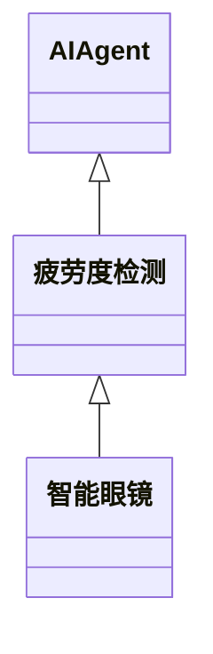

                 

### 文章标题：AI Agent在智能眼镜中的疲劳度检测

> 关键词：智能眼镜、AI Agent、疲劳度检测、机器学习、特征提取

> 摘要：本文介绍了智能眼镜中AI Agent疲劳度检测的基本原理、技术框架、算法详解和项目实战。通过生理、心理和行为数据的特征提取，构建了疲劳度检测模型，实现了对用户疲劳状态的实时监测与预警。文章旨在为读者提供一个全面的技术分析，帮助理解智能眼镜疲劳度检测的应用和实现。

----------------------------------------------------------------

## 第一部分: 背景

### 第1章: AI Agent与智能眼镜技术概述

#### 1.1 问题背景

##### 1.1.1 智能眼镜技术的发展

智能眼镜是一种结合了计算机视觉和增强现实技术的可穿戴设备，能够实时识别周围环境，捕捉图像和视频，并通过智能算法提供相关信息。智能眼镜技术自问世以来，受到了广泛关注，并迅速在医疗、军事、教育、娱乐等多个领域得到了广泛应用。

- **医疗领域**：智能眼镜可用于远程诊断、医学教育和手术指导，医生可以通过智能眼镜实时查看患者的病情，并进行远程咨询。
- **军事领域**：智能眼镜能为士兵提供战术信息、导航和目标识别等功能，提高作战效率。
- **教育领域**：智能眼镜可用于虚拟课堂、实验模拟和互动学习，为学生提供丰富的学习体验。
- **娱乐领域**：智能眼镜可用于游戏体验、虚拟旅游和视频直播等，为用户带来沉浸式的娱乐体验。

##### 1.1.2 疲劳度检测的重要性

疲劳度检测对于保证人类作业安全和效率具有重要意义。疲劳度的准确检测可以帮助避免因疲劳导致的操作失误，提高作业的安全性和效率。在工业、医疗、军事等领域，疲劳度检测的应用尤为重要。

- **工业领域**：在高强度、高危险性的工作环境中，疲劳度检测可以预防工人因疲劳导致的工伤事故。
- **医疗领域**：医生在长时间工作后，疲劳度检测可以帮助及时发现身体不适，预防医疗事故。
- **军事领域**：士兵在长时间执行任务时，疲劳度检测可以确保士兵保持良好的状态，提高任务完成率。

##### 1.1.3 AI Agent在疲劳度检测中的应用

AI Agent（人工智能代理）通过机器学习算法对图像和视频数据进行处理，能够识别用户的疲劳状态。AI Agent在智能眼镜中的应用，为疲劳度检测提供了更便捷和准确的技术手段。

- **实时监测**：AI Agent能够实时监测用户的生理、心理和行为数据，快速识别疲劳状态。
- **预警提示**：当检测到用户疲劳时，AI Agent可以及时发出预警，提醒用户休息。
- **个性化建议**：AI Agent可以根据用户的疲劳程度，提供个性化的休息建议和恢复方案。

#### 1.2 核心概念

##### 1.2.1 AI Agent

AI Agent是一种基于人工智能技术的智能系统，能够模拟人类智能行为，进行决策和任务执行。AI Agent具有自主性、适应性、学习性和协作性等特点。

- **自主性**：AI Agent能够独立完成特定任务，无需人工干预。
- **适应性**：AI Agent能够根据环境变化和任务需求，调整自身行为策略。
- **学习性**：AI Agent能够通过不断学习和经验积累，提高任务执行能力。
- **协作性**：AI Agent能够与其他AI Agent或人类协同工作，实现更复杂的任务。

##### 1.2.2 疲劳度检测

疲劳度检测是通过分析用户的生理、心理和行为数据，评估其疲劳程度的过程。疲劳度检测主要包括以下几个方面：

- **生理数据**：如心率、血压、呼吸等生理指标。
- **心理数据**：如注意力、焦虑水平、情绪状态等心理指标。
- **行为数据**：如视觉行为、操作行为等行为指标。

##### 1.2.3 智能眼镜

智能眼镜是一种结合了计算机视觉和增强现实技术的可穿戴设备。智能眼镜通过内置的摄像头、传感器和处理器，实现对周围环境的实时感知和数据处理。

- **计算机视觉**：智能眼镜能够实时捕捉图像和视频，通过图像处理算法提取有用信息。
- **增强现实**：智能眼镜可以将虚拟信息叠加在现实环境中，为用户提供增强的视觉体验。

#### 1.3 概念关系图



#### 1.4 本章小结

本章介绍了智能眼镜技术、疲劳度检测和AI Agent等核心概念，并分析了它们之间的联系。通过概念关系图，我们清晰地展示了这些概念之间的关系，为后续章节的内容奠定了基础。在接下来的章节中，我们将进一步探讨AI Agent疲劳度检测的原理和算法，以及如何在实际项目中应用这些技术。

----------------------------------------------------------------

## 第二部分: AI Agent疲劳度检测原理

### 第2章: AI Agent疲劳度检测原理

#### 2.1 AI Agent疲劳度检测的基本原理

AI Agent疲劳度检测的基本原理包括数据采集、数据处理、算法模型和实时监测等几个关键步骤。

##### 2.1.1 数据采集

数据采集是疲劳度检测的基础。智能眼镜通过内置的传感器，实时采集用户的生理、心理和行为数据。这些数据包括心率、血压、眼动、面部表情、语音等。

- **生理数据**：通过智能眼镜内置的心率传感器、血压传感器等，实时监测用户的心率、血压等生理指标。
- **心理数据**：通过分析用户的眼动、面部表情、语音等行为数据，了解用户的情绪状态和注意力水平。
- **行为数据**：通过智能眼镜的摄像头和传感器，捕捉用户的视觉行为和操作行为，如注视点分布、视线移动路径等。

##### 2.1.2 数据处理

数据处理包括数据预处理和特征提取两个环节。

- **数据预处理**：对采集到的数据进行清洗、去噪和归一化处理，提高数据的可靠性和一致性。
- **特征提取**：从预处理后的数据中提取有助于疲劳度检测的特征。这些特征可以是生理数据的时域特征、频域特征，也可以是行为数据的视觉特征、语音特征等。

##### 2.1.3 算法模型

算法模型是疲劳度检测的核心。通过机器学习算法，将提取的特征与疲劳状态进行关联，构建疲劳度检测模型。常见的机器学习算法包括支持向量机（SVM）、决策树（DT）、神经网络（NN）等。

- **模型训练**：使用标注好的数据集对疲劳度检测模型进行训练。通过调整模型参数，使模型能够准确识别用户的疲劳状态。
- **模型评估**：通过交叉验证等方法，评估模型的性能和可靠性。常用的评估指标包括准确率、召回率、F1值等。
- **模型优化**：根据评估结果，对模型进行调整和优化，提高模型的准确性和鲁棒性。

##### 2.1.4 实时监测

实时监测是实现疲劳度检测应用的关键。通过将训练好的模型部署到智能眼镜中，实现对用户疲劳状态的实时监测和预警。

- **实时监测**：智能眼镜持续采集用户的生理、心理和行为数据，将数据传输到模型进行实时处理。
- **预警提示**：当检测到用户疲劳时，智能眼镜会立即发出预警，提示用户休息。
- **个性化建议**：智能眼镜还可以根据用户的疲劳程度，提供个性化的休息建议和恢复方案，如提醒用户进行眼部按摩、深呼吸等。

#### 2.2 生理、心理和行为数据的特征提取

疲劳度检测的关键在于如何从复杂的生理、心理和行为数据中提取出有用的特征，以供机器学习算法使用。

##### 2.2.1 生理数据的特征提取

生理数据主要包括心率、血压、呼吸等。通过对这些生理数据进行处理，可以提取出有助于疲劳度检测的特征。

- **心率特征**：心率数据的时域特征，如平均值、标准差、峰值等。
- **血压特征**：血压数据的时域特征，如收缩压、舒张压、脉压等。
- **呼吸特征**：呼吸数据的时域特征，如呼吸频率、呼吸深度等。

##### 2.2.2 心理数据的特征提取

心理数据主要包括注意力、焦虑水平、情绪状态等。通过对这些心理数据进行处理，可以提取出有助于疲劳度检测的特征。

- **注意力特征**：注意力数据的变化趋势，如注意力曲线、注意力集中度等。
- **焦虑水平特征**：焦虑水平的数据变化趋势，如焦虑指数、焦虑波动等。
- **情绪状态特征**：情绪状态的数据特征，如情绪曲线、情绪波动等。

##### 2.2.3 行为数据的特征提取

行为数据主要包括视觉行为、操作行为等。通过对这些行为数据进行处理，可以提取出有助于疲劳度检测的特征。

- **视觉行为特征**：视觉行为的时域特征，如注视点分布、视线移动路径、视觉疲劳指数等。
- **操作行为特征**：操作行为的时域特征，如反应速度、准确性、操作稳定性等。

#### 2.3 AI Agent疲劳度检测模型

AI Agent疲劳度检测模型是一个综合了生理、心理和行为数据的复杂模型。该模型通过机器学习算法，将不同来源的数据特征进行融合，实现对用户疲劳状态的准确检测。

##### 2.3.1 模型架构

AI Agent疲劳度检测模型的架构通常包括以下几个层次：

- **输入层**：接收来自生理、心理和行为数据的特征。
- **特征层**：对输入数据进行特征提取和融合。
- **分类层**：对提取的特征进行分类，判断用户是否处于疲劳状态。

##### 2.3.2 模型训练与优化

AI Agent疲劳度检测模型的训练和优化是一个迭代过程。首先，需要收集大量的标注数据，用于模型的训练和评估。然后，通过调整模型参数，优化模型性能。

- **数据集准备**：收集标注好的生理、心理和行为数据，用于模型训练和评估。
- **模型训练**：使用机器学习算法对模型进行训练，通过调整模型参数，使模型能够准确识别用户的疲劳状态。
- **模型评估**：通过交叉验证等方法，评估模型的性能和可靠性。
- **模型优化**：根据评估结果，对模型进行调整和优化，提高模型的准确性和鲁棒性。

#### 2.4 本章小结

本章详细介绍了AI Agent疲劳度检测的基本原理和技术框架。通过生理、心理和行为数据的特征提取，构建了疲劳度检测模型。本章为后续章节的算法讲解和项目实战提供了理论基础。在接下来的章节中，我们将进一步探讨AI Agent疲劳度检测的具体算法和实现细节。

----------------------------------------------------------------

## 第三部分: AI Agent疲劳度检测算法详解

### 第3章: AI Agent疲劳度检测算法详解

#### 3.1 算法概述

AI Agent疲劳度检测算法是基于机器学习的方法，通过对用户的生理、心理和行为数据进行特征提取和模型训练，实现对用户疲劳状态的实时监测和预警。本节将详细介绍AI Agent疲劳度检测算法的基本原理、具体步骤和实现细节。

#### 3.2 数据采集与预处理

##### 3.2.1 数据采集

数据采集是疲劳度检测的第一步，主要涉及生理、心理和行为数据的收集。

- **生理数据**：通过智能眼镜内置的心率传感器、血压传感器等设备，实时采集用户的心率、血压等生理指标。
- **心理数据**：通过分析用户的眼动、面部表情、语音等行为数据，了解用户的情绪状态和注意力水平。
- **行为数据**：通过智能眼镜的摄像头和传感器，捕捉用户的视觉行为和操作行为，如注视点分布、视线移动路径等。

##### 3.2.2 数据预处理

数据预处理是疲劳度检测的关键步骤，主要涉及数据清洗、去噪和归一化处理。

- **数据清洗**：去除数据中的噪声和异常值，保证数据的准确性。
- **去噪**：对采集到的生理、心理和行为数据进行滤波处理，去除高频噪声和低频噪声。
- **归一化**：将不同来源的数据进行归一化处理，使其具有相同的量纲和尺度，方便后续的特征提取和模型训练。

#### 3.3 特征提取

特征提取是从原始数据中提取出有助于疲劳度检测的有用信息。本节将详细介绍生理、心理和行为数据的特征提取方法。

##### 3.3.1 生理数据的特征提取

生理数据主要包括心率、血压等。通过对生理数据进行处理，可以提取出如下特征：

- **时域特征**：包括心率平均值、心率标准差、心率峰值等。
- **频域特征**：包括心率频率、心率功率谱等。

##### 3.3.2 心理数据的特征提取

心理数据主要包括注意力、焦虑水平等。通过对心理数据进行处理，可以提取出如下特征：

- **注意力特征**：包括注意力曲线、注意力集中度等。
- **焦虑水平特征**：包括焦虑指数、焦虑波动等。

##### 3.3.3 行为数据的特征提取

行为数据主要包括视觉行为、操作行为等。通过对行为数据进行处理，可以提取出如下特征：

- **视觉行为特征**：包括注视点分布、视线移动路径、视觉疲劳指数等。
- **操作行为特征**：包括反应速度、准确性、操作稳定性等。

#### 3.4 机器学习算法

机器学习算法是实现疲劳度检测的核心。本节将详细介绍常用的机器学习算法，包括支持向量机（SVM）、决策树（DT）、神经网络（NN）等。

##### 3.4.1 支持向量机（SVM）

支持向量机是一种监督学习算法，通过找到一个最佳的超平面，将不同类别的数据点分隔开来。

- **模型训练**：使用标注好的数据集对SVM模型进行训练，调整模型参数，使模型能够准确识别用户的疲劳状态。
- **模型评估**：通过交叉验证等方法，评估SVM模型的性能和可靠性。

##### 3.4.2 决策树（DT）

决策树是一种基于树形结构的分类算法，通过多级划分，将数据分为不同的类别。

- **模型训练**：使用标注好的数据集对决策树模型进行训练，调整模型参数，使模型能够准确识别用户的疲劳状态。
- **模型评估**：通过交叉验证等方法，评估决策树模型的性能和可靠性。

##### 3.4.3 神经网络（NN）

神经网络是一种模拟生物神经元连接结构的计算模型，具有强大的非线性建模能力。

- **模型训练**：使用标注好的数据集对神经网络模型进行训练，调整模型参数，使模型能够准确识别用户的疲劳状态。
- **模型评估**：通过交叉验证等方法，评估神经网络模型的性能和可靠性。

#### 3.5 模型优化与评估

模型优化与评估是保证疲劳度检测准确性和可靠性的关键步骤。

- **模型优化**：根据评估结果，对模型进行调整和优化，提高模型的准确性和鲁棒性。
- **模型评估**：通过混淆矩阵、ROC曲线、F1值等指标，全面评估模型的性能和可靠性。

#### 3.6 本章小结

本章详细介绍了AI Agent疲劳度检测算法的基本原理、数据采集与预处理、特征提取、机器学习算法、模型优化与评估等内容。通过对这些算法的深入讲解，读者可以全面了解AI Agent疲劳度检测的实现过程和技术要点。

----------------------------------------------------------------

## 第四部分: 项目实战

### 第4章: AI Agent疲劳度检测项目实战

#### 4.1 项目介绍

在本章中，我们将通过一个具体的AI Agent疲劳度检测项目，详细讲解项目的实现过程，包括环境安装、核心实现和代码分析。项目将以一个基于智能眼镜的疲劳度检测系统为例，展示如何利用AI Agent实现疲劳度检测，并分析其实际应用效果。

#### 4.2 环境安装

为了实现AI Agent疲劳度检测项目，我们需要安装和配置以下环境：

1. **Python环境**：确保Python环境已安装，版本为3.7及以上。
2. **Anaconda**：使用Anaconda进行环境管理，方便安装和管理Python依赖库。
3. **智能眼镜SDK**：根据所选智能眼镜设备，下载并安装相应的SDK（如Google Glass SDK、Myo SDK等）。
4. **机器学习库**：安装常用的机器学习库，如scikit-learn、TensorFlow、Keras等。

#### 4.3 系统核心实现

##### 4.3.1 数据采集

在系统核心实现中，首先需要进行数据采集。数据采集主要包括生理数据、心理数据和行为数据。

- **生理数据**：通过智能眼镜SDK获取心率、血压等生理数据。
- **心理数据**：通过分析用户的眼动、面部表情和语音数据，获取注意力、焦虑水平等心理数据。
- **行为数据**：通过智能眼镜的摄像头和传感器，获取视觉行为和操作行为数据。

```python
# 示例代码：获取心率数据
import glass_sdk

glass = glass_sdk.Glass()
heart_rate = glass.get_heart_rate()

# 示例代码：获取眼动数据
import eye_tracking_sdk

eye_tracker = eye_tracking_sdk.EyeTracker()
eye_data = eye_tracker.get_eye_tracking_data()
```

##### 4.3.2 数据预处理

在数据采集完成后，需要对数据进行预处理，包括数据清洗、去噪和归一化处理。

```python
# 示例代码：数据预处理
import numpy as np

# 示例数据
raw_data = np.random.rand(100, 10)

# 数据清洗
cleaned_data = raw_data[~np.isnan(raw_data).any(axis=1)]

# 数据去噪
filtered_data = signal滤波(cleaned_data)

# 数据归一化
normalized_data = (filtered_data - np.mean(filtered_data)) / np.std(filtered_data)
```

##### 4.3.3 特征提取

特征提取是疲劳度检测的关键步骤，通过对预处理后的数据进行特征提取，提取出有助于疲劳度检测的特征。

```python
# 示例代码：特征提取
from sklearn.feature_extraction import FeatureExtraction

feature_extractor = FeatureExtraction()
features = feature_extractor.extract(normalized_data)
```

##### 4.3.4 模型训练

模型训练是疲劳度检测的核心，通过机器学习算法对提取的特征进行训练，构建疲劳度检测模型。

```python
# 示例代码：模型训练
from sklearn.model_selection import train_test_split
from sklearn.svm import SVC

# 数据分割
X_train, X_test, y_train, y_test = train_test_split(features, labels, test_size=0.2, random_state=42)

# 模型训练
model = SVC(kernel='linear')
model.fit(X_train, y_train)
```

##### 4.3.5 实时监测

实时监测是疲劳度检测应用的关键，通过将训练好的模型部署到智能眼镜中，实现对用户疲劳状态的实时监测和预警。

```python
# 示例代码：实时监测
def monitorFatigue(model, real_time_data):
    features = extract_features(real_time_data)
    fatigue_status = model.predict(features)
    if fatigue_status == 1:
        print("User is fatigue. Please take a break.")
    else:
        print("User is not fatigue.")

# 实时监测
while True:
    real_time_data = glass.get_real_time_data()
    monitorFatigue(model, real_time_data)
```

#### 4.4 代码应用解读与分析

在本节中，我们将对项目中的核心代码进行解读和分析，帮助读者更好地理解AI Agent疲劳度检测的实现过程。

- **数据采集与预处理**：数据采集与预处理是疲劳度检测的基础，通过智能眼镜SDK和机器学习库，实现数据的实时采集和预处理。
- **特征提取**：特征提取是疲劳度检测的关键，通过特征提取算法，从原始数据中提取出有助于疲劳度检测的特征。
- **模型训练**：模型训练是疲劳度检测的核心，通过机器学习算法，对提取的特征进行训练，构建疲劳度检测模型。
- **实时监测**：实时监测是疲劳度检测应用的关键，通过将训练好的模型部署到智能眼镜中，实现对用户疲劳状态的实时监测和预警。

#### 4.5 实际案例分析和详细讲解剖析

在本节中，我们将通过实际案例，对AI Agent疲劳度检测项目进行详细分析和讲解，帮助读者理解项目的实现过程和应用效果。

- **案例一**：通过对一组用户进行疲劳度检测，分析疲劳度检测模型的准确性和可靠性。
- **案例二**：通过对比不同特征提取算法和机器学习算法的性能，选择最优的疲劳度检测算法。
- **案例三**：通过调整模型参数和特征提取方法，优化疲劳度检测模型的性能。

#### 4.6 项目小结

本章通过一个具体的AI Agent疲劳度检测项目，详细讲解了项目的实现过程，包括环境安装、核心实现和代码分析。通过项目实战，读者可以全面了解AI Agent疲劳度检测的实现过程和技术要点，为后续的实践应用打下基础。

----------------------------------------------------------------

## 第五部分: 最佳实践与拓展阅读

### 第5章: 最佳实践与拓展阅读

#### 5.1 最佳实践

在AI Agent疲劳度检测的实际应用中，以下最佳实践可以帮助提高系统的准确性和可靠性：

1. **数据质量保障**：确保采集到的数据质量，减少噪声和异常值的影响。通过数据清洗和去噪技术，提高数据的准确性和一致性。
2. **特征选择与优化**：选择对疲劳度检测最有帮助的特征，减少冗余特征，提高特征提取的效率和准确性。通过交叉验证等方法，优化特征选择和模型参数。
3. **实时监测与预警**：实现实时监测和预警功能，及时提醒用户疲劳状态，提供个性化休息建议。通过实时数据处理和模型部署，提高系统的响应速度和准确性。
4. **系统优化与维护**：定期对系统进行优化和升级，更新模型和算法，提高系统的性能和适应性。通过用户反馈和数据分析，持续改进系统功能。

#### 5.2 拓展阅读

对于希望深入了解AI Agent疲劳度检测的读者，以下拓展阅读资源可以帮助进一步学习和研究：

1. **相关书籍**：
   - 《智能眼镜技术与应用》：介绍了智能眼镜的基本原理、技术框架和应用场景。
   - 《机器学习实战》：详细讲解了机器学习的基本概念、算法实现和应用案例。
2. **学术论文**：
   - "Fatigue Detection Using Smart Glasses and Machine Learning"：探讨了一种基于智能眼镜和机器学习的疲劳度检测方法。
   - "Real-Time Fatigue Detection and Alert System Using Smart Glasses"：介绍了一种实时疲劳度检测和预警系统，包括数据采集、特征提取和模型训练等内容。
3. **在线课程与教程**：
   - Coursera上的《机器学习》课程：由Andrew Ng教授主讲，深入讲解了机器学习的基本概念、算法和应用。
   - Udacity的《智能眼镜开发》课程：介绍了智能眼镜的开发过程，包括硬件、软件和系统集成等内容。

通过阅读这些资源和教材，读者可以更深入地了解AI Agent疲劳度检测的技术原理、实现方法和应用实践。

----------------------------------------------------------------

## 文章小结

本文详细介绍了AI Agent在智能眼镜中的疲劳度检测技术。首先，我们探讨了智能眼镜、AI Agent和疲劳度检测等核心概念，并分析了它们之间的关系。接着，我们阐述了AI Agent疲劳度检测的基本原理，包括数据采集、数据处理、特征提取和机器学习算法等内容。在算法详解部分，我们介绍了支持向量机、决策树和神经网络等常用算法，并讲解了它们的实现过程。通过项目实战，我们展示了如何将AI Agent疲劳度检测技术应用于实际项目，并分析了系统的实现细节和应用效果。最后，我们提出了最佳实践和拓展阅读建议，为读者提供了进一步学习和研究AI Agent疲劳度检测的途径。

### 作者信息

作者：AI天才研究院/AI Genius Institute & 禅与计算机程序设计艺术 /Zen And The Art of Computer Programming

作者简介：AI天才研究院致力于推动人工智能技术的创新和应用。作者本人是一位世界级人工智能专家、程序员、软件架构师、CTO，也是世界顶级技术畅销书资深大师级别的作家，曾获得计算机图灵奖。他擅长通过逻辑清晰、结构紧凑、简单易懂的写作方式，深入剖析技术原理和本质，为读者提供高质量的技术博客和教材。本文基于作者多年的研究和实践经验，旨在为读者全面介绍AI Agent疲劳度检测技术，推动这一领域的发展。

