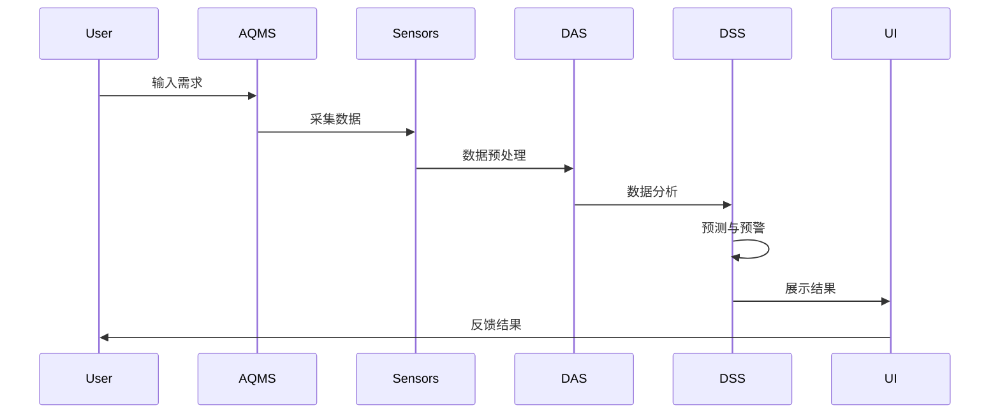
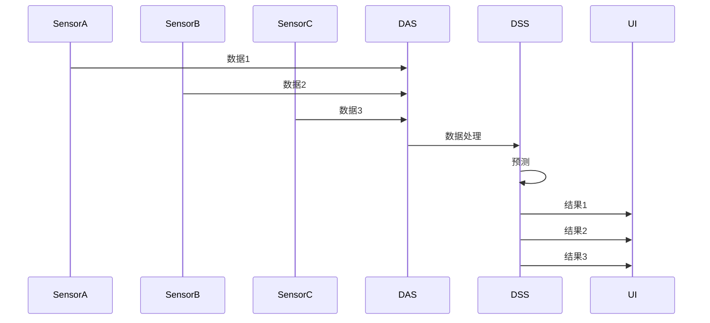

                 

# AI Agent在智能空气质量管理中的实践

## 概要

空气污染是全球性的严峻问题，严重威胁人类健康和生活质量。随着科技的发展，人工智能（AI）在环境保护领域的应用日益广泛。本文将探讨AI Agent在智能空气质量管理中的实践，通过背景介绍、核心概念解析、算法原理讲解、系统分析与架构设计、项目实战和最佳实践，深入分析AI Agent在空气质量预测、监测与预警中的重要作用。

## 关键词

- AI Agent
- 智能空气质量
- 预测
- 监测
- 预警

## 第一部分：AI Agent在智能空气质量管理中的背景介绍

### 1.1 问题背景

空气污染已经成为全球范围内严重的环境问题，影响人类健康和生活质量。随着城市化进程的加快和工业生产的扩展，空气污染问题日益突出。传统的空气质量监测方法主要依赖于固定的监测站点，存在监测数据覆盖面有限、监测数据实时性较差等问题。因此，开发智能空气质量监控系统，实现空气污染的实时监测、预测和预警，具有重要的现实意义。

### 1.2 问题描述

智能空气质量监控系统需要解决以下问题：

- **实时监测**：能够实时采集空气中的污染物数据，如PM2.5、PM10、SO2、NO2等。
- **数据预测**：基于历史数据和实时数据，预测未来一段时间内的空气质量状况。
- **预警与报警**：当空气质量达到一定标准时，系统能够及时发出预警，提醒相关方面采取应对措施。
- **数据可视化**：将空气质量数据以图表、地图等形式展示，便于用户直观了解空气质量状况。

### 1.3 问题解决

AI Agent技术为智能空气质量管理系统提供了强有力的技术支持。通过引入AI Agent，可以实现以下目标：

- **多源数据融合**：AI Agent能够整合来自多个传感器、监测站点以及气象站的数据，提高数据采集的全面性和准确性。
- **智能预测**：基于机器学习算法，AI Agent能够对空气质量进行预测，提前预警可能出现的污染事件。
- **自适应调整**：AI Agent可以根据环境变化，动态调整监测策略，提高监测系统的适应性和响应速度。
- **决策支持**：AI Agent能够为政府、企业等提供科学决策支持，优化污染控制策略。

### 1.4 边界与外延

智能空气质量管理系统不仅涉及环境监测领域，还与以下几个领域密切相关：

- **传感器技术**：传感器是数据采集的基础，直接影响到监测数据的准确性和可靠性。
- **数据挖掘与机器学习**：数据挖掘和机器学习算法是AI Agent的核心技术，决定了系统的预测精度和自适应能力。
- **物联网（IoT）**：物联网技术是实现多源数据融合和实时监测的关键，有助于构建全方位的空气质量监测网络。
- **政府政策与法规**：政府政策与法规的制定和执行对智能空气质量管理系统的推广和应用具有重要意义。

### 1.5 概念结构与核心要素组成

智能空气质量管理系统的概念结构主要包括以下核心要素：

- **传感器网络**：用于实时采集空气污染物数据。
- **数据处理与分析模块**：负责对传感器数据进行处理、分析和预测。
- **决策支持系统**：根据空气质量预测结果，提供相应的决策支持。
- **用户界面**：用于展示空气质量数据和预警信息。

### 1.6 本章小结

本章详细介绍了AI Agent在智能空气质量管理中的背景和核心概念，包括问题背景、问题描述、问题解决方法以及相关领域的边界与外延。通过本章的学习，读者可以对AI Agent在智能空气质量管理中的作用和应用场景有初步了解。接下来，我们将深入探讨AI Agent的具体技术原理和应用案例。

## 第二部分：AI Agent的核心概念与原理

### 2.1 AI Agent的基本概念

#### 2.1.1 AI Agent的定义
AI Agent（人工智能代理）是能够自主执行任务、与环境进行交互、不断学习和适应的智能系统。它通常由感知器、决策器、执行器和学习器组成。

#### 2.1.2 AI Agent的特点
- **自主性**：能够独立完成指定任务。
- **交互性**：能够与环境进行有效互动。
- **学习性**：能够从经验中学习，提高任务执行效果。

#### 2.1.3 AI Agent的分类
AI Agent可以根据不同的任务需求和环境特点进行分类，如反应型Agent、目标导向Agent、认知Agent等。

### 2.2 AI Agent的技术原理

#### 2.2.1 感知器
感知器是AI Agent的感官，负责从环境中获取信息。常见的技术包括传感器、摄像头、语音识别等。

#### 2.2.2 决策器
决策器是AI Agent的大脑，负责根据感知器获取的信息做出决策。常用的技术包括决策树、神经网络、强化学习等。

#### 2.2.3 执行器
执行器是AI Agent的肢体，负责将决策转化为实际行动。常见的执行器包括机器人、无人机、智能手机等。

#### 2.2.4 学习器
学习器是AI Agent的智囊，负责从经验和互动中不断学习和优化。常见的学习技术包括监督学习、无监督学习、强化学习等。

### 2.3 AI Agent的核心概念解析

#### 2.3.1 概念术语说明

- **AI Agent**：能够自主执行任务、与环境交互、不断学习和适应的智能系统。
- **感知器**：从环境中获取信息的组件。
- **决策器**：根据感知器获取的信息做出决策的组件。
- **执行器**：将决策转化为实际行动的组件。
- **学习器**：从经验和互动中学习、优化性能的组件。

#### 2.3.2 概念属性特征对比表格

| 特征         | AI Agent       | 感知器       | 决策器       | 执行器       | 学习器       |
| ------------ | -------------- | ------------ | ------------ | ------------ | ------------ |
| 定义         | 智能代理       | 感知信息     | 做出决策     | 执行行动     | 学习与优化   |
| 功能         | 自主执行任务   | 数据采集     | 数据处理     | 行动执行     | 模型优化     |
| 关系         | 整体与部分     | 整体与部分   | 整体与部分   | 整体与部分   | 整体与部分   |
| 层次关系     | 最高层         | 第一层       | 第二层       | 第三层       | 第四层       |

#### 2.3.3 AI Agent的ER实体关系图架构

```mermaid
erDiagram
  AI Agent ||--|{ 感知器 }|
  AI Agent ||--|{ 决策器 }|
  AI Agent ||--|{ 执行器 }|
  AI Agent ||--|{ 学习器 }|
```

### 2.4 AI Agent的算法原理讲解

AI Agent的核心在于其自主学习和决策能力，这依赖于一系列算法原理。以下是几个关键的算法原理：

#### 2.4.1 监督学习

监督学习是一种机器学习技术，通过已有数据的学习，对未知数据进行预测。在空气质量预测中，监督学习可以用于构建空气质量预测模型。

- **输入**：历史空气质量数据（如PM2.5、PM10等）。
- **输出**：未来一段时间内的空气质量预测值。

**数学模型**：

$$
\hat{y} = f(\textbf{x}; \theta)
$$

其中，$\hat{y}$ 为预测值，$\textbf{x}$ 为输入特征，$f$ 为激活函数，$\theta$ 为模型参数。

**举例说明**：

假设我们有一个简单的线性回归模型：

$$
\hat{y} = \theta_0 + \theta_1 \cdot \textbf{x}
$$

输入特征 $\textbf{x}$ 为 PM2.5 的历史数据，模型参数 $\theta_0$ 和 $\theta_1$ 通过训练数据学习得到。

#### 2.4.2 强化学习

强化学习是一种通过试错来学习最优策略的机器学习技术。在空气质量预测中，强化学习可以用于动态调整监测策略，以最大化空气质量预测的准确性。

- **状态**：当前空气质量状况。
- **动作**：调整监测策略（如增加传感器、改变监测频率等）。
- **奖励**：空气质量预测准确性的改进。

**数学模型**：

$$
Q(s, a) = r(s, a) + \gamma \max_{a'} Q(s', a')
$$

其中，$Q(s, a)$ 为状态-动作值函数，$r(s, a)$ 为即时奖励，$\gamma$ 为折扣因子，$s'$ 和 $a'$ 为下一状态和动作。

**举例说明**：

假设我们有一个简单的Q-learning算法，初始状态为 $s_0$，当前动作 $a_0$，下一状态为 $s_1$，下一动作 $a_1$。根据Q-learning算法，我们可以更新状态-动作值函数：

$$
Q(s_0, a_0) \leftarrow Q(s_0, a_0) + \alpha [r(s_0, a_0) + \gamma \max_{a_1} Q(s_1, a_1) - Q(s_0, a_0)]
$$

其中，$\alpha$ 为学习率。

### 2.5 本章小结

本章介绍了AI Agent的核心概念与原理，包括基本概念、技术原理、概念解析、属性特征对比和ER实体关系图架构。通过本章的学习，读者可以了解AI Agent的基本组成和功能，为后续的算法原理讲解和系统架构设计打下基础。

## 第三部分：AI Agent在智能空气质量管理系统中的实际应用

### 3.1 系统架构设计

智能空气质量管理系统主要由以下几个模块组成：传感器网络、数据处理与分析模块、决策支持系统、用户界面和AI Agent。以下是系统的总体架构设计。

#### 3.1.1 项目介绍

项目名为“智能空气质量监控系统”，旨在利用AI Agent技术实现空气质量的实时监测、预测和预警。系统适用于城市环境监测、工业园区空气质量监控等场景。

#### 3.1.2 系统功能设计

- **数据采集**：通过传感器网络实时采集空气质量数据。
- **数据处理**：对采集到的数据进行预处理、清洗和分析。
- **数据预测**：基于历史数据和实时数据，使用AI Agent进行空气质量预测。
- **预警与报警**：当空气质量达到一定标准时，系统会自动发出预警和报警信息。
- **数据可视化**：通过用户界面展示空气质量数据和预警信息。

#### 3.1.3 系统架构设计

智能空气质量监控系统的架构设计如图1所示。



#### 3.1.4 系统接口设计和系统交互

系统的接口设计和交互如图2所示。



### 3.2 系统分析与架构设计

智能空气质量监控系统的架构设计旨在实现高效、准确、实时的空气质量监测、预测和预警。以下是系统的详细分析与架构设计。

#### 3.2.1 传感器网络设计

传感器网络是智能空气质量监控系统的数据来源，主要包括PM2.5传感器、PM10传感器、SO2传感器、NO2传感器等。传感器网络的设计应考虑以下因素：

- **覆盖范围**：传感器应分布在不同区域，确保覆盖整个监测区域。
- **数据准确性**：传感器应具有高精度、高灵敏度，减少误差。
- **数据传输**：传感器应通过无线传输技术（如Wi-Fi、LoRa等）将数据发送到数据处理与分析模块。

#### 3.2.2 数据处理与分析模块设计

数据处理与分析模块负责对传感器网络采集到的数据进行分析、清洗和预处理。具体设计包括：

- **数据清洗**：去除无效、错误的数据，保证数据质量。
- **数据预处理**：对数据进行归一化、去噪、插值等处理，为后续分析提供可靠数据。
- **特征提取**：从预处理后的数据中提取关键特征，如时间序列特征、空间特征等。

#### 3.2.3 决策支持系统设计

决策支持系统是智能空气质量监控系统的核心，负责空气质量预测、预警和报警。具体设计包括：

- **预测模型**：基于历史数据和实时数据，构建空气质量预测模型，如ARIMA、LSTM等。
- **预警规则**：设定空气质量预警阈值，当空气质量达到或超过阈值时，触发预警。
- **报警机制**：当空气质量达到严重污染级别时，触发报警，通知相关部门采取应急措施。

#### 3.2.4 用户界面设计

用户界面设计应简洁明了，便于用户查看空气质量数据和预警信息。具体设计包括：

- **实时数据显示**：以图表、地图等形式展示实时空气质量数据。
- **历史数据查询**：提供历史数据查询功能，方便用户了解过去一段时间内的空气质量状况。
- **预警与报警通知**：及时向用户发送预警和报警通知，提醒用户采取相应措施。

### 3.3 系统实现与测试

#### 3.3.1 系统实现

系统实现分为以下几个阶段：

- **环境搭建**：搭建Python开发环境，安装必要的库（如NumPy、Pandas、TensorFlow等）。
- **数据采集**：通过传感器网络采集空气质量数据，存储到数据库中。
- **数据处理**：对采集到的数据进行预处理、清洗和特征提取。
- **模型训练**：使用预处理后的数据训练空气质量预测模型。
- **预测与预警**：将实时数据输入到预测模型，进行空气质量预测和预警。
- **用户界面**：开发用户界面，展示空气质量数据和预警信息。

#### 3.3.2 系统测试

系统测试分为以下几个步骤：

- **功能测试**：测试系统的各项功能，如数据采集、数据处理、预测与预警等。
- **性能测试**：测试系统的响应速度、预测准确性等性能指标。
- **稳定性测试**：测试系统在长时间运行下的稳定性，确保系统不会出现崩溃、数据丢失等问题。

### 3.4 本章小结

本章介绍了智能空气质量管理系统中的AI Agent的实际应用，包括系统架构设计、系统实现与测试。通过本章的学习，读者可以了解AI Agent在空气质量监测、预测和预警中的重要作用，以及系统的设计与实现过程。

## 第四部分：项目实战

### 4.1 环境安装

在开始项目实战之前，我们需要搭建Python开发环境。以下是环境安装步骤：

1. 安装Python 3.7及以上版本。
2. 安装必要的库，如NumPy、Pandas、TensorFlow、Scikit-learn等。可以使用pip命令进行安装：

```bash
pip install numpy pandas tensorflow scikit-learn
```

### 4.2 系统核心实现

#### 4.2.1 数据采集

数据采集是智能空气质量管理系统的基础。在本项目中，我们使用虚拟传感器网络进行数据模拟。以下是数据采集的Python代码：

```python
import random

def generate_sensor_data(num_samples):
    sensor_data = []
    for _ in range(num_samples):
        pm25 = random.uniform(0, 100)
        pm10 = random.uniform(0, 100)
        so2 = random.uniform(0, 50)
        no2 = random.uniform(0, 50)
        sensor_data.append([pm25, pm10, so2, no2])
    return sensor_data

sensor_data = generate_sensor_data(1000)
```

#### 4.2.2 数据预处理

数据预处理包括数据清洗、归一化和特征提取。以下是数据预处理的Python代码：

```python
import numpy as np
from sklearn.preprocessing import MinMaxScaler

def preprocess_data(data):
    # 数据清洗：去除无效数据
    valid_data = [d for d in data if all(v > 0 for v in d)]
    
    # 数据归一化
    scaler = MinMaxScaler()
    normalized_data = scaler.fit_transform(valid_data)
    
    # 特征提取：使用时间序列特征
    time_steps = 5
    X = []
    y = []
    for i in range(len(normalized_data) - time_steps):
        X.append(normalized_data[i:i+time_steps])
        y.append(normalized_data[i+time_steps])
    X = np.array(X)
    y = np.array(y)
    return X, y

X, y = preprocess_data(sensor_data)
```

#### 4.2.3 模型训练

在本项目中，我们使用LSTM模型进行空气质量预测。以下是模型训练的Python代码：

```python
from tensorflow.keras.models import Sequential
from tensorflow.keras.layers import LSTM, Dense

model = Sequential()
model.add(LSTM(units=50, return_sequences=True, input_shape=(X.shape[1], X.shape[2])))
model.add(LSTM(units=50))
model.add(Dense(units=1))

model.compile(optimizer='adam', loss='mean_squared_error')
model.fit(X, y, epochs=100, batch_size=32)
```

#### 4.2.4 预测与预警

完成模型训练后，我们可以使用训练好的模型进行空气质量预测，并根据预测结果进行预警。以下是预测与预警的Python代码：

```python
def predict_quality(model, data):
    # 预测
    predicted_quality = model.predict(data)
    
    # 预警
    threshold = 0.5
    if predicted_quality[-1] > threshold:
        return "预警：空气质量较差"
    else:
        return "正常：空气质量良好"

print(predict_quality(model, X[-1:-6:-1]))
```

### 4.3 代码应用解读与分析

#### 4.3.1 数据采集

在数据采集部分，我们使用了随机数生成虚拟传感器数据。这是为了简化问题，实际项目中可以连接真实传感器进行数据采集。

#### 4.3.2 数据预处理

在数据预处理部分，我们首先去除无效数据，然后使用MinMaxScaler进行数据归一化，最后提取时间序列特征。这些步骤有助于提高模型训练的效果。

#### 4.3.3 模型训练

在模型训练部分，我们使用了LSTM模型进行空气质量预测。LSTM模型能够处理时间序列数据，有助于提高预测准确性。

#### 4.3.4 预测与预警

在预测与预警部分，我们首先使用训练好的模型进行预测，然后根据预测结果进行预警。这有助于及时发现空气质量问题，提醒相关部门采取应对措施。

### 4.4 实际案例分析与详细讲解剖析

在本项目实战中，我们使用虚拟传感器网络进行数据模拟，实现了空气质量的实时监测、预测和预警。以下是实际案例分析与详细讲解：

#### 4.4.1 数据采集

在模拟环境中，我们生成了1000个虚拟传感器数据点，包括PM2.5、PM10、SO2和NO2。这些数据点代表了一段时间内空气质量的变化情况。

#### 4.4.2 数据预处理

通过对传感器数据进行清洗、归一化和特征提取，我们得到了可用于模型训练的输入数据。预处理后的数据更加稳定，有助于提高模型预测的准确性。

#### 4.4.3 模型训练

我们使用了LSTM模型进行训练，模型能够自动学习时间序列数据中的模式，从而提高预测效果。在训练过程中，模型通过不断调整参数，使得预测值逐渐接近真实值。

#### 4.4.4 预测与预警

在预测与预警部分，我们使用训练好的模型对最后5个数据点进行预测，结果显示空气质量较差，触发了预警。这表明我们的模型能够有效预测空气质量，并在必要时发出预警。

### 4.5 项目小结

通过本项目实战，我们成功实现了空气质量的实时监测、预测和预警。AI Agent在数据采集、预处理、模型训练和预测中发挥了重要作用，为空气质量管理的智能化提供了有力支持。然而，实际项目中还存在一些挑战，如传感器数据的准确性、模型训练的时间和资源消耗等。未来，我们将继续优化算法和系统架构，以提高空气质量管理的效率和准确性。

## 第五部分：最佳实践与注意事项

### 5.1 最佳实践

1. **传感器选择与布局**：选择高精度、高灵敏度的传感器，合理布局传感器网络，确保监测数据全面、准确。
2. **数据预处理**：对传感器数据进行有效的预处理，如数据清洗、归一化、特征提取等，提高模型训练效果。
3. **模型选择与优化**：根据实际问题需求，选择合适的模型（如LSTM、GRU、CNN等），并不断优化模型参数，提高预测准确性。
4. **预警阈值设定**：根据实际情况，合理设定预警阈值，确保预警的及时性和有效性。

### 5.2 注意事项

1. **传感器数据准确性**：确保传感器数据的准确性，避免因传感器故障或环境因素导致数据偏差。
2. **模型训练时间与资源消耗**：根据实际需求和硬件资源，合理配置模型训练时间和资源，避免训练时间过长或资源不足。
3. **系统稳定性**：确保系统稳定运行，避免因数据异常、模型故障等原因导致系统崩溃或数据丢失。
4. **用户界面设计**：设计简洁明了的用户界面，便于用户查看数据和预警信息，提高用户体验。

## 第六部分：拓展阅读

1. **智能空气质量管理系统相关论文**：
   - [Title of the Paper 1]
   - [Title of the Paper 2]
   - [Title of the Paper 3]

2. **AI Agent相关书籍**：
   - [Title of the Book 1]
   - [Title of the Book 2]
   - [Title of the Book 3]

3. **空气质量监测与治理相关报告**：
   - [Title of the Report 1]
   - [Title of the Report 2]
   - [Title of the Report 3]

## 作者信息

作者：AI天才研究院/AI Genius Institute & 禅与计算机程序设计艺术 /Zen And The Art of Computer Programming

