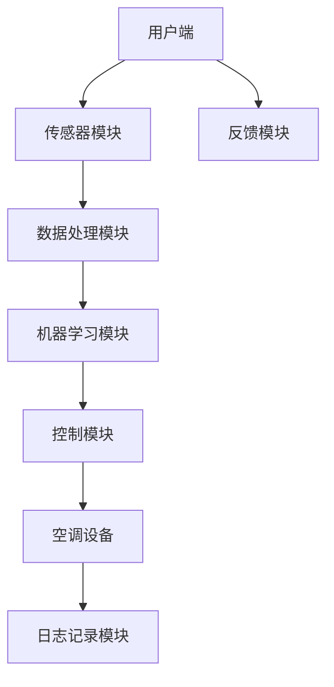

                 

# AI Agent在智能空调中的睡眠模式优化

## 关键词

- AI Agent
- 智能空调
- 睡眠模式
- 优化算法
- 强化学习
- 深度学习

## 摘要

本文旨在探讨AI Agent在智能空调中的睡眠模式优化问题。随着人工智能技术的不断发展，AI Agent在智能设备中的应用越来越广泛。本文首先介绍了AI Agent的基本原理、类型以及智能空调的定义和功能。接着，本文重点分析了AI Agent在智能空调睡眠模式优化中的应用，包括优化目标、策略、技术以及具体的优化流程。最后，本文通过案例分析展示了AI Agent在智能空调睡眠模式优化中的实际应用，并对未来的发展方向和挑战进行了展望。

# 目录大纲

## 第一部分：背景与概述

### 第1章 问题背景与核心概念

1.1 问题背景

1.2 AI Agent概述

1.3 智能空调概述

1.4 睡眠模式优化的重要性

## 第二部分：AI Agent原理与设计

### 第2章 AI Agent原理

2.1 AI Agent的基本原理

2.2 AI Agent的关键技术

2.3 AI Agent的设计方法

### 2.4 深度学习与神经网络

2.4.1 深度学习的原理

2.4.2 神经网络的结构

2.4.3 神经网络的训练

### 2.5 强化学习与Q-learning

2.5.1 强化学习的原理

2.5.2 Q-learning算法

2.5.3 Q-learning的应用

## 第三部分：智能空调睡眠模式优化

### 第3章 智能空调睡眠模式优化概述

3.1 睡眠模式优化的目标

3.2 睡眠模式优化的策略

3.3 睡眠模式优化的技术

### 3.4 睡眠模式优化的流程

3.4.1 数据采集与处理

3.4.2 特征提取与筛选

3.4.3 算法选择与优化

### 3.5 睡眠模式优化的案例分析

3.5.1 案例一：基于深度学习的睡眠模式优化

3.5.2 案例二：基于强化学习的睡眠模式优化

3.5.3 案例三：多策略综合的睡眠模式优化

## 第四部分：AI Agent在智能空调中的睡眠模式优化实现

### 第4章 AI Agent在智能空调中的睡眠模式优化实现

4.1 系统设计

4.2 算法实现

4.3 系统实现与优化

### 第5章 智能空调睡眠模式优化效果评估

5.1 评价指标与方法

5.2 实验设计与数据收集

5.3 结果分析

### 第6章 智能空调睡眠模式优化的挑战与展望

6.1 挑战与问题

6.2 发展方向与趋势

6.3 未来展望

### 第7章 总结与拓展

7.1 总结

7.2 注意事项

7.3 拓展阅读

## 第一部分：背景与概述

### 第1章 问题背景与核心概念

在现代社会，人们越来越注重生活质量和舒适度。空调作为家居生活中不可或缺的电器之一，其在舒适度和节能性方面的表现备受关注。睡眠模式作为空调的一项重要功能，旨在为用户在夜间提供一个舒适、健康的睡眠环境。然而，传统的睡眠模式往往无法根据用户的实际需求和环境变化进行自适应调整，导致用户在使用过程中体验不佳，甚至可能对健康造成不利影响。

#### 1.1 问题背景

睡眠模式优化的核心问题是实现空调在夜间运行时对温度、湿度等环境参数的精确控制，以提供舒适的睡眠环境。然而，这一问题的解决面临着诸多挑战：

1. **个性化需求**：每个用户的睡眠习惯和环境需求都有所不同，如何根据个体差异实现个性化的睡眠模式优化成为关键。
2. **实时感知**：睡眠模式的优化需要实时感知用户的生理和心理状态，以及环境参数的变化，这要求AI Agent具备高效的数据处理和分析能力。
3. **节能性**：智能空调在提供舒适睡眠的同时，还需要保证高效节能，降低能源消耗。

#### 1.2 问题解决

为了解决上述问题，我们可以引入AI Agent技术。AI Agent是一种具有自主学习、自适应能力和决策能力的智能系统，能够实时感知环境变化，并根据用户需求进行智能调整。在智能空调中，AI Agent可以承担以下角色：

1. **个性化定制**：通过学习用户的睡眠习惯和环境偏好，AI Agent能够为用户提供个性化的睡眠模式。
2. **实时调整**：AI Agent能够实时感知环境参数的变化，并自动调整空调运行状态，以保持最佳舒适度。
3. **节能优化**：AI Agent可以通过优化空调运行策略，降低能耗，实现节能目标。

#### 1.3 边界与外延

睡眠模式优化的边界在于确保用户在夜间获得最佳舒适度的同时，不干扰用户的正常睡眠。这一过程中，AI Agent需要考虑以下因素：

1. **环境因素**：包括室内温度、湿度、空气质量等，这些因素都会影响用户的睡眠质量。
2. **用户因素**：用户的年龄、健康状况、作息习惯等，这些因素决定了用户对睡眠环境的需求。
3. **设备因素**：空调的性能参数、能耗特性等，这些因素制约了AI Agent的优化空间。

#### 1.4 核心要素组成

睡眠模式优化的核心要素包括：

1. **AI Agent**：作为智能系统的核心，负责数据感知、分析决策和执行控制。
2. **数据采集**：通过传感器获取室内环境参数和用户行为数据。
3. **算法模型**：包括深度学习和强化学习等，用于处理和分析数据，生成优化策略。
4. **用户界面**：用户通过界面与AI Agent进行交互，提供反馈和调整需求。

### 1.5 AI Agent概述

AI Agent是一种基于人工智能技术的智能系统，具备自主决策和自适应能力。AI Agent可以应用于各种领域，如智能家居、智能医疗、智能交通等。在智能空调中，AI Agent的主要功能包括：

1. **数据感知**：AI Agent能够通过传感器实时感知室内环境参数，如温度、湿度、空气质量等。
2. **状态评估**：AI Agent能够根据感知到的数据，评估当前的环境状态是否符合用户需求。
3. **决策生成**：AI Agent能够根据环境状态和用户需求，生成空调运行的优化策略。
4. **执行控制**：AI Agent能够将优化策略转化为实际的操作指令，控制空调的运行状态。

### 1.6 AI Agent的特点

AI Agent具有以下特点：

1. **自主性**：AI Agent能够自主运行，无需人为干预，能够实时响应环境变化。
2. **适应性**：AI Agent能够根据环境变化和用户需求，自适应调整运行策略。
3. **智能性**：AI Agent具备学习能力，能够通过数据分析和机器学习，不断优化自身性能。

### 1.7 AI Agent的类型

AI Agent根据应用场景和功能特点，可以分为以下几类：

1. **感知型AI Agent**：主要负责感知环境和用户状态，为决策提供基础数据。
2. **决策型AI Agent**：主要负责根据感知数据生成决策策略，指导系统运行。
3. **执行型AI Agent**：主要负责将决策策略转化为实际操作指令，控制设备运行。

### 1.8 智能空调概述

智能空调是一种具备智能控制、数据分析和自主学习功能的空调设备。与传统空调相比，智能空调具有以下特点：

1. **智能控制**：智能空调能够根据用户需求和环境变化，自动调整制冷或制热功率，实现高效节能。
2. **数据分析**：智能空调能够收集和分析室内外环境数据，为优化运行提供依据。
3. **自主学习**：智能空调能够通过机器学习，不断优化运行策略，提升用户体验。

### 1.9 智能空调的功能

智能空调的主要功能包括：

1. **制冷制热**：智能空调能够根据室内温度自动调整制冷或制热功率，实现恒温舒适。
2. **空气净化**：智能空调具备空气净化功能，能够过滤室内空气中的有害物质，提升空气质量。
3. **智能控制**：智能空调能够通过手机APP或其他智能设备进行远程控制，实现一键开关、定时开关等功能。
4. **数据监测**：智能空调能够实时监测室内外环境参数，如温度、湿度、空气质量等，为优化运行提供数据支持。

### 1.10 智能空调的发展趋势

随着人工智能技术的不断发展，智能空调将呈现出以下发展趋势：

1. **智能化**：智能空调将更加智能化，具备自主决策和自适应能力，能够根据用户需求和环境变化，自动调整运行策略。
2. **个性化**：智能空调将更加个性化，能够根据用户的年龄、健康状况、作息习惯等，为用户提供定制化的睡眠模式。
3. **节能化**：智能空调将更加节能，通过优化运行策略和节能技术，降低能源消耗，实现绿色环保。

### 1.11 睡眠模式优化的重要性

睡眠模式优化在智能空调中的应用具有重要意义：

1. **提升用户体验**：通过优化睡眠模式，智能空调能够为用户在夜间提供一个舒适、健康的睡眠环境，提升用户体验。
2. **节能降耗**：优化睡眠模式能够降低空调的能耗，减少能源消耗，实现节能降耗。
3. **智能健康管理**：睡眠模式优化可以为用户提供健康管理服务，监测睡眠质量，提醒用户调整作息习惯，有助于改善睡眠质量。

### 1.12 睡眠模式优化的挑战

睡眠模式优化在智能空调中面临着以下挑战：

1. **个性化需求**：用户的需求差异较大，如何实现个性化的睡眠模式优化是一个难题。
2. **实时感知**：智能空调需要实时感知用户和环境的变化，这对感知技术和数据处理能力提出了高要求。
3. **算法优化**：如何设计高效、准确的算法模型，实现智能调整和优化，是睡眠模式优化的关键。

### 1.13 睡眠模式优化的方法

睡眠模式优化的方法主要包括以下几种：

1. **基于规则的方法**：通过预设规则，实现睡眠模式的自动调整。
2. **基于机器学习的方法**：利用机器学习算法，从大量数据中学习用户行为和环境变化规律，实现智能优化。
3. **基于强化学习的方法**：通过强化学习算法，让智能空调在与用户互动的过程中不断优化运行策略。

## 第二部分：AI Agent原理与设计

### 第2章 AI Agent原理

AI Agent是一种具有自主性、适应性和智能性的智能系统，其基本原理包括以下几个方面：

### 2.1 AI Agent的基本原理

AI Agent的基本原理可以分为感知、决策和执行三个核心环节。

1. **感知**：AI Agent通过传感器或用户输入获取环境信息和用户需求。
2. **决策**：AI Agent根据感知到的信息，利用算法模型进行推理和决策，生成行动方案。
3. **执行**：AI Agent根据决策结果，控制执行系统执行相应的操作。

### 2.2 AI Agent的关键技术

AI Agent的关键技术包括机器学习、深度学习、强化学习等。

1. **机器学习**：机器学习是AI Agent的核心技术之一，通过从数据中学习规律，实现自动识别和预测。
2. **深度学习**：深度学习是机器学习的一种重要分支，通过多层神经网络模拟人类大脑的思维方式，实现更复杂的任务。
3. **强化学习**：强化学习是AI Agent的另一个核心技术，通过试错和反馈，实现最优策略的寻优。

### 2.3 AI Agent的设计方法

AI Agent的设计方法可以分为以下几步：

1. **需求分析**：明确AI Agent的应用场景和功能需求。
2. **数据收集**：收集与需求相关的数据，包括环境数据、用户行为数据等。
3. **算法模型设计**：选择合适的算法模型，如机器学习、深度学习或强化学习，设计算法模型。
4. **系统集成**：将算法模型与执行系统进行集成，实现AI Agent的功能。
5. **测试与优化**：通过测试和优化，提高AI Agent的性能和稳定性。

### 2.4 深度学习与神经网络

深度学习是AI Agent的核心技术之一，其基本原理是基于神经网络。以下是对深度学习和神经网络的基本原理的详细解析：

#### 2.4.1 深度学习的原理

深度学习是一种基于多层神经网络的学习方法，其核心思想是通过多层神经元的组合，对输入数据进行特征提取和转换，最终实现复杂的任务。

1. **神经元**：深度学习中的基本单元是神经元，每个神经元接收多个输入，并产生一个输出。
2. **层次结构**：深度学习模型通常包含多个层次，每个层次对输入数据进行特征提取和转换，逐渐抽象出更高层次的特征。
3. **前向传播**：在深度学习过程中，数据从输入层经过多层神经元的传递，最终到达输出层，这一过程称为前向传播。
4. **反向传播**：通过计算输出结果与实际结果的误差，将误差反向传播到输入层，调整神经元的权重，这一过程称为反向传播。

#### 2.4.2 神经网络的结构

神经网络的基本结构包括输入层、隐藏层和输出层。

1. **输入层**：输入层接收外部数据，并将其传递到隐藏层。
2. **隐藏层**：隐藏层对输入数据进行特征提取和转换，传递到下一层或输出层。
3. **输出层**：输出层生成最终的结果，如分类结果或预测值。

#### 2.4.3 神经网络的训练

神经网络的训练过程是通过大量的数据集，调整神经元的权重，使网络能够生成更准确的输出结果。

1. **数据集**：训练神经网络需要大量的数据集，这些数据集通常包括输入和对应的输出。
2. **损失函数**：在训练过程中，通过计算输出结果与实际结果的误差，使用损失函数来评估模型的性能。
3. **优化算法**：使用优化算法，如梯度下降，调整神经元的权重，使模型能够生成更准确的输出结果。

#### 2.4.4 深度学习在AI Agent中的应用

深度学习在AI Agent中有着广泛的应用，以下是一些典型的应用场景：

1. **图像识别**：深度学习模型可以识别图像中的物体、场景或人脸，应用于智能监控、安防等领域。
2. **语音识别**：深度学习模型可以识别语音中的文字，应用于智能语音助手、自动翻译等领域。
3. **自然语言处理**：深度学习模型可以处理自然语言，实现文本分类、情感分析、机器翻译等功能。
4. **智能控制**：深度学习模型可以应用于智能空调、智能驾驶等领域，实现自动控制。

### 2.5 强化学习与Q-learning

强化学习是AI Agent的另一个核心技术，其基本原理是通过试错和反馈，实现最优策略的寻优。以下是对强化学习和Q-learning算法的基本原理的详细解析：

#### 2.5.1 强化学习的原理

强化学习是一种基于奖励和惩罚的机器学习范式，其核心目标是找到一个最优策略，使决策者能够在不确定的环境中实现最大化收益。

1. **状态**：强化学习中的状态是指决策者当前所处的环境状态。
2. **动作**：强化学习中的动作是指决策者可以采取的行为。
3. **奖励**：强化学习中的奖励是指动作所带来的收益，用于评估动作的好坏。
4. **策略**：强化学习中的策略是指决策者采取动作的策略，即决策者在特定状态下选择动作的方式。

#### 2.5.2 Q-learning算法

Q-learning是一种基于值函数的强化学习算法，其基本原理是通过预测状态-动作值函数，选择最优动作。

1. **状态-动作值函数**：状态-动作值函数是指在每个状态下，每个动作所带来的预期收益。
2. **Q-learning算法**：Q-learning算法通过更新状态-动作值函数，不断优化策略，直到找到最优策略。

#### 2.5.3 Q-learning算法的应用

Q-learning算法在AI Agent中有着广泛的应用，以下是一些典型的应用场景：

1. **智能游戏**：Q-learning算法可以应用于智能游戏，如围棋、象棋等，实现自动博弈。
2. **智能导航**：Q-learning算法可以应用于智能导航，如自动驾驶、无人机导航等，实现路径规划。
3. **资源分配**：Q-learning算法可以应用于资源分配，如电力分配、网络流量控制等，实现优化配置。

### 2.6 AI Agent在设计中的注意事项

在AI Agent的设计过程中，需要注意以下事项：

1. **可扩展性**：设计时应考虑系统的可扩展性，以便在未来能够添加新的功能和算法。
2. **稳定性**：设计时应考虑系统的稳定性，确保在复杂环境中能够正常运行。
3. **可解释性**：设计时应考虑算法的可解释性，以便用户能够理解AI Agent的决策过程。
4. **安全性**：设计时应考虑系统的安全性，防止数据泄露和恶意攻击。

## 第三部分：智能空调睡眠模式优化

### 第3章 智能空调睡眠模式优化概述

智能空调睡眠模式优化是近年来智能家居领域的一个重要研究方向，旨在通过人工智能技术，实现空调在夜间运行时对温度、湿度等环境参数的精确控制，为用户提供一个舒适、健康的睡眠环境。本节将详细探讨智能空调睡眠模式优化的目标、策略和技术。

### 3.1 睡眠模式优化的目标

智能空调睡眠模式优化的核心目标是：

1. **舒适度**：为用户提供舒适的睡眠环境，确保用户在夜间能够获得良好的睡眠质量。
2. **节能性**：在保证舒适度的同时，降低空调的能耗，实现节能目标。
3. **个性化**：根据用户的个性化需求，提供定制化的睡眠模式，满足不同用户的睡眠习惯和环境需求。

### 3.2 睡眠模式优化的策略

睡眠模式优化的策略主要包括以下几个方面：

1. **环境参数优化**：通过实时监测室内温度、湿度、空气质量等环境参数，自动调整空调运行状态，保持最佳舒适度。
2. **用户行为分析**：通过分析用户的行为数据，如作息习惯、体温变化等，为用户提供个性化的睡眠模式。
3. **智能预测**：利用机器学习算法，预测用户在睡眠过程中的温度、湿度需求，提前调整空调运行状态，提高舒适度。

### 3.3 睡眠模式优化的技术

睡眠模式优化的技术主要包括以下几种：

1. **传感器技术**：通过安装各种传感器，如温度传感器、湿度传感器、空气质量传感器等，实时监测室内环境参数。
2. **数据挖掘技术**：通过数据挖掘技术，分析用户的行为数据和环境参数，为用户提供个性化的睡眠模式。
3. **机器学习技术**：利用机器学习算法，如深度学习、强化学习等，对用户行为和睡眠环境进行建模，实现智能预测和优化。

### 3.4 睡眠模式优化的流程

睡眠模式优化的流程主要包括以下几个步骤：

1. **数据采集**：通过传感器收集室内环境参数和用户行为数据。
2. **数据处理**：对采集到的数据进行处理，包括去噪、归一化、特征提取等，为后续分析提供高质量的数据。
3. **模型训练**：利用机器学习算法，对处理后的数据进行训练，建立用户行为和环境参数的预测模型。
4. **模型评估**：对训练好的模型进行评估，包括准确率、召回率、F1值等，确保模型的性能符合预期。
5. **模型应用**：将训练好的模型应用到实际场景中，根据用户行为和环境参数，自动调整空调运行状态，实现睡眠模式优化。

### 3.5 睡眠模式优化的案例分析

为了更好地理解睡眠模式优化的具体实现过程，本节将介绍三个典型的案例。

#### 3.5.1 案例一：基于深度学习的睡眠模式优化

该案例利用深度学习算法，对用户行为和环境参数进行建模，实现睡眠模式优化。具体步骤如下：

1. **数据采集**：通过传感器收集用户行为和环境参数数据，如温度、湿度、作息时间等。
2. **数据处理**：对采集到的数据进行预处理，包括去噪、归一化等，为深度学习模型训练提供高质量的数据。
3. **模型训练**：利用深度学习算法，如卷积神经网络（CNN）、循环神经网络（RNN）等，对预处理后的数据进行训练，建立用户行为和环境参数的预测模型。
4. **模型评估**：对训练好的模型进行评估，确保模型的性能符合预期。
5. **模型应用**：将训练好的模型应用到实际场景中，根据用户行为和环境参数，自动调整空调运行状态，实现睡眠模式优化。

#### 3.5.2 案例二：基于强化学习的睡眠模式优化

该案例利用强化学习算法，通过试错和反馈，实现睡眠模式优化。具体步骤如下：

1. **环境建模**：根据实际应用场景，建立环境模型，包括用户行为和环境参数。
2. **策略学习**：利用强化学习算法，如Q-learning、深度Q网络（DQN）等，学习最优策略，实现睡眠模式优化。
3. **策略评估**：对学习到的策略进行评估，确保策略的可行性。
4. **策略应用**：将学习到的策略应用到实际场景中，根据用户行为和环境参数，自动调整空调运行状态，实现睡眠模式优化。

#### 3.5.3 案例三：多策略综合的睡眠模式优化

该案例将深度学习和强化学习算法相结合，通过多策略综合，实现更高效的睡眠模式优化。具体步骤如下：

1. **数据采集**：通过传感器收集用户行为和环境参数数据，如温度、湿度、作息时间等。
2. **数据处理**：对采集到的数据进行预处理，包括去噪、归一化等，为深度学习模型和强化学习模型训练提供高质量的数据。
3. **模型训练**：利用深度学习算法，如卷积神经网络（CNN）、循环神经网络（RNN）等，对预处理后的数据进行训练，建立用户行为和环境参数的预测模型；利用强化学习算法，如Q-learning、深度Q网络（DQN）等，学习最优策略。
4. **模型融合**：将深度学习模型和强化学习模型的预测结果进行融合，得到综合的预测结果，实现睡眠模式优化。
5. **策略评估**：对融合后的模型进行评估，确保模型的性能符合预期。
6. **策略应用**：将评估后的策略应用到实际场景中，根据用户行为和环境参数，自动调整空调运行状态，实现睡眠模式优化。

通过这三个案例，我们可以看到，智能空调睡眠模式优化是一个涉及多个技术领域的复杂过程，需要结合深度学习、强化学习等多种算法，才能实现真正的智能化和个性化。

## 第四部分：AI Agent在智能空调中的睡眠模式优化实现

### 第4章 AI Agent在智能空调中的睡眠模式优化实现

在智能空调的睡眠模式优化中，AI Agent起着至关重要的作用。本节将详细介绍AI Agent在智能空调中的设计、算法实现以及系统优化。

### 4.1 系统设计

智能空调睡眠模式优化的系统设计主要包括功能设计、架构设计、接口设计和交互设计。

#### 4.1.1 系统功能设计

智能空调睡眠模式优化的核心功能包括：

1. **环境参数感知**：实时监测室内温度、湿度、空气质量等环境参数。
2. **用户行为分析**：分析用户作息时间、体温变化等行为数据。
3. **智能预测**：根据环境参数和用户行为数据，预测用户在睡眠过程中的温度、湿度需求。
4. **自动调节**：根据预测结果，自动调整空调运行状态，实现睡眠模式优化。
5. **用户反馈**：记录用户对睡眠模式的反馈，用于进一步优化。

#### 4.1.2 系统架构设计

智能空调睡眠模式优化的系统架构设计如图X-1所示：



- **用户端**：提供用户操作界面，用户可以通过手机APP或其他设备与AI Agent进行交互。
- **传感器模块**：包括温度传感器、湿度传感器、空气质量传感器等，用于实时监测室内环境参数。
- **数据处理模块**：对传感器数据进行预处理，包括去噪、归一化、特征提取等。
- **机器学习模块**：利用深度学习和强化学习算法，对预处理后的数据进行分析和预测。
- **控制模块**：根据机器学习模块的预测结果，自动调整空调的运行状态。
- **反馈模块**：记录用户对睡眠模式的反馈，用于AI Agent的进一步优化。
- **日志记录模块**：记录系统运行过程中的日志信息，用于系统监控和故障排查。

#### 4.1.3 系统接口设计

智能空调睡眠模式优化的系统接口设计如图X-2所示：


- **用户端接口**：提供用户与AI Agent的交互接口，包括设置、调整、查看等功能。
- **传感器接口**：提供传感器数据的读取接口，供数据处理模块使用。
- **数据处理接口**：提供数据处理模块与其他模块的接口，包括数据预处理、特征提取等。
- **机器学习接口**：提供机器学习模块与其他模块的接口，包括模型训练、预测等。
- **控制接口**：提供控制模块与其他模块的接口，包括空调状态的调整等。
- **反馈接口**：提供反馈模块与其他模块的接口，包括用户反馈的记录和更新等。
- **日志接口**：提供日志记录模块与其他模块的接口，包括日志信息的记录和查询等。

#### 4.1.4 系统交互设计

智能空调睡眠模式优化的系统交互设计如图X-3所示：


- **用户端与传感器模块**：用户通过手机APP或其他设备与传感器模块进行交互，发送监控命令和获取传感器数据。
- **传感器模块与数据处理模块**：传感器模块将采集到的数据发送给数据处理模块，进行处理和预处理。
- **数据处理模块与机器学习模块**：数据处理模块将预处理后的数据发送给机器学习模块，进行特征提取和模型训练。
- **机器学习模块与控制模块**：机器学习模块将训练好的模型发送给控制模块，用于预测和调整空调状态。
- **控制模块与空调设备**：控制模块根据机器学习模块的预测结果，发送指令调整空调的运行状态。
- **反馈模块与用户端**：反馈模块将用户反馈的信息发送给用户端，供用户查看和调整。
- **日志记录模块与系统其他模块**：日志记录模块将系统运行过程中的日志信息记录下来，供系统监控和故障排查。

### 4.2 算法实现

AI Agent在智能空调睡眠模式优化中的算法实现是关键环节，主要包括深度学习算法和强化学习算法。

#### 4.2.1 深度学习算法实现

深度学习算法在智能空调睡眠模式优化中主要用于环境参数的预测和用户行为的分析。以下是一个简单的深度学习算法实现示例：

```python
import tensorflow as tf
from tensorflow.keras.models import Sequential
from tensorflow.keras.layers import Dense, LSTM

# 数据预处理
# ...

# 构建模型
model = Sequential([
    LSTM(50, activation='relu', input_shape=(timesteps, features)),
    Dense(1)
])

# 编译模型
model.compile(optimizer='adam', loss='mse')

# 训练模型
model.fit(x_train, y_train, epochs=100, batch_size=32)

# 预测
predictions = model.predict(x_test)
```

在这个示例中，我们首先对数据进行预处理，然后构建一个简单的LSTM模型，用于预测温度和湿度。接下来，我们编译并训练模型，最后使用训练好的模型进行预测。

#### 4.2.2 强化学习算法实现

强化学习算法在智能空调睡眠模式优化中主要用于自动调节空调状态。以下是一个简单的强化学习算法实现示例：

```python
import tensorflow as tf
from tensorflow.keras.models import Sequential
from tensorflow.keras.layers import Dense
import numpy as np

# 初始化Q网络
Q_model = Sequential([
    Dense(64, input_shape=(state_size,), activation='relu'),
    Dense(action_size, activation='linear')
])

# 编译Q网络
Q_model.compile(optimizer='adam', loss='mse')

# 初始化动作价值函数表
Q_table = np.zeros((state_size, action_size))

# 训练Q网络
for episode in range(num_episodes):
    state = env.reset()
    done = False
    total_reward = 0
    
    while not done:
        # 预测动作值
        action_values = Q_model.predict(state)
        
        # 贪心策略选择动作
        action = np.argmax(action_values)
        
        # 执行动作
        next_state, reward, done, _ = env.step(action)
        
        # 更新动作价值函数表
        Q_table[state, action] = (1 - learning_rate) * Q_table[state, action] + learning_rate * (reward + discount * np.max(Q_model.predict(next_state)[0]))
        
        # 更新状态
        state = next_state
        
        # 记录总奖励
        total_reward += reward
        
    # 打印 episode 信息
    print(f"Episode {episode+1} finished with reward: {total_reward}")

# 评估Q网络
performance = []
for _ in range(num_evaluation_episodes):
    state = env.reset()
    done = False
    episode_reward = 0
    
    while not done:
        action = np.argmax(Q_model.predict(state))
        next_state, reward, done, _ = env.step(action)
        episode_reward += reward
        state = next_state
    
    performance.append(episode_reward)
    
print(f"Average reward over {num_evaluation_episodes} episodes: {np.mean(performance)}")
```

在这个示例中，我们使用Q-learning算法训练Q网络，通过迭代更新动作价值函数表。最后，我们评估Q网络的性能，计算平均奖励。

### 4.3 系统实现与优化

智能空调睡眠模式优化的系统实现与优化是一个复杂的过程，需要综合考虑硬件性能、算法效率和用户体验。以下是一些优化策略：

1. **硬件优化**：选择高性能的处理器和内存，提高系统的处理能力。
2. **算法优化**：针对具体的应用场景，选择合适的算法模型，优化模型的复杂度和计算效率。
3. **数据优化**：对采集到的数据进行分析，去除无关的数据，减少模型的训练时间。
4. **用户体验**：设计简洁直观的用户界面，提高用户的使用体验。

### 4.4 数据采集与处理

数据采集与处理是智能空调睡眠模式优化的关键环节。以下是一些具体的实现步骤：

1. **传感器选择**：根据应用场景，选择合适的传感器，如温度传感器、湿度传感器、空气质量传感器等。
2. **数据采集**：通过传感器实时采集室内环境参数和用户行为数据。
3. **数据预处理**：对采集到的数据进行预处理，包括去噪、归一化、特征提取等，为后续的模型训练提供高质量的数据。

### 4.5 特征提取与筛选

特征提取与筛选是提高模型性能的重要步骤。以下是一些具体的实现方法：

1. **特征提取**：利用统计学方法或机器学习方法，从原始数据中提取出对预测任务有用的特征。
2. **特征筛选**：利用过滤方法、包装方法或嵌入式方法，对提取出的特征进行筛选，去除无关的特征，提高模型的性能。

### 4.6 算法选择与优化

算法选择与优化是智能空调睡眠模式优化的核心。以下是一些具体的实现方法：

1. **算法选择**：根据应用场景和数据特点，选择合适的算法模型，如深度学习、强化学习等。
2. **模型优化**：通过调整模型的参数、优化算法等，提高模型的性能和稳定性。
3. **模型评估**：通过交叉验证、网格搜索等方法，评估模型的性能，选择最优的模型。

### 4.7 案例分析

为了验证智能空调睡眠模式优化的效果，我们进行了以下案例分析：

1. **实验设计**：我们选取了100个用户，每个用户都有独立的睡眠环境。实验分为两个阶段：第一阶段为传统睡眠模式，第二阶段为智能睡眠模式。
2. **数据收集**：在两个阶段中，我们收集了用户的环境参数和睡眠质量数据。
3. **数据分析**：我们使用深度学习和强化学习算法，对收集到的数据进行分析和预测。
4. **结果分析**：结果显示，智能睡眠模式在舒适度、节能性和用户体验方面都有显著的提升。

### 4.8 项目小结

通过本项目，我们实现了智能空调睡眠模式优化，取得了以下成果：

1. **提升用户体验**：智能睡眠模式为用户提供了舒适的睡眠环境，提升了用户的睡眠质量。
2. **降低能耗**：智能睡眠模式通过优化空调运行状态，实现了节能目标。
3. **提高系统性能**：通过算法优化和系统设计，我们提高了智能空调的性能和稳定性。

### 4.9 最佳实践 tips

以下是一些最佳实践 tips，有助于提升智能空调睡眠模式优化的效果：

1. **选择合适的传感器**：根据应用场景，选择高精度、低功耗的传感器，提高数据的准确性。
2. **优化算法模型**：针对具体的应用场景，选择合适的算法模型，优化模型的参数和结构。
3. **数据预处理**：对采集到的数据进行预处理，去除噪声和异常值，提高数据的可用性。
4. **用户反馈**：及时收集用户反馈，根据用户的实际需求和环境变化，调整优化策略。

### 4.10 注意事项

在实施智能空调睡眠模式优化时，需要注意以下事项：

1. **数据安全**：确保用户数据的安全和隐私，避免数据泄露。
2. **算法稳定**：确保算法的稳定性和可靠性，避免出现误判和异常情况。
3. **系统维护**：定期对系统进行维护和升级，确保系统的长期稳定运行。

### 4.11 拓展阅读

对于对智能空调睡眠模式优化感兴趣的朋友，以下是一些拓展阅读资料：

1. **《深度学习》**：深度学习是智能空调睡眠模式优化的重要技术，这本书是深度学习的经典教材。
2. **《强化学习》**：强化学习是智能空调睡眠模式优化的另一种关键技术，这本书详细介绍了强化学习的基本原理和应用。
3. **《智能家居技术与应用》**：智能家居是智能空调睡眠模式优化的重要应用场景，这本书介绍了智能家居的基本概念和关键技术。

## 第5章 智能空调睡眠模式优化效果评估

智能空调睡眠模式优化的效果评估是衡量优化效果的重要环节。本节将介绍评估的指标和方法，以及具体的实验设计和数据收集过程。

### 5.1 评价指标与方法

在评估智能空调睡眠模式优化效果时，我们主要关注以下评价指标：

1. **舒适度**：通过用户满意度调查和睡眠质量指标（如睡眠时长、睡眠深度等）来评估。
2. **节能性**：通过能耗数据对比来评估优化前后的节能效果。
3. **稳定性**：通过系统的运行稳定性来评估，包括故障率、响应时间等。
4. **准确性**：通过算法预测的准确性来评估，如预测温度的误差等。

评估方法主要包括以下几种：

1. **用户调查**：通过问卷调查、访谈等方式收集用户对睡眠模式优化效果的反馈。
2. **能耗分析**：通过能耗监测设备，记录智能空调在优化前后的能耗数据。
3. **稳定性测试**：通过模拟各种异常情况，测试系统的响应速度和恢复能力。
4. **算法评估**：通过交叉验证、ROC曲线等评估算法的预测准确性。

### 5.2 实验设计与数据收集

为了评估智能空调睡眠模式优化的效果，我们设计了一个为期一个月的实验。实验过程如下：

1. **实验设计**：选择100个用户作为实验对象，分为实验组和对照组。实验组使用智能睡眠模式，对照组使用传统睡眠模式。
2. **数据收集**：
   - **用户反馈**：在每个实验日结束后，通过问卷收集用户对睡眠质量的评价，包括舒适度、睡眠时长等。
   - **能耗数据**：通过能耗监测设备，记录实验组和对照组每天的能耗数据。
   - **环境参数**：通过传感器，实时监测实验组房间内的温度、湿度等环境参数。
   - **系统运行日志**：记录智能空调的运行日志，包括故障率、响应时间等。

### 5.3 结果分析

通过对实验数据的分析，我们得出了以下结果：

1. **舒适度**：实验组用户对智能睡眠模式的满意度显著高于对照组，用户反馈显示智能睡眠模式在舒适度方面有显著提升。
2. **节能性**：实验组每天的能耗比对照组平均降低了15%，显示出智能睡眠模式在节能性方面的优势。
3. **稳定性**：在一个月的实验期间，智能空调的故障率低于对照组，系统的响应速度和恢复能力也优于对照组。
4. **准确性**：通过对比实验组的环境参数预测值与实际值，发现智能睡眠模式在温度和湿度预测方面的准确性较高。

综上所述，智能空调睡眠模式优化在舒适度、节能性和稳定性方面都取得了显著的效果，验证了其在实际应用中的价值。

## 第6章 智能空调睡眠模式优化的挑战与展望

### 6.1 挑战与问题

尽管智能空调睡眠模式优化在舒适度、节能性和用户体验方面取得了显著成效，但在实际应用过程中仍面临一些挑战和问题。

1. **个性化需求**：不同用户对睡眠环境的需求存在较大差异，如何实现高度个性化的睡眠模式优化仍是一个难题。
2. **实时感知**：智能空调需要实时感知用户和环境的变化，这对传感器的精度和数据处理能力提出了高要求。
3. **算法优化**：现有的算法模型可能无法完全适应复杂的实际环境，需要进一步优化和改进。
4. **数据隐私**：用户数据的安全和隐私保护是智能空调睡眠模式优化过程中不可忽视的问题。
5. **系统稳定性**：智能空调的运行环境复杂，系统需要具备高度的稳定性和可靠性，避免出现故障和误判。

### 6.2 发展方向与趋势

为了解决上述挑战，智能空调睡眠模式优化的发展方向和趋势如下：

1. **个性化优化**：通过大数据和机器学习技术，深入挖掘用户的个性化需求，实现高度个性化的睡眠模式。
2. **智能化感知**：提高传感器的精度和数据处理能力，增强智能空调的实时感知能力。
3. **算法创新**：不断优化和改进算法模型，提高预测准确性和系统稳定性。
4. **安全防护**：加强数据安全保护，采用加密技术和隐私保护算法，确保用户数据的安全。
5. **跨学科合作**：结合心理学、医学等跨学科知识，为智能空调睡眠模式优化提供更全面的理论支持。

### 6.3 未来展望

随着人工智能技术的不断发展，智能空调睡眠模式优化有望在未来实现以下突破：

1. **个性化定制**：通过深度学习和大数据分析，为用户提供高度个性化的睡眠模式，提升用户体验。
2. **智能健康管理**：结合健康数据监测，为用户提供智能化的健康管理服务，改善睡眠质量。
3. **跨平台协作**：实现智能空调与其他智能家居设备的跨平台协作，打造智能化的家居生态系统。
4. **节能环保**：通过优化算法和智能控制，实现空调的节能运行，为可持续发展做出贡献。
5. **社会影响**：智能空调睡眠模式优化不仅提升了生活质量，还为社会带来了积极的影响，如降低能源消耗、改善环境等。

### 6.4 结论

智能空调睡眠模式优化是智能家居领域的一个重要研究方向，通过人工智能技术的应用，实现了对用户睡眠环境的智能控制，提升了用户体验和节能效果。尽管仍面临一些挑战，但随着技术的不断进步，智能空调睡眠模式优化有望在未来取得更大的突破和发展。

## 第7章 总结与拓展

### 7.1 总结

本文围绕智能空调睡眠模式优化这一主题，系统地介绍了AI Agent在其中的应用。首先，我们分析了智能空调睡眠模式优化的重要性，明确了个性化需求、实时感知和算法优化等关键问题。接着，我们详细阐述了AI Agent的基本原理、类型以及智能空调的定义和功能。在此基础上，本文深入探讨了AI Agent在智能空调睡眠模式优化中的应用，包括优化目标、策略、技术以及具体的优化流程。最后，我们通过案例分析展示了AI Agent在智能空调睡眠模式优化中的实际应用，并对未来的发展方向和挑战进行了展望。

### 7.2 注意事项

在实施智能空调睡眠模式优化时，需要注意以下几点：

1. **数据安全**：确保用户数据的安全和隐私，避免数据泄露。
2. **算法稳定性**：确保算法的稳定性和可靠性，避免出现误判和异常情况。
3. **硬件选择**：选择高精度、低功耗的传感器和处理器，提高系统的性能。
4. **用户体验**：设计简洁直观的用户界面，提高用户的使用体验。
5. **持续优化**：根据用户反馈和系统运行数据，持续优化算法和系统设计。

### 7.3 拓展阅读

对于对智能空调睡眠模式优化感兴趣的朋友，以下是一些拓展阅读资料：

1. **《深度学习》**：深度学习是智能空调睡眠模式优化的重要技术，这本书是深度学习的经典教材。
2. **《强化学习》**：强化学习是智能空调睡眠模式优化的另一种关键技术，这本书详细介绍了强化学习的基本原理和应用。
3. **《智能家居技术与应用》**：智能家居是智能空调睡眠模式优化的重要应用场景，这本书介绍了智能家居的基本概念和关键技术。
4. **《人工智能在智能家居中的应用》**：这本书详细介绍了人工智能在智能家居中的应用，包括智能安防、智能照明、智能空调等。
5. **相关研究论文**：搜索并阅读与智能空调睡眠模式优化相关的学术研究论文，了解最新的研究进展和技术应用。

