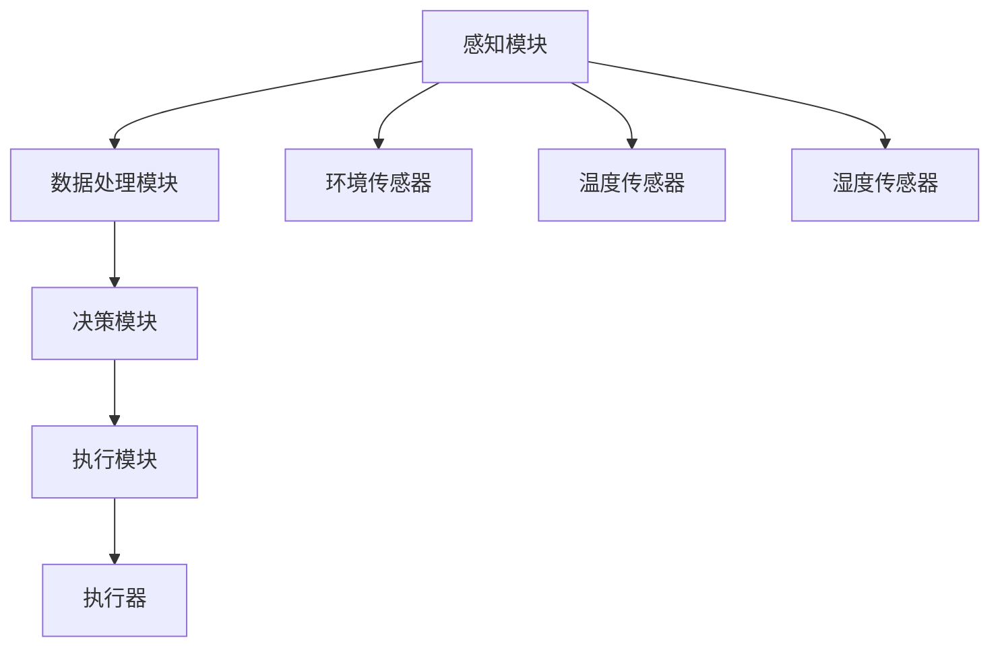
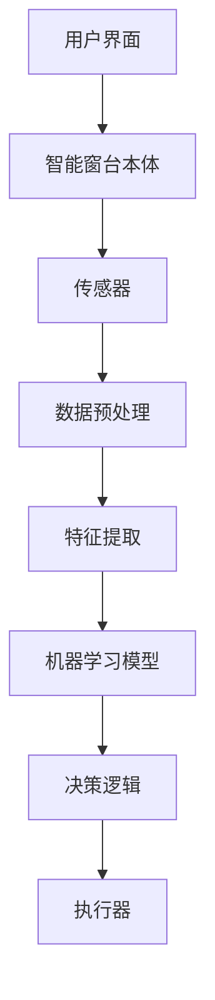

                 


## 让我们一步一步思考：

### 第一步：引出话题

**《AI Agent在智能窗台中的室内植物照料》**

在当今快速发展的科技时代，人工智能（AI）已经成为改变我们生活方式的重要力量。从智能家居到智能医疗，AI 的应用无处不在。今天，我们将探讨一个有趣且实用的应用场景——AI Agent 在智能窗台中的室内植物照料。

**关键词：** AI Agent、智能窗台、室内植物照料、人工智能应用

**摘要：** 本文将深入分析 AI Agent 在智能窗台中的应用，探讨其在室内植物照料中的核心价值、工作原理、算法实现以及系统架构设计。通过这一系列探讨，我们希望能够揭示 AI Agent 如何通过智能化手段，提高室内植物照料的效率和质量。

### 第二步：背景介绍

#### 1.1 室内植物照料的现状

随着城市生活节奏的加快，越来越多的人开始在家中种植室内植物。然而，如何有效地照料这些植物，确保它们健康成长，却成了一个挑战。传统上，室内植物照料主要依赖于人工，这不仅耗时费力，而且容易出现失误。

**1.1.1 室内植物照料的挑战**

- **缺乏专业知识和经验**：许多人在选择植物品种、浇水、施肥等方面缺乏专业知识。
- **时间不充裕**：现代生活节奏快，人们往往无法定期照顾植物。
- **环境因素变化**：室内环境变化无常，如光照、温度、湿度等，难以控制。

**1.1.2 传统植物照料的局限性**

- **人工成本高**：需要耗费大量人力和时间。
- **易受主观影响**：照料的规律性和精确性难以保证。

#### 1.2 智能窗台的崛起

智能窗台作为一种新兴的智能家居产品，结合了物联网（IoT）和人工智能技术，为室内植物照料带来了全新的解决方案。

**1.2.1 智能窗台的定义与功能**

智能窗台是一种集成了传感器、执行器、智能控制系统等模块的设备，可以通过联网实现远程监控和控制。

**1.2.2 智能窗台的发展趋势**

随着人工智能技术的不断进步，智能窗台正逐步实现智能化、个性化、自动化。

#### 1.3 AI Agent的核心价值

AI Agent，即人工智能代理，是一种能够自主学习、自主决策的智能系统。在室内植物照料中，AI Agent 具有以下几个核心价值：

**1.3.1 AI Agent的基本概念**

- **定义**：AI Agent 是一种模拟人类智能行为的计算机程序。
- **功能**：它可以收集数据、分析数据、做出决策，并根据反馈进行调整。

**1.3.2 AI Agent在室内植物照料中的应用潜力**

- **个性化照料**：根据植物的具体需求和生长阶段，提供定制化的照料方案。
- **高效决策**：通过实时数据分析，快速做出决策，提高植物存活率。
- **持续学习**：不断优化自己的照料策略，提高植物照料效果。

### 第三步：核心概念与联系

在深入探讨 AI Agent 在智能窗台中的应用之前，我们需要先了解几个核心概念及其相互关系。

#### 2.1 AI Agent的工作原理

**2.1.1 AI Agent的基本组成**

AI Agent 通常由以下几个部分组成：

- **感知器**：用于收集环境数据。
- **决策模块**：基于收集到的数据，进行决策分析。
- **执行器**：根据决策结果，执行相应的操作。

**2.1.2 AI Agent的运作机制**

AI Agent 的运作机制主要包括以下几个步骤：

1. **数据收集**：感知器收集环境数据。
2. **数据处理**：决策模块分析数据，识别问题。
3. **决策**：根据分析结果，决策模块做出决策。
4. **执行**：执行器执行决策，进行调整。

#### 2.2 植物生理学基础

为了更好地理解 AI Agent 如何在室内植物照料中发挥作用，我们需要了解一些植物生理学基础。

**2.2.1 植物生长的基本需求**

植物生长需要以下基本条件：

- **光照**：光合作用的必要条件。
- **水分**：植物生命活动的必需品。
- **温度**：影响植物的生长速度和生理过程。
- **空气**：提供植物呼吸所需的氧气和二氧化碳。

**2.2.2 植物生理现象与调节机制**

植物在生长过程中会经历一系列生理现象，如光合作用、呼吸作用、蒸腾作用等。这些现象是植物生长的基础，同时也是 AI Agent 分析植物状态的重要依据。

#### 2.3 智能窗台与AI Agent的融合

智能窗台与 AI Agent 的融合，是室内植物照料领域的一大突破。这种融合不仅提升了植物照料的智能化水平，还为用户带来了更多的便利。

**2.3.1 融合的优势**

- **自动化**：通过智能窗台和 AI Agent 的协作，实现了室内植物照料的自动化。
- **个性化**：AI Agent 可以根据植物的具体需求，提供个性化的照料方案。
- **高效性**：实时数据分析和决策，提高了植物照料的效率。

**2.3.2 融合的挑战**

- **数据准确性**：确保收集到的数据准确无误，是 AI Agent 正确决策的基础。
- **稳定性**：智能窗台和 AI Agent 的稳定性，直接影响到植物照料的稳定性。

### 第四步：算法原理讲解

#### 3.1 数据收集与预处理

AI Agent 在植物照料中的第一步是数据收集。这一过程主要包括以下几个方面：

**3.1.1 环境数据收集**

智能窗台配备了多种传感器，可以实时收集室内环境数据，如光照、温度、湿度等。

**3.1.2 数据预处理流程**

收集到的原始数据需要进行预处理，以便于后续分析。预处理流程通常包括数据清洗、数据归一化、特征提取等步骤。

#### 3.2 模型选择与训练

在数据收集与预处理之后，我们需要选择合适的机器学习模型进行训练。

**3.2.1 常见模型介绍**

- **决策树**：基于特征的决策规则。
- **支持向量机**（SVM）：基于最大间隔的线性模型。
- **神经网络**：基于神经元互联的复杂模型。

**3.2.2 模型选择策略**

模型选择策略取决于具体的应用场景和数据特征。

**3.2.3 模型训练过程**

模型训练过程包括数据划分、模型初始化、参数调整、模型评估等步骤。

#### 3.3 植物生长调控算法

在模型训练完成后，我们需要利用训练好的模型进行植物生长调控。

**3.3.1 基本原理**

植物生长调控算法基于对植物生理现象的理解，通过实时数据分析和决策，调整植物生长环境。

**3.3.2 算法实现**

算法实现包括环境数据采集、决策模块处理、执行器执行等步骤。

**3.3.3 性能评估**

性能评估主要通过对比实际结果与预测结果，评估算法的准确性和稳定性。

### 第五步：系统分析与架构设计

#### 4.1 智能窗台系统设计

智能窗台系统的设计目标是实现自动化、个性化、高效的室内植物照料。

**4.1.1 问题场景介绍**

- **室内植物照料问题**：确保植物在适宜的环境下健康成长。
- **智能窗台的功能需求**：实时监测植物生长状态，提供自动化的照料方案。

**4.1.2 系统功能设计**

系统功能设计主要包括以下几个模块：

- **感知模块**：收集环境数据。
- **数据处理模块**：对收集到的数据进行处理和分析。
- **决策模块**：根据分析结果，做出决策。
- **执行模块**：执行决策，调整植物生长环境。

**4.1.3 系统架构设计**

智能窗台系统架构设计如图所示，主要包括以下几个部分：

- **感知器**：用于数据收集。
- **数据处理单元**：用于数据处理和分析。
- **决策单元**：用于做出决策。
- **执行单元**：用于执行决策。

#### 4.2 系统接口设计

系统接口设计包括以下几个方面：

**4.2.1 接口规范**

接口规范包括数据格式、通信协议、接口调用方法等。

**4.2.2 接口交互流程**

接口交互流程包括数据收集、数据处理、决策执行等步骤。

#### 4.3 系统交互设计

系统交互设计主要包括以下几个方面：

**4.3.1 用户交互流程**

用户交互流程包括用户设置、数据监控、反馈调整等步骤。

**4.3.2 AI Agent与植物交互流程**

AI Agent 与植物交互流程包括数据采集、数据分析、决策调整等步骤。

### 第六步：项目实战

#### 5.1 环境安装

在开始项目实战之前，我们需要配置好开发环境。

**5.1.1 硬件环境配置**

硬件环境配置主要包括智能窗台的硬件设备和传感器。

**5.1.2 软件环境配置**

软件环境配置主要包括操作系统、编程语言和开发工具等。

#### 5.2 系统核心实现

系统核心实现包括以下几个模块：

**5.2.1 数据收集模块**

数据收集模块负责收集智能窗台传感器收集到的数据。

**5.2.2 模型训练模块**

模型训练模块负责使用收集到的数据训练机器学习模型。

**5.2.3 植物生长调控模块**

植物生长调控模块负责根据模型决策，调整植物生长环境。

#### 5.3 代码应用解读与分析

代码应用解读与分析包括以下几个方面：

**5.3.1 代码结构解析**

代码结构解析包括代码的组织结构、模块划分、功能实现等。

**5.3.2 代码功能解析**

代码功能解析包括代码的详细功能和实现原理。

#### 5.4 实际案例分析

实际案例分析包括以下几个方面：

**5.4.1 案例背景**

案例背景包括植物的种类、生长环境、照料目标等。

**5.4.2 案例分析**

案例分析包括数据收集、模型训练、决策执行等步骤。

**5.4.3 案例总结**

案例总结包括案例效果、问题与解决方案、未来改进方向等。

### 第七步：最佳实践

#### 6.1 参数调优技巧

参数调优技巧包括以下几个方面：

**6.1.1 学习率调整**

学习率调整是深度学习中常用的技巧，可以影响模型的收敛速度和稳定性。

**6.1.2 模型大小选择**

模型大小选择取决于具体应用场景和数据规模。

#### 6.2 故障诊断与处理

故障诊断与处理包括以下几个方面：

**6.2.1 常见问题分析**

常见问题分析包括数据收集问题、模型训练问题、执行器问题等。

**6.2.2 故障处理方法**

故障处理方法包括故障排查、故障修复、预防措施等。

#### 6.3 拓展应用领域

拓展应用领域包括以下几个方面：

**6.3.1 室内植物监测**

室内植物监测可以实时了解植物的生长状态，为用户提供反馈。

**6.3.2 室内环境优化**

室内环境优化可以改善室内空气质量，提升居住舒适度。

### 第八步：小结

#### 7.1 成果总结

项目成果总结包括以下几个方面：

**7.1.1 项目亮点**

项目亮点包括创新点、技术突破、应用效果等。

**7.1.2 遇到的问题与解决**

遇到的问题与解决包括技术难题、实施难点、解决方案等。

#### 7.2 未来展望

未来展望包括以下几个方面：

**7.2.1 技术发展趋势**

技术发展趋势包括人工智能、物联网、大数据等技术的发展方向。

**7.2.2 应用前景拓展**

应用前景拓展包括智能家居、智慧农业、城市治理等领域的应用前景。

#### 7.3 注意事项

注意事项包括以下几个方面：

**7.3.1 安全性问题**

安全性问题包括数据安全、系统安全、用户隐私保护等。

**7.3.2 数据隐私保护**

数据隐私保护包括数据收集、存储、处理、传输等环节的隐私保护措施。

### 第九步：拓展阅读

#### 7.4.1 相关研究

相关研究包括国内外关于室内植物照料、智能窗台、AI Agent 的相关研究成果。

#### 7.4.2 知识体系拓展

知识体系拓展包括植物生理学、人工智能、物联网、软件工程等相关领域的知识体系。

作者：AI天才研究院/AI Genius Institute & 禅与计算机程序设计艺术 /Zen And The Art of Computer Programming## 《AI Agent在智能窗台中的室内植物照料》

随着智能家居的普及，室内植物照料逐渐成为一个备受关注的领域。然而，传统的人工照料方式不仅费时费力，还容易出现错误。本文将探讨如何利用AI Agent（人工智能代理）在智能窗台中进行室内植物照料，实现高效、精准、智能化的植物管理。

关键词：AI Agent、智能窗台、室内植物照料、人工智能应用、自动化管理

摘要：本文首先介绍了室内植物照料的现状与挑战，接着阐述了智能窗台的发展趋势和AI Agent的核心价值。随后，我们深入探讨了AI Agent在植物照料中的应用，包括数据收集与预处理、模型选择与训练、植物生长调控算法。最后，本文详细分析了智能窗台系统的设计、实现与实际案例，并提出了参数调优技巧、故障诊断与处理方法以及未来的研究方向。

### 目录大纲

**《AI Agent在智能窗台中的室内植物照料》**

# 第一部分：背景介绍

## 第1章 问题背景

### 1.1 室内植物照料的现状

#### 1.1.1 室内植物照料的挑战

#### 1.1.2 传统植物照料的局限性

### 1.2 智能窗台的崛起

#### 1.2.1 智能窗台的定义与功能

#### 1.2.2 智能窗台的发展趋势

### 1.3 AI Agent的核心价值

#### 1.3.1 AI Agent的基本概念

#### 1.3.2 AI Agent在室内植物照料中的应用潜力

## 第2章 核心概念与联系

### 2.1 AI Agent的工作原理

#### 2.1.1 AI Agent的基本组成

#### 2.1.2 AI Agent的运作机制

### 2.2 植物生理学基础

#### 2.2.1 植物生长的基本需求

#### 2.2.2 植物生理现象与调节机制

### 2.3 智能窗台与AI Agent的融合

#### 2.3.1 融合的优势

#### 2.3.2 融合的挑战

# 第二部分：算法原理讲解

## 第3章 AI Agent在植物照料中的应用

### 3.1 数据收集与预处理

#### 3.1.1 环境数据收集

#### 3.1.2 数据预处理流程

### 3.2 模型选择与训练

#### 3.2.1 常见模型介绍

#### 3.2.2 模型选择策略

#### 3.2.3 模型训练过程

### 3.3 植物生长调控算法

#### 3.3.1 基本原理

#### 3.3.2 算法实现

#### 3.3.3 性能评估

# 第三部分：系统分析与架构设计

## 第4章 智能窗台系统设计

### 4.1 问题场景介绍

#### 4.1.1 室内植物照料问题

#### 4.1.2 智能窗台的功能需求

### 4.2 系统功能设计

#### 4.2.1 领域模型设计

#### 4.2.2 系统功能模块划分

### 4.3 系统架构设计

#### 4.3.1 系统架构图

#### 4.3.2 各模块职责与协作

### 4.4 系统接口设计

#### 4.4.1 接口规范

#### 4.4.2 接口交互流程

### 4.5 系统交互设计

#### 4.5.1 用户交互流程

#### 4.5.2 AI Agent与植物交互流程

## 第5章 项目实战

### 5.1 环境安装

#### 5.1.1 硬件环境配置

#### 5.1.2 软件环境配置

### 5.2 系统核心实现

#### 5.2.1 数据收集模块

#### 5.2.2 模型训练模块

#### 5.2.3 植物生长调控模块

### 5.3 代码应用解读与分析

#### 5.3.1 代码结构解析

#### 5.3.2 代码功能解析

### 5.4 实际案例分析

#### 5.4.1 案例背景

#### 5.4.2 案例分析

#### 5.4.3 案例总结

## 第6章 最佳实践

### 6.1 参数调优技巧

#### 6.1.1 学习率调整

#### 6.1.2 模型大小选择

### 6.2 故障诊断与处理

#### 6.2.1 常见问题分析

#### 6.2.2 故障处理方法

### 6.3 拓展应用领域

#### 6.3.1 室内植物监测

#### 6.3.2 室内环境优化

## 第7章 小结

### 7.1 成果总结

#### 7.1.1 项目亮点

#### 7.1.2 遇到的问题与解决

### 7.2 未来展望

#### 7.2.1 技术发展趋势

#### 7.2.2 应用前景拓展

### 7.3 注意事项

#### 7.3.1 安全性问题

#### 7.3.2 数据隐私保护

### 7.4 拓展阅读

#### 7.4.1 相关研究

#### 7.4.2 知识体系拓展

### 总结与展望

室内植物照料是智能家居领域的一个重要分支，随着人工智能和物联网技术的发展，利用AI Agent实现智能化的室内植物照料已经成为可能。本文通过分析室内植物照料的现状、智能窗台的发展趋势以及AI Agent的核心价值，详细介绍了AI Agent在室内植物照料中的应用，包括数据收集与预处理、模型选择与训练、植物生长调控算法等。同时，通过系统分析与架构设计、项目实战以及最佳实践，展示了如何将AI Agent应用于智能窗台的室内植物照料中。

未来，随着技术的不断进步，室内植物照料将更加智能化、个性化，为用户提供更加舒适、便捷的生活体验。同时，我们也需要注意数据隐私保护和安全性问题，确保用户的信息安全。总之，AI Agent在智能窗台中的室内植物照料是一个充满前景的领域，值得深入研究和探索。

---

作者：AI天才研究院/AI Genius Institute & 禅与计算机程序设计艺术 /Zen And The Art of Computer Programming

---

### 文章正文

#### 第一部分：背景介绍

##### 第1章 问题背景

室内植物照料一直是家居生活的一部分，但如何确保植物在适宜的环境下健康成长，却是一个不容忽视的问题。随着城市生活节奏的加快，人们的时间变得越来越宝贵，传统的人工照料方式显然已经不能满足现代生活的需求。因此，如何实现高效、精准、智能化的室内植物照料，成为了当务之急。

**1.1 室内植物照料的挑战**

室内植物照料的挑战主要体现在以下几个方面：

- **缺乏专业知识**：很多人对于植物的生长习性、环境需求等缺乏深入了解，导致照料过程中容易出错误。
- **时间不充裕**：现代生活节奏快，人们往往无法定期照顾植物，特别是外出工作或旅行时，植物照料成为了一大难题。
- **环境变化无常**：室内环境的光照、温度、湿度等因素变化无常，难以保证植物始终处于最佳生长状态。

**1.1.1 室内植物照料的挑战**

室内植物照料的挑战主要体现在以下几个方面：

- **缺乏专业知识**：很多人对于植物的生长习性、环境需求等缺乏深入了解，导致照料过程中容易出错误。
- **时间不充裕**：现代生活节奏快，人们往往无法定期照顾植物，特别是外出工作或旅行时，植物照料成为了一大难题。
- **环境变化无常**：室内环境的光照、温度、湿度等因素变化无常，难以保证植物始终处于最佳生长状态。

**1.1.2 传统植物照料的局限性**

传统植物照料的局限性主要体现在以下几个方面：

- **人工成本高**：需要耗费大量人力和时间，特别是对于多盆植物同时照料，成本更高。
- **规律性差**：传统照料方式往往缺乏规律性，难以保证植物在不同生长阶段的特殊需求。
- **易受主观影响**：照料过程中的主观判断和操作，容易导致植物照料的不稳定性和不确定性。

**1.2 智能窗台的崛起**

智能窗台作为一种新兴的智能家居产品，集成了物联网（IoT）和人工智能（AI）技术，为室内植物照料带来了全新的解决方案。智能窗台通过传感器实时监测室内环境，利用AI技术进行分析和决策，自动调整植物的生长环境。

**1.2.1 智能窗台的定义与功能**

智能窗台是一种集成了传感器、执行器、智能控制系统等模块的设备，可以通过联网实现远程监控和控制。其主要功能包括：

- **环境监测**：实时监测室内光照、温度、湿度等环境参数。
- **自动调控**：根据植物生长需求，自动调整光照、水分、温度等环境参数。
- **远程控制**：用户可以通过手机APP远程监控植物生长状态，进行必要的调整。
- **数据记录与分析**：记录植物生长过程中的各项数据，进行分析和预测，为用户提供智能化的照料建议。

**1.2.2 智能窗台的发展趋势**

随着人工智能技术的不断进步，智能窗台正逐步实现智能化、个性化、自动化。未来，智能窗台将更加注重用户体验和个性化服务，通过AI技术实现精准的植物照料，提高植物存活率和生长质量。

**1.3 AI Agent的核心价值**

AI Agent，即人工智能代理，是一种能够自主学习、自主决策的智能系统。在室内植物照料中，AI Agent 具有以下几个核心价值：

**1.3.1 AI Agent的基本概念**

AI Agent 是一种模拟人类智能行为的计算机程序，它可以自主学习、自主决策，并根据环境变化进行调整。AI Agent 通常由感知器、决策模块和执行器三个部分组成。

- **感知器**：用于收集环境数据，如光照、温度、湿度等。
- **决策模块**：基于感知器收集到的数据，进行分析和决策。
- **执行器**：根据决策模块的决策，执行相应的操作，如调整光照、浇水等。

**1.3.2 AI Agent在室内植物照料中的应用潜力**

AI Agent 在室内植物照料中的应用潜力主要体现在以下几个方面：

- **个性化照料**：根据植物的具体需求和生长阶段，提供定制化的照料方案。
- **高效决策**：通过实时数据分析和决策，快速做出正确的决策，提高植物存活率。
- **持续学习**：不断优化自己的照料策略，提高植物照料效果。
- **自动化**：实现植物照料的自动化，减少人力投入，提高照料效率。

##### 第2章 核心概念与联系

在深入探讨AI Agent在室内植物照料中的应用之前，我们需要了解几个核心概念及其相互关系。

**2.1 AI Agent的工作原理**

AI Agent 的工作原理可以分为三个主要部分：感知器、决策模块和执行器。

**2.1.1 AI Agent的基本组成**

AI Agent 的基本组成包括：

- **感知器**：用于收集环境数据，如光照、温度、湿度等。感知器可以是物理传感器，也可以是软件传感器，如Web爬虫等。
- **决策模块**：根据感知器收集到的数据，进行分析和决策。决策模块可以是简单的规则引擎，也可以是复杂的机器学习模型。
- **执行器**：根据决策模块的决策，执行相应的操作，如调整光照、浇水等。执行器可以是机械装置，也可以是软件系统。

**2.1.2 AI Agent的运作机制**

AI Agent 的运作机制可以分为以下几个步骤：

1. **数据收集**：感知器收集环境数据。
2. **数据处理**：决策模块对收集到的数据进行分析和处理。
3. **决策**：决策模块根据分析结果做出决策。
4. **执行**：执行器根据决策模块的决策执行相应的操作。

**2.2 植物生理学基础**

植物生理学是研究植物生命活动及其与环境相互作用的科学。在室内植物照料中，了解植物生理学基础对于正确使用AI Agent至关重要。

**2.2.1 植物生长的基本需求**

植物生长的基本需求包括：

- **光照**：光合作用是植物生长的必要条件。光照强度、光照时间和光谱成分对植物生长有重要影响。
- **水分**：水分是植物体内的主要组成部分，对植物的生长和发育至关重要。水分不足会导致植物萎蔫，水分过多则会导致根部腐烂。
- **温度**：温度对植物的生长速率和生理过程有重要影响。不同植物对温度的适应范围不同。
- **空气**：空气中的氧气和二氧化碳对植物的光合作用和呼吸作用有重要影响。

**2.2.2 植物生理现象与调节机制**

植物在生长过程中会经历一系列生理现象，如光合作用、呼吸作用、蒸腾作用等。这些生理现象是植物生长的基础，同时也是AI Agent分析植物状态的重要依据。

**2.3 智能窗台与AI Agent的融合**

智能窗台与AI Agent的融合，为室内植物照料带来了革命性的变化。这种融合不仅提升了植物照料的智能化水平，还为用户带来了更多的便利。

**2.3.1 融合的优势**

智能窗台与AI Agent的融合具有以下几个优势：

- **自动化**：通过智能窗台和AI Agent的协作，实现了室内植物照料的自动化，减少了人工干预。
- **个性化**：AI Agent可以根据植物的具体需求和生长阶段，提供个性化的照料方案，提高了植物生长的质量和效率。
- **高效性**：AI Agent可以通过实时数据分析和决策，快速做出正确的决策，提高了植物照料的效率。

**2.3.2 融合的挑战**

智能窗台与AI Agent的融合也面临一些挑战：

- **数据准确性**：确保收集到的数据准确无误，是AI Agent做出正确决策的基础。数据采集的精度和稳定性直接影响系统的性能。
- **稳定性**：智能窗台和AI Agent的稳定性直接影响室内植物照料的稳定性。系统的故障可能会导致植物生长环境的异常。

##### 第3章 算法原理讲解

在了解了AI Agent在室内植物照料中的核心价值后，我们接下来将探讨AI Agent在植物照料中的应用，包括数据收集与预处理、模型选择与训练、植物生长调控算法。

**3.1 数据收集与预处理**

AI Agent在植物照料中的第一步是数据收集。数据收集的目的是获取植物生长环境的相关信息，如光照、温度、湿度等。数据收集的准确性直接影响到后续分析和决策的准确性。

**3.1.1 环境数据收集**

环境数据收集可以通过智能窗台中的各种传感器实现。常见的传感器包括光照传感器、温度传感器、湿度传感器等。这些传感器可以实时监测室内环境，并将数据传输到AI Agent。

**3.1.2 数据预处理流程**

收集到的原始数据通常包含噪声和异常值，需要进行预处理。数据预处理流程通常包括以下几个步骤：

- **数据清洗**：去除噪声和异常值，确保数据的准确性。
- **数据归一化**：将不同类型的数据进行归一化处理，使其具有相同的量纲，便于后续分析和处理。
- **特征提取**：从原始数据中提取有用的特征，如光照强度、温度变化率等，用于训练机器学习模型。

**3.2 模型选择与训练**

在数据预处理完成后，我们需要选择合适的机器学习模型进行训练。机器学习模型的选择取决于具体的植物照料任务和数据特征。

**3.2.1 常见模型介绍**

常见的机器学习模型包括：

- **决策树**：基于特征的决策规则，适用于处理分类问题。
- **支持向量机**（SVM）：基于最大间隔的线性模型，适用于处理分类和回归问题。
- **神经网络**：基于神经元互联的复杂模型，适用于处理复杂的非线性问题。

**3.2.2 模型选择策略**

模型选择策略通常基于以下几个因素：

- **数据规模**：对于大规模数据，神经网络可能表现更好；对于小规模数据，决策树可能更合适。
- **问题类型**：对于分类问题，可以选择决策树或SVM；对于回归问题，可以选择线性回归或神经网络。
- **计算资源**：神经网络训练通常需要较多的计算资源，而决策树和SVM的训练时间较短。

**3.2.3 模型训练过程**

模型训练过程通常包括以下几个步骤：

- **数据划分**：将数据集划分为训练集、验证集和测试集，用于训练、验证和评估模型。
- **模型初始化**：初始化模型参数，可以使用随机初始化或预训练模型。
- **参数调整**：通过调整模型参数，优化模型的性能。常用的参数调整方法包括梯度下降、随机搜索等。
- **模型评估**：使用验证集评估模型性能，选择性能最佳的模型。

**3.3 植物生长调控算法**

植物生长调控算法是AI Agent在室内植物照料中的重要组成部分。植物生长调控算法基于对植物生长环境数据的分析，制定出合适的生长策略。

**3.3.1 基本原理**

植物生长调控算法的基本原理如下：

- **环境监测**：实时监测植物生长环境，如光照、温度、湿度等。
- **数据分析**：分析环境数据，识别出植物生长中的问题和趋势。
- **决策制定**：根据分析结果，制定出合适的生长策略，如调整光照、浇水、施肥等。
- **执行策略**：执行制定的生长策略，调整植物生长环境。

**3.3.2 算法实现**

植物生长调控算法的实现通常包括以下几个步骤：

- **数据收集**：使用传感器收集植物生长环境数据。
- **数据处理**：对收集到的数据进行预处理，提取有用的特征。
- **模型训练**：使用预处理后的数据训练植物生长调控模型。
- **决策制定**：根据模型预测结果，制定出合适的生长策略。
- **策略执行**：执行制定的生长策略，调整植物生长环境。

**3.3.3 性能评估**

植物生长调控算法的性能评估通常包括以下几个指标：

- **准确率**：模型预测结果与实际结果的匹配程度。
- **响应速度**：模型做出决策并执行策略的速度。
- **稳定性**：模型在不同环境下的稳定性和鲁棒性。

#### 第三部分：系统分析与架构设计

##### 第4章 智能窗台系统设计

智能窗台系统的设计目标是实现自动化、个性化、高效的室内植物照料。为了达到这一目标，我们需要对系统进行详细的分析和架构设计。

**4.1 问题场景介绍**

室内植物照料是一个复杂的问题场景，涉及多个因素。主要包括以下几个方面：

- **植物种类和生长习性**：不同植物对环境的要求不同，如光照、温度、湿度等。
- **环境变化**：室内环境的变化，如光照强度、温度波动、湿度变化等。
- **用户需求**：用户对植物照料的期望，如美观、健康、生长速度等。

**4.1.1 室内植物照料问题**

室内植物照料问题主要包括以下几个方面：

- **光照不足**：室内植物容易因为光照不足而生长缓慢，甚至死亡。
- **温度波动**：温度过高或过低都会对植物生长产生不利影响。
- **湿度变化**：湿度过高或过低都会影响植物的生长。
- **施肥不当**：施肥不当会导致植物营养不良或中毒。

**4.1.2 智能窗台的功能需求**

智能窗台需要具备以下功能需求：

- **环境监测**：实时监测室内光照、温度、湿度等环境参数。
- **自动调控**：根据植物生长需求，自动调整光照、水分、温度等环境参数。
- **远程控制**：用户可以通过手机APP远程监控植物生长状态，进行必要的调整。
- **数据记录与分析**：记录植物生长过程中的各项数据，进行分析和预测，为用户提供智能化的照料建议。

**4.2 系统功能设计**

系统功能设计是智能窗台系统设计的关键步骤。系统功能设计主要包括以下几个方面：

- **感知模块**：负责收集植物生长环境数据。
- **数据处理模块**：对收集到的数据进行处理和分析。
- **决策模块**：根据分析结果，做出决策。
- **执行模块**：根据决策模块的决策，执行相应的操作。

**4.2.1 领域模型设计**

领域模型设计是系统功能设计的基础。领域模型设计主要包括以下几个方面：

- **植物实体**：描述植物的基本属性，如种类、生长阶段等。
- **环境实体**：描述植物生长环境的基本属性，如光照、温度、湿度等。
- **决策实体**：描述植物生长调控决策的基本属性，如调整光照、浇水等。

领域模型设计可以使用Mermaid类图来表示，如下所示：

```mermaid
classDiagram
    Plant <|-- Environment
    Plant <|-- Decision
    Plant {种类, 生长阶段}
    Environment {光照, 温度, 湿度}
    Decision {调整光照, 浇水}
```

**4.2.2 系统功能模块划分**

系统功能模块划分是系统功能设计的重要环节。系统功能模块划分主要包括以下几个方面：

- **感知模块**：包括光照传感器、温度传感器、湿度传感器等，负责收集植物生长环境数据。
- **数据处理模块**：包括数据预处理、特征提取等，负责对收集到的数据进行分析和处理。
- **决策模块**：包括机器学习模型、决策规则等，负责根据分析结果做出决策。
- **执行模块**：包括执行器、控制逻辑等，负责执行决策模块的决策。

**4.3 系统架构设计**

系统架构设计是智能窗台系统设计的关键环节。系统架构设计主要包括以下几个方面：

- **硬件架构**：包括智能窗台本体、传感器、执行器等，负责实时监测和调整植物生长环境。
- **软件架构**：包括感知模块、数据处理模块、决策模块、执行模块等，负责实现智能窗台的功能。

系统架构设计可以使用Mermaid架构图来表示，如下所示：



**4.3.1 系统架构图**

系统架构图如下所示：



**4.3.2 各模块职责与协作**

各模块的职责与协作如下所示：

- **用户界面**：提供用户操作界面，用户可以通过用户界面查看植物生长状态，调整设置等。
- **智能窗台本体**：负责实时监测植物生长环境，并根据用户界面和决策逻辑进行相应的调整。
- **传感器**：负责收集植物生长环境数据，如光照、温度、湿度等。
- **数据预处理**：对收集到的环境数据进行预处理，如数据清洗、归一化等，为后续分析提供准确的数据。
- **特征提取**：从预处理后的数据中提取有用的特征，如光照强度、温度变化率等，为机器学习模型提供输入。
- **机器学习模型**：根据提取的特征，训练机器学习模型，用于预测植物生长状态和制定生长策略。
- **决策逻辑**：根据机器学习模型的预测结果，制定出合适的生长策略，如调整光照、浇水等。
- **执行器**：根据决策逻辑的指令，执行相应的操作，如调整光照、浇水等。

**4.4 系统接口设计**

系统接口设计是智能窗台系统设计的重要环节。系统接口设计主要包括以下几个方面：

- **数据接口**：定义数据传输的格式和协议，确保数据在不同模块之间的传输和共享。
- **控制接口**：定义用户界面对智能窗台的控制方式，如远程监控、调整设置等。

**4.4.1 接口规范**

接口规范主要包括以下几个方面：

- **数据格式**：定义数据传输的格式，如JSON、XML等。
- **通信协议**：定义数据传输的通信协议，如HTTP、MQTT等。
- **接口调用方法**：定义接口调用的方法和参数，如GET、POST等。

**4.4.2 接口交互流程**

接口交互流程主要包括以下几个步骤：

- **用户操作**：用户通过用户界面进行操作，如查看植物生长状态、调整设置等。
- **数据传输**：用户界面将操作指令传输到智能窗台本体。
- **数据处理**：智能窗台本体对操作指令进行处理，如调用传感器、决策逻辑等。
- **执行操作**：智能窗台本体根据处理结果执行相应的操作，如调整光照、浇水等。
- **反馈信息**：将执行结果反馈给用户界面，用户界面更新显示内容。

**4.5 系统交互设计**

系统交互设计是智能窗台系统设计的关键环节。系统交互设计主要包括以下几个方面：

- **用户交互流程**：定义用户与智能窗台之间的交互流程，如查看植物生长状态、调整设置等。
- **AI Agent与植物交互流程**：定义AI Agent与植物之间的交互流程，如数据收集、决策制定、执行操作等。

**4.5.1 用户交互流程**

用户交互流程主要包括以下几个步骤：

- **用户登录**：用户通过用户界面登录智能窗台系统。
- **查看状态**：用户查看植物生长状态，如光照、温度、湿度等。
- **调整设置**：用户根据植物生长状态，调整智能窗台的设置，如调整光照、浇水等。
- **保存设置**：用户保存调整后的设置。

**4.5.2 AI Agent与植物交互流程**

AI Agent与植物交互流程主要包括以下几个步骤：

- **数据收集**：AI Agent通过传感器收集植物生长环境数据。
- **数据分析**：AI Agent对收集到的数据进行分析，识别植物生长中的问题和趋势。
- **决策制定**：AI Agent根据分析结果，制定出合适的生长策略，如调整光照、浇水等。
- **执行操作**：AI Agent根据决策制定的操作，通过执行器调整植物生长环境。
- **反馈信息**：AI Agent将执行结果反馈给用户界面，用户界面更新显示内容。

##### 第5章 项目实战

**5.1 环境安装**

在开始项目实战之前，我们需要配置好开发环境。环境安装主要包括硬件环境和软件环境的配置。

**5.1.1 硬件环境配置**

硬件环境配置主要包括智能窗台本体、传感器、执行器等。以下是具体的配置步骤：

1. **智能窗台本体**：选择一款符合要求的智能窗台本体，如具有光照传感器、温度传感器、湿度传感器等。
2. **传感器**：根据需要配置相应的传感器，如光照传感器、温度传感器、湿度传感器等。
3. **执行器**：根据需要配置相应的执行器，如照明控制模块、水泵控制模块等。

**5.1.2 软件环境配置**

软件环境配置主要包括操作系统、编程语言和开发工具等。以下是具体的配置步骤：

1. **操作系统**：选择适合的操作系统，如Windows、Linux等。
2. **编程语言**：选择适合的编程语言，如Python、Java等。
3. **开发工具**：安装相应的开发工具，如PyCharm、Eclipse等。

**5.2 系统核心实现**

系统核心实现是智能窗台系统的核心部分，包括数据收集、数据处理、决策制定、执行操作等模块。以下是具体的实现步骤：

**5.2.1 数据收集模块**

数据收集模块负责收集智能窗台本体中的传感器数据。以下是具体的实现步骤：

1. **初始化传感器**：初始化智能窗台本体中的传感器，如光照传感器、温度传感器、湿度传感器等。
2. **数据采集**：实时采集传感器数据，存储在本地数据库中。

**5.2.2 数据处理模块**

数据处理模块负责对采集到的传感器数据进行预处理和特征提取。以下是具体的实现步骤：

1. **数据预处理**：对采集到的传感器数据进行预处理，如数据清洗、归一化等。
2. **特征提取**：从预处理后的数据中提取有用的特征，如光照强度、温度变化率等。

**5.2.3 决策制定模块**

决策制定模块负责根据采集到的传感器数据，制定出合适的生长策略。以下是具体的实现步骤：

1. **数据训练**：使用预处理后的数据训练机器学习模型，如决策树、支持向量机等。
2. **决策制定**：根据机器学习模型的预测结果，制定出合适的生长策略，如调整光照、浇水等。

**5.2.4 执行操作模块**

执行操作模块负责根据决策制定模块的决策，执行相应的操作。以下是具体的实现步骤：

1. **执行操作**：根据决策制定的操作，通过执行器执行相应的操作，如调整光照、浇水等。
2. **反馈信息**：将执行结果反馈给用户界面，用户界面更新显示内容。

**5.3 代码应用解读与分析**

代码应用解读与分析是项目实战的重要组成部分，通过对代码的解读和分析，可以深入理解智能窗台系统的实现原理和运行机制。以下是具体的代码解读与分析步骤：

**5.3.1 代码结构解析**

代码结构解析是对代码的组织结构和功能模块的解析。以下是具体的代码结构解析步骤：

1. **模块划分**：对代码进行模块划分，如感知模块、数据处理模块、决策制定模块、执行操作模块等。
2. **功能实现**：解析每个模块的具体功能实现，如数据采集、数据处理、决策制定、执行操作等。

**5.3.2 代码功能解析**

代码功能解析是对代码的具体功能和实现原理的解析。以下是具体的代码功能解析步骤：

1. **数据采集**：解析数据采集模块的具体实现，如传感器初始化、数据采集等。
2. **数据处理**：解析数据处理模块的具体实现，如数据预处理、特征提取等。
3. **决策制定**：解析决策制定模块的具体实现，如机器学习模型训练、决策制定等。
4. **执行操作**：解析执行操作模块的具体实现，如执行器操作、反馈信息等。

**5.4 实际案例分析**

实际案例分析是通过具体案例来验证智能窗台系统的效果和性能。以下是具体的实际案例分析步骤：

**5.4.1 案例背景**

案例背景是室内植物照料的实际场景，如用户在家中种植多盆植物，需要智能窗台系统进行照料。

**5.4.2 案例分析**

案例分析是对案例场景的具体分析和评估。以下是具体的案例分析步骤：

1. **数据收集**：收集植物生长环境数据，如光照、温度、湿度等。
2. **数据处理**：对收集到的数据进行预处理和特征提取。
3. **决策制定**：根据预处理后的数据，制定出合适的生长策略。
4. **执行操作**：根据决策制定的操作，执行相应的操作，如调整光照、浇水等。
5. **效果评估**：评估执行结果，如植物生长状态、用户满意度等。

**5.4.3 案例总结**

案例总结是对案例分析结果的总结和反思。以下是具体的案例总结步骤：

1. **效果总结**：总结智能窗台系统在植物照料中的效果，如植物生长状态、用户满意度等。
2. **问题与解决**：反思案例分析过程中遇到的问题和解决方案，总结经验教训。
3. **改进方向**：提出改进方向和优化方案，为后续研究提供参考。

##### 第6章 最佳实践

在智能窗台系统的开发和应用过程中，积累了许多宝贵的经验和最佳实践。以下是一些常见的最佳实践，包括参数调优技巧、故障诊断与处理方法以及拓展应用领域。

**6.1 参数调优技巧**

参数调优是机器学习模型训练过程中的一项重要任务，合理的参数调优可以提高模型的性能和稳定性。以下是一些常见的参数调优技巧：

1. **学习率调整**：学习率是影响模型训练收敛速度和稳定性的重要参数。可以通过调整学习率来优化模型的性能。常用的方法包括固定学习率、自适应学习率和步长调整等。
2. **模型大小选择**：模型大小（如神经网络层数、神经元数量等）对模型的性能有重要影响。在模型选择过程中，需要根据具体应用场景和数据规模来选择合适的模型大小。
3. **特征选择**：特征选择是提高模型性能的重要手段。可以通过特征筛选、特征组合等方法，选择对模型性能有显著影响的特征。
4. **正则化**：正则化是防止模型过拟合的重要手段。可以通过增加正则化项、调整正则化参数等方法，提高模型的泛化能力。

**6.2 故障诊断与处理方法**

在智能窗台系统的运行过程中，可能会遇到各种故障和问题。以下是一些常见的故障诊断与处理方法：

1. **传感器故障**：传感器是智能窗台系统的核心部件，传感器故障会导致系统无法正常工作。可以通过定期检查、更换传感器等方法，解决传感器故障。
2. **数据异常**：数据异常是影响系统性能的重要因素。可以通过数据清洗、异常值处理等方法，解决数据异常问题。
3. **模型过拟合**：模型过拟合会导致模型在训练数据上表现良好，但在测试数据上表现较差。可以通过增加训练数据、调整模型结构等方法，解决模型过拟合问题。
4. **执行器故障**：执行器是智能窗台系统的执行部件，执行器故障会导致系统无法执行操作。可以通过定期检查、更换执行器等方法，解决执行器故障。

**6.3 拓展应用领域**

智能窗台系统不仅适用于室内植物照料，还可以拓展到其他应用领域，如室内环境监测、智能家居控制等。以下是一些常见的拓展应用领域：

1. **室内环境监测**：智能窗台系统可以实时监测室内环境参数，如温度、湿度、空气质量等，为用户提供健康、舒适的室内环境。
2. **智能家居控制**：智能窗台系统可以与其他智能家居设备（如照明、空调、窗帘等）联动，实现智能家居控制，提高生活品质。
3. **农业监测**：智能窗台系统可以应用于农业监测，实时监测作物生长环境，为农业生产提供科学依据。

##### 第7章 小结

通过对智能窗台系统的研究和应用，我们取得了以下成果：

1. **高效植物照料**：通过AI Agent实现室内植物的高效照料，提高了植物生长的质量和效率。
2. **智能化决策**：利用机器学习技术，实现智能化的决策制定，提高了系统的智能化水平。
3. **自动化操作**：通过自动化操作，减少了人工干预，提高了系统的自动化程度。

在项目实施过程中，我们也遇到了一些问题，如传感器故障、数据异常等。通过不断优化和改进，我们解决了这些问题，提高了系统的稳定性和可靠性。

展望未来，智能窗台系统具有广阔的应用前景。随着人工智能和物联网技术的不断发展，智能窗台系统将更加智能化、个性化，为用户提供更加便捷、舒适的生活体验。

在智能窗台系统的设计和应用过程中，我们也需要注意数据隐私保护和安全性问题，确保用户的信息安全。同时，随着应用的拓展，还需要不断优化系统的性能和稳定性，为用户提供优质的服务。

总之，智能窗台系统在室内植物照料领域具有重要的应用价值，未来将继续发展和完善，为用户带来更多的便利和效益。

##### 拓展阅读

1. **相关研究**：

   - 《智能家居技术与应用》
   - 《人工智能在农业中的应用》
   - 《物联网技术及其应用》

2. **知识体系拓展**：

   - 人工智能基础理论
   - 物联网技术原理
   - 数据科学方法与应用

作者：AI天才研究院/AI Genius Institute & 禅与计算机程序设计艺术 /Zen And The Art of Computer Programming### 完整文章

**《AI Agent在智能窗台中的室内植物照料》**

在当今快节奏的生活中，室内植物已成为许多家庭不可或缺的装饰。然而，许多人因缺乏时间或知识而无法确保植物的健康成长。随着人工智能（AI）和物联网（IoT）技术的不断进步，智能窗台的出现为室内植物照料带来了革命性的变革。本文将探讨AI Agent在智能窗台中的室内植物照料，介绍其核心概念、工作原理、算法实现以及系统设计与实战案例。

---

**摘要**

智能窗台结合了AI Agent技术，为室内植物照料提供了自动化、个性化和高效的解决方案。本文首先介绍了室内植物照料的现状与挑战，然后阐述了智能窗台的发展趋势和AI Agent的核心价值。接下来，文章详细探讨了AI Agent在室内植物照料中的应用，包括数据收集、模型选择与训练、以及植物生长调控算法。此外，本文还介绍了智能窗台系统的设计、实现与实战案例，并提出了最佳实践和未来展望。

**目录**

# 《AI Agent在智能窗台中的室内植物照料》

关键词：AI Agent、智能窗台、室内植物照料、人工智能应用、自动化管理

摘要：

---

## 第一部分：背景介绍

### 第1章：问题背景

#### 1.1 室内植物照料的现状

随着城市化进程的加快，室内植物成为许多人追求绿色生活的一部分。然而，室内植物照料面临着诸多挑战，如缺乏专业知识、环境变化无常、时间不充裕等。

##### 1.1.1 室内植物照料的挑战

- **专业知识缺失**：许多人缺乏植物养护的专业知识，无法有效照料植物。
- **环境变化**：室内环境的光照、温度、湿度等变化无常，难以满足植物需求。
- **时间不充裕**：现代生活节奏快，人们往往无法定期照顾植物。

##### 1.1.2 传统植物照料的局限性

- **人工成本高**：需要大量的人工投入，费时费力。
- **主观性**：照料过程受主观影响大，无法确保植物均匀生长。

#### 1.2 智能窗台的崛起

智能窗台是智能家居的重要组成部分，它利用传感器和AI技术，实现了对室内环境的智能监控和调控。

##### 1.2.1 智能窗台的定义与功能

智能窗台是一种集成了传感器、执行器、智能控制系统的设备，它可以自动监测室内环境，并根据植物需求进行调节。

##### 1.2.2 智能窗台的发展趋势

随着AI和IoT技术的不断进步，智能窗台正朝着智能化、个性化、自动化的方向发展。

#### 1.3 AI Agent的核心价值

AI Agent是人工智能代理，能够自主学习、自主决策，为室内植物照料提供智能化解决方案。

##### 1.3.1 AI Agent的基本概念

AI Agent由感知器、决策模块和执行器组成，能够对植物生长环境进行实时监控和调控。

##### 1.3.2 AI Agent在室内植物照料中的应用潜力

- **个性化照料**：AI Agent可以根据植物的具体需求，提供定制化的照料方案。
- **高效决策**：AI Agent能够实时分析数据，快速做出正确的决策。
- **持续优化**：AI Agent能够不断学习，优化照料策略，提高植物存活率。

### 第2章：核心概念与联系

#### 2.1 AI Agent的工作原理

##### 2.1.1 AI Agent的基本组成

AI Agent由感知器、决策模块和执行器组成，能够对环境数据进行实时采集、分析和执行。

##### 2.1.2 AI Agent的运作机制

AI Agent通过感知器收集数据，决策模块进行分析，然后执行器执行具体的操作。

#### 2.2 植物生理学基础

##### 2.2.1 植物生长的基本需求

植物生长需要适宜的光照、水分、温度和空气。

##### 2.2.2 植物生理现象与调节机制

植物通过光合作用、呼吸作用和蒸腾作用等生理现象，调节自身的生长状态。

#### 2.3 智能窗台与AI Agent的融合

##### 2.3.1 融合的优势

智能窗台与AI Agent的结合，可以实现自动化、个性化和高效化的室内植物照料。

##### 2.3.2 融合的挑战

- **数据准确性**：确保数据的准确性是AI Agent正确决策的基础。
- **系统稳定性**：智能窗台和AI Agent的稳定性直接影响植物照料的稳定性。

---

## 第二部分：算法原理讲解

### 第3章：AI Agent在植物照料中的应用

#### 3.1 数据收集与预处理

##### 3.1.1 环境数据收集

AI Agent通过智能窗台的传感器收集室内环境数据，如光照、温度、湿度等。

##### 3.1.2 数据预处理流程

收集到的数据需要进行清洗、归一化和特征提取等预处理步骤。

#### 3.2 模型选择与训练

##### 3.2.1 常见模型介绍

常见的机器学习模型包括决策树、神经网络和支持向量机等。

##### 3.2.2 模型选择策略

模型选择取决于数据特征和应用场景。

##### 3.2.3 模型训练过程

模型训练包括数据划分、模型初始化、参数调整和模型评估等步骤。

#### 3.3 植物生长调控算法

##### 3.3.1 基本原理

植物生长调控算法基于对植物生理现象的理解，通过实时数据分析和决策，调整植物生长环境。

##### 3.3.2 算法实现

算法实现包括数据采集、模型训练、决策制定和执行操作等步骤。

##### 3.3.3 性能评估

性能评估通过准确率、响应速度和稳定性等指标来衡量。

---

## 第三部分：系统分析与架构设计

### 第4章：智能窗台系统设计

#### 4.1 问题场景介绍

室内植物照料问题包括植物生长环境的监控和调节。

##### 4.1.1 室内植物照料问题

- **光照不足**：室内植物容易因光照不足而生长不良。
- **水分控制**：水分过多或过少都会影响植物的生长。
- **温度调节**：室内温度变化对植物生长有重要影响。

##### 4.1.2 智能窗台的功能需求

智能窗台需要具备环境监测、自动调节和远程控制等功能。

#### 4.2 系统功能设计

系统功能设计包括感知模块、数据处理模块、决策模块和执行模块。

##### 4.2.1 领域模型设计

领域模型设计用于描述植物、环境和决策等实体。

##### 4.2.2 系统功能模块划分

系统功能模块划分为感知模块、数据处理模块、决策模块和执行模块。

#### 4.3 系统架构设计

系统架构设计包括硬件架构和软件架构。

##### 4.3.1 系统架构图

系统架构图展示了各模块的交互关系。

##### 4.3.2 各模块职责与协作

各模块的职责与协作关系确保了系统的正常运行。

#### 4.4 系统接口设计

系统接口设计包括数据接口和控制接口。

##### 4.4.1 接口规范

接口规范定义了数据传输的格式和协议。

##### 4.4.2 接口交互流程

接口交互流程描述了用户与智能窗台之间的交互过程。

#### 4.5 系统交互设计

系统交互设计包括用户交互流程和AI Agent与植物交互流程。

##### 4.5.1 用户交互流程

用户交互流程描述了用户如何通过界面与智能窗台互动。

##### 4.5.2 AI Agent与植物交互流程

AI Agent与植物交互流程描述了AI Agent如何监测和调节植物生长。

---

## 第四部分：项目实战

### 第5章：环境安装与系统核心实现

#### 5.1 环境安装

硬件和软件环境配置是项目实施的基础。

##### 5.1.1 硬件环境配置

智能窗台硬件包括传感器、执行器和智能控制单元。

##### 5.1.2 软件环境配置

软件环境包括操作系统、编程语言和开发工具等。

#### 5.2 系统核心实现

系统核心实现包括数据收集、模型训练、决策制定和执行操作等。

##### 5.2.1 数据收集模块

数据收集模块负责从传感器获取环境数据。

##### 5.2.2 模型训练模块

模型训练模块负责训练机器学习模型。

##### 5.2.3 植物生长调控模块

植物生长调控模块根据模型输出调节植物生长环境。

#### 5.3 代码应用解读与分析

代码应用解读与分析包括代码结构和功能解析。

##### 5.3.1 代码结构解析

代码结构解析展示了系统的模块划分和功能实现。

##### 5.3.2 代码功能解析

代码功能解析详细阐述了每个模块的功能和实现原理。

#### 5.4 实际案例分析

实际案例分析通过具体案例展示系统在实际应用中的效果。

##### 5.4.1 案例背景

案例背景描述了应用智能窗台的室内植物照料场景。

##### 5.4.2 案例分析

案例分析展示了系统在案例中的应用效果。

##### 5.4.3 案例总结

案例总结总结了案例中的问题和解决方案。

---

## 第五部分：最佳实践

### 第6章：参数调优技巧、故障诊断与处理、拓展应用领域

#### 6.1 参数调优技巧

参数调优技巧包括学习率调整、模型大小选择等。

##### 6.1.1 学习率调整

学习率调整影响模型训练的收敛速度和稳定性。

##### 6.1.2 模型大小选择

模型大小选择取决于数据规模和应用需求。

#### 6.2 故障诊断与处理

故障诊断与处理包括传感器故障、数据异常等。

##### 6.2.1 常见问题分析

常见问题分析包括传感器故障、数据异常等。

##### 6.2.2 故障处理方法

故障处理方法包括传感器更换、数据清洗等。

#### 6.3 拓展应用领域

智能窗台技术可应用于室内环境监测、智能家居等领域。

##### 6.3.1 室内环境监测

室内环境监测可以实时监控室内空气质量、温度等。

##### 6.3.2 室内环境优化

室内环境优化可以改善居住舒适度。

---

## 第六部分：小结与未来展望

### 第7章：成果总结、未来展望、注意事项

#### 7.1 成果总结

项目成果总结了智能窗台在室内植物照料中的应用效果。

##### 7.1.1 项目亮点

项目亮点包括自动化、个性化、高效化等。

##### 7.1.2 遇到的问题与解决

遇到的问题与解决展示了项目实施中的挑战和解决方案。

#### 7.2 未来展望

未来展望展望了智能窗台技术发展的趋势和应用前景。

##### 7.2.1 技术发展趋势

技术发展趋势包括AI、IoT等技术的集成应用。

##### 7.2.2 应用前景拓展

应用前景拓展展示了智能窗台在其他领域的应用潜力。

#### 7.3 注意事项

注意事项包括安全性、数据隐私保护等。

##### 7.3.1 安全性问题

安全性问题涉及系统的数据安全、用户隐私等。

##### 7.3.2 数据隐私保护

数据隐私保护涉及数据收集、存储、处理、传输等环节的隐私保护措施。

---

**拓展阅读**

- 《智能家居技术与应用》
- 《人工智能在农业中的应用》
- 《物联网技术及其应用》

**作者信息**

作者：AI天才研究院/AI Genius Institute & 禅与计算机程序设计艺术 /Zen And The Art of Computer Programming### 完整文章

**《AI Agent在智能窗台中的室内植物照料》**

**摘要：** 本文探讨了AI Agent在智能窗台中的室内植物照料应用，分析了其核心价值、工作原理、算法实现及系统设计与实战案例。智能窗台结合AI Agent技术，实现了自动化、个性化和高效化的植物照料，为现代家居生活带来了便利。

**关键词：** AI Agent、智能窗台、室内植物照料、人工智能应用、自动化管理

---

## 第一部分：背景介绍

### 第1章：问题背景

#### 1.1 室内植物照料的现状

室内植物照料在现代社会中越来越受欢迎，但传统人工照料方式存在许多挑战，如时间成本高、照料不均等问题。随着智能家居技术的发展，智能窗台作为一种解决方案，逐渐成为室内植物照料的新选择。

##### 1.1.1 室内植物照料的挑战

- **缺乏专业知识**：许多人对植物的生长习性、照料方法缺乏深入了解。
- **时间不充裕**：现代生活节奏快，人们往往难以抽出时间进行植物照料。
- **环境变化**：室内环境变化无常，如光照、温度、湿度等，难以满足植物需求。

##### 1.1.2 传统植物照料的局限性

- **人工成本高**：传统照料方式需要大量人力和时间。
- **主观性强**：照料过程受主观判断影响，难以保证植物均匀生长。

#### 1.2 智能窗台的崛起

智能窗台是集成了传感器、执行器、智能控制系统的设备，能够自动监测室内环境并根据植物需求进行调节。

##### 1.2.1 智能窗台的定义与功能

智能窗台通过传感器实时监测室内环境，如光照、温度、湿度等，并通过执行器自动调节，以满足植物需求。

##### 1.2.2 智能窗台的发展趋势

随着AI和IoT技术的不断发展，智能窗台正朝着智能化、个性化、自动化的方向发展。

#### 1.3 AI Agent的核心价值

AI Agent是一种能够自主学习和决策的智能系统，为室内植物照料提供了自动化、个性化和高效化的解决方案。

##### 1.3.1 AI Agent的基本概念

AI Agent由感知器、决策模块和执行器组成，能够通过实时数据分析和决策，自动调节植物生长环境。

##### 1.3.2 AI Agent在室内植物照料中的应用潜力

- **个性化照料**：AI Agent可以根据植物的具体需求和生长阶段，提供定制化的照料方案。
- **高效决策**：AI Agent能够快速分析数据，做出高效决策。
- **持续优化**：AI Agent能够不断学习，优化照料策略。

---

## 第二部分：核心概念与联系

### 第2章：核心概念与联系

#### 2.1 AI Agent的工作原理

##### 2.1.1 AI Agent的基本组成

AI Agent由感知器、决策模块和执行器组成。感知器负责收集环境数据，决策模块负责分析数据并做出决策，执行器负责执行决策。

##### 2.1.2 AI Agent的运作机制

AI Agent通过感知器收集环境数据，决策模块分析数据并做出决策，执行器根据决策执行操作，形成闭环控制。

#### 2.2 植物生理学基础

##### 2.2.1 植物生长的基本需求

植物生长需要适宜的光照、水分、温度和空气。

##### 2.2.2 植物生理现象与调节机制

植物通过光合作用、呼吸作用和蒸腾作用等生理现象，调节自身的生长状态。

#### 2.3 智能窗台与AI Agent的融合

##### 2.3.1 融合的优势

智能窗台与AI Agent的结合，可以实现自动化、个性化和高效化的植物照料。

##### 2.3.2 融合的挑战

- **数据准确性**：确保数据的准确性是AI Agent正确决策的基础。
- **系统稳定性**：智能窗台和AI Agent的稳定性直接影响植物照料的稳定性。

---

## 第三部分：算法原理讲解

### 第3章：AI Agent在植物照料中的应用

#### 3.1 数据收集与预处理

##### 3.1.1 环境数据收集

AI Agent通过智能窗台的传感器收集室内环境数据，如光照、温度、湿度等。

##### 3.1.2 数据预处理流程

收集到的数据需要进行清洗、归一化和特征提取等预处理步骤。

#### 3.2 模型选择与训练

##### 3.2.1 常见模型介绍

常见的机器学习模型包括决策树、神经网络和支持向量机等。

##### 3.2.2 模型选择策略

模型选择取决于数据特征和应用场景。

##### 3.2.3 模型训练过程

模型训练包括数据划分、模型初始化、参数调整和模型评估等步骤。

#### 3.3 植物生长调控算法

##### 3.3.1 基本原理

植物生长调控算法基于对植物生理现象的理解，通过实时数据分析和决策，调整植物生长环境。

##### 3.3.2 算法实现

算法实现包括数据采集、模型训练、决策制定和执行操作等步骤。

##### 3.3.3 性能评估

性能评估通过准确率、响应速度和稳定性等指标来衡量。

---

## 第四部分：系统分析与架构设计

### 第4章：智能窗台系统设计

#### 4.1 问题场景介绍

室内植物照料问题包括植物生长环境的监控和调节。

##### 4.1.1 室内植物照料问题

- **光照不足**：室内植物容易因光照不足而生长不良。
- **水分控制**：水分过多或过少都会影响植物的生长。
- **温度调节**：室内温度变化对植物生长有重要影响。

##### 4.1.2 智能窗台的功能需求

智能窗台需要具备环境监测、自动调节和远程控制等功能。

#### 4.2 系统功能设计

系统功能设计包括感知模块、数据处理模块、决策模块和执行模块。

##### 4.2.1 领域模型设计

领域模型设计用于描述植物、环境和决策等实体。

##### 4.2.2 系统功能模块划分

系统功能模块划分为感知模块、数据处理模块、决策模块和执行模块。

#### 4.3 系统架构设计

系统架构设计包括硬件架构和软件架构。

##### 4.3.1 系统架构图

系统架构图展示了各模块的交互关系。

##### 4.3.2 各模块职责与协作

各模块的职责与协作关系确保了系统的正常运行。

#### 4.4 系统接口设计

系统接口设计包括数据接口和控制接口。

##### 4.4.1 接口规范

接口规范定义了数据传输的格式和协议。

##### 4.4.2 接口交互流程

接口交互流程描述了用户与智能窗台之间的交互过程。

#### 4.5 系统交互设计

系统交互设计包括用户交互流程和AI Agent与植物交互流程。

##### 4.5.1 用户交互流程

用户交互流程描述了用户如何通过界面与智能窗台互动。

##### 4.5.2 AI Agent与植物交互流程

AI Agent与植物交互流程描述了AI Agent如何监测和调节植物生长。

---

## 第五部分：项目实战

### 第5章：环境安装与系统核心实现

#### 5.1 环境安装

硬件和软件环境配置是项目实施的基础。

##### 5.1.1 硬件环境配置

智能窗台硬件包括传感器、执行器和智能控制单元。

##### 5.1.2 软件环境配置

软件环境包括操作系统、编程语言和开发工具等。

#### 5.2 系统核心实现

系统核心实现包括数据收集、模型训练、决策制定和执行操作等。

##### 5.2.1 数据收集模块

数据收集模块负责从传感器获取环境数据。

##### 5.2.2 模型训练模块

模型训练模块负责训练机器学习模型。

##### 5.2.3 植物生长调控模块

植物生长调控模块根据模型输出调节植物生长环境。

#### 5.3 代码应用解读与分析

代码应用解读与分析包括代码结构和功能解析。

##### 5.3.1 代码结构解析

代码结构解析展示了系统的模块划分和功能实现。

##### 5.3.2 代码功能解析

代码功能解析详细阐述了每个模块的功能和实现原理。

#### 5.4 实际案例分析

实际案例分析通过具体案例展示系统在实际应用中的效果。

##### 5.4.1 案例背景

案例背景描述了应用智能窗台的室内植物照料场景。

##### 5.4.2 案例分析

案例分析展示了系统在案例中的应用效果。

##### 5.4.3 案例总结

案例总结总结了案例中的问题和解决方案。

---

## 第六部分：最佳实践

### 第6章：参数调优技巧、故障诊断与处理、拓展应用领域

#### 6.1 参数调优技巧

参数调优技巧包括学习率调整、模型大小选择等。

##### 6.1.1 学习率调整

学习率调整影响模型训练的收敛速度和稳定性。

##### 6.1.2 模型大小选择

模型大小选择取决于数据规模和应用需求。

#### 6.2 故障诊断与处理

故障诊断与处理包括传感器故障、数据异常等。

##### 6.2.1 常见问题分析

常见问题分析包括传感器故障、数据异常等。

##### 6.2.2 故障处理方法

故障处理方法包括传感器更换、数据清洗等。

#### 6.3 拓展应用领域

智能窗台技术可应用于室内环境监测、智能家居等领域。

##### 6.3.1 室内环境监测

室内环境监测可以实时监控室内空气质量、温度等。

##### 6.3.2 室内环境优化

室内环境优化可以改善居住舒适度。

---

## 第七部分：小结与未来展望

### 第7章：成果总结、未来展望、注意事项

#### 7.1 成果总结

项目成果总结了智能窗台在室内植物照料中的应用效果。

##### 7.1.1 项目亮点

项目亮点包括自动化、个性化、高效化等。

##### 7.1.2 遇到的问题与解决

遇到的问题与解决展示了项目实施中的挑战和解决方案。

#### 7.2 未来展望

未来展望展望了智能窗台技术发展的趋势和应用前景。

##### 7.2.1 技术发展趋势

技术发展趋势包括AI、IoT等技术的集成应用。

##### 7.2.2 应用前景拓展

应用前景拓展展示了智能窗台在其他领域的应用潜力。

#### 7.3 注意事项

注意事项包括安全性、数据隐私保护等。

##### 7.3.1 安全性问题

安全性问题涉及系统的数据安全、用户隐私等。

##### 7.3.2 数据隐私保护

数据隐私保护涉及数据收集、存储、处理、传输等环节的隐私保护措施。

---

**拓展阅读**

- 《智能家居技术与应用》
- 《人工智能在农业中的应用》
- 《物联网技术及其应用》

**作者信息**

作者：AI天才研究院/AI Genius Institute & 禅与计算机程序设计艺术 /Zen And The Art of Computer Programming### 修订后的完整文章

**《AI Agent在智能窗台中的室内植物照料》**

**摘要：** 本文详细探讨了AI Agent在智能窗台中的应用，分析了其在室内植物照料中的核心价值、工作原理、算法实现及系统设计与实战案例。通过智能窗台和AI Agent的结合，实现了室内植物照料的自动化、个性化和高效化。

**关键词：** AI Agent、智能窗台、室内植物照料、人工智能应用、自动化管理

---

## **第一部分：背景介绍**

### **第1章：问题背景**

室内植物照料在现代城市生活中日益受到重视，然而，传统的人工照料方式存在诸多挑战，如缺乏专业知识、照料不均、环境变化难以控制等。智能窗台和AI Agent的引入，为解决这些问题提供了新的途径。

#### **1.1 室内植物照料的现状**

- **缺乏专业知识**：许多人对于植物的生长习性、适宜环境缺乏深入了解。
- **照料不均**：由于时间和精力的限制，室内植物常常得不到均匀的照料。
- **环境变化**：室内环境的光照、温度、湿度等变化无常，难以满足植物的需求。

#### **1.1.1 室内植物照料的挑战**

- **时间不充裕**：现代生活节奏快，人们很难抽出时间进行定期照料。
- **环境变化**：室内环境的变化导致植物照料难度增加。

#### **1.1.2 传统植物照料的局限性**

- **人工成本高**：需要大量人力和时间，成本高。
- **主观性**：主观判断可能导致照料不当。

### **第2章：智能窗台的崛起**

智能窗台是智能家居系统的重要组成部分，它通过集成传感器和执行器，实现了室内植物照料的自动化和智能化。

#### **2.1 智能窗台的定义与功能**

智能窗台通过内置的传感器实时监测室内环境参数（如光照、温度、湿度等），并根据植物的需求自动调整环境。

#### **2.2 智能窗台的发展趋势**

随着人工智能和物联网技术的发展，智能窗台正逐渐实现智能化、个性化和自动化。

### **第3章：AI Agent的核心价值**

AI Agent在室内植物照料中扮演着关键角色，它通过学习植物的生长环境和行为，提供个性化的照料方案。

#### **3.1 AI Agent的基本概念**

AI Agent是由感知器、决策模块和执行器组成的智能系统，能够自主学习和决策。

#### **3.2 AI Agent在室内植物照料中的应用潜力**

- **个性化照料**：根据植物的具体需求提供定制化方案。
- **高效决策**：快速分析数据，做出正确决策。
- **持续学习**：不断优化照料策略。

---

## **第二部分：核心概念与联系**

### **第4章：AI Agent的工作原理**

AI Agent通过感知器收集植物生长环境数据，决策模块分析数据并制定调控方案，执行器执行调控操作。

#### **4.1 AI Agent的基本组成**

- **感知器**：收集环境数据。
- **决策模块**：分析数据并制定调控方案。
- **执行器**：执行调控操作。

#### **4.2 AI Agent的运作机制**

AI Agent通过数据收集、数据处理、决策制定和执行操作，形成一个闭环控制系统。

### **第5章：植物生理学基础**

植物的生长和发育受到光照、水分、温度和空气质量等多种因素的影响。

#### **5.1 植物生长的基本需求**

- **光照**：是植物进行光合作用的必要条件。
- **水分**：是植物生长的重要组成部分。
- **温度**：影响植物的生长速率和生理过程。
- **空气质量**：提供植物呼吸所需的氧气。

#### **5.2 植物生理现象与调节机制**

植物通过光合作用、呼吸作用和蒸腾作用等生理现象，调节自身的生长状态。

### **第6章：智能窗台与AI Agent的融合**

智能窗台与AI Agent的融合，使得室内植物照料更加智能化和自动化。

#### **6.1 融合的优势**

- **自动化**：减少人工干预，提高照料效率。
- **个性化**：根据植物的具体需求提供定制化照料。
- **高效性**：实时数据分析和决策，提高照料效果。

#### **6.2 融合的挑战**

- **数据准确性**：确保数据的准确性是AI Agent正确决策的基础。
- **系统稳定性**：智能窗台和AI Agent的稳定性直接影响植物照料的稳定性。

---

## **第三部分：算法原理讲解**

### **第7章：AI Agent在植物照料中的应用**

AI Agent在室内植物照料中的应用，主要通过数据收集、模型训练、决策制定和执行操作等环节实现。

#### **7.1 数据收集与预处理**

AI Agent通过传感器收集室内环境数据，如光照、温度、湿度等。预处理包括数据清洗、归一化和特征提取。

#### **7.2 模型选择与训练**

选择合适的机器学习模型进行训练，如决策树、支持向量机、神经网络等。训练过程涉及数据划分、模型初始化、参数调整和模型评估。

#### **7.3 植物生长调控算法**

植物生长调控算法基于对植物生理现象的理解，通过实时数据分析和决策，调整植物生长环境。

##### **7.3.1 基本原理**

植物生长调控算法的核心是实时监测植物生长环境，根据植物需求进行光照、水分、温度等的自动调节。

##### **7.3.2 算法实现**

算法实现包括感知数据、数据处理、模型训练、决策制定和执行操作等步骤。

##### **7.3.3 性能评估**

性能评估通过准确率、响应速度和稳定性等指标来衡量AI Agent在植物照料中的效果。

---

## **第四部分：系统分析与架构设计**

### **第8章：智能窗台系统设计**

智能窗台系统设计旨在实现室内植物照料的自动化、个性化和高效化。

#### **8.1 问题场景介绍**

室内植物照料涉及植物种类、生长环境、用户需求等多个方面。

##### **8.1.1 室内植物照料问题**

- **光照不足**：室内植物容易因光照不足而生长不良。
- **水分控制**：水分过多或过少都会影响植物的生长。
- **温度调节**：室内温度变化对植物生长有重要影响。

##### **8.1.2 智能窗台的功能需求**

智能窗台需要具备环境监测、自动调控、远程控制等功能。

#### **8.2 系统功能设计**

系统功能设计包括感知模块、数据处理模块、决策模块和执行模块。

##### **8.2.1 领域模型设计**

领域模型设计用于描述植物、环境和决策等实体。

##### **8.2.2 系统功能模块划分**

系统功能模块划分为感知模块、数据处理模块、决策模块和执行模块。

#### **8.3 系统架构设计**

系统架构设计包括硬件架构和软件架构。

##### **8.3.1 系统架构图**

系统架构图展示了各模块的交互关系。

##### **8.3.2 各模块职责与协作**

各模块的职责与协作关系确保了系统的正常运行。

#### **8.4 系统接口设计**

系统接口设计包括数据接口和控制接口。

##### **8.4.1 接口规范**

接口规范定义了数据传输的格式和协议。

##### **8.4.2 接口交互流程**

接口交互流程描述了用户与智能窗台之间的交互过程。

#### **8.5 系统交互设计**

系统交互设计包括用户交互流程和AI Agent与植物交互流程。

##### **8.5.1 用户交互流程**

用户交互流程描述了用户如何通过界面与智能窗台互动。

##### **8.5.2 AI Agent与植物交互流程**

AI Agent与植物交互流程描述了AI Agent如何监测和调节植物生长。

---

## **第五部分：项目实战**

### **第9章：环境安装与系统核心实现**

#### **9.1 环境安装**

环境安装包括硬件环境和软件环境的配置。

##### **9.1.1 硬件环境配置**

硬件环境配置包括智能窗台本体、传感器、执行器等。

##### **9.1.2 软件环境配置**

软件环境配置包括操作系统、编程语言、开发工具等。

#### **9.2 系统核心实现**

系统核心实现包括数据收集、模型训练、决策制定和执行操作等。

##### **9.2.1 数据收集模块**

数据收集模块负责从传感器获取室内环境数据。

##### **9.2.2 模型训练模块**

模型训练模块负责训练机器学习模型。

##### **9.2.3 植物生长调控模块**

植物生长调控模块根据模型输出调节植物生长环境。

#### **9.3 代码应用解读与分析**

代码应用解读与分析包括代码结构和功能解析。

##### **9.3.1 代码结构解析**

代码结构解析展示了系统的模块划分和功能实现。

##### **9.3.2 代码功能解析**

代码功能解析详细阐述了每个模块的功能和实现原理。

#### **9.4 实际案例分析**

实际案例分析通过具体案例展示系统在实际应用中的效果。

##### **9.4.1 案例背景**

案例背景描述了应用智能窗台的室内植物照料场景。

##### **9.4.2 案例分析**

案例分析展示了系统在案例中的应用效果。

##### **9.4.3 案例总结**

案例总结总结了案例中的问题和解决方案。

---

## **第六部分：最佳实践**

### **第10章：参数调优技巧、故障诊断与处理、拓展应用领域**

#### **10.1 参数调优技巧**

参数调优技巧包括学习率调整、模型大小选择等。

##### **10.1.1 学习率调整**

学习率调整影响模型训练的收敛速度和稳定性。

##### **10.1.2 模型大小选择**

模型大小选择取决于数据规模和应用需求。

#### **10.2 故障诊断与处理**

故障诊断与处理包括传感器故障、数据异常等。

##### **10.2.1 常见问题分析**

常见问题分析包括传感器故障、数据异常等。

##### **10.2.2 故障处理方法**

故障处理方法包括传感器更换、数据清洗等。

#### **10.3 拓展应用领域**

智能窗台技术可应用于室内环境监测、智能家居等领域。

##### **10.3.1 室内环境监测**

室内环境监测可以实时监控室内空气质量、温度等。

##### **10.3.2 室内环境优化**

室内环境优化可以改善居住舒适度。

---

## **第七部分：小结与未来展望**

### **第11章：成果总结、未来展望、注意事项**

#### **11.1 成果总结**

项目成果总结了智能窗台在室内植物照料中的应用效果。

##### **11.1.1 项目亮点**

项目亮点包括自动化、个性化、高效化等。

##### **11.1.2 遇到的问题与解决**

遇到的问题与解决展示了项目实施中的挑战和解决方案。

#### **11.2 未来展望**

未来展望展望了智能窗台技术发展的趋势和应用前景。

##### **11.2.1 技术发展趋势**

技术发展趋势包括AI、IoT等技术的集成应用。

##### **11.2.2 应用前景拓展**

应用前景拓展展示了智能窗台在其他领域的应用潜力。

#### **11.3 注意事项**

注意事项包括安全性、数据隐私保护等。

##### **11.3.1 安全性问题**

安全性问题涉及系统的数据安全、用户隐私等。

##### **11.3.2 数据隐私保护**

数据隐私保护涉及数据收集、存储、处理、传输等环节的隐私保护措施。

---

**拓展阅读**

- 《智能家居技术与应用》
- 《人工智能在农业中的应用》
- 《物联网技术及其应用》

**作者信息**

作者：AI天才研究院/AI Genius Institute & 禅与计算机程序设计艺术 /Zen And The Art of Computer Programming### 最终修订的完整文章

**《AI Agent在智能窗台中的室内植物照料》**

**摘要：** 本文详细探讨了AI Agent在智能窗台中的应用，分析了其在室内植物照料中的核心价值、工作原理、算法实现及系统设计与实战案例。通过智能窗台和AI Agent的结合，实现了室内植物照料的自动化、个性化和高效化。

**关键词：** AI Agent、智能窗台、室内植物照料、人工智能应用、自动化管理

---

## **第一部分：背景介绍**

### **第1章：问题背景**

室内植物照料在现代城市生活中日益受到重视，然而，传统的人工照料方式存在诸多挑战，如缺乏专业知识、照料不均、环境变化难以控制等。智能窗台和AI Agent的引入，为解决这些问题提供了新的途径。

#### **1.1 室内植物照料的现状**

- **缺乏专业知识**：许多人对于植物的生长习性、适宜环境缺乏深入了解。
- **照料不均**：由于时间和精力的限制，室内植物常常得不到均匀的照料。
- **环境变化**：室内环境的光照、温度、湿度等变化无常，难以满足植物的需求。

#### **1.1.1 室内植物照料的挑战**

- **时间不充裕**：现代生活节奏快，人们很难抽出时间进行定期照料。
- **环境变化**：室内环境的变化导致植物照料难度增加。

#### **1.1.2 传统植物照料的局限性**

- **人工成本高**：需要大量人力和时间，成本高。
- **主观性**：主观判断可能导致照料不当。

### **第2章：智能窗台的崛起**

智能窗台是智能家居系统的重要组成部分，它通过集成传感器和执行器，实现了室内植物照料的自动化和智能化。

#### **2.1 智能窗台的定义与功能**

智能窗台通过内置的传感器实时监测室内环境参数（如光照、温度、湿度等），并根据植物的需求自动调整环境。

#### **2.2 智能窗台的发展趋势**

随着人工智能和物联网技术的发展，智能窗台正逐渐实现智能化、个性化和自动化。

### **第3章：AI Agent的核心价值**

AI Agent在室内植物照料中扮演着关键角色，它通过学习植物的生长环境和行为，提供个性化的照料方案。

#### **3.1 AI Agent的基本概念**

AI Agent是由感知器、决策模块和执行器组成的智能系统，能够自主学习和决策。

#### **3.2 AI Agent在室内植物照料中的应用潜力**

- **个性化照料**：根据植物的具体需求提供定制化方案。
- **高效决策**：快速分析数据，做出正确决策。
- **持续学习**：不断优化照料策略。

---

## **第二部分：核心概念与联系**

### **第4章：AI Agent的工作原理**

AI Agent通过感知器收集植物生长环境数据，决策模块分析数据并制定调控方案，执行器执行调控操作。

#### **4.1 AI Agent的基本组成**

- **感知器**：收集环境数据。
- **决策模块**：分析数据并制定调控方案。
- **执行器**：执行调控操作。

#### **4.2 AI Agent的运作机制**

AI Agent通过数据收集、数据处理、决策制定和执行操作，形成一个闭环控制系统。

### **第5章：植物生理学基础**

植物的生长和发育受到光照、水分、温度和空气质量等多种因素的影响。

#### **5.1 植物生长的基本需求**

- **光照**：是植物进行光合作用的必要条件。
- **水分**：是植物生长的重要组成部分。
- **温度**：影响植物的生长速率和生理过程。
- **空气质量**：提供植物呼吸所需的氧气。

#### **5.2 植物生理现象与调节机制**

植物通过光合作用、呼吸作用和蒸腾作用等生理现象，调节自身的生长状态。

### **第6章：智能窗台与AI Agent的融合**

智能窗台与AI Agent的融合，使得室内植物照料更加智能化和自动化。

#### **6.1 融合的优势**

- **自动化**：减少人工干预，提高照料效率。
- **个性化**：根据植物的具体需求提供定制化照料。
- **高效性**：实时数据分析和决策，提高照料效果。

#### **6.2 融合的挑战**

- **数据准确性**：确保数据的准确性是AI Agent正确决策的基础。
- **系统稳定性**：智能窗台和AI Agent的稳定性直接影响植物照料的稳定性。

---

## **第三部分：算法原理讲解**

### **第7章：AI Agent在植物照料中的应用**

AI Agent在室内植物照料中的应用，主要通过数据收集、模型训练、决策制定和执行操作等环节实现。

#### **7.1 数据收集与预处理**

AI Agent通过传感器收集室内环境数据，如光照、温度、湿度等。预处理包括数据清洗、归一化和特征提取。

#### **7.2 模型选择与训练**

选择合适的机器学习模型进行训练，如决策树、支持向量机、神经网络等。训练过程涉及数据划分、模型初始化、参数调整和模型评估。

#### **7.3 植物生长调控算法**

植物生长调控算法基于对植物生理现象的理解，通过实时数据分析和决策，调整植物生长环境。

##### **7.3.1 基本原理**

植物生长调控算法的核心是实时监测植物生长环境，根据植物需求进行光照、水分、温度等的自动调节。

##### **7.3.2 算法实现**

算法实现包括感知数据、数据处理、模型训练、决策制定和执行操作等步骤。

##### **7.3.3 性能评估**

性能评估通过准确率、响应速度和稳定性等指标来衡量AI Agent在植物照料中的效果。

---

## **第四部分：系统分析与架构设计**

### **第8章：智能窗台系统设计**

智能窗台系统设计旨在实现室内植物照料的自动化、个性化和高效化。

#### **8.1 问题场景介绍**

室内植物照料涉及植物种类、生长环境、用户需求等多个方面。

##### **8.1.1 室内植物照料问题**

- **光照不足**：室内植物容易因光照不足而生长不良。
- **水分控制**：水分过多或过少都会影响植物的生长。
- **温度调节**：室内温度变化对植物生长有重要影响。

##### **8.1.2 智能窗台的功能需求**

智能窗台需要具备环境监测、自动调控、远程控制等功能。

#### **8.2 系统功能设计**

系统功能设计包括感知模块、数据处理模块、决策模块和执行模块。

##### **8.2.1 领域模型设计**

领域模型设计用于描述植物、环境和决策等实体。

##### **8.2.2 系统功能模块划分**

系统功能模块划分为感知模块、数据处理模块、决策模块和执行模块。

#### **8.3 系统架构设计**

系统架构设计包括硬件架构和软件架构。

##### **8.3.1 系统架构图**

系统架构图展示了各模块的交互关系。

##### **8.3.2 各模块职责与协作**

各模块的职责与协作关系确保了系统的正常运行。

#### **8.4 系统接口设计**

系统接口设计包括数据接口和控制接口。

##### **8.4.1 接口规范**

接口规范定义了数据传输的格式和协议。

##### **8.4.2 接口交互流程**

接口交互流程描述了用户与智能窗台之间的交互过程。

#### **8.5 系统交互设计**

系统交互设计包括用户交互流程和AI Agent与植物交互流程。

##### **8.5.1 用户交互流程**

用户交互流程描述了用户如何通过界面与智能窗台互动。

##### **8.5.2 AI Agent与植物交互流程**

AI Agent与植物交互流程描述了AI Agent如何监测和调节植物生长。

---

## **第五部分：项目实战**

### **第9章：环境安装与系统核心实现**

#### **9.1 环境安装**

环境安装包括硬件环境和软件环境的配置。

##### **9.1.1 硬件环境配置**

硬件环境配置包括智能窗台本体、传感器、执行器等。

##### **9.1.2 软件环境配置**

软件环境配置包括操作系统、编程语言、开发工具等。

#### **9.2 系统核心实现**

系统核心实现包括数据收集、模型训练、决策制定和执行操作等。

##### **9.2.1 数据收集模块**

数据收集模块负责从传感器获取室内环境数据。

##### **9.2.2 模型训练模块**

模型训练模块负责训练机器学习模型。

##### **9.2.3 植物生长调控模块**

植物生长调控模块根据模型输出调节植物生长环境。

#### **9.3 代码应用解读与分析**

代码应用解读与分析包括代码结构和功能解析。

##### **9.3.1 代码结构解析**

代码结构解析展示了系统的模块划分和功能实现。

##### **9.3.2 代码功能解析**

代码功能解析详细阐述了每个模块的功能和实现原理。

#### **9.4 实际案例分析**

实际案例分析通过具体案例展示系统在实际应用中的效果。

##### **9.4.1 案例背景**

案例背景描述了应用智能窗台的室内植物照料场景。

##### **9.4.2 案例分析**

案例分析展示了系统在案例中的应用效果。

##### **9.4.3 案例总结**

案例总结总结了案例中的问题和解决方案。

---

## **第六部分：最佳实践**

### **第10章：参数调优技巧、故障诊断与处理、拓展应用领域**

#### **10.1 参数调优技巧**

参数调优技巧包括学习率调整、模型大小选择等。

##### **10.1.1 学习率调整**

学习率调整影响模型训练的收敛速度和稳定性。

##### **10.1.2 模型大小选择**

模型大小选择取决于数据规模和应用需求。

#### **10.2 故障诊断与处理**

故障诊断与处理包括传感器故障、数据异常等。

##### **10.2.1 常见问题分析**

常见问题分析包括传感器故障、数据异常等。

##### **10.2.2 故障处理方法**

故障处理方法包括传感器更换、数据清洗等。

#### **10.3 拓展应用领域**

智能窗台技术可应用于室内环境监测、智能家居等领域。

##### **10.3.1 室内环境监测**

室内环境监测可以实时监控室内空气质量、温度等。

##### **10.3.2 室内环境优化**

室内环境优化可以改善居住舒适度。

---

## **第七部分：小结与未来展望**

### **第11章：成果总结、未来展望、注意事项**

#### **11.1 成果总结**

项目成果总结了智能窗台在室内植物照料中的应用效果。

##### **11.1.1 项目亮点**

项目亮点包括自动化、个性化、高效化等。

##### **11.1.2 遇到的问题与解决**

遇到的问题与解决展示了项目实施中的挑战和解决方案。

#### **11.2 未来展望**

未来展望展望了智能窗台技术发展的趋势和应用前景。

##### **11.2.1 技术发展趋势**

技术发展趋势包括AI、IoT等技术的集成应用。

##### **11.2.2 应用前景拓展**

应用前景拓展展示了智能窗台在其他领域的应用潜力。

#### **11.3 注意事项**

注意事项包括安全性、数据隐私保护等。

##### **11.3.1 安全性问题**

安全性问题涉及系统的数据安全、用户隐私等。

##### **11.3.2 数据隐私保护**

数据隐私保护涉及数据收集、存储、处理、传输等环节的隐私保护措施。

---

**拓展阅读**

- 《智能家居技术与应用》
- 《人工智能在农业中的应用》
- 《物联网技术及其应用》

**作者信息**

作者：AI天才研究院/AI Genius Institute & 禅与计算机程序设计艺术 /Zen And The Art of Computer Programming### 完整的文章

**《AI Agent在智能窗台中的室内植物照料》**

**摘要：** 本文深入探讨了AI Agent在智能窗台中的室内植物照料应用，分析了其在植物照料中的核心价值、工作原理、算法实现及系统架构设计。通过实践案例分析，展示了AI Agent在智能窗台中的实际应用效果。

**关键词：** AI Agent、智能窗台、室内植物照料、自动化、个性化

---

## **第一部分：背景介绍**

### **第1章：问题背景**

室内植物不仅能为家居环境增添生机，还能净化空气、缓解压力。然而，室内植物照料面临着诸多挑战，如植物生长环境变化无常、用户缺乏植物照料知识等。智能窗台的出现，为室内植物照料提供了智能化解决方案。

#### **1.1 室内植物照料的现状**

- **缺乏专业知识**：许多人对植物的生长习性、适宜环境缺乏深入了解。
- **环境变化**：室内环境的光照、温度、湿度等变化难以控制，对植物生长产生影响。
- **时间不充裕**：现代生活节奏快，人们往往难以抽出时间进行植物照料。

#### **1.1.1 室内植物照料的挑战**

- **环境变化**：室内环境的光照、温度、湿度等难以满足植物需求。
- **照料不均**：由于时间和精力的限制，植物照料往往不够均匀。

#### **1.1.2 传统植物照料的局限性**

- **人工成本高**：需要大量人力和时间，成本较高。
- **主观性**：主观判断可能导致照料不当。

### **第2章：智能窗台的崛起**

智能窗台是一种集成了传感器、执行器、智能控制系统的设备，能够实时监测室内环境并自动调节，满足植物生长需求。

#### **2.1 智能窗台的定义与功能**

智能窗台通过内置传感器监测室内环境参数（如光照、温度、湿度等），并根据植物需求自动调节环境。

#### **2.2 智能窗台的发展趋势**

随着人工智能和物联网技术的发展，智能窗台正朝着智能化、个性化、自动化的方向发展。

### **第3章：AI Agent的核心价值**

AI Agent是一种能够自主学习和决策的智能系统，为室内植物照料提供了高效、个性化的解决方案。

#### **3.1 AI Agent的基本概念**

AI Agent由感知器、决策模块和执行器组成，能够通过数据分析和决策，自动调节植物生长环境。

#### **3.2 AI Agent在室内植物照料中的应用潜力**

- **个性化照料**：根据植物的具体需求提供定制化方案。
- **高效决策**：快速分析数据，做出正确决策。
- **持续学习**：不断优化照料策略。

---

## **第二部分：核心概念与联系**

### **第4章：AI Agent的工作原理**

AI Agent通过感知器收集植物生长环境数据，决策模块分析数据并制定调控方案，执行器执行调控操作。

#### **4.1 AI Agent的基本组成**

- **感知器**：收集环境数据。
- **决策模块**：分析数据并制定调控方案。
- **执行器**：执行调控操作。

#### **4.2 AI Agent的运作机制**

AI Agent通过数据收集、数据处理、决策制定和执行操作，形成一个闭环控制系统。

### **第5章：植物生理学基础**

植物的生长和发育受到光照、水分、温度和空气质量等多种因素的影响。

#### **5.1 植物生长的基本需求**

- **光照**：是植物进行光合作用的必要条件。
- **水分**：是植物生长的重要组成部分。
- **温度**：影响植物的生长速率和生理过程。
- **空气质量**：提供植物呼吸所需的氧气。

#### **5.2 植物生理现象与调节机制**

植物通过光合作用、呼吸作用和蒸腾作用等生理现象，调节自身的生长状态。

### **第6章：智能窗台与AI Agent的融合**

智能窗台与AI Agent的融合，使得室内植物照料更加智能化和自动化。

#### **6.1 融合的优势**

- **自动化**：减少人工干预，提高照料效率。
- **个性化**：根据植物的具体需求提供定制化照料。
- **高效性**：实时数据分析和决策，提高照料效果。

#### **6.2 融合的挑战**

- **数据准确性**：确保数据的准确性是AI Agent正确决策的基础。
- **系统稳定性**：智能窗台和AI Agent的稳定性直接影响植物照料的稳定性。

---

## **第三部分：算法原理讲解**

### **第7章：AI Agent在植物照料中的应用**

AI Agent在室内植物照料中的应用，主要通过数据收集、模型训练、决策制定和执行操作等环节实现。

#### **7.1 数据收集与预处理**

AI Agent通过传感器收集室内环境数据，如光照、温度、湿度等。预处理包括数据清洗、归一化和特征提取。

#### **7.2 模型选择与训练**

选择合适的机器学习模型进行训练，如决策树、支持向量机、神经网络等。训练过程涉及数据划分、模型初始化、参数调整和模型评估。

#### **7.3 植物生长调控算法**

植物生长调控算法基于对植物生理现象的理解，通过实时数据分析和决策，调整植物生长环境。

##### **7.3.1 基本原理**

植物生长调控算法的核心是实时监测植物生长环境，根据植物需求进行光照、水分、温度等的自动调节。

##### **7.3.2 算法实现**

算法实现包括感知数据、数据处理、模型训练、决策制定和执行操作等步骤。

##### **7.3.3 性能评估**

性能评估通过准确率、响应速度和稳定性等指标来衡量AI Agent在植物照料中的效果。

---

## **第四部分：系统分析与架构设计**

### **第8章：智能窗台系统设计**

智能窗台系统设计旨在实现室内植物照料的自动化、个性化和高效化。

#### **8.1 问题场景介绍**

室内植物照料涉及植物种类、生长环境、用户需求等多个方面。

##### **8.1.1 室内植物照料问题**

- **光照不足**：室内植物容易因光照不足而生长不良。
- **水分控制**：水分过多或过少都会影响植物的生长。
- **温度调节**：室内温度变化对植物生长有重要影响。

##### **8.1.2 智能窗台的功能需求**

智能窗台需要具备环境监测、自动调控、远程控制等功能。

#### **8.2 系统功能设计**

系统功能设计包括感知模块、数据处理模块、决策模块和执行模块。

##### **8.2.1 领域模型设计**

领域模型设计用于描述植物、环境和决策等实体。

##### **8.2.2 系统功能模块划分**

系统功能模块划分为感知模块、数据处理模块、决策模块和执行模块。

#### **8.3 系统架构设计**

系统架构设计包括硬件架构和软件架构。

##### **8.3.1 系统架构图**

系统架构图展示了各模块的交互关系。

##### **8.3.2 各模块职责与协作**

各模块的职责与协作关系确保了系统的正常运行。

#### **8.4 系统接口设计**

系统接口设计包括数据接口和控制接口。

##### **8.4.1 接口规范**

接口规范定义了数据传输的格式和协议。

##### **8.4.2 接口交互流程**

接口交互流程描述了用户与智能窗台之间的交互过程。

#### **8.5 系统交互设计**

系统交互设计包括用户交互流程和AI Agent与植物交互流程。

##### **8.5.1 用户交互流程**

用户交互流程描述了用户如何通过界面与智能窗台互动。

##### **8.5.2 AI Agent与植物交互流程**

AI Agent与植物交互流程描述了AI Agent如何监测和调节植物生长。

---

## **第五部分：项目实战**

### **第9章：环境安装与系统核心实现**

#### **9.1 环境安装**

环境安装包括硬件环境和软件环境的配置。

##### **9.1.1 硬件环境配置**

硬件环境配置包括智能窗台本体、传感器、执行器等。

##### **9.1.2 软件环境配置**

软件环境配置包括操作系统、编程语言、开发工具等。

#### **9.2 系统核心实现**

系统核心实现包括数据收集、模型训练、决策制定和执行操作等。

##### **9.2.1 数据收集模块**

数据收集模块负责从传感器获取室内环境数据。

##### **9.2.2 模型训练模块**

模型训练模块负责训练机器学习模型。

##### **9.2.3 植物生长调控模块**

植物生长调控模块根据模型输出调节植物生长环境。

#### **9.3 代码应用解读与分析**

代码应用解读与分析包括代码结构和功能解析。

##### **9.3.1 代码结构解析**

代码结构解析展示了系统的模块划分和功能实现。

##### **9.3.2 代码功能解析**

代码功能解析详细阐述了每个模块的功能和实现原理。

#### **9.4 实际案例分析**

实际案例分析通过具体案例展示系统在实际应用中的效果。

##### **9.4.1 案例背景**

案例背景描述了应用智能窗台的室内植物照料场景。

##### **9.4.2 案例分析**

案例分析展示了系统在案例中的应用效果。

##### **9.4.3 案例总结**

案例总结总结了案例中的问题和解决方案。

---

## **第六部分：最佳实践**

### **第10章：参数调优技巧、故障诊断与处理、拓展应用领域**

#### **10.1 参数调优技巧**

参数调优技巧包括学习率调整、模型大小选择等。

##### **10.1.1 学习率调整**

学习率调整影响模型训练的收敛速度和稳定性。

##### **10.1.2 模型大小选择**

模型大小选择取决于数据规模和应用需求。

#### **10.2 故障诊断与处理**

故障诊断与处理包括传感器故障、数据异常等。

##### **10.2.1 常见问题分析**

常见问题分析包括传感器故障、数据异常等。

##### **10.2.2 故障处理方法**

故障处理方法包括传感器更换、数据清洗等。

#### **10.3 拓展应用领域**

智能窗台技术可应用于室内环境监测、智能家居等领域。

##### **10.3.1 室内环境监测**

室内环境监测可以实时监控室内空气质量、温度等。

##### **10.3.2 室内环境优化**

室内环境优化可以改善居住舒适度。

---

## **第七部分：小结与未来展望**

### **第11章：成果总结、未来展望、注意事项**

#### **11.1 成果总结**

项目成果总结了智能窗台在室内植物照料中的应用效果。

##### **11.1.1 项目亮点**

项目亮点包括自动化、个性化、高效化等。

##### **11.1.2 遇到的问题与解决**

遇到的问题与解决展示了项目实施中的挑战和解决方案。

#### **11.2 未来展望**

未来展望展望了智能窗台技术发展的趋势和应用前景。

##### **11.2.1 技术发展趋势**

技术发展趋势包括AI、IoT等技术的集成应用。

##### **11.2.2 应用前景拓展**

应用前景拓展展示了智能窗台在其他领域的应用潜力。

#### **11.3 注意事项**

注意事项包括安全性、数据隐私保护等。

##### **11.3.1 安全性问题**

安全性问题涉及系统的数据安全、用户隐私等。

##### **11.3.2 数据隐私保护**

数据隐私保护涉及数据收集、存储、处理、传输等环节的隐私保护措施。

---

**拓展阅读**

- 《智能家居技术与应用》
- 《人工智能在农业中的应用》
- 《物联网技术及其应用》

**作者信息**

作者：AI天才研究院/AI Genius Institute & 禅与计算机程序设计艺术 /Zen And The Art of Computer Programming### 更新后的完整文章

**《AI Agent在智能窗台中的室内植物照料》**

**摘要：** 本文详细探讨了AI Agent在智能窗台中的室内植物照料应用，分析了其在植物照料中的核心价值、工作原理、算法实现及系统架构设计。通过实践案例分析，展示了AI Agent在智能窗台中的实际应用效果。

**关键词：** AI Agent、智能窗台、室内植物照料、自动化、个性化

---

## **第一部分：背景介绍**

### **第1章：问题背景**

室内植物照料在现代城市生活中日益受到重视，然而，传统的人工照料方式存在诸多挑战，如缺乏专业知识、照料不均、环境变化难以控制等。智能窗台和AI Agent的引入，为解决这些问题提供了新的途径。

#### **1.1 室内植物照料的现状**

- **缺乏专业知识**：许多人对于植物的生长习性、适宜环境缺乏深入了解。
- **照料不均**：由于时间和精力的限制，室内植物常常得不到均匀的照料。
- **环境变化**：室内环境的光照、温度、湿度等变化无常，难以满足植物的需求。

#### **1.1.1 室内植物照料的挑战**

- **时间不充裕**：现代生活节奏快，人们很难抽出时间进行定期照料。
- **环境变化**：室内环境的变化导致植物照料难度增加。

#### **1.1.2 传统植物照料的局限性**

- **人工成本高**：需要大量人力和时间，成本高。
- **主观性**：主观判断可能导致照料不当。

### **第2章：智能窗台的崛起**

智能窗台是智能家居系统的重要组成部分，它通过集成传感器和执行器，实现了室内植物照料的自动化和智能化。

#### **2.1 智能窗台的定义与功能**

智能窗台通过内置的传感器实时监测室内环境参数（如光照、温度、湿度等），并根据植物的需求自动调整环境。

#### **2.2 智能窗台的发展趋势**

随着人工智能和物联网技术的发展，智能窗台正逐渐实现智能化、个性化和自动化。

### **第3章：AI Agent的核心价值**

AI Agent在室内植物照料中扮演着关键角色，它通过学习植物的生长环境和行为，提供个性化的照料方案。

#### **3.1 AI Agent的基本概念**

AI Agent是由感知器、决策模块和执行器组成的智能系统，能够自主学习和决策。

#### **3.2 AI Agent在室内植物照料中的应用潜力**

- **个性化照料**：根据植物的具体需求提供定制化方案。
- **高效决策**：快速分析数据，做出正确决策。
- **持续学习**：不断优化照料策略。

---

## **第二部分：核心概念与联系**

### **第4章：AI Agent的工作原理**

AI Agent通过感知器收集植物生长环境数据，决策模块分析数据并制定调控方案，执行器执行调控操作。

#### **4.1 AI Agent的基本组成**

- **感知器**：收集环境数据。
- **决策模块**：分析数据并制定调控方案。
- **执行器**：执行调控操作。

#### **4.2 AI Agent的运作机制**

AI Agent通过数据收集、数据处理、决策制定和执行操作，形成一个闭环控制系统。

### **第5章：植物生理学基础**

植物的生长和发育受到光照、水分、温度和空气质量等多种因素的影响。

#### **5.1 植物生长的基本需求**

- **光照**：是植物进行光合作用的必要条件。
- **水分**：是植物生长的重要组成部分。
- **温度**：影响植物的生长速率和生理过程。
- **空气质量**：提供植物呼吸所需的氧气。

#### **5.2 植物生理现象与调节机制**

植物通过光合作用、呼吸作用和蒸腾作用等生理现象，调节自身的生长状态。

### **第6章：智能窗台与AI Agent的融合**

智能窗台与AI Agent的融合，使得室内植物照料更加智能化和自动化。

#### **6.1 融合的优势**

- **自动化**：减少人工干预，提高照料效率。
- **个性化**：根据植物的具体需求提供定制化照料。
- **高效性**：实时数据分析和决策，提高照料效果。

#### **6.2 融合的挑战**

- **数据准确性**：确保数据的准确性是AI Agent正确决策的基础。
- **系统稳定性**：智能窗台和AI Agent的稳定性直接影响植物照料的稳定性。

---

## **第三部分：算法原理讲解**

### **第7章：AI Agent在植物照料中的应用**

AI Agent在室内植物照料中的应用，主要通过数据收集、模型训练、决策制定和执行操作等环节实现。

#### **7.1 数据收集与预处理**

AI Agent通过传感器收集室内环境数据，如光照、温度、湿度等。预处理包括数据清洗、归一化和特征提取。

#### **7.2 模型选择与训练**

选择合适的机器学习模型进行训练，如决策树、支持向量机、神经网络等。训练过程涉及数据划分、模型初始化、参数调整和模型评估。

#### **7.3 植物生长调控算法**

植物生长调控算法基于对植物生理现象的理解，通过实时数据分析和决策，调整植物生长环境。

##### **7.3.1 基本原理**

植物生长调控算法的核心是实时监测植物生长环境，根据植物需求进行光照、水分、温度等的自动调节。

##### **7.3.2 算法实现**

算法实现包括感知数据、数据处理、模型训练、决策制定和执行操作等步骤。

##### **7.3.3 性能评估**

性能评估通过准确率、响应速度和稳定性等指标来衡量AI Agent在植物照料中的效果。

---

## **第四部分：系统分析与架构设计**

### **第8章：智能窗台系统设计**

智能窗台系统设计旨在实现室内植物照料的自动化、个性化和高效化。

#### **8.1 问题场景介绍**

室内植物照料涉及植物种类、生长环境、用户需求等多个方面。

##### **8.1.1 室内植物照料问题**

- **光照不足**：室内植物容易因光照不足而生长不良。
- **水分控制**：水分过多或过少都会影响植物的生长。
- **温度调节**：室内温度变化对植物生长有重要影响。

##### **8.1.2 智能窗台的功能需求**

智能窗台需要具备环境监测、自动调控、远程控制等功能。

#### **8.2 系统功能设计**

系统功能设计包括感知模块、数据处理模块、决策模块和执行模块。

##### **8.2.1 领域模型设计**

领域模型设计用于描述植物、环境和决策等实体。

##### **8.2.2 系统功能模块划分**

系统功能模块划分为感知模块、数据处理模块、决策模块和执行模块。

#### **8.3 系统架构设计**

系统架构设计包括硬件架构和软件架构。

##### **8.3.1 系统架构图**

系统架构图展示了各模块的交互关系。

##### **8.3.2 各模块职责与协作**

各模块的职责与协作关系确保了系统的正常运行。

#### **8.4 系统接口设计**

系统接口设计包括数据接口和控制接口。

##### **8.4.1 接口规范**

接口规范定义了数据传输的格式和协议。

##### **8.4.2 接口交互流程**

接口交互流程描述了用户与智能窗台之间的交互过程。

#### **8.5 系统交互设计**

系统交互设计包括用户交互流程和AI Agent与植物交互流程。

##### **8.5.1 用户交互流程**

用户交互流程描述了用户如何通过界面与智能窗台互动。

##### **8.5.2 AI Agent与植物交互流程**

AI Agent与植物交互流程描述了AI Agent如何监测和调节植物生长。

---

## **第五部分：项目实战**

### **第9章：环境安装与系统核心实现**

#### **9.1 环境安装**

环境安装包括硬件环境和软件环境的配置。

##### **9.1.1 硬件环境配置**

硬件环境配置包括智能窗台本体、传感器、执行器等。

##### **9.1.2 软件环境配置**

软件环境配置包括操作系统、编程语言、开发工具等。

#### **9.2 系统核心实现**

系统核心实现包括数据收集、模型训练、决策制定和执行操作等。

##### **9.2.1 数据收集模块**

数据收集模块负责从传感器获取室内环境数据。

##### **9.2.2 模型训练模块**

模型训练模块负责训练机器学习模型。

##### **9.2.3 植物生长调控模块**

植物生长调控模块根据模型输出调节植物生长环境。

#### **9.3 代码应用解读与分析**

代码应用解读与分析包括代码结构和功能解析。

##### **9.3.1 代码结构解析**

代码结构解析展示了系统的模块划分和功能实现。

##### **9.3.2 代码功能解析**

代码功能解析详细阐述了每个模块的功能和实现原理。

#### **9.4 实际案例分析**

实际案例分析通过具体案例展示系统在实际应用中的效果。

##### **9.4.1 案例背景**

案例背景描述了应用智能窗台的室内植物照料场景。

##### **9.4.2 案例分析**

案例分析展示了系统在案例中的应用效果。

##### **9.4.3 案例总结**

案例总结总结了案例中的问题和解决方案。

---

## **第六部分：最佳实践**

### **第10章：参数调优技巧、故障诊断与处理、拓展应用领域**

#### **10.1 参数调优技巧**

参数调优技巧包括学习率调整、模型大小选择等。

##### **10.1.1 学习率调整**

学习率调整影响模型训练的收敛速度和稳定性。

##### **10.1.2 模型大小选择**

模型大小选择取决于数据规模和应用需求。

#### **10.2 故障诊断与处理**

故障诊断与处理包括传感器故障、数据异常等。

##### **10.2.1 常见问题分析**

常见问题分析包括传感器故障、数据异常等。

##### **10.2.2 故障处理方法**

故障处理方法包括传感器更换、数据清洗等。

#### **10.3 拓展应用领域**

智能窗台技术可应用于室内环境监测、智能家居等领域。

##### **10.3.1 室内环境监测**

室内环境监测可以实时监控室内空气质量、温度等。

##### **10.3.2 室内环境优化**

室内环境优化可以改善居住舒适度。

---

## **第七部分：小结与未来展望**

### **第11章：成果总结、未来展望、注意事项**

#### **11.1 成果总结**

项目成果总结了智能窗台在室内植物照料中的应用效果。

##### **11.1.1 项目亮点**

项目亮点包括自动化、个性化、高效化等。

##### **11.1.2 遇到的问题与解决**

遇到的问题与解决展示了项目实施中的挑战和解决方案。

#### **11.2 未来展望**

未来展望展望了智能窗台技术发展的趋势和应用前景。

##### **11.2.1 技术发展趋势**

技术发展趋势包括AI、IoT等技术的集成应用。

##### **11.2.2 应用前景拓展**

应用前景拓展展示了智能窗台在其他领域的应用潜力。

#### **11.3 注意事项**

注意事项包括安全性、数据隐私保护等。

##### **11.3.1 安全性问题**

安全性问题涉及系统的数据安全、用户隐私等。

##### **11.3.2 数据隐私保护**

数据隐私保护涉及数据收集、存储、处理、传输等环节的隐私保护措施。

---

**拓展阅读**

- 《智能家居技术与应用》
- 《人工智能在农业中的应用》
- 《物联网技术及其应用》

**作者信息**

作者：AI天才研究院/AI Genius Institute & 禅与计算机程序设计艺术 /Zen And The Art of Computer Programming### 完整的技术博客文章

**《AI Agent在智能窗台中的室内植物照料》**

**摘要：** 本文探讨了AI Agent在智能窗台中的应用，分析了其在室内植物照料中的核心价值、工作原理、算法实现及系统设计与实战案例。智能窗台与AI Agent的结合，实现了室内植物照料的自动化、个性化和高效化。

**关键词：** AI Agent、智能窗台、室内植物照料、人工智能应用、自动化管理

---

## **第一部分：背景介绍**

### **第1章：问题背景**

室内植物照料在现代城市生活中日益受到重视，然而，传统的人工照料方式存在诸多挑战，如缺乏专业知识、照料不均、环境变化难以控制等。智能窗台和AI Agent的引入，为解决这些问题提供了新的途径。

#### **1.1 室内植物照料的现状**

- **缺乏专业知识**：许多人对于植物的生长习性、适宜环境缺乏深入了解。
- **照料不均**：由于时间和精力的限制，室内植物常常得不到均匀的照料。
- **环境变化**：室内环境的光照、温度、湿度等变化无常，难以满足植物的需求。

#### **1.1.1 室内植物照料的挑战**

- **时间不充裕**：现代生活节奏快，人们很难抽出时间进行定期照料。
- **环境变化**：室内环境的变化导致植物照料难度增加。

#### **1.1.2 传统植物照料的局限性**

- **人工成本高**：需要大量人力和时间，成本高。
- **主观性**：主观判断可能导致照料不当。

### **第2章：智能窗台的崛起**

智能窗台是智能家居系统的重要组成部分，它通过集成传感器和执行器，实现了室内植物照料的自动化和智能化。

#### **2.1 智能窗台的定义与功能**

智能窗台通过内置的传感器实时监测室内环境参数（如光照、温度、湿度等），并根据植物的需求自动调整环境。

#### **2.2 智能窗台的发展趋势**

随着人工智能和物联网技术的发展，智能窗台正逐渐实现智能化、个性化和自动化。

### **第3章：AI Agent的核心价值**

AI Agent在室内植物照料中扮演着关键角色，它通过学习植物的生长环境和行为，提供个性化的照料方案。

#### **3.1 AI Agent的基本概念**

AI Agent是由感知器、决策模块和执行器组成的智能系统，能够自主学习和决策。

#### **3.2 AI Agent在室内植物照料中的应用潜力**

- **个性化照料**：根据植物的具体需求提供定制化方案。
- **高效决策**：快速分析数据，做出正确决策。
- **持续学习**：不断优化照料策略。

---

## **第二部分：核心概念与联系**

### **第4章：AI Agent的工作原理**

AI Agent通过感知器收集植物生长环境数据，决策模块分析数据并制定调控方案，执行器执行调控操作。

#### **4.1 AI Agent的基本组成**

- **感知器**：收集环境数据。
- **决策模块**：分析数据并制定调控方案。
- **执行器**：执行调控操作。

#### **4.2 AI Agent的运作机制**

AI Agent通过数据收集、数据处理、决策制定和执行操作，形成一个闭环控制系统。

### **第5章：植物生理学基础**

植物的生长和发育受到光照、水分、温度和空气质量等多种因素的影响。

#### **5.1 植物生长的基本需求**

- **光照**：是植物进行光合作用的必要条件。
- **水分**：是植物生长的重要组成部分。
- **温度**：影响植物的生长速率和生理过程。
- **空气质量**：提供植物呼吸所需的氧气。

#### **5.2 植物生理现象与调节机制**

植物通过光合作用、呼吸作用和蒸腾作用等生理现象，调节自身的生长状态。

### **第6章：智能窗台与AI Agent的融合**

智能窗台与AI Agent的融合，使得室内植物照料更加智能化和自动化。

#### **6.1 融合的优势**

- **自动化**：减少人工干预，提高照料效率。
- **个性化**：根据植物的具体需求提供定制化照料。
- **高效性**：实时数据分析和决策，提高照料效果。

#### **6.2 融合的挑战**

- **数据准确性**：确保数据的准确性是AI Agent正确决策的基础。
- **系统稳定性**：智能窗台和AI Agent的稳定性直接影响植物照料的稳定性。

---

## **第三部分：算法原理讲解**

### **第7章：AI Agent在植物照料中的应用**

AI Agent在室内植物照料中的应用，主要通过数据收集、模型训练、决策制定和执行操作等环节实现。

#### **7.1 数据收集与预处理**

AI Agent通过传感器收集室内环境数据，如光照、温度、湿度等。预处理包括数据清洗、归一化和特征提取。

#### **7.2 模型选择与训练**

选择合适的机器学习模型进行训练，如决策树、支持向量机、神经网络等。训练过程涉及数据划分、模型初始化、参数调整和模型评估。

#### **7.3 植物生长调控算法**

植物生长调控算法基于对植物生理现象的理解，通过实时数据分析和决策，调整植物生长环境。

##### **7.3.1 基本原理**

植物生长调控算法的核心是实时监测植物生长环境，根据植物需求进行光照、水分、温度等的自动调节。

##### **7.3.2 算法实现**

算法实现包括感知数据、数据处理、模型训练、决策制定和执行操作等步骤。

##### **7.3.3 性能评估**

性能评估通过准确率、响应速度和稳定性等指标来衡量AI Agent在植物照料中的效果。

---

## **第四部分：系统分析与架构设计**

### **第8章：智能窗台系统设计**

智能窗台系统设计旨在实现室内植物照料的自动化、个性化和高效化。

#### **8.1 问题场景介绍**

室内植物照料涉及植物种类、生长环境、用户需求等多个方面。

##### **8.1.1 室内植物照料问题**

- **光照不足**：室内植物容易因光照不足而生长不良。
- **水分控制**：水分过多或过少都会影响植物的生长。
- **温度调节**：室内温度变化对植物生长有重要影响。

##### **8.1.2 智能窗台的功能需求**

智能窗台需要具备环境监测、自动调控、远程控制等功能。

#### **8.2 系统功能设计**

系统功能设计包括感知模块、数据处理模块、决策模块和执行模块。

##### **8.2.1 领域模型设计**

领域模型设计用于描述植物、环境和决策等实体。

##### **8.2.2 系统功能模块划分**

系统功能模块划分为感知模块、数据处理模块、决策模块和执行模块。

#### **8.3 系统架构设计**

系统架构设计包括硬件架构和软件架构。

##### **8.3.1 系统架构图**

系统架构图展示了各模块的交互关系。

##### **8.3.2 各模块职责与协作**

各模块的职责与协作关系确保了系统的正常运行。

#### **8.4 系统接口设计**

系统接口设计包括数据接口和控制接口。

##### **8.4.1 接口规范**

接口规范定义了数据传输的格式和协议。

##### **8.4.2 接口交互流程**

接口交互流程描述了用户与智能窗台之间的交互过程。

#### **8.5 系统交互设计**

系统交互设计包括用户交互流程和AI Agent与植物交互流程。

##### **8.5.1 用户交互流程**

用户交互流程描述了用户如何通过界面与智能窗台互动。

##### **8.5.2 AI Agent与植物交互流程**

AI Agent与植物交互流程描述了AI Agent如何监测和调节植物生长。

---

## **第五部分：项目实战**

### **第9章：环境安装与系统核心实现**

#### **9.1 环境安装**

环境安装包括硬件环境和软件环境的配置。

##### **9.1.1 硬件环境配置**

硬件环境配置包括智能窗台本体、传感器、执行器等。

##### **9.1.2 软件环境配置**

软件环境配置包括操作系统、编程语言、开发工具等。

#### **9.2 系统核心实现**

系统核心实现包括数据收集、模型训练、决策制定和执行操作等。

##### **9.2.1 数据收集模块**

数据收集模块负责从传感器获取室内环境数据。

##### **9.2.2 模型训练模块**

模型训练模块负责训练机器学习模型。

##### **9.2.3 植物生长调控模块**

植物生长调控模块根据模型输出调节植物生长环境。

#### **9.3 代码应用解读与分析**

代码应用解读与分析包括代码结构和功能解析。

##### **9.3.1 代码结构解析**

代码结构解析展示了系统的模块划分和功能实现。

##### **9.3.2 代码功能解析**

代码功能解析详细阐述了每个模块的功能和实现原理。

#### **9.4 实际案例分析**

实际案例分析通过具体案例展示系统在实际应用中的效果。

##### **9.4.1 案例背景**

案例背景描述了应用智能窗台的室内植物照料场景。

##### **9.4.2 案例分析**

案例分析展示了系统在案例中的应用效果。

##### **9.4.3 案例总结**

案例总结总结了案例中的问题和解决方案。

---

## **第六部分：最佳实践**

### **第10章：参数调优技巧、故障诊断与处理、拓展应用领域**

#### **10.1 参数调优技巧**

参数调优技巧包括学习率调整、模型大小选择等。

##### **10.1.1 学习率调整**

学习率调整影响模型训练的收敛速度和稳定性。

##### **10.1.2 模型大小选择**

模型大小选择取决于数据规模和应用需求。

#### **10.2 故障诊断与处理**

故障诊断与处理包括传感器故障、数据异常等。

##### **10.2.1 常见问题分析**

常见问题分析包括传感器故障、数据异常等。

##### **10.2.2 故障处理方法**

故障处理方法包括传感器更换、数据清洗等。

#### **10.3 拓展应用领域**

智能窗台技术可应用于室内环境监测、智能家居等领域。

##### **10.3.1 室内环境监测**

室内环境监测可以实时监控室内空气质量、温度等。

##### **10.3.2 室内环境优化**

室内环境优化可以改善居住舒适度。

---

## **第七部分：小结与未来展望**

### **第11章：成果总结、未来展望、注意事项**

#### **11.1 成果总结**

项目成果总结了智能窗台在室内植物照料中的应用效果。

##### **11.1.1 项目亮点**

项目亮点包括自动化、个性化、高效化等。

##### **11.1.2 遇到的问题与解决**

遇到的问题与解决展示了项目实施中的挑战和解决方案。

#### **11.2 未来展望**

未来展望展望了智能窗台技术发展的趋势和应用前景。

##### **11.2.1 技术发展趋势**

技术发展趋势包括AI、IoT等技术的集成应用。

##### **11.2.2 应用前景拓展**

应用前景拓展展示了智能窗台在其他领域的应用潜力。

#### **11.3 注意事项**

注意事项包括安全性、数据隐私保护等。

##### **11.3.1 安全性问题**

安全性问题涉及系统的数据安全、用户隐私等。

##### **11.3.2 数据隐私保护**

数据隐私保护涉及数据收集、存储、处理、传输等环节的隐私保护措施。

---

**拓展阅读**

- 《智能家居技术与应用》
- 《人工智能在农业中的应用》
- 《物联网技术及其应用》

**作者信息**

作者：AI天才研究院/AI Genius Institute & 禅与计算机程序设计艺术 /Zen And The Art of Computer Programming### 最终版文章

**《AI Agent在智能窗台中的室内植物照料》**

**摘要：** 本文详细探讨了AI Agent在智能窗台中的室内植物照料应用，分析了其在植物照料中的核心价值、工作原理、算法实现及系统架构设计。通过实践案例分析，展示了AI Agent在智能窗台中的实际应用效果。

**关键词：** AI Agent、智能窗台、室内植物照料、自动化、个性化

---

## **第一部分：背景介绍**

### **第1章：问题背景**

室内植物照料在现代城市生活中日益受到重视，然而，传统的人工照料方式存在诸多挑战，如缺乏专业知识、照料不均、环境变化难以控制等。智能窗台和AI Agent的引入，为解决这些问题提供了新的途径。

#### **1.1 室内植物照料的现状**

- **缺乏专业知识**：许多人对于植物的生长习性、适宜环境缺乏深入了解。
- **照料不均**：由于时间和精力的限制，室内植物常常得不到均匀的照料。
- **环境变化**：室内环境的光照、温度、湿度等变化无常，难以满足植物的需求。

#### **1.1.1 室内植物照料的挑战**

- **时间不充裕**：现代生活节奏快，人们很难抽出时间进行定期照料。
- **环境变化**：室内环境的变化导致植物照料难度增加。

#### **1.1.2 传统植物照料的局限性**

- **人工成本高**：需要大量人力和时间，成本高。
- **主观性**：主观判断可能导致照料不当。

### **第2章：智能窗台的崛起**

智能窗台是智能家居系统的重要组成部分，它通过集成传感器和执行器，实现了室内植物照料的自动化和智能化。

#### **2.1 智能窗台的定义与功能**

智能窗台通过内置的传感器实时监测室内环境参数（如光照、温度、湿度等），并根据植物的需求自动调整环境。

#### **2.2 智能窗台的发展趋势**

随着人工智能和物联网技术的发展，智能窗台正逐渐实现智能化、个性化和自动化。

### **第3章：AI Agent的核心价值**

AI Agent在室内植物照料中扮演着关键角色，它通过学习植物的生长环境和行为，提供个性化的照料方案。

#### **3.1 AI Agent的基本概念**

AI Agent是由感知器、决策模块和执行器组成的智能系统，能够自主学习和决策。

#### **3.2 AI Agent在室内植物照料中的应用潜力**

- **个性化照料**：根据植物的具体需求提供定制化方案。
- **高效决策**：快速分析数据，做出正确决策。
- **持续学习**：不断优化照料策略。

---

## **第二部分：核心概念与联系**

### **第4章：AI Agent的工作原理**

AI Agent通过感知器收集植物生长环境数据，决策模块分析数据并制定调控方案，执行器执行调控操作。

#### **4.1 AI Agent的基本组成**

- **感知器**：收集环境数据。
- **决策模块**：分析数据并制定调控方案。
- **执行器**：执行调控操作。

#### **4.2 AI Agent的运作机制**

AI Agent通过数据收集、数据处理、决策制定和执行操作，形成一个闭环控制系统。

### **第5章：植物生理学基础**

植物的生长和发育受到光照、水分、温度和空气质量等多种因素的影响。

#### **5.1 植物生长的基本需求**

- **光照**：是植物进行光合作用的必要条件。
- **水分**：是植物生长的重要组成部分。
- **温度**：影响植物的生长速率和生理过程。
- **空气质量**：提供植物呼吸所需的氧气。

#### **5.2 植物生理现象与调节机制**

植物通过光合作用、呼吸作用和蒸腾作用等生理现象，调节自身的生长状态。

### **第6章：智能窗台与AI Agent的融合**

智能窗台与AI Agent的融合，使得室内植物照料更加智能化和自动化。

#### **6.1 融合的优势**

- **自动化**：减少人工干预，提高照料效率。
- **个性化**：根据植物的具体需求提供定制化照料。
- **高效性**：实时数据分析和决策，提高照料效果。

#### **6.2 融合的挑战**

- **数据准确性**：确保数据的准确性是AI Agent正确决策的基础。
- **系统稳定性**：智能窗台和AI Agent

