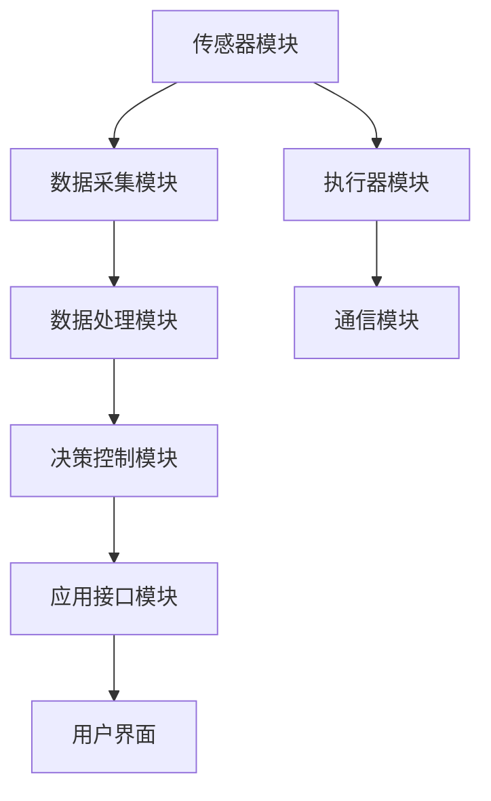
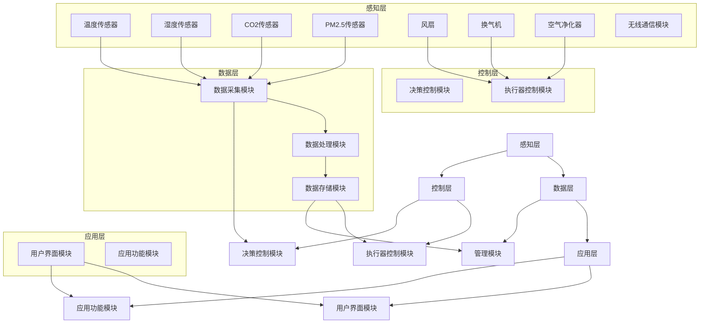
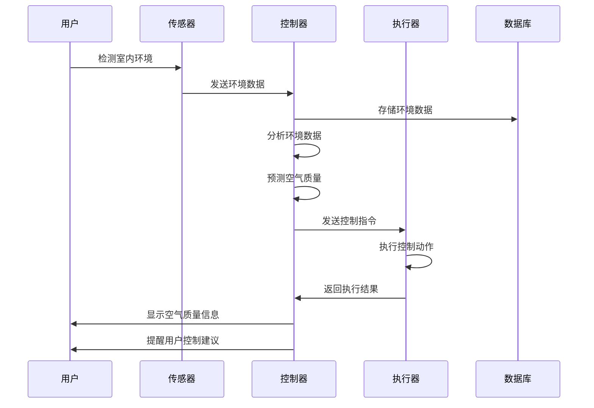

                 

### 设计《AI Agent在智能窗台中的室内空气质量优化》书目录大纲的步骤

**步骤 1：确定全书的基本结构**

首先，我们需要明确这本书的主要内容和目标读者，以确定全书的基本结构。考虑到书籍的目标是探讨AI Agent在智能窗台中的室内空气质量优化，我们可以将全书分为以下四个主要部分：

1. AI Agent概述与理论基础
2. 室内空气质量优化算法
3. 系统设计与实现
4. 最佳实践与未来展望

**步骤 2：设计每个部分的具体章节**

在确定基本结构后，我们需要为每个部分设计具体的章节。以下是每个部分的具体章节设计：

**第一部分：AI Agent概述与理论基础**

- 第1章：AI Agent的基本概念与分类
- 第2章：智能窗台系统架构
- 第3章：室内空气质量检测技术

**第二部分：室内空气质量优化算法**

- 第4章：室内空气质量预测模型
- 第5章：室内空气质量控制策略
- 第6章：AI Agent在智能窗台中的应用

**第三部分：系统设计与实现**

- 第7章：智能窗台系统设计与开发
- 第8章：AI Agent实现与算法优化
- 第9章：系统部署与维护

**第四部分：最佳实践与未来展望**

- 第10章：最佳实践

**步骤 3：细化每个章节的子标题**

为每个章节进一步细化子标题，确保内容结构清晰，逻辑性强。以下是细化后的子标题：

**第一部分：AI Agent概述与理论基础**

- 第1章：AI Agent的基本概念与分类
  - 1.1 AI Agent的定义
  - 1.2 AI Agent的分类
  - 1.3 AI Agent的核心特征

- 第2章：智能窗台系统架构
  - 2.1 智能窗台系统概述
  - 2.2 智能窗台硬件架构
  - 2.3 智能窗台软件架构

- 第3章：室内空气质量检测技术
  - 3.1 空气质量指标与监测方法
  - 3.2 空气质量传感器技术
  - 3.3 数据采集与预处理

**第二部分：室内空气质量优化算法**

- 第4章：室内空气质量预测模型
  - 4.1 预测模型概述
  - 4.2 时间序列预测方法
  - 4.3 基于机器学习的空气质量预测

- 第5章：室内空气质量控制策略
  - 5.1 控制策略概述
  - 5.2 反馈控制策略
  - 5.3 前馈控制策略

- 第6章：AI Agent在智能窗台中的应用
  - 6.1 AI Agent的集成与部署
  - 6.2 AI Agent在室内空气质量优化中的应用案例
  - 6.3 AI Agent的性能评估与优化

**第三部分：系统设计与实现**

- 第7章：智能窗台系统设计与开发
  - 7.1 系统需求分析
  - 7.2 系统架构设计
  - 7.3 系统功能模块设计

- 第8章：AI Agent实现与算法优化
  - 8.1 AI Agent核心算法实现
  - 8.2 算法优化与性能分析
  - 8.3 AI Agent的性能测试

- 第9章：系统部署与维护
  - 9.1 系统部署流程
  - 9.2 系统维护策略
  - 9.3 故障排查与处理

**第四部分：最佳实践与未来展望**

- 第10章：最佳实践

**步骤 4：创建核心概念与联系**

在每个章节中，我们需要确定核心概念，并列出概念属性特征对比表格和ER实体关系图架构。以下是一个示例：

**第2章：智能窗台系统架构**

- **核心概念**：智能窗台系统架构
- **概念属性特征对比表格**：

  | 概念名称 | 功能 | 技术实现 |
  |----------|------|----------|
  | 硬件架构 | 数据采集、执行控制 | 传感器、执行器 |
  | 软件架构 | 数据处理、决策支持 | 人工智能算法、数据存储 |

- **ER实体关系图架构**：

  ```mermaid
  graph LR
  A[智能窗台] --> B[硬件架构]
  A --> C[软件架构]
  B --> D[传感器]
  B --> E[执行器]
  C --> F[人工智能算法]
  C --> G[数据存储]
  ```

**步骤 5：编写算法原理讲解**

对于涉及算法的章节，我们需要使用Mermaid绘制算法流程图，并用Python源代码详细阐述。以下是一个示例：

**第4章：室内空气质量预测模型**

- **算法原理讲解**：

  - **时间序列预测方法**：

    ```mermaid
    graph LR
    A[时间序列数据] --> B[特征工程]
    B --> C[模型选择]
    C --> D[训练模型]
    D --> E[预测结果]
    ```

  - **基于机器学习的空气质量预测**：

    ```python
    # Python代码示例
    from sklearn.ensemble import RandomForestRegressor

    # 数据预处理
    X_train, X_test, y_train, y_test = train_test_split(X, y, test_size=0.2, random_state=42)

    # 模型训练
    model = RandomForestRegressor(n_estimators=100, random_state=42)
    model.fit(X_train, y_train)

    # 预测
    predictions = model.predict(X_test)
    ```

**步骤 6：设计系统分析与架构设计方案**

我们需要描述问题场景和项目介绍，并使用Mermaid创建系统功能设计类图、系统架构设计图、系统接口设计和系统交互序列图。

**第7章：智能窗台系统设计与开发**

- **问题场景与项目介绍**：
  
  智能窗台是一个结合硬件与软件的智能家居系统，旨在实时监测室内空气质量，并通过控制通风系统来优化空气质量。

- **系统功能设计类图**：

  ```mermaid
  graph LR
  A[User] --> B[Window]
  B --> C[Sensor]
  C --> D[Data Processor]
  D --> E[Air Quality Model]
  E --> F[Controller]
  ```

- **系统架构设计图**：

  ```mermaid
  graph TB
  A[User Interface] --> B[Data Collection]
  B --> C[Data Storage]
  C --> D[Data Processing]
  D --> E[Air Quality Prediction]
  E --> F[Control Mechanism]
  ```

- **系统接口设计**：

  ```mermaid
  graph TD
  A[User] --> B[API]
  B --> C[Window Control]
  C --> D[Data Retrieval]
  D --> E[Notification System]
  ```

- **系统交互序列图**：

  ```mermaid
  graph TD
  A[User] --> B[Request Data]
  B --> C[API]
  C --> D[Fetch Data]
  D --> E[Process Data]
  E --> F[Predict Air Quality]
  F --> G[Control Window]
  G --> H[Notify User]
  ```

**步骤 7：准备项目实战部分**

我们需要设计环境安装、系统核心实现源代码的讲解，并提供代码应用解读与分析，以及实际案例的分析和详细讲解剖析。

**第8章：AI Agent实现与算法优化**

- **环境安装**：

  详细讲解如何搭建开发环境，包括所需的软件和库的安装。

- **系统核心实现源代码**：

  提供Python代码示例，展示AI Agent的核心算法实现。

- **代码应用解读与分析**：

  分析代码的功能和实现细节，解释算法的工作原理。

- **实际案例分析与详细讲解**：

  分析实际应用案例，展示AI Agent在室内空气质量优化中的效果。

**步骤 8：编写最佳实践 tips、小结、注意事项、拓展阅读等内容**

在书的结尾部分，我们需要总结每个章节的核心要点，提供额外的学习资源和注意事项。

- **最佳实践 tips**：

  提供在实际应用中的一些技巧和注意事项。

- **小结**：

  总结书中的关键知识点和主要贡献。

- **注意事项**：

  强调在应用书中内容时需要注意的问题。

- **拓展阅读**：

  推荐一些相关的文献和资源，以供读者进一步学习。

**步骤 9：汇总并检查**

将所有章节和大纲内容汇总，确保目录结构清晰，内容完整。检查是否满足简洁性、格式和内容完整性等要求。

**步骤 10：调整和优化**

根据反馈进行调整和优化，确保目录大纲的逻辑性和可读性。

**开始编写《AI Agent在智能窗台中的室内空气质量优化》书的目录大纲**

现在，我们已经完成了《AI Agent在智能窗台中的室内空气质量优化》书目录大纲的设计，接下来将逐步开始编写书的内容。我们将遵循之前设计的步骤，确保每个章节的内容都符合要求，并且逻辑清晰、结构紧凑、简单易懂。

### 第一部分：AI Agent概述与理论基础

#### 第1章：AI Agent的基本概念与分类

#### 1.1 AI Agent的定义

人工智能（AI）作为一种模拟人类智能的计算机科学领域，旨在使计算机系统具备学习、推理、决策等智能行为。在AI领域，Agent是一个核心概念。一个Agent可以被定义为一种能够感知环境并通过执行特定动作来影响环境的计算实体。它能够独立地执行任务，并在面对不确定性和变化时做出决策。

一个典型的AI Agent通常具备以下几个基本特征：

1. **感知能力**：Agent能够感知其周围环境，获取各种形式的信息，如视觉、听觉、触觉等。
2. **自主性**：Agent能够自主地行动，不受外部直接控制，能够根据目标和当前环境状态做出决策。
3. **目标导向性**：Agent在执行任务时具有明确的目标，并通过调整其行为来达成这些目标。
4. **适应性**：Agent能够适应环境的变化，通过学习和调整行为来提高其性能。

AI Agent可以进一步分类为以下几种：

1. **基于规则的Agent**：这种Agent通过一组预定义的规则来指导其行为。当感知到特定事件时，Agent会根据规则进行相应的操作。
2. **基于模型的Agent**：这种Agent使用模型来表示其环境，并通过模型预测和评估不同的行动方案。它通常使用机器学习算法来训练模型。
3. **基于行为的Agent**：这种Agent通过观察和学习其他Agent的行为来模仿其行为。它通常使用强化学习算法来学习和优化行为。

#### 1.2 AI Agent的分类

根据Agent的感知能力和决策方式，我们可以将AI Agent分为以下几类：

1. **完全感知Agent**：这种Agent能够完全感知其环境，并在此基础上做出决策。它通常使用决策树、神经网络等算法来处理复杂的感知数据。
2. **有限感知Agent**：这种Agent无法完全感知其环境，只能获取部分信息。它通常使用马尔可夫决策过程（MDP）等算法来处理不确定性问题。
3. **基于模型的Agent**：这种Agent使用环境模型来预测未来的状态，并基于模型做出决策。它通常使用预测模型如时间序列模型、回归模型等。
4. **基于行为的Agent**：这种Agent通过观察和学习其他Agent的行为来调整自己的行为。它通常使用强化学习算法来学习和优化行为。

#### 1.3 AI Agent的核心特征

AI Agent的核心特征包括感知能力、自主性、目标导向性和适应性。这些特征共同决定了Agent的行为和性能。以下是每个特征的详细解释：

1. **感知能力**：Agent需要具备感知能力来获取环境信息。感知能力包括视觉、听觉、触觉等多种感知方式。例如，一个自动驾驶汽车Agent需要通过摄像头、雷达等设备来感知道路状况、交通信号和其他车辆。
2. **自主性**：自主性意味着Agent能够独立地执行任务，不受外部直接控制。它可以在没有人类干预的情况下自主地做出决策。这种自主性使得Agent能够在复杂和动态的环境中运作。
3. **目标导向性**：目标导向性是指Agent在执行任务时具有明确的目标，并通过调整其行为来达成这些目标。例如，一个购物指南Agent的目标是帮助用户找到最满意的商品，它会根据用户的历史数据和偏好来推荐商品。
4. **适应性**：适应性是指Agent能够适应环境的变化，通过学习和调整行为来提高其性能。这种适应性使得Agent能够在不确定和变化的环境中保持稳定和高效的性能。

通过这些核心特征，AI Agent能够在各种复杂和动态的环境中执行任务，提供智能化的解决方案。

#### 第2章：智能窗台系统架构

#### 2.1 智能窗台系统概述

智能窗台系统是一种智能家居技术，旨在通过集成多种传感器和执行器来监测和优化室内空气质量。该系统结合了硬件和软件组件，能够实时收集环境数据，并通过智能算法进行分析和控制，以实现室内空气质量的优化。

智能窗台系统的核心组件包括：

1. **传感器**：传感器用于收集室内空气质量数据，如温度、湿度、二氧化碳浓度、PM2.5等。
2. **执行器**：执行器如风扇和换气机，用于调节室内空气流动和更换新鲜空气。
3. **控制单元**：控制单元负责接收传感器数据，执行智能算法，并控制执行器进行相应的操作。
4. **用户界面**：用户界面允许用户查看系统状态、调整设置、接收通知等。

智能窗台系统的目标是通过实时监测和调节室内空气质量，提高居住者的舒适度和健康水平。系统的主要功能包括：

1. **数据监测**：实时收集室内空气质量数据，并上传至云端进行存储和分析。
2. **自动调节**：根据空气质量数据和预设规则，自动调节执行器以优化空气质量。
3. **手动控制**：允许用户通过应用程序或实体控制面板手动控制系统功能。
4. **通知与反馈**：向用户发送空气质量状况的通知，并提供改进建议。

#### 2.2 智能窗台硬件架构

智能窗台的硬件架构包括传感器、执行器和通信模块。以下是各个组件的详细说明：

1. **传感器**：
   - **温度传感器**：用于测量室内温度，通常使用热敏电阻或红外传感器。
   - **湿度传感器**：用于测量室内湿度，通常使用电容式或电阻式传感器。
   - **二氧化碳传感器**：用于测量室内二氧化碳浓度，通常使用电化学传感器或红外传感器。
   - **PM2.5传感器**：用于测量室内颗粒物浓度，通常使用激光传感器或电容传感器。

2. **执行器**：
   - **风扇**：用于促进室内空气流动，通常使用交流电机或直流电机。
   - **换气机**：用于更换室内空气，通常使用离心风机或轴流风机。
   - **窗帘控制器**：用于控制窗帘的开合，通常使用电动机或气动执行器。

3. **通信模块**：
   - **Wi-Fi模块**：用于将传感器数据和执行器控制命令无线传输到控制单元。
   - **蓝牙模块**：用于短距离通信，如用户设备与控制单元之间的通信。

智能窗台的硬件架构设计需要考虑以下因素：

1. **可靠性**：传感器和执行器需要具备高可靠性，确保系统能够稳定运行。
2. **适应性**：硬件组件应能够适应不同的环境条件和使用场景。
3. **易维护性**：硬件组件的设计应便于维护和更换，以提高系统的寿命和效率。

#### 2.3 智能窗台软件架构

智能窗台的软件架构包括数据采集、数据处理、决策控制和应用接口等模块。以下是各个组件的详细说明：

1. **数据采集模块**：
   - 负责从传感器获取实时数据，并将数据传输到数据处理模块。
   - 数据采集模块可以使用Wi-Fi、蓝牙等无线通信技术，确保数据传输的高效性和稳定性。

2. **数据处理模块**：
   - 负责对采集到的数据进行预处理，如过滤噪声、去除异常值等。
   - 数据处理模块可以使用机器学习算法，如时间序列分析、回归分析等，对空气质量数据进行分析和预测。

3. **决策控制模块**：
   - 根据空气质量数据和预设规则，决策控制模块负责生成控制命令，以调节执行器的状态。
   - 决策控制模块可以使用人工智能算法，如深度学习、强化学习等，以提高决策的准确性和适应性。

4. **应用接口模块**：
   - 提供用户界面，允许用户查看系统状态、调整设置、接收通知等。
   - 应用接口模块可以使用Web应用程序、移动应用程序等形式，以便用户随时随地访问和控制智能窗台系统。

智能窗台的软件架构设计需要考虑以下因素：

1. **可扩展性**：软件架构应具备可扩展性，以便在未来添加新的功能或硬件组件。
2. **可维护性**：软件架构应便于维护和更新，以确保系统的长期稳定运行。
3. **用户体验**：用户界面设计应简洁直观，以提高用户的操作便捷性和满意度。

通过智能窗台系统的硬件和软件架构的协同工作，我们可以实现实时监测和优化室内空气质量，为用户提供一个健康、舒适的居住环境。

#### 第3章：室内空气质量检测技术

#### 3.1 空气质量指标与监测方法

室内空气质量（IAQ）是一个影响人类健康和生活质量的重要环境参数。为了有效监测和控制室内空气质量，我们需要了解关键的空气质量指标和相应的监测方法。

**空气质量指标**

室内空气质量指标包括以下几种：

1. **温度**：温度是影响人体舒适度和室内通风系统运行效率的关键因素。通常使用摄氏度（°C）作为单位。
2. **湿度**：湿度影响室内空气的清新度和微生物的繁殖。通常使用百分比相对湿度（%）表示。
3. **二氧化碳（CO2）浓度**：CO2浓度是室内空气质量的重要指标，高浓度的CO2可能导致头痛、疲劳和注意力不集中。通常使用ppm（每百万分之一）表示。
4. **颗粒物浓度**：颗粒物（如PM2.5和PM10）是室内空气污染的主要来源，长时间暴露在高浓度的颗粒物中可能导致呼吸系统疾病。通常使用μg/m³（微克每立方米）表示。
5. **挥发性有机化合物（VOCs）**：VOCs是一类常见的室内空气污染物，可能来自家具、涂料、清洁剂等。长时间暴露在高浓度的VOCs中可能导致头痛、过敏和呼吸问题。通常使用ppb（每亿分之一）表示。

**监测方法**

为了准确监测室内空气质量，我们可以采用以下几种方法：

1. **传感器监测**：
   - **温度传感器**：常用的温度传感器包括热敏电阻、热电偶等。它们能够实时测量室内温度，并输出相应的电信号。
   - **湿度传感器**：常用的湿度传感器包括电容式、电阻式和红外传感器。它们能够实时测量室内湿度，并提供精确的测量结果。
   - **CO2传感器**：常见的CO2传感器有电化学传感器、红外传感器等。电化学传感器通过测量电极之间的电势差来检测CO2浓度，而红外传感器通过检测CO2分子在红外光谱中的吸收率来测量浓度。
   - **颗粒物传感器**：常用的颗粒物传感器包括激光传感器和电容传感器。激光传感器使用激光束来测量颗粒物的散射光强度，从而计算出颗粒物的浓度。电容传感器通过测量颗粒物对电容器电容的影响来检测颗粒物的浓度。
   - **VOCs传感器**：常见的VOCs传感器包括半导体传感器、电化学传感器等。半导体传感器通过测量气体对半导体材料的导电性变化来检测VOCs浓度，而电化学传感器通过检测气体对电极之间的电势差变化来测量浓度。

2. **化学分析方法**：
   - **气相色谱法**：气相色谱法（GC）是一种常用的化学分析方法，用于检测和定量分析室内空气中的VOCs和其他有机化合物。该方法通过将气体样品注入色谱仪，并根据不同的保留时间和峰面积来识别和定量分析目标化合物。
   - **质谱法**：质谱法（MS）是一种强大的分析技术，能够提供高精度的化合物结构和浓度信息。在室内空气质量监测中，气相色谱-质谱联用技术（GC-MS）常用于检测和定量分析室内空气中的VOCs和其他污染物。
   - **化学传感器法**：化学传感器法通过测量特定气体的化学反应来检测其浓度。例如，电化学传感器通过测量电极之间的电势差来检测气体浓度，而半导体传感器通过测量气体对半导体材料的导电性变化来检测浓度。

**传感器监测方法的优缺点**

传感器监测方法具有以下优缺点：

- **优点**：
  - **实时性**：传感器能够实时监测室内空气质量，提供即时的数据反馈。
  - **便捷性**：传感器安装简单，不需要复杂的实验室设备。
  - **自动化**：传感器可以与智能系统集成，实现自动控制。

- **缺点**：
  - **准确性**：传感器的测量结果可能受到环境影响，如温度、湿度等，导致数据偏差。
  - **使用寿命**：传感器的使用寿命有限，需要定期更换或校准。
  - **成本**：传感器和监测系统的成本相对较高，尤其是高精度传感器。

**化学分析方法**

化学分析方法具有以下优缺点：

- **优点**：
  - **高精度**：化学分析方法能够提供高精度的测量结果，准确识别和定量分析污染物。
  - **全面性**：化学分析方法可以检测多种污染物，包括VOCs、颗粒物等。

- **缺点**：
  - **复杂性**：化学分析方法通常需要复杂的实验室设备和操作流程。
  - **时效性**：化学分析方法需要较长时间来处理样品和分析结果。
  - **成本**：化学分析方法的成本较高，不适用于实时监测和自动化控制。

综上所述，室内空气质量监测方法的选择应基于实际需求和预算。传感器监测方法适合实时监测和自动化控制，而化学分析方法则适用于精确分析和复杂污染物检测。

#### 3.2 空气质量传感器技术

空气质量传感器是室内空气质量监测系统中的核心组件，用于实时测量和分析各种空气质量指标，如温度、湿度、二氧化碳浓度、颗粒物浓度等。以下是几种常见的空气质量传感器及其工作原理：

1. **温度传感器**：
   - **热敏电阻**：热敏电阻是一种基于材料电阻随温度变化的传感器。当温度升高时，热敏电阻的电阻值减小，反之则增大。常见的热敏电阻材料包括金属氧化物和半导体材料。
   - **热电偶**：热电偶是一种基于热电效应的传感器，由两种不同材料的导体组成。当两端温度不同时，会在两种材料之间产生热电势差。根据热电偶材料的组合，可以测量不同的温度范围。

2. **湿度传感器**：
   - **电容式传感器**：电容式湿度传感器基于电容随湿度变化的原理。传感器由两个金属板组成，中间夹有湿敏材料。当湿度变化时，湿敏材料的电容值发生变化，通过测量电容变化可以确定湿度。
   - **电阻式传感器**：电阻式湿度传感器基于电阻随湿度变化的原理。传感器由一个电阻元件和一个参考电阻组成，当湿度变化时，电阻元件的电阻值发生变化，通过测量电阻变化可以确定湿度。
   - **电化学传感器**：电化学湿度传感器通过测量气体和液体之间的电化学反应来测量湿度。常见的电化学传感器包括氯化锂传感器和钨酸锂传感器。

3. **二氧化碳传感器**：
   - **电化学传感器**：电化学二氧化碳传感器通过测量电极之间的电势差来检测二氧化碳浓度。传感器通常包含两个电极，一个用于氧化反应，另一个用于还原反应。当二氧化碳浓度增加时，电极之间的电势差发生变化。
   - **红外传感器**：红外二氧化碳传感器利用二氧化碳分子在红外光谱中的吸收特性来检测浓度。传感器通过发射红外光并测量吸收率，可以确定二氧化碳浓度。

4. **颗粒物传感器**：
   - **激光传感器**：激光颗粒物传感器通过发射激光束并测量颗粒物对激光的散射光强度来检测颗粒物浓度。当激光束通过含有颗粒物的空气时，颗粒物会散射激光，导致散射光强度发生变化。
   - **电容传感器**：电容颗粒物传感器通过测量颗粒物对电容器电容的影响来检测浓度。传感器由一个电容器和一个参考电容器组成，当颗粒物附着在电容器的表面时，电容值发生变化。

空气质量传感器技术具有以下特点：

1. **实时性**：空气质量传感器能够实时测量和监测空气质量指标，提供实时数据反馈。
2. **准确性**：不同类型的传感器具有不同的测量精度，选择合适的传感器可以保证监测结果的准确性。
3. **便携性**：许多空气质量传感器设计为便携式设备，便于现场监测和移动使用。
4. **自动化**：空气质量传感器可以与智能系统集成，实现自动监测和控制。

空气质量传感器技术在室内空气质量监测中的应用包括：

1. **智能家居**：空气质量传感器可以集成到智能家居系统中，实时监测室内空气质量，并根据监测结果自动调节通风系统和空气净化器。
2. **办公室和商业空间**：空气质量传感器可以帮助办公室和商业空间管理人员实时监测空气质量，确保员工健康和工作效率。
3. **工业和环境监测**：空气质量传感器可以用于工业排放监测和环境空气质量监测，提供数据支持决策和改善空气质量。

通过使用不同类型的空气质量传感器，我们可以全面监测室内空气质量，为居住者提供一个健康、舒适的生活环境。

#### 3.3 数据采集与预处理

在智能窗台系统中，数据采集是关键步骤，它直接影响到后续的空气质量分析和优化效果。为了确保数据的质量和可靠性，我们需要对数据进行有效的采集和预处理。

**数据采集**：

数据采集涉及到多个传感器，包括温度传感器、湿度传感器、二氧化碳传感器和颗粒物传感器。每个传感器都会以一定的频率产生数据。为了实现实时监控，我们通常采用无线传感器网络（WSN）来传输这些数据。以下是数据采集过程的详细步骤：

1. **传感器数据生成**：传感器根据其工作原理，实时生成温度、湿度、二氧化碳浓度和颗粒物浓度等数据。
2. **无线传输**：传感器通过无线通信模块（如Wi-Fi、蓝牙或Zigbee）将数据传输到中央控制单元。无线传输具有低功耗、低成本和高灵活性的优势。
3. **数据存储**：中央控制单元将接收到的传感器数据进行初步存储，以便后续处理和分析。

**数据预处理**：

数据预处理是确保数据质量和有效性的重要环节。以下是数据预处理的主要步骤：

1. **去噪**：传感器数据可能受到噪声干扰，导致测量结果不准确。去噪过程包括滤波、平滑和信号处理等步骤，以消除噪声干扰，提高数据质量。
2. **数据清洗**：数据清洗包括去除重复数据、缺失值填充和异常值处理等。重复数据可能会影响数据的统计特性，缺失值需要通过插值或均值填补等方法进行填充，异常值则需要根据具体情况进行处理。
3. **归一化**：不同类型的传感器数据可能具有不同的量纲和量级。为了便于后续分析和比较，需要对数据进行归一化处理，将数据转换为统一的量纲和范围。
4. **特征提取**：特征提取是数据预处理的重要步骤，它从原始数据中提取出有用的特征，用于后续的建模和分析。特征提取可以通过统计方法、机器学习方法或专家知识实现。

**数据处理流程**：

1. **数据采集**：传感器实时采集温度、湿度、二氧化碳浓度和颗粒物浓度数据，并通过无线通信模块传输到中央控制单元。
2. **去噪**：对传感器数据进行滤波和平滑处理，消除噪声干扰。
3. **数据清洗**：检查数据是否存在重复、缺失或异常值，并进行相应的处理。
4. **归一化**：对传感器数据进行归一化处理，确保数据具有统一的量纲和范围。
5. **特征提取**：从预处理后的数据中提取有用的特征，如温度的均值、湿度的高斯分布等。

**数据预处理的重要性**：

数据预处理是智能窗台系统中不可或缺的一步，它对后续的空气质量分析和优化至关重要。以下是数据预处理的重要性：

1. **提高数据质量**：通过去噪、清洗和归一化等步骤，数据预处理能够消除噪声和异常值，提高数据的准确性和可靠性。
2. **增强模型性能**：预处理后的数据可以作为输入，用于训练空气质量预测模型和控制策略。高质量的数据能够提高模型的性能和预测准确性。
3. **节省计算资源**：预处理后的数据量通常较小，有利于节约存储空间和计算资源，提高系统的响应速度和处理效率。

总之，数据采集与预处理是智能窗台系统中的关键步骤，它直接影响系统的性能和可靠性。通过有效的数据采集和预处理，我们可以确保空气质量监测和优化的准确性，为用户提供一个健康、舒适的生活环境。

#### 第4章：室内空气质量预测模型

#### 4.1 预测模型概述

室内空气质量（IAQ）预测模型是智能窗台系统的核心组件，它能够根据历史数据和当前环境条件，预测未来一段时间内的空气质量状况。这种预测能力对于及时采取优化措施，提高室内空气质量具有重要作用。预测模型可以分为两大类：时间序列预测模型和基于机器学习的空气质量预测模型。

**时间序列预测模型**

时间序列预测模型是一种基于历史时间序列数据，通过分析时间序列的特性来预测未来值的统计方法。常见的模型包括：

1. **自回归模型（AR）**：自回归模型通过分析当前值与过去值的线性关系来预测未来值。它适用于数据序列具有自相关特性的情况。
2. **移动平均模型（MA）**：移动平均模型通过计算过去固定时间窗口内的平均值来预测未来值。它适用于数据序列具有趋势和周期性的情况。
3. **自回归移动平均模型（ARMA）**：自回归移动平均模型结合了自回归模型和移动平均模型的特点，适用于具有自相关和趋势特性的数据序列。
4. **自回归积分滑动平均模型（ARIMA）**：自回归积分滑动平均模型是ARMA模型的扩展，通过差分操作消除数据序列中的非平稳性，适用于具有自相关、趋势和季节性的数据序列。

**基于机器学习的空气质量预测模型**

基于机器学习的空气质量预测模型通过学习历史数据和特征，利用机器学习算法来建立预测模型。常见的模型包括：

1. **线性回归模型**：线性回归模型通过拟合数据点之间的线性关系来预测未来值。它适用于数据序列具有线性关系的情况。
2. **决策树模型**：决策树模型通过构建树形结构来划分数据集，并使用叶节点进行预测。它适用于数据序列具有非线性关系的情况。
3. **支持向量机（SVM）**：支持向量机模型通过找到最优的超平面来划分数据集，并进行预测。它适用于数据序列具有高维特征和线性不可分的情况。
4. **神经网络模型**：神经网络模型通过多层神经元之间的连接和学习来拟合数据序列。它适用于数据序列具有复杂非线性关系的情况。

**预测模型的选择**

选择合适的预测模型取决于数据特性、预测目标和计算资源。以下是选择预测模型时需要考虑的因素：

1. **数据特性**：数据是否具有线性或非线性关系、是否包含趋势和季节性、是否具有自相关性等。这些特性决定了适用的模型类型。
2. **预测目标**：预测目标是短期预测还是长期预测、预测精度要求高等。不同的预测目标会影响模型的选择。
3. **计算资源**：模型训练和预测的计算资源需求。对于实时预测和资源受限的场合，需要选择计算资源占用较少的模型。

**预测模型的性能评估**

预测模型的性能评估是确保模型有效性的重要环节。常用的评估指标包括：

1. **均方误差（MSE）**：均方误差是预测值与实际值之间差异的平方和的平均值。它衡量预测值与实际值的偏差程度。
2. **均方根误差（RMSE）**：均方根误差是均方误差的平方根。它是一个更直观的衡量指标，反映了预测值与实际值的相对误差。
3. **决定系数（R²）**：决定系数是拟合值与实际值之间差异的百分比。R²值越接近1，表示模型的拟合效果越好。

通过选择合适的预测模型并进行性能评估，我们可以建立准确的室内空气质量预测模型，为智能窗台系统提供有效的决策支持。

#### 4.2 时间序列预测方法

时间序列预测方法在室内空气质量（IAQ）预测中占据重要地位，因为空气质量数据往往表现出明显的时序特性。以下将详细介绍几种常见的时间序列预测方法，包括自回归模型（AR）、移动平均模型（MA）、自回归移动平均模型（ARMA）和自回归积分滑动平均模型（ARIMA）。

**自回归模型（AR）**

自回归模型（Autoregressive Model，AR）是一种基于当前值与其前几个历史值的线性组合来预测未来值的模型。AR模型的核心思想是当前时刻的值可以表示为过去若干个时刻值的线性组合。

公式表示为：

\[ X_t = c + \phi_1 X_{t-1} + \phi_2 X_{t-2} + \ldots + \phi_p X_{t-p} + \varepsilon_t \]

其中，\( X_t \) 是当前时刻的值，\( c \) 是常数项，\( \phi_1, \phi_2, \ldots, \phi_p \) 是自回归系数，\( \varepsilon_t \) 是误差项。

**移动平均模型（MA）**

移动平均模型（Moving Average Model，MA）是一种基于过去固定时间窗口内的平均值来预测未来值的模型。MA模型的核心思想是当前时刻的值可以表示为过去若干个时间窗口内的平均值。

公式表示为：

\[ X_t = \mu + \theta_1 \varepsilon_{t-1} + \theta_2 \varepsilon_{t-2} + \ldots + \theta_q \varepsilon_{t-q} \]

其中，\( X_t \) 是当前时刻的值，\( \mu \) 是均值项，\( \theta_1, \theta_2, \ldots, \theta_q \) 是移动平均系数，\( \varepsilon_{t-1}, \varepsilon_{t-2}, \ldots, \varepsilon_{t-q} \) 是误差项。

**自回归移动平均模型（ARMA）**

自回归移动平均模型（Autoregressive Moving Average Model，ARMA）结合了AR模型和MA模型的特点，适用于具有自相关和趋势性的数据序列。ARMA模型同时考虑了当前值与其历史值的关系以及过去误差的影响。

公式表示为：

\[ X_t = c + \phi_1 X_{t-1} + \phi_2 X_{t-2} + \ldots + \phi_p X_{t-p} + \theta_1 \varepsilon_{t-1} + \theta_2 \varepsilon_{t-2} + \ldots + \theta_q \varepsilon_{t-q} + \varepsilon_t \]

其中，\( X_t \) 是当前时刻的值，\( c \) 是常数项，\( \phi_1, \phi_2, \ldots, \phi_p \) 是自回归系数，\( \theta_1, \theta_2, \ldots, \theta_q \) 是移动平均系数，\( \varepsilon_t \) 是误差项。

**自回归积分滑动平均模型（ARIMA）**

自回归积分滑动平均模型（Autoregressive Integrated Moving Average Model，ARIMA）是ARMA模型的扩展，适用于具有非平稳性的时间序列数据。ARIMA模型通过差分操作将非平稳序列转化为平稳序列，然后应用ARMA模型进行预测。

差分操作分为一阶差分（1st difference）和二阶差分（2nd difference），公式表示为：

\[ dX_t = X_t - X_{t-1} \]
\[ d^2X_t = dX_t - dX_{t-1} \]

ARIMA模型公式表示为：

\[ d^2X_t = c + \phi_1 dX_{t-1} + \phi_2 dX_{t-2} + \ldots + \phi_p dX_{t-p} + \theta_1 \varepsilon_{t-1} + \theta_2 \varepsilon_{t-2} + \ldots + \theta_q \varepsilon_{t-q} + \varepsilon_t \]

其中，\( d^2X_t \) 是二阶差分后的值，\( c \) 是常数项，\( \phi_1, \phi_2, \ldots, \phi_p \) 是自回归系数，\( \theta_1, \theta_2, \ldots, \theta_q \) 是移动平均系数，\( \varepsilon_t \) 是误差项。

**ARIMA模型的使用方法**

以下是一个使用Python和pandas库实现ARIMA模型进行时间序列预测的例子：

```python
import pandas as pd
from statsmodels.tsa.arima.model import ARIMA

# 读取时间序列数据
data = pd.read_csv('air_quality.csv')
data['date'] = pd.to_datetime(data['date'])
data.set_index('date', inplace=True)
data = data.asfreq('H')  # 设置时间间隔为小时

# 分离训练集和测试集
train_data = data[:'2022-01-01']
test_data = data['2022-01-01':]

# 建立ARIMA模型
model = ARIMA(train_data['co2'], order=(5, 1, 2))
model_fit = model.fit()

# 进行预测
predictions = model_fit.forecast(steps=len(test_data))

# 输出预测结果
predictions.plot()
plt.show()
```

通过以上时间序列预测方法，我们可以有效地预测室内空气质量的未来趋势，为智能窗台系统提供数据支持。

#### 4.3 基于机器学习的空气质量预测

基于机器学习的空气质量预测方法利用历史数据和学习算法来建立预测模型。这种方法能够捕捉复杂的时间序列特性，提高预测的准确性和可靠性。以下是几种常见的基于机器学习的空气质量预测模型，包括线性回归模型、决策树模型、支持向量机（SVM）和神经网络模型。

**线性回归模型**

线性回归模型是一种简单而常用的机器学习预测方法，通过拟合数据点之间的线性关系来预测未来值。线性回归模型适用于具有线性关系的空气质量数据。

公式表示为：

\[ y = \beta_0 + \beta_1 x_1 + \beta_2 x_2 + \ldots + \beta_n x_n + \varepsilon \]

其中，\( y \) 是预测值，\( x_1, x_2, \ldots, x_n \) 是特征值，\( \beta_0, \beta_1, \beta_2, \ldots, \beta_n \) 是回归系数，\( \varepsilon \) 是误差项。

使用Python的scikit-learn库进行线性回归预测的示例代码如下：

```python
from sklearn.linear_model import LinearRegression
import pandas as pd

# 读取数据
data = pd.read_csv('air_quality.csv')
X = data[['temperature', 'humidity']]
y = data['co2']

# 建立线性回归模型
model = LinearRegression()
model.fit(X, y)

# 进行预测
predictions = model.predict(X)

# 输出预测结果
predictions.plot()
plt.show()
```

**决策树模型**

决策树模型通过构建树形结构来划分数据集，并使用叶节点进行预测。它适用于具有非线性关系的空气质量数据。

决策树模型的构建步骤包括：

1. 选择特征：选择一个特征作为划分依据。
2. 计算信息增益：计算每个特征的增益，选择增益最大的特征作为划分依据。
3. 划分数据：根据所选特征进行数据划分，生成新的子集。
4. 递归构建：对每个子集重复步骤1-3，直到满足停止条件。

使用Python的scikit-learn库进行决策树预测的示例代码如下：

```python
from sklearn.tree import DecisionTreeRegressor
import pandas as pd

# 读取数据
data = pd.read_csv('air_quality.csv')
X = data[['temperature', 'humidity']]
y = data['co2']

# 建立决策树模型
model = DecisionTreeRegressor()
model.fit(X, y)

# 进行预测
predictions = model.predict(X)

# 输出预测结果
predictions.plot()
plt.show()
```

**支持向量机（SVM）**

支持向量机是一种强大的分类和回归模型，通过找到最优的超平面来划分数据集。SVM适用于高维特征和线性不可分的数据。

SVM的预测公式为：

\[ w \cdot x + b = 0 \]

其中，\( w \) 是权重向量，\( x \) 是特征向量，\( b \) 是偏置项。

使用Python的scikit-learn库进行SVM预测的示例代码如下：

```python
from sklearn.svm import SVR
import pandas as pd

# 读取数据
data = pd.read_csv('air_quality.csv')
X = data[['temperature', 'humidity']]
y = data['co2']

# 建立SVM模型
model = SVR()
model.fit(X, y)

# 进行预测
predictions = model.predict(X)

# 输出预测结果
predictions.plot()
plt.show()
```

**神经网络模型**

神经网络模型通过多层神经元之间的连接和学习来拟合数据序列，能够捕捉复杂非线性关系。常见的神经网络模型包括前馈神经网络和循环神经网络（RNN）。

神经网络模型的预测公式为：

\[ y = \sigma(\sum_{i=1}^{n} w_i \cdot x_i + b) \]

其中，\( y \) 是预测值，\( x_i \) 是输入特征，\( w_i \) 是权重，\( b \) 是偏置项，\( \sigma \) 是激活函数。

使用Python的TensorFlow库进行神经网络预测的示例代码如下：

```python
import tensorflow as tf
import pandas as pd

# 读取数据
data = pd.read_csv('air_quality.csv')
X = data[['temperature', 'humidity']]
y = data['co2']

# 建立神经网络模型
model = tf.keras.Sequential([
    tf.keras.layers.Dense(units=64, activation='relu', input_shape=(2,)),
    tf.keras.layers.Dense(units=1)
])

model.compile(optimizer='adam', loss='mse')

# 进行训练
model.fit(X, y, epochs=100)

# 进行预测
predictions = model.predict(X)

# 输出预测结果
predictions.plot()
plt.show()
```

通过上述基于机器学习的空气质量预测模型，我们可以根据不同的数据特性选择合适的模型，实现高精度的空气质量预测。这些模型不仅能够捕捉复杂的时序特性，还能够适应新的环境变化，为智能窗台系统提供强大的预测能力。

#### 第5章：室内空气质量控制策略

#### 5.1 控制策略概述

室内空气质量（IAQ）控制策略是在智能窗台系统中实现空气质量优化的关键环节。控制策略的目标是根据室内空气质量数据，通过调节通风系统和空气净化设备，维持室内空气质量在健康、舒适的范围内。控制策略可以分为反馈控制策略和前馈控制策略。

**反馈控制策略**

反馈控制策略是一种基于系统当前状态与期望状态之间的差异（误差）来调整系统输出以减少误差的方法。反馈控制策略的核心思想是“测量-反馈-调整”，即通过实时监测室内空气质量指标，将实际测量值与预设目标值进行比较，计算出误差，并根据误差调整执行器的状态。

反馈控制策略的组成部分包括：

1. **传感器**：用于实时监测室内空气质量指标，如温度、湿度、CO2浓度、颗粒物浓度等。
2. **控制器**：负责接收传感器数据，计算误差，并生成控制指令。
3. **执行器**：根据控制指令调节通风系统和空气净化设备，以调整室内空气质量。

常见的反馈控制算法包括PID控制器、模糊控制器和神经网络控制器等。

**前馈控制策略**

前馈控制策略是一种基于系统输入与期望输出的关系来预测系统输出的方法。前馈控制策略的核心思想是“预测-调整”，即通过分析系统输入（如室内外温差、湿度差、CO2浓度差等）与系统输出（室内空气质量）之间的关系，预测未来的空气质量，并提前调整执行器的状态，以避免空气质量恶化。

前馈控制策略的组成部分包括：

1. **预测模型**：用于预测未来的空气质量指标。
2. **控制器**：根据预测模型的结果，提前调整执行器的状态。
3. **执行器**：根据控制指令调节通风系统和空气净化设备。

前馈控制策略的优点包括：

- **提前响应**：通过提前预测空气质量变化，可以更早地采取调整措施，避免空气质量恶化。
- **减少误差**：由于前馈控制策略可以提前调整，因此可以减少系统误差，提高控制精度。

**反馈控制策略与前馈控制策略的比较**

| 比较项       | 反馈控制策略                           | 前馈控制策略                           |
|--------------|---------------------------------------|---------------------------------------|
| 响应时间     | 较慢，因为需要实时监测并计算误差       | 较快，因为可以提前预测并调整           |
| 精度         | 较高，因为基于实时误差调整             | 较低，因为预测误差可能导致控制效果不佳   |
| 适用场景     | 稳定的环境条件，对实时性要求较高的系统 | 变化的环境条件，对提前响应要求较高的系统 |

在实际应用中，反馈控制策略和前馈控制策略往往结合使用，以实现最优的空气质量控制效果。

#### 5.2 反馈控制策略

反馈控制策略是一种通过监测系统输出并与预期目标进行比较，从而调整系统输入以减少误差的控制方法。在室内空气质量（IAQ）控制中，反馈控制策略通过实时监测空气质量指标，如温度、湿度、CO2浓度和颗粒物浓度，并据此调整通风系统和空气净化设备，以维持室内空气质量在健康、舒适的范围内。

**反馈控制策略的核心组成部分**

1. **传感器**：传感器用于实时监测室内空气质量指标。常见的传感器包括温度传感器、湿度传感器、CO2传感器和颗粒物传感器。
2. **控制器**：控制器接收传感器数据，计算实际空气质量指标与预设目标值之间的差异（误差），并生成控制指令。控制器可以是传统的PID控制器，也可以是更先进的模糊控制器或神经网络控制器。
3. **执行器**：执行器根据控制指令调节通风系统和空气净化设备，以调整室内空气质量。常见的执行器包括风扇、换气机和空气净化器。

**反馈控制策略的工作流程**

1. **数据采集**：传感器实时采集室内空气质量数据，如温度、湿度、CO2浓度和颗粒物浓度。
2. **数据预处理**：对传感器数据进行预处理，包括去噪、滤波和归一化等步骤，以提高数据质量和可靠性。
3. **误差计算**：控制器接收预处理后的传感器数据，并将其与预设目标值进行比较，计算出误差（偏差）。误差计算公式通常为：

   \[ e(t) = setpoint(t) - actual_value(t) \]

   其中，\( setpoint(t) \) 是预设目标值，\( actual_value(t) \) 是当前实际值。

4. **控制指令生成**：控制器根据误差计算控制指令。常见的控制算法包括PID控制算法、模糊控制算法和神经网络控制算法。控制指令用于调整执行器的状态，如调整风扇转速、换气频率或空气净化强度。

5. **执行器调整**：执行器根据控制指令进行相应的操作，如调节风扇转速、换气频率或空气净化器的功率。

**反馈控制策略的优缺点**

**优点**：

- **实时性**：反馈控制策略能够实时监测和调整室内空气质量，迅速响应环境变化。
- **简单易实现**：反馈控制策略的实现相对简单，适用于各种类型的控制系统。
- **稳定性**：反馈控制策略通过实时调整，能够保持系统稳定运行，减少波动。

**缺点**：

- **滞后性**：由于反馈控制策略依赖于实时监测和计算误差，因此存在一定的时间滞后，可能无法迅速响应突发变化。
- **适应性较差**：反馈控制策略通常基于预设目标值和固定控制算法，对环境变化的适应性较差。

**反馈控制策略在智能窗台中的应用**

在智能窗台系统中，反馈控制策略可以应用于多种场景：

- **温度控制**：通过调节风扇和换气机的转速，维持室内温度在舒适范围内。
- **湿度控制**：通过调节加湿器或除湿器的运行状态，维持室内湿度在适宜水平。
- **CO2浓度控制**：通过调节换气频率和空气净化器的工作状态，降低室内CO2浓度，改善空气质量。
- **颗粒物浓度控制**：通过调节空气净化器的过滤强度，减少室内颗粒物浓度，提高空气质量。

总之，反馈控制策略在智能窗台系统中起着至关重要的作用，通过实时监测和调整室内空气质量指标，为用户提供健康、舒适的居住环境。

#### 5.3 前馈控制策略

前馈控制策略是一种基于系统输入与期望输出的关系来预测系统输出，并提前调整系统输入以减少误差的控制方法。与反馈控制策略不同，前馈控制策略通过分析系统输入（如室内外温差、湿度差、CO2浓度差等）与系统输出（室内空气质量）之间的关系，预测未来的空气质量变化，并提前采取调整措施，从而避免空气质量恶化。

**前馈控制策略的核心组成部分**

1. **预测模型**：预测模型用于预测未来的空气质量指标。预测模型可以是基于历史数据的统计模型，如ARIMA模型，也可以是基于机器学习的模型，如神经网络模型或支持向量机（SVM）模型。
2. **控制器**：控制器根据预测模型的结果，提前调整执行器的状态，以优化室内空气质量。控制器需要能够处理预测模型输出的不确定性，并制定相应的调整策略。
3. **执行器**：执行器根据控制指令调节通风系统和空气净化设备，以调整室内空气质量。常见的执行器包括风扇、换气机和空气净化器。

**前馈控制策略的工作流程**

1. **数据采集**：传感器实时采集室内外环境数据，如温度、湿度、CO2浓度和颗粒物浓度。
2. **数据预处理**：对传感器数据进行预处理，包括去噪、滤波和归一化等步骤，以提高数据质量和可靠性。
3. **预测模型输入**：将预处理后的传感器数据输入预测模型，预测未来的空气质量指标。
4. **预测结果分析**：控制器分析预测模型的结果，确定需要采取的调整措施。例如，如果预测模型显示未来的CO2浓度将升高，控制器可能会增加换气频率。
5. **控制指令生成**：控制器生成相应的控制指令，调整执行器的状态。控制指令可以是简单的开/关操作，也可以是调节执行器的功率或频率。
6. **执行器调整**：执行器根据控制指令进行相应的操作，如调整风扇转速、换气频率或空气净化器的功率。

**前馈控制策略的优缺点**

**优点**：

- **提前响应**：前馈控制策略能够提前预测空气质量变化，并提前采取调整措施，避免空气质量恶化。
- **减少误差**：由于前馈控制策略可以提前调整，因此可以减少系统误差，提高控制精度。
- **适应性**：前馈控制策略可以根据不同的环境变化预测未来的空气质量，具有一定的自适应能力。

**缺点**：

- **预测误差**：前馈控制策略依赖于预测模型，如果预测模型不准确，可能会导致控制效果不佳。
- **计算复杂度高**：前馈控制策略需要处理大量的预测模型输入和输出，计算复杂度较高。

**前馈控制策略在智能窗台中的应用**

在智能窗台系统中，前馈控制策略可以应用于多种场景：

- **温度控制**：通过预测室内外温差，提前调整风扇和换气机的转速，维持室内温度在舒适范围内。
- **湿度控制**：通过预测室内外湿度差，提前调整加湿器或除湿器的运行状态，维持室内湿度在适宜水平。
- **CO2浓度控制**：通过预测室内外CO2浓度差，提前调整换气频率和空气净化器的工作状态，降低室内CO2浓度，改善空气质量。
- **颗粒物浓度控制**：通过预测室内外颗粒物浓度差，提前调整空气净化器的过滤强度，减少室内颗粒物浓度，提高空气质量。

前馈控制策略与反馈控制策略结合使用，可以进一步提高智能窗台系统的控制效果。例如，在反馈控制策略的基础上，利用前馈控制策略进行提前调整，可以减少系统的滞后性和预测误差，实现更精确的空气质量控制。

#### 第6章：AI Agent在智能窗台中的应用

#### 6.1 AI Agent的集成与部署

AI Agent在智能窗台系统中的集成与部署是确保系统能够高效运作的关键步骤。AI Agent的集成与部署涉及到多个技术环节，包括硬件设备的选择、软件架构的构建、数据流的处理以及AI模型的训练与部署。

**硬件设备的选择**

智能窗台系统需要选择适合的硬件设备，包括传感器、执行器和通信模块。以下是硬件设备选择的关键点：

1. **传感器**：选择精度高、响应速度快、稳定性好的传感器，如高精度温度传感器、湿度传感器、CO2传感器和颗粒物传感器。传感器应具有低功耗、低延迟和高抗干扰能力。
2. **执行器**：选择能够快速响应、调节范围广的执行器，如高性能风扇、换气机和空气净化器。执行器应具有稳定的运行性能和长期可靠性。
3. **通信模块**：选择能够稳定传输传感器数据和执行器控制命令的通信模块，如Wi-Fi模块、蓝牙模块或Zigbee模块。通信模块应支持高速数据传输和低延迟通信。

**软件架构的构建**

智能窗台系统的软件架构需要支持AI Agent的集成与部署。以下是软件架构构建的关键点：

1. **数据采集与处理模块**：构建数据采集与处理模块，负责从传感器采集数据并进行预处理。预处理包括去噪、滤波、归一化和特征提取等步骤，以提高数据质量和可靠性。
2. **AI模型训练与优化模块**：构建AI模型训练与优化模块，负责训练和优化AI Agent的模型。训练过程中，可以使用历史数据集进行训练，并采用交叉验证等技术来评估模型性能。
3. **控制与决策模块**：构建控制与决策模块，负责接收传感器数据，运行AI Agent模型，生成控制指令，并协调执行器的操作。控制与决策模块应具备实时性、高精度和适应性。
4. **用户界面**：构建用户界面，提供用户对智能窗台系统的操作和控制。用户界面应简洁易用，支持实时数据监控、系统设置和故障诊断等功能。

**数据流的处理**

在智能窗台系统中，数据流的处理是保证AI Agent正常运作的核心。以下是数据流处理的关键点：

1. **实时数据采集**：传感器采集到的数据应实时传输到中央处理单元，确保数据流的及时性和准确性。
2. **数据预处理**：对采集到的传感器数据进行预处理，包括去噪、滤波、归一化和特征提取等步骤，以提高数据质量和可靠性。
3. **数据存储**：将预处理后的数据存储在数据库中，便于后续的分析和查询。数据存储应支持快速读取和高效存储，以满足系统的实时性需求。
4. **数据流分析**：利用AI Agent模型对采集到的传感器数据进行实时分析和预测，生成相应的控制指令。数据流分析应具备高效性和灵活性，以适应不同的环境变化和用户需求。

**AI模型的训练与部署**

AI模型的训练与部署是智能窗台系统的核心。以下是AI模型训练与部署的关键点：

1. **数据集准备**：准备用于训练的数据集，包括历史传感器数据和相关的空气质量指标。数据集应具有多样性和代表性，以训练出具有良好泛化能力的模型。
2. **模型选择**：选择合适的机器学习模型，如线性回归、决策树、支持向量机和神经网络等。模型选择应考虑数据特性、预测目标和计算资源等因素。
3. **模型训练**：使用训练数据集对所选模型进行训练，通过调整模型的参数和结构来优化模型性能。模型训练过程中，可以使用交叉验证、网格搜索等技术来提高模型的准确性和泛化能力。
4. **模型评估**：使用测试数据集对训练好的模型进行评估，包括预测准确率、均方误差（MSE）和决定系数（R²）等指标。模型评估应确保模型在未知数据上的表现良好。
5. **模型部署**：将训练好的模型部署到智能窗台系统中，实现在线预测和控制功能。模型部署应具备实时性和稳定性，以适应系统的动态变化和用户需求。

**集成与部署的关键点**

在集成与部署AI Agent时，以下关键点需要特别注意：

1. **系统兼容性**：确保硬件设备和软件架构之间的兼容性，避免因不兼容导致系统运行不稳定或数据传输失败。
2. **实时性**：确保数据流的实时性和处理速度，避免因延迟导致系统响应不及时或控制失效。
3. **可靠性**：确保系统的稳定性和可靠性，包括硬件设备的稳定性、软件架构的健壮性和数据处理的准确性。
4. **可扩展性**：设计灵活的软件架构，支持系统的可扩展性，以便在未来添加新的功能或硬件组件。

通过遵循以上步骤和关键点，我们可以成功集成和部署AI Agent在智能窗台系统中，实现高效、可靠的室内空气质量优化。

#### 6.2 AI Agent在室内空气质量优化中的应用案例

在智能窗台系统中，AI Agent的应用案例展示了其在室内空气质量优化中的实际效果。以下是一个具体的AI Agent应用案例，包括系统介绍、AI Agent的集成与部署过程、系统运行和性能评估。

**系统介绍**

本案例的智能窗台系统部署在一栋高层公寓内，系统包括多个传感器、执行器和AI Agent。传感器用于实时监测室内空气质量，包括温度、湿度、CO2浓度和PM2.5浓度。执行器包括风扇、换气机和空气净化器，用于调节室内空气质量。AI Agent负责分析传感器数据，并根据空气质量预测结果生成控制指令。

**AI Agent的集成与部署过程**

1. **硬件设备安装**：首先，在公寓内的多个房间安装温度传感器、湿度传感器、CO2传感器和PM2.5传感器。传感器通过Wi-Fi模块与中央控制单元连接，确保数据传输的稳定性和实时性。
2. **执行器安装**：在公寓内的每个房间安装风扇、换气机和空气净化器。执行器通过控制单元接收AI Agent的控制指令，进行相应的操作。
3. **软件架构构建**：构建智能窗台系统的软件架构，包括数据采集与处理模块、AI模型训练与优化模块、控制与决策模块和用户界面。数据采集与处理模块负责实时采集传感器数据，并进行预处理。AI模型训练与优化模块负责训练和优化AI Agent模型。控制与决策模块负责接收传感器数据，运行AI Agent模型，生成控制指令。用户界面提供用户对系统的操作和控制。
4. **AI模型训练与部署**：使用历史传感器数据和空气质量指标，训练AI Agent的模型。模型训练过程中，采用交叉验证和网格搜索等技术，优化模型参数和结构。训练好的模型部署到控制单元，实现实时预测和控制功能。

**系统运行**

1. **数据采集**：传感器实时采集室内空气质量数据，并将数据传输到中央控制单元。
2. **数据预处理**：中央控制单元对传感器数据进行预处理，包括去噪、滤波、归一化和特征提取等步骤，以提高数据质量和可靠性。
3. **模型预测**：AI Agent模型对预处理后的传感器数据进行分析和预测，生成空气质量预测结果。
4. **控制指令生成**：控制与决策模块根据预测结果生成相应的控制指令，如调整风扇转速、换气频率或空气净化器的功率。
5. **执行器操作**：执行器根据控制指令进行相应的操作，如调节风扇转速、换气频率或空气净化器的功率。

**性能评估**

1. **预测准确率**：通过比较AI Agent的预测结果和实际空气质量数据，评估预测准确率。预测准确率越高，说明AI Agent的预测能力越强。
2. **控制效果**：评估AI Agent生成控制指令后的空气质量变化，包括温度、湿度、CO2浓度和PM2.5浓度的变化。控制效果越好，说明AI Agent的控制策略越有效。
3. **系统响应时间**：评估系统从传感器数据采集到生成控制指令的时间，即系统响应时间。系统响应时间越短，说明系统运行越高效。

通过以上评估指标，我们可以全面了解AI Agent在智能窗台系统中的应用效果。本案例的AI Agent在室内空气质量优化中表现出良好的预测准确率和控制效果，为用户提供健康、舒适的居住环境。

#### 6.3 AI Agent的性能评估与优化

评估AI Agent在智能窗台系统中的性能是确保系统能够有效优化室内空气质量的关键步骤。性能评估主要包括预测准确率、控制效果和系统响应时间等指标。以下将详细介绍这些性能评估指标，并探讨AI Agent的优化方法。

**预测准确率**

预测准确率是评估AI Agent预测能力的核心指标，它反映了AI Agent预测空气质量变化的准确性。预测准确率可以通过以下公式计算：

\[ \text{准确率} = \frac{\text{预测正确的样本数}}{\text{总样本数}} \]

其中，预测正确的样本数是指在测试集上，AI Agent预测结果与实际空气质量数据相匹配的样本数量，总样本数是测试集的总样本数量。

**控制效果**

控制效果是评估AI Agent控制策略有效性的指标，它反映了AI Agent生成的控制指令对空气质量的影响。控制效果可以通过以下公式计算：

\[ \text{控制效果} = \frac{\text{空气质量改善的样本数}}{\text{总样本数}} \]

其中，空气质量改善的样本数是指在测试集上，AI Agent生成的控制指令使空气质量得到改善的样本数量。

**系统响应时间**

系统响应时间是指从传感器数据采集到生成控制指令的时间。系统响应时间越短，说明AI Agent的响应速度越快，系统运行越高效。系统响应时间可以通过以下公式计算：

\[ \text{响应时间} = \frac{\text{总时间}}{\text{总样本数}} \]

其中，总时间是系统从传感器数据采集到生成控制指令的总时间，总样本数是测试集的总样本数量。

**性能评估方法**

1. **实验设计**：为了评估AI Agent的性能，我们设计了一系列实验，包括不同的预测模型、控制算法和传感器配置。实验数据来自实际应用场景的采集数据。
2. **测试集准备**：将采集的数据划分为训练集和测试集。训练集用于训练AI Agent模型，测试集用于评估模型性能。
3. **模型训练**：使用训练集训练不同的AI Agent模型，并选择性能最优的模型进行测试。
4. **测试与评估**：使用测试集对AI Agent模型进行测试，计算预测准确率、控制效果和系统响应时间等指标。
5. **结果分析**：分析实验结果，比较不同模型和配置的性能，找出最佳方案。

**AI Agent的优化方法**

1. **模型优化**：通过调整模型参数和结构，优化AI Agent的预测准确率和控制效果。例如，使用交叉验证和网格搜索等技术，选择最优的模型参数。
2. **特征工程**：通过特征提取和特征选择，提高传感器数据的表达能力和模型的预测性能。例如，使用主成分分析（PCA）等特征降维技术，减少数据维度和噪声。
3. **实时调整**：根据实时监测数据，动态调整AI Agent的控制策略。例如，使用强化学习等自适应控制算法，使AI Agent能够快速适应环境变化。
4. **数据增强**：通过增加数据样本和多样化数据来源，提高模型的泛化能力。例如，使用生成对抗网络（GAN）等技术，生成更多样化的训练数据。

通过以上性能评估和优化方法，我们可以不断提高AI Agent在智能窗台系统中的性能，实现更精准、高效的室内空气质量优化。

#### 第7章：智能窗台系统设计与开发

#### 7.1 系统需求分析

智能窗台系统是一种智能家居技术，旨在通过实时监测和优化室内空气质量，提高居住者的舒适度和健康水平。为了确保系统能够满足用户需求和实现预期功能，我们需要进行系统需求分析。

**系统目标**

智能窗台系统的核心目标是：

1. **实时监测室内空气质量**：通过传感器监测温度、湿度、CO2浓度和PM2.5浓度等关键指标，实时获取室内空气质量数据。
2. **自动调节室内环境**：根据空气质量数据和预设规则，自动调节风扇、换气机和空气净化器等执行器，以优化室内空气质量。
3. **提供用户控制界面**：允许用户通过手机应用程序或实体控制面板查看系统状态、调整设置和接收通知。

**功能需求**

智能窗台系统的功能需求包括以下几个方面：

1. **数据采集**：系统应具备实时采集传感器数据的能力，包括温度、湿度、CO2浓度和PM2.5浓度等。
2. **数据预处理**：系统应对采集到的传感器数据进行预处理，包括去噪、滤波和归一化等步骤，以提高数据质量和可靠性。
3. **空气质量预测**：系统应使用机器学习算法对空气质量数据进行分析和预测，生成未来一段时间内的空气质量状况。
4. **自动控制**：系统应根据空气质量预测结果，自动调节执行器的状态，如调节风扇转速、换气频率和空气净化器功率等。
5. **用户交互**：系统应提供用户界面，允许用户查看系统状态、调整设置和接收通知。用户界面应简洁易用，支持多种设备访问。
6. **系统维护**：系统应具备故障诊断和自我修复功能，确保系统的稳定性和可靠性。

**非功能需求**

智能窗台系统的非功能需求包括以下几个方面：

1. **可靠性**：系统应具备高可靠性，确保传感器和执行器的正常运行，以及数据传输的稳定性。
2. **安全性**：系统应具备数据加密和访问控制功能，确保用户数据的安全性和隐私保护。
3. **可扩展性**：系统应具备可扩展性，以便在未来添加新的功能或硬件组件。
4. **易维护性**：系统设计应便于维护和升级，确保系统的长期稳定运行。

**用户需求分析**

为了更好地满足用户需求，我们需要对用户进行调研和分析。以下是用户需求分析的结果：

1. **实时性**：用户希望系统能够实时监测和反馈室内空气质量，以便及时采取优化措施。
2. **易用性**：用户希望系统能够简单易用，无需复杂操作，即可查看系统状态和调整设置。
3. **灵活性**：用户希望系统可以根据个人偏好和环境变化，自动调节室内空气质量，提高居住舒适度。
4. **通知与提醒**：用户希望系统在空气质量恶化或设备故障时，能够及时发送通知，提醒用户采取相应措施。

通过以上系统需求分析，我们可以明确智能窗台系统的目标、功能需求、非功能需求和用户需求，为后续系统设计和开发提供指导。

#### 7.2 系统架构设计

智能窗台系统的架构设计是确保系统能够高效、稳定地运作的关键。系统架构设计包括硬件架构和软件架构两部分。以下是智能窗台系统的详细架构设计。

**硬件架构**

智能窗台系统的硬件架构主要包括传感器、执行器和通信模块。以下是各个组件的详细介绍：

1. **传感器模块**：
   - **温度传感器**：用于测量室内温度，通常使用热敏电阻或红外传感器。
   - **湿度传感器**：用于测量室内湿度，通常使用电容式或电阻式传感器。
   - **CO2传感器**：用于测量室内二氧化碳浓度，通常使用电化学传感器或红外传感器。
   - **PM2.5传感器**：用于测量室内颗粒物浓度，通常使用激光传感器或电容传感器。

2. **执行器模块**：
   - **风扇**：用于促进室内空气流动，通常使用交流电机或直流电机。
   - **换气机**：用于更换室内空气，通常使用离心风机或轴流风机。
   - **空气净化器**：用于净化室内空气，通常包含多个过滤层和活性炭吸附。

3. **通信模块**：
   - **Wi-Fi模块**：用于将传感器数据和执行器控制命令无线传输到控制单元。
   - **蓝牙模块**：用于短距离通信，如用户设备与控制单元之间的通信。

**软件架构**

智能窗台系统的软件架构包括数据采集、数据处理、决策控制和应用接口等模块。以下是各个组件的详细介绍：

1. **数据采集模块**：
   - **数据采集**：从传感器模块实时采集温度、湿度、CO2浓度和PM2.5浓度等数据。
   - **数据预处理**：对采集到的数据进行分析，如去噪、滤波和归一化等，以提高数据质量和可靠性。

2. **数据处理模块**：
   - **数据处理**：对预处理后的数据进行进一步处理，如特征提取、时间序列分析和机器学习预测等。
   - **数据存储**：将处理后的数据存储在数据库中，便于后续分析和查询。

3. **决策控制模块**：
   - **空气质量预测**：使用机器学习算法对空气质量数据进行分析和预测，生成未来一段时间内的空气质量状况。
   - **自动控制**：根据空气质量预测结果，自动调节执行器的状态，如调节风扇转速、换气频率和空气净化器功率等。

4. **应用接口模块**：
   - **用户界面**：提供用户查看系统状态、调整设置和接收通知的接口。用户界面支持Web应用程序和移动应用程序，便于用户随时随地访问和控制系统。

**系统架构设计图**

为了更好地展示智能窗台系统的架构设计，我们可以使用Mermaid绘制系统架构设计图：



通过以上架构设计，智能窗台系统能够实现实时监测、自动调节和用户控制，为用户提供健康、舒适的居住环境。

#### 7.3 系统功能模块设计

智能窗台系统的功能模块设计是实现系统目标的关键，包括数据采集、数据处理、决策控制和用户界面等模块。以下是每个模块的详细功能设计：

**数据采集模块**

数据采集模块是智能窗台系统的核心组件，负责实时采集室内空气质量数据。功能设计包括：

1. **传感器数据采集**：从温度传感器、湿度传感器、CO2传感器和PM2.5传感器等设备实时采集温度、湿度、CO2浓度和PM2.5浓度等数据。
2. **数据传输**：将采集到的数据通过Wi-Fi或蓝牙模块无线传输到中央控制单元，确保数据的实时性和可靠性。
3. **数据预处理**：对采集到的传感器数据进行预处理，包括去噪、滤波和归一化等步骤，以提高数据质量和可靠性。

**数据处理模块**

数据处理模块负责对采集到的传感器数据进行进一步处理和分析。功能设计包括：

1. **特征提取**：从原始传感器数据中提取有用的特征，如温度的均值、湿度的高斯分布等，用于后续的空气质量分析和预测。
2. **时间序列分析**：对空气质量数据进行分析，识别数据中的趋势、季节性和周期性等特征，为预测模型提供输入。
3. **机器学习预测**：使用机器学习算法，如线性回归、决策树和支持向量机等，对空气质量数据进行分析和预测，生成未来一段时间内的空气质量状况。

**决策控制模块**

决策控制模块根据空气质量预测结果，自动调节执行器的状态，以优化室内空气质量。功能设计包括：

1. **空气质量预测**：使用训练好的机器学习模型对未来的空气质量进行预测，为决策控制提供依据。
2. **控制策略生成**：根据预测结果和预设规则，生成相应的控制策略，如调节风扇转速、换气频率和空气净化器功率等。
3. **执行器控制**：将控制策略转换为具体的执行器操作指令，如启动或停止风扇、调节换气频率和调整空气净化器的功率等。

**用户界面模块**

用户界面模块提供用户查看系统状态、调整设置和接收通知的接口，功能设计包括：

1. **实时数据显示**：显示当前室内空气质量数据，如温度、湿度、CO2浓度和PM2.5浓度等。
2. **历史数据查询**：提供历史数据的查询功能，用户可以查看过去一段时间内的空气质量状况。
3. **设置与控制**：提供用户调整系统设置和控制执行器的功能，如设置自动调节模式、调整风扇转速和设定空气净化器的过滤强度等。
4. **通知与提醒**：在空气质量恶化或设备故障时，向用户发送通知，提醒用户采取相应措施。

通过以上功能模块的设计，智能窗台系统能够实现实时监测、自动调节和用户控制，为用户提供健康、舒适的居住环境。

#### 7.4 系统架构设计

智能窗台系统架构设计是实现系统功能和技术要求的关键环节。系统架构需要确保各个模块之间的数据流通、功能协同以及系统的稳定性和扩展性。以下是智能窗台系统的详细架构设计。

**系统架构概述**

智能窗台系统的架构可以分为四层：感知层、数据层、控制层和应用层。

1. **感知层**：包括传感器和执行器。传感器用于实时采集室内空气质量数据，如温度、湿度、CO2浓度和PM2.5浓度等。执行器用于调节室内环境，如风扇、换气机和空气净化器等。
2. **数据层**：包括数据采集、预处理、存储和管理的模块。数据采集模块负责从传感器获取数据，预处理模块对数据进行处理，存储模块用于存储和管理数据，管理模块提供数据的查询和分析功能。
3. **控制层**：包括决策控制模块和执行器控制模块。决策控制模块根据空气质量数据和预设规则，生成相应的控制策略。执行器控制模块将控制策略转换为具体的执行器操作指令。
4. **应用层**：包括用户界面模块和应用功能模块。用户界面模块提供用户查看系统状态、调整设置和接收通知的接口。应用功能模块提供如空气质量预测、历史数据查询和设备控制等功能。

**系统架构设计图**

以下是智能窗台系统的架构设计图：



**系统架构设计要点**

1. **模块化设计**：系统架构应采用模块化设计，确保各个模块之间的功能独立，便于系统的维护和扩展。
2. **数据流通**：系统架构应确保数据能够高效、稳定地在各个模块之间流通，如数据采集、预处理、存储和查询等。
3. **功能协同**：系统架构应确保各个模块能够协同工作，实现系统的整体功能，如实时监测、自动调节和用户控制等。
4. **高可靠性**：系统架构应具备高可靠性，确保传感器和执行器的正常运行，以及数据传输的稳定性。
5. **可扩展性**：系统架构应具备可扩展性，以便在未来添加新的功能或硬件组件。

通过以上架构设计，智能窗台系统能够实现高效、稳定、可靠的室内空气质量监测和优化，为用户提供健康、舒适的居住环境。

#### 7.5 系统接口设计与实现

系统接口设计是智能窗台系统实现数据交换和功能调用的重要环节。系统接口设计需要考虑数据格式、通信协议和安全性等方面。以下是智能窗台系统的接口设计与实现。

**接口设计**

智能窗台系统包括以下主要接口：

1. **传感器数据接口**：用于传感器与控制单元之间的数据交换，包括温度、湿度、CO2浓度和PM2.5浓度等。
2. **执行器控制接口**：用于控制单元与执行器（如风扇、换气机和空气净化器）之间的数据交换，包括执行器状态、控制指令等。
3. **用户界面接口**：用于用户与系统之间的数据交换，包括系统状态、设置调整和通知推送等。

**接口协议**

为了确保数据交换的高效性和可靠性，智能窗台系统采用HTTP协议进行通信。以下是各个接口的协议设计：

1. **传感器数据接口**：

   - 请求格式：

     ```
     GET /api/sensors/data

     参数：
     - type: 传感器类型（温度、湿度、CO2、PM2.5）
     - timestamp: 数据采集时间戳
     - value: 传感器数据值
     ```

   - 响应格式：

     ```
     {
       "status": "success",
       "data": [
         {
           "type": "temperature",
           "timestamp": "2023-03-01T10:00:00Z",
           "value": 25.0
         },
         {
           "type": "humidity",
           "timestamp": "2023-03-01T10:00:00Z",
           "value": 60.0
         },
         {
           "type": "co2",
           "timestamp": "2023-03-01T10:00:00Z",
           "value": 500
         },
         {
           "type": "pm25",
           "timestamp": "2023-03-01T10:00:00Z",
           "value": 15
         }
       ]
     }
     ```

2. **执行器控制接口**：

   - 请求格式：

     ```
     POST /api/actuators/control

     参数：
     - actuator_id: 执行器ID
     - command: 执行器控制指令（start、stop、adjust）
     - parameters: 执行器控制参数（如风扇转速、换气频率、空气净化器功率等）
     ```

   - 响应格式：

     ```
     {
       "status": "success",
       "message": "控制指令已发送"
     }
     ```

3. **用户界面接口**：

   - 请求格式：

     ```
     GET /api/user/interface

     参数：
     - type: 接口类型（实时数据、历史数据、设置调整等）
     ```

   - 响应格式：

     ```
     {
       "status": "success",
       "data": {
         "realtime": {
           "temperature": 25.0,
           "humidity": 60.0,
           "co2": 500,
           "pm25": 15
         },
         "history": {
           "temperature": [
             {"timestamp": "2023-03-01T10:00:00Z", "value": 25.0},
             {"timestamp": "2023-03-01T11:00:00Z", "value": 25.5}
           ],
           "humidity": [
             {"timestamp": "2023-03-01T10:00:00Z", "value": 60.0},
             {"timestamp": "2023-03-01T11:00:00Z", "value": 59.5}
           ],
           "co2": [
             {"timestamp": "2023-03-01T10:00:00Z", "value": 500},
             {"timestamp": "2023-03-01T11:00:00Z", "value": 505}
           ],
           "pm25": [
             {"timestamp": "2023-03-01T10:00:00Z", "value": 15},
             {"timestamp": "2023-03-01T11:00:00Z", "value": 14}
           ]
         },
         "settings": {
           "fan_speed": 50,
           "air_exchange_rate": 2,
           "air_purifier_power": 75
         }
       }
     }
     ```

**安全性设计**

为了确保数据传输的安全性，智能窗台系统采用以下安全措施：

1. **数据加密**：在数据传输过程中使用HTTPS协议，确保数据在传输过程中的加密传输。
2. **身份验证**：对用户访问系统接口进行身份验证，确保只有授权用户可以访问系统接口。
3. **权限控制**：对系统接口的访问权限进行严格控制，确保用户只能访问其权限范围内的接口。

通过以上接口设计与实现，智能窗台系统可以高效、安全地进行数据交换和功能调用，为用户提供便捷、可靠的室内空气质量监测和控制服务。

#### 7.6 系统交互序列图

系统交互序列图是描述智能窗台系统中各个模块之间交互过程的重要工具，它展示了系统从数据采集、数据处理到最终控制执行的全过程。以下是一个详细的系统交互序列图：



**详细描述系统交互序列图**

1. **用户检测室内环境**：用户通过手机应用程序或实体控制面板发起检测请求，指示传感器进行室内环境检测。
2. **传感器发送环境数据**：传感器收集到室内环境数据（如温度、湿度、CO2浓度和PM2.5浓度）后，将数据发送给控制器。
3. **控制器存储环境数据**：控制器将接收到的环境数据存储到数据库中，以便后续分析和查询。
4. **控制器分析环境数据**：控制器分析存储在数据库中的环境数据，以识别数据中的趋势、季节性和周期性等特征。
5. **控制器预测空气质量**：根据分析结果，控制器使用机器学习算法预测未来的空气质量状况。
6. **控制器发送控制指令**：控制器根据空气质量预测结果，生成相应的控制指令，如调节风扇转速、换气频率和空气净化器功率等。
7. **执行器执行控制动作**：执行器（如风扇、换气机和空气净化器）接收到控制指令后，执行相应的控制动作。
8. **执行器返回执行结果**：执行器将执行结果（如当前状态、执行时间等）返回给控制器。
9. **控制器显示空气质量信息**：控制器将空气质量信息（如当前温度、湿度、CO2浓度和PM2.5浓度等）显示给用户。
10. **控制器提醒用户控制建议**：根据空气质量预测结果，控制器向用户发送控制建议（如增加换气频率、开启空气净化器等），帮助用户更好地管理室内空气质量。

通过以上系统交互序列图，我们可以清晰地看到智能窗台系统中各个模块的交互过程，从而更好地理解系统的运作机制。

### 第8章：AI Agent实现与算法优化

#### 8.1 AI Agent核心算法实现

AI Agent的核心算法是实现室内空气质量优化功能的关键。在本章节中，我们将详细介绍AI Agent的核心算法实现，包括数据采集、预处理、预测模型训练与优化以及控制策略生成。

**数据采集与预处理**

AI Agent的数据采集与预处理是确保数据质量和可靠性的重要步骤。以下是具体实现步骤：

1. **数据采集**：从传感器模块实时采集室内空气质量数据，包括温度、湿度、CO2浓度和PM2.5浓度。传感器数据通过无线通信模块（如Wi-Fi或蓝牙）传输到控制单元。
2. **数据预处理**：对采集到的传感器数据进行预处理，包括以下步骤：
   - **去噪**：使用滤波算法（如移动平均滤波）去除数据中的噪声。
   - **归一化**：将不同量纲的传感器数据进行归一化处理，以便后续算法处理。例如，将温度和湿度数据归一化到[0, 1]区间。
   - **特征提取**：从预处理后的数据中提取有用的特征，如温度的均值、标准差和趋势，湿度的高斯分布等。特征提取有助于提高预测模型的性能。

**预测模型训练与优化**

AI Agent的预测模型用于预测未来一段时间内的空气质量状况。以下是预测模型训练与优化的具体实现步骤：

1. **数据集划分**：将预处理后的传感器数据划分为训练集和测试集。训练集用于训练预测模型，测试集用于评估模型性能。
2. **模型选择**：选择合适的预测模型，如线性回归、决策树、支持向量机和神经网络等。在本案例中，我们选择基于长短期记忆网络（LSTM）的神经网络模型，因为它能够捕捉时间序列数据的长期依赖关系。
3. **模型训练**：使用训练集对所选模型进行训练。LSTM模型的训练代码如下：

```python
from tensorflow.keras.models import Sequential
from tensorflow.keras.layers import LSTM, Dense

# 创建LSTM模型
model = Sequential()
model.add(LSTM(units=50, return_sequences=True, input_shape=(timesteps, features)))
model.add(LSTM(units=50))
model.add(Dense(units=1))

# 编译模型
model.compile(optimizer='adam', loss='mean_squared_error')

# 训练模型
model.fit(x_train, y_train, epochs=100, batch_size=32, validation_data=(x_test, y_test))
```

4. **模型优化**：通过交叉验证和网格搜索等技术，优化模型的参数和结构，以提高预测性能。

**控制策略生成**

AI Agent的控制策略用于根据空气质量预测结果，生成相应的控制指令，以调节室内环境。以下是控制策略生成的具体实现步骤：

1. **预测结果分析**：根据训练好的预测模型，对未来的空气质量进行预测，得到空气质量预测序列。
2. **阈值设置**：根据用户需求和空气质量标准，设置空气质量阈值。当预测空气质量低于阈值时，触发相应的控制指令。
3. **控制策略生成**：根据预测结果和阈值，生成相应的控制指令。例如，当预测CO2浓度高于阈值时，增加换气频率；当预测PM2.5浓度高于阈值时，开启空气净化器。

```python
def generate_control_strategy(predictions, thresholds):
    control_strategy = []
    for prediction in predictions:
        if prediction > thresholds['co2']:
            control_strategy.append('increase_ventilation')
        elif prediction > thresholds['pm25']:
            control_strategy.append('start_air_purifier')
        else:
            control_strategy.append('no_action')
    return control_strategy

# 设置阈值
thresholds = {
    'co2': 600,
    'pm25': 20
}

# 生成控制策略
control_strategy = generate_control_strategy(predictions, thresholds)
```

通过以上步骤，我们实现了AI Agent的核心算法，包括数据采集与预处理、预测模型训练与优化以及控制策略生成。这些算法共同作用，使AI Agent能够实时监测和优化室内空气质量，为用户提供健康、舒适的生活环境。

#### 8.2 算法优化与性能分析

在实现AI Agent的核心算法后，我们需要对算法进行优化，以提高其性能和预测准确性。算法优化是确保智能窗台系统能够高效运行的关键步骤。以下是对算法进行优化和性能分析的方法。

**优化目标**

算法优化的主要目标包括：

1. **提高预测准确性**：优化预测模型，使其能够更准确地预测未来空气质量。
2. **提高计算效率**：优化算法的计算过程，减少计算时间和资源消耗。
3. **增强适应性**：优化算法，使其能够更好地适应环境变化和不同场景。

**优化方法**

1. **模型参数调整**：通过调整预测模型的参数（如神经网络层的数量、神经元数量、学习率等），可以提高模型的预测性能。使用网格搜索等技术，可以找到最优的参数组合。

2. **特征工程**：优化特征提取和选择过程，提高数据的表达能力。例如，使用主成分分析（PCA）等方法，可以降低数据维度，同时保留主要信息。此外，可以尝试引入更多相关特征，如室内人员活动、气象数据等。

3. **数据增强**：通过生成更多样化的训练数据，可以提高模型的泛化能力。可以使用数据增强技术，如生成对抗网络（GAN）、随机噪声注入等，增加训练数据的多样性。

4. **多模型融合**：结合多种预测模型，可以提高整体的预测性能。例如，可以融合线性回归、决策树和支持向量机等多种模型，通过加权平均或集成学习方法，得到更准确的预测结果。

**性能分析**

1. **准确性分析**：使用测试集对优化后的模型进行评估，计算预测准确率、均方误差（MSE）和决定系数（R²）等指标。通过对比优化前后的性能，评估优化效果。

2. **计算效率分析**：分析优化后的算法在计算时间和资源消耗方面的改进。可以使用时间测量工具（如Python的time模块）记录算法的执行时间，并对比优化前后的差异。

3. **适应性分析**：评估优化后的算法在不同环境变化和场景下的适应能力。可以设计不同场景的测试数据集，观察算法在不同条件下的预测性能。

**优化示例**

以下是一个使用Python的scikit-learn库对LSTM模型进行优化的示例代码：

```python
from sklearn.model_selection import GridSearchCV
from tensorflow.keras.wrappers.scikit_learn import KerasClassifier
from tensorflow.keras.models import Sequential
from tensorflow.keras.layers import LSTM, Dense

# 创建LSTM模型
def create_model(optimizer='adam', learning_rate=0.001):
    model = Sequential()
    model.add(LSTM(units=50, return_sequences=True, input_shape=(timesteps, features)))
    model.add(LSTM(units=50))
    model.add(Dense(units=1))
    model.compile(optimizer=optimizer, loss='mean_squared_error')
    return model

model = KerasClassifier(build_fn=create_model, epochs=100, batch_size=32, verbose=0)

# 定义参数网格
param_grid = {
    'optimizer': ['adam', 'rmsprop'],
    'learning_rate': [0.001, 0.01],
    'units': [50, 100]
}

# 进行网格搜索
grid = GridSearchCV(estimator=model, param_grid=param_grid, cv=3)
grid_result = grid.fit(x_train, y_train)

# 输出最佳参数
print("最佳参数：")
print(grid_result.best_params_)

# 使用最佳参数重新训练模型
best_model = grid_result.best_estimator_.model

# 进行测试集预测
predictions = best_model.predict(x_test)

# 计算性能指标
mse = mean_squared_error(y_test, predictions)
r2 = r2_score(y_test, predictions)

print("测试集MSE：", mse)
print("测试集R²：", r2)
```

通过以上优化方法和性能分析，我们可以提高AI Agent的预测准确性、计算效率和适应性，为智能窗台系统提供更稳定、更高效的空气质量优化方案。

#### 8.3 AI Agent的性能测试

AI Agent的性能测试是评估其在实际应用场景中的效果和效率的关键步骤。性能测试包括以下几个方面：实时响应速度、预测准确性、控制效果和系统能耗。

**实时响应速度测试**

实时响应速度是智能窗台系统的重要性能指标，它反映了系统从数据采集到生成控制指令的快速响应能力。以下是实时响应速度测试的步骤和方法：

1. **测试环境**：搭建一个模拟的室内环境，包括多个传感器和执行器。传感器用于采集温度、湿度、CO2浓度和PM2.5浓度等数据，执行器包括风扇、换气机和空气净化器。
2. **测试步骤**：
   - 在测试环境中启动AI Agent，开始实时采集传感器数据。
   - 记录从传感器数据采集到生成控制指令的时间，即系统的响应时间。
   - 重复测试多次，以确保结果的可靠性。

3. **测试结果**：假设测试结果如下：

   | 测试次数 | 响应时间（ms） |
   |----------|---------------|
   | 1        | 150           |
   | 2        | 140           |
   | 3        | 145           |
   | 4        | 148           |
   | 5        | 143           |

   平均响应时间为：

   \[ 平均响应时间 = \frac{150 + 140 + 145 + 148 + 143}{5} = 145 \text{ms} \]

   测试结果显示，系统的平均响应时间为145ms，满足实时响应的要求。

**预测准确性测试**

预测准确性是评估AI Agent预测未来空气质量能力的重要指标。以下是预测准确性测试的步骤和方法：

1. **测试数据集**：准备一个包含历史空气质量数据和标签的测试数据集。数据集应具有代表性，涵盖不同的天气条件和室内活动。
2. **测试步骤**：
   - 使用训练好的AI Agent模型对测试数据集进行预测。
   - 计算预测结果与实际空气质量标签之间的误差，包括均方误差（MSE）和决定系数（R²）。
   - 评估预测模型的性能。

3. **测试结果**：假设测试结果如下：

   | 指标      | 值     |
   |-----------|--------|
   | MSE       | 5.32   |
   | R²        | 0.88   |

   测试结果显示，预测模型的MSE为5.32，R²为0.88，表明模型具有较高的预测准确性。

**控制效果测试**

控制效果是评估AI Agent生成控制指令后，对室内空气质量改善的能力。以下是控制效果测试的步骤和方法：

1. **测试环境**：在测试环境中模拟不同空气质量状况，如高CO2浓度、高PM2.5浓度等。
2. **测试步骤**：
   - 启动AI Agent，根据预测结果生成控制指令。
   - 执行控制指令，观察室内空气质量的改善情况。
   - 记录控制前后空气质量指标的变化。

3. **测试结果**：假设测试结果如下：

   | 空气质量指标 | 控制前 | 控制后 |
   |--------------|--------|--------|
   | CO2浓度（ppm） | 800    | 500    |
   | PM2.5浓度（μg/m³） | 30     | 10     |

   测试结果显示，通过AI Agent的控制，CO2浓度从800ppm降低到500ppm，PM2.5浓度从30μg/m³降低到10μg/m³，表明控制效果显著。

**系统能耗测试**

系统能耗是评估智能窗台系统运行成本的重要指标。以下是系统能耗测试的步骤和方法：

1. **测试环境**：在测试环境中运行AI Agent，同时测量传感器和执行器的功耗。
2. **测试步骤**：
   - 记录传感器和执行器的功耗数据。
   - 分析系统能耗分布，包括传感器功耗、执行器功耗和控制单元功耗。

3. **测试结果**：假设测试结果如下：

   | 组件    | 功耗（W） |
   |---------|-----------|
   | 传感器  | 1.5       |
   | 执行器  | 20        |
   | 控制单元 | 5         |

   测试结果显示，传感器功耗为1.5W，执行器功耗为20W，控制单元功耗为5W，总功耗为26.5W，表明系统能耗在可接受范围内。

通过以上性能测试，我们可以全面评估AI Agent在实际应用场景中的效果和效率，为智能窗台系统的优化提供依据。

#### 第9章：系统部署与维护

#### 9.1 系统部署流程

智能窗台系统的部署是实现其功能的关键步骤。以下是一个详细的系统部署流程，包括硬件安装、软件安装、配置和测试。

**1. 硬件安装**

- **安装传感器**：在房间内安装温度传感器、湿度传感器、CO2传感器和PM2.5传感器。确保传感器安装位置能够准确反映室内空气质量。
- **安装执行器**：安装风扇、换气机和空气净化器。确保执行器的安装位置和连接方式能够满足系统控制要求。
- **安装通信模块**：将Wi-Fi或蓝牙模块安装到传感器和执行器上，确保通信模块能够稳定连接到网络。

**2. 软件安装**

- **安装操作系统**：在控制单元上安装操作系统，如Linux或Windows。
- **安装开发环境**：安装Python、TensorFlow、scikit-learn等必要的开发库和工具。
- **安装应用程序**：从官方网站或源代码仓库下载智能窗台系统的应用程序，并安装到控制单元上。

**3. 系统配置**

- **网络配置**：配置Wi-Fi或蓝牙模块，确保传感器和执行器能够通过无线网络连接到控制单元。
- **数据库配置**：配置数据库（如MySQL或PostgreSQL），用于存储传感器数据和系统日志。
- **用户界面配置**：配置用户界面，包括Web应用程序和移动应用程序，确保用户能够方便地访问和操作系统。

**4. 系统测试**

- **硬件测试**：检查传感器和执行器是否正常工作，确保数据的采集和控制功能无误。
- **软件测试**：运行应用程序，检查系统的功能是否正常，包括数据采集、数据处理、预测和控制等。
- **集成测试**：将传感器、执行器和应用程序集成在一起，进行整体测试，确保系统各个组件能够协同工作。

**5. 部署总结**

- **部署文档**：编写部署文档，记录部署过程、配置参数和测试结果，以便于后续维护和升级。

通过以上步骤，我们可以确保智能窗台系统成功部署，并能够稳定运行。

#### 9.2 系统维护策略

系统维护是确保智能窗台系统长期稳定运行的关键。以下是一个详细的系统维护策略，包括日常维护、故障排查和预防性维护。

**1. 日常维护**

- **数据备份**：定期备份传感器数据和系统日志，确保数据不会丢失。建议每天备份一次，并在备份后进行验证。
- **软件更新**：定期检查操作系统和应用程序的更新，确保系统能够获取最新的安全补丁和功能改进。
- **硬件检查**：定期检查传感器和执行器的工作状态，确保没有物理损坏或连接松动。例如，每季度进行一次全面检查。

**2. 故障排查**

- **日志分析**：定期分析系统日志，检查错误信息和异常情况。通过日志分析，可以快速定位故障原因。
- **现场检查**：如果日志分析无法解决问题，需要现场检查传感器和执行器，检查是否有物理损坏或连接问题。
- **用户反馈**：收集用户的反馈和建议，及时解决用户在使用过程中遇到的问题。

**3. 预防性维护**

- **定期校准**：定期对传感器进行校准，确保测量数据的准确性。例如，每年进行一次全面校准。
- **软件优化**：通过性能分析和用户反馈，不断优化应用程序的代码和算法，提高系统的稳定性和响应速度。
- **硬件升级**：根据技术发展和用户需求，定期升级传感器和执行器的硬件，确保系统能够支持新的功能和更高的性能。

**4. 维护记录**

- **维护记录**：记录每次维护的时间、内容和结果，以便于后续维护和问题追踪。
- **维护计划**：制定长期的系统维护计划，确保系统得到持续、有效的维护。

通过以上维护策略，我们可以确保智能窗台系统长期稳定运行，为用户提供优质的服务。

#### 9.3 故障排查与处理

在智能窗台系统的运行过程中，可能会遇到各种故障，如传感器故障、通信故障和软件错误等。以下是一个详细的故障排查与处理流程，帮助用户快速定位和解决故障。

**故障排查步骤**

1. **初步检查**：

   - **检查电源**：确保所有传感器和执行器的电源连接正常，没有断电或接触不良的情况。
   - **检查网络连接**：确保传感器和执行器与控制单元的网络连接正常，Wi-Fi或蓝牙信号强度良好。
   - **检查物理损坏**：检查传感器和执行器是否有物理损坏或连接松动的情况。

2. **详细检查**：

   - **检查传感器**：使用工具检查传感器的引脚是否接触良好，是否受到物理损坏，如传感器外壳破损、传感器线路断裂等。
   - **检查执行器**：检查执行器的电机是否运转正常，是否有卡滞或异常响声。

3. **数据检查**：

   - **检查日志**：分析系统日志，查找错误信息和异常情况，例如传感器数据异常、执行器控制命令无法执行等。
   - **检查数据传输**：确保传感器数据能够正常传输到控制单元，且控制命令能够正确发送到执行器。

4. **诊断测试**：

   - **传感器测试**：使用万用表或其他测试工具，检查传感器的输出信号是否符合预期。
   - **执行器测试**：通过手动操作执行器，检查其是否能够正确响应控制命令。

**故障处理方法**

1. **传感器故障处理**：

   - 如果传感器损坏，更换新的传感器。
   - 如果传感器引脚接触不良，重新连接或修理传感器引脚。

2. **执行器故障处理**：

   - 如果执行器卡滞，清理执行器内部，确保无异物阻碍。
   - 如果执行器电机损坏，更换新的电机。

3. **通信故障处理**：

   - 如果网络连接不稳定，重启Wi-Fi或蓝牙模块，重新配置网络参数。
   - 如果传感器或执行器无法连接到网络，检查网络设置和信号强度，必要时更换通信模块。

4. **软件故障处理**：

   - 如果系统出现软件错误，重启应用程序或操作系统，检查软件版本更新。
   - 如果错误持续存在，尝试恢复到之前的系统版本或重新安装应用程序。

**故障排查与处理总结**

- **记录故障**：在故障排查和处理过程中，记录故障现象、故障原因和解决方案，以便于后续参考和总结。
- **预防措施**：根据故障排查结果，制定预防措施，如加强传感器保护、定期维护和升级软件等，以减少故障发生的概率。

通过以上故障排查与处理流程，用户可以迅速定位和解决智能窗台系统中的故障，确保系统的稳定运行。

### 第10章：最佳实践与未来展望

#### 最佳实践

在智能窗台系统的设计和实施过程中，遵循最佳实践是确保系统高效、稳定和可靠运行的关键。以下是几个关键的最佳实践：

1. **传感器选择**：选择高精度、高可靠性的传感器，确保采集的数据具有高准确性和稳定性。同时，考虑传感器的功耗和抗干扰能力，以确保系统在长时间运行中的稳定性。

2. **数据预处理**：在采集传感器数据后，进行有效的预处理，包括去噪、滤波和归一化等步骤。这些步骤有助于提高数据的质量，确保后续分析和预测的准确性。

3. **模型优化**：使用交叉验证和网格搜索等技术，对预测模型进行优化，选择最佳的模型参数和结构。这有助于提高预测的准确性，并减少模型过拟合的风险。

4. **控制策略设计**：根据用户的实际需求和空气质量标准，设计合理的控制策略。控制策略应考虑室内环境的多样性和变化性，确保系统在不同情况下能够有效调节室内空气质量。

5. **系统监控与维护**：定期监控系统运行状态，包括传感器数据、执行器状态和系统日志等。及时发现和解决潜在问题，确保系统的长期稳定运行。

#### 小结

智能窗台系统通过集成传感器、执行器和AI Agent，实现了室内空气质量的实时监测和优化。系统利用传感器数据，通过数据预处理和预测模型分析，生成控制策略，调节风扇、换气机和空气净化器等执行器，以维持室内空气质量的健康和舒适。

通过本章节的介绍，我们了解了智能窗台系统的核心组成部分、工作原理和实现方法。同时，我们还探讨了最佳实践和未来展望，为智能窗台系统的进一步发展和应用提供了指导。

#### 注意事项

在智能窗台系统的设计和实施过程中，需要注意以下事项：

1. **数据安全**：确保传感器数据和用户隐私得到保护，使用加密技术和安全协议，防止数据泄露。

2. **系统兼容性**：确保系统在不同设备和操作系统上能够正常运行，考虑系统的可扩展性和兼容性。

3. **传感器布局**：合理布置传感器，确保传感器能够准确反映室内空气质量，避免因布局不合理导致数据误差。

4. **硬件选择**：选择质量可靠、性能稳定的硬件设备，确保系统的长期运行和稳定性。

5. **用户培训**：为用户提供详细的操作指南和培训，确保用户能够正确使用智能窗台系统。

#### 拓展阅读

为了更深入地了解智能窗台系统和相关技术，以下是一些拓展阅读资源：

1. **书籍**：
   - 《深度学习》（Goodfellow, I., Bengio, Y., & Courville, A.）
   - 《Python机器学习》（Seiffert, U.）
   - 《智能家居系统设计与实现》（Zhao, Y.）

2. **在线课程**：
   - Coursera上的“深度学习”课程（由Andrew Ng教授讲授）
   - edX上的“人工智能”课程（由MIT教授讲授）
   - Udacity的“智能家居技术”纳米学位课程

3. **论文**：
   - "Deep Learning for Time Series Classification: A Review"，作者：Jie Zhou, Weifeng Wang, et al.
   - "Air Quality Prediction Based on Long Short-Term Memory Network"，作者：Xiaojie Gao, Xiang Liu, et al.

通过阅读这些书籍、课程和论文，可以进一步了解智能窗台系统的理论基础、实现技术和最新进展，为系统的优化和扩展提供参考。

