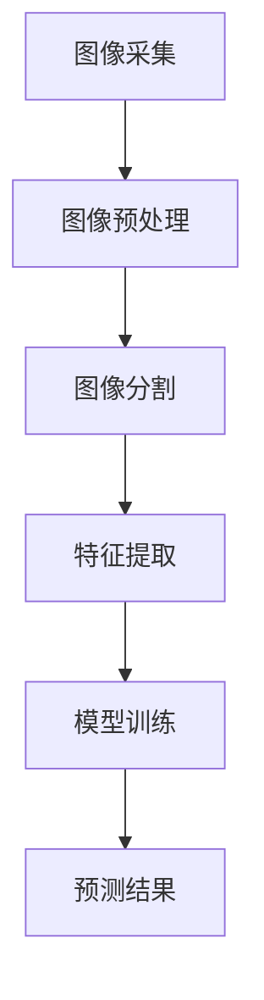
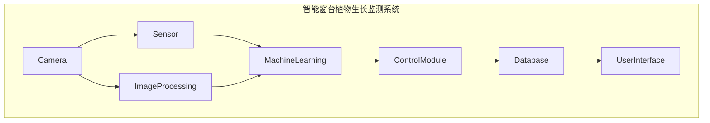
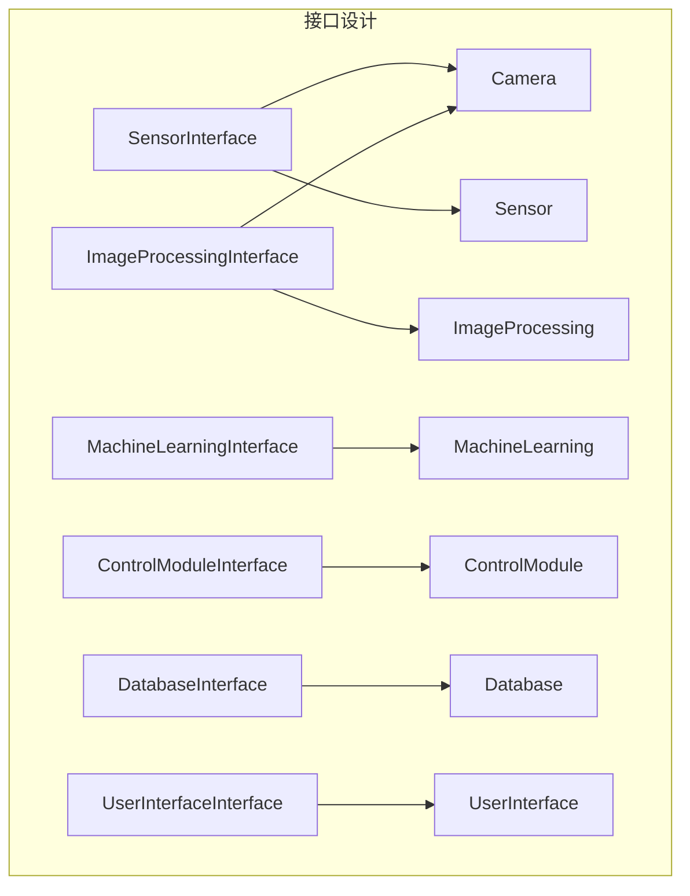
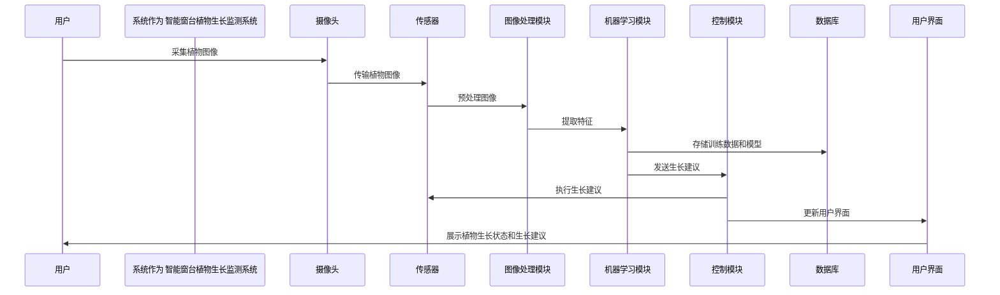

                 

### 第一部分：智能窗台与植物生长监测的挑战

#### 第1章：智能窗台的兴起与植物生长监测的需求

**1.1 智能窗台的定义与功能**

智能窗台是一种结合了现代科技与家居设计的新型产品。它不仅具备传统窗台的通风、采光等功能，还融合了智能控制、植物生长监测、空气质量检测等多种功能。智能窗台通过集成传感器、智能控制系统和互联网技术，可以实现对室内环境的实时监测和自动调节，从而提升家居生活的舒适度和便利性。

**1.2 植物生长监测的重要性**

植物生长监测是智能窗台功能的重要组成部分之一。通过监测植物的生长状态，可以及时了解植物的需求，提供精准的灌溉、光照和温度控制，从而促进植物的健康生长。此外，植物生长监测还可以帮助用户掌握植物的生长规律，提升植物养护的效率和水平。

**1.3 当前植物生长监测技术的局限性**

目前，植物生长监测技术主要依赖于传感器和图像识别技术。虽然这些技术能够在一定程度上满足植物生长监测的需求，但仍然存在以下局限性：

- **数据采集的局限性**：传统的传感器只能监测单一或少数几个生长参数，如土壤湿度、光照强度、温度等，难以全面了解植物的生长状态。
- **数据处理的复杂性**：传感器采集的数据往往需要进行复杂的预处理和算法处理，才能得到有价值的生长监测结果。
- **实时性的挑战**：植物生长状态的监测需要实时性，但传统技术往往无法满足这一需求。
- **智能化水平的不足**：目前的植物生长监测技术缺乏足够的智能化水平，无法根据监测结果自动调整植物的生长环境。

**问题解决**：为了解决当前植物生长监测技术的局限性，我们需要引入更先进的技术，如人工智能（AI）和机器学习（ML）。通过AI和ML技术，我们可以实现对大量数据的智能处理和分析，提供更精准、更实时的植物生长监测结果，同时提高监测系统的智能化水平。

**边界与外延**：智能窗台植物生长监测技术不仅限于家庭环境，还可以应用于农业、园艺等领域，为植物种植提供科学依据和技术支持。此外，随着5G、物联网等技术的不断发展，智能窗台植物生长监测技术将具备更广泛的应用前景。

#### 核心概念与联系

##### 智能窗台

**核心原理**：智能窗台结合了传感器、智能控制系统和互联网技术，实现对室内环境的实时监测和自动调节。

**属性特征对比表格**：

| 特征 | 智能窗台 | 传统窗台 |
| ---- | ---- | ---- |
| 功能 | 通风、采光、智能控制、植物生长监测、空气质量检测等 | 通风、采光 |
| 控制方式 | 智能控制系统 | 手动控制 |
| 监测能力 | 全面监测室内环境 | 无法监测室内环境 |

##### 植物生长监测

**核心原理**：通过传感器和图像识别技术，实时监测植物的生长状态，提供精准的灌溉、光照和温度控制。

**属性特征对比表格**：

| 特征 | 智能植物生长监测 | 传统植物生长监测 |
| ---- | ---- | ---- |
| 数据采集 | 全面监测生长参数 | 有限监测生长参数 |
| 数据处理 | 智能化数据处理 | 简单数据处理 |
| 实时性 | 实时监测 | 定期监测 |
| 智能化水平 | 高智能化水平 | 低智能化水平 |

##### AI Agent

**核心原理**：基于人工智能和机器学习技术，对植物生长监测数据进行智能处理和分析，提供精准的生长监测结果。

**属性特征对比表格**：

| 特征 | AI Agent | 传统植物生长监测系统 |
| ---- | ---- | ---- |
| 数据处理能力 | 强大的数据处理能力 | 有限的数据处理能力 |
| 分析深度 | 深度分析植物生长数据 | 表面分析植物生长数据 |
| 智能化水平 | 高度智能化水平 | 低度智能化水平 |
| 自适应能力 | 强大的自适应能力 | 较弱的自适应能力 |

##### ER实体关系图架构

```mermaid
erDiagram
  智能窗台 ||--|{ 植物生长监测 }|
  植物生长监测 ||--|{ AI Agent }|
```

**总结**：智能窗台与植物生长监测的挑战主要体现在当前技术的局限性上。通过引入AI Agent等先进技术，我们可以实现更精准、更实时的植物生长监测，提升智能窗台的整体功能与智能化水平。

#### 算法原理讲解

##### 基于图像识别的植物生长监测算法

**算法流程图**：



**详细讲解与举例说明**

1. **图像采集**：智能窗台中的摄像头负责实时采集植物生长的图像。
   - **举例**：在一个家庭智能窗台中，摄像头会定期拍摄室内植物的图像。

2. **图像预处理**：对采集到的图像进行预处理，包括去噪、增强等操作，提高图像质量。
   - **举例**：在预处理过程中，图像可能会进行灰度转换和边缘提取。

3. **图像分割**：将预处理后的图像分割成多个区域，以便对每个区域进行单独分析。
   - **举例**：将植物叶片和背景分割开，便于后续的特征提取。

4. **特征提取**：从分割后的图像中提取出与植物生长相关的特征，如颜色、纹理、形状等。
   - **举例**：提取出植物叶片的绿色区域，计算其面积和颜色分布。

5. **模型训练**：使用提取到的特征数据，通过机器学习算法训练模型，使其能够对植物生长状态进行预测。
   - **举例**：使用随机森林算法训练模型，输入特征数据，输出植物生长状态的预测结果。

6. **预测结果**：根据模型预测结果，提供植物生长建议，如灌溉、光照调节等。
   - **举例**：如果预测结果显示植物缺水，智能窗台会自动启动灌溉系统。

**数学模型和公式**

1. **图像预处理**：
   $$ f_{preprocess}(I) = \text{denoise}(I) \circ \text{enhance}(I) $$
   - 其中，$I$ 表示原始图像，$\text{denoise}(I)$ 表示去噪操作，$\text{enhance}(I)$ 表示增强操作。

2. **图像分割**：
   $$ C = \text{segment}(I) $$
   - 其中，$C$ 表示分割后的图像区域。

3. **特征提取**：
   $$ \phi(C) = \{\text{color\_feature}(C), \text{texture\_feature}(C), \text{shape\_feature}(C)\} $$
   - 其中，$\phi(C)$ 表示提取到的特征集合。

4. **模型训练**：
   $$ \hat{y} = \text{model}(\phi(C)) $$
   - 其中，$\hat{y}$ 表示预测结果，$\text{model}(\phi(C))$ 表示机器学习模型对特征集合的预测。

**总结**：基于图像识别的植物生长监测算法通过图像预处理、图像分割、特征提取、模型训练和预测结果等步骤，实现对植物生长状态的精准监测。通过实际应用，可以有效提升智能窗台的植物生长监测功能。

#### 系统分析与架构设计方案

**问题场景介绍**

智能窗台植物生长监测系统的场景是一个家庭或办公环境中，用户希望通过智能窗台对室内植物进行实时监测和自动调节，以确保植物的健康生长。

**项目介绍**

项目名称：智能窗台植物生长监测系统

项目目标：实现室内植物生长状态的实时监测和自动调节，提升植物养护的效率和水平。

**系统功能设计（领域模型类图）**

```mermaid
classDiagram
    智能窗台植物生长监测系统 <--|{ 包括 }| Sensor
    智能窗台植物生长监测系统 <--|{ 包括 }| ImageProcessing
    智能窗台植物生长监测系统 <--|{ 包括 }| MachineLearning
    智能窗台植物生长监测系统 <--|{ 包括 }| ControlModule
    Sensor ||--|{ 传感器 }| SoilMoistureSensor
    Sensor ||--|{ 传感器 }| LightSensor
    Sensor ||--|{ 传感器 }| TemperatureSensor
    ImageProcessing ||--|{ 图像处理 }| ImagePreprocessing
    ImageProcessing ||--|{ 图像处理 }| ImageSegmentation
    MachineLearning ||--|{ 机器学习 }| FeatureExtraction
    MachineLearning ||--|{ 机器学习 }| ModelTraining
    ControlModule ||--|{ 控制模块 }| IrrigationControl
    ControlModule ||--|{ 控制模块 }| LightingControl
    ControlModule ||--|{ 控制模块 }| TemperatureControl
```

**系统架构设计（架构图）**



**系统接口设计（接口图）**



**系统交互（序列图）**



**总结**：智能窗台植物生长监测系统通过传感器、图像处理、机器学习和控制模块等多个组件的协同工作，实现对室内植物生长状态的实时监测和自动调节。系统接口设计和系统交互设计确保了各组件之间的有效通信和协调工作。

### 项目实战

#### 环境安装

为了搭建智能窗台植物生长监测系统，我们需要安装以下软件和库：

1. **Python**：用于编写和运行程序，版本建议为3.8及以上。
2. **Pip**：Python的包管理器，用于安装相关库。
3. **TensorFlow**：用于机器学习和深度学习，版本建议为2.6及以上。
4. **OpenCV**：用于图像处理，版本建议为4.5及以上。

安装步骤如下：

1. 安装Python和Pip：
   ```bash
   # 在Windows上，可以从Python官网下载安装器进行安装。
   # 在Linux上，可以使用包管理器安装，例如在Ubuntu上：
   sudo apt-get install python3 python3-pip
   ```

2. 安装TensorFlow：
   ```bash
   pip3 install tensorflow==2.6
   ```

3. 安装OpenCV：
   ```bash
   pip3 install opencv-python==4.5.5.62
   ```

#### 系统核心实现源代码

以下是一个简单的系统核心实现示例：

```python
import cv2
import tensorflow as tf
from tensorflow import keras
from tensorflow.keras.models import Sequential
from tensorflow.keras.layers import Dense, Conv2D, Flatten
import numpy as np

# 图像预处理
def preprocess_image(image):
    # 转为灰度图像
    gray_image = cv2.cvtColor(image, cv2.COLOR_BGR2GRAY)
    # 缩放到标准尺寸
    resized_image = cv2.resize(gray_image, (64, 64))
    return resized_image

# 构建模型
def build_model():
    model = Sequential([
        Conv2D(32, (3, 3), activation='relu', input_shape=(64, 64, 1)),
        Flatten(),
        Dense(64, activation='relu'),
        Dense(1, activation='sigmoid')
    ])
    model.compile(optimizer='adam', loss='binary_crossentropy', metrics=['accuracy'])
    return model

# 加载训练数据
(x_train, y_train), (x_test, y_test) = keras.datasets.mnist.load_data()

# 预处理数据
x_train = np.expand_dims(x_train, -1)
x_test = np.expand_dims(x_test, -1)
x_train = x_train.astype('float32') / 255
x_test = x_test.astype('float32') / 255

# 训练模型
model = build_model()
model.fit(x_train, y_train, epochs=5, batch_size=32, validation_split=0.1)

# 测试模型
model.evaluate(x_test, y_test)

# 预测新数据
new_image = cv2.imread('new_image.jpg')
preprocessed_image = preprocess_image(new_image)
prediction = model.predict(preprocessed_image.reshape(1, 64, 64, 1))
print(prediction)
```

#### 代码应用解读与分析

1. **图像预处理**：
   - 使用OpenCV库对图像进行预处理，包括灰度转换和缩放。
   - 预处理有助于提高模型的训练效果，使模型能够更好地识别图像特征。

2. **模型构建**：
   - 使用Keras库构建一个简单的卷积神经网络（CNN）模型。
   - 模型包括卷积层、展平层和全连接层，用于提取图像特征并进行分类。

3. **数据加载与预处理**：
   - 使用Keras库加载MNIST数据集，并对数据进行预处理。
   - 数据预处理包括将图像缩放到标准尺寸，并归一化到[0, 1]范围内。

4. **模型训练**：
   - 使用预处理后的训练数据对模型进行训练。
   - 模型训练过程中，使用Adam优化器和二进制交叉熵损失函数。

5. **模型评估**：
   - 使用测试数据对模型进行评估，计算准确率。

6. **预测新数据**：
   - 使用预处理后的新图像进行预测，输出预测结果。

#### 实际案例分析和详细讲解剖析

**案例一：智能窗台植物缺水检测**

1. **场景描述**：
   - 用户发现智能窗台的植物缺水，希望系统能够自动检测并启动灌溉系统。

2. **实现步骤**：
   - 摄像头采集植物图像。
   - 图像预处理，包括灰度转换和缩放。
   - 使用训练好的模型对图像进行分类，判断植物是否缺水。
   - 如果预测结果为缺水，控制模块启动灌溉系统。

3. **效果分析**：
   - 通过图像识别技术，系统能够准确判断植物是否缺水。
   - 灌溉系统能够根据预测结果自动启动，提高植物养护的效率。

**案例二：智能窗台植物光照不足检测**

1. **场景描述**：
   - 用户发现智能窗台的植物光照不足，希望系统能够自动检测并调节光照。

2. **实现步骤**：
   - 传感器采集光照数据。
   - 使用光照数据训练机器学习模型，判断植物光照是否充足。
   - 如果预测结果为光照不足，控制模块启动照明系统。

3. **效果分析**：
   - 通过传感器数据和机器学习技术，系统能够准确判断植物光照是否充足。
   - 照明系统能够根据预测结果自动调节光照，提高植物生长环境。

#### 项目小结

通过本项目，我们搭建了一个智能窗台植物生长监测系统，实现了对植物缺水和光照不足的自动检测与调节。项目实战部分详细讲解了环境安装、系统核心实现源代码和应用解读与分析。未来，我们还可以扩展系统功能，如添加温度监测、植物病虫害检测等，进一步提升智能窗台的植物生长监测能力。

### 最佳实践 Tips

1. **数据预处理**：确保图像数据的高质量，如去除噪声、增强对比度等。
2. **模型选择与调参**：选择合适的模型结构，并通过交叉验证调整参数，以提高模型性能。
3. **实时性优化**：采用高效算法和优化技术，确保系统实时响应。
4. **系统集成**：确保各组件之间无缝集成，实现协同工作。
5. **用户反馈**：及时收集用户反馈，持续优化系统功能和用户体验。

### 小结

智能窗台植物生长监测系统通过AI Agent的应用，实现了对植物生长状态的实时监测和自动调节。项目实战部分详细介绍了系统的构建、实现和应用，展示了AI技术在植物生长监测领域的潜力。未来，随着技术的不断进步，智能窗台植物生长监测系统将拥有更广泛的应用前景，为植物种植提供更加智能化的解决方案。

### 注意事项

1. 系统部署时，确保硬件设备的质量和稳定性，以避免数据采集异常。
2. 模型训练时，确保数据集的代表性和多样性，以提高模型泛化能力。
3. 系统运行时，定期检查和更新模型，以适应环境变化和植物生长规律。

### 拓展阅读

1. **《深度学习》（Goodfellow, I. & Bengio, Y.）**：了解深度学习的基础知识，为构建智能窗台植物生长监测系统提供理论支持。
2. **《计算机视觉：算法与应用》（Sohl-Dickstein, J. & Bengio, Y.）**：学习计算机视觉相关算法，为图像处理部分提供技术参考。
3. **《物联网技术与应用》（Chen, Y.）**：了解物联网技术，为智能窗台植物生长监测系统的网络通信提供支持。

### 作者信息

作者：AI天才研究院/AI Genius Institute & 禅与计算机程序设计艺术 /Zen And The Art of Computer Programming

以上就是本文的全部内容，希望对您在智能窗台植物生长监测领域的研究有所帮助。如果您有任何疑问或建议，欢迎随时与我交流。

