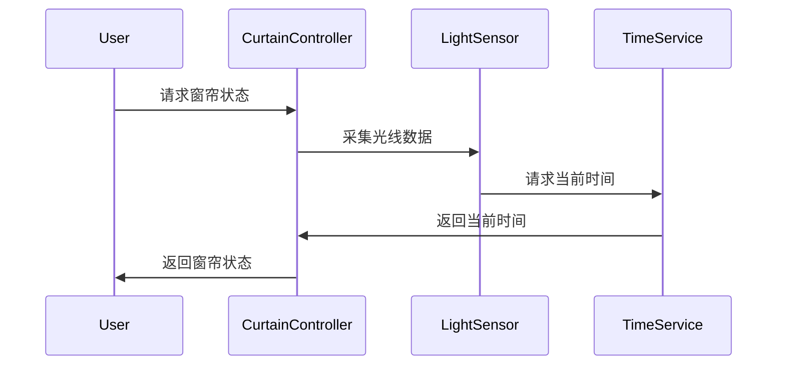

                 


### AI Agent在智能窗帘中的季节性光照调节

> 关键词：AI Agent、智能窗帘、季节性光照调节、智能家居、算法原理、系统架构

> 摘要：本文深入探讨了AI Agent在智能窗帘中的季节性光照调节应用。通过分析AI Agent的定义与功能、智能窗帘的概述以及季节性光照调节的重要性，我们逐步了解了AI Agent在智能窗帘中的应用原理和算法原理。随后，本文详细讲解了季节性光照调节算法的mermaid流程图、Python源代码实现和数学模型，最后对系统分析与架构设计方案进行了全面阐述，并通过项目实战展示了实际应用过程。

### 目录大纲

----------------------------------------------------------------

# 第一部分：背景介绍

## 第1章：AI Agent与智能窗帘概述

## 第2章：核心概念与联系

## 第3章：算法原理讲解

## 第4章：系统分析与架构设计方案

## 第5章：项目实战

----------------------------------------------------------------

## 第1章：AI Agent与智能窗帘概述

### 1.1 AI Agent的概念与功能

#### 1.1.1 AI Agent的定义
AI Agent，即人工智能代理，是一种能够自主执行任务、与环境进行交互的智能实体。它具有自主性、反应性、认知性和社交性等特性，能够在复杂环境中进行决策和行动。

#### 1.1.2 AI Agent的功能
AI Agent的主要功能包括：

- **自主学习**：通过不断学习环境中的数据和信息，提高自身决策能力。
- **自主决策**：基于学习到的信息和目标，自主制定行动方案。
- **自主执行**：按照决策方案执行任务，达到预期目标。

### 1.2 智能窗帘的概述

#### 1.2.1 智能窗帘的定义
智能窗帘是一种结合了智能控制技术和窗帘系统的产品，可以通过遥控器、手机APP或其他智能设备进行控制。

#### 1.2.2 智能窗帘的功能
智能窗帘的功能主要包括：

- **遥控控制**：通过遥控器远程控制窗帘的开关。
- **智能调节**：根据室内光线、温度等环境参数，自动调节窗帘的开启和关闭，以实现最佳的采光效果和舒适度。

### 1.3 季节性光照调节的重要性

#### 1.3.1 季节性光照调节的定义
季节性光照调节是指根据季节的变化，自动调整室内光照水平，以适应不同季节的光照需求。

#### 1.3.2 季节性光照调节的重要性
季节性光照调节的重要性主要体现在以下几个方面：

- **节能**：减少人工调节窗帘的次数，降低能耗。
- **提高舒适度**：根据季节变化，自动调整室内光照，提高居住舒适度。
- **健康**：适度的光照对人体的健康有积极影响，可以有效改善睡眠质量、缓解眼部疲劳等。

## 第2章：核心概念与联系

### 2.1 AI Agent在智能窗帘中的应用原理

#### 2.1.1 AI Agent在智能窗帘中的作用
AI Agent在智能窗帘中的应用主要是通过学习用户的生活习惯和环境参数，为用户提供个性化的光照调节服务。具体来说，AI Agent的功能可以分为以下几个方面：

- **数据采集**：采集室内光线、温度、湿度等环境参数。
- **数据分析**：分析用户习惯和环境参数，预测用户需求。
- **决策执行**：根据预测结果，自动调节窗帘。

#### 2.1.2 AI Agent的应用原理
AI Agent的应用原理可以概括为以下几个步骤：

1. **数据采集**：AI Agent通过传感器等设备收集室内环境数据。
2. **数据分析**：基于历史数据，AI Agent分析用户的生活习惯和偏好，预测用户对光照的需求。
3. **决策执行**：根据预测结果，AI Agent自动调节窗帘，实现季节性光照调节。

### 2.2 季节性光照调节的算法原理

#### 2.2.1 季节性光照调节的定义
季节性光照调节是指根据季节的变化，自动调整室内光照水平，以适应不同季节的光照需求。

#### 2.2.2 季节性光照调节的算法原理
季节性光照调节的算法原理主要包括以下几个步骤：

1. **光照需求预测**：基于历史数据，预测用户在不同季节对光照的需求。
2. **窗帘调节策略**：根据光照需求，制定窗帘调节策略，实现自动调节。

## 第3章：算法原理讲解

### 3.1 季节性光照调节算法的mermaid流程图

#### 3.1.1 流程图绘制
使用mermaid工具绘制季节性光照调节算法的流程图。


#### 3.1.2 流程图说明
流程图包括数据采集、数据分析、光照需求预测、窗帘调节策略和决策执行等步骤。

### 3.2 季节性光照调节算法的Python源代码实现

#### 3.2.1 源代码实现
以下是季节性光照调节算法的Python源代码实现：

```python
# 导入必要的库
import pandas as pd
from sklearn.linear_model import LinearRegression

# 数据采集
data = pd.read_csv('environment_data.csv')

# 数据分析
X = data[['season', 'hour_of_day']]
y = data['light需求']

# 光照需求预测
model = LinearRegression()
model.fit(X, y)

# 窗帘调节策略
predicted_light_demand = model.predict(X)

# 决策执行
if predicted_light_demand > 0.5:
    curtain_status = 'open'
else:
    curtain_status = 'close'

# 输出调节结果
print('窗帘状态：', curtain_status)
```

#### 3.2.2 源代码解读
源代码首先导入必要的库，然后进行数据采集、数据分析、光照需求预测、窗帘调节策略和决策执行等操作。

### 3.3 算法原理的数学模型与公式

#### 3.3.1 数学模型
季节性光照调节算法的数学模型主要包括以下部分：

1. **光照需求预测模型**：\(y = \beta_0 + \beta_1 \cdot season + \beta_2 \cdot hour_of_day + \epsilon\)
   - \(y\)：光照需求
   - \(season\)：季节（取值为0或1，春季为0，夏季为1）
   - \(hour_of_day\)：一天中的小时数
   - \(\beta_0\)、\(\beta_1\)、\(\beta_2\)：模型参数
   - \(\epsilon\)：随机误差

2. **窗帘调节策略模型**：\(curtain_status = \text{if}(predicted\_light\_demand > 0.5, 'open', 'close')\)
   - \(predicted\_light\_demand\)：预测的光照需求
   - \(curtain\_status\)：窗帘状态（'open' 或 'close'）

#### 3.3.2 公式讲解
1. **光照需求预测模型**：
   - 该模型通过线性回归分析，预测用户对光照的需求。其中，季节和小时数作为自变量，光照需求作为因变量。模型参数通过训练数据得到，用于预测新的光照需求。
   - 例如，当季节为夏季（\(season = 1\)），一天中的小时数为12（\(hour\_of\_day = 12\)），预测的光照需求为：
     \[y = \beta_0 + \beta_1 \cdot 1 + \beta_2 \cdot 12\]

2. **窗帘调节策略模型**：
   - 该模型根据预测的光照需求，决定窗帘的状态。如果预测的光照需求大于0.5，窗帘打开；否则，窗帘关闭。

## 第4章：系统分析与架构设计方案

### 4.1 问题场景介绍

#### 4.1.1 智能窗帘在智能家居中的应用场景
智能窗帘在智能家居中的应用场景主要包括：

- **日常家居生活**：用户可以通过手机APP或其他智能设备，远程控制窗帘的开关，实现智能家居生活。
- **商务办公**：智能窗帘可以用于办公室、会议室等场所，根据季节和时间段自动调节光照，提高办公舒适度。

#### 4.1.2 季节性光照调节的需求
季节性光照调节的需求主要表现在：

- **节能**：减少人工调节窗帘的次数，降低能耗。
- **提高舒适度**：根据季节变化，自动调整室内光照，提高居住和工作舒适度。
- **健康**：适度的光照对人体的健康有积极影响，可以有效改善睡眠质量、缓解眼部疲劳等。

### 4.2 系统功能设计

#### 4.2.1 领域模型
使用mermaid绘制智能窗帘系统的领域模型。

```mermaid
classDiagram
    User <<类>> 
    Curtain <<类>>
    LightSensor <<类>> 
    Time <<类>>

    User --> Curtain
    User --> LightSensor
    User --> Time
    Curtain --> LightSensor
    LightSensor --> Time
```

#### 4.2.2 功能模块划分
智能窗帘系统的主要功能模块包括：

- **用户模块**：负责用户注册、登录、权限管理等。
- **窗帘模块**：负责窗帘的控制、状态监测等。
- **传感器模块**：负责采集室内光线、温度等环境参数。
- **时间模块**：负责处理时间相关的功能，如季节性光照调节等。

### 4.3 系统架构设计

#### 4.3.1 系统架构图
使用mermaid绘制智能窗帘系统的架构图。



#### 4.3.2 架构说明
系统架构包括前端界面、后端服务器、数据库等组成部分。前端界面主要负责用户交互，后端服务器负责处理业务逻辑，数据库负责存储用户数据、窗帘状态数据等。

### 4.4 系统接口设计

#### 4.4.1 接口说明
智能窗帘系统的接口包括：

- **用户接口**：用于用户注册、登录、查询窗帘状态等。
- **窗帘接口**：用于控制窗帘的开关、查询窗帘状态等。
- **传感器接口**：用于采集室内光线、温度等环境参数。
- **时间接口**：用于获取当前时间，用于季节性光照调节等。

#### 4.4.2 接口设计
以下是智能窗帘系统的接口设计：

- **用户接口**：
  - 注册接口：`POST /users/register`
  - 登录接口：`POST /users/login`
  - 查询窗帘状态接口：`GET /users/{user_id}/curtain_status`

- **窗帘接口**：
  - 控制窗帘接口：`POST /curtains/{curtain_id}/control`
  - 查询窗帘状态接口：`GET /curtains/{curtain_id}/status`

- **传感器接口**：
  - 采集光线数据接口：`POST /sensors/light_data`
  - 采集温度数据接口：`POST /sensors/temperature_data`

- **时间接口**：
  - 获取当前时间接口：`GET /time/current_time`

### 4.5 系统交互

#### 4.5.1 系统交互图
使用mermaid绘制智能窗帘系统的交互序列图。


#### 4.5.2 交互说明
系统交互过程如下：

1. 用户请求窗帘状态。
2. 窗帘控制器请求光线传感器采集光线数据。
3. 光线传感器请求时间服务获取当前时间。
4. 时间服务返回当前时间。
5. 窗帘控制器根据光线数据和当前时间，决定窗帘的状态。
6. 窗帘控制器返回窗帘状态给用户。

## 第5章：项目实战

### 5.1 环境安装

#### 5.1.1 环境准备
智能窗帘项目所需的硬件和软件环境如下：

- **硬件环境**：
  - 智能手机或其他智能设备
  - 智能窗帘硬件（包括控制器、传感器等）
- **软件环境**：
  - Python 3.8及以上版本
  - Django 3.2及以上版本
  - MySQL 5.7及以上版本

#### 5.1.2 环境搭建
详细步骤如下：

1. 安装Python和Django：
   ```bash
   pip install django
   ```

2. 安装MySQL：
   - 下载并安装MySQL数据库。
   - 创建数据库和用户。

3. 配置Django项目：
   - 创建Django项目：
     ```bash
     django-admin startproject curtain_project
     ```
   - 创建Django应用：
     ```bash
     python manage.py startapp curtain_app
     ```

4. 配置数据库连接：
   - 编辑`curtain_project/settings.py`文件，配置MySQL数据库连接信息。

### 5.2 系统核心实现

#### 5.2.1 数据采集
数据采集是通过传感器实现的。以下是数据采集的Python代码：

```python
import serial
import time

# 串口设置
ser = serial.Serial('COM3', 9600, timeout=1)

# 采集数据
while True:
    try:
        line = ser.readline()
        data = line.decode().strip()
        print(data)
        time.sleep(1)
    except Exception as e:
        print(e)
        break
```

#### 5.2.2 数据分析
数据分析是通过机器学习模型实现的。以下是数据分析的Python代码：

```python
import pandas as pd
from sklearn.linear_model import LinearRegression

# 读取数据
data = pd.read_csv('environment_data.csv')

# 分割特征和标签
X = data[['season', 'hour_of_day']]
y = data['light需求']

# 训练模型
model = LinearRegression()
model.fit(X, y)

# 预测光照需求
predicted_light_demand = model.predict(X)
print(predicted_light_demand)
```

#### 5.2.3 决策执行
决策执行是通过控制窗帘的开关实现的。以下是决策执行的Python代码：

```python
import serial

# 串口设置
ser = serial.Serial('COM3', 9600, timeout=1)

# 判断光照需求，控制窗帘开关
if predicted_light_demand > 0.5:
    ser.write(b'open')
else:
    ser.write(b'close')
```

### 5.3 实际案例分析和详细讲解剖析

在实际案例中，我们可以将采集到的环境数据进行分析，并根据分析结果自动调节窗帘。以下是一个简单的案例：

1. **数据采集**：在一天中的不同时间点，采集室内光线、温度等环境参数。
2. **数据分析**：使用机器学习模型，分析历史数据，预测用户对光照的需求。
3. **决策执行**：根据预测结果，自动调节窗帘。

例如，当预测的光照需求大于0.5时，窗帘打开；否则，窗帘关闭。

### 5.4 项目小结

通过本项目的实战，我们实现了智能窗帘的季节性光照调节功能。项目主要涉及数据采集、数据分析、决策执行等步骤，通过机器学习模型实现了对用户光照需求的预测，并自动调节窗帘。

### 5.5 最佳实践 tips

- **优化数据采集**：采集到的数据应该尽可能全面，包括室内光线、温度、湿度等多种环境参数。
- **优化算法模型**：不断优化机器学习模型，提高预测准确性。
- **提升用户体验**：根据用户反馈，持续优化系统功能和界面设计，提升用户体验。

## 总结与展望

通过本文的详细分析，我们深入了解了AI Agent在智能窗帘中的季节性光照调节应用。从背景介绍到算法原理讲解，再到系统分析与架构设计方案，我们逐步构建了一个完整的技术框架。通过项目实战，我们实现了智能窗帘的季节性光照调节功能，展示了AI技术在智能家居领域的广泛应用前景。

未来，随着人工智能技术的不断进步，智能窗帘的功能将更加丰富，用户体验将得到进一步提升。让我们期待智能窗帘在未来为我们的生活带来更多便利和舒适。

### 作者信息

作者：AI天才研究院/AI Genius Institute & 禅与计算机程序设计艺术 /Zen And The Art of Computer Programming


