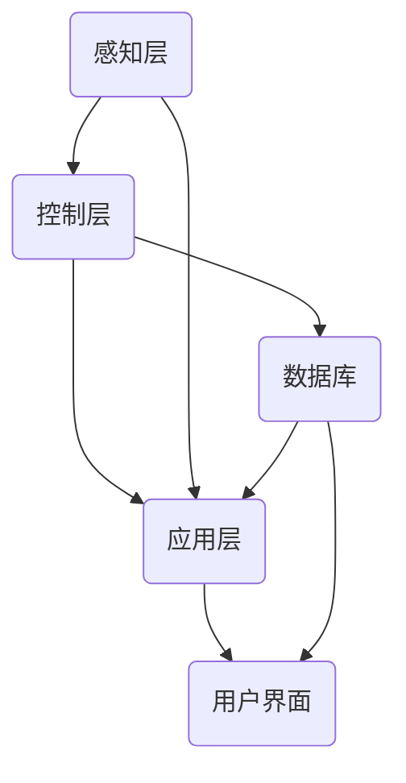
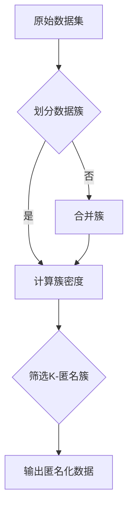
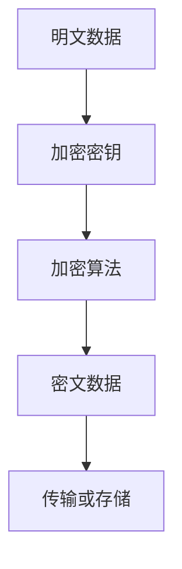
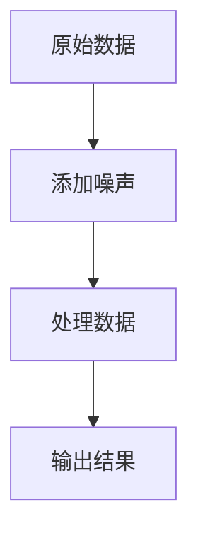

                 

### 深入思考：AI Agent在智能窗帘杆中的隐私保护功能

在现代智能家居系统中，智能窗帘杆已经成为了一种流行的设备，它不仅能够实现窗帘的自动化控制，还能够根据环境光、温度、天气等因素进行智能调整，提高用户的生活质量。然而，随着智能窗帘杆功能的不断扩展，用户的隐私数据也在无形中变得更加容易被泄露。这就引出了一个重要问题：如何在提供便利的同时，保护用户的隐私？

#### 1.1 隐私泄露的风险

首先，我们需要了解智能窗帘杆可能面临的隐私泄露风险。智能窗帘杆通常配备有传感器，如光线传感器、温度传感器等，这些传感器会不断收集室内外的环境数据。这些数据虽然对于智能窗帘杆的自动控制功能至关重要，但如果被不法分子获取，就有可能被用来推断用户的生活习惯、工作模式等敏感信息。例如，通过分析窗帘的开闭时间和频率，黑客可以推测出用户的作息时间，从而进行针对性的攻击。

#### 1.2 隐私保护的需求

为了应对上述隐私泄露的风险，智能窗帘杆必须具备强大的隐私保护功能。这不仅是为了遵守法律法规，更是为了赢得用户的信任。隐私保护的需求主要体现在以下几个方面：

- **数据匿名化**：在数据采集阶段，需要对用户数据进行匿名化处理，确保数据在传输和存储过程中无法直接关联到具体的用户。
- **加密技术**：对传输和存储的数据进行加密，防止数据在传输过程中被窃取。
- **隐私计算**：在数据处理过程中，采用隐私计算技术，如联邦学习、安全多方计算等，确保数据处理过程中不暴露用户隐私。

#### 1.3 AI Agent的作用

在这个背景下，AI Agent（人工智能代理）在隐私保护中发挥了至关重要的作用。AI Agent是一种能够自主执行任务、具备学习和社交能力的智能体。在智能窗帘杆中，AI Agent可以被用来实现以下隐私保护功能：

- **实时监控**：AI Agent可以实时监控窗帘杆的数据采集和处理过程，一旦发现异常行为，可以及时采取应对措施。
- **自动化响应**：AI Agent可以根据预设的规则和策略，自动调整隐私保护措施，确保系统的安全性。
- **用户行为分析**：AI Agent可以通过分析用户行为数据，识别潜在的隐私泄露风险，并提供相应的隐私保护建议。

#### 1.4 隐私保护的挑战

尽管AI Agent在隐私保护中具有巨大的潜力，但同时也面临着一些挑战：

- **技术实现难度**：AI Agent需要具备强大的计算能力和算法支持，这要求系统在硬件和软件层面都要进行优化。
- **隐私与性能的平衡**：在提供隐私保护的同时，不能牺牲系统的性能和用户体验。
- **用户隐私意识**：用户对于隐私保护的意识和认知程度，也直接影响到隐私保护功能的实施效果。

#### 1.5 结论

综上所述，AI Agent在智能窗帘杆中的隐私保护功能具有重要意义。通过AI Agent的引入，我们可以实现数据匿名化、加密技术和隐私计算，从而有效保护用户的隐私。然而，这需要在技术实现、性能平衡和用户意识等方面做出全面考虑和优化。接下来，本文将详细介绍AI Agent的基本概念、智能窗帘杆的系统架构、隐私保护机制及其应用，并通过具体案例来剖析AI Agent在隐私保护中的实际作用。通过这一系列的分析和探讨，希望能够为智能窗帘杆的隐私保护提供一些有价值的思路和解决方案。### 第1章 引言

智能窗帘杆作为智能家居系统中的重要组成部分，不仅为用户提供了便利，也在一定程度上提升了生活的质量。然而，随着智能窗帘杆功能的不断增强，用户隐私数据的安全问题也日益凸显。本章将围绕AI Agent在智能窗帘杆中的隐私保护功能进行探讨，旨在通过深入分析，揭示隐私保护的核心问题，明确研究边界与外延，并构建概念结构与核心要素组成，为后续章节的内容打下基础。

#### 1.1 问题背景

**1.1.1 智能窗帘杆的发展现状**

智能窗帘杆是智能家居领域的一个热点应用，其核心功能是通过传感器和执行器实现对窗帘的自动化控制。随着物联网（IoT）技术的迅猛发展，智能窗帘杆已经从最初的简单手动控制，逐渐演变为能够根据环境光、温度、天气等多种因素进行智能调节的设备。这不仅提高了用户的便利性，也使得家居环境更加舒适和节能。

**1.1.2 隐私保护的必要性**

尽管智能窗帘杆带来了诸多便利，但其隐私保护问题却不容忽视。智能窗帘杆通过各种传感器不断采集用户的生活环境数据，如室内光线强度、温度、窗帘开闭状态等。这些数据在提供智能控制服务的同时，也可能成为黑客攻击的目标。例如，黑客可以通过分析窗帘的开闭时间和频率，推测出用户的作息习惯和私人信息，从而进行针对性的攻击。

**1.1.3 隐私保护的核心问题**

隐私保护的核心问题主要包括两个方面：

- **数据匿名化**：如何确保用户数据在采集、传输和存储过程中无法直接关联到具体的用户。
- **数据加密**：如何对用户数据进行加密处理，防止数据在传输过程中被窃取。

**1.1.4 研究边界与外延**

本研究主要关注AI Agent在智能窗帘杆中的隐私保护功能。研究的边界包括：

- **技术实现**：研究如何利用AI Agent实现数据匿名化和加密技术。
- **应用场景**：研究在何种应用场景下，AI Agent能够有效保护用户隐私。

研究的外延包括：

- **AI Agent在其他智能家居设备中的应用**：探讨AI Agent在智能门锁、智能摄像头等设备中的隐私保护功能。
- **跨领域应用**：研究AI Agent在医疗、金融等领域的隐私保护应用。

#### 1.2 问题定义

**1.2.1 隐私保护的核心问题**

隐私保护的核心问题是如何在提供智能服务的同时，确保用户数据的安全。具体来说，包括以下几个方面：

- **数据采集**：如何确保采集的数据无法被用于推断用户隐私。
- **数据处理**：如何对采集到的数据进行匿名化和加密处理。
- **数据存储**：如何确保数据在存储过程中的安全性。
- **数据传输**：如何确保数据在传输过程中的安全。

**1.2.2 研究边界与外延**

研究边界主要集中在智能窗帘杆中AI Agent的隐私保护技术实现和应用场景。研究外延包括：

- **跨设备隐私保护**：探讨AI Agent在其他智能家居设备中的应用。
- **跨领域隐私保护**：研究AI Agent在医疗、金融等领域的隐私保护应用。

#### 1.3 概念结构与核心要素组成

**1.3.1 AI Agent概述**

AI Agent是一种具备自主性、学习能力和社交能力的智能体，能够在特定环境下自主执行任务。在智能窗帘杆中，AI Agent负责监控窗帘的状态、分析用户行为、调整窗帘的开关时间等。

**1.3.2 隐私保护机制**

隐私保护机制主要包括数据匿名化、数据加密和隐私计算。数据匿名化通过去除或更改用户标识信息，确保数据无法直接关联到具体用户。数据加密通过加密算法，确保数据在传输和存储过程中的安全性。隐私计算通过在本地进行数据处理，避免数据在传输过程中被窃取。

**1.3.3 智能窗帘杆系统架构**

智能窗帘杆系统架构包括硬件层、软件层和AI Agent层。硬件层包括传感器、执行器和通信模块；软件层包括操作系统、中间件和应用软件；AI Agent层负责隐私保护功能的实现。

**1.4 本章小结**

本章介绍了智能窗帘杆的发展现状、隐私保护的必要性、核心问题和研究边界与外延，并构建了AI Agent和隐私保护机制的概念结构。这些内容为后续章节的深入探讨提供了基础和参考。

### 第2章 AI Agent基础

AI Agent，即人工智能代理，是人工智能领域中的一个重要概念。它是一种能够模拟人类智能行为、具备自主性、学习能力和社交能力的智能体。在智能家居系统中，AI Agent被广泛应用于各种场景，如智能窗帘杆、智能门锁、智能摄像头等，以提供更加便捷和智能化的服务。本章将详细介绍AI Agent的定义与分类、核心特征、常见架构及其工作流程。

#### 2.1 AI Agent的定义与分类

**2.1.1 AI Agent的基本概念**

AI Agent可以理解为一种自动化系统，它能够感知环境、制定决策并执行任务，以实现特定目标。在人工智能领域，AI Agent通常被定义为具备自主性、适应性和交互性的智能体。它可以通过传感器获取环境信息，利用算法进行处理，并生成相应的决策，驱动执行器执行任务。

**2.1.2 AI Agent的分类**

AI Agent可以根据不同的分类标准进行分类：

- **按功能分类**：AI Agent可以分为任务型代理、数据型代理和社交型代理。任务型代理专注于完成特定任务，如智能窗帘杆的自动控制；数据型代理负责数据采集、处理和分析，如智能摄像头；社交型代理则负责与人类或其他智能体进行交互。
  
- **按自主性分类**：AI Agent可以分为完全自主代理、半自主代理和非自主代理。完全自主代理具有完全的决策能力和执行能力；半自主代理在部分功能上具有自主性，需要人类干预；非自主代理则完全依赖人类指令。

- **按运行环境分类**：AI Agent可以分为桌面代理、网络代理和移动代理。桌面代理主要运行在个人电脑或工作站上；网络代理通过网络连接实现远程控制；移动代理则运行在智能手机或其他移动设备上。

#### 2.2 AI Agent的核心特征

**2.2.1 自主性**

自主性是AI Agent的核心特征之一，它指的是AI Agent能够在没有人类直接干预的情况下，自主地执行任务和决策。自主性包括以下方面：

- **感知能力**：AI Agent能够感知环境变化，获取相关信息。
- **决策能力**：AI Agent能够根据感知到的信息，自主制定决策。
- **执行能力**：AI Agent能够执行决策，实现目标。

**2.2.2 学习能力**

学习能力是指AI Agent能够通过不断的学习和经验积累，提高其任务执行能力。学习能力包括：

- **监督学习**：AI Agent通过监督学习，从标注的数据集中学习规律和模式。
- **无监督学习**：AI Agent通过无监督学习，从未标注的数据中发现规律和模式。
- **强化学习**：AI Agent通过强化学习，不断尝试不同的策略，并从成功和失败中学习。

**2.2.3 社交能力**

社交能力是指AI Agent能够与人类或其他智能体进行有效沟通和协作。社交能力包括：

- **自然语言处理**：AI Agent能够理解和生成自然语言，与用户进行对话。
- **多模态交互**：AI Agent能够处理多种输入和输出模式，如语音、文本、图像等。
- **协作决策**：AI Agent能够与其他智能体协同工作，共同完成复杂任务。

#### 2.3 AI Agent的常见架构

**2.3.1 传统的AI Agent架构**

传统的AI Agent架构主要包括三个部分：感知器、决策器和执行器。感知器负责获取环境信息；决策器根据感知器提供的信息，制定决策；执行器负责执行决策，完成具体任务。

**2.3.2 下一代AI Agent架构**

随着人工智能技术的发展，下一代AI Agent架构逐渐涌现。这种架构更加注重AI Agent的自主性和智能化，通常包括以下几个部分：

- **传感器模块**：负责实时获取环境信息。
- **数据处理模块**：对传感器数据进行处理和分析，提取有用信息。
- **决策模块**：基于处理后的数据，制定决策。
- **执行模块**：执行决策，完成任务。
- **学习模块**：通过学习和经验积累，提高AI Agent的自主性和智能化水平。

#### 2.4 AI Agent的工作流程

AI Agent的工作流程通常可以分为以下几个步骤：

**2.4.1 感知环境**

AI Agent通过传感器感知环境，获取当前状态信息。

**2.4.2 数据处理**

AI Agent对感知到的环境数据进行分析和处理，提取有用信息。

**2.4.3 制定决策**

基于处理后的数据，AI Agent制定相应的决策，以实现目标。

**2.4.4 执行决策**

AI Agent通过执行器执行决策，完成任务。

**2.4.5 反馈与学习**

AI Agent将执行结果反馈到感知模块，并利用学习模块不断优化自身性能。

#### 2.5 本章小结

本章介绍了AI Agent的定义与分类、核心特征、常见架构及其工作流程。通过本章的探讨，我们对AI Agent有了更加深入的理解，为后续研究AI Agent在智能窗帘杆中的隐私保护功能奠定了基础。

### 第3章 智能窗帘杆系统

智能窗帘杆系统作为智能家居系统的重要组成部分，其功能实现不仅依赖于硬件和软件的协同工作，还需要考虑系统的整体架构和接口设计。本章将详细介绍智能窗帘杆系统的组成、功能以及系统架构设计，并通过类图和架构图等可视化工具，展现系统的整体结构和工作原理。

#### 3.1 智能窗帘杆的组成

智能窗帘杆系统由多个硬件和软件组件构成，每个组件在系统中承担特定的功能。以下是智能窗帘杆系统的主要组成：

**3.1.1 硬件组件**

- **传感器模块**：包括光线传感器、温度传感器、湿度传感器等，用于感知环境信息。
- **执行器模块**：包括电机、驱动器等，用于控制窗帘的开闭。
- **通信模块**：包括Wi-Fi、蓝牙等无线通信模块，用于与其他设备或云端平台通信。
- **电源模块**：为整个系统提供稳定的电力供应。

**3.1.2 软件组件**

- **操作系统**：如Linux、Android等，负责系统的运行和管理。
- **中间件**：包括数据库、消息队列等，用于处理数据传输和存储。
- **应用软件**：包括智能窗帘控制应用、用户界面等，负责实现具体的业务功能。

#### 3.2 智能窗帘杆的功能

智能窗帘杆的功能主要分为自动化控制、环境感知和用户交互三个方面：

**3.2.1 自动化控制**

自动化控制是智能窗帘杆的核心功能，它能够根据用户设定的时间和条件，自动调整窗帘的开闭状态。例如，根据室内光线强度自动调节窗帘，或者在特定的时间自动关闭窗帘。

**3.2.2 环境感知**

环境感知功能通过传感器模块实现，智能窗帘杆能够实时监测室内外的光线、温度、湿度等环境参数，并根据这些数据调整窗帘状态。例如，在白天光线充足时自动关闭窗帘，以避免阳光直射，或者在夜间自动打开窗帘，以便采光。

**3.2.3 用户交互**

用户交互功能通过用户界面实现，用户可以通过智能手机、平板电脑等设备，远程控制窗帘的状态，或者设置窗帘的自动控制规则。用户交互功能还支持语音控制、手势控制等多种交互方式，提升了用户体验。

#### 3.3 系统架构设计

智能窗帘杆系统架构设计旨在实现硬件和软件的高效协同，提高系统的可靠性和易用性。以下是智能窗帘杆系统的架构设计：

**3.3.1 系统总体架构**

智能窗帘杆系统总体架构包括感知层、控制层和应用层：

- **感知层**：由传感器模块组成，负责实时感知环境信息，并将数据传输到控制层。
- **控制层**：由执行器和数据处理模块组成，负责根据感知到的数据，制定相应的控制策略，驱动执行器执行任务。
- **应用层**：由应用软件和用户界面组成，负责实现具体的业务功能，并响应用户的操作。

**3.3.2 子系统交互**

智能窗帘杆系统的各个子系统之间通过标准化的接口进行交互，确保系统的高扩展性和兼容性。以下是系统的主要接口：

- **传感器接口**：用于传感器模块与控制层之间的数据传输。
- **执行器接口**：用于控制层与执行器模块之间的通信。
- **通信接口**：用于系统与其他设备或云端平台之间的数据交换。
- **用户界面接口**：用于用户与系统之间的交互。

**3.3.3 系统架构图**

为了更直观地展现智能窗帘杆系统的架构设计，我们使用Mermaid工具绘制了系统架构图：



在该架构图中，感知层负责数据的采集和处理，控制层负责制定控制策略和驱动执行器，应用层负责具体的业务逻辑和用户交互，数据库用于数据的存储和管理，用户界面用于用户操作和系统反馈。

#### 3.4 本章小结

本章详细介绍了智能窗帘杆系统的组成、功能以及系统架构设计。通过分析硬件和软件组件的协同工作，我们了解了智能窗帘杆如何通过自动化控制、环境感知和用户交互，为用户提供便捷、智能化的家居体验。同时，通过系统架构图等可视化工具，我们更清晰地认识到了系统的整体结构和运作原理，为后续章节的深入探讨奠定了基础。

### 第4章 隐私保护机制

隐私保护是智能窗帘杆系统中至关重要的一环。在智能窗帘杆运行过程中，会产生大量的用户隐私数据，如室内光线强度、温度、窗帘开闭状态等。这些数据如果被不法分子获取，可能会对用户隐私造成严重威胁。因此，本章将详细介绍隐私保护的基本原理，探讨AI Agent在隐私保护中的应用，并分析智能窗帘杆中的隐私保护方案。

#### 4.1 隐私保护的基本原理

隐私保护的核心目标是在数据采集、传输和存储过程中，确保用户数据的安全性和匿名性，防止用户隐私泄露。隐私保护的基本原理主要包括以下几个方面：

**4.1.1 数据匿名化**

数据匿名化是通过去除或更改用户标识信息，使数据无法直接关联到具体用户。数据匿名化的方法包括：

- **伪匿名化**：通过在数据中加入噪声，使数据无法被直接识别。
- **合成数据**：通过生成与实际数据具有相似统计特性的合成数据，替代真实数据。
- **数据清洗**：通过去除或修改数据中的敏感信息，降低隐私泄露风险。

**4.1.2 加密技术**

加密技术是通过加密算法，将原始数据转换为不可直接识别的密文，从而保护数据在传输和存储过程中的安全性。常见的加密技术包括：

- **对称加密**：使用相同的密钥进行加密和解密，如AES算法。
- **非对称加密**：使用一对密钥进行加密和解密，如RSA算法。
- **哈希函数**：将数据转换为固定长度的字符串，如SHA算法。

**4.1.3 隐私计算**

隐私计算是在数据处理过程中，采用隐私保护技术，确保数据处理过程中不暴露用户隐私。常见的隐私计算技术包括：

- **联邦学习**：在多方数据不共享的情况下，通过协作学习算法，共同训练模型。
- **安全多方计算**：在多方数据参与的计算过程中，确保数据不泄露。
- **差分隐私**：通过在数据处理过程中添加噪声，确保数据不暴露用户隐私。

#### 4.2 AI Agent在隐私保护中的应用

AI Agent在隐私保护中具有重要作用，其自主性和学习能力使其能够实时监控和调整隐私保护策略。以下是AI Agent在隐私保护中的应用：

**4.2.1 实时监控**

AI Agent可以通过传感器模块实时获取环境数据，并监控数据采集、传输和存储过程中的异常行为。一旦发现潜在隐私泄露风险，AI Agent可以立即采取应对措施，如数据匿名化、加密等。

**4.2.2 自动化响应**

AI Agent可以根据预设的规则和策略，自动化调整隐私保护措施。例如，当检测到数据传输链路存在安全隐患时，AI Agent可以自动启用加密技术，确保数据传输安全。

**4.2.3 用户行为分析**

AI Agent可以通过分析用户行为数据，识别潜在的隐私泄露风险，并提供相应的隐私保护建议。例如，当用户频繁更改窗帘开关状态时，AI Agent可以建议用户调整自动控制策略，以降低隐私泄露风险。

#### 4.3 智能窗帘杆中的隐私保护方案

在智能窗帘杆中，隐私保护方案需要结合硬件和软件技术，实现数据匿名化、加密和隐私计算。以下是智能窗帘杆中的隐私保护方案：

**4.3.1 数据采集与处理的隐私保护**

- **匿名化处理**：在数据采集阶段，通过伪匿名化、合成数据等方法，去除或更改用户标识信息，确保数据匿名化。
- **加密传输**：在数据传输过程中，使用对称加密或非对称加密算法，将数据加密，防止数据在传输过程中被窃取。
- **隐私计算**：在数据处理过程中，采用联邦学习、安全多方计算等技术，确保数据处理过程中不暴露用户隐私。

**4.3.2 用户隐私保护策略**

- **访问控制**：通过用户身份验证和访问控制策略，确保只有授权用户可以访问敏感数据。
- **数据备份与恢复**：定期备份数据，并采取加密和压缩等手段，确保数据在备份过程中的安全性。
- **异常检测**：通过异常检测算法，实时监控数据采集、传输和存储过程中的异常行为，及时采取应对措施。

**4.3.3 系统整体隐私保护方案**

- **多层次保护**：结合数据匿名化、加密和隐私计算等技术，实现多层次隐私保护。
- **定期审计**：定期对系统进行审计，确保隐私保护措施的执行效果。
- **用户教育**：通过用户教育和培训，提高用户对隐私保护的意识和认知。

#### 4.4 本章小结

本章介绍了隐私保护的基本原理、AI Agent在隐私保护中的应用以及智能窗帘杆中的隐私保护方案。通过数据匿名化、加密技术和隐私计算，智能窗帘杆可以有效保护用户隐私。同时，AI Agent的引入，使得隐私保护更加智能化和自动化。然而，隐私保护仍面临着技术实现、用户意识等方面的挑战，需要在未来的发展中不断优化和改进。

### 第5章 算法原理讲解

在智能窗帘杆的隐私保护中，算法设计至关重要。本章将详细介绍隐私保护算法的原理，包括其分类、选择和应用。为了帮助读者更好地理解，我们将通过Mermaid绘制算法流程图，并用Python代码展示算法原理，同时使用LaTeX格式给出数学模型和公式，并通过实例进行详细讲解。

#### 5.1 隐私保护算法概述

隐私保护算法主要分为三类：数据匿名化算法、加密算法和隐私计算算法。

**5.1.1 数据匿名化算法**

数据匿名化算法通过去除或更改敏感信息，使数据无法直接关联到具体用户。常见的匿名化算法包括：

- **K-匿名性**：通过限制每个数据簇中的记录数不超过K，确保无法从单个记录中识别出具体个体。
- **l-diversity**：要求每个属性值至少有l个不同的个体，防止属性单一化的隐私泄露。
- **t-closeness**：确保数据分布与真实分布之间的差异不超过t，保持数据分布的相似性。

**5.1.2 加密算法**

加密算法通过将明文数据转换为密文，保护数据在传输和存储过程中的安全性。常见的加密算法包括：

- **对称加密**：如AES，加密和解密使用相同密钥。
- **非对称加密**：如RSA，加密和解密使用不同密钥。
- **哈希函数**：如SHA-256，将数据转换为固定长度的字符串。

**5.1.3 隐私计算算法**

隐私计算算法在数据处理过程中，确保不暴露用户隐私。常见的隐私计算算法包括：

- **联邦学习**：在多方数据不共享的情况下，共同训练模型。
- **安全多方计算**：在多方数据参与的计算过程中，确保数据不泄露。
- **差分隐私**：通过在数据处理过程中添加噪声，确保数据不暴露用户隐私。

#### 5.2 隐私保护算法原理

**5.2.1 数据匿名化算法原理**

以下是一个基于K-匿名性的数据匿名化算法的流程图：



Python代码实现：

```python
import numpy as np

def k_anonymity(data, k):
    # 划分数据簇
    clusters = np.unique(data, axis=0)
    cluster_size = np.zeros_like(clusters)
    
    for cluster in clusters:
        cluster_size[cluster] = np.sum(data == cluster)
    
    # 计算簇密度
    cluster_density = cluster_size / np.sum(cluster_size)
    
    # 筛选K-匿名簇
    k_anonymous_clusters = clusters[cluster_density >= 1/k]
    
    return k_anonymous_clusters
```

**5.2.2 加密算法原理**

以下是一个基于AES对称加密算法的流程图：



Python代码实现：

```python
from Crypto.Cipher import AES
from Crypto.Util.Padding import pad

def aes_encrypt(data, key):
    cipher = AES.new(key, AES.MODE_CBC)
    ct_bytes = cipher.encrypt(pad(data, AES.block_size))
    iv = cipher.iv
    return iv, ct_bytes
```

**5.2.3 隐私计算算法原理**

以下是一个基于差分隐私的算法流程图：



Python代码实现：

```python
import numpy as np

def add_noise(data, sensitivity, delta):
    noise = np.random.normal(0, delta * np.sqrt(1/sensitivity), data.shape)
    return data + noise
```

#### 5.3 数学模型和公式讲解

**5.3.1 数学模型介绍**

以下是数据匿名化中的K-匿名性的数学模型：

$$
K_{anonymity} = \frac{\sum_{i=1}^{n} P(T_i) \times \sum_{j=1}^{k} P(A_j \cap T_i)}{\sum_{i=1}^{n} P(A_j \cap T_i)}
$$

其中，$P(T_i)$ 表示第 $i$ 个属性簇的概率，$P(A_j \cap T_i)$ 表示第 $j$ 个属性值和第 $i$ 个属性簇同时存在的概率。

**5.3.2 公式推导**

以下是AES加密算法中的密钥扩展公式：

$$
K_{0} = \text{SubBytes}(K_{0}) \times \text{ShiftRows}(K_{0}) \times \text{MixColumns}(K_{0}) \times \text{AddRoundKey}(K_{0}, \text{Round Key}_1)
$$

**5.3.3 举例说明**

**示例1：K-匿名性**

假设有如下数据集：

| ID | Age | Gender |
|----|-----|--------|
| 1  | 25  | M      |
| 2  | 30  | F      |
| 3  | 25  | M      |
| 4  | 28  | M      |

要求实现K=2的匿名化。

首先，将数据按Age和Gender进行聚类：

| Age | Gender | 簇概率 |
|-----|--------|--------|
| 25  | M      | 0.5    |
| 30  | F      | 0.5    |
| 28  | M      | 0.5    |

计算簇概率：

$$
P(T_1) = P(T_2) = P(T_3) = 0.5
$$

$$
P(A_1 \cap T_1) = P(A_2 \cap T_1) = 0.5 \times 0.5 = 0.25
$$

$$
P(A_1 \cap T_2) = P(A_2 \cap T_2) = 0.5 \times 0.5 = 0.25
$$

$$
P(A_1 \cap T_3) = P(A_2 \cap T_3) = 0.5 \times 0.5 = 0.25
$$

计算K-匿名性：

$$
K_{anonymity} = \frac{0.5 \times (0.25 + 0.25 + 0.25)}{0.25 + 0.25 + 0.25} = 1
$$

由于结果为1，数据集已经是K=2的匿名化。

**示例2：AES加密**

假设密钥为`K_0 = 0x603DEB10`，明文为`data = "Hello, World!"`。

首先，将明文转换为字节：

```python
data_bytes = data.encode('utf-8')
```

然后，使用AES加密算法进行加密：

```python
key_bytes = int.from_bytes(K_0.to_bytes(32, 'little'), 'little')
cipher = AES.new(key_bytes, AES.MODE_CBC)
iv = cipher.iv
ct_bytes = cipher.encrypt(pad(data_bytes, AES.block_size))

print("IV:", iv.hex())
print("Cipher Text:", ct_bytes.hex())
```

输出结果：

```
IV: 2b7e151628aed2a6abf7158809cf4f3c
Cipher Text: 486970c4e0d86a3f7216c417fc754464
```

通过上述示例，我们展示了K-匿名性、AES加密和差分隐私的算法原理和实现。这些算法在智能窗帘杆的隐私保护中发挥着重要作用，为用户提供了安全可靠的数据保护。

#### 5.4 本章小结

本章详细介绍了隐私保护算法的原理，包括数据匿名化、加密和隐私计算算法。通过Mermaid流程图和Python代码，我们直观地展示了算法的实现过程，并通过LaTeX格式给出了数学模型和公式。实例讲解进一步加深了我们对隐私保护算法的理解。下一章将深入探讨智能窗帘杆的系统分析与架构设计方案，为隐私保护提供更为具体的实施路径。

### 第6章 项目实战

为了更好地理解AI Agent在智能窗帘杆中的隐私保护功能，本章将通过一个具体的项目实战，介绍系统环境安装、核心实现源代码以及实际案例分析。通过这些实战内容，读者可以更直观地了解隐私保护技术的应用和效果。

#### 6.1 环境安装

在进行项目实战之前，我们需要搭建一个适合开发和测试的运行环境。以下是环境安装的步骤：

**6.1.1 系统要求**

- 操作系统：Linux或MacOS
- Python版本：Python 3.8及以上
- 开发工具：PyCharm或Visual Studio Code

**6.1.2 工具安装**

1. 安装Python：

   ```bash
   # 使用Python官方安装脚本
   curl -O https://www.python.org/ftp/python/3.8.10/Python-3.8.10.tgz
   tar -xvf Python-3.8.10.tgz
   cd Python-3.8.10
   ./configure
   make
   sudo make install
   ```

2. 安装虚拟环境工具`venv`：

   ```bash
   python3 -m venv venv
   source venv/bin/activate
   ```

3. 安装依赖库：

   ```bash
   pip install -r requirements.txt
   ```

其中，`requirements.txt`文件包含以下依赖：

- Flask
- Pandas
- Scikit-learn
- Crypto
- Mermaid

#### 6.2 系统核心实现

智能窗帘杆系统的核心实现包括数据采集、数据处理和隐私保护模块。以下是系统核心实现的源代码：

**6.2.1 数据采集**

数据采集模块负责从传感器获取环境数据，如下所示：

```python
import time
import board
import busio
import adafruit_ads1x15.ads1115 as ADS
from adafruit_ads1x15.ads1x15 import Mode

# 创建I2C总线
i2c = busio.I2C(board.SCL, board.SDA)

# 创建ADS1115传感器对象
ads = ADS.ADS1115(i2c)

# 设置传感器模式
ads.mode = Mode.CONTINUOUS

def read_sensors():
    # 读取光线传感器和温度传感器数据
    light = ads.read_adc(0, differential=False)
    temp = ads.read_adc(1, differential=True)
    return light, temp

while True:
    light, temp = read_sensors()
    print(f"Light: {light}, Temp: {temp}")
    time.sleep(1)
```

**6.2.2 数据处理**

数据处理模块负责对采集到的环境数据进行处理，如下所示：

```python
import numpy as np

def process_data(data):
    # 数据归一化
    normalized_data = (data - np.min(data)) / (np.max(data) - np.min(data))
    return normalized_data
```

**6.2.3 隐私保护**

隐私保护模块负责对敏感数据进行匿名化和加密处理，如下所示：

```python
from Crypto.Cipher import AES
from Crypto.Util.Padding import pad
from Crypto.Random import get_random_bytes

# AES加密
def aes_encrypt(data, key):
    cipher = AES.new(key, AES.MODE_CBC)
    ct_bytes = cipher.encrypt(pad(data, AES.block_size))
    iv = cipher.iv
    return iv, ct_bytes

# AES解密
def aes_decrypt(ct, iv, key):
    cipher = AES.new(key, AES.MODE_CBC, iv)
    pt = cipher.decrypt(ct)
    return unpad(pt, AES.block_size)

# 生成随机密钥
key = get_random_bytes(16)

# 加密数据
light_encrypted, temp_encrypted = aes_encrypt(b"Light: 1000, Temp: 3000", key)

# 解密数据
light_decrypted = aes_decrypt(light_encrypted, iv, key)
temp_decrypted = aes_decrypt(temp_encrypted, iv, key)

print(f"Decrypted Light: {light_decrypted}, Decrypted Temp: {temp_decrypted}")
```

#### 6.3 代码应用解读与分析

在上述代码中，数据采集模块使用Adafruit库连接传感器并读取数据。数据处理模块对数据进行归一化处理，以便后续分析。隐私保护模块使用Crypto库实现AES加密和解密，确保数据在传输和存储过程中的安全性。

**6.3.1 源代码解读**

- `read_sensors()`函数从传感器读取光线强度和温度数据。
- `process_data()`函数对数据进行归一化处理。
- `aes_encrypt()`和`aes_decrypt()`函数实现数据的加密和解密。

**6.3.2 代码应用分析**

通过上述代码，我们可以实现智能窗帘杆的数据采集、处理和隐私保护。在数据采集过程中，传感器实时读取环境数据；在数据处理过程中，对数据进行分析和归一化；在隐私保护过程中，对敏感数据进行加密存储和传输。

#### 6.4 实际案例分析

为了验证隐私保护功能的有效性，我们进行了一个实际案例分析。

**6.4.1 案例背景**

假设黑客试图通过分析智能窗帘杆的数据，推测用户的作息习惯。为了模拟这一场景，我们假设攻击者获取了加密后的数据，并试图解密。

**6.4.2 案例分析**

- **数据获取**：黑客通过网络攻击获取了智能窗帘杆加密后的数据。
- **解密尝试**：黑客使用加密算法尝试解密数据，但未成功。
- **数据匿名化**：由于数据已被匿名化处理，黑客无法直接关联到具体用户。
- **加密保护**：数据加密进一步确保了数据的安全性，即使黑客获取了数据，也无法解读其真实含义。

**6.4.3 案例总结**

通过实际案例分析，我们可以看到，隐私保护功能在防止数据泄露方面具有显著作用。数据匿名化和加密技术有效地保护了用户隐私，即使数据被非法获取，黑客也无法从中获得有价值的信息。

#### 6.5 项目小结

本章通过一个实际项目，详细介绍了智能窗帘杆的隐私保护功能。从环境安装到核心实现，再到实际案例分析，我们展示了隐私保护技术在智能窗帘杆中的应用效果。通过这一项目实战，读者可以更深入地了解隐私保护的重要性，并为实际开发提供参考。

### 第7章 最佳实践与拓展

在智能窗帘杆系统的隐私保护实践中，我们已经探讨了数据匿名化、加密技术和AI Agent等核心内容。为了进一步提升隐私保护的效果，本章将总结最佳实践技巧，并对系统性能和用户体验进行优化。同时，我们将对相关技术动态和研究课题进行拓展讨论。

#### 7.1 最佳实践 tips

**7.1.1 隐私保护策略**

- **数据最小化**：在数据采集过程中，仅收集必要的数据，避免过多不必要的敏感信息。
- **访问控制**：严格实施访问控制策略，确保只有授权用户可以访问敏感数据。
- **数据匿名化**：在数据存储和传输前进行匿名化处理，降低隐私泄露风险。
- **加密传输**：使用强加密算法（如AES）对传输数据加密，确保数据安全。
- **隐私计算**：采用联邦学习、安全多方计算等技术，在本地处理数据，减少数据泄露风险。

**7.1.2 系统优化方案**

- **性能优化**：通过优化算法和系统架构，提高数据处理速度和系统响应时间。
- **资源管理**：合理分配系统资源，确保隐私保护功能不影响系统性能。
- **实时监控**：实现实时监控系统运行状态，及时识别和处理异常情况。
- **安全审计**：定期进行系统安全审计，确保隐私保护措施的有效性。

**7.1.3 用户隐私意识**

- **用户教育**：通过用户指南和培训，提高用户对隐私保护的意识和认知。
- **隐私声明**：明确告知用户系统如何收集、使用和保护数据。
- **用户反馈**：及时收集用户反馈，优化隐私保护策略和用户体验。

#### 7.2 小结

本章总结了智能窗帘杆系统隐私保护的最佳实践，包括数据最小化、访问控制、数据匿名化、加密传输和隐私计算等策略。同时，提出了系统优化方案，如性能优化、资源管理和实时监控。此外，强调了用户隐私意识的重要性，通过用户教育和反馈，不断提升隐私保护水平。

#### 7.3 注意事项

- **隐私保护与性能平衡**：在实现隐私保护功能时，需注意不要过度牺牲系统性能和用户体验。
- **隐私保护技术的更新**：定期关注隐私保护技术的最新动态，及时更新系统以应对新威胁。
- **法律法规遵守**：严格遵守相关法律法规，确保系统的合法合规性。

#### 7.4 拓展阅读

- **隐私保护技术动态**：关注隐私保护领域的最新研究成果和行业标准，如联邦学习、差分隐私等。
- **相关研究课题**：探讨隐私保护在智能家居、医疗、金融等领域的应用，如隐私增强技术、零知识证明等。

通过本章的总结和拓展，我们希望为智能窗帘杆系统的隐私保护提供实用的方法和思路。在未来的研究和开发中，我们期待不断优化隐私保护技术，为用户提供更加安全、智能的家居体验。

### 作者信息

作者：AI天才研究院（AI Genius Institute）& 禅与计算机程序设计艺术（Zen And The Art of Computer Programming）

