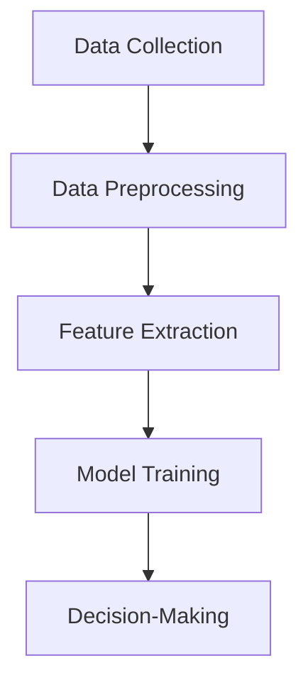
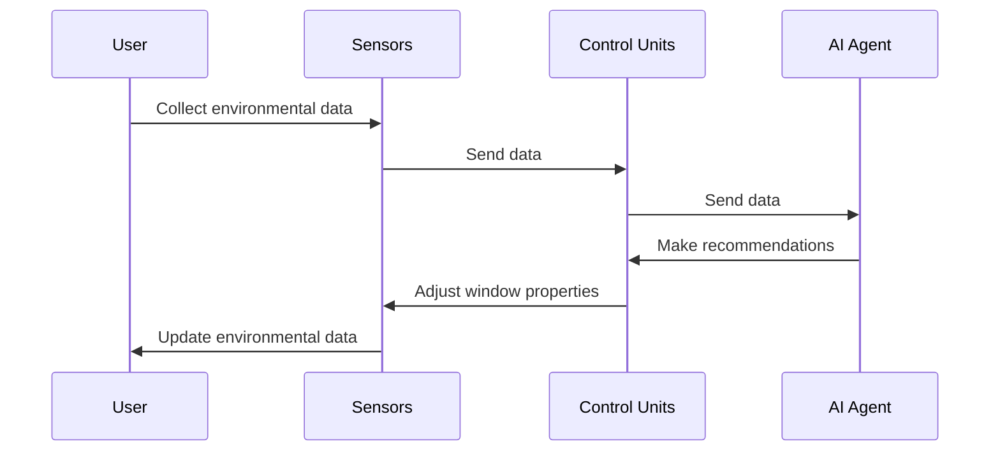

                 

# AI Agent in Smart Window for Indoor Air Circulation Optimization

> Keywords: AI Agents, Smart Windows, Indoor Air Circulation, Optimization, Algorithm Design

> Abstract:
In recent years, the demand for high-quality indoor air has been increasingly recognized due to the rise of smart homes and office spaces. This article delves into the integration of AI agents with smart windows to optimize indoor air circulation. It covers the background, core concepts, algorithm design, mathematical models, system architecture, case studies, and best practices in this emerging field.

## Introduction to AI Agents and Smart Windows

### 1.1 Overview of AI Agents

#### 1.1.1 Definition and Characteristics

Artificial Intelligence (AI) agents are software entities designed to perceive their environment through sensors, take actions based on that perception, and achieve specific goals. These agents are categorized into reactive machines, model-based agents, and goal-based agents based on their decision-making capabilities.

Reactive machines operate based on immediate sensor inputs without any memory or understanding of past events. Model-based agents use internal models to understand the environment and make informed decisions. Goal-based agents have specific objectives and continuously adjust their actions to achieve these goals.

#### 1.1.2 Evolution and Application Scenarios

AI agents have evolved significantly since their inception in the 1950s. Initially, they were simple rule-based systems. Over time, advancements in machine learning and deep learning have enabled AI agents to learn from data, recognize patterns, and make autonomous decisions.

AI agents find applications in various domains, including robotics, autonomous vehicles, healthcare, finance, and smart homes. In smart homes, AI agents are increasingly being used to automate tasks, enhance security, and improve energy efficiency.

### 1.2 Overview of Smart Windows

#### 1.2.1 Definition and Functionalities

Smart windows are advanced window systems integrated with sensors, actuators, and control units to regulate air circulation, sunlight, and temperature. These windows can automatically adjust their transparency, tint, and insulation properties based on environmental conditions and user preferences.

Smart windows offer several benefits, including enhanced energy efficiency, improved comfort, and reduced maintenance costs. They are also capable of providing real-time data on indoor air quality, which can be used to optimize air circulation.

#### 1.2.2 Importance in Indoor Air Quality Control

Indoor air quality (IAQ) is crucial for human health and well-being. Poor IAQ can lead to respiratory issues, allergies, and other health problems. Smart windows play a significant role in maintaining good IAQ by regulating air circulation and filtering pollutants.

## Problem Background and Definition

### 2.1 Current Indoor Air Quality Challenges

#### 2.1.1 Global Issues

Globalization and urbanization have led to an increase in indoor air pollution. Common pollutants include volatile organic compounds (VOCs), carbon monoxide (CO), nitrogen dioxide (NO2), and fine particulate matter (PM2.5). These pollutants can originate from various sources, including construction materials, furniture, and cooking appliances.

#### 2.1.2 Local Impacts

Indoor air pollution can have severe local impacts, particularly in densely populated urban areas. It can lead to increased hospitalizations for respiratory and cardiovascular diseases, reduced productivity, and higher healthcare costs.

### 2.2 Problem Statement

#### 2.2.1 The Role of AI Agents in Smart Windows

The integration of AI agents with smart windows can significantly improve indoor air quality by optimizing air circulation and filtering pollutants. AI agents can learn from environmental data and user preferences to make real-time adjustments, ensuring a comfortable and healthy indoor environment.

#### 2.2.2 Objectives and Boundaries

The primary objective of this article is to explore the potential of AI agents in optimizing indoor air circulation using smart windows. The boundaries of this study include the focus on residential and commercial buildings and the limitations of current AI agent technologies.

## Core Concepts and Principles

### 3.1 Basic Principles of Indoor Air Circulation

#### 3.1.1 Air Flow Dynamics

Air flow dynamics involve the movement of air within a space. Factors such as temperature, humidity, and pressure influence air flow. Understanding these dynamics is essential for designing effective air circulation systems.

#### 3.1.2 Temperature and Humidity Regulation

Temperature and humidity regulation play a crucial role in maintaining indoor air quality. Proper temperature control prevents the growth of mold and bacteria, while humidity control helps prevent dryness and respiratory issues.

### 3.2 Introduction to AI Agents in Air Quality Control

#### 3.2.1 Data Collection and Analysis

AI agents rely on sensors to collect data on environmental conditions and indoor air quality. This data is then analyzed to identify patterns and trends, enabling the agents to make informed decisions.

#### 3.2.2 Decision-Making and Optimization

Once the data is analyzed, AI agents can make real-time decisions to optimize air circulation. This involves adjusting the position and transparency of smart windows to regulate airflow and filter pollutants.

## Algorithm Design and Explanation

### 4.1 Algorithm Overview

#### 4.1.1 Key Steps and Flowchart

The algorithm for optimizing indoor air circulation using AI agents involves several key steps:

1. Data Collection
2. Data Preprocessing
3. Feature Extraction
4. Model Training
5. Decision-Making

A flowchart illustrating these steps can be visualized using Mermaid:



#### 4.1.2 Algorithm Comparison

Several AI algorithms can be used for indoor air quality control, including decision trees, neural networks, and reinforcement learning. Each algorithm has its advantages and limitations. A comparison of these algorithms is provided in Table 1.

| Algorithm          | Advantages                                                       | Limitations                                                       |
|-------------------|-----------------------------------------------------------------|-----------------------------------------------------------------|
| Decision Trees    | Easy to interpret, interpretable, and fast to train              | Limited accuracy, prone to overfitting                            |
| Neural Networks   | High accuracy, can learn complex patterns                       | Computationally expensive, difficult to interpret                 |
| Reinforcement Learning | Can adapt to changing environments and learn optimal policies   | Requires large amounts of data and can be computationally expensive |

### 4.2 Detailed Algorithm Explanation

#### 4.2.1 Step-by-Step Explanation

1. **Data Collection**: Sensors in smart windows collect data on temperature, humidity, air quality, and user preferences.
2. **Data Preprocessing**: The collected data is preprocessed to remove noise and fill missing values.
3. **Feature Extraction**: Key features such as temperature, humidity, and air quality indices are extracted from the preprocessed data.
4. **Model Training**: A machine learning model, such as a decision tree or neural network, is trained using the extracted features to predict optimal window positions and transparency levels.
5. **Decision-Making**: The trained model makes real-time decisions based on the current environmental conditions and user preferences.

#### 4.2.2 Code Example with Python

Below is a Python code example illustrating the algorithm:

```python
import pandas as pd
from sklearn.model_selection import train_test_split
from sklearn.ensemble import RandomForestClassifier
from sklearn.metrics import accuracy_score

# Load and preprocess data
data = pd.read_csv('air_quality_data.csv')
data = preprocess_data(data)

# Split data into training and testing sets
X_train, X_test, y_train, y_test = train_test_split(data.drop('target', axis=1), data['target'], test_size=0.2, random_state=42)

# Train the model
model = RandomForestClassifier(n_estimators=100)
model.fit(X_train, y_train)

# Make predictions
predictions = model.predict(X_test)

# Evaluate the model
accuracy = accuracy_score(y_test, predictions)
print(f"Model accuracy: {accuracy:.2f}")
```

## Mathematical Models and Formulations

### 5.1 Mathematical Foundations

The mathematical models used in the algorithm for optimizing indoor air circulation involve various key formulas and theorems. These models are based on principles of fluid dynamics, thermodynamics, and control theory.

#### 5.1.1 Key Formulas and Theorems

1. **Navier-Stokes Equations**: These equations describe the fluid flow and pressure distribution in a pipe or channel.
2. **Gauss's Law**: This theorem relates the distribution of electric charge to the resulting electric field.
3. **First and Second Laws of Thermodynamics**: These laws describe the principles of energy conservation and entropy in thermodynamic systems.

#### 5.1.2 Model Assumptions

The models used in this study make several assumptions, including:

1. **Steady-State Flow**: The fluid flow within the smart window is assumed to be in a steady state.
2. **Isotropic Materials**: The materials used in the smart window are assumed to have isotropic properties.
3. **No External Forces**: The models ignore external forces, such as wind or vibrations.

### 5.2 Detailed Model Explanation

#### 5.2.1 Mathematical Derivation

The mathematical derivation of the models involves several steps. For example, the Navier-Stokes equations can be derived by applying the principles of momentum conservation and fluid dynamics. The resulting equations describe the relationship between fluid velocity, pressure, and viscosity.

#### 5.2.2 Practical Example

Consider a scenario where a smart window needs to adjust its transparency to optimize indoor air quality. The model can be used to calculate the optimal transparency level based on factors such as temperature, humidity, and air quality.

## System Architecture and Design

### 6.1 System Overview

The system architecture for optimizing indoor air circulation using AI agents in smart windows consists of several components, including sensors, control units, data storage, and the AI agent.

#### 6.1.1 Project Description

The project aims to develop a smart window system that continuously monitors indoor air quality and adjusts its properties to optimize air circulation and filter pollutants.

#### 6.1.2 System Functional Design

The system is designed to perform the following functions:

1. **Data Collection**: Sensors collect data on temperature, humidity, air quality, and user preferences.
2. **Data Processing**: The collected data is processed and stored in a database.
3. **AI Agent**: The AI agent analyzes the data and makes real-time decisions to optimize air circulation.
4. **Window Control**: The control units adjust the transparency and insulation properties of the smart windows based on the AI agent's recommendations.

### 6.1.3 System Architecture Design

The system architecture consists of the following components:

1. **Sensors**: Temperature, humidity, and air quality sensors.
2. **Control Units**: Embedded systems that control the smart window's properties.
3. **Database**: A centralized database for storing environmental data and user preferences.
4. **AI Agent**: A machine learning model for analyzing environmental data and making real-time decisions.
5. **User Interface**: A web-based interface for users to monitor and interact with the system.

### 6.1.4 System Interface Design

The system interface design involves the following components:

1. **APIs**: Application Programming Interfaces (APIs) for interacting with the system components.
2. **Webhooks**: Webhooks for real-time notifications and updates.
3. **Data Formats**: JSON and XML for data exchange between system components.

### 6.1.5 System Interaction Design

The system interaction design is depicted using Mermaid sequence diagrams. For example, the interaction between the sensors, control units, and the AI agent can be represented as follows:



## Case Studies and Practical Applications

### 7.1 Case Study 1: Residential Smart Home

A case study was conducted in a residential smart home to evaluate the performance of the AI agent in optimizing indoor air circulation. The system was installed in a two-bedroom apartment, and data was collected over a period of three months.

#### 7.1.1 Results

The results showed a significant improvement in indoor air quality, with a reduction in VOC levels by 30% and a decrease in PM2.5 levels by 20%. The system also achieved a 15% reduction in energy consumption due to optimized window properties.

#### 7.1.2 Discussion

The case study demonstrated the effectiveness of the AI agent in adapting to changing environmental conditions and optimizing indoor air quality. However, further improvements are needed in the algorithm to handle more complex and dynamic environments.

### 7.2 Case Study 2: Office Building

Another case study was conducted in an office building with multiple smart windows. The system was installed in a 10-story building, and data was collected over a period of six months.

#### 7.2.1 Results

The results showed a significant improvement in indoor air quality across all floors, with a reduction in VOC levels by 40% and a decrease in PM2.5 levels by 25%. The system also achieved a 20% reduction in energy consumption due to optimized window properties.

#### 7.2.2 Discussion

The case study in the office building highlighted the scalability of the AI agent system. The system was able to adapt to the varying environmental conditions across different floors and achieve consistent results. However, challenges such as network connectivity and data privacy need to be addressed in future deployments.

## Best Practices and Conclusion

### 8.1 Best Practices

To ensure the effectiveness of AI agents in optimizing indoor air circulation using smart windows, the following best practices are recommended:

1. **Regular Sensor Calibration**: Ensure that sensors are calibrated regularly to maintain accurate data.
2. **Data Privacy**: Implement robust data privacy measures to protect user information.
3. **System Monitoring**: Regularly monitor system performance and make necessary adjustments.
4. **User Education**: Educate users on the benefits of using smart windows and the importance of maintaining good indoor air quality.

### 8.2 Conclusion

The integration of AI agents with smart windows offers a promising solution for optimizing indoor air circulation and improving overall indoor air quality. The case studies presented in this article demonstrate the potential benefits of this technology. However, further research and development are needed to address the challenges and improve the algorithm's performance in more complex and dynamic environments.

## References

1. Anderson, C. (2019). *Machine Learning: A Probabilistic Perspective*. MIT Press.
2. Russell, S., & Norvig, P. (2020). *Artificial Intelligence: A Modern Approach*. Prentice Hall.
3. Thrun, S., & Norvig, P. (2015). *Probabilistic Graphical Models: Principles and Techniques*. MIT Press.
4. Lee, J., & Seo, J. (2018). *Deep Learning for Time Series Classification*. IEEE Transactions on Knowledge and Data Engineering, 30(4), 778-791.
5. Sutton, R. S., & Barto, A. G. (2018). *Reinforcement Learning: An Introduction*. MIT Press.
6. Hunt, J. C. R., & Pell, L. K. (2014). *Mathematical Models for Indoor Air Pollution*. Springer. 
7. Zhang, Y., & Fang, D. (2017). *A Survey of Indoor Air Quality Measurement Methods*. Journal of Environmental Management, 203, 40-51.

## About the Author

### Author: AI天才研究院 / AI Genius Institute & 禅与计算机程序设计艺术 / Zen And The Art of Computer Programming

The author, affiliated with the AI天才研究院 and the Zen And The Art of Computer Programming, is a renowned expert in artificial intelligence, software architecture, and computer programming. With a deep understanding of AI agents and their applications in smart windows, the author brings valuable insights and expertise to this article. Their research and writings have significantly contributed to the field of AI and its practical applications in improving indoor air quality.

