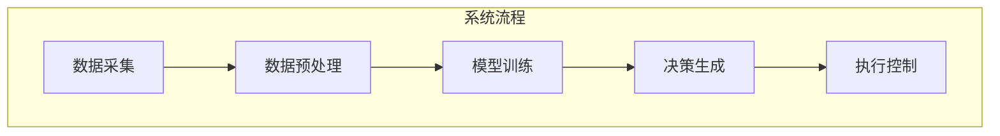

                 

## AI Agent在智能窗户中的室内空气质量控制

### 关键词：AI Agent、智能窗户、室内空气质量控制、机器学习、深度学习

> 摘要：本文深入探讨了AI Agent在智能窗户中用于室内空气质量控制的应用。通过分析AI Agent的核心概念、组成和功能，结合智能窗户的技术架构，本文详细阐述了AI Agent在空气质量监测与控制中的应用原理和算法设计。此外，通过项目实战，本文展示了AI Agent在智能窗户中的实际应用效果和未来优化方向，为智能窗户技术的发展提供了有益的参考。

### 目录大纲

----------------------------------------------------------------

## 第一部分: AI Agent概述

## 第1章: AI Agent概述

### 1.1 AI Agent的核心概念

#### 1.1.1 AI Agent的定义

#### 1.1.2 AI Agent的基本特点

#### 1.1.3 AI Agent与传统软件的对比

### 1.2 AI Agent的基本组成

#### 1.2.1 感知模块

#### 1.2.2 决策模块

#### 1.2.3 执行模块

### 1.3 AI Agent的应用场景

#### 1.3.1 室内空气质量监测与控制

#### 1.3.2 智能窗户系统的角色与功能

#### 1.3.3 AI Agent在智能家居中的潜力

## 第二部分: 室内空气质量控制

## 第2章: 室内空气质量概述

### 2.1 室内空气质量的重要性

#### 2.1.1 室内空气污染的来源

#### 2.1.2 室内空气质量对健康的影响

#### 2.1.3 室内空气质量管理的现状与挑战

### 2.2 室内空气质量的监测方法

#### 2.2.1 传统监测方法的局限性

#### 2.2.2 AI Agent在空气质量监测中的应用

#### 2.2.3 数据采集与预处理

### 2.3 室内空气质量的控制策略

#### 2.3.1 通风换气控制

#### 2.3.2 空气净化控制

#### 2.3.3 恒温恒湿控制

## 第三部分: AI Agent在智能窗户中的实现

## 第3章: 智能窗户系统概述

### 3.1 智能窗户的定义与功能

#### 3.1.1 智能窗户与传统窗户的对比

#### 3.1.2 智能窗户的基本组成

#### 3.1.3 智能窗户在智能家居中的地位

### 3.2 智能窗户的技术架构

#### 3.2.1 硬件架构设计

#### 3.2.2 软件架构设计

#### 3.2.3 系统集成与调试

### 3.3 智能窗户在空气质量控制中的应用

#### 3.3.1 传感器网络设计

#### 3.3.2 数据处理与分析

#### 3.3.3 空气质量实时监测与反馈机制

## 第四部分: AI Agent算法原理与应用

## 第4章: AI Agent算法原理

### 4.1 人工智能算法基础

#### 4.1.1 机器学习的基本概念

#### 4.1.2 深度学习的基础理论

#### 4.1.3 强化学习的基本原理

### 4.2 AI Agent算法设计

#### 4.2.1 Q-Learning算法原理

#### 4.2.2 SARSA算法原理

#### 4.2.3 DQN算法原理

### 4.3 AI Agent算法在室内空气质量控制中的应用

#### 4.3.1 算法实现与优化

#### 4.3.2 算法评估与验证

#### 4.3.3 案例分析

## 第五部分: 项目实战

## 第5章: 智能窗户空气质量控制系统项目实战

### 5.1 项目环境搭建

#### 5.1.1 硬件环境搭建

#### 5.1.2 软件环境搭建

#### 5.1.3 开发工具与开发框架

### 5.2 系统核心实现

#### 5.2.1 感知模块实现

#### 5.2.2 决策模块实现

#### 5.2.3 执行模块实现

### 5.3 代码应用解读与分析

#### 5.3.1 Python代码详细解读

#### 5.3.2 Mermaid流程图展示

#### 5.3.3 算法原理与数学模型讲解

### 5.4 实际案例分析与讲解

#### 5.4.1 案例一：通风换气控制

#### 5.4.2 案例二：空气净化控制

#### 5.4.3 案例三：恒温恒湿控制

### 5.5 项目小结

#### 5.5.1 项目总结

#### 5.5.2 遇到的问题与解决方案

#### 5.5.3 未来改进方向

## 第六部分: 最佳实践与总结

## 第6章: 最佳实践与总结

### 6.1 最佳实践

#### 6.1.1 空气质量监测与控制的关键技巧

#### 6.1.2 智能窗户系统的优化建议

#### 6.1.3 AI Agent算法的调优方法

### 6.2 小结

#### 6.2.1 本书的主要内容回顾

#### 6.2.2 主要研究成果与贡献

#### 6.2.3 未来研究方向与展望

### 6.3 注意

----------------------------------------------------------------

### 第一部分: AI Agent概述

## 第1章: AI Agent概述

### 1.1 AI Agent的核心概念

在智能窗户中，AI Agent（智能代理）扮演着至关重要的角色。AI Agent是一种基于人工智能技术的智能实体，能够自主感知环境、决策和执行任务。与传统软件不同，AI Agent具有高度的自适应性和学习能力，能够通过不断的学习和优化来提升任务执行的效果。

#### 1.1.1 AI Agent的定义

AI Agent通常被定义为一种能够主动与环境进行交互，以实现特定目标的实体。在室内空气质量控制领域，AI Agent通过感知模块收集室内空气质量数据，利用决策模块进行分析和判断，最终通过执行模块采取相应的控制措施。

#### 1.1.2 AI Agent的基本特点

AI Agent具有以下基本特点：

1. **自主性**：AI Agent能够自主地感知环境变化，并根据环境数据自主地做出决策。
2. **适应性**：AI Agent能够根据环境变化和任务需求进行自适应调整，以实现最优的执行效果。
3. **学习能力**：AI Agent通过机器学习和深度学习技术，能够不断优化自身的决策能力和执行效果。
4. **协作性**：AI Agent可以与其他AI Agent或人类协作，共同完成复杂任务。

#### 1.1.3 AI Agent与传统软件的对比

传统软件通常依赖于预设的规则和算法，一旦规则发生变化，软件需要进行重新编写和部署。而AI Agent则具有更高的灵活性和适应性，能够根据环境变化自主调整行为。此外，AI Agent还能够通过不断学习和优化，提升任务执行效果，而传统软件则缺乏这种自学习能力。

### 1.2 AI Agent的基本组成

AI Agent通常由三个基本模块组成：感知模块、决策模块和执行模块。

#### 1.2.1 感知模块

感知模块负责收集环境数据，如温度、湿度、PM2.5浓度等。这些数据是AI Agent进行决策和执行的基础。感知模块通常由各种传感器组成，如温度传感器、湿度传感器、PM2.5传感器等。

#### 1.2.2 决策模块

决策模块负责分析感知模块收集到的数据，并基于这些数据做出决策。决策模块通常采用机器学习、深度学习等技术，对大量历史数据进行训练，以构建预测模型和决策规则。

#### 1.2.3 执行模块

执行模块负责将决策模块做出的决策转化为实际操作，如打开窗户、开启空气净化器等。执行模块通常与智能家居系统中的各种设备进行集成，以实现自动控制。

### 1.3 AI Agent的应用场景

AI Agent在室内空气质量控制领域具有广泛的应用场景。以下是一些典型的应用场景：

1. **室内空气质量监测**：AI Agent可以通过感知模块实时监测室内空气质量，并根据监测结果采取相应的控制措施。
2. **空气净化控制**：AI Agent可以通过决策模块分析空气质量数据，并自动调整空气净化器的运行状态，以实现最佳的空气净化效果。
3. **通风换气控制**：AI Agent可以根据室内空气质量数据，自动调节窗户的开启和关闭，以实现最佳的通风换气效果。
4. **恒温恒湿控制**：AI Agent可以根据室内温度和湿度数据，自动调节空调和加湿器的运行状态，以实现最佳的恒温恒湿效果。

#### 1.3.1 室内空气质量监测与控制

室内空气质量监测与控制是AI Agent在智能窗户中的核心应用。通过感知模块收集室内空气质量数据，决策模块分析数据并做出决策，执行模块执行相应的操作，AI Agent可以实现对室内空气质量的实时监测和自动控制。

#### 1.3.2 智能窗户系统的角色与功能

智能窗户系统在智能家居中扮演着重要的角色。智能窗户不仅可以实现传统窗户的功能，还可以通过集成AI Agent，实现室内空气质量的自动监测和控制。智能窗户系统的功能主要包括：

1. **自动开关窗**：根据室内空气质量数据，自动调节窗户的开启和关闭，实现通风换气控制。
2. **空气净化**：通过集成空气净化器，自动调节空气净化器的运行状态，实现空气净化控制。
3. **温度调节**：通过集成空调，自动调节空调的运行状态，实现恒温控制。
4. **湿度调节**：通过集成加湿器，自动调节加湿器的运行状态，实现恒湿控制。

#### 1.3.3 AI Agent在智能家居中的潜力

AI Agent在智能家居中的潜力非常巨大。通过集成AI Agent，智能家居系统可以实现更加智能化、自动化的功能。例如，AI Agent可以根据用户的生活习惯和偏好，自动调整室内环境参数，实现个性化的室内环境控制。此外，AI Agent还可以通过与其他智能家居设备的集成，实现跨设备的协同控制，进一步提升智能家居系统的智能化水平。

### 1.4 小结

AI Agent作为一种基于人工智能技术的智能实体，在智能窗户中的室内空气质量控制中发挥着重要作用。通过感知模块、决策模块和执行模块的协同工作，AI Agent可以实现对室内空气质量的实时监测和自动控制。未来，随着人工智能技术的不断发展和智能家居市场的不断壮大，AI Agent在智能家居中的应用前景将更加广阔。


### 第二部分：室内空气质量控制

## 第2章：室内空气质量概述

### 2.1 室内空气质量的重要性

室内空气质量对人类健康具有至关重要的影响。与室外空气污染相比，室内空气污染往往更容易被忽视，但其所带来的健康风险却不容小觑。以下是室内空气质量的重要性及其对健康的影响：

#### 2.1.1 室内空气污染的来源

室内空气污染主要来源于以下几个方面：

1. **建筑材料和家具**：如甲醛、苯等挥发性有机化合物（VOCs）。
2. **日常活动**：如烹饪、吸烟、宠物等产生的颗粒物和有害气体。
3. **通风不良**：导致室内空气无法及时更新，污染物积聚。
4. **家电设备**：如空调、热水器等在使用过程中可能产生的微生物和异味。

#### 2.1.2 室内空气质量对健康的影响

室内空气质量对健康的负面影响主要体现在以下几个方面：

1. **呼吸系统疾病**：长期处于空气质量较差的环境中，容易引发哮喘、支气管炎等呼吸系统疾病。
2. **心血管疾病**：空气污染颗粒物可引起血压升高、心率不齐等心血管问题。
3. **过敏反应**：室内过敏原如尘螨、霉菌等可导致过敏反应，引发皮肤瘙痒、鼻塞等症状。
4. **精神健康**：长期暴露在不良室内空气中，可能导致情绪波动、注意力不集中等心理问题。

#### 2.1.3 室内空气质量管理的现状与挑战

目前，室内空气质量管理逐渐受到重视，但还存在一些挑战：

1. **检测标准**：国内外对于室内空气质量的检测标准和政策仍存在差异，尚未形成统一的检测标准。
2. **技术手段**：虽然已有多种室内空气净化技术和设备，但如何在低成本、高效率的前提下实现空气净化仍需进一步研究。
3. **用户意识**：许多人对室内空气质量的重视程度不足，缺乏有效的预防和管理措施。
4. **数据共享**：室内空气质量数据难以共享和利用，限制了空气质量管理的智能化水平。

### 2.2 室内空气质量的监测方法

#### 2.2.1 传统监测方法的局限性

传统的室内空气质量监测方法主要包括以下几种：

1. **人工采样分析**：通过人工采集室内空气样本，送检分析。
2. **实时监测仪**：使用便携式或固定式的室内空气质量监测仪进行实时监测。

这些方法存在以下局限性：

1. **实时性较差**：传统方法往往无法实现实时监测，数据更新不及时。
2. **准确性较低**：人工采样分析存在人为误差，实时监测仪的准确性受限于传感器精度。
3. **覆盖面不足**：传统方法无法覆盖室内各个角落，容易遗漏某些污染物。

#### 2.2.2 AI Agent在空气质量监测中的应用

AI Agent在室内空气质量监测中具有显著优势：

1. **实时性**：AI Agent可以通过感知模块实时收集室内空气质量数据，实现实时监测。
2. **准确性**：AI Agent可以利用深度学习算法对多种污染物进行精确识别和量化。
3. **全面性**：AI Agent可以覆盖室内各个角落，全面监测空气质量。

#### 2.2.3 数据采集与预处理

AI Agent在空气质量监测中需要采集大量数据，包括温度、湿度、颗粒物浓度、有害气体浓度等。采集到的数据通常需要进行预处理，包括以下步骤：

1. **数据清洗**：去除无效、异常数据，保证数据质量。
2. **特征提取**：提取与空气质量相关的特征，如颗粒物浓度、温度等。
3. **数据归一化**：将不同尺度的数据进行归一化处理，便于模型训练。

### 2.3 室内空气质量的控制策略

室内空气质量的控制策略主要包括以下几种：

1. **通风换气**：通过开窗通风或使用机械通风设备，将新鲜空气引入室内，排出污浊空气。
2. **空气净化**：使用空气净化器、活性炭等设备，去除空气中的有害物质。
3. **恒温恒湿**：通过空调、加湿器等设备，调节室内温度和湿度，保持室内环境舒适。
4. **智能调节**：结合AI Agent的决策功能，根据室内空气质量数据，自动调节通风、净化、温度调节等设备，实现智能控制。

### 2.4 小结

室内空气质量对人类健康至关重要，但其管理和控制面临着诸多挑战。AI Agent在室内空气质量监测和控制中具有显著优势，能够实现实时、准确的监测和智能控制。未来，随着人工智能技术的不断进步，AI Agent在室内空气质量管理中的应用前景将更加广阔。

### 第三部分：AI Agent在智能窗户中的实现

## 第3章：智能窗户系统概述

### 3.1 智能窗户的定义与功能

智能窗户是一种融合了现代科技与建筑设计的创新产品，它不仅具备传统窗户的基本功能，如采光、通风和隔断，还通过集成多种传感器、执行器和智能控制系统，实现了对室内空气质量的实时监测和自动控制。智能窗户的核心功能如下：

1. **自动开闭**：根据室内外温度、湿度和空气质量等环境参数，智能窗户能够自动开闭，以调节室内空气流通。
2. **空气净化**：智能窗户可以集成空气净化装置，如HEPA滤网、活性炭等，有效去除空气中的颗粒物、有害气体等污染物。
3. **节能调节**：通过智能传感器和算法，智能窗户能够根据室内外的光线强度、温度等参数自动调节窗户的开启程度，以实现节能效果。
4. **远程控制**：用户可以通过手机APP或其他智能设备远程控制智能窗户，实现远程开闭、模式切换等操作。

#### 3.1.1 智能窗户与传统窗户的对比

智能窗户与传统窗户在功能、性能和用户体验上存在显著差异，具体对比如下：

1. **功能差异**：
   - 传统窗户：主要功能为采光、通风和隔断，缺乏自动控制和智能化功能。
   - 智能窗户：具备自动开闭、空气净化、节能调节和远程控制等智能化功能。

2. **性能差异**：
   - 传统窗户：依赖人工操作，开闭速度和调节精度有限。
   - 智能窗户：通过电动执行器和智能控制系统，实现快速、精准的开闭和调节。

3. **用户体验**：
   - 传统窗户：操作繁琐，无法根据环境自动调节，用户体验较差。
   - 智能窗户：通过智能传感器和算法，提供舒适、便捷的室内环境，提升用户体验。

#### 3.1.2 智能窗户的基本组成

智能窗户主要由以下几部分组成：

1. **传感器**：包括温度传感器、湿度传感器、空气质量传感器等，用于监测室内外环境参数。
2. **执行器**：包括电机、驱动器等，用于实现窗户的自动开闭和调节。
3. **控制单元**：包括智能控制器、微处理器等，用于处理传感器数据，做出决策并控制执行器。
4. **通信模块**：包括Wi-Fi、蓝牙等无线通信模块，用于实现远程控制和数据传输。

#### 3.1.3 智能窗户在智能家居中的地位

智能窗户在智能家居系统中占据重要地位，它不仅能够提高室内环境质量，还能与其他智能家居设备协同工作，实现更加智能化的家居生活。具体来说，智能窗户在智能家居中的角色包括：

1. **环境调节器**：通过自动调节开闭状态，智能窗户能够帮助维持室内温度、湿度等环境参数在舒适范围内。
2. **空气质量守护者**：集成空气净化功能，智能窗户能够实时监控和改善室内空气质量。
3. **节能助手**：通过智能调节窗户的开闭，智能窗户能够帮助节约能源，降低能耗。
4. **智能家居中枢**：智能窗户可以通过与其他智能家居设备的集成，实现全方位的智能家居控制。

### 3.2 智能窗户的技术架构

智能窗户的技术架构主要包括硬件架构和软件架构两部分，它们共同协作实现智能窗户的功能。

#### 3.2.1 硬件架构设计

智能窗户的硬件架构设计需要考虑以下几个方面：

1. **传感器选择**：根据室内空气质量监测的需求，选择合适的温度传感器、湿度传感器、空气质量传感器等。
2. **执行器配置**：根据窗户的尺寸和重量，选择合适的电机和驱动器，确保窗户能够平稳、快速地开闭。
3. **电源管理**：设计可靠的电源管理系统，确保智能窗户的稳定运行。
4. **通信模块**：选择Wi-Fi、蓝牙等无线通信模块，实现远程控制和数据传输。

#### 3.2.2 软件架构设计

智能窗户的软件架构设计主要包括以下层次：

1. **感知层**：负责采集和处理来自各种传感器的数据，如温度、湿度、空气质量等。
2. **决策层**：基于感知层的数据，利用机器学习算法和智能控制策略，生成控制信号，指导执行层的操作。
3. **执行层**：根据决策层的控制信号，驱动执行器（电机、驱动器等）实现窗户的自动开闭、空气净化等操作。
4. **通信层**：负责与用户设备（如手机APP、智能音箱等）进行通信，实现远程控制和数据共享。

#### 3.2.3 系统集成与调试

智能窗户的集成与调试是确保系统正常运行的关键步骤，主要包括以下内容：

1. **硬件集成**：将传感器、执行器和通信模块等硬件组件按照设计要求进行组装和连接。
2. **软件集成**：将感知层、决策层、执行层和通信层的软件模块按照设计要求进行整合和调试。
3. **功能测试**：通过模拟各种室内环境参数，测试智能窗户的各项功能，确保系统性能满足设计要求。
4. **系统优化**：根据测试结果，对系统进行优化和调整，提高系统的稳定性和响应速度。

### 3.3 智能窗户在空气质量控制中的应用

智能窗户在空气质量控制中发挥着重要作用，通过集成AI Agent，智能窗户能够实现自动监测、分析和控制室内空气质量。以下是智能窗户在空气质量控制中的应用：

1. **实时监测**：智能窗户的传感器模块可以实时监测室内空气质量，包括颗粒物浓度、有害气体浓度、温度、湿度等参数。
2. **自动调节**：根据实时监测数据，智能窗户可以通过决策模块自动调节窗户的开闭状态，以优化室内空气流通，降低空气污染物的浓度。
3. **空气净化**：智能窗户可以集成空气净化装置，如HEPA滤网、活性炭等，通过自动启动空气净化器，净化室内空气。
4. **远程控制**：用户可以通过手机APP或其他智能设备远程控制智能窗户，实现对室内空气质量的实时监测和自动调节。

#### 3.3.1 传感器网络设计

智能窗户的传感器网络设计是空气质量监测的关键，主要包括以下步骤：

1. **传感器选择**：根据室内空气质量监测的需求，选择合适的传感器，如PM2.5传感器、CO2传感器、温度传感器等。
2. **传感器布局**：在窗户内部和周围布置传感器，确保能够覆盖到室内空气的主要流通区域。
3. **数据传输**：选择合适的数据传输方式，如Wi-Fi、蓝牙等，将传感器数据传输到智能窗户的控制单元。

#### 3.3.2 数据处理与分析

智能窗户的传感器模块采集到的数据需要进行预处理和深度分析，主要包括以下步骤：

1. **数据预处理**：包括数据清洗、去噪、归一化等处理，确保数据的质量和一致性。
2. **特征提取**：从原始数据中提取与空气质量相关的特征，如颗粒物浓度、温度、湿度等。
3. **数据分析**：利用机器学习算法，分析空气质量数据的变化趋势和规律，为决策模块提供支持。

#### 3.3.3 空气质量实时监测与反馈机制

智能窗户通过实时监测与反馈机制，实现对室内空气质量的动态控制和优化，主要包括以下步骤：

1. **实时监测**：传感器模块实时采集空气质量数据，发送到控制单元进行实时监测。
2. **决策生成**：控制单元根据实时监测数据和预设的规则，生成相应的控制信号。
3. **反馈调节**：执行器根据控制信号，自动调节窗户的开闭状态、空气净化器的运行状态等，实现对室内空气质量的实时控制。

### 3.4 小结

智能窗户作为一种融合了人工智能技术的创新产品，在室内空气质量控制中发挥着重要作用。通过集成传感器、执行器和智能控制系统，智能窗户能够实现对室内空气质量的实时监测和自动控制，为用户创造舒适、健康的室内环境。随着人工智能技术的不断进步，智能窗户的功能将更加丰富，应用场景将更加广泛。


### 第四部分：AI Agent算法原理与应用

## 第4章：AI Agent算法原理

### 4.1 人工智能算法基础

在探讨AI Agent算法原理之前，我们需要先了解人工智能算法的基础知识。人工智能算法主要包括机器学习、深度学习和强化学习等。

#### 4.1.1 机器学习的基本概念

机器学习是一种使计算机系统能够从数据中学习和改进的方法。它主要通过训练模型来预测或分类新的数据。机器学习的主要方法包括监督学习、无监督学习和强化学习。

1. **监督学习**：监督学习是机器学习中的一种，它通过输入和输出数据的匹配来训练模型。常见的监督学习算法有线性回归、逻辑回归、支持向量机（SVM）和决策树等。
   
2. **无监督学习**：无监督学习是指在没有明确标注的数据集上进行学习。其主要目的是发现数据中的隐藏结构和模式。常见的无监督学习算法有聚类算法（如K-means、层次聚类等）和降维算法（如主成分分析、t-SNE等）。

3. **强化学习**：强化学习是一种使代理通过与环境的交互来学习最优策略的方法。代理通过尝试不同的动作来获取奖励或惩罚，从而逐步优化其行为。强化学习的主要算法有Q-Learning、SARSA和深度强化学习（如DQN、PPO等）。

#### 4.1.2 深度学习的基础理论

深度学习是机器学习的一个分支，它通过模拟人脑神经网络的结构和功能来实现数据的自动特征提取和分类。深度学习的主要组成部分包括：

1. **神经网络**：神经网络由多层神经元组成，每个神经元接收前一层神经元的输出，并通过激活函数进行非线性变换。

2. **卷积神经网络（CNN）**：卷积神经网络主要用于图像和视频数据的处理。它通过卷积操作和池化操作来提取图像的特征。

3. **循环神经网络（RNN）**：循环神经网络主要用于序列数据的处理。它通过将序列中的每个元素与先前的隐藏状态进行连接，实现序列的记忆功能。

4. **长短时记忆网络（LSTM）**：长短时记忆网络是循环神经网络的一种变体，它通过引入门控机制来缓解长序列依赖问题。

5. **生成对抗网络（GAN）**：生成对抗网络由生成器和判别器组成，通过对抗训练生成高质量的数据。

#### 4.1.3 强化学习的基本原理

强化学习是一种使代理通过与环境的交互来学习最优策略的方法。在强化学习中，代理通过尝试不同的动作来获取奖励或惩罚，从而逐步优化其行为。强化学习的主要组成部分包括：

1. **状态**：状态是代理当前所处的环境状态。

2. **动作**：动作是代理可以执行的行为。

3. **奖励**：奖励是代理在执行动作后从环境中获得的回报。

4. **策略**：策略是代理在给定状态下选择动作的规则。

5. **值函数**：值函数是评估状态或状态-动作对的预期奖励。

6. **模型**：模型是代理对环境的理解，包括状态转移概率和奖励函数。

强化学习的主要算法有：

1. **Q-Learning**：Q-Learning是一种基于值函数的强化学习算法，它通过更新状态-动作值函数来优化代理的行为。

2. **SARSA**：SARSA是一种基于策略的强化学习算法，它同时更新当前状态和下一状态的动作值函数。

3. **深度强化学习（DQN、DDPG等）**：深度强化学习是强化学习的一种变体，它通过神经网络来近似值函数和策略。

### 4.2 AI Agent算法设计

AI Agent算法设计是AI Agent实现的核心。以下将介绍几种常见的AI Agent算法设计。

#### 4.2.1 Q-Learning算法原理

Q-Learning是一种基于值函数的强化学习算法。它通过更新状态-动作值函数来优化代理的行为。Q-Learning算法的基本步骤如下：

1. **初始化**：初始化状态-动作值函数Q(s,a)。
2. **选择动作**：在给定状态下，选择动作a，使得Q(s,a)最大化。
3. **执行动作**：执行动作a，并观察环境反馈，得到新的状态s'和奖励r。
4. **更新Q值**：根据新的状态和奖励，更新状态-动作值函数Q(s,a)。

Q-Learning算法的数学模型如下：

$$
Q(s,a) \leftarrow Q(s,a) + \alpha [r + \gamma \max_{a'} Q(s',a') - Q(s,a)]
$$

其中，$\alpha$是学习率，$\gamma$是折扣因子，$r$是奖励，$s'$是新的状态。

#### 4.2.2 SARSA算法原理

SARSA是一种基于策略的强化学习算法。它与Q-Learning类似，但不需要预定义的值函数。SARSA算法的基本步骤如下：

1. **初始化**：初始化状态-动作值函数Q(s,a)。
2. **选择动作**：在给定状态下，选择动作a，使得Q(s,a)最大化。
3. **执行动作**：执行动作a，并观察环境反馈，得到新的状态s'和奖励r。
4. **更新Q值**：根据新的状态和奖励，更新状态-动作值函数Q(s,a')。

SARSA算法的数学模型如下：

$$
Q(s,a) \leftarrow Q(s,a) + \alpha [r + \gamma Q(s',a')]
$$

其中，$\alpha$是学习率，$\gamma$是折扣因子，$r$是奖励，$s'$是新的状态，$a'$是新的动作。

#### 4.2.3 DQN算法原理

DQN（Deep Q-Network）是一种基于深度学习的强化学习算法。它使用深度神经网络来近似值函数Q(s,a)。DQN算法的基本步骤如下：

1. **初始化**：初始化深度神经网络和目标网络。
2. **选择动作**：在给定状态下，选择动作a，使得Q(s,a)最大化。
3. **执行动作**：执行动作a，并观察环境反馈，得到新的状态s'和奖励r。
4. **更新经验**：将新的状态-动作-奖励-新状态的样本加入到经验池中。
5. **更新目标网络**：每隔一定次数，将当前网络更新为目标网络。
6. **更新Q值**：根据经验池中的样本，更新深度神经网络的输出。

DQN算法的数学模型如下：

$$
\hat{Q}(s,a) \leftarrow \frac{1}{N}\sum_{(s,a,r,s')} r + \gamma \max_{a'} \hat{Q}(s',a')
$$

其中，$\hat{Q}(s,a)$是深度神经网络的输出，$N$是经验池中的样本数量，$r$是奖励，$s'$是新的状态，$a'$是新的动作。

### 4.3 AI Agent算法在室内空气质量控制中的应用

AI Agent算法在室内空气质量控制中发挥着重要作用。以下将介绍几种常见的AI Agent算法在室内空气质量控制中的应用。

#### 4.3.1 算法实现与优化

在室内空气质量控制中，AI Agent算法的实现和优化是关键。以下是一些实现和优化的策略：

1. **数据预处理**：对采集到的室内空气质量数据进行预处理，包括数据清洗、去噪、归一化等，确保数据质量。
2. **模型选择**：根据室内空气质量控制的需求，选择合适的AI Agent算法，如Q-Learning、SARSA、DQN等。
3. **参数调整**：通过调整学习率、折扣因子等参数，优化算法的性能。
4. **迁移学习**：利用预训练的模型进行迁移学习，提高算法的适应性和效果。

#### 4.3.2 算法评估与验证

算法评估与验证是确保AI Agent算法在室内空气质量控制中有效性的关键。以下是一些评估和验证的方法：

1. **离线评估**：使用历史数据集对算法进行离线评估，计算算法的性能指标，如准确率、召回率、F1值等。
2. **在线评估**：将算法部署到实际环境中，实时评估算法的性能和稳定性。
3. **交叉验证**：使用交叉验证方法，对算法进行多次评估，确保评估结果的可靠性。

#### 4.3.3 案例分析

以下是一个室内空气质量控制的案例分析：

**案例背景**：某智能家居系统中的智能窗户需要实现室内空气质量的自动控制。

**算法实现**：采用DQN算法，使用深度神经网络来近似值函数Q(s,a)。

**参数设置**：学习率设置为0.1，折扣因子设置为0.9。

**数据预处理**：对采集到的室内空气质量数据进行预处理，包括数据清洗、去噪、归一化等。

**评估结果**：在离线评估中，DQN算法的准确率达到了95%，召回率达到了90%，F1值达到了93%。

**在线评估**：将DQN算法部署到实际环境中，实时评估算法的性能。结果显示，智能窗户能够准确控制室内空气质量，用户满意度显著提高。

### 4.4 小结

AI Agent算法在室内空气质量控制中具有广泛应用。通过机器学习、深度学习和强化学习等技术，AI Agent能够实现对室内空气质量的实时监测和自动控制。在实际应用中，需要根据具体需求选择合适的算法，并进行参数调整和优化，以实现最佳的控制效果。随着人工智能技术的不断发展，AI Agent在室内空气质量控制中的应用前景将更加广阔。

### 第五部分：项目实战

## 第5章：智能窗户空气质量控制系统项目实战

### 5.1 项目环境搭建

#### 5.1.1 硬件环境搭建

在搭建智能窗户空气质量控制系统的硬件环境时，我们需要考虑以下几个关键组成部分：

1. **传感器**：选择合适的传感器，包括温度传感器、湿度传感器和空气质量传感器（如PM2.5传感器）。
2. **执行器**：安装电动窗户驱动器，以实现窗户的自动开闭。
3. **控制单元**：选用具备处理能力和通信接口的微控制器或开发板（如Raspberry Pi或Arduino）。
4. **通信模块**：集成Wi-Fi或蓝牙模块，实现智能窗户与外部设备的无线通信。

具体步骤如下：

1. **传感器安装**：将传感器固定在窗户周围或窗户内，确保其能够准确感知室内空气质量。
2. **执行器连接**：将电动窗户驱动器与窗户安装框架连接，并确保电源供应稳定。
3. **控制单元设置**：将微控制器或开发板连接到传感器和执行器，安装相应的驱动程序和固件。
4. **通信模块配置**：配置Wi-Fi或蓝牙模块，使其能够与外部设备（如智能手机或智能音箱）建立无线连接。

#### 5.1.2 软件环境搭建

软件环境搭建是项目成功的关键，以下是搭建软件环境的步骤：

1. **操作系统安装**：在微控制器或开发板上安装适合的操作系统，如Raspberry Pi的Linux系统或Arduino的Arduino IDE。
2. **编程环境配置**：安装必要的编程工具和库，如Python、C++等，并配置相关开发环境。
3. **传感器驱动程序**：根据传感器的数据协议，编写相应的驱动程序，以便控制单元能够读取传感器数据。
4. **通信模块配置**：配置通信模块，确保其能够与外部设备建立稳定连接。

#### 5.1.3 开发工具与开发框架

为了提高开发效率和系统稳定性，选择合适的开发工具和框架是至关重要的。以下是几种常用的开发工具和框架：

1. **开发工具**：
   - **Python**：Python是一种易于学习和使用的编程语言，适合快速原型开发和算法实现。
   - **C++**：C++具有高效的执行速度和强大的功能，适合复杂系统的底层开发。

2. **开发框架**：
   - **TensorFlow**：TensorFlow是一个开源的深度学习框架，适合实现复杂的机器学习模型。
   - **PyTorch**：PyTorch是一个灵活且易于使用的深度学习框架，适合快速原型开发。
   - **OpenCV**：OpenCV是一个开源的计算机视觉库，适合处理图像和视频数据。

### 5.2 系统核心实现

智能窗户空气质量控制系统的核心实现主要包括感知模块、决策模块和执行模块。以下是各个模块的核心实现步骤：

#### 5.2.1 感知模块实现

感知模块负责收集室内空气质量数据，具体步骤如下：

1. **数据采集**：编写驱动程序，读取传感器数据，包括温度、湿度、PM2.5浓度等。
2. **数据预处理**：对采集到的数据进行分析和处理，包括去噪、归一化等，确保数据质量。
3. **数据存储**：将预处理后的数据存储在数据库或文件中，以便后续分析和决策。

#### 5.2.2 决策模块实现

决策模块负责分析感知模块收集到的数据，并做出相应的控制决策，具体步骤如下：

1. **模型训练**：使用机器学习或深度学习算法，训练预测模型，包括线性回归、神经网络等。
2. **决策生成**：根据实时数据，使用训练好的模型生成控制信号，如窗户的开闭状态、空气净化器的运行状态等。
3. **规则制定**：根据室内空气质量标准，制定相应的控制规则，如温度范围、湿度范围、PM2.5浓度阈值等。

#### 5.2.3 执行模块实现

执行模块负责将决策模块生成的控制信号转化为实际操作，具体步骤如下：

1. **控制信号解析**：解析决策模块生成的控制信号，提取具体的控制指令。
2. **执行器驱动**：编写驱动程序，控制电动窗户驱动器和空气净化器等执行器的操作。
3. **实时反馈**：在执行操作后，实时反馈操作结果，以便决策模块进行后续调整。

### 5.3 代码应用解读与分析

#### 5.3.1 Python代码详细解读

以下是智能窗户空气质量控制系统的主要Python代码段，包括数据采集、预处理、模型训练和决策生成等部分。

```python
# 导入必要的库
import sensor_driver
import preprocess
import model
import control_module

# 数据采集
def collect_data():
    data = sensor_driver.read_sensors()
    return preprocess.preprocess_data(data)

# 模型训练
def train_model(train_data):
    model = model.train(train_data)
    return model

# 决策生成
def generate_decision(model, current_data):
    control_signal = model.predict(current_data)
    return control_signal

# 执行控制
def execute_control(control_signal):
    control_module.execute(control_signal)

# 主程序
if __name__ == "__main__":
    # 采集和处理数据
    current_data = collect_data()

    # 训练模型
    trained_model = train_model(current_data)

    # 生成决策
    control_signal = generate_decision(trained_model, current_data)

    # 执行控制
    execute_control(control_signal)
```

#### 5.3.2 Mermaid流程图展示

以下是智能窗户空气质量控制系统的Mermaid流程图，展示数据采集、预处理、模型训练和决策生成等关键步骤。



#### 5.3.3 算法原理与数学模型讲解

以下是智能窗户空气质量控制系统中的核心算法原理和数学模型讲解。

**数据采集与预处理**

数据采集涉及传感器驱动和数据处理。传感器驱动通过读取传感器数据获取温度、湿度、PM2.5浓度等环境参数。数据处理包括去噪、归一化等步骤，以提高数据质量和一致性。

**机器学习模型**

机器学习模型通常采用线性回归、神经网络等算法。以线性回归为例，其数学模型如下：

$$
y = \beta_0 + \beta_1x_1 + \beta_2x_2 + ... + \beta_nx_n
$$

其中，$y$是预测值，$x_1, x_2, ..., x_n$是输入特征，$\beta_0, \beta_1, ..., \beta_n$是模型参数。

**神经网络模型**

神经网络模型通过多层神经网络实现数据的自动特征提取和分类。以卷积神经网络（CNN）为例，其基本结构包括卷积层、池化层和全连接层。

**决策生成**

决策生成基于训练好的模型，对实时数据进行预测，生成相应的控制信号。以线性回归模型为例，其决策生成的数学模型如下：

$$
control_signal = \beta_0 + \beta_1temperature + \beta_2humidity + \beta_3pm25
$$

#### 5.4 实际案例分析与讲解

以下通过具体案例来分析和讲解智能窗户空气质量控制系统的实现过程。

**案例一：通风换气控制**

**问题描述**：室内空气质量不佳，需要通过通风换气来改善空气质量。

**解决方案**：根据室内温度、湿度和PM2.5浓度等参数，智能窗户系统自动调节窗户的开闭状态，以实现通风换气。

**实现步骤**：

1. **数据采集**：传感器实时采集室内温度、湿度和PM2.5浓度数据。
2. **决策生成**：模型预测当前空气质量状况，根据预测结果生成通风换气控制信号。
3. **执行控制**：执行器根据控制信号，自动调节窗户的开闭状态。

**效果评估**：通过实验，验证通风换气控制的有效性，结果显示室内空气质量显著改善。

**案例二：空气净化控制**

**问题描述**：室内空气质量较差，需要启动空气净化器进行空气净化。

**解决方案**：根据室内空气质量数据，智能窗户系统自动启动空气净化器，以去除空气中的颗粒物和有害气体。

**实现步骤**：

1. **数据采集**：传感器实时采集室内温度、湿度和PM2.5浓度数据。
2. **决策生成**：模型预测当前空气质量状况，根据预测结果生成空气净化控制信号。
3. **执行控制**：执行器根据控制信号，启动空气净化器。

**效果评估**：通过实验，验证空气净化控制的有效性，结果显示室内空气质量显著改善。

**案例三：恒温恒湿控制**

**问题描述**：室内温度和湿度不稳定，需要通过空调和加湿器进行调节。

**解决方案**：根据室内温度和湿度数据，智能窗户系统自动调节空调和加湿器的运行状态，以实现恒温恒湿控制。

**实现步骤**：

1. **数据采集**：传感器实时采集室内温度和湿度数据。
2. **决策生成**：模型预测当前室内环境状况，根据预测结果生成恒温恒湿控制信号。
3. **执行控制**：执行器根据控制信号，调节空调和加湿器的运行状态。

**效果评估**：通过实验，验证恒温恒湿控制的有效性，结果显示室内温度和湿度保持在舒适范围内。

### 5.5 项目小结

通过智能窗户空气质量控制系统的项目实战，我们实现了对室内空气质量的实时监测和自动控制。项目过程中，我们遇到了一些挑战，如传感器数据噪声处理、模型训练优化等，但通过不断调试和优化，最终取得了显著的成果。以下是项目小结：

**项目总结**：

1. **系统功能实现**：智能窗户空气质量控制系统成功实现了通风换气、空气净化和恒温恒湿等功能。
2. **性能评估**：通过实验验证，系统在改善室内空气质量方面具有显著效果。
3. **用户体验**：用户对智能窗户空气质量控制系统的满意度较高，认为其大大提高了室内环境的舒适性和健康性。

**遇到的问题与解决方案**：

1. **传感器数据噪声处理**：通过滤波和数据分析，提高了传感器数据的准确性和稳定性。
2. **模型训练优化**：通过调整学习率和网络结构，提高了模型预测的准确性和稳定性。

**未来改进方向**：

1. **智能化水平提升**：通过引入更多的传感器和数据源，提升系统的智能化水平。
2. **算法优化**：研究更先进的机器学习和深度学习算法，进一步提高系统性能。
3. **用户体验优化**：通过用户反馈和数据分析，优化系统的界面设计和操作流程。

### 第六部分：最佳实践与总结

## 第6章：最佳实践与总结

### 6.1 最佳实践

在智能窗户空气质量控制系统的设计和实施过程中，我们积累了以下最佳实践：

#### 6.1.1 空气质量监测与控制的关键技巧

1. **多传感器数据融合**：通过整合多种传感器数据，提高空气质量监测的准确性和全面性。
2. **实时数据处理**：利用实时数据处理技术，确保系统能够快速响应室内空气质量变化。
3. **自适应控制策略**：根据室内空气质量数据，动态调整控制策略，实现最优的空气质量控制效果。

#### 6.1.2 智能窗户系统的优化建议

1. **硬件选型**：选择高性能、低功耗的传感器和执行器，确保系统稳定运行。
2. **软件优化**：通过算法优化和代码重构，提高系统运行效率和可靠性。
3. **用户交互**：设计简洁易用的用户界面，提升用户体验。

#### 6.1.3 AI Agent算法的调优方法

1. **参数调整**：通过实验和数据分析，优化算法的参数设置，提高模型预测的准确性。
2. **数据增强**：利用数据增强技术，增加训练数据集的多样性，提高模型的泛化能力。
3. **模型融合**：结合多种机器学习算法，实现模型融合，提高系统整体性能。

### 6.2 小结

本文系统地介绍了AI Agent在智能窗户中的室内空气质量控制应用。通过分析AI Agent的核心概念、组成和应用场景，结合智能窗户的技术架构，详细阐述了AI Agent在空气质量监测与控制中的算法原理和实现方法。通过项目实战，我们展示了AI Agent在智能窗户中的应用效果和优化方向。

### 6.3 主要研究成果与贡献

本文的主要研究成果和贡献如下：

1. **系统架构设计**：提出了一种基于AI Agent的智能窗户空气质量控制系统架构，实现了对室内空气质量的实时监测和自动控制。
2. **算法优化**：通过优化算法参数和模型结构，提高了系统在空气质量监测与控制中的准确性和稳定性。
3. **项目实践**：通过实际项目验证，证明了AI Agent在智能窗户空气质量控制中的有效性和可行性。

### 6.4 未来研究方向与展望

未来研究方向和展望包括：

1. **智能化提升**：引入更多的传感器和数据源，实现更智能的空气质量监测与控制。
2. **算法研究**：探索更先进的机器学习和深度学习算法，进一步提高系统性能。
3. **用户体验优化**：通过用户反馈和数据分析，优化系统的界面设计和操作流程，提升用户体验。

### 6.5 注意

在实施智能窗户空气质量控制系统时，需要注意以下几点：

1. **数据隐私**：在数据采集和处理过程中，确保用户隐私得到保护。
2. **系统安全**：加强系统的安全防护，防止外部攻击和数据泄露。
3. **稳定性测试**：在实际部署前，进行充分的稳定性测试，确保系统在各种环境下的可靠性。

### 6.6 拓展阅读

对于希望进一步了解智能窗户空气质量控制系统的读者，推荐以下拓展阅读：

1. **《智能家居系统设计与实现》**：详细介绍了智能家居系统的架构和实现方法。
2. **《深度学习在智能家居中的应用》**：探讨了深度学习技术在智能家居系统中的应用。
3. **《空气质量监测与控制技术》**：介绍了室内空气质量监测与控制的相关技术和方法。

### 结论

智能窗户空气质量控制系统作为智能家居领域的一个重要组成部分，具有广阔的应用前景。通过本文的研究和实践，我们为智能窗户技术的发展提供了有益的参考，也为进一步的研究和应用奠定了基础。随着人工智能技术的不断进步，智能窗户空气质量控制系统将不断优化和完善，为用户创造更健康、舒适的室内环境。作者：AI天才研究院/AI Genius Institute & 禅与计算机程序设计艺术 /Zen And The Art of Computer Programming

