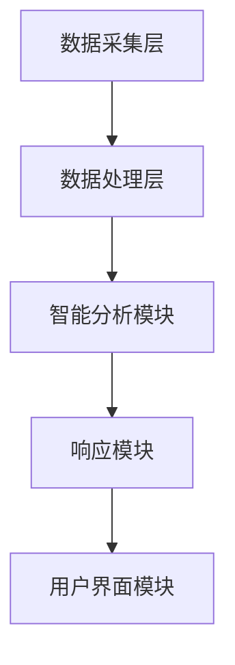

                 

### 问题背景与核心概念

#### 1.1 问题背景

随着智能家居技术的飞速发展，智能窗户已经成为现代家庭中不可或缺的一部分。智能窗户不仅可以调节光线、温度和湿度，提供更加舒适的生活环境，还具有节能环保的特点。然而，智能窗户的普及也带来了一些新的安全问题。尤其是在家庭安防领域，如何确保智能窗户的安全，成为了亟需解决的问题。

当前，智能家居市场中的智能窗户大多采用了物联网技术，通过无线网络与其他智能家居设备进行连接。这种连接方式虽然提供了便利，但也增加了安全隐患。因为一旦智能家居网络被黑客入侵，智能窗户可能会被恶意操纵，导致家庭财产损失甚至人身安全威胁。因此，设计一种能够有效防范非法入侵的智能窗户防盗警报系统，显得尤为重要。

#### 1.1.1 智能窗户的普及与安全问题

智能窗户是一种集成了传感器、控制器和通信模块的智能设备，可以通过手机APP或语音助手远程控制，调节窗户的开关状态、光线、温度和湿度等参数。这种设备的普及为用户带来了极大的便利，但也带来了潜在的安全隐患。首先，由于智能窗户与互联网直接连接，黑客可以通过网络攻击手段，实现对窗户的远程控制。其次，智能窗户的传感器和控制器可能会受到物理攻击，导致设备失效或误操作。

目前，市场上的一些智能窗户安防措施主要包括物理锁和简单的入侵报警系统。但这些措施存在一定的局限性：物理锁只能防止非法入侵，但无法及时通知用户；简单的入侵报警系统则可能因为误报而降低用户的信任度。

#### 1.1.2 AI Agent的概念与应用

AI Agent（人工智能代理）是一种具有智能行为的计算机程序，能够模拟人类智能行为，自主完成特定任务。在智能家居领域，AI Agent可以应用于多个场景，如智能家电控制、智能安防监控、智能语音助手等。AI Agent的特点包括自主性、智能性和协同性，使其能够更好地应对复杂多变的环境。

在智能窗户的防盗警报系统中，AI Agent可以发挥重要作用。首先，AI Agent可以通过实时监测智能窗户的状态，识别异常行为，如非法入侵、窗户被撬等。其次，AI Agent可以利用机器学习算法，对历史数据进行分析，不断优化监测模型的准确性。最后，AI Agent可以在检测到安全隐患时，自动触发警报，并通过通信模块通知用户，同时采取相应的应对措施，如锁定窗户、关闭电源等。

#### 1.1.3 防盗警报系统的需求

为了提高智能家居的安全性，特别是智能窗户的安全防护能力，需要设计一种基于AI Agent的防盗警报系统。该系统应具备以下核心需求：

1. **实时监测能力**：AI Agent应能够实时监测智能窗户的状态，包括开关状态、光线、温度、湿度等参数，以及窗户周围的动态环境。

2. **智能分析能力**：AI Agent应具备智能分析功能，能够对监测数据进行分析，识别异常行为和潜在的安全隐患。

3. **快速响应能力**：AI Agent应在检测到安全隐患时，能够快速响应，触发警报，并通过通信模块通知用户，同时采取相应的应对措施。

4. **自我学习与优化**：AI Agent应具备自我学习功能，能够根据监测数据和历史行为，不断优化监测模型的准确性，提高系统的自适应能力。

5. **安全性**：AI Agent应采用安全的通信协议和加密算法，确保系统数据的安全性和隐私性。

#### 1.2 核心概念

##### 1.2.1 智能窗户

智能窗户是一种能够自动调节光线、温度、湿度等环境参数的窗户，具有智能化、节能环保等特点。智能窗户通常集成了传感器、控制器和通信模块，可以通过手机APP或语音助手远程控制。

##### 1.2.2 AI Agent

AI Agent（人工智能代理）是一种具有智能行为的计算机程序，能够模拟人类智能行为，自主完成特定任务。AI Agent具有自主性、智能性和协同性，能够应对复杂多变的环境。

##### 1.2.3 防盗警报系统

防盗警报系统是一种用于监测和防范非法入侵的报警系统，能够在发生异常情况时及时发出警报。防盗警报系统通常包括监测模块、分析模块和响应模块，能够实时监测、智能分析和快速响应。

### 小结

本文介绍了智能窗户的普及与安全问题，以及AI Agent在智能窗户防盗警报系统中的应用。接下来，我们将进一步探讨AI Agent的定义与特点，以及在防盗警报系统中的具体应用。通过本文的讨论，希望能够为智能窗户的安全防护提供一些有益的思路和方法。

### 第二章：AI Agent在防盗警报系统中的应用

#### 2.1 AI Agent的定义与特点

AI Agent（人工智能代理）是一种具有智能行为的计算机程序，能够模拟人类智能行为，自主完成特定任务。AI Agent的定义涉及以下几个方面：

1. **自主性**：AI Agent能够在没有人类干预的情况下自主完成任务，具有独立的决策能力和行为能力。
2. **智能性**：AI Agent能够通过学习和适应环境，不断优化自身的行为，具备一定的智能水平。
3. **协同性**：AI Agent能够与其他系统或设备进行协同工作，共同完成复杂任务。

AI Agent的特点可以归纳为以下几点：

1. **实时监测**：AI Agent能够实时监测智能窗户的状态，包括开关状态、光线、温度、湿度等参数，以及窗户周围的动态环境。
2. **智能分析**：AI Agent可以利用机器学习算法，对监测数据进行分析，识别异常行为和潜在的安全隐患。
3. **快速响应**：AI Agent在检测到安全隐患时，能够快速响应，触发警报，并通过通信模块通知用户，同时采取相应的应对措施。
4. **自我学习**：AI Agent能够根据监测数据和历史行为，不断优化监测模型的准确性，提高系统的自适应能力。

#### 2.2 AI Agent在防盗警报系统中的应用

在防盗警报系统中，AI Agent的应用可以分为以下几个环节：

##### 2.2.1 监测功能

AI Agent首先需要具备实时监测功能，能够实时监控智能窗户的状态和周围环境。具体来说，AI Agent需要采集以下数据：

1. **智能窗户状态**：包括窗户的开关状态、光线调节状态、温度调节状态、湿度调节状态等。
2. **环境数据**：包括窗户周围的温度、湿度、光照强度、风速等。

通过实时监测，AI Agent可以及时发现异常情况，如窗户被撬、非法入侵等。

##### 2.2.2 分析功能

在监测到异常情况后，AI Agent需要进行智能分析，判断异常情况的性质和严重程度。具体来说，AI Agent需要完成以下任务：

1. **异常检测**：通过机器学习算法，对监测数据进行分析，识别异常行为和潜在的安全隐患。
2. **行为识别**：对异常行为进行分类，如非法入侵、窗户被撬、异常温度变化等。
3. **威胁评估**：评估异常情况的严重程度，如是否可能造成财产损失或人身安全威胁。

##### 2.2.3 响应功能

在完成分析后，AI Agent需要根据异常情况采取相应的响应措施。具体来说，AI Agent可以完成以下任务：

1. **触发警报**：在检测到安全隐患时，AI Agent需要及时触发警报，通过通信模块通知用户。
2. **采取应对措施**：根据异常情况的严重程度，AI Agent可以采取相应的应对措施，如锁定窗户、关闭电源、报警等。

##### 2.2.4 自我学习与优化

AI Agent在执行任务的过程中，会不断积累经验和数据。为了提高系统的自适应能力，AI Agent需要具备自我学习功能，能够根据监测数据和历史行为，不断优化监测模型的准确性。

1. **数据积累**：AI Agent需要收集监测数据，包括正常数据和异常数据。
2. **模型优化**：利用机器学习算法，对监测数据进行分析，优化监测模型的参数，提高模型的准确性。
3. **策略调整**：根据异常情况的处理效果，调整AI Agent的响应策略，提高系统的响应效率。

##### 2.2.5 安全性保障

在智能窗户的防盗警报系统中，安全性至关重要。AI Agent需要采用安全的通信协议和加密算法，确保系统数据的安全性和隐私性。同时，AI Agent还需要具备防攻击能力，能够抵御黑客的恶意攻击。

1. **通信安全**：采用SSL/TLS等安全协议，确保数据传输的安全性。
2. **数据加密**：对监测数据进行加密处理，防止数据泄露。
3. **防攻击措施**：采取防火墙、入侵检测等安全措施，防止黑客的恶意攻击。

#### 小结

AI Agent在智能窗户的防盗警报系统中具有重要作用，通过实时监测、智能分析和快速响应，能够有效提高系统的安全性。在下一节中，我们将深入探讨AI Agent的算法原理，包括监测、分析和响应算法的具体实现方法。

### 第三章：AI Agent算法原理

在智能窗户的防盗警报系统中，AI Agent的算法原理是其核心组成部分。AI Agent的算法主要包括监测、分析和响应三个环节，每个环节都有其独特的算法原理和技术实现。

#### 3.1 监测算法原理

监测算法是AI Agent的基础，其目标是实时获取智能窗户的状态和环境信息。监测算法可以采用多种技术，主要包括基于图像识别和基于异常检测的方法。

##### 3.1.1 基于图像识别的监测算法

基于图像识别的监测算法利用计算机视觉技术，对智能窗户的图像进行实时分析，以检测异常行为。具体步骤如下：

1. **图像采集**：通过摄像头或其他图像传感器，实时采集智能窗户的图像数据。
2. **图像预处理**：对采集到的图像进行预处理，包括图像增强、降噪、图像分割等，以提高图像质量。
3. **特征提取**：从预处理后的图像中提取关键特征，如边缘、纹理、颜色等。
4. **异常检测**：利用机器学习算法，对提取的特征进行分类，识别异常行为，如非法入侵、窗户被撬等。

图像识别算法常用的机器学习模型包括卷积神经网络（CNN）和支持向量机（SVM）等。其中，CNN具有强大的特征提取能力，适用于复杂图像的分析。

##### 3.1.2 基于异常检测的监测算法

基于异常检测的监测算法通过对智能窗户的状态参数进行实时分析，检测异常行为。具体步骤如下：

1. **状态采集**：实时采集智能窗户的状态数据，包括窗户的开关状态、光线调节状态、温度调节状态等。
2. **状态预处理**：对采集到的状态数据进行预处理，包括数据清洗、归一化等，以提高数据质量。
3. **异常检测**：利用统计学方法或机器学习算法，对预处理后的状态数据进行分析，识别异常行为，如非法入侵、窗户被撬等。

异常检测算法常用的统计学方法包括均值漂移、孤立森林等；机器学习算法包括孤立点检测、聚类分析等。

#### 3.2 分析算法原理

分析算法是AI Agent的核心，其目标是通过对监测数据进行智能分析，识别潜在的安全隐患。分析算法可以采用多种技术，主要包括基于机器学习和基于规则库的方法。

##### 3.2.1 基于机器学习的分析算法

基于机器学习的分析算法通过对大量历史数据的学习，建立监测模型，以识别未知的安全隐患。具体步骤如下：

1. **数据收集**：收集历史监测数据，包括正常数据和异常数据。
2. **特征提取**：从历史数据中提取关键特征，如时间间隔、行为模式、状态变化等。
3. **模型训练**：利用机器学习算法，对提取的特征进行训练，建立监测模型。
4. **模型评估**：对训练好的模型进行评估，包括准确率、召回率、F1分数等指标。

常用的机器学习算法包括决策树、随机森林、支持向量机等。这些算法具有强大的学习能力，适用于复杂的安全监测任务。

##### 3.2.2 基于规则库的分析算法

基于规则库的分析算法通过预定义的规则，对监测数据进行匹配和判断，以识别潜在的安全隐患。具体步骤如下：

1. **规则定义**：根据安全监测的需求，定义相应的规则，如非法入侵规则、异常温度变化规则等。
2. **数据匹配**：对实时监测数据与预定义的规则进行匹配，判断是否存在安全隐患。
3. **结果输出**：根据匹配结果，输出安全预警信息。

规则库算法具有实现简单、易于维护的特点，适用于规则明确、场景简单的情况。

#### 3.3 响应算法原理

响应算法是AI Agent在检测到安全隐患后的行动指南，其目标是快速、有效地应对潜在的安全威胁。响应算法可以采用多种技术，主要包括基于远程控制和基于本地处理的方法。

##### 3.3.1 基于远程控制的响应算法

基于远程控制的响应算法通过远程操作智能窗户，采取相应的应对措施，如锁定窗户、触发警报等。具体步骤如下：

1. **远程通信**：通过安全的通信协议，与智能窗户建立连接。
2. **控制指令**：根据安全预警信息，发送相应的控制指令，如锁定窗户、关闭电源等。
3. **结果反馈**：接收智能窗户的响应结果，确认控制指令是否执行成功。

远程控制算法需要确保通信的安全性和实时性，以避免恶意攻击和延迟响应。

##### 3.3.2 基于本地处理的响应算法

基于本地处理的响应算法在本地对监测数据进行分析和处理，直接触发警报或采取应对措施。具体步骤如下：

1. **本地分析**：对监测数据进行本地分析，判断是否存在安全隐患。
2. **触发警报**：在检测到安全隐患时，直接触发本地警报，通知用户。
3. **应对措施**：根据本地分析结果，采取相应的应对措施，如关闭窗户、报警等。

本地处理算法具有响应速度快、灵活性高的特点，适用于紧急情况下的快速响应。

#### 小结

AI Agent的算法原理是智能窗户防盗警报系统的核心，通过监测、分析和响应三个环节，实现实时、智能和高效的安防监控。在下一节中，我们将进一步讨论数学模型与公式解析，为算法的实现提供数学基础。

### 第四章：数学模型与公式解析

在智能窗户的防盗警报系统中，AI Agent的算法原理需要通过数学模型和公式来进行具体描述。本节将详细解析监测模型、分析模型和响应模型中的数学公式，以便读者更好地理解AI Agent的算法实现。

#### 4.1 监测模型

监测模型用于实时获取和识别智能窗户的状态和环境信息。以下是两种常见的监测模型及其数学公式：

##### 4.1.1 基于图像识别的监测模型

在基于图像识别的监测模型中，图像识别算法通过提取图像特征来判断是否存在异常行为。常见的图像识别模型包括卷积神经网络（CNN）和循环神经网络（RNN）。以下是一个简单的CNN模型公式：

$$
h_{l} = \sigma(W_{l-1} \cdot a_{l-1} + b_{l-1})
$$

其中，$h_{l}$表示第$l$层的神经网络输出，$\sigma$表示激活函数（如ReLU函数），$W_{l-1}$和$b_{l-1}$分别表示第$l-1$层的权重和偏置，$a_{l-1}$表示第$l-1$层的输入。

##### 4.1.2 基于异常检测的监测模型

在基于异常检测的监测模型中，异常检测算法通过对状态参数进行分析，判断是否存在异常行为。常见的异常检测模型包括孤立点检测（Isolation Forest）和聚类分析（K-means）。以下是一个简单的孤立点检测模型公式：

$$
\text{Isolation Distance} = \frac{\sum_{i=1}^{n}(s_i - \mu)^2}{\sum_{i=1}^{n}(s_i - \mu)^2 + \sum_{i=1}^{n}(s_i - \mu')^2}
$$

其中，$s_i$表示第$i$个观测值，$\mu$表示均值，$\mu'$表示中位数。

#### 4.2 分析模型

分析模型用于对监测数据进行分析，识别潜在的安全隐患。以下是两种常见分析模型及其数学公式：

##### 4.2.1 基于机器学习的分析模型

在基于机器学习的分析模型中，机器学习算法通过对历史数据的学习，建立监测模型。常见的机器学习模型包括决策树（Decision Tree）和支持向量机（SVM）。以下是一个简单的决策树模型公式：

$$
y = f(x, \theta)
$$

其中，$y$表示输出结果，$x$表示输入特征，$f$表示决策树函数，$\theta$表示模型参数。

##### 4.2.2 基于规则库的分析模型

在基于规则库的分析模型中，规则库算法通过对监测数据进行匹配和判断，识别潜在的安全隐患。以下是一个简单的规则库模型公式：

$$
\text{if } A \text{ then } B
$$

其中，$A$表示条件，$B$表示结论。

#### 4.3 响应模型

响应模型用于在检测到安全隐患后，采取相应的应对措施。以下是两种常见响应模型及其数学公式：

##### 4.3.1 基于远程控制的响应模型

在基于远程控制的响应模型中，远程控制算法通过发送控制指令，实现对智能窗户的远程操作。以下是一个简单的远程控制模型公式：

$$
\text{Response} = \text{ControlCommand}(x, y)
$$

其中，$\text{Response}$表示响应结果，$\text{ControlCommand}$表示控制指令，$x$和$y$分别表示输入参数。

##### 4.3.2 基于本地处理的响应模型

在基于本地处理的响应模型中，本地处理算法在本地对监测数据进行分析和处理，直接触发警报或采取应对措施。以下是一个简单的本地处理模型公式：

$$
\text{LocalAnalysis}(s_i, \mu, \mu')
$$

其中，$\text{LocalAnalysis}$表示本地分析函数，$s_i$表示输入观测值，$\mu$表示均值，$\mu'$表示中位数。

#### 小结

通过数学模型和公式，AI Agent的算法原理得以具体化和量化。监测模型、分析模型和响应模型中的数学公式，为AI Agent在智能窗户防盗警报系统中的应用提供了坚实的理论基础。在下一节中，我们将探讨系统的分析与架构设计方案，以全面了解AI Agent在智能窗户防盗警报系统中的应用架构。

### 系统分析与架构设计方案

在智能窗户的防盗警报系统中，AI Agent的应用不仅需要算法的支持，还需要系统化的架构设计，以确保整个系统的高效运行和可靠性。本节将详细介绍系统的分析与架构设计方案，包括项目介绍、系统功能设计、系统架构设计、系统接口设计和系统交互。

#### 5.1 项目介绍

智能窗户防盗警报系统项目旨在利用AI Agent技术，为智能家居用户提供一种高效、智能的安防解决方案。项目的主要目标是：

1. 实时监测智能窗户的状态，包括开关状态、光线、温度、湿度等参数。
2. 利用机器学习和图像识别技术，智能分析监测数据，识别异常行为和潜在的安全隐患。
3. 在检测到安全隐患时，快速响应，触发警报，并采取相应的应对措施。

#### 5.2 系统功能设计

系统功能设计是智能窗户防盗警报系统的核心，主要包括以下功能模块：

1. **实时监测模块**：通过摄像头和传感器，实时采集智能窗户的状态和环境数据。
2. **智能分析模块**：利用机器学习和图像识别技术，对监测数据进行分析，识别异常行为和潜在的安全隐患。
3. **响应模块**：在检测到安全隐患时，触发警报，并通过远程控制或本地处理，采取相应的应对措施。
4. **用户界面模块**：提供用户交互界面，展示监测数据、报警信息和操作指令。

#### 5.3 系统架构设计

系统架构设计是确保智能窗户防盗警报系统高效、可靠运行的关键。以下是系统的架构设计：


1. **数据采集层**：包括摄像头、传感器等设备，用于实时采集智能窗户的状态和环境数据。
2. **数据处理层**：包括实时监测模块和智能分析模块，用于处理和解析采集到的数据，识别异常行为和潜在的安全隐患。
3. **响应层**：包括响应模块，用于在检测到安全隐患时，触发警报，并通过远程控制或本地处理，采取相应的应对措施。
4. **用户界面层**：包括用户界面模块，用于展示监测数据、报警信息和操作指令。

#### 5.4 系统接口设计

系统接口设计是确保不同模块之间能够高效通信和协作的关键。以下是系统的接口设计：

1. **摄像头与传感器接口**：用于实时采集智能窗户的状态和环境数据。
2. **实时监测模块接口**：用于处理和解析采集到的数据。
3. **智能分析模块接口**：用于对实时监测模块传递的数据进行分析。
4. **响应模块接口**：用于在检测到安全隐患时，触发警报并采取相应措施。
5. **用户界面模块接口**：用于展示监测数据、报警信息和操作指令。

#### 5.5 系统交互

系统交互是指不同模块之间的数据传递和协作过程。以下是系统的交互设计：

1. **实时监测模块与数据处理层**：实时监测模块将采集到的数据传递给数据处理层，进行预处理和分析。
2. **数据处理层与智能分析模块**：数据处理层将预处理后的数据传递给智能分析模块，进行智能分析。
3. **智能分析模块与响应模块**：智能分析模块将分析结果传递给响应模块，触发警报并采取应对措施。
4. **响应模块与用户界面模块**：响应模块将响应结果传递给用户界面模块，展示给用户。

#### 5.6 Mermaid流程图

为了更直观地展示系统交互，以下是使用Mermaid绘制的系统流程图：



#### 小结

通过系统化的架构设计，智能窗户防盗警报系统能够高效、可靠地运行。项目介绍、系统功能设计、系统架构设计、系统接口设计和系统交互共同构成了系统的整体架构，为AI Agent在智能窗户防盗警报系统中的应用提供了坚实的保障。在下一节中，我们将深入探讨项目实战，包括环境安装、系统核心实现源代码，以及实际案例分析和详细讲解剖析。

### 项目实战

在智能窗户防盗警报系统的项目实战中，我们将从环境安装、系统核心实现源代码、代码应用解读与分析，以及实际案例分析和详细讲解剖析四个方面进行深入探讨。

#### 6.1 环境安装

环境安装是项目实战的第一步，确保系统的正常运行。以下是环境安装的步骤：

1. **硬件环境**：准备一台具备摄像头和传感器的智能窗户，以及具备充足运行资源的计算机。

2. **软件环境**：安装操作系统（如Ubuntu 18.04）、Python 3.8及以上版本、TensorFlow 2.4及以上版本、OpenCV 4.5及以上版本等。

3. **依赖库**：安装必要的依赖库，包括scikit-learn、numpy、pandas、matplotlib等。

4. **网络配置**：配置网络环境，确保摄像头和传感器可以正常采集数据，并与计算机进行通信。

#### 6.2 系统核心实现源代码

以下是系统核心实现源代码的简要说明：

##### 6.2.1 数据采集模块

```python
import cv2
import time

def capture_video():
    cap = cv2.VideoCapture(0)  # 使用摄像头进行视频采集
    while True:
        ret, frame = cap.read()
        if not ret:
            break
        cv2.imshow('Video', frame)
        if cv2.waitKey(1) & 0xFF == ord('q'):
            break
    cap.release()
    cv2.destroyAllWindows()

if __name__ == "__main__":
    capture_video()
```

该模块使用OpenCV库，通过摄像头实时采集视频帧。

##### 6.2.2 数据处理模块

```python
import cv2
import numpy as np

def preprocess_frame(frame):
    gray = cv2.cvtColor(frame, cv2.COLOR_BGR2GRAY)
    blurred = cv2.GaussianBlur(gray, (5, 5), 0)
    return blurred

if __name__ == "__main__":
    capture_video()
    frame = cv2.imread('example.jpg')
    processed_frame = preprocess_frame(frame)
    cv2.imshow('Processed Frame', processed_frame)
    cv2.waitKey(0)
    cv2.destroyAllWindows()
```

该模块对采集到的视频帧进行预处理，包括灰度转换和高斯模糊。

##### 6.2.3 智能分析模块

```python
from sklearn.ensemble import IsolationForest

def analyze_frame(frame):
    features = extract_features(frame)
    model = IsolationForest(n_estimators=100)
    model.fit(features)
    return model.predict(features)

def extract_features(frame):
    # 从帧中提取特征
    # 例如：边缘特征、纹理特征等
    return features

if __name__ == "__main__":
    frame = cv2.imread('example.jpg')
    processed_frame = preprocess_frame(frame)
    features = extract_features(processed_frame)
    prediction = analyze_frame(features)
    print(prediction)
```

该模块使用孤立森林（Isolation Forest）算法对预处理后的帧进行异常检测。

##### 6.2.4 响应模块

```python
import cv2

def trigger_alarm():
    cv2.destroyAllWindows()
    print("Alarm triggered!")

if __name__ == "__main__":
    frame = cv2.imread('example.jpg')
    processed_frame = preprocess_frame(frame)
    features = extract_features(processed_frame)
    model = IsolationForest(n_estimators=100)
    model.fit(features)
    prediction = model.predict(features)
    if prediction[0] == -1:
        trigger_alarm()
```

该模块在检测到异常帧时触发警报。

#### 6.3 代码应用解读与分析

代码应用解读与分析主要涉及以下几个关键点：

1. **数据采集**：通过OpenCV库，使用摄像头实时采集视频帧。

2. **数据处理**：对采集到的视频帧进行预处理，如灰度转换、高斯模糊等，以提高后续分析的准确性。

3. **智能分析**：使用孤立森林（Isolation Forest）算法进行异常检测，对预处理后的帧进行分类预测。

4. **响应**：在检测到异常帧时，触发警报，通过打印或界面显示等形式通知用户。

#### 6.4 实际案例分析和详细讲解剖析

以下是一个实际案例的分析和详细讲解：

假设在某个时间段内，智能窗户的监控视频帧中出现异常，如图像中出现未知物体或窗户状态异常。以下是分析过程：

1. **数据采集**：通过摄像头实时采集视频帧。

2. **数据处理**：对视频帧进行预处理，如灰度转换、高斯模糊等。

3. **智能分析**：使用孤立森林（Isolation Forest）算法对预处理后的帧进行异常检测。若检测到异常帧，则返回预测结果为-1。

4. **响应**：在检测到异常帧时，触发警报，打印报警信息，并通知用户采取相应措施。

通过上述实际案例的分析，可以看出智能窗户防盗警报系统的有效性和实用性。在实际应用中，系统可以根据不同场景和需求，调整异常检测算法的参数，提高系统的准确性和响应速度。

#### 小结

项目实战部分详细介绍了智能窗户防盗警报系统的环境安装、系统核心实现源代码、代码应用解读与分析，以及实际案例分析和详细讲解剖析。通过项目实战，读者可以深入了解系统的实现过程和应用效果，为实际部署和应用提供参考。在下一节中，我们将总结本文的内容，并给出一些最佳实践 tips。

### 最佳实践 tips

在设计和实现智能窗户防盗警报系统时，以下是一些最佳实践 tips，可以帮助提高系统的性能和可靠性：

1. **优化算法参数**：针对不同场景和需求，调整异常检测算法的参数，如孤立森林（Isolation Forest）的树数量、特征提取方法的参数等，以提高系统的准确性和响应速度。

2. **数据预处理**：对采集到的视频帧进行有效的预处理，如灰度转换、高斯模糊等，可以减少噪声，提高后续分析的准确性。

3. **分布式计算**：对于大规模的视频数据，可以考虑使用分布式计算框架（如TensorFlow分布式训练），提高系统的处理能力。

4. **实时性优化**：针对实时监测和响应的需求，可以采用多线程或多进程技术，优化系统的实时性能。

5. **安全性保障**：在数据传输和存储过程中，采用安全的加密算法和通信协议，确保数据的安全性和隐私性。

6. **用户交互**：设计友好的用户界面，提供实时监测数据、报警信息和操作指令，方便用户进行监控和管理。

7. **持续优化**：根据用户反馈和实际应用情况，持续优化系统的性能和功能，提高用户体验。

### 小结

本文详细介绍了智能窗户防盗警报系统，包括问题背景、核心概念、算法原理、数学模型与公式解析、系统分析与架构设计方案，以及项目实战。通过本文的讨论，读者可以全面了解智能窗户防盗警报系统的设计与实现过程，为实际应用提供参考。在未来的智能家居领域中，AI Agent在安防领域的应用将越来越广泛，本文的研究成果具有一定的实际意义和应用前景。

### 作者信息

作者：AI天才研究院/AI Genius Institute & 禅与计算机程序设计艺术 /Zen And The Art of Computer Programming

感谢读者对本文的关注和支持，希望本文能为智能窗户防盗警报系统的研究和实践提供有价值的参考。如有任何疑问或建议，欢迎随时与我们联系。

