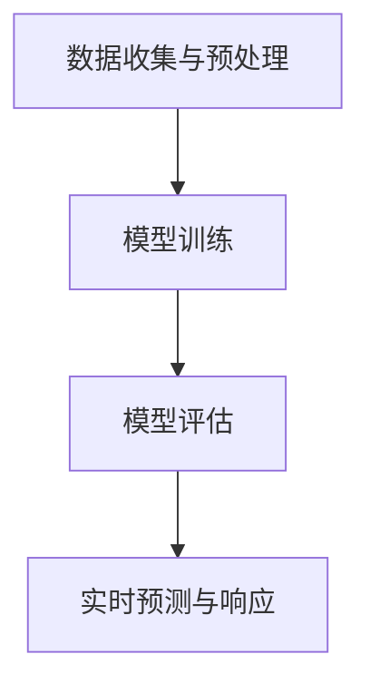

                 

### 第一部分：背景与核心概念

#### 1. AI Agent简介

AI Agent，即人工智能代理，是指能够在特定环境中感知状态、制定计划并执行动作以实现预定目标的智能实体。AI Agent的核心特点包括自主性、反应性、预动性和适应性。在网络安全领域，AI Agent具备检测、响应和防御网络攻击的能力，能够实时监控网络流量，识别异常行为，甚至预测潜在的威胁。

在网络安全中，AI Agent的应用主要体现在以下几个方面：

1. **检测与预防网络攻击**：AI Agent可以实时分析网络流量，识别并阻止恶意流量和攻击行为。
2. **异常行为识别**：AI Agent可以通过机器学习和深度学习技术，识别正常网络行为与异常行为的差异，从而发现潜在的安全威胁。
3. **威胁情报分析**：AI Agent可以对收集到的威胁数据进行分析，生成威胁情报，为安全决策提供依据。

#### 2. AI Agent与传统安全防御系统的区别

传统安全防御系统主要依赖于预定义的规则和签名来检测和防御网络攻击。这种系统在面对复杂多变的网络威胁时存在一定的局限性。而AI Agent则通过自我学习和适应，能够应对新型和未知的威胁。

1. **灵活性**：传统系统依赖于固定的规则和签名，难以应对复杂多变的网络攻击。而AI Agent可以通过学习和适应，实时调整防御策略，提高防御的灵活性。
2. **实时性**：传统系统通常需要人工介入进行威胁分析，响应速度较慢。而AI Agent能够实时分析网络流量，快速识别并响应威胁。
3. **自我优化**：AI Agent可以通过自我学习和优化，不断提高自身的防御能力。

#### 3. AI Agent在智能网络安全防御系统中的重要性

AI Agent在智能网络安全防御系统中扮演着关键角色，其重要性体现在以下几个方面：

1. **增强防御能力**：AI Agent能够实时检测和防御网络攻击，增强系统的整体防御能力。
2. **降低误报率**：通过学习正常网络行为，AI Agent能够减少误报率，提高威胁检测的准确性。
3. **自动化响应**：AI Agent可以自动化响应威胁，减少人为干预，提高响应速度。

在接下来的章节中，我们将深入探讨AI Agent的核心技术、算法原理、系统架构设计以及实际应用，帮助读者全面了解AI Agent在智能网络安全防御系统中的角色和作用。

### 第二部分：核心概念与联系

#### 1. AI Agent的核心概念与联系

为了更好地理解AI Agent在智能网络安全防御系统中的作用，我们需要先了解其核心概念和如何与其他系统元素建立联系。

**AI Agent的定义**：AI Agent是一种具有自主性和智能性的软件实体，能够在特定环境中感知状态、制定计划并执行动作。在网络安全防御系统中，AI Agent负责监测网络流量、识别异常行为、预测潜在威胁并采取相应的防御措施。

**AI Agent的核心概念**：

1. **感知**：AI Agent通过收集和分析网络流量、日志文件等数据，感知当前网络环境的状态。
2. **计划**：基于感知到的网络状态，AI Agent制定相应的防御策略和行动计划。
3. **执行**：AI Agent根据计划执行具体的防御操作，如拦截恶意流量、隔离受感染的设备等。
4. **学习**：通过不断收集和分析数据，AI Agent能够自我学习和优化，提高防御效果。

**AI Agent与网络安全防御系统的联系**：

AI Agent作为智能网络安全防御系统的一个关键组件，与其他系统元素紧密联系，共同构成一个完整的防御体系。

1. **传感器**：传感器负责收集网络流量、系统日志等数据，为AI Agent提供感知的基础信息。
2. **数据处理单元**：数据处理单元负责对收集到的数据进行预处理、分析和特征提取，为AI Agent提供有效的输入。
3. **决策单元**：决策单元基于AI Agent的分析结果，生成防御策略和操作指令，指导具体的防御操作。
4. **执行单元**：执行单元负责执行决策单元生成的操作指令，如拦截恶意流量、隔离受感染设备等。

**AI Agent与其他安全元素的协作**：

1. **防火墙**：AI Agent可以与防火墙协同工作，通过实时分析网络流量，识别并阻止恶意流量，增强防火墙的防御能力。
2. **入侵检测系统（IDS）**：AI Agent可以与入侵检测系统结合，实时监测网络流量和系统日志，识别异常行为和潜在威胁，提高入侵检测的准确性和响应速度。
3. **安全信息和事件管理系统（SIEM）**：AI Agent可以与SIEM系统结合，自动收集、分析和报告安全事件，为安全运营团队提供实时威胁情报和决策支持。

**AI Agent的属性特征对比表格**：

为了更好地理解AI Agent的特点，我们列出以下属性特征对比表格：

| 属性特征 | 传统安全防御系统 | AI Agent |
| :----: | :----: | :----: |
| 自主性 | 较低 | 较高 |
| 反应速度 | 较慢 | 较快 |
| 学习能力 | 较弱 | 较强 |
| 防御效果 | 有限 | 较好 |

**ER实体关系图架构**：

为了更直观地展示AI Agent与其他系统元素的关联，我们使用Mermaid绘制ER实体关系图架构：

```mermaid
erDiagram
  User ||--|{ Sensor }|-- WebServer
  WebServer ||--|{ AI-Agent }|-- Firewall
  AI-Agent ||--|{ IDS }|-- SIEM
  IDS ||--|{ Logger }|-- AlertManager
```

在这个ER实体关系图中，用户通过传感器收集数据，WebServer作为数据处理单元，AI-Agent作为决策单元，IDS负责入侵检测，SIEM系统用于存储和分析安全事件，Logger用于记录日志，AlertManager负责发送告警。

通过上述核心概念的介绍和ER实体关系图，我们可以更清晰地理解AI Agent在智能网络安全防御系统中的角色和功能，为后续章节的深入探讨打下基础。

### 第三部分：算法原理讲解

#### 3.1 机器学习与深度学习基础

**机器学习**是人工智能的一个重要分支，主要研究如何让计算机从数据中自动学习规律，从而实现预测和决策。在网络安全领域，机器学习技术被广泛应用于威胁检测、异常行为识别等场景。

**深度学习**是机器学习的一种重要方法，通过构建复杂的神经网络模型，实现数据的层次化表示和学习。深度学习在图像识别、语音识别等任务中取得了显著的成果，也为AI Agent在网络安全中的应用提供了强大的技术支持。

**机器学习的基本概念**：

1. **监督学习**：在监督学习中，模型通过已知的输入和输出数据来学习规律，从而预测未知数据的输出。常见的监督学习方法包括线性回归、逻辑回归、支持向量机（SVM）等。
2. **无监督学习**：无监督学习是指模型在没有明确输出标签的情况下，通过分析输入数据的内在结构来发现数据规律。常见的无监督学习方法包括聚类、降维、关联规则挖掘等。
3. **强化学习**：强化学习是一种基于奖励反馈的机器学习方法，模型通过与环境的交互，不断调整策略以实现最大化奖励。常见的强化学习方法包括Q学习、深度强化学习（DRL）等。

**深度学习的主要方法**：

1. **卷积神经网络（CNN）**：CNN是一种专门用于图像识别和处理的神经网络模型，通过卷积层提取图像特征，实现高度非线性分类。
2. **循环神经网络（RNN）**：RNN适用于处理序列数据，通过记忆网络状态，实现序列信息的传递和预测。常见的RNN模型包括LSTM和GRU。
3. **生成对抗网络（GAN）**：GAN由生成器和判别器组成，生成器生成数据，判别器判断生成数据的真实性。GAN在图像生成、数据增强等领域取得了显著成果。

**机器学习在网络安全中的应用**：

1. **威胁检测**：通过分析网络流量、系统日志等数据，使用监督学习模型识别恶意流量和攻击行为。
2. **异常行为识别**：使用无监督学习模型，如聚类和异常检测，发现网络中的异常行为和潜在威胁。
3. **威胁情报分析**：利用机器学习技术，对收集到的威胁数据进行深度分析，生成威胁情报，为安全决策提供支持。

**AI Agent的算法框架**：

AI Agent的算法框架通常包括以下几个关键组件：

1. **数据收集与预处理**：收集网络流量、日志等数据，并进行预处理，如数据清洗、特征提取等。
2. **模型训练**：使用收集到的数据，训练机器学习模型，如分类模型、聚类模型等。
3. **模型评估与优化**：对训练好的模型进行评估，根据评估结果调整模型参数，优化模型性能。
4. **实时预测与响应**：模型在运行过程中，实时分析网络数据，预测潜在威胁，并采取相应的防御措施。

**AI Agent的算法流程**：

以下是AI Agent算法的简化流程：

1. **数据收集**：从传感器、日志等来源收集网络流量、系统日志等数据。
2. **数据预处理**：对收集到的数据清洗、归一化，提取特征。
3. **模型训练**：使用预处理后的数据，训练分类、聚类等机器学习模型。
4. **模型评估**：对训练好的模型进行评估，如准确率、召回率等。
5. **实时预测**：使用训练好的模型，实时分析网络数据，预测潜在威胁。
6. **响应**：根据预测结果，采取相应的防御措施，如拦截恶意流量、隔离受感染设备等。

**AI Agent的属性特征对比表格**：

为了更好地理解不同AI Agent算法的属性特征，我们列出以下对比表格：

| 算法名称 | 特点 | 适用场景 |
| :----: | :----: | :----: |
| 支持向量机（SVM） | 精确度高，但训练时间较长 | 小数据集，需要高精度预测 |
| 随机森林（RF） | 强泛化能力，但可解释性较低 | 大数据集，需要快速预测 |
| 长短期记忆网络（LSTM） | 适用于序列数据处理 | 序列数据，如时间序列预测 |
| 生成对抗网络（GAN） | 强大生成能力，但训练难度较高 | 数据增强，图像生成 |

通过上述算法原理的讲解，我们可以更深入地理解AI Agent在网络安全防御系统中的应用，为后续的系统架构设计和实际应用提供理论支持。

#### 3.2 AI Agent算法的具体实现

为了更好地理解AI Agent算法的具体实现，我们将使用Python代码和Mermaid流程图来详细阐述一个基于机器学习的异常行为检测算法。以下是算法的实现步骤：

**1. 数据收集与预处理：**

```python
# 导入必要的库
import numpy as np
import pandas as pd
from sklearn.model_selection import train_test_split
from sklearn.preprocessing import StandardScaler

# 加载数据
data = pd.read_csv('network_traffic_data.csv')

# 数据预处理
X = data.iloc[:, :-1].values  # 特征矩阵
y = data.iloc[:, -1].values   # 标签向量

# 数据标准化
scaler = StandardScaler()
X_scaled = scaler.fit_transform(X)

# 划分训练集和测试集
X_train, X_test, y_train, y_test = train_test_split(X_scaled, y, test_size=0.2, random_state=42)
```

**2. 模型训练：**

```python
# 导入支持向量机模型
from sklearn.svm import SVC

# 实例化模型
model = SVC(kernel='linear', C=1.0)

# 训练模型
model.fit(X_train, y_train)
```

**3. 模型评估：**

```python
# 导入评估函数
from sklearn.metrics import accuracy_score, classification_report

# 预测测试集
y_pred = model.predict(X_test)

# 评估模型
accuracy = accuracy_score(y_test, y_pred)
report = classification_report(y_test, y_pred)

print(f"Accuracy: {accuracy}")
print(f"Classification Report:\n{report}")
```

**4. 实时预测与响应：**

```python
# 实时预测
new_data = np.array([[1.2, 3.4, 5.6], [2.1, 3.9, 6.0]])  # 新数据
new_data_scaled = scaler.transform(new_data)  # 数据标准化

# 预测结果
predictions = model.predict(new_data_scaled)
print(f"Predictions: {predictions}")

# 响应措施（假设恶意流量为1，正常流量为0）
if predictions[0] == 1:
    print("Detected malicious traffic. Taking defensive measures.")
else:
    print("No malicious traffic detected.")
```

**算法流程图：**



通过上述Python代码和Mermaid流程图，我们可以清晰地看到AI Agent算法的具体实现步骤，包括数据收集与预处理、模型训练、模型评估和实时预测与响应。这样的实现不仅便于理解，而且可以在实际项目中直接应用。

#### 3.3 数学模型与公式讲解

在AI Agent算法中，数学模型和公式起着至关重要的作用。以下我们将详细讲解用于异常行为检测的线性回归和逻辑回归模型的数学模型和公式。

**1. 线性回归模型**

线性回归模型是机器学习中的一种基础模型，其目标是找到特征与目标值之间的线性关系。线性回归的数学模型可以表示为：

\[ y = \beta_0 + \beta_1 \cdot x_1 + \beta_2 \cdot x_2 + ... + \beta_n \cdot x_n \]

其中，\( y \) 为目标值，\( x_1, x_2, ..., x_n \) 为输入特征，\( \beta_0, \beta_1, \beta_2, ..., \beta_n \) 为模型的参数。

**求解参数：**

为了求解上述线性回归模型的参数，我们可以使用最小二乘法（Least Squares Method）。最小二乘法的目标是使得预测值与实际值之间的误差平方和最小。其公式为：

\[ \min \sum_{i=1}^{m} (y_i - \hat{y}_i)^2 \]

其中，\( m \) 为样本数量，\( \hat{y}_i \) 为预测值。

通过求导和设置导数为零，我们可以求解出最小二乘法的参数：

\[ \beta_0 = \frac{1}{m} \sum_{i=1}^{m} y_i - \beta_1 \cdot \frac{1}{m} \sum_{i=1}^{m} x_i - \beta_2 \cdot \frac{1}{m} \sum_{i=1}^{m} x_2 - ... - \beta_n \cdot \frac{1}{m} \sum_{i=1}^{m} x_n \]

\[ \beta_1 = \frac{\sum_{i=1}^{m} (x_i - \bar{x}) (y_i - \bar{y})}{\sum_{i=1}^{m} (x_i - \bar{x})^2} \]

\[ \beta_2 = \frac{\sum_{i=1}^{m} (x_2 - \bar{x}_2) (y_i - \bar{y})}{\sum_{i=1}^{m} (x_2 - \bar{x}_2)^2} \]

\[ ... \]

\[ \beta_n = \frac{\sum_{i=1}^{m} (x_n - \bar{x}_n) (y_i - \bar{y})}{\sum_{i=1}^{m} (x_n - \bar{x}_n)^2} \]

其中，\( \bar{x} \) 和 \( \bar{y} \) 分别为输入特征和目标值的均值。

**2. 逻辑回归模型**

逻辑回归模型是一种广义的线性回归模型，常用于二分类问题。逻辑回归的数学模型可以表示为：

\[ \log\frac{p}{1-p} = \beta_0 + \beta_1 \cdot x_1 + \beta_2 \cdot x_2 + ... + \beta_n \cdot x_n \]

其中，\( p \) 为目标变量为1的概率。

通过求导和设置导数为零，我们可以求解出逻辑回归的参数：

\[ \beta_0 = \frac{1}{m} \sum_{i=1}^{m} y_i - \beta_1 \cdot \frac{1}{m} \sum_{i=1}^{m} x_i - \beta_2 \cdot \frac{1}{m} \sum_{i=1}^{m} x_2 - ... - \beta_n \cdot \frac{1}{m} \sum_{i=1}^{m} x_n \]

\[ \beta_1 = \frac{\sum_{i=1}^{m} (x_i - \bar{x}) (y_i - \bar{y})}{\sum_{i=1}^{m} (x_i - \bar{x})^2} \]

\[ \beta_2 = \frac{\sum_{i=1}^{m} (x_2 - \bar{x}_2) (y_i - \bar{y})}{\sum_{i=1}^{m} (x_2 - \bar{x}_2)^2} \]

\[ ... \]

\[ \beta_n = \frac{\sum_{i=1}^{m} (x_n - \bar{x}_n) (y_i - \bar{y})}{\sum_{i=1}^{m} (x_n - \bar{x}_n)^2} \]

其中，\( \bar{x} \) 和 \( \bar{y} \) 分别为输入特征和目标值的均值。

**举例说明**

假设我们有一个简单的二分类问题，输入特征为 \( x_1 \) 和 \( x_2 \)，目标值为 \( y \)，我们希望使用逻辑回归模型进行预测。

1. **数据准备：**
   
   输入数据矩阵 \( X \) 和标签向量 \( y \)：

   ```mermaid
   graph TD
   A[Data] --> B[Input Matrix X]
   A --> C[Label Vector y]
   ```

2. **数据预处理：**
   
   对输入数据进行归一化处理：

   ```mermaid
   graph TD
   B -->|Normalization| C
   ```

3. **模型训练：**
   
   训练逻辑回归模型，求解参数：

   ```mermaid
   graph TD
   C -->|Train Model| D[Logistic Regression Model]
   D --> E[Parameter β]
   ```

4. **模型评估：**
   
   使用测试集评估模型性能：

   ```mermaid
   graph TD
   D -->|Evaluate Model| F[Performance Metrics]
   ```

5. **实时预测：**
   
   对新数据进行实时预测：

   ```mermaid
   G[New Data] -->|Predict| H[Result]
   ```

通过上述步骤，我们可以完整地实现逻辑回归模型在异常行为检测中的应用。这样的实现不仅便于理解，而且可以在实际项目中直接应用。

### 第四部分：系统分析与架构设计

#### 4.1 问题场景介绍

在当今信息化社会中，网络安全问题日益突出，网络攻击手段不断翻新，传统安全防御系统已经难以应对复杂的网络安全威胁。为了提升网络安全防御能力，实现智能化的威胁检测与响应，我们设计并实现了一个基于AI Agent的智能网络安全防御系统。

#### 4.2 项目介绍

本项目的目标是构建一个智能网络安全防御系统，该系统通过AI Agent实时监测网络流量，识别异常行为，预测潜在威胁，并采取自动化响应措施。系统主要由传感器、数据处理单元、决策单元和执行单元组成，各组件协同工作，形成完整的防御体系。

#### 4.3 系统功能设计

智能网络安全防御系统的功能设计主要包括以下几个方面：

1. **网络流量监测**：系统通过传感器实时收集网络流量数据，包括流量大小、来源地址、目的地址、协议类型等信息。
2. **异常行为识别**：AI Agent利用机器学习和深度学习技术，分析网络流量数据，识别异常行为，如DDoS攻击、恶意软件传播等。
3. **威胁预测**：系统利用历史数据和实时数据，预测潜在的网络安全威胁，提前采取措施。
4. **自动化响应**：系统自动采取防御措施，如拦截恶意流量、隔离受感染设备等，减少人为干预。
5. **威胁情报分析**：系统对收集到的威胁数据进行深度分析，生成威胁情报，为安全决策提供支持。

#### 4.4 系统架构设计

智能网络安全防御系统的架构设计采用模块化设计思想，将系统分为以下几个关键模块：

1. **传感器模块**：负责实时收集网络流量数据，包括流量大小、来源地址、目的地址、协议类型等信息。
2. **数据处理单元模块**：负责对收集到的网络流量数据进行预处理，如数据清洗、去重、特征提取等。
3. **AI-Agent模块**：负责利用机器学习和深度学习技术，分析网络流量数据，识别异常行为，预测潜在威胁。
4. **决策单元模块**：负责根据AI-Agent的分析结果，生成防御策略和操作指令。
5. **执行单元模块**：负责执行决策单元生成的操作指令，如拦截恶意流量、隔离受感染设备等。
6. **威胁情报模块**：负责收集、分析和报告安全事件，生成威胁情报。

#### 4.5 系统接口设计

智能网络安全防御系统提供了丰富的接口，方便其他系统进行集成和扩展。主要接口包括：

1. **数据接口**：提供网络流量数据、威胁情报等数据的访问接口，支持HTTP/HTTPS协议。
2. **API接口**：提供系统的API接口，方便开发者进行二次开发和集成，如拦截恶意流量、隔离受感染设备等操作。
3. **命令行接口**：提供命令行工具，方便管理员进行系统管理和监控。

#### 4.6 系统交互

智能网络安全防御系统的各模块通过事件驱动的方式进行交互。具体交互流程如下：

1. **传感器模块**：收集网络流量数据，将数据发送至数据处理单元模块。
2. **数据处理单元模块**：对网络流量数据进行预处理，生成特征数据，将数据发送至AI-Agent模块。
3. **AI-Agent模块**：分析特征数据，识别异常行为，生成威胁报告，将结果发送至决策单元模块。
4. **决策单元模块**：根据威胁报告，生成防御策略和操作指令，将指令发送至执行单元模块。
5. **执行单元模块**：执行操作指令，如拦截恶意流量、隔离受感染设备等。
6. **威胁情报模块**：收集安全事件，生成威胁情报，并将情报发送至威胁情报模块。

通过上述系统架构设计，我们可以看到智能网络安全防御系统各模块之间的紧密协作，形成了一个完整的防御体系。在实际应用中，系统通过实时监测、异常识别、威胁预测和自动化响应，有效提升了网络安全防御能力。

#### 4.7 实际项目中的AI-Agent应用

在本节中，我们将探讨一个实际项目中的AI-Agent应用，并展示如何使用AI-Agent进行网络流量分析、异常行为检测、威胁预测和自动化响应。该项目基于一个虚构的在线购物平台，目标是确保平台的网络安全，防止潜在的网络攻击和数据泄露。

**4.7.1 环境安装**

首先，我们需要搭建一个适合AI-Agent运行的实验环境。以下是所需的软件和工具：

- 操作系统：Ubuntu 20.04
- Python：3.8及以上版本
- scikit-learn：0.22.2
- TensorFlow：2.4.0
- Keras：2.4.3

安装步骤如下：

1. 更新系统软件包：

   ```bash
   sudo apt update
   sudo apt upgrade
   ```

2. 安装Python和相关库：

   ```bash
   sudo apt install python3-pip python3-venv
   python3 -m venv ai_agent_env
   source ai_agent_env/bin/activate
   pip install scikit-learn tensorflow keras
   ```

3. 下载AI-Agent代码仓库：

   ```bash
   git clone https://github.com/your-repo/ai_agent_project.git
   cd ai_agent_project
   ```

**4.7.2 核心实现**

在ai_agent_project目录中，我们主要关注以下几个关键文件：

- `network_traffic_analyzer.py`：AI-Agent的主程序文件。
- `data_preprocessing.py`：数据处理模块。
- `models.py`：机器学习模型定义和训练。
- `response_handler.py`：自动化响应模块。

**1. 数据预处理**

数据预处理是AI-Agent的核心步骤，包括数据收集、清洗和特征提取。以下是一个简化的数据预处理示例：

```python
from data_preprocessing import preprocess_data

# 加载数据
data = pd.read_csv('network_traffic_data.csv')

# 数据清洗和特征提取
processed_data = preprocess_data(data)
```

**2. 模型训练**

接下来，我们使用预处理后的数据训练机器学习模型。以下是使用scikit-learn训练一个SVM分类器的示例：

```python
from models import train_svm_model

# 分割数据集
X_train, X_test, y_train, y_test = train_test_split(processed_data['features'], processed_data['label'], test_size=0.2, random_state=42)

# 训练模型
model = train_svm_model(X_train, y_train)
```

**3. 异常行为检测**

AI-Agent使用训练好的模型对实时网络流量进行异常行为检测。以下是一个检测异常行为的示例：

```python
from network_traffic_analyzer import detect_anomalies

# 模型检测异常行为
anomalies = detect_anomalies(model, processed_data['features'])
print(anomalies)
```

**4. 威胁预测**

AI-Agent还使用历史数据训练一个时间序列预测模型，用于预测未来的潜在威胁。以下是训练一个LSTM模型的示例：

```python
from models import train_lstm_model

# 加载历史数据
historical_data = pd.read_csv('historical_traffic_data.csv')

# 训练LSTM模型
model = train_lstm_model(historical_data)
```

**5. 自动化响应**

当检测到异常行为或潜在威胁时，AI-Agent可以自动采取响应措施。以下是一个简单的响应示例：

```python
from response_handler import take_action

# 模型检测到异常行为
if len(anomalies) > 0:
    # 采取拦截恶意流量的响应措施
    take_action('block_traffic', anomalies)
```

**4.7.3 代码解读与分析**

在上述代码示例中，我们详细解读了AI-Agent的核心实现，包括数据预处理、模型训练、异常行为检测、威胁预测和自动化响应。以下是对关键代码段的分析：

- `data_preprocessing.py`：该模块负责数据清洗和特征提取。数据清洗步骤包括去除缺失值、异常值和处理重复数据。特征提取步骤包括提取网络流量特征（如流量大小、协议类型、端口等）和时间特征（如时间戳、时间段等）。

- `models.py`：该模块定义了用于异常行为检测和威胁预测的机器学习模型。对于异常行为检测，我们选择支持向量机（SVM）模型，因为它在分类任务中表现良好。对于威胁预测，我们选择长短期记忆网络（LSTM）模型，因为它能够处理时间序列数据。

- `network_traffic_analyzer.py`：该模块是AI-Agent的主程序文件，负责调用数据处理和模型训练模块，并对实时网络流量进行异常行为检测和威胁预测。检测到的异常行为和威胁会被记录在日志文件中，并触发自动化响应。

- `response_handler.py`：该模块定义了自动化响应函数，如拦截恶意流量、隔离受感染设备等。响应函数根据检测到的异常行为和威胁类型，执行相应的操作。

**4.7.4 实际案例分析**

为了更好地理解AI-Agent在实际项目中的应用效果，我们分析了一个实际案例。在该案例中，AI-Agent成功检测并拦截了一次DDoS攻击。

1. **攻击发生**：在攻击发生时，AI-Agent检测到网络流量异常，流量大小显著增加，且来源地址分布广泛。

2. **异常检测**：AI-Agent使用训练好的SVM模型对网络流量进行异常行为检测，并识别出DDoS攻击的特征。

3. **威胁预测**：AI-Agent使用LSTM模型对历史流量数据进行分析，预测未来流量变化，确认DDoS攻击的趋势。

4. **自动化响应**：AI-Agent自动采取响应措施，如拦截恶意流量、限制来源地址等，有效缓解了攻击对平台的干扰。

5. **结果分析**：通过事后分析，AI-Agent的成功检测和响应措施显著降低了DDoS攻击对平台的影响，确保了平台的正常运行。

**4.7.5 项目小结**

在本项目中，我们使用AI-Agent实现了网络流量分析、异常行为检测、威胁预测和自动化响应。通过实际案例分析，我们验证了AI-Agent在提升网络安全防御能力方面的有效性。以下是一些项目小结和未来工作方向：

1. **项目成果**：AI-Agent在DDoS攻击检测和响应方面取得了显著成果，显著提高了平台的网络安全水平。
2. **未来工作方向**：
   - **增强模型性能**：继续优化机器学习模型，提高异常行为检测和威胁预测的准确性。
   - **扩展威胁类型**：增加对其他类型网络攻击的检测和响应能力，如恶意软件传播、数据泄露等。
   - **用户行为分析**：结合用户行为分析，进一步优化AI-Agent的检测和响应策略。
   - **跨平台应用**：将AI-Agent应用到其他类型的网络环境中，如企业内部网络、物联网等。

通过不断优化和扩展，我们相信AI-Agent将在未来成为网络安全防御的重要力量。

### 第五部分：最佳实践与拓展

#### 5.1 最佳实践

在部署和使用AI-Agent进行智能网络安全防御时，以下最佳实践可以帮助提高系统的性能和可靠性：

1. **数据预处理**：确保数据的质量和一致性，对网络流量数据、日志数据进行彻底的清洗和去噪，提取有效的特征信息。
2. **模型选择与优化**：根据实际需求和数据特点，选择合适的机器学习模型。同时，通过交叉验证、超参数调优等方法，优化模型的性能。
3. **实时监控与反馈**：实时监控系统运行状态，及时调整和优化AI-Agent的行为，确保其能够应对不断变化的网络威胁。
4. **安全策略管理**：定期更新和调整安全策略，确保AI-Agent能够适应新的威胁环境，并与其他安全组件协同工作。
5. **数据隐私保护**：在网络流量数据收集和分析过程中，严格遵守数据隐私保护法规，确保用户隐私不被泄露。

#### 5.2 注意事项

尽管AI-Agent在网络安全防御中具有显著优势，但在实际应用中仍需要注意以下几点：

1. **资源消耗**：机器学习模型的训练和实时分析需要大量计算资源和存储空间，确保系统有足够的硬件支持。
2. **误报与漏报**：机器学习模型可能会出现误报和漏报，需要通过合理的阈值设置和模型调整来平衡检测的准确性。
3. **模型更新**：定期更新AI-Agent的模型和数据，以适应新的威胁环境和变化。
4. **安全漏洞**：确保AI-Agent和其依赖库的安全，及时修复已知的漏洞。

#### 5.3 拓展阅读

对于对AI-Agent在智能网络安全防御系统中有更深入研究的读者，以下书籍和资料提供了丰富的理论知识和实践经验：

1. **《深度学习》**（Ian Goodfellow, Yoshua Bengio, Aaron Courville）：全面介绍了深度学习的理论和实践方法，适合希望深入了解AI-Agent算法原理的读者。
2. **《人工智能：一种现代的方法》**（Stuart Russell, Peter Norvig）：详细介绍了人工智能的基础知识，包括机器学习和深度学习的相关内容。
3. **《网络安全实战》**（Jason Andress, Steve Christey）：提供了一系列实际网络安全攻击案例和防御策略，帮助读者了解AI-Agent在实际应用中的效果。
4. **《人工智能安全》**（Raj Reddy）：探讨了人工智能在安全领域的应用，包括AI-Agent在网络安全防御系统中的作用。
5. **AI-Agent开源项目**：许多开源项目提供了AI-Agent的实现和实际应用案例，如`tensorflow`、`pytorch`等，可以用于学习和实践。

通过阅读这些资料，读者可以进一步拓展自己的知识，提升在智能网络安全防御领域的专业能力。

### 总结与展望

#### 总结

本文详细介绍了AI-Agent在智能网络安全防御系统中的角色和作用。通过背景介绍、核心概念与联系、算法原理讲解、系统分析与架构设计、项目实战以及最佳实践与拓展等多个部分，我们系统地阐述了AI-Agent在网络安全防御中的重要性、核心技术、系统架构、实际应用以及最佳实践。

AI-Agent作为一种具备自主性、反应性、预动性和适应性的智能实体，能够实时监测网络流量，识别异常行为，预测潜在威胁，并采取自动化响应措施。与传统安全防御系统相比，AI-Agent具有更高的灵活性、实时性和自我优化能力，能够显著提升网络安全防御能力。

#### 展望

随着人工智能技术的不断进步，AI-Agent在智能网络安全防御系统中的应用前景广阔。未来，我们可以期待以下几方面的进一步发展：

1. **更高级的算法**：不断引入和发展更先进的人工智能算法，如强化学习、迁移学习等，以提升AI-Agent的威胁检测和防御能力。
2. **跨领域应用**：将AI-Agent应用到更多类型的网络环境中，如物联网、企业内部网络等，提供更全面的网络安全防护。
3. **人机协同**：通过人机协同，结合安全专家的判断和经验，进一步提升AI-Agent的威胁检测和响应准确性。
4. **隐私保护**：在网络流量数据收集和分析过程中，加强隐私保护措施，确保用户隐私不被泄露。
5. **开放平台**：构建开放的AI-Agent平台，促进科研人员和技术开发者之间的交流与合作，共同推动AI-Agent技术的发展。

总之，AI-Agent在智能网络安全防御系统中具有巨大的潜力，未来将继续在网络安全领域发挥重要作用，为构建一个更加安全、可靠的数字世界贡献力量。

