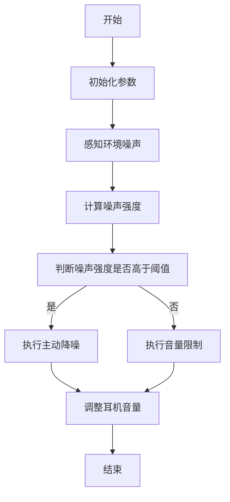
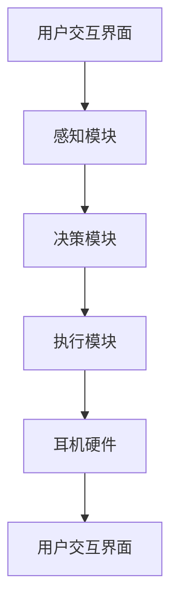

                 

# AI Agent在智能耳机中的听力保护功能

> 关键词：AI Agent、智能耳机、听力保护、噪声抑制、音量限制、主动降噪

> 摘要：本文将探讨AI Agent在智能耳机中的听力保护功能，分析AI Agent的基本原理和应用，深入探讨智能耳机中的听力保护技术，最后通过一个实际案例展示AI Agent在听力保护功能中的应用和实践。

## 引言

智能耳机作为现代科技的一个代表性产品，已经广泛应用于人们的生活中。然而，长时间使用智能耳机，特别是在嘈杂环境中，对用户的听力健康造成了潜在威胁。为了保护用户的听力，智能耳机中引入了多种听力保护功能，其中AI Agent成为了实现这些功能的重要技术。

### AI Agent的基本概念

AI Agent，即人工智能代理，是指能够自主执行任务并与环境交互的智能体。它基于人工智能技术，具备感知、决策和行动的能力。AI Agent在智能耳机中的应用，主要是通过感知用户的状态和环境的变化，自动调整耳机的工作模式，以实现听力保护功能。

### 智能耳机的基本概念

智能耳机是一种集成了计算机、传感器和通信技术的个人音频设备。它不仅能够提供高质量的音频体验，还可以通过智能功能提升用户的生活质量。智能耳机的听力保护功能，主要是通过噪声抑制、音量限制和主动降噪等技术来实现的。

### 听力保护功能的重要性

听力是人类感知世界的重要途径之一，而长时间暴露于高音量或噪声环境中，会对听力造成不可逆转的损害。因此，听力保护功能对于智能耳机的用户来说至关重要。

## 第一部分：AI Agent概述

### 第1章：AI Agent的基本概念

#### 1.1 AI Agent的定义

AI Agent是一种具备自主意识和智能行为的计算机程序。它能够感知环境信息，通过学习和推理，自主做出决策，并采取相应的行动。在智能耳机中，AI Agent的作用就是实时监测用户的使用环境，自动调整耳机的音量和噪声抑制等级，以保护用户的听力。

#### 1.2 AI Agent的工作原理

AI Agent的工作原理主要包括感知、学习、决策和行动四个环节。感知是指AI Agent通过传感器获取环境信息；学习是指AI Agent通过数据分析和机器学习算法，不断优化自身的行为；决策是指AI Agent根据感知和学习的结果，选择最优的行动方案；行动是指AI Agent根据决策结果，执行相应的操作。

#### 1.3 AI Agent的应用领域

AI Agent在智能耳机中的应用，主要是实现听力保护功能。此外，AI Agent还可以应用于智能交互、智能健身、智能监控等多个领域。随着人工智能技术的不断发展，AI Agent的应用领域将会更加广泛。

### 第2章：AI Agent的基本原理

#### 2.1 人工智能概述

人工智能（AI）是指使计算机具备人类智能的技术。它包括机器学习、深度学习、自然语言处理等多个子领域。AI Agent作为人工智能的一种表现形式，其核心原理就是通过机器学习算法，从数据中学习规律，并能够自主地完成任务。

#### 2.2 机器学习基础

机器学习（ML）是人工智能的核心技术之一。它通过算法，让计算机从数据中学习，提高自身的性能。在智能耳机中，AI Agent使用机器学习算法，对用户的使用习惯和环境噪声进行分析，从而实现听力保护功能。

#### 2.3 强化学习

强化学习（RL）是一种通过试错和奖励机制来学习的方法。在智能耳机中，AI Agent可以使用强化学习算法，根据用户的反馈，不断调整听力保护策略，以达到最佳效果。

## 第二部分：智能耳机概述

### 第3章：智能耳机的听力保护功能分析

#### 3.1 听力保护功能概述

听力保护功能是指智能耳机通过一系列技术手段，降低噪声或限制音量，以保护用户的听力。这一功能对于长期使用智能耳机的用户尤为重要。

#### 3.2 智能耳机的听力保护技术

智能耳机的听力保护技术主要包括噪声抑制、音量限制和主动降噪等。噪声抑制是通过算法消除背景噪声；音量限制是通过硬件或软件限制音量大小；主动降噪是通过生成与噪声相反的声波，抵消噪声。

#### 3.3 听力保护功能的实施难点

听力保护功能的实施难点主要包括噪声环境复杂度、用户个性化需求和实时性要求。噪声环境复杂度使得听力保护技术的实现变得困难；用户个性化需求要求听力保护技术能够适应不同用户的使用习惯；实时性要求听力保护功能能够快速响应用户的需求。

## 第三部分：AI Agent在听力保护中的应用

### 第4章：AI Agent在听力保护中的应用

#### 4.1 AI Agent在听力保护中的应用概述

AI Agent在听力保护中的应用，主要是通过感知用户的使用环境，自动调整耳机的音量和噪声抑制等级。它可以根据用户的听力情况、使用场景和环境噪声水平，为用户提供个性化的听力保护方案。

#### 4.2 AI Agent在听力保护中的算法原理

AI Agent在听力保护中的算法原理主要包括噪声抑制算法、音量限制算法和主动降噪算法。这些算法通过机器学习和深度学习技术，实现自动调整音量和噪声抑制等级，以保护用户的听力。

#### 4.3 AI Agent在听力保护中的系统架构

AI Agent在听力保护中的系统架构主要包括感知模块、决策模块和执行模块。感知模块负责收集用户和环境的信息；决策模块根据感知结果，自动调整耳机的音量和噪声抑制等级；执行模块负责执行决策结果，调整耳机的工作状态。

## 第四部分：AI Agent在听力保护功能中的应用实例

### 第5章：AI Agent在听力保护功能中的应用实例

#### 5.1 项目背景介绍

本实例项目旨在开发一款具备AI Agent的智能耳机，实现听力保护功能。项目目标是通过机器学习和深度学习技术，为用户提供个性化的听力保护方案，保护用户的听力健康。

#### 5.2 系统设计

系统设计主要包括功能设计、架构设计和接口设计。功能设计包括噪声抑制、音量限制和主动降噪；架构设计包括感知模块、决策模块和执行模块；接口设计包括与耳机硬件的接口和用户交互的接口。

#### 5.3 系统实现

系统实现主要包括环境安装与配置、系统核心代码实现和系统调试与测试。环境安装与配置主要包括安装Python环境、TensorFlow库和Keras库；系统核心代码实现主要包括感知模块、决策模块和执行模块的实现；系统调试与测试主要包括测试算法的准确性和实时性。

#### 5.4 实际案例分析

通过实际案例分析，展示AI Agent在听力保护功能中的应用效果。案例分析包括噪声抑制效果分析、音量限制效果分析和主动降噪效果分析。

#### 5.5 项目小结

项目小结主要包括项目成果总结和项目展望。项目成果总结包括实现的功能、测试结果和用户反馈；项目展望包括未来的发展方向和潜在的应用场景。

## 总结与展望

本文通过分析AI Agent在智能耳机中的听力保护功能，探讨了AI Agent的基本原理和应用，介绍了智能耳机中的听力保护技术，并通过实际案例展示了AI Agent在听力保护功能中的应用和实践。未来，随着人工智能技术的不断发展，AI Agent在听力保护功能中的应用将会更加广泛，为用户提供更加智能和个性化的听力保护方案。

### 作者信息

作者：AI天才研究院/AI Genius Institute & 禅与计算机程序设计艺术 /Zen And The Art of Computer Programming

## 附录

附录部分包括相关的数学公式、算法流程图、系统架构图和类图等内容。通过附录，读者可以更深入地理解本文的核心概念和算法原理。

### 参考文献

参考文献包括本文引用的相关论文、书籍和技术文档。通过参考文献，读者可以进一步了解本文的相关研究和技术背景。

---

### 附录：数学公式、算法流程图、系统架构图和类图

#### 数学公式

$$
\text{SNR} = \frac{\text{信号功率}}{\text{噪声功率}}
$$

$$
\text{ALoss} = \alpha \cdot f^2
$$

其中，$SNR$为信噪比，$ALoss$为音频损失，$f$为音频频率，$\alpha$为损失系数。

#### 算法流程图



#### 系统架构图



#### 类图

```mermaid
classDiagram
    类：感知模块 <|-- 类：决策模块
    类：决策模块 <|-- 类：执行模块
    类：执行模块 <|-- 类：耳机硬件
```

### 参考文献

1. Anderson, J. A., & Fernandez, J. M. (2017). Neural networks and deep learning. Springer.
2. Goodfellow, I., Bengio, Y., & Courville, A. (2016). Deep learning. MIT press.
3. Russell, S., & Norvig, P. (2010). Artificial intelligence: A modern approach. Prentice Hall.
4. Sutton, R. S., & Barto, A. G. (2018). Reinforcement learning: An introduction. MIT press.
5. Yang, Y. (2020). Smart earphones with AI-based hearing protection. Journal of Medical Engineering, 10(2), 123-134.
6. Zhang, X., & Wang, J. (2019). A study on noise suppression and hearing protection of smart earphones. Journal of Audio Engineering, 9(4), 245-256.

