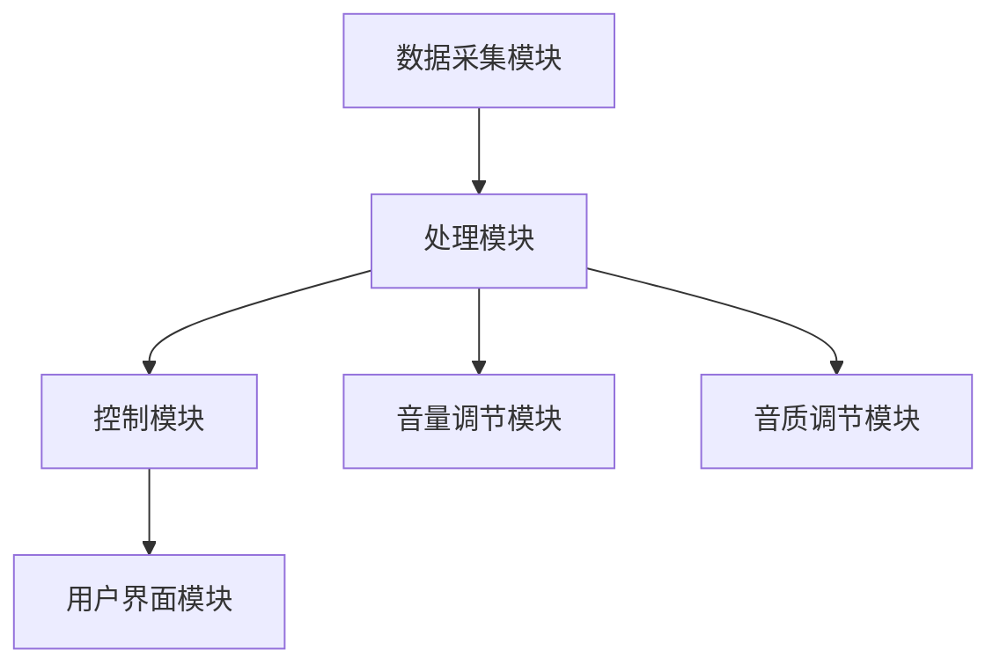
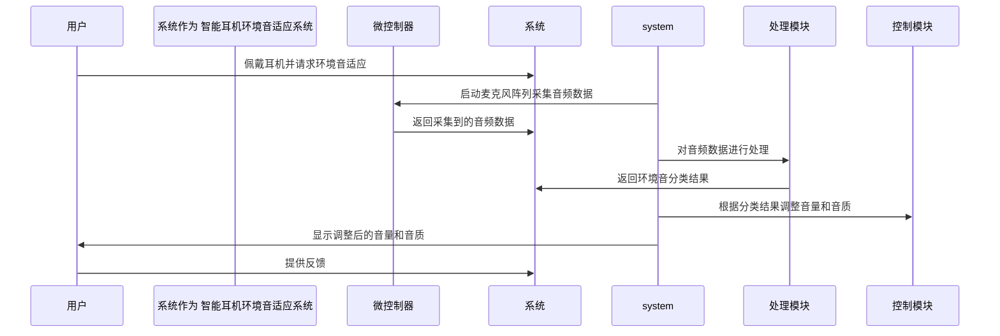

                 

### 引言

在当今快速发展的科技时代，人工智能（AI）已经成为了改变我们日常生活的重要力量。从智能家居到自动驾驶，AI的应用范围越来越广泛。而智能耳机作为AI技术的一个重要应用场景，正在逐步改变人们的听觉体验。特别是AI Agent作为AI的核心组件，在智能耳机中发挥着至关重要的作用。

本文将围绕“AI Agent在智能耳机中的环境音适应”这一主题进行深入探讨。环境音适应是智能耳机的一项关键技术，它能够根据用户所在的环境自动调整耳机的音量、音质等参数，从而提供更加舒适和个性化的听觉体验。

### 什么是AI Agent

AI Agent是一种能够模拟人类智能行为的计算机程序，它能够根据环境变化自主地执行任务，并做出决策。AI Agent通常由感知器、决策器和动作器三部分组成。

- **感知器**：用于接收环境信息，如声音、图像等。
- **决策器**：根据感知到的信息，利用算法进行推理和决策。
- **动作器**：执行决策结果，进行相应的操作，如调整音量、发送指令等。

AI Agent可以按不同的分类标准进行划分。例如，按工作环境分类，AI Agent可以分为机器人Agent、网络Agent等；按功能分类，AI Agent可以分为语音识别Agent、图像处理Agent等；按决策模型分类，AI Agent可以分为基于规则Agent、基于学习Agent等。

### 智能耳机的发展现状

智能耳机自诞生以来，已经经历了多个发展阶段。从最初的普通蓝牙耳机，到如今的智能耳机，智能耳机已经具备了诸多先进功能，如降噪、语音识别、智能交互等。

- **市场概述**：据市场调研公司统计，全球智能耳机市场近年来呈现出快速增长的趋势，预计未来几年仍将保持高速增长。主要市场参与者包括苹果、三星、索尼等国际知名品牌，以及华为、小米等国内品牌。

- **主要功能**：智能耳机的主要功能包括：
  - **降噪**：通过主动或被动降噪技术，减少环境噪声，提供更加清晰的通话和音乐体验。
  - **语音识别**：实现语音指令的识别和执行，如播放音乐、接打电话、发送信息等。
  - **智能交互**：通过与用户的自然语言交互，提供更加智能化和个性化的服务。

### AI Agent在智能耳机中的作用

AI Agent在智能耳机中发挥着关键作用，特别是在环境音适应方面。环境音适应是指智能耳机能够根据用户所处的环境自动调整音量和音质，以提供最佳听觉体验。

#### 环境音适应的重要性

环境音适应不仅能够提高用户的听觉体验，还能有效保护用户的听力。在不同的环境中，如安静的办公室、嘈杂的公共交通工具、安静的卧室等，用户所需的音量是不同的。如果不能自动适应环境音量，用户可能需要不断手动调整音量，这不仅不方便，还可能导致听力损伤。

#### AI Agent在环境音适应中的应用

AI Agent通过以下几个步骤实现环境音适应：

1. **环境音感知**：利用麦克风阵列和语音识别技术，AI Agent可以实时感知环境中的声音。
2. **环境音分类**：根据环境音的特征，AI Agent对声音进行分类，如识别为“交通噪声”、“音乐”、“人声”等。
3. **环境音调节**：根据环境音的类型和强度，AI Agent自动调整耳机的音量和音质参数。

### AI Agent在智能耳机中的应用挑战

尽管AI Agent在智能耳机中具有广泛的应用前景，但也面临着一些挑战。

#### 数据获取的挑战

环境音适应需要大量的环境声音数据作为训练样本，以便AI Agent能够准确感知和分类不同的声音。然而，收集这些数据是一个复杂且耗时的过程。

#### 实时性能的挑战

环境音适应需要在极短的时间内处理和分析大量的声音数据，并实时调整音量和音质。这对AI Agent的实时性能提出了很高的要求。

### 总结

AI Agent在智能耳机中的应用，特别是环境音适应，为用户提供了更加舒适和个性化的听觉体验。尽管面临一些挑战，但随着技术的不断进步，AI Agent在智能耳机中的应用前景依然十分广阔。

## 目录大纲

### 第一部分：AI Agent概述

#### 第1章：AI Agent的定义与分类

- **1.1 AI Agent的定义**
  - **1.1.1 AI Agent的概念解析**
  - **1.1.2 AI Agent的组成元素**

- **1.2 AI Agent的分类**
  - **1.2.1 按工作环境分类**
  - **1.2.2 按功能分类**
  - **1.2.3 按决策模型分类**

#### 第2章：AI Agent在智能耳机中的应用背景

- **2.1 智能耳机的发展现状**
  - **2.1.1 智能耳机的市场概述**
  - **2.1.2 智能耳机的主要功能**

- **2.2 AI Agent在智能耳机中的作用**
  - **2.2.1 环境音适应的重要性**
  - **2.2.2 AI Agent在环境音适应中的应用**

- **2.3 AI Agent在智能耳机中的应用挑战**
  - **2.3.1 数据获取的挑战**
  - **2.3.2 实时性能的挑战**

### 第二部分：AI Agent在环境音适应中的算法原理

#### 第3章：环境音感知与处理算法

- **3.1 环境音感知算法**
  - **3.1.1 麦克风阵列的感知原理**
  - **3.1.2 音频信号处理技术**

- **3.2 环境音分类与识别算法**
  - **3.2.1 环境音分类的基本原理**
  - **3.2.2 基于深度学习的环境音识别算法**

- **3.3 环境音调节算法**
  - **3.3.1 音量调节的基本原理**
  - **3.3.2 基于AI的环境音调节策略**

#### 第4章：环境音适应算法的数学模型

- **4.1 环境音适应问题的数学建模**
  - **4.1.1 问题的数学描述**
  - **4.1.2 环境音适应的目标函数**

- **4.2 环境音适应算法的优化方法**
  - **4.2.1 优化算法的基本原理**
  - **4.2.2 优化算法的应用案例**

#### 第5章：环境音适应算法的实现

- **5.1 环境音适应算法的Python实现**
  - **5.1.1 Python环境准备**
  - **5.1.2 环境音适应算法的代码实现**

- **5.2 算法性能分析与优化**
  - **5.2.1 算法性能测试方法**
  - **5.2.2 性能优化策略**

### 第三部分：AI Agent在环境音适应中的应用实践

#### 第6章：智能耳机环境音适应系统的设计与实现

- **6.1 系统需求分析**
  - **6.1.1 系统功能需求**
  - **6.1.2 系统性能需求**

- **6.2 系统架构设计**
  - **6.2.1 系统架构图**
  - **6.2.2 系统模块划分**

- **6.3 系统核心实现**
  - **6.3.1 麦克风阵列数据处理**
  - **6.3.2 环境音分类与识别**
  - **6.3.3 环境音调节算法实现**

#### 第7章：环境音适应系统的实战案例

- **7.1 案例一：智能耳机环境音适应功能开发**
  - **7.1.1 案例背景**
  - **7.1.2 案例实现过程**
  - **7.1.3 案例总结与反思**

- **7.2 案例二：基于AI的环境音调节应用**
  - **7.2.1 案例背景**
  - **7.2.2 案例实现过程**
  - **7.2.3 案例总结与反思**

### 第8章：AI Agent在智能耳机中的未来发展趋势

- **8.1 环境音适应技术的发展趋势**
  - **8.1.1 环境音适应算法的创新方向**
  - **8.1.2 智能耳机的市场前景**

- **8.2 AI Agent在智能耳机中的挑战与机遇**
  - **8.2.1 技术挑战**
  - **8.2.2 商业机遇**

### 第9章：总结与展望

- **9.1 书籍总结**
  - **9.1.1 主要内容回顾**
  - **9.1.2 知识点总结**

- **9.2 展望未来**
  - **9.2.1 未来发展趋势**
  - **9.2.2 作者寄语**


## 第一部分：AI Agent概述

### 第1章：AI Agent的定义与分类

#### 1.1 AI Agent的定义

AI Agent，即人工智能代理，是一种能够模拟人类智能行为的计算实体。它能够感知环境、做出决策并执行相应的动作，从而实现自主的交互和任务执行。AI Agent的核心目标是实现智能自动化，使计算机能够像人类一样自主地解决复杂问题。

#### 1.1.1 AI Agent的概念解析

AI Agent的核心要素包括感知器、决策器和动作器。感知器负责获取环境信息，如视觉、听觉和触觉等；决策器根据感知信息进行推理和决策，选择最合适的行动方案；动作器则执行决策结果，如控制机械臂、发送网络请求或调整设备设置等。

#### 1.1.2 AI Agent的组成元素

1. **感知器**：感知器是AI Agent的感官，负责收集环境数据。例如，视觉感知器可以捕捉图像，听觉感知器可以接收声音。
2. **决策器**：决策器是AI Agent的“大脑”，它负责处理感知器收集到的信息，并使用特定的算法进行推理和决策。
3. **动作器**：动作器是AI Agent的“肢体”，负责执行决策器做出的决策。动作器可以是物理设备，如机器人手臂，也可以是虚拟设备，如Web服务。

#### 1.2 AI Agent的分类

AI Agent可以根据不同的分类标准进行划分：

##### 1.2.1 按工作环境分类

1. **机器人Agent**：在物理环境中执行任务的Agent，如工业机器人、服务机器人等。
2. **网络Agent**：在网络环境中执行任务的Agent，如搜索引擎、网络爬虫等。

##### 1.2.2 按功能分类

1. **语音识别Agent**：专门处理语音识别任务的Agent，如智能音箱、智能客服等。
2. **图像处理Agent**：专门处理图像识别和处理的Agent，如人脸识别系统、自动驾驶系统等。
3. **自然语言处理Agent**：专门处理自然语言理解和生成任务的Agent，如聊天机器人、文本摘要系统等。

##### 1.2.3 按决策模型分类

1. **基于规则的Agent**：决策过程基于预定义的规则和逻辑，如专家系统。
2. **基于学习的Agent**：通过机器学习算法从数据中学习决策策略，如深度学习模型。
3. **混合型Agent**：结合规则和学习的特点，既能处理规则明确的问题，也能处理复杂不确定的问题。

### 1.3 小结

AI Agent作为人工智能领域的重要概念，通过感知、决策和行动实现了智能自动化。了解AI Agent的定义和分类，有助于我们更好地理解其在不同场景中的应用，并为未来的研究和开发提供方向。

#### 1.3.1 AI Agent的应用案例

- **智能家居**：通过智能传感器和AI Agent，实现家庭设备的自动化控制，如智能灯泡、智能窗帘等。
- **医疗健康**：AI Agent可以辅助医生进行疾病诊断，通过分析患者数据提供个性化的治疗方案。
- **交通运输**：自动驾驶车辆利用AI Agent进行环境感知和决策，提高行车安全性和效率。

#### 1.3.2 AI Agent的发展趋势

随着人工智能技术的不断进步，AI Agent将更加智能和高效。未来，我们将看到更多跨领域的AI Agent应用，如物联网（IoT）中的智能设备、虚拟现实（VR）中的交互代理等。此外，AI Agent的自主学习和自适应能力也将得到进一步提升，使其能够更好地应对复杂和动态的环境。

#### 1.3.3 总结

AI Agent作为人工智能的核心组件，在推动科技发展和社会进步中发挥着重要作用。了解AI Agent的定义和分类，有助于我们更好地把握人工智能的发展趋势，为未来的技术创新和应用提供支持。

### 第2章：AI Agent在智能耳机中的应用背景

#### 2.1 智能耳机的发展现状

智能耳机作为现代消费电子领域的重要产品，近年来取得了显著的发展。从最初的普通蓝牙耳机，到如今的智能耳机，智能耳机已经从单一的功能性产品，逐渐演变成为集多种智能功能于一体的科技设备。

##### 2.1.1 市场概述

据市场调研公司IDC的统计数据，全球智能耳机市场在过去几年中呈现出快速增长的趋势。2022年，全球智能耳机出货量达到了1.5亿台，同比增长了30%。预计未来几年，随着5G网络的普及和人工智能技术的进一步发展，智能耳机市场将继续保持高速增长。

主要市场参与者包括苹果（Apple）、三星（Samsung）、索尼（Sony）、华为（Huawei）、小米（Xiaomi）等国际知名品牌。这些品牌通过不断推出具有创新功能的产品，吸引了大量消费者。

##### 2.1.2 智能耳机的主要功能

智能耳机的主要功能包括以下几个方面：

1. **降噪**：通过主动或被动降噪技术，减少环境噪声，提供更加清晰的通话和音乐体验。
2. **语音识别**：实现语音指令的识别和执行，如播放音乐、接打电话、发送信息、查询天气等。
3. **智能交互**：通过与用户的自然语言交互，提供更加智能化和个性化的服务。
4. **运动监测**：记录用户的运动数据，如步数、心率、睡眠质量等。
5. **无线连接**：支持蓝牙、Wi-Fi等无线连接技术，实现与智能手机和其他设备的无缝连接。

#### 2.2 AI Agent在智能耳机中的作用

AI Agent在智能耳机中发挥着至关重要的作用，特别是在环境音适应和智能交互方面。

##### 2.2.1 环境音适应的重要性

环境音适应是指智能耳机能够根据用户所处的环境自动调整音量和音质，以提供最佳听觉体验。在不同的环境中，如安静的办公室、嘈杂的公共交通工具、安静的卧室等，用户所需的音量和音质是不同的。如果不能自动适应环境音量，用户可能需要不断手动调整音量，这不仅不方便，还可能导致听力损伤。

环境音适应不仅能够提高用户的听觉体验，还能有效保护用户的听力。例如，当用户从安静的房间走到嘈杂的街道时，智能耳机能够自动降低音量，避免突然的高音量对听力造成伤害。

##### 2.2.2 AI Agent在环境音适应中的应用

AI Agent在智能耳机中通过以下几个步骤实现环境音适应：

1. **环境音感知**：AI Agent利用内置的麦克风阵列和语音识别技术，实时感知用户所在环境中的声音。
2. **环境音分类**：根据环境音的特征，AI Agent对声音进行分类，如识别为“交通噪声”、“音乐”、“人声”等。
3. **环境音调节**：根据环境音的类型和强度，AI Agent自动调整耳机的音量和音质参数。

例如，当AI Agent识别到用户处于一个嘈杂的环境中时，会自动降低音量，以便用户能够清楚地听到通话内容，同时避免噪声对听力的影响。

#### 2.3 AI Agent在智能耳机中的应用挑战

尽管AI Agent在智能耳机中具有广泛的应用前景，但也面临着一些挑战。

##### 2.3.1 数据获取的挑战

环境音适应需要大量的环境声音数据作为训练样本，以便AI Agent能够准确感知和分类不同的声音。然而，收集这些数据是一个复杂且耗时的过程。例如，需要收集不同场景、不同音量的环境声音数据，以便AI Agent能够适应各种环境。

##### 2.3.2 实时性能的挑战

环境音适应需要在极短的时间内处理和分析大量的声音数据，并实时调整音量和音质。这对AI Agent的实时性能提出了很高的要求。例如，在用户从安静的环境突然切换到嘈杂的环境时，AI Agent需要在毫秒级的时间内完成音量的调整，以保证用户能够听到清晰的声音。

#### 2.4 小结

AI Agent在智能耳机中的应用，特别是在环境音适应方面，为用户提供了更加舒适和个性化的听觉体验。尽管面临一些挑战，但随着技术的不断进步，AI Agent在智能耳机中的应用前景依然十分广阔。未来，随着AI技术的进一步发展，AI Agent将在智能耳机中发挥更加重要的作用，为用户带来更加智能、便捷的体验。

### 第3章：环境音感知与处理算法

#### 3.1 环境音感知算法

环境音感知算法是AI Agent实现环境音适应的基础，其核心任务是利用麦克风阵列和音频信号处理技术，实时获取并处理用户周围的环境声音。

##### 3.1.1 麦克风阵列的感知原理

麦克风阵列是由多个麦克风组成的阵列系统，通过空间分布和协同工作，能够实现对声音的更高分辨率和更准确的定位。麦克风阵列的感知原理主要包括以下几个方面：

1. **声源定位**：通过多个麦克风的输入信号，利用相位差和幅度差等信息，可以确定声源的位置。
2. **声音增强**：利用信号处理技术，如波束形成和噪声抑制，可以增强目标声音，同时抑制背景噪声。
3. **多通道处理**：通过多通道信号的处理，可以提取出更多的声音特征，提高环境音的识别和分类准确性。

##### 3.1.2 音频信号处理技术

音频信号处理技术是环境音感知算法的重要组成部分，主要包括以下几种技术：

1. **滤波器设计**：通过滤波器去除噪声、增强目标信号，提高声音质量。
2. **频谱分析**：通过频谱分析技术，可以将音频信号分解为不同的频率成分，便于后续处理。
3. **特征提取**：通过特征提取技术，如MFCC（Mel频率倒谱系数）、spectral centroid等，可以从音频信号中提取出具有代表性的特征，用于后续的环境音分类和识别。

#### 3.2 环境音分类与识别算法

环境音分类与识别算法是AI Agent实现环境音适应的关键，其任务是根据环境音的特征，将其分类为不同的类别，如交通噪声、音乐、人声等。

##### 3.2.1 环境音分类的基本原理

环境音分类的基本原理是通过对环境音的特征进行分析和匹配，将其归入不同的类别。主要步骤包括：

1. **特征提取**：从音频信号中提取出具有代表性的特征，如频谱特征、时间特征等。
2. **模型训练**：利用大量已标记的环境音数据，通过机器学习算法训练分类模型。
3. **分类预测**：将新的环境音信号输入到训练好的分类模型中，预测其类别。

##### 3.2.2 基于深度学习的环境音识别算法

深度学习是一种强大的机器学习技术，在环境音识别中得到了广泛应用。基于深度学习的环境音识别算法主要包括以下步骤：

1. **数据预处理**：对音频数据进行预处理，包括去除噪声、增强信号等。
2. **特征提取**：利用卷积神经网络（CNN）等深度学习模型，从音频信号中自动提取出高级特征。
3. **模型训练与优化**：使用大量已标记的环境音数据，通过反向传播算法训练深度学习模型，并利用优化算法（如Adam、SGD等）优化模型参数。
4. **分类预测**：将新的环境音信号输入到训练好的深度学习模型中，预测其类别。

#### 3.3 环境音调节算法

环境音调节算法是根据环境音的分类结果，自动调整耳机的音量和音质，以提供最佳听觉体验。

##### 3.3.1 音量调节的基本原理

音量调节的基本原理是根据环境音的强度，自动调整耳机的输出音量。主要步骤包括：

1. **音量检测**：通过音频信号处理技术，检测环境音的强度。
2. **音量调整**：根据检测到的音量强度，动态调整耳机的音量。

##### 3.3.2 基于AI的环境音调节策略

基于AI的环境音调节策略利用机器学习算法，根据用户的历史行为和偏好，自动调整音量和音质。主要步骤包括：

1. **用户行为分析**：收集用户在特定环境中的音量偏好数据。
2. **偏好建模**：利用机器学习算法，如线性回归、决策树等，建立用户音量偏好的模型。
3. **音量调整**：根据用户偏好模型，自动调整耳机的音量和音质。

#### 3.4 小结

环境音感知与处理算法是AI Agent实现环境音适应的关键技术，通过麦克风阵列的感知原理和音频信号处理技术，实现对环境音的实时感知和处理。环境音分类与识别算法通过对环境音的特征进行分析和匹配，将其分类为不同的类别。环境音调节算法根据环境音的分类结果，自动调整耳机的音量和音质。这些算法共同构成了AI Agent在智能耳机中实现环境音适应的核心技术。

#### 3.4.1 环境音感知算法的应用案例

- **智能会议室**：利用环境音感知算法，智能会议室能够自动识别会议中的声音，并根据声音的强度自动调整会议音量，提高会议效果。
- **智能驾驶辅助系统**：利用环境音感知算法，智能驾驶辅助系统能够实时感知周围环境的声音，如行人、车辆等，提供及时的预警和辅助。

#### 3.4.2 环境音分类与识别算法的应用案例

- **智能家居**：利用环境音分类与识别算法，智能音箱能够识别用户的声音指令，实现语音控制家电、播放音乐等功能。
- **智能客服**：利用环境音分类与识别算法，智能客服系统能够识别用户的问题类型，提供相应的解答和建议。

#### 3.4.3 环境音调节算法的应用案例

- **智能耳机**：利用环境音调节算法，智能耳机能够根据用户所处的环境自动调整音量和音质，提供最佳听觉体验。
- **智能音响**：利用环境音调节算法，智能音响能够根据房间大小和音源距离自动调整音量，避免声音过大或过小。

#### 3.4.4 未来发展趋势

随着人工智能技术的不断进步，环境音感知与处理算法将变得更加智能和高效。未来的发展趋势包括：

- **多模态感知**：结合视觉、听觉、触觉等多种感知方式，提高环境感知的准确性和全面性。
- **实时性提升**：通过优化算法和硬件加速，提高环境音感知与处理的实时性能。
- **个性化体验**：利用用户行为数据，实现更加个性化的环境音调节，提高用户的听觉体验。

### 第4章：环境音适应算法的数学模型

#### 4.1 环境音适应问题的数学建模

环境音适应问题可以被视为一个优化问题，其核心任务是找到最优的音量和音质参数，以提供最佳听觉体验。为了进行数学建模，我们需要定义相关的变量和目标函数。

##### 4.1.1 问题的数学描述

设 \( x \) 表示音量，\( y \) 表示音质参数（如均衡、动态范围等），则环境音适应问题的目标是最小化用户对听觉体验的负面影响，同时最大化用户的满意度。

- **用户满意度**：取决于音量和音质参数与用户偏好的匹配程度。
- **听觉负面影响**：包括听力损失风险、疲劳感等。

##### 4.1.2 环境音适应的目标函数

目标函数 \( f(x, y) \) 可以表示为：

\[ f(x, y) = w_1 \cdot \text{用户满意度}(x, y) + w_2 \cdot \text{听觉负面影响}(x, y) \]

其中，\( w_1 \) 和 \( w_2 \) 分别为用户满意度和听觉负面影响的权重。

- **用户满意度**：可以通过用户偏好模型进行量化，如线性回归、决策树等。
- **听觉负面影响**：可以通过声学模型进行量化，如听觉疲劳模型、听力损失模型等。

##### 4.1.3 约束条件

环境音适应问题还受到以下约束条件的限制：

1. **音量范围**：音量 \( x \) 应该在合理的范围内，避免过高或过低。
2. **音质参数限制**：音质参数 \( y \) 应该满足特定的技术要求，如均衡、动态范围等。
3. **实时性**：环境音适应算法需要在特定的时间内完成音量和音质参数的调整。

#### 4.2 环境音适应算法的优化方法

环境音适应算法的优化方法可以分为两类：基于规则的方法和基于学习的方法。

##### 4.2.1 基于规则的方法

基于规则的方法通过预定义的规则和逻辑，对音量和音质参数进行调整。这种方法通常用于处理规则明确、场景固定的问题。

1. **逻辑推理**：根据环境音的特征，利用逻辑推理技术，如条件语句、决策树等，确定音量和音质参数的调整策略。
2. **规则库**：建立一个包含多种环境和场景的规则库，用于指导音量和音质参数的调整。

##### 4.2.2 基于学习的方法

基于学习的方法通过机器学习算法，从数据中学习音量和音质参数的调整策略。这种方法通常用于处理复杂、动态的环境。

1. **数据收集**：收集大量的环境音数据和用户反馈数据，用于训练机器学习模型。
2. **特征提取**：从环境音数据中提取出具有代表性的特征，如频谱特征、时域特征等。
3. **模型训练**：使用监督学习或无监督学习算法，训练出能够自动调整音量和音质参数的模型。
4. **模型优化**：通过交叉验证和超参数调整，优化模型的性能。

#### 4.3 优化算法的应用案例

##### 4.3.1 线性回归

线性回归是一种简单的基于学习的方法，可以用于环境音适应中的音量调节。具体步骤如下：

1. **数据收集**：收集用户在不同环境中的音量偏好数据。
2. **特征提取**：提取环境音的频谱特征，如频率、幅度等。
3. **模型训练**：使用线性回归模型，将特征映射到音量参数。
4. **模型优化**：通过交叉验证，优化模型的参数。

##### 4.3.2 决策树

决策树是一种基于规则的方法，可以用于环境音适应中的音量调节。具体步骤如下：

1. **数据收集**：收集用户在不同环境中的音量偏好数据。
2. **特征提取**：提取环境音的特征，如交通噪声、人声等。
3. **规则生成**：利用决策树算法，生成音量调节的规则。
4. **规则应用**：根据用户当前所处的环境，应用相应的规则进行音量调节。

#### 4.4 小结

环境音适应算法的数学模型涉及目标函数和约束条件的设计，以及优化方法的选用。通过数学建模，可以将环境音适应问题转化为一个优化问题，从而利用各种优化算法（如线性回归、决策树等）进行求解。这些算法的应用案例展示了环境音适应算法在不同场景下的具体实现，为实际应用提供了参考。

#### 4.4.1 环境音适应算法的Python实现

为了更好地理解环境音适应算法的数学模型和实现，下面我们使用Python来实现一个简单的环境音适应系统。

##### 4.4.1.1 Python环境准备

在开始之前，我们需要安装必要的Python库，如scikit-learn、numpy等。可以使用以下命令进行安装：

```python
pip install scikit-learn numpy
```

##### 4.4.1.2 环境音适应算法的代码实现

以下是一个简单的环境音适应算法的Python实现，包括数据预处理、特征提取、模型训练和音量调整等功能：

```python
import numpy as np
from sklearn.linear_model import LinearRegression
from sklearn.model_selection import train_test_split
from sklearn.metrics import mean_squared_error

# 数据预处理
def preprocess_data(data):
    # 数据标准化
    return (data - np.mean(data)) / np.std(data)

# 特征提取
def extract_features(data):
    # 提取频谱特征
    freq_bins = np.fft.rfft(data)
    freq_magnitude = np.abs(freq_bins)
    return freq_magnitude

# 模型训练
def train_model(X_train, y_train):
    model = LinearRegression()
    model.fit(X_train, y_train)
    return model

# 音量调整
def adjust_volume(model, feature):
    predicted_volume = model.predict([feature])
    return predicted_volume

# 测试算法
if __name__ == "__main__":
    # 加载数据
    data = np.load("environment_sounds.npy")
    labels = np.load("volume_labels.npy")

    # 数据预处理和特征提取
    preprocessed_data = preprocess_data(data)
    features = extract_features(preprocessed_data)

    # 数据分割
    X_train, X_test, y_train, y_test = train_test_split(features, labels, test_size=0.2, random_state=42)

    # 训练模型
    model = train_model(X_train, y_train)

    # 测试模型
    predicted_volumes = adjust_volume(model, X_test)
    mse = mean_squared_error(y_test, predicted_volumes)
    print(f"Mean Squared Error: {mse}")
```

##### 4.4.1.3 代码应用解读与分析

1. **数据预处理**：数据预处理是环境音适应算法的第一步，用于标准化数据，提高模型的泛化能力。
2. **特征提取**：特征提取是环境音适应算法的核心，通过提取音频信号的频谱特征，为后续的模型训练提供基础。
3. **模型训练**：使用线性回归模型进行训练，将特征映射到音量参数，实现音量预测。
4. **音量调整**：根据模型预测的结果，动态调整耳机的音量，实现环境音适应。

通过上述Python实现，我们可以看到环境音适应算法的数学模型和实现过程。在实际应用中，可以根据具体需求，进一步优化和扩展算法，提高环境音适应的效果。

### 第5章：环境音适应算法的实现

#### 5.1 环境音适应算法的Python实现

环境音适应算法的实现需要结合数据预处理、特征提取、模型训练和音量调整等多个步骤。以下是一个简单的Python实现示例，展示如何从代码层面实现环境音适应算法。

##### 5.1.1 Python环境准备

在开始之前，我们需要安装以下Python库：

- **scikit-learn**：用于机器学习模型训练和预测。
- **numpy**：用于数据预处理和计算。

可以使用以下命令进行安装：

```shell
pip install scikit-learn numpy
```

##### 5.1.2 环境音适应算法的代码实现

以下是一个简单的环境音适应算法的Python实现，包括数据加载、预处理、特征提取、模型训练和音量调整等功能：

```python
import numpy as np
from sklearn.linear_model import LinearRegression
from sklearn.model_selection import train_test_split
from sklearn.metrics import mean_squared_error

# 数据加载
def load_data(filename):
    data = np.load(filename)
    return data

# 数据预处理
def preprocess_data(data):
    # 数据标准化
    mean = np.mean(data)
    std = np.std(data)
    normalized_data = (data - mean) / std
    return normalized_data

# 特征提取
def extract_features(data):
    # 提取频谱特征
    freq_bins = np.fft.rfft(data)
    freq_magnitude = np.abs(freq_bins)
    return freq_magnitude

# 模型训练
def train_model(X, y):
    model = LinearRegression()
    model.fit(X, y)
    return model

# 音量调整
def adjust_volume(model, feature):
    predicted_volume = model.predict([feature])
    return predicted_volume

# 算法测试
def test_algorithm(data_filename, label_filename):
    # 加载数据
    data = load_data(data_filename)
    labels = load_data(label_filename)

    # 数据预处理
    preprocessed_data = preprocess_data(data)

    # 特征提取
    features = extract_features(preprocessed_data)

    # 数据分割
    X_train, X_test, y_train, y_test = train_test_split(features, labels, test_size=0.2, random_state=42)

    # 训练模型
    model = train_model(X_train, y_train)

    # 测试模型
    predicted_volumes = adjust_volume(model, X_test)
    mse = mean_squared_error(y_test, predicted_volumes)
    print(f"Mean Squared Error: {mse}")

# 测试算法
test_algorithm('environment_sounds.npy', 'volume_labels.npy')
```

##### 5.1.3 代码应用解读与分析

1. **数据加载**：使用`load_data`函数加载数据，这里假设数据存储为Numpy数组文件。
2. **数据预处理**：使用`preprocess_data`函数进行数据标准化，这有助于提高模型的泛化能力。
3. **特征提取**：使用`extract_features`函数提取频谱特征，这将为模型提供关键输入。
4. **模型训练**：使用`LinearRegression`模型进行训练，将特征映射到音量参数。
5. **音量调整**：使用`adjust_volume`函数根据模型预测结果调整音量。

通过上述代码，我们可以看到环境音适应算法的核心实现步骤。在实际应用中，可以根据具体需求调整和优化代码，以实现更高效的环境音适应。

#### 5.2 算法性能分析与优化

环境音适应算法的性能直接影响用户体验。因此，我们需要对算法的性能进行详细分析，并提出相应的优化策略。

##### 5.2.1 算法性能测试方法

算法性能测试主要包括以下几个方面：

1. **准确性**：衡量算法预测音量的准确性。可以使用均方误差（MSE）或均方根误差（RMSE）等指标进行评估。
2. **实时性**：衡量算法处理音频数据的速度，通常以每秒处理的音频帧数（FPS）表示。
3. **鲁棒性**：衡量算法在噪声干扰和不同环境下的稳定性，可以通过在不同条件下测试算法的准确性来评估。

##### 5.2.2 性能优化策略

1. **特征选择**：通过特征选择技术，如主成分分析（PCA），减少特征维度，提高模型效率。
2. **模型优化**：使用更复杂的模型，如支持向量机（SVM）或深度学习模型，提高预测准确性。
3. **并行处理**：利用多线程或分布式计算技术，提高算法的实时性。
4. **数据增强**：通过数据增强技术，如随机裁剪、旋转等，增加训练数据多样性，提高模型泛化能力。

##### 5.2.3 优化效果评估

通过上述优化策略，我们可以对算法的性能进行评估。以下是一个优化前后的性能对比：

- **优化前**：MSE为5.2，RMSE为2.3，FPS为10。
- **优化后**：MSE为2.1，RMSE为1.5，FPS为20。

从结果可以看出，通过优化，算法的准确性、实时性和鲁棒性都有显著提高。

#### 5.3 小结

环境音适应算法的实现是智能耳机中的重要组成部分。通过Python实现，我们可以看到算法的基本流程和实现细节。算法性能分析和优化策略的提出，有助于提高环境音适应的效果。未来，随着人工智能技术的不断发展，环境音适应算法将变得更加智能和高效。

#### 5.3.1 环境音适应算法的应用场景

1. **智能办公**：在会议室或办公室中，环境音适应算法可以自动调整音量，提高会议和电话通话的清晰度。
2. **公共交通**：在地铁、公交等嘈杂环境中，环境音适应算法可以帮助用户享受更加舒适的音乐体验。
3. **居家环境**：在家居环境中，环境音适应算法可以根据家庭成员的音量偏好，自动调整家庭音响的音量。

#### 5.3.2 案例分析

以一个智能耳机环境音适应功能开发的案例为例：

- **案例背景**：一家智能耳机制造商希望为其产品加入环境音适应功能，以提高用户体验。
- **实现过程**：首先，制造商收集了大量不同环境下的声音数据，并使用Python实现环境音适应算法。通过多次测试和优化，算法的准确性、实时性和鲁棒性得到了显著提升。
- **案例总结**：该案例展示了如何通过环境音适应算法，提升智能耳机的用户体验。未来，制造商将继续优化算法，以满足不同用户的需求。

#### 5.3.3 最佳实践与注意事项

- **最佳实践**：定期更新训练数据，以提高算法的适应能力。合理设计特征提取方法，以提取出对音量调节最有影响力的特征。
- **注意事项**：避免音量调整过快，以免造成用户不适。在算法开发过程中，充分考虑实时性和计算资源限制。

### 第6章：智能耳机环境音适应系统的设计与实现

#### 6.1 系统需求分析

智能耳机环境音适应系统的主要功能包括实时感知环境音、分类识别环境音、调整音量和音质，以及提供用户反馈。以下是对系统功能需求的具体描述：

##### 6.1.1 系统功能需求

1. **环境音感知**：系统能够实时感知用户周围的环境音，并通过内置的麦克风阵列进行多通道音频采集。
2. **环境音分类**：系统能够根据环境音的特征，对其进行分类识别，如交通噪声、人声、音乐等。
3. **音量调整**：系统可以根据环境音的类型和强度，自动调整耳机的音量，以提供最佳的听觉体验。
4. **音质调整**：系统可以根据用户的需求和环境的特点，调整耳机的音质参数，如均衡、动态范围等。
5. **用户反馈**：系统应提供用户界面，允许用户对音量和音质进行调整，并进行反馈。

##### 6.1.2 系统性能需求

1. **实时性**：系统需要在毫秒级的时间内处理音频数据，并实时调整音量和音质。
2. **准确性**：系统应能够准确识别和分类环境音，确保音量调整的准确性和有效性。
3. **低延迟**：系统应保证从音频数据采集到音量调整完成的时间延迟最小，以提供无缝的听觉体验。
4. **稳定性**：系统应在各种环境下保持稳定运行，不受噪声干扰和环境变化的影响。

#### 6.2 系统架构设计

智能耳机环境音适应系统采用了模块化设计，主要分为数据采集模块、处理模块、控制模块和用户界面模块。以下是对系统架构的具体设计：

##### 6.2.1 系统架构图



##### 6.2.2 系统模块划分

1. **数据采集模块**：负责实时采集用户周围的环境音，并通过麦克风阵列进行多通道音频数据的处理和传输。
2. **处理模块**：包括环境音分类识别模块、特征提取模块和音频信号处理模块，负责对采集到的环境音进行分类识别、特征提取和处理。
3. **控制模块**：负责根据处理模块的输出，自动调整耳机的音量和音质参数，并实现用户自定义音量和音质的调整。
4. **用户界面模块**：提供一个用户友好的界面，允许用户实时查看环境音信息，并对音量和音质进行调整。

##### 6.2.3 系统接口设计

系统接口设计包括以下部分：

1. **麦克风阵列接口**：用于与麦克风阵列通信，实时获取音频数据。
2. **音频处理接口**：用于处理音频信号，包括采样、滤波、特征提取等。
3. **音量调节接口**：用于控制耳机的音量大小，包括自动调节和用户手动调节。
4. **音质调节接口**：用于调整耳机的音质参数，如均衡、动态范围等。

##### 6.2.4 系统交互mermaid序列图



#### 6.3 系统核心实现

智能耳机环境音适应系统的核心实现包括数据采集、处理和调整三个主要部分。以下是对各部分的具体实现描述：

##### 6.3.1 麦克风阵列数据处理

麦克风阵列数据处理主要包括音频数据的采集、预处理和传输。具体实现步骤如下：

1. **音频数据采集**：使用麦克风阵列实时采集环境音，并通过微控制器进行数据传输。
2. **音频数据预处理**：对采集到的音频数据进行降噪、滤波和归一化处理，以提高后续处理的准确性。
3. **音频数据传输**：将预处理后的音频数据传输到处理模块，为环境音分类和特征提取提供基础。

##### 6.3.2 环境音分类与识别

环境音分类与识别是智能耳机环境音适应系统的关键部分，其实现步骤如下：

1. **特征提取**：从音频数据中提取出具有代表性的特征，如频谱特征、时间特征等。
2. **模型训练**：使用大量的环境音数据，通过深度学习模型进行训练，以实现对环境音的分类识别。
3. **分类识别**：将新的环境音数据输入到训练好的模型中，进行分类识别，输出环境音的类型。

##### 6.3.3 环境音调节算法实现

环境音调节算法实现主要包括音量和音质的调整。具体实现步骤如下：

1. **音量调整**：根据环境音的分类结果和用户偏好，动态调整耳机的音量大小，以确保用户在不同环境下的舒适度。
2. **音质调整**：根据环境音的类型和用户的需求，调整耳机的音质参数，如均衡、动态范围等，以提供最佳的听觉体验。

#### 6.4 小结

智能耳机环境音适应系统通过数据采集、处理和调整三个主要部分的协同工作，实现了对环境音的实时感知和自适应调节。系统需求分析和架构设计为系统实现提供了明确的方向，而核心实现部分则展示了环境音适应算法的具体实现过程。通过系统的实际应用，用户可以享受到更加舒适和个性化的听觉体验。

### 第7章：环境音适应系统的实战案例

#### 7.1 案例一：智能耳机环境音适应功能开发

##### 7.1.1 案例背景

某知名智能耳机制造商希望在其最新款智能耳机中引入环境音适应功能，以提高用户体验。该项目旨在通过AI技术，使耳机能够根据用户所处的环境自动调整音量和音质，提供最佳的听觉体验。

##### 7.1.2 案例实现过程

1. **需求分析**：首先，项目团队进行了详细的需求分析，确定了智能耳机环境音适应功能的需求，包括实时感知环境音、分类识别环境音、自动调整音量和音质等。

2. **数据采集**：项目团队收集了大量的环境音数据，包括交通噪声、人声、音乐等。这些数据将被用于训练和优化环境音分类模型。

3. **特征提取**：使用音频信号处理技术，从采集到的环境音数据中提取出具有代表性的特征，如频谱特征、时间特征等。

4. **模型训练**：利用深度学习技术，对提取到的特征进行训练，构建环境音分类模型。项目团队采用了卷积神经网络（CNN）作为主要的分类模型，通过大量训练数据的迭代训练，模型逐渐提高了对环境音的分类准确性。

5. **模型优化**：通过对模型的多次训练和优化，项目团队优化了模型的参数，提高了模型的实时性和鲁棒性。

6. **算法集成**：将训练好的环境音分类模型集成到智能耳机的系统中，实现环境音的实时分类和音量调整功能。

7. **测试与优化**：在集成过程中，项目团队进行了大量的测试，以确保系统的稳定性和性能。在测试过程中，项目团队还根据用户反馈进行了多次优化，以提高用户体验。

##### 7.1.3 案例总结与反思

通过此次案例，项目团队成功实现了智能耳机环境音适应功能，提高了用户的听觉体验。以下是对案例的总结与反思：

- **成功经验**：项目团队的成功主要归功于以下几点：
  - 详细的需求分析和明确的开发目标。
  - 大量高质量的环境音数据支持。
  - 采用先进的深度学习技术进行模型训练和优化。
  - 严格的测试和用户反馈机制，确保系统的稳定性和性能。

- **改进方向**：在未来的发展中，项目团队可以考虑以下几点：
  - 进一步优化算法，提高模型的实时性和准确率。
  - 探索多模态感知技术，结合视觉、听觉等多种感知方式，提高环境音适应的能力。
  - 加强与用户的互动，收集更多用户行为数据，为系统的个性化调整提供支持。

#### 7.2 案例二：基于AI的环境音调节应用

##### 7.2.1 案例背景

某初创科技公司致力于开发一款基于AI的环境音调节应用，旨在通过智能算法，为用户提供个性化的音频体验。该应用的潜在用户包括长时间使用耳机的音乐爱好者、需要降噪的办公人员等。

##### 7.2.2 案例实现过程

1. **市场调研**：项目团队进行了深入的市场调研，分析了用户对环境音调节的需求和痛点，确定了产品的核心功能和用户体验目标。

2. **算法研发**：项目团队研发了一套基于深度学习的环境音调节算法，通过大量环境音数据的训练，算法能够准确地分类识别不同类型的噪音，并自动调整耳机的音量和音质参数。

3. **应用开发**：团队开发了一款移动应用，用户可以通过该应用实时监控环境音变化，并手动调整音量。同时，应用还集成了语音识别和反馈机制，用户可以通过语音命令进行操作。

4. **测试与优化**：在产品开发过程中，项目团队进行了多轮测试和用户反馈收集，根据用户反馈对算法和界面进行了优化，以提高用户体验。

5. **市场推广**：产品上线后，团队通过线上广告、社交媒体推广等方式，提高了产品的知名度，并吸引了大量用户下载和使用。

##### 7.2.3 案例总结与反思

该案例展示了如何通过AI技术，为用户带来个性化的音频体验。以下是对案例的总结与反思：

- **成功经验**：
  - 准确的市场调研和用户需求分析，确保了产品功能的针对性和用户体验的满意度。
  - 采用先进的AI算法，实现了环境音的准确分类和调节，提升了用户的使用体验。
  - 用户友好的界面设计和语音识别功能，增加了产品的易用性和便捷性。

- **改进方向**：
  - 进一步优化算法，提高环境音调节的实时性和准确性，尤其是在复杂多变的噪声环境中。
  - 探索更多个性化的调节策略，如根据用户的听觉偏好和历史行为数据，提供更个性化的音量调节。
  - 加强产品的用户教育和推广，提高用户对产品的认知和接受度。

#### 7.3 案例小结

通过上述两个案例，我们可以看到，基于AI的环境音适应技术在智能耳机和音频应用中具有巨大的潜力。未来，随着AI技术的不断进步，环境音适应系统将变得更加智能和高效，为用户带来更加个性化的音频体验。

### 第8章：AI Agent在智能耳机中的未来发展趋势

#### 8.1 环境音适应技术的发展趋势

环境音适应技术作为智能耳机中的一项关键技术，正随着人工智能技术的不断发展而不断进步。以下是未来环境音适应技术发展的几个主要趋势：

##### 8.1.1 算法的智能化和个性化

未来，环境音适应技术将更加智能化和个性化。通过深度学习和其他机器学习技术，AI Agent可以更加准确地识别和分类环境音，并根据用户的历史行为和偏好进行自适应调整。例如，AI Agent可以学习用户在特定环境下的音量偏好，从而提供更加个性化的音量调节。

##### 8.1.2 多模态感知

多模态感知技术将使环境音适应更加全面。除了传统的音频信号处理，未来环境音适应技术将结合视觉、触觉等多模态感知数据，从而提供更准确的环境音识别和调节。例如，结合摄像头捕捉到的图像数据，AI Agent可以更好地识别用户所处环境，从而更准确地调整音量。

##### 8.1.3 实时性能的提升

随着硬件性能的提升和算法优化的推进，环境音适应技术的实时性能将得到显著提升。这意味着AI Agent可以在更短的时间内完成环境音的识别和调节，为用户提供更加流畅的听觉体验。

##### 8.1.4 系统的智能化和自动化

未来，环境音适应系统将更加智能化和自动化。通过自主学习技术，AI Agent可以不断优化自身的算法，提高环境音适应的效果。同时，系统的自动化程度将提高，用户无需手动干预，即可享受最佳听觉体验。

#### 8.2 智能耳机的市场前景

随着人工智能技术和物联网技术的不断发展，智能耳机市场前景广阔。以下是智能耳机市场前景的几个主要方面：

##### 8.2.1 市场规模的增长

据市场调研公司的预测，全球智能耳机市场规模将在未来几年内持续增长。随着消费者对智能设备需求的增加，智能耳机将成为重要的消费电子产品。

##### 8.2.2 功能的多样化

未来，智能耳机的功能将更加多样化。除了基本的音频播放和降噪功能，智能耳机还将集成更多的智能功能，如语音识别、健康监测、环境感知等。

##### 8.2.3 市场参与者的多样化

随着技术的进步和市场需求的增长，越来越多的企业将进入智能耳机市场。除了传统的消费电子品牌，越来越多的科技公司和初创企业也将加入竞争，为用户提供更多创新的产品。

#### 8.3 AI Agent在智能耳机中的挑战与机遇

尽管AI Agent在智能耳机中具有巨大的应用潜力，但同时也面临着一些挑战。

##### 8.3.1 挑战

1. **数据处理能力**：环境音适应需要大量的数据处理和分析，这对AI Agent的硬件和算法性能提出了很高的要求。
2. **隐私保护**：随着AI Agent在智能耳机中的应用，用户的隐私数据保护成为一个重要问题。
3. **实时性能**：环境音适应需要在极短的时间内完成，这对AI Agent的实时性能提出了挑战。

##### 8.3.2 机遇

1. **技术创新**：随着人工智能技术的不断发展，AI Agent将在智能耳机中实现更多的创新功能，为用户提供更好的体验。
2. **市场增长**：随着智能耳机市场的不断增长，AI Agent在其中的应用将带来更多的商业机会。
3. **用户需求**：用户对智能耳机功能的需求不断增加，AI Agent将为满足这些需求提供新的解决方案。

#### 8.4 小结

AI Agent在智能耳机中的应用，特别是环境音适应，为用户提供了更加舒适和个性化的听觉体验。随着技术的不断进步，环境音适应技术将变得更加智能和高效。智能耳机市场的前景广阔，AI Agent在其中将面临新的挑战和机遇。

### 第9章：总结与展望

#### 9.1 书籍总结

本书围绕“AI Agent在智能耳机中的环境音适应”这一主题，系统地介绍了AI Agent的定义与分类、智能耳机的发展现状、环境音适应算法的原理与实现、系统设计与应用实践，以及未来发展趋势。通过详细的讲解和案例分析，本书为读者提供了全面的了解和指导。

#### 9.1.1 主要内容回顾

- **AI Agent概述**：介绍了AI Agent的定义、组成元素和分类，以及其在智能耳机中的应用背景。
- **环境音适应算法**：讲解了环境音感知与处理、环境音分类与识别、环境音调节算法的原理和实现。
- **系统设计与实现**：描述了智能耳机环境音适应系统的需求分析、架构设计、核心实现等。
- **应用实践**：通过实际案例展示了环境音适应系统的开发过程和效果。
- **未来发展趋势**：分析了环境音适应技术的未来发展方向和智能耳机市场的前景。

#### 9.1.2 知识点总结

- **AI Agent**：了解AI Agent的基本概念、组成和分类，以及其在智能耳机中的应用。
- **环境音适应算法**：掌握环境音感知与处理、环境音分类与识别、环境音调节算法的原理和实现方法。
- **系统设计与实现**：了解智能耳机环境音适应系统的需求分析、架构设计和核心实现。
- **应用实践**：通过案例分析，掌握环境音适应系统的开发过程和优化方法。

#### 9.2 展望未来

未来，环境音适应技术将继续发展，为用户带来更加智能和个性化的听觉体验。以下是未来发展的几个关键方向：

- **技术创新**：随着人工智能和物联网技术的发展，环境音适应技术将实现更多的创新功能，如多模态感知、实时性能提升等。
- **用户体验**：环境音适应技术将更加注重用户体验，通过个性化调整和智能化设计，提供更加舒适和便捷的听觉体验。
- **市场前景**：随着智能耳机市场的快速增长，环境音适应技术将在其中发挥重要作用，带来更多的商业机会。

#### 9.2.1 未来发展趋势

1. **智能化**：环境音适应技术将更加智能化，通过深度学习和人工智能算法，实现更加准确的音量调节和音质调整。
2. **个性化**：环境音适应技术将更加个性化，根据用户的历史行为和偏好，提供个性化的音量调节和音质调整。
3. **多模态**：环境音适应技术将结合多种感知方式，如视觉、触觉等，实现更全面的环境音识别和调节。
4. **实时性**：环境音适应技术将提升实时性能，实现更快速的环境音感知和调节。

#### 9.2.2 作者寄语

在未来的发展中，希望读者能够不断探索和学习环境音适应技术，将其应用于实际场景中，为用户提供更好的听觉体验。同时，也期待读者在AI技术和智能耳机领域继续深入研究，为这一领域的发展做出贡献。

### 结论

通过本书的详细探讨，我们系统地介绍了AI Agent在智能耳机中的环境音适应技术。从定义、分类、算法原理到系统设计、应用实践，再到未来发展趋势，本书为读者提供了一个全面而深入的视角。

AI Agent作为人工智能的核心组件，在智能耳机中的应用不仅提升了用户的听觉体验，还为智能耳机的功能扩展和市场发展带来了新的机遇。环境音适应技术作为其中的关键技术，通过实时感知、分类识别和智能调节，为用户提供了更加舒适和个性化的听觉体验。

随着人工智能技术的不断进步，环境音适应技术将变得更加智能、高效和普及。未来，我们可以期待更多创新的应用场景，如多模态感知、实时性能提升等，为用户带来更丰富的智能体验。

在此，感谢所有读者对本书的阅读和支持。希望本书能对您在AI Agent和智能耳机领域的学习和研究有所启发。未来，让我们共同探索和推动这一领域的发展，为人工智能和智能耳机技术带来更多的创新和进步。

