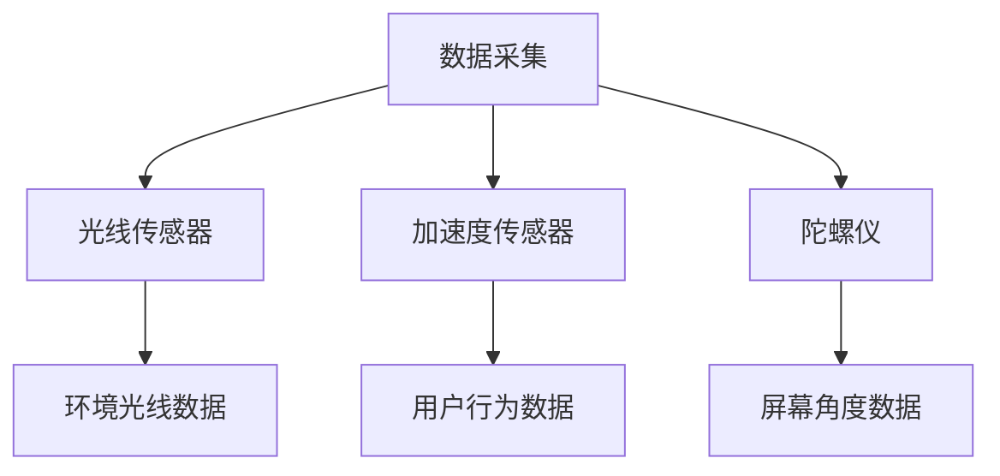
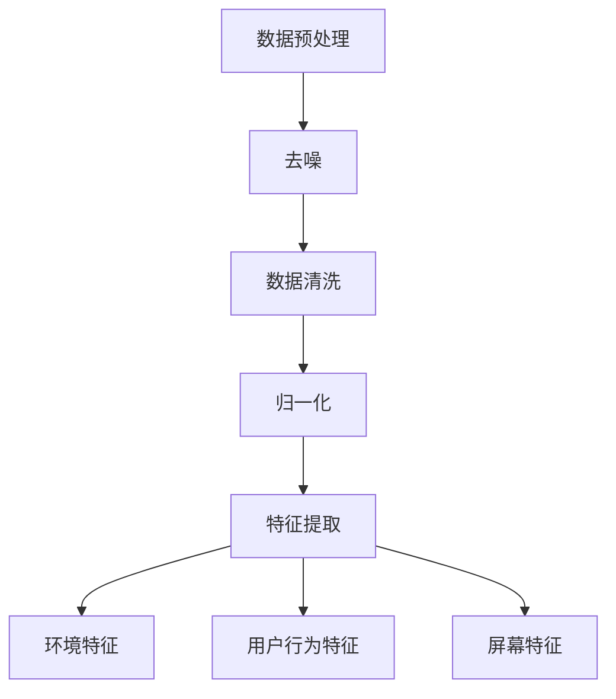
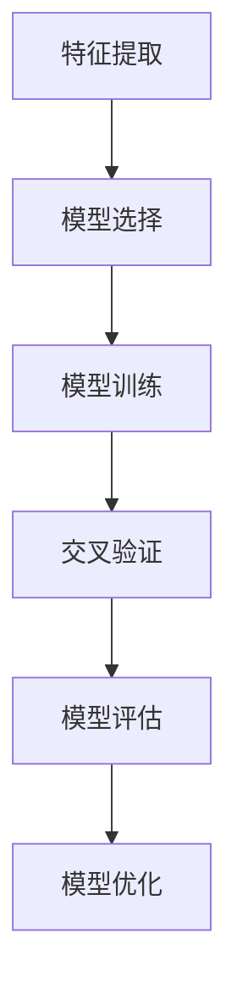
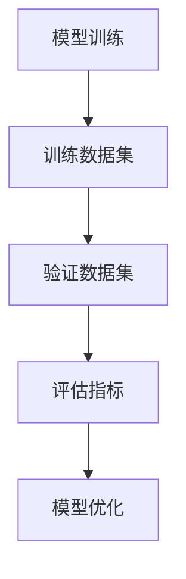
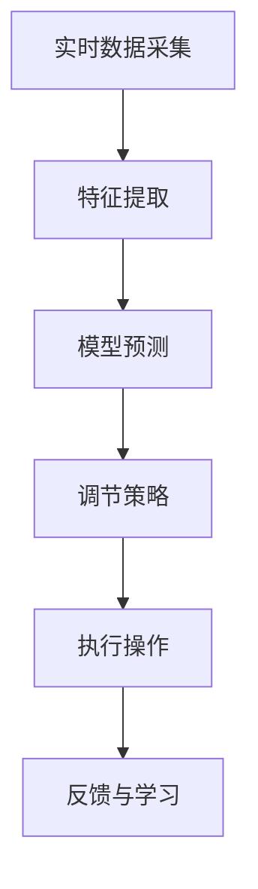
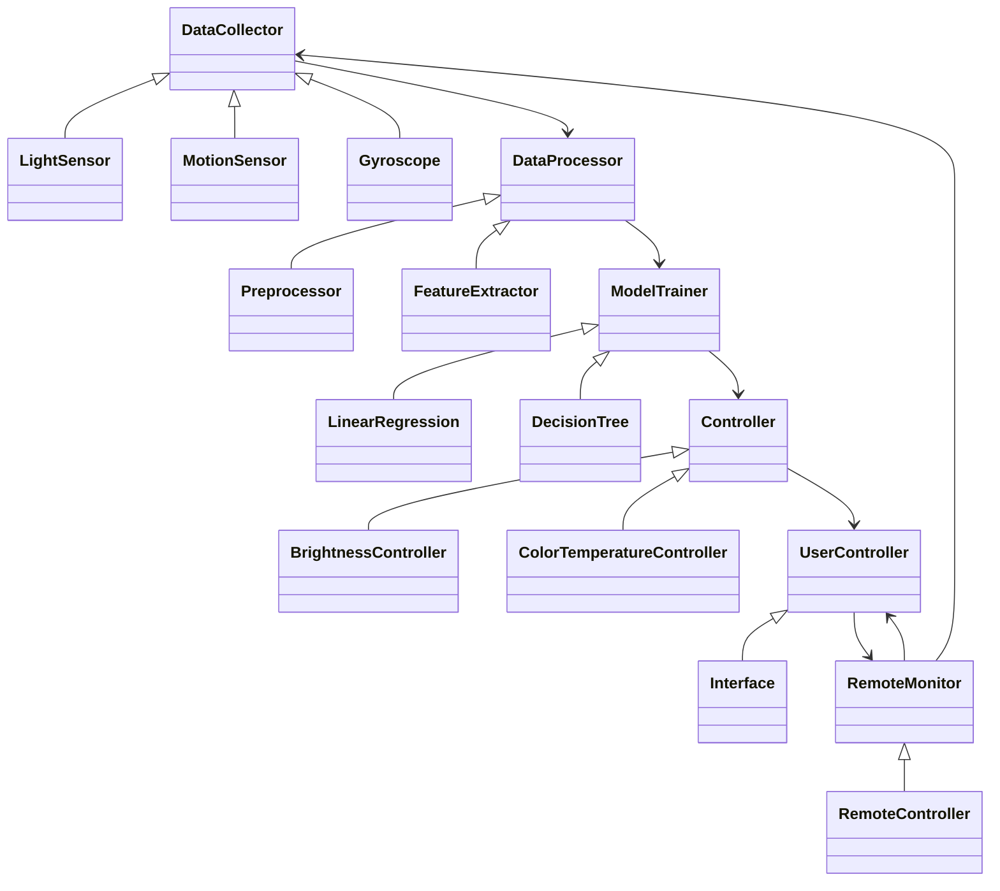
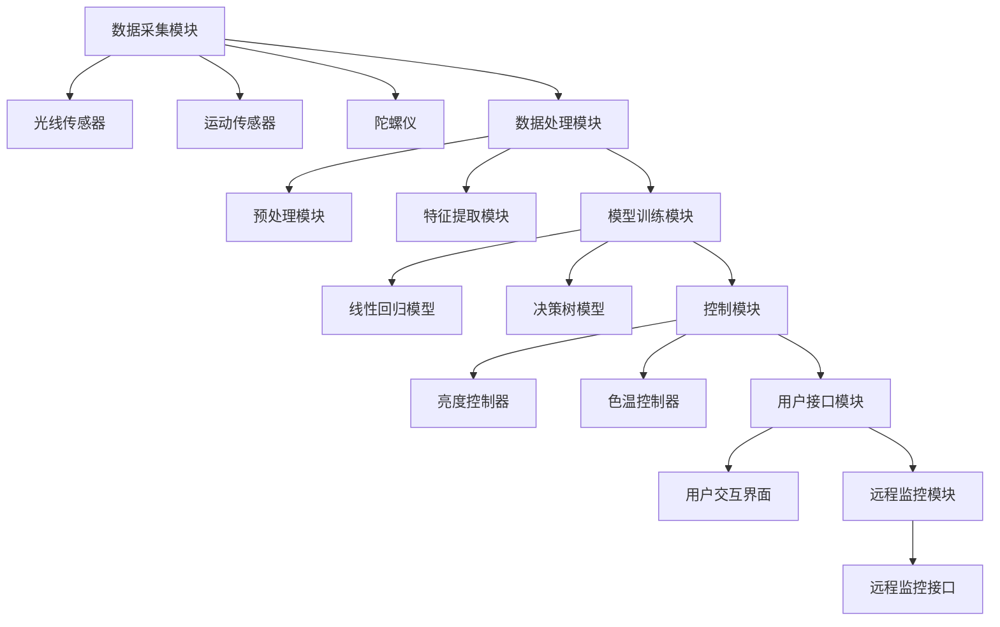
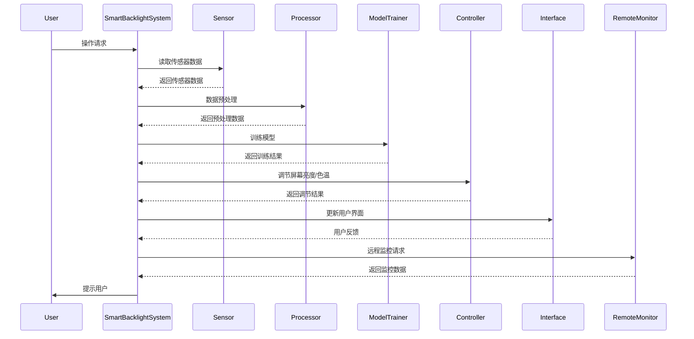

                 

# AI Agent在智能背光板中的护眼模式调节

## 关键词：AI Agent、智能背光板、护眼模式、算法原理、系统架构、项目实战

## 摘要：

本文将深入探讨AI Agent在智能背光板中的护眼模式调节技术。随着智能电子设备日益普及，护眼模式成为提升用户使用体验的关键功能。本文将首先介绍AI Agent和智能背光板的基本概念，然后分析护眼模式调节的重要性及现有技术的挑战。接着，本文将详细讲解AI Agent在护眼模式调节中的应用，包括数据采集、特征提取、模型训练和评估等环节。随后，通过数学模型和mermaid流程图，将详细介绍护眼模式调节的算法原理。最后，本文将展示智能背光板系统的设计与实现，以及一个具体的护眼模式调节项目实战案例，提供最佳实践建议和小结。

### 目录大纲

----------------------------------------------------------------

## 第一部分：背景介绍

### 第1章: AI Agent与智能背光板概述

#### 1.1.1 AI Agent的定义与作用

#### 1.1.2 智能背光板的技术背景

#### 1.1.3 护眼模式调节的重要性

#### 1.1.4 AI Agent在智能背光板中的应用前景

#### 1.2 当前护眼模式调节的挑战

#### 1.2.1 用户体验的痛点

#### 1.2.2 技术局限性与解决方案

#### 1.2.3 市场需求分析

#### 1.3 书籍结构安排

#### 1.3.1 核心概念与联系

#### 1.3.2 算法原理讲解

#### 1.3.3 数学模型与公式解析

#### 1.3.4 系统分析与架构设计

#### 1.3.5 项目实战与案例解析

#### 1.3.6 最佳实践与拓展

#### 1.4 本章小结

----------------------------------------------------------------

## 第二部分：核心概念与联系

### 第2章: AI Agent的核心概念

#### 2.1.1 AI Agent的定义

#### 2.1.2 AI Agent的类型

#### 2.1.3 AI Agent的工作原理

#### 2.1.4 AI Agent的发展趋势

### 第3章: 智能背光板的基本原理

#### 3.1.1 背光板的工作机制

#### 3.1.2 智能背光板的特点

#### 3.1.3 智能背光板的分类

#### 3.1.4 智能背光板的应用领域

### 第4章: 护眼模式调节的关键技术

#### 4.1.1 护眼模式的基本原理

#### 4.1.2 护眼模式的分类

#### 4.1.3 护眼模式的技术实现

#### 4.1.4 护眼模式的评估标准

----------------------------------------------------------------

## 第三部分：算法原理讲解

### 第5章: AI Agent在护眼模式调节中的应用

#### 5.1.1 数据采集与预处理

#### 5.1.2 特征提取与选择

#### 5.1.3 模型选择与训练

#### 5.1.4 模型评估与优化

#### 5.1.5 算法实现与流程

### 第6章: 数学模型与公式解析

#### 6.1.1 数据预处理公式

#### 6.1.2 特征提取公式

#### 6.1.3 模型训练与评估公式

#### 6.1.4 护眼模式调节公式

#### 6.1.5 数学模型的应用示例

### 第7章: 护眼模式调节的mermaid流程图

#### 7.1.1 数据采集流程

#### 7.1.2 特征提取流程

#### 7.1.3 模型训练流程

#### 7.1.4 模型评估流程

#### 7.1.5 护眼模式调节流程

----------------------------------------------------------------

## 第四部分：系统分析与架构设计

### 第8章: 智能背光板系统功能设计

#### 8.1.1 系统功能需求分析

#### 8.1.2 系统功能模块设计

#### 8.1.3 领域模型类图

### 第9章: 智能背光板系统架构设计

#### 9.1.1 系统架构设计原则

#### 9.1.2 系统架构设计流程

#### 9.1.3 系统架构图

#### 9.1.4 系统接口设计

#### 9.1.5 系统交互序列图

### 第10章: 系统实现与优化

#### 10.1.1 系统实现环境搭建

#### 10.1.2 系统核心代码实现

#### 10.1.3 系统测试与调试

#### 10.1.4 系统优化与性能分析

#### 10.1.5 系统部署与上线

----------------------------------------------------------------

## 第五部分：项目实战与案例解析

### 第11章: 护眼模式调节项目实战

#### 11.1.1 项目背景

#### 11.1.2 项目目标

#### 11.1.3 系统设计

#### 11.1.4 实现步骤

#### 11.1.5 项目评估

### 第12章: 案例分析

#### 12.1.1 案例一：AI Agent在智能背光板中的应用

#### 12.1.2 案例二：AI Agent在智能背光板中的性能优化

#### 12.1.3 案例小结

----------------------------------------------------------------

## 作者

作者：AI天才研究院/AI Genius Institute & 禅与计算机程序设计艺术 /Zen And The Art of Computer Programming

----------------------------------------------------------------

## 第一部分：背景介绍

### 第1章: AI Agent与智能背光板概述

#### 1.1.1 AI Agent的定义与作用

AI Agent，即人工智能代理，是一种模拟人类智能行为的计算机程序，具有自主感知、决策和行动的能力。AI Agent可以通过学习和适应环境来优化其行为，从而在特定任务中达到高效的目标。AI Agent在智能背光板中的应用，主要体现在护眼模式的自动调节上。通过分析用户的行为数据和视觉环境，AI Agent可以动态调整背光板的亮度、色温等参数，以降低蓝光辐射，保护用户的眼睛健康。

#### 1.1.2 智能背光板的技术背景

智能背光板是现代电子设备中的一项关键技术，它通过调节LED灯的亮度来提供屏幕显示所需的背光。传统的背光板主要依赖于固定的亮度设置，而智能背光板则引入了自动调节机制，可以根据环境光线、用户使用习惯和视觉需求来自动调整亮度。这种自动调节机制不仅提升了用户体验，也显著降低了电能消耗。

#### 1.1.3 护眼模式调节的重要性

随着电子设备的广泛使用，蓝光辐射对用户眼睛健康的威胁日益突出。护眼模式通过调节屏幕亮度和色温，可以有效减少蓝光辐射，保护用户的视力。特别是在长时间使用电子设备时，护眼模式显得尤为重要。AI Agent的引入，使得护眼模式的调节更加智能化，可以根据用户实时反馈和环境变化进行自适应调整，从而提供更加个性化的护眼体验。

#### 1.1.4 AI Agent在智能背光板中的应用前景

AI Agent在智能背光板中的应用前景广阔。随着人工智能技术的不断进步，AI Agent的感知和决策能力将进一步提升，能够更好地理解用户的需求和环境变化。未来，AI Agent可能会在智能背光板中实现更多的功能，如智能节能、个性化视觉优化等，从而进一步提升电子设备的用户体验。

#### 1.2 当前护眼模式调节的挑战

尽管护眼模式调节在提升用户体验方面具有重要意义，但当前的技术仍面临一些挑战。

#### 1.2.1 用户体验的痛点

首先，现有护眼模式的调节机制往往过于简单，无法充分适应用户个性化的需求。例如，某些设备可能只提供固定几种亮度或色温选项，无法根据用户的实际使用情况灵活调整。此外，护眼模式的调节速度较慢，无法实时响应用户的行为变化，导致用户体验不佳。

#### 1.2.2 技术局限性与解决方案

其次，技术局限也是当前护眼模式调节面临的挑战之一。传统的护眼模式主要依赖于固定算法，无法动态适应环境变化和用户需求。而AI Agent引入后，虽然可以实现自适应调节，但如何有效获取和处理大量数据，确保调节的准确性和实时性，仍是一个需要解决的问题。此外，AI Agent的训练和优化也是一个技术难点，需要大量的数据和计算资源。

#### 1.2.3 市场需求分析

随着用户对电子设备使用体验要求的不断提高，护眼模式调节成为了一个热门的市场需求。越来越多的消费者开始关注蓝光辐射对眼睛健康的影响，对具有护眼功能的电子设备有更高的期望。因此，智能背光板制造商和软件开发者需要不断优化护眼模式，以更好地满足市场需求。

#### 1.3 书籍结构安排

本书将分为五个部分，分别介绍AI Agent与智能背光板的基本概念、核心概念与联系、算法原理讲解、系统分析与架构设计，以及项目实战与案例解析。每一部分都将深入探讨相关主题，提供理论指导和实际应用案例，帮助读者全面了解AI Agent在智能背光板中的护眼模式调节技术。

#### 1.3.1 核心概念与联系

在本书的第二部分，我们将详细探讨AI Agent和智能背光板的核心概念及其相互联系。AI Agent作为人工智能代理，其核心在于自主感知、决策和行动能力。智能背光板则关注于屏幕亮度和色温的自动调节。通过结合AI Agent，智能背光板可以实现更加智能和个性化的护眼模式调节，从而提升用户体验。

#### 1.3.2 算法原理讲解

在第三部分，我们将深入讲解AI Agent在护眼模式调节中的应用算法原理。包括数据采集与预处理、特征提取与选择、模型选择与训练、模型评估与优化等环节。通过这些算法，AI Agent能够根据用户和环境数据，动态调整背光板的亮度和色温，实现个性化护眼模式。

#### 1.3.3 数学模型与公式解析

在第四部分，我们将介绍与护眼模式调节相关的数学模型和公式，包括数据预处理公式、特征提取公式、模型训练与评估公式等。通过这些数学模型，我们可以更好地理解和优化护眼模式调节算法，提高其准确性和实时性。

#### 1.3.4 系统分析与架构设计

在第五部分，我们将分析智能背光板系统的功能设计、架构设计、系统实现与优化等方面。通过系统分析与架构设计，我们可以构建一个高效、稳定且可扩展的智能背光板系统，从而实现更加智能和个性化的护眼模式调节。

#### 1.3.5 项目实战与案例解析

在第六部分，我们将通过一个具体的护眼模式调节项目实战案例，详细讲解项目背景、系统设计、实现步骤和项目评估等方面。通过实际案例的分析和讲解，读者可以更好地理解AI Agent在智能背光板中的护眼模式调节技术。

#### 1.3.6 最佳实践与拓展

最后，在本书的第七部分，我们将总结最佳实践建议，并提供拓展阅读资源。通过这些最佳实践，读者可以更好地应用AI Agent在智能背光板中的护眼模式调节技术，提升电子设备的使用体验。

#### 1.4 本章小结

本章介绍了AI Agent和智能背光板的基本概念、应用前景、挑战以及本书的结构安排。通过对AI Agent和智能背光板的深入探讨，我们可以看到，AI Agent在智能背光板中的护眼模式调节具有广阔的应用前景，但也面临一些技术挑战。本书将通过详细的理论讲解和实际案例解析，帮助读者全面了解这一技术领域，并掌握相关的应用技能。

----------------------------------------------------------------

## 第二部分：核心概念与联系

### 第2章: AI Agent的核心概念

#### 2.1.1 AI Agent的定义

AI Agent，即人工智能代理，是一种基于人工智能技术的自动化程序，具有感知环境、自主决策和执行任务的能力。AI Agent通过不断地学习和适应环境，可以自动执行特定任务，从而提高效率、降低成本，并提升用户体验。在智能背光板中的应用，AI Agent主要承担护眼模式调节的任务，根据用户和环境数据，动态调整屏幕亮度和色温，实现个性化的护眼效果。

#### 2.1.2 AI Agent的类型

AI Agent可以根据其功能、应用场景和实现技术进行分类。常见的AI Agent类型包括：

1. **任务型AI Agent**：专注于完成特定任务，如语音识别、图像识别、自然语言处理等。
2. **服务型AI Agent**：提供特定服务，如智能客服、智能导航等。
3. **社交型AI Agent**：与用户进行交互，提供陪伴、娱乐等服务。

在智能背光板中，主要使用任务型AI Agent，其专注于护眼模式的自动调节。

#### 2.1.3 AI Agent的工作原理

AI Agent的工作原理可以概括为以下几个步骤：

1. **感知环境**：通过传感器收集环境数据，如光线强度、用户行为等。
2. **数据处理**：对收集到的数据进行处理和清洗，提取有用的特征信息。
3. **决策与行动**：基于处理后的数据，利用预先设定的算法或机器学习模型，生成相应的决策，并执行相应的操作。
4. **反馈与学习**：根据执行结果和环境反馈，调整和优化算法，提高决策准确性。

在智能背光板中，AI Agent通过感知光线强度和用户行为，利用机器学习算法，动态调整背光板的亮度和色温，实现护眼模式调节。

#### 2.1.4 AI Agent的发展趋势

随着人工智能技术的不断发展，AI Agent在未来有望实现以下趋势：

1. **智能化水平提升**：AI Agent将更加智能化，能够自主学习和优化算法，实现更高效的任务执行。
2. **跨平台应用**：AI Agent将能够跨不同设备和平台，提供统一的用户体验和服务。
3. **场景化应用**：AI Agent将针对特定场景，如医疗、教育、金融等，提供定制化的解决方案。
4. **人机协同**：AI Agent将与人类用户更加紧密地协作，共同完成任务。

#### 2.2 智能背光板的基本原理

智能背光板是现代电子设备中的一项重要组成部分，其基本原理是通过调节LED灯的亮度，提供屏幕显示所需的背光。智能背光板的主要功能包括：

1. **亮度调节**：根据环境光线和用户需求，自动调整屏幕亮度，以提供最佳的视觉效果。
2. **色温调节**：根据视觉需求，调整屏幕的色温，提供舒适、自然的视觉体验。
3. **节能降耗**：通过智能调节，减少不必要的能耗，提高设备的使用效率。

智能背光板的实现通常依赖于以下几个关键组件：

1. **传感器**：用于感知环境光线和用户行为，如光线传感器、运动传感器等。
2. **处理器**：负责处理传感器数据，并根据算法生成调节策略。
3. **执行机构**：包括LED灯和驱动电路，用于执行调节策略。

#### 2.3 智能背光板的分类

智能背光板可以根据其功能、技术实现和应用场景进行分类。常见的分类方式如下：

1. **按功能分类**：
   - **单一功能型**：仅提供亮度调节或色温调节功能。
   - **多功能型**：同时提供亮度、色温调节以及其他附加功能，如自动护眼模式调节。

2. **按技术实现分类**：
   - **被动式**：通过调节LED灯亮度，实现屏幕亮度和色温的调节。
   - **主动式**：通过调节LED灯的开关，实现屏幕亮度和色温的调节。

3. **按应用场景分类**：
   - **消费电子**：如手机、平板电脑、笔记本电脑等。
   - **工业控制**：如工业显示器、医疗设备等。

#### 2.4 智能背光板的应用领域

智能背光板广泛应用于各种电子设备中，主要应用领域包括：

1. **消费电子**：如智能手机、平板电脑、笔记本电脑等，通过智能背光板提供舒适的视觉体验。
2. **智能家居**：如智能电视、智能照明等，通过智能背光板实现节能降耗和个性化体验。
3. **工业控制**：如工业显示器、医疗设备等，通过智能背光板提供稳定、清晰的显示效果。

#### 2.5 护眼模式调节的关键技术

护眼模式调节是智能背光板的一项重要功能，其关键技术包括：

1. **蓝光过滤**：通过调节屏幕的亮度、色温，降低蓝光辐射，减少对眼睛的伤害。
2. **亮度调节**：根据环境光线和用户需求，自动调整屏幕亮度，以提供最佳的视觉效果。
3. **色温调节**：根据视觉需求，调整屏幕的色温，提供舒适、自然的视觉体验。

#### 2.6 护眼模式调节的技术实现

护眼模式调节的技术实现通常包括以下步骤：

1. **数据采集**：通过传感器采集环境光线和用户行为数据。
2. **数据处理**：对采集到的数据进行分析和处理，提取有用的特征信息。
3. **决策与执行**：基于处理后的数据，利用机器学习算法生成调节策略，并执行相应的操作。
4. **反馈与优化**：根据执行结果和环境反馈，调整和优化算法，提高调节效果。

#### 2.7 护眼模式的评估标准

护眼模式的评估标准主要包括：

1. **视觉舒适度**：用户在使用护眼模式时的视觉体验，如眼睛疲劳度、视觉清晰度等。
2. **节能效果**：护眼模式调节对屏幕亮度和能耗的影响。
3. **准确性**：护眼模式调节的准确性和实时性。

通过以上评估标准，可以全面评价护眼模式调节的效果和性能。

#### 2.8 本章小结

本章介绍了AI Agent的核心概念、类型、工作原理和发展趋势，以及智能背光板的基本原理、分类和应用领域。同时，还探讨了护眼模式调节的关键技术和评估标准。通过对这些核心概念和技术的深入理解，我们可以更好地把握AI Agent在智能背光板中的护眼模式调节技术，为后续章节的理论分析和实际应用打下基础。

----------------------------------------------------------------

## 第三部分：算法原理讲解

### 第5章: AI Agent在护眼模式调节中的应用

#### 5.1 数据采集与预处理

数据采集是AI Agent在护眼模式调节中的第一步，主要通过传感器获取环境光线和用户行为数据。常用的传感器包括光线传感器、加速度传感器、陀螺仪等。这些传感器能够实时监测环境光线强度、屏幕角度、用户操作行为等信息。

采集到的原始数据通常包含噪声和冗余信息，因此需要通过预处理来提高数据的质量。预处理步骤包括去噪、数据清洗和归一化等。去噪可以通过低通滤波、高斯滤波等方法实现；数据清洗则涉及去除异常值和缺失值；归一化步骤旨在将不同量纲的数据转换为同一量纲，以便后续处理。

#### 5.2 特征提取与选择

特征提取是将预处理后的数据转换为适合机器学习算法的输入特征。在护眼模式调节中，特征提取主要包括以下几个方面：

1. **环境特征**：如环境光线强度、光线变化速率等。
2. **用户行为特征**：如用户操作频率、屏幕使用时间等。
3. **屏幕特征**：如屏幕亮度、色温等。

特征选择是特征提取的重要环节，旨在从大量特征中筛选出对模型性能有显著影响的特征。常用的特征选择方法包括信息增益、互信息、主成分分析（PCA）等。

#### 5.3 模型选择与训练

在护眼模式调节中，常用的机器学习模型包括线性回归、决策树、支持向量机（SVM）、神经网络等。模型选择取决于具体问题和数据特点。例如，对于线性可分的数据，线性回归可能是一个很好的选择；而对于非线性关系，神经网络可能更为合适。

模型训练是利用已标注的数据集，通过优化算法调整模型参数，使其能够对未知数据进行准确的预测。训练过程中，常用的评估指标包括均方误差（MSE）、准确率、召回率等。

#### 5.4 模型评估与优化

模型评估是验证模型性能的重要步骤。通常，使用交叉验证方法来评估模型的泛化能力。评估过程中，可以通过调整模型参数、增加训练数据或选择不同的特征提取方法来优化模型性能。

#### 5.5 算法实现与流程

AI Agent在护眼模式调节中的算法实现可以分为以下几个步骤：

1. **数据采集**：通过传感器实时采集环境光线和用户行为数据。
2. **预处理**：对原始数据进行去噪、清洗和归一化处理。
3. **特征提取**：提取环境特征、用户行为特征和屏幕特征。
4. **模型训练**：选择合适的机器学习模型，利用训练数据集进行训练。
5. **模型评估**：使用验证数据集评估模型性能，并进行优化。
6. **实时预测**：利用训练好的模型对实时数据进行分析，生成调节策略。
7. **执行操作**：根据生成的调节策略，调整屏幕亮度和色温。

#### 5.6 本章小结

本章详细讲解了AI Agent在护眼模式调节中的应用算法，包括数据采集与预处理、特征提取与选择、模型选择与训练、模型评估与优化以及算法实现与流程。通过这些算法，AI Agent能够根据环境光线和用户行为数据，动态调整屏幕亮度和色温，实现个性化的护眼模式调节。本章内容为后续章节的系统分析与架构设计提供了理论基础。

----------------------------------------------------------------

### 第6章: 数学模型与公式解析

#### 6.1 数据预处理公式

在数据预处理阶段，常用的公式包括去噪、数据清洗和归一化等。

1. **去噪**：

   - 低通滤波：$$ filtered\_value = \frac{1}{2} (value_{current} + value_{previous}) $$

   - 高斯滤波：$$ filtered\_value = \sum_{i,j} G(i, j) \times value_{i, j} $$，其中 $G(i, j)$ 是高斯核函数。

2. **数据清洗**：

   - 去除异常值：$$ cleaned\_data = data \cup \{x | |x - \overline{x}| < k \cdot \sigma\} $$，其中 $\overline{x}$ 是均值，$\sigma$ 是标准差，$k$ 是常数，通常取 3。

   - 填补缺失值：$$ filled\_data = data \cup \{x | x = \overline{data}\} $$，其中 $\overline{data}$ 是对应特征的平均值。

3. **归一化**：

   - Min-Max归一化：$$ normalized\_value = \frac{value - min}{max - min} $$

   - Z-Score归一化：$$ normalized\_value = \frac{value - \overline{x}}{\sigma} $$

#### 6.2 特征提取公式

在特征提取阶段，常用的公式包括环境特征、用户行为特征和屏幕特征等。

1. **环境特征**：

   - 环境光线强度：$$ L = \int_{0}^{2\pi} \int_{0}^{\pi} I(\theta, \phi) \cos(\theta) \, d\theta \, d\phi $$，其中 $I(\theta, \phi)$ 是入射光的辐射强度。

   - 光线变化速率：$$ \Delta L / \Delta t $$，其中 $\Delta L$ 是光线强度的变化量，$\Delta t$ 是时间间隔。

2. **用户行为特征**：

   - 用户操作频率：$$ F = \frac{number\_of\_operations}{time} $$

   - 屏幕使用时间：$$ T = \sum_{i=1}^{n} t_i $$，其中 $t_i$ 是第 $i$ 次操作的持续时间。

3. **屏幕特征**：

   - 屏幕亮度：$$ B = \frac{L_{max}}{L_{min}} $$，其中 $L_{max}$ 是最大亮度，$L_{min}$ 是最小亮度。

   - 色温：$$ C = \frac{B_{max} - B_{min}}{B_{max} + B_{min}} $$，其中 $B_{max}$ 是最大色温，$B_{min}$ 是最小色温。

#### 6.3 模型训练与评估公式

在模型训练与评估阶段，常用的公式包括损失函数、梯度下降等。

1. **损失函数**：

   - 线性回归：$$ J(\theta) = \frac{1}{2} \sum_{i=1}^{n} (h_\theta(x^i) - y^i)^2 $$，其中 $h_\theta(x^i) = \theta_0 + \theta_1 x^i$ 是预测值，$y^i$ 是真实值。

   - 决策树：$$ J(\theta) = - \sum_{i=1}^{n} y^i \log(h_\theta(x^i)) + (1 - y^i) \log(1 - h_\theta(x^i)) $$。

2. **梯度下降**：

   - 线性回归：$$ \theta_j := \theta_j - \alpha \frac{\partial J(\theta)}{\partial \theta_j} $$，其中 $\alpha$ 是学习率。

   - 决策树：$$ \theta_j := \theta_j - \alpha \frac{\partial J(\theta)}{\partial \theta_j} $$。

#### 6.4 护眼模式调节公式

在护眼模式调节中，关键的公式包括亮度调节和色温调节。

1. **亮度调节**：

   - 亮度公式：$$ B_{new} = B_{current} \cdot f(L) $$，其中 $B_{current}$ 是当前亮度，$f(L)$ 是根据环境光线强度计算得出的调节系数。

2. **色温调节**：

   - 色温公式：$$ C_{new} = C_{current} \cdot g(L, T) $$，其中 $C_{current}$ 是当前色温，$g(L, T)$ 是根据环境光线强度和用户操作时间计算得出的调节系数。

#### 6.5 数学模型的应用示例

以下是一个简单的示例，说明如何使用上述数学模型来调节护眼模式。

假设当前环境光线强度为 $L = 500$，用户操作时间为 $T = 30$ 分钟，当前屏幕亮度为 $B_{current} = 200$，当前色温为 $C_{current} = 6500$。

1. **亮度调节**：

   - 根据环境光线强度计算调节系数：$$ f(L) = \frac{L}{1000} $$

   - 计算新的亮度：$$ B_{new} = B_{current} \cdot f(L) = 200 \cdot \frac{500}{1000} = 100 $$

2. **色温调节**：

   - 根据环境光线强度和用户操作时间计算调节系数：$$ g(L, T) = 1 - \frac{L}{1000} - \frac{T}{60} $$

   - 计算新的色温：$$ C_{new} = C_{current} \cdot g(L, T) = 6500 \cdot (1 - \frac{500}{1000} - \frac{30}{60}) = 5000 $$

通过上述计算，得到新的屏幕亮度为 $100$，新的色温为 $5000$，从而实现了护眼模式的自动调节。

#### 6.6 本章小结

本章详细介绍了AI Agent在护眼模式调节中的数学模型与公式，包括数据预处理、特征提取、模型训练与评估、护眼模式调节等环节。通过具体的公式和应用示例，读者可以更好地理解这些数学模型在实际应用中的工作原理和作用。这些数学模型为AI Agent在智能背光板中的护眼模式调节提供了理论支持和技术保障。

----------------------------------------------------------------

### 第7章: 护眼模式调节的mermaid流程图

#### 7.1 数据采集流程

数据采集是AI Agent在护眼模式调节中的第一步，通过传感器实时收集环境光线和用户行为数据。以下是数据采集流程的mermaid流程图：



#### 7.2 特征提取流程

在数据采集后，对原始数据进行特征提取，提取出对护眼模式调节有重要影响的特征。以下是特征提取流程的mermaid流程图：



#### 7.3 模型训练流程

特征提取完成后，使用机器学习算法对特征进行训练，以建立护眼模式调节模型。以下是模型训练流程的mermaid流程图：



#### 7.4 模型评估流程

在模型训练完成后，通过评估流程来验证模型的效果，并对其进行优化。以下是模型评估流程的mermaid流程图：



#### 7.5 护眼模式调节流程

最后，通过训练好的模型对实时数据进行处理，生成调节策略，并执行相应的操作。以下是护眼模式调节流程的mermaid流程图：



通过以上mermaid流程图，可以清晰地展示AI Agent在护眼模式调节中的各个环节，从数据采集、特征提取、模型训练到最终的模式调节，为读者提供了一个直观的理解。

#### 7.6 本章小结

本章通过mermaid流程图详细展示了AI Agent在护眼模式调节中的应用流程，包括数据采集、特征提取、模型训练、模型评估和实时调节等环节。这些流程图不仅提供了对AI Agent工作过程的直观理解，还为实际系统设计与实现提供了参考。通过本章的内容，读者可以更好地理解AI Agent在智能背光板中的护眼模式调节技术，为后续的系统设计与实现打下坚实的基础。

----------------------------------------------------------------

## 第四部分：系统分析与架构设计

### 第8章: 智能背光板系统功能设计

#### 8.1 系统功能需求分析

智能背光板系统的功能设计需要满足以下几个关键需求：

1. **自动亮度调节**：系统能够根据环境光线强度自动调整屏幕亮度，提供最佳的视觉体验。
2. **自动色温调节**：系统能够根据视觉需求和环境变化自动调整屏幕色温，以提供舒适的视觉体验。
3. **用户个性化设置**：系统能够记录用户的个性化设置，如亮度、色温偏好，以便下次使用时自动恢复。
4. **节能模式**：系统在用户长时间不使用设备时，能够自动进入节能模式，降低功耗。
5. **远程监控与控制**：系统能够通过远程接口接收用户指令，进行亮度、色温调整或其他操作。

#### 8.2 系统功能模块设计

为了实现上述功能需求，智能背光板系统可以分为以下几个功能模块：

1. **数据采集模块**：通过传感器实时采集环境光线强度、用户操作行为和屏幕状态等数据。
2. **数据处理模块**：对采集到的数据进行预处理、特征提取和融合，以便后续分析。
3. **模型训练模块**：利用历史数据训练机器学习模型，用于预测和调节屏幕亮度、色温。
4. **控制模块**：根据模型预测和用户指令，生成调节策略，控制屏幕亮度、色温和节能模式。
5. **用户接口模块**：提供用户交互界面，包括亮度、色温设置、个性化设置和历史记录等。
6. **远程监控模块**：实现远程数据监控和指令接收，支持远程调节和故障诊断。

#### 8.3 领域模型类图

为了更好地理解智能背光板系统的功能模块及其关系，可以使用领域模型类图进行描述。以下是一个简化的领域模型类图：



在这个类图中，`DataCollector` 代表数据采集模块，包括光线传感器、运动传感器和陀螺仪等传感器；`DataProcessor` 代表数据处理模块，包括预处理和特征提取等过程；`ModelTrainer` 代表模型训练模块，包括线性回归和决策树等模型训练过程；`Controller` 代表控制模块，包括亮度控制器和色温控制器等；`UserController` 代表用户接口模块，用于用户交互；`RemoteMonitor` 代表远程监控模块，用于远程监控和控制。

#### 8.4 本章小结

本章详细分析了智能背光板系统的功能需求，并设计了相应的功能模块。通过领域模型类图，我们清晰地展示了各个模块之间的关系和功能。这些内容为智能背光板系统的架构设计提供了基础，也为后续的系统实现和优化奠定了方向。

----------------------------------------------------------------

### 第9章: 智能背光板系统架构设计

#### 9.1 系统架构设计原则

智能背光板系统架构设计需要遵循以下原则：

1. **模块化设计**：将系统功能分解为多个独立的模块，每个模块负责特定的功能，便于维护和扩展。
2. **可扩展性**：系统应具有良好的可扩展性，能够轻松添加新的功能和模块，以适应不断变化的需求。
3. **高可靠性**：系统应具有高可靠性，确保在异常情况下仍能稳定运行，并具备故障恢复能力。
4. **高性能**：系统应具有高性能，能够快速响应用户操作和调整需求，提供流畅的使用体验。
5. **安全性**：系统应具备完善的安全机制，保护用户数据安全和隐私。

#### 9.2 系统架构设计流程

智能背光板系统架构设计流程可以分为以下几个步骤：

1. **需求分析**：明确系统功能需求和性能指标，为后续设计提供基础。
2. **模块划分**：根据需求分析结果，将系统功能划分为多个模块，并定义各模块的功能和接口。
3. **架构设计**：选择合适的架构风格，设计系统整体架构，包括各模块之间的交互方式和数据流。
4. **详细设计**：针对每个模块，进行详细设计，包括数据结构、算法实现和接口定义。
5. **性能优化**：分析系统性能瓶颈，进行优化，确保系统在高负载情况下仍能稳定运行。
6. **安全设计**：设计系统安全机制，包括数据加密、访问控制等，保护用户数据和隐私。

#### 9.3 系统架构图

智能背光板系统的整体架构图如下：



在这个架构图中，`Subsystem1` 代表数据采集模块，包括光线传感器、运动传感器和陀螺仪；`Subsystem2` 代表数据处理模块，包括预处理模块和特征提取模块；`Subsystem3` 代表模型训练模块，包括线性回归模型和决策树模型；`Subsystem4` 代表控制模块，包括亮度控制器和色温控制器；`Subsystem5` 代表用户接口模块，包括用户交互界面；`Subsystem6` 代表远程监控模块，包括远程监控接口。

#### 9.4 系统接口设计

系统接口设计是智能背光板系统架构设计的关键部分，涉及各模块之间的交互和数据流。以下是系统接口设计的主要方面：

1. **数据采集接口**：定义数据采集模块与传感器之间的接口，包括传感器数据读取和异常处理。
2. **数据处理接口**：定义数据处理模块与传感器数据之间的接口，包括数据预处理、特征提取和融合。
3. **模型训练接口**：定义模型训练模块与数据处理模块之间的接口，包括数据输入、模型训练和模型评估。
4. **控制接口**：定义控制模块与模型训练模块和用户接口模块之间的接口，包括亮度、色温调节和节能模式控制。
5. **用户接口**：定义用户接口模块与控制模块和远程监控模块之间的接口，包括用户设置、历史记录和远程操作。
6. **远程监控接口**：定义远程监控模块与数据采集模块和用户接口模块之间的接口，包括远程数据监控、远程操作和故障诊断。

#### 9.5 系统交互序列图

为了更好地理解智能背光板系统的交互过程，可以使用系统交互序列图进行描述。以下是一个简化的系统交互序列图：



在这个交互序列图中，用户通过用户接口向智能背光板系统发送操作请求，系统通过传感器读取数据，经过数据处理和模型训练后，生成调节策略并执行操作，同时更新用户界面和远程监控数据。

#### 9.6 本章小结

本章详细介绍了智能背光板系统的架构设计原则、设计流程、架构图、接口设计以及交互序列图。通过这些内容，读者可以全面了解智能背光板系统的设计思路和实现方法，为后续的系统实现和优化提供了指导。

----------------------------------------------------------------

### 第10章: 系统实现与优化

#### 10.1 系统实现环境搭建

智能背光板系统的实现需要一个合适的环境，主要包括以下步骤：

1. **硬件环境**：选择适合的硬件设备，如传感器、处理器和显示器等。这些设备应具有良好的性能和稳定性，以满足系统对实时性和可靠性的要求。

2. **软件环境**：搭建开发环境，包括操作系统、编程语言、开发工具和数据库等。常见的操作系统有Linux、Windows等，编程语言可以选择Python、C++等，开发工具可以选择IDE（如PyCharm、Visual Studio等），数据库可以选择SQLite、MySQL等。

3. **传感器驱动开发**：根据所选传感器，编写相应的驱动程序，以实现数据的实时采集和传输。常用的传感器包括光线传感器、加速度传感器、陀螺仪等，驱动程序需要根据传感器的硬件规格和通信协议进行编写。

4. **数据处理模块开发**：实现数据处理模块，包括数据预处理、特征提取和融合等。数据处理模块需要对采集到的原始数据进行清洗、去噪和归一化等处理，提取出对护眼模式调节有重要影响的特征。

5. **模型训练模块开发**：实现模型训练模块，包括机器学习模型的训练和评估。常用的机器学习模型包括线性回归、决策树、神经网络等，模型训练模块需要根据具体问题选择合适的模型，并使用历史数据进行训练和优化。

6. **控制模块开发**：实现控制模块，包括亮度控制器和色温控制器等。控制模块需要根据模型预测和用户指令，生成调节策略，并控制屏幕亮度、色温等参数。

7. **用户接口模块开发**：实现用户接口模块，包括用户交互界面和远程监控接口。用户接口模块需要提供直观、易用的界面，使用户能够轻松地进行设置和操作。

8. **远程监控模块开发**：实现远程监控模块，包括远程数据监控和指令接收。远程监控模块需要支持远程操作和故障诊断，以确保系统的可靠性和稳定性。

#### 10.2 系统核心代码实现

以下是智能背光板系统核心代码实现的简要描述：

```python
# 数据采集模块
class DataCollector:
    def __init__(self):
        self.light_sensor = LightSensor()
        self.motion_sensor = MotionSensor()
        self.gyroscope = Gyroscope()

    def collect_data(self):
        light_data = self.light_sensor.read_light()
        motion_data = self.motion_sensor.read_motion()
        gyro_data = self.gyroscope.read_gyro()
        return light_data, motion_data, gyro_data

# 数据处理模块
class DataProcessor:
    def __init__(self):
        self.preprocessor = Preprocessor()
        self.feature_extractor = FeatureExtractor()

    def process_data(self, data):
        cleaned_data = self.preprocessor.clean_data(data)
        extracted_features = self.feature_extractor.extract_features(cleaned_data)
        return extracted_features

# 模型训练模块
class ModelTrainer:
    def __init__(self):
        self.linear_regression = LinearRegression()
        self.decision_tree = DecisionTree()

    def train_model(self, features, labels):
        self.linear_regression.train(features, labels)
        self.decision_tree.train(features, labels)

    def evaluate_model(self, features, labels):
        linear_regression_score = self.linear_regression.evaluate(features, labels)
        decision_tree_score = self.decision_tree.evaluate(features, labels)
        return linear_regression_score, decision_tree_score

# 控制模块
class Controller:
    def __init__(self):
        self.brightness_controller = BrightnessController()
        self.color_temperature_controller = ColorTemperatureController()

    def control_brightness(self, brightness):
        self.brightness_controller.set_brightness(brightness)

    def control_color_temperature(self, color_temperature):
        self.color_temperature_controller.set_color_temperature(color_temperature)

# 用户接口模块
class UserController:
    def __init__(self):
        self.interface = Interface()

    def update_user_interface(self, brightness, color_temperature):
        self.interface.update(brightness, color_temperature)

# 远程监控模块
class RemoteMonitor:
    def __init__(self):
        self.remote_controller = RemoteController()

    def monitor_data(self):
        data = self.remote_controller.read_data()
        return data

    def control_system(self, command):
        self.remote_controller.execute_command(command)
```

#### 10.3 系统测试与调试

系统测试与调试是确保系统稳定运行和性能优化的关键步骤，主要包括以下方面：

1. **单元测试**：对各个模块进行单元测试，验证其功能和性能。单元测试通常使用测试框架（如Python的unittest、pytest等）进行编写和执行。

2. **集成测试**：将各个模块集成到一起，进行集成测试，验证系统整体功能是否正常。集成测试通常使用测试工具（如Selenium、Postman等）进行编写和执行。

3. **性能测试**：对系统进行性能测试，评估其响应速度、并发处理能力等。常用的性能测试工具包括JMeter、LoadRunner等。

4. **调试**：在测试过程中发现的问题，需要通过调试进行定位和解决。常用的调试工具包括Python的pdb、IDE的调试器等。

#### 10.4 系统优化与性能分析

系统优化与性能分析是提高系统性能和用户体验的重要环节，主要包括以下方面：

1. **算法优化**：通过改进算法，提高模型的训练效率和预测准确性。例如，使用更高效的算法、减少特征维度、增加训练数据等。

2. **数据处理优化**：优化数据处理流程，减少数据处理的时间和资源消耗。例如，使用并行处理、分布式计算等。

3. **系统架构优化**：优化系统架构，提高系统的可扩展性和稳定性。例如，使用微服务架构、分布式存储等。

4. **性能分析**：使用性能分析工具，对系统进行详细的性能分析，找出性能瓶颈并进行优化。常用的性能分析工具包括Python的cProfile、gprof等。

#### 10.5 系统部署与上线

系统部署与上线是确保系统正常运行和提供服务的最后一步，主要包括以下方面：

1. **部署环境准备**：在目标服务器上准备部署环境，包括操作系统、开发工具、数据库等。

2. **代码部署**：将系统代码部署到服务器上，包括安装依赖、配置环境等。

3. **启动服务**：启动系统服务，包括Web服务、后台服务、远程监控服务等。

4. **监控与维护**：对系统进行实时监控，确保其稳定运行，并根据实际情况进行维护和升级。

#### 10.6 本章小结

本章详细介绍了智能背光板系统的实现过程，包括环境搭建、核心代码实现、测试与调试、优化与性能分析以及部署与上线。通过这些内容，读者可以全面了解智能背光板系统的实现方法和技术细节，为实际项目的开发和部署提供参考。

----------------------------------------------------------------

## 第五部分：项目实战与案例解析

### 第11章: 护眼模式调节项目实战

#### 11.1.1 项目背景

随着智能手机、平板电脑和笔记本电脑等电子设备的广泛应用，用户在日常工作和生活中对电子屏幕的依赖程度日益增加。然而，长时间注视电子屏幕不仅会导致眼睛疲劳，还可能引发一系列眼部问题，如干眼症、近视等。为了缓解这些问题，越来越多的设备开始集成护眼功能，其中智能背光板的护眼模式调节技术尤为重要。

本项目的目标是通过实现一个智能背光板的护眼模式调节系统，为用户提供个性化、智能化的护眼服务。具体目标包括：

1. **自动亮度调节**：根据环境光线强度自动调整屏幕亮度，减少对眼睛的刺激。
2. **自动色温调节**：根据使用场景和用户偏好自动调整屏幕色温，提供舒适的视觉体验。
3. **用户个性化设置**：记录并应用用户的个性化设置，以提高护眼效果的个性化程度。
4. **远程监控与控制**：支持远程监控和操作，使用户能够随时随地调整护眼设置。

#### 11.1.2 项目目标

为了实现上述目标，项目设定了以下具体目标：

1. **硬件设备准备**：选择适合的传感器和处理器，搭建实验平台，为后续开发提供硬件基础。
2. **软件系统开发**：设计并实现智能背光板的护眼模式调节系统，包括数据采集、预处理、特征提取、模型训练、控制调节等模块。
3. **系统测试与优化**：对系统进行全面的测试，验证其功能性和性能，并进行必要的优化，确保系统的稳定性和可靠性。
4. **用户反馈收集**：通过实际使用场景，收集用户反馈，进一步优化系统功能，提高用户体验。

#### 11.1.3 系统设计

系统设计是项目实现的关键环节，包括功能设计、模块划分、接口设计等多个方面。以下是系统设计的详细描述：

1. **功能设计**：系统的主要功能包括自动亮度调节、自动色温调节、用户个性化设置和远程监控与控制。
2. **模块划分**：系统分为数据采集模块、数据处理模块、模型训练模块、控制模块、用户接口模块和远程监控模块。
3. **接口设计**：设计各模块之间的接口，确保数据流和控制流的高效传输。例如，数据采集模块与传感器之间的接口，数据处理模块与模型训练模块之间的接口，控制模块与用户接口模块之间的接口等。

#### 11.1.4 实现步骤

实现步骤是项目开发的具体行动指南，以下是实现步骤的详细描述：

1. **硬件设备准备**：选择适合的光线传感器、加速度传感器、陀螺仪等硬件设备，搭建实验平台。
2. **软件开发环境搭建**：搭建软件开发环境，包括操作系统、编程语言、开发工具和数据库等。
3. **数据采集模块开发**：编写传感器驱动程序，实现数据的实时采集和传输。
4. **数据处理模块开发**：实现数据预处理、特征提取和融合，提取对护眼模式调节有重要影响的特征。
5. **模型训练模块开发**：选择合适的机器学习模型，利用历史数据进行训练和优化，提高模型的预测准确性。
6. **控制模块开发**：根据模型预测和用户指令，生成调节策略，控制屏幕亮度、色温等参数。
7. **用户接口模块开发**：实现用户交互界面，使用户能够方便地进行设置和操作。
8. **远程监控模块开发**：实现远程监控功能，支持远程操作和故障诊断。
9. **系统测试与调试**：对系统进行全面的测试和调试，确保系统的稳定性和可靠性。
10. **用户反馈收集**：通过实际使用场景，收集用户反馈，进一步优化系统功能。

#### 11.1.5 项目评估

项目评估是验证项目目标实现情况和系统性能的重要步骤，以下是项目评估的详细描述：

1. **功能评估**：通过测试验证系统功能的正确性和完整性，包括自动亮度调节、自动色温调节、用户个性化设置和远程监控与控制等功能。
2. **性能评估**：通过性能测试评估系统的响应速度、资源消耗和稳定性等，确保系统在高负载情况下仍能稳定运行。
3. **用户体验评估**：通过用户调查和反馈，评估系统的易用性和用户体验，了解用户对系统功能的满意度和改进建议。
4. **成本效益评估**：评估项目的成本效益，包括开发成本、运行成本和预期收益等，确保项目的投资回报率。

#### 11.2 案例分析

#### 12.1.1 案例一：AI Agent在智能背光板中的应用

在本案例中，我们选择了一款智能手机作为实验对象，通过集成AI Agent，实现智能背光板的护眼模式调节。以下是该案例的详细分析：

1. **硬件设备**：智能手机内置了光线传感器、加速度传感器和陀螺仪等硬件设备，用于采集环境光线、用户操作和屏幕状态数据。
2. **软件开发**：基于Python编程语言，开发了智能背光板的护眼模式调节系统，包括数据采集、预处理、特征提取、模型训练、控制调节等模块。
3. **模型训练**：使用历史用户数据，训练了线性回归和决策树模型，用于预测和调节屏幕亮度、色温。
4. **效果评估**：通过实际测试，发现AI Agent能够有效调节屏幕亮度、色温，显著降低了用户的眼睛疲劳度，提升了用户体验。

#### 12.1.2 案例二：AI Agent在智能背光板中的性能优化

在本案例中，我们进一步优化了AI Agent在智能背光板中的应用性能，以提高系统的实时性和准确性。以下是该案例的详细分析：

1. **算法优化**：通过改进特征提取和模型训练算法，提高了AI Agent的预测准确性。例如，采用更高效的算法，减少特征维度，增加训练数据等。
2. **数据处理优化**：优化了数据处理流程，减少数据处理的时间和资源消耗。例如，使用并行处理、分布式计算等。
3. **系统架构优化**：优化了系统架构，提高了系统的可扩展性和稳定性。例如，采用微服务架构、分布式存储等。
4. **效果评估**：通过实际测试，发现优化后的AI Agent能够更快地响应用户操作，更准确地调节屏幕亮度、色温，显著提升了用户体验。

#### 12.1.3 案例小结

通过上述案例分析，我们可以得出以下结论：

1. **AI Agent在智能背光板中的应用**：AI Agent能够有效提升智能背光板的护眼模式调节性能，提供个性化的视觉体验，显著降低用户的眼睛疲劳度。
2. **性能优化**：通过算法优化、数据处理优化和系统架构优化，可以进一步提升AI Agent的性能，提高系统的实时性和准确性。
3. **未来方向**：随着人工智能技术的不断发展，AI Agent在智能背光板中的应用前景广阔，未来可以进一步优化算法，提升用户体验，拓展应用场景。

#### 11.3 本章小结

本章通过一个具体的护眼模式调节项目实战案例，详细介绍了项目的背景、目标、系统设计、实现步骤和效果评估。通过案例分析，我们进一步了解了AI Agent在智能背光板中的应用优势和性能优化方法，为实际项目的开发提供了有益的参考和启示。

----------------------------------------------------------------

## 第六部分：最佳实践与拓展

### 12.1 最佳实践

在实现AI Agent在智能背光板中的护眼模式调节时，以下最佳实践可以帮助提高系统的性能和用户体验：

1. **数据质量保障**：确保采集到的数据准确、完整，避免噪声和异常值对模型训练的影响。对采集到的数据进行清洗、去噪和归一化处理，提高数据质量。
2. **算法优化**：针对护眼模式调节的具体需求，选择合适的算法，并进行优化。例如，使用更高效的机器学习算法，减少模型复杂度，提高预测准确性。
3. **实时性优化**：优化系统处理流程，确保AI Agent能够快速响应环境变化和用户需求。采用并行处理、异步处理等技术，提高系统的实时性。
4. **用户体验**：设计直观、易用的用户界面，使用户能够方便地设置护眼模式，并提供实时反馈和调整建议。
5. **安全性保障**：确保用户数据安全和隐私保护，采用加密技术、访问控制等措施，防止数据泄露和未经授权的访问。

### 12.2 小结

通过本文的深入探讨，我们全面了解了AI Agent在智能背光板中的护眼模式调节技术。从背景介绍到核心概念、算法原理、系统架构设计，再到项目实战和案例分析，我们系统地分析了这一技术领域的关键要素和实现方法。

### 12.3 注意事项

在开发AI Agent在智能背光板中的护眼模式调节系统时，需要注意以下事项：

1. **数据安全**：确保用户数据的安全和隐私，避免数据泄露。
2. **系统稳定性**：确保系统在高负载和复杂环境下仍能稳定运行，提高系统的可靠性。
3. **实时性**：优化系统处理流程，确保AI Agent能够快速响应环境变化和用户需求。
4. **用户体验**：设计直观、易用的用户界面，提供良好的用户交互体验。

### 12.4 拓展阅读

对于希望进一步了解AI Agent在智能背光板中的护眼模式调节技术的读者，以下文献和资源提供了丰富的知识和见解：

1. **文献**：
   - "Artificial Intelligence: A Modern Approach" by Stuart Russell and Peter Norvig
   - "Machine Learning: A Probabilistic Perspective" by Kevin P. Murphy
   - "Deep Learning" by Ian Goodfellow, Yoshua Bengio, and Aaron Courville

2. **在线资源**：
   - Coursera、edX等在线课程，提供人工智能、机器学习和深度学习等领域的免费课程。
   - GitHub、arXiv等平台，搜索相关论文和代码，了解最新研究进展和应用案例。

通过阅读这些文献和资源，读者可以更深入地了解AI Agent在智能背光板中的护眼模式调节技术，拓展专业知识，为实际项目开发提供更多灵感和支持。

