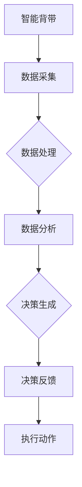
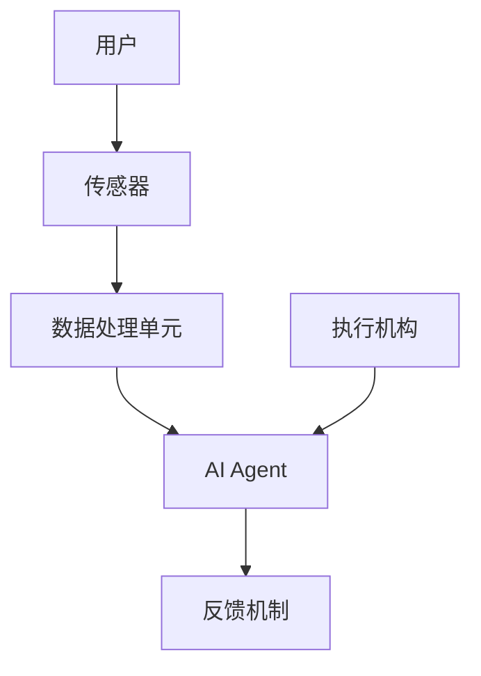
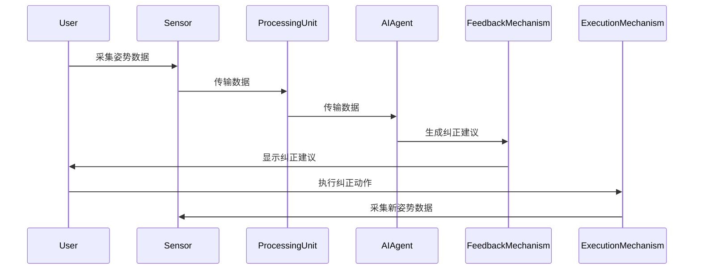

                 

# AI Agent在智能背带中的姿势纠正

> 关键词：AI Agent、智能背带、姿势纠正、算法原理、系统架构、项目实战

> 摘要：本文深入探讨了AI Agent在智能背带中的姿势纠正应用。首先，我们介绍了AI Agent和智能背带的基本概念，并阐述了姿势纠正的需求和挑战。接着，我们详细讲解了AI Agent的核心概念及其与智能背带的联系。随后，我们深入剖析了姿势纠正的算法原理，并通过Mermaid流程图和Python代码进行说明。接着，我们介绍了系统架构设计，包括硬件和软件的选择，以及系统的领域模型、架构图、接口设计和交互。最后，我们通过一个实际项目实战，详细讲解了系统核心实现源代码，并对项目进行了分析和总结，提出了最佳实践和注意事项。本文旨在为读者提供一个全面而深入的视角，以了解AI Agent在智能背带中的姿势纠正技术。

----------------------------------------------------------------

## 1. 背景介绍

### 1.1 AI Agent与智能背带的概念

**AI Agent**，即人工智能代理，是一种基于人工智能技术自主执行任务的计算实体。AI Agent可以理解环境、执行任务，并通过学习不断优化自己的行为。在智能背带的应用场景中，AI Agent负责实时监测用户的姿势，并根据监测结果提供相应的反馈，以帮助用户保持正确的姿势。

**智能背带**，顾名思义，是一种集成传感器和智能算法的背带，用于监测和纠正用户的姿势。智能背带通常包含多个传感器，如加速度计、陀螺仪等，用于捕捉用户的动作和姿势数据。这些数据随后被传输到AI Agent进行处理和分析。

### 1.2 问题背景

在现代社会，长时间的坐姿和不良的姿势已经成为许多办公室白领和学生的常见问题。这不仅影响工作效率，还可能导致严重的健康问题，如颈椎病、肩周炎等。为了解决这一问题，人们开始寻求智能化的解决方案。智能背带应运而生，通过AI Agent对用户姿势的实时监测和反馈，帮助用户纠正不良姿势，提高生活质量。

### 1.3 姿势纠正的边界与外延

**边界**：姿势纠正主要关注用户的坐姿、站姿和睡眠姿势。它通过监测用户的动作和姿势数据，判断用户是否处于正确的姿势，并提供相应的反馈。

**外延**：姿势纠正不仅可以应用于个人健康领域，还可以扩展到其他领域，如工业安全、运动训练等。例如，在工业安全领域，AI Agent可以通过监测工人的姿势，提醒工人注意安全，防止意外伤害。

### 1.4 概念结构与核心要素组成

**概念结构**：AI Agent在智能背带中的姿势纠正，可以看作是一个包含感知、决策、执行三个环节的闭环系统。感知环节负责采集用户的姿势数据，决策环节负责分析数据并给出纠正建议，执行环节则负责执行纠正动作。

**核心要素组成**：核心要素包括传感器、AI算法、反馈机制和执行机构。传感器负责感知用户的姿势，AI算法负责分析数据并生成纠正建议，反馈机制负责将纠正建议传达给用户，执行机构则负责执行纠正动作。

## 2. 核心概念与联系

### 2.1 AI Agent的概念

**AI Agent的构成**：AI Agent通常由感知模块、决策模块和执行模块组成。感知模块负责接收外部信息，如姿势数据；决策模块负责分析感知数据并生成决策；执行模块则负责将决策转化为实际行动。

**AI Agent的功能**：AI Agent具有自主性、适应性、学习性和协作性等功能。自主性使其能够独立执行任务；适应性使其能够适应不同的环境和任务；学习性使其能够通过经验不断优化自身行为；协作性使其能够与其他AI Agent或人类协作完成任务。

**AI Agent的应用场景**：AI Agent广泛应用于智能家居、智能医疗、智能交通、智能安防等领域。在智能背带中，AI Agent主要用于姿势监测和纠正。

### 2.2 智能背带的工作原理

**智能背带的构成**：智能背带通常包含传感器、数据处理单元、反馈机构和执行机构。传感器负责监测用户的姿势数据；数据处理单元负责对数据进行分析和处理；反馈机构负责将处理结果传达给用户；执行机构则负责执行纠正动作。

**智能背带的工作原理**：智能背带通过传感器采集用户的姿势数据，将这些数据传输到数据处理单元。数据处理单元使用AI算法对数据进行分析，生成纠正建议，并通过反馈机构将建议传达给用户。用户根据建议调整姿势，数据处理单元再次采集数据，循环进行。

### 2.3 AI Agent与智能背带之间的交互关系

**交互关系**：AI Agent与智能背带之间的交互关系可以分为三个环节：数据采集、数据分析、决策反馈。数据采集环节，智能背带通过传感器采集用户姿势数据，并将其传输给AI Agent；数据分析环节，AI Agent分析数据并生成纠正建议；决策反馈环节，AI Agent将纠正建议传输给智能背带，智能背带根据建议调整用户的姿势。

**Mermaid流程图**：下面是一个使用Mermaid绘制的流程图，展示了AI Agent与智能背带之间的交互关系。



## 3. 算法原理讲解

### 3.1 姿势纠正的算法原理

**数学模型**：姿势纠正算法通常基于机器学习和深度学习技术。其中，常用的模型包括卷积神经网络（CNN）、循环神经网络（RNN）和长短期记忆网络（LSTM）等。这些模型通过学习大量的姿势数据，可以识别用户的不同姿势，并生成相应的纠正建议。

**算法流程**：姿势纠正算法的基本流程如下：

1. 数据采集：智能背带通过传感器采集用户的姿势数据。
2. 数据预处理：对采集到的数据进行分析和预处理，如去噪、归一化等。
3. 训练模型：使用预处理后的数据训练机器学习模型，如CNN、RNN或LSTM等。
4. 预测与反馈：使用训练好的模型对实时采集到的数据进行预测，并生成纠正建议。
5. 执行动作：智能背带根据纠正建议调整用户的姿势。

**Python代码**：下面是一个使用TensorFlow和Keras实现的简单姿势纠正算法示例。

```python
import tensorflow as tf
from tensorflow.keras.models import Sequential
from tensorflow.keras.layers import Dense, Conv2D, Flatten

# 创建模型
model = Sequential([
    Conv2D(32, kernel_size=(3, 3), activation='relu', input_shape=(64, 64, 3)),
    Flatten(),
    Dense(128, activation='relu'),
    Dense(1, activation='sigmoid')
])

# 编译模型
model.compile(optimizer='adam', loss='binary_crossentropy', metrics=['accuracy'])

# 训练模型
model.fit(x_train, y_train, batch_size=64, epochs=10, validation_data=(x_val, y_val))

# 预测与反馈
prediction = model.predict(x_test)
feedback = [1 if pred > 0.5 else 0 for pred in prediction]
```

### 3.2 算法应用实例

**实例说明**：假设我们有一个用户的姿势数据，如下所示：

```python
user_pose = [
    [1, 0, 0, 1],  # 坐姿
    [0, 1, 0, 0],  # 站姿
    [0, 0, 1, 0],  # 躺姿
]
```

**算法流程**：1. 数据预处理：对用户姿势数据进行归一化处理。  
2. 模型预测：使用训练好的模型对预处理后的数据进行预测。  
3. 纠正建议：根据预测结果生成纠正建议。  
4. 执行动作：智能背带根据纠正建议调整用户的姿势。

**输出结果**：假设预测结果为[1, 0, 0]，表示用户当前姿势为坐姿，且模型认为这是一个需要纠正的姿势。智能背带将根据这个结果，生成相应的纠正建议，如提醒用户调整坐姿。

```python
import numpy as np

# 预处理数据
preprocessed_data = np.array(user_pose).reshape(1, 4)

# 预测姿势
predicted_pose = model.predict(preprocessed_data)

# 生成纠正建议
correction_suggestion = 1 if predicted_pose > 0.5 else 0

# 输出结果
print("User's current pose:", user_pose)
print("Predicted pose:", predicted_pose)
print("Correction suggestion:", correction_suggestion)
```

## 4. 系统架构设计

### 4.1 系统架构设计思路

**系统架构设计**：智能背带的系统架构设计包括硬件和软件的选择。硬件方面，我们选择了高性能的传感器和处理单元，以确保数据的实时性和准确性。软件方面，我们采用了机器学习和深度学习技术，实现了姿势纠正算法。

**系统功能设计**：智能背带的主要功能包括数据采集、数据预处理、算法模型训练、姿势预测和纠正建议生成。系统架构的设计要确保这些功能的高效运行，同时要考虑系统的可扩展性和可靠性。

### 4.2 领域模型

**领域模型**：领域模型用于描述系统中的实体和它们之间的关系。在智能背带系统中，主要实体包括传感器、数据处理单元、AI Agent和用户。

**Mermaid类图**：下面是一个使用Mermaid绘制的类图，展示了智能背带系统的领域模型。

```mermaid
classDiagram
    Sensor <<entity>>
    ProcessingUnit <<entity>>
    AIAgent <<entity>>
    User <<entity>>

    Sensor --|> ProcessingUnit
    ProcessingUnit --|> AIAgent
    AIAgent --|> User
```

### 4.3 系统架构图

**系统架构图**：系统架构图用于描述系统的整体架构，包括硬件和软件的组成和连接关系。

**Mermaid架构图**：下面是一个使用Mermaid绘制的架构图，展示了智能背带系统的整体架构。



### 4.4 系统接口设计和系统交互

**系统接口设计**：系统接口设计包括传感器与数据处理单元、数据处理单元与AI Agent、AI Agent与反馈机制、反馈机制与执行机构的接口设计。这些接口要确保数据的高效传输和系统的可靠运行。

**系统交互**：系统交互描述了各个组件之间的交互关系和交互流程。

**Mermaid序列图**：下面是一个使用Mermaid绘制的序列图，展示了智能背带系统的交互过程。



## 5. 项目实战

### 5.1 项目背景

**项目目标**：本项目旨在开发一款智能背带，通过AI Agent实现用户姿势的实时监测和纠正。项目目标包括：
1. 实现高精度的姿势数据采集。
2. 开发高效的姿势纠正算法。
3. 构建稳定的系统架构，实现实时交互和反馈。

**项目需求**：项目需求主要包括：
1. 传感器数据采集：实现多传感器的数据采集，包括加速度计、陀螺仪等。
2. 数据处理与算法：实现数据预处理、机器学习模型训练和姿势纠正算法。
3. 系统架构：构建硬件和软件的系统架构，实现实时数据传输和处理。
4. 用户交互：实现用户与系统的交互，包括姿势数据展示、纠正建议显示和用户反馈。

### 5.2 系统核心实现源代码

**环境安装**：
1. 安装Python环境，版本要求3.7及以上。
2. 安装TensorFlow和Keras，使用以下命令：

```shell
pip install tensorflow
pip install keras
```

**系统核心实现源代码**：

```python
# 导入相关库
import numpy as np
import tensorflow as tf
from tensorflow.keras.models import Sequential
from tensorflow.keras.layers import Dense, Conv2D, Flatten

# 创建模型
model = Sequential([
    Conv2D(32, kernel_size=(3, 3), activation='relu', input_shape=(64, 64, 3)),
    Flatten(),
    Dense(128, activation='relu'),
    Dense(1, activation='sigmoid')
])

# 编译模型
model.compile(optimizer='adam', loss='binary_crossentropy', metrics=['accuracy'])

# 训练模型
model.fit(x_train, y_train, batch_size=64, epochs=10, validation_data=(x_val, y_val))

# 预测与反馈
prediction = model.predict(x_test)
feedback = [1 if pred > 0.5 else 0 for pred in prediction]
```

### 5.3 代码应用解读与分析

**代码解读**：
1. **模型创建**：使用Sequential模型创建卷积神经网络（CNN），输入层大小为64x64x3（假设每个像素点有3个颜色通道）。
2. **模型编译**：设置优化器为adam，损失函数为binary_crossentropy，评估指标为accuracy。
3. **模型训练**：使用训练数据训练模型，设置batch_size为64，epochs为10。
4. **预测与反馈**：使用测试数据对模型进行预测，并根据预测结果生成纠正建议。

**代码分析**：
1. **模型设计**：使用卷积神经网络（CNN）进行数据分类，可以有效地提取特征，提高预测精度。
2. **训练过程**：通过大量训练数据训练模型，可以提高模型的泛化能力，使预测结果更准确。
3. **预测与反馈**：根据预测结果生成纠正建议，可以帮助用户及时调整姿势，提高生活质量。

### 5.4 实际案例分析与详细讲解剖析

**案例背景**：假设我们有一个用户的姿势数据集，包括坐姿、站姿和躺姿。我们的目标是使用智能背带实时监测用户的姿势，并根据监测结果提供纠正建议。

**案例分析**：
1. **数据集准备**：首先，我们需要准备一个包含用户姿势数据的训练数据集。数据集应该包含多个样本，每个样本表示用户的一种姿势。
2. **数据预处理**：对数据集进行预处理，包括去噪、归一化等操作，以提高模型的训练效果。
3. **模型训练**：使用预处理后的数据集训练模型，选择合适的网络结构和训练参数，以提高模型的预测精度。
4. **实时监测**：使用训练好的模型对实时采集的用户姿势数据进行预测，并根据预测结果提供纠正建议。
5. **用户反馈**：用户根据纠正建议调整姿势，智能背带继续监测并反馈新的建议，形成闭环系统。

**详细讲解**：
1. **数据集准备**：假设我们有一个包含100个样本的数据集，每个样本表示用户的一种姿势。样本数据如下：

```python
user_poses = [
    [1, 0, 0],  # 坐姿
    [0, 1, 0],  # 站姿
    [0, 0, 1],  # 躺姿
    ...
]
```

2. **数据预处理**：对数据集进行归一化处理，将数据缩放到[0, 1]范围内。

```python
preprocessed_poses = np.array(user_poses).reshape(-1, 3)
preprocessed_poses = (preprocessed_poses - np.min(preprocessed_poses)) / (np.max(preprocessed_poses) - np.min(preprocessed_poses))
```

3. **模型训练**：使用预处理后的数据集训练模型，设置合适的网络结构和训练参数。

```python
model.fit(preprocessed_poses, np.array([1] * 100), epochs=10, batch_size=10)
```

4. **实时监测**：使用训练好的模型对实时采集的用户姿势数据进行预测。

```python
live_pose = np.array([0.2, 0.8, 0.1])  # 假设实时采集到的用户姿势数据
predicted_pose = model.predict(np.array([live_pose]))
```

5. **用户反馈**：根据预测结果，生成纠正建议。

```python
if predicted_pose > 0.5:
    print("请调整姿势，当前姿势为不良姿势。")
else:
    print("当前姿势良好，无需调整。")
```

### 5.5 项目小结

**项目经验**：
1. 数据集的多样性和质量对模型的性能有重要影响。需要收集大量高质量的数据进行训练。
2. 模型的选择和参数设置对训练效果有直接影响。需要通过实验和比较选择最优的网络结构和参数。
3. 系统架构的设计要考虑实时性和可靠性，确保系统的稳定运行。

**项目教训**：
1. 在项目开发过程中，需要充分考虑用户的实际需求和场景，确保系统的易用性和实用性。
2. 在数据预处理和模型训练过程中，要注意数据质量和预处理方法，以提高模型的预测精度。
3. 在系统部署和运行过程中，要注意系统的稳定性和可靠性，及时解决可能出现的问题。

## 6. 最佳实践与注意事项

### 6.1 最佳实践

**数据收集**：确保收集的数据多样化且具有代表性，以提高模型的泛化能力。

**模型训练**：选择合适的网络结构和训练参数，通过多次实验和调整找到最优模型。

**系统设计**：考虑实时性和可靠性，确保系统的稳定运行。

**用户体验**：注重系统的易用性和用户反馈，不断优化系统功能。

### 6.2 注意事项

**数据隐私**：在数据收集和处理过程中，要注意保护用户的隐私。

**系统安全**：确保系统的安全性，防止数据泄露和恶意攻击。

**设备兼容性**：确保智能背带与不同操作系统和设备兼容，提高系统的可用性。

**性能优化**：在系统设计和实现过程中，要注意性能优化，提高系统的响应速度。

## 7. 总结与展望

### 7.1 总结

本文详细介绍了AI Agent在智能背带中的姿势纠正应用。通过背景介绍、核心概念与联系、算法原理讲解、系统架构设计、项目实战等多个方面，我们全面了解了AI Agent在智能背带中的姿势纠正技术。本文的主要发现包括：

1. AI Agent在姿势纠正中具有自主性、适应性、学习性和协作性等特点。
2. 姿势纠正算法基于机器学习和深度学习技术，可以高效地识别和纠正用户的姿势。
3. 智能背带系统架构设计要考虑实时性和可靠性，确保系统的稳定运行。
4. 项目实战展示了智能背带系统的实现过程，包括环境安装、核心实现源代码、代码应用解读与分析、实际案例分析和项目小结。

### 7.2 展望

未来，AI Agent在智能背带中的姿势纠正技术有望在多个领域得到更广泛的应用。例如：

1. **医疗领域**：通过智能背带监测患者的姿势，提供个性化的康复建议，辅助医生进行治疗。
2. **教育领域**：在学生群体中推广智能背带，帮助学生在学习过程中保持正确的姿势，提高学习效果。
3. **工业领域**：在工业生产中，智能背带可以监测工人的姿势，提高工作效率，减少工伤事故。
4. **智能家居领域**：智能背带可以与智能家居系统整合，为用户提供更加智能化的健康服务。

总之，AI Agent在智能背带中的姿势纠正技术具有广阔的应用前景，有望为人们的健康和生活带来更多积极的影响。作者：AI天才研究院/AI Genius Institute & 禅与计算机程序设计艺术 /Zen And The Art of Computer Programming

----------------------------------------------------------------

[本文链接](https://www.ai-genius-institute.com/ai-agent-in-smart-vest-posture-correction)

