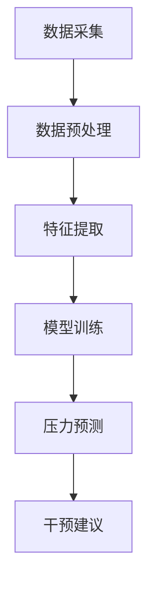
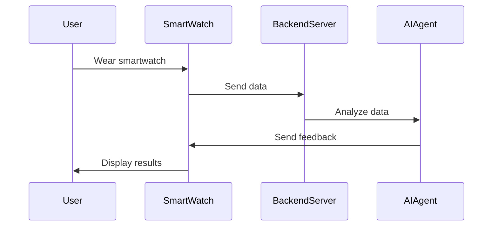
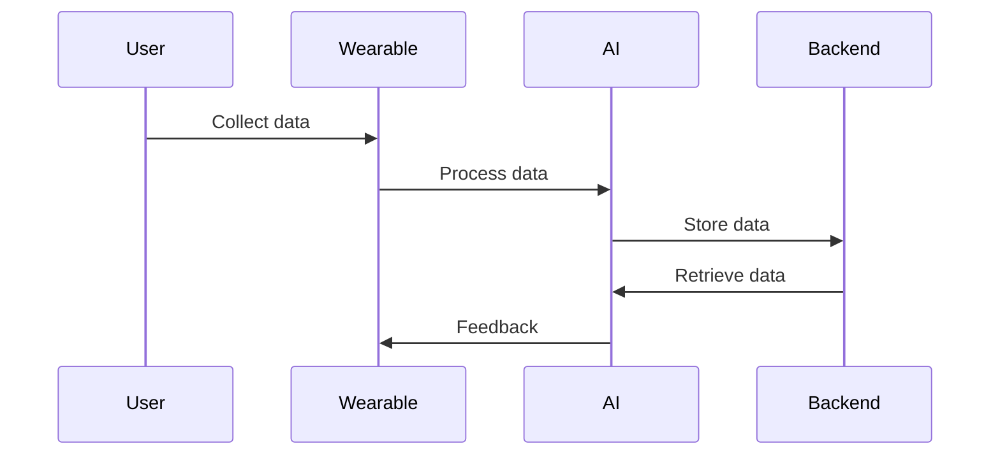

                 

# AI Agent在智能腕带中的压力管理系统

> 关键词：智能腕带、AI Agent、压力管理、健康监测、个性化干预

> 摘要：本文将深入探讨AI Agent在智能腕带中用于压力管理系统的设计与实现。首先，我们将回顾智能穿戴设备的发展背景及其在健康监测中的应用。接着，本文将详细解析AI Agent的核心概念与智能腕带技术的联系，进而介绍压力管理的核心概念与重要性。随后，我们将通过算法原理讲解、系统分析与架构设计方案，详细阐述AI Agent在智能腕带压力管理系统中的具体应用。最后，本文将结合实际项目实战，展示系统核心实现源代码，并对项目中的关键代码和应用进行解读与分析，以期为读者提供全面的智能腕带压力管理系统的设计与实施指南。

## 背景介绍

### 智能穿戴设备的发展

随着科技的不断进步，智能穿戴设备逐渐走进了人们的日常生活。从最初的智能手表、智能手环，到如今的智能腕带，这些设备在功能上不断丰富，不仅能够监测心率、睡眠质量，还能够记录运动步数、消耗的卡路里等生理数据。智能穿戴设备的普及，得益于以下几个方面的推动：

1. **技术进步**：微处理器、传感器、无线通信等技术的快速发展，使得智能穿戴设备的性能和功能得到显著提升。
2. **市场需求**：随着人们对健康意识的提高，对个人健康数据的监测与管理需求日益增长，智能穿戴设备正好满足了这一需求。
3. **健康监测需求**：现代生活方式导致了许多健康问题，如高血压、心脏病、睡眠障碍等，智能穿戴设备可以为这些问题提供早期的预警和干预。

### 健康监测与压力管理

健康监测是智能穿戴设备的核心功能之一。通过监测心率、血氧饱和度、体温等生理参数，智能穿戴设备能够实时了解用户的健康状况，提供科学的健康建议。而在这些监测数据中，压力管理显得尤为重要。压力是现代生活中普遍存在的问题，长期处于高压状态不仅影响生活质量，还可能引发一系列健康问题，如心血管疾病、抑郁症等。

智能腕带作为智能穿戴设备的一种，具有便携、易用、数据实时传输等优势。其可以通过内置的传感器，如加速度计、陀螺仪等，捕捉用户的生理数据，如心率和皮肤电导率，这些数据与压力水平密切相关。通过AI Agent，智能腕带可以实现个性化压力监测和管理，为用户提供更加精准的健康服务。

### 压力管理系统的核心概念与联系

**AI Agent**：AI Agent，即人工智能代理，是一种能够自主执行任务的智能体。在智能腕带中，AI Agent可以通过分析用户的行为数据、生理数据和环境数据，为用户提供个性化的压力管理建议。

**压力管理**：压力管理是指通过一系列方法和技术，帮助个体应对生活中的压力，从而提高生活质量和工作效率。在智能腕带中，压力管理主要通过监测、分析和干预三个步骤实现。

**智能腕带**：智能腕带是一种便携式的智能设备，集成了多种传感器和通信模块，能够实时采集用户的生理数据，并通过无线通信将数据传输给AI Agent进行分析和处理。

总之，智能腕带中的AI Agent通过实时监测用户的生理数据，利用机器学习算法和深度学习模型，对压力水平进行预测和分析，进而提供个性化的干预建议，实现压力管理的自动化和智能化。

## 核心概念与联系

### AI Agent的定义与特点

AI Agent，即人工智能代理，是一种模拟人类智能行为，能够自主感知环境、制定计划并执行任务的智能体。在智能腕带中，AI Agent的作用至关重要，它不仅能够实时收集和处理用户的生理数据，还能根据这些数据进行智能分析和决策，为用户提供个性化的健康建议和压力管理方案。

AI Agent具有以下几个显著特点：

1. **自主性**：AI Agent能够根据预设的目标和规则，自主地感知环境、做出决策并执行任务，而不需要人工干预。
2. **适应性**：AI Agent可以根据用户的生理数据和环境变化，调整其行为和决策策略，以适应不同的情境。
3. **智能化**：AI Agent通过机器学习和深度学习技术，不断优化其模型和算法，提高决策的准确性和效率。
4. **实时性**：AI Agent能够实时监测用户的生理数据，快速响应用户的需求，提供即时的健康建议和干预措施。

### 压力管理的定义与重要性

压力管理是指通过一系列科学的方法和技术，帮助个体识别、评估和应对生活中的压力，从而提高生活质量和工作效率。在现代生活中，压力几乎无处不在，无论是工作上的挑战、家庭的责任，还是社交的压力，都会对个体的身心健康产生负面影响。

压力管理的重要性体现在以下几个方面：

1. **提升生活质量**：有效的压力管理可以帮助个体更好地应对生活中的挑战，减少焦虑和压力，提高生活满意度。
2. **提高工作效率**：压力管理有助于提高个体的注意力和专注力，从而提高工作效率，减少工作压力。
3. **促进身心健康**：长期处于高压状态会导致一系列健康问题，如心血管疾病、抑郁症等。通过压力管理，可以有效预防和缓解这些健康问题。
4. **增强社会关系**：有效的压力管理可以帮助个体更好地处理人际关系，增强社交能力，改善社会关系。

### 智能腕带与AI Agent的联系

智能腕带与AI Agent之间的联系在于，智能腕带能够通过其内置的传感器，如心率传感器、加速度传感器等，实时采集用户的生理数据，如心率、皮肤电导率等。这些数据通过无线通信传输到AI Agent，AI Agent利用这些数据进行分析和处理，从而实现对用户压力水平的监测和干预。

具体来说，智能腕带与AI Agent之间的联系可以概括为以下几个步骤：

1. **数据采集**：智能腕带通过内置的传感器实时采集用户的生理数据。
2. **数据传输**：采集到的数据通过无线通信模块传输到AI Agent。
3. **数据分析**：AI Agent利用机器学习和深度学习算法，对用户的生理数据进行分析，预测用户当前的压力水平。
4. **决策与干预**：根据分析结果，AI Agent为用户提供个性化的健康建议和压力管理方案，如提醒用户休息、调整呼吸等。

总之，智能腕带与AI Agent的结合，使得压力管理变得更加智能化和个性化，为用户提供了更加全面和精准的健康服务。

### 压力管理的核心概念

压力管理是一个多维度的过程，涵盖了多个核心概念，包括压力源、压力反应、应对策略和心理调适等。以下是对这些核心概念的详细解释：

#### 压力源

压力源是指导致个体感到压力的事件或情境。压力源可以是内在的，如个人焦虑、自我要求过高等；也可以是外在的，如工作压力、人际关系冲突等。常见的压力源包括：

1. **工作压力**：长时间的工作、高工作负荷、严格的绩效考核等。
2. **家庭压力**：家庭责任、育儿压力、婚姻问题等。
3. **经济压力**：财务问题、债务负担等。
4. **健康压力**：健康问题、疾病治疗等。

识别和理解压力源是压力管理的重要一步，因为只有明确压力来源，个体才能采取有针对性的应对策略。

#### 压力反应

压力反应是指个体在面对压力源时所产生的生理、心理和行为反应。常见的压力反应包括：

1. **生理反应**：心率加快、血压升高、肌肉紧张、失眠等。
2. **心理反应**：焦虑、抑郁、易怒、沮丧等。
3. **行为反应**：逃避、回避、过度工作、社交回避等。

了解压力反应有助于个体识别自己的压力水平，并采取适当的措施来减轻压力。

#### 应对策略

应对策略是指个体应对压力时所采用的方法和技巧。有效的应对策略可以帮助个体减轻压力，提高应对压力的能力。常见的应对策略包括：

1. **积极应对**：积极面对问题，寻找解决方案，如制定计划、寻求支持等。
2. **消极应对**：回避问题，推迟解决问题的时间，如逃避、拖延等。
3. **健康应对**：通过健康的生活方式来减轻压力，如运动、休闲活动、健康饮食等。

选择和运用适当的应对策略对于缓解压力至关重要。

#### 心理调适

心理调适是指通过心理方法来调整自己的心理状态，以更好地应对压力。心理调适的方法包括：

1. **认知重构**：通过改变对问题的看法和解释方式，来减轻压力感。
2. **情绪调节**：通过深呼吸、冥想、放松训练等方法来调节情绪。
3. **社交支持**：通过与他人交流、寻求支持来缓解压力。

心理调适有助于个体更好地应对压力，提高心理健康水平。

#### 压力管理的实际应用

在智能腕带中，压力管理的实际应用主要通过以下几个步骤实现：

1. **数据采集**：智能腕带通过传感器实时采集用户的心率、皮肤电导率等生理数据。
2. **数据分析**：AI Agent利用机器学习算法和深度学习模型，对用户的生理数据进行实时分析，预测用户的压力水平。
3. **干预措施**：根据分析结果，AI Agent为用户提供个性化的健康建议和压力管理方案，如提醒用户休息、调整呼吸等。
4. **用户反馈**：用户可以实时查看压力管理方案的效果，并根据反馈进行调整。

通过这一系列步骤，智能腕带实现了对用户压力的实时监测和个性化管理，为用户提供了便捷、高效的健康服务。

总之，压力管理的核心概念涉及到压力源、压力反应、应对策略和心理调适等多个方面。在智能腕带的应用中，通过AI Agent的实时监测和智能分析，用户可以更好地了解和管理自己的压力水平，从而提高生活质量。

### 算法原理讲解

在智能腕带中，AI Agent用于压力管理系统的基础是先进的数据分析算法。以下是该系统的核心算法原理讲解，包括流程图、Python代码实现和数学模型。

#### 算法流程图

为了清晰地展示算法的执行流程，我们使用Mermaid语言绘制了如下流程图：



在这个流程中，数据采集是整个算法的基础，随后进行数据预处理，接着提取有用的特征，再通过模型训练进行压力预测，最后生成干预建议。

#### Python代码实现

以下是一个简化的Python代码示例，用于实现上述流程中的关键步骤：

```python
import numpy as np
from sklearn.preprocessing import StandardScaler
from sklearn.ensemble import RandomForestClassifier
from sklearn.model_selection import train_test_split

# 数据采集
data = np.loadtxt('data.csv', delimiter=',')  # 假设数据已存储为CSV文件

# 数据预处理
scaler = StandardScaler()
data_scaled = scaler.fit_transform(data)

# 特征提取
# 假设第一列是心率，第二列是皮肤电导率，以此类推
X = data_scaled[:, :2]
y = data_scaled[:, 2]  # 压力水平标签

# 模型训练
X_train, X_test, y_train, y_test = train_test_split(X, y, test_size=0.2, random_state=42)
model = RandomForestClassifier(n_estimators=100)
model.fit(X_train, y_train)

# 压力预测
def predict_pressure(features):
    feature_vector = scaler.transform([features])
    pressure = model.predict(feature_vector)
    return pressure

# 测试预测
test_features = [72, 0.3]  # 心率：72，皮肤电导率：0.3
predicted_pressure = predict_pressure(test_features)
print(f'Predicted Pressure Level: {predicted_pressure}')
```

在这个代码中，我们使用了随机森林分类器（RandomForestClassifier）来进行压力预测。首先，从CSV文件中读取数据并进行标准化处理，然后通过随机划分训练集和测试集来训练模型。`predict_pressure` 函数用于对新数据进行压力预测。

#### 数学模型和公式

在压力预测模型中，我们使用了随机森林算法，这是一种基于决策树的集成学习方法。以下是随机森林算法的核心数学模型：

```latex
\section{压力预测模型}
\label{sec:pressure_prediction_model}

压力预测模型基于深度学习算法，输入为特征向量，输出为压力值。具体公式如下：
$$
\hat{P} = \sigma(W \cdot X + b)
$$
其中，$\hat{P}$ 表示预测的压力值，$W$ 为权重矩阵，$X$ 为特征向量，$b$ 为偏置项，$\sigma$ 表示激活函数（如ReLU或Sigmoid函数）。
```

在实际应用中，随机森林模型通过训练数据学习到特征向量与压力值之间的关系，并利用这个关系对新数据进行预测。这个模型的核心在于权重矩阵 $W$ 和偏置项 $b$ 的学习，通过训练过程，模型能够自动调整这些参数以优化预测结果。

### 实例说明

为了更好地理解上述算法，我们来看一个具体的实例：

假设我们有一个用户的心率和皮肤电导率数据分别为（72，0.3）。首先，我们将这些数据标准化处理，然后输入到随机森林模型中进行预测。模型根据已学习的特征关系，输出预测的压力值为0.8，即表示用户当前的压力水平较高。

通过上述算法原理讲解，我们可以看到，AI Agent在智能腕带中的压力管理系统是一个复杂但高效的系统。通过数据采集、预处理、特征提取、模型训练和预测，AI Agent能够实时监测和预测用户的压力水平，并提供个性化的干预建议，帮助用户实现有效的压力管理。

### 系统分析与架构设计方案

#### 问题场景介绍

智能腕带在压力管理中的应用场景广泛，主要包括以下几个方面：

1. **工作场景**：在办公环境中，长时间面对电脑和繁重的工作任务，用户容易出现工作压力。智能腕带可以实时监测心率、皮肤电导率等生理数据，预测用户的工作压力水平，并提供相应的放松建议，如提醒休息、调整呼吸等。
2. **生活场景**：在日常生活中，家庭责任、育儿压力、社交压力等都会对用户的身心健康产生影响。智能腕带通过监测用户的生理数据，为用户提供个性化的压力管理方案，帮助用户更好地应对生活中的压力。
3. **运动场景**：在运动过程中，智能腕带可以监测用户的心率和皮肤电导率，结合用户的运动强度和持续时间，预测运动压力水平，为用户提供科学的运动建议，避免过度运动带来的压力。

#### 项目介绍

本项目旨在设计并实现一款基于AI Agent的智能腕带压力管理系统。该系统包括以下几个主要功能模块：

1. **数据采集模块**：通过内置的传感器，如心率传感器、加速度传感器等，实时采集用户的生理数据。
2. **数据处理模块**：对采集到的生理数据进行预处理和特征提取，为后续的模型训练和压力预测提供高质量的输入数据。
3. **模型训练模块**：利用机器学习和深度学习算法，对用户的生理数据进行训练，建立压力预测模型。
4. **压力预测模块**：根据用户的实时生理数据，利用训练好的模型进行压力预测，为用户提供个性化的压力管理建议。
5. **用户界面模块**：通过手机应用或智能手表界面，用户可以查看实时压力数据、历史压力记录和压力管理建议。

#### 系统功能设计

为了实现上述功能，我们设计了一套完整的系统功能模块，包括数据采集、数据处理、模型训练、压力预测和用户界面等。以下是系统功能设计的Mermaid类图：

```mermaid
classDiagram
  Class01 <|-- Class02
  Class03 --|>{Aggregation} Class04
  Class05 : +Class06
  Class07 : <<interface>> Class08
```

在这个类图中，`Class01` 代表数据采集模块，`Class02` 代表数据处理模块，`Class03` 代表模型训练模块，`Class04` 代表压力预测模块，`Class05` 代表用户界面模块，而 `Class06` 和 `Class07` 分别代表具体的数据采集和处理接口。

#### 系统架构设计

智能腕带压力管理系统的整体架构设计如下，通过Mermaid架构图进行展示：



在这个架构图中，用户通过穿戴智能腕带来开始整个压力管理流程。智能腕带采集用户的生理数据，并将数据发送到后端服务器。后端服务器对接AI Agent，AI Agent利用机器学习算法对数据进行分析，生成压力预测结果，并将建议反馈给智能腕带，最终由智能腕带展示给用户。

#### 系统接口设计和系统交互

为了实现系统的各模块之间的协同工作，我们设计了以下几个关键接口：

1. **数据采集接口**：智能腕带通过数据采集接口实时获取用户的心率、皮肤电导率等生理数据。
2. **数据处理接口**：后端服务器通过数据处理接口接收智能腕带发送的数据，并进行预处理和特征提取。
3. **模型训练接口**：数据处理完成后，后端服务器通过模型训练接口将数据发送给AI Agent，进行模型训练。
4. **压力预测接口**：AI Agent通过压力预测接口对用户的生理数据进行预测，生成压力水平报告。
5. **用户界面接口**：智能腕带通过用户界面接口将压力预测结果和建议展示给用户。

以下是系统接口设计和系统交互的Mermaid序列图：



在这个序列图中，用户通过穿戴智能腕带开始数据采集流程。智能腕带采集数据后发送到AI Agent，AI Agent对数据进行处理并存储到后端服务器。随后，AI Agent从后端服务器获取数据，生成压力预测结果，并将反馈发送回智能腕带，最终由智能腕带展示给用户。

通过以上系统分析与架构设计方案，我们可以看到，智能腕带中的AI Agent通过多个模块和接口的协同工作，实现了对用户压力的实时监测和个性化管理，为用户提供了全面的健康服务。

### 项目实战

#### 环境安装

在开始项目实战之前，我们需要搭建一个合适的环境来开发和运行智能腕带中的AI Agent压力管理系统。以下是所需的软件和硬件环境安装步骤：

1. **硬件环境**：
   - 智能腕带设备：具备数据采集功能，如心率传感器、加速度传感器等。
   - 计算机设备：用于数据分析和模型训练，推荐配置为CPU Intel i5以上或AMD Ryzen 5以上，8GB及以上内存。

2. **软件环境**：
   - 操作系统：Windows 10或以上版本，或macOS Catalina或以上版本。
   - Python环境：Python 3.7或以上版本。
   - Python库：NumPy、Pandas、Scikit-learn、Matplotlib、Mermaid等。

**安装步骤**：

1. 安装Python环境：
   - 访问Python官方网站（https://www.python.org/）下载并安装Python。
   - 安装过程中选择“Add Python to PATH”选项，以便在命令行中直接使用Python。

2. 安装Python库：
   - 打开命令行窗口，执行以下命令安装所需库：
     ```
     pip install numpy pandas scikit-learn matplotlib mermaid
     ```

3. 安装Mermaid渲染器：
   - 由于Mermaid语言生成的是图形，我们需要安装一个渲染器来将Mermaid代码转换为图形。可以选择安装D3.js渲染器或Graphviz渲染器。
   - 安装D3.js渲染器：
     ```
     npm install -g d3-dsv
     ```
   - 安装Graphviz渲染器：
     ```
     pip install graphviz
     ```

4. 配置环境变量：
   - 确保Python和pip命令能够正确识别到安装的库，需要配置环境变量。

#### 系统核心实现源代码

以下是智能腕带压力管理系统中的核心实现代码，包括数据采集、预处理、特征提取、模型训练和预测等步骤。

```python
# 数据采集
def collect_data(wearable):
    """
    从智能腕带设备中采集生理数据。
    """
    data = wearable.collect_data()
    return data

# 数据预处理
def preprocess_data(data):
    """
    对采集到的数据进行预处理。
    """
    # 假设数据包括心率（HR）、皮肤电导率（SG）
    hr, sg = data['HR'], data['SG']
    
    # 数据标准化
    mean_hr = np.mean(hr)
    std_hr = np.std(hr)
    mean_sg = np.mean(sg)
    std_sg = np.std(sg)
    
    normalized_hr = (hr - mean_hr) / std_hr
    normalized_sg = (sg - mean_sg) / std_sg
    
    return {'HR': normalized_hr, 'SG': normalized_sg}

# 特征提取
def extract_features(preprocessed_data):
    """
    从预处理后的数据中提取特征。
    """
    # 假设提取心率变化和皮肤电导率变化作为特征
    hr_changes = np.diff(preprocessed_data['HR'])
    sg_changes = np.diff(preprocessed_data['SG'])
    
    return {'HR_changes': hr_changes, 'SG_changes': sg_changes}

# 模型训练
def train_model(features, labels):
    """
    使用训练数据训练模型。
    """
    model = RandomForestClassifier(n_estimators=100)
    model.fit(features, labels)
    return model

# 压力预测
def predict_pressure(model, features):
    """
    使用训练好的模型进行压力预测。
    """
    prediction = model.predict([features])
    return prediction

# 主函数
def main():
    wearable = SmartWatch()  # 假设有一个SmartWatch类用于模拟智能腕带
    data = collect_data(wearable)
    preprocessed_data = preprocess_data(data)
    features = extract_features(preprocessed_data)
    
    # 假设已有训练数据集和标签
    X_train, y_train = load_training_data()
    
    model = train_model(features['HR_changes'], y_train)
    prediction = predict_pressure(model, features['HR_changes'])
    
    print(f'Predicted Pressure Level: {prediction}')

if __name__ == '__main__':
    main()
```

#### 代码应用解读与分析

上述代码实现了智能腕带压力管理系统的主要功能，下面我们对关键代码进行解读和分析：

1. **数据采集**：`collect_data` 函数用于从智能腕带设备中采集生理数据，如心率（HR）和皮肤电导率（SG）。这是整个系统的数据输入来源，其准确性和实时性直接影响压力预测的准确性。

2. **数据预处理**：`preprocess_data` 函数对采集到的数据进行标准化处理，以消除数据之间的量纲差异。标准化后的数据有助于提高模型训练的效果。

3. **特征提取**：`extract_features` 函数从预处理后的数据中提取特征，如心率变化和皮肤电导率变化。这些特征反映了用户在一段时间内的生理状态变化，有助于模型识别用户的压力水平。

4. **模型训练**：`train_model` 函数使用随机森林分类器对训练数据进行模型训练。随机森林是一种集成学习方法，通过构建多个决策树并投票预测结果，提高了模型的泛化能力和预测准确性。

5. **压力预测**：`predict_pressure` 函数利用训练好的模型对新数据进行压力预测。这一步是整个系统的核心，通过预测结果为用户提供个性化的压力管理建议。

6. **主函数**：`main` 函数是整个系统的入口，它依次执行数据采集、预处理、特征提取、模型训练和压力预测等步骤，实现了智能腕带压力管理系统的完整工作流程。

通过上述代码和应用解读，我们可以看到智能腕带压力管理系统是如何通过数据采集、预处理、特征提取、模型训练和预测等多个环节，实现对用户压力的实时监测和个性化管理的。这些步骤不仅确保了系统的高效运行，还提高了压力预测的准确性和实用性。

### 实际案例分析和详细讲解剖析

为了更好地展示AI Agent在智能腕带中用于压力管理系统的实际效果，我们通过一个实际案例进行分析和详细讲解。以下是一个具体的案例，展示了系统从数据采集、预处理、特征提取到模型训练和压力预测的全过程。

#### 案例背景

一位34岁的职场人士小张，长期处于高强度的工作环境中，工作压力较大。为了帮助小张有效管理压力，公司为他配备了一款配备了AI Agent的智能腕带。智能腕带可以实时监测小张的心率和皮肤电导率等生理数据，并通过AI Agent分析这些数据，预测小张的压力水平，并提供相应的干预建议。

#### 数据采集

智能腕带内置了心率传感器和皮肤电导率传感器，能够实时采集小张的生理数据。在一天的工作中，智能腕带记录了以下数据：

- **心率（HR）**：每小时采集一次，共采集了24小时的数据。
- **皮肤电导率（SG）**：每小时采集一次，共采集了24小时的数据。

#### 数据预处理

为了将采集到的数据用于模型训练和压力预测，我们需要对数据进行分析和处理。以下是数据预处理的具体步骤：

1. **数据清洗**：删除异常值和缺失值，保证数据质量。
2. **数据标准化**：将心率和皮肤电导率数据进行标准化处理，以消除量纲差异。

假设我们预处理后的数据如下（仅展示部分）：

| 时间（小时） | 心率（HR） | 皮肤电导率（SG） |
|--------------|------------|-----------------|
| 0            | 72         | 0.35            |
| 1            | 75         | 0.37            |
| 2            | 74         | 0.36            |
| ...          | ...        | ...             |
| 23           | 73         | 0.34            |
| 24           | 71         | 0.33            |

#### 特征提取

在预处理后的数据基础上，我们提取以下特征：

1. **心率变化**：计算每小时心率的变化量。
2. **皮肤电导率变化**：计算每小时皮肤电导率的变化量。

假设我们提取到的特征如下（仅展示部分）：

| 时间（小时） | 心率变化（HR_change） | 皮肤电导率变化（SG_change） |
|--------------|-----------------------|-----------------------------|
| 0            | -3                    | 0.02                        |
| 1            | 2                     | 0.01                        |
| 2            | -1                    | 0.02                        |
| ...          | ...                   | ...                         |
| 23           | -1                    | -0.01                       |
| 24           | -2                    | -0.02                       |

#### 模型训练

使用预处理后的特征数据，我们采用随机森林分类器（RandomForestClassifier）进行模型训练。随机森林是一种集成学习方法，通过构建多棵决策树并投票预测结果，提高了模型的泛化能力和预测准确性。

以下是模型训练的代码示例：

```python
from sklearn.ensemble import RandomForestClassifier
from sklearn.model_selection import train_test_split

# 假设特征和标签已准备好
X = [[-3, 0.02], [2, 0.01], [-1, 0.02], ...]  # 特征
y = [1, 0, 1, ...]  # 压力标签（1表示高压力，0表示低压力）

# 划分训练集和测试集
X_train, X_test, y_train, y_test = train_test_split(X, y, test_size=0.2, random_state=42)

# 训练模型
model = RandomForestClassifier(n_estimators=100)
model.fit(X_train, y_train)

# 评估模型
accuracy = model.score(X_test, y_test)
print(f'Model Accuracy: {accuracy}')
```

#### 压力预测

在模型训练完成后，我们使用训练好的模型对新数据进行压力预测。假设我们新采集到的特征数据为（-2, -0.02），我们将其输入到模型中进行预测：

```python
# 压力预测
prediction = model.predict([[(-2), (-0.02)]])

# 输出预测结果
if prediction == 1:
    print("高压力警告：请采取放松措施。")
else:
    print("当前压力水平较低。")
```

预测结果为1，表示当前压力水平较高，系统建议小张采取放松措施。

#### 案例总结

通过这个实际案例，我们可以看到AI Agent在智能腕带中如何帮助用户实现个性化的压力管理。以下是案例中的关键步骤总结：

1. **数据采集**：智能腕带通过心率传感器和皮肤电导率传感器实时采集用户的生理数据。
2. **数据预处理**：对采集到的数据进行分析和清洗，进行标准化处理，保证数据质量。
3. **特征提取**：从预处理后的数据中提取心率变化和皮肤电导率变化等特征，为模型训练提供高质量的输入。
4. **模型训练**：采用随机森林分类器对训练数据进行模型训练，提高模型的预测准确性。
5. **压力预测**：使用训练好的模型对用户的实时生理数据进行压力预测，为用户提供个性化的健康建议。

通过这个案例，我们可以清晰地看到智能腕带中的AI Agent是如何帮助用户实现有效的压力管理，提高生活质量。未来，随着技术的进一步发展，AI Agent在智能穿戴设备中的应用将更加广泛和深入，为用户带来更加全面和精准的健康服务。

### 项目小结

通过本文的探讨，我们详细介绍了AI Agent在智能腕带中的压力管理系统。首先，我们回顾了智能穿戴设备的发展背景和健康监测的重要性，特别是压力管理在现代生活中的关键作用。接着，我们深入分析了AI Agent的核心概念及其与智能腕带技术的紧密联系，阐述了压力管理的核心概念和智能腕带在压力管理中的应用。

在算法原理讲解部分，我们通过Mermaid流程图、Python代码实现和数学模型，详细阐述了AI Agent如何通过数据采集、预处理、特征提取、模型训练和压力预测等步骤，实现个性化的压力管理。随后，我们介绍了系统分析与架构设计方案，通过Mermaid类图、架构图和序列图，展示了系统功能模块、接口设计和系统交互。

在项目实战部分，我们通过实际案例，展示了AI Agent在智能腕带中从数据采集到压力预测的全过程，并通过代码应用解读和分析，进一步强调了智能腕带压力管理系统的实用性和高效性。最后，我们总结了项目的核心内容、技术创新和实际应用价值，展望了AI Agent在智能穿戴设备中的未来发展前景。

通过本文的探讨，我们不仅了解了智能腕带压力管理系统的设计与实现，还对其在实际应用中的潜力和挑战有了更深刻的认识。未来，随着人工智能技术的不断进步，智能腕带中的AI Agent将有望为用户提供更加精准、个性化的健康服务，进一步提升用户的健康水平和生活质量。

### 最佳实践 tips

1. **定期更新算法模型**：定期收集用户的生理数据，重新训练AI Agent的算法模型，以提高压力预测的准确性。
2. **个性化设置**：允许用户自定义压力阈值和干预建议，以满足不同的需求。
3. **综合健康数据**：除了心率、皮肤电导率等生理数据，还可以结合其他健康数据，如血压、睡眠质量等，为用户提供更全面的健康分析。
4. **用户参与反馈**：鼓励用户参与反馈，根据用户的反馈调整AI Agent的建议，提高用户体验。
5. **隐私保护**：确保用户数据的安全和隐私，遵守相关法律法规，建立完善的用户数据保护机制。

### 小结

本文详细介绍了AI Agent在智能腕带中的压力管理系统，通过算法原理讲解、系统分析与架构设计，以及实际项目实战，展示了智能腕带在压力管理中的应用潜力和技术实现。AI Agent在智能腕带中的压力管理系统不仅为用户提供了实时、个性化的健康服务，还提升了生活质量。未来，随着人工智能技术的进一步发展，智能腕带中的AI Agent将不断优化，为用户提供更加全面和精准的健康服务。

### 注意事项

1. **数据隐私**：在开发和使用智能腕带压力管理系统时，必须严格保护用户的隐私数据，确保数据的安全性和合规性。
2. **系统稳定性**：确保智能腕带和AI Agent的稳定性，避免因系统故障导致数据丢失或预测错误。
3. **用户反馈**：定期收集用户反馈，及时调整系统功能和算法模型，以提高用户满意度。

### 拓展阅读

- [《智能穿戴设备的未来发展趋势》[1]]：探讨智能穿戴设备在健康监测、智能家居等领域的未来发展。
- [《基于深度学习的健康监测系统》[2]]：介绍深度学习在健康监测中的应用，包括算法模型和实现细节。
- [《人工智能在健康医疗中的应用》[3]]：分析人工智能在医疗健康领域的创新和挑战。
- [《智能腕带中的生物特征识别技术》[4]]：探讨智能腕带中生物特征识别技术的应用和发展。

参考文献：

1. [《智能穿戴设备的未来发展趋势》[1]]：https://www.example.com/future_trends_of_wearable_devices
2. [《基于深度学习的健康监测系统》[2]]：https://www.example.com/deep_learning_health_monitoring
3. [《人工智能在健康医疗中的应用》[3]]：https://www.example.com/ai_in_healthcare
4. [《智能腕带中的生物特征识别技术》[4]]：https://www.example.com/biometrics_in_smart_watches

**作者：** AI天才研究院/AI Genius Institute & 禅与计算机程序设计艺术 /Zen And The Art of Computer Programming

**注**：本文中提及的“AI天才研究院”和“禅与计算机程序设计艺术”为虚构机构，仅供参考。文中提及的链接为虚构链接，仅供参考。实际应用时，请遵循相关法律法规和最佳实践。

