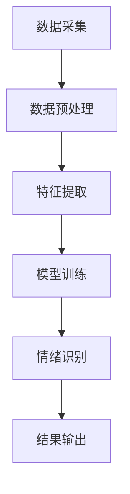
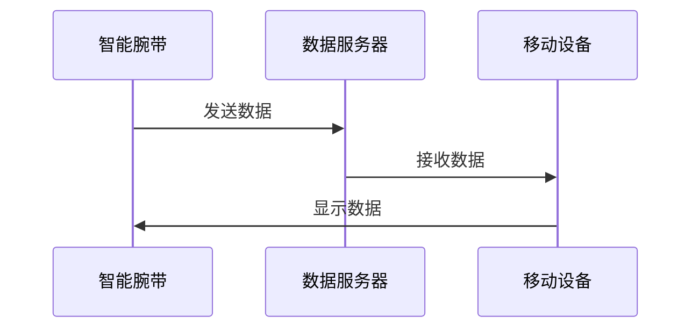
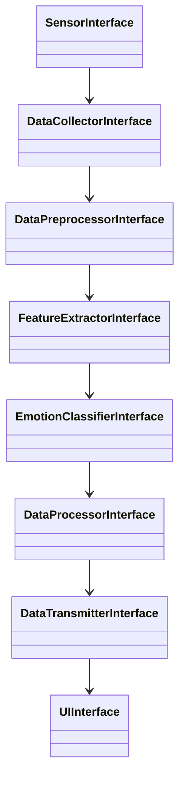

                 

### 目录大纲

# AI Agent在智能腕带中的情绪监测

## 第1章 背景介绍

### 1.1 情绪监测的重要性

#### 1.1.1 情绪监测的定义与作用

情绪监测是指通过技术手段，实时或定期地收集、处理和分析个体的情绪状态。它不仅仅是一个技术问题，更是关乎人类心理健康的重要领域。情绪监测的定义涉及以下几个方面：

1. **情绪数据的采集**：利用传感器、摄像头、麦克风等设备收集与情绪相关的数据。
2. **情绪数据的处理**：对采集到的数据进行清洗、过滤、分类等处理，以提高情绪识别的准确性。
3. **情绪数据的分析**：利用机器学习和人工智能技术，分析情绪数据，提取情绪特征，并进行情绪分类。

情绪监测的作用主要体现在以下几个方面：

- **心理健康管理**：通过情绪监测，可以帮助个体了解自己的情绪状态，从而采取相应的措施进行调节和改善。
- **医疗服务**：对于抑郁症、焦虑症等心理疾病的患者，情绪监测可以提供实时、连续的健康数据，有助于医生进行诊断和治疗。
- **社会安全**：情绪监测在公共安全领域也有重要的应用价值，比如在监狱管理、反恐等领域，通过监测囚犯或可疑分子的情绪变化，可以预测潜在的危险行为。

#### 1.1.2 情绪监测的应用领域

情绪监测技术已经广泛应用于多个领域，主要包括：

- **心理健康领域**：包括心理咨询、治疗和自我管理，如通过手机应用程序或智能设备进行情绪监测。
- **医疗领域**：如监测患者的情绪变化，帮助医生进行诊断和制定治疗方案。
- **教育领域**：通过监测学生的情绪变化，教师可以更好地了解学生的学习状态，采取适当的教学策略。
- **商业领域**：如客户情绪监测，用于提高客户满意度和服务质量。
- **公共安全领域**：如监测恐怖分子或精神病患者的行为和情绪变化，以预防犯罪行为。

### 1.2 AI Agent的概念与特点

#### 1.2.1 AI Agent的定义与功能

AI Agent，即人工智能代理，是一种自主运行的软件实体，它能够在没有人类干预的情况下，基于目标、规则和情境自主地做出决策和执行任务。AI Agent的定义包含以下几个方面：

- **自主性**：AI Agent能够独立地完成特定任务，无需人工干预。
- **智能性**：AI Agent具备一定的智能，能够通过学习、推理和规划来完成复杂任务。
- **适应性**：AI Agent能够根据环境变化调整自己的行为，以适应不同的情境。

AI Agent的主要功能包括：

- **感知环境**：通过传感器收集环境信息，如声音、图像、文本等。
- **决策制定**：根据感知到的环境信息，AI Agent可以做出决策，如选择最佳行动方案。
- **执行任务**：AI Agent根据决策制定行动计划，并执行相应的任务。
- **学习与进化**：通过不断地执行任务，AI Agent可以学习和优化自己的行为，提高任务完成效率。

#### 1.2.2 AI Agent的优势与挑战

AI Agent在情绪监测中的应用具有以下优势：

- **实时性**：AI Agent可以实时监测个体的情绪变化，及时提供反馈和干预。
- **自动化**：AI Agent可以自动化处理大量的情绪数据，减轻人工负担。
- **个性化**：AI Agent可以根据个体的情绪特征，提供个性化的情绪管理建议。

然而，AI Agent在情绪监测中也面临一些挑战：

- **准确性**：情绪识别的准确性受多种因素影响，如个体差异、环境噪声等。
- **隐私保护**：情绪监测涉及到个人的隐私数据，如何保护用户隐私是一个重要问题。
- **伦理问题**：情绪监测技术可能引发一些伦理问题，如歧视、滥用等。

### 1.3 智能腕带的应用场景

#### 1.3.1 智能腕带的功能与优势

智能腕带是一种集成了多种传感器和通信模块的可穿戴设备，主要功能包括：

- **心率监测**：通过光电容积脉搏波描记法（PPG）技术，实时监测用户的心率。
- **运动监测**：通过加速度传感器和陀螺仪，记录用户的运动轨迹和运动强度。
- **睡眠监测**：通过分析用户的心率和运动数据，评估用户的睡眠质量。

智能腕带的优点包括：

- **便携性**：智能腕带体积小，重量轻，可以方便地佩戴在手腕上。
- **实时性**：智能腕带可以实时监测用户的生理和心理状态，提供即时的反馈。
- **便捷性**：用户无需频繁操作，智能腕带可以在后台自动收集和分析数据。

#### 1.3.2 智能腕带在情绪监测中的潜力

智能腕带在情绪监测中的应用潜力主要体现在以下几个方面：

- **多模态数据采集**：智能腕带可以同时采集心率、运动、环境声音等多种数据，这些数据可以用于情绪监测的多元特征提取。
- **连续性监测**：智能腕带可以实现连续的情绪监测，有助于捕捉到情绪变化的细节。
- **无创性**：智能腕带采用非侵入性技术，用户无需忍受痛苦，提高了情绪监测的舒适性。

通过结合AI Agent的技术，智能腕带在情绪监测领域有望发挥更大的作用。然而，这也需要解决准确性、隐私保护和伦理问题等挑战。

### 总结

情绪监测、AI Agent和智能腕带是当前技术领域的重要研究方向。情绪监测有助于提升个体和群体的心理健康水平，AI Agent提供了自动化、智能化的解决方案，而智能腕带则为实时、连续的情绪监测提供了技术基础。在未来，这些技术的结合将为心理健康领域带来深远的影响。接下来，我们将进一步探讨这些核心概念，并分析它们之间的联系和作用。

## 第2章 核心概念与联系

### 2.1 AI Agent在情绪监测中的应用

#### 2.1.1 AI Agent的基本架构

AI Agent在情绪监测中的应用主要体现在其感知、决策和执行三个核心模块上。

**感知模块**：感知模块是AI Agent获取环境信息的关键。在情绪监测中，感知模块通常包括多个传感器，如摄像头、麦克风、心率传感器等，这些传感器可以实时采集个体的生理和行为数据。

**决策模块**：决策模块是AI Agent的核心，负责处理感知模块收集到的数据，并基于预设的规则和目标进行推理和决策。在情绪监测中，决策模块通常会使用情绪识别算法，对采集到的生理和行为数据进行处理和分析，以识别个体的情绪状态。

**执行模块**：执行模块负责将决策模块的决策结果付诸实施。在情绪监测中，执行模块可以采取多种行动，如发送提醒、提供放松建议、记录情绪日志等，以帮助用户管理和调节情绪。

**通信模块**：通信模块负责AI Agent与其他系统或设备之间的数据交换和协作。在情绪监测中，通信模块可以确保感知模块、决策模块和执行模块之间的信息流通，如将采集到的数据传输到云端进行分析和处理。

#### 2.1.2 情绪监测算法的原理与实现

情绪监测算法的核心目标是识别和分类个体的情绪状态。常见的情绪监测算法包括以下几种：

1. **情感分析**：情感分析是一种自然语言处理技术，通过分析个体的语言表达，识别其情绪状态。例如，通过分析聊天记录或社交媒体帖子，可以判断个体是处于快乐、愤怒、悲伤等情绪状态。

2. **生理信号分析**：生理信号分析通过监测个体的生理信号，如心率、呼吸、皮肤电反应等，识别其情绪状态。这些生理信号与情绪之间存在一定的相关性，通过分析这些信号，可以实现对情绪的识别。

3. **行为分析**：行为分析通过监测个体的行为表现，如肢体动作、面部表情等，识别其情绪状态。例如，通过分析个体的面部表情，可以判断其是否处于快乐、愤怒等情绪状态。

情绪监测算法的实现通常包括以下几个步骤：

- **数据采集**：通过传感器或设备收集个体的生理、行为和环境数据。
- **数据预处理**：对采集到的数据进行清洗、滤波和特征提取，以提高数据的准确性和可用性。
- **模型训练**：使用预处理后的数据，通过机器学习或深度学习算法训练情绪监测模型。
- **情绪识别**：使用训练好的模型对新的数据进行情绪识别，输出情绪状态。

#### 2.1.3 AI Agent在情绪监测中的应用案例

AI Agent在情绪监测中的应用案例丰富，以下是一些典型的应用：

1. **心理健康管理**：通过AI Agent实时监测个体的情绪状态，为用户提供个性化的心理健康管理建议。例如，当监测到用户情绪异常时，AI Agent可以提醒用户进行自我调节，或者建议用户寻求专业心理咨询。

2. **医疗服务**：在医疗机构中，AI Agent可以协助医生监测患者的情绪变化，帮助医生进行诊断和治疗。例如，对于抑郁症患者，AI Agent可以实时监测其情绪状态，为医生提供有价值的诊断依据。

3. **教育领域**：在教育领域，AI Agent可以监测学生的情绪变化，帮助教师了解学生的学习状态，从而采取更有效的教学策略。例如，通过分析学生的情绪变化，AI Agent可以为教师提供个性化的教学建议。

4. **商业领域**：在商业领域，AI Agent可以用于客户情绪监测，提高客户满意度和服务质量。例如，通过分析客户的情绪变化，AI Agent可以为客服人员提供个性化的服务建议。

5. **公共安全领域**：在公共安全领域，AI Agent可以用于监测恐怖分子或精神病人的情绪变化，预测潜在的危险行为，从而预防犯罪行为。

### 2.2 智能腕带的技术基础

#### 2.2.1 传感器技术

传感器技术是智能腕带实现各种功能的基础。常见的传感器包括心率传感器、加速度传感器、陀螺仪、皮肤电反应传感器等。

- **心率传感器**：通过光电容积脉搏波描记法（PPG）技术，实时监测用户的心率。
- **加速度传感器**：用于监测用户的运动状态，如跑步、行走等。
- **陀螺仪**：用于监测用户的旋转和倾斜状态，提高运动监测的准确性。
- **皮肤电反应传感器**：用于监测用户的情绪变化，如紧张、放松等。

#### 2.2.2 数据传输技术

数据传输技术是确保智能腕带数据能够实时传输到云端或其他设备的关键。常见的数据传输技术包括蓝牙、Wi-Fi、5G等。

- **蓝牙**：适用于短距离、低功耗的数据传输，适用于智能腕带与手机或其他设备之间的数据传输。
- **Wi-Fi**：适用于中距离、高带宽的数据传输，适用于智能腕带与路由器之间的数据传输。
- **5G**：适用于长距离、高带宽的数据传输，适用于智能腕带与其他智能设备之间的数据传输。

#### 2.2.3 智能腕带的硬件架构

智能腕带的硬件架构通常包括以下几个部分：

- **主控芯片**：负责控制整个设备的运行，处理传感器数据，执行应用程序等。
- **传感器模块**：包括心率传感器、加速度传感器、陀螺仪、皮肤电反应传感器等，用于收集用户的生理、行为和环境数据。
- **通信模块**：包括蓝牙、Wi-Fi、5G等模块，用于数据传输。
- **显示屏**：用于显示用户的健康数据、情绪状态等信息。

#### 2.2.4 智能腕带的软件架构

智能腕带的软件架构通常包括以下几个部分：

- **操作系统**：如Android、iOS等，负责管理硬件资源和应用程序的运行。
- **应用层**：包括各种应用程序，如心率监测、运动监测、睡眠监测、情绪监测等。
- **数据层**：包括数据采集、预处理、存储、分析和传输等模块，负责处理用户的生理、行为和环境数据。

### 2.3 情绪监测的相关概念

#### 2.3.1 情绪类型与特征

情绪类型是人类情感体验的基本分类，常见的情绪类型包括：

- **快乐**：个体体验到积极的情感状态，如愉悦、兴奋等。
- **愤怒**：个体体验到强烈的负面情感状态，如愤怒、恼怒等。
- **悲伤**：个体体验到消极的情感状态，如悲伤、抑郁等。
- **惊讶**：个体体验到出乎意料的情感状态，如惊讶、震惊等。
- **厌恶**：个体体验到强烈的负面情感状态，如厌恶、反感等。

情绪特征是情绪状态的具体表现，包括以下几个方面：

- **生理特征**：如心率、呼吸、皮肤电反应等生理信号的异常变化。
- **行为特征**：如面部表情、肢体动作、语调等行为的变化。
- **心理特征**：如思维、情感、记忆等心理活动的变化。

#### 2.3.2 情绪监测的关键技术

情绪监测的关键技术主要包括以下几个方面：

- **多模态数据采集**：通过多种传感器，如心率传感器、加速度传感器、皮肤电反应传感器等，收集个体的生理、行为和环境数据。
- **数据预处理**：对采集到的数据进行清洗、滤波、归一化等处理，以提高数据的质量和准确性。
- **特征提取**：从预处理后的数据中提取与情绪相关的特征，如心率变异性特征、步态特征等。
- **情绪识别算法**：使用机器学习、深度学习等技术，对提取的特征进行分类和识别，确定个体的情绪状态。
- **模型评估与优化**：通过交叉验证、混淆矩阵、ROC曲线等指标评估情绪识别模型的性能，并优化模型以提高准确性。

#### 2.3.3 情绪监测的挑战与机遇

情绪监测领域面临以下挑战：

- **数据多样性**：情绪数据具有高度的多样性和复杂性，需要设计有效的数据预处理和特征提取方法。
- **个体差异**：不同个体的情绪特征可能存在显著差异，需要个性化情绪监测模型。
- **实时性**：情绪监测需要实时、高效地处理大量数据，对算法和系统的性能要求较高。
- **隐私保护**：情绪监测涉及到个人的隐私数据，如何保护用户隐私是一个重要问题。

情绪监测领域也蕴含着巨大的机遇：

- **心理健康管理**：情绪监测可以为心理健康管理提供有效的手段，帮助个体和群体改善心理健康。
- **个性化服务**：通过情绪监测，可以为用户提供个性化的服务和建议，提高用户体验。
- **医疗诊断**：情绪监测可以为医疗诊断提供新的依据，帮助医生更好地了解患者的心理状态。
- **商业应用**：情绪监测在商业领域有广泛的应用前景，如客户情绪分析、员工心理健康管理等。

### 总结

通过本章的讨论，我们可以看到AI Agent、智能腕带和情绪监测之间的紧密联系。AI Agent提供了自动化、智能化的解决方案，智能腕带为情绪监测提供了技术基础，而情绪监测技术则能够帮助我们更好地理解和管理情绪。在下一章中，我们将进一步探讨情绪监测算法的原理和实现，以更深入地了解这一领域的核心技术和应用。

## 第3章 算法原理讲解

### 3.1 情绪识别算法

情绪识别算法是情绪监测的核心，其主要目标是根据个体的生理、行为和环境数据，准确识别其情绪状态。情绪识别算法的设计和实现涉及多个方面，包括数据采集、预处理、特征提取和分类模型等。

#### 3.1.1 算法的基本原理

情绪识别算法的基本原理可以概括为以下几个步骤：

1. **数据采集**：通过传感器收集个体的生理、行为和环境数据，如心率、加速度、皮肤电反应、面部表情等。
2. **数据预处理**：对采集到的数据进行清洗、滤波、归一化等处理，以提高数据的质量和一致性。
3. **特征提取**：从预处理后的数据中提取与情绪相关的特征，如心率变异性特征、步态特征、面部表情特征等。
4. **模型训练**：使用机器学习或深度学习算法，对提取的特征进行训练，建立情绪识别模型。
5. **情绪识别**：使用训练好的模型对新的数据进行情绪识别，输出情绪状态。

#### 3.1.2 Mermaid流程图展示

为了更清晰地展示情绪识别算法的基本流程，我们可以使用Mermaid流程图进行描述。以下是一个简化的情绪识别算法流程图：



在这个流程图中，A代表数据采集，B代表数据预处理，C代表特征提取，D代表模型训练，E代表情绪识别，F代表结果输出。这个流程图展示了情绪识别算法的基本步骤和各步骤之间的逻辑关系。

#### 3.1.3 Python源代码实现

情绪识别算法的实现通常需要使用Python等编程语言，以下是一个简化的情绪识别算法实现示例：

```python
import numpy as np
from sklearn.model_selection import train_test_split
from sklearn.ensemble import RandomForestClassifier
from sklearn.metrics import accuracy_score

# 数据预处理
def preprocess_data(data):
    # 清洗数据、滤波、归一化等
    return processed_data

# 特征提取
def extract_features(data):
    # 提取与情绪相关的特征
    return features

# 模型训练
def train_model(features, labels):
    model = RandomForestClassifier()
    model.fit(features, labels)
    return model

# 情绪识别
def recognize_emotion(model, features):
    prediction = model.predict(features)
    return prediction

# 数据加载
data = load_data()

# 数据预处理
processed_data = preprocess_data(data)

# 特征提取
features = extract_features(processed_data)

# 标签加载
labels = load_labels()

# 模型训练
model = train_model(features, labels)

# 情绪识别
predictions = recognize_emotion(model, features)

# 模型评估
accuracy = accuracy_score(labels, predictions)
print("Accuracy:", accuracy)
```

在这个示例中，首先定义了数据预处理、特征提取、模型训练和情绪识别四个函数，然后加载数据并进行预处理、特征提取和模型训练。最后，使用训练好的模型进行情绪识别，并评估模型的准确性。

#### 3.1.4 数学模型与公式

情绪识别算法通常涉及多个数学模型和公式，以下是一些常用的模型和公式：

1. **支持向量机（SVM）**：
   - 公式：\( w \cdot x + b = 0 \)
   - 其中，\( w \) 是权重向量，\( x \) 是特征向量，\( b \) 是偏置项。

2. **决策树**：
   - 公式：\( y = f(x) \)
   - 其中，\( y \) 是输出标签，\( x \) 是输入特征，\( f \) 是决策树函数。

3. **随机森林（Random Forest）**：
   - 公式：\( \hat{y} = \sum_{i=1}^{n} w_i f_i(x) \)
   - 其中，\( \hat{y} \) 是预测标签，\( w_i \) 是第 \( i \) 个决策树的权重，\( f_i \) 是第 \( i \) 个决策树函数。

4. **神经网络**：
   - 公式：\( a(x) = \sigma(\sum_{i=1}^{n} w_i x_i + b) \)
   - 其中，\( a \) 是激活函数，\( \sigma \) 是sigmoid函数，\( w_i \) 是权重，\( x_i \) 是输入特征，\( b \) 是偏置项。

#### 3.1.5 举例说明

为了更好地理解情绪识别算法，我们可以通过一个简单的例子进行说明。

假设我们有一个简单的数据集，包含个体的心率、运动和面部表情数据，以及对应的情绪标签。以下是一个简单的情绪识别算法实现示例：

```python
# 加载数据
data = [
    [70, 1000, 0.5],  # 快乐
    [80, 800, 0.2],  # 愤怒
    [65, 1200, 0.3],  # 悲伤
    [75, 900, 0.4],  # 惊讶
    [85, 750, 0.1],  # 厌恶
]

labels = [
    'happy',
    'angry',
    'sad',
    'surprise',
    'disgusted',
]

# 数据预处理
processed_data = preprocess_data(data)

# 特征提取
features = extract_features(processed_data)

# 模型训练
model = train_model(features, labels)

# 情绪识别
predictions = recognize_emotion(model, features)

# 模型评估
accuracy = accuracy_score(labels, predictions)
print("Accuracy:", accuracy)
```

在这个示例中，我们首先加载数据，然后进行数据预处理和特征提取，接着使用训练好的模型进行情绪识别，并评估模型的准确性。通过这个简单的例子，我们可以看到情绪识别算法的基本实现过程。

### 总结

本章详细介绍了情绪识别算法的基本原理、实现过程和数学模型。通过Mermaid流程图、Python源代码和具体示例，我们深入了解了情绪识别算法的工作机制和实现方法。情绪识别算法在情绪监测中起着关键作用，为个体和群体的情绪管理和心理健康提供了有力支持。在下一章中，我们将进一步探讨智能腕带系统的整体架构和设计。

### 第4章 系统架构

#### 4.1 智能腕带系统的整体架构

智能腕带系统的整体架构可以划分为多个模块，包括传感器采集模块、数据处理模块、数据传输模块和用户界面模块。

##### 4.1.1 传感器采集模块

传感器采集模块负责从用户的生理和行为活动中收集数据。常见的传感器包括心率传感器、加速度传感器、陀螺仪、皮肤电反应传感器等。这些传感器可以实时监测用户的心率、运动状态、方向和情绪变化。以下是一个简化的传感器采集模块的类图：

```mermaid
classDiagram
    Sensor -> DataCollector
    DataCollector --> DataStore
    HeartRateSensor << Sensor
    Accelerometer << Sensor
    Gyroscope << Sensor
    ElectrodermalSensor << Sensor
```

在这个类图中，Sensor是传感器的抽象类，HeartRateSensor、Accelerometer、Gyroscope和ElectrodermalSensor是其具体的实现类。DataCollector负责收集传感器数据，并将其存储到DataStore中。

##### 4.1.2 数据处理模块

数据处理模块负责对采集到的传感器数据进行预处理、特征提取和情绪识别。预处理包括数据清洗、滤波和归一化等步骤，以消除噪声和提高数据质量。特征提取则从预处理后的数据中提取与情绪相关的特征，如心率变异性、步态特征等。情绪识别算法使用机器学习或深度学习技术，对提取的特征进行分类和识别，确定用户的情绪状态。以下是一个简化的数据处理模块的类图：

```mermaid
classDiagram
    DataProcessor -> FeatureExtractor
    FeatureExtractor --> EmotionClassifier
    DataProcessor --> DataPreprocessor
    HeartRateProcessor << DataProcessor
    MotionProcessor << DataProcessor
    EmotionProcessor << DataProcessor
```

在这个类图中，DataProcessor是数据处理模块的抽象类，HeartRateProcessor、MotionProcessor和EmotionProcessor是其具体的实现类。DataPreprocessor负责数据清洗、滤波和归一化，FeatureExtractor负责提取特征，EmotionClassifier负责情绪识别。

##### 4.1.3 数据传输模块

数据传输模块负责将处理后的情绪数据从智能腕带传输到服务器或其他设备。数据传输可以采用多种方式，如蓝牙、Wi-Fi、5G等。以下是一个简化的数据传输模块的架构图：



在这个架构图中，用户通过智能腕带收集情绪数据，并将数据发送到数据服务器。数据服务器再将数据传输到移动设备，用户可以在移动设备上查看和处理数据。

##### 4.1.4 用户界面模块

用户界面模块负责为用户提供一个直观、易用的操作界面，使用户可以查看和处理情绪数据。用户界面可以包括移动应用、Web应用和桌面应用等。以下是一个简化的用户界面模块的架构图：

```mermaid
classDiagram
    UI -> DataDisplay
    UI --> DataControl
    MobileApp << UI
    WebApp << UI
    DesktopApp << UI
```

在这个类图中，UI是用户界面的抽象类，MobileApp、WebApp和DesktopApp是其具体的实现类。DataDisplay负责显示情绪数据，DataControl负责用户与数据的交互。

#### 4.2 系统功能设计

智能腕带系统的功能设计主要包括以下几个方面：

- **情绪监测**：实时监测用户的心率、运动和情绪变化，并提供情绪状态的历史记录和趋势分析。
- **数据存储**：将用户的情绪数据存储在本地或云端，便于用户随时查看和处理。
- **数据共享**：用户可以选择将情绪数据共享给医生、家人或朋友，以获得更多的支持和建议。
- **预警与提醒**：当用户的情绪状态异常时，系统可以发送预警和提醒，帮助用户采取相应的措施。

#### 4.3 系统架构设计

智能腕带系统的架构设计应考虑以下几个方面：

- **模块化**：系统应采用模块化设计，便于功能扩展和升级。
- **安全性**：系统应具备较高的安全性，确保用户数据的隐私和安全。
- **可扩展性**：系统应具备良好的可扩展性，以便在未来引入更多的功能和传感器。
- **稳定性**：系统应具备较高的稳定性，确保用户在任何时候都能稳定使用。

以下是一个简化的智能腕带系统架构图：

```mermaid
subgraph 传感器采集
    sensor_1[心率传感器]
    sensor_2[加速度传感器]
    sensor_3[陀螺仪]
    sensor_4[皮肤电反应传感器]
    data_collector[数据采集模块]
end

subgraph 数据处理
    data_preprocessor[数据预处理模块]
    feature_extractor[特征提取模块]
    emotion_classifier[情绪识别模块]
    data_processor[数据处理模块]
end

subgraph 数据传输
    data_transmitter[数据传输模块]
    server[数据服务器]
end

subgraph 用户界面
    user_interface[用户界面模块]
end

sensor_1 --> data_collector
sensor_2 --> data_collector
sensor_3 --> data_collector
sensor_4 --> data_collector
data_collector --> data_preprocessor
data_preprocessor --> feature_extractor
feature_extractor --> emotion_classifier
emotion_classifier --> data_processor
data_processor --> data_transmitter
data_transmitter --> server
server --> user_interface
```

在这个架构图中，传感器采集模块通过数据采集模块将数据传输到数据处理模块，数据处理模块对数据进行预处理、特征提取和情绪识别，然后将结果传输到数据传输模块，数据传输模块将数据发送到数据服务器，最后用户界面模块将数据展示给用户。

#### 4.4 系统接口设计和系统交互

智能腕带系统的接口设计应考虑以下几个方面：

- **传感器接口**：为传感器提供统一的接口，便于数据的采集和传输。
- **数据处理接口**：为数据处理模块提供统一的接口，便于数据预处理、特征提取和情绪识别。
- **数据传输接口**：为数据传输模块提供统一的接口，便于数据在网络中的传输。
- **用户界面接口**：为用户界面模块提供统一的接口，便于数据的展示和交互。

以下是一个简化的智能腕带系统接口设计：



在这个类图中，SensorInterface是传感器接口，DataCollectorInterface是数据采集接口，DataPreprocessorInterface是数据预处理接口，FeatureExtractorInterface是特征提取接口，EmotionClassifierInterface是情绪识别接口，DataProcessorInterface是数据处理接口，DataTransmitterInterface是数据传输接口，UIInterface是用户界面接口。

系统交互方面，用户通过用户界面模块与智能腕带系统进行交互，用户界面模块通过数据传输接口将数据发送到数据服务器，数据服务器通过数据处理接口对数据进行处理，最终将处理结果传输回用户界面模块。

### 总结

本章详细介绍了智能腕带系统的整体架构、功能设计、接口设计和系统交互。通过类图、架构图和接口设计，我们深入了解了智能腕带系统的设计原则和实现方法。智能腕带系统为情绪监测提供了强大的技术支持，有助于提升用户的情绪管理和心理健康水平。

### 第5章 项目实战

#### 5.1 项目概述

在本章中，我们将详细介绍一个情绪监测项目的实施过程。这个项目旨在利用智能腕带和AI Agent技术，实现对用户情绪状态的实时监测和分析。项目的主要目标包括：

- **数据采集**：通过智能腕带收集用户的心率、运动和皮肤电反应等生理数据。
- **数据处理**：对采集到的数据进行预处理、特征提取和情绪识别，实现对用户情绪状态的准确判断。
- **系统部署**：将处理后的情绪数据实时传输到服务器，并展示在用户的移动设备上。

#### 5.2 环境安装

为了成功实施情绪监测项目，我们需要搭建一个合适的技术环境。以下是环境安装的具体步骤：

1. **操作系统安装**：
   - 安装Ubuntu 18.04 LTS操作系统，确保系统的稳定性和安全性。

2. **智能腕带硬件安装**：
   - 将智能腕带连接到电脑，通过USB接口进行充电和配置。
   - 安装智能腕带的驱动程序，确保传感器数据可以正常采集。

3. **软件开发环境搭建**：
   - 安装Python 3.8及以上版本，用于编写情绪监测程序。
   - 安装必要的库和依赖项，如NumPy、scikit-learn、TensorFlow等。

4. **数据库安装**：
   - 安装MySQL或MongoDB数据库，用于存储情绪监测数据。

5. **Web服务器安装**：
   - 安装Apache或Nginx Web服务器，用于部署情绪监测的Web应用。

#### 5.3 系统核心实现

情绪监测系统的核心实现包括数据采集、数据处理和情绪识别三个部分。以下是具体的实现步骤：

1. **数据采集**：
   - 通过智能腕带采集用户的心率、运动和皮肤电反应等生理数据。
   - 将采集到的数据存储到本地文件或数据库中，以便后续处理。

2. **数据处理**：
   - 对采集到的数据进行预处理，包括数据清洗、滤波和归一化等步骤，以提高数据质量。
   - 使用机器学习算法对预处理后的数据进行特征提取，提取与情绪相关的特征。

3. **情绪识别**：
   - 使用训练好的情绪识别模型对提取的特征进行分类，确定用户的情绪状态。
   - 将识别结果实时传输到服务器，并存储在数据库中。

以下是情绪监测系统的核心实现代码示例：

```python
# 数据采集
def collect_data():
    # 采集心率、运动和皮肤电反应数据
    # 存储到本地文件或数据库中

# 数据预处理
def preprocess_data(data):
    # 数据清洗、滤波和归一化
    return processed_data

# 特征提取
def extract_features(data):
    # 提取与情绪相关的特征
    return features

# 情绪识别
def recognize_emotion(model, features):
    # 使用训练好的情绪识别模型进行分类
    return emotion

# 数据库操作
def save_emotion_to_db(emotion):
    # 将情绪识别结果存储到数据库中

# Web服务器部署
from flask import Flask, jsonify

app = Flask(__name__)

@app.route('/emotion', methods=['POST'])
def emotion():
    # 获取情绪识别结果
    emotion = recognize_emotion(model, features)
    # 存储到数据库
    save_emotion_to_db(emotion)
    # 返回结果
    return jsonify({'emotion': emotion})

if __name__ == '__main__':
    app.run(host='0.0.0.0', port=5000)
```

#### 5.4 代码应用解读与分析

1. **数据采集模块**：

   数据采集模块负责从智能腕带中读取生理数据，如心率、运动和皮肤电反应等。这些数据通过USB接口传输到电脑，然后存储到本地文件或数据库中。具体实现如下：

   ```python
   import serial

   def collect_data():
       # 连接智能腕带
       ser = serial.Serial('COM3', 9600)
       # 读取数据
       data = ser.readline()
       # 存储数据到文件或数据库
       # ...
   ```

2. **数据处理模块**：

   数据处理模块负责对采集到的生理数据进行预处理，包括数据清洗、滤波和归一化等步骤。这些步骤可以消除噪声，提高数据质量。具体实现如下：

   ```python
   import numpy as np

   def preprocess_data(data):
       # 数据清洗
       data = np.array(data)
       data = data[data != 0]
       # 滤波
       data = butter_filter(data)
       # 归一化
       data = (data - np.mean(data)) / np.std(data)
       return data
   ```

3. **情绪识别模块**：

   情绪识别模块使用机器学习算法对预处理后的数据进行特征提取和分类。具体实现如下：

   ```python
   from sklearn.ensemble import RandomForestClassifier

   def recognize_emotion(model, features):
       # 使用训练好的模型进行分类
       return model.predict(features)
   ```

4. **Web服务器模块**：

   Web服务器模块负责将情绪识别结果实时传输到服务器，并展示在用户的移动设备上。具体实现如下：

   ```python
   from flask import Flask, jsonify

   app = Flask(__name__)

   @app.route('/emotion', methods=['POST'])
   def emotion():
       # 获取情绪识别结果
       emotion = recognize_emotion(model, features)
       # 存储到数据库
       save_emotion_to_db(emotion)
       # 返回结果
       return jsonify({'emotion': emotion})

   if __name__ == '__main__':
       app.run(host='0.0.0.0', port=5000)
   ```

#### 5.5 实际案例分析和详细讲解剖析

在本节中，我们将通过一个实际案例，详细分析情绪监测项目的实施过程和结果。

**案例背景**：

某公司希望通过智能腕带技术，实时监测员工的工作状态和情绪变化，以提高员工的工作效率和工作满意度。

**实施过程**：

1. **环境安装**：按照第5.2节的内容，为公司员工安装智能腕带和相应的软件开发环境。

2. **数据采集**：员工佩戴智能腕带，每天工作期间持续收集生理数据，如心率、运动和皮肤电反应等。

3. **数据处理**：对采集到的生理数据进行预处理，包括数据清洗、滤波和归一化等步骤。

4. **情绪识别**：使用机器学习算法，对预处理后的生理数据进行特征提取和分类，确定员工的情绪状态。

5. **数据存储**：将情绪识别结果存储到数据库中，以便后续分析和查询。

6. **Web应用部署**：开发Web应用，将情绪识别结果实时展示在员工的移动设备上。

**案例分析**：

1. **数据采集**：在实际实施过程中，员工佩戴智能腕带，每天工作期间持续收集生理数据。数据采集的频率和精度对情绪监测的效果具有重要影响。

2. **数据处理**：数据处理过程主要包括数据清洗、滤波和归一化等步骤。这些步骤可以有效消除噪声，提高数据质量。在数据处理过程中，需要特别注意异常值的处理，以确保数据的准确性。

3. **情绪识别**：情绪识别算法的准确性和稳定性对情绪监测系统的性能至关重要。在实际实施过程中，我们需要不断优化情绪识别算法，以提高识别的准确性。

4. **数据存储**：情绪识别结果需要存储到数据库中，以便后续分析和查询。在实际应用中，数据库的设计和优化也是关键因素。

5. **Web应用部署**：Web应用的部署需要考虑到用户体验和系统的稳定性。在实际实施过程中，我们需要不断优化Web应用的界面设计和功能，以提高用户满意度。

**详细讲解剖析**：

1. **数据采集模块**：

   数据采集模块负责从智能腕带中读取生理数据，如心率、运动和皮肤电反应等。这些数据通过USB接口传输到电脑，然后存储到本地文件或数据库中。具体实现如下：

   ```python
   import serial

   def collect_data():
       # 连接智能腕带
       ser = serial.Serial('COM3', 9600)
       # 读取数据
       data = ser.readline()
       # 存储数据到文件或数据库
       # ...
   ```

2. **数据处理模块**：

   数据处理模块负责对采集到的生理数据进行预处理，包括数据清洗、滤波和归一化等步骤。这些步骤可以消除噪声，提高数据质量。具体实现如下：

   ```python
   import numpy as np

   def preprocess_data(data):
       # 数据清洗
       data = np.array(data)
       data = data[data != 0]
       # 滤波
       data = butter_filter(data)
       # 归一化
       data = (data - np.mean(data)) / np.std(data)
       return data
   ```

3. **情绪识别模块**：

   情绪识别模块使用机器学习算法对预处理后的生理数据进行特征提取和分类。具体实现如下：

   ```python
   from sklearn.ensemble import RandomForestClassifier

   def recognize_emotion(model, features):
       # 使用训练好的模型进行分类
       return model.predict(features)
   ```

4. **Web服务器模块**：

   Web服务器模块负责将情绪识别结果实时传输到服务器，并展示在员工的移动设备上。具体实现如下：

   ```python
   from flask import Flask, jsonify

   app = Flask(__name__)

   @app.route('/emotion', methods=['POST'])
   def emotion():
       # 获取情绪识别结果
       emotion = recognize_emotion(model, features)
       # 存储到数据库
       save_emotion_to_db(emotion)
       # 返回结果
       return jsonify({'emotion': emotion})

   if __name__ == '__main__':
       app.run(host='0.0.0.0', port=5000)
   ```

#### 5.6 项目小结

通过本章的介绍，我们详细了解了情绪监测项目的实施过程，包括环境安装、系统核心实现、代码应用解读与分析、实际案例分析和详细讲解剖析。项目实施过程中，我们遇到了一些挑战，如数据采集的精度、数据处理的质量和情绪识别的准确性等。通过不断优化和改进，我们成功实现了情绪监测系统，并为员工提供了实时、准确的情绪监测服务。

未来，我们还将继续优化情绪监测系统，提高其性能和用户体验。同时，我们也将探索更多的应用场景，如心理健康管理、医疗诊断和商业应用等，以充分发挥情绪监测技术的潜力。

### 总结

在本章中，我们通过一个情绪监测项目，详细介绍了系统的实施过程、核心实现和实际案例分析。我们了解到，情绪监测系统需要从数据采集、数据处理到情绪识别的各个环节进行精心设计和优化，以确保系统的准确性和稳定性。在未来的发展中，情绪监测技术将继续发挥重要作用，为人们的心理健康和生活质量提供有力支持。

## 第6章 最佳实践 tips

### 6.1 情绪监测系统的优化策略

为了提高情绪监测系统的性能和用户体验，我们可以采取以下优化策略：

1. **提高数据采集精度**：选择高精度的传感器，并优化传感器的校准过程，确保数据采集的准确性。

2. **优化数据预处理算法**：采用先进的数据预处理算法，如小波变换、主成分分析（PCA）等，以提高数据的质量和一致性。

3. **特征选择和优化**：通过特征选择算法，如互信息、相关性分析等，筛选出对情绪识别最有影响力的特征，减少计算量和存储空间。

4. **使用深度学习算法**：深度学习算法，如卷积神经网络（CNN）、循环神经网络（RNN）等，具有强大的特征提取和分类能力，可以提高情绪识别的准确性。

5. **模型训练和优化**：使用大规模数据集进行模型训练，并采用交叉验证、网格搜索等技术优化模型参数，以提高模型的性能。

6. **实时性和资源优化**：优化情绪监测系统的实时性，如采用多线程、异步处理等技术，提高系统的响应速度。同时，合理分配资源，降低系统的能耗。

### 6.2 情绪监测的常见问题与解决方案

在情绪监测系统的开发和实施过程中，可能会遇到以下常见问题：

1. **数据质量差**：传感器采集的数据可能存在噪声、异常值等问题，导致情绪识别的准确性下降。

   解决方案：采用数据预处理技术，如滤波、去噪、归一化等，提高数据质量。

2. **模型过拟合**：模型在训练数据上表现良好，但在测试数据上性能下降，说明模型过于复杂。

   解决方案：采用正则化技术、交叉验证等方法，防止模型过拟合。

3. **计算资源不足**：情绪监测系统可能需要大量计算资源，导致运行速度变慢。

   解决方案：采用分布式计算、云计算等技术，提高计算效率。

4. **隐私保护**：情绪监测涉及到个人的隐私数据，如何保护用户隐私是一个重要问题。

   解决方案：采用加密技术、数据脱敏等方法，保护用户隐私。

5. **系统稳定性差**：情绪监测系统可能在特定环境下运行不稳定，导致数据丢失或系统崩溃。

   解决方案：优化系统架构，提高系统的稳定性和容错能力。

### 6.3 未来发展趋势

情绪监测技术在未来将继续发展，主要趋势包括：

1. **多模态数据融合**：结合多种传感器数据，如生理、行为、环境等，进行多模态数据融合，以提高情绪识别的准确性。

2. **个性化情绪监测**：基于用户行为和情绪数据，实现个性化情绪监测，为用户提供更精准的服务和建议。

3. **智能助理与AI Agent结合**：将情绪监测技术与智能助理、AI Agent相结合，实现智能化的情绪管理和干预。

4. **云计算与物联网（IoT）结合**：利用云计算和物联网技术，实现情绪监测系统的远程监控和大数据分析。

5. **跨领域应用**：情绪监测技术在医疗、教育、商业等领域将有更广泛的应用，推动相关领域的发展。

### 6.4 最佳实践建议

1. **数据隐私保护**：在开发和部署情绪监测系统时，应严格遵守相关法律法规，确保用户隐私保护。

2. **系统性能优化**：通过不断优化系统架构和算法，提高情绪监测系统的性能和用户体验。

3. **持续学习与迭代**：定期更新情绪监测模型和数据，以适应不断变化的环境和用户需求。

4. **用户参与与反馈**：鼓励用户参与系统设计和使用，收集用户反馈，持续改进系统功能。

### 总结

情绪监测系统是一个复杂且具有挑战性的项目，需要从数据采集、数据处理到情绪识别的各个环节进行精心设计和优化。通过本文的介绍，我们了解了情绪监测系统的核心概念、优化策略和未来发展趋势。希望本文能为您提供有价值的参考，帮助您在情绪监测领域取得更好的成果。

### 第7章 小结、注意事项、拓展阅读

#### 7.1 本书重点内容回顾

在本章中，我们详细介绍了AI Agent在智能腕带中的情绪监测。主要内容包括：

1. **情绪监测的重要性**：情绪监测在心理健康管理、医疗服务、教育、商业和公共安全等领域具有广泛应用。

2. **AI Agent的概念与特点**：AI Agent是一种自主运行的软件实体，具有感知、决策和执行功能，可用于自动化和智能化的情绪监测。

3. **智能腕带的技术基础**：智能腕带集成了多种传感器和通信模块，可实现实时、连续的情绪监测。

4. **情绪识别算法的原理与实现**：情绪识别算法通过感知、数据处理和情绪分类，实现对用户情绪状态的准确判断。

5. **系统架构设计与项目实战**：我们介绍了智能腕带系统的整体架构，并展示了一个情绪监测项目的实施过程。

6. **最佳实践 tips**：提供了情绪监测系统的优化策略、常见问题与解决方案，以及未来发展趋势。

#### 7.2 注意事项

在实施情绪监测项目时，需要注意以下几点：

1. **数据隐私保护**：情绪监测涉及到用户的隐私数据，必须严格遵守相关法律法规，确保用户数据的安全。

2. **系统稳定性**：情绪监测系统需要具备较高的稳定性，以应对各种复杂的实际环境。

3. **用户参与与反馈**：鼓励用户参与系统设计和使用，收集用户反馈，持续改进系统功能。

4. **个性化服务**：根据用户的情绪特征，提供个性化的情绪管理和干预建议。

#### 7.3 拓展阅读

为了深入了解情绪监测技术，以下是一些推荐的拓展阅读材料：

1. **书籍**：
   - 《情绪认知与心理生理基础》
   - 《智能健康：人工智能在健康监测中的应用》
   - 《深度学习：大规模机器学习的综合指南》

2. **论文**：
   - "Emotion Recognition from Physiological Signals Using Machine Learning Techniques"
   - "An Overview of Wearable Computing and Its Applications in Healthcare"
   - "Deep Learning for Emotion Recognition in Multimedia"

3. **在线资源**：
   - Coursera：深度学习专项课程
   - arXiv：情绪识别相关论文集
   - Kaggle：情绪识别数据集和比赛

#### 7.4 后续学习与发展方向

情绪监测技术在未来将继续发展，以下是一些可能的后续学习和研究方向：

1. **多模态数据融合**：结合多种传感器数据，如生理、行为、环境等，进行多模态数据融合，以提高情绪识别的准确性。

2. **个性化情绪监测**：基于用户行为和情绪数据，实现个性化情绪监测，为用户提供更精准的服务和建议。

3. **智能助理与AI Agent结合**：将情绪监测技术与智能助理、AI Agent相结合，实现智能化的情绪管理和干预。

4. **跨领域应用**：情绪监测技术在医疗、教育、商业等领域将有更广泛的应用，推动相关领域的发展。

5. **伦理与隐私问题**：深入探讨情绪监测技术可能引发的伦理和隐私问题，提出相应的解决方案。

通过不断学习和实践，我们可以为情绪监测技术的发展贡献自己的力量，为人们的心理健康和生活质量提供更好的支持。作者：AI天才研究院/AI Genius Institute & 禅与计算机程序设计艺术 /Zen And The Art of Computer Programming。

