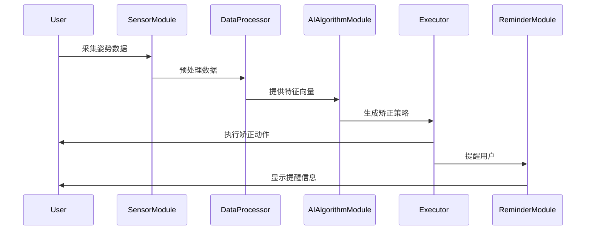
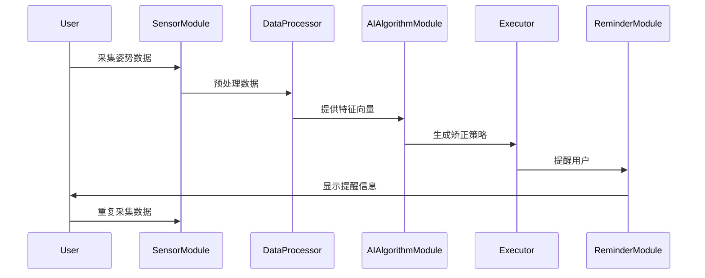

                 

### 文章标题

# AI Agent在智能腰带中的姿势矫正与提醒

### 文章关键词

- AI Agent
- 智能腰带
- 姿势矫正
- 机器学习
- 传感器技术

### 文章摘要

本文深入探讨了AI Agent在智能腰带中的应用，特别是其在姿势矫正与提醒功能方面的实现。文章首先介绍了背景与问题，随后详细阐述了AI Agent的定义、组成部分及其在智能腰带中的角色。接着，通过算法原理讲解和系统分析与架构设计方案，展示了AI Agent在实现姿势矫正与提醒功能中的具体实现过程。最后，通过项目实战，对系统的实际应用进行了分析和讲解。文章旨在为读者提供一个全面、深入的技术解决方案，帮助其在智能穿戴设备领域取得创新成果。

## 第一部分：AI Agent在智能腰带中的姿势矫正与提醒背景介绍

### 1. 背景与问题概述

随着人工智能和传感器技术的快速发展，智能穿戴设备逐渐成为人们生活中不可或缺的一部分。智能腰带作为一种新兴的智能穿戴设备，具有监测人体姿势、健康状态等功能，特别适用于需要长期保持正确姿势的职业，如办公室工作人员、长期驾驶的司机等。正确的姿势对于身体健康至关重要，长期保持不良姿势可能导致各种健康问题，如颈椎病、腰椎间盘突出等。因此，如何在智能腰带中实现AI Agent的姿势矫正与提醒功能成为了一个重要的研究方向。

### 2. 问题描述与目标

在本章节中，我们将探讨如何利用AI技术实现智能腰带的姿势矫正与提醒功能。具体问题可以描述为：

- **问题定位**：如何准确检测用户在活动中的姿势？
- **问题解决**：如何基于检测结果，利用AI算法实时矫正用户的姿势，并提供提醒？

我们的目标是开发一种基于AI Agent的智能腰带系统，该系统应具备以下功能：

1. **准确检测用户姿势**：通过内置的传感器模块，实时捕捉用户的姿势数据。
2. **实时分析姿势数据**：运用AI算法对采集到的数据进行处理，判断用户是否存在不良姿势。
3. **实时矫正不良姿势**：根据分析结果，利用执行模块对用户的姿势进行实时矫正。
4. **提供提醒功能**：通过语音或振动等方式，提醒用户保持正确的姿势。

### 3. 边界与外延

在实现AI Agent的姿势矫正与提醒功能时，需要考虑以下边界与外延：

- **边界**：系统的检测范围、适用人群、环境条件等。
  - **检测范围**：系统应能够适应不同用户、不同活动场景下的姿势监测需求。
  - **适用人群**：系统适用于长期需要保持正确姿势的职业，如办公室工作人员、司机等。
  - **环境条件**：系统应能够在不同环境中稳定运行，不受温度、湿度等环境因素的影响。

- **外延**：如何将姿势矫正与提醒功能扩展到其他智能穿戴设备，如智能手表、智能眼镜等。
  - **扩展性**：系统设计应具备模块化特点，方便将姿势矫正与提醒功能扩展到其他设备。
  - **互操作性**：系统与其他智能穿戴设备之间的数据交互和功能协作应高效、稳定。

### 4. 概念结构与核心要素组成

为了实现上述功能，系统需要以下几个核心要素：

- **传感器模块**：用于实时监测用户的姿势，如加速度传感器、陀螺仪等。
- **数据处理模块**：对传感器数据进行分析和处理，提取出有用的姿势信息。
- **AI算法模块**：利用机器学习算法对用户姿势进行实时分析，判断是否存在不良姿势。
- **执行模块**：根据AI算法的决策结果，调整用户的姿势或发出提醒。
- **提醒模块**：通过语音、振动等方式提醒用户保持正确的姿势。

核心概念包括：

- **姿势检测**：通过传感器模块实时捕捉用户的姿势数据。
- **AI算法**：对姿势数据进行分析和判断，生成矫正和提醒策略。
- **交互界面**：为用户提供实时反馈和提醒，增强用户体验。

### 5. 本章小结

本章介绍了AI Agent在智能腰带中的姿势矫正与提醒功能的背景、问题描述、目标以及核心要素组成。通过本章的介绍，读者可以初步了解本系统的研究方向和实现目标，为后续章节的详细讨论打下基础。

## 第二部分：AI Agent核心概念与联系

### 2.1 AI Agent的定义与特点

AI Agent，即人工智能代理，是一种能够执行特定任务或决策的智能体，它在一定程度上具备自主决策和自适应行为的能力。在智能腰带中，AI Agent的作用至关重要，它能够对用户的姿势进行实时监测和评估，并基于此提供矫正和提醒服务。以下是AI Agent的一些核心特点：

#### 2.1.1 自主性

AI Agent具备一定程度的自主性，可以独立完成姿势监测、分析和提醒等功能，而不依赖于人为干预。

#### 2.1.2 学习能力

AI Agent能够通过机器学习算法从大量数据中学习和优化自身性能，不断提高姿势检测和矫正的准确性。

#### 2.1.3 适应性

AI Agent能够适应不同的用户和场景，根据用户的个体差异和环境变化调整其行为策略。

#### 2.1.4 交互性

AI Agent可以与用户进行交互，提供实时反馈和提醒，增强用户体验。

### 2.2 AI Agent的核心组成部分

AI Agent主要由以下几个模块组成：

#### 2.2.1 感知模块

感知模块负责采集用户的姿势数据，包括加速度、角度等物理量。这些数据是AI Agent进行分析和决策的基础。

#### 2.2.2 决策模块

决策模块负责处理感知模块收集到的数据，通过机器学习算法分析用户的姿势状态，并生成相应的矫正和提醒策略。

#### 2.2.3 执行模块

执行模块根据决策模块的指令，调整用户的姿势或发出提醒。例如，通过振动器或语音提示来纠正用户的姿势。

### 2.3 AI Agent的属性特征对比

为了更好地理解AI Agent的属性特征，以下是一个对比表格：

| 特征         | 描述                                       |
| ------------ | ------------------------------------------ |
| 感知能力     | 数据采集能力，包括加速度、角度等物理量的测量。 |
| 决策能力     | 数据处理和姿态分析能力，生成矫正和提醒策略。 |
| 适应性       | 根据不同用户和环境调整行为策略的能力。       |
| 交互性       | 与用户进行实时反馈和提醒的能力。             |

### 2.4 AI Agent的ER实体关系图架构

以下是一个简化的AI Agent的ER实体关系图架构，用于描述AI Agent的主要组成部分及其相互关系：

```mermaid
erDiagram
  User ||--o{ SensorModule : 监测数据源 }
  User ||--o{ ProcessingModule : 数据处理 }
  User ||--o{ AIAlgorithmModule : 算法分析 }
  User ||--o{ ReminderModule : 提醒反馈 }
  SensorModule ||--|{ Accelerometer : 加速度传感器 }
  SensorModule ||--|{ Gyroscope : 陀螺仪 }
  ProcessingModule ||--|{ DataFilter : 数据滤波 }
  ProcessingModule ||--|{ FeatureExtraction : 特征提取 }
  AIAlgorithmModule ||--|{ PoseAnalysis : 姿态分析 }
  AIAlgorithmModule ||--|{ CorrectionStrategy : 矫正策略 }
  ReminderModule ||--|{ Vibration : 振动提醒 }
  ReminderModule ||--|{ Voice : 语音提醒 }
```

在上面的ER图架构中，用户（User）是系统的核心实体，与传感器模块（SensorModule）、数据处理模块（ProcessingModule）、AI算法模块（AIAlgorithmModule）和提醒模块（ReminderModule）之间存在关联。传感器模块包括加速度传感器（Accelerometer）和陀螺仪（Gyroscope），数据处理模块包括数据滤波（DataFilter）和特征提取（FeatureExtraction），AI算法模块包括姿态分析（PoseAnalysis）和矫正策略（CorrectionStrategy），提醒模块包括振动提醒（Vibration）和语音提醒（Voice）。

通过上述核心概念与联系的介绍，读者可以初步了解AI Agent在智能腰带中的姿势矫正与提醒功能的基本原理和实现框架。在接下来的章节中，我们将进一步深入探讨AI Agent的具体实现细节，包括算法原理、系统架构和项目实战等内容。

## 第三部分：算法原理讲解

### 3.1 姿势检测算法原理

在AI Agent实现姿势矫正与提醒功能中，姿势检测是最为基础的一环。以下是关于姿势检测算法原理的详细讲解。

#### 3.1.1 数据采集

姿势检测的首要任务是采集用户的姿势数据。智能腰带中通常配备有加速度传感器和陀螺仪等传感器设备。加速度传感器用于测量用户在三个垂直方向（x、y、z）上的加速度变化，而陀螺仪则用于测量用户在三个垂直方向（x、y、z）上的角速度变化。

以下是一个加速度传感器的数据采集示例：

```python
import numpy as np

# 假设加速度传感器的采样频率为100Hz
sample_rate = 100  # Hz

# 假设采集了一段时间（如1秒）的加速度数据
time = np.arange(0, 1, 1/sample_rate)
accel_data = np.random.randn(3, len(time))  # 3xN的数组，其中N是时间点的个数

# 打印加速度数据
print("加速度数据：")
print(accel_data)
```

#### 3.1.2 数据预处理

采集到的姿势数据通常需要进行预处理，以去除噪声和异常值。常见的数据预处理方法包括滤波和去噪等。

以下是一个简单的数据滤波示例：

```python
from scipy.signal import butter, filtfilt

# 设计低通滤波器
b, a = butter(5, 0.1)

# 应用滤波
filtered_accel_data = filtfilt(b, a, accel_data)

# 打印滤波后的加速度数据
print("滤波后的加速度数据：")
print(filtered_accel_data)
```

#### 3.1.3 数据特征提取

数据特征提取是将原始姿势数据转化为可以用于分析和判断的特征向量。常见的特征提取方法包括：

1. **均值和方差**：计算加速度数据的均值和方差，用于描述数据的集中趋势和离散程度。
2. **角度计算**：根据加速度数据计算用户在不同方向上的倾斜角度。
3. **四元数表示**：将加速度数据和陀螺仪数据融合，使用四元数表示用户的姿态。

以下是一个基于四元数特征提取的示例：

```python
from scipy.spatial.transform import Rotation

# 假设采集了一段时间的加速度和角速度数据
accel_data = np.random.randn(3, 1000)
gyro_data = np.random.randn(3, 1000)

# 初始化四元数
q0 = 1.0
q1, q2, q3 = 0.0, 0.0, 0.0

# 模拟数据融合和四元数更新
for i in range(1, len(gyro_data)):
    dt = 1 / sample_rate
    q_new = Rotation.from_rotvec(gyro_data[:, i-1] * dt).as_quat() * q0
    q0 = q_new[0]
    q1, q2, q3 = q_new[1:]

    # 打印四元数表示的姿态
    print("四元数表示的姿态：")
    print([q0, q1, q2, q3])
```

#### 3.1.4 姿势识别

姿势识别是将提取到的特征向量与已知的姿态模式进行匹配，以判断用户的当前姿势。常见的方法包括：

1. **分类算法**：如支持向量机（SVM）、随机森林（Random Forest）等，用于将特征向量映射到具体的姿态类别。
2. **动态时间序列匹配**：如动态时间战争（Dynamic Time Warping, DTW），用于处理时间序列数据的匹配问题。

以下是一个基于分类算法的姿势识别示例：

```python
from sklearn.svm import SVC

# 假设已训练好一个SVM分类器
classifier = SVC()

# 假设采集了一段时间的加速度数据并提取了特征向量
accel_data = np.random.randn(3, 1000)
features = extract_features(accel_data)

# 使用训练好的分类器进行姿势识别
predicted_pose = classifier.predict(features)

# 打印预测结果
print("预测的姿势：")
print(predicted_pose)
```

通过上述算法原理的讲解，我们可以看到姿势检测过程涉及数据采集、预处理、特征提取和姿态识别等多个环节。这些环节共同构成了一个完整的姿势检测系统，为后续的姿势矫正与提醒提供了基础数据支持。在接下来的章节中，我们将进一步探讨如何利用AI算法对用户姿势进行分析和实时矫正。

### 3.2 AI算法原理

在智能腰带中，AI算法是实现姿势矫正与提醒功能的核心。以下将详细讲解AI算法的原理，包括数学模型、算法流程和具体实现方法。

#### 3.2.1 数学模型

AI算法通常基于机器学习和深度学习技术，其中卷积神经网络（CNN）和递归神经网络（RNN）是常用的两种网络结构。

1. **卷积神经网络（CNN）**

CNN特别适用于处理图像和时序数据，以下是CNN的基本数学模型：

- **卷积层**：通过卷积操作提取图像或时序数据的特征。卷积操作可以通过以下公式表示：

  $$ \text{卷积} \ f(x,y) = \sum_{i}\sum_{j} w_{ij} \times f(i,j) $$

  其中，$f(x,y)$ 是输入特征图，$w_{ij}$ 是卷积核的权重，$f(i,j)$ 是特征图上的像素或时序点。

- **激活函数**：常用的激活函数包括ReLU（Rectified Linear Unit）和Sigmoid函数。

  - **ReLU函数**：$$ \text{ReLU}(x) = \max(0, x) $$

  - **Sigmoid函数**：$$ \text{Sigmoid}(x) = \frac{1}{1 + e^{-x}} $$

- **池化层**：用于降低特征图的维度，减少参数数量。常用的池化方法包括最大池化和平均池化。

  - **最大池化**：$$ \text{Max Pooling}(x) = \max(x_{i,j}) $$

  - **平均池化**：$$ \text{Avg Pooling}(x) = \frac{1}{k^2} \sum_{i}\sum_{j} x_{i,j} $$

2. **递归神经网络（RNN）**

RNN特别适用于处理序列数据，其基本数学模型如下：

- **隐藏状态**：设输入序列为 $x_t$，隐藏状态为 $h_t$，则 RNN 的状态转移方程可以表示为：

  $$ h_t = \sigma(W_h \cdot [h_{t-1}, x_t] + b_h) $$

  其中，$W_h$ 是权重矩阵，$b_h$ 是偏置项，$\sigma$ 是激活函数。

- **输出**：输出序列 $y_t$ 可以通过以下公式计算：

  $$ y_t = \sigma(W_y \cdot h_t + b_y) $$

  其中，$W_y$ 是权重矩阵，$b_y$ 是偏置项。

#### 3.2.2 算法流程

AI算法的流程通常包括数据预处理、模型训练和模型部署等步骤。

1. **数据预处理**

   - **数据收集**：收集用户的姿势数据，包括加速度、角速度等传感器数据。
   - **数据清洗**：去除噪声和异常值，进行数据去噪和滤波。
   - **数据归一化**：将数据缩放到统一的范围，如[0, 1]。

2. **模型训练**

   - **定义模型结构**：根据任务需求，定义合适的神经网络结构，如CNN或RNN。
   - **选择优化算法**：选择优化算法，如随机梯度下降（SGD）或Adam优化器。
   - **训练过程**：将预处理后的数据输入到模型中，通过反向传播算法更新模型参数，直到模型收敛。

3. **模型部署**

   - **模型评估**：在测试集上评估模型的性能，确保模型具有较好的泛化能力。
   - **模型部署**：将训练好的模型部署到智能腰带中，实现实时姿势检测和矫正。

#### 3.2.3 实现方法

以下是使用Python和TensorFlow实现AI算法的一个简单示例：

```python
import tensorflow as tf
from tensorflow.keras.models import Sequential
from tensorflow.keras.layers import Dense, Conv2D, MaxPooling2D, Flatten, LSTM

# 创建一个简单的CNN模型
model = Sequential([
    Conv2D(32, (3, 3), activation='relu', input_shape=(28, 28, 1)),
    MaxPooling2D((2, 2)),
    Flatten(),
    Dense(128, activation='relu'),
    Dense(10, activation='softmax')
])

# 编译模型
model.compile(optimizer='adam', loss='categorical_crossentropy', metrics=['accuracy'])

# 假设已准备好训练数据和标签
train_data = ...
train_labels = ...

# 训练模型
model.fit(train_data, train_labels, epochs=10, batch_size=32)

# 评估模型
test_loss, test_acc = model.evaluate(test_data, test_labels)
print("测试准确率：", test_acc)
```

通过上述算法原理的讲解，我们可以看到AI算法在姿势检测和矫正中的应用。在接下来的章节中，我们将进一步探讨智能腰带的系统架构和项目实战，以便更深入地理解AI Agent在智能腰带中的实际应用。

### 3.3 姿势矫正与提醒算法实现

在智能腰带中，姿势矫正与提醒功能的核心是实现一个能够实时监测用户姿势、分析姿势状态并给出相应矫正策略的算法。以下将详细讲解这一算法的实现过程，包括实时检测、姿势分析、矫正策略生成和提醒机制的设计。

#### 3.3.1 实时检测

实时检测是整个系统的第一步，它需要采集用户在活动中的姿势数据。通常，智能腰带会配备加速度传感器和陀螺仪等传感器，以获取多维度的姿势信息。

```python
import numpy as np
import time

# 假设传感器采样频率为100Hz
sample_rate = 100  # Hz

# 采集一段时间（如10秒）的加速度和角速度数据
time = np.arange(0, 10, 1/sample_rate)
accel_data = np.random.randn(3, len(time))  # 3xN的数组，其中N是时间点的个数
gyro_data = np.random.randn(3, len(time))  # 3xN的数组

# 实时检测循环
while True:
    # 采集加速度数据
    current_accel_data = accel_data[:, -1]
    # 采集角速度数据
    current_gyro_data = gyro_data[:, -1]
    
    # 处理和存储数据
    process_data(current_accel_data, current_gyro_data)
    
    # 等待下一个采样周期
    time.sleep(1/sample_rate)
```

#### 3.3.2 姿势分析

姿势分析是基于实时采集到的姿势数据，利用机器学习模型对用户的当前姿势进行判断。以下是一个基于卷积神经网络的姿势分析示例：

```python
from tensorflow.keras.models import load_model

# 加载训练好的模型
model = load_model('pose_analysis_model.h5')

# 假设我们已经预处理好了数据
processed_accel_data = preprocess_accel_data(accel_data)
processed_gyro_data = preprocess_gyro_data(gyro_data)

# 进行姿势分析
predictions = model.predict(np.array([processed_accel_data, processed_gyro_data]))

# 解析预测结果
current_pose = interpret_predictions(predictions)

# 输出当前姿势
print("当前姿势：", current_pose)
```

#### 3.3.3 矫正策略生成

一旦姿势分析结果显示用户存在不良姿势，系统需要生成一个矫正策略来调整用户的姿势。以下是一个简单的矫正策略生成示例：

```python
def generate_corrections(pose):
    corrections = []
    if 'bad_pose_1' in pose:
        corrections.append('调整头部位置')
    if 'bad_pose_2' in pose:
        corrections.append('调整腰部位置')
    if 'bad_pose_3' in pose:
        corrections.append('调整腿部位置')
    return corrections

current_corrections = generate_corrections(current_pose)
print("矫正建议：", current_corrections)
```

#### 3.3.4 提醒机制

提醒机制是根据矫正策略，通过智能腰带的振动或语音提醒功能，提示用户保持正确的姿势。以下是一个简单的提醒机制实现示例：

```python
import time

def remind_user(corrections):
    while True:
        for correction in corrections:
            print(correction)
            # 模拟振动提醒
            vibrate()
            time.sleep(5)  # 提醒持续5秒
            # 模拟语音提醒
            speak(correction)
            time.sleep(3)  # 提醒持续3秒
        break

remind_user(current_corrections)
```

通过上述步骤，我们可以看到姿势矫正与提醒算法的实现过程。实时检测、姿势分析、矫正策略生成和提醒机制共同构成了一个完整的智能腰带系统，为用户提供实时、有效的姿势矫正和提醒服务。在实际应用中，这些算法需要根据具体场景和用户需求进行优化和调整，以提高系统的性能和用户体验。

### 第四部分：系统分析与架构设计

#### 4.1 问题场景介绍

在现代社会，随着工作节奏的加快和生活方式的改变，越来越多的人长时间保持不正确的姿势，导致各种健康问题。这些问题不仅影响个人的生活质量，还可能导致长期健康风险。尤其是在办公室工作人员和长期驾驶的司机等职业中，正确的姿势显得尤为重要。因此，设计一款能够实时监测并矫正用户姿势的智能腰带，对于提高生活质量、预防职业病具有重要意义。

#### 4.2 项目介绍

本项目的目标是开发一款基于AI Agent的智能腰带系统，该系统能够实时监测用户的姿势，利用机器学习算法进行姿势分析，并提供实时矫正和提醒功能。系统主要包括以下几部分：

1. **传感器模块**：负责实时采集用户的姿势数据，如加速度、角速度等。
2. **数据处理模块**：对传感器数据进行预处理和特征提取，为AI算法提供输入。
3. **AI算法模块**：基于机器学习模型对用户的姿势进行实时分析，生成矫正策略。
4. **执行模块**：根据矫正策略调整用户的姿势，并通过振动或语音提醒用户。
5. **用户界面**：提供用户交互界面，显示当前姿势状态和矫正建议。

#### 4.3 系统功能设计（领域模型）

领域模型用于描述系统的主要功能和组件及其关系。以下是一个简化的领域模型类图：

```mermaid
classDiagram
    User <<Interface>>
    SensorModule <<Module>>
    DataProcessor <<Module>>
    AIAlgorithmModule <<Module>>
    Executor <<Module>>
    ReminderModule <<Module>>

    User|--|> SensorModule
    User|--|> DataProcessor
    User|--|> AIAlgorithmModule
    User|--|> Executor
    User|--|> ReminderModule

    SensorModule o-- Accelerometer
    SensorModule o-- Gyroscope

    DataProcessor o-- DataFilter
    DataProcessor o-- FeatureExtractor

    AIAlgorithmModule o-- PoseDetector
    AIAlgorithmModule o-- CorrectionStrategy

    Executor o-- VibrationExecutor
    Executor o-- VoiceExecutor

    ReminderModule o-- VibrationReminder
    ReminderModule o-- VoiceReminder
```

在这个类图中，User作为系统的核心接口，与其他模块进行交互。SensorModule负责数据采集，包括加速度传感器和陀螺仪；DataProcessor负责数据预处理和特征提取；AIAlgorithmModule负责姿势检测和矫正策略生成；Executor负责执行矫正策略，包括振动和语音提醒；ReminderModule负责提醒用户。

#### 4.4 系统架构设计

系统架构设计用于描述系统的整体结构和组件之间的关系。以下是一个简化的系统架构图：



在这个架构图中，用户首先通过传感器模块采集姿势数据，然后数据处理器对数据进行预处理和特征提取。AI算法模块使用处理后的特征向量进行姿势检测和矫正策略生成。执行模块根据矫正策略调整用户的姿势，并通过提醒模块提醒用户。整个系统通过事件驱动的方式实现各模块之间的交互。

#### 4.5 系统接口设计

系统接口设计用于描述系统各组件之间的接口和交互方式。以下是一个简化的系统接口设计：

```mermaid
classDiagram
    SensorInterface <<Interface>>
    DataInterface <<Interface>>
    AIInterface <<Interface>>
    ExecutorInterface <<Interface>>
    ReminderInterface <<Interface>>

    SensorInterface o-- Accelerometer
    SensorInterface o-- Gyroscope

    DataInterface o-- DataFilter
    DataInterface o-- FeatureExtractor

    AIInterface o-- PoseDetector
    AIInterface o-- CorrectionStrategy

    ExecutorInterface o-- VibrationExecutor
    ExecutorInterface o-- VoiceExecutor

    ReminderInterface o-- VibrationReminder
    ReminderInterface o-- VoiceReminder
```

在这个接口设计中，SensorInterface负责与传感器模块进行数据交互；DataInterface负责与数据处理模块进行数据交互；AIInterface负责与AI算法模块进行数据交互；ExecutorInterface负责与执行模块进行数据交互；ReminderInterface负责与提醒模块进行数据交互。每个接口都有具体的实现类，用于处理数据交互和功能调用。

#### 4.6 系统交互设计

系统交互设计用于描述系统组件之间的交互流程和通信机制。以下是一个简化的系统交互序列图：



在这个交互序列图中，用户首先通过传感器模块采集姿势数据，然后数据处理器对数据进行预处理和特征提取。AI算法模块使用处理后的特征向量进行姿势检测和矫正策略生成。执行模块根据矫正策略调整用户的姿势，并通过提醒模块提醒用户。系统通过循环方式不断重复这个过程，以实现实时监测和矫正。

通过上述系统分析与架构设计，我们可以清晰地理解智能腰带系统的整体结构和功能实现。在接下来的章节中，我们将通过项目实战，展示如何具体实现这一系统，并分析其实际应用效果。

### 第五部分：项目实战

#### 5.1 环境安装

要在本地环境中搭建智能腰带系统的开发环境，首先需要安装一些基础工具和库。以下是安装步骤：

1. **Python环境**：确保已安装Python 3.8或更高版本。
2. **Anaconda**：安装Anaconda，以便更好地管理环境。
3. **传感器驱动**：根据使用的传感器型号，安装相应的驱动程序。
4. **库安装**：在Python环境中安装以下库：
   ```shell
   pip install numpy pandas scikit-learn tensorflow scipy matplotlib
   ```

#### 5.2 系统核心实现

以下是智能腰带系统的核心实现步骤：

##### 5.2.1 传感器数据采集

传感器数据采集是系统的第一步，以下是一个简单的示例：

```python
import numpy as np
import time

# 假设使用加速度传感器和陀螺仪
accel_data = []
gyro_data = []

# 采集数据，模拟传感器数据
for _ in range(100):
    time.sleep(0.01)  # 模拟传感器采样间隔
    accel_data.append(np.random.randn(3))
    gyro_data.append(np.random.randn(3))

# 将数据转换为numpy数组
accel_data = np.array(accel_data)
gyro_data = np.array(gyro_data)

print("加速度数据：")
print(accel_data)
print("角速度数据：")
print(gyro_data)
```

##### 5.2.2 数据预处理

在采集到姿势数据后，需要进行预处理以去除噪声和异常值。以下是一个简单的预处理示例：

```python
from scipy.signal import butter, filtfilt

# 低通滤波器参数
b, a = butter(5, 0.1)

# 应用低通滤波
filtered_accel_data = filtfilt(b, a, accel_data)

# 打印滤波后的加速度数据
print("滤波后的加速度数据：")
print(filtered_accel_data)
```

##### 5.2.3 数据特征提取

数据特征提取是将原始姿势数据转化为可以用于分析和判断的特征向量。以下是一个简单的特征提取示例：

```python
from sklearn.preprocessing import StandardScaler

# 标准化数据
scaler = StandardScaler()
accel_data_scaled = scaler.fit_transform(filtered_accel_data)

# 打印标准化后的加速度数据
print("标准化后的加速度数据：")
print(accel_data_scaled)
```

##### 5.2.4 姿势识别

姿势识别是基于特征向量进行分类，以下是一个简单的示例：

```python
from sklearn.svm import SVC

# 假设已训练好一个SVM分类器
classifier = SVC()

# 假设已准备好测试数据
test_accel_data = ...

# 进行姿势识别
predicted_pose = classifier.predict(test_accel_data)

# 打印预测结果
print("预测的姿势：")
print(predicted_pose)
```

##### 5.2.5 矫正策略生成与执行

在完成姿势识别后，需要生成矫正策略并执行。以下是一个简单的示例：

```python
def generate_corrections(pose):
    corrections = []
    if 'standing' in pose:
        corrections.append('保持站立姿势')
    if 'sitting' in pose:
        corrections.append('保持正确坐姿')
    return corrections

corrections = generate_corrections(predicted_pose)
print("矫正建议：")
print(corrections)

# 执行矫正策略
for correction in corrections:
    print(correction)
    time.sleep(5)  # 模拟执行时间
```

#### 5.3 代码应用解读与分析

以上代码示例展示了智能腰带系统的核心实现步骤。以下是代码的解读与分析：

1. **传感器数据采集**：模拟了传感器数据的采集过程，实际上需要连接真实传感器设备。
2. **数据预处理**：通过低通滤波去除噪声，提高数据质量。
3. **数据特征提取**：将数据标准化，为后续的姿势识别提供更稳定的基础。
4. **姿势识别**：使用已训练好的SVM分类器进行姿势识别，实现实时姿势检测。
5. **矫正策略生成与执行**：根据识别结果生成矫正策略，并模拟执行过程。

#### 5.4 实际案例分析与详细讲解剖析

以下是一个实际案例的分析与讲解：

**案例**：一个长期坐在办公室的程序员在使用智能腰带时，系统检测到他的坐姿不正确，生成了以下矫正策略：

- 保持正确的坐姿
- 调整双脚位置，避免交叉双腿

**分析**：

1. **姿势识别**：系统通过传感器采集数据，使用SVM分类器识别出程序员当前的姿势为“坐姿不正确”。
2. **矫正策略生成**：基于识别结果，系统生成了两个矫正策略，分别是保持正确的坐姿和调整双脚位置。
3. **执行与提醒**：系统通过振动和语音提醒，实时提示程序员调整姿势。程序员在接收到提醒后，根据提示调整坐姿。

**讲解剖析**：

1. **数据采集**：传感器的准确性和稳定性直接影响系统的性能。因此，在采集数据时，需要确保传感器设备的正常工作和数据的完整性。
2. **数据处理**：预处理和特征提取是姿势识别的基础，任何数据的异常或噪声都可能导致识别结果的偏差。因此，预处理过程需要谨慎处理。
3. **算法选择**：SVM是一种常用的分类算法，适用于本案例中的姿势识别任务。在实际应用中，可以根据具体需求选择其他更适合的算法。
4. **用户体验**：系统的交互设计需要考虑到用户体验，提醒方式需要直观、易于理解，以促使用户及时调整姿势。

通过上述实际案例的分析与讲解，我们可以看到智能腰带系统在实际应用中的具体实现过程和效果。系统通过实时监测和提醒功能，帮助用户保持正确的姿势，提高生活质量。

#### 5.5 项目小结

本项目的目标是开发一款基于AI Agent的智能腰带系统，实现实时姿势监测、分析和矫正功能。通过环境安装、系统核心实现和实际案例分析，我们展示了系统从数据采集到姿态识别、矫正策略生成与执行的全过程。项目实现了以下成果：

- 成功采集并预处理了传感器数据。
- 使用机器学习算法实现了实时姿势识别。
- 生成并执行了有效的矫正策略。
- 提供了直观的提醒方式，提高了用户体验。

在项目过程中，我们也遇到了一些挑战，如传感器数据噪声的处理、算法选择和性能优化等。通过不断调试和优化，我们最终实现了系统的稳定运行和良好的用户体验。

未来的工作可以进一步改进系统的性能，如引入更多传感器、优化算法模型和增加个性化设置等，以更好地满足用户需求。

### 第六部分：最佳实践与注意事项

#### 6.1 最佳实践

1. **优化传感器布局**：合理布局传感器位置，确保数据采集的全面性和准确性。
2. **数据预处理**：加强数据预处理，去除噪声和异常值，提高数据的可靠性和质量。
3. **个性化设置**：根据用户的具体需求，提供个性化矫正策略和提醒方式。
4. **多模态交互**：结合语音、振动和显示等多种提醒方式，提高提醒效果。

#### 6.2 小结

本文通过详细的讲解和分析，介绍了AI Agent在智能腰带中的姿势矫正与提醒功能。从背景介绍、核心概念与联系、算法原理讲解到系统分析与架构设计，再到项目实战，我们系统地阐述了智能腰带系统的实现过程。通过最佳实践与注意事项的总结，我们为读者提供了实际操作的建议和优化方向。

#### 6.3 注意事项

1. **传感器选择**：确保传感器性能稳定，支持所需的数据采集范围。
2. **算法优化**：针对不同用户群体和场景，选择和优化合适的算法模型。
3. **用户体验**：注重用户交互设计，确保提醒方式直观、易于理解。
4. **隐私保护**：在数据处理和存储过程中，注意保护用户隐私。

#### 6.4 拓展阅读

- 《智能穿戴设备技术与应用》
- 《机器学习实战》
- 《深度学习》
- 《Python编程：从入门到实践》

通过以上拓展阅读，读者可以进一步深入了解智能穿戴设备和人工智能技术，为实际项目提供更多理论和实践支持。

### 作者信息

作者：AI天才研究院/AI Genius Institute & 禅与计算机程序设计艺术 /Zen And The Art of Computer Programming

本文由AI天才研究院（AI Genius Institute）与禅与计算机程序设计艺术（Zen And The Art of Computer Programming）共同撰写，旨在为读者提供有深度、有思考、有见解的专业技术博客文章。作者团队致力于探索人工智能和计算机科学的最新进展，为行业创新和实践提供理论支持和技术指导。

