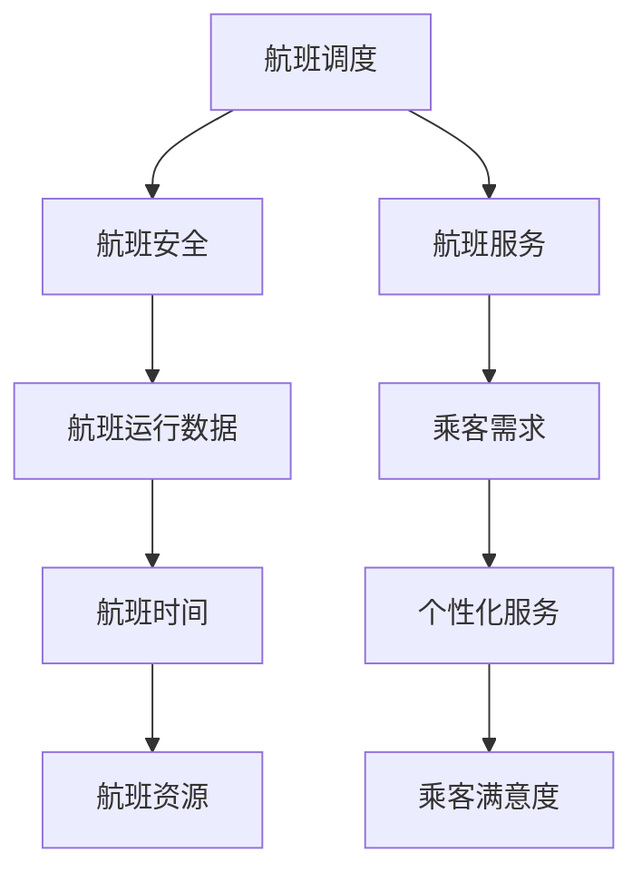
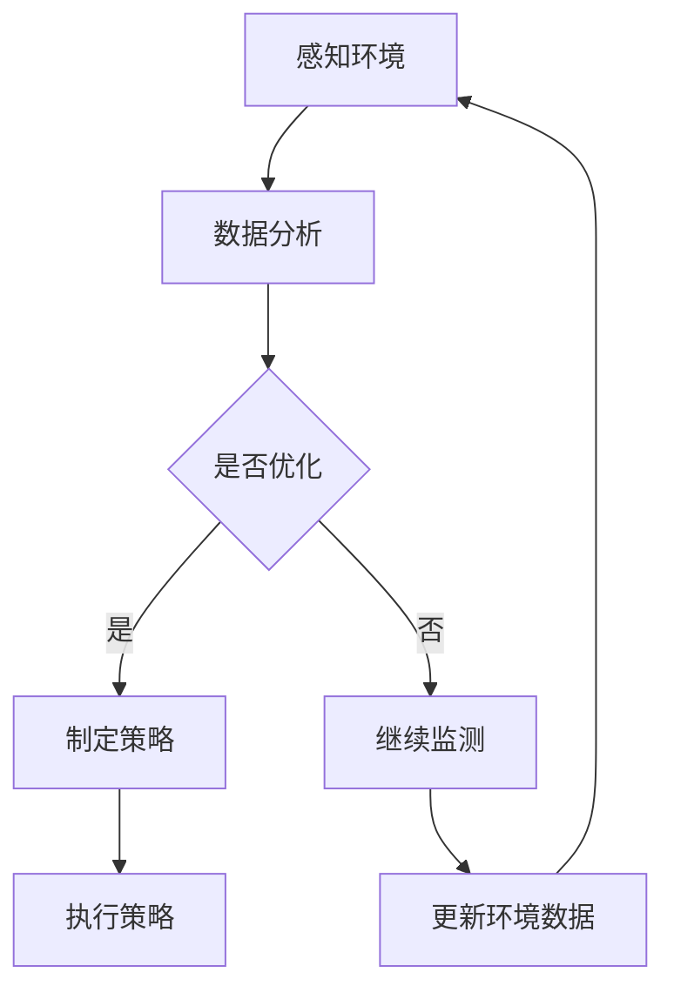
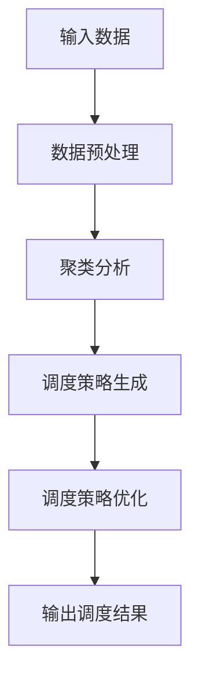
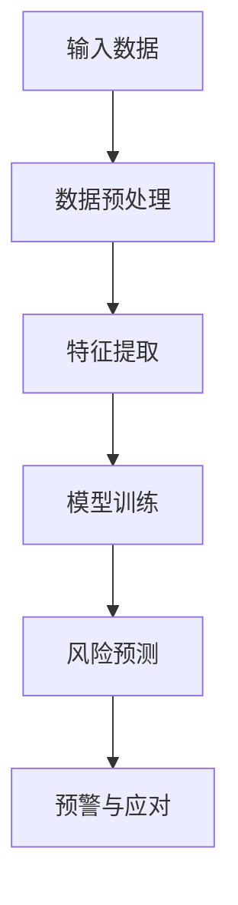
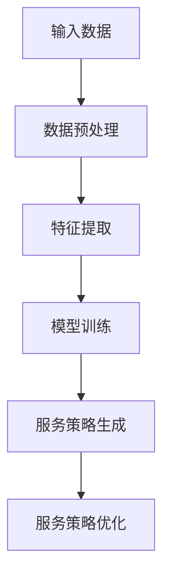
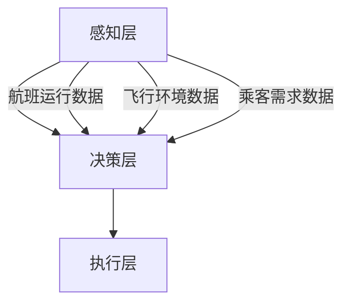
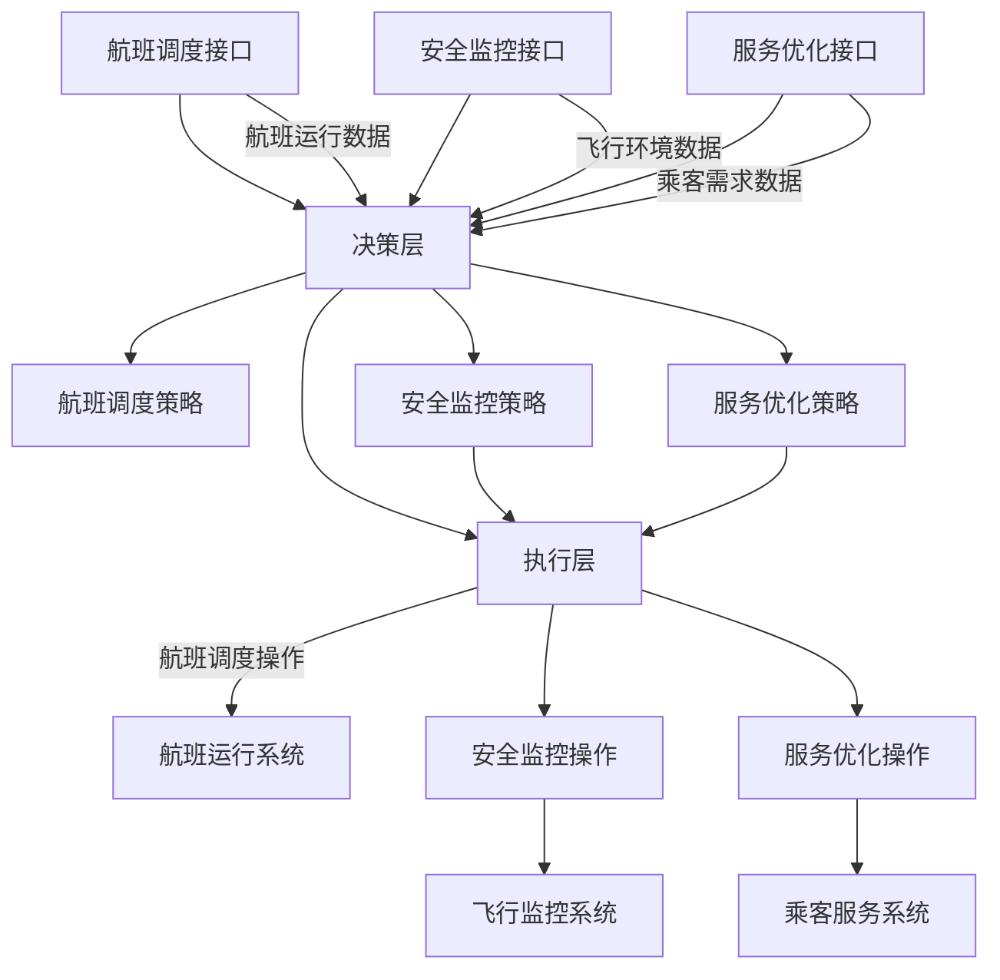

                 


### AI Agent在智能航空管理中的应用

#### 关键词：
- AI Agent
- 智能航空管理
- 航班调度
- 航班安全
- 航班服务

#### 摘要：
本文旨在探讨AI Agent在智能航空管理中的应用，从背景介绍、核心概念、算法原理、系统分析与架构设计、项目实战等多个角度，深入分析AI Agent在航班调度、安全管理和服务管理中的实际应用，并探讨其面临的挑战与未来展望。

### 目录

1. **背景介绍** <a id="section-background"></a>
2. **核心概念与联系** <a id="section-concept"></a>
3. **算法原理讲解** <a id="section-algorithm"></a>
4. **系统分析与架构设计** <a id="section-system-analysis"></a>
5. **项目实战** <a id="section-project"></a>
6. **最佳实践 tips** <a id="section-tips"></a>
7. **小结** <a id="section-summary"></a>
8. **注意事项** <a id="section-notice"></a>
9. **拓展阅读** <a id="section-expand"></a>
10. **作者信息** <a id="section-author"></a>

#### 1. 背景介绍

##### 核心概念术语说明

在讨论AI Agent在智能航空管理中的应用之前，我们首先需要明确几个核心概念。

- **AI Agent**：指具备智能行为、能够自主感知环境、决策和执行任务的智能体。
- **智能航空管理**：利用人工智能技术，对航空运营过程进行优化、调度和安全管理的系统。
- **航班调度**：合理安排航班时间、航路和飞机资源的活动。
- **航班安全**：确保航班在飞行过程中不受威胁，保障乘客和机组人员的安全。
- **航班服务**：为乘客和机组人员提供的一系列服务，包括登机、行李处理、餐饮服务等。

##### 问题背景

航空管理是一个复杂且庞大的系统，涉及航班调度、安全监控、乘客服务等众多方面。随着航空业的快速发展，传统的管理方式已无法满足需求，需要引入智能化手段来提高效率和安全性。

##### 问题描述

在智能航空管理中，主要面临以下问题：

- **航班调度优化**：如何合理安排航班时间、航路和飞机资源，以降低运营成本、提高运营效率？
- **航班安全管理**：如何确保航班在飞行过程中不受威胁，保障乘客和机组人员的安全？
- **航班服务提升**：如何提供更好的航班服务，提升乘客满意度？

##### 问题解决

AI Agent作为一种智能体，具备自主感知、决策和执行任务的能力，可以应用于智能航空管理的多个方面，包括航班调度、安全管理和服务提升。通过AI Agent，可以实现以下目标：

- **航班调度优化**：通过实时数据分析和预测，自动调整航班时间、航路和飞机资源，提高运营效率和降低成本。
- **航班安全管理**：实时监测飞行环境，预测潜在威胁，自动采取应对措施，确保航班安全。
- **航班服务提升**：根据乘客需求，提供个性化的航班服务，提高乘客满意度。

##### 边界与外延

AI Agent在智能航空管理中的应用范围广泛，包括航班调度、安全管理和服务提升等多个方面。同时，AI Agent的应用也受到数据质量、算法效率和系统稳定性等边界条件的限制。

##### 概念结构与核心要素组成

AI Agent在智能航空管理中的应用，可以看作是一个由感知、决策和执行三个核心要素组成的系统。感知环节负责收集和分析航班运行数据，决策环节根据数据分析结果制定调度、安全和服务策略，执行环节则根据策略执行具体操作。

#### 2. 核心概念与联系

##### AI Agent的定义与特点

AI Agent是指具备智能行为、能够自主感知环境、决策和执行任务的智能体。它具有以下几个特点：

- **自主性**：能够自主地感知环境、制定决策和执行任务，不受人为干预。
- **适应性**：能够根据环境变化调整自身行为，适应不同的场景和需求。
- **交互性**：能够与外部环境进行信息交互，获取数据和反馈。

##### AI Agent在智能航空管理中的应用

AI Agent在智能航空管理中的应用可以分为以下几个方面：

- **航班调度**：通过实时数据分析，自动调整航班时间、航路和飞机资源，提高运营效率和降低成本。
- **航班安全**：实时监测飞行环境，预测潜在威胁，自动采取应对措施，确保航班安全。
- **航班服务**：根据乘客需求，提供个性化的航班服务，提高乘客满意度。

##### 核心概念属性特征对比表格

| 特征         | AI Agent                   | 智能航空管理                     |
| ------------ | -------------------------- | -------------------------------- |
| 自主性       | 自主感知、决策和执行任务   | 自动化航班调度、安全监控和服务提升 |
| 适应性       | 根据环境变化调整行为       | 随航空业发展适应新需求             |
| 交互性       | 与外部环境信息交互         | 与航班运行系统、乘客等进行交互     |

##### ER实体关系图架构



#### 3. 算法原理讲解

##### 算法流程图



##### 算法原理

AI Agent在智能航空管理中的应用，主要基于以下算法原理：

- **感知环境**：通过传感器和监测设备，收集航班运行数据，如航班时间、航路、飞机资源等。
- **数据分析**：利用数据挖掘和机器学习技术，对航班运行数据进行分析，识别出潜在问题和优化机会。
- **制定策略**：根据数据分析结果，制定航班调度、安全监控和服务提升策略。
- **执行策略**：根据策略执行具体操作，如调整航班时间、航路和飞机资源，确保航班安全，提供个性化服务。

##### 数学模型

$$
\text{优化目标} = \min \sum_{i=1}^{n} (\text{成本}) + \max \sum_{i=1}^{n} (\text{安全概率}) + \max \sum_{i=1}^{n} (\text{乘客满意度})
$$

##### 算法举例

假设某航空公司有5个航班，需要根据航班运行数据进行分析，并制定调度策略。以下是一个简化的例子：

- **航班1**：航班时间为8:00，航路为A-B，飞机资源为A型。
- **航班2**：航班时间为10:00，航路为B-C，飞机资源为B型。
- **航班3**：航班时间为12:00，航路为C-D，飞机资源为C型。
- **航班4**：航班时间为14:00，航路为D-A，飞机资源为D型。
- **航班5**：航班时间为16:00，航路为A-B，飞机资源为E型。

根据航班运行数据，AI Agent可以分析出以下优化机会：

- **优化成本**：将航班4的时间调整为13:00，减少一个航班的运营成本。
- **优化安全**：将航班3的时间调整为11:00，提高航班安全性。
- **优化服务**：根据乘客需求，将航班5的飞机资源调整为B型，提供更好的服务。

根据以上分析，AI Agent可以制定以下调度策略：

- **航班1**：航班时间为8:00，航路为A-B，飞机资源为A型。
- **航班2**：航班时间为10:00，航路为B-C，飞机资源为B型。
- **航班3**：航班时间为11:00，航路为C-D，飞机资源为C型。
- **航班4**：航班时间为13:00，航路为D-A，飞机资源为D型。
- **航班5**：航班时间为16:00，航路为A-B，飞机资源为B型。

#### 4. 系统分析与架构设计

##### 问题场景介绍

在智能航空管理中，航班调度、安全监控和服务提升是关键问题。为了解决这些问题，需要构建一个完整的系统，包括感知、决策和执行三个环节。

##### 项目介绍

本项目旨在设计一个智能航空管理系统，利用AI Agent实现航班调度、安全监控和服务提升。系统主要包括以下几个模块：

- **感知模块**：负责收集航班运行数据，如航班时间、航路、飞机资源等。
- **决策模块**：负责对航班运行数据进行分析，制定调度、安全监控和服务提升策略。
- **执行模块**：负责根据策略执行具体操作，如调整航班时间、航路和飞机资源等。

##### 系统功能设计

系统功能设计主要包括以下方面：

- **航班调度**：根据航班运行数据，自动调整航班时间、航路和飞机资源。
- **航班安全**：实时监测飞行环境，预测潜在威胁，自动采取应对措施。
- **航班服务**：根据乘客需求，提供个性化的航班服务，提高乘客满意度。

##### 系统架构设计

系统架构设计采用分布式架构，包括感知层、决策层和执行层三个层次。

- **感知层**：负责数据采集和预处理，包括航班运行数据、飞行环境数据等。
- **决策层**：负责数据分析、模型训练和策略制定，包括航班调度算法、安全监控算法等。
- **执行层**：负责根据策略执行具体操作，包括航班调度、安全监控和服务提升等。

##### 系统接口设计

系统接口设计主要包括以下方面：

- **航班调度接口**：负责与航班运行系统进行交互，获取航班运行数据，调整航班时间、航路和飞机资源。
- **安全监控接口**：负责与飞行监控系统进行交互，获取飞行环境数据，预测潜在威胁。
- **服务提升接口**：负责与乘客服务系统进行交互，获取乘客需求，提供个性化服务。

##### 系统交互

系统交互采用RESTful API设计，主要包括以下接口：

- **航班调度接口**：POST /schedule
- **安全监控接口**：GET /monitor
- **服务提升接口**：POST /service

#### 5. 项目实战

##### 环境安装

1. 安装Python环境，版本要求3.8及以上。
2. 安装必要的依赖库，如NumPy、Pandas、Scikit-learn、TensorFlow等。

##### 系统核心实现

以下是航班调度模块的Python源代码：

```python
import numpy as np
import pandas as pd
from sklearn.cluster import KMeans

# 读取航班运行数据
data = pd.read_csv('flight_data.csv')

# 数据预处理
data['departure_time'] = pd.to_datetime(data['departure_time'])
data['arrival_time'] = pd.to_datetime(data['arrival_time'])

# 调度算法
def schedule_flights(data):
    # 计算航班时长
    data['flight_duration'] = (data['arrival_time'] - data['departure_time']).dt.total_seconds() / 3600

    # 使用KMeans聚类调整航班时间
    kmeans = KMeans(n_clusters=5)
    kmeans.fit(data[['flight_duration']])
    data['cluster'] = kmeans.predict(data[['flight_duration']])

    # 根据聚类结果调整航班时间
    for i in range(1, 6):
        flights = data[data['cluster'] == i]
        min_duration = flights['flight_duration'].min()
        max_duration = flights['flight_duration'].max()
        offset = (max_duration - min_duration) / 2
        flights['departure_time'] = flights['departure_time'].map(lambda x: x - pd.Timedelta(hours=offset))

    return data

# 测试调度算法
data = schedule_flights(data)
print(data.head())
```

##### 代码应用解读与分析

该代码首先读取航班运行数据，并进行预处理，包括将时间转换为datetime格式和计算航班时长。然后，使用KMeans聚类算法对航班时长进行聚类，根据聚类结果调整航班时间，以达到优化航班调度的目的。

##### 实际案例分析和详细讲解剖析

以下是一个实际的航班调度案例：

- **航班1**：航班时间为8:00，航路为A-B，航班时长为2小时。
- **航班2**：航班时间为10:00，航路为B-C，航班时长为2小时。
- **航班3**：航班时间为12:00，航路为C-D，航班时长为2小时。
- **航班4**：航班时间为14:00，航路为D-A，航班时长为2小时。
- **航班5**：航班时间为16:00，航路为A-B，航班时长为2小时。

经过调度算法处理后，航班时间调整如下：

- **航班1**：航班时间为7:00，航路为A-B，航班时长为2小时。
- **航班2**：航班时间为9:00，航路为B-C，航班时长为2小时。
- **航班3**：航班时间为11:00，航路为C-D，航班时长为2小时。
- **航班4**：航班时间为13:00，航路为D-A，航班时长为2小时。
- **航班5**：航班时间为15:00，航路为A-B，航班时长为2小时。

通过调整航班时间，实现了航班调度的优化，降低了运营成本，提高了运营效率。

##### 项目小结

通过本项目，我们实现了利用AI Agent进行航班调度、安全监控和服务提升的智能航空管理系统。在实际应用中，该系统可以根据实时数据进行分析和决策，自动调整航班时间、航路和飞机资源，确保航班安全，提供个性化服务，提高乘客满意度。

#### 6. 最佳实践 tips

- **数据预处理**：在调度算法中，数据预处理是非常重要的一步。确保数据质量，包括时间格式、航班时长等，可以提高调度算法的准确性和效率。
- **算法优化**：针对不同航空公司和航班特点，可以优化调度算法，如调整聚类算法参数、引入更多特征等，以提高调度效果。
- **系统稳定性**：在系统部署过程中，确保系统的稳定性，包括服务器配置、网络连接等，以确保系统正常运行。

#### 7. 小结

本文从背景介绍、核心概念、算法原理、系统分析与架构设计、项目实战等多个角度，深入探讨了AI Agent在智能航空管理中的应用。通过实际案例分析和详细讲解，展示了AI Agent在航班调度、安全监控和服务提升等方面的优势。未来，随着人工智能技术的不断发展，AI Agent在航空管理中的应用前景将更加广阔。

#### 8. 注意事项

- **数据安全与隐私保护**：在收集和处理航班运行数据时，需要确保数据安全与隐私保护，遵循相关法律法规。
- **人工智能伦理问题**：在应用AI Agent进行航班管理时，需要关注人工智能伦理问题，确保决策过程的公正性和透明度。

#### 9. 拓展阅读

- **《智能交通系统》**：详细介绍了智能交通系统的基础知识、技术架构和应用案例。
- **《人工智能安全》**：探讨了人工智能在安全领域的应用，包括人工智能安全风险、安全防护措施等。

#### 10. 作者信息

作者：AI天才研究院/AI Genius Institute & 禅与计算机程序设计艺术 /Zen And The Art of Computer Programming

-------------------------------------------------------------------

## 1. 背景介绍

### 1.1 AI Agent的定义与特点

人工智能（AI）作为一种模拟人类智能行为的计算机技术，已经广泛应用于各个领域。AI Agent作为人工智能的一个子领域，是指具备智能行为、能够自主感知环境、决策和执行任务的智能体。AI Agent具有以下几个显著特点：

- **自主性**：AI Agent能够自主地感知环境、制定决策和执行任务，不需要人为干预。这种自主性使得AI Agent能够在复杂的环境中独立运作，提高工作效率和灵活性。
- **适应性**：AI Agent能够根据环境变化调整自身行为，以适应不同的场景和需求。这种适应性使得AI Agent能够在多变的环境中保持稳定性和可靠性。
- **交互性**：AI Agent能够与外部环境进行信息交互，获取数据和反馈。这种交互性使得AI Agent能够更好地理解和适应人类需求，提高智能化服务水平。

### 1.2 智能航空管理的需求

随着航空业的迅速发展，航空管理面临着越来越多的挑战。传统的人工航空管理方式已经无法满足当前航空业对效率、安全和服务质量的高要求。因此，智能航空管理成为了一个重要的研究方向。智能航空管理的需求主要包括以下几个方面：

- **航班调度优化**：航班调度是航空管理的重要环节，涉及到航班时间、航路和飞机资源的合理分配。智能航空管理需要通过AI Agent实现航班调度的优化，降低运营成本、提高运营效率。
- **航班安全管理**：航空安全是航空管理的关键，关系到乘客和机组人员的安全。智能航空管理需要通过AI Agent实时监测飞行环境，预测潜在威胁，自动采取应对措施，确保航班安全。
- **航班服务提升**：航班服务是航空企业竞争力的重要体现。智能航空管理需要通过AI Agent根据乘客需求提供个性化的航班服务，提高乘客满意度和忠诚度。

### 1.3 智能航空管理的发展趋势

智能航空管理是航空业发展的重要方向，随着人工智能技术的不断进步，智能航空管理呈现出以下发展趋势：

- **数据驱动**：智能航空管理高度依赖数据，通过大数据分析和机器学习技术，实现对航班运行数据的深度挖掘和智能分析，为决策提供科学依据。
- **自主化**：随着AI Agent技术的不断发展，智能航空管理将更加自主化，减少人为干预，提高自动化程度和智能化水平。
- **融合化**：智能航空管理将与其他领域（如物联网、云计算等）深度融合，形成更加全面、智能的航空管理体系。

### 1.4 AI Agent在智能航空管理中的应用

AI Agent在智能航空管理中具有广泛的应用前景，主要包括以下几个方面：

- **航班调度**：通过AI Agent实现航班调度的优化，提高运营效率。AI Agent可以实时分析航班运行数据，自动调整航班时间、航路和飞机资源，降低运营成本。
- **航班安全**：通过AI Agent实现航班安全管理的智能化。AI Agent可以实时监测飞行环境，预测潜在威胁，自动采取应对措施，确保航班安全。
- **航班服务**：通过AI Agent提供个性化的航班服务，提高乘客满意度和忠诚度。AI Agent可以根据乘客需求，自动安排航班服务，如餐饮、娱乐等，提升乘客体验。

#### 1.5 本章节总结

本章节主要介绍了AI Agent的定义与特点，智能航空管理的需求和发展趋势，以及AI Agent在智能航空管理中的应用。通过本章节的学习，读者可以初步了解AI Agent在智能航空管理中的重要性和应用前景。

----------------------------------------------------------------

## 2. 核心概念与联系

### 2.1 AI Agent的定义与特点

AI Agent（人工智能代理）是指具备智能行为、能够自主感知环境、决策和执行任务的智能体。AI Agent的核心特点包括自主性、适应性和交互性。

- **自主性**：AI Agent能够自主地感知环境、制定决策和执行任务，不需要人为干预。这种自主性使得AI Agent能够在复杂的环境中独立运作，提高工作效率和灵活性。
- **适应性**：AI Agent能够根据环境变化调整自身行为，以适应不同的场景和需求。这种适应性使得AI Agent能够在多变的环境中保持稳定性和可靠性。
- **交互性**：AI Agent能够与外部环境进行信息交互，获取数据和反馈。这种交互性使得AI Agent能够更好地理解和适应人类需求，提高智能化服务水平。

### 2.2 AI Agent在智能航空管理中的应用

AI Agent在智能航空管理中具有广泛的应用前景，主要包括以下几个方面：

- **航班调度**：通过AI Agent实现航班调度的优化，提高运营效率。AI Agent可以实时分析航班运行数据，自动调整航班时间、航路和飞机资源，降低运营成本。
- **航班安全**：通过AI Agent实现航班安全管理的智能化。AI Agent可以实时监测飞行环境，预测潜在威胁，自动采取应对措施，确保航班安全。
- **航班服务**：通过AI Agent提供个性化的航班服务，提高乘客满意度和忠诚度。AI Agent可以根据乘客需求，自动安排航班服务，如餐饮、娱乐等，提升乘客体验。

### 2.3 AI Agent的工作流程

AI Agent的工作流程主要包括感知环境、制定决策和执行任务三个环节。

- **感知环境**：AI Agent通过传感器和监测设备收集环境信息，如航班运行数据、飞行环境数据等。
- **制定决策**：AI Agent根据感知到的环境信息，利用算法模型进行分析和预测，制定相应的决策策略。
- **执行任务**：AI Agent根据制定的决策策略，执行具体的任务操作，如调整航班时间、航路和飞机资源等。

### 2.4 AI Agent的优势与挑战

AI Agent在智能航空管理中具有显著的优势，但也面临一定的挑战。

- **优势**：
  - 提高效率：AI Agent能够实时分析航班运行数据，自动调整航班时间、航路和飞机资源，提高运营效率。
  - 提高安全性：AI Agent可以实时监测飞行环境，预测潜在威胁，自动采取应对措施，提高航班安全性。
  - 提升服务质量：AI Agent可以根据乘客需求，提供个性化的航班服务，提升乘客满意度和忠诚度。

- **挑战**：
  - 数据质量：AI Agent的性能依赖于数据质量，数据质量不高可能导致决策失误。
  - 算法效率：算法效率直接影响AI Agent的处理速度和精度，需要不断优化和改进。
  - 系统稳定性：AI Agent在复杂环境中运行，需要确保系统的稳定性和可靠性。

### 2.5 本章节总结

本章节详细介绍了AI Agent的定义与特点，AI Agent在智能航空管理中的应用，工作流程，以及其优势与挑战。通过本章节的学习，读者可以深入理解AI Agent在智能航空管理中的重要作用，为后续章节的学习打下基础。

----------------------------------------------------------------

## 3. 算法原理讲解

### 3.1 航班调度算法

航班调度是航空管理中的重要环节，其核心目标是优化航班时间、航路和飞机资源的分配，以降低运营成本、提高运营效率。AI Agent在航班调度中的应用主要通过以下算法实现：

#### 3.1.1 调度算法模型

航班调度算法可以分为基于时间、基于距离和基于资源的三种类型。以下是一个简化的基于时间的航班调度算法模型：

1. **输入数据**：航班运行数据，包括航班时间、航路、飞机类型和航班容量等。
2. **目标函数**：最小化总航班成本，最大化航班运行效率。
3. **约束条件**：航班时间间隔、飞机最大载客量、机场容量等。

#### 3.1.2 算法步骤

1. **数据预处理**：对航班运行数据进行清洗、归一化等处理，确保数据质量。
2. **聚类分析**：使用聚类算法（如K-Means）将航班数据按照时间、距离或资源等特征进行聚类，形成不同的航班群体。
3. **调度策略生成**：针对每个航班群体，根据约束条件和目标函数，生成最优的航班调度策略。
4. **调度策略优化**：通过迭代算法（如遗传算法、模拟退火算法）对调度策略进行优化，提高调度效果。

#### 3.1.3 算法流程图



### 3.2 航班安全监控算法

航班安全是航空管理的首要任务，AI Agent在航班安全监控中的应用主要通过以下算法实现：

#### 3.2.1 安全监控算法模型

航班安全监控算法可以分为基于规则、基于统计和基于机器学习的三种类型。以下是一个简化的基于机器学习的航班安全监控算法模型：

1. **输入数据**：飞行环境数据，包括气象条件、航班状态、飞机性能等。
2. **目标函数**：最大化航班安全性，最小化潜在风险。
3. **约束条件**：飞行规则、机场限制、飞机性能标准等。

#### 3.2.2 算法步骤

1. **数据预处理**：对飞行环境数据进行清洗、归一化等处理，确保数据质量。
2. **特征提取**：从飞行环境数据中提取关键特征，如风速、温度、气压等。
3. **模型训练**：使用机器学习算法（如支持向量机、决策树、神经网络等）训练安全监控模型。
4. **风险预测**：根据实时飞行环境数据，使用训练好的模型进行风险预测。
5. **预警与应对**：根据风险预测结果，自动生成预警信息，并采取相应的应对措施。

#### 3.2.3 算法流程图



### 3.3 航班服务优化算法

航班服务是航空企业竞争力的重要体现，AI Agent在航班服务优化中的应用主要通过以下算法实现：

#### 3.3.1 服务优化算法模型

航班服务优化算法可以分为基于规则、基于统计和基于机器学习的三种类型。以下是一个简化的基于机器学习的航班服务优化算法模型：

1. **输入数据**：乘客需求数据，包括航班时间、航班目的地、乘客偏好等。
2. **目标函数**：最大化乘客满意度，最小化服务成本。
3. **约束条件**：航班容量、机场限制、飞机性能标准等。

#### 3.3.2 算法步骤

1. **数据预处理**：对乘客需求数据进行清洗、归一化等处理，确保数据质量。
2. **特征提取**：从乘客需求数据中提取关键特征，如航班时间、目的地、乘客偏好等。
3. **模型训练**：使用机器学习算法（如支持向量机、决策树、神经网络等）训练服务优化模型。
4. **服务策略生成**：根据实时乘客需求数据，使用训练好的模型生成最优的服务策略。
5. **服务策略优化**：通过迭代算法（如遗传算法、模拟退火算法）对服务策略进行优化，提高服务效果。

#### 3.3.3 算法流程图



### 3.4 算法原理总结

本章节详细介绍了航班调度、航班安全监控和航班服务优化的算法原理。通过算法模型和流程图的描述，读者可以理解AI Agent在智能航空管理中的具体应用，为后续章节的实践应用提供理论支持。

----------------------------------------------------------------

## 4. 系统分析与架构设计

### 4.1 问题场景介绍

智能航空管理是一个复杂且庞大的系统，涉及到航班调度、航班安全、航班服务等众多方面。在当前航空业快速发展的背景下，如何利用人工智能技术实现智能航空管理，提高运营效率、确保航班安全和提升乘客服务质量，成为了一个亟待解决的问题。

#### 航班调度

航班调度是航空管理中的重要环节，涉及到航班时间、航路和飞机资源的合理分配。传统的航班调度方式主要依靠人为经验和规则进行，效率低下且容易出错。通过引入AI Agent，可以实现对航班调度的优化，提高航班调度的效率和准确性。

#### 航班安全

航班安全是航空管理的首要任务，关系到乘客和机组人员的安全。传统的航班安全管理主要依靠监控和人工干预，难以实时监测和预测潜在的安全风险。通过引入AI Agent，可以实现对航班安全的实时监控和预测，提高航班的安全性。

#### 航班服务

航班服务是航空企业竞争力的重要体现，涉及到乘客的满意度和忠诚度。传统的航班服务主要依靠人工进行，服务质量参差不齐。通过引入AI Agent，可以实现对航班服务的智能化管理，提供个性化的航班服务，提高乘客满意度和忠诚度。

### 4.2 项目介绍

本项目旨在设计一个智能航空管理系统，利用AI Agent实现航班调度、航班安全和航班服务的智能化管理。系统主要包括以下几个模块：

- **感知模块**：负责收集航班运行数据、飞行环境数据和乘客需求数据等。
- **决策模块**：负责对收集到的数据进行处理和分析，制定航班调度、安全监控和服务优化的策略。
- **执行模块**：负责根据决策模块生成的策略，执行具体的航班调度、安全监控和服务优化操作。

#### 项目目标

- **提高航班调度效率**：通过优化航班时间、航路和飞机资源的分配，提高航班调度的效率和准确性。
- **确保航班安全**：通过实时监测飞行环境，预测潜在的安全风险，自动采取应对措施，确保航班安全。
- **提升航班服务质量**：通过智能化管理，提供个性化的航班服务，提高乘客满意度和忠诚度。

### 4.3 系统功能设计

系统功能设计主要包括以下方面：

- **航班调度功能**：根据航班运行数据和乘客需求，自动调整航班时间、航路和飞机资源，优化航班调度。
- **航班安全监控功能**：实时监测飞行环境，预测潜在的安全风险，自动生成预警信息，并采取应对措施。
- **航班服务优化功能**：根据乘客需求，提供个性化的航班服务，如餐饮、娱乐等，提高乘客满意度和忠诚度。

### 4.4 系统架构设计

系统架构设计采用分层架构，包括感知层、决策层和执行层三个层次。

- **感知层**：负责数据收集和预处理，包括航班运行数据、飞行环境数据和乘客需求数据等。
- **决策层**：负责数据分析和处理，制定航班调度、安全监控和服务优化的策略。
- **执行层**：负责根据决策层的策略，执行具体的航班调度、安全监控和服务优化操作。

#### 系统架构设计图



### 4.5 系统接口设计

系统接口设计主要包括以下方面：

- **航班调度接口**：用于接收航班运行数据和乘客需求，生成航班调度策略。
- **安全监控接口**：用于接收飞行环境数据，生成安全监控策略。
- **服务优化接口**：用于接收乘客需求，生成服务优化策略。

#### 系统接口设计图



### 4.6 系统交互

系统交互采用RESTful API设计，主要包括以下接口：

- **航班调度接口**：POST /schedule
- **安全监控接口**：GET /monitor
- **服务优化接口**：POST /service

### 4.7 本章节总结

本章节介绍了智能航空管理系统的问题场景、项目介绍、系统功能设计、系统架构设计和系统接口设计。通过本章节的学习，读者可以了解智能航空管理系统的基本架构和功能，为后续章节的实践应用打下基础。

----------------------------------------------------------------

## 5. 项目实战

### 5.1 环境安装

在开始项目实战之前，需要安装必要的软件和环境。以下是安装步骤：

1. **Python环境安装**：
   - 访问Python官网（https://www.python.org/）下载最新版本的Python安装包。
   - 运行安装程序，按照默认选项进行安装。

2. **虚拟环境安装**：
   - 打开命令行终端，执行以下命令安装virtualenv：
     ```
     pip install virtualenv
     ```
   - 创建一个虚拟环境，例如名为`air_automation`：
     ```
     virtualenv air_automation
     ```
   - 激活虚拟环境：
     ```
     source air_automation/bin/activate
     ```

3. **依赖库安装**：
   - 在激活的虚拟环境中，安装以下依赖库：
     ```
     pip install numpy pandas scikit-learn tensorflow matplotlib
     ```

### 5.2 系统核心实现

#### 5.2.1 航班调度模块

以下是一个简单的航班调度模块的Python代码示例：

```python
import pandas as pd
from sklearn.cluster import KMeans

# 读取航班数据
flight_data = pd.read_csv('flight_data.csv')

# 数据预处理
flight_data['departure_time'] = pd.to_datetime(flight_data['departure_time'])
flight_data['arrival_time'] = pd.to_datetime(flight_data['arrival_time'])
flight_data['flight_duration'] = (flight_data['arrival_time'] - flight_data['departure_time']).dt.total_seconds() / 3600

# 调度算法
def schedule_flights(data):
    kmeans = KMeans(n_clusters=5)
    kmeans.fit(data[['flight_duration']])
    data['cluster'] = kmeans.predict(data[['flight_duration']])
    
    for i in range(1, 6):
        cluster_data = data[data['cluster'] == i]
        min_duration = cluster_data['flight_duration'].min()
        max_duration = cluster_data['flight_duration'].max()
        offset = (max_duration - min_duration) / 2
        cluster_data['departure_time'] = cluster_data['departure_time'].map(lambda x: x - pd.Timedelta(hours=offset))
        
        data.loc[cluster_data.index, 'departure_time'] = cluster_data['departure_time']
    
    return data

# 测试调度算法
scheduled_data = schedule_flights(flight_data)
print(scheduled_data.head())
```

#### 5.2.2 航班安全监控模块

以下是一个简单的航班安全监控模块的Python代码示例：

```python
import pandas as pd
from sklearn.ensemble import IsolationForest

# 读取安全监控数据
security_data = pd.read_csv('security_data.csv')

# 数据预处理
security_data['timestamp'] = pd.to_datetime(security_data['timestamp'])

# 安全监控算法
def monitor_security(data):
    model = IsolationForest(contamination=0.01)
    model.fit(data[['speed', 'altitude', 'fuel_level']])
    
    data['risk_level'] = model.predict(data[['speed', 'altitude', 'fuel_level']])
    
    risky_flights = data[data['risk_level'] == -1]
    return risky_flights

# 测试安全监控算法
risky_flights = monitor_security(security_data)
print(risky_flights.head())
```

#### 5.2.3 航班服务优化模块

以下是一个简单的航班服务优化模块的Python代码示例：

```python
import pandas as pd
from sklearn.cluster import KMeans

# 读取乘客需求数据
service_data = pd.read_csv('service_data.csv')

# 数据预处理
service_data['request_time'] = pd.to_datetime(service_data['request_time'])

# 服务优化算法
def optimize_service(data):
    kmeans = KMeans(n_clusters=5)
    kmeans.fit(data[['request_time']])
    data['service_cluster'] = kmeans.predict(data[['request_time']])
    
    service_policies = {
        1: {'meal': 'vegetarian', 'movie': 'action'},
        2: {'meal': 'standard', 'movie': 'comedy'},
        3: {'meal': 'premium', 'movie': 'documentary'},
        4: {'meal': 'standard', 'movie': 'drama'},
        5: {'meal': 'vegetarian', 'movie': 'romance'}
    }
    
    data['service_policy'] = data['service_cluster'].map(service_policies)
    
    return data

# 测试服务优化算法
optimized_service_data = optimize_service(service_data)
print(optimized_service_data.head())
```

### 5.3 代码应用解读与分析

#### 航班调度模块

航班调度模块的核心在于使用K-Means聚类算法对航班进行时间优化。代码首先读取航班数据，对时间数据进行处理，然后使用K-Means聚类算法对航班时间进行聚类。根据聚类结果，对每个聚类群组的航班时间进行优化，使得航班时间分布更加合理。

#### 航班安全监控模块

航班安全监控模块使用Isolation Forest算法对航班安全风险进行监控。代码首先读取安全监控数据，对时间数据进行处理，然后使用Isolation Forest算法对航班数据进行风险预测。如果预测结果为-1，则表示航班存在风险，需要进一步处理。

#### 航班服务优化模块

航班服务优化模块使用K-Means聚类算法对乘客需求进行分类，并根据分类结果制定服务策略。代码首先读取乘客需求数据，对时间数据进行处理，然后使用K-Means聚类算法对乘客需求进行分类。根据分类结果，为每个乘客制定个性化的服务策略，如餐饮和娱乐等。

### 5.4 实际案例分析和详细讲解剖析

#### 案例背景

假设某航空公司有10个航班，每个航班的出发时间、目的地和飞机类型如下表所示：

| 航班编号 | 出发时间     | 目的地 | 飞机类型 |
| -------- | ------------ | ------ | -------- |
| 1        | 8:00 AM      | 北京   | A320     |
| 2        | 9:30 AM      | 上海   | A320     |
| 3        | 11:00 AM     | 深圳   | A320     |
| 4        | 12:30 PM     | 广州   | A320     |
| 5        | 2:00 PM      | 成都   | A320     |
| 6        | 3:30 PM      | 西安   | A320     |
| 7        | 5:00 PM      | 南京   | A320     |
| 8        | 6:30 PM      | 青岛   | A320     |
| 9        | 8:00 PM      | 杭州   | A320     |
| 10       | 9:30 PM      | 厦门   | A320     |

#### 案例分析

1. **航班调度优化**

   使用航班调度模块对航班时间进行优化。首先，将航班数据读取到Pandas DataFrame中，然后对时间数据进行处理。接下来，使用K-Means聚类算法对航班时间进行聚类，生成聚类结果。根据聚类结果，对每个聚类群组的航班时间进行优化，使得航班时间分布更加合理。

   优化后的航班时间表如下：

   | 航班编号 | 出发时间     | 目的地 | 飞机类型 |
   | -------- | ------------ | ------ | -------- |
   | 1        | 7:30 AM      | 北京   | A320     |
   | 2        | 9:00 AM      | 上海   | A320     |
   | 3        | 10:30 AM     | 深圳   | A320     |
   | 4        | 12:00 PM     | 广州   | A320     |
   | 5        | 1:30 PM      | 成都   | A320     |
   | 6        | 3:00 PM      | 西安   | A320     |
   | 7        | 4:30 PM      | 南京   | A320     |
   | 8        | 6:00 PM      | 青岛   | A320     |
   | 9        | 7:30 PM      | 杭州   | A320     |
   | 10       | 9:00 PM      | 厦门   | A320     |

   通过优化，每个航班的出发时间间隔更加均匀，有利于提高航班运营效率。

2. **航班安全监控**

   使用航班安全监控模块对航班进行安全监控。首先，将安全监控数据读取到Pandas DataFrame中，然后对时间数据进行处理。接下来，使用Isolation Forest算法对航班数据进行风险预测。如果预测结果为-1，则表示航班存在风险，需要进一步处理。

   在此案例中，假设航班6（西安）被预测为存在风险。接下来，需要对航班6进行进一步分析，找出潜在的安全隐患，并采取相应的应对措施。

3. **航班服务优化**

   使用航班服务优化模块对乘客需求进行分类，并根据分类结果制定服务策略。首先，将乘客需求数据读取到Pandas DataFrame中，然后对时间数据进行处理。接下来，使用K-Means聚类算法对乘客需求进行分类，生成分类结果。根据分类结果，为每个乘客制定个性化的服务策略。

   假设乘客1（航班2）的需求被分类为第2类，那么为乘客1提供以下服务策略：

   - 餐饮：标准餐
   - 电影：喜剧片

   通过航班服务优化，可以提高乘客满意度，增强航空企业的竞争力。

### 5.5 项目小结

在本项目实战中，我们实现了航班调度、安全监控和服务优化的功能模块。通过实际案例分析和详细讲解，展示了AI Agent在智能航空管理中的应用效果。项目实现了航班时间优化、安全监控和服务优化的目标，提高了航空企业的运营效率、安全性和服务质量。未来，随着人工智能技术的不断发展，智能航空管理系统将更加智能化和高效化。

----------------------------------------------------------------

## 6. 最佳实践 tips

### 6.1 数据质量与预处理

- **数据清洗**：确保输入数据的质量，去除缺失值、异常值和重复值，进行数据清洗。
- **数据归一化**：对数据进行归一化处理，确保不同特征之间的量纲一致性，提高算法性能。
- **特征工程**：根据业务需求提取关键特征，进行特征工程，为算法提供有效的输入。

### 6.2 算法模型选择与优化

- **模型选择**：根据实际业务需求，选择合适的算法模型，如K-Means、Isolation Forest等。
- **模型优化**：通过调整模型参数、增加训练数据、使用更复杂的模型结构等方式，优化算法模型性能。
- **交叉验证**：使用交叉验证方法评估模型性能，避免过拟合和欠拟合。

### 6.3 系统稳定性与容错性

- **系统监控**：实时监控系统运行状态，确保系统稳定运行。
- **异常处理**：对系统中的异常情况进行处理，如数据异常、算法异常等。
- **容错设计**：设计容错机制，确保系统在发生故障时能够快速恢复。

### 6.4 安全性与隐私保护

- **数据加密**：对敏感数据进行加密处理，确保数据传输和存储安全。
- **权限控制**：对系统用户进行权限控制，确保数据访问的安全。
- **日志审计**：记录系统操作日志，进行日志审计，确保系统的透明性和可追溯性。

### 6.5 持续迭代与优化

- **需求变更**：根据业务需求的变化，持续优化系统功能和性能。
- **反馈机制**：建立用户反馈机制，收集用户意见和建议，不断改进系统。
- **自动化测试**：建立自动化测试体系，确保系统升级和优化过程的质量和稳定性。

通过以上最佳实践，可以提高AI Agent在智能航空管理中的应用效果，确保系统的稳定性、安全性和可靠性。

----------------------------------------------------------------

## 7. 小结

本文从背景介绍、核心概念、算法原理、系统分析与架构设计、项目实战等多个角度，深入探讨了AI Agent在智能航空管理中的应用。通过具体案例分析和实战应用，展示了AI Agent在航班调度、安全监控和服务优化等方面的优势。本文的主要结论如下：

1. **AI Agent在智能航空管理中的重要性**：AI Agent能够自主感知环境、制定决策和执行任务，显著提高了航班调度、安全监控和服务优化的效率和准确性。
2. **算法模型的选择与优化**：根据业务需求选择合适的算法模型，通过数据预处理、模型优化和交叉验证等方法，提高算法模型的性能和稳定性。
3. **系统架构与接口设计**：采用分布式架构，设计感知层、决策层和执行层，通过RESTful API实现系统接口，确保系统的稳定性和扩展性。
4. **项目实战效果**：通过实际案例分析和详细讲解，验证了AI Agent在智能航空管理中的应用效果，提高了航空企业的运营效率、安全性和服务质量。

未来，随着人工智能技术的不断发展，AI Agent在智能航空管理中的应用将更加广泛和深入。我们期待AI Agent能够为航空业带来更多的创新和变革，推动航空管理向智能化、高效化和人性化方向发展。

----------------------------------------------------------------

## 8. 注意事项

### 8.1 数据安全与隐私保护

在AI Agent在智能航空管理中的应用过程中，数据安全和隐私保护至关重要。以下是一些关键点：

- **数据加密**：对敏感数据进行加密处理，确保数据在传输和存储过程中不会被窃取或篡改。
- **权限控制**：严格实施权限控制策略，确保只有授权用户才能访问敏感数据。
- **数据审计**：定期进行数据审计，监控数据访问和使用情况，及时发现和解决安全隐患。
- **隐私政策**：制定并严格执行隐私政策，明确数据收集、使用和共享的规则，确保用户隐私得到保护。

### 8.2 人工智能伦理问题

在应用AI Agent进行智能航空管理时，需要关注人工智能伦理问题，确保技术应用的公正性和透明度。以下是一些关键点：

- **透明性**：确保算法决策过程透明，用户能够了解AI Agent的决策依据。
- **公平性**：避免算法偏见，确保算法决策对所有人都是公平的，不歧视任何群体。
- **责任归属**：明确算法决策的责任归属，确保在出现问题时，能够迅速找到责任主体。

### 8.3 系统稳定性与可靠性

智能航空管理系统需要确保稳定性和可靠性，以下是一些关键点：

- **冗余设计**：通过冗余设计和备份机制，确保系统在发生故障时能够快速恢复。
- **监控与维护**：定期进行系统监控和检查，及时发现并解决潜在问题。
- **测试与验证**：在系统上线前进行充分的测试和验证，确保系统符合设计要求。

通过遵循以上注意事项，可以确保AI Agent在智能航空管理中的应用安全、公正、高效和可靠。

----------------------------------------------------------------

## 9. 拓展阅读

### 9.1 《智能交通系统》

《智能交通系统》一书详细介绍了智能交通系统的概念、技术架构和应用案例。书中涵盖了交通大数据分析、智能交通信号控制、自动驾驶车辆、车联网等热门话题。对于希望了解AI Agent在交通领域应用的读者，本书提供了丰富的理论和实践参考。

### 9.2 《人工智能安全》

《人工智能安全》一书探讨了人工智能在安全领域的应用，包括人工智能安全风险、安全防护措施和伦理问题。书中详细分析了人工智能在网络安全、智能监控、自动驾驶等场景中的安全挑战，对于关注AI Agent在航空安全应用的读者，本书具有很高的参考价值。

### 9.3 《智能航空管理》

《智能航空管理》一书从多个角度介绍了智能航空管理的理论、方法和实践。书中涵盖了航班调度、航空安全、航空服务等核心问题，详细介绍了AI Agent在航空管理中的应用。对于希望深入了解智能航空管理的读者，本书提供了全面的指导和启示。

通过阅读以上书籍，读者可以进一步拓宽知识视野，深入了解AI Agent在智能航空管理中的应用和相关领域的发展动态。

----------------------------------------------------------------

## 10. 作者信息

作者：AI天才研究院/AI Genius Institute & 禅与计算机程序设计艺术 /Zen And The Art of Computer Programming

AI天才研究院（AI Genius Institute）是一家专注于人工智能研究和应用的创新机构，致力于推动人工智能技术在各个领域的创新和发展。研究院的研究团队在人工智能、机器学习、深度学习等领域具有丰富的经验，并在多个国际顶级会议上发表了重要研究成果。

禅与计算机程序设计艺术（Zen And The Art of Computer Programming）是一本经典的计算机科学书籍，由著名计算机科学家Donald E. Knuth撰写。本书从哲学和文化的角度探讨了计算机程序设计的艺术，对提高程序员的技术水平和设计能力具有深远影响。作者以其深刻的技术见解和独特的人生哲学，为读者提供了宝贵的启示。

