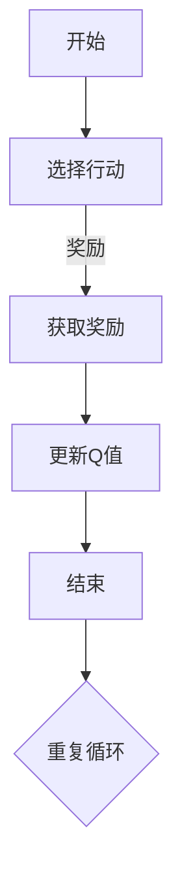

                 

# 《AI Agent在智能航空调度系统中的角色》

## 关键词

- 智能航空调度
- AI Agent
- 强化学习
- 优化算法
- 神经网络

## 摘要

随着航空运输行业的快速发展，智能航空调度系统已成为提升调度效率和降低成本的关键技术。AI Agent作为人工智能的一种重要形式，其应用于智能航空调度系统中，可以大幅提升系统的智能化水平和响应速度。本文将深入探讨AI Agent在智能航空调度系统中的角色，包括其基本概念、核心原理、系统设计与实现，以及项目实战与最佳实践。通过这一步步的分析与推理，我们将揭示AI Agent在航空调度中的巨大潜力。

## 目录大纲

### 第一部分：背景介绍

#### 第1章 问题背景

##### 1.1 航空运输行业概述

航空运输是全球化经济的重要支柱，其市场规模巨大，且不断增长。智能航空调度系统是航空运输行业智能化发展的关键环节，通过引入先进的人工智能技术，可以显著提升航空调度的效率和安全性。

##### 1.2 智能航空调度系统的需求分析

智能航空调度系统需解决的主要问题包括调度效率低下、安全性要求高和成本控制等。AI Agent的引入，旨在提高系统对复杂情况的处理能力，从而满足这些需求。

##### 1.3 AI Agent的基本概念

AI Agent是指能够自主决策、适应环境和学习优化的智能体，其基本特征包括自主性、适应性、学习能力和社交能力。在航空调度系统中，AI Agent能够发挥其独特优势，实现更高效的调度。

### 第2章 核心概念与联系

#### 2.1 AI Agent的核心概念

深入探讨AI Agent的核心概念，包括自主性、适应性、学习能力和社交能力，以及这些概念如何与航空调度系统相结合。

#### 2.2 AI Agent与航空调度系统的联系

分析AI Agent在航空调度系统中的作用，以及与传统调度系统的差异，展示AI Agent如何提升系统性能。

#### 2.3 AI Agent属性特征对比表格

通过表格形式对比AI Agent的属性特征，便于读者理解其在航空调度系统中的应用潜力。

### ER实体关系图架构

使用Mermaid语言绘制ER实体关系图，展示AI Agent在航空调度系统中的关系和角色。

### 第二部分：AI Agent原理讲解

#### 第3章 AI Agent算法原理

##### 3.1 AI Agent算法简介

介绍常用的AI Agent算法，包括强化学习、优化算法和深度学习，为后续内容提供理论基础。

##### 3.2 强化学习原理

详细讲解强化学习的基本原理，以Q-Learning算法为例，展示其流程、Python源代码和数学模型。

##### 3.3 优化算法原理

介绍优化算法的基本原理，包括梯度下降法和牛顿法，以及它们在AI Agent中的应用。

##### 3.4 深度学习原理

探讨深度学习的基本原理，包括神经网络结构和反向传播算法，以及其在AI Agent中的应用。

### 第三部分：系统设计与实现

#### 第4章 系统功能设计

##### 4.1 项目介绍

介绍智能航空调度系统的项目背景和目标，明确AI Agent在系统中的地位和作用。

##### 4.2 系统功能设计

详细阐述智能航空调度系统的功能设计，包括领域模型Mermaid类图和系统功能模块的划分。

#### 第5章 系统架构设计

##### 5.1 系统架构设计

使用Mermaid绘制系统架构图，展示AI Agent在系统中的架构和层次结构。

##### 5.2 系统接口设计

详细描述系统接口设计，包括接口功能和数据传输格式。

##### 5.3 系统交互Mermaid序列图

使用Mermaid绘制系统交互序列图，展示AI Agent与其他系统模块的交互过程。

### 第四部分：项目实战

#### 第6章 环境安装

介绍智能航空调度系统的环境安装过程，包括所需软件和硬件的安装和配置。

#### 第7章 系统核心实现

##### 7.1 系统核心实现源代码

展示智能航空调度系统的核心实现源代码，并进行解读和分析。

##### 7.2 代码应用解读与分析

深入解读系统核心代码的应用，分析其实现原理和关键技术。

##### 7.3 实际案例分析和详细讲解

通过实际案例，展示AI Agent在智能航空调度系统中的应用效果，并进行详细讲解。

#### 第8章 项目小结

对智能航空调度系统的项目进行小结，总结经验和教训，展望未来发展方向。

### 第五部分：最佳实践与拓展阅读

#### 第9章 最佳实践

提供智能航空调度系统的最佳实践建议，包括系统优化、安全性和维护等方面的注意事项。

#### 第10章 小结

总结文章的核心内容和观点，强调AI Agent在智能航空调度系统中的重要性。

#### 第11章 注意事项

提醒读者在应用AI Agent时需要注意的问题，确保系统的稳定运行。

#### 第12章 拓展阅读

推荐相关领域的拓展阅读材料，帮助读者深入了解AI Agent和智能航空调度系统的最新进展。

### 作者

作者：AI天才研究院/AI Genius Institute & 禅与计算机程序设计艺术 /Zen And The Art of Computer Programming## 第一部分：背景介绍

### 第1章 问题背景

航空运输作为全球贸易和人员流动的支柱，其重要性不言而喻。航空运输行业不仅承担着大量的国际货运和客运任务，还支撑着全球经济的快速发展。然而，随着航空运输量的不断增加，航空调度系统面临着诸多挑战。

首先，航空运输市场的全球市场规模庞大。据国际航空运输协会（IATA）的数据，2019年全球航空客运量达到了约44亿人次，货运量达到了约6200万吨。这样庞大的市场规模不仅对航空公司的运营能力提出了高要求，也对航空调度系统提出了更高的智能化需求。

其次，智能化技术在航空运输中的应用日益广泛。近年来，人工智能、大数据、物联网和云计算等新兴技术不断融入航空运输行业，为提升调度效率、降低运营成本和增强安全性提供了有力支持。例如，智能航空调度系统通过实时数据分析、机器学习和优化算法，可以实现更加精准的航班调度和资源分配。

然而，航空调度系统仍然存在一些亟待解决的问题：

1. **调度效率低下**：传统的航空调度系统往往依赖于人工经验和固定规则，难以应对复杂多变的调度环境，导致航班延误和资源浪费。据研究，全球航空行业每年因调度不当导致的损失高达数十亿美元。

2. **安全性要求高**：航空运输的安全性问题至关重要。智能航空调度系统需要具备高度的安全性和可靠性，确保飞行安全和乘客生命安全。

3. **成本控制的挑战**：航空运输行业的成本控制是一个长期而艰巨的任务。智能航空调度系统通过优化调度和提高资源利用效率，有助于降低运营成本，提高经济效益。

正是在这样的背景下，AI Agent作为人工智能领域的重要创新，被引入到航空调度系统中，旨在解决上述问题，提升系统的智能化水平和响应速度。AI Agent通过自主决策、适应环境和学习优化，能够大幅提升航空调度的效率和安全性。

### 第2章 核心概念与联系

#### 2.1 AI Agent的核心概念

AI Agent，即人工智能代理，是人工智能领域中的一个重要概念。AI Agent是指具有自主性、适应性、学习能力和社交能力的人工智能实体，能够在其环境中执行特定任务并与其他实体进行交互。以下是AI Agent的四个核心概念：

1. **自主性**：AI Agent能够独立完成特定任务，无需人类干预。这种自主性使得AI Agent能够在复杂和动态的环境中做出决策，从而提高系统的智能化水平。

2. **适应性**：AI Agent能够适应不同的环境和任务。这种适应性使得AI Agent能够应对不断变化的情况，从而提高系统的灵活性和可靠性。

3. **学习能力**：AI Agent能够从经验中学习，提高其决策质量和效率。通过机器学习和深度学习等技术，AI Agent可以不断优化其行为，从而更好地满足任务需求。

4. **社交能力**：AI Agent能够与人类和其他系统进行交互，提高协作效率。这种社交能力使得AI Agent能够更好地融入人类和社会环境，从而实现更广泛的智能化应用。

#### 2.2 AI Agent与航空调度系统的联系

AI Agent在航空调度系统中发挥着重要作用，主要体现在以下几个方面：

1. **自主决策**：AI Agent能够根据实时数据和环境变化，自主决策航班调度方案，优化航班时刻表和资源分配，提高调度效率。

2. **适应性强**：AI Agent能够适应不同的机场条件、航空公司需求和航班特点，灵活调整调度策略，确保航班安全和准时。

3. **学习优化**：AI Agent通过不断学习和优化，可以不断提高调度策略的准确性和可靠性，减少航班延误和资源浪费。

4. **协同工作**：AI Agent能够与航空公司、机场和其他系统进行协同工作，实现信息共享和资源优化，提高整体运营效率。

#### 2.3 AI Agent属性特征对比表格

| 特征             | 意义                                                         | 说明                                                         |
|------------------|--------------------------------------------------------------|--------------------------------------------------------------|
| 自主性           | 能够独立完成特定任务，无需人类干预。                         | 无需人工干预即可自主决策，提高智能化水平。                     |
| 适应性           | 能够适应不同环境和任务。                                     | 根据环境和任务动态调整行为，提高系统灵活性和可靠性。           |
| 学习能力         | 能够从经验中学习，提高决策质量和效率。                       | 通过机器学习和深度学习，不断优化行为，满足任务需求。           |
| 社交能力         | 能够与人类和其他系统交互，提高协作效率。                     | 与其他实体进行信息共享和协同工作，实现更广泛的智能化应用。       |

通过以上对比表格，我们可以清晰地看到AI Agent的属性特征及其在航空调度系统中的应用潜力。

### ER实体关系图架构

为了更好地理解AI Agent在航空调度系统中的关系和角色，我们使用Mermaid语言绘制一个ER实体关系图，如下所示：

```mermaid
erDiagram
  User ||--|{ Flight } : 调度
  Airline ||--|{ Flight } : 承运
  Airport ||--|{ Flight } : 起降
  AI_Agent ||--|{ Flight } : 协调
```

在这个ER实体关系图中，User（用户）、Airline（航空公司）、Airport（机场）和AI_Agent（人工智能代理）是四个主要实体。它们之间的关系如下：

- **用户**（User）：负责调度航班，与AI Agent进行交互。
- **航空公司**（Airline）：负责承运航班，与AI Agent协作制定调度方案。
- **机场**（Airport）：提供航班起降的物理空间，与AI Agent协调航班安排。
- **人工智能代理**（AI_Agent）：作为核心调度模块，协调各个实体的工作，实现智能化调度。

通过ER实体关系图，我们可以清晰地看到AI Agent在航空调度系统中的核心地位和关键作用。

### 第3章 AI Agent算法原理

#### 3.1 AI Agent算法简介

AI Agent算法是实现人工智能代理功能的核心，常用的AI Agent算法包括强化学习、优化算法和深度学习。这些算法分别适用于不同的应用场景和任务需求，以下是对这些算法的简要介绍：

1. **强化学习**：强化学习是一种通过试错和反馈机制进行学习的方法。AI Agent在环境中通过执行动作获取奖励，并不断调整策略，以最大化长期累积奖励。强化学习适用于需要自主决策和互动的应用场景，如游戏、自动驾驶和智能调度系统。

2. **优化算法**：优化算法是一类用于求解最优化问题的算法，如线性规划、整数规划和进化算法等。AI Agent可以通过优化算法找到最优解或近似最优解，以实现特定任务的目标。优化算法适用于需要精确计算和高效执行的应用场景，如资源分配、路径规划和生产调度。

3. **深度学习**：深度学习是一种基于人工神经网络的机器学习方法，通过多层神经网络的堆叠和训练，实现对复杂数据的自动特征提取和模式识别。AI Agent可以利用深度学习算法从大量数据中学习到有效的决策策略，适用于需要处理大规模数据和复杂任务的应用场景，如图像识别、语音识别和自然语言处理。

#### 3.2 强化学习原理

强化学习是AI Agent算法中的一种重要形式，其基本原理是通过与环境交互，不断调整策略以最大化累积奖励。以下是对强化学习原理的详细讲解：

1. **Q-Learning算法**

Q-Learning算法是强化学习的一种经典算法，通过学习状态-动作值函数（Q值）来实现最优策略。Q-Learning算法的基本思想是，在给定当前状态s和动作a的情况下，计算当前动作的Q值，并根据奖励r和未来的期望Q值更新Q值。具体步骤如下：

- **初始化Q值矩阵**：使用随机初始化Q值矩阵，其中每个元素Q(s, a)表示在状态s下执行动作a的期望回报。

- **选择动作**：在给定状态s下，选择动作a，使得Q(s, a)最大化。

- **执行动作并获得奖励**：执行所选动作a，得到环境反馈的即时奖励r。

- **更新Q值**：根据新的奖励r和未来的期望Q值，更新Q值矩阵中的对应元素。

更新公式如下：

$$
Q(s, a) = Q(s, a) + \alpha [r + \gamma \max_{a'} Q(s', a') - Q(s, a)]
$$

其中，α为学习率，γ为折扣率，表示对未来奖励的重视程度。

2. **Q-Learning算法mermaid流程图**

使用Mermaid语言绘制Q-Learning算法的流程图，如下所示：



3. **Q-Learning算法Python源代码**

下面是一个简单的Q-Learning算法Python实现示例：

```python
import numpy as np

# 初始化Q值矩阵
Q = np.zeros([state_space, action_space])

# 学习率
alpha = 0.1
# 折扣率
gamma = 0.9
# 最大迭代次数
num_episodes = 1000

# Q-Learning算法实现
for episode in range(num_episodes):
    state = env.reset()
    done = False
    while not done:
        action = np.argmax(Q[state])
        next_state, reward, done = env.step(action)
        Q[state, action] = Q[state, action] + alpha * (reward + gamma * np.max(Q[next_state]) - Q[state, action])
        state = next_state
```

4. **Q-Learning算法数学模型和公式**

Q-Learning算法的核心是Q值函数，它表示在给定状态s和动作a的情况下，执行动作a所获得的期望回报。Q值函数的数学模型和公式如下：

$$
Q(s, a) = \sum_{s'} p(s'|s, a) \cdot [r + \gamma \max_{a'} Q(s', a')]
$$

其中，$p(s'|s, a)$表示在状态s下执行动作a后转移到状态$s'$的概率，$r$为即时奖励，$\gamma$为折扣率。

#### 3.3 优化算法原理

优化算法是另一类重要的AI Agent算法，用于求解最优化问题，以找到最优解或近似最优解。以下介绍两种常用的优化算法：梯度下降法和牛顿法。

1. **梯度下降法**

梯度下降法是一种基于梯度信息的优化算法，用于求解凸优化问题。其基本思想是沿着目标函数的梯度方向不断更新参数，以逐渐减小目标函数的值。梯度下降法的步骤如下：

- **初始化参数**：随机初始化参数$\theta$。

- **计算梯度**：计算目标函数$f(\theta)$在当前参数$\theta$的梯度$\nabla f(\theta)$。

- **更新参数**：沿梯度方向更新参数$\theta$，具体公式为：

$$
\theta = \theta - \alpha \nabla f(\theta)
$$

其中，$\alpha$为学习率，控制参数更新的步长。

- **迭代过程**：重复计算梯度和更新参数，直到满足收敛条件，如梯度较小或达到预设迭代次数。

2. **牛顿法**

牛顿法是一种二阶优化算法，基于目标函数的泰勒展开，使用一阶和二阶导数信息来更新参数。牛顿法的步骤如下：

- **初始化参数**：随机初始化参数$\theta$。

- **计算一阶导数**：计算目标函数$f(\theta)$在当前参数$\theta$的一阶导数$\nabla f(\theta)$。

- **计算二阶导数**：计算目标函数$f(\theta)$在当前参数$\theta$的二阶导数$H(f)(\theta)$。

- **更新参数**：使用牛顿迭代公式更新参数$\theta$，具体公式为：

$$
\theta = \theta - H(f)(\theta)^{-1} \nabla f(\theta)
$$

- **迭代过程**：重复计算一阶导数、二阶导数和更新参数，直到满足收敛条件。

#### 3.4 深度学习原理

深度学习是一种基于多层神经网络的机器学习方法，通过自动特征提取和层次化表示，实现复杂的模式识别和预测任务。以下介绍深度学习的基本原理：神经网络结构和反向传播算法。

1. **神经网络结构**

神经网络是由多个神经元（或节点）组成的计算模型，每个神经元接收多个输入，通过激活函数产生输出。神经网络通常分为输入层、隐藏层和输出层。输入层接收外部输入数据，隐藏层对输入数据进行特征提取和变换，输出层产生最终的预测结果。

神经网络的基本结构如下：

- **输入层**：接收外部输入数据，每个输入节点对应一个特征。

- **隐藏层**：对输入数据进行处理和变换，每个隐藏层节点由多个输入节点加权求和后经过激活函数得到。

- **输出层**：产生最终的预测结果，输出节点的数量取决于任务的需求。

2. **反向传播算法**

反向传播算法是深度学习训练过程中的关键步骤，用于计算网络权重和偏置的梯度，并通过梯度下降法更新网络参数。反向传播算法的基本步骤如下：

- **前向传播**：输入数据经过网络前向传播，计算每个神经元的输出值。

- **计算损失函数**：计算预测值与真实值之间的误差，常用的损失函数包括均方误差（MSE）和交叉熵（CE）。

- **计算梯度**：根据误差反向传播，计算网络中每个权重和偏置的梯度。

- **更新参数**：使用梯度下降法更新网络参数，以减小损失函数的值。

反向传播算法的数学公式如下：

$$
\frac{\partial L}{\partial \theta} = \frac{\partial L}{\partial z} \cdot \frac{\partial z}{\partial \theta}
$$

其中，$L$为损失函数，$\theta$为网络参数，$z$为中间变量。

通过以上对AI Agent算法原理的详细介绍，我们可以看到这些算法在航空调度系统中的应用潜力，以及如何通过这些算法实现智能化的调度决策和优化。

### 第4章 系统功能设计

#### 4.1 项目介绍

智能航空调度系统的设计旨在通过引入先进的人工智能技术，提升航空调度效率和安全性。项目背景主要包括以下几点：

1. **市场需求**：随着全球航空运输量的快速增长，传统的手工调度方式已难以满足日益复杂的调度需求，市场对智能化调度系统的需求日益迫切。

2. **技术挑战**：航空调度系统需要处理大量实时数据，并考虑到航班安全、成本控制和运营效率等多方面因素，这对系统的智能化水平提出了高要求。

3. **解决方案**：智能航空调度系统通过AI Agent技术，实现对航班调度、资源分配和安全管理等任务的自动化和优化，从而提升整体运营效率。

项目目标具体包括：

1. **提升调度效率**：通过AI Agent的自主决策和学习能力，实现航班调度的自动化和智能化，减少人工干预，提高调度效率。

2. **增强安全性**：通过实时监控和自适应调度策略，提高航班安全性和可靠性，确保乘客和航班的安全。

3. **降低运营成本**：通过优化资源利用和成本控制，减少运营开支，提高经济效益。

4. **提供可扩展性**：系统应具备良好的可扩展性，能够适应未来航空运输量的增长和新技术的发展。

#### 4.2 系统功能设计

智能航空调度系统的功能设计主要包括以下几个方面：

1. **航班调度管理**：系统应具备航班调度功能，包括航班计划制定、航班时刻表管理、航班状态监控和调度方案生成等。AI Agent通过实时数据和优化算法，生成最优的调度方案。

2. **资源管理**：系统应能够对机场资源进行有效管理，包括机场跑道、停机位、登机口和地面服务资源等。AI Agent根据航班需求和资源状态，动态调整资源分配策略。

3. **安全管理**：系统应具备完善的安全管理功能，包括航班风险评估、安全监控和应急响应等。AI Agent通过实时数据分析和预测，提前发现潜在的安全隐患，并提出相应的应对措施。

4. **数据分析与报告**：系统应具备数据分析功能，能够对航班运营数据进行分析和统计，生成详细的报告。AI Agent通过数据挖掘和分析，为调度决策提供支持。

5. **用户交互界面**：系统应提供友好直观的用户交互界面，方便航空公司、机场和相关部门进行操作和监控。用户可以通过界面实时查看航班状态、调度方案和资源分配情况。

#### 4.3 领域模型

为了更好地理解和设计智能航空调度系统，我们采用Mermaid语言绘制领域模型类图，展示系统的核心实体和关系。领域模型类图如下：

```mermaid
classDiagram
    Flight <<class>> 航班
    Airport <<class>> 机场
    Airline <<class>> 航空公司
    AI_Agent <<class>> 人工智能代理
    User <<class>> 用户

    Flight o--o Airport : 起降
    Flight o--o Airline : 承运
    AI_Agent o--o Flight : 调度
    User o--o AI_Agent : 操作
```

在这个领域模型类图中，我们定义了以下核心实体：

- **Flight（航班）**：代表航班调度系统中的航班信息，包括航班号、出发地、目的地、航班时间等。
- **Airport（机场）**：代表机场实体，包括机场名称、地理位置、跑道信息等。
- **Ari

