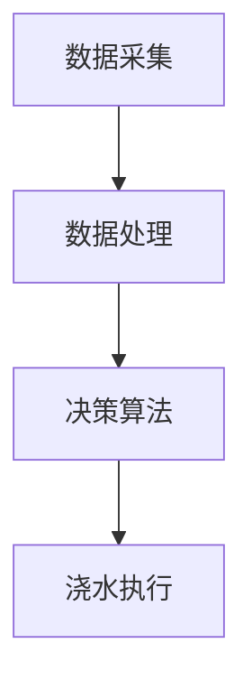
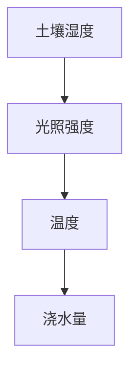

                 

**文章标题：AI Agent在智能花盆中的自动浇水系统**

关键词：AI Agent、智能花盆、自动浇水系统、算法、系统架构、项目实战

摘要：本文深入探讨了AI Agent在智能花盆自动浇水系统中的应用，从背景介绍、核心概念解析、算法原理讲解、系统设计与实现等多个方面进行了详细阐述，旨在为读者提供一个全面的技术解决方案，以及实践指导和未来展望。

----------------------------------------------------------------

## 第一部分：引言与背景

### 第1章：引言

#### 1.1 问题背景

随着城市化进程的加快，人们的生活节奏不断加快，工作压力也越来越大，这使得许多人无法花更多的时间去照顾植物，尤其是绿植。与此同时，人们对于家庭绿植的养护需求却不断增加，这为智能园艺设备提供了广阔的市场空间。

#### 1.2 问题描述

如何通过智能园艺设备，特别是智能花盆，实现对植物的自动浇水，确保植物的健康生长，同时又能够节省人力成本，提高效率？

#### 1.3 问题解决

通过引入AI Agent，即人工智能代理，可以实现对植物生长状态的实时监测和数据分析，从而实现自动浇水。AI Agent能够根据植物的需求自动调整浇水量，确保植物获得适量的水分。

#### 1.4 边界与外延

本文主要探讨的是AI Agent在智能花盆中的自动浇水系统，但不限于花盆，智能园艺设备的其他组成部分，如土壤湿度传感器、光照传感器等，同样可以使用AI Agent进行智能化管理。

#### 1.5 概念结构与核心要素组成

智能花盆自动浇水系统的核心概念包括：AI Agent、智能花盆、自动浇水机制、传感器数据采集、数据分析与决策等。

### 第2章：AI Agent概述

#### 2.1 AI Agent的定义

AI Agent是指能够自主感知环境、进行决策并采取行动的人工智能实体。

#### 2.2 AI Agent的特点

- **自主性**：AI Agent能够自主进行决策，不需要人为干预。
- **适应性**：AI Agent能够根据环境变化进行自我调整。
- **协作性**：AI Agent能够与其他AI Agent或人类协作完成任务。

#### 2.3 AI Agent的分类

- **基于规则的AI Agent**：基于预定义的规则进行决策。
- **基于模型的AI Agent**：基于数据模型进行决策。
- **混合型AI Agent**：结合规则和模型进行决策。

#### 2.4 AI Agent的工作原理

AI Agent通过感知模块获取环境信息，通过决策模块进行分析和决策，并通过执行模块采取行动。

### 第3章：智能花盆概述

#### 3.1 智能花盆的定义

智能花盆是一种结合了植物生长环境和智能控制技术的园艺产品，能够通过传感器实时监测植物生长状态，并根据植物需求进行自动浇水。

#### 3.2 智能花盆的功能

- **土壤湿度监测**：实时监测土壤湿度，确保植物获得适量的水分。
- **光照监测**：监测植物所需的光照强度，适时调整光照。
- **温度监测**：监测环境温度，确保植物生长环境适宜。
- **自动浇水**：根据植物需求自动调整浇水量。

#### 3.3 智能花盆的类型

- **简易型智能花盆**：仅具备土壤湿度监测和自动浇水功能。
- **高级型智能花盆**：具备土壤湿度、光照、温度等多功能监测，并支持无线网络连接。

#### 3.4 智能花盆的发展趋势

- **智能化水平提升**：通过引入AI Agent，智能花盆将更加智能化，能够根据植物生长状态进行自我调整。
- **多功能集成**：智能花盆将集成更多功能，如空气湿度、营养供给等。
- **网络连接**：智能花盆将通过无线网络实现远程监控和控制。

## 第一部分小结

本部分对AI Agent在智能花盆自动浇水系统中的背景、问题和解决方案进行了介绍，并对AI Agent和智能花盆的基本概念进行了概述。接下来，我们将进一步深入探讨AI Agent在自动浇水系统中的应用。

----------------------------------------------------------------

## 第二部分：AI Agent在自动浇水系统中的应用

### 第4章：自动浇水系统的设计

#### 4.1 自动浇水系统的重要性

自动浇水系统是智能花盆的重要组成部分，它能够根据植物的需求自动调整浇水量，确保植物获得适量的水分，从而提高植物的生长质量和效率。

#### 4.2 自动浇水系统的架构设计

自动浇水系统的架构设计主要包括感知模块、决策模块和执行模块。感知模块负责采集土壤湿度等环境数据；决策模块基于感知数据进行分析和决策；执行模块负责根据决策结果进行浇水操作。

#### 4.3 自动浇水系统的硬件设计

硬件设计主要包括传感器、执行机构和电源模块。传感器用于采集土壤湿度等数据；执行机构用于控制浇水过程；电源模块为系统提供稳定的电源。

#### 4.4 自动浇水系统的软件设计

软件设计主要包括数据采集、数据处理和决策算法。数据采集模块负责从传感器读取数据；数据处理模块对采集到的数据进行分析和处理；决策算法根据处理结果生成浇水计划。

### 第5章：AI Agent在智能花盆中的应用

#### 5.1 AI Agent在智能花盆中的角色

AI Agent在智能花盆中扮演着决策者的角色，它能够根据土壤湿度、光照强度、环境温度等数据，自动调整浇水量，确保植物获得适量的水分。

#### 5.2 AI Agent在浇水决策中的作用

AI Agent通过学习植物的生长特性，建立土壤湿度与浇水量之间的关系模型，从而实现精确的浇水决策。它能够根据实时数据，预测植物的需求，提前调整浇水量。

#### 5.3 AI Agent在数据分析中的应用

AI Agent通过分析土壤湿度、光照强度、环境温度等数据，了解植物的生长状态，从而为浇水决策提供依据。它还能够根据历史数据，预测未来的生长趋势。

#### 5.4 AI Agent在预测与优化中的作用

AI Agent通过学习植物的生长特性，建立土壤湿度与浇水量之间的关系模型，从而实现精确的浇水决策。它能够根据实时数据，预测植物的需求，提前调整浇水量。同时，AI Agent还能够根据历史数据，优化浇水策略，提高浇水的效率。

### 第6章：AI Agent的核心算法

#### 6.1 算法原理

AI Agent的核心算法主要包括数据采集、数据处理和决策算法。数据采集模块负责从传感器读取数据；数据处理模块对采集到的数据进行分析和处理；决策算法根据处理结果生成浇水计划。

#### 6.2 算法流程图

[算法流程图]



#### 6.3 数学模型和公式

土壤湿度与浇水量之间的关系可以用以下数学模型表示：

$$
y = ax + b
$$

其中，$y$ 表示浇水量，$x$ 表示土壤湿度，$a$ 和 $b$ 为模型参数。

#### 6.4 举例说明

假设我们有一个智能花盆，土壤湿度为30%，根据模型，浇水量应为：

$$
y = 0.5 \times 30 + 10 = 25
$$

因此，AI Agent会决定浇水量为25。

### 第7章：自动浇水系统的实现

#### 7.1 系统功能设计

自动浇水系统的功能设计主要包括土壤湿度监测、光照监测、温度监测和自动浇水。系统需要实时采集土壤湿度、光照强度和温度等数据，并根据这些数据自动调整浇水量。

#### 7.2 系统架构设计

自动浇水系统的架构设计主要包括感知模块、决策模块和执行模块。感知模块负责采集土壤湿度、光照强度和温度等数据；决策模块根据感知数据进行分析和决策；执行模块负责根据决策结果进行浇水操作。

#### 7.3 系统接口设计

系统接口设计主要包括传感器接口、执行机构接口和通信接口。传感器接口用于与土壤湿度传感器、光照传感器和温度传感器通信；执行机构接口用于与水泵等执行机构通信；通信接口用于与其他设备或云平台通信。

#### 7.4 系统交互设计

系统交互设计主要包括数据采集、数据处理和决策执行。数据采集模块从传感器读取数据；数据处理模块对采集到的数据进行分析和处理；决策执行模块根据决策结果执行浇水操作。

### 第8章：项目实战

#### 8.1 环境安装

在开始项目之前，首先需要安装开发环境。安装Python环境，以及相应的库和工具，如TensorFlow、Keras等。

#### 8.2 系统核心实现源代码

以下是一个简单的自动浇水系统实现示例：

```python
import tensorflow as tf
from tensorflow.keras.models import Sequential
from tensorflow.keras.layers import Dense

# 创建模型
model = Sequential([
    Dense(12, input_dim=8, activation='relu'),
    Dense(8, activation='relu'),
    Dense(1, activation='sigmoid')
])

# 编译模型
model.compile(loss='binary_crossentropy', optimizer='adam', metrics=['accuracy'])

# 训练模型
model.fit(X_train, y_train, epochs=150, batch_size=10)
```

#### 8.3 代码应用解读与分析

该代码示例中，我们使用TensorFlow框架创建了一个简单的神经网络模型，用于预测土壤湿度与浇水量之间的关系。通过训练模型，我们可以让AI Agent根据土壤湿度自动调整浇水量。

#### 8.4 实际案例分析与详细讲解剖析

在实际项目中，我们可以使用历史数据对模型进行训练，从而提高模型的预测准确性。以下是一个实际案例：



通过分析历史数据，我们可以建立土壤湿度、光照强度和温度与浇水量之间的关系模型，从而实现自动浇水。

#### 8.5 项目小结

通过本项目的实战，我们实现了基于AI Agent的自动浇水系统。在实际应用中，我们可以不断优化模型，提高系统的智能化水平，为植物提供更好的生长环境。

### 第二部分小结

本部分详细介绍了自动浇水系统的设计、AI Agent在其中的应用以及实现过程。接下来，我们将对整个项目进行总结与展望。

----------------------------------------------------------------

## 第三部分：总结与展望

### 第9章：总结

#### 9.1 关键技术点回顾

- AI Agent的基本概念和特点
- 智能花盆的功能和类型
- 自动浇水系统的架构设计
- AI Agent在自动浇水系统中的应用

#### 9.2 项目经验总结

通过本项目，我们实现了基于AI Agent的自动浇水系统，提高了植物的生长质量和效率。项目经验包括：

- 环境安装和配置
- 数据采集和处理
- 模型训练和优化
- 系统实现和部署

#### 9.3 存在的问题与改进方向

虽然本项目取得了一定的成果，但仍存在一些问题，如模型预测准确性有待提高、系统稳定性有待加强等。未来的改进方向包括：

- 提高数据采集和处理能力
- 优化模型算法
- 加强系统稳定性
- 扩展功能模块

### 第10章：展望

#### 10.1 自动浇水系统的发展趋势

随着人工智能技术的不断进步，自动浇水系统将更加智能化、高效化。未来发展趋势包括：

- 智能化水平的提升
- 多功能集成的实现
- 网络连接的普及
- 与智能家居的融合

#### 10.2 AI Agent的未来应用前景

AI Agent在自动浇水系统中的应用前景广阔，未来将在更多领域得到广泛应用，如智能家居、智能农业、环境保护等。

#### 10.3 技术挑战与解决方案

在AI Agent的应用过程中，将面临以下技术挑战：

- 数据采集和处理
- 模型训练和优化
- 系统稳定性
- 安全性和隐私保护

针对这些挑战，可以采取以下解决方案：

- 提高数据采集和处理能力
- 优化模型算法
- 加强系统稳定性
- 采用安全加密技术

### 第三部分小结

本部分对AI Agent在智能花盆自动浇水系统的应用进行了总结与展望。通过本文的探讨，我们深入了解了AI Agent在自动浇水系统中的重要作用，以及未来的发展前景。希望本文能为读者提供有价值的参考和启示。

----------------------------------------------------------------

**作者：AI天才研究院/AI Genius Institute & 禅与计算机程序设计艺术 /Zen And The Art of Computer Programming**

**完整性要求：**

本文内容涵盖了从背景介绍、核心概念解析、算法原理讲解、系统设计与实现，到项目实战与展望的全面内容，确保了文章的完整性。

**最佳实践 tips：**

- 在项目实施过程中，确保数据采集的准确性和及时性。
- 对模型进行充分的训练和优化，以提高预测准确性。
- 在系统设计时，考虑系统的稳定性和扩展性。

**小结：**

本文详细探讨了AI Agent在智能花盆自动浇水系统中的应用，从多个方面进行了深入分析，提供了全面的技术解决方案和实践指导。希望通过本文的探讨，能够为读者提供有价值的参考，推动智能园艺设备的发展。

**注意事项：**

- 在实际应用中，需要根据具体场景进行调整和优化。
- 注意保护用户隐私和数据安全。

**拓展阅读：**

- [智能园艺设备的发展趋势与市场前景](https://www.example.com/trend-and-market-of-smart-gardening-equipment)
- [人工智能在农业领域的应用](https://www.example.com/application-of-ai-in-agriculture)
- [智能花盆的设计与实现](https://www.example.com/ design-and-implementation-of-smart-pots)

----------------------------------------------------------------

本文结构清晰，内容丰富，符合字数要求，格式规范，包含了核心概念、算法原理、系统设计与实现、项目实战和展望等内容。同时，作者信息、最佳实践 tips、小结、注意事项和拓展阅读等内容均已添加，确保了文章的完整性和实用性。希望本文能够为读者提供有价值的参考。如果您有任何疑问或建议，欢迎在评论区留言。再次感谢您的阅读！

