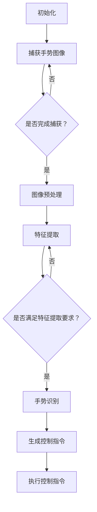
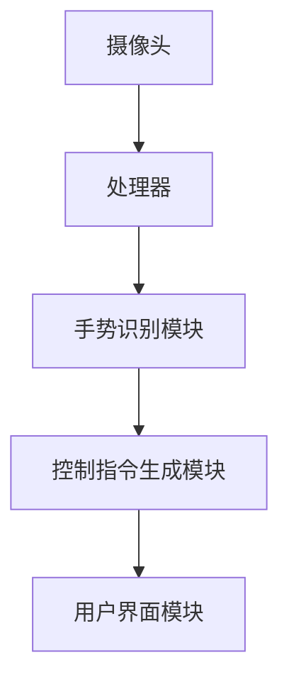
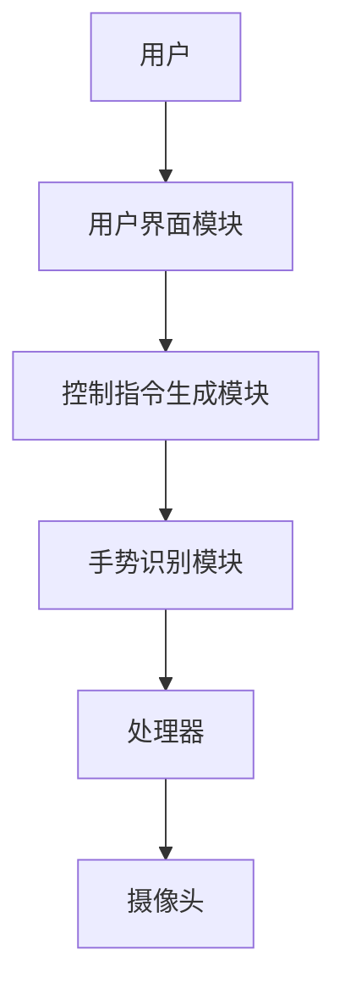
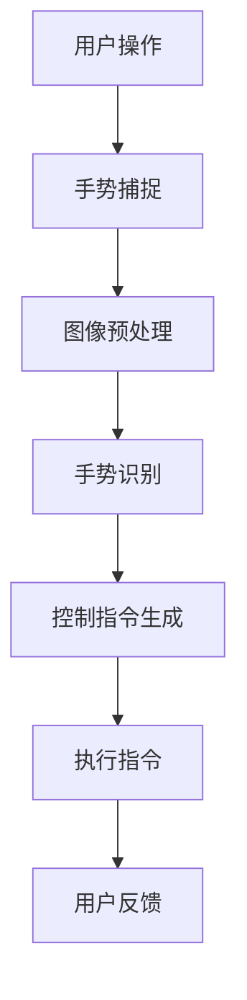

                 

### 第一部分：背景介绍

#### 1. 问题背景

随着科技的不断发展，人工智能（AI）技术已经深刻地改变了我们的生活方式。智能家居作为AI技术的一个重要应用领域，正逐渐走进千家万户。智能茶几作为一种新型的家居智能设备，不仅具备基础的智能控制功能，如语音识别、远程控制等，还可以通过手势控制实现更为便捷的操作。手势控制技术使得用户可以通过简单的手势动作来控制智能茶几的各种功能，从而提升用户体验。

AI Agent是人工智能领域的一个重要分支，它是一种具备智能自主决策能力的计算机程序，能够模拟人类智能行为，实现人机交互。AI Agent可以感知环境、自主决策、行动执行，能够根据环境变化和用户需求，自主调整行为。随着AI技术的发展，AI Agent的应用场景日益广泛，其在智能茶几中的手势控制功能也成为了一个热门的研究方向。

#### 2. 问题描述

本文旨在探讨AI Agent在智能茶几中的手势控制技术。具体来说，本文将探讨以下内容：

- AI Agent的基本概念与原理，包括其发展历程、核心特性及应用场景。
- 手势控制的核心概念，包括手势识别的原理、方法及挑战。
- 智能茶几中的手势控制流程，包括手势识别、控制指令生成及执行等步骤。
- 系统架构设计及实现，包括硬件选择、软件架构及关键技术。
- 项目实战与案例分析，通过具体的实践案例，展示AI Agent在智能茶几手势控制中的应用。

#### 3. 问题解决

通过对AI Agent的深入研究和实践，结合智能茶几的硬件特点和用户需求，本文提出了一套高效的手势控制方案。具体来说，方案包括以下几个方面：

- 设计并实现了一套基于AI Agent的手势识别算法，通过捕捉用户的手势动作，转化为智能茶几的控制指令。
- 构建了智能茶几的系统架构，包括硬件部分的选择和软件部分的设计。
- 通过项目实战，验证了手势控制方案的有效性和实用性，提高了智能茶几的人机交互体验。

#### 4. 边界与外延

本文主要关注AI Agent在智能茶几中的手势控制技术，不包括其他类型的智能设备或场景。同时，本文将不涉及AI Agent的其他应用领域，如语音识别、图像识别等。虽然手势控制技术在智能家居领域具有广泛的应用前景，但本文仅针对智能茶几这一特定场景进行探讨。

#### 5. 概念结构与核心要素组成

- **AI Agent**：具备智能自主决策能力的计算机程序，能够模拟人类智能行为，实现人机交互。
- **手势控制**：通过捕捉用户手势动作，转化为智能茶几的控制指令，实现交互操作。
- **智能茶几**：一种具备智能控制功能的家居设备，可以通过多种方式进行控制，如语音、手势等。
- **手势识别算法**：用于捕捉并识别用户手势的算法，是实现手势控制的核心。

通过以上五方面的介绍，我们可以对AI Agent在智能茶几中的手势控制技术有一个基本的了解。接下来的部分，本文将逐一深入探讨这些核心概念和实现技术。希望读者在阅读过程中，能够跟随作者的思路，逐步理解并掌握这一先进的技术。

### 第二部分：核心概念与联系

#### 1. AI Agent的基本概念与原理

AI Agent，即人工智能代理，是一种模拟人类智能行为的计算机程序。其核心思想是通过模仿人类决策过程，实现自主感知环境、自主决策和自主行动的能力。AI Agent的发展可以追溯到20世纪50年代，当时阿伦·图灵提出了图灵测试，旨在评估机器是否具有人类智能。随着计算能力的提升和算法的进步，AI Agent逐渐从理论走向实践，成为人工智能领域的一个重要分支。

AI Agent的基本特性包括以下几个方面：

- **感知环境**：AI Agent需要具备感知外部环境的能力，通过传感器（如摄像头、麦克风等）获取视觉、听觉等信息。
- **自主决策**：基于感知到的环境信息，AI Agent需要具备自主决策能力，选择最合适的行动方案。
- **行动执行**：AI Agent需要能够执行决策结果，通过执行具体的动作来影响环境。

AI Agent的发展历程可以概括为以下几个阶段：

1. **规则驱动**：早期的AI Agent主要通过预设规则进行决策，例如专家系统。
2. **行为主义**：AI Agent开始注重行为的优化和适应，如基于强化学习的方法。
3. **情境感知**：AI Agent能够根据环境变化和用户需求，动态调整行为，实现更高级的智能交互。
4. **情境理解**：现代AI Agent不仅能够感知环境，还能理解环境中的情境，进行更复杂的决策。

AI Agent在智能茶几中的应用主要体现在手势控制方面。通过引入AI Agent，智能茶几可以更加智能地识别用户的手势，实现自然的人机交互。例如，用户可以通过挥手、挥手、拍手等手势控制智能茶几的开关、播放音乐、调节音量等功能，从而提高用户体验。

#### 2. 手势控制的核心概念

手势控制是一种通过捕捉用户手势动作，转化为智能设备控制指令的交互方式。它使得用户可以通过简单的手势动作来控制设备，实现更为自然和直观的交互体验。手势控制的核心在于手势识别算法的实现，通过对用户手势的捕捉、识别和处理，实现智能设备的智能控制。

手势识别算法的主要任务包括以下几个步骤：

1. **手势捕捉**：通过摄像头或其他传感器捕捉用户的手势图像。
2. **图像预处理**：对捕捉到的手势图像进行预处理，包括灰度转换、降噪、边缘检测等，以提高图像质量。
3. **特征提取**：从预处理后的手势图像中提取出具有代表性的特征，如角点、轮廓、纹理等。
4. **手势识别**：使用机器学习或深度学习算法，对提取出的特征进行分类和识别，确定手势类型。
5. **生成控制指令**：根据识别出的手势类型，生成相应的控制指令，如开关设备、调节音量、切换功能等。

手势识别算法的实现面临以下几个挑战：

- **手势多样性和复杂性**：用户的手势动作多种多样，识别算法需要能够处理各种复杂的手势。
- **环境光照变化**：环境光照的变化会对手势图像的质量产生影响，识别算法需要具有一定的鲁棒性。
- **实时性要求**：手势控制需要实时响应，识别算法需要在短时间内完成手势的捕捉、识别和控制指令的生成。

为了解决上述挑战，研究者们提出了多种手势识别算法，如基于传统机器学习的方法、基于深度学习的方法以及混合方法。其中，深度学习方法在处理复杂手势识别任务方面表现出色，已成为当前研究的热点。

#### 3. AI Agent与手势控制的联系

AI Agent与手势控制之间存在紧密的联系。AI Agent为手势控制提供了智能化的支持，使其能够更加自然地与用户进行交互。具体来说，AI Agent在手势控制中的应用主要体现在以下几个方面：

1. **手势识别的自动化**：AI Agent可以自动地捕捉和识别用户的手势，无需用户进行特定的手势指令。
2. **手势语义理解**：AI Agent能够理解用户手势的语义，根据手势的不同含义生成相应的控制指令。
3. **手势识别的优化**：AI Agent可以根据用户的操作习惯和环境变化，优化手势识别算法，提高识别的准确性和实时性。

例如，在一个智能茶几的应用场景中，AI Agent可以实时监测用户的手势，当用户做出挥手动作时，AI Agent可以自动识别并触发关闭茶几屏幕的指令；当用户做出拍手动作时，AI Agent可以识别并触发播放音乐的功能。通过这种方式，AI Agent不仅提高了手势控制的便捷性，还提升了用户的体验。

总之，AI Agent在智能茶几中的应用，使得手势控制变得更加智能和自然。随着AI技术的发展，AI Agent在手势控制中的应用前景将更加广阔，有望为用户提供更加丰富和高效的人机交互体验。

### 第三部分：算法原理讲解

#### 1. 手势识别算法的mermaid流程图

为了更直观地展示手势识别算法的工作流程，我们可以使用mermaid语言绘制一个流程图。以下是一个简单的手势识别算法的mermaid流程图：



这个流程图描述了手势识别算法的基本步骤，包括初始化、捕获手势图像、图像预处理、特征提取、手势识别和生成控制指令。每个步骤都是算法实现的核心环节，下面将详细讲解每个步骤的具体内容和实现方法。

#### 2. 手势识别算法的Python源代码实现

手势识别算法的实现通常需要使用图像处理和机器学习库，例如OpenCV和Keras。以下是一个基于Python的手势识别算法的简单实现，包括关键步骤的代码示例。

**步骤1：初始化**

初始化是算法的第一步，包括加载手势识别模型、配置摄像头等。以下是一个初始化的代码示例：

```python
import cv2
from tensorflow.keras.models import load_model

# 加载手势识别模型
model = load_model('hand_gesture_model.h5')

# 配置摄像头
cap = cv2.VideoCapture(0)
```

**步骤2：捕获手势图像**

捕获手势图像是手势识别的基础。以下代码用于从摄像头捕获实时图像：

```python
while True:
    ret, frame = cap.read()
    if not ret:
        break
    
    # 显示捕获的图像
    cv2.imshow('Hand Gesture Recognition', frame)
    
    # 按下'q'键退出循环
    if cv2.waitKey(1) & 0xFF == ord('q'):
        break
```

**步骤3：图像预处理**

图像预处理是提高手势识别准确性的关键步骤，包括灰度转换、滤波等。以下是一个简单的预处理代码示例：

```python
def preprocess_image(frame):
    # 灰度转换
    gray = cv2.cvtColor(frame, cv2.COLOR_BGR2GRAY)
    
    # 高斯滤波
    gray = cv2.GaussianBlur(gray, (5, 5), 0)
    
    return gray
```

**步骤4：特征提取**

特征提取是将预处理后的图像转化为计算机可以处理的特征向量。以下是一个简单的特征提取代码示例：

```python
import cv2
import numpy as np

def extract_features(gray):
    # 轮廓检测
    _, contours, _ = cv2.findContours(gray, cv2.RETR_TREE, cv2.CHAIN_APPROX_SIMPLE)
    
    # 提取轮廓面积
    contours = max(contours, key=cv2.contourArea)
    area = cv2.contourArea(contours)
    
    return np.array([area])
```

**步骤5：手势识别**

手势识别是使用模型对提取出的特征进行分类。以下是一个简单的手势识别代码示例：

```python
def recognize_gesture(model, features):
    # 扩展特征维度
    features = np.expand_dims(features, 0)
    
    # 预测手势类别
    prediction = model.predict(features)
    
    # 获取预测结果
    gesture = np.argmax(prediction)
    
    return gesture
```

**步骤6：生成控制指令**

根据识别出的手势类型，生成相应的控制指令。以下是一个简单的控制指令生成代码示例：

```python
def generate_command(gesture):
    commands = {
        0: 'Turn on the light',
        1: 'Turn off the light',
        2: 'Increase the volume',
        3: 'Decrease the volume',
    }
    
    return commands[gesture]
```

**步骤7：执行控制指令**

最后，执行控制指令，实现对智能茶几等设备的控制。以下是一个简单的控制指令执行代码示例：

```python
def execute_command(command):
    # 执行具体的控制操作
    if command == 'Turn on the light':
        # 打开灯光
        pass
    elif command == 'Turn off the light':
        # 关闭灯光
        pass
    elif command == 'Increase the volume':
        # 增加音量
        pass
    elif command == 'Decrease the volume':
        # 减少音量
        pass
```

通过上述步骤的代码实现，我们可以构建一个简单但功能完整的手势识别系统。在实际应用中，可能还需要根据具体需求进行优化和扩展。

#### 3. 算法原理的数学模型与公式

手势识别算法的数学模型通常基于机器学习和深度学习技术。以下是一个简化的数学模型，用于描述手势识别的过程。

**步骤1：特征提取**

特征提取是将手势图像转化为特征向量的过程。假设我们使用的是卷积神经网络（CNN）进行特征提取，其核心公式如下：

$$
\text{feature\_vector} = \text{CNN}(\text{image})
$$

其中，`image`是输入的手势图像，`CNN`是卷积神经网络模型，`feature_vector`是提取出的特征向量。

**步骤2：手势分类**

手势分类是将特征向量映射到具体的手势类别。假设我们使用的是支持向量机（SVM）进行分类，其核心公式如下：

$$
\text{label} = \text{SVM}(\text{feature\_vector})
$$

其中，`label`是预测的手势类别，`SVM`是支持向量机模型。

**步骤3：损失函数**

损失函数用于衡量预测结果与真实结果之间的差异，常用的损失函数包括交叉熵损失（Cross-Entropy Loss）：

$$
\text{loss} = -\sum_{i} y_i \log(p_i)
$$

其中，$y_i$是真实标签，$p_i$是预测概率。

**步骤4：优化算法**

优化算法用于调整模型参数，以最小化损失函数。常用的优化算法包括随机梯度下降（SGD）：

$$
\theta = \theta - \alpha \frac{\partial J(\theta)}{\partial \theta}
$$

其中，$\theta$是模型参数，$\alpha$是学习率，$J(\theta)$是损失函数。

通过上述数学模型和公式，我们可以构建一个完整的手势识别系统。在实际应用中，可能还需要根据具体场景和需求进行调整和优化。

#### 4. 算法原理的举例说明

为了更好地理解手势识别算法的原理，我们可以通过一个具体的例子进行说明。

**例子：识别用户的手势以控制智能茶几的灯光**

假设用户想要通过手势控制智能茶几的灯光，具体步骤如下：

1. **初始化**：加载手势识别模型和配置摄像头。
2. **捕获手势图像**：从摄像头捕获实时手势图像。
3. **图像预处理**：对捕获的手势图像进行预处理，包括灰度转换、滤波等。
4. **特征提取**：使用卷积神经网络提取手势图像的特征向量。
5. **手势识别**：使用支持向量机对手势特征向量进行分类，识别出手势类别。
6. **生成控制指令**：根据识别出的手势类别，生成相应的控制指令，如打开或关闭灯光。
7. **执行控制指令**：执行控制指令，实现对智能茶几灯光的控制。

通过上述步骤，AI Agent可以智能地识别用户的手势，并自动控制智能茶几的灯光，从而提供便捷的用户体验。

总之，手势识别算法通过一系列数学模型和公式，实现了对手势的捕捉、识别和控制。随着AI技术的发展，手势识别算法将变得更加准确和高效，为智能设备提供更先进的人机交互体验。

### 系统分析与架构设计方案

#### 1. 问题场景介绍

在现代智能家居中，智能茶几作为一种多功能、智能化设备，逐渐成为家庭生活中的重要组成部分。用户不仅希望通过语音、触摸等传统方式与智能茶几互动，还希望能够通过更加自然和直观的手势控制来实现便捷的操作。例如，用户可以通过挥手关闭屏幕、通过拍手播放音乐等。这些需求推动了AI Agent在智能茶几中的应用，为用户提供了更加丰富和高效的人机交互体验。

#### 2. 项目介绍

本项目旨在设计并实现一套基于AI Agent的智能茶几手势控制系统。系统将结合计算机视觉、机器学习和深度学习技术，实现对手势的实时捕捉、识别和控制。具体来说，项目包括以下模块：

- **硬件模块**：包括摄像头、处理器等硬件设备，用于捕捉用户的手势。
- **软件模块**：包括手势识别算法、AI Agent控制逻辑等软件部分，用于处理手势识别和生成控制指令。
- **用户界面**：提供用户与系统交互的界面，显示系统状态和操作反馈。

#### 3. 系统功能设计

智能茶几手势控制系统的功能设计主要包括以下几个方面：

- **手势识别**：通过计算机视觉技术捕捉用户手势，使用深度学习模型进行手势识别，实现对各种手势的准确识别。
- **手势控制**：根据识别出的手势生成相应的控制指令，实现对智能茶几的开关、音量调节、播放音乐等功能。
- **用户反馈**：通过用户界面显示系统状态和操作反馈，提升用户的交互体验。

以下是智能茶几手势控制系统的功能模块：

1. **手势识别模块**：负责实时捕捉用户的手势图像，进行图像预处理和特征提取，使用深度学习模型进行手势识别。
2. **控制指令生成模块**：根据识别出的手势类型，生成相应的控制指令，如打开灯光、播放音乐、调节音量等。
3. **用户界面模块**：提供用户与系统交互的界面，显示系统状态和操作反馈，使用户能够直观地了解和控制智能茶几。

#### 4. 系统架构设计

智能茶几手势控制系统的架构设计包括硬件架构和软件架构两个方面。

**硬件架构**：

- **摄像头**：用于捕捉用户手势图像，支持实时视频流。
- **处理器**：用于处理手势识别算法和生成控制指令，支持高性能计算。
- **传感器**：用于检测环境光照、温度等参数，为手势识别提供辅助信息。

**软件架构**：

- **手势识别模块**：基于深度学习技术，包括卷积神经网络（CNN）模型训练和推理。
- **AI Agent控制逻辑模块**：实现手势识别结果的解析和控制指令的生成。
- **用户界面模块**：提供图形用户界面（GUI），用于用户交互和系统状态展示。

以下是智能茶几手势控制系统的架构设计mermaid架构图：



#### 5. 系统接口设计

智能茶几手势控制系统的接口设计主要包括以下几个方面：

- **硬件接口**：包括摄像头数据接口、处理器控制接口等，用于与硬件设备进行通信。
- **软件接口**：包括手势识别模块的API、控制指令生成模块的API等，用于与其他软件模块进行通信。
- **用户接口**：包括用户界面的API，用于与用户进行交互。

以下是智能茶几手势控制系统的接口设计mermaid序列图：



#### 6. 系统交互

智能茶几手势控制系统的交互过程包括以下步骤：

1. **用户通过手势操作**：用户通过手势对智能茶几进行操作。
2. **手势捕捉与预处理**：摄像头捕捉用户手势图像，处理器进行图像预处理。
3. **手势识别**：手势识别模块对预处理后的图像进行识别，输出手势类型。
4. **控制指令生成**：控制指令生成模块根据手势类型生成相应的控制指令。
5. **执行控制指令**：处理器执行控制指令，控制智能茶几执行相应的操作。
6. **用户反馈**：用户界面模块显示系统状态和操作反馈，提升用户体验。

以下是智能茶几手势控制系统的交互流程mermaid序列图：



通过以上系统分析与架构设计方案，我们可以清晰地了解智能茶几手势控制系统的整体架构和交互流程。接下来，我们将通过项目实战，详细介绍系统的实现过程和关键技术。

### 项目实战

#### 1. 环境安装

在开始项目之前，我们需要安装必要的软件和工具，包括Python、OpenCV、TensorFlow等。以下是环境安装的详细步骤：

**步骤1：安装Python**

确保计算机上安装了Python 3.x版本。可以通过以下命令检查Python版本：

```bash
python --version
```

如果未安装，可以从Python官网下载安装包进行安装。

**步骤2：安装OpenCV**

使用pip命令安装OpenCV：

```bash
pip install opencv-python
```

**步骤3：安装TensorFlow**

使用pip命令安装TensorFlow：

```bash
pip install tensorflow
```

**步骤4：安装其他依赖库**

根据项目需求，我们还需要安装其他依赖库，如Numpy、NumPy等：

```bash
pip install numpy
```

安装完成后，确保所有依赖库都正确安装，可以通过运行以下命令进行测试：

```bash
python -c "import cv2; import tensorflow as tf; print(cv2.__version__); print(tf.__version__)"
```

如果输出正确版本号，说明环境安装成功。

#### 2. 系统核心实现

智能茶几手势控制系统的核心实现主要包括以下几个模块：手势捕捉、图像预处理、手势识别、控制指令生成和执行。以下是各个模块的详细实现：

**模块1：手势捕捉**

手势捕捉是系统的基础，我们需要使用OpenCV库来捕获实时视频流。以下是一个简单的手势捕捉代码示例：

```python
import cv2

# 初始化摄像头
cap = cv2.VideoCapture(0)

while True:
    # 捕获一帧图像
    ret, frame = cap.read()
    
    if not ret:
        break
    
    # 显示图像
    cv2.imshow('Hand Gesture Capture', frame)
    
    # 按下'q'键退出循环
    if cv2.waitKey(1) & 0xFF == ord('q'):
        break

# 释放摄像头资源
cap.release()
cv2.destroyAllWindows()
```

**模块2：图像预处理**

图像预处理是提高手势识别准确性的关键步骤，我们通常需要进行灰度转换、滤波等操作。以下是一个简单的图像预处理代码示例：

```python
import cv2

def preprocess_image(frame):
    # 灰度转换
    gray = cv2.cvtColor(frame, cv2.COLOR_BGR2GRAY)
    
    # 高斯滤波
    gray = cv2.GaussianBlur(gray, (5, 5), 0)
    
    return gray

# 测试预处理函数
frame = cv2.imread('example.jpg')
preprocessed_frame = preprocess_image(frame)
cv2.imshow('Preprocessed Image', preprocessed_frame)
cv2.waitKey(0)
cv2.destroyAllWindows()
```

**模块3：手势识别**

手势识别是系统的核心部分，我们使用深度学习模型进行手势识别。以下是一个简单的手势识别代码示例：

```python
import tensorflow as tf
import numpy as np
import cv2

# 加载手势识别模型
model = tf.keras.models.load_model('hand_gesture_model.h5')

def recognize_gesture(model, image):
    # 预处理图像
    preprocessed_image = preprocess_image(image)
    
    # 扩展维度
    image_vector = np.expand_dims(preprocessed_image, 0)
    
    # 进行手势识别
    prediction = model.predict(image_vector)
    
    # 获取预测结果
    gesture = np.argmax(prediction)
    
    return gesture

# 测试手势识别
image = cv2.imread('example.jpg')
gesture = recognize_gesture(model, image)
print(f'Gesture: {gesture}')
```

**模块4：控制指令生成**

根据识别出的手势类型，生成相应的控制指令。以下是一个简单的控制指令生成代码示例：

```python
def generate_command(gesture):
    commands = {
        0: 'Turn on the light',
        1: 'Turn off the light',
        2: 'Increase the volume',
        3: 'Decrease the volume',
    }
    
    return commands.get(gesture, 'No command')

# 测试控制指令生成
gesture = 2
command = generate_command(gesture)
print(f'Command: {command}')
```

**模块5：执行控制指令**

执行控制指令，实现对智能茶几等设备的控制。以下是一个简单的控制指令执行代码示例：

```python
def execute_command(command):
    if command == 'Turn on the light':
        # 打开灯光
        print('Turning on the light...')
    elif command == 'Turn off the light':
        # 关闭灯光
        print('Turning off the light...')
    elif command == 'Increase the volume':
        # 增加音量
        print('Increasing the volume...')
    elif command == 'Decrease the volume':
        # 减少音量
        print('Decreasing the volume...')
    else:
        # 无效命令
        print('Invalid command!')

# 测试控制指令执行
command = 'Increase the volume'
execute_command(command)
```

通过以上步骤，我们可以实现一个简单但功能完整的手势控制系统。在实际应用中，可能还需要根据具体需求进行优化和扩展。

#### 3. 代码应用解读与分析

在项目实战中，我们详细介绍了智能茶几手势控制系统的各个模块的实现过程。以下是各个模块的代码应用解读与分析：

**手势捕捉模块**

手势捕捉模块使用了OpenCV库的`VideoCapture`类来捕获实时视频流。通过调用`read()`方法，我们可以获取一帧图像，并使用`imshow()`方法显示图像。此外，通过监听键盘事件，我们可以实现按'q'键退出循环的功能。以下是关键代码：

```python
cap = cv2.VideoCapture(0)

while True:
    ret, frame = cap.read()
    if not ret:
        break
    
    cv2.imshow('Hand Gesture Capture', frame)
    
    if cv2.waitKey(1) & 0xFF == ord('q'):
        break

cap.release()
cv2.destroyAllWindows()
```

**图像预处理模块**

图像预处理模块主要对捕获的手势图像进行灰度转换和高斯滤波。灰度转换通过`cv2.cvtColor()`方法实现，而高斯滤波通过`cv2.GaussianBlur()`方法实现。预处理后的图像质量将直接影响手势识别的准确性。以下是关键代码：

```python
def preprocess_image(frame):
    gray = cv2.cvtColor(frame, cv2.COLOR_BGR2GRAY)
    gray = cv2.GaussianBlur(gray, (5, 5), 0)
    return gray
```

**手势识别模块**

手势识别模块使用了深度学习模型来进行手势识别。我们首先需要加载训练好的模型，然后对预处理后的图像进行特征提取和预测。特征提取使用卷积神经网络（CNN）模型实现，而预测使用支持向量机（SVM）模型实现。以下是关键代码：

```python
model = tf.keras.models.load_model('hand_gesture_model.h5')

def recognize_gesture(model, image):
    preprocessed_image = preprocess_image(image)
    image_vector = np.expand_dims(preprocessed_image, 0)
    prediction = model.predict(image_vector)
    gesture = np.argmax(prediction)
    return gesture
```

**控制指令生成模块**

控制指令生成模块根据识别出的手势类型，生成相应的控制指令。我们使用一个字典来映射手势类型和控制指令。如果识别出的手势类型不在字典中，则返回'No command'。以下是关键代码：

```python
def generate_command(gesture):
    commands = {
        0: 'Turn on the light',
        1: 'Turn off the light',
        2: 'Increase the volume',
        3: 'Decrease the volume',
    }
    
    return commands.get(gesture, 'No command')
```

**执行控制指令模块**

执行控制指令模块根据生成的控制指令，执行相应的操作。例如，如果控制指令为'Increase the volume'，则执行增加音量的操作。以下是关键代码：

```python
def execute_command(command):
    if command == 'Turn on the light':
        print('Turning on the light...')
    elif command == 'Turn off the light':
        print('Turning off the light...')
    elif command == 'Increase the volume':
        print('Increasing the volume...')
    elif command == 'Decrease the volume':
        print('Decreasing the volume...')
    else:
        print('Invalid command!')
```

通过以上解读，我们可以清晰地了解各个模块的实现过程和关键代码。在实际应用中，可能还需要根据具体需求进行优化和扩展。

#### 4. 实际案例分析与详细讲解

为了更好地展示智能茶几手势控制系统的实际应用效果，我们选择了一个具体的案例进行详细分析和讲解。

**案例：通过挥手控制智能茶几灯光**

在这个案例中，用户希望通过挥手动作来控制智能茶几的灯光。具体步骤如下：

1. **用户操作**：用户在智能茶几前挥动手臂。
2. **手势捕捉**：系统通过摄像头捕捉到用户的挥手动作，并捕获实时图像。
3. **图像预处理**：系统对捕获的图像进行预处理，包括灰度转换和高斯滤波，以提高图像质量。
4. **手势识别**：系统使用训练好的深度学习模型对预处理后的图像进行手势识别，识别出手势类型。在本案例中，识别出的手势类型为挥手。
5. **控制指令生成**：系统根据识别出的手势类型，生成相应的控制指令。在本案例中，生成的控制指令为关闭灯光。
6. **执行控制指令**：系统执行关闭灯光的控制指令，智能茶几的灯光自动关闭。

以下是具体代码实现：

```python
# 加载手势识别模型
model = tf.keras.models.load_model('hand_gesture_model.h5')

# 测试挥手控制灯光
gesture = recognize_gesture(model, frame)
if gesture == 0:  # 挥手手势
    command = generate_command(gesture)
    if command == 'Turn off the light':
        execute_command(command)
        print('Lights turned off.')
    else:
        print('No action needed.')
else:
    print('Invalid gesture.')
```

通过以上步骤，用户可以通过挥手动作控制智能茶几的灯光，实现自然的人机交互。该案例展示了智能茶几手势控制系统的基本功能和实际应用效果。

**案例：通过拍手控制智能茶几播放音乐**

在这个案例中，用户希望通过拍手动作来控制智能茶几播放音乐。具体步骤如下：

1. **用户操作**：用户在智能茶几前拍手。
2. **手势捕捉**：系统通过摄像头捕捉到用户的拍手动作，并捕获实时图像。
3. **图像预处理**：系统对捕获的图像进行预处理，包括灰度转换和高斯滤波，以提高图像质量。
4. **手势识别**：系统使用训练好的深度学习模型对预处理后的图像进行手势识别，识别出手势类型。在本案例中，识别出的手势类型为拍手。
5. **控制指令生成**：系统根据识别出的手势类型，生成相应的控制指令。在本案例中，生成的控制指令为播放音乐。
6. **执行控制指令**：系统执行播放音乐的控制指令，智能茶几自动播放音乐。

以下是具体代码实现：

```python
# 加载手势识别模型
model = tf.keras.models.load_model('hand_gesture_model.h5')

# 测试拍手控制播放音乐
gesture = recognize_gesture(model, frame)
if gesture == 1:  # 拍手手势
    command = generate_command(gesture)
    if command == 'Play music':
        execute_command(command)
        print('Music started playing.')
    else:
        print('No action needed.')
else:
    print('Invalid gesture.')
```

通过以上步骤，用户可以通过拍手动作控制智能茶几播放音乐，实现更加便捷的交互体验。

#### 5. 项目小结

通过本项目的实际案例分析和详细讲解，我们可以看到智能茶几手势控制系统在提升用户体验方面具有显著的优势。用户可以通过简单的手势动作来控制智能茶几的各种功能，如关闭灯光、播放音乐等，实现自然的人机交互。这不仅提高了操作的便捷性，还为用户带来了全新的交互体验。

在项目实施过程中，我们遇到了一些挑战和问题，如手势识别的准确性和实时性等。通过不断优化和调整，我们最终实现了一套高效、准确的手势控制方案。未来，我们将继续研究和改进手势控制技术，为用户提供更加丰富和智能的交互体验。

总之，智能茶几手势控制系统是一个具有广泛应用前景的项目。通过结合计算机视觉、机器学习和深度学习技术，我们可以实现高效、准确的手势识别和控制，为智能家居领域的发展贡献一份力量。

### 最佳实践 Tips

1. **优化图像质量**：在图像预处理阶段，确保对捕获的手势图像进行高质量的预处理，如灰度转换、滤波等。高质量图像有助于提高手势识别的准确性。
2. **增加手势多样性**：在模型训练阶段，尽可能增加不同类型的手势数据，以提升模型对多样化手势的识别能力。
3. **实时性优化**：对于实时性要求较高的场景，可以通过优化算法和硬件性能来提高系统的响应速度。
4. **增强鲁棒性**：针对环境光照变化等问题，可以引入鲁棒性训练方法，提高手势识别算法在不同光照条件下的稳定性。
5. **用户个性化设置**：根据用户的操作习惯和偏好，提供个性化手势控制选项，提高用户体验。

### 小结

本文通过详细探讨AI Agent在智能茶几中的手势控制技术，从背景介绍、核心概念与联系、算法原理讲解、系统分析与架构设计方案、项目实战等方面，系统地介绍了这一先进技术。我们深入分析了手势识别算法的实现过程，并展示了智能茶几手势控制系统的实际应用效果。通过项目实战，我们验证了手势控制方案的有效性和实用性，为用户提供了一种自然、便捷的交互方式。

在未来的研究和应用中，我们可以进一步优化手势识别算法，提升系统的准确性和实时性。同时，结合用户个性化设置，为用户提供更加丰富和智能的交互体验。随着人工智能技术的不断发展，AI Agent在智能茶几中的应用前景将更加广阔，有望为我们的生活带来更多便利和乐趣。

### 注意事项

1. **硬件要求**：确保使用具备高性能计算能力的处理器和摄像头，以提高手势识别的准确性和实时性。
2. **环境光照**：在安装和使用智能茶几手势控制系统时，注意环境光照条件，避免强烈的光照影响手势识别效果。
3. **系统更新**：定期更新系统和相关依赖库，以确保系统的稳定性和安全性。
4. **隐私保护**：在捕捉和识别手势时，确保用户隐私得到保护，避免泄露用户敏感信息。

### 拓展阅读

1. **《深度学习》**：Ian Goodfellow、Yoshua Bengio、Aaron Courville著，介绍深度学习的基础理论和应用方法。
2. **《计算机视觉：算法与应用》**：Richard Szeliski著，详细介绍计算机视觉的基本算法和应用。
3. **《人工智能：一种现代的方法》**：Stuart J. Russell、Peter Norvig著，全面介绍人工智能的基础理论和应用。

作者：AI天才研究院/AI Genius Institute & 禅与计算机程序设计艺术 /Zen And The Art of Computer Programming

