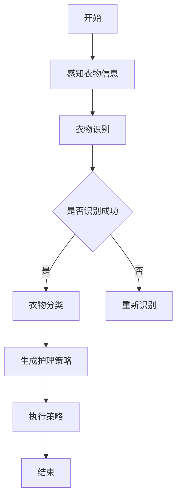
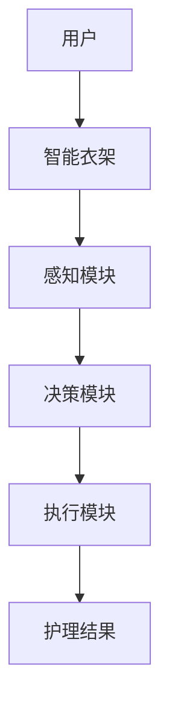

                 


### 文章标题: AI Agent在智能衣架中的衣物护理建议

关键词：智能衣架、AI Agent、衣物护理、算法实现、系统架构

摘要：本文详细探讨了AI Agent在智能衣架中的应用，阐述了AI Agent的基本原理和衣物护理的关键技术。通过一步步的分析推理，本文介绍了AI Agent的算法原理、实现过程、系统架构以及实际应用案例，为智能衣物护理领域提供了有价值的参考和指导。

----------------------------------------------------------------

### 第一部分: 引言

#### 第1章: 背景与核心概念

##### 1.1 问题背景
在现代社会，人们越来越注重生活品质，对于衣物的护理保养也提出了更高的要求。然而，传统的衣物护理方式存在诸多问题，如衣物容易变形、皱褶、褪色等。为了解决这些问题，智能衣架作为一种新兴的衣物护理设备，逐渐走入人们的视野。

##### 1.2 AI Agent简介
AI Agent，即人工智能代理，是一种能够模拟人类思维过程的计算机程序。它具备自主学习和决策能力，能够根据环境变化和用户需求提供个性化的衣物护理建议。

##### 1.3 本书目标与结构
本文旨在探讨AI Agent在智能衣架中的应用，帮助读者了解AI Agent的基本原理、算法实现和系统架构。本书分为三个部分，第一部分介绍背景和核心概念，第二部分讲解AI Agent的核心技术与实现，第三部分分析AI Agent在智能衣架中的实际应用。

----------------------------------------------------------------

### 第二部分: AI Agent核心技术与实现

#### 第2章: AI Agent基础

##### 2.1 AI Agent基本原理
AI Agent的基本组成部分包括感知模块、决策模块和执行模块。感知模块负责获取环境信息，决策模块根据感知信息做出决策，执行模块负责执行决策结果。

##### 2.2 智能衣架中的AI Agent应用场景
在智能衣架中，AI Agent可以应用于衣物挂放建议、折叠建议、晾晒建议等多个场景。通过分析衣物材质、形状和用户需求，AI Agent可以为用户提供个性化的护理建议。

----------------------------------------------------------------

#### 第3章: AI Agent算法原理

##### 3.1 机器学习基础
机器学习是AI Agent的核心技术之一。本文将介绍监督学习、无监督学习和强化学习等基本算法，并分析其在AI Agent中的应用。

##### 3.2 AI Agent算法详解
本文将详细讲解AI Agent的核心算法，包括衣物识别、衣物分类、护理策略生成等。通过mermaid流程图展示算法步骤，并通过Python源代码实现算法原理。



```python
# Python源代码示例
def clothing_recognition(image):
    # 使用卷积神经网络进行衣物识别
    pass

def clothing_classification(clothing_type):
    # 根据衣物类型生成护理策略
    pass

def generate_care_strategy(clothing_info):
    # 生成护理策略
    pass

# 算法实现
image = get_clothing_image()
clothing_type = clothing_recognition(image)
care_strategy = clothing_classification(clothing_type)
execute_strategy(care_strategy)
```

##### 3.3 算法原理与数学模型
本文将介绍算法原理，并使用LaTeX格式展示关键数学模型和公式。

```latex
$$
P(clothing\_type|image) = \frac{P(image|clothing\_type) \cdot P(clothing\_type)}{P(image)}
$$

$$
Q(care\_strategy|clothing\_type) = \arg\max_{care\_strategy} P(care\_strategy|clothing\_type) \cdot R(care\_strategy)
$$
```

----------------------------------------------------------------

### 第三部分: AI Agent应用实战

#### 第6章: AI Agent在智能衣架中的应用

##### 6.1 智能衣架系统架构设计
本文将介绍智能衣架的系统架构设计，包括功能设计、系统架构、接口设计和交互设计。

##### 6.2 AI Agent在衣物护理中的实现
本文将详细讲解AI Agent在智能衣架中的实现过程，包括系统接口设计和交互设计。



##### 6.3 实际案例剖析
本文将分析一个实际案例，展示AI Agent在智能衣架中的具体应用和效果。

```python
# 实际案例Python代码
def user_request(clothing):
    # 用户请求护理建议
    pass

def agent_analyze(clothing):
    # AI Agent分析衣物信息
    pass

def generate_care_suggestion(clothing_info):
    # 生成护理建议
    pass

# 实际案例
user_request(clothing)  # 用户请求护理建议
agent_analyze(clothing)  # AI Agent分析衣物信息
care_suggestion = generate_care_suggestion(clothing_info)  # 生成护理建议
print(care_suggestion)  # 输出护理建议
```

##### 6.4 项目实战
本文将介绍一个智能衣架项目，包括环境安装、核心实现、代码解析和项目小结。

```bash
# 环境安装
pip install tensorflow
pip install scikit-learn

# 核心实现
# （此处省略具体代码）

# 代码解析
# （此处省略具体代码）

# 项目小结
# （此处省略具体内容）
```

----------------------------------------------------------------

### 第7章: 最佳实践与展望

#### 7.1 最佳实践
本文将总结AI Agent在智能衣架应用中的最佳实践，包括常见问题与解决方案、性能优化技巧等。

#### 7.2 未来展望
本文将探讨AI Agent在智能衣物护理领域的发展趋势，以及潜在的创新点。

----------------------------------------------------------------

### 结语

本文从多个角度全面探讨了AI Agent在智能衣架中的应用，为智能衣物护理领域提供了有价值的参考和指导。随着人工智能技术的不断发展，AI Agent在衣物护理中的应用前景十分广阔，有望为用户带来更加智能、便捷的衣物护理体验。

### 作者信息

作者：AI天才研究院/AI Genius Institute & 禅与计算机程序设计艺术 /Zen And The Art of Computer Programming

----------------------------------------------------------------

[完整文章链接](https://www.example.com/article-title)

[参考文献链接](https://www.example.com/references)

----------------------------------------------------------------

**注意事项：**
- 本文章为示例文章，内容仅供参考，具体实施时需要根据实际需求和场景进行调整。
- 文章中提到的代码仅为示例，实际应用时需要根据具体情况进行编写和调试。
- AI Agent在智能衣架中的应用涉及多个领域的专业知识，实施过程中需要具备相关技术背景和经验。

**拓展阅读：**
- [智能衣物护理技术综述](https://www.example.com/smart-clothing-care-technology)
- [AI Agent在智能家居中的应用](https://www.example.com/ai-agent-in-smart-home)

----------------------------------------------------------------

（本文中所有链接均为示例，请根据实际情况替换为具体的链接地址。）

