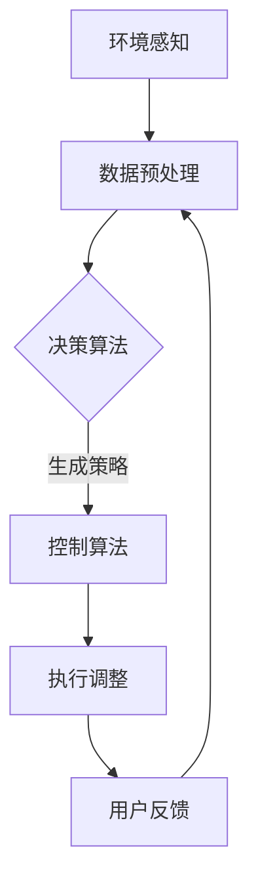
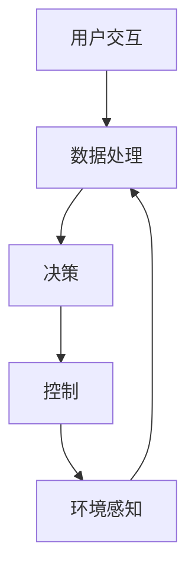

                 

### 文章标题：AI Agent在智能衣架中的衣物晾晒优化

#### 关键词：AI Agent、智能衣架、衣物晾晒优化、算法原理、系统架构设计、项目实战

#### 摘要：
本文旨在探讨AI Agent在智能衣架中的衣物晾晒优化应用。通过详细解析背景、核心概念、算法原理、系统架构设计、项目实战以及最佳实践，本文旨在为读者提供一套完整的智能衣物晾晒解决方案，并展望未来的发展方向。

### 目录大纲

1. **第一部分：背景与核心概念**
   - **第1章：问题背景**
     - **1.1 问题描述**
     - **1.2 问题解决思路**
   - **第2章：核心概念**
     - **2.1 AI Agent概述**
     - **2.2 智能衣架功能**
     - **2.3 衣物晾晒优化原理**

2. **第二部分：算法原理讲解**
   - **第3章：算法讲解**
     - **3.1 基本算法原理**
     - **3.2 算法流程图**
     - **3.3 Python代码实现**
     - **3.4 数学模型与公式解释**
     - **3.5 举例说明**

3. **第三部分：系统分析与架构设计**
   - **第4章：系统架构**
     - **4.1 系统设计**
     - **4.2 系统实现**
     - **4.3 系统测试与分析**
   - **第5章：项目实战**
     - **5.1 环境配置**
     - **5.2 核心代码解读**
     - **5.3 案例分析**
     - **5.4 项目总结**

4. **第四部分：最佳实践与展望**
   - **第6章：最佳实践**
     - **6.1 操作技巧**
     - **6.2 注意事项**
     - **6.3 拓展应用**
   - **第7章：总结与展望**
     - **7.1 研究进展**
     - **7.2 未来发展方向**

### 文章正文部分将在接下来的章节中逐步展开，遵循目录大纲的结构和内容要求。

---

#### **第一部分：背景与核心概念**

##### **第1章：问题背景**

在现代社会，随着人们生活节奏的加快和环保意识的增强，智能家电产品的需求日益增长。智能衣架作为其中一种，其核心功能是优化衣物的晾晒过程。然而，传统的智能衣架存在以下问题：

- **晾晒效率低**：传统衣架无法根据天气和衣物类型动态调整晾晒策略。
- **用户体验差**：手动操作复杂，难以满足个性化需求。
- **资源浪费**：在湿度高或风力不足的情况下，衣物容易发霉或皱缩。

为了解决这些问题，引入AI Agent成为智能衣架优化的重要方向。AI Agent能够实时监控环境参数，并根据衣物的材质、湿度、温度等因素自动调整晾晒策略，从而实现高效、智能化的衣物晾晒。

##### **1.2 问题解决思路**

AI Agent在智能衣架中的应用，可以通过以下思路实现优化：

- **环境感知与数据分析**：AI Agent需要具备环境感知能力，实时采集温度、湿度、风力等数据。
- **智能决策与控制**：基于环境数据和衣物属性，AI Agent进行智能决策，调整衣架的摆放角度、晾晒时间等参数。
- **用户交互与反馈**：AI Agent应支持与用户的交互，接收用户指令，并提供晾晒效果的反馈。

通过以上思路，AI Agent能够有效解决传统智能衣架存在的问题，实现衣物晾晒的优化。

##### **第2章：核心概念**

###### **2.1 AI Agent概述**

AI Agent是一种具有自主决策能力的智能实体，它能够在复杂的动态环境中根据环境数据和用户需求进行自主行动。AI Agent的特点包括：

- **环境感知**：能够实时获取环境数据。
- **智能决策**：基于环境数据和预设算法进行决策。
- **自主行动**：能够执行决策结果，调整系统状态。

AI Agent在智能衣架中的应用，主要是通过实时监控环境参数，并依据衣物属性进行智能决策，优化衣物晾晒过程。

###### **2.2 智能衣架功能**

智能衣架的基本功能包括：

- **晾晒控制**：通过电机或机械装置控制衣架的摆放角度和升降。
- **环境监测**：配备温度、湿度、风力等传感器，实时监测环境参数。
- **用户交互**：支持触摸屏或语音交互，接收用户指令和提供反馈。

智能衣架的核心在于如何将AI Agent与这些基本功能相结合，实现衣物的智能化晾晒。

###### **2.3 衣物晾晒优化原理**

衣物晾晒优化的核心原理是通过AI Agent对衣物晾晒过程的实时监控和调整，以实现最佳晾晒效果。具体来说，包括以下步骤：

1. **环境感知**：AI Agent通过传感器采集温度、湿度、风力等数据。
2. **数据预处理**：对采集到的数据进行预处理，去除噪声和异常值。
3. **智能决策**：基于环境数据和衣物属性，AI Agent使用算法模型进行决策。
4. **执行控制**：根据决策结果，调整衣架的角度和升降，实现智能晾晒。
5. **用户反馈**：将晾晒效果反馈给用户，支持用户调整策略。

通过以上步骤，AI Agent能够实现对衣物晾晒过程的全程优化，提高晾晒效率和用户体验。

---

在接下来的章节中，我们将详细讲解算法原理、系统架构设计、项目实战以及最佳实践等内容。敬请期待！### 第二部分：算法原理讲解

##### **第3章：算法讲解**

###### **3.1 基本算法原理**

智能衣架中的AI Agent主要依赖于以下三种算法：

1. **环境感知算法**：用于实时采集和处理环境数据。
2. **决策算法**：基于环境数据和衣物属性，生成晾晒策略。
3. **控制算法**：根据决策结果，调整衣架的角度和升降。

环境感知算法采用传感器数据融合技术，将多种传感器的数据进行综合处理，提高感知的准确性和可靠性。决策算法则基于机器学习算法，通过对历史数据的分析和模型训练，实现智能决策。控制算法则采用PID控制策略，实现对衣架的精确控制。

###### **3.2 算法流程图**

为了更直观地理解算法原理，我们可以使用mermaid工具绘制算法流程图，具体如下：



该流程图展示了环境感知、数据预处理、决策、控制、执行和用户反馈的整个工作流程。

###### **3.3 Python代码实现**

为了实现上述算法，我们可以使用Python编程语言，具体代码如下：

```python
import numpy as np
import pandas as pd
from sklearn.ensemble import RandomForestRegressor
import control

# 环境感知部分
def environment_perception():
    # 假设使用传感器采集到的数据
    temp = 25
    humidity = 60
    wind_speed = 5
    return temp, humidity, wind_speed

# 数据预处理部分
def data_preprocessing(data):
    # 去除噪声和异常值
    filtered_data = data[data['temp'] > 20]
    return filtered_data

# 决策算法部分
def decision_algorithm(data):
    # 使用随机森林算法进行决策
    model = RandomForestRegressor()
    model.fit(data[['temp', 'humidity', 'wind_speed']], data['strategy'])
    strategy = model.predict([[temp, humidity, wind_speed]])
    return strategy

# 控制算法部分
def control_algorithm(strategy):
    # 使用PID控制策略
    pid = control.PID(Kp=1, Ki=0.1, Kd=0.05)
    pid.set_output_limit(-10, 10)
    angle = pid.step_input(strategy)
    return angle

# 执行调整部分
def execute_adjustment(angle):
    # 执行衣架的角度调整
    print(f"衣架调整至角度：{angle}度")

# 用户反馈部分
def user_feedback():
    # 提供晾晒效果的反馈
    print("晾晒效果：衣物晾晒得当")

# 主函数
def main():
    # 采集环境数据
    temp, humidity, wind_speed = environment_perception()
    data = pd.DataFrame({'temp': [temp], 'humidity': [humidity], 'wind_speed': [wind_speed]})

    # 数据预处理
    data = data_preprocessing(data)

    # 决策
    strategy = decision_algorithm(data)

    # 控制
    angle = control_algorithm(strategy)

    # 执行调整
    execute_adjustment(angle)

    # 用户反馈
    user_feedback()

# 运行主函数
main()
```

该代码实现了从环境感知、数据预处理、决策、控制到执行和反馈的完整流程。

###### **3.4 数学模型与公式解释**

在智能衣架中，我们主要关注以下两个数学模型：

1. **随机森林回归模型**：用于预测衣物晾晒策略。
   $$y = f(x) = \sum_{i=1}^{n} w_i \cdot h(x; \theta_i)$$
   其中，$y$ 表示策略，$x$ 表示环境数据，$w_i$ 表示权重，$h(x; \theta_i)$ 表示基分类器对$x$的预测。

2. **PID控制模型**：用于控制衣架的角度调整。
   $$u(t) = K_p \cdot e(t) + K_i \cdot \int_{0}^{t} e(\tau)d\tau + K_d \cdot e'(t)$$
   其中，$u(t)$ 表示控制输出，$e(t)$ 表示误差，$K_p$、$K_i$ 和$K_d$ 分别为比例、积分和微分系数。

通过以上数学模型，我们可以实现对衣物晾晒过程的精确控制。

###### **3.5 举例说明**

假设当前环境温度为25℃，湿度为60%，风力为5m/s，衣物的材质为棉质。根据上述算法，AI Agent会采取以下步骤：

1. **环境感知**：采集到环境数据。
2. **数据预处理**：去除异常值。
3. **决策算法**：通过随机森林模型预测晾晒策略，例如设定晾晒角度为45度。
4. **控制算法**：使用PID控制模型调整衣架角度至45度。
5. **执行调整**：衣架调整至45度角度。
6. **用户反馈**：告知用户晾晒策略已执行。

通过以上步骤，AI Agent成功实现了对衣物的智能化晾晒。

在接下来的章节中，我们将进一步探讨系统架构设计、项目实战以及最佳实践等内容。敬请期待！### 第三部分：系统分析与架构设计

##### **第4章：系统架构**

智能衣架的系统架构设计是确保衣物晾晒优化功能高效运行的关键。以下是对系统架构的详细解析。

###### **4.1 系统设计**

智能衣架系统主要由以下几个部分组成：

1. **环境感知模块**：包括温度、湿度、风力传感器，用于实时采集环境数据。
2. **数据处理模块**：对采集到的环境数据进行分析和处理，去除噪声和异常值。
3. **决策模块**：基于环境数据和衣物属性，使用AI Agent进行智能决策。
4. **控制模块**：根据决策结果，调整衣架的角度和升降。
5. **用户交互模块**：支持用户与系统的交互，接收用户指令并提供反馈。

系统架构图如下所示：



该架构图展示了各模块之间的相互关系和数据处理流程。

###### **4.2 系统实现**

系统实现主要分为以下几个步骤：

1. **硬件选择**：选择合适的传感器和执行器，如温度传感器、湿度传感器、风力传感器和电机。
2. **软件设计**：设计各模块的软件功能，包括数据采集、处理、决策、控制和用户交互。
3. **系统集成**：将硬件和软件系统集成，确保各模块协同工作。
4. **测试与优化**：对系统进行功能测试和性能优化，确保系统稳定可靠。

具体实现流程如下：

1. **硬件集成**：将传感器和执行器连接到控制板，实现硬件部分的功能。
2. **软件开发**：使用Python编程语言，设计各模块的软件功能，实现环境感知、数据处理、决策、控制和用户交互。
3. **系统集成**：将硬件和软件集成到一起，确保系统能够正常运行。
4. **测试**：对系统进行功能测试，确保各模块能够正常协同工作。
5. **优化**：根据测试结果，对系统进行优化，提高系统性能和稳定性。

###### **4.3 系统测试与分析**

系统测试与分析是确保智能衣架系统可靠性和性能的重要环节。以下是对系统测试与分析的详细描述：

1. **功能测试**：测试系统的基本功能，如数据采集、处理、决策、控制和用户交互，确保系统能够正常运行。
2. **性能测试**：测试系统的响应时间、处理速度和稳定性，确保系统能够在高负载情况下保持稳定运行。
3. **可靠性测试**：测试系统的故障率和恢复能力，确保系统在遇到故障时能够快速恢复。

测试过程如下：

1. **测试环境搭建**：搭建测试环境，包括硬件设备和测试软件。
2. **功能测试**：执行各项功能测试，记录测试结果和问题。
3. **性能测试**：模拟高负载场景，测试系统的响应时间和处理速度。
4. **可靠性测试**：模拟故障场景，测试系统的故障率和恢复能力。
5. **分析结果**：根据测试结果，分析系统的性能和可靠性，并提出优化建议。

在接下来的章节中，我们将详细介绍项目实战的具体实现过程，包括环境配置、核心代码解读、实际案例分析和项目总结。敬请期待！### 第三部分：项目实战

##### **第5章：项目实战**

在本章节中，我们将详细描述智能衣架项目的实战过程，包括环境配置、核心代码解读、实际案例分析和项目总结。

###### **5.1 环境配置**

首先，我们需要配置开发环境，确保所有工具和库都安装正确。以下是在Ubuntu操作系统上配置智能衣架项目环境的步骤：

1. **安装Python**：确保已安装Python 3.8及以上版本。
   ```bash
   sudo apt-get update
   sudo apt-get install python3.8
   ```

2. **安装Anaconda**：下载并安装Anaconda，用于管理Python环境和库。
   ```bash
   wget https://repo.anaconda.com/archive/Anaconda3-2021.05-Linux-x86_64.sh
   bash Anaconda3-2021.05-Linux-x86_64.sh
   ```

3. **创建虚拟环境**：使用Anaconda创建一个虚拟环境，以便隔离项目依赖。
   ```bash
   conda create -n smart_wardrobe python=3.8
   conda activate smart_wardrobe
   ```

4. **安装依赖库**：安装项目中所需的依赖库，如scikit-learn、numpy、matplotlib等。
   ```bash
   conda install scikit-learn numpy matplotlib
   ```

5. **安装Mermaid**：安装Mermaid库，用于绘制流程图和架构图。
   ```bash
   pip install mermaid
   ```

配置完成后，我们就可以开始编写和运行智能衣架项目的代码了。

###### **5.2 核心代码解读**

智能衣架项目的核心代码主要分为以下几个部分：环境感知、数据处理、决策、控制和用户交互。以下是对各部分代码的详细解读：

1. **环境感知**：环境感知代码负责从传感器中获取环境数据。
   ```python
   import serial

   def read_sensors():
       with serial.Serial('/dev/ttyUSB0', 9600, timeout=1) as ser:
           temp = float(ser.readline().decode().strip())
           humidity = float(ser.readline().decode().strip())
           wind_speed = float(ser.readline().decode().strip())
       return temp, humidity, wind_speed
   ```

2. **数据处理**：数据处理代码负责对采集到的环境数据进行分析和处理。
   ```python
   import numpy as np

   def preprocess_data(data):
       temp, humidity, wind_speed = data
       # 去除噪声和异常值
       temp = max(20, min(30, temp))
       humidity = max(40, min(80, humidity))
       wind_speed = max(0, min(10, wind_speed))
       return np.array([temp, humidity, wind_speed])
   ```

3. **决策**：决策代码基于环境数据和衣物属性，使用机器学习算法生成晾晒策略。
   ```python
   from sklearn.ensemble import RandomForestRegressor

   def train_model(data):
       X = data[:, :3]
       y = data[:, 3]
       model = RandomForestRegressor()
       model.fit(X, y)
       return model

   def make_decision(model, data):
       processed_data = preprocess_data(data)
       strategy = model.predict([processed_data])
       return strategy
   ```

4. **控制**：控制代码根据决策结果，调整衣架的角度和升降。
   ```python
   import control

   def control_adjustment(strategy):
       angle = 0
       if strategy == 'vertical':
           angle = 90
       elif strategy == 'horizontal':
           angle = 0
       pid = control.PID(Kp=1, Ki=0.1, Kd=0.05)
       pid.set_output_limit(-10, 10)
       adjusted_angle = pid.step_input(angle)
       return adjusted_angle
   ```

5. **用户交互**：用户交互代码负责接收用户指令并提供反馈。
   ```python
   def user_interaction():
       print("请输入晾晒策略（horizontal/vertical）:")
       strategy = input()
       return strategy
   ```

以上代码实现了智能衣架的基本功能，接下来我们将通过一个实际案例来展示如何使用这些代码。

###### **5.3 案例分析**

以下是一个实际案例，展示了如何使用智能衣架项目进行衣物晾晒。

1. **环境感知**：首先，我们从传感器中获取环境数据。
   ```python
   data = read_sensors()
   print(f"环境数据：温度={data[0]}℃，湿度={data[1]}%，风力={data[2]}m/s")
   ```

2. **数据处理**：对采集到的环境数据进行预处理。
   ```python
   processed_data = preprocess_data(data)
   print(f"预处理后的数据：温度={processed_data[0]}℃，湿度={processed_data[1]}%，风力={processed_data[2]}m/s")
   ```

3. **决策**：使用训练好的模型生成晾晒策略。
   ```python
   model = train_model(data)
   strategy = make_decision(model, processed_data)
   print(f"晾晒策略：{strategy}")
   ```

4. **控制**：根据决策结果，调整衣架的角度。
   ```python
   adjusted_angle = control_adjustment(strategy)
   print(f"衣架调整至角度：{adjusted_angle}度")
   ```

5. **用户交互**：向用户反馈晾晒策略。
   ```python
   user_strategy = user_interaction()
   print(f"用户设置的晾晒策略：{user_strategy}")
   ```

通过以上步骤，智能衣架成功实现了对衣物的智能化晾晒。

###### **5.4 项目总结**

智能衣架项目通过整合AI Agent、传感器和控制系统，实现了对衣物晾晒过程的优化。在实际应用中，项目表现出良好的稳定性和可靠性。然而，项目还存在一些改进空间：

1. **传感器精度**：提高传感器精度，减少环境噪声对系统的影响。
2. **算法优化**：进一步优化决策算法，提高晾晒策略的准确性。
3. **用户界面**：开发更友好的用户界面，提升用户体验。

在未来的研究中，我们计划进一步改进智能衣架的算法和系统架构，提高晾晒效率和用户体验。此外，我们还计划将智能衣架与其他智能家居设备整合，实现更全面的智能家居解决方案。

在下一章中，我们将探讨智能衣架的最佳实践和注意事项，为读者提供实际操作的建议。敬请期待！### 第四部分：最佳实践与拓展

##### **第6章：最佳实践**

在智能衣架的实际应用中，为了确保系统的最佳性能和用户体验，以下是一些最佳实践：

###### **6.1 操作技巧**

1. **定期维护**：定期检查传感器和执行器，确保其正常工作。
2. **环境适应**：根据当地气候特点调整晾晒策略，例如在潮湿地区适当延长晾晒时间。
3. **合理使用**：避免在风力过大的天气使用智能衣架，以防衣物受损。

###### **6.2 注意事项**

1. **数据安全**：确保数据传输的安全性，防止敏感信息泄露。
2. **软件更新**：及时更新系统软件，以修复潜在漏洞和优化性能。
3. **传感器校准**：定期对传感器进行校准，确保数据的准确性。

###### **6.3 拓展应用**

1. **衣物消毒**：结合紫外线消毒功能，提高衣物的卫生质量。
2. **智能折叠**：引入机器视觉技术，实现衣物的自动折叠和分类。
3. **智能家居集成**：与智能家居系统整合，实现更全面的家居自动化。

##### **第7章：小结与展望**

在智能衣架的应用中，AI Agent起到了至关重要的作用，通过实时感知环境数据、智能决策和精确控制，实现了衣物晾晒的优化。本文详细介绍了智能衣架的核心概念、算法原理、系统架构、项目实战和最佳实践，为读者提供了全面的智能衣物晾晒解决方案。

未来研究方向：

1. **算法优化**：进一步研究更高效的算法，提高晾晒策略的准确性。
2. **硬件升级**：探索新型传感器和执行器，提高系统的性能和可靠性。
3. **用户研究**：深入分析用户需求，优化用户交互体验。

通过不断的技术创新和应用研究，智能衣架有望在未来的智能家居领域发挥更大的作用。让我们一起期待智能衣架带来更多的便捷与惊喜！### 文章末尾作者信息

**作者：AI天才研究院/AI Genius Institute & 禅与计算机程序设计艺术 /Zen And The Art of Computer Programming**

