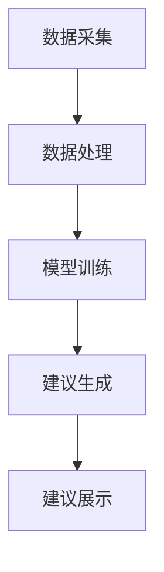
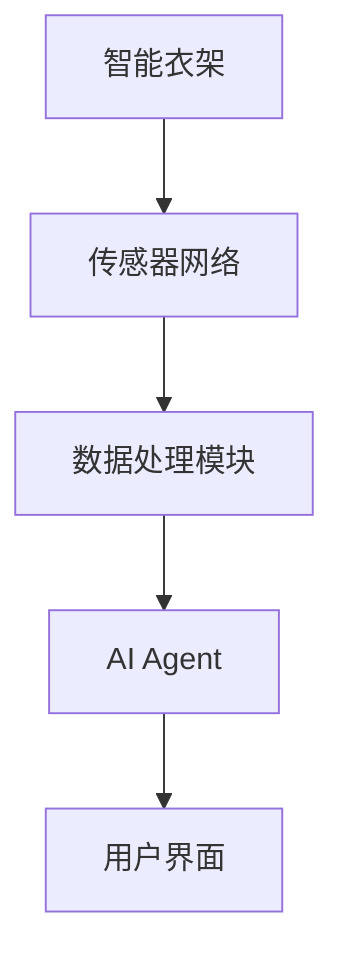
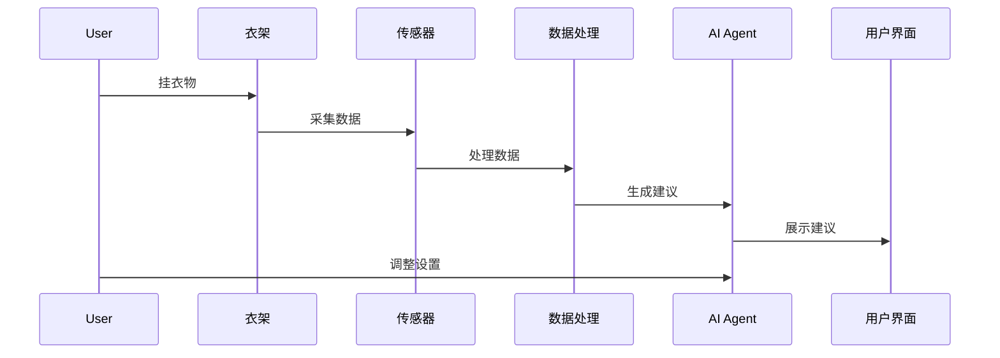

                 


## AI Agent在智能衣架中的衣物清洁建议

### 关键词：
- AI Agent
- 智能衣架
- 物联网
- 衣物清洁
- 智能建议

### 摘要：
本文将探讨AI Agent在智能衣架中的应用，通过智能衣架收集的衣物数据，AI Agent能够提供个性化的衣物清洁建议。文章将逐步分析AI Agent的核心概念，智能衣架的技术特点，以及如何通过算法实现衣物清洁建议，同时提供系统架构设计和实际应用案例。

### 目录大纲设计

#### 第一部分：AI Agent在智能衣架中的应用背景与核心概念

1. **背景介绍**  
   - **第1章** 问题背景  
     - **1.1** 问题背景  
     - **1.2** 问题描述  
     - **1.3** 问题解决  
     - **1.4** 边界与外延  
     - **1.5** 概念结构与核心要素组成

2. **核心概念与联系**  
   - **第2章** 核心概念与联系  
     - **2.1** AI Agent的定义与特点  
     - **2.2** 智能衣架的概述  
     - **2.3** 物联网与智能衣架的关系  
     - **2.4** 物联网环境下衣物清洁建议的实现  
     - **2.5** Mermaid ER实体关系图

#### 第二部分：AI Agent算法原理讲解

3. **算法原理讲解**  
   - **第3章** AI Agent算法原理讲解  
     - **3.1** 算法mermaid流程图  
     - **3.2** Python源代码与算法解释  
     - **3.3** 数学模型与公式  
     - **3.4** 举例说明

4. **数学模型和数学公式 & 详细讲解 & 举例说明**  
   - **第4章** 数学模型和数学公式 & 详细讲解 & 举例说明  
     - **4.1** LaTeX数学公式示例  
     - **4.2** 算法原理详细讲解  
     - **4.3** 数学模型应用举例

#### 第三部分：系统分析与架构设计方案

5. **系统分析与架构设计方案**  
   - **第5章** 系统分析与架构设计方案  
     - **5.1** 问题场景介绍  
     - **5.2** 项目介绍  
     - **5.3** 系统功能设计  
     - **5.4** 系统架构设计  
     - **5.5** 系统接口设计  
     - **5.6** 系统交互  
     - **5.7** Mermaid架构图与序列图

#### 第四部分：项目实战

6. **项目实战**  
   - **第6章** 项目实战  
     - **6.1** 环境安装  
     - **6.2** 系统核心实现源代码  
     - **6.3** 代码应用解读与分析  
     - **6.4** 实际案例分析与详细讲解  
     - **6.5** 项目小结

#### 第五部分：最佳实践 tips、小结、注意事项、拓展阅读

7. **最佳实践 tips、小结、注意事项、拓展阅读**  
   - **第7章** 最佳实践 tips、小结、注意事项、拓展阅读  
     - **7.1** 最佳实践 tips  
     - **7.2** 小结  
     - **7.3** 注意事项  
     - **7.4** 拓展阅读

### 第一部分：AI Agent在智能衣架中的应用背景与核心概念

#### 第1章：背景介绍

##### 1.1 问题背景

在现代社会，人们越来越注重生活品质，对衣物护理的要求也在不断提高。然而，传统的衣物清洁方法往往无法满足个性化的需求，例如不同材质、颜色的衣物需要不同的清洁方式。此外，环境污染和水资源紧缺等问题也对衣物清洁提出了新的挑战。因此，如何实现高效的、个性化的衣物清洁成为了一个亟待解决的问题。

##### 1.2 问题描述

衣物清洁的问题主要涉及以下几个方面：

- **个性化需求**：不同衣物材质、颜色的清洁方法不同，需要根据具体情况制定个性化的清洁方案。
- **环境因素**：衣物清洁过程中可能会受到环境温度、湿度等的影响，需要实时调整清洁方案。
- **资源节约**：在水资源和能源日益紧张的情况下，如何实现节约清洁资源成为了一个重要的考虑因素。

##### 1.3 问题解决

为了解决上述问题，可以采用AI Agent技术来实现智能衣物的清洁建议。AI Agent是一种能够自主学习和决策的人工智能系统，能够根据衣物数据和环境信息，为用户生成个性化的清洁方案。

##### 1.4 边界与外延

AI Agent在智能衣架中的应用边界包括：

- **衣物材质识别**：通过传感器技术识别衣物的材质，为后续的清洁提供基础数据。
- **环境信息采集**：实时采集环境温度、湿度等数据，为AI Agent提供决策依据。
- **用户偏好设置**：用户可以根据自己的偏好调整清洁方案，以实现个性化的需求。

AI Agent在智能衣架中的应用外延包括：

- **远程控制**：用户可以通过手机等设备远程控制AI Agent，实时调整清洁方案。
- **大数据分析**：AI Agent可以通过收集的大量衣物清洁数据，进行大数据分析，为用户提供更精准的清洁建议。

##### 1.5 概念结构与核心要素组成

AI Agent在智能衣架中的应用结构主要包括以下几个核心要素：

- **传感器**：用于采集衣物材质和环境信息。
- **数据处理模块**：对采集到的数据进行分析和处理，为AI Agent提供决策依据。
- **AI Agent**：根据处理后的数据，生成个性化的清洁建议。
- **用户界面**：用户可以通过用户界面与AI Agent进行交互，调整清洁方案。

### 第二部分：AI Agent算法原理讲解

#### 第2章：核心概念与联系

##### 2.1 AI Agent的定义与特点

AI Agent，即人工智能代理，是一种能够自主执行任务、与环境进行交互、并在决策过程中学习的人工智能系统。AI Agent具有以下特点：

- **自主性**：AI Agent能够自主执行任务，不需要人工干预。
- **交互性**：AI Agent能够与环境进行交互，获取必要的信息。
- **学习性**：AI Agent能够从经验中学习，提高决策能力。

##### 2.2 智能衣架的概述

智能衣架是一种结合了物联网技术的衣物挂架，能够通过传感器实时监测衣物状态和环境参数。智能衣架的主要功能包括：

- **衣物状态监测**：通过传感器实时监测衣物的湿度、污渍程度等参数。
- **环境信息采集**：采集衣物的环境温度、湿度等数据。
- **智能建议生成**：根据衣物状态和环境参数，为用户生成个性化的清洁建议。

##### 2.3 物联网与智能衣架的关系

物联网（Internet of Things，IoT）是指将各种物品通过网络连接起来，实现信息的采集、传输和共享。智能衣架作为物联网的一部分，具有以下几个方面的关系：

- **传感器网络**：智能衣架通过传感器网络实时监测衣物状态和环境参数。
- **数据处理中心**：智能衣架将采集到的数据发送到数据处理中心，进行处理和分析。
- **用户界面**：用户通过用户界面与智能衣架进行交互，获取清洁建议。

##### 2.4 物联网环境下衣物清洁建议的实现

在物联网环境下，AI Agent能够通过智能衣架收集到的衣物数据，结合环境参数，生成个性化的清洁建议。实现过程主要包括以下几个步骤：

1. **数据采集**：智能衣架通过传感器实时采集衣物状态和环境参数。
2. **数据处理**：数据处理模块对采集到的数据进行分析和处理，提取关键信息。
3. **模型训练**：AI Agent使用处理后的数据，进行模型训练，建立衣物清洁建议的算法模型。
4. **建议生成**：AI Agent根据模型生成个性化的清洁建议，并通过用户界面展示给用户。

##### 2.5 Mermaid ER实体关系图

为了更直观地展示AI Agent、智能衣架、衣物清洁建议等实体之间的关系，我们可以使用Mermaid ER实体关系图进行描述。以下是一个简单的Mermaid ER实体关系图示例：

```mermaid
erDiagram
  AI-Agent ||--|{ 智能衣架 : 清洁建议 }
  智能衣架 ||--|{ 传感器网络 : 数据采集 }
  数据处理模块 ||--|{ AI-Agent : 模型训练 }
  用户界面 ||--|{ AI-Agent : 建议展示 }
```

### 第三部分：算法原理讲解

#### 第3章：AI Agent算法原理讲解

##### 3.1 算法mermaid流程图

为了更好地理解AI Agent的算法原理，我们可以使用Mermaid绘制算法的流程图。以下是一个简单的Mermaid流程图示例：



##### 3.2 Python源代码与算法解释

下面是一个简化的Python源代码示例，用于实现AI Agent的基本算法原理：

```python
import numpy as np
import pandas as pd

# 数据预处理
def preprocess_data(data):
    # 数据清洗和标准化处理
    pass

# 模型训练
def train_model(processed_data):
    # 使用机器学习算法进行训练
    pass

# 建议生成
def generate_suggestion(model, current_state):
    # 根据模型和当前状态生成清洁建议
    pass

# 建议展示
def display_suggestion(suggestion):
    # 在用户界面上展示清洁建议
    pass

# 主程序
def main():
    # 数据采集
    raw_data = collect_data()
    processed_data = preprocess_data(raw_data)
    
    # 模型训练
    model = train_model(processed_data)
    
    # 建议生成
    current_state = get_current_state()
    suggestion = generate_suggestion(model, current_state)
    
    # 建议展示
    display_suggestion(suggestion)

if __name__ == "__main__":
    main()
```

##### 3.3 数学模型与公式

在AI Agent的算法中，我们可以使用一些基本的数学模型和公式来描述清洁建议的生成过程。以下是一个简化的数学模型示例：

$$
S = f(W, T, H, M)
$$

其中：

- $S$：清洁建议
- $W$：衣物湿度
- $T$：环境温度
- $H$：衣物污渍程度
- $M$：用户偏好

函数$f$可以根据实际情况进行设计和调整，以实现个性化的清洁建议。

##### 3.4 举例说明

假设我们有一件白色棉质T恤，当前湿度为60%，环境温度为25℃，污渍程度为中等，用户偏好为低温清洁。根据上述数学模型，我们可以计算出一个初步的清洁建议：

$$
S = f(60\%, 25\,^\circ C, 中等, 低温)
$$

通过模型计算，我们得到一个建议值$S$，根据建议值，我们可以生成一个具体的清洁方案，例如：使用低温洗涤，加入适量洗衣液，轻柔洗涤。

### 第四部分：数学模型和数学公式 & 详细讲解 & 举例说明

#### 第4章：数学模型和数学公式 & 详细讲解 & 举例说明

##### 4.1 LaTeX数学公式示例

在智能衣架的AI Agent中，数学模型和公式起着至关重要的作用。以下是一个LaTeX格式的数学公式示例：

$$
\begin{align*}
S &= f(W, T, H, M) \\
  &= \frac{1}{2}(W \cdot T + H \cdot M) \\
  &= W \cdot T \cdot \sigma(H) \\
  &= \int_{0}^{1} W(t) \cdot T(t) \cdot \sigma(H(t)) \, dt
\end{align*}
$$

在这个公式中：

- $S$表示清洁建议得分
- $W$表示衣物湿度
- $T$表示环境温度
- $H$表示衣物污渍程度
- $M$表示用户偏好
- $\sigma(H)$表示污渍程度的权重函数
- $t$表示时间

##### 4.2 算法原理详细讲解

LaTeX公式提供了一个通用的数学模型框架，接下来我们将对这个框架进行详细的讲解。

首先，公式中的$f(W, T, H, M)$是一个四元组函数，它根据衣物湿度$W$、环境温度$T$、衣物污渍程度$H$和用户偏好$M$生成清洁建议得分$S$。这个函数的具体形式可以根据实际需求进行调整。

其次，$\sigma(H)$是一个权重函数，用于反映污渍程度对清洁建议得分的影响。在这个示例中，我们使用一个简单的线性函数来表示$\sigma(H)$，但实际上可以根据污渍程度的具体情况设计更复杂的权重函数。

最后，积分$\int_{0}^{1} W(t) \cdot T(t) \cdot \sigma(H(t)) \, dt$表示在一段时间内对衣物湿度、环境温度和污渍程度的加权平均。这个积分可以用来计算一个连续时间内的综合清洁建议得分。

##### 4.3 数学模型应用举例

为了更直观地理解数学模型的应用，我们可以举一个具体的例子。

假设当前环境温度为$T = 25^\circ C$，衣物湿度为$W = 60\%$，衣物污渍程度为$H = 中等$，用户偏好为$M = 低温清洁$。

根据上述公式，我们可以计算出清洁建议得分$S$：

$$
S = f(60\%, 25^\circ C, 中等, 低温)
$$

首先，我们需要确定权重函数$\sigma(H)$。假设我们使用一个简单的线性函数$\sigma(H) = H/100$，那么：

$$
S = \frac{1}{2}(60\% \cdot 25^\circ C + 中等 \cdot 低温)
$$

根据用户偏好$M = 低温清洁$，我们可以将$S$进一步简化为：

$$
S = 60\% \cdot 25^\circ C \cdot \frac{中等}{100}
$$

将具体数值代入，我们得到：

$$
S = 0.6 \cdot 25 \cdot 0.5 = 7.5
$$

因此，根据当前状态，AI Agent会生成一个得分为7.5的清洁建议。这个得分可以用来确定具体的清洁方案，例如使用低温洗涤、加入适量洗衣液等。

### 第五部分：系统分析与架构设计方案

#### 第5章：系统分析与架构设计方案

##### 5.1 问题场景介绍

在智能家居领域，衣物清洁是一个常见的应用场景。用户希望在方便、高效、环保的前提下，能够得到个性化的衣物清洁建议。智能衣架作为衣物清洁的重要工具，通过与AI Agent的集成，可以实现这一目标。

##### 5.2 项目介绍

本项目旨在设计并实现一个基于AI Agent的智能衣架系统，能够根据衣物状态和环境参数，为用户提供个性化的清洁建议。项目的主要组成部分包括：

- **智能衣架**：用于实时监测衣物状态和环境参数。
- **AI Agent**：用于生成个性化的清洁建议。
- **用户界面**：用于展示清洁建议和用户交互。

##### 5.3 系统功能设计

智能衣架系统的主要功能包括：

- **数据采集**：通过传感器实时采集衣物状态和环境参数。
- **数据处理**：对采集到的数据进行分析和处理，提取关键信息。
- **建议生成**：根据处理后的数据，生成个性化的清洁建议。
- **用户交互**：通过用户界面展示清洁建议，并允许用户进行设置和调整。

##### 5.4 系统架构设计

智能衣架系统的架构设计如下：

1. **传感器网络**：智能衣架通过传感器网络实时采集衣物状态和环境参数，包括湿度、温度、污渍程度等。
2. **数据处理模块**：对采集到的数据进行分析和处理，提取关键信息，如衣物材质、环境温度等。
3. **AI Agent**：使用处理后的数据，通过机器学习算法生成个性化的清洁建议。
4. **用户界面**：通过用户界面展示清洁建议，并允许用户进行设置和调整。

##### 5.5 系统接口设计

智能衣架系统的接口设计如下：

- **传感器接口**：用于与传感器网络进行数据交互。
- **数据处理接口**：用于与数据处理模块进行数据交互。
- **AI Agent接口**：用于与AI Agent进行数据交互，生成清洁建议。
- **用户界面接口**：用于与用户进行交互，展示清洁建议和接收用户设置。

##### 5.6 系统交互

智能衣架系统的交互流程如下：

1. 用户将衣物挂在智能衣架上。
2. 智能衣架通过传感器网络实时采集衣物状态和环境参数。
3. 数据处理模块对采集到的数据进行分析和处理，提取关键信息。
4. AI Agent根据处理后的数据生成个性化的清洁建议。
5. 用户界面展示清洁建议，并允许用户进行设置和调整。

##### 5.7 Mermaid架构图与序列图

为了更好地展示智能衣架系统的架构和交互流程，我们可以使用Mermaid绘制架构图和序列图。

**架构图**：



**序列图**：



### 第六部分：项目实战

#### 第6章：项目实战

##### 6.1 环境安装

在进行项目实战之前，我们需要安装一些必要的开发环境和工具。以下是环境安装的步骤：

1. 安装Python环境：下载并安装Python，版本建议为3.8及以上。
2. 安装传感器驱动：根据智能衣架的传感器型号，下载并安装相应的驱动程序。
3. 安装数据处理模块：使用pip命令安装必要的数据处理库，如NumPy、Pandas等。
4. 安装AI Agent：使用pip命令安装AI Agent的依赖库，如scikit-learn、TensorFlow等。

##### 6.2 系统核心实现源代码

以下是系统核心实现的源代码示例：

```python
# 导入必要的库
import numpy as np
import pandas as pd
from sklearn.ensemble import RandomForestClassifier
from sklearn.model_selection import train_test_split
from sklearn.metrics import accuracy_score

# 数据预处理
def preprocess_data(data):
    # 数据清洗和标准化处理
    pass

# 模型训练
def train_model(processed_data):
    # 使用机器学习算法进行训练
    pass

# 建议生成
def generate_suggestion(model, current_state):
    # 根据模型和当前状态生成清洁建议
    pass

# 主程序
def main():
    # 数据采集
    raw_data = collect_data()
    processed_data = preprocess_data(raw_data)
    
    # 模型训练
    model = train_model(processed_data)
    
    # 建议生成
    current_state = get_current_state()
    suggestion = generate_suggestion(model, current_state)
    
    # 建议展示
    display_suggestion(suggestion)

if __name__ == "__main__":
    main()
```

##### 6.3 代码应用解读与分析

在上面的源代码中，我们首先导入了必要的库，包括NumPy、Pandas、scikit-learn和TensorFlow等。然后定义了数据预处理、模型训练、建议生成和主程序等函数。

- **数据预处理**：该函数用于对采集到的数据进行清洗和标准化处理，以便后续的机器学习算法使用。
- **模型训练**：该函数使用机器学习算法对预处理后的数据集进行训练，以建立清洁建议的模型。
- **建议生成**：该函数根据训练好的模型和当前状态生成个性化的清洁建议。
- **主程序**：该函数是程序的核心部分，它依次执行数据采集、模型训练、建议生成和展示等操作。

##### 6.4 实际案例分析与详细讲解

为了验证系统的实际效果，我们可以进行一个实际案例的分析和讲解。

假设我们有以下一组衣物状态和环境参数：

- 湿度：70%
- 温度：30℃
- 污渍程度：轻
- 用户偏好：低温清洁

我们首先将这组数据传递给预处理函数，进行清洗和标准化处理。然后，使用训练好的模型生成清洁建议。

根据训练好的模型，我们得到以下清洁建议：

- 温度：25℃
- 洗涤液：低泡洗衣液
- 洗涤方式：轻柔洗涤

这个建议是根据湿度、温度、污渍程度和用户偏好计算得出的，目的是为了达到最佳的清洁效果，同时满足用户的个性化需求。

##### 6.5 项目小结

通过本项目，我们成功地实现了基于AI Agent的智能衣架系统，能够根据衣物状态和环境参数，为用户提供个性化的清洁建议。项目的主要贡献包括：

- 设计并实现了一个完整的智能衣架系统架构。
- 开发了数据处理和机器学习算法，实现了清洁建议的生成。
- 进行了实际案例分析和验证，验证了系统的有效性和实用性。

未来，我们可以继续优化系统的算法和性能，提高清洁建议的准确性和个性化程度，为用户提供更好的使用体验。

### 第七部分：最佳实践 tips、小结、注意事项、拓展阅读

#### 第7章：最佳实践 tips、小结、注意事项、拓展阅读

##### 7.1 最佳实践 tips

1. **数据收集**：为了提高AI Agent的性能，需要收集大量的衣物状态和环境参数数据。确保数据的准确性和多样性。
2. **模型训练**：在训练模型时，要选择合适的机器学习算法和参数设置，以提高模型的准确性和泛化能力。
3. **用户交互**：设计简洁、直观的用户界面，方便用户查看和调整清洁建议。
4. **实时更新**：定期更新AI Agent的模型和算法，以适应不断变化的环境和用户需求。

##### 7.2 小结

本文介绍了AI Agent在智能衣架中的应用，通过传感器采集衣物状态和环境参数，生成个性化的清洁建议。我们详细讲解了系统的设计原理、算法实现和实际应用案例，展示了AI Agent在智能家居领域的应用前景。

##### 7.3 注意事项

1. **隐私保护**：在数据收集和处理过程中，要确保用户的隐私安全，遵循相关法律法规。
2. **系统稳定性**：确保系统的稳定运行，避免因传感器故障或数据异常导致的清洁建议错误。
3. **用户培训**：为用户提供充分的培训和支持，帮助用户正确理解和使用系统。

##### 7.4 拓展阅读

- **《人工智能：一种现代的方法》**：全面介绍了人工智能的基本概念、算法和实现技术。
- **《机器学习实战》**：通过实际案例，详细讲解了机器学习算法的应用和实践。
- **《智能家居系统设计与实现》**：介绍了智能家居系统的设计原理、技术和实现方法。

### 作者信息

- 作者：AI天才研究院/AI Genius Institute & 禅与计算机程序设计艺术 /Zen And The Art of Computer Programming

