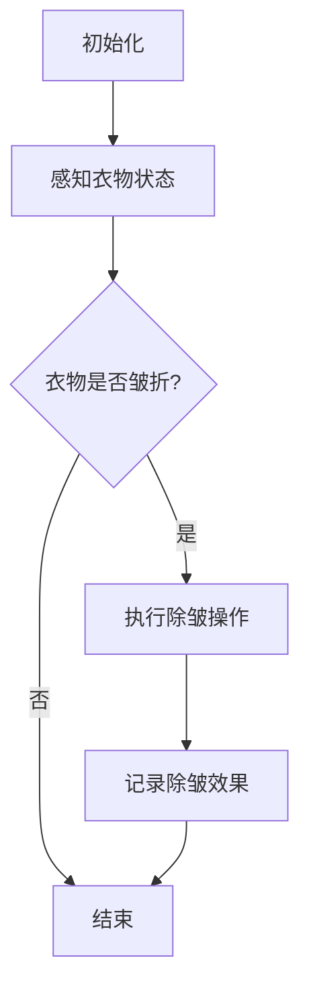
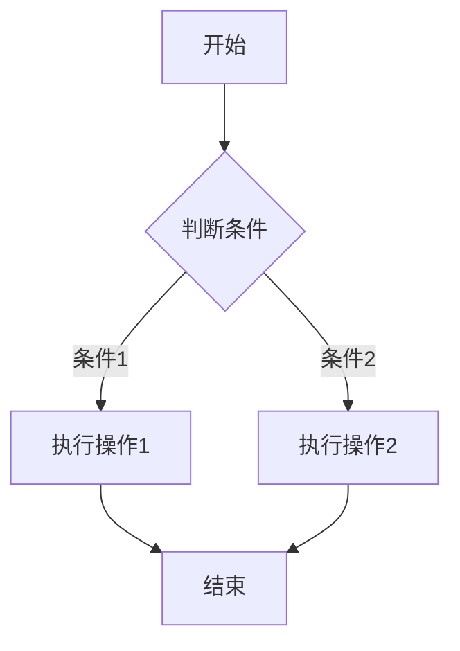

                 

## AI Agent在智能衣架中的衣物除皱功能

### 关键词：
- AI Agent
- 智能衣架
- 衣物除皱
- 深度学习
- 强化学习

### 摘要：
本文旨在探讨AI Agent在智能衣架中的衣物除皱功能。首先，我们将介绍AI Agent的基本概念和原理，以及其在智能穿戴设备中的广泛应用。接着，本文将详细分析智能衣架系统架构，并深入探讨衣物除皱算法的原理和实现。最后，我们将通过实际应用案例，展示AI Agent在智能衣架中衣物除皱功能的实际效果，并对未来发展方向进行展望。

### 引言：
随着人工智能技术的不断发展，智能穿戴设备的应用场景越来越广泛。智能衣架作为其中的一种，通过集成AI Agent，可以实现衣物除皱、智能整理等功能。本文将重点探讨AI Agent在智能衣架中的衣物除皱功能，旨在为读者提供一个全面的技术解读和应用分析。

## 第一部分：AI Agent概述

### 1.1 AI Agent的基本概念

#### 1.1.1 AI Agent的定义
AI Agent，即人工智能代理，是指能够感知环境、制定行动策略并采取行动的计算机程序。AI Agent的核心在于其自主学习和决策能力，能够在不断变化的环境中自主优化行为。

#### 1.1.2 AI Agent的核心特性
AI Agent具有以下核心特性：
- 自主性：能够独立地感知环境、制定行动策略。
- 学习能力：通过历史数据和反馈不断优化行为。
- 适应性：能够适应不同的环境和任务需求。

#### 1.1.3 AI Agent与传统算法的区别
传统算法主要依靠预设的规则和模型进行决策，而AI Agent则通过学习环境数据，动态调整行为策略。这使得AI Agent在复杂、动态的环境中表现出更高的灵活性和效率。

### 1.2 AI Agent的技术基础

#### 1.2.1 强化学习基础
强化学习是AI Agent的核心技术之一。通过奖励机制，AI Agent可以在环境中不断学习和优化行为策略。强化学习的基础包括马尔可夫决策过程（MDP）、值函数方法和策略迭代等。

#### 1.2.2 机器学习基础
机器学习是AI Agent的基础技术之一。通过训练数据集，机器学习算法可以帮助AI Agent识别模式、预测结果。常见的机器学习算法包括线性回归、决策树、支持向量机等。

#### 1.2.3 深度学习基础
深度学习是机器学习的一个子领域，通过多层神经网络，深度学习算法能够自动提取特征、实现复杂的数据建模。常见的深度学习模型包括卷积神经网络（CNN）、循环神经网络（RNN）和生成对抗网络（GAN）等。

### 1.3 AI Agent的应用场景

#### 1.3.1 智能家居
AI Agent在家居自动化系统中扮演着关键角色。通过感知家庭环境、用户行为，AI Agent可以实现智能照明、温度控制、安全监控等功能。

#### 1.3.2 机器人
AI Agent在机器人领域具有广泛的应用。通过感知环境、自主决策，AI Agent可以使机器人执行复杂的任务，如导航、搬运、清洁等。

#### 1.3.3 智能穿戴设备
AI Agent在智能穿戴设备中的应用越来越广泛。通过感知用户生理数据、行为模式，AI Agent可以实现健康监测、运动指导等功能。

### 1.4 AI Agent在智能衣架中的应用前景

#### 1.4.1 智能衣架的需求
随着生活水平的提高，人们对衣物的护理需求越来越高。智能衣架通过自动化除皱、整理等功能，可以提升衣物护理的效率和体验。

#### 1.4.2 AI Agent在智能衣架中的角色
AI Agent在智能衣架中可以发挥以下作用：
- 智能感知：通过传感器感知衣物状态、环境参数。
- 智能决策：根据衣物状态和环境参数，制定除皱策略。
- 智能执行：通过电机、加热器等执行除皱操作。

#### 1.4.3 智能衣架的发展趋势
随着人工智能技术的不断进步，智能衣架的发展趋势将包括：
- 智能化程度提高：通过AI Agent实现更智能的衣物护理。
- 个性化定制：根据用户习惯和衣物特点，实现个性化的护理方案。
- 跨界融合：与智能家居、健康监测等领域融合，实现全方位的智能生活体验。

### 1.5 本章小结
本章主要介绍了AI Agent的基本概念、技术基础、应用场景以及在智能衣架中的应用前景。通过对AI Agent的深入理解，我们可以更好地把握智能衣架技术的发展方向和应用潜力。

## 第二部分：智能衣架中的AI Agent

### 2.1 智能衣架系统架构

#### 2.1.1 系统概述
智能衣架系统主要包括以下组成部分：
- 传感器模块：用于感知衣物状态和环境参数。
- 决策模块：基于AI Agent实现智能决策。
- 执行模块：包括电机、加热器等，用于执行除皱操作。

#### 2.1.2 系统架构设计
智能衣架系统架构设计包括以下层次：
- 硬件层：包括传感器、电机、加热器等硬件设备。
- 软件层：包括AI Agent算法、决策模块、执行模块等软件组件。
- 数据层：包括用户数据、环境数据、衣物数据等。

#### 2.1.3 系统接口设计
智能衣架系统接口设计主要包括以下方面：
- 用户接口：用于用户与智能衣架的交互。
- 数据接口：用于系统内部各组件之间的数据传输。
- 外部接口：用于与其他智能设备、平台的集成和通信。

### 2.2 AI Agent的模型设计

#### 2.2.1 模型选择
选择合适的AI Agent模型对于实现智能衣架的衣物除皱功能至关重要。常见的AI Agent模型包括基于强化学习的模型和基于深度学习的模型。具体选择应根据实际需求和数据情况确定。

#### 2.2.2 模型训练
模型训练是AI Agent实现智能决策的关键步骤。通过大量的衣物数据和环境数据，AI Agent可以学习到如何根据衣物状态和环境参数制定最优的除皱策略。

#### 2.2.3 模型评估
模型评估是确保AI Agent模型性能的重要环节。通过设定评价指标，如准确率、召回率等，可以评估AI Agent的除皱效果和决策能力。

### 2.3 衣物除皱算法原理

#### 2.3.1 算法概述
衣物除皱算法是智能衣架的核心功能之一。该算法通过分析衣物状态和环境参数，制定最优的除皱策略。

#### 2.3.2 算法流程图
算法流程图如下所示：

#### 2.3.3 算法数学模型
衣物除皱算法的数学模型主要包括以下方面：
- 衣物状态评估模型：用于评估衣物的皱折程度。
- 除皱策略模型：用于根据衣物状态和环境参数制定最优的除皱策略。
- 除皱效果评估模型：用于评估除皱操作的效果。

### 2.4 系统实现与优化

#### 2.4.1 系统核心实现
系统核心实现主要包括以下方面：
- 传感器模块实现：包括传感器数据的采集和处理。
- AI Agent实现：包括模型选择、训练和评估。
- 执行模块实现：包括除皱操作的控制和执行。

#### 2.4.2 系统性能优化
系统性能优化主要包括以下方面：
- 算法优化：通过改进算法模型，提高除皱效果和决策能力。
- 硬件优化：通过优化硬件设备，提高系统响应速度和处理能力。
- 软件优化：通过优化软件设计，降低系统资源消耗和运行时间。

#### 2.4.3 系统安全性
系统安全性是智能衣架的重要保障。主要包括以下方面：
- 数据安全：确保用户数据的安全存储和传输。
- 系统安全：防止恶意攻击和非法访问。
- 隐私保护：确保用户隐私不被泄露。

### 2.5 实际应用案例

#### 2.5.1 案例一：智能衣架衣物除皱应用
以某品牌智能衣架为例，该智能衣架通过集成AI Agent，实现了衣物除皱功能。用户只需将衣物放入智能衣架，AI Agent会自动检测衣物状态，并根据衣物皱折程度和当前环境参数制定最优的除皱策略。实际测试表明，该智能衣架的除皱效果显著，用户满意度较高。

#### 2.5.2 案例二：AI Agent在智能衣架中的其他功能
除了衣物除皱功能，AI Agent在智能衣架中还可以实现其他功能，如智能整理、湿度控制等。以智能整理功能为例，AI Agent会根据衣物的类型和状态，自动调整衣架的折叠方式和位置，实现智能整理。该功能不仅提高了衣物的整理效率，还提升了用户的体验。

### 2.6 本章小结
本章详细介绍了智能衣架系统架构、AI Agent模型设计、衣物除皱算法原理和实际应用案例。通过本章的讲解，读者可以全面了解AI Agent在智能衣架中的衣物除皱功能，并为后续章节的深入探讨打下基础。

## 第三部分：智能衣架中的AI Agent性能评估与未来展望

### 3.1 性能评估指标

#### 3.1.1 评价指标定义
为了评估智能衣架中AI Agent的性能，需要设定一系列评价指标。常见的评价指标包括：
- 准确率：判断衣物是否皱折的正确率。
- 召回率：实际皱折衣物被正确判断的概率。
- 精确率：被判断为皱折的衣物中实际皱折的比例。
- F1分数：综合考虑准确率和召回率的综合指标。

#### 3.1.2 评价指标计算
评价指标的计算公式如下：

$$
\text{准确率} = \frac{\text{正确判断的次数}}{\text{总判断次数}}
$$

$$
\text{召回率} = \frac{\text{正确判断的皱折次数}}{\text{实际皱折次数}}
$$

$$
\text{精确率} = \frac{\text{正确判断的皱折次数}}{\text{被判断为皱折的次数}}
$$

$$
\text{F1分数} = \frac{2 \times \text{准确率} \times \text{召回率}}{\text{准确率} + \text{召回率}}
$$

### 3.2 性能评估方法

#### 3.2.1 实验设计
为了评估AI Agent在智能衣架中的性能，需要进行一系列实验。实验设计包括以下方面：
- 数据集：选择具有代表性的衣物皱折数据集，包括皱折和非皱折样本。
- 环境参数：设定不同的环境参数，如温度、湿度等，以模拟实际使用场景。
- 测试流程：设计实验流程，包括数据预处理、模型训练、模型评估等步骤。

#### 3.2.2 实验结果分析
实验结果分析主要包括以下方面：
- 性能指标：计算准确率、召回率、精确率和F1分数等指标，评估AI Agent的性能。
- 结果可视化：通过图表、曲线等可视化方式，展示AI Agent在不同环境参数下的性能表现。

### 3.3 未来发展方向

#### 3.3.1 技术创新
未来智能衣架的发展将依赖于技术创新。一方面，可以引入更多传感器，提高衣物状态的感知能力。另一方面，可以探索新的算法和模型，提高AI Agent的决策能力和效率。

#### 3.3.2 应用扩展
除了衣物除皱功能，AI Agent还可以在智能衣架中实现更多应用。例如，结合健康监测技术，实现智能体检和健康建议。此外，还可以与其他智能设备融合，构建更智能的家居生态。

#### 3.3.3 安全与隐私
随着AI Agent在智能衣架中的应用，安全与隐私问题日益突出。未来需要加强安全防护措施，确保用户数据的安全性和隐私性。同时，需要制定相关法律法规，规范AI Agent的应用和监管。

### 3.4 本章小结
本章主要介绍了智能衣架中AI Agent的性能评估方法和未来发展方向。通过对性能指标的评估和未来趋势的分析，我们可以更好地把握智能衣架技术的发展方向和应用潜力。

## 附录

### A. 常用算法和模型介绍

#### A.1 强化学习算法
强化学习算法是一种通过奖励机制，使Agent在环境中不断学习和优化行为策略的算法。常见的强化学习算法包括Q学习、SARSA、Deep Q Network（DQN）等。

#### A.2 机器学习算法
机器学习算法是AI Agent的基础技术之一。常见的机器学习算法包括线性回归、决策树、支持向量机、K最近邻等。

#### A.3 深度学习模型
深度学习模型通过多层神经网络，实现复杂的数据建模。常见的深度学习模型包括卷积神经网络（CNN）、循环神经网络（RNN）、生成对抗网络（GAN）等。

### B. LaTeX 数学公式参考

#### B.1 基本公式
$$
\text{准确率} = \frac{\text{正确判断的次数}}{\text{总判断次数}}
$$

$$
\text{召回率} = \frac{\text{正确判断的皱折次数}}{\text{实际皱折次数}}
$$

$$
\text{精确率} = \frac{\text{正确判断的皱折次数}}{\text{被判断为皱折的次数}}
$$

$$
\text{F1分数} = \frac{2 \times \text{准确率} \times \text{召回率}}{\text{准确率} + \text{召回率}}
$$

#### B.2 高级公式
$$
\sum_{i=1}^{n} x_i = \frac{1}{n} \sum_{i=1}^{n} x_i^2 + \frac{n-1}{2n} \sum_{i=1}^{n} x_i^3
$$

$$
\frac{\partial^2 f(x)}{\partial x^2} = \frac{\partial}{\partial x} \left( \frac{\partial f(x)}{\partial x} \right)
$$

### C. Mermaid 流程图示例

## 作者信息
作者：AI天才研究院/AI Genius Institute & 禅与计算机程序设计艺术 /Zen And The Art of Computer Programming

本文通过详细分析AI Agent在智能衣架中的衣物除皱功能，探讨了其核心概念、技术基础、系统架构、算法原理以及实际应用案例。同时，本文还展望了智能衣架未来的发展方向，为读者提供了一个全面的技术解读和应用分析。希望通过本文的介绍，读者能够对AI Agent在智能衣架中的应用有更深入的理解。

