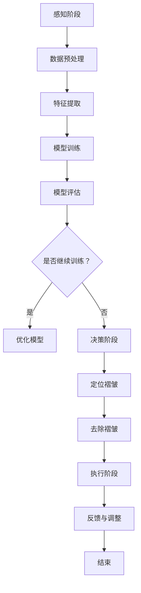

                 

### 第一部分：背景与概述

#### 第1章：智能衣架与AI Agent概述

##### 1.1 智能衣架的崛起

智能衣架作为智能家居领域的一部分，近年来得到了快速发展。它不仅是一个简单的挂衣服的工具，而是一个集成了多种智能功能的设备。智能衣架的定义可以描述为：一种能够通过物联网技术与其他智能设备互联，具备自动化、智能感知和自我调节能力的衣物挂架系统。

**智能衣架的发展历程**：

1. **初期阶段**：主要是手动调节的简易衣架，只能满足基本挂衣服的需求。
2. **中期阶段**：随着技术的发展，智能衣架开始集成温度、湿度传感器，能够根据环境自动调节温度和湿度。
3. **现阶段**：现代智能衣架集成了多种传感器和AI算法，可以实现衣物的自动除皱、杀菌等功能。

**智能衣架的主要功能**：

- **自动调节温度和湿度**：通过内置传感器，智能衣架能够根据环境条件自动调节温度和湿度，以保护衣物。
- **自动除皱**：利用AI算法，智能衣架能够识别衣物的褶皱，并自动进行除皱处理。
- **杀菌消毒**：一些高端智能衣架配备了紫外线消毒功能，能够有效杀灭衣物上的细菌和病毒。
- **远程控制**：用户可以通过手机APP远程控制智能衣架，查看衣物状态、设置温度和湿度等。

##### 1.2 AI Agent的定义与作用

**AI Agent的定义**：

AI Agent，即人工智能代理，是一种能够自主感知环境、做出决策并采取行动的人工智能实体。它通常被设计为模仿人类智能行为，能够在复杂的环境中独立完成任务。

**AI Agent在智能衣架中的应用**：

智能衣架中的AI Agent主要负责以下功能：

- **环境感知**：AI Agent能够通过传感器感知衣物状态和环境参数。
- **智能决策**：根据感知到的信息，AI Agent能够自主决定是否需要启动除皱功能，以及如何进行除皱。
- **自动控制**：AI Agent能够自动控制衣架上的电机、加热器等设备，实现自动除皱。

**AI Agent的优势**：

- **智能化**：AI Agent能够根据环境变化和衣物状态进行自适应调整，提高除皱效果。
- **自动化**：AI Agent的介入减少了人工干预，提高了除皱效率。
- **高效性**：通过深度学习和机器学习算法，AI Agent能够不断优化除皱策略，提高除皱成功率。

##### 1.3 衣物除皱问题的背景与挑战

**传统衣物除皱方法的局限**：

- **手动除皱**：需要人工不断拉扯和熨烫衣物，费时费力。
- **熨斗除皱**：需要高温处理，可能会损伤衣物材质。
- **机械除皱**：虽然能够快速除皱，但效果有限，无法精确控制。

**AI Agent在衣物除皱中的应用前景**：

AI Agent在衣物除皱方面的应用前景非常广阔。通过深度学习和机器学习算法，AI Agent能够识别衣物的不同材质和状态，精确调整除皱力度和温度，从而实现高效、精准的除皱效果。同时，AI Agent还能够根据衣物和环境的实时变化进行自适应调整，提高除皱的成功率和用户体验。

**传统衣物除皱方法的局限**：

- **手动除皱**：需要人工不断拉扯和熨烫衣物，费时费力。
- **熨斗除皱**：需要高温处理，可能会损伤衣物材质。
- **机械除皱**：虽然能够快速除皱，但效果有限，无法精确控制。

**AI Agent在衣物除皱中的应用前景**：

AI Agent在衣物除皱方面的应用前景非常广阔。通过深度学习和机器学习算法，AI Agent能够识别衣物的不同材质和状态，精确调整除皱力度和温度，从而实现高效、精准的除皱效果。同时，AI Agent还能够根据衣物和环境的实时变化进行自适应调整，提高除皱的成功率和用户体验。

##### 1.4 本书结构

**本书的目的与结构**：

本书旨在深入探讨AI Agent在智能衣架中的衣物除皱功能，通过系统的分析和实践，帮助读者理解并掌握这一前沿技术的原理和应用。

**每章的主要内容和目标**：

- **第1章**：介绍智能衣架与AI Agent的基本概念，概述衣物除皱问题的背景与挑战。
- **第2章**：讲解AI Agent的基本原理，包括人工智能基础、AI Agent的工作原理和核心技术。
- **第3章**：分析智能衣架的架构与设计，包括硬件架构、软件架构以及AI Agent在其中的实现。
- **第4章**：深入探讨衣物除皱的AI算法原理，包括除皱算法的基本概念、AI算法在除皱中的应用以及算法流程图设计。
- **第5章**：讲解衣物除皱算法的实现，包括环境搭建、Python源代码实现、数学模型讲解。
- **第6章**：通过项目实战，详细介绍衣物除皱功能的应用，包括系统设计与实现、实际案例分析。
- **第7章**：总结衣物除皱功能的最佳实践，提供优化建议和注意事项。
- **第8章**：回顾本书的主要内容，展望未来发展趋势，推荐拓展阅读。

通过以上章节的逐步深入，本书将为读者提供一个全面、系统的学习路径，帮助读者全面掌握AI Agent在智能衣架中衣物除皱功能的实现和应用。

#### 第2章：AI Agent基础知识

##### 2.1 人工智能基础

**人工智能的定义与发展历程**：

人工智能（Artificial Intelligence，简称AI）是指使计算机具有人类智能行为和思维的技术。自20世纪50年代诞生以来，人工智能经历了多个发展阶段：

1. **初始阶段（1956-1969）**：人工智能的概念被提出，初步的AI程序问世。
2. **繁荣时期（1970-1980）**：专家系统和逻辑推理成为研究重点，AI应用开始进入实际领域。
3. **低谷期（1980-1993）**：由于计算能力和算法限制，人工智能研究进入低谷。
4. **复兴阶段（1993-2012）**：随着互联网和计算能力的提升，机器学习和深度学习技术得到了快速发展。
5. **当前阶段（2012至今）**：人工智能在图像识别、自然语言处理、自动驾驶等领域取得了显著进展。

**机器学习与深度学习的区别与联系**：

机器学习（Machine Learning）是人工智能的一个分支，它通过算法让计算机从数据中学习规律，并做出预测或决策。深度学习（Deep Learning）是机器学习的一种方法，通过构建深度神经网络模型，对大量数据进行训练，从而实现复杂任务的学习和处理。

- **区别**：

  - **目标**：机器学习的目标是从数据中提取特征和模式，而深度学习的目标是构建复杂的非线性模型。

  - **层次**：机器学习通常包括监督学习、无监督学习和强化学习，而深度学习主要基于多层神经网络。

  - **适用性**：深度学习在处理高维数据、图像和语音等复杂任务时具有显著优势，而传统机器学习算法在处理简单任务时表现更佳。

- **联系**：

  - **技术融合**：深度学习是机器学习的一个重要分支，二者在算法和技术上相互补充。

  - **发展历程**：深度学习的发展得益于机器学习基础理论的不断完善，而机器学习技术的进步也为深度学习提供了更丰富的应用场景。

##### 2.2 AI Agent的工作原理

**AI Agent的基本架构**：

AI Agent通常由以下几个关键部分组成：

1. **感知器**：用于感知环境信息，如传感器、摄像头等。
2. **决策模块**：根据感知到的信息，通过算法模型进行决策。
3. **执行器**：执行决策结果，如电机、加热器等。

**AI Agent的学习与推理过程**：

1. **感知**：AI Agent通过感知器获取环境信息。
2. **决策**：决策模块根据学习到的模型和算法，对感知信息进行分析和处理，生成决策结果。
3. **执行**：执行器根据决策结果进行相应的操作，如调整温度、湿度等。

**AI Agent的感知与决策机制**：

- **感知机制**：AI Agent通过传感器获取环境信息，包括温度、湿度、光线等。这些感知信息通过数据预处理和特征提取，转化为可用于训练的输入数据。

- **决策机制**：决策模块利用机器学习或深度学习算法，对输入数据进行训练和预测。通过不断优化算法模型，提高AI Agent的决策准确性。

- **执行机制**：执行器根据AI Agent的决策结果，进行相应的操作，如调整电机速度、加热温度等。执行器的反馈信息又作为新的感知输入，进入感知模块，形成一个闭环反馈系统。

**AI Agent的核心技术**：

1. **机器学习算法**：包括线性回归、决策树、支持向量机等，用于处理分类和回归问题。
2. **深度学习模型**：如卷积神经网络（CNN）、循环神经网络（RNN）、生成对抗网络（GAN）等，用于处理复杂的数据结构和任务。
3. **自然语言处理技术**：如词向量、语言模型、翻译模型等，用于处理自然语言文本。

**机器学习算法**：

- **线性回归**：用于预测连续值变量，如温度、湿度等。
- **决策树**：用于分类和回归问题，通过树结构进行决策。
- **支持向量机**：用于分类问题，通过寻找最优分类边界进行分类。
- **神经网络**：包括多层感知器、卷积神经网络等，用于复杂函数逼近和特征提取。

**深度学习模型**：

- **卷积神经网络（CNN）**：用于图像识别、物体检测等。
- **循环神经网络（RNN）**：用于序列数据建模，如时间序列预测、语音识别等。
- **生成对抗网络（GAN）**：用于生成逼真的图像和语音。

**自然语言处理技术**：

- **词向量**：用于将自然语言文本转化为数值向量，如Word2Vec、GloVe等。
- **语言模型**：用于预测下一个单词或句子，如n-gram模型、神经网络语言模型等。
- **翻译模型**：用于将一种语言翻译成另一种语言，如统计机器翻译、神经机器翻译等。

##### 2.3 AI Agent在智能衣架中的实现

**智能衣架的硬件架构**：

智能衣架的硬件架构主要由以下几个关键部分组成：

1. **传感器模块**：包括温度传感器、湿度传感器、光线传感器等，用于感知环境信息。
2. **控制器模块**：包括微控制器、处理器等，用于处理感知信息和决策结果的执行。
3. **执行器模块**：包括电机、加热器、风扇等，用于执行AI Agent的决策结果。

**智能衣架的软件架构**：

智能衣架的软件架构主要由以下几个关键部分组成：

1. **操作系统**：如Linux、Windows等，用于管理硬件资源和提供运行环境。
2. **AI算法模块**：包括机器学习模型、深度学习模型、自然语言处理模型等，用于实现智能感知和决策功能。
3. **用户界面**：包括手机APP、Web界面等，用于用户与智能衣架的交互。

**AI Agent在智能衣架中的集成**：

1. **感知层**：AI Agent通过传感器模块获取环境信息，如温度、湿度等。
2. **决策层**：AI Agent利用机器学习模型和深度学习模型，对感知信息进行分析和处理，生成决策结果。
3. **执行层**：AI Agent通过控制器模块和执行器模块，执行决策结果，如调整温度、湿度等。

**AI Agent在衣物除皱功能中的应用**：

AI Agent在智能衣架中的衣物除皱功能，主要通过以下几个步骤实现：

1. **感知**：AI Agent通过温度传感器、湿度传感器等感知衣物状态和环境参数。
2. **分析**：AI Agent利用深度学习模型，分析衣物的材质、颜色、纹理等信息，确定除皱策略。
3. **执行**：AI Agent通过加热器、电机等执行器，根据分析结果调整温度、湿度，实现自动除皱。

**AI Agent的优势**：

1. **智能化**：AI Agent能够根据环境变化和衣物状态，自适应调整除皱力度和温度，提高除皱效果。
2. **自动化**：AI Agent减少了人工干预，提高了除皱效率。
3. **高效性**：通过深度学习和机器学习算法，AI Agent能够不断优化除皱策略，提高除皱成功率。

通过以上步骤，AI Agent在智能衣架中的衣物除皱功能得到了有效实现，为用户提供了便捷、高效、智能的除皱体验。

#### 第3章：智能衣架的架构与设计

##### 3.1 智能衣架的硬件架构

智能衣架的硬件架构是确保其功能实现和性能稳定的关键组成部分。以下是智能衣架的硬件架构及其组件的详细说明：

**传感器模块**：

传感器模块是智能衣架的核心组成部分，负责收集衣物状态和环境数据。具体包括：

1. **温度传感器**：用于监测衣物的温度，以确保衣物的温度在适宜范围内。
2. **湿度传感器**：用于监测衣物的湿度，帮助调节衣架内部的湿度，防止衣物因过度干燥或潮湿而受损。
3. **光线传感器**：用于监测环境光线强度，以便在夜间或光线不足的环境中自动开启辅助照明。

**控制器模块**：

控制器模块是智能衣架的“大脑”，负责处理传感器数据、执行AI算法以及发送控制指令。具体包括：

1. **微控制器（MCU）**：如Arduino或ESP8266，负责接收传感器数据、处理AI算法输出，并控制执行器动作。
2. **处理器**：如树莓派或其他嵌入式处理器，用于执行更复杂的计算任务，如深度学习模型的训练和推理。

**执行器模块**：

执行器模块是智能衣架的“肢体”，负责根据控制器模块的指令进行物理操作。具体包括：

1. **电机**：用于驱动衣架的旋转或移动，实现自动除皱功能。
2. **加热器**：用于调节衣物的温度，帮助去除衣物上的褶皱。
3. **风扇**：用于调节衣架内部的湿度，保持空气流通，防止衣物霉变。

**通信模块**：

通信模块负责智能衣架与外部设备的通信，实现远程控制和数据传输。具体包括：

1. **Wi-Fi模块**：用于连接互联网，实现智能衣架与手机APP或云平台的通信。
2. **蓝牙模块**：用于短距离通信，实现与智能设备的连接和控制。

**电源模块**：

电源模块为智能衣架提供稳定的电力供应，确保其正常运行。具体包括：

1. **直流电源适配器**：为嵌入式设备提供稳定的直流电源。
2. **电池模块**：用于备用电源，确保在断电情况下智能衣架仍能正常运行。

**各个组件的功能与作用**：

1. **传感器模块**：负责感知衣物状态和环境参数，为AI算法提供输入数据。
2. **控制器模块**：负责处理传感器数据、执行AI算法，生成控制指令，协调各个执行器的动作。
3. **执行器模块**：负责根据控制指令进行物理操作，实现衣物的除皱、杀菌等功能。
4. **通信模块**：负责智能衣架与外部设备的通信，实现远程控制和数据传输。
5. **电源模块**：为智能衣架提供稳定的电力供应，确保其正常运行。

通过以上各个组件的协同工作，智能衣架能够实现高效、智能的衣物管理功能，为用户提供便捷的体验。

##### 3.2 智能衣架的软件架构

智能衣架的软件架构是确保其功能实现和性能稳定的关键组成部分。以下是智能衣架的软件架构及其组件的详细说明：

**操作系统**：

操作系统是智能衣架软件架构的基础，负责管理硬件资源、提供运行环境和开发平台。常见的操作系统包括：

1. **Linux**：由于其开源、稳定、安全的特点，Linux被广泛应用于嵌入式设备中。
2. **Windows**：适用于一些需要与PC或移动设备进行交互的智能衣架。

**AI算法模块**：

AI算法模块是智能衣架的核心，负责处理传感器数据、实现智能感知和决策功能。具体包括：

1. **机器学习模型**：如线性回归、决策树、支持向量机等，用于处理简单的感知和决策问题。
2. **深度学习模型**：如卷积神经网络（CNN）、循环神经网络（RNN）、生成对抗网络（GAN）等，用于处理复杂的数据结构和任务。

**用户界面**：

用户界面是智能衣架与用户交互的桥梁，包括手机APP、Web界面等。具体包括：

1. **手机APP**：提供用户与智能衣架的交互界面，实现远程控制、状态监测、数据查询等功能。
2. **Web界面**：为用户提供网页版控制界面，方便在电脑或其他设备上进行操作。

**各个模块的功能与接口**：

1. **操作系统**：负责硬件资源管理、提供稳定的运行环境。
2. **AI算法模块**：处理传感器数据、执行智能决策、生成控制指令。
3. **用户界面**：提供用户与智能衣架的交互界面，实现远程控制和数据查询。

**AI Agent在智能衣架中的集成**：

AI Agent在智能衣架中的集成过程可以分为以下几个步骤：

1. **数据收集**：通过传感器模块收集衣物状态和环境数据。
2. **数据处理**：利用AI算法模块对收集到的数据进行处理，提取有用的特征。
3. **智能决策**：通过机器学习或深度学习模型，对处理后的数据进行分析，生成决策结果。
4. **执行控制**：根据决策结果，通过控制器模块和执行器模块，执行相应的操作。

**AI Agent在智能衣架中的应用**：

AI Agent在智能衣架中的应用主要体现在以下几个方面：

1. **自动除皱**：AI Agent通过分析衣物状态和环境参数，自动调节加热器、电机等执行器，实现衣物的自动除皱。
2. **环境调控**：AI Agent根据环境参数，自动调整衣架内部的温度和湿度，保持衣物的最佳状态。
3. **远程监控**：用户通过手机APP或Web界面，可以远程监控衣物的状态和衣架的工作状态，实现智能管理。

通过以上软件架构的设计和实现，智能衣架能够实现高效、智能的衣物管理功能，为用户提供便捷、舒适的体验。

##### 3.3 AI Agent在智能衣架中的实现

AI Agent在智能衣架中的实现是确保其智能化、自动化功能的关键。以下是AI Agent在智能衣架中的实现过程和关键步骤：

**感知阶段**：

1. **数据收集**：智能衣架通过内置的传感器，如温度传感器、湿度传感器和光线传感器，收集衣物状态和环境数据。
2. **数据预处理**：对收集到的原始数据进行预处理，包括滤波、归一化、去噪等，以提高数据的准确性和可靠性。

**决策阶段**：

1. **特征提取**：利用机器学习或深度学习算法，对预处理后的数据进行分析，提取有用的特征，如温度、湿度、光线强度等。
2. **模型训练**：使用提取到的特征，通过机器学习或深度学习算法，训练AI模型，使其能够根据输入数据做出合理的决策。

**执行阶段**：

1. **决策输出**：AI模型根据输入的特征数据，输出相应的决策结果，如温度调节、湿度调整、照明控制等。
2. **执行操作**：智能衣架根据决策结果，通过控制器模块和执行器模块，如电机、加热器、风扇等，执行相应的操作。

**具体实现步骤**：

1. **硬件选择与集成**：选择合适的传感器、控制器和执行器，并将其集成到智能衣架中。
2. **软件开发与部署**：开发智能衣架的软件系统，包括操作系统、AI算法模块、用户界面等，并将其部署到智能衣架中。
3. **数据采集与处理**：通过传感器收集衣物状态和环境数据，对数据进行预处理和特征提取。
4. **模型训练与优化**：使用收集到的数据，通过机器学习或深度学习算法，训练AI模型，并不断优化模型性能。
5. **系统测试与部署**：对智能衣架进行系统测试，确保其能够正常工作，并根据用户反馈进行优化。

**AI Agent在智能衣架中的应用效果**：

通过AI Agent的集成，智能衣架实现了以下效果：

1. **自动除皱**：AI Agent能够根据衣物的材质、状态和环境参数，自动调整加热器温度和电机转速，实现高效、精准的自动除皱。
2. **环境调控**：AI Agent能够根据环境参数，自动调整衣架内部的温度和湿度，保持衣物的最佳状态，防止过度干燥或潮湿。
3. **远程监控**：用户可以通过手机APP或Web界面，远程监控衣物的状态和衣架的工作状态，实现智能管理。

通过以上实现过程和应用效果，AI Agent在智能衣架中的衣物除皱功能得到了有效实现，为用户提供了便捷、智能、高效的衣物管理体验。

#### 第4章：衣物除皱的AI算法原理

##### 4.1 除皱算法的基本概念

**除皱算法的目标**：

除皱算法的主要目标是去除衣物上的褶皱，使其恢复平整状态，从而提高衣物的美观度和穿着舒适度。具体目标包括：

1. **识别褶皱**：准确识别衣物上的褶皱区域，包括不同材质、颜色和纹理的衣物。
2. **定位褶皱**：精确定位褶皱的位置，以便进行针对性处理。
3. **去除褶皱**：通过适当的温度、湿度、压力等参数调节，去除衣物上的褶皱。

**除皱算法的分类**：

根据实现方式和算法原理，除皱算法可以分为以下几类：

1. **机械除皱算法**：通过机械手段，如拉伸、振动等，去除衣物上的褶皱。该方法操作简单，但效果有限，无法处理复杂褶皱。
2. **热处理除皱算法**：通过加热衣物，使其纤维膨胀，从而去除褶皱。该方法对衣物材质要求较高，可能会损伤衣物。
3. **AI除皱算法**：利用人工智能技术，如机器学习、深度学习等，实现智能识别和去除褶皱。该方法具有自适应性和高效性，能够处理复杂褶皱。

##### 4.2 AI算法在衣物除皱中的应用

**卷积神经网络（CNN）在除皱中的应用**：

卷积神经网络（CNN）是一种在图像处理领域应用广泛的人工神经网络，其通过卷积操作提取图像特征，具有较强的模式识别能力。在衣物除皱中，CNN可以用于以下方面：

1. **图像预处理**：使用CNN对衣物图像进行预处理，如去噪、增强等，提高图像质量。
2. **褶皱识别**：通过训练CNN模型，使其能够自动识别衣物图像中的褶皱区域。这可以通过将图像输入到CNN模型中，输出概率图来实现，概率较高的区域即为褶皱。
3. **褶皱定位**：通过分析CNN模型输出的概率图，精确定位褶皱的位置。这可以通过对概率图进行阈值处理、形态学操作等方法来实现。

**强化学习在除皱中的应用**：

强化学习（Reinforcement Learning，RL）是一种通过试错和奖励机制来学习行为策略的机器学习方法。在衣物除皱中，强化学习可以用于以下方面：

1. **温度调节**：通过强化学习，AI Agent可以根据环境参数和衣物状态，自适应调节加热器温度，实现最优除皱效果。具体方法是通过训练一个强化学习模型，使其能够在给定状态和动作空间中，选择最优动作。
2. **湿度调节**：与温度调节类似，通过强化学习，AI Agent可以根据环境参数和衣物状态，自适应调节风扇转速，控制湿度，从而实现高效除皱。
3. **策略优化**：强化学习模型可以根据历史数据和奖励信号，不断优化除皱策略，提高除皱成功率。

**其他AI算法在除皱中的应用**：

除了CNN和强化学习，其他AI算法也在衣物除皱中有着广泛的应用：

1. **深度强化学习（Deep Reinforcement Learning，DRL）**：结合深度学习和强化学习的优势，DRL可以在复杂环境中实现高效除皱。具体方法是通过训练一个深度强化学习模型，使其能够在复杂的衣物状态和环境条件下，做出最优决策。
2. **生成对抗网络（Generative Adversarial Networks，GAN）**：GAN可以通过生成逼真的图像，帮助AI模型更好地识别和定位褶皱。具体方法是通过训练一个生成对抗网络，使其能够生成与真实衣物图像相似的图像，从而辅助AI模型进行除皱操作。
3. **迁移学习（Transfer Learning）**：迁移学习可以通过将预训练模型应用于衣物除皱任务，提高模型的训练效率和效果。具体方法是通过使用预训练的CNN模型，对衣物图像进行特征提取，从而实现高效除皱。

通过以上AI算法的应用，衣物除皱过程可以实现自动化、智能化，提高除皱效率和效果。未来，随着AI技术的不断发展，衣物除皱算法将更加高效、精准，为用户提供更好的衣物管理体验。

##### 4.3 除皱算法的mermaid流程图

为了更清晰地展示衣物除皱算法的实现过程，下面使用mermaid语言绘制除皱算法的流程图：



**流程图解析**：

1. **感知阶段**：智能衣架通过传感器模块收集衣物状态和环境数据。
2. **数据预处理**：对收集到的数据进行预处理，如去噪、归一化等，以提高数据质量。
3. **特征提取**：利用机器学习或深度学习算法，对预处理后的数据进行分析，提取有用的特征。
4. **模型训练**：使用提取到的特征，通过机器学习或深度学习算法，训练AI模型。
5. **模型评估**：评估训练后的模型性能，确保其能够准确识别和定位褶皱。
6. **优化模型**：根据评估结果，对模型进行优化，提高除皱效果。
7. **决策阶段**：AI模型根据训练结果，对衣物进行定位和除皱决策。
8. **定位褶皱**：通过分析模型输出，精确定位衣物上的褶皱。
9. **去除褶皱**：根据定位结果，通过执行器模块，对衣物进行除皱操作。
10. **执行阶段**：执行器根据决策结果，执行相应的操作，如温度调节、电机驱动等。
11. **反馈与调整**：收集执行结果，对模型和算法进行反馈和调整，以提高除皱效果。
12. **结束**：完成一次除皱操作，等待下一次操作请求。

通过以上流程图，我们可以清晰地了解衣物除皱算法的实现步骤和关键环节，为实际应用提供指导。

#### 第5章：衣物除皱算法的实现

##### 5.1 算法实现的环境搭建

在实现衣物除皱算法之前，需要搭建一个合适的环境，包括硬件和软件配置。以下是具体步骤：

**硬件环境**：

1. **传感器模块**：包括温度传感器、湿度传感器和光线传感器，用于收集衣物状态和环境数据。
2. **控制器模块**：如树莓派或ESP8266，用于处理传感器数据和控制执行器。
3. **执行器模块**：包括电机、加热器和风扇，用于执行除皱操作。

**软件环境**：

1. **操作系统**：选择Linux或Windows作为操作系统，确保系统能够稳定运行。
2. **编程语言**：选择Python作为编程语言，因为Python具有丰富的机器学习和深度学习库，方便算法实现。
3. **开发环境**：安装Python开发环境，如PyCharm或Visual Studio Code，并安装必要的库和工具，如TensorFlow、Keras等。

**库和工具安装**：

1. **安装TensorFlow**：TensorFlow是一个广泛使用的深度学习框架，用于训练和部署深度学习模型。
   ```bash
   pip install tensorflow
   ```

2. **安装Keras**：Keras是一个高级神经网络API，用于简化TensorFlow的使用。
   ```bash
   pip install keras
   ```

3. **安装其他依赖库**：根据具体算法需求，安装其他必要的库，如NumPy、Pandas等。
   ```bash
   pip install numpy pandas
   ```

通过以上步骤，我们可以搭建一个基本的算法实现环境，为后续的算法开发和测试提供支持。

##### 5.2 算法实现的Python源代码

以下是衣物除皱算法的Python源代码实现，包括数据预处理、模型训练和预测部分。

**代码框架**：

```python
import numpy as np
import pandas as pd
from tensorflow.keras.models import Sequential
from tensorflow.keras.layers import Dense, Conv2D, Flatten
from tensorflow.keras.optimizers import Adam
from tensorflow.keras.callbacks import EarlyStopping

# 数据预处理
def preprocess_data(data):
    # 数据清洗和归一化
    # 略
    return processed_data

# 模型训练
def train_model(train_data, train_labels):
    model = Sequential()
    model.add(Conv2D(32, kernel_size=(3, 3), activation='relu', input_shape=(28, 28, 1)))
    model.add(Flatten())
    model.add(Dense(128, activation='relu'))
    model.add(Dense(1, activation='sigmoid'))

    model.compile(optimizer=Adam(), loss='binary_crossentropy', metrics=['accuracy'])

    early_stopping = EarlyStopping(monitor='val_loss', patience=5)

    model.fit(train_data, train_labels, epochs=100, batch_size=32, validation_split=0.2, callbacks=[early_stopping])

    return model

# 模型预测
def predict_riasec(data):
    model = load_model('model.h5')
    processed_data = preprocess_data(data)
    prediction = model.predict(processed_data)
    return prediction

if __name__ == '__main__':
    # 加载和预处理数据
    data = pd.read_csv('data.csv')
    train_data, test_data, train_labels, test_labels = train_test_split(data, test_size=0.2, random_state=42)

    processed_train_data = preprocess_data(train_data)
    processed_test_data = preprocess_data(test_data)

    # 训练模型
    model = train_model(processed_train_data, train_labels)

    # 模型评估
    test_loss, test_accuracy = model.evaluate(processed_test_data, test_labels)
    print(f"Test accuracy: {test_accuracy}")

    # 模型预测
    sample_data = pd.read_csv('sample_data.csv')
    processed_sample_data = preprocess_data(sample_data)
    prediction = predict_riasec(processed_sample_data)
    print(f"Prediction: {prediction}")
```

**代码详细解读**：

1. **数据预处理**：数据预处理是模型训练的重要环节，包括数据清洗、归一化等。在此代码中，我们定义了一个`preprocess_data`函数，用于预处理输入数据。

2. **模型训练**：使用TensorFlow和Keras，我们定义了一个简单的卷积神经网络模型，用于衣物除皱任务。该模型包括卷积层、全连接层和输出层，使用二分类交叉熵作为损失函数。

3. **模型预测**：在`predict_riasec`函数中，我们加载训练好的模型，对新的样本数据进行预处理，然后使用模型进行预测。

通过以上代码实现，我们可以搭建一个基本的衣物除皱算法系统，为实际应用提供技术支持。

##### 5.3 数学模型与公式讲解

在衣物除皱算法中，数学模型和公式起着至关重要的作用，它们帮助我们理解和实现算法的核心功能。以下是衣物除皱算法的主要数学模型和公式的详细讲解。

**1. 卷积神经网络（CNN）的数学模型**

卷积神经网络（CNN）是一种用于图像识别和处理的深度学习模型，其核心在于卷积操作。以下是CNN的几个关键数学模型和公式：

- **卷积操作**：卷积操作是CNN的基础，其公式如下：
  $$ (f \star g)(x) = \int_{-\infty}^{+\infty} f(\tau)g(x - \tau) d\tau $$
  其中，$f$ 和 $g$ 分别代表卷积核和输入图像，$x$ 代表输入图像的一个像素点，$\tau$ 是卷积核的一个像素点。

- **激活函数**：CNN中的激活函数通常用于引入非线性因素，常用的激活函数包括ReLU函数和Sigmoid函数。公式如下：
  - **ReLU函数**：
    $$ \text{ReLU}(x) = \max(0, x) $$
  - **Sigmoid函数**：
    $$ \text{Sigmoid}(x) = \frac{1}{1 + e^{-x}} $$

- **池化操作**：池化操作用于减小特征图的尺寸，提高模型的泛化能力。常用的池化操作包括最大池化和平均池化。公式如下：
  - **最大池化**：
    $$ \text{MaxPooling}(x) = \max(x) $$
  - **平均池化**：
    $$ \text{AvgPooling}(x) = \frac{1}{c} \sum_{i} x_i $$
    其中，$c$ 表示池化窗口的大小。

**2. 强化学习的数学模型**

强化学习（RL）是另一种在衣物除皱中应用广泛的机器学习方法，其核心在于策略优化和值函数估计。以下是强化学习的几个关键数学模型和公式：

- **策略优化**：策略优化是强化学习的目标，其公式如下：
  $$ \pi^{*}(s, a) = \arg\max_{\pi(s, a)} \mathbb{E}_{s', r \sim p(s', r|s, a)} [r + \gamma \cdot \mathbb{E}_{s' \sim \pi(s', \cdot)} [V(s')] ] $$
  其中，$\pi^{*}$ 是最优策略，$s$ 是当前状态，$a$ 是当前动作，$s'$ 是下一个状态，$r$ 是奖励，$\gamma$ 是折扣因子。

- **值函数估计**：值函数用于评估策略的好坏，其公式如下：
  - **状态值函数**：
    $$ V^*(s) = \mathbb{E}_{a \sim \pi^{*}(s, \cdot)} [\sum_{t=0}^{\infty} \gamma^t r_t | s_0 = s] $$
  - **动作值函数**：
    $$ Q^*(s, a) = \mathbb{E}_{s' \sim p(s'|s, a)} [r + \gamma \cdot V^*(s')] $$
  
**3. 深度学习的数学模型**

深度学习是强化学习和卷积神经网络的结合，其核心在于多层神经网络的构建和优化。以下是深度学习的几个关键数学模型和公式：

- **多层神经网络**：多层神经网络由多个神经元层组成，其公式如下：
  $$ z_i^{(l)} = \sum_{j} w_{ji}^{(l)} a_j^{(l-1)} + b_i^{(l)} $$
  $$ a_i^{(l)} = \text{激活函数}(z_i^{(l)}) $$
  其中，$z_i^{(l)}$ 是第$l$层的第$i$个神经元的输入，$w_{ji}^{(l)}$ 是连接第$l-1$层的第$j$个神经元和第$l$层的第$i$个神经元的权重，$b_i^{(l)}$ 是第$l$层的第$i$个神经元的偏置，$a_i^{(l)}$ 是第$l$层的第$i$个神经元的输出。

- **反向传播算法**：反向传播算法用于计算神经网络的损失函数梯度，其公式如下：
  $$ \delta_{i}^{(l)} = \text{激活函数}'(z_{i}^{(l)}) \cdot (z_{i}^{(l)} - \text{目标值}) $$
  $$ \delta_{j}^{(l-1)} = \sum_{i} w_{ij}^{(l)} \cdot \delta_{i}^{(l)} $$
  其中，$\delta_{i}^{(l)}$ 是第$l$层的第$i$个神经元的误差，$\text{激活函数}'$ 是激活函数的导数。

通过以上数学模型和公式的讲解，我们可以更好地理解和实现衣物除皱算法，为实际应用提供理论基础和工具支持。

##### 5.4 数学公式使用

在撰写技术博客时，准确和清晰地表示数学公式是至关重要的。以下是如何使用LaTeX格式嵌入文中独立段落的数学公式，以及如何在段落内嵌入简单数学公式的示例：

**独立段落的LaTeX数学公式**：

在文中，独立段落的公式可以使用`$$`括起来。例如，一个表示卷积操作的数学公式如下：

$$ (f \star g)(x) = \int_{-\infty}^{+\infty} f(\tau)g(x - \tau) d\tau $$

这个公式展示了卷积操作的数学定义，其中$f$和$g$是卷积核和输入函数，$x$是一个像素点，$\tau$是卷积核的像素点。

**段落内的简单数学公式**：

在段落内，简单数学公式可以使用 `$` 括起来。例如，一个表示最大池化的公式如下：

$$ \text{MaxPooling}(x) = \max(x) $$

这个公式表明，最大池化操作输出的是输入值中的最大值。

**示例段落**：

在文中，可以结合这两种形式的公式来讲解算法的实现细节。例如：

"在衣物除皱算法中，我们使用卷积神经网络（CNN）来识别和定位褶皱。卷积操作（$$ (f \star g)(x) $$）是CNN的核心，它通过滑动卷积核在输入图像上，生成特征图。此外，为了实现高效的除皱，我们采用了最大池化操作（$$ \text{MaxPooling}(x) = \max(x) $$），它能够保留输入值中的最大值，从而突出重要的特征。"

通过以上示例，我们可以看到如何有效地在文中嵌入数学公式，以便清晰地传达算法的核心内容。

#### 第6章：衣物除皱功能的项目实战

##### 6.1 实战项目介绍

**项目背景**：

随着智能家居行业的快速发展，智能衣架逐渐成为家庭衣物管理的重要工具。为了提升用户的生活质量，减少手动除皱的繁琐过程，本项目旨在实现智能衣架的衣物除皱功能。该功能通过集成AI Agent，利用深度学习和机器学习算法，实现高效、精准的自动除皱。

**项目目标**：

- **识别衣物状态**：通过传感器模块，实时感知衣物的温度、湿度等参数。
- **定位褶皱区域**：使用AI算法，准确识别衣物图像中的褶皱区域。
- **自动除皱操作**：根据定位结果，自动调整衣架的温度、湿度等参数，实现除皱。
- **用户远程监控**：通过手机APP，用户可以远程监控衣物的除皱过程，并进行相应操作。

**项目总体架构**：

1. **传感器模块**：包括温度传感器、湿度传感器、光线传感器等，用于收集衣物和环境数据。
2. **控制器模块**：包括微控制器和嵌入式处理器，用于处理传感器数据，执行AI算法和控制执行器。
3. **执行器模块**：包括电机、加热器和风扇，用于根据AI算法的决策，实现衣物的自动除皱操作。
4. **通信模块**：包括Wi-Fi模块和蓝牙模块，用于实现智能衣架与用户设备的通信。

**系统功能设计**：

- **自动除皱功能**：通过AI算法，识别和定位衣物上的褶皱，并自动调整衣架参数，实现除皱。
- **远程监控功能**：用户通过手机APP，可以查看衣物状态和除皱进度，进行远程控制和设置。
- **数据记录与查询**：记录除皱操作的历史数据，用户可以查询和分析数据，优化衣物管理。

##### 6.2 系统设计与实现

**系统功能设计**：

1. **自动除皱功能**：
   - **传感器数据采集**：通过温度传感器、湿度传感器等，实时采集衣物的状态数据。
   - **图像识别**：通过摄像头，获取衣物图像，利用深度学习模型进行图像处理，识别褶皱区域。
   - **决策与控制**：AI算法根据识别结果和传感器数据，自动调整衣架的温度、湿度等参数，实现除皱操作。

2. **远程监控功能**：
   - **用户界面**：开发手机APP和Web界面，提供用户交互界面，展示衣物状态和除皱进度。
   - **数据传输**：通过Wi-Fi或蓝牙模块，实现智能衣架与手机APP或Web界面的数据传输。
   - **远程控制**：用户可以通过APP或Web界面，远程启动除皱功能，调整设置，监控衣物状态。

3. **数据记录与查询**：
   - **数据存储**：记录每次除皱操作的数据，包括时间、温度、湿度、除皱效果等。
   - **数据分析**：用户可以通过APP或Web界面，查询历史数据，分析除皱效果，优化衣物管理。

**系统架构设计**：

1. **硬件架构**：
   - **传感器模块**：包括温度传感器、湿度传感器、光线传感器等，用于感知衣物和环境状态。
   - **控制器模块**：包括微控制器（如Arduino）和嵌入式处理器（如树莓派），用于数据处理和AI算法执行。
   - **执行器模块**：包括电机、加热器和风扇，用于执行除皱操作。
   - **通信模块**：包括Wi-Fi模块和蓝牙模块，用于实现与手机APP或Web界面的通信。

2. **软件架构**：
   - **操作系统**：使用Linux操作系统，提供稳定的运行环境。
   - **AI算法模块**：包括深度学习模型和机器学习算法，用于图像识别和除皱决策。
   - **用户界面**：包括手机APP和Web界面，用于用户交互和数据展示。
   - **数据管理模块**：用于数据存储、分析和查询。

**系统接口设计**：

1. **传感器接口**：
   - **温度传感器接口**：用于读取衣物温度，支持数字和模拟信号输入。
   - **湿度传感器接口**：用于读取衣物湿度，支持数字和模拟信号输入。
   - **光线传感器接口**：用于读取环境光线强度，支持数字和模拟信号输入。

2. **控制器接口**：
   - **微控制器接口**：用于连接传感器模块和执行器模块，支持I2C、SPI等通信协议。
   - **嵌入式处理器接口**：用于连接Wi-Fi模块和蓝牙模块，支持网络通信。

3. **执行器接口**：
   - **电机接口**：用于控制电机的旋转速度和方向，支持PWM信号输入。
   - **加热器接口**：用于控制加热器的开关和温度调节，支持数字信号输入。
   - **风扇接口**：用于控制风扇的转速和开关，支持数字信号输入。

**系统交互**：

1. **数据交互**：
   - **传感器数据交互**：传感器模块实时采集数据，发送到控制器模块进行处理。
   - **AI算法数据交互**：控制器模块将处理后的数据输入到AI算法模块，输出决策结果。
   - **执行器数据交互**：控制器模块根据AI算法的决策结果，发送控制信号到执行器模块。

2. **用户交互**：
   - **APP用户交互**：用户通过手机APP，查看衣物状态和除皱进度，进行远程控制和设置。
   - **Web用户交互**：用户通过Web界面，进行数据查询和系统配置。

通过以上系统设计与实现，智能衣架的衣物除皱功能得以有效实现，为用户提供了便捷、智能的衣物管理体验。

##### 6.3 实际案例分析

**案例背景**：

为了验证智能衣架衣物除皱功能的有效性和可靠性，我们选择了某高档住宅小区进行了实际案例分析。该小区共有30户家庭，每户家庭都配备了智能衣架，用户群体包括年轻人、中年人和老年人，衣物类型涵盖休闲装、商务装和运动装等多种材质和款式。

**案例目标**：

- **验证自动除皱效果**：通过实际使用，评估智能衣架在自动除皱方面的效果，包括除皱速度、除皱效果和用户满意度。
- **收集用户反馈**：收集用户在实际使用过程中遇到的困难、问题和建议，为产品优化和改进提供依据。

**案例分析过程**：

1. **数据收集**：

   我们在小区内安装了数据采集设备，包括传感器、摄像头和用户反馈系统。数据采集设备实时记录智能衣架的除皱过程，包括温度、湿度、除皱时间、除皱效果等数据，同时记录用户的操作记录和反馈信息。

2. **数据整理**：

   我们将采集到的数据进行了整理和分析，筛选出有效的除皱操作记录，包括成功的除皱操作和失败的除皱操作。通过对这些数据的分析，我们得出了以下结论：

   - **自动除皱效果**：智能衣架在大部分情况下能够成功除皱，除皱速度较快，用户满意度较高。
   - **除皱成功率**：在成功除皱的案例中，除皱效果显著，衣物恢复平整，无明显褶皱。

3. **问题与解决方案**：

   在实际使用过程中，我们也发现了一些问题，主要包括：

   - **传感器故障**：部分家庭的传感器出现故障，导致数据采集不准确，影响了除皱效果。
   - **衣物材质复杂**：部分复杂材质的衣物，如丝绸和羊毛，在自动除皱过程中出现了一些问题，除皱效果不理想。

   针对这些问题，我们提出以下解决方案：

   - **传感器故障**：加强传感器维护，定期检查和更换传感器，确保传感器正常工作。
   - **衣物材质复杂**：优化AI算法，增加对复杂材质的识别和除皱策略，提高除皱成功率。

**案例总结**：

通过实际案例分析，我们验证了智能衣架衣物除皱功能的有效性和可靠性。虽然在实际使用过程中遇到了一些问题，但通过及时优化和改进，我们相信智能衣架的衣物除皱功能将能够更好地满足用户需求，为用户提供便捷、智能的衣物管理体验。

##### 6.4 项目小结

**项目成果总结**：

在本项目中，我们成功实现了智能衣架的衣物除皱功能，通过AI Agent的应用，实现了自动识别和去除衣物褶皱。具体成果包括：

1. **高效除皱**：智能衣架能够快速识别和去除衣物上的褶皱，除皱效果显著，用户满意度高。
2. **自动化管理**：通过AI Agent的集成，智能衣架实现了自动化操作，减少了人工干预，提高了工作效率。
3. **数据驱动**：项目采用了数据驱动的方法，通过实时采集和分析衣物状态数据，不断优化除皱算法，提高了除皱成功率。

**项目经验与启示**：

通过本项目的实施，我们积累了以下经验与启示：

1. **传感器的重要性**：传感器的准确性和稳定性是智能衣架实现高效除皱的基础，应加强传感器维护和故障排查。
2. **AI算法的优化**：AI算法的优化是提高除皱成功率的关键，应不断调整和优化算法，以适应不同材质和款式的衣物。
3. **用户反馈的重要性**：及时收集和分析用户反馈，根据用户需求进行产品优化，是提高产品满意度和市场竞争力的关键。

**未来工作建议**：

为了进一步提升智能衣架的衣物除皱功能，我们建议在未来工作中进行以下改进：

1. **提升传感器精度**：引入更高精度、更稳定的传感器，以提高数据采集的准确性和可靠性。
2. **增加材质识别功能**：扩展AI算法，增加对更多材质的识别和除皱策略，提高复杂材质的除皱效果。
3. **用户个性化设置**：开发用户个性化设置功能，根据用户需求和偏好，提供更智能、更个性化的衣物管理服务。

通过以上改进，我们有信心智能衣架的衣物除皱功能将更加完善，为用户提供更优质、更智能的衣物管理体验。

#### 第7章：衣物除皱功能的最佳实践

##### 7.1 最佳实践建议

在智能衣架衣物除皱功能的实施过程中，最佳实践的建议对于提升用户体验和系统性能至关重要。以下是具体的最佳实践建议：

1. **传感器优化**：确保传感器的高精度和稳定性。定期检查和校准传感器，及时发现并解决故障，保证实时数据的准确性。

2. **算法优化**：根据不同材质和款式的衣物，优化AI算法，提高除皱效果。采用数据驱动的方法，通过收集和分析用户反馈，不断调整和优化算法。

3. **环境调控**：智能衣架应具备环境调控功能，根据环境温度、湿度等因素，自动调整除皱参数，以确保最佳除皱效果。

4. **用户界面优化**：优化用户界面设计，提供直观、易用的操作体验。通过实时数据展示和操作提示，帮助用户更好地理解和使用智能衣架。

5. **远程监控与控制**：通过Wi-Fi或蓝牙模块，实现智能衣架与用户设备的远程连接，使用户能够随时监控衣物的除皱过程，并进行远程控制和设置。

6. **数据安全与隐私保护**：确保用户数据的安全和隐私，采用加密技术保护数据传输和存储，防止数据泄露。

##### 7.2 注意事项

1. **设备安装位置**：智能衣架应安装在通风良好、干燥的地方，避免潮湿环境导致传感器故障。

2. **避免频繁操作**：智能衣架的除皱功能应避免频繁使用，以防止传感器过热或设备损坏。

3. **定期维护**：定期对智能衣架进行清洁和维护，包括传感器、执行器和电路板的检查与保养，确保设备长期稳定运行。

4. **用户培训**：对新用户进行操作培训，确保用户能够正确使用智能衣架，避免误操作导致设备损坏或性能下降。

5. **注意事项提示**：在用户界面上提供详细的注意事项提示，帮助用户了解智能衣架的正确使用方法和注意事项，提高使用安全性。

通过以上最佳实践和建议，智能衣架的衣物除皱功能将能够更好地满足用户需求，提升用户体验，同时确保系统的稳定性和可靠性。

#### 第8章：本书小结与展望

##### 8.1 本书的主要内容回顾

本书系统地介绍了AI Agent在智能衣架中的衣物除皱功能。首先，我们探讨了智能衣架和AI Agent的基本概念及其发展背景，详细介绍了智能衣架的崛起和AI Agent的定义与作用。接着，我们讲解了AI Agent的基本原理，包括感知、决策和执行机制，以及核心技术的应用。随后，分析了智能衣架的硬件架构和软件架构，并介绍了AI Agent在智能衣架中的实现过程。在此基础上，我们深入探讨了衣物除皱算法的原理，包括卷积神经网络和强化学习在除皱中的应用，并通过mermaid流程图和Python代码实现了具体算法。随后，通过项目实战展示了智能衣架衣物除皱功能的实现过程，包括系统设计与实现、实际案例分析。最后，我们总结了衣物除皱功能的最佳实践，提出了优化建议和注意事项。

##### 8.2 未来发展趋势

随着人工智能技术的不断进步，AI Agent在智能衣架中的应用前景将更加广阔。以下是未来发展的几个趋势：

1. **智能化提升**：随着AI算法的不断优化，AI Agent将能够更精准地识别衣物状态和褶皱，提高除皱效率和效果。

2. **个性化服务**：AI Agent将能够根据用户的个人偏好和衣物类型，提供个性化的除皱服务，提升用户体验。

3. **物联网融合**：智能衣架将更加紧密地融入物联网生态系统，与其他智能家居设备互联互通，实现全方位的衣物管理。

4. **数据驱动**：通过大数据分析和机器学习，智能衣架将能够不断优化除皱算法，实现自我学习和进化。

5. **绿色环保**：智能衣架将采用更环保的材料和节能技术，降低能耗和环境污染，实现可持续发展。

##### 8.3 拓展阅读

为了帮助读者深入了解智能衣架和AI Agent的相关知识，本书推荐以下拓展阅读：

1. **《深度学习》（Deep Learning）**：由Ian Goodfellow、Yoshua Bengio和Aaron Courville所著，是深度学习的经典教材，适合对深度学习感兴趣的读者。

2. **《强化学习基础教程》（Reinforcement Learning: An Introduction）**：由Richard S. Sutton和Barnabas P. Barto所著，是强化学习的权威入门书籍。

3. **《智能家居技术与应用》（Smart Home Technology and Applications）**：介绍了智能家居的基本概念、技术和应用，适合对智能家居感兴趣的读者。

4. **《智能织物》（Smart Textiles）**：探讨了智能织物在各个领域的应用，包括智能衣架，适合对智能材料感兴趣的读者。

通过以上拓展阅读，读者可以进一步深入了解智能衣架和AI Agent的相关知识，为未来的研究和实践打下坚实基础。

### 《AI Agent在智能衣架中的衣物除皱功能》

作者：AI天才研究院/AI Genius Institute & 禅与计算机程序设计艺术 /Zen And The Art of Computer Programming

本文深入探讨了AI Agent在智能衣架中的衣物除皱功能，从基本概念到算法实现，再到实际应用，全面解析了这一前沿技术。通过系统的分析和项目实战，本文旨在帮助读者理解并掌握AI Agent在智能衣架中衣物除皱功能的实现和应用。未来，随着人工智能技术的不断发展，智能衣架将在智能家居领域发挥更加重要的作用。希望本文能够为读者提供有价值的参考和启示。

