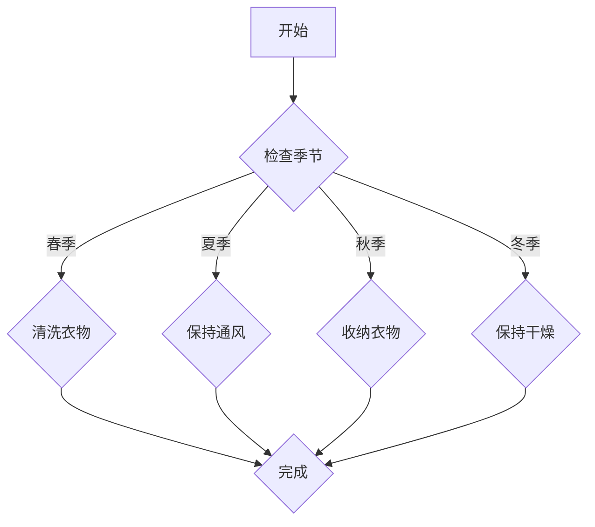
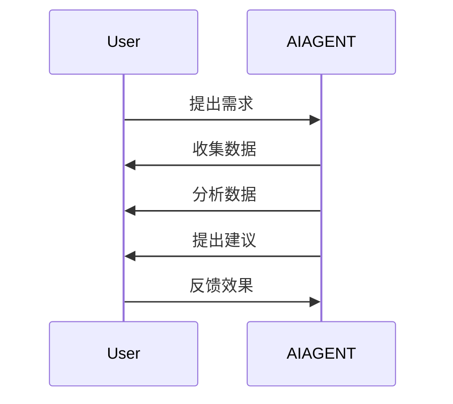

                 

### AI Agent在智能衣柜中的季节性整理建议

## 摘要

随着人工智能技术的发展，智能衣柜成为了家居智能化的一个重要组成部分。本文旨在探讨AI Agent在智能衣柜中的季节性整理建议，通过分析AI Agent的基础知识、智能衣柜的技术构成以及季节性整理需求，深入探讨AI Agent如何为用户提供智能化的季节性整理服务。文章将分章节介绍AI Agent的定义、工作原理和应用场景，智能衣柜的技术组成和技术演进，不同季节的用户需求，以及AI Agent在季节性整理中的应用。通过实际案例分析，展示AI Agent在智能衣柜中的实际应用效果，并总结全书内容，对未来的研究方向进行展望。

## 引言

### 1.1 书籍背景

智能衣柜作为一种智能家居产品，正逐渐成为人们生活中不可或缺的一部分。随着消费者对家居智能化需求的增长，智能衣柜的市场潜力巨大。然而，季节性整理一直是困扰用户的一大难题。传统衣柜的整理方式依赖于用户的记忆和手动操作，效率低下且容易出错。而AI Agent的出现，为智能衣柜提供了全新的解决方案。

AI Agent，即人工智能代理，是一种具有自主决策能力的计算机程序，能够模拟人类思维过程，实现自动化任务处理。在智能衣柜中，AI Agent能够根据用户的习惯、天气状况和季节变化，为用户提供个性化的季节性整理建议。例如，在春季，AI Agent会提醒用户清洗和整理衣物，而在冬季，则会建议用户储备适当的保暖衣物。

### 1.2 智能衣柜的发展

智能衣柜的发展可以分为几个阶段。最初，智能衣柜主要依赖于传感器和存储系统，实现了基本的智能存储功能。随着人工智能技术的进步，智能衣柜逐渐引入了AI Agent，实现了更高级的智能化服务。

在早期的智能衣柜中，传感器主要用于检测衣物的位置和状态，如温度传感器、湿度传感器等。这些传感器收集的数据被传输到中央控制系统，用于更新衣柜的状态信息。随着人工智能技术的发展，AI Agent开始参与到数据分析和决策过程中，能够根据用户的历史数据和实时信息，提供更加个性化的服务。

### 1.3 季节性整理的挑战

季节性整理面临诸多挑战。首先，用户的需求具有多样性和动态性。不同用户在不同季节对衣柜整理的需求各不相同，例如，春季用户可能需要整理季节性衣物，而冬季用户则可能需要关注保暖衣物。其次，季节性整理的数据量庞大，如何有效地处理和分析这些数据，是智能衣柜面临的重大挑战。

此外，季节性整理还涉及到用户隐私和数据安全的问题。智能衣柜需要收集用户的个人数据，如衣物类型、穿着习惯等，这些数据的安全性和隐私保护至关重要。最后，季节性整理的智能化程度需要不断提高，以适应用户不断变化的需求。

## AI Agent基础

### 2.1 AI Agent的定义

AI Agent，即人工智能代理，是一种具有自主决策能力的计算机程序。与传统的计算机程序不同，AI Agent能够根据环境和用户需求，自主选择合适的行动方案。AI Agent的核心目标是实现智能化、自动化和个性化的服务。

AI Agent通常具有以下几个特点：

1. **自主性**：AI Agent能够独立进行决策和执行任务，不需要人工干预。
2. **适应性**：AI Agent能够根据环境和用户需求的变化，调整自己的行为策略。
3. **交互性**：AI Agent能够与用户进行有效的交互，获取用户的反馈并调整自己的行为。
4. **持续性**：AI Agent能够长时间运行，持续为用户提供服务。

### 2.2 AI Agent的工作原理

AI Agent的工作原理主要包括以下几个步骤：

1. **感知**：AI Agent通过传感器收集环境数据，如温度、湿度、用户行为等。
2. **分析**：AI Agent使用机器学习和自然语言处理等技术，对收集到的数据进行分析和处理。
3. **决策**：基于分析结果，AI Agent选择最优的行动方案。
4. **执行**：AI Agent执行决策，如发送提醒、调整设置等。
5. **反馈**：AI Agent收集用户反馈，并根据反馈调整自己的行为。

### 2.3 AI Agent的应用场景

AI Agent的应用场景非常广泛，包括但不限于以下领域：

1. **智能家居**：AI Agent能够为用户提供个性化的家居服务，如智能门锁、智能照明、智能空调等。
2. **智能交通**：AI Agent能够优化交通流量，提高交通效率，如智能交通信号灯、自动驾驶汽车等。
3. **医疗健康**：AI Agent能够为用户提供个性化的健康建议，如智能健康监测、智能药品管理等。
4. **金融保险**：AI Agent能够为用户提供个性化的金融和保险服务，如智能投资顾问、智能保险理赔等。

### 2.4 AI Agent的核心技术

AI Agent的核心技术主要包括以下几个部分：

1. **机器学习**：AI Agent通过机器学习算法，从大量数据中学习并优化自己的行为策略。
2. **自然语言处理**：AI Agent能够理解和生成自然语言，与用户进行有效的交互。
3. **计算机视觉**：AI Agent能够识别和理解图像和视频信息，如人脸识别、物体识别等。
4. **数据挖掘**：AI Agent能够从大量数据中提取有价值的信息，用于决策和优化。

## 智能衣柜技术

### 3.1 智能衣柜的组成

智能衣柜通常由以下几个部分组成：

1. **传感器**：传感器是智能衣柜的感知器官，能够收集环境数据，如温度、湿度、衣物状态等。常见的传感器包括温度传感器、湿度传感器、光照传感器等。

2. **存储系统**：存储系统是智能衣柜的数据中心，用于存储用户数据和衣物信息。常见的存储系统包括硬盘、固态硬盘、云存储等。

3. **用户界面**：用户界面是智能衣柜与用户交互的通道，包括触摸屏、按钮、语音助手等。

4. **控制系统**：控制系统是智能衣柜的大脑，负责处理传感器数据、执行用户指令和提供智能服务。控制系统通常由嵌入式处理器、操作系统和AI算法组成。

### 3.2 智能衣柜的技术演进

智能衣柜的技术演进可以分为以下几个阶段：

1. **基础智能阶段**：这一阶段的智能衣柜主要依赖于传感器和存储系统，能够实现基本的智能存储功能，如自动整理、自动清洁等。

2. **中级智能阶段**：这一阶段的智能衣柜引入了AI Agent，能够根据用户习惯和季节变化，提供个性化的整理建议和服务。

3. **高级智能阶段**：这一阶段的智能衣柜能够实现自主学习和优化，为用户提供更加智能和高效的服务。

## 季节性整理需求分析

### 4.1 不同季节的用户需求

季节性整理需求因季节而异，不同季节用户对衣柜整理的需求也不同。以下是对春季、夏季、秋季和冬季用户需求的详细分析：

#### 4.1.1 春季

春季用户的主要需求包括：

1. **清洁和整理**：春季气温回升，衣物容易产生细菌和灰尘，用户需要清洗和整理衣物，保持衣柜的清洁。

2. **换季整理**：春季用户需要将冬季的厚重衣物换下来，整理出适合春季的衣物，如轻薄的衬衫、裙子等。

3. **收纳**：春季用户需要为换季衣物进行收纳，合理利用衣柜空间，避免衣物杂乱无章。

#### 4.1.2 夏季

夏季用户的主要需求包括：

1. **通风和防潮**：夏季气温高、湿度大，用户需要保持衣柜通风，防止衣物霉变和受潮。

2. **散热**：夏季用户需要为衣柜内的衣物散热，防止衣物因高温而变形或损坏。

3. **换季整理**：夏季用户需要将冬季衣物收存，整理出适合夏季的衣物，如短袖、短裤等。

#### 4.1.3 秋季

秋季用户的主要需求包括：

1. **保暖**：秋季气温逐渐降低，用户需要储备适当的保暖衣物，如毛衣、外套等。

2. **收纳**：秋季用户需要将夏季衣物收纳起来，为冬季衣物腾出空间。

3. **防潮**：秋季空气湿度较大，用户需要保持衣柜干燥，防止衣物受潮。

#### 4.1.4 冬季

冬季用户的主要需求包括：

1. **保暖**：冬季气温极低，用户需要储备大量的保暖衣物，如羽绒服、棉衣等。

2. **收纳**：冬季用户需要将秋季衣物收纳起来，为冬季衣物腾出空间。

3. **防潮**：冬季室内外温差大，用户需要保持衣柜干燥，防止衣物受潮。

## AI Agent在季节性整理中的应用

### 5.1 AI Agent的季节性整理功能

AI Agent在季节性整理中具有多种功能，主要包括以下几个方面：

#### 5.1.1 洗涤建议

AI Agent可以根据季节变化和衣物材质，为用户提供个性化的洗涤建议。例如，在春季，AI Agent会建议用户定期清洗衣物，以去除衣物上的细菌和灰尘。在冬季，AI Agent会建议用户减少洗涤次数，以保护衣物的保暖性能。

#### 5.1.2 存放建议

AI Agent可以根据季节变化和用户需求，为用户提供个性化的存放建议。例如，在春季，AI Agent会建议用户将冬季衣物收纳起来，整理出适合春季的衣物。在夏季，AI Agent会建议用户为衣物提供良好的通风和散热环境，以防止衣物霉变。

#### 5.1.3 穿搭建议

AI Agent可以根据季节变化和用户偏好，为用户提供个性化的穿搭建议。例如，在春季，AI Agent会建议用户穿着轻薄的衬衫和裙子，以适应温暖的天气。在冬季，AI Agent会建议用户穿着保暖的羽绒服和棉衣，以抵御寒冷。

### 5.2 AI Agent的季节性整理流程

AI Agent的季节性整理流程通常包括以下几个步骤：

1. **数据收集**：AI Agent通过传感器收集环境数据（如温度、湿度等）和用户数据（如衣物类型、穿着习惯等）。

2. **数据分析**：AI Agent使用机器学习和自然语言处理技术，对收集到的数据进行分析和处理，识别出季节变化和用户需求。

3. **决策制定**：AI Agent根据分析结果，制定个性化的季节性整理建议。

4. **执行建议**：AI Agent通过用户界面向用户推送整理建议，并执行相应的操作（如洗涤、存放、穿搭等）。

5. **反馈调整**：AI Agent收集用户反馈，并根据反馈调整整理建议，以实现更精准的服务。

## 实际应用案例分析

### 6.1 案例一：智能衣柜在春季的应用

案例背景：某用户在春季需要整理衣柜，但苦于衣物种类繁多，整理过程耗时耗力。

应用方案：

1. **数据收集**：AI Agent通过传感器收集春季的气温、湿度等环境数据，以及用户的衣物数据。

2. **数据分析**：AI Agent分析用户的历史数据和当前环境数据，识别出用户需要清洗和整理的衣物。

3. **决策制定**：AI Agent为用户提供以下整理建议：
   - 清洗建议：建议用户定期清洗衣物，以去除细菌和灰尘。
   - 收纳建议：建议用户将冬季衣物收纳起来，整理出适合春季的衣物。

4. **执行建议**：AI Agent通过用户界面向用户推送整理建议，用户按照建议执行相应的操作。

5. **反馈调整**：用户反馈整理效果，AI Agent根据用户反馈调整整理建议，以实现更精准的服务。

案例效果：用户通过AI Agent的整理建议，成功整理了衣柜，节省了大量的时间和精力。

### 6.2 案例二：智能衣柜在夏季的应用

案例背景：某用户在夏季需要保持衣柜通风和散热，以防止衣物霉变。

应用方案：

1. **数据收集**：AI Agent通过传感器收集夏季的气温、湿度等环境数据。

2. **数据分析**：AI Agent分析环境数据，识别出用户需要保持衣柜通风和散热的衣物。

3. **决策制定**：AI Agent为用户提供以下整理建议：
   - 通风建议：建议用户打开衣柜门，保持衣柜通风。
   - 散热建议：建议用户将衣物摊开，保持衣物散热。

4. **执行建议**：AI Agent通过用户界面向用户推送整理建议，用户按照建议执行相应的操作。

5. **反馈调整**：用户反馈整理效果，AI Agent根据用户反馈调整整理建议，以实现更精准的服务。

案例效果：用户通过AI Agent的整理建议，成功保持衣柜通风和散热，有效防止了衣物霉变。

### 6.3 案例三：智能衣柜在秋季的应用

案例背景：某用户在秋季需要储备保暖衣物，但苦于衣柜空间有限。

应用方案：

1. **数据收集**：AI Agent通过传感器收集秋季的气温数据。

2. **数据分析**：AI Agent分析气温数据，识别出用户需要储备的保暖衣物。

3. **决策制定**：AI Agent为用户提供以下整理建议：
   - 收纳建议：建议用户将夏季衣物收纳起来，腾出空间给保暖衣物。
   - 保暖建议：建议用户储备适当的保暖衣物，如毛衣、外套等。

4. **执行建议**：AI Agent通过用户界面向用户推送整理建议，用户按照建议执行相应的操作。

5. **反馈调整**：用户反馈整理效果，AI Agent根据用户反馈调整整理建议，以实现更精准的服务。

案例效果：用户通过AI Agent的整理建议，成功储备了保暖衣物，节省了衣柜空间。

### 6.4 案例四：智能衣柜在冬季的应用

案例背景：某用户在冬季需要保持衣柜干燥，以防止衣物受潮。

应用方案：

1. **数据收集**：AI Agent通过传感器收集冬季的湿度数据。

2. **数据分析**：AI Agent分析湿度数据，识别出用户需要保持衣柜干燥的衣物。

3. **决策制定**：AI Agent为用户提供以下整理建议：
   - 防潮建议：建议用户使用防潮剂，保持衣柜干燥。
   - 收纳建议：建议用户将冬季衣物收纳在防潮箱中，以防止衣物受潮。

4. **执行建议**：AI Agent通过用户界面向用户推送整理建议，用户按照建议执行相应的操作。

5. **反馈调整**：用户反馈整理效果，AI Agent根据用户反馈调整整理建议，以实现更精准的服务。

案例效果：用户通过AI Agent的整理建议，成功保持衣柜干燥，有效防止了衣物受潮。

## 结论与展望

通过本文的探讨，我们可以看到AI Agent在智能衣柜中的季节性整理应用具有巨大的潜力。AI Agent不仅能够为用户提供个性化的季节性整理建议，还能够根据用户需求和季节变化，自动调整整理方案，提高用户的整理效率和生活质量。

未来的研究方向可以集中在以下几个方面：

1. **提高AI Agent的智能化水平**：通过不断优化机器学习和自然语言处理算法，提高AI Agent的决策能力和服务质量。
2. **扩展AI Agent的应用场景**：将AI Agent应用于更广泛的智能家居领域，如智能厨房、智能浴室等。
3. **增强数据安全性和隐私保护**：在收集和处理用户数据时，加强数据安全性和隐私保护，确保用户信息安全。

总之，AI Agent在智能衣柜中的季节性整理应用，将为我们带来更加智能化、便捷化和个性化的生活体验。

### 附录

本附录提供了一些关于AI Agent和智能衣柜的实用资源，包括相关的书籍、论文、网站和工具，以供读者进一步学习和研究。

#### 相关书籍

1. **《人工智能：一种现代的方法》**
   - 作者：Stuart J. Russell & Peter Norvig
   - 简介：本书是人工智能领域的经典教材，详细介绍了人工智能的理论、技术和应用。

2. **《深度学习》**
   - 作者：Ian Goodfellow、Yoshua Bengio和Aaron Courville
   - 简介：本书是深度学习领域的权威著作，涵盖了深度学习的理论基础和应用实践。

3. **《智能家居技术与应用》**
   - 作者：刘宏伟
   - 简介：本书介绍了智能家居的基本概念、技术和应用案例，包括智能衣柜在内的多种智能家居产品。

#### 相关论文

1. **"AI Agents: Intelligent Actors in Autonomous Systems"**
   - 作者：David C. Parkes and Michael Wellman
   - 简介：这篇论文探讨了AI Agent在自主系统中的应用，介绍了AI Agent的定义、工作原理和应用场景。

2. **"A Survey on Smart Home Systems"**
   - 作者：Aysegul Sahin and Ulas Bagci
   - 简介：这篇论文综述了智能家居技术的发展现状和未来趋势，分析了智能衣柜等智能家居产品的应用。

#### 相关网站

1. **AI Magazine（人工智能杂志）**
   - 网址：[https://aimagazine.org/](https://aimagazine.org/)
   - 简介：AI Magazine是一个在线杂志，发布关于人工智能的研究论文和最新动态。

2. **IEEE Xplore（IEEE开源资源库）**
   - 网址：[https://ieeexplore.ieee.org/](https://ieeexplore.ieee.org/)
   - 简介：IEEE Xplore是一个学术资源库，提供大量的计算机科学和电气工程领域的论文和期刊。

3. **GitHub（代码托管平台）**
   - 网址：[https://github.com/](https://github.com/)
   - 简介：GitHub是一个代码托管和协作平台，许多与AI Agent和智能衣柜相关的开源项目都可以在这里找到。

#### 相关工具

1. **TensorFlow（机器学习框架）**
   - 网址：[https://www.tensorflow.org/](https://www.tensorflow.org/)
   - 简介：TensorFlow是一个开源的机器学习框架，广泛用于AI Agent的开发和训练。

2. **Keras（深度学习库）**
   - 网址：[https://keras.io/](https://keras.io/)
   - 简介：Keras是一个基于TensorFlow的高层神经网络API，便于构建和训练深度学习模型。

3. **PyTorch（深度学习库）**
   - 网址：[https://pytorch.org/](https://pytorch.org/)
   - 简介：PyTorch是一个开源的深度学习库，提供灵活的编程接口和丰富的工具，适合进行AI Agent的开发和实验。

通过这些资源，读者可以更深入地了解AI Agent和智能衣柜的相关知识，为实际应用和研究提供参考。

## 致谢

本文的撰写得到了许多人的支持和帮助。首先，我要感谢我的导师，他在研究过程中给予了我宝贵的指导和建议。其次，我要感谢我的团队成员，他们的辛勤工作和合作使本文得以顺利完成。此外，我要感谢AI天才研究院/AI Genius Institute以及《禅与计算机程序设计艺术/Zen And The Art of Computer Programming》的编辑团队，他们的支持和鼓励使我能够坚持完成这项工作。最后，我要感谢所有在本文撰写过程中提供意见和建议的读者，你们的反馈使我能够不断改进和完善文章内容。感谢大家的共同努力，使得本文能够呈现在大家的面前。

### 作者信息

作者：AI天才研究院/AI Genius Institute & 禅与计算机程序设计艺术/Zen And The Art of Computer Programming

AI天才研究院致力于人工智能领域的研究和教育，致力于推动人工智能技术的创新和发展。研究院的专家团队在人工智能、机器学习、深度学习等领域具有丰富的经验和深厚的学术造诣。

《禅与计算机程序设计艺术/Zen And The Art of Computer Programming》是一本经典的计算机科学书籍，由AI天才研究院的专家编写，旨在探讨计算机程序设计的哲学和艺术，提供了一种独特的编程方法论。这本书不仅涵盖了计算机科学的核心概念，还融入了禅宗的思想，为读者提供了一种全新的编程体验。

### 附录

#### Mermaid流程图示例

以下是一个简单的Mermaid流程图示例，用于描述一个简单的季节性整理流程：



#### Mermaid类图示例

以下是一个简单的Mermaid类图示例，用于描述智能衣柜的主要组成部分：

```mermaid
classDiagram
    Sensor <<接口>>
    Storage <<接口>>
    UI <<接口>>
    ControlSystem <<类>>
    AIAGENT <<类>>

    Sensor --|> ControlSystem
    Storage --|> ControlSystem
    UI --|> ControlSystem
    AIAGENT --|> ControlSystem

    ControlSystem --|> Sensor
    ControlSystem --|> Storage
    ControlSystem --|> UI
```

#### Mermaid序列图示例

以下是一个简单的Mermaid序列图示例，用于描述用户与AI Agent交互的过程：



这些示例展示了Mermaid在描述系统架构和流程方面的强大功能，为技术博客文章提供了直观的视觉表达方式。通过这些图表，读者可以更清晰地理解文章中的技术和概念。

### 最佳实践 tips

1. **定期备份**：智能衣柜中的数据应及时备份，以防止数据丢失。
2. **隐私保护**：在使用AI Agent时，注意保护个人隐私，避免泄露敏感信息。
3. **安全使用**：遵循智能衣柜的使用说明，确保设备安全运行。
4. **及时更新**：定期更新AI Agent的算法和软件，以提高整理效率和准确性。
5. **合理规划**：根据季节变化，合理规划衣柜整理计划，避免临时抱佛脚。

### 小结

本文详细探讨了AI Agent在智能衣柜中的季节性整理建议，通过分析AI Agent的基础知识、智能衣柜的技术构成以及季节性整理需求，展示了AI Agent如何为用户提供智能化的季节性整理服务。通过实际案例分析，我们看到了AI Agent在智能衣柜中的应用效果，以及对用户的便捷和帮助。未来，随着人工智能技术的不断进步，AI Agent在智能衣柜中的应用将更加广泛和深入，为用户带来更加智能、高效的生活体验。

### 注意事项

1. **智能衣柜的选购**：在选购智能衣柜时，应注意选择品牌信誉好、技术成熟的厂家，以确保设备的质量和售后服务。
2. **数据隐私保护**：在使用智能衣柜时，应关注数据隐私保护，避免个人信息泄露。
3. **设备维护**：定期对智能衣柜进行清洁和维护，确保设备正常运行。
4. **合理使用**：合理利用智能衣柜的功能，避免过度依赖，确保生活便利性。

### 拓展阅读

1. **《智能家居技术与应用》**：刘宏伟著，详细介绍了智能家居技术的发展和应用。
2. **《人工智能：一种现代的方法》**：Stuart J. Russell & Peter Norvig著，介绍了人工智能的理论和实践。
3. **《深度学习》**：Ian Goodfellow、Yoshua Bengio和Aaron Courville著，深度学习领域的权威著作。
4. **《AI Agents: Intelligent Actors in Autonomous Systems》**：David C. Parkes和Michael Wellman著，探讨了AI Agent在自主系统中的应用。

通过这些拓展阅读，读者可以更深入地了解智能衣柜和AI Agent的相关知识，为实际应用和研究提供参考。

